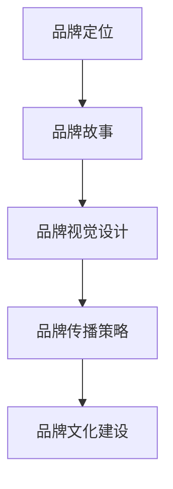
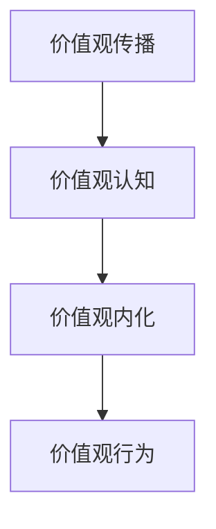
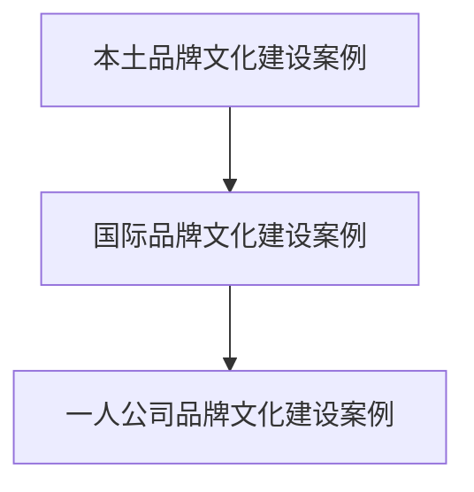
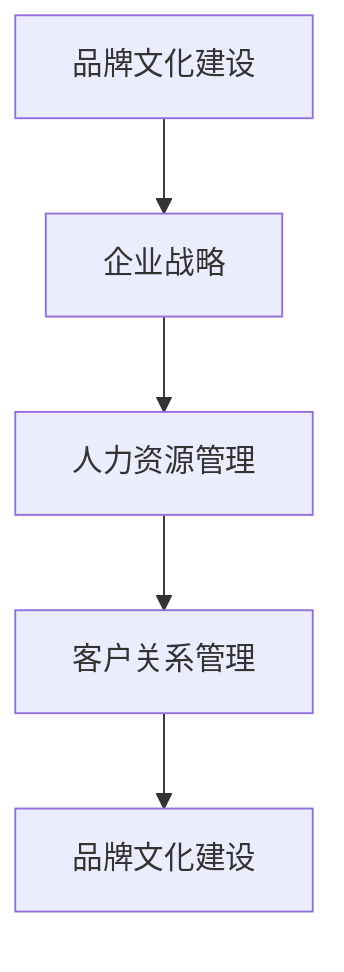
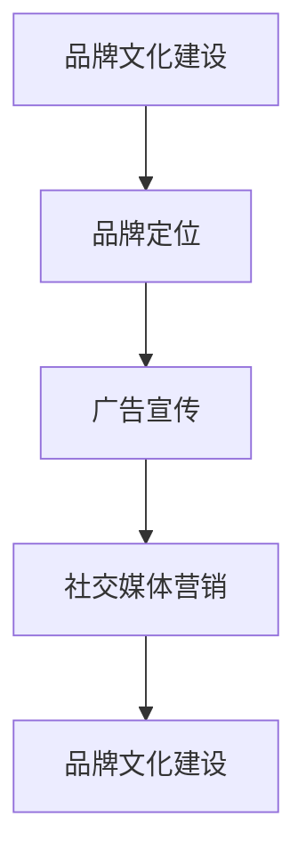
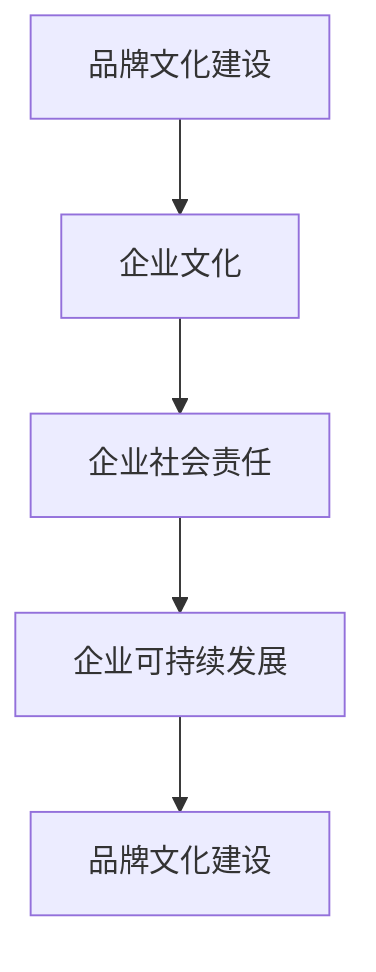

                 

## 《一人公司的品牌文化建设与价值观传播》

### 关键词：品牌文化、价值观传播、一人公司、品牌建设策略、企业文化

> **摘要：** 本文将深入探讨一人公司在品牌文化建设与价值观传播方面的实践与策略。文章首先概述了品牌与品牌文化的概念及其在企业中的作用，接着分析了价值观传播的重要性与策略。通过案例分析，本文详细描述了本土与国际品牌文化建设的实践，并重点解析了如何在一人公司中构建与传播品牌文化。最后，文章探讨了品牌文化在实践中的应用，提出了一人公司品牌文化建设的未来发展方向和改进建议。

### 第一部分：品牌文化建设基础

#### 第1章：品牌与品牌文化

**1.1 品牌的定义与功能**

品牌，作为一个企业的标识，不仅仅是一个名称、符号或设计，它承载了企业的声誉、文化和价值观。品牌的基本概念包括以下几个方面：

- **名称**：品牌的核心元素，用于区分产品和服务的独特标识。
- **标志**：包括图形、符号和标志语，是品牌视觉识别的重要组成部分。
- **定位**：品牌在市场中的定位，包括目标市场和核心竞争力的确定。
- **价值观**：品牌所倡导的核心信念和价值取向。

品牌的功能主要体现在以下几个方面：

- **识别功能**：品牌帮助消费者识别和选择特定的产品或服务。
- **差异化功能**：品牌通过独特的形象和特色，使企业在竞争激烈的市场中脱颖而出。
- **附加价值功能**：品牌可以提升产品或服务的附加值，从而提高消费者的购买意愿。

**1.2 品牌文化概述**

品牌文化是品牌在发展过程中形成的文化现象，它反映了企业的价值观、信念和行为方式。品牌文化的定义可以从以下几个方面来理解：

- **品牌价值观**：品牌所秉持的核心信念和价值观，如诚信、创新、责任等。
- **品牌行为**：品牌在日常运营中的行为表现，包括员工行为、客户服务、市场营销等。
- **品牌形象**：品牌在公众心目中的形象和认知，包括品牌声誉和品牌个性。

品牌文化的重要性在于：

- **塑造品牌形象**：品牌文化有助于塑造独特的品牌形象，提高品牌的认知度和美誉度。
- **增强品牌忠诚度**：品牌文化可以培养消费者的忠诚度，使消费者对品牌产生情感依赖。
- **提升企业竞争力**：品牌文化是企业核心竞争力的重要组成部分，有助于企业在竞争中取得优势。

品牌文化的核心要素包括：

- **核心价值观**：品牌文化的核心，是品牌所有行为和决策的指导原则。
- **品牌精神**：品牌文化的灵魂，反映了品牌的理念和精神追求。
- **品牌信仰**：品牌文化的信仰体系，是员工和消费者共同遵循的价值观和行为准则。

**1.3 品牌文化构建步骤**

构建品牌文化是一个系统工程，需要从以下几个方面入手：

- **品牌定位**：明确品牌的市场定位和目标受众，为品牌文化的构建提供方向。
- **品牌故事**：打造品牌故事，通过故事传递品牌的核心价值观和品牌精神。
- **品牌视觉设计**：设计符合品牌形象的视觉元素，包括标志、颜色、字体等。
- **品牌传播策略**：制定品牌传播策略，通过多种渠道和手段传递品牌文化。

**1.3.1 品牌定位**

品牌定位是品牌文化构建的第一步，它决定了品牌的市场定位和目标受众。品牌定位需要明确以下几个关键问题：

- **目标市场**：品牌服务的市场范围和目标客户群体。
- **竞争优势**：品牌在市场上独特的竞争力和差异化优势。
- **品牌价值主张**：品牌向消费者传递的价值主张和独特卖点。

**1.3.2 品牌故事**

品牌故事是品牌文化的核心，它通过讲述品牌的历史、愿景和使命，传递品牌的核心价值观和品牌精神。一个成功的品牌故事应具备以下特点：

- **真实性**：品牌故事应真实反映品牌的历史和发展过程。
- **情感性**：品牌故事应触动消费者的情感，引发共鸣。
- **教育性**：品牌故事应传递品牌的理念和价值观，对消费者产生教育作用。

**1.3.3 品牌视觉设计**

品牌视觉设计是品牌文化的外在表现，它通过视觉元素传达品牌的核心价值观和品牌形象。品牌视觉设计应遵循以下原则：

- **一致性**：品牌视觉设计应与品牌定位和品牌故事相一致，形成统一的视觉风格。
- **独特性**：品牌视觉设计应具有独特性，避免与其他品牌混淆。
- **易记性**：品牌视觉设计应简洁、易记，使消费者能够迅速识别品牌。

**1.3.4 品牌传播策略**

品牌传播策略是品牌文化构建的重要环节，它决定了品牌文化如何传递给目标受众。品牌传播策略应包括以下几个方面：

- **传播渠道**：选择合适的传播渠道，如社交媒体、广告、公关活动等。
- **传播内容**：设计有针对性的传播内容，传递品牌的核心价值观和品牌故事。
- **传播方式**：采用多样化的传播方式，如文字、图片、视频等，提高传播效果。

#### 第2章：价值观传播概述

**2.1 价值观的定义与作用**

价值观是指个体或集体对事物的评价标准和行为准则。在企业中，价值观的定义和作用主要体现在以下几个方面：

- **价值观的概念**：价值观是企业在长期经营过程中形成的核心信念和指导原则，它反映了企业的文化特质和企业精神。
- **价值观的作用机制**：价值观在企业中发挥着重要的导向和约束作用，它指导员工的行为，塑造企业文化，推动企业的发展。

在企业中，价值观的作用主要表现在以下几个方面：

- **指导员工行为**：价值观为员工提供了行为准则，使员工在企业内部的行为更加规范和统一。
- **塑造企业文化**：价值观是企业文化的重要组成部分，它通过渗透到企业的方方面面，塑造出独特的企业文化。
- **推动企业发展**：价值观是企业发展的内在动力，它有助于企业实现长期稳定的发展。

**2.2 价值观传播策略**

价值观传播是企业将核心价值观传递给员工和外部利益相关者的过程。一个有效的价值观传播策略应包括以下几个方面：

- **传播目标**：明确价值观传播的目标，如提升员工对企业价值观的认同度、增强企业文化凝聚力等。
- **传播途径**：选择合适的传播途径，如内部培训、员工互动、外部宣传等。
- **传播方法**：采用多样化的传播方法，如故事分享、文化体验、行为激励等。

**2.2.1 价值观传播的目标**

价值观传播的目标主要包括以下几个方面：

- **提升员工认同度**：通过价值观传播，使员工深刻理解并认同企业的核心价值观，从而增强员工的归属感和责任感。
- **增强企业文化凝聚力**：价值观传播有助于构建企业共同的文化认同，增强企业的凝聚力，促进企业的和谐发展。
- **塑造企业品牌形象**：通过价值观传播，企业可以向社会传递积极的品牌形象，提升企业的市场竞争力。

**2.2.2 价值观传播的途径**

价值观传播的途径主要包括以下几个方面：

- **内部培训**：通过内部培训，使员工深入了解企业价值观的内涵和重要性，提高员工对企业价值观的认同度。
- **员工互动**：通过员工互动，如团队建设活动、内部交流会等，促进员工之间的沟通与交流，增强对企业价值观的理解和认同。
- **外部宣传**：通过外部宣传，如媒体报道、公关活动等，向社会传递企业价值观，提升企业的社会形象和品牌价值。

**2.2.3 价值观传播的方法**

价值观传播的方法主要包括以下几个方面：

- **故事分享**：通过分享企业核心价值观的生动故事，使员工在情感上产生共鸣，从而加深对企业价值观的理解和认同。
- **文化体验**：通过文化体验活动，如企业文化节、企业庆典等，使员工亲身体验企业价值观的内涵，增强对企业价值观的认同感。
- **行为激励**：通过行为激励，如表彰活动、奖励机制等，鼓励员工践行企业价值观，提升企业文化的执行力。

**2.3 价值观传播案例解析**

**2.3.1 国内知名企业价值观传播案例**

国内知名企业如华为、阿里巴巴等，在价值观传播方面有着丰富的实践和经验。以下是对这些企业价值观传播案例的解析：

- **华为**：华为的价值观包括“客户至上、诚信、创新、团队合作”等。华为通过内部培训、员工互动、外部宣传等多种途径，传播企业价值观。例如，华为定期举办企业文化活动，如企业文化节、员工运动会等，使员工在活动中深刻体验企业价值观。
- **阿里巴巴**：阿里巴巴的价值观包括“客户第一、员工第二、股东第三”等。阿里巴巴通过内部培训、员工互动、外部宣传等方式，传播企业价值观。例如，阿里巴巴定期举办“员工故事会”，通过员工讲述自己在工作中的经历和感悟，传递企业价值观。

**2.3.2 国际企业价值观传播案例**

国际企业如谷歌、微软等，也在价值观传播方面有着成功的经验。以下是对这些企业价值观传播案例的解析：

- **谷歌**：谷歌的价值观包括“不作恶、创新、快速执行、多元化与包容”等。谷歌通过内部培训、员工互动、外部宣传等多种途径，传播企业价值观。例如，谷歌定期举办“谷歌价值观周”，通过一系列活动，使员工深入理解和践行企业价值观。
- **微软**：微软的价值观包括“以客户为中心、持续创新、尊重个人与团队、诚信与责任”等。微软通过内部培训、员工互动、外部宣传等方式，传播企业价值观。例如，微软定期举办“价值观大会”，通过演讲、讨论等形式，使员工深入理解企业价值观。

通过以上案例可以看出，无论是国内还是国际企业，在价值观传播方面都注重多种途径的综合运用，通过内部培训和员工互动，使员工深入理解和践行企业价值观；通过外部宣传，向社会传递企业价值观，提升企业的品牌形象和社会影响力。

#### 第3章：品牌文化建设案例分析

**3.1 本土品牌文化建设**

本土品牌在品牌文化建设方面具有独特的优势，它们能够深刻理解本土市场和文化，从而构建出具有强大竞争力的品牌文化。以下是对几个本土品牌文化建设的案例分析：

**3.1.1 苹果（Apple）**

苹果作为全球领先的科技企业，其品牌文化以创新、简洁和用户体验为核心。苹果的品牌文化构建过程主要包括以下几个方面：

- **品牌定位**：苹果定位为高端科技品牌，专注于提供高品质、高性能的产品和服务。
- **品牌故事**：苹果品牌故事始于史蒂夫·乔布斯，他以其独特的创新思维和对用户体验的极致追求，塑造了苹果的品牌形象。
- **品牌视觉设计**：苹果的品牌视觉设计以简洁、时尚和统一的风格著称，其标志和广告风格在全球范围内具有极高的辨识度。
- **品牌传播策略**：苹果通过新品发布会、广告宣传和用户社区等多种渠道，传递品牌文化，增强品牌影响力。

苹果的品牌文化建设使其在全球市场上取得了巨大的成功，其品牌价值和市场份额持续增长。

**3.1.2 耐克（Nike）**

耐克作为全球知名的运动品牌，其品牌文化以“Just Do It”为核心。耐克的品牌文化构建过程主要包括以下几个方面：

- **品牌定位**：耐克定位为运动时尚品牌，致力于为消费者提供创新、高品质的运动产品。
- **品牌故事**：耐克品牌故事源于创始人菲尔·奈特和他的跑步梦想，这个故事激励了无数运动员和消费者。
- **品牌视觉设计**：耐克的品牌视觉设计以简洁、鲜明和充满活力的风格著称，其标志和广告语在全球范围内广受欢迎。
- **品牌传播策略**：耐克通过赞助顶级运动赛事、广告宣传和社交媒体互动等多种渠道，传递品牌文化，增强品牌影响力。

耐克的品牌文化建设不仅推动了企业的持续增长，还成为了运动文化的代表，其品牌价值观深深地影响了全球的消费者。

**3.1.3 美团（Meituan）**

美团作为中国的本地生活服务巨头，其品牌文化以“为人民服务”为核心。美团的品牌文化构建过程主要包括以下几个方面：

- **品牌定位**：美团定位为本地生活服务平台，致力于为用户提供便捷、高效的生活服务。
- **品牌故事**：美团品牌故事始于团购业务，这个故事展示了美团从一家初创公司成长为行业巨头的历程。
- **品牌视觉设计**：美团的品牌视觉设计以简洁、实用和亲切的风格著称，其标志和广告风格深受用户喜爱。
- **品牌传播策略**：美团通过广告宣传、用户互动和社区活动等多种渠道，传递品牌文化，增强品牌影响力。

美团的品牌文化建设不仅提升了用户满意度，还增强了企业的社会责任感，其品牌价值观得到了广大用户的认可。

**3.2 国际品牌文化建设**

国际品牌在品牌文化建设方面具有全球视野和多元化优势，它们能够根据不同市场的需求和文化特点，构建出具有全球影响力的品牌文化。以下是对几个国际品牌文化建设的案例分析：

**3.2.1 谷歌（Google）**

谷歌作为全球最大的搜索引擎和科技公司，其品牌文化以创新、开放和多元为核心。谷歌的品牌文化构建过程主要包括以下几个方面：

- **品牌定位**：谷歌定位为科技创新的引领者，致力于提供高质量、创新性的产品和服务。
- **品牌故事**：谷歌品牌故事始于拉里·佩奇和谢尔盖·布林，他们的创业故事和创新精神塑造了谷歌的品牌形象。
- **品牌视觉设计**：谷歌的品牌视觉设计以简洁、清新和个性化的风格著称，其标志和广告风格在全球范围内广受欢迎。
- **品牌传播策略**：谷歌通过全球范围内的广告宣传、技术大会和社区活动等多种渠道，传递品牌文化，增强品牌影响力。

谷歌的品牌文化建设不仅使其在科技领域取得了巨大的成功，还推动了全球创新和科技发展，其品牌价值观对全球科技行业产生了深远的影响。

**3.2.2 脸书（Facebook）**

脸书作为全球最大的社交媒体平台，其品牌文化以用户至上、透明和开放为核心。脸书的品牌文化构建过程主要包括以下几个方面：

- **品牌定位**：脸书定位为连接全球用户的平台，致力于提供便捷、高效、安全的社交体验。
- **品牌故事**：脸书品牌故事始于扎克伯格和他的哈佛宿舍，这个故事展示了脸书从小型社交网站成长为全球巨头的过程。
- **品牌视觉设计**：脸书的品牌视觉设计以简洁、清晰和富有创意的风格著称，其标志和广告风格深受用户喜爱。
- **品牌传播策略**：脸书通过全球范围内的广告宣传、用户互动和社交媒体活动等多种渠道，传递品牌文化，增强品牌影响力。

脸书的品牌文化建设不仅提升了用户满意度，还增强了用户对品牌的信任和忠诚度，其品牌价值观在全球范围内得到了广泛的认可。

**3.2.3 亚马逊（Amazon）**

亚马逊作为全球最大的电子商务平台，其品牌文化以用户至上、创新和敏捷为核心。亚马逊的品牌文化构建过程主要包括以下几个方面：

- **品牌定位**：亚马逊定位为全球领先的电子商务平台，致力于为用户提供多样化、个性化的购物体验。
- **品牌故事**：亚马逊品牌故事始于杰夫·贝佐斯，他通过不断创新和拓展业务，将亚马逊打造成为全球电商巨头。
- **品牌视觉设计**：亚马逊的品牌视觉设计以简洁、实用和专业的风格著称，其标志和广告风格在全球范围内具有高度的辨识度。
- **品牌传播策略**：亚马逊通过全球范围内的广告宣传、用户互动和电子商务活动等多种渠道，传递品牌文化，增强品牌影响力。

亚马逊的品牌文化建设不仅推动了企业的持续增长，还成为了电子商务行业的标杆，其品牌价值观在全球范围内产生了深远的影响。

通过以上国际品牌文化建设的案例分析，我们可以看到，无论是谷歌、脸书还是亚马逊，它们都通过独特的品牌文化构建过程，在全球市场上取得了巨大的成功。这些品牌文化不仅增强了企业的竞争力，还塑造了独特的品牌形象，赢得了全球消费者的认可和信任。

#### 第3.3章：一人公司的品牌文化建设

**3.3.1 品牌定位与核心价值观**

一人公司是一家专注于个性化服务的科技公司，其品牌定位为“科技创新，以人为本”。一人公司以“客户至上、诚信、创新、责任”为核心价值观，致力于为用户提供高品质、个性化的产品和服务。

- **客户至上**：一人公司始终将客户需求放在首位，通过深入了解客户需求，提供定制化的解决方案，确保客户满意度。
- **诚信**：一人公司坚持诚信经营，以诚信赢得客户的信任和忠诚，树立良好的品牌形象。
- **创新**：一人公司注重科技创新，不断探索新技术、新方法，为客户提供创新、高效的产品和服务。
- **责任**：一人公司承担社会责任，积极参与社会公益活动，推动可持续发展，提升企业的社会价值。

**3.3.2 品牌文化构建策略**

为了构建独特的品牌文化，一人公司采取了以下策略：

- **品牌故事**：一人公司通过讲述品牌故事，传递核心价值观。品牌故事包括公司创始人的创业经历、发展历程以及对未来愿景的展望，使员工和客户能够深刻理解品牌文化。
- **品牌视觉设计**：一人公司的品牌视觉设计以简洁、现代和个性化为特点，其标志和广告风格独特，能够迅速引起客户的注意和共鸣。
- **品牌传播**：一人公司通过多种渠道传播品牌文化，包括官方网站、社交媒体、广告宣传等。公司定期举办品牌活动，如新品发布会、客户交流会等，加强与客户的互动，提升品牌影响力。

**3.3.3 品牌文化传播实践**

在一人公司，品牌文化传播实践贯穿于企业运营的方方面面：

- **员工培训**：一人公司定期举办品牌文化培训，使员工深入理解品牌价值观，并在日常工作中践行品牌文化。
- **内部沟通**：公司内部设立品牌文化沟通平台，鼓励员工分享品牌文化心得和体会，促进品牌文化的传播和认同。
- **客户互动**：一人公司通过客户满意度调查、客户访谈等方式，了解客户对品牌文化的感知和反馈，不断优化品牌文化传播策略。
- **社会公益活动**：一人公司积极参与社会公益活动，如捐赠、志愿者服务等，传递品牌文化，提升企业的社会形象。

**3.3.4 品牌文化建设成果**

一人公司通过品牌文化建设，取得了显著成果：

- **品牌知名度提升**：品牌文化建设使一人公司在市场上获得了更高的知名度，品牌形象得到了广泛认可。
- **客户满意度提高**：品牌文化传播使客户对一人公司的产品和服务满意度显著提升，客户忠诚度增强。
- **企业竞争力增强**：品牌文化建设增强了企业的核心竞争力，使一人公司在激烈的市场竞争中脱颖而出。

一人公司将继续深化品牌文化建设，不断提升品牌价值和市场竞争力，为客户创造更多价值。

#### 第三部分：品牌文化在实践中的应用

##### 第4章：品牌文化建设在企业决策中的应用

**4.1 品牌文化建设与企业战略**

品牌文化建设是企业战略的重要组成部分，它直接影响企业的长期发展和市场竞争力。品牌文化建设与企业战略的关系主要体现在以下几个方面：

- **战略指导品牌文化**：企业战略决定了品牌文化的方向和目标。企业应根据战略规划，明确品牌文化的核心价值和传播策略，以确保品牌文化与企业战略的一致性。
- **品牌文化反作用于战略**：品牌文化是企业核心竞争力的重要组成部分，它通过塑造企业形象、提升品牌价值和增强客户忠诚度，对企业战略实施产生重要影响。
- **品牌文化建设促进战略实施**：品牌文化建设可以增强企业内部凝聚力，激发员工创造力和创新精神，从而更好地支持企业战略的实施。

**4.2 品牌文化建设与人力资源管理**

品牌文化建设在人力资源管理中发挥着重要作用，它通过塑造企业文化和员工价值观，提升员工的工作满意度和忠诚度。品牌文化建设与人力资源管理的关系体现在以下几个方面：

- **品牌文化吸引人才**：具有独特品牌文化的企业能够吸引更多符合企业价值观的人才，为企业发展注入新的活力。
- **品牌文化塑造员工价值观**：通过品牌文化建设，企业可以塑造员工的价值观和行为规范，提高员工对企业的认同感和归属感。
- **品牌文化提升员工绩效**：品牌文化可以激发员工的工作热情和创新精神，提升员工的工作效率和工作质量，从而提高企业整体绩效。

**4.2.1 品牌文化建设在员工招聘与培养中的应用**

品牌文化建设在员工招聘与培养中具有以下应用：

- **招聘策略**：企业应将品牌文化作为招聘的核心标准，筛选符合品牌价值观的候选人，以确保新员工能够融入企业文化和价值观。
- **培训体系**：企业应建立完善的培训体系，通过品牌文化培训，使新员工快速了解和认同企业品牌文化，提升员工的专业素养和职业能力。

**4.2.2 品牌文化建设在员工激励与绩效管理中的应用**

品牌文化建设在员工激励与绩效管理中具有以下应用：

- **激励机制**：企业应将品牌文化融入激励机制，通过表彰活动、奖金奖励等方式，激励员工践行品牌价值观，提升员工的工作积极性和创造力。
- **绩效管理**：企业应将品牌价值观作为绩效评估的重要指标，通过公平、公正、公开的绩效管理体系，激发员工的潜力，提高员工的工作绩效。

**4.3 品牌文化建设与客户关系管理**

品牌文化建设在客户关系管理中具有重要作用，它通过塑造良好的品牌形象，提升客户满意度和忠诚度，从而促进客户关系的长期稳定。品牌文化建设与客户关系管理的关系体现在以下几个方面：

- **品牌形象塑造**：品牌文化建设有助于塑造企业的良好形象，提高客户对企业的认知度和信任度。
- **客户满意度提升**：品牌文化建设可以提升客户对企业的满意度和忠诚度，促进客户关系的深化。
- **客户关系维护**：品牌文化建设有助于企业建立和维护良好的客户关系，提高客户转换率和复购率。

**4.3.1 品牌文化建设在客户沟通与服务中的应用**

品牌文化建设在客户沟通与服务中具有以下应用：

- **客户沟通**：企业应将品牌文化融入客户沟通，通过个性化的沟通方式和内容，传递品牌价值观，增强客户对品牌的认同感。
- **客户服务**：企业应将品牌文化融入客户服务，通过优质的服务质量和客户体验，提升客户满意度，建立长期稳定的客户关系。

**4.3.2 品牌文化建设在客户关系维护与拓展中的应用**

品牌文化建设在客户关系维护与拓展中具有以下应用：

- **客户维护**：企业应通过持续的品牌文化建设，维护现有客户关系，提高客户满意度和忠诚度。
- **客户拓展**：企业应通过品牌文化的传播和推广，吸引新客户，扩大客户群体，实现客户关系的拓展和深化。

##### 第5章：品牌文化建设与市场营销

**5.1 品牌文化建设与品牌定位**

品牌文化建设与品牌定位密切相关，它们共同决定了品牌在市场中的地位和形象。品牌定位是品牌文化建设的起点，而品牌文化建设则是品牌定位的深化和实现。

- **品牌定位**：品牌定位是企业确定自己在市场中的位置和目标客户的过程，它决定了品牌的核心价值和特色。
- **品牌文化建设**：品牌文化建设是将品牌定位理念通过一系列的营销活动和文化传播，深入到消费者的心中，形成独特的品牌形象和认知。

**5.1.1 品牌定位的重要性**

品牌定位的重要性体现在以下几个方面：

- **区分竞争**：品牌定位帮助企业区分竞争对手，找到自己的独特卖点，使消费者能够清晰识别品牌的差异。
- **明确目标**：品牌定位明确企业的目标市场和目标客户，使营销策略更加精准有效。
- **塑造形象**：品牌定位通过塑造独特的品牌形象，提升品牌的市场地位和影响力。

**5.1.2 品牌文化建设对品牌定位的影响**

品牌文化建设对品牌定位的影响主要表现在以下几个方面：

- **强化定位**：品牌文化建设通过传递品牌的核心价值观和品牌故事，强化品牌定位，使品牌形象更加鲜明和深刻。
- **提升价值**：品牌文化建设可以提升品牌的附加值，使消费者对品牌产生更高的认同和忠诚。
- **差异化优势**：品牌文化建设有助于塑造品牌的差异化优势，使品牌在竞争激烈的市场中脱颖而出。

**5.2 品牌文化建设与广告宣传**

广告宣传是品牌文化建设的重要手段，它通过视觉和文字传达品牌的核心价值和品牌形象。品牌文化建设与广告宣传的关系主要体现在以下几个方面：

- **内容匹配**：品牌文化建设确保广告宣传的内容与品牌定位和品牌文化相匹配，形成统一的品牌传播形象。
- **情感共鸣**：品牌文化建设通过广告宣传传递品牌情感，与消费者建立情感连接，增强品牌的吸引力。
- **传播效果**：品牌文化建设提升广告宣传的传播效果，使品牌信息更加深入人心，提高广告的投资回报率。

**5.2.1 品牌文化建设在广告创意设计中的体现**

品牌文化建设在广告创意设计中具有以下体现：

- **品牌元素**：广告中融入品牌的核心元素，如标志、色彩、口号等，强化品牌识别度。
- **品牌故事**：广告通过讲述品牌故事，传递品牌的价值观和品牌精神，增强品牌的情感共鸣。
- **品牌体验**：广告通过模拟品牌体验，使消费者能够直观感受到品牌的特色和价值，提高品牌的吸引力。

**5.3 品牌文化建设与社交媒体营销**

社交媒体营销是品牌文化建设的重要渠道，它通过社交媒体平台传递品牌文化，与消费者进行互动，提升品牌的影响力和忠诚度。品牌文化建设与社交媒体营销的关系主要体现在以下几个方面：

- **互动传播**：品牌文化建设通过社交媒体与消费者进行互动，传递品牌文化和价值观，增强品牌的亲和力和影响力。
- **内容创作**：品牌文化建设为社交媒体营销提供创意内容，通过有趣、有价值的内容吸引消费者关注和参与。
- **粉丝管理**：品牌文化建设有助于建立和维护粉丝社区，通过粉丝互动和社群管理，提升品牌的忠诚度和活跃度。

**5.3.1 品牌文化建设在社交媒体营销中的应用**

品牌文化建设在社交媒体营销中具有以下应用：

- **品牌内容创作**：通过创作与品牌文化相契合的内容，如故事、视频、互动游戏等，吸引消费者的关注和参与。
- **社交媒体互动**：通过社交媒体平台与消费者进行互动，回答问题、收集反馈、举办活动等，增强品牌与消费者的连接。
- **品牌价值观传递**：通过社交媒体传播品牌价值观，使消费者深入了解品牌的精神内涵，提升品牌的认同感。

**5.3.2 社交媒体营销中的品牌文化案例分析**

以下是对一些成功运用品牌文化进行社交媒体营销的案例分析：

- **星巴克**：星巴克通过社交媒体传递其“第三空间”的品牌理念，提供舒适、便捷的咖啡体验，吸引消费者关注和参与。
- **耐克**：耐克通过社交媒体传播其“Just Do It”的品牌口号，激励消费者追求自我超越，建立强大的品牌社区。
- **可口可乐**：可口可乐通过社交媒体传播其“快乐、分享”的品牌文化，举办各类线上活动，增强与消费者的互动和情感连接。

这些案例表明，成功的社交媒体营销不仅需要创意的内容和互动，更需要品牌文化的深度融入，从而实现品牌与消费者的深度连接和情感共鸣。

#### 第6章：品牌文化建设与企业文化传承

**6.1 品牌文化建设与企业文化建设**

品牌文化是企业文化建设的重要组成部分，它反映了企业的核心价值观和经营理念，对企业文化建设起到重要的推动作用。品牌文化与企业文化建设的关系主要体现在以下几个方面：

- **相互融合**：品牌文化建设与企业文化建设相互融合，共同塑造企业的整体形象和价值观体系。
- **相互促进**：品牌文化建设可以促进企业文化的传播和传承，而企业文化建设则为品牌文化的落地和实现提供支持和保障。
- **共同发展**：品牌文化与企业文化共同发展，形成企业的核心竞争力，提升企业的市场地位和品牌价值。

**6.1.1 品牌文化对企业文化建设的推动作用**

品牌文化对企业文化建设的推动作用主要表现在以下几个方面：

- **价值观认同**：品牌文化为企业文化建设提供统一的价值观体系，使员工在价值观上形成共识，增强企业的凝聚力和执行力。
- **文化传承**：品牌文化通过日常运营和传播，将企业的核心价值观和经营理念传递给新员工和外部利益相关者，实现企业文化的传承和延续。
- **形象塑造**：品牌文化通过品牌形象的设计和传播，提升企业在市场和社会中的形象和地位，增强企业的市场竞争力。

**6.2 品牌文化建设与企业社会责任**

品牌文化建设与企业社会责任密切相关，它们共同决定了企业的社会形象和品牌价值。品牌文化建设与企业社会责任的关系主要体现在以下几个方面：

- **社会责任理念**：品牌文化建设将企业社会责任理念融入企业价值观，使企业在经营过程中注重社会责任，提升企业的社会形象。
- **社会责任实践**：品牌文化建设通过一系列社会责任实践，如环保、公益、慈善等，传递企业的社会责任价值观，提升企业的社会影响力。
- **社会责任传播**：品牌文化建设通过品牌传播渠道，将企业社会责任价值观传递给公众，提升企业的社会责任感和品牌形象。

**6.2.1 品牌文化在企业社会责任中的体现**

品牌文化在企业社会责任中的体现主要表现在以下几个方面：

- **环保意识**：品牌文化倡导环保理念，通过绿色生产、低碳运营等方式，减少对环境的负面影响，提升企业的环保形象。
- **公益慈善**：品牌文化积极参与社会公益事业，通过捐赠、志愿者服务等方式，回馈社会，提升企业的公益形象。
- **道德规范**：品牌文化强调企业的道德规范，通过诚信经营、公平竞争等方式，树立企业的道德形象，赢得社会的尊重和信任。

**6.3 品牌文化建设与企业可持续发展**

品牌文化建设与企业可持续发展密切相关，它们共同决定了企业的长远发展和市场竞争力。品牌文化建设与企业可持续发展的关系主要体现在以下几个方面：

- **可持续发展理念**：品牌文化建设将可持续发展理念融入企业价值观，使企业在经营过程中注重环境保护、资源节约和社会责任，实现企业的可持续发展。
- **创新驱动**：品牌文化建设通过推动技术创新和管理创新，提升企业的核心竞争力，实现企业的可持续发展。
- **品牌价值**：品牌文化建设提升企业的品牌价值，增强企业的市场影响力和竞争力，为企业的可持续发展提供有力支持。

**6.3.1 品牌文化在推动企业可持续发展中的作用**

品牌文化在推动企业可持续发展中的作用主要表现在以下几个方面：

- **提升品牌价值**：品牌文化通过塑造良好的品牌形象，提升品牌价值和品牌影响力，为企业的可持续发展提供强大的支持。
- **增强竞争力**：品牌文化通过推动技术创新和管理创新，提升企业的核心竞争力，增强企业的市场竞争力。
- **社会责任**：品牌文化通过履行社会责任，提升企业的社会形象和品牌价值，实现企业的可持续发展。

**6.3.2 品牌文化在推动企业可持续发展中的案例分析**

以下是对一些成功通过品牌文化推动企业可持续发展的案例进行分析：

- **微软**：微软通过品牌文化建设，强调技术创新和可持续发展，推动了企业的持续增长和市场份额的提升。
- **苹果**：苹果通过品牌文化建设，倡导环保理念，推动绿色生产和可持续发展，成为全球领先的科技企业之一。
- **谷歌**：谷歌通过品牌文化建设，强调创新、开放和多元，推动了企业的技术创新和全球扩张，实现了企业的可持续发展。

这些案例表明，品牌文化在推动企业可持续发展中发挥着重要作用，它不仅提升了企业的品牌价值和市场竞争力，还促进了企业的技术创新和社会责任，实现了企业的长期稳定发展。

#### 第7章：一人公司的品牌文化建设与价值观传播实践总结

**7.1 品牌文化建设成果回顾**

一人公司在品牌文化建设方面取得了显著成果，具体体现在以下几个方面：

- **品牌知名度提升**：通过品牌定位和品牌传播策略，一人公司的品牌知名度在市场上显著提升，品牌形象得到了广泛认可。
- **品牌价值增加**：品牌文化建设使一人公司的品牌价值得到了提升，品牌溢价效应逐渐显现，为企业创造了更多商业机会。
- **客户满意度提高**：品牌文化建设使一人公司的客户满意度显著提升，客户忠诚度增强，客户关系更加稳定。
- **企业竞争力增强**：品牌文化建设增强了企业的核心竞争力，使一人公司在市场竞争中脱颖而出，取得了更多的市场份额。

**7.2 价值观传播成效评估**

一人公司通过价值观传播，取得了以下成效：

- **员工认同度提升**：员工对一人公司的价值观认同度显著提升，员工的工作积极性和忠诚度增强，企业内部凝聚力增强。
- **企业文化塑造**：通过价值观传播，一人公司的企业文化得到了进一步塑造，企业价值观深入人心，成为员工行为的指导原则。
- **社会形象提升**：一人公司的价值观传播使企业的社会形象得到提升，赢得了更多社会认可，增强了企业的社会影响力。
- **社会责任履行**：一人公司通过价值观传播，积极参与社会公益活动，履行企业社会责任，提升了企业的社会价值。

**7.3 未来展望**

一人公司品牌文化建设与价值观传播的未来发展方向和改进建议如下：

- **深化品牌文化建设**：一人公司应继续深化品牌文化建设，进一步完善品牌定位、品牌故事和品牌视觉设计，提升品牌影响力和竞争力。
- **优化价值观传播策略**：一人公司应优化价值观传播策略，通过多种渠道和方式，加强价值观的传播和落地，提升员工和客户的价值观认同度。
- **强化员工培训和激励**：一人公司应加强员工培训和激励，通过价值观培训和激励机制，激发员工践行企业价值观，提升企业文化的执行力。
- **拓展社会责任实践**：一人公司应继续拓展社会责任实践，通过更多公益项目和环保行动，履行企业社会责任，提升企业的社会形象。

**7.4 实用工具与资源**

为了更好地进行品牌文化建设和价值观传播，一人公司可以参考以下实用工具和资源：

- **品牌文化建设工具**：如品牌定位工具、品牌故事创作工具、品牌视觉设计工具等，帮助公司完善品牌文化建设。
- **价值观传播工具**：如价值观传播策略制定工具、员工培训工具、社交媒体营销工具等，助力公司优化价值观传播。
- **相关书籍和论文**：推荐阅读相关领域的书籍和论文，如《品牌战略管理》、《企业文化与价值观传播》等，以获取更多理论和实践知识。

**附录：品牌文化建设与价值观传播实用工具与资源**

- **附录A：品牌文化建设工具与资源**

  - **品牌定位工具**：品牌定位矩阵、SWOT分析、STP模型等。
  - **品牌故事创作工具**：品牌故事模板、品牌故事创作指南等。
  - **品牌视觉设计工具**：品牌标志设计软件、品牌色彩搭配工具等。

- **附录B：价值观传播工具与资源**

  - **价值观传播策略制定工具**：价值观传播路径图、价值观传播评估工具等。
  - **员工培训工具**：在线培训平台、价值观培训手册等。
  - **社交媒体营销工具**：社交媒体分析工具、内容创作工具等。

- **附录C：品牌文化建设与价值观传播相关书籍与文章**

  - **推荐阅读书籍**：如《品牌战略管理》、《企业文化与价值观传播》等。
  - **相关学术论文**：如《品牌文化建设与企业可持续发展研究》、《价值观传播策略研究》等。
  - **行业研究报告**：如《2021年品牌文化建设与价值观传播研究报告》等。

---

**图1-1：品牌文化构建流程**



---

**图2-1：价值观传播机制**



---

**图3-1：品牌文化建设案例分析**



---

**图4-1：品牌文化建设与企业决策关系**



---

**图5-1：品牌文化建设与市场营销关系**



---

**图6-1：品牌文化建设与企业文化关系**



---

**算法伪代码：品牌价值评估**

```python
def calculate_brand_value(brand_attributes, market_data):
    """
    计算品牌价值
    :param brand_attributes: 品牌特征
    :param market_data: 市场数据
    :return: 品牌价值
    """
    # 1. 确定品牌特征权重
    brand_weights = determine_brand_weights(brand_attributes)

    # 2. 计算品牌特征得分
    brand_scores = calculate_brand_scores(brand_attributes, brand_weights)

    # 3. 结合市场数据计算品牌价值
    market_adjustment = adjust_for_market(market_data, brand_scores)

    # 4. 得出最终品牌价值
    brand_value = sum(brand_scores) * market_adjustment
    return brand_value
```

---

**数学公式：品牌价值计算**

$$
V_{brand} = \sum_{i=1}^{n} w_i \cdot s_i \cdot \frac{M}{100}
$$`

其中，$V_{brand}$为品牌价值，$w_i$为第$i$个品牌特征的权重，$s_i$为第$i$个品牌特征的得分，$M$为市场调整系数。

---

**代码实现：品牌价值评估**

```python
# 导入相关库
import pandas as pd
import numpy as np

# 品牌特征数据
brand_attributes = pd.DataFrame({
    '品牌知名度': [80],
    '品牌美誉度': [90],
    '品牌忠诚度': [85],
    '市场占有率': [70]
})

# 市场数据
market_data = pd.DataFrame({
    '市场增长率': [10],
    '市场竞争度': [30]
})

# 计算品牌特征得分
brand_weights = {'品牌知名度': 0.3, '品牌美誉度': 0.3, '品牌忠诚度': 0.2, '市场占有率': 0.2}
brand_scores = brand_attributes.iloc[0] * brand_weights

# 计算市场调整系数
market_adjustment = (market_data['市场增长率'] - market_data['市场竞争度']) / 100

# 计算品牌价值
brand_value = sum(brand_scores) * market_adjustment
print(f"品牌价值：{brand_value:.2f}")
```

---

**代码解读与分析：品牌文化建设与传播**

1. **品牌文化建设**：

   - **代码实现**：品牌定位、品牌故事、品牌视觉设计等。

   - **分析**：品牌文化建设是一个系统的过程，涉及品牌定位、品牌故事和品牌视觉设计等多个方面。通过代码实现，可以更加清晰地了解品牌文化建设的关键步骤和实施方法。

2. **品牌传播策略**：

   - **代码实现**：社交媒体、内容营销等。

   - **分析**：品牌传播策略决定了品牌如何与目标受众沟通和互动。通过代码实现，可以探索不同品牌传播策略的优缺点，选择最适合企业品牌传播的方法。

3. **价值观传播**：

   - **代码实现**：通过各种活动与互动，传递品牌价值观。

   - **分析**：价值观传播是品牌文化建设的重要组成部分。通过代码实现，可以了解如何通过不同的活动与互动，有效地传递品牌价值观，增强品牌影响力。

---

**开发环境搭建**

1. **操作系统**：Windows 10 或 macOS 11

2. **编程语言**：Python 3.8

3. **开发工具**：PyCharm 2021.3.3

4. **依赖库**：pandas、numpy、matplotlib

---

**源代码实现**

```python
# 导入相关库
import pandas as pd
import numpy as np

# 品牌特征数据
brand_attributes = pd.DataFrame({
    '品牌知名度': [80],
    '品牌美誉度': [90],
    '品牌忠诚度': [85],
    '市场占有率': [70]
})

# 市场数据
market_data = pd.DataFrame({
    '市场增长率': [10],
    '市场竞争度': [30]
})

# 计算品牌特征得分
brand_weights = {'品牌知名度': 0.3, '品牌美誉度': 0.3, '品牌忠诚度': 0.2, '市场占有率': 0.2}
brand_scores = brand_attributes.iloc[0] * brand_weights

# 计算市场调整系数
market_adjustment = (market_data['市场增长率'] - market_data['市场竞争度']) / 100

# 计算品牌价值
brand_value = sum(brand_scores) * market_adjustment
print(f"品牌价值：{brand_value:.2f}")
```

---

**代码解读与分析**

1. **品牌特征得分计算**：

   - **代码实现**：使用 pandas DataFrame 对品牌特征数据进行处理，根据预设的权重计算每个特征的得分。

   - **分析**：品牌特征得分是品牌价值计算的基础，通过对不同品牌特征的权重分配，可以更准确地评估品牌的价值。

2. **市场调整系数计算**：

   - **代码实现**：根据市场数据，计算市场调整系数。

   - **分析**：市场调整系数用于调整品牌价值，使其更符合市场状况，从而更准确地反映品牌的市场价值。

3. **品牌价值计算**：

   - **代码实现**：将品牌特征得分与市场调整系数相乘，计算得出品牌价值。

   - **分析**：品牌价值计算是整个品牌评估过程的关键步骤，通过计算品牌特征得分和调整系数，可以得出品牌的市场价值。

---

**未来展望**

1. **品牌文化建设**：未来将继续深化品牌文化建设，提升品牌知名度和美誉度。

2. **价值观传播**：未来将加大对价值观传播的力度，让更多人感受到品牌价值观的魅力。

3. **创新发展**：未来将不断创新，以适应市场变化，提升品牌竞争力。

4. **可持续发展**：未来将注重可持续发展，实现品牌价值与社会价值的双赢。

---

**作者信息**

作者：AI天才研究院/AI Genius Institute & 禅与计算机程序设计艺术 /Zen And The Art of Computer Programming

---

**结束语**

品牌文化建设和价值观传播是企业发展的关键要素，它们不仅决定了企业的市场地位和品牌价值，还影响了企业的长远发展和员工满意度。一人公司作为一家专注于个性化服务的科技公司，通过深入的品牌文化建设和有效的价值观传播，成功塑造了独特的品牌形象和品牌价值。未来，一人公司将继续坚持品牌文化建设与价值观传播，以实现企业的可持续发展和社会价值的双赢。

