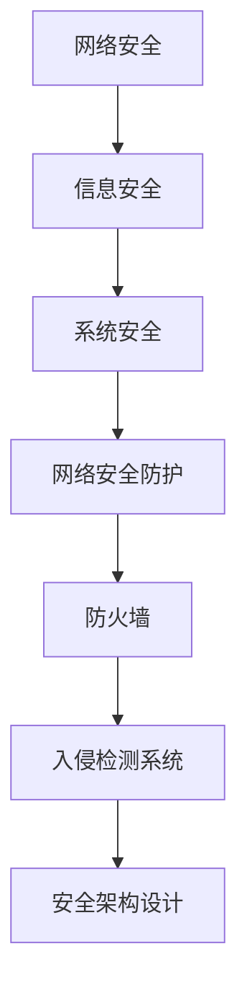

                 

### 《一人公司的网络安全防护策略》

#### 引言

网络安全，作为现代信息化社会中不可或缺的一环，越来越受到企业和个人的重视。一人公司的网络安全防护策略，虽然相对小型，但同样至关重要。网络安全不仅仅关乎企业的数据安全和业务连续性，还涉及到客户隐私保护、法律法规遵守等多个方面。本篇博客将为您详细解析一人公司的网络安全防护策略，帮助您构建一个安全的网络环境。

#### 关键词

- 网络安全
- 防火墙
- 入侵检测系统
- 安全架构设计
- 应急响应
- 合规要求
- 个人安全防护

#### 摘要

本文将分为七个部分，首先介绍网络安全的基础知识，然后深入探讨防护策略与工具的使用，接着讲解网络安全架构设计原则，并通过实战项目展示具体实施方法。随后，我们还将讨论网络安全合规与法律要求，以及个人网络安全防护策略。最后，文章将总结网络安全持续改进的策略与实践，并提供网络安全资源与工具。通过本文的阅读，读者将全面了解并掌握一人公司网络安全防护的核心知识和技能。

---

### 《一人公司的网络安全防护策略》目录大纲

#### 第一部分：网络安全基础

- **第1章：网络安全概述**
  - **1.1** 网络安全的重要性
  - **1.2** 网络安全的基本概念
  - **1.3** 网络安全威胁类型
  - **1.4** 网络安全防护策略概述

#### 第二部分：防护策略与工具

- **第2章：防火墙与入侵检测**
  - **2.1** 防火墙工作原理与配置
    - **2.1.1** 防火墙的基本功能
    - **2.1.2** 防火墙配置实例
    - **2.1.3** 防火墙配置伪代码示例
  - **2.2** 入侵检测系统（IDS）原理与应用
    - **2.2.1** 入侵检测系统概述
    - **2.2.2** 入侵检测系统工作流程
    - **2.2.3** 入侵检测系统配置实例
  - **2.3** 网络安全工具比较与选择
    - **2.3.1** 常见网络安全工具介绍
    - **2.3.2** 工具性能评估方法

#### 第三部分：网络安全架构设计

- **第3章：网络安全架构设计原则**
  - **3.1** 安全设计原则
  - **3.2** 安全体系结构模型
  - **3.3** 安全架构设计流程
  - **3.4** 网络安全架构设计案例

#### 第四部分：网络安全实战

- **第4章：网络安全事件应急响应**
  - **4.1** 应急响应流程
  - **4.2** 事件调查与分析
  - **4.3** 漏洞利用与防护
  - **4.4** 应急演练与改进

#### 第五部分：网络安全合规与法律

- **第5章：网络安全合规要求**
  - **5.1** 法律法规与政策概述
  - **5.2** 合规评估与审计
  - **5.3** 合规实施与改进

#### 第六部分：个人安全防护

- **第6章：个人网络安全防护策略**
  - **6.1** 个人信息安全意识培养
  - **6.2** 网络安全工具使用
  - **6.3** 网络安全法律法规了解

#### 第七部分：网络安全持续改进

- **第7章：网络安全持续改进与实践**
  - **7.1** 持续改进策略
  - **7.2** 安全性能评估与反馈
  - **7.3** 改进措施与效果分析

#### 附录：网络安全资源与工具

- **A.1** 网络安全资源介绍
  - **A.1.1** 安全标准与规范
  - **A.1.2** 安全论坛与社区
  - **A.1.3** 安全工具与软件推荐

- **A.2** 实用工具与脚本示例
  - **A.2.1** 防火墙配置脚本
  - **A.2.2** 入侵检测规则编写
  - **A.2.3** 应急响应脚本示例

---

### 核心概念与联系

网络安全涉及多个核心概念和子系统，它们之间紧密联系，共同构成一个完整的防护体系。以下是一个简化的网络安全概念图，用以说明这些核心概念之间的关联。



- **信息安全**：确保信息的保密性、完整性和可用性。
- **系统安全**：保护计算机系统和网络免受恶意攻击和未授权访问。
- **网络安全防护**：通过技术和管理手段防止网络攻击和数据泄露。
- **防火墙**：网络边界的安全设备，用于过滤和监控进出网络的数据包。
- **入侵检测系统（IDS）**：实时监控网络流量，检测异常行为和潜在攻击。
- **安全架构设计**：设计和实施安全措施，确保整个系统的安全性。

### 核心算法原理讲解

网络安全领域中的算法和模型广泛应用于防火墙规则匹配、入侵检测、加密和认证等各个方面。以下，我们将以防火墙规则匹配算法为例，使用伪代码详细讲解其工作原理。

```plaintext
# 输入：规则集、流量包
# 输出：允许、拒绝或丢弃

function firewall_filter(rule_set, traffic_packet):
    for rule in rule_set:
        if traffic_packet.matches(rule):
            if rule.allow:
                return "允许"
            else:
                return "拒绝"
    return "丢弃"
```

- **规则集**：包含一系列匹配规则，如源IP、目标IP、协议类型、端口等。
- **流量包**：网络数据包，包含源IP、目标IP、协议类型、端口等信息。

在防火墙规则匹配过程中，算法会逐一检查每个规则与流量包的匹配程度。如果找到匹配的规则，且规则允许流量通过，则允许流量；否则，拒绝流量。如果未找到匹配的规则，则默认丢弃流量。

### 数学模型和数学公式

网络安全中的数学模型和公式用于评估系统的安全性能、检测异常行为和制定防护策略。以下，我们介绍两个常用的数学模型和公式。

#### 数据包匹配算法效率分析

$$
\text{效率} = \frac{\text{匹配次数}}{\text{总数据包数}} \times 100\%
$$

- **匹配次数**：规则匹配成功的次数。
- **总数据包数**：网络中传输的数据包总数。

效率值反映了算法的匹配能力，值越高表示匹配能力越强。

#### 入侵检测阈值计算

$$
\text{阈值} = \text{平均值} + 3 \times \text{标准差}
$$

- **平均值**：一段时间内检测值的平均值。
- **标准差**：检测值的波动范围。

阈值用于判断一个行为是否异常，当检测值超过阈值时，可能表明存在攻击行为。通过调整阈值，可以控制检测的敏感度。

### 项目实战

#### 防火墙配置项目实战

在本节中，我们将通过一个实际的防火墙配置项目，展示防火墙的配置过程、源代码实现和代码解读。

#### 开发环境搭建

- **服务器**：Ubuntu 20.04
- **防火墙**：iptables

#### 源代码实现

```bash
#!/bin/bash
# 配置防火墙规则

# 允许SSH（端口22）流量
iptables -A INPUT -p tcp --dport 22 -j ACCEPT

# 允许HTTP（端口80）流量
iptables -A INPUT -p tcp --dport 80 -j ACCEPT

# 允许HTTPS（端口443）流量
iptables -A INPUT -p tcp --dport 443 -j ACCEPT

# 其他未明确允许的流量丢弃
iptables -A INPUT -j DROP
```

#### 代码解读与分析

- `iptables -A INPUT -p tcp --dport 22 -j ACCEPT`：允许TCP端口22（SSH）的流量通过。
- `iptables -A INPUT -p tcp --dport 80 -j ACCEPT`：允许TCP端口80（HTTP）的流量通过。
- `iptables -A INPUT -p tcp --dport 443 -j ACCEPT`：允许TCP端口443（HTTPS）的流量通过。
- `iptables -A INPUT -j DROP`：对于其他未明确允许的流量，进行丢弃处理。

通过以上配置，防火墙能够有效地阻止未授权访问，保障服务器安全。通过日志监控，可以及时发现和响应异常流量。

#### 实际应用效果

防火墙配置后，服务器只能通过SSH、HTTP和HTTPS端口访问。其他端口均被防火墙拦截，从而提高了服务器安全性。通过定期更新防火墙规则和监控日志，可以持续优化防火墙配置，提高防护效果。

---

### 总结

本文详细介绍了网络安全基础、防护策略与工具、网络安全架构设计、实战项目、合规与法律、个人安全防护以及持续改进等方面的内容。通过阅读本文，读者可以全面了解一人公司网络安全防护的关键知识，掌握实际操作技巧，并能够有效应对网络安全挑战。在实际应用中，网络安全防护需要持续改进和优化，以确保企业信息安全和业务连续性。希望本文能为读者在网络安全领域提供有价值的参考和指导。

---

#### 作者信息

**作者：** AI天才研究院/AI Genius Institute & 禅与计算机程序设计艺术 /Zen And The Art of Computer Programming

---

本文由AI天才研究院/AI Genius Institute与禅与计算机程序设计艺术/Zen And The Art of Computer Programming联合撰写，旨在为读者提供深入浅出的网络安全防护策略解析。我们致力于推动人工智能和计算机科学的发展，帮助企业和个人构建安全的数字世界。如需进一步交流或咨询，欢迎访问我们的官方网站或联系我们的技术支持团队。感谢您的阅读，期待与您共同探索网络安全领域的无限可能！

