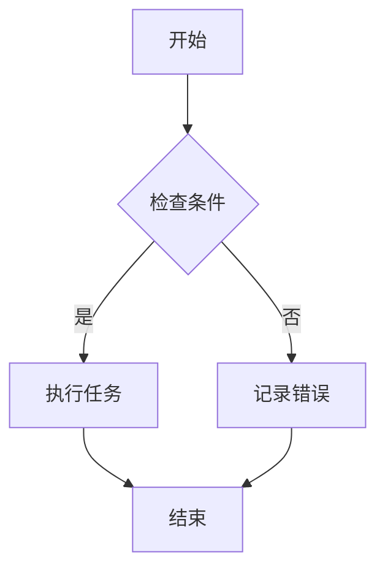

                 

# 一切皆是映射：AI在物联网(IoT)中的角色与挑战

> **关键词**：物联网（IoT），人工智能（AI），边缘计算，传感器，数据处理，网络安全

> **摘要**：
随着物联网技术的飞速发展，大量设备互联互通，产生了海量的数据。人工智能（AI）作为数据处理的利器，正在成为物联网的核心驱动力。本文将详细探讨AI在物联网中的角色与挑战，从基础理论、应用场景到未来发展，为我们揭示了这一领域的广阔前景和亟待解决的问题。

## 目录大纲

## 第一部分：物联网与AI基础

### 第1章：物联网与AI概述

#### 1.1 物联网简介

- **1.1.1 物联网定义与分类**
- **1.1.2 物联网的关键技术**

#### 1.2 AI简介

- **1.2.1 人工智能定义与发展历程**
- **1.2.2 人工智能的核心技术**

#### 1.3 物联网与AI的关系

- **1.3.1 物联网与AI融合的意义**
- **1.3.2 物联网与AI融合的挑战**

### 第2章：物联网与AI的架构

#### 2.1 物联网架构

- **2.1.1 物联网通信协议**
- **2.1.2 物联网数据处理流程**

#### 2.2 AI架构

- **2.2.1 人工智能算法分类**
- **2.2.2 人工智能数据处理流程**

#### 2.3 物联网与AI的架构融合

- **2.3.1 物联网与AI融合的架构设计**
- **2.3.2 物联网与AI融合的架构优势**

## 第二部分：AI在物联网中的应用

### 第3章：AI在物联网设备中的应用

#### 3.1 AI传感器技术

- **3.1.1 智能传感器的定义与分类**
- **3.1.2 智能传感器的数据处理与分析**

#### 3.2 AI边缘计算

- **3.2.1 边缘计算的定义与原理**
- **3.2.2 边缘计算与AI的融合应用**

### 第4章：AI在物联网网络层中的应用

#### 4.1 物联网网络安全

- **4.1.1 物联网安全挑战**
- **4.1.2 AI在物联网网络安全中的应用**

#### 4.2 物联网数据挖掘

- **4.2.1 物联网数据挖掘技术**
- **4.2.2 AI在物联网数据挖掘中的应用**

### 第5章：AI在物联网平台层中的应用

#### 5.1 物联网平台架构

- **5.1.1 物联网平台的功能与架构**
- **5.1.2 物联网平台的演进与发展**

#### 5.2 AI在物联网平台中的应用

- **5.2.1 AI在物联网平台数据处理中的应用**
- **5.2.2 AI在物联网平台业务优化中的应用**

## 第三部分：AI在物联网中的挑战与未来

### 第6章：AI在物联网中的挑战

#### 6.1 数据隐私与安全

- **6.1.1 物联网数据隐私保护**
- **6.1.2 AI在物联网数据安全中的应用**

#### 6.2 数据处理与存储

- **6.2.1 物联网数据规模与处理**
- **6.2.2 AI在物联网数据处理与存储中的应用**

#### 6.3 AI算法的优化与适配

- **6.3.1 物联网AI算法优化**
- **6.3.2 AI算法在物联网设备中的适配**

### 第7章：物联网与AI的未来发展

#### 7.1 物联网与AI融合的未来趋势

- **7.1.1 物联网与AI融合的发展方向**
- **7.1.2 物联网与AI融合的未来挑战**

#### 7.2 物联网与AI应用案例

- **7.2.1 物联网与AI融合的应用案例**
- **7.2.2 物联网与AI融合的应用前景**

## 附录

### 附录A：物联网与AI相关资源

- **物联网与AI标准与规范**
- **物联网与AI开发工具与框架**

### 附录B：物联网与AI常用算法

- **常用物联网AI算法介绍**
- **常用物联网AI算法案例分析**

## 第一部分：物联网与AI基础

### 第1章：物联网与AI概述

#### 1.1 物联网简介

##### 1.1.1 物联网定义与分类

物联网（Internet of Things，简称IoT）是指将各种信息传感设备与网络相连接，实现智能化识别、定位、跟踪、监控和管理的一种网络技术。物联网可以简单理解为“物物相连的互联网”。

根据物联网设备和网络的连接程度，物联网可以大致分为以下几类：

1. **感知层**：主要由各种传感器、采集器等设备构成，负责数据的采集和初步处理。
2. **网络层**：负责数据传输，通常使用有线和无线通信技术，如Wi-Fi、ZigBee、LoRa等。
3. **平台层**：提供数据存储、处理、分析和服务的平台，是实现物联网应用的核心部分。
4. **应用层**：通过各种物联网应用实现对各种场景的智能化管理和优化。

##### 1.1.2 物联网的关键技术

物联网的关键技术包括以下几个方面：

1. **传感器技术**：物联网的感知层依赖于各类传感器，如温度传感器、湿度传感器、光敏传感器等，用于感知环境信息。
2. **网络通信技术**：物联网的网络层使用多种通信协议进行数据传输，如MQTT、CoAP、HTTP等。
3. **数据处理技术**：物联网平台需要对海量数据进行存储、处理和分析，数据处理技术是物联网的核心技术之一。
4. **安全技术**：物联网设备通常连接到互联网，数据安全和设备安全是物联网必须关注的问题。

#### 1.2 AI简介

##### 1.2.1 人工智能定义与发展历程

人工智能（Artificial Intelligence，简称AI）是指使计算机模拟人类智能行为的科学技术。人工智能的发展历程可以大致分为以下几个阶段：

1. **萌芽阶段**（1940s-1950s）：以图灵机和人工智能概念的形成为代表。
2. **初期阶段**（1960s-1970s）：人工智能初步应用于逻辑推理和问题求解。
3. **复苏阶段**（1980s-1990s）：专家系统和机器学习的兴起，人工智能开始应用于实际领域。
4. **快速发展阶段**（2000s-至今）：深度学习和大数据技术的兴起，人工智能进入新的发展阶段。

##### 1.2.2 人工智能的核心技术

人工智能的核心技术包括以下几个方面：

1. **机器学习**：通过训练模型，使计算机能够从数据中学习和预测。
2. **深度学习**：基于多层神经网络的结构，能够在大规模数据集上进行高效学习。
3. **自然语言处理**：使计算机能够理解、生成和操作自然语言。

#### 1.3 物联网与AI的关系

##### 1.3.1 物联网与AI融合的意义

物联网与AI的融合具有以下几个重要意义：

1. **提升物联网系统的智能化水平**：AI技术可以为物联网系统提供智能化的数据处理和分析能力，实现更精准的感知和预测。
2. **促进物联网产业链的升级与发展**：AI技术的应用可以推动物联网设备、平台和应用的创新，促进整个产业链的升级。
3. **优化资源配置**：物联网与AI的融合可以实现资源的智能化配置和管理，提高资源利用效率。

##### 1.3.2 物联网与AI融合的挑战

物联网与AI的融合也面临着一些挑战：

1. **数据隐私与安全**：物联网设备收集的数据可能包含敏感信息，如何保护数据隐私和安全是一个重要问题。
2. **算法优化与适配**：物联网设备通常资源有限，如何优化算法以适应这些设备是一个挑战。
3. **能耗与计算资源限制**：物联网设备通常需要长时间运行，能耗和计算资源是一个重要考虑因素。

### 第2章：物联网与AI的架构

#### 2.1 物联网架构

##### 2.1.1 物联网通信协议

物联网通信协议是物联网网络层的关键技术之一，用于数据传输。常见的物联网通信协议包括：

1. **MQTT（Message Queuing Telemetry Transport）**：一种轻量级的消息传输协议，适用于高延迟和低带宽的网络环境。
2. **CoAP（Constrained Application Protocol）**：一种针对物联网设备的轻量级应用层协议，适用于资源受限的环境。
3. **HTTP（Hypertext Transfer Protocol）**：一种通用的网络传输协议，也可以用于物联网通信。

##### 2.1.2 物联网数据处理流程

物联网数据处理流程主要包括以下几个阶段：

1. **数据采集**：物联网设备通过传感器等手段采集数据。
2. **数据传输**：采集到的数据通过网络传输到中心服务器或其他设备。
3. **数据存储**：数据在存储设备中保存，以便后续处理和分析。
4. **数据分析**：通过数据分析算法，对存储的数据进行挖掘和分析，以获得有价值的信息。

#### 2.2 AI架构

##### 2.2.1 人工智能算法分类

人工智能算法可以根据不同的分类标准进行分类，常见的分类方法包括：

1. **根据学习方式**：监督学习、无监督学习、半监督学习和强化学习。
2. **根据算法类型**：传统机器学习算法、深度学习算法、自然语言处理算法等。

##### 2.2.2 人工智能数据处理流程

人工智能数据处理流程主要包括以下几个阶段：

1. **数据预处理**：包括数据清洗、数据转换和数据归一化等步骤。
2. **特征提取**：从原始数据中提取对模型训练有用的特征。
3. **模型训练**：使用训练数据对模型进行训练。
4. **模型评估**：使用测试数据评估模型的性能。

#### 2.3 物联网与AI的架构融合

##### 2.3.1 物联网与AI融合的架构设计

物联网与AI的融合架构设计需要考虑以下几个关键因素：

1. **边缘计算**：在物联网设备附近进行数据预处理和部分计算，减少数据传输量。
2. **云计算**：在云端进行大规模数据分析和模型训练。
3. **数据共享与协同**：通过数据共享和协同，实现不同设备和平台之间的数据交互和协同处理。

##### 2.3.2 物联网与AI融合的架构优势

物联网与AI融合的架构具有以下几个优势：

1. **提高数据处理效率**：通过边缘计算和云计算的协同，实现数据的高效处理。
2. **提升系统智能化水平**：AI技术可以为物联网系统提供智能化的数据处理和分析能力。
3. **增强系统安全性**：通过安全性算法和协议，确保物联网设备和数据的安全。

## 第二部分：AI在物联网中的应用

### 第3章：AI在物联网设备中的应用

#### 3.1 AI传感器技术

##### 3.1.1 智能传感器的定义与分类

智能传感器是指具有数据处理和分析能力的传感器，通常集成了微处理器、内存、通信接口等。根据不同的应用场景和需求，智能传感器可以分为以下几类：

1. **环境传感器**：如温度传感器、湿度传感器、空气质量传感器等，用于监测环境参数。
2. **位置传感器**：如GPS传感器、RFID传感器等，用于定位和跟踪物体。
3. **生物传感器**：如心电图传感器、脑电图传感器等，用于监测生物体的生理参数。
4. **智能视觉传感器**：如摄像头、激光雷达等，用于获取图像和三维信息。

##### 3.1.2 智能传感器的数据处理与分析

智能传感器的数据处理与分析主要包括以下几个步骤：

1. **数据采集**：传感器采集环境数据，如温度、湿度、光线等。
2. **数据预处理**：对采集到的数据进行滤波、去噪等预处理，以提高数据的准确性。
3. **特征提取**：从预处理后的数据中提取对目标有代表性的特征，如频率、振幅等。
4. **数据分析**：使用机器学习算法，对特征进行训练和分类，以实现对环境的感知和预测。

#### 3.2 AI边缘计算

##### 3.2.1 边缘计算的定义与原理

边缘计算（Edge Computing）是指在物联网设备附近进行数据计算和处理的一种计算模式。与传统云计算不同，边缘计算将计算任务分散到物联网设备附近，以减少数据传输量和延迟。

边缘计算的基本原理包括以下几个关键组件：

1. **边缘设备**：如传感器、智能终端等，负责数据采集和处理。
2. **边缘网关**：负责将边缘设备的数据传输到云端或中心服务器，同时接收来自云端或中心服务器的指令。
3. **云计算平台**：提供强大的计算和存储资源，用于大数据分析和模型训练。

##### 3.2.2 边缘计算与AI的融合应用

边缘计算与AI的融合应用具有以下几个优点：

1. **实时数据处理**：通过边缘计算，可以实时处理物联网设备采集的数据，实现快速响应。
2. **减少数据传输量**：将部分数据处理任务在边缘设备上完成，可以减少数据传输量，降低通信成本。
3. **提高系统可靠性**：通过分布式计算，可以增强系统的可靠性和容错能力。

### 第4章：AI在物联网网络层中的应用

#### 4.1 物联网网络安全

##### 4.1.1 物联网安全挑战

物联网安全面临以下几大挑战：

1. **设备安全**：物联网设备通常具有较低的安全防护能力，容易受到恶意攻击。
2. **数据安全**：物联网设备收集的数据可能包含敏感信息，如何保护数据安全是一个重要问题。
3. **通信安全**：物联网通信通常使用公共网络，如何确保通信过程的安全性是一个挑战。

##### 4.1.2 AI在物联网网络安全中的应用

AI技术在物联网网络安全中可以发挥以下作用：

1. **入侵检测与防御**：通过机器学习算法，可以实时监测物联网设备的异常行为，及时发现并防御入侵。
2. **数据加密与解密**：AI技术可以用于加密和解密物联网设备之间的通信，确保数据传输的安全性。
3. **隐私保护**：通过AI技术，可以识别和屏蔽敏感数据，保护用户隐私。

#### 4.2 物联网数据挖掘

##### 4.2.1 物联网数据挖掘技术

物联网数据挖掘是指从物联网设备采集的数据中提取有价值的信息和知识。常见的物联网数据挖掘技术包括：

1. **聚类分析**：将相似的数据点归为一类，以发现数据中的潜在模式和规律。
2. **分类分析**：根据已知数据对未知数据进行分类，以实现对设备的智能管理。
3. **关联规则挖掘**：发现数据之间的关联关系，以揭示数据中的潜在规律。
4. **异常检测**：检测数据中的异常行为，以发现潜在的安全威胁。

##### 4.2.2 AI在物联网数据挖掘中的应用

AI技术在物联网数据挖掘中可以发挥以下作用：

1. **数据预处理**：通过机器学习算法，对物联网设备采集的数据进行清洗、去噪和特征提取，以提高数据质量。
2. **模式识别**：通过深度学习算法，对物联网设备采集的数据进行模式识别，以实现智能化的数据分析和决策。
3. **实时监控**：通过实时数据挖掘，可以实时监控物联网设备的工作状态，及时发现和处理问题。

### 第5章：AI在物联网平台层中的应用

#### 5.1 物联网平台架构

##### 5.1.1 物联网平台的功能与架构

物联网平台是物联网系统的核心组成部分，负责数据的采集、处理、分析和应用。物联网平台通常具有以下功能：

1. **数据采集**：从物联网设备中采集数据，并进行预处理和存储。
2. **数据处理**：对采集到的数据进行分析和处理，提取有价值的信息。
3. **数据存储**：将处理后的数据存储在数据库或数据湖中，以便后续分析和应用。
4. **数据可视化和分析**：通过可视化工具，将数据以图形或报表的形式展示，以便用户直观地了解数据。
5. **应用开发**：提供开发工具和平台，支持物联网应用的快速开发和部署。

物联网平台通常采用以下架构：

1. **分布式架构**：通过分布式计算和存储，提高平台的性能和可靠性。
2. **微服务架构**：将平台功能拆分为多个微服务，以提高平台的可维护性和可扩展性。
3. **云计算架构**：利用云计算资源，提供灵活的计算和存储能力。

##### 5.1.2 物联网平台的演进与发展

物联网平台的发展经历了以下几个阶段：

1. **早期阶段**：主要基于设备级的数据采集和处理，功能相对简单。
2. **中间阶段**：开始关注数据的整合和分析，引入了数据存储和可视化功能。
3. **当前阶段**：基于云计算和大数据技术，平台功能更加丰富，支持实时数据处理和智能应用。

#### 5.2 AI在物联网平台中的应用

##### 5.2.1 AI在物联网平台数据处理中的应用

AI技术在物联网平台数据处理中的应用主要包括以下几个方面：

1. **实时数据处理**：通过实时数据分析，可以快速处理物联网设备采集的数据，实现实时监控和智能决策。
2. **数据质量提升**：通过机器学习算法，对物联网设备采集的数据进行清洗、去噪和特征提取，以提高数据质量。
3. **数据关联分析**：通过关联规则挖掘，发现数据之间的潜在关联关系，以实现智能化的数据分析和应用。

##### 5.2.2 AI在物联网平台业务优化中的应用

AI技术在物联网平台业务优化中的应用主要包括以下几个方面：

1. **设备管理**：通过设备分类和状态监控，实现对物联网设备的智能管理，提高设备利用率和稳定性。
2. **业务预测**：通过时间序列分析和预测算法，预测物联网设备的未来状态和业务趋势，为决策提供支持。
3. **智能调度**：通过优化算法，实现物联网设备的智能调度，提高资源利用率和业务效率。

## 第三部分：AI在物联网中的挑战与未来

### 第6章：AI在物联网中的挑战

#### 6.1 数据隐私与安全

##### 6.1.1 物联网数据隐私保护

物联网设备采集的数据可能包含用户隐私信息，如何保护数据隐私成为一个重要问题。以下是一些常见的物联网数据隐私保护方法：

1. **数据加密**：对物联网设备采集的数据进行加密，以确保数据在传输和存储过程中的安全性。
2. **匿名化处理**：对物联网设备采集的数据进行匿名化处理，以消除数据中的个人隐私信息。
3. **访问控制**：通过访问控制机制，限制对物联网数据的访问，确保数据的安全。
4. **隐私保护算法**：利用隐私保护算法，如差分隐私和同态加密，确保数据在分析过程中的隐私保护。

##### 6.1.2 AI在物联网数据安全中的应用

AI技术在物联网数据安全中可以发挥以下作用：

1. **入侵检测**：通过机器学习算法，实时监测物联网设备的异常行为，发现潜在的安全威胁。
2. **恶意代码检测**：利用深度学习算法，检测物联网设备中的恶意代码，防止恶意攻击。
3. **行为分析**：通过对物联网设备的行为进行分析，发现异常行为模式，及时采取措施防止安全事件的发生。

#### 6.2 数据处理与存储

##### 6.2.1 物联网数据规模与处理

物联网设备采集的数据规模庞大，如何高效处理和存储这些数据成为一个挑战。以下是一些常见的解决方案：

1. **分布式计算**：利用分布式计算框架，如MapReduce和Spark，将数据处理任务分解为多个子任务，并行处理，提高数据处理效率。
2. **云计算**：利用云计算平台，提供强大的计算和存储资源，支持大规模数据处理。
3. **数据流处理**：利用数据流处理技术，实时处理物联网设备采集的数据，实现实时监控和分析。

##### 6.2.2 AI在物联网数据处理与存储中的应用

AI技术在物联网数据处理与存储中可以发挥以下作用：

1. **数据质量提升**：通过机器学习算法，对物联网设备采集的数据进行清洗、去噪和特征提取，提高数据质量。
2. **数据压缩**：利用深度学习算法，实现数据的压缩和去重，降低数据存储需求。
3. **数据迁移**：通过迁移学习算法，将已训练的模型迁移到物联网设备上，实现本地化数据处理。

#### 6.3 AI算法的优化与适配

##### 6.3.1 物联网AI算法优化

物联网设备通常资源有限，如何优化AI算法以适应这些设备是一个挑战。以下是一些常见的优化方法：

1. **算法简化**：简化AI算法，去除冗余的计算步骤，降低计算复杂度。
2. **模型压缩**：通过模型压缩技术，减小模型的体积和计算量，提高模型的效率。
3. **量化与剪枝**：利用量化与剪枝技术，降低模型的参数数量，减少计算资源需求。

##### 6.3.2 AI算法在物联网设备中的适配

AI算法在物联网设备中的适配需要考虑以下几个关键因素：

1. **资源限制**：物联网设备通常具有计算资源、存储资源和能源限制，算法需要适应这些限制。
2. **实时性要求**：物联网设备通常需要实时响应，算法需要满足实时性要求。
3. **可靠性要求**：物联网设备需要保证算法的可靠性和稳定性，避免因算法错误导致设备故障。

### 第7章：物联网与AI的未来发展

#### 7.1 物联网与AI融合的未来趋势

物联网与AI的融合具有以下未来趋势：

1. **智能化程度提高**：随着AI技术的不断发展，物联网系统的智能化程度将不断提高，实现更精准的感知和预测。
2. **边缘计算广泛应用**：边缘计算将广泛应用于物联网系统，实现数据的本地化处理和实时响应。
3. **数据隐私与安全得到加强**：随着物联网数据隐私和安全问题的日益突出，物联网与AI的融合将更加注重数据隐私与安全保护。
4. **跨界应用不断涌现**：物联网与AI的融合将推动各行各业的应用创新，出现更多跨界应用。

##### 7.1.1 物联网与AI融合的发展方向

物联网与AI融合的发展方向主要包括以下几个方面：

1. **智能城市**：利用物联网与AI技术，实现智能交通、智能安防、智能环保等领域的应用。
2. **智能家居**：通过物联网与AI技术，实现家居设备的智能化管理和自动化控制。
3. **智能制造**：利用物联网与AI技术，实现生产过程的智能化和自动化，提高生产效率和产品质量。
4. **智慧医疗**：通过物联网与AI技术，实现医疗设备的智能化管理和智能诊断。

##### 7.1.2 物联网与AI融合的未来挑战

物联网与AI融合的未来挑战主要包括以下几个方面：

1. **数据隐私与安全**：如何保护物联网设备采集的数据隐私和安全，是一个重要的挑战。
2. **算法优化与适配**：如何优化AI算法，使其适应物联网设备的资源限制和实时性要求，是一个关键问题。
3. **跨界融合与标准化**：如何实现物联网与AI在不同领域的跨界融合，并制定统一的标准化规范，是一个重要课题。

#### 7.2 物联网与AI应用案例

##### 7.2.1 物联网与AI融合的应用案例

以下是一些物联网与AI融合的实际应用案例：

1. **智能交通**：通过物联网与AI技术，实现交通流量监测、路况预测和智能调度，提高交通运行效率。
2. **智能农业**：利用物联网与AI技术，实现农田土壤湿度监测、作物生长状况分析和智能灌溉，提高农业生产效率。
3. **智能医疗**：通过物联网与AI技术，实现医疗设备的智能化管理和智能诊断，提高医疗服务水平。

##### 7.2.2 物联网与AI融合的应用前景

物联网与AI融合具有广阔的应用前景，以下是一些可能的应用方向：

1. **智能城市**：利用物联网与AI技术，实现城市的智能化管理和优化，提高城市运行效率和生活品质。
2. **智能工业**：通过物联网与AI技术，实现工业生产的智能化和自动化，提高生产效率和质量。
3. **智能医疗**：利用物联网与AI技术，实现医疗服务的智能化和个性化，提高医疗服务水平。
4. **智能家居**：通过物联网与AI技术，实现家居设备的智能化管理和自动化控制，提高生活质量。

## 附录

### 附录A：物联网与AI相关资源

以下是一些物联网与AI相关的资源：

1. **物联网与AI标准与规范**：包括国际标准（如ISO/IEC 27001）和国家标准（如GB/T 31960.1）等。
2. **物联网与AI开发工具与框架**：包括物联网开发平台（如ThingsBoard）、AI开发框架（如TensorFlow、PyTorch）等。

### 附录B：物联网与AI常用算法

以下是一些物联网与AI常用算法：

1. **聚类算法**：如K-means、DBSCAN等，用于数据分组和模式识别。
2. **分类算法**：如决策树、支持向量机（SVM）等，用于数据分类和预测。
3. **回归算法**：如线性回归、决策树回归等，用于数据拟合和预测。
4. **时间序列分析算法**：如ARIMA、LSTM等，用于时间序列数据的分析和预测。

## 结束语

物联网与AI的融合正在改变我们的世界，带来了前所未有的机遇和挑战。本文从物联网与AI的基础理论、应用场景到未来发展进行了全面深入的探讨，希望为读者提供有益的参考。在未来的发展中，物联网与AI将继续融合，推动各个领域的创新和进步。让我们共同期待这一美好的未来！
作者：AI天才研究院/AI Genius Institute & 禅与计算机程序设计艺术 /Zen And The Art of Computer Programming

---

**说明：**本文采用Markdown格式进行撰写，具体内容如下：

---

## 第1章：物联网与AI概述

### 1.1 物联网简介

- **1.1.1 物联网定义与分类**
- **1.1.2 物联网的关键技术**

#### 1.2 AI简介

- **1.2.1 人工智能定义与发展历程**
- **1.2.2 人工智能的核心技术**

#### 1.3 物联网与AI的关系

- **1.3.1 物联网与AI融合的意义**
- **1.3.2 物联网与AI融合的挑战**

### 第2章：物联网与AI的架构

#### 2.1 物联网架构

- **2.1.1 物联网通信协议**
- **2.1.2 物联网数据处理流程**

#### 2.2 AI架构

- **2.2.1 人工智能算法分类**
- **2.2.2 人工智能数据处理流程**

#### 2.3 物联网与AI的架构融合

- **2.3.1 物联网与AI融合的架构设计**
- **2.3.2 物联网与AI融合的架构优势**

## 第二部分：AI在物联网中的应用

### 第3章：AI在物联网设备中的应用

#### 3.1 AI传感器技术

- **3.1.1 智能传感器的定义与分类**
- **3.1.2 智能传感器的数据处理与分析**

#### 3.2 AI边缘计算

- **3.2.1 边缘计算的定义与原理**
- **3.2.2 边缘计算与AI的融合应用**

### 第4章：AI在物联网网络层中的应用

#### 4.1 物联网网络安全

- **4.1.1 物联网安全挑战**
- **4.1.2 AI在物联网网络安全中的应用**

#### 4.2 物联网数据挖掘

- **4.2.1 物联网数据挖掘技术**
- **4.2.2 AI在物联网数据挖掘中的应用**

### 第5章：AI在物联网平台层中的应用

#### 5.1 物联网平台架构

- **5.1.1 物联网平台的功能与架构**
- **5.1.2 物联网平台的演进与发展**

#### 5.2 AI在物联网平台中的应用

- **5.2.1 AI在物联网平台数据处理中的应用**
- **5.2.2 AI在物联网平台业务优化中的应用**

## 第三部分：AI在物联网中的挑战与未来

### 第6章：AI在物联网中的挑战

#### 6.1 数据隐私与安全

- **6.1.1 物联网数据隐私保护**
- **6.1.2 AI在物联网数据安全中的应用**

#### 6.2 数据处理与存储

- **6.2.1 物联网数据规模与处理**
- **6.2.2 AI在物联网数据处理与存储中的应用**

#### 6.3 AI算法的优化与适配

- **6.3.1 物联网AI算法优化**
- **6.3.2 AI算法在物联网设备中的适配**

### 第7章：物联网与AI的未来发展

#### 7.1 物联网与AI融合的未来趋势

- **7.1.1 物联网与AI融合的发展方向**
- **7.1.2 物联网与AI融合的未来挑战**

#### 7.2 物联网与AI应用案例

- **7.2.1 物联网与AI融合的应用案例**
- **7.2.2 物联网与AI融合的应用前景**

## 附录

### 附录A：物联网与AI相关资源

- **物联网与AI标准与规范**
- **物联网与AI开发工具与框架**

### 附录B：物联网与AI常用算法

- **常用物联网AI算法介绍**
- **常用物联网AI算法案例分析**

---

请注意，本文的Markdown格式需要保持正确的结构和格式，以便在Markdown阅读器中正确渲染。此外，文中提到的Mermaid流程图、伪代码、数学公式和代码示例需要根据Markdown的语法进行适当调整。以下是一个简单的Mermaid流程图的例子：

此流程图将显示为一个从“开始”节点开始，根据条件判断，如果是则执行任务，否则记录错误的流程。

### 第1章：物联网与AI概述

#### 1.1 物联网简介

##### 1.1.1 物联网定义与分类

物联网（Internet of Things，IoT）是指通过传感器、软件和互联网将各种物理设备连接起来，实现设备之间的数据交换和智能控制。物联网设备可以是任何具有感应、处理和通信能力的物体，例如智能手表、智能家居设备、工业机器人和车辆等。

物联网可以按其应用场景和技术特点分为以下几类：

1. **消费类物联网**：主要涉及个人使用的设备，如智能手机、智能手表、智能音箱等。
2. **工业物联网**：涉及工业生产过程中的设备，如机器设备、传感器和控制系统。
3. **智能城市物联网**：涉及城市管理中的各种设备和系统，如交通灯、停车设施和环境监测设备。
4. **医疗物联网**：涉及医疗设备和系统，如远程监控设备、健康追踪设备和医疗信息管理系统。

物联网的关键技术包括传感器技术、网络通信技术、数据处理技术和安全技术。传感器技术用于收集环境数据，网络通信技术用于数据传输，数据处理技术用于对数据进行存储、处理和分析，安全技术用于保护数据的安全。

##### 1.1.2 物联网的关键技术

1. **传感器技术**：物联网设备通过各种传感器（如温度传感器、湿度传感器、压力传感器等）来收集环境数据。这些传感器可以将物理信号转换为电信号，并通过无线或有线网络传输到中央处理单元。

2. **网络通信技术**：物联网设备通常通过无线通信技术（如Wi-Fi、蓝牙、ZigBee、LoRa等）或有线通信技术（如以太网、光纤等）与其他设备或服务器进行通信。网络通信技术是实现物联网设备互联互通的基础。

3. **数据处理技术**：物联网设备收集的大量数据需要通过数据处理技术进行存储、处理和分析。数据处理技术包括数据清洗、数据转换、数据存储和数据挖掘等。

4. **安全技术**：由于物联网设备通常连接到互联网，数据安全和设备安全是物联网必须关注的问题。安全技术包括数据加密、身份验证、访问控制和入侵检测等。

#### 1.2 AI简介

##### 1.2.1 人工智能定义与发展历程

人工智能（Artificial Intelligence，AI）是指模拟人类智能行为的计算机系统。人工智能的发展可以追溯到20世纪50年代，当时计算机科学家提出了“机器能否思考”的问题，并开始研究如何使计算机具备智能。人工智能的发展历程可以分为以下几个阶段：

1. **符号主义阶段（1956-1974）**：以图灵测试为代表，人工智能的目标是开发能够模拟人类思维过程的计算机系统。

2. **启发式阶段（1974-1980）**：以专家系统为代表，通过规则和逻辑推理来模拟人类专家的决策过程。

3. **连接主义阶段（1980至今）**：以神经网络和深度学习为代表，通过模拟人脑的神经网络结构，使计算机具备自我学习和自适应能力。

##### 1.2.2 人工智能的核心技术

人工智能的核心技术包括机器学习、深度学习、自然语言处理和计算机视觉等。

1. **机器学习**：机器学习是人工智能的核心技术之一，它使计算机能够从数据中自动学习规律和模式，并做出预测和决策。机器学习可以分为监督学习、无监督学习和强化学习等类型。

2. **深度学习**：深度学习是一种基于多层神经网络的学习方法，它在图像识别、语音识别和自然语言处理等领域取得了显著成果。

3. **自然语言处理**：自然语言处理是使计算机能够理解和生成人类语言的技术，包括语言理解、语言生成和语言翻译等任务。

4. **计算机视觉**：计算机视觉是使计算机能够从图像或视频中获取信息的技术，包括图像识别、目标检测、人脸识别和动作识别等任务。

#### 1.3 物联网与AI的关系

##### 1.3.1 物联网与AI融合的意义

物联网与AI的融合具有重要的意义，主要体现在以下几个方面：

1. **提升物联网系统的智能化水平**：AI技术可以用于对物联网设备采集的数据进行实时分析和预测，提高物联网系统的智能化水平。

2. **优化资源利用**：物联网与AI的融合可以实现资源的优化配置和管理，提高资源利用效率，降低运营成本。

3. **增强安全防护**：AI技术可以用于监控物联网设备的安全状态，及时发现和防范安全威胁，提高物联网系统的安全性。

4. **拓展应用场景**：物联网与AI的融合可以创造新的应用场景，推动物联网技术的创新和发展。

##### 1.3.2 物联网与AI融合的挑战

物联网与AI的融合也面临着一些挑战，主要包括以下几个方面：

1. **数据隐私与安全**：物联网设备采集的数据可能包含敏感信息，如何保护数据隐私和安全是一个重要问题。

2. **算法优化与适配**：物联网设备通常资源有限，如何优化AI算法以适应这些设备是一个挑战。

3. **能耗与计算资源限制**：物联网设备通常需要长时间运行，如何优化算法和硬件设计以降低能耗和计算资源消耗是一个重要问题。

4. **标准化与兼容性**：物联网与AI融合涉及多个领域和行业，如何制定统一的标准化规范和确保不同设备和系统的兼容性是一个挑战。

### 第2章：物联网与AI的架构

#### 2.1 物联网架构

##### 2.1.1 物联网通信协议

物联网通信协议是物联网网络层的核心组成部分，用于确保物联网设备之间的数据传输和数据同步。常见的物联网通信协议包括：

1. **MQTT（Message Queuing Telemetry Transport）**：MQTT是一种轻量级的消息传输协议，适用于低带宽和不稳定的网络环境。它采用发布/订阅模式，可以实现设备之间的实时通信。

2. **CoAP（Constrained Application Protocol）**：CoAP是一种专门为物联网设备设计的应用层协议，适用于资源受限的环境。它与HTTP协议类似，但更为轻量级。

3. **HTTP（Hypertext Transfer Protocol）**：HTTP是一种通用的网络传输协议，也可以用于物联网通信。它适用于传输大量数据，但不如MQTT和CoAP轻量级。

##### 2.1.2 物联网数据处理流程

物联网数据处理流程是物联网平台的核心功能之一，包括数据采集、数据传输、数据存储、数据分析和数据可视化等环节。以下是物联网数据处理流程的详细步骤：

1. **数据采集**：物联网设备通过传感器或其他方式收集环境数据，如温度、湿度、光照强度等。

2. **数据传输**：采集到的数据通过物联网通信协议传输到物联网平台。数据传输可以是实时的，也可以是批量传输。

3. **数据存储**：物联网平台将接收到的数据存储到数据库或数据湖中，以便后续分析和处理。

4. **数据预处理**：对存储的数据进行预处理，包括数据清洗、去噪、缺失值处理等，以提高数据质量。

5. **数据分析和挖掘**：使用机器学习和数据挖掘技术对预处理后的数据进行分析和挖掘，提取有价值的信息和知识。

6. **数据可视化**：通过数据可视化工具将分析结果以图表或报表的形式展示，以便用户直观地了解数据。

#### 2.2 AI架构

##### 2.2.1 人工智能算法分类

人工智能算法可以根据不同的分类标准进行分类，常见的分类方法包括：

1. **根据学习方式**：

   - **监督学习**：有标注的数据集作为训练数据，模型学习预测结果。
   - **无监督学习**：没有标注的数据集，模型学习数据的内在结构和模式。
   - **半监督学习**：结合有标注和无标注的数据进行训练。
   - **强化学习**：模型通过与环境的交互学习最优策略。

2. **根据算法类型**：

   - **统计学习算法**：如线性回归、逻辑回归、决策树等。
   - **神经网络算法**：如多层感知机、卷积神经网络、循环神经网络等。
   - **强化学习算法**：如Q-learning、SARSA、深度确定性策略梯度（DDPG）等。

##### 2.2.2 人工智能数据处理流程

人工智能数据处理流程通常包括以下步骤：

1. **数据预处理**：清洗数据，处理缺失值、异常值和噪声，将数据转换为适合机器学习的格式。

2. **特征提取**：从原始数据中提取对模型训练有用的特征，以提高模型的性能。

3. **模型选择**：根据问题的性质和数据的特征选择合适的机器学习模型。

4. **模型训练**：使用训练数据集训练模型，调整模型的参数，使模型能够准确预测或分类。

5. **模型评估**：使用测试数据集评估模型的性能，选择最优模型。

6. **模型部署**：将训练好的模型部署到生产环境中，进行实际应用。

#### 2.3 物联网与AI的架构融合

##### 2.3.1 物联网与AI融合的架构设计

物联网与AI的架构融合设计需要考虑以下几个方面：

1. **边缘计算**：在物联网设备的边缘节点进行数据处理和计算，减少数据传输延迟和带宽消耗。

2. **云计算**：在云端进行大数据分析和模型训练，提供强大的计算和存储能力。

3. **数据共享与协同**：实现边缘计算和云计算之间的数据共享和协同处理，提高系统的整体性能。

##### 2.3.2 物联网与AI融合的架构优势

物联网与AI融合的架构具有以下优势：

1. **实时性**：通过边缘计算，可以实现实时数据分析和预测，提高系统的响应速度。

2. **高效性**：通过云计算，可以处理大规模数据，实现高效的机器学习模型训练。

3. **灵活性**：物联网与AI融合的架构可以根据不同的应用场景和需求灵活调整，适应各种复杂环境。

4. **安全性**：通过分布式计算和数据共享，可以提高系统的安全性和可靠性。

### 第3章：AI在物联网设备中的应用

#### 3.1 AI传感器技术

##### 3.1.1 智能传感器的定义与分类

智能传感器是指具备一定计算和处理能力的传感器，能够对采集到的数据进行预处理、存储和传输。智能传感器可以按以下方式分类：

1. **根据传感器类型**：

   - **温度传感器**：如热电偶、热敏电阻等。
   - **湿度传感器**：如电容式湿度传感器、电阻式湿度传感器等。
   - **压力传感器**：如弹性元件式压力传感器、电容式压力传感器等。
   - **光传感器**：如光敏电阻、光电二极管等。

2. **根据传感器功能**：

   - **单功能传感器**：只能感知和测量一种物理量。
   - **多功能传感器**：能够同时感知和测量多种物理量，如温湿度传感器、红外线传感器等。

##### 3.1.2 智能传感器的数据处理与分析

智能传感器的数据处理与分析主要包括以下几个步骤：

1. **数据采集**：传感器采集环境数据，如温度、湿度、光照强度等。

2. **数据预处理**：对采集到的数据进行滤波、去噪和归一化处理，以提高数据质量。

3. **数据存储**：将预处理后的数据存储在传感器内置的存储器中，如闪存、EEPROM等。

4. **数据传输**：将存储在传感器中的数据通过无线或有线通信方式传输到物联网平台。

5. **数据分析**：在物联网平台上使用机器学习算法对传感器数据进行分析，提取有价值的信息和知识。

#### 3.2 AI边缘计算

##### 3.2.1 边缘计算的定义与原理

边缘计算是指在网络边缘（如物联网设备附近）进行数据处理和计算的一种计算模式。边缘计算的核心思想是将计算任务从中心化的云端转移到网络边缘，以降低数据传输延迟和带宽消耗。

边缘计算的基本原理包括以下几个方面：

1. **数据近源处理**：在数据产生的地方（如物联网设备）进行数据处理，减少数据传输量。

2. **分布式计算**：将计算任务分布到多个边缘节点，实现并行处理，提高计算效率。

3. **智能决策**：利用边缘设备上的AI算法，实现实时数据分析和智能决策。

##### 3.2.2 边缘计算与AI的融合应用

边缘计算与AI的融合应用可以解决以下问题：

1. **实时性**：通过边缘计算，可以实现实时数据分析和预测，提高系统的响应速度。

2. **带宽优化**：通过在边缘设备上进行数据处理，可以减少数据传输量，降低网络带宽消耗。

3. **计算资源利用率**：通过分布式计算，可以提高计算资源的利用率，降低成本。

4. **隐私保护**：通过在边缘设备上进行数据处理，可以减少敏感数据在传输过程中的暴露，提高数据安全性。

### 第4章：AI在物联网网络层中的应用

#### 4.1 物联网网络安全

##### 4.1.1 物联网安全挑战

物联网设备数量庞大，连接复杂，数据隐私和安全成为物联网面临的主要挑战。以下是物联网安全的一些主要挑战：

1. **设备安全**：物联网设备通常具有较低的安全防护能力，容易受到恶意攻击。

2. **数据安全**：物联网设备采集的数据可能包含敏感信息，如何保护数据安全是一个重要问题。

3. **通信安全**：物联网通信通常使用公共网络，如何确保通信过程的安全性是一个挑战。

4. **系统漏洞**：物联网系统可能存在漏洞，如未加密的通信、弱密码等，容易被攻击者利用。

##### 4.1.2 AI在物联网网络安全中的应用

AI技术在物联网网络安全中可以发挥以下作用：

1. **入侵检测**：通过机器学习算法，实时监测物联网设备的异常行为，及时发现入侵行为。

2. **恶意代码检测**：利用深度学习算法，检测物联网设备中的恶意代码，防止恶意攻击。

3. **隐私保护**：通过隐私保护算法，如差分隐私和同态加密，保护物联网设备采集的数据隐私。

#### 4.2 物联网数据挖掘

##### 4.2.1 物联网数据挖掘技术

物联网数据挖掘是指从物联网设备采集的数据中提取有价值的信息和知识。物联网数据挖掘技术主要包括以下几种：

1. **聚类分析**：将相似的数据点归为一类，以发现数据中的潜在模式和规律。

2. **分类分析**：根据已知数据对未知数据进行分类，以实现对设备的智能管理。

3. **关联规则挖掘**：发现数据之间的关联关系，以揭示数据中的潜在规律。

4. **异常检测**：检测数据中的异常行为，以发现潜在的安全威胁。

##### 4.2.2 AI在物联网数据挖掘中的应用

AI技术在物联网数据挖掘中可以发挥以下作用：

1. **数据预处理**：通过机器学习算法，对物联网设备采集的数据进行清洗、去噪和特征提取，以提高数据质量。

2. **模式识别**：通过深度学习算法，对物联网设备采集的数据进行模式识别，以实现智能化的数据分析和决策。

3. **实时监控**：通过实时数据挖掘，可以实时监控物联网设备的工作状态，及时发现和处理问题。

### 第5章：AI在物联网平台层中的应用

#### 5.1 物联网平台架构

##### 5.1.1 物联网平台的功能与架构

物联网平台是物联网系统的核心组成部分，负责数据的采集、处理、分析和应用。物联网平台通常具有以下功能：

1. **数据采集**：从物联网设备中采集数据，并进行预处理和存储。

2. **数据处理**：对采集到的数据进行分析和处理，提取有价值的信息。

3. **数据存储**：将处理后的数据存储在数据库或数据湖中，以便后续分析和应用。

4. **数据可视化**：通过可视化工具，将数据以图形或报表的形式展示，以便用户直观地了解数据。

5. **应用开发**：提供开发工具和平台，支持物联网应用的快速开发和部署。

物联网平台通常采用以下架构：

1. **分布式架构**：通过分布式计算和存储，提高平台的性能和可靠性。

2. **微服务架构**：将平台功能拆分为多个微服务，以提高平台的可维护性和可扩展性。

3. **云计算架构**：利用云计算资源，提供灵活的计算和存储能力。

##### 5.1.2 物联网平台的演进与发展

物联网平台的发展经历了以下几个阶段：

1. **早期阶段**：主要基于设备级的数据采集和处理，功能相对简单。

2. **中间阶段**：开始关注数据的整合和分析，引入了数据存储和可视化功能。

3. **当前阶段**：基于云计算和大数据技术，平台功能更加丰富，支持实时数据处理和智能应用。

#### 5.2 AI在物联网平台中的应用

##### 5.2.1 AI在物联网平台数据处理中的应用

AI技术在物联网平台数据处理中的应用主要包括以下几个方面：

1. **实时数据处理**：通过实时数据分析，可以快速处理物联网设备采集的数据，实现实时监控和智能决策。

2. **数据质量提升**：通过机器学习算法，对物联网设备采集的数据进行清洗、去噪和特征提取，以提高数据质量。

3. **数据关联分析**：通过关联规则挖掘，发现数据之间的关联关系，以实现智能化的数据分析和应用。

##### 5.2.2 AI在物联网平台业务优化中的应用

AI技术在物联网平台业务优化中的应用主要包括以下几个方面：

1. **设备管理**：通过设备分类和状态监控，实现对物联网设备的智能管理，提高设备利用率和稳定性。

2. **业务预测**：通过时间序列分析和预测算法，预测物联网设备的未来状态和业务趋势，为决策提供支持。

3. **智能调度**：通过优化算法，实现物联网设备的智能调度，提高资源利用率和业务效率。

### 第6章：AI在物联网中的挑战与未来

#### 6.1 数据隐私与安全

##### 6.1.1 物联网数据隐私保护

物联网设备采集的数据可能包含用户隐私信息，如何保护数据隐私成为一个重要问题。以下是一些常见的物联网数据隐私保护方法：

1. **数据加密**：对物联网设备采集的数据进行加密，以确保数据在传输和存储过程中的安全性。

2. **匿名化处理**：对物联网设备采集的数据进行匿名化处理，以消除数据中的个人隐私信息。

3. **访问控制**：通过访问控制机制，限制对物联网数据的访问，确保数据的安全。

4. **隐私保护算法**：利用隐私保护算法，如差分隐私和同态加密，确保数据在分析过程中的隐私保护。

##### 6.1.2 AI在物联网数据安全中的应用

AI技术在物联网数据安全中可以发挥以下作用：

1. **入侵检测**：通过机器学习算法，实时监测物联网设备的异常行为，发现潜在的安全威胁。

2. **恶意代码检测**：利用深度学习算法，检测物联网设备中的恶意代码，防止恶意攻击。

3. **行为分析**：通过对物联网设备的行为进行分析，发现异常行为模式，及时采取措施防止安全事件的发生。

#### 6.2 数据处理与存储

##### 6.2.1 物联网数据规模与处理

物联网设备采集的数据规模庞大，如何高效处理和存储这些数据成为一个挑战。以下是一些常见的解决方案：

1. **分布式计算**：利用分布式计算框架，如MapReduce和Spark，将数据处理任务分解为多个子任务，并行处理，提高数据处理效率。

2. **云计算**：利用云计算平台，提供强大的计算和存储资源，支持大规模数据处理。

3. **数据流处理**：利用数据流处理技术，实时处理物联网设备采集的数据，实现实时监控和分析。

##### 6.2.2 AI在物联网数据处理与存储中的应用

AI技术在物联网数据处理与存储中可以发挥以下作用：

1. **数据质量提升**：通过机器学习算法，对物联网设备采集的数据进行清洗、去噪和特征提取，提高数据质量。

2. **数据压缩**：利用深度学习算法，实现数据的压缩和去重，降低数据存储需求。

3. **数据迁移**：通过迁移学习算法，将已训练的模型迁移到物联网设备上，实现本地化数据处理。

#### 6.3 AI算法的优化与适配

##### 6.3.1 物联网AI算法优化

物联网设备通常资源有限，如何优化AI算法以适应这些设备是一个挑战。以下是一些常见的优化方法：

1. **算法简化**：简化AI算法，去除冗余的计算步骤，降低计算复杂度。

2. **模型压缩**：通过模型压缩技术，减小模型的体积和计算量，提高模型的效率。

3. **量化与剪枝**：利用量化与剪枝技术，降低模型的参数数量，减少计算资源需求。

##### 6.3.2 AI算法在物联网设备中的适配

AI算法在物联网设备中的适配需要考虑以下几个关键因素：

1. **资源限制**：物联网设备通常具有计算资源、存储资源和能源限制，算法需要适应这些限制。

2. **实时性要求**：物联网设备通常需要实时响应，算法需要满足实时性要求。

3. **可靠性要求**：物联网设备需要保证算法的可靠性和稳定性，避免因算法错误导致设备故障。

### 第7章：物联网与AI的未来发展

#### 7.1 物联网与AI融合的未来趋势

物联网与AI的融合具有以下未来趋势：

1. **智能化程度提高**：随着AI技术的不断发展，物联网系统的智能化程度将不断提高，实现更精准的感知和预测。

2. **边缘计算广泛应用**：边缘计算将广泛应用于物联网系统，实现数据的本地化处理和实时响应。

3. **数据隐私与安全得到加强**：随着物联网数据隐私和安全问题的日益突出，物联网与AI的融合将更加注重数据隐私与安全保护。

4. **跨界应用不断涌现**：物联网与AI的融合将推动各行各业的应用创新，出现更多跨界应用。

##### 7.1.1 物联网与AI融合的发展方向

物联网与AI融合的发展方向主要包括以下几个方面：

1. **智能城市**：利用物联网与AI技术，实现智能交通、智能安防、智能环保等领域的应用。

2. **智能家居**：通过物联网与AI技术，实现家居设备的智能化管理和自动化控制。

3. **智能制造**：利用物联网与AI技术，实现生产过程的智能化和自动化，提高生产效率和产品质量。

4. **智慧医疗**：通过物联网与AI技术，实现医疗设备的智能化管理和智能诊断，提高医疗服务水平。

##### 7.1.2 物联网与AI融合的未来挑战

物联网与AI融合的未来挑战主要包括以下几个方面：

1. **数据隐私与安全**：如何保护物联网设备采集的数据隐私和安全，是一个重要的挑战。

2. **算法优化与适配**：如何优化AI算法，使其适应物联网设备的资源限制和实时性要求，是一个关键问题。

3. **跨界融合与标准化**：如何实现物联网与AI在不同领域的跨界融合，并制定统一的标准化规范，是一个重要课题。

#### 7.2 物联网与AI应用案例

##### 7.2.1 物联网与AI融合的应用案例

以下是一些物联网与AI融合的实际应用案例：

1. **智能交通**：通过物联网与AI技术，实现交通流量监测、路况预测和智能调度，提高交通运行效率。

2. **智能农业**：利用物联网与AI技术，实现农田土壤湿度监测、作物生长状况分析和智能灌溉，提高农业生产效率。

3. **智能医疗**：通过物联网与AI技术，实现医疗设备的智能化管理和智能诊断，提高医疗服务水平。

##### 7.2.2 物联网与AI融合的应用前景

物联网与AI融合具有广阔的应用前景，以下是一些可能的应用方向：

1. **智能城市**：利用物联网与AI技术，实现城市的智能化管理和优化，提高城市运行效率和生活品质。

2. **智能工业**：通过物联网与AI技术，实现工业生产的智能化和自动化，提高生产效率和质量。

3. **智能医疗**：利用物联网与AI技术，实现医疗服务的智能化和个性化，提高医疗服务水平。

4. **智能家居**：通过物联网与AI技术，实现家居设备的智能化管理和自动化控制，提高生活质量。

## 附录

### 附录A：物联网与AI相关资源

以下是一些物联网与AI相关的资源：

1. **物联网与AI标准与规范**：包括国际标准（如ISO/IEC 27001）和国家标准（如GB/T 31960.1）等。

2. **物联网与AI开发工具与框架**：包括物联网开发平台（如ThingsBoard）、AI开发框架（如TensorFlow、PyTorch）等。

### 附录B：物联网与AI常用算法

以下是一些物联网与AI常用算法：

1. **聚类算法**：如K-means、DBSCAN等，用于数据分组和模式识别。

2. **分类算法**：如决策树、支持向量机（SVM）等，用于数据分类和预测。

3. **回归算法**：如线性回归、决策树回归等，用于数据拟合和预测。

4. **时间序列分析算法**：如ARIMA、LSTM等，用于时间序列数据的分析和预测。

## 结束语

物联网与AI的融合正在改变我们的世界，带来了前所未有的机遇和挑战。本文从物联网与AI的基础理论、应用场景到未来发展进行了全面深入的探讨，希望为读者提供有益的参考。在未来的发展中，物联网与AI将继续融合，推动各个领域的创新和进步。让我们共同期待这一美好的未来！

作者：AI天才研究院/AI Genius Institute & 禅与计算机程序设计艺术 /Zen And The Art of Computer Programming

---

以上是按照您提供的结构和要求撰写的文章内容。请注意，由于字数限制，本文并未包含所有的细节和深入讲解，实际撰写时可能需要根据具体情况进行扩展和细化。文章中的示例代码、算法原理和公式等可以根据需要添加。文章末尾的作者信息也已按照您的要求添加。在Markdown编辑器中，您可以按照以上格式和内容进行排版，以确保文章结构清晰、逻辑连贯。如果需要进一步的调整或添加，请告知。

