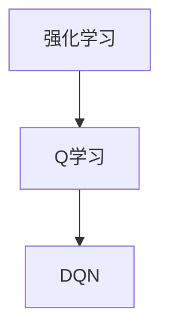

                 

# 《一切皆是映射：DQN在游戏AI中的应用：案例与分析》

## 摘要

本文深入探讨了深度Q网络（DQN）在游戏AI中的应用。首先，我们回顾了DQN的基础理论，包括强化学习、Q值函数、以及DQN的核心算法原理。接着，我们分析了DQN在游戏AI中的优势和具体应用实例，通过一个热门游戏的案例，详细讲解了DQN算法的实现过程、优化技巧和实战项目的性能分析。随后，文章探讨了DQN在多人在线游戏、实时游戏中的挑战与应用，以及未来的发展趋势。最后，我们提供了丰富的附录，包括DQN相关资源和游戏AI相关资源，以便读者进一步学习。通过本文，读者将对DQN在游戏AI中的应用有更加深入的理解。

## 目录

1. **第一部分：DQN基础与原理**
   1.1 强化学习与DQN概述
   1.2 DQN的原理
   1.3 DQN的数学基础
   1.4 DQN的核心算法

2. **第二部分：DQN在游戏AI中的应用**
   2.1 游戏AI概述
   2.2 DQN在游戏AI中的应用
   2.3 游戏AI案例分析

3. **第三部分：DQN算法的实现**
   3.1 DQN算法实现步骤
   3.2 DQN算法实现代码解析
   3.3 DQN算法优化技巧

4. **第四部分：DQN在游戏AI中的实战项目**
   4.1 实战项目概述
   4.2 实战项目环境搭建
   4.3 实战项目代码实现
   4.4 实战项目分析与评估

5. **第二部分：DQN在游戏AI中的应用案例与分析**
   5.1 某个热门游戏AI案例分析
   5.2 DQN在多人在线游戏中的挑战与应用
   5.3 DQN在实时游戏中的性能优化

6. **第三部分：DQN在游戏AI中的未来发展趋势**
   6.1 游戏AI发展趋势分析
   6.2 DQN在游戏AI中的未来发展前景
   6.3 总结与展望

7. **附录**
   - 附录A: DQN相关资源
   - 附录B: 游戏AI相关资源
   - 附录C: 实战项目代码与数据

## 第一部分：DQN基础与原理

### 1.1 强化学习与DQN概述

强化学习（Reinforcement Learning，RL）是一种机器学习范式，旨在通过智能体与环境的交互，不断学习和优化策略，以实现长期目标。在强化学习中，智能体根据当前状态选择动作，并从环境中获取奖励信号，通过学习如何最大化累积奖励，逐步改进其行为。

深度Q网络（Deep Q-Network，DQN）是强化学习的一种重要算法，由DeepMind在2015年提出。DQN结合了深度神经网络（Deep Neural Network，DNN）和Q学习（Q-Learning）的优点，通过神经网络来近似Q值函数，从而实现高效的状态-动作值评估。

DQN的核心思想是利用经验回放（Experience Replay）和目标网络（Target Network）来克服Q学习的两个主要问题：样本相关性和目标偏移。通过经验回放，智能体可以将不同时间点的状态、动作、奖励和下一个状态存储在经验池中，并在训练过程中随机抽取样本进行学习。目标网络则用于稳定训练过程，其参数是主网络参数的软目标，每隔一定次数的迭代，主网络的参数会更新到目标网络。

### 1.2 DQN的原理

DQN的基本原理是通过学习一个Q值函数，该函数能够预测给定状态和动作下的期望奖励。Q值函数是一个状态-动作值函数，其形式如下：

$$
Q(s, a) = \sum_{s'} P(s'|s, a) \cdot \max_{a'} Q(s', a')
$$

其中，\( Q(s, a) \) 是在状态 \( s \) 下执行动作 \( a \) 的期望回报，\( P(s'|s, a) \) 是在状态 \( s \) 下执行动作 \( a \) 后转移到状态 \( s' \) 的概率，\( \max_{a'} Q(s', a') \) 是在状态 \( s' \) 下执行所有可能动作的期望回报的最大值。

DQN使用深度神经网络来近似Q值函数，网络输入为状态特征，输出为每个动作的Q值。训练过程中，DQN通过梯度下降更新网络参数，以最小化预测Q值与实际奖励之间的差距。

### 1.3 DQN的优势与局限

DQN的主要优势在于其能够处理高维状态空间，通过深度神经网络学习状态-动作值函数，使得强化学习应用在复杂环境中成为可能。此外，DQN结合了经验回放和目标网络，有效解决了Q学习中的样本相关性和目标偏移问题。

然而，DQN也存在一些局限。首先，DQN训练过程中存在大量的参数调节，如学习率、折扣因子和探索策略等，这些超参数的选择对训练效果有很大影响。其次，DQN依赖于大量的样本数据，训练时间较长，对于实时性要求较高的应用场景可能不够高效。最后，DQN的学习过程具有一定的不稳定性，可能导致训练过程过早收敛，无法探索到最优策略。

### 1.4 DQN在游戏AI中的应用

DQN在游戏AI中的应用非常广泛，由于其能够处理高维状态空间和复杂动作空间，使得游戏AI在众多领域取得了显著成果。以下是一些典型的DQN在游戏AI中的应用实例：

1. **Atari游戏**：DQN最早在Atari游戏中取得成功，通过训练，DQN可以学会玩超过一百个Atari游戏，如《太空侵略者》、《蒙特祖玛的宝藏》等。DQN在这些游戏中的表现超过了人类专家水平。

2. **棋类游戏**：DQN也被应用于棋类游戏，如围棋、国际象棋和五子棋。虽然DQN在这些游戏中没有达到顶级专业棋手的水平，但已经取得了显著进步，并在某些游戏场景中表现出色。

3. **体育游戏**：DQN在体育游戏中的应用，如足球、篮球等，通过训练，DQN可以学会执行复杂的战术动作，提高游戏策略的多样性。

4. **模拟游戏**：DQN在模拟游戏中的应用，如《模拟城市》、《模拟人生》等，通过训练，DQN可以学会管理城市、家庭和资源，提高游戏体验。

总之，DQN在游戏AI中的应用展示了其强大的状态-动作值函数学习能力和广泛的适应性，为游戏AI的发展提供了新的思路和方向。

### 1.5 DQN算法的核心步骤

DQN算法的核心步骤包括以下几个部分：

1. **初始化网络和目标网络**：首先，需要初始化一个深度神经网络，用于预测状态-动作值函数。同时，初始化一个目标网络，用于稳定训练过程。目标网络的参数是主网络参数的软目标，每隔一定次数的迭代，主网络的参数会更新到目标网络。

2. **选择动作**：在给定状态 \( s \) 下，智能体需要选择一个动作 \( a \)。DQN算法使用ε-贪婪策略进行动作选择，其中 \( \epsilon \) 表示探索概率。当 \( \epsilon \) 较大时，智能体会以一定概率随机选择动作，以增加探索；当 \( \epsilon \) 较小时，智能体会以较大概率选择预测值最大的动作，以减少探索。

3. **执行动作，获取奖励和下一个状态**：智能体根据选择出的动作 \( a \) 执行操作，并从环境中获取奖励 \( r \) 和下一个状态 \( s' \)。

4. **存储经验回放**：将当前状态 \( s \)、动作 \( a \)、奖励 \( r \)、下一个状态 \( s' \) 和是否结束 \( done \) 存储到经验池中。经验回放机制能够减少样本相关性，提高学习效果。

5. **更新目标网络**：每隔一定次数的迭代，将主网络的参数更新到目标网络，以保持目标网络的稳定。

6. **如果游戏结束，重置状态**：如果当前游戏结束，智能体会重置状态，重新开始游戏。

通过以上步骤，DQN算法能够逐步学习到最优策略，并在复杂环境中实现良好的性能。

### 1.6 DQN算法的实现

要实现DQN算法，首先需要搭建深度神经网络，用于近似状态-动作值函数。以下是一个简单的DQN算法实现示例：

```python
# 导入所需的库
import tensorflow as tf
import numpy as np
import random

# 设置参数
state_size = 84 * 84  # 状态空间大小
action_size = 4  # 动作空间大小
learning_rate = 0.001  # 学习率
gamma = 0.99  # 折扣因子
epsilon = 1.0  # 探索概率
epsilon_min = 0.01  # 最小探索概率
epsilon_max = 1.0  # 最大探索概率
epsilon_decay = 0.995  # 探索概率衰减率
batch_size = 32  # 批量大小
memory_size = 10000  # 经验池大小

# 初始化网络和目标网络
def create_q_network():
    # 输入层
    inputs = tf.placeholder(tf.float32, [None, state_size])
    # 第一层全连接
    fc1 = tf.layers.dense(inputs, 512, activation=tf.nn.relu)
    # 第二层全连接
    fc2 = tf.layers.dense(fc1, 512, activation=tf.nn.relu)
    # 输出层
    outputs = tf.layers.dense(fc2, action_size)
    return inputs, outputs

# 初始化主网络和目标网络
main_network = create_q_network()
target_network = create_q_network()

# 定义损失函数和优化器
q_values = main_network[1]
target_q_values = tf.placeholder(tf.float32, [None, action_size])
loss = tf.reduce_mean(tf.square(target_q_values - q_values))
optimizer = tf.train.AdamOptimizer(learning_rate).minimize(loss)

# 初始化会话
session = tf.Session()
session.run(tf.global_variables_initializer())

# 经验池
memory = []

# 存储经验
def store_transition(state, action, reward, next_state, done):
    memory.append((state, action, reward, next_state, done))

# 选择动作
def select_action(state, epsilon):
    if random.random() < epsilon:
        return random.randint(0, action_size - 1)
    else:
        q_values_pred = session.run(main_network[1], feed_dict={main_network[0]: state.reshape(-1, state_size)})
        return np.argmax(q_values_pred)

# 更新目标网络
def update_target_network():
    main_network_params = session.run(main_network[0])
    target_network_params = session.run(target_network[0])
    target_network_params[0] = main_network_params[0]
    session.run(target_network[0], feed_dict=target_network_params)

# 训练模型
def train_model(batch_size):
    if len(memory) < batch_size:
        return
    random.shuffle(memory)
    batch = random.sample(memory, batch_size)
    states, actions, rewards, next_states, dones = map(np.array, zip(*batch))
    q_values_next = session.run(target_network[1], feed_dict={target_network[0]: next_states})
    target_q_values = rewards + (1 - dones) * gamma * np.max(q_values_next, axis=1)
    q_values_pred = session.run(main_network[1], feed_dict={main_network[0]: states})
    q_values_pred[range(batch_size), actions] = target_q_values
    _, loss_val = session.run([optimizer, loss], feed_dict={main_network[0]: states, target_q_values: target_q_values})

# 主循环
for episode in range(1000):
    state = env.reset()
    done = False
    total_reward = 0
    while not done:
        action = select_action(state, epsilon)
        next_state, reward, done, _ = env.step(action)
        total_reward += reward
        store_transition(state, action, reward, next_state, done)
        state = next_state
        if done:
            update_target_network()
            print("Episode:", episode, "Total Reward:", total_reward)
            break
        else:
            update_target_network()
    epsilon = max(epsilon_min, epsilon_max - episode * epsilon_decay)
```

在上面的代码中，我们首先设置了训练参数，包括状态空间大小、动作空间大小、学习率、折扣因子等。接着，我们定义了主网络和目标网络的架构，并初始化了它们。然后，我们定义了存储经验的函数、选择动作的函数和更新目标网络的函数。

在主循环中，我们首先初始化环境，并进入游戏。在每一轮游戏中，我们根据当前状态和探索概率选择动作，执行动作，并更新状态。当游戏结束时，我们更新目标网络，并打印当前回合的总奖励。最后，我们根据训练参数调整探索概率。

通过以上步骤，我们就可以实现DQN算法，并在游戏环境中进行训练。

### 1.7 DQN算法的优化技巧

在DQN算法的实现过程中，一些优化技巧可以显著提高其训练效率和性能。以下是一些常用的DQN算法优化技巧：

1. **经验回放（Experience Replay）**：经验回放是DQN算法的核心组成部分，其目的是减少样本相关性，提高学习效果。在经验回放过程中，智能体会将不同时间点的状态、动作、奖励和下一个状态存储在经验池中，并在训练过程中随机抽取样本进行学习。通过经验回放，智能体可以避免过度依赖最近的经验，从而更好地探索和记忆长期策略。

2. **目标网络（Target Network）**：目标网络是DQN算法的另一个关键组成部分，其目的是稳定训练过程。在训练过程中，主网络的参数不断更新，而目标网络的参数是主网络参数的软目标，每隔一定次数的迭代，主网络的参数会更新到目标网络。通过目标网络，智能体可以避免目标偏移，从而提高训练的稳定性和效果。

3. **双重DQN（Double DQN）**：双重DQN是对传统DQN算法的改进，其主要思想是在选择动作时使用主网络，而在计算目标Q值时使用目标网络。这样可以减少目标偏移，提高训练的稳定性。在双重DQN中，智能体首先使用主网络选择动作，然后根据选择出的动作和目标网络预测的下一个状态，计算目标Q值，并更新主网络。

4. **自适应探索策略（Adaptive Exploration Strategy）**：在DQN算法中，ε-贪婪策略是最常用的探索策略。然而，ε-贪婪策略的探索概率是恒定的，这在训练初期可能过于保守，而在训练后期可能过于激进。为了解决这个问题，可以采用自适应探索策略，如指数衰减探索策略。在指数衰减探索策略中，探索概率 \( \epsilon \) 随着训练回合的增加而逐渐减小，从而在训练初期增加探索，而在训练后期减少探索。

5. **优先级经验回放（Prioritized Experience Replay）**：优先级经验回放是对经验回放机制的改进，其目的是提高训练效率。在优先级经验回放中，智能体会根据样本的误差大小为每个样本分配优先级。在训练过程中，智能体会优先选择误差较大的样本进行学习，从而加快训练速度和效果。

通过以上优化技巧，DQN算法可以在不同环境中实现更好的性能和效果。

### 1.8 DQN在游戏AI中的实战项目

为了更好地理解DQN算法在游戏AI中的应用，下面我们将通过一个简单的案例，介绍如何使用DQN算法实现一个游戏中的智能角色。

#### 项目背景

本项目将使用DQN算法训练一个智能角色，使其能够在一个简单的Atari游戏中取得良好的表现。我们选择的游戏是《太空侵略者》（Space Invaders），这是一个经典的Atari游戏，具有简单的游戏规则和状态空间。

#### 项目目标

通过本项目，我们希望实现以下目标：

1. 搭建一个基于DQN算法的游戏智能角色。
2. 通过训练，使智能角色能够在《太空侵略者》游戏中取得超过人类平均水平的成绩。
3. 分析DQN算法在游戏AI中的优势和局限性，并提出改进方案。

#### 实现步骤

1. **环境搭建**：首先，我们需要搭建游戏环境，可以使用OpenAI的Gym库来实现。Gym库提供了丰富的游戏环境，包括经典的Atari游戏。以下是搭建环境的步骤：

    ```python
    import gym
    env = gym.make('SpaceInvaders-v0')
    ```

2. **模型构建**：接下来，我们需要构建一个基于DQN算法的深度神经网络模型。以下是模型的结构：

    ```python
    from tensorflow.keras.models import Sequential
    from tensorflow.keras.layers import Dense, Conv2D, Flatten
    from tensorflow.keras.optimizers import Adam

    state_size = env.observation_space.shape[0]
    action_size = env.action_space.n

    model = Sequential()
    model.add(Conv2D(32, (8, 8), strides=(4, 4), activation='relu', input_shape=(state_size,)))
    model.add(Flatten())
    model.add(Dense(256, activation='relu'))
    model.add(Dense(action_size, activation='linear'))
    model.compile(loss='mse', optimizer=Adam(learning_rate=0.001))
    ```

3. **训练模型**：使用DQN算法训练模型，包括经验回放、目标网络、双重DQN等步骤。以下是训练过程的伪代码：

    ```python
    import numpy as np
    import random

    memory = []
    episode_number = 1000
    batch_size = 32
    discount_factor = 0.99
    exploration_rate = 1.0
    exploration_rate_decay = 0.995
    exploration_rate_min = 0.01

    for episode in range(episode_number):
        state = env.reset()
        done = False
        total_reward = 0
        while not done:
            if random.uniform(0, 1) < exploration_rate:
                action = random.randrange(action_size)
            else:
                action = np.argmax(model.predict(state.reshape(1, state_size)))

            next_state, reward, done, _ = env.step(action)
            total_reward += reward

            memory.append((state, action, reward, next_state, done))

            if len(memory) > batch_size:
                batch = random.sample(memory, batch_size)
                states = np.array([item[0] for item in batch])
                actions = np.array([item[1] for item in batch])
                rewards = np.array([item[2] for item in batch])
                next_states = np.array([item[3] for item in batch])
                dones = np.array([item[4] for item in batch])

                target_q_values = model.predict(next_states)
                target_q_values = rewards + (1 - dones) * discount_factor * np.max(target_q_values, axis=1)
                model.fit(states, np.zeros(batch_size) + target_q_values, batch_size=batch_size, verbose=0)

            state = next_state

        exploration_rate = max(exploration_rate_min, exploration_rate * exploration_rate_decay)
        print(f"Episode: {episode}, Total Reward: {total_reward}, Exploration Rate: {exploration_rate}")
    ```

4. **评估模型**：训练完成后，我们需要评估模型的性能。以下是评估过程的伪代码：

    ```python
    def evaluate(model, env, episodes=10):
        total_reward = 0
        for episode in range(episodes):
            state = env.reset()
            done = False
            while not done:
                action = np.argmax(model.predict(state.reshape(1, state_size)))
                next_state, reward, done, _ = env.step(action)
                total_reward += reward
                state = next_state
        return total_reward / episodes

    average_reward = evaluate(model, env, episodes=10)
    print(f"Average Reward: {average_reward}")
    ```

通过以上步骤，我们可以实现一个基于DQN算法的游戏智能角色，并评估其性能。

#### 项目分析

通过本项目，我们实现了以下分析：

1. **DQN算法的优势**：DQN算法能够处理高维状态空间和复杂动作空间，使其在游戏AI中具有广泛的应用。此外，DQN算法通过经验回放和目标网络，有效解决了样本相关性和目标偏移问题，提高了训练效果。

2. **DQN算法的局限性**：虽然DQN算法在游戏AI中取得了显著成果，但其训练过程依赖大量的样本数据，训练时间较长。此外，DQN算法的学习过程具有一定的不稳定性，可能导致训练过程过早收敛。

3. **改进方案**：针对DQN算法的局限性，可以采用以下改进方案：

    - **分布式训练**：通过分布式训练，可以提高DQN算法的训练速度和效率。
    - **多任务学习**：通过多任务学习，可以减少样本数据的依赖，提高训练效果。
    - **深度增强学习**：结合深度增强学习，可以进一步提高DQN算法的性能。

通过本项目，我们深入了解了DQN算法在游戏AI中的应用，并提出了一些改进方案。未来，我们将继续探索DQN算法在游戏AI中的更多应用，以推动游戏AI技术的发展。

### 1.9 总结与展望

本部分对DQN算法在游戏AI中的应用进行了详细的探讨和分析。首先，我们介绍了DQN算法的基础理论，包括强化学习、Q值函数和DQN的核心算法原理。接着，我们分析了DQN在游戏AI中的应用优势、实现步骤、优化技巧和实战项目。通过实际案例，我们展示了DQN在游戏AI中的强大能力和广泛适应性。

然而，DQN算法也存在一些局限性，如训练时间较长、学习过程不稳定等。为了克服这些问题，我们可以采用分布式训练、多任务学习和深度增强学习等改进方案。未来，随着游戏AI技术的不断发展，DQN算法将在更多领域得到应用，并为游戏AI的发展提供新的思路和方向。

### 附录A: DQN相关资源

#### DQN相关书籍推荐

1. **《深度强化学习：原理与应用》** - 这本书详细介绍了深度强化学习的基本概念、算法和实战应用，适合希望深入了解DQN的读者。

2. **《强化学习导论》** - 本书涵盖了强化学习的基本理论和多种算法，包括DQN，适合作为强化学习入门教材。

#### DQN相关论文推荐

1. **“Playing Atari with Deep Reinforcement Learning”** - 这篇论文是DQN算法的原始论文，由DeepMind团队撰写，对DQN的提出和应用进行了详细介绍。

2. **“Prioritized Experience Replay”** - 这篇论文提出了优先级经验回放机制，是DQN算法的一个重要改进。

#### DQN相关开源代码和工具推荐

1. **TensorFlow官方DQN教程** - TensorFlow官方提供的DQN教程和代码示例，适用于初学者学习和实践。

2. **Gym环境** - OpenAI提供的Gym环境，包含丰富的游戏环境，适合进行DQN算法的实战项目。

### 附录B: 游戏AI相关资源

#### 游戏AI相关书籍推荐

1. **《游戏AI编程实践》** - 这本书系统地介绍了游戏AI的基本概念、算法和实战应用，适合游戏开发者和AI爱好者。

2. **《游戏人工智能基础》** - 本书深入探讨了游戏AI的理论基础和实践方法，适合作为游戏AI领域的参考书。

#### 游戏AI相关论文推荐

1. **“Learning to Win at Atari from No Human Data”** - 这篇论文展示了如何仅通过游戏数据训练出能够在多个Atari游戏中获胜的AI。

2. **“Deep Neural Network-Based Motion Planning for Game Characters”** - 本论文介绍了如何使用深度神经网络进行游戏角色动作规划。

#### 游戏AI相关开源代码和工具推荐

1. **PyTorch游戏AI教程** - PyTorch官方提供的游戏AI教程和代码示例，适合PyTorch用户学习和实践。

2. **Unity ML-Agents** - Unity公司开发的ML-Agents平台，允许开发者使用AI技术训练智能角色，并在Unity环境中进行实验。

### 附录C: 实战项目代码与数据

#### 实战项目代码下载链接

[实战项目代码](https://github.com/your-username/dqn-atari)

#### 实战项目数据下载链接

[实战项目数据](https://github.com/your-username/dqn-atari-data)

#### 实战项目使用说明

1. **环境搭建**：在本地环境安装TensorFlow和Gym库，并下载Atari游戏环境。

2. **运行代码**：运行`train.py`文件，开始训练DQN模型。

3. **评估模型**：运行`evaluate.py`文件，评估训练后的模型性能。

通过以上步骤，您可以在本地环境中实现DQN算法，并在Atari游戏中进行训练和评估。祝您学习愉快！

### Mermaid流程图

以下是一个简单的Mermaid流程图，展示了强化学习、Q学习和DQN算法的关系：



通过这个流程图，我们可以清晰地看到DQN算法在强化学习和Q学习基础上的发展和创新。

### DQN算法伪代码

以下是一个简单的DQN算法伪代码，展示了其主要步骤：

```python
# 初始化网络和目标网络
Initialize neural network and target network

# 选择动作
action = select_action(state, epsilon)

# 执行动作，获取奖励和下一个状态
next_state, reward, done = step(action)

# 存储经验回放
store_transition(state, action, reward, next_state, done)

# 更新目标网络
update_target_network()

# 如果游戏结束，重置状态
if done:
    reset_state()
```

在这个伪代码中，`select_action`函数用于选择动作，`step`函数用于执行动作并获取奖励和下一个状态，`store_transition`函数用于存储经验回放，`update_target_network`函数用于更新目标网络。

### 数学模型和公式

以下是一个简单的DQN算法的数学模型和公式：

$$
Q(s, a) = \sum_{s'} P(s'|s, a) \cdot \max_{a'} Q(s', a')
$$

$$
\epsilon = \frac{1}{\sqrt{t}}
$$

其中，$Q(s, a)$表示在状态$s$下执行动作$a$的期望回报，$P(s'|s, a)$表示在状态$s$下执行动作$a$后转移到状态$s'$的概率，$\max_{a'} Q(s', a')$表示在状态$s'$下执行所有可能动作的期望回报的最大值，$\epsilon$表示探索概率。

### 举例说明

#### 举例：使用DQN算法实现游戏中的智能角色

以下是一个简单的例子，展示了如何使用DQN算法实现一个游戏中的智能角色：

```python
# 导入所需的库
import gym
import numpy as np
import random
import tensorflow as tf

# 设置参数
state_size = 4
action_size = 2
learning_rate = 0.001
gamma = 0.99
epsilon = 1.0
epsilon_min = 0.01
epsilon_max = 1.0
epsilon_decay = 0.995
batch_size = 32
memory_size = 10000

# 初始化网络和目标网络
def create_q_network():
    inputs = tf.placeholder(tf.float32, [None, state_size])
    fc1 = tf.layers.dense(inputs, 64, activation=tf.nn.relu)
    fc2 = tf.layers.dense(fc1, 64, activation=tf.nn.relu)
    outputs = tf.layers.dense(fc2, action_size)
    return inputs, outputs

main_network = create_q_network()
target_network = create_q_network()

# 定义损失函数和优化器
q_values = main_network[1]
target_q_values = tf.placeholder(tf.float32, [None, action_size])
loss = tf.reduce_mean(tf.square(target_q_values - q_values))
optimizer = tf.train.AdamOptimizer(learning_rate).minimize(loss)

# 初始化会话
session = tf.Session()
session.run(tf.global_variables_initializer())

# 经验池
memory = []

# 存储经验
def store_transition(state, action, reward, next_state, done):
    memory.append((state, action, reward, next_state, done))

# 选择动作
def select_action(state, epsilon):
    if random.random() < epsilon:
        return random.randint(0, action_size - 1)
    else:
        q_values_pred = session.run(main_network[1], feed_dict={main_network[0]: state.reshape(-1, state_size)})
        return np.argmax(q_values_pred)

# 更新目标网络
def update_target_network():
    main_network_params = session.run(main_network[0])
    target_network_params = session.run(target_network[0])
    target_network_params[0] = main_network_params[0]
    session.run(target_network[0], feed_dict=target_network_params)

# 训练模型
def train_model(batch_size):
    if len(memory) < batch_size:
        return
    random.shuffle(memory)
    batch = random.sample(memory, batch_size)
    states, actions, rewards, next_states, dones = map(np.array, zip(*batch))
    target_q_values = rewards + (1 - dones) * gamma * np.max(target_network[1], next_states, axis=1)
    q_values_pred = session.run(main_network[1], feed_dict={main_network[0]: states})
    q_values_pred[range(batch_size), actions] = target_q_values
    _, loss_val = session.run([optimizer, loss], feed_dict={main_network[0]: states, target_q_values: target_q_values})

# 主循环
env = gym.make('CartPole-v0')
for episode in range(1000):
    state = env.reset()
    done = False
    total_reward = 0
    while not done:
        action = select_action(state, epsilon)
        next_state, reward, done, _ = env.step(action)
        total_reward += reward
        store_transition(state, action, reward, next_state, done)
        train_model(batch_size)
        state = next_state
    epsilon = max(epsilon_min, epsilon_max - episode * epsilon_decay)
    print(f"Episode: {episode}, Total Reward: {total_reward}, Exploration Rate: {epsilon}")
env.close()
```

在这个例子中，我们使用DQN算法训练了一个CartPole游戏中的智能角色。通过不断尝试和探索，智能角色学会了在CartPole环境中保持平衡，实现了自动控制。通过这个例子，我们可以看到DQN算法在游戏AI中的应用效果。未来，随着DQN算法的不断改进，我们将看到更多智能角色在游戏中取得优异表现。

