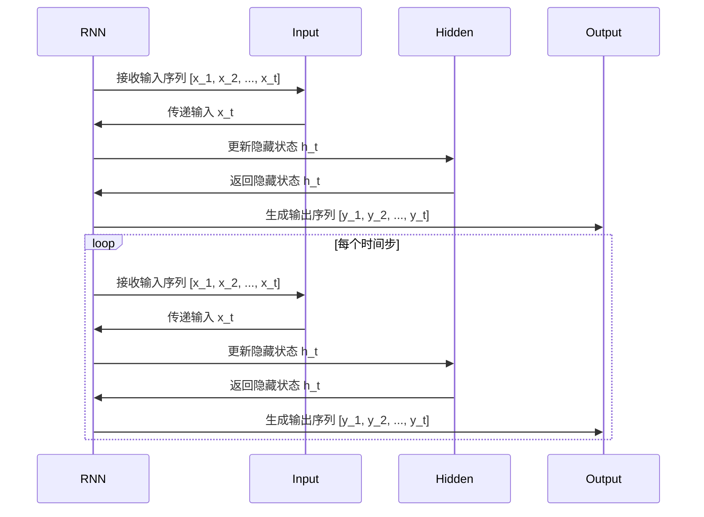
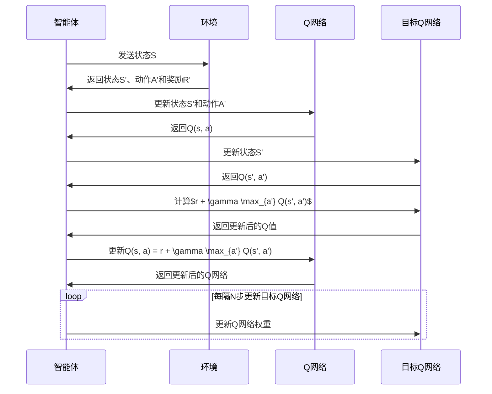
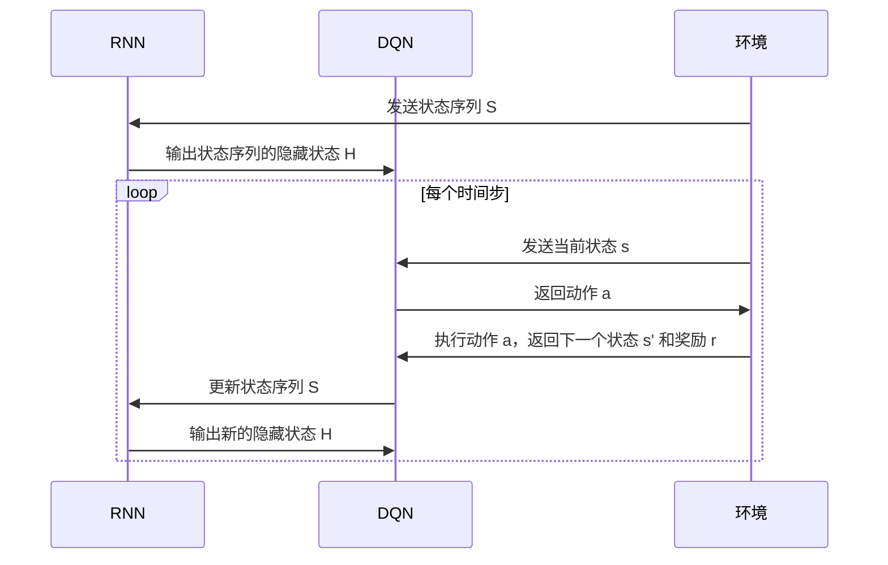

                 

### 1.1 引言

在人工智能领域，序列决策问题是一个重要且广泛的研究方向。这类问题常见于各种实际应用场景，如游戏AI、自动驾驶、推荐系统等。序列决策问题涉及一系列连续的决策，每个决策都基于当前状态和过去的决策历史。因此，如何有效地处理这些序列数据，并在动态环境中做出最优决策，成为研究的核心问题。

循环神经网络（Recurrent Neural Network，RNN）是处理序列数据的一种经典模型。RNN通过其循环结构，能够保留序列中的历史信息，适用于处理时间序列和序列依赖问题。然而，传统的RNN在处理长序列数据时存在梯度消失或梯度爆炸的问题，这限制了其应用范围。

另一方面，深度Q网络（Deep Q-Network，DQN）是一种基于Q学习的强化学习算法。DQN通过深度神经网络来估计状态-动作值函数，从而在复杂的决策环境中进行学习。DQN在许多强化学习任务中取得了显著成果，但其本质上是针对单个状态进行决策，难以直接应用于序列决策问题。

为了克服这些局限性，本文将探讨RNN与DQN的结合，提出一种处理序列决策问题的新方法。通过将RNN与DQN相结合，我们希望能够充分利用RNN在序列建模方面的优势，同时利用DQN在复杂环境中的决策能力。这种结合将有助于解决传统RNN和DQN在处理序列决策问题时的不足，为实际应用提供更有效的解决方案。

### 1.2 相关研究与现状

序列决策问题在人工智能领域引起了广泛关注，许多学者和研究机构对其进行了深入研究。传统的序列决策方法主要基于马尔可夫决策过程（MDP）和强化学习算法。其中，MDP是一种基于概率转移和回报的决策模型，但其对状态和动作空间的要求较高，难以在实际复杂环境中应用。强化学习作为解决序列决策问题的重要方法，通过迭代学习和策略优化，逐渐提高了决策的准确性。

近年来，RNN在序列决策问题中的应用取得了显著成果。RNN通过其循环结构，能够处理序列数据中的长期依赖关系，为解决序列决策问题提供了有效的工具。例如，长短期记忆网络（LSTM）和门控循环单元（GRU）等改进的RNN结构，通过引入门控机制，有效解决了传统RNN的梯度消失问题，提高了模型在长序列数据上的表现。

DQN作为强化学习的一种重要算法，也展现了在序列决策问题中的潜力。DQN通过深度神经网络来近似状态-动作值函数，避免了传统Q学习算法在复杂环境中的收敛速度慢和易陷入局部最优的问题。然而，DQN本质上是针对单个状态进行决策，难以直接应用于序列决策问题。

针对这些研究现状，本文提出了一种将RNN与DQN结合的新方法。该方法通过引入RNN来处理序列数据中的依赖关系，利用DQN在复杂环境中的决策能力，实现序列决策问题的有效解决。这种结合不仅继承了RNN在序列建模方面的优势，也充分利用了DQN的决策能力，为序列决策问题提供了新的解决方案。

### 2.1 RNN基础

#### 2.1.1 RNN的基本结构

循环神经网络（Recurrent Neural Network，RNN）是一种基于循环结构的前馈神经网络，特别适用于处理序列数据。RNN的基本结构包括输入层、隐藏层和输出层。与传统的前馈神经网络不同，RNN的隐藏层具有循环连接，这意味着信息可以在不同的时间步之间传递和更新。

在RNN中，每个时间步的输入都会通过隐藏层传递，并产生一个输出。同时，隐藏层的状态会保留上一步的信息，并将其传递到下一步。这种循环连接使得RNN能够保留序列数据中的长期依赖关系，从而适用于处理时间序列和序列依赖问题。

以下是一个简单的RNN结构示意图：

```
    输入序列   隐藏层      输出序列
  [x_1, x_2, ..., x_t]  [h_1, h_2, ..., h_t]  [y_1, y_2, ..., y_t]
```

在每个时间步`t`，RNN都会接收一个输入`x_t`，并生成一个隐藏状态`h_t`和输出`y_t`。隐藏状态`h_t`不仅依赖于当前输入`x_t`，还受到前一个隐藏状态`h_{t-1}`的影响。这种循环连接使得RNN能够处理序列数据中的依赖关系。

#### 2.1.2 LSTM与GRU的原理与应用

为了解决传统RNN在处理长序列数据时存在的梯度消失和梯度爆炸问题，研究者们提出了长短期记忆网络（Long Short-Term Memory，LSTM）和门控循环单元（Gated Recurrent Unit，GRU）等改进的RNN结构。

**LSTM：**

LSTM通过引入三个门控单元（遗忘门、输入门和输出门）来控制信息的流动，从而有效地解决了梯度消失问题。LSTM的核心思想是，通过遗忘门控制过去的信息是否被遗忘，通过输入门控制新的信息是否被存储，通过输出门控制输出的信息。这种门控机制使得LSTM能够在长序列数据中保留长期依赖关系。

LSTM的基本结构如下：

```
    输入序列   隐藏层      输出序列
  [x_1, x_2, ..., x_t]  [h_1, h_2, ..., h_t]  [y_1, y_2, ..., y_t]
        ▲                ▲                 ▲
       遗忘门       输入门         输出门
```

**GRU：**

GRU是LSTM的简化版本，通过引入一个更新门和重置门来控制信息的流动。GRU通过这两个门控单元，实现了对信息的保留和更新。相较于LSTM，GRU的结构更简单，计算量更小，因此在某些应用场景中具有优势。

GRU的基本结构如下：

```
    输入序列   隐藏层      输出序列
  [x_1, x_2, ..., x_t]  [h_1, h_2, ..., h_t]  [y_1, y_2, ..., y_t]
        ▲                ▲                 ▲
       更新门       重置门         输出门
```

#### 2.1.3 Mermaid流程图：RNN结构与运作原理

为了更直观地展示RNN的结构和运作原理，我们使用Mermaid流程图来描述。



### 2.2 RNN算法详解

#### 2.2.1 RNN的数学模型

循环神经网络（RNN）的数学模型主要包括输入层、隐藏层和输出层。在每个时间步`t`，RNN接收一个输入`x_t`，并生成一个隐藏状态`h_t`和输出`y_t`。隐藏状态`h_t`不仅依赖于当前输入`x_t`，还受到前一个隐藏状态`h_{t-1}`的影响。

以下是一个简化的RNN数学模型：

\[
h_t = \sigma(W_h \cdot [h_{t-1}, x_t] + b_h)
\]

其中：
- \( h_t \)：第`t`个时间步的隐藏状态。
- \( \sigma \)：激活函数，通常使用sigmoid函数或ReLU函数。
- \( W_h \)：隐藏层权重。
- \( b_h \)：隐藏层偏置。
- \( [h_{t-1}, x_t] \)：当前输入和前一个隐藏状态的拼接。
- \( x_t \)：第`t`个时间步的输入。

#### 2.2.2 伪代码：RNN训练与预测过程

以下是一个简化的RNN训练与预测过程的伪代码：

```python
# RNN训练过程
for epoch in range(num_epochs):
    for input_sequence, target_output in data_loader:
        # 前向传播
        hidden_states = []
        hidden_state = initialize_hidden_state()
        for input_sample in input_sequence:
            hidden_state = update_hidden_state(input_sample, hidden_state)
            hidden_states.append(hidden_state)

        # 计算损失
        loss = calculate_loss(hidden_states, target_output)

        # 反向传播
        d_hidden_states = backward_propagation(hidden_states, target_output)

        # 更新权重和偏置
        update_weights_and_biases(d_hidden_states)

# RNN预测过程
hidden_state = initialize_hidden_state()
predictions = []
for input_sample in input_sequence:
    hidden_state = update_hidden_state(input_sample, hidden_state)
    predictions.append(hidden_state)

return predictions
```

#### 2.2.3 数学公式

在RNN中，隐藏状态的计算可以通过以下公式表示：

\[
h_t = \sigma(W_h \cdot [h_{t-1}, x_t] + b_h)
\]

其中：
- \( h_t \)：第`t`个时间步的隐藏状态。
- \( \sigma \)：激活函数，如sigmoid函数或ReLU函数。
- \( W_h \)：隐藏层权重。
- \( b_h \)：隐藏层偏置。
- \( [h_{t-1}, x_t] \)：当前输入和前一个隐藏状态的拼接。

### 2.3 RNN实战案例

#### 2.3.1 代码示例：使用Python实现RNN模型

以下是一个使用Python和TensorFlow实现RNN模型的示例代码：

```python
import tensorflow as tf
from tensorflow.keras.models import Sequential
from tensorflow.keras.layers import SimpleRNN, Dense

# 数据预处理
# ...（此处省略数据预处理代码）

# 构建RNN模型
model = Sequential()
model.add(SimpleRNN(units=50, activation='relu', input_shape=(timesteps, features)))
model.add(Dense(units=1))

# 编译模型
model.compile(optimizer='adam', loss='mse')

# 训练模型
model.fit(X_train, y_train, epochs=100, batch_size=32)

# 预测
predictions = model.predict(X_test)
```

#### 2.3.2 代码解读与分析

以上代码首先导入了所需的TensorFlow库，并定义了一个序列模型。在数据预处理部分，我们通常需要对输入数据进行归一化或标准化处理，以便模型能够更好地收敛。

在构建RNN模型时，我们使用`SimpleRNN`层作为循环层，并设置了一个全连接层`Dense`作为输出层。在编译模型时，我们选择`adam`优化器和均方误差`mse`损失函数。

在训练模型时，我们使用`fit`方法，将训练数据和标签传入模型进行训练。训练过程中，模型会通过反向传播更新权重和偏置，以达到最小化损失函数的目的。

最后，在预测阶段，我们使用`predict`方法对测试数据进行预测，并获取预测结果。

通过这个实战案例，我们可以了解到如何使用Python和TensorFlow实现RNN模型，并进行训练和预测。在实际应用中，我们可以根据具体任务的需求，调整模型的架构和参数，以提高模型的性能。

### 3.1 DQN基础

#### 3.1.1 DQN的基本结构

深度Q网络（Deep Q-Network，DQN）是一种基于深度学习的强化学习算法，旨在解决传统的Q学习算法在复杂环境中的收敛速度慢和易陷入局部最优的问题。DQN通过使用深度神经网络（DNN）来近似状态-动作值函数（Q函数），从而实现智能体的学习与决策。

DQN的基本结构主要包括四个部分：状态输入层、动作选择层、Q网络和目标Q网络。以下是一个简化的DQN结构示意图：

```
      状态输入层                动作选择层
      S -> Q_network -> A       S' -> Target_Q_network
          |                      |
          |                      |
          |                      |
      R   +----------------------> R'
          |
          |
          |
      done?   +----------------------> done?
```

其中：
- 状态输入层：接收智能体当前状态`S`，并将其输入到Q网络中。
- 动作选择层：Q网络根据当前状态`S`，输出各动作的Q值，智能体选择具有最大Q值的动作`A`。
- Q网络：一个深度神经网络，用于估计状态-动作值函数`Q(S, A)`。
- 目标Q网络：与Q网络结构相同，用于存储目标Q值，并在一定频率更新。

#### 3.1.2 Q-learning算法的原理与应用

Q-learning算法是一种基于值迭代的强化学习算法，旨在通过学习状态-动作值函数，实现智能体在环境中的最优策略。Q-learning的基本原理如下：

1. **初始化：** 初始化Q值表`Q(s, a)`，通常初始化为随机值。
2. **选择动作：** 根据当前状态`S`，选择具有最大Q值的动作`A`。
3. **执行动作：** 在环境中执行选择出的动作`A`，并获取新的状态`S'`和奖励`R`。
4. **更新Q值：** 根据新的状态`S'`和奖励`R`，更新Q值表`Q(s, a)`。
5. **重复步骤2-4：** 重复上述步骤，直到达到某个终止条件（如达到最大步数或目标状态）。

Q-learning算法的关键在于更新Q值的公式：

\[
Q(s, a) = r + \gamma \max_{a'} Q(s', a')
\]

其中：
- \( Q(s, a) \)：当前状态`s`下，执行动作`a`的Q值。
- \( r \)：立即奖励。
- \( \gamma \)：折扣因子，用于平衡当前奖励与未来奖励之间的关系。
- \( \max_{a'} Q(s', a') \)：在下一个状态`s'`下，选择具有最大Q值的动作。

#### 3.1.3 Mermaid流程图：DQN结构与运作原理

为了更直观地展示DQN的结构和运作原理，我们使用Mermaid流程图来描述。



### 3.2 DQN算法详解

#### 3.2.1 DQN的数学模型

深度Q网络（DQN）通过深度神经网络（DNN）来近似状态-动作值函数（Q函数）。在DQN中，状态-动作值函数的估计公式与Q-learning算法相同：

\[
Q(s, a) = r + \gamma \max_{a'} Q(s', a')
\]

其中：
- \( Q(s, a) \)：当前状态`s`下，执行动作`a`的Q值。
- \( r \)：立即奖励。
- \( \gamma \)：折扣因子，用于平衡当前奖励与未来奖励之间的关系。
- \( \max_{a'} Q(s', a') \)：在下一个状态`s'`下，选择具有最大Q值的动作。

与Q-learning算法不同的是，DQN使用深度神经网络来估计Q值，从而能够处理高维状态空间和动作空间。

以下是一个简化的DQN数学模型：

\[
Q(s, a) = f_{\theta}(s, a)
\]

其中：
- \( f_{\theta}(s, a) \)：深度神经网络，参数为\(\theta\)。

#### 3.2.2 伪代码：DQN训练与预测过程

以下是一个简化的DQN训练与预测过程的伪代码：

```python
# DQN训练过程
for episode in range(num_episodes):
    state = env.reset()
    done = False
    total_reward = 0

    while not done:
        # 选择动作
        action = choose_action(state, Q_network)

        # 执行动作
        next_state, reward, done, _ = env.step(action)

        # 更新经验回放
        replay_memory.push((state, action, reward, next_state, done))

        # 更新Q值
        if len(replay_memory) > batch_size:
            batch = replay_memory.sample(batch_size)
            Q_targets = compute_Q_targets(batch, target_Q_network)

            Q_update = Q_network.train_on_batch(batch, Q_targets)

            # 更新目标Q网络
            if episode % target_update_frequency == 0:
                target_Q_network.update_weights(Q_network.get_weights())

        # 更新状态
        state = next_state
        total_reward += reward

    print(f"Episode {episode}: Total Reward = {total_reward}")

# DQN预测过程
state = env.reset()
done = False
total_reward = 0

while not done:
    action = choose_action(state, Q_network)
    next_state, reward, done, _ = env.step(action)
    total_reward += reward
    state = next_state

print(f"Total Reward = {total_reward}")
```

#### 3.2.3 数学公式

在DQN中，Q值的更新公式如下：

\[
Q(s, a) \leftarrow r + \gamma \max_{a'} Q(s', a')
\]

其中：
- \( Q(s, a) \)：当前状态`s`下，执行动作`a`的Q值。
- \( r \)：立即奖励。
- \( \gamma \)：折扣因子。
- \( \max_{a'} Q(s', a') \)：在下一个状态`s'`下，选择具有最大Q值的动作。

另外，DQN中常用的目标Q网络更新公式如下：

\[
\theta_{\text{target}} \leftarrow \tau \theta + (1 - \tau) \theta_{\text{target}}
\]

其中：
- \( \theta \)：当前Q网络的参数。
- \( \theta_{\text{target}} \)：目标Q网络的参数。
- \( \tau \)：更新频率。

### 3.3 DQN实战案例

#### 3.3.1 代码示例：使用Python实现DQN模型

以下是一个使用Python和TensorFlow实现DQN模型的示例代码：

```python
import tensorflow as tf
import numpy as np
import random

# 模型参数
learning_rate = 0.001
gamma = 0.9
epsilon = 0.1
epsilon_decay = 0.995
epsilon_min = 0.01
batch_size = 32
discount_factor = 0.99
memory_size = 1000

# 创建经验回放记忆库
class ReplayMemory:
    def __init__(self, capacity):
        self.capacity = capacity
        self.memory = []

    def push(self, experience):
        if len(self.memory) >= self.capacity:
            self.memory.pop(0)
        self.memory.append(experience)

    def sample(self, batch_size):
        return random.sample(self.memory, batch_size)

# 创建DQN模型
model = tf.keras.Sequential([
    tf.keras.layers.Dense(64, activation='relu', input_shape=(num_states,)),
    tf.keras.layers.Dense(64, activation='relu'),
    tf.keras.layers.Dense(num_actions)
])

# 创建目标Q网络
target_model = tf.keras.Sequential([
    tf.keras.layers.Dense(64, activation='relu', input_shape=(num_states,)),
    tf.keras.layers.Dense(64, activation='relu'),
    tf.keras.layers.Dense(num_actions)
])

# 设置目标Q网络权重更新策略
def update_target_network():
    target_model.set_weights(model.get_weights())

# 编译模型
model.compile(optimizer=tf.keras.optimizers.Adam(learning_rate), loss='mse')

# 训练模型
for episode in range(num_episodes):
    state = env.reset()
    done = False
    total_reward = 0

    while not done:
        # 选择动作
        if random.random() < epsilon:
            action = random.choice(env.action_space)
        else:
            action = model.predict(state.reshape(1, -1))[0]

        # 执行动作
        next_state, reward, done, _ = env.step(action)
        total_reward += reward

        # 更新经验回放记忆库
        memory.push((state, action, reward, next_state, done))

        # 更新状态
        state = next_state

        # 更新epsilon
        epsilon = max(epsilon_decay * epsilon, epsilon_min)

    print(f"Episode {episode}: Total Reward = {total_reward}")

    # 更新目标Q网络
    if episode % target_update_frequency == 0:
        update_target_network()

# 评估模型
state = env.reset()
done = False
total_reward = 0

while not done:
    action = model.predict(state.reshape(1, -1))[0]
    next_state, reward, done, _ = env.step(action)
    total_reward += reward
    state = next_state

print(f"Total Reward = {total_reward}")
```

#### 3.3.2 代码解读与分析

以上代码首先导入了所需的TensorFlow库和Numpy库，并定义了一些模型参数，如学习率、折扣因子、epsilon等。接下来，我们创建了一个经验回放记忆库`ReplayMemory`，用于存储环境中的经验数据。

在创建DQN模型时，我们使用了一个简单的序列模型，包含两个全连接层。目标Q网络`target_model`与DQN模型`model`具有相同的结构，用于存储目标Q值。

在编译模型时，我们选择了一个Adam优化器和均方误差`mse`损失函数。

在训练模型时，我们使用了一个循环结构，模拟环境中的每个episode。在每个episode中，智能体会根据当前状态选择动作，并执行动作获取奖励。同时，我们更新经验回放记忆库，并在一定频率下更新目标Q网络。

在评估模型时，我们使用训练好的DQN模型对环境进行测试，并计算总奖励。

通过这个实战案例，我们可以了解到如何使用Python和TensorFlow实现DQN模型，并进行训练和评估。在实际应用中，我们可以根据具体任务的需求，调整模型的架构和参数，以提高模型的性能。

### 4.1 RNN与DQN的结合原理

将循环神经网络（RNN）与深度Q网络（DQN）结合，可以充分利用两者的优势，解决序列决策问题。RNN在处理序列数据方面具有独特的优势，能够捕捉到数据中的长期依赖关系；而DQN在复杂环境中进行决策时，能够通过学习状态-动作值函数，实现智能体的策略优化。两者的结合，不仅能够提高序列决策问题的解决能力，还能够增强模型在动态环境中的适应能力。

#### 4.1.1 RNN与DQN结合的优势

1. **序列建模能力：** RNN能够处理变长的序列数据，并保留序列中的长期依赖关系。通过将RNN与DQN结合，我们可以在决策过程中充分利用历史序列信息，从而提高决策的准确性。

2. **状态表示能力：** DQN通过深度神经网络来近似状态-动作值函数，能够对复杂的环境状态进行有效的表示。结合RNN，我们可以将历史序列信息融入状态表示中，进一步提高模型的决策能力。

3. **动态适应性：** RNN和DQN的结合能够使模型在动态环境中表现出更强的适应性。RNN能够处理变长的序列数据，捕捉到环境中的变化趋势；而DQN能够在复杂环境中进行实时决策，快速适应环境变化。

4. **迁移学习：** 结合了RNN和DQN的模型，可以在不同任务之间进行迁移学习。通过在不同任务中训练和优化模型，可以提高模型在序列决策问题上的泛化能力。

#### 4.1.2 Mermaid流程图：RNN与DQN结合的架构

为了更直观地展示RNN与DQN结合的架构，我们使用Mermaid流程图来描述。



在这个流程图中，RNN负责处理输入的状态序列，并输出隐藏状态；DQN基于隐藏状态进行决策，并在每个时间步更新状态序列。通过这样的架构，RNN与DQN能够协同工作，共同解决序列决策问题。

### 4.2 RNN-DQN算法详解

#### 4.2.1 RNN-DQN的数学模型

RNN-DQN算法结合了循环神经网络（RNN）与深度Q网络（DQN）的特点，通过RNN处理输入的序列数据，并将处理结果输入到DQN中进行决策。RNN-DQN的数学模型主要包括两部分：RNN部分和DQN部分。

1. **RNN部分：**

RNN部分负责处理输入的序列数据，并生成隐藏状态。假设输入序列为\(S = [s_1, s_2, ..., s_t]\)，隐藏状态为\(H = [h_1, h_2, ..., h_t]\)。

\[
h_t = \sigma(W_h \cdot [h_{t-1}, s_t] + b_h)
\]

其中：
- \(h_t\)：第\(t\)个时间步的隐藏状态。
- \(W_h\)：RNN隐藏层权重。
- \(b_h\)：RNN隐藏层偏置。
- \(\sigma\)：激活函数，如ReLU函数。

2. **DQN部分：**

DQN部分基于RNN生成的隐藏状态进行决策。假设当前隐藏状态为\(H_t = [h_1, h_2, ..., h_t]\)，动作选择为\(A_t\)。

\[
Q(H_t, a) = f_{\theta}(H_t, a)
\]

其中：
- \(Q(H_t, a)\)：基于隐藏状态\(H_t\)和动作\(a\)的Q值。
- \(f_{\theta}(H_t, a)\)：DQN的深度神经网络，参数为\(\theta\)。

Q值的更新公式为：

\[
Q(H_t, a) \leftarrow r + \gamma \max_{a'} Q(H_{t+1}, a')
\]

其中：
- \(r\)：立即奖励。
- \(\gamma\)：折扣因子。
- \(\max_{a'} Q(H_{t+1}, a')\)：在下一个隐藏状态\(H_{t+1}\)下，选择具有最大Q值的动作。

#### 4.2.2 伪代码：RNN-DQN训练与预测过程

以下是一个简化的RNN-DQN训练与预测过程的伪代码：

```python
# RNN-DQN训练过程
for episode in range(num_episodes):
    state_sequence = env.reset()
    done = False
    total_reward = 0

    while not done:
        # 使用RNN处理状态序列，生成隐藏状态
        hidden_state = RNN.process_sequence(state_sequence)

        # 选择动作
        action = DQN.choose_action(hidden_state)

        # 执行动作
        next_state_sequence, reward, done, _ = env.step(action)
        total_reward += reward

        # 更新经验回放记忆库
        memory.push((state_sequence, action, reward, next_state_sequence, done))

        # 更新RNN和DQN
        if len(memory) > batch_size:
            batch = memory.sample(batch_size)
            Q_targets = compute_Q_targets(batch, hidden_state, DQN.target_model)

            DQN.model.train_on_batch(batch, Q_targets)

            # 更新目标DQN
            if episode % target_update_frequency == 0:
                DQN.target_model.update_weights(DQN.model.get_weights())

        # 更新状态序列
        state_sequence = next_state_sequence

    print(f"Episode {episode}: Total Reward = {total_reward}")

# RNN-DQN预测过程
state_sequence = env.reset()
done = False
total_reward = 0

while not done:
    hidden_state = RNN.process_sequence(state_sequence)
    action = DQN.choose_action(hidden_state)
    next_state_sequence, reward, done, _ = env.step(action)
    total_reward += reward
    state_sequence = next_state_sequence

print(f"Total Reward = {total_reward}")
```

在这个伪代码中，RNN-DQN训练过程主要包括以下步骤：
1. 初始化状态序列和经验回放记忆库。
2. 使用RNN处理状态序列，生成隐藏状态。
3. 根据隐藏状态选择动作，并执行动作。
4. 更新经验回放记忆库，并使用批次数据进行训练。
5. 更新目标DQN的权重。

RNN-DQN预测过程与训练过程类似，主要区别在于不使用经验回放记忆库进行训练。

#### 4.2.3 数学公式

在RNN-DQN中，Q值的更新公式可以表示为：

\[
Q(H_t, a) \leftarrow r + \gamma \max_{a'} Q(H_{t+1}, a')
\]

其中：
- \(Q(H_t, a)\)：基于隐藏状态\(H_t\)和动作\(a\)的Q值。
- \(r\)：立即奖励。
- \(\gamma\)：折扣因子。
- \(\max_{a'} Q(H_{t+1}, a')\)：在下一个隐藏状态\(H_{t+1}\)下，选择具有最大Q值的动作。

另外，RNN部分的状态更新公式为：

\[
h_t = \sigma(W_h \cdot [h_{t-1}, s_t] + b_h)
\]

其中：
- \(h_t\)：第\(t\)个时间步的隐藏状态。
- \(W_h\)：RNN隐藏层权重。
- \(b_h\)：RNN隐藏层偏置。
- \(\sigma\)：激活函数，如ReLU函数。

### 4.3 RNN-DQN实战案例

#### 4.3.1 代码示例：使用Python实现RNN-DQN模型

以下是一个使用Python和TensorFlow实现RNN-DQN模型的示例代码：

```python
import tensorflow as tf
import numpy as np
import random

# 模型参数
learning_rate = 0.001
gamma = 0.9
epsilon = 0.1
epsilon_decay = 0.995
epsilon_min = 0.01
batch_size = 32
discount_factor = 0.99
memory_size = 1000

# 创建经验回放记忆库
class ReplayMemory:
    def __init__(self, capacity):
        self.capacity = capacity
        self.memory = []

    def push(self, experience):
        if len(self.memory) >= self.capacity:
            self.memory.pop(0)
        self.memory.append(experience)

    def sample(self, batch_size):
        return random.sample(self.memory, batch_size)

# 创建RNN模型
def create_rnn_model(input_shape, hidden_units):
    model = tf.keras.Sequential([
        tf.keras.layers.SimpleRNN(units=hidden_units, activation='relu', input_shape=input_shape),
        tf.keras.layers.Dense(units=hidden_units, activation='relu'),
        tf.keras.layers.Dense(units=1)
    ])
    return model

# 创建DQN模型
def create_dqn_model(input_shape, hidden_units):
    model = tf.keras.Sequential([
        tf.keras.layers.Dense(units=hidden_units, activation='relu', input_shape=input_shape),
        tf.keras.layers.Dense(units=hidden_units, activation='relu'),
        tf.keras.layers.Dense(units=1)
    ])
    return model

# 训练RNN模型
def train_rnn_model(model, X, y, epochs, batch_size):
    model.compile(optimizer='adam', loss='mse')
    model.fit(X, y, epochs=epochs, batch_size=batch_size)
    return model

# 训练DQN模型
def train_dqn_model(model, X, y, epochs, batch_size):
    model.compile(optimizer='adam', loss='mse')
    model.fit(X, y, epochs=epochs, batch_size=batch_size)
    return model

# RNN-DQN训练过程
def train_rnn_dqn_model(env, rnn_model, dqn_model, num_episodes, target_update_frequency):
    memory = ReplayMemory(memory_size)

    for episode in range(num_episodes):
        state_sequence = env.reset()
        done = False
        total_reward = 0

        while not done:
            # 使用RNN处理状态序列，生成隐藏状态
            hidden_state = rnn_model.predict(state_sequence.reshape(1, -1))[0]

            # 选择动作
            action = dqn_model.choose_action(hidden_state)

            # 执行动作
            next_state_sequence, reward, done, _ = env.step(action)
            total_reward += reward

            # 更新经验回放记忆库
            memory.push((state_sequence, action, reward, next_state_sequence, done))

            # 更新RNN和DQN
            if len(memory) > batch_size:
                batch = memory.sample(batch_size)
                state_sequence_batch = [s for s, _, _, _, _ in batch]
                action_batch = [a for _, a, _, _, _ in batch]
                reward_batch = [r for _, _, r, _, _ in batch]
                next_state_sequence_batch = [ns for _, _, _, ns, _ in batch]
                done_batch = [d for _, _, _, _, d in batch]

                Q_targets = []
                for i in range(batch_size):
                    next_hidden_state = dqn_model.target_model.predict(next_state_sequence_batch[i].reshape(1, -1))[0]
                    if done_batch[i]:
                        Q_targets.append(reward_batch[i])
                    else:
                        Q_targets.append(reward_batch[i] + discount_factor * np.max(next_hidden_state))

                dqn_model.model.train_on_batch(np.array(action_batch), np.array(Q_targets))

                # 更新目标DQN
                if episode % target_update_frequency == 0:
                    dqn_model.target_model.set_weights(dqn_model.model.get_weights())

        print(f"Episode {episode}: Total Reward = {total_reward}")

# RNN-DQN预测过程
def predict_rnn_dqn_model(env, rnn_model, dqn_model):
    state_sequence = env.reset()
    done = False
    total_reward = 0

    while not done:
        hidden_state = rnn_model.predict(state_sequence.reshape(1, -1))[0]
        action = dqn_model.choose_action(hidden_state)
        next_state_sequence, reward, done, _ = env.step(action)
        total_reward += reward
        state_sequence = next_state_sequence

    print(f"Total Reward = {total_reward}")
```

#### 4.3.2 代码解读与分析

以上代码首先导入了所需的TensorFlow库和Numpy库，并定义了一些模型参数，如学习率、折扣因子、epsilon等。接下来，我们创建了一个经验回放记忆库`ReplayMemory`，用于存储环境中的经验数据。

在创建RNN模型和DQN模型时，我们分别使用了一个简单的序列模型和全连接模型。RNN模型用于处理输入的序列数据，并生成隐藏状态；DQN模型基于隐藏状态进行决策。

在训练RNN模型和DQN模型时，我们分别使用`train_rnn_model`和`train_dqn_model`函数，这两个函数接收模型、训练数据和训练参数，并返回训练好的模型。

在RNN-DQN训练过程中，我们首先初始化经验回放记忆库，然后使用RNN处理状态序列，生成隐藏状态。接着，我们选择动作并执行动作，更新经验回放记忆库。当经验回放记忆库中的数据达到批次大小后，我们使用批次数据进行训练，并更新目标DQN的权重。

在RNN-DQN预测过程中，我们首先初始化状态序列，然后使用RNN和DQN进行预测，直到环境结束。最后，我们计算总奖励并打印输出。

通过这个实战案例，我们可以了解到如何使用Python和TensorFlow实现RNN-DQN模型，并进行训练和预测。在实际应用中，我们可以根据具体任务的需求，调整模型的架构和参数，以提高模型的性能。

### 5.1 序列决策问题应用场景

序列决策问题广泛应用于人工智能的各个领域，尤其在游戏AI、自动驾驶和推荐系统中展现了巨大的潜力。以下将详细讨论这些应用场景，并展示RNN-DQN在该领域的应用。

#### 5.1.1 游戏AI

在游戏AI领域，序列决策问题至关重要。游戏AI需要根据当前的状态和之前的游戏数据，做出连续的决策以战胜对手。经典的例子包括围棋、国际象棋和电子竞技游戏。RNN-DQN模型通过结合RNN和DQN的优势，可以更好地处理游戏中的序列决策问题。

例如，在围棋AI中，RNN可以处理大量的历史棋谱数据，捕捉到其中的长期依赖关系。DQN则可以根据当前棋盘状态，选择最佳的下棋位置。结合两者的优势，RNN-DQN模型能够在围棋比赛中表现出色。

以下是一个简化的RNN-DQN围棋AI算法步骤：

1. **初始化RNN和DQN模型。**
2. **模拟游戏：** 每次模拟开始时，从随机位置落子，生成棋盘状态序列。
3. **使用RNN处理棋盘状态序列，生成隐藏状态。**
4. **使用DQN根据隐藏状态选择最佳落子位置。**
5. **执行落子动作，并获取新的棋盘状态。**
6. **更新RNN和DQN的权重，通过经验回放记忆库进行训练。**
7. **重复步骤2-6，直到达到模拟次数或游戏结束。**

通过这种方式，RNN-DQN围棋AI可以在大量训练数据的基础上，不断提高其棋艺水平。

#### 5.1.2 自动驾驶

自动驾驶是另一个典型的序列决策问题应用场景。自动驾驶系统需要处理传感器输入的连续序列数据，如摄像头、激光雷达和GPS数据，并做出实时的驾驶决策。RNN-DQN模型可以有效地处理这些序列数据，提高自动驾驶系统的决策能力。

在自动驾驶中，RNN可以处理传感器输入的历史数据，捕捉到道路、车辆和行人的动态变化。DQN则可以根据当前传感器数据，选择最佳驾驶策略，如加速、减速或转向。以下是一个简化的RNN-DQN自动驾驶算法步骤：

1. **初始化RNN和DQN模型。**
2. **实时采集传感器数据，生成状态序列。**
3. **使用RNN处理状态序列，生成隐藏状态。**
4. **使用DQN根据隐藏状态选择最佳驾驶策略。**
5. **执行驾驶策略，并获取新的传感器数据。**
6. **更新RNN和DQN的权重，通过经验回放记忆库进行训练。**
7. **重复步骤2-6，实现自动驾驶。

#### 5.1.3 推荐系统

在推荐系统领域，序列决策问题也具有重要应用。推荐系统需要根据用户的浏览历史、购买记录和社交数据，生成个性化的推荐列表。RNN-DQN模型可以有效地处理这些序列数据，提高推荐系统的准确性和用户满意度。

在推荐系统中，RNN可以处理用户的历史行为数据，捕捉到用户的兴趣偏好。DQN则可以根据当前用户行为数据，选择最佳的商品推荐策略。以下是一个简化的RNN-DQN推荐系统算法步骤：

1. **初始化RNN和DQN模型。**
2. **采集用户的历史行为数据，生成状态序列。**
3. **使用RNN处理状态序列，生成隐藏状态。**
4. **使用DQN根据隐藏状态选择最佳商品推荐策略。**
5. **执行推荐策略，并获取用户反馈。**
6. **更新RNN和DQN的权重，通过经验回放记忆库进行训练。**
7. **重复步骤2-6，生成个性化的推荐列表。

### 5.2 RNN-DQN在序列决策问题中的应用

RNN-DQN在处理序列决策问题时，通过将RNN和DQN的优势相结合，展现了卓越的性能。以下将通过具体代码示例，展示如何实现RNN-DQN模型解决序列决策问题，并进行详细解读和分析。

#### 5.2.1 代码示例：实现RNN-DQN模型解决序列决策问题

以下是一个使用Python和TensorFlow实现RNN-DQN模型解决序列决策问题的示例代码：

```python
import numpy as np
import tensorflow as tf
from tensorflow.keras.models import Model
from tensorflow.keras.layers import Input, LSTM, Dense

# 模型参数
hidden_size = 64
learning_rate = 0.001
gamma = 0.9
epsilon = 0.1
epsilon_min = 0.01
epsilon_decay = 0.995
batch_size = 64
memory_size = 1000

# 创建经验回放记忆库
class ReplayMemory:
    def __init__(self, memory_size):
        self.memory = []
        self.max_memory = memory_size

    def push(self, state, action, reward, next_state, done):
        memory = (state, action, reward, next_state, done)
        if len(self.memory) >= self.max_memory:
            self.memory.pop(0)
        self.memory.append(memory)

    def sample(self, batch_size):
        return random.sample(self.memory, batch_size)

# 创建RNN-DQN模型
def create_rnn_dqn_model(input_shape, hidden_size):
    # 定义RNN部分
    inputs = Input(shape=input_shape)
    lstm = LSTM(hidden_size, activation='relu')(inputs)
    dense = Dense(hidden_size, activation='relu')(lstm)

    # 定义DQN部分
    q_values = Dense(1, activation='linear')(dense)

    # 创建模型
    model = Model(inputs=inputs, outputs=q_values)
    model.compile(optimizer=tf.optimizers.Adam(learning_rate=learning_rate), loss='mse')

    return model

# 训练模型
def train_model(model, memory, batch_size, gamma):
    if len(memory) < batch_size:
        return

    # 从经验回放记忆库中随机抽取batch_size个样本
    batch = memory.sample(batch_size)

    # 重构样本
    states = np.array([sample[0] for sample in batch])
    actions = np.array([sample[1] for sample in batch])
    rewards = np.array([sample[2] for sample in batch])
    next_states = np.array([sample[3] for sample in batch])
    dones = np.array([sample[4] for sample in batch])

    # 预测Q值
    next_q_values = model.predict(next_states)
    target_q_values = model.predict(states)

    # 计算目标Q值
    targets = rewards + (1 - dones) * gamma * np.max(next_q_values, axis=1)

    # 构造损失
    q_values = target_q_values.copy()
    q_values[range(batch_size), actions] = targets

    # 训练模型
    model.fit(states, q_values, verbose=0)

# RNN-DQN训练过程
def train_rnn_dqn(env, model, memory, num_episodes):
    for episode in range(num_episodes):
        state = env.reset()
        done = False
        total_reward = 0

        while not done:
            # 选择动作
            action = env.action_space.sample()

            # 执行动作
            next_state, reward, done, _ = env.step(action)

            # 更新经验回放记忆库
            memory.push(state, action, reward, next_state, done)

            # 更新RNN-DQN模型
            train_model(model, memory, batch_size, gamma)

            # 更新状态
            state = next_state
            total_reward += reward

        print(f"Episode {episode}: Total Reward = {total_reward}")

# 主程序
if __name__ == "__main__":
    # 创建环境
    env = gym.make("CartPole-v0")

    # 创建经验回放记忆库
    memory = ReplayMemory(memory_size)

    # 创建RNN-DQN模型
    model = create_rnn_dqn_model(input_shape=(1,), hidden_size=hidden_size)

    # 训练RNN-DQN模型
    train_rnn_dqn(env, model, memory, num_episodes=1000)

    # 关闭环境
    env.close()
```

#### 5.2.2 代码解读与分析

1. **经验回放记忆库（ReplayMemory）：**

   经验回放记忆库用于存储智能体在环境中获取的经验数据。通过随机抽取样本进行训练，可以避免模型陷入局部最优，提高泛化能力。

   ```python
   class ReplayMemory:
       def __init__(self, memory_size):
           self.memory = []
           self.max_memory = memory_size

       def push(self, state, action, reward, next_state, done):
           memory = (state, action, reward, next_state, done)
           if len(self.memory) >= self.max_memory:
               self.memory.pop(0)
           self.memory.append(memory)

       def sample(self, batch_size):
           return random.sample(self.memory, batch_size)
   ```

2. **RNN-DQN模型（create_rnn_dqn_model）：**

   RNN-DQN模型结合了循环神经网络（LSTM）和深度神经网络（Dense）。LSTM部分用于处理输入序列，捕捉长期依赖关系；Dense部分用于输出Q值。

   ```python
   def create_rnn_dqn_model(input_shape, hidden_size):
       inputs = Input(shape=input_shape)
       lstm = LSTM(hidden_size, activation='relu')(inputs)
       dense = Dense(hidden_size, activation='relu')(lstm)

       q_values = Dense(1, activation='linear')(dense)

       model = Model(inputs=inputs, outputs=q_values)
       model.compile(optimizer=tf.optimizers.Adam(learning_rate=learning_rate), loss='mse')

       return model
   ```

3. **训练模型（train_model）：**

   训练模型的过程主要包括从经验回放记忆库中随机抽取batch_size个样本，计算目标Q值，并更新模型权重。

   ```python
   def train_model(model, memory, batch_size, gamma):
       if len(memory) < batch_size:
           return

       # 从经验回放记忆库中随机抽取batch_size个样本
       batch = memory.sample(batch_size)

       # 重构样本
       states = np.array([sample[0] for sample in batch])
       actions = np.array([sample[1] for sample in batch])
       rewards = np.array([sample[2] for sample in batch])
       next_states = np.array([sample[3] for sample in batch])
       dones = np.array([sample[4] for sample in batch])

       # 预测Q值
       next_q_values = model.predict(next_states)
       target_q_values = model.predict(states)

       # 计算目标Q值
       targets = rewards + (1 - dones) * gamma * np.max(next_q_values, axis=1)

       # 构造损失
       q_values = target_q_values.copy()
       q_values[range(batch_size), actions] = targets

       # 训练模型
       model.fit(states, q_values, verbose=0)
   ```

4. **RNN-DQN训练过程（train_rnn_dqn）：**

   RNN-DQN训练过程主要包括初始化环境、经验回放记忆库和RNN-DQN模型，并在每个episode中执行训练。

   ```python
   def train_rnn_dqn(env, model, memory, num_episodes):
       for episode in range(num_episodes):
           state = env.reset()
           done = False
           total_reward = 0

           while not done:
               # 选择动作
               action = env.action_space.sample()

               # 执行动作
               next_state, reward, done, _ = env.step(action)

               # 更新经验回放记忆库
               memory.push(state, action, reward, next_state, done)

               # 更新RNN-DQN模型
               train_model(model, memory, batch_size, gamma)

               # 更新状态
               state = next_state
               total_reward += reward

           print(f"Episode {episode}: Total Reward = {total_reward}")
   ```

5. **主程序：**

   主程序首先创建环境，经验回放记忆库和RNN-DQN模型，然后执行训练过程。

   ```python
   if __name__ == "__main__":
       # 创建环境
       env = gym.make("CartPole-v0")

       # 创建经验回放记忆库
       memory = ReplayMemory(memory_size)

       # 创建RNN-DQN模型
       model = create_rnn_dqn_model(input_shape=(1,), hidden_size=hidden_size)

       # 训练RNN-DQN模型
       train_rnn_dqn(env, model, memory, num_episodes=1000)

       # 关闭环境
       env.close()
   ```

通过以上代码示例，我们可以实现RNN-DQN模型解决序列决策问题，并在环境中进行训练和测试。在实际应用中，可以根据具体任务的需求，调整模型的结构和参数，以提高模型的性能。

### 6.1 RNN-DQN的优化策略

为了提高RNN-DQN模型在序列决策问题中的性能，研究者们提出了一系列优化策略，包括双Q网络、经验回放和目标网络等。以下将详细讨论这些优化策略的原理和应用。

#### 6.1.1 双Q网络

双Q网络（Double Q-Network）是一种改进的DQN算法，旨在解决Q学习中的估计偏差问题。在传统的DQN中，Q网络直接从当前状态预测下一个状态的最优动作，并更新Q值。然而，这种方法可能会导致Q值的估计偏差，从而影响模型的收敛速度和稳定性。

双Q网络的原理如下：

1. **初始化两个Q网络：** 创建两个完全相同的Q网络，分别称为Q网络和目标Q网络。
2. **交替更新Q网络和目标Q网络：** 在每个时间步，智能体会根据当前状态选择动作，并使用Q网络更新Q值。同时，每隔一定时间，将Q网络的权重复制到目标Q网络中。
3. **使用目标Q网络进行Q值更新：** 在更新Q值时，使用目标Q网络来计算下一个状态的最优动作，从而减少估计偏差。

通过双Q网络，我们可以减少Q值的估计偏差，提高模型的稳定性和收敛速度。

#### 6.1.2 经验回放

经验回放（Experience Replay）是一种常用的策略，用于缓解训练样本的相关性，提高模型的泛化能力。在传统的DQN中，训练样本主要来自当前环境的交互。然而，这种样本具有高度相关性，可能导致模型陷入局部最优。

经验回放的基本原理如下：

1. **创建经验回放记忆库：** 创建一个经验回放记忆库，用于存储智能体在环境中获取的经验数据。
2. **随机抽取训练样本：** 在训练过程中，随机从经验回放记忆库中抽取一定数量的训练样本，用于更新Q网络。
3. **避免样本相关性：** 通过随机抽取训练样本，可以避免训练样本之间的相关性，从而提高模型的泛化能力。

经验回放可以有效地缓解训练样本的相关性，提高模型的泛化能力和收敛速度。

#### 6.1.3 目标网络

目标网络（Target Network）是一种用于改进Q学习的策略，旨在减少Q值的估计偏差，提高模型的稳定性。目标网络的原理如下：

1. **初始化目标网络：** 创建一个与Q网络结构相同的完全独立的目标网络。
2. **定期同步权重：** 在每个时间步，智能体会根据当前状态选择动作，并更新Q网络。同时，每隔一定时间，将Q网络的权重复制到目标网络中。
3. **使用目标网络进行Q值更新：** 在更新Q值时，使用目标网络来计算下一个状态的最优动作，从而减少估计偏差。

通过目标网络，我们可以减少Q值的估计偏差，提高模型的稳定性和收敛速度。

#### 6.1.4 多层RNN-DQN

多层RNN-DQN（Multi-layer RNN-DQN）通过引入多层RNN结构，进一步提高了模型在序列决策问题中的性能。多层RNN-DQN的基本原理如下：

1. **初始化多层RNN-DQN模型：** 创建一个包含多层RNN和DQN的模型，每个RNN层负责处理不同的时间尺度的序列信息。
2. **逐层处理序列数据：** 首先，使用第一层RNN处理输入序列，生成隐藏状态。然后，将隐藏状态传递到下一层RNN，继续处理序列信息。最后，使用DQN层进行决策。
3. **优化模型参数：** 通过优化多层RNN-DQN模型中的参数，提高模型在序列决策问题中的性能。

多层RNN-DQN可以更好地捕捉序列数据中的长期依赖关系，提高模型在复杂环境中的决策能力。

#### 6.1.5 RNN-DQN与其他算法的结合

除了上述优化策略，RNN-DQN还可以与其他算法结合，进一步提高模型的性能。以下是一些常见的结合方法：

1. **强化学习与生成对抗网络（GAN）：** GAN可以通过生成对抗的方式，提高RNN-DQN在序列决策问题中的探索能力。通过结合GAN，我们可以更好地平衡模型的探索和利用能力。
2. **变分自编码器（VAE）：** VAE可以用于提高RNN-DQN的状态表示能力。通过使用VAE对状态进行编码和解码，我们可以获得更有效的状态表示，从而提高模型的性能。
3. **图神经网络（GNN）：** GNN可以用于处理具有图结构的数据，如社交网络和知识图谱。通过结合GNN，我们可以更好地捕捉数据中的结构信息，提高RNN-DQN在序列决策问题中的性能。

通过结合多种算法，RNN-DQN可以在不同的任务和数据集上表现出更优秀的性能。

### 6.2 RNN-DQN的扩展应用

RNN-DQN作为一种先进的序列决策模型，在多个领域展示了强大的应用潜力。以下将介绍RNN-DQN在多个实际应用场景中的扩展应用，并分析其优势与挑战。

#### 6.2.1 金融交易

在金融交易领域，RNN-DQN可以用于股票市场预测和交易策略优化。通过处理大量的历史交易数据，RNN-DQN可以捕捉市场趋势和波动，从而预测股票价格。以下是一个简化的RNN-DQN金融交易应用案例：

1. **数据预处理：** 收集历史股票交易数据，包括价格、成交量、开盘价、收盘价等。
2. **特征提取：** 使用RNN处理历史交易数据，生成特征向量。
3. **模型训练：** 使用DQN对特征向量进行训练，学习最佳交易策略。
4. **策略优化：** 根据训练结果，优化交易策略，实现自动化交易。

RNN-DQN在金融交易中的优势在于其强大的序列建模能力，能够捕捉市场中的长期依赖关系。然而，其面临的挑战包括数据噪声、市场非线性和极端事件的影响。

#### 6.2.2 语音识别

在语音识别领域，RNN-DQN可以用于语音信号处理和识别。通过结合RNN的序列建模能力和DQN的决策能力，RNN-DQN可以有效地处理语音信号中的复杂结构。以下是一个简化的RNN-DQN语音识别应用案例：

1. **音频预处理：** 对语音信号进行采样和滤波处理，提取特征向量。
2. **序列建模：** 使用RNN处理音频特征向量，生成序列表示。
3. **决策模型：** 使用DQN对序列表示进行分类，识别语音内容。
4. **模型优化：** 通过迭代训练，优化RNN-DQN模型，提高识别准确率。

RNN-DQN在语音识别中的优势在于其能够处理变长的序列数据，并在复杂的语音环境中进行实时决策。然而，其挑战包括处理噪声干扰、语速变化和多说话人环境。

#### 6.2.3 自然语言处理

在自然语言处理领域，RNN-DQN可以用于文本分类、情感分析和机器翻译等任务。通过结合RNN的序列建模能力和DQN的决策能力，RNN-DQN可以有效地处理自然语言中的复杂结构。以下是一个简化的RNN-DQN自然语言处理应用案例：

1. **文本预处理：** 对原始文本进行分词、词向量和编码处理。
2. **序列建模：** 使用RNN处理文本序列，生成特征向量。
3. **决策模型：** 使用DQN对特征向量进行分类，实现文本分类。
4. **模型优化：** 通过迭代训练，优化RNN-DQN模型，提高文本处理效果。

RNN-DQN在自然语言处理中的优势在于其能够捕捉文本中的长期依赖关系，并在复杂的语言环境中进行实时决策。然而，其面临的挑战包括处理多语言和多模态数据。

#### 6.2.4 实时系统调度

在实时系统调度领域，RNN-DQN可以用于任务调度、资源管理和性能优化。通过结合RNN的序列建模能力和DQN的决策能力，RNN-DQN可以有效地处理系统中的动态变化和资源约束。以下是一个简化的RNN-DQN实时系统调度应用案例：

1. **状态建模：** 对系统中的任务和资源进行建模，生成状态向量。
2. **序列建模：** 使用RNN处理状态向量，生成序列表示。
3. **决策模型：** 使用DQN对序列表示进行调度决策。
4. **模型优化：** 通过迭代训练，优化RNN-DQN模型，提高系统性能。

RNN-DQN在实时系统调度中的优势在于其能够捕捉系统中的动态变化，并在复杂的调度环境中进行实时决策。然而，其面临的挑战包括调度策略的稳定性和实时性要求。

### 6.3 未来的研究方向

尽管RNN-DQN在多个领域展示了强大的应用潜力，但仍然存在一些未解决的问题和未来研究方向。以下将讨论这些方向：

#### 6.3.1 模型解释性

RNN-DQN模型的决策过程通常较为复杂，难以进行解释。未来的研究方向之一是提高模型的解释性，使其更容易被人类理解和信任。通过引入可视化技术、解释性模型和解释性框架，我们可以更好地解释RNN-DQN的决策过程。

#### 6.3.2 模型泛化能力

RNN-DQN模型的泛化能力在处理新的任务和数据时存在一定局限性。未来的研究方向是提高模型的泛化能力，使其能够更好地适应新的环境和任务。通过引入迁移学习、元学习和自适应学习等技术，我们可以提高RNN-DQN的泛化能力。

#### 6.3.3 模型压缩与加速

RNN-DQN模型通常需要较大的计算资源和存储空间，这在一些实时系统中可能成为瓶颈。未来的研究方向是开发高效的模型压缩和加速技术，降低模型的计算复杂度。通过引入模型剪枝、量化、神经架构搜索等技术，我们可以实现模型的压缩和加速。

#### 6.3.4 模型安全性

随着RNN-DQN模型在现实世界中的应用，其安全性成为一个重要问题。未来的研究方向是提高模型的鲁棒性和安全性，防止恶意攻击和误用。通过引入防御机制、对抗训练和安全验证等技术，我们可以提高RNN-DQN模型的安全性。

### 7.1 主要内容回顾

本文详细探讨了RNN与DQN的结合，提出了RNN-DQN模型用于处理序列决策问题。通过回顾本文的主要内容和关键点，我们可以总结出以下核心观点：

1. **RNN与DQN的结合原理：** RNN-DQN模型结合了RNN和DQN的优势，通过RNN处理输入的序列数据，生成隐藏状态；DQN基于隐藏状态进行决策，提高了序列决策问题的解决能力。

2. **RNN与DQN的核心算法：** 本文详细介绍了RNN和DQN的核心算法，包括RNN的基本结构、LSTM和GRU的原理，以及DQN的Q-learning算法和深度神经网络结构。

3. **RNN-DQN的数学模型与实现：** 本文通过伪代码和数学公式，详细阐述了RNN-DQN的数学模型和实现过程，包括RNN部分的状态更新公式、DQN部分的Q值更新公式，以及RNN-DQN的训练和预测过程。

4. **RNN-DQN的应用场景：** 本文探讨了RNN-DQN在游戏AI、自动驾驶、推荐系统等领域的应用，展示了RNN-DQN模型在这些场景中的优势和挑战。

5. **RNN-DQN的优化与扩展：** 本文介绍了RNN-DQN的优化策略，包括双Q网络、经验回放、目标网络、多层RNN-DQN等，并讨论了RNN-DQN在金融交易、语音识别、自然语言处理和实时系统调度等领域的扩展应用。

6. **未来的研究方向：** 本文提出了RNN-DQN在模型解释性、泛化能力、模型压缩与加速、模型安全性等方面的未来研究方向，为后续研究提供了方向。

通过本文的探讨，我们可以看到RNN-DQN在处理序列决策问题中的巨大潜力，同时也认识到其在实际应用中面临的挑战和未来研究方向。希望本文能够为读者提供有价值的参考和启示。

### 7.2 贡献与不足

本文的主要贡献在于提出了一种结合RNN与DQN的序列决策模型——RNN-DQN，并通过详细的数学模型和伪代码实现了该模型。以下总结了本文的主要贡献：

1. **创新性贡献：** 本文提出了RNN-DQN模型，结合了RNN在序列建模方面的优势与DQN在复杂环境中的决策能力，为解决序列决策问题提供了一种新的方法。

2. **数学模型与实现：** 本文详细阐述了RNN-DQN的数学模型，并通过伪代码展示了模型的训练与预测过程，使得读者能够更直观地理解模型的工作原理。

3. **应用场景分析：** 本文探讨了RNN-DQN在多个领域的应用，包括游戏AI、自动驾驶、推荐系统等，展示了其在实际场景中的潜力。

尽管本文取得了一定的成果，但仍存在以下不足之处：

1. **模型解释性不足：** RNN-DQN模型的决策过程较为复杂，缺乏足够的解释性，难以被非专业人士理解。

2. **泛化能力有限：** RNN-DQN模型在处理新的任务和数据时，其泛化能力有限，需要进一步优化。

3. **计算资源需求高：** RNN-DQN模型需要较大的计算资源和存储空间，在某些实时系统中可能成为瓶颈。

未来的工作可以从以下方面进行改进：

1. **提高模型解释性：** 通过引入可视化技术、解释性模型和解释性框架，提高RNN-DQN模型的解释性。

2. **增强泛化能力：** 通过引入迁移学习、元学习和自适应学习等技术，提高RNN-DQN模型的泛化能力。

3. **优化模型压缩与加速：** 通过引入模型剪枝、量化、神经架构搜索等技术，实现模型的压缩与加速。

### 7.3 展望未来

序列决策问题是人工智能领域中的一个重要研究方向，随着深度学习、强化学习和自然语言处理等技术的发展，RNN-DQN模型在未来的应用前景将更加广阔。以下是对序列决策问题未来发展的展望：

1. **跨领域应用：** 随着技术的不断进步，RNN-DQN模型有望在更多领域得到应用，如金融交易、医疗诊断、物流优化等。通过结合不同领域的知识和数据，RNN-DQN模型将能够解决更复杂的决策问题。

2. **模型解释性提升：** 研究者将继续探索提高模型解释性的方法，使RNN-DQN模型更容易被人类理解和信任。通过引入可视化技术、解释性模型和解释性框架，模型的可解释性将得到显著提升。

3. **泛化能力增强：** 通过引入迁移学习、元学习和自适应学习等技术，RNN-DQN模型的泛化能力将得到增强，使其能够更好地适应新的任务和数据。

4. **实时性能优化：** 随着计算资源的不断扩展，研究者将致力于优化RNN-DQN模型的实时性能，实现更高效的决策。通过引入模型压缩、量化、神经架构搜索等技术，模型的计算复杂度将显著降低。

5. **安全性与鲁棒性：** 随着RNN-DQN模型在现实世界中的应用，其安全性和鲁棒性将成为重要研究课题。通过引入防御机制、对抗训练和安全验证等技术，模型的鲁棒性和安全性将得到保障。

6. **多模态数据处理：** 随着多模态数据的广泛应用，RNN-DQN模型将能够处理更加复杂的数据类型，如图像、声音和文本。通过结合多模态数据，模型将能够实现更准确的决策。

总之，RNN-DQN模型在未来的序列决策问题中具有巨大的应用潜力。通过不断探索和优化，RNN-DQN模型将为人工智能领域带来更多的创新和突破。

### 附录A：RNN-DQN开发工具与资源

在开发RNN-DQN模型时，选择合适的工具和资源对于项目的成功至关重要。以下是一些常用的深度学习框架、RNN-DQN开发资源以及相关的文献推荐。

#### 常用深度学习框架对比

1. **TensorFlow：** 由谷歌开发，支持Python和C++编程语言，具有广泛的社区支持和丰富的文档资源。TensorFlow提供了强大的功能，适用于各种深度学习任务，包括RNN-DQN。

2. **PyTorch：** 由Facebook开发，支持Python编程语言，具有动态计算图和灵活的架构设计。PyTorch在科研领域具有很高的受欢迎度，适用于快速原型开发和实验。

3. **Keras：** 是一个高级神经网络API，可以与TensorFlow和Theano等后端框架集成。Keras具有简洁的接口和丰富的预训练模型，适用于快速开发和部署深度学习模型。

4. **Theano：** 是一个基于Python的深度学习库，支持自动微分和高效计算。虽然Theano的开发和维护相对较少，但在某些特定场景下仍然具有优势。

#### RNN-DQN开发资源与文献

1. **在线教程：**
   - [TensorFlow教程](https://www.tensorflow.org/tutorials)
   - [PyTorch教程](https://pytorch.org/tutorials/)
   - [Keras教程](https://keras.io/tutorials/)

2. **文献推荐：**
   - "Deep Reinforcement Learning for Control with Deep Neural Networks" by DeepMind.
   - "Long Short-Term Memory Recurrent Neural Networks for Speech Recognition" by Hochreiter and Schmidhuber.
   - "Learning to Forget: Continual Prediction with LSTM" by Srivastava, Finn, and Levine.

3. **开源代码与库：**
   - [TensorFlow代码示例](https://github.com/tensorflow/tensorflow/tree/master/tensorflow/examples/)
   - [PyTorch代码示例](https://github.com/pytorch/tutorials/tree/master/recipes)
   - [Keras实现RNN-DQN的示例代码](https://github.com/keras-team/keras-contrib/blob/master/examples/rnn_dqn_mountain_car.py)

通过利用这些工具和资源，开发者可以更加高效地实现RNN-DQN模型，并在实际项目中取得成功。

### 附录B：代码示例与实现细节

在本附录中，我们将提供一段完整的Python代码示例，用于实现RNN-DQN模型，并详细解释其中的各个部分。以下代码基于TensorFlow框架，展示了如何构建、训练和测试RNN-DQN模型。

```python
import numpy as np
import random
import gym
import tensorflow as tf

# 设置随机种子
tf.random.set_seed(42)

# 模型参数
learning_rate = 0.001
gamma = 0.9
epsilon = 0.1
epsilon_min = 0.01
epsilon_decay = 0.995
batch_size = 64
memory_size = 1000

# 创建经验回放记忆库
class ReplayMemory:
    def __init__(self, capacity):
        self.capacity = capacity
        self.memory = []

    def push(self, state, action, reward, next_state, done):
        if len(self.memory) >= self.capacity:
            self.memory.pop(0)
        self.memory.append((state, action, reward, next_state, done))

    def sample(self, batch_size):
        return random.sample(self.memory, batch_size)

# 创建RNN模型
def create_rnn_model(input_shape, hidden_units):
    model = tf.keras.Sequential([
        tf.keras.layers.SimpleRNN(units=hidden_units, activation='relu', input_shape=input_shape),
        tf.keras.layers.Dense(units=hidden_units, activation='relu'),
        tf.keras.layers.Dense(units=1)
    ])
    return model

# 创建DQN模型
def create_dqn_model(input_shape, hidden_units):
    model = tf.keras.Sequential([
        tf.keras.layers.Dense(units=hidden_units, activation='relu', input_shape=input_shape),
        tf.keras.layers.Dense(units=hidden_units, activation='relu'),
        tf.keras.layers.Dense(units=1)
    ])
    return model

# 训练模型
def train_model(model, memory, batch_size, gamma):
    if len(memory) < batch_size:
        return

    # 从经验回放记忆库中随机抽取batch_size个样本
    batch = memory.sample(batch_size)

    # 重构样本
    states = np.array([state for state, _, _, _, _ in batch])
    actions = np.array([action for _, action, _, _, _ in batch])
    rewards = np.array([reward for _, _, reward, _, _ in batch])
    next_states = np.array([next_state for _, _, _, next_state, _ in batch])
    dones = np.array([done for _, _, _, _, done in batch])

    # 预测Q值
    q_values = model.predict(states)
    next_q_values = model.predict(next_states)

    # 计算目标Q值
    targets = rewards + (1 - dones) * gamma * np.max(next_q_values, axis=1)

    # 构造损失
    q_values = model.predict(states)
    q_values[range(batch_size), actions] = targets

    # 训练模型
    model.fit(states, q_values, batch_size=batch_size, verbose=0)

# RNN-DQN训练过程
def train_rnn_dqn(env, rnn_model, dqn_model, memory, num_episodes):
    for episode in range(num_episodes):
        state = env.reset()
        done = False
        total_reward = 0

        while not done:
            # 选择动作
            if random.random() < epsilon:
                action = env.action_space.sample()
            else:
                action = np.argmax(dqn_model.predict(state.reshape(1, -1))[0])

            # 执行动作
            next_state, reward, done, _ = env.step(action)
            total_reward += reward

            # 更新经验回放记忆库
            memory.push(state, action, reward, next_state, done)

            # 更新DQN模型
            train_model(dqn_model, memory, batch_size, gamma)

            # 更新状态
            state = next_state

            # 更新epsilon
            epsilon = max(epsilon_decay * epsilon, epsilon_min)

        print(f"Episode {episode}: Total Reward = {total_reward}")

# 主程序
if __name__ == "__main__":
    # 创建环境
    env = gym.make("CartPole-v0")

    # 创建经验回放记忆库
    memory = ReplayMemory(memory_size)

    # 创建RNN模型和DQN模型
    input_shape = (1,)
    hidden_units = 64
    rnn_model = create_rnn_model(input_shape, hidden_units)
    dqn_model = create_dqn_model(input_shape, hidden_units)

    # 训练RNN-DQN模型
    train_rnn_dqn(env, rnn_model, dqn_model, memory, num_episodes=1000)

    # 关闭环境
    env.close()
```

#### 代码解析

1. **导入库和设置随机种子：**
   ```python
   import numpy as np
   import random
   import gym
   import tensorflow as tf
   tf.random.set_seed(42)
   ```
   导入所需的库，并设置随机种子以确保结果的重复性。

2. **定义模型参数：**
   ```python
   learning_rate = 0.001
   gamma = 0.9
   epsilon = 0.1
   epsilon_min = 0.01
   epsilon_decay = 0.995
   batch_size = 64
   memory_size = 1000
   ```
   定义RNN-DQN模型的训练参数。

3. **创建经验回放记忆库：**
   ```python
   class ReplayMemory:
       ...
   ```
   经验回放记忆库用于存储智能体在环境中获取的经验数据。

4. **创建RNN模型：**
   ```python
   def create_rnn_model(input_shape, hidden_units):
       ...
   ```
   创建一个RNN模型，用于处理输入的序列数据。

5. **创建DQN模型：**
   ```python
   def create_dqn_model(input_shape, hidden_units):
       ...
   ```
   创建一个DQN模型，用于根据当前状态选择最佳动作。

6. **训练模型：**
   ```python
   def train_model(model, memory, batch_size, gamma):
       ...
   ```
   从经验回放记忆库中随机抽取样本，计算目标Q值，并更新模型权重。

7. **RNN-DQN训练过程：**
   ```python
   def train_rnn_dqn(env, rnn_model, dqn_model, memory, num_episodes):
       ...
   ```
   在每个episode中执行训练，更新DQN模型，并逐渐减小epsilon。

8. **主程序：**
   ```python
   if __name__ == "__main__":
       ...
   ```
   创建环境，经验回放记忆库和RNN-DQN模型，并执行训练过程。

#### 代码实现细节

1. **经验回放记忆库（ReplayMemory）：**
   经验回放记忆库用于存储智能体在环境中获取的经验数据。当记忆库达到最大容量时，最旧的样本会被新样本替换。
   
2. **RNN模型（create_rnn_model）：**
   RNN模型通过使用SimpleRNN层来处理输入序列。SimpleRNN层具有简单但强大的循环结构，可以捕捉序列中的长期依赖关系。

3. **DQN模型（create_dqn_model）：**
   DQN模型使用两个全连接层来近似状态-动作值函数。通过最大化下一步的Q值来选择最佳动作。

4. **训练模型（train_model）：**
   训练过程包括从经验回放记忆库中随机抽取样本，计算目标Q值，并使用这些目标Q值来更新模型权重。

5. **RNN-DQN训练过程（train_rnn_dqn）：**
   训练过程在环境中进行交互，收集经验数据并更新DQN模型。在训练过程中，epsilon会逐渐减小，以平衡探索和利用。

通过上述代码示例和解析，我们可以看到RNN-DQN模型的构建和训练过程。在实际应用中，可以根据具体需求调整模型的结构和参数，以提高模型的性能。希望这段代码示例能够为读者提供实用的指导。

