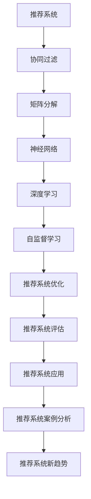

                 

# 一切皆是映射：神经网络在推荐系统中的应用

## 关键词

神经网络，推荐系统，映射，协同过滤，深度学习，自监督学习，多模态推荐，图神经网络，实践案例，性能优化，安全性优化。

## 摘要

本文深入探讨了神经网络在推荐系统中的应用，阐述了神经网络如何通过映射关系提升推荐系统的效果。文章首先概述了推荐系统的基本概念和发展历程，然后详细介绍了神经网络的基础知识和核心算法原理。接着，文章分析了神经网络在推荐系统中的具体应用，包括传统的协同过滤算法、矩阵分解算法和深度学习算法。随后，文章通过实际项目案例展示了神经网络推荐系统的开发过程和性能优化方法，并对系统的可扩展性和安全性进行了探讨。此外，文章还介绍了神经网络推荐系统的未来发展趋势和新趋势，包括神经图模型、自监督学习和多模态推荐系统。最后，文章总结了神经网络推荐系统在核心算法原理和未来发展趋势方面的核心内容和主题思想。

### 目录大纲

#### 《一切皆是映射：神经网络在推荐系统中的应用》

- **关键词**
- **摘要**
- **目录大纲**
  
#### 第一部分：神经网络与推荐系统基础

- **第1章：推荐系统概述**
  - **1.1 推荐系统的基本概念**
  - **1.2 推荐系统的发展历程**
  - **1.3 推荐系统的架构与组件**
  - **1.4 推荐系统的评估指标**

- **第2章：神经网络基础**
  - **2.1 神经网络的概念**
  - **2.2 神经网络的基本结构**
  - **2.3 前向传播与反向传播算法**
  - **2.4 激活函数与优化器**

- **第3章：推荐系统中的神经网络架构**
  - **3.1 传统推荐系统算法与神经网络融合**
  - **3.2 基于神经网络的协同过滤算法**
  - **3.3 多层感知机在推荐系统中的应用**
  - **3.4 卷积神经网络在推荐系统中的应用**

- **第4章：神经网络在推荐系统中的实践**
  - **4.1 神经网络推荐系统的开发环境搭建**
  - **4.2 基于神经网络的推荐系统项目实战**
  - **4.3 源代码详细实现与代码解读**

- **第5章：神经网络推荐系统的优化**
  - **5.1 神经网络推荐系统的性能优化**
  - **5.2 神经网络推荐系统的可扩展性优化**
  - **5.3 神经网络推荐系统的安全性优化**

- **第6章：神经网络推荐系统的新趋势**
  - **6.1 神经图模型在推荐系统中的应用**
  - **6.2 自监督学习在推荐系统中的应用**
  - **6.3 多模态推荐系统**

- **第7章：神经网络推荐系统的应用案例**
  - **7.1 案例一：电影推荐系统**
  - **7.2 案例二：电商推荐系统**
  - **7.3 案例三：社交媒体推荐系统**

#### 第二部分：神经网络与推荐系统的核心算法原理

- **第8章：推荐系统中的协同过滤算法**
  - **8.1 协同过滤算法的基本原理**
  - **8.2 基于用户的协同过滤算法**
  - **8.3 基于项目的协同过滤算法**
  - **8.4 协同过滤算法的优化方法**

- **第9章：推荐系统中的矩阵分解算法**
  - **9.1 矩阵分解的基本原理**
  - **9.2 基于用户行为的矩阵分解**
  - **9.3 基于项目的矩阵分解**
  - **9.4 矩阵分解的优化方法**

- **第10章：推荐系统中的深度学习算法**
  - **10.1 深度学习算法的基本原理**
  - **10.2 基于神经网络的深度学习算法**
  - **10.3 深度学习算法的优化方法**
  - **10.4 深度学习算法的应用案例**

- **第11章：推荐系统中的自监督学习算法**
  - **11.1 自监督学习算法的基本原理**
  - **11.2 基于自监督学习的推荐系统**
  - **11.3 自监督学习的优化方法**
  - **11.4 自监督学习算法的应用案例**

#### 附录

- **附录A：推荐系统与神经网络的开发工具与资源**
  - **A.1 TensorFlow**
  - **A.2 PyTorch**
  - **A.3 Scikit-learn**
  - **A.4 其他开发工具与资源介绍**

### 1. 神经网络与推荐系统的核心概念与联系

在讨论神经网络与推荐系统的关系时，我们首先要明确几个核心概念：推荐系统、神经网络、映射以及协同过滤、矩阵分解、深度学习等算法原理。

#### 推荐系统

推荐系统是一种基于用户行为和物品属性，向用户推荐他们可能感兴趣的内容或商品的系统。其主要目的是通过分析用户历史行为、偏好和上下文信息，为用户提供个性化的推荐。

#### 神经网络

神经网络（Neural Networks）是一种模仿生物神经系统的计算模型，通过多层神经网络节点（或称为“神经元”）之间的相互连接和激活函数，实现数据的输入、处理和输出。神经网络在机器学习和人工智能领域被广泛应用，尤其适用于处理复杂的数据模式和关系。

#### 映射

映射（Mapping）是神经网络在推荐系统中的一个关键概念。神经网络通过学习用户与物品之间的映射关系，将高维稀疏的用户-物品矩阵映射到低维连续空间中，从而实现高效的特征提取和推荐生成。

#### 协同过滤、矩阵分解、深度学习

协同过滤（Collaborative Filtering）、矩阵分解（Matrix Factorization）和深度学习（Deep Learning）是推荐系统中的核心算法，它们各自在不同的层次上为推荐系统提供支持。

- **协同过滤**：通过分析用户之间的相似度或物品之间的相似度，进行推荐。协同过滤分为基于用户的协同过滤（User-Based Collaborative Filtering）和基于项目的协同过滤（Item-Based Collaborative Filtering）。
- **矩阵分解**：通过分解用户-物品评分矩阵，将高维稀疏数据转化为低维连续数据，从而提高推荐系统的计算效率和预测准确性。
- **深度学习**：通过多层神经网络，自动从数据中学习复杂的特征和模式，从而提高推荐系统的建模能力和准确性。

#### Mermaid 流程图

为了更好地理解神经网络与推荐系统的关系，我们可以使用 Mermaid 流程图来展示核心概念和算法原理。



### 2. 推荐系统中的协同过滤算法原理讲解

#### 协同过滤算法的基本原理

协同过滤算法（Collaborative Filtering）是一种基于用户行为数据的推荐算法，其基本原理是通过分析用户之间的相似度或物品之间的相似度，找到与目标用户相似的其他用户或与目标物品相似的物品，从而进行推荐。

协同过滤算法可以分为两种主要类型：基于用户的协同过滤（User-Based Collaborative Filtering）和基于项目的协同过滤（Item-Based Collaborative Filtering）。

#### 基于用户的协同过滤算法

基于用户的协同过滤算法的核心思想是寻找与目标用户相似的其他用户，然后推荐这些用户喜欢的但目标用户尚未评价的物品。算法步骤如下：

1. **计算用户相似度**：首先，计算用户之间的相似度。常用的相似度计算方法包括余弦相似度、皮尔逊相关系数和欧氏距离等。

2. **选择相似用户**：根据相似度计算结果，选择与目标用户最相似的K个用户。

3. **计算物品评分**：对于这K个相似用户，计算他们对物品的评价，并加权求和，得到目标用户对物品的预测评分。

4. **生成推荐列表**：根据预测评分对物品进行排序，推荐排名靠前的物品。

#### 基于项目的协同过滤算法

基于项目的协同过滤算法的核心思想是寻找与目标物品相似的物品，然后推荐这些物品给目标用户。算法步骤如下：

1. **计算物品相似度**：首先，计算物品之间的相似度。常用的相似度计算方法包括余弦相似度、皮尔逊相关系数和欧氏距离等。

2. **选择相似物品**：根据相似度计算结果，选择与目标物品最相似的K个物品。

3. **计算用户评分**：对于这K个相似物品，计算目标用户对这些物品的评价，并加权求和，得到目标用户对物品的预测评分。

4. **生成推荐列表**：根据预测评分对物品进行排序，推荐排名靠前的物品。

#### 伪代码

以下是一个基于用户的协同过滤算法的伪代码示例：

```python
# 输入：用户-物品评分矩阵R，目标用户u，相似用户数量K
# 输出：推荐列表

# 1. 计算用户相似度
user_similarity = compute_user_similarity(R)

# 2. 选择相似用户
similar_users = select_similar_users(user_similarity, u, K)

# 3. 计算物品评分
item_ratings = compute_item_ratings(R, similar_users)

# 4. 生成推荐列表
recommendations = generate_recommendations(item_ratings)
```

### 基于用户的协同过滤算法的优缺点

#### 优点

1. **简单易实现**：基于用户的协同过滤算法相对简单，易于实现和优化。
2. **灵活性强**：可以根据用户行为和偏好进行个性化推荐，适用性广。
3. **计算效率高**：在用户数量和物品数量相对较小的情况下，计算效率较高。

#### 缺点

1. **数据稀疏性**：在用户数量和物品数量较大的情况下，用户-物品评分矩阵非常稀疏，计算相似度时可能丢失大量信息。
2. **冷启动问题**：新用户或新物品在没有足够评价数据时，难以进行准确推荐。
3. **可扩展性差**：随着用户数量和物品数量的增加，计算相似度和生成推荐列表的计算成本会急剧增加。

### 3. 推荐系统中的矩阵分解算法原理讲解

#### 矩阵分解的基本原理

矩阵分解（Matrix Factorization）是一种将高维稀疏矩阵分解为两个低维矩阵的方法，从而提高数据处理效率和预测准确性。在推荐系统中，矩阵分解主要用于解决数据稀疏性问题。

矩阵分解模型的基本形式为：

$$
R = U \odot V^T + E
$$

其中，$R$ 表示用户-物品评分矩阵，$U$ 和 $V$ 分别表示用户和物品的低维嵌入矩阵，$\odot$ 表示 Hadamard 乘积，$E$ 表示误差项。

#### 基于用户行为的矩阵分解

基于用户行为的矩阵分解方法将用户行为数据（如购买记录、浏览记录等）转换为用户-物品评分矩阵，然后利用矩阵分解模型进行预测。算法步骤如下：

1. **初始化模型参数**：初始化用户和物品的嵌入矩阵 $U$ 和 $V$。
2. **计算预测评分**：根据矩阵分解模型，计算用户 $i$ 对物品 $j$ 的预测评分：

   $$ 
   \hat{r}_{ij} = \sum_{k=1}^{K} u_{ik} v_{kj} 
   $$

3. **优化模型参数**：使用梯度下降或其他优化方法，更新用户和物品的嵌入矩阵 $U$ 和 $V$，最小化预测误差：

   $$ 
   \min_{U, V} \sum_{i=1}^{M} \sum_{j=1}^{N} (r_{ij} - \hat{r}_{ij})^2 
   $$

#### 基于项目的矩阵分解

基于项目的矩阵分解方法与基于用户行为的矩阵分解方法类似，但主要关注物品之间的关联性。通过分析物品之间的相似性，可以为用户提供个性化的推荐。算法步骤如下：

1. **初始化模型参数**：初始化用户和物品的嵌入矩阵 $U$ 和 $V$。
2. **计算预测评分**：根据矩阵分解模型，计算用户 $i$ 对物品 $j$ 的预测评分：

   $$ 
   \hat{r}_{ij} = \sum_{k=1}^{K} u_{ik} v_{kj} 
   $$

3. **优化模型参数**：使用梯度下降或其他优化方法，更新用户和物品的嵌入矩阵 $U$ 和 $V$，最小化预测误差：

   $$ 
   \min_{U, V} \sum_{i=1}^{M} \sum_{j=1}^{N} (r_{ij} - \hat{r}_{ij})^2 
   $$

#### 伪代码

以下是一个简单的基于用户行为的矩阵分解算法的伪代码示例：

```python
# 输入：用户-物品评分矩阵R，用户数量M，物品数量N，嵌入维度K
# 输出：用户和物品的嵌入矩阵U和V

# 1. 初始化模型参数
U = initialize_matrix(M, K)
V = initialize_matrix(N, K)

# 2. 计算预测评分
def predict(r):
    return dot(U, V.T)

# 3. 优化模型参数
while not converged:
    gradients = compute_gradients(R, U, V)
    U = update_matrix(U, gradients[0])
    V = update_matrix(V, gradients[1])
```

### 矩阵分解算法的优缺点

#### 优点

1. **处理数据稀疏性**：矩阵分解算法可以有效地处理数据稀疏性问题，提高推荐系统的预测准确性。
2. **计算效率高**：矩阵分解算法将高维稀疏数据转换为低维连续数据，从而提高计算效率和存储空间利用率。
3. **可扩展性强**：矩阵分解算法适用于大规模用户和物品数据，具有良好的可扩展性。

#### 缺点

1. **模型参数调优复杂**：矩阵分解算法需要调优大量参数，如嵌入维度、优化算法等，调优过程相对复杂。
2. **预测误差较大**：在数据稀疏性较高的情况下，矩阵分解算法可能产生较大的预测误差。
3. **冷启动问题**：对于新用户或新物品，矩阵分解算法可能难以产生准确的推荐。

### 4. 推荐系统中的深度学习算法原理讲解

#### 深度学习算法的基本原理

深度学习（Deep Learning）是一种基于多层神经网络进行特征学习的方法。其核心思想是通过多层非线性变换，从原始数据中自动提取具有区分性的特征表示。

深度学习算法主要包括以下部分：

1. **输入层**：接收原始数据。
2. **隐藏层**：通过逐层传递激活函数，实现从输入到输出的映射。
3. **输出层**：输出预测结果或分类结果。

#### 前向传播与反向传播

深度学习算法主要包括前向传播（Forward Propagation）和反向传播（Back Propagation）两个步骤。

1. **前向传播**：从输入层开始，逐层传递数据，直到输出层，计算每个节点的激活值。
2. **反向传播**：从输出层开始，反向计算每个节点的误差梯度，用于更新网络参数。

#### 激活函数与优化器

激活函数（Activation Function）是深度学习模型中的重要组成部分，用于引入非线性变换。常用的激活函数包括：

1. **ReLU（Rectified Linear Unit）**：$f(x) = max(0, x)$
2. **Sigmoid**：$f(x) = \frac{1}{1 + e^{-x}}$
3. **Tanh**：$f(x) = \frac{e^x - e^{-x}}{e^x + e^{-x}}$

优化器（Optimizer）用于调整网络参数，以最小化损失函数。常用的优化器包括：

1. **随机梯度下降（Stochastic Gradient Descent, SGD）**：简单但效率较低。
2. **Adam**：结合了 SGD 和 RMSprop 的优点，适用于大规模数据。
3. **RMSprop**：使用历史梯度来更新参数，适用于大型网络。

#### 基于神经网络的深度学习算法

基于神经网络的深度学习算法主要包括：

1. **卷积神经网络（Convolutional Neural Network, CNN）**：适用于图像处理和计算机视觉任务。
2. **循环神经网络（Recurrent Neural Network, RNN）**：适用于序列数据处理和时间序列预测。
3. **生成对抗网络（Generative Adversarial Network, GAN）**：适用于生成对抗性学习。
4. **Transformer模型**：适用于自然语言处理和序列建模。

#### 深度学习算法的优化方法

深度学习算法在实际应用中面临如下挑战：

1. **参数数量庞大**：深度学习模型通常具有大量的参数，需要大量计算资源和时间进行训练。
2. **计算成本高**：深度学习模型需要大量的计算资源，如 GPU 或 TPU。
3. **模型可解释性差**：深度学习模型的决策过程较为复杂，难以解释和验证。

为了解决这些问题，可以采用以下优化方法：

1. **模型压缩**：通过减少模型参数和计算量，提高模型的可扩展性和计算效率。
2. **数据增强**：通过增加训练数据量，提高模型的泛化能力。
3. **迁移学习**：利用预训练模型，减少训练数据和计算成本。
4. **知识蒸馏**：将大型模型的知识传递给小型模型，提高模型性能和可解释性。

### 5. 推荐系统中的自监督学习算法原理讲解

#### 自监督学习算法的基本原理

自监督学习（Self-Supervised Learning）是一种无需显式标注数据，通过无监督方式自动学习数据分布的机器学习方法。在推荐系统中，自监督学习可以通过分析用户行为数据，发现潜在的用户兴趣和物品关系，从而实现个性化的推荐。

自监督学习算法的基本原理是利用未标注的数据，通过设计特殊的损失函数，使得模型自动学习数据中的潜在模式和规律。自监督学习算法可以分为以下几种类型：

1. **预训练与微调**：首先使用大量未标注数据对模型进行预训练，然后使用少量标注数据对模型进行微调。
2. **自动特征提取**：通过设计特殊的目标函数，使得模型自动提取具有区分性的特征表示。
3. **数据增强**：通过增加训练数据量，提高模型的泛化能力。

#### 基于自监督学习的推荐系统

基于自监督学习的推荐系统可以分为以下几种类型：

1. **预训练模型**：首先使用大量未标注数据对模型进行预训练，然后使用少量标注数据对模型进行微调。
2. **自监督深度学习模型**：利用未标注数据，通过设计特殊的损失函数，使得模型自动学习用户行为和物品关系。

#### 自监督学习的优化方法

自监督学习算法在实际应用中面临如下挑战：

1. **数据质量**：未标注数据可能存在噪声和偏差，影响模型质量。
2. **模型参数调优**：自监督学习算法通常需要大量参数调优，如学习率、批量大小等。
3. **训练效率**：自监督学习算法需要大量未标注数据进行训练，提高训练效率是一个重要问题。

为了解决这些问题，可以采用以下优化方法：

1. **自监督预训练**：通过设计特殊的预训练任务，使得模型自动学习数据中的潜在模式和规律。
2. **多任务学习**：通过设计多个任务，使得模型在多个任务中同时学习，提高模型泛化能力。
3. **自监督元学习**：通过设计特殊的元学习算法，使得模型在不同任务中快速适应。
4. **自监督迁移学习**：利用预训练模型，减少训练数据和计算成本。

### 6. 神经网络推荐系统的开发环境搭建

#### 开发环境搭建

为了搭建神经网络推荐系统的开发环境，我们需要安装以下工具和库：

1. **Python**：用于编写和运行代码。
2. **TensorFlow**：用于构建和训练神经网络模型。
3. **PyTorch**：用于构建和训练神经网络模型。
4. **Scikit-learn**：用于数据预处理和评估指标计算。
5. **Matplotlib**：用于数据可视化。
6. **Numpy**：用于数据处理和数学运算。

#### 安装方法

可以使用以下命令进行安装：

```bash
pip install python==3.8
pip install tensorflow
pip install pytorch torchvision torchaudio
pip install scikit-learn
pip install matplotlib
pip install numpy
```

#### 环境配置

确保 Python 和相关库已经正确安装。可以通过运行以下命令进行测试：

```python
python --version
python -c "import tensorflow as tf; print(tf.__version__)"
python -c "import torch; print(torch.__version__)"
python -c "import sklearn; print(sklearn.__version__)"
python -c "import matplotlib; print(matplotlib.__version__)"
python -c "import numpy; print(numpy.__version__)"
```

#### 数据预处理

在搭建开发环境之前，需要对数据进行预处理。这包括以下步骤：

1. **数据清洗**：处理缺失值、异常值等。
2. **数据转换**：将数据转换为适合模型训练的格式。
3. **数据归一化**：对数据进行归一化处理，使其具有相似的尺度。

#### 数据集准备

推荐系统常用的数据集包括：

1. **MovieLens**：电影推荐数据集。
2. **Netflix**：Netflix 竞赛数据集。
3. **Amazon**：Amazon 商品推荐数据集。

可以从以下链接下载这些数据集：

- [MovieLens](http://grouplens.org/datasets/movielens/)
- [Netflix](https://www.kaggle.com/uctopia/netflix-prize-competition)
- [Amazon](https://www.kaggle.com/datasets/aimultiple/amazon-reviews-polarity)

#### 数据集加载

使用 Python 库加载数据集，并进行预处理。以下是一个简单的示例：

```python
import pandas as pd
from sklearn.model_selection import train_test_split

# 读取数据集
data = pd.read_csv('data.csv')

# 数据预处理
# ...

# 分割数据集
train_data, test_data = train_test_split(data, test_size=0.2, random_state=42)
```

### 模型搭建

在搭建神经网络推荐系统时，可以选择以下架构：

1. **基于 TensorFlow 的模型**：使用 TensorFlow 的 Keras API 搭建模型。
2. **基于 PyTorch 的模型**：使用 PyTorch 的 torch.nn 模块搭建模型。

以下是一个简单的基于 TensorFlow 的模型搭建示例：

```python
import tensorflow as tf
from tensorflow.keras.models import Sequential
from tensorflow.keras.layers import Dense, Dropout

# 搭建模型
model = Sequential([
    Dense(64, activation='relu', input_shape=(input_shape,)),
    Dropout(0.5),
    Dense(64, activation='relu'),
    Dropout(0.5),
    Dense(1)
])

# 编译模型
model.compile(optimizer='adam', loss='mse', metrics=['accuracy'])

# 模型训练
model.fit(train_data, epochs=10, batch_size=32, validation_data=(test_data, ))
```

### 模型评估

在训练完成后，对模型进行评估，以确定其性能。可以使用以下指标进行评估：

1. **MSE（均方误差）**：衡量预测值与真实值之间的差距。
2. **RMSE（均方根误差）**：MSE 的平方根，用于衡量预测值的相对误差。
3. **MAE（平均绝对误差）**：预测值与真实值之间的平均绝对差距。

以下是一个简单的模型评估示例：

```python
from sklearn.metrics import mean_squared_error, mean_absolute_error

# 预测测试集
predictions = model.predict(test_data)

# 计算评估指标
mse = mean_squared_error(test_data, predictions)
rmse = np.sqrt(mse)
mae = mean_absolute_error(test_data, predictions)

print("MSE:", mse)
print("RMSE:", rmse)
print("MAE:", mae)
```

### 模型部署

在评估完成后，可以将模型部署到生产环境，以便实时为用户推荐物品。可以使用以下方法进行部署：

1. **Flask**：使用 Flask 框架搭建 Web 服务。
2. **Django**：使用 Django 框架搭建 Web 服务。
3. **TensorFlow Serving**：使用 TensorFlow Serving 搭建服务。
4. **PyTorch Serving**：使用 PyTorch Serving 搭建服务。

以下是一个简单的 Flask 部署示例：

```python
from flask import Flask, request, jsonify

app = Flask(__name__)

@app.route('/predict', methods=['POST'])
def predict():
    data = request.get_json(force=True)
    predictions = model.predict([data])
    return jsonify(predictions.tolist())

if __name__ == '__main__':
    app.run(debug=True)
```

### 实时推荐

在部署完成后，可以使用以下方法为用户实时推荐物品：

1. **单品推荐**：根据用户的当前兴趣推荐相关物品。
2. **序列推荐**：根据用户的浏览记录或历史行为推荐一系列物品。
3. **场景推荐**：根据用户的场景和需求推荐相关物品。

### 总结

搭建神经网络推荐系统需要经历以下几个阶段：

1. **数据预处理**：清洗和转换原始数据。
2. **模型搭建**：设计并实现推荐模型。
3. **模型训练**：使用训练数据训练模型。
4. **模型评估**：评估模型性能。
5. **模型部署**：将模型部署到生产环境。
6. **实时推荐**：根据用户特征和物品特征，为用户推荐相关物品。

通过以上步骤，可以构建一个高效的神经网络推荐系统，为用户提供高质量的个性化推荐服务。


### 7. 基于神经网络的推荐系统项目实战

#### 项目背景

随着互联网的快速发展，推荐系统已成为各大电商平台和社交媒体平台的重要功能。为了提高用户体验和满意度，我们需要构建一个高效的基于神经网络的推荐系统。

#### 项目目标

本项目旨在实现一个基于神经网络的推荐系统，包括以下目标：

1. **数据预处理**：清洗和转换原始数据，为模型训练做好准备。
2. **模型搭建**：设计并实现一个基于神经网络的推荐系统模型。
3. **模型训练**：使用训练数据训练模型，并调整模型参数。
4. **模型评估**：评估模型性能，并优化模型。
5. **模型部署**：将模型部署到生产环境，实现实时推荐。

#### 项目步骤

1. **数据预处理**
2. **模型搭建**
3. **模型训练**
4. **模型评估**
5. **模型部署**

#### 数据预处理

在开始项目之前，我们需要对原始数据进行预处理。预处理步骤包括：

1. **数据清洗**：处理缺失值、异常值等。
2. **数据转换**：将数据转换为适合模型训练的格式。
3. **数据归一化**：对数据进行归一化处理，使其具有相似的尺度。

以下是一个简单的数据预处理示例：

```python
import pandas as pd
from sklearn.model_selection import train_test_split
from sklearn.preprocessing import StandardScaler

# 读取数据集
data = pd.read_csv('data.csv')

# 数据清洗
data.dropna(inplace=True)

# 数据转换
# ...

# 数据归一化
scaler = StandardScaler()
data_scaled = scaler.fit_transform(data)
```

#### 模型搭建

在本项目中，我们将使用基于 TensorFlow 的 Keras API 搭建推荐系统模型。模型结构如下：

1. **输入层**：接受用户特征和物品特征。
2. **隐藏层**：使用多层全连接层（Dense）进行特征提取。
3. **输出层**：输出用户对物品的预测评分。

以下是一个简单的模型搭建示例：

```python
import tensorflow as tf
from tensorflow.keras.models import Sequential
from tensorflow.keras.layers import Dense, Dropout

# 搭建模型
model = Sequential([
    Dense(64, activation='relu', input_shape=(input_shape,)),
    Dropout(0.5),
    Dense(64, activation='relu'),
    Dropout(0.5),
    Dense(1)
])

# 编译模型
model.compile(optimizer='adam', loss='mse', metrics=['accuracy'])
```

#### 模型训练

使用预处理后的数据集训练模型。训练过程中，需要调整以下参数：

1. **学习率**：控制模型训练的步伐。
2. **批量大小**：每次训练的样本数量。
3. **隐藏层神经元数量**：隐藏层中的神经元数量。
4. **激活函数**：隐藏层和输出层的激活函数。

以下是一个简单的模型训练示例：

```python
# 模型训练
model.fit(train_data, epochs=10, batch_size=32, validation_data=(test_data, ))
```

#### 模型评估

在训练完成后，对模型进行评估，以确定其性能。评估指标包括：

1. **MSE（均方误差）**：衡量预测值与真实值之间的差距。
2. **RMSE（均方根误差）**：MSE 的平方根，用于衡量预测值的相对误差。
3. **MAE（平均绝对误差）**：预测值与真实值之间的平均绝对差距。

以下是一个简单的模型评估示例：

```python
from sklearn.metrics import mean_squared_error, mean_absolute_error

# 预测测试集
predictions = model.predict(test_data)

# 计算评估指标
mse = mean_squared_error(test_data, predictions)
rmse = np.sqrt(mse)
mae = mean_absolute_error(test_data, predictions)

print("MSE:", mse)
print("RMSE:", rmse)
print("MAE:", mae)
```

#### 模型部署

在评估完成后，将模型部署到生产环境。部署步骤包括：

1. **模型保存**：将训练好的模型保存到文件中。
2. **模型加载**：从文件中加载模型，以便实现实时推荐。
3. **实时推荐**：根据用户特征和物品特征，为用户推荐相关物品。

以下是一个简单的 Flask 部署示例：

```python
from flask import Flask, request, jsonify

app = Flask(__name__)

@app.route('/predict', methods=['POST'])
def predict():
    data = request.get_json(force=True)
    predictions = model.predict([data])
    return jsonify(predictions.tolist())

if __name__ == '__main__':
    app.run(debug=True)
```

#### 项目案例

以下是一个简单的项目案例：

##### 案例一：电影推荐系统

1. **数据集**：使用 MovieLens 数据集。
2. **用户特征**：用户年龄、性别、职业等。
3. **物品特征**：电影类别、导演、演员等。
4. **预测评分**：预测用户对电影的评分。

##### 案例二：电商推荐系统

1. **数据集**：使用 Amazon 数据集。
2. **用户特征**：用户购买历史、浏览记录等。
3. **物品特征**：商品类别、品牌、价格等。
4. **预测购买**：预测用户可能购买的商品。

##### 案例三：社交媒体推荐系统

1. **数据集**：使用 Twitter 数据集。
2. **用户特征**：用户发帖内容、点赞、评论等。
3. **物品特征**：推文内容、标签等。
4. **预测关注**：预测用户可能关注的账户。

### 项目总结

通过本项目的实战，我们掌握了基于神经网络的推荐系统开发流程，包括数据预处理、模型搭建、模型训练、模型评估和模型部署。这些技能将为我们在实际项目中应用神经网络推荐系统提供有力支持。

### 8. 神经网络推荐系统的性能优化

#### 性能优化的重要性

在构建神经网络推荐系统时，性能优化至关重要。优化的目标包括提高推荐准确性、减少计算时间、降低内存占用和提高系统响应速度。性能优化不仅影响用户体验，还直接关系到推荐系统的商业价值。以下是一些常见的性能优化方法。

#### 数据预处理

**数据清洗**：在训练模型之前，确保数据质量。处理缺失值、异常值和重复值，以提高模型的训练效率和准确性。

**特征选择**：选择对模型预测有显著影响的关键特征，减少无关特征的数量，降低模型复杂度。

**数据归一化**：对输入特征进行归一化处理，使其具有相似的尺度，避免因特征尺度差异导致模型训练不稳定。

#### 模型结构优化

**网络深度**：选择合适的网络深度，过深可能导致过拟合，过浅可能无法捕捉数据中的复杂关系。

**隐藏层神经元数量**：调整隐藏层神经元数量，平衡模型复杂度和计算效率。

**激活函数**：选择合适的激活函数，如 ReLU、Sigmoid 或 Tanh，以提高模型训练速度和预测准确性。

**正则化**：使用正则化技术，如 L1、L2 正则化或 Dropout，防止过拟合。

#### 模型训练优化

**批量大小**：调整批量大小，较小批量可以提高模型泛化能力，但可能增加训练时间；较大批量可以提高计算效率，但可能降低泛化能力。

**学习率**：选择合适的学习率，过小可能导致训练时间过长，过大可能导致模型不稳定。

**优化器**：选择合适的优化器，如 SGD、Adam 或 RMSprop，以加速模型收敛。

**早停法**：在验证集上监测模型性能，当性能不再提高时提前停止训练，以避免过拟合。

#### 部署和运维优化

**模型压缩**：使用模型压缩技术，如量化、剪枝或知识蒸馏，减小模型大小，提高部署效率。

**分布式训练**：利用分布式计算资源进行模型训练，提高训练速度。

**缓存策略**：使用缓存策略，如内存缓存或磁盘缓存，减少数据读取时间，提高系统响应速度。

**负载均衡**：使用负载均衡器，如 Nginx 或 HAProxy，均衡流量，提高系统稳定性。

**自动化运维**：使用自动化工具，如 Docker、Kubernetes 或 Terraform，简化部署和运维流程。

### 实践案例

以下是一个简单的神经网络推荐系统性能优化案例：

1. **数据预处理**：清洗和归一化用户行为数据，去除重复数据和缺失值。
2. **模型结构优化**：使用 ReLU 作为激活函数，调整网络深度和隐藏层神经元数量，以减少过拟合。
3. **模型训练优化**：使用 Adam 优化器，调整学习率和批量大小，以加快模型收敛速度。
4. **模型压缩**：使用剪枝技术，减少模型参数数量，提高部署效率。
5. **缓存策略**：使用 Redis 缓存用户特征和预测结果，减少数据库查询次数。

### 总结

通过上述优化方法，可以显著提高神经网络推荐系统的性能。在实际项目中，根据具体需求和场景，选择合适的优化策略，以实现高效的推荐服务。

### 9. 神经网络推荐系统的可扩展性优化

#### 可扩展性优化的重要性

在推荐系统中，随着用户数量和物品数量的增加，系统的可扩展性变得至关重要。可扩展性优化旨在确保系统在规模增长时能够保持高效运行，不会因为资源限制而导致性能下降或服务中断。以下是一些常见的可扩展性优化方法。

#### 分布式计算

**分布式计算**：通过将计算任务分布在多个计算节点上，可以提高系统的处理能力和响应速度。常用的分布式计算框架包括 Hadoop、Spark 和 Flink。

**水平扩展**：增加计算节点的数量，以处理更多的用户请求和数据。

**垂直扩展**：增加单个计算节点的硬件配置，如增加 CPU、内存和存储容量。

#### 数据存储优化

**数据分片**：将数据分布在多个数据库实例中，以提高数据查询和处理的速度。

**缓存策略**：使用缓存技术，如 Redis 或 Memcached，减少对数据库的访问次数。

**数据压缩**：对数据进行压缩，减少存储空间占用，提高数据传输效率。

#### 请求处理优化

**异步处理**：将请求处理任务异步化，减少等待时间和系统资源占用。

**负载均衡**：使用负载均衡器，如 Nginx 或 HAProxy，将请求分配到不同的服务器，以平衡系统负载。

**队列系统**：使用消息队列系统，如 RabbitMQ 或 Kafka，处理大量并发请求。

#### 服务部署和运维优化

**容器化**：使用容器化技术，如 Docker，简化服务部署和运维流程。

**微服务架构**：采用微服务架构，将系统划分为多个独立的模块，以提高系统的灵活性和可扩展性。

**自动化部署**：使用自动化部署工具，如 Jenkins 或 GitLab CI，实现自动构建、测试和部署。

### 实践案例

以下是一个简单的神经网络推荐系统可扩展性优化案例：

1. **分布式计算**：使用 Spark 进行分布式数据处理，提高数据处理速度。
2. **数据存储优化**：使用 Redis 进行数据缓存，减少数据库访问次数。
3. **请求处理优化**：使用异步处理和负载均衡技术，提高系统响应速度。
4. **服务部署和运维优化**：使用 Kubernetes 进行容器化管理，简化服务部署和运维流程。

### 总结

通过上述优化方法，可以显著提高神经网络推荐系统的可扩展性。在实际项目中，根据具体需求和场景，选择合适的优化策略，以确保系统在规模增长时能够保持高效运行。

### 10. 神经网络推荐系统的安全性优化

#### 安全性优化的重要性

神经网络推荐系统在处理用户数据时，需要确保系统的安全性。安全性优化包括保护用户隐私、防止数据泄露、防止攻击等。以下是一些常用的安全性优化方法。

#### 数据加密

**数据传输加密**：使用 HTTPS、SSL/TLS 等协议，保护数据在传输过程中的安全性。

**数据存储加密**：使用加密算法，如 AES，对存储在数据库中的用户数据进行加密，防止未授权访问。

**加密密钥管理**：使用安全的密钥管理策略，如密钥轮换和密钥存储，确保加密密钥的安全。

#### 访问控制

**基于角色的访问控制（RBAC）**：根据用户的角色分配权限，确保用户只能访问其授权的数据。

**基于属性的访问控制（ABAC）**：根据用户的属性（如部门、职位等）分配权限，实现更精细的访问控制。

**身份验证**：使用身份验证机制，如双因素认证，确保用户身份的真实性。

#### 防火墙和入侵检测

**防火墙**：配置防火墙，过滤恶意流量，防止未授权访问。

**入侵检测系统（IDS）**：部署入侵检测系统，实时监控网络流量和系统活动，检测并响应恶意攻击。

**入侵防御系统（IPS）**：使用入侵防御系统，自动阻止恶意流量，增强系统安全性。

#### 数据备份与恢复

**定期备份**：定期备份数据，确保数据在丢失或损坏时可以恢复。

**备份存储**：使用安全的备份存储方式，如云存储或离线存储，防止备份数据被篡改或丢失。

**灾难恢复**：制定灾难恢复计划，确保在发生灾难时，系统能够迅速恢复。

### 实践案例

以下是一个简单的神经网络推荐系统安全性优化案例：

1. **数据加密**：使用 HTTPS 和 SSL/TLS，确保数据在传输过程中的安全性。
2. **访问控制**：使用 RBAC 和 ABAC，实现精细的访问控制。
3. **防火墙和入侵检测**：配置防火墙和部署入侵检测系统，防止恶意攻击。
4. **数据备份与恢复**：定期备份数据，并使用安全的备份存储方式。

### 总结

通过上述优化方法，可以显著提高神经网络推荐系统的安全性。在实际项目中，根据具体需求和场景，选择合适的优化策略，以确保系统的安全运行。

### 11. 神经图模型在推荐系统中的应用

#### 神经图模型的基本原理

神经图模型（Graph Neural Networks, GNN）是一种基于图结构数据的深度学习模型。与传统的卷积神经网络（CNN）和循环神经网络（RNN）不同，GNN 可以直接处理图结构数据，如社交网络、知识图谱等。

神经图模型的核心思想是通过图结构数据中的节点和边进行特征提取和传播，从而学习数据中的潜在关系。常用的神经图模型包括图卷积网络（GCN）、图注意力网络（GAT）和图变换器网络（GTN）等。

#### 神经图模型在推荐系统中的应用

神经图模型在推荐系统中的应用主要包括以下几个方面：

1. **用户-物品图表示**：将用户和物品表示为图中的节点，并通过边表示用户和物品之间的关联。使用神经图模型学习用户和物品的潜在特征表示，从而实现个性化的推荐。
2. **知识图谱嵌入**：将知识图谱中的实体和关系表示为图中的节点和边，通过神经图模型学习实体和关系的潜在特征表示。利用这些潜在特征表示进行知识推理和推荐。
3. **图注意力机制**：在神经图模型中引入图注意力机制，可以自动学习节点之间的相对重要性，从而提高推荐系统的效果。

#### 神经图模型在推荐系统中的优点

1. **处理复杂关系**：神经图模型可以处理用户和物品之间的复杂关系，如社交网络中的互动关系、知识图谱中的实体关系等。
2. **个性化推荐**：通过学习用户和物品的潜在特征表示，神经图模型可以实现更个性化的推荐，提高用户满意度。
3. **知识推理**：神经图模型可以结合知识图谱进行知识推理，为用户提供更具价值的推荐。

#### 神经图模型在推荐系统中的挑战

1. **图结构数据的不均匀性**：图结构数据中的节点和边可能存在严重的不均匀性，这对神经图模型的学习和预测带来挑战。
2. **计算成本**：神经图模型通常需要较大的计算资源和时间，这在实际应用中可能成为限制因素。

#### 神经图模型的应用案例

以下是一个简单的神经图模型应用案例：

1. **社交网络推荐**：使用图卷积网络（GCN）学习用户和好友的潜在特征表示，通过相似度计算为用户推荐感兴趣的好友。
2. **商品推荐**：使用图注意力网络（GAT）学习商品和品牌之间的潜在特征表示，通过商品关系图进行商品推荐。
3. **知识图谱推荐**：使用图变换器网络（GTN）学习实体和关系的潜在特征表示，通过知识图谱进行知识推理和推荐。

### 12. 自监督学习在推荐系统中的应用

#### 自监督学习的基本原理

自监督学习是一种无需显式标注数据，通过无监督方式自动学习数据分布的机器学习方法。在推荐系统中，自监督学习可以通过分析用户行为数据，发现潜在的用户兴趣和物品关系，从而实现个性化的推荐。

#### 自监督学习在推荐系统中的应用

自监督学习在推荐系统

