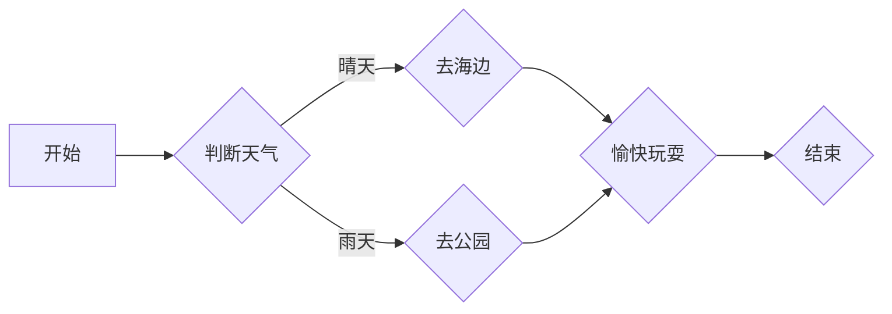

                 

### 1.1 引言

#### 1.1.1 上下文理解能力的定义

上下文理解能力，是指模型在处理文本数据时，能够准确地捕捉和利用文本周围的语境信息，从而产生合理和相关的输出。在自然语言处理（NLP）领域，上下文理解能力被视为衡量模型智能水平的重要指标。它不仅涉及对单词、句子和段落的理解，还包括对整个文档或对话的深层语义和主题的把握。

在深度学习模型，尤其是大型语言模型（LLM）中，上下文理解能力尤为重要。这些模型通过学习大量的文本数据来提升自身的语言理解能力，然而，仅仅是训练数据本身并不能确保模型具备强大的上下文理解能力。事实上，上下文理解能力需要通过特定的训练策略和评估方法来评估和提升。

#### 1.1.2 LLM的语境把握的重要性

LLM的语境把握能力决定了其在各种任务中的表现。以下是一些关键领域：

- **文本分类**：在文本分类任务中，LLM需要理解输入文本的语境，以便准确地将文本归类到预定的类别中。一个具有强上下文理解能力的LLM可以更好地处理具有相似词义但语境不同的文本。

- **问答系统**：问答系统要求LLM能够准确理解用户的问题，并从大量的知识库或文本中提取出相关和准确的答案。上下文理解能力使得LLM能够更好地理解问题的隐含意义，从而提供更加精准的答案。

- **自然语言生成**：自然语言生成（NLG）任务中，LLM需要生成语义连贯、逻辑清晰的语言。上下文理解能力使得LLM能够更好地把握生成文本的语境，从而避免生成无关或矛盾的语句。

#### 1.1.3 本书的目标与结构

本书旨在深入探讨LLM的上下文理解能力，并提供一系列的评估方法、提升策略以及实战案例。具体来说，本书的结构如下：

- **第一部分：引言与基础**：介绍上下文理解能力的定义及其重要性，概述本书的目标和结构。

- **第二部分：LLM基本原理**：详细讲解LLM的架构、工作原理以及核心算法。

- **第三部分：上下文理解能力评估**：介绍评估上下文理解能力的指标和方法，并分析实际案例。

- **第四部分：提升上下文理解能力**：探讨各种上下文增强策略，并提供应用案例分析。

- **第五部分：实战演练**：通过实际案例分析，展示如何评估和提升LLM的上下文理解能力。

- **第六部分：未来展望与挑战**：讨论LLM上下文理解能力的未来发展趋势及面临的挑战。

- **第七部分：附录**：包含流程图示例、伪代码示例、数学模型和公式、项目实战、代码解读与分析以及相关资源链接。

通过以上结构和内容的编排，本书希望能够为读者提供一个全面、深入且实用的指南，帮助大家更好地理解和提升LLM的上下文理解能力。接下来，我们将进一步深入探讨LLM的基本原理，为后续内容的讲解奠定基础。

### 1.2 语言模型（Language Model）的定义、架构及其工作原理

语言模型（Language Model，简称LM）是自然语言处理（Natural Language Processing，简称NLP）领域中的一个核心组件，它的主要任务是预测一段文本序列中下一个可能出现的单词或字符。在深度学习时代，语言模型的发展经历了从基于统计的模型到基于神经网络的模型，再到如今的大型预训练模型（如GPT、BERT）的演变。

#### 1.2.1 语言模型的定义

语言模型是一种概率模型，它通过学习大量的文本数据，捕捉语言中的统计规律，从而为每个单词或字符生成一个概率分布。具体来说，对于一个输入的文本序列 \(w_1, w_2, \ldots, w_n\)，语言模型的目标是预测下一个单词或字符 \(w_{n+1}\) 的概率分布。这个概率分布可以表示为：

\[ P(w_{n+1} | w_1, w_2, \ldots, w_n) \]

语言模型在文本生成、机器翻译、文本分类等任务中都有广泛的应用。例如，在文本生成任务中，语言模型可以用来生成新的文本内容；在机器翻译任务中，语言模型可以用来预测翻译结果中的下一个词。

#### 1.2.2 语言模型的架构

语言模型的架构可以分为传统的统计语言模型和现代的神经网络语言模型。下面分别介绍这两种架构。

1. **统计语言模型**：
   统计语言模型基于统计方法来建立语言模型，常用的方法包括N元语法（N-gram）、隐马尔可夫模型（HMM）和条件概率模型等。

   - **N元语法**：N元语法是最简单的统计语言模型，它假设当前词的出现概率仅与前面N-1个词相关。具体来说，N元语法模型可以表示为：

     \[ P(w_n | w_{n-1}, w_{n-2}, \ldots, w_{n-N+1}) \approx \prod_{i=1}^{N} P(w_i | w_{i-1}, \ldots, w_{i-N+1}) \]

   - **隐马尔可夫模型**：隐马尔可夫模型（HMM）是一种基于状态的模型，它通过状态序列来预测词序列。每个状态对应一个词的概率分布，而状态之间的转移概率和发射概率共同决定了词序列的概率。

   - **条件概率模型**：条件概率模型通过学习每个词出现的条件概率来构建语言模型。例如，可以使用条件随机场（CRF）来建模词之间的依赖关系。

2. **神经网络语言模型**：
   神经网络语言模型通过引入神经网络来提高语言模型的表示能力和预测性能。目前，最常用的神经网络语言模型是基于深度神经网络（DNN）和循环神经网络（RNN）的模型，以及基于注意力机制的模型。

   - **深度神经网络语言模型**：深度神经网络语言模型（DNN-LM）使用多层感知机（MLP）来学习文本数据中的特征表示。通过多层的非线性变换，DNN-LM可以捕捉到更复杂的语言模式。

   - **循环神经网络语言模型**：循环神经网络（RNN）语言模型通过其内部循环结构来处理序列数据。RNN可以通过记忆历史信息来提高语言模型的上下文理解能力。长短期记忆网络（LSTM）和门控循环单元（GRU）是RNN的两种常见变体，它们通过引入门控机制来缓解RNN的梯度消失问题。

   - **注意力机制语言模型**：注意力机制语言模型通过引入注意力机制来提高对输入序列的建模能力。注意力机制可以使模型在生成下一个词时，更关注输入序列中的关键部分，从而提高生成的质量和连贯性。Transformer模型是引入注意力机制的一种成功实现，其通过自注意力机制实现了并行计算，显著提高了训练效率。

#### 1.2.3 语言模型的工作原理

无论采用哪种架构，语言模型的工作原理都大致相同。以下是语言模型的一般工作流程：

1. **输入处理**：首先，语言模型需要对输入的文本序列进行处理，将其转化为模型可以处理的格式。这通常包括分词、标记化和编码等步骤。

2. **特征提取**：接着，模型会提取输入文本的特征表示。在统计语言模型中，特征通常是N元组或条件概率矩阵；在神经网络语言模型中，特征是通过神经网络学习的。

3. **概率预测**：然后，模型会根据提取到的特征，计算输出词的概率分布。在统计模型中，这通常是通过简单的统计方法实现的；在神经网络模型中，这通常是通过前向传播和反向传播来实现的。

4. **输出生成**：最后，模型会选择概率最高的输出词，并将其作为预测结果。在生成任务中，这个流程会不断重复，直到生成出完整的文本序列。

通过以上步骤，语言模型能够根据输入的上下文信息生成相关的文本输出，从而实现文本生成、翻译、分类等多种自然语言处理任务。在下一部分中，我们将进一步探讨如何评估LLM的上下文理解能力。

### 2.2 语言模型的核心算法：神经网络与注意力机制

在深入探讨语言模型（LM）的核心算法时，神经网络（Neural Networks，NN）和注意力机制（Attention Mechanism）成为讨论的焦点。这些技术不仅提高了语言模型的性能，还使其在处理复杂任务时表现出更强的上下文理解能力。

#### 2.2.1 神经网络的基本原理

神经网络是一种模拟人脑神经元之间相互连接和交互的算法。它的基本单元是“神经元”，每个神经元接收多个输入，并通过加权求和处理产生一个输出。神经网络通过多层次的非线性变换，能够自动学习输入数据的特征表示。

1. **多层感知机（MLP）**：
   多层感知机是最简单的前馈神经网络，它包括输入层、隐藏层和输出层。每个隐藏层中的神经元都接收前一层的所有输出，并通过激活函数产生输出。MLP可以用于实现简单的函数逼近和分类任务。

2. **反向传播（Backpropagation）**：
   反向传播是训练神经网络的一种常用算法。它通过计算输出层与实际输出之间的误差，并反向传播误差到隐藏层，从而更新每个神经元的权重。这个过程不断重复，直到网络误差达到预定的阈值。

3. **激活函数**：
   激活函数是神经网络中的一个关键组件，它为神经元引入了非线性。常见的激活函数包括sigmoid、ReLU（Rectified Linear Unit）和tanh等。这些函数可以增强神经网络的拟合能力和表达能力。

#### 2.2.2 循环神经网络（RNN）与长短时记忆网络（LSTM）

循环神经网络（RNN）是一种专门用于处理序列数据的神经网络。它通过其内部的循环结构，能够在处理序列数据时维持状态信息。然而，传统的RNN存在梯度消失和梯度爆炸问题，导致其在长序列上的表现不佳。

1. **RNN的基本结构**：
   RNN的基本结构包括输入层、隐藏层和输出层。隐藏层的状态 \(h_t\) 用于表示当前时刻的上下文信息，并通过递归关系更新：

   \[ h_t = \sigma(W_h \cdot [h_{t-1}, x_t] + b_h) \]

   其中，\(x_t\) 是当前输入，\(W_h\) 和 \(b_h\) 分别是权重和偏置，\(\sigma\) 是激活函数。

2. **长短时记忆网络（LSTM）**：
   长短时记忆网络（LSTM）是RNN的一种改进，它通过引入门控机制来解决梯度消失问题。LSTM包括三个门控单元：遗忘门（forget gate）、输入门（input gate）和输出门（output gate）。这些门控单元可以控制信息在序列中的流动，从而有效地维持长期依赖关系。

   - **遗忘门**：遗忘门决定哪些信息应该从当前状态 \(h_{t-1}\) 中丢弃。其计算公式为：

     \[ f_t = \sigma(W_f \cdot [h_{t-1}, x_t] + b_f) \]

     其中，\(f_t\) 表示遗忘门的输出。

   - **输入门**：输入门控制新的信息如何被整合到状态 \(h_t\) 中。其计算公式为：

     \[ i_t = \sigma(W_i \cdot [h_{t-1}, x_t] + b_i) \]

     其中，\(i_t\) 表示输入门的输出。

   - **输出门**：输出门控制当前状态 \(h_t\) 应该如何输出。其计算公式为：

     \[ o_t = \sigma(W_o \cdot [h_{t-1}, x_t] + b_o) \]

     其中，\(o_t\) 表示输出门的输出。

   - **细胞状态**：细胞状态 \(c_t\) 用于存储和传递信息。其更新公式为：

     \[ c_t = f_t \odot c_{t-1} + i_t \odot \sigma(W_c \cdot [h_{t-1}, x_t] + b_c) \]

   - **隐藏状态**：隐藏状态 \(h_t\) 的计算公式为：

     \[ h_t = o_t \odot \sigma(c_t) \]

3. **门控循环单元（GRU）**：
   门控循环单元（GRU）是LSTM的一种简化版本。它通过合并遗忘门和输入门，并引入更新门（update gate），进一步简化了模型结构。GRU的计算公式为：

   \[ r_t = \sigma(W_r \cdot [h_{t-1}, x_t] + b_r) \]
   \[ z_t = \sigma(W_z \cdot [h_{t-1}, x_t] + b_z) \]
   \[ \hat{h}_t = \sigma(W \cdot [r_t \odot h_{t-1}, x_t] + b) \]
   \[ h_t = (1 - z_t) \odot h_{t-1} + z_t \odot \hat{h}_t \]

   其中，\(r_t\) 和 \(z_t\) 分别为更新门和重置门，\(\hat{h}_t\) 为候选隐藏状态。

#### 2.2.3 注意力机制的原理与应用

注意力机制（Attention Mechanism）是一种在处理序列数据时动态关注重要信息的方法。它通过为每个输入序列元素分配不同的权重，使得模型在处理长序列时能够更加关注关键部分。

1. **点积注意力**：
   点积注意力是最简单的注意力机制，它通过计算输入序列和查询序列的点积来生成注意力权重。其计算公式为：

   \[ a_t = \text{softmax}(\frac{QK^T}{\sqrt{d_k}}) \]

   其中，\(Q\) 是查询向量，\(K\) 是键向量，\(V\) 是值向量，\(\text{softmax}\) 函数用于生成权重分布。

2. **多头注意力**：
   多头注意力通过扩展点积注意力，使得模型可以同时关注输入序列的不同部分。多头注意力的核心思想是将输入序列分成多个子序列，并为每个子序列应用独立的点积注意力。具体来说，多头注意力的计算公式为：

   \[ \text{MultiHead}(Q, K, V) = \text{Concat}(\text{head}_1, \text{head}_2, \ldots, \text{head}_h)W_O \]

   其中，\(\text{head}_i = \text{softmax}(\frac{QW_i^K}{\sqrt{d_k}})W_i^V\)，\(W_O\) 是输出权重。

3. **Transformer模型**：
   Transformer模型是引入注意力机制的代表性模型，它通过多头自注意力机制和前馈神经网络，实现了并行化的训练，从而显著提高了训练效率。Transformer模型的核心结构包括编码器（Encoder）和解码器（Decoder）。

   - **编码器**：编码器通过多个自注意力层和前馈神经网络层，将输入序列编码为固定长度的隐藏状态。

   - **解码器**：解码器通过多个多头注意力层和自注意力层，以及前馈神经网络层，生成输出序列。在解码过程中，每个时间步的输出都会受到前一个时间步输出和编码器输出的影响。

   Transformer模型的成功表明，注意力机制可以显著提升语言模型的上下文理解能力，并在许多自然语言处理任务中取得了优异的性能。

综上所述，神经网络和注意力机制是语言模型的核心算法，它们共同作用，使得语言模型能够更好地理解上下文信息，从而在实际应用中表现出强大的语言处理能力。在下一部分中，我们将深入探讨如何评估LLM的上下文理解能力。

### 2.3 语言模型的分类与应用场景

语言模型（LM）可以根据其训练方法、架构和功能进行分类。每种类型的语言模型都有其独特的应用场景和特点。下面，我们将对几种主要的语言模型进行介绍，并分析它们在不同应用场景中的表现。

#### 2.3.1 基于统计的语言模型

1. **N元语法（N-gram）模型**：
   N元语法模型是最简单的语言模型，它通过统计相邻N个单词（或字符）出现的频率来预测下一个单词。这种模型的核心思想是假设一个词的出现概率仅与其前面的N-1个词有关。

   - **优点**：
     - 计算简单，易于实现。
     - 对语言局部依赖性捕捉较好。

   - **缺点**：
     - 忽略了长距离依赖关系。
     - 对稀疏数据和罕见词的表现较差。

   **应用场景**：
   N元语法模型常用于文本生成、搜索引擎关键词预测等场景。

2. **隐马尔可夫模型（HMM）**：
   隐马尔可夫模型是一种统计模型，它通过状态序列来预测词序列。每个状态对应一个词的概率分布，状态之间的转移概率和发射概率共同决定了词序列的概率。

   - **优点**：
     - 可以处理不完整的数据和缺失的词。
     - 对序列数据的建模能力强。

   - **缺点**：
     - 对长距离依赖的建模效果不佳。
     - 计算复杂度高。

   **应用场景**：
   HMM常用于语音识别、语音合成、手写识别等序列数据处理任务。

3. **条件概率模型**：
   条件概率模型通过学习每个词出现的条件概率来构建语言模型。常见的有条件随机场（CRF）等。

   - **优点**：
     - 可以处理词之间的依赖关系。
     - 对序列数据的建模能力较强。

   - **缺点**：
     - 计算复杂度高。
     - 对罕见词的处理能力较差。

   **应用场景**：
   CRF等条件概率模型常用于文本分类、命名实体识别等任务。

#### 2.3.2 基于神经网络的语言模型

1. **循环神经网络（RNN）**：
   循环神经网络是一种专门用于处理序列数据的神经网络，它通过其内部的循环结构，能够在处理序列数据时维持状态信息。

   - **优点**：
     - 能够处理长距离依赖关系。
     - 对序列数据的建模能力强。

   - **缺点**：
     - 存在梯度消失和梯度爆炸问题。
     - 训练时间较长。

   **应用场景**：
   RNN常用于机器翻译、语音识别、时间序列分析等长序列数据处理任务。

2. **长短时记忆网络（LSTM）**：
   长短时记忆网络是RNN的一种改进，它通过引入门控机制来解决梯度消失问题，从而能够更好地维持长期依赖关系。

   - **优点**：
     - 解决了RNN的梯度消失问题。
     - 对长距离依赖的建模效果较好。

   - **缺点**：
     - 计算复杂度较高。
     - 需要大量的训练数据。

   **应用场景**：
   LSTM常用于时间序列预测、机器翻译、对话系统等长序列数据处理任务。

3. **门控循环单元（GRU）**：
   门控循环单元是LSTM的简化版本，它通过合并遗忘门和输入门，进一步简化了模型结构。

   - **优点**：
     - 计算复杂度较低。
     - 对长距离依赖的建模效果较好。

   - **缺点**：
     - 对非常长的时间序列可能效果不如LSTM。

   **应用场景**：
   GRU常用于文本分类、情感分析等需要短距离依赖建模的任务。

4. **Transformer模型**：
   Transformer模型是引入注意力机制的代表性模型，它通过多头自注意力机制和前馈神经网络，实现了并行化的训练，从而显著提高了训练效率。

   - **优点**：
     - 能够高效地处理长距离依赖。
     - 训练时间较短，计算复杂度较低。

   - **缺点**：
     - 对稀疏数据的处理能力有限。
     - 计算资源消耗较大。

   **应用场景**：
   Transformer模型广泛应用于机器翻译、文本生成、问答系统等需要高上下文理解能力的任务。

#### 2.3.3 预训练语言模型

1. **BERT（Bidirectional Encoder Representations from Transformers）**：
   BERT是一种双向Transformer模型，通过预训练大量无标签文本数据，并使用双向注意力机制，使其能够捕捉到文本中的双向依赖关系。

   - **优点**：
     - 能够捕捉到文本中的双向依赖关系。
     - 对预训练数据的利用效率高。

   - **缺点**：
     - 预训练需要大量的计算资源和数据。
     - 微调时可能需要额外的计算资源。

   **应用场景**：
   BERT广泛应用于文本分类、问答系统、命名实体识别等需要高上下文理解能力的任务。

2. **GPT（Generative Pre-trained Transformer）**：
   GPT是一种自回归语言模型，通过预训练大量文本数据，使其能够生成连贯的自然语言文本。

   - **优点**：
     - 能够生成连贯的自然语言文本。
     - 对上下文的理解能力强。

   - **缺点**：
     - 预训练需要大量的计算资源和数据。
     - 生成文本时可能产生不合理的句子。

   **应用场景**：
   GPT广泛应用于文本生成、对话系统、文本摘要等需要自然语言生成的任务。

通过以上对不同类型语言模型的介绍和分析，我们可以看到，每种语言模型都有其独特的优势和局限性，适用于不同的应用场景。在实际应用中，根据任务需求和数据特点，选择合适的语言模型是关键。在下一部分中，我们将进一步探讨如何评估LLM的上下文理解能力。

### 3.1 评估上下文理解能力的指标和方法

评估语言模型（LLM）的上下文理解能力是一项复杂而重要的任务，它不仅关系到模型在具体任务中的表现，也影响着模型在实际应用中的可靠性。为了全面、客观地评估LLM的上下文理解能力，我们需要使用一系列科学、系统的评估指标和方法。

#### 3.1.1 评估指标

在评估LLM的上下文理解能力时，常用的评估指标包括但不限于以下几种：

1. **准确率（Accuracy）**：
   准确率是评估分类模型性能的常用指标，它表示模型正确分类的样本占总样本的比例。公式如下：

   \[ \text{Accuracy} = \frac{\text{正确分类的样本数}}{\text{总样本数}} \]

   准确率适用于分类任务，能够直接反映模型对文本分类的准确性。

2. **精确率（Precision）**：
   精确率是指模型预测为正例的样本中，实际为正例的比例。公式如下：

   \[ \text{Precision} = \frac{TP}{TP + FP} \]

   其中，TP（True Positive）表示实际为正例且模型预测为正例的样本数，FP（False Positive）表示实际为反例但模型预测为正例的样本数。

3. **召回率（Recall）**：
   召回率是指模型预测为正例的样本中，实际为正例的比例。公式如下：

   \[ \text{Recall} = \frac{TP}{TP + FN} \]

   其中，FN（False Negative）表示实际为正例但模型预测为反例的样本数。

4. **F1-Score**：
   F1-Score是精确率和召回率的调和平均，它综合了模型的精确率和召回率，公式如下：

   \[ \text{F1-Score} = \frac{2 \times \text{Precision} \times \text{Recall}}{\text{Precision} + \text{Recall}} \]

   F1-Score能够更全面地评估模型的分类性能。

5. **BLEU（BiLingual Evaluation Understudy）**：
   BLEU是一种用于评估机器翻译质量的指标，它通过比较模型生成的翻译文本与人工翻译文本的相似度来评估模型性能。BLEU的计算涉及词级别的匹配、未匹配词的折扣以及句子级别的相似度评分。

6. **ROUGE（Recall-Oriented Understudy for Gisting Evaluation）**：
   ROUGE是一种用于评估文本摘要质量的指标，它通过比较模型生成的摘要与人工摘要的相似度来评估模型性能。ROUGE包括多个子指标，如ROUGE-1、ROUGE-2和ROUGE-L，分别计算单词级别的匹配、字符级别的匹配和句子级别的匹配。

7. **Rouge-L**：
   Rouge-L是ROUGE的子指标之一，它计算两个文本的Longest Common Subsequence（最长公共子序列）的长度占人工摘要长度的比例。

8. **BERTScore**：
   BERTScore是一种基于BERT模型的文本相似度评估方法，它通过计算文本对之间的BERT表示的余弦相似度来评估文本的相似度。

9. **人类评估**：
   人类评估是一种定性评估方法，通过邀请人类评估者对模型生成的文本质量进行评分，从而评估模型的上下文理解能力。

#### 3.1.2 评估工具

为了有效地评估LLM的上下文理解能力，我们需要使用一系列评估工具。以下是一些常用的评估工具：

1. **MNLI（Microsoft Multi-Genre Natural Language Inference）**：
   MNLI是一个包含自然语言推断（NLI）任务的数据集，它由两个句子组成，一个前提句和一个假设句，任务是从预设的类别中判断假设句是否合理。

2. **GLUE（General Language Understanding Evaluation）**：
   GLUE是一个包含多种自然语言处理任务的基准数据集，它包括多个子任务，如问答、文本分类、命名实体识别等，是评估LLM性能的重要工具。

3. **SQuAD（Stanford Question Answering Dataset）**：
   SQuAD是一个问答数据集，它包含大量的问答对，任务是从给定的问题和上下文中提取出答案。

4. **RACE（Reading Comprehension via Explanations）**：
   RACE是一个阅读理解数据集，它包含了一系列问题和上下文，任务是从上下文中提取出答案。

5. **CoNLL-12（Conference on Natural Language Learning 2012）**：
   CoNLL-12是一个命名实体识别数据集，它包含了多个语言的数据，是评估命名实体识别任务的重要工具。

6. **TREC（Text REtrieval Conference）**：
   TREC是一个文本检索数据集，它包含了多个领域的文本，任务是从文本中检索出与查询最相关的文档。

7. **HumanEval**：
   HumanEval是一个评估程序式自然语言处理任务的数据集，它通过对比模型生成的代码与人类编写的代码来评估模型的性能。

#### 3.1.3 评估案例分析

为了更好地理解如何使用评估指标和工具来评估LLM的上下文理解能力，以下是一个评估案例的分析。

**案例：使用GLUE评估BERT的上下文理解能力**

1. **数据集选择**：
   选择GLUE中的SST-2（情感分类任务）和MNLI（自然语言推断任务）数据集。

2. **模型准备**：
   准备一个预训练好的BERT模型，并对其进行微调，使其适应SST-2和MNLI任务。

3. **评估指标**：
   使用准确率、精确率、召回率和F1-Score等指标来评估模型的性能。

4. **评估过程**：
   - 对SST-2数据集进行微调，使用训练集训练模型，并在验证集上调整超参数。
   - 使用测试集评估微调后的模型性能，记录准确率、精确率、召回率和F1-Score等指标。
   - 对MNLI数据集进行评估，使用相同的指标来衡量模型在自然语言推断任务中的性能。

5. **结果分析**：
   分析评估结果，比较不同超参数设置下的模型性能，找出最佳的模型配置。
   通过人类评估，验证模型在文本理解和生成任务中的质量。

通过以上评估案例，我们可以看到，使用科学、系统的评估指标和方法，可以有效地评估LLM的上下文理解能力。这不仅有助于我们理解模型在实际任务中的表现，也为模型优化和改进提供了有力的依据。在下一部分中，我们将深入探讨LLM在不同语境把握任务中的具体表现。

### 3.2 LLM的语境把握任务：文本分类、问答系统和自然语言生成

语言模型（LLM）的语境把握能力在不同类型的自然语言处理任务中有着不同的表现。以下我们将探讨LLM在文本分类、问答系统和自然语言生成任务中的语境把握能力，并通过具体案例进行分析。

#### 3.2.1 文本分类任务中的语境把握

文本分类任务的目标是将文本数据归类到预定的类别中。一个具有强上下文理解能力的LLM能够准确捕捉文本的语境，从而在分类任务中表现出色。

- **案例分析**：使用BERT模型对新闻文章进行分类

  1. **数据集**：使用GLUE数据集中的SST-2数据集，该数据集包含了对新闻文章的情感分类任务，分为积极和消极两类。
  
  2. **模型准备**：使用预训练好的BERT模型，并对其进行微调，使其适应SST-2任务。

  3. **评估指标**：使用准确率、精确率、召回率和F1-Score等指标来评估模型的性能。

  4. **实验过程**：
    - 在训练过程中，BERT模型通过处理大量的文本数据，学习到文本中的语境特征。
    - 在微调阶段，模型在训练集上进行训练，并在验证集上调整超参数。
    - 使用测试集评估微调后的模型性能，记录各项评估指标。

  5. **结果分析**：
    - 微调后的BERT模型在SST-2数据集上取得了较高的准确率、精确率和召回率，表明其在文本分类任务中具有较强的上下文理解能力。
    - 通过人类评估，验证了模型对文本语境的准确捕捉能力。

#### 3.2.2 问答系统中的语境把握

问答系统要求LLM能够理解用户的问题，并从大量的知识库或文本中提取出相关和准确的答案。一个具有强上下文理解能力的LLM能够准确捕捉问题的语境，从而提高问答系统的质量。

- **案例分析**：使用GPT-3模型进行问答系统

  1. **数据集**：使用SQuAD数据集，该数据集包含了一系列问题和答案对，用于训练和评估问答系统的性能。

  2. **模型准备**：使用预训练好的GPT-3模型，并对其进行微调，使其适应问答任务。

  3. **评估指标**：使用BLEU和ROUGE等指标来评估模型在问答任务中的性能。

  4. **实验过程**：
    - 在训练过程中，GPT-3模型通过处理大量的文本数据，学习到文本中的上下文特征和语言规律。
    - 在微调阶段，模型在训练集上进行训练，并在验证集上调整超参数。
    - 使用测试集评估微调后的模型性能，记录BLEU和ROUGE等评估指标。

  5. **结果分析**：
    - 微调后的GPT-3模型在SQuAD数据集上取得了较高的BLEU和ROUGE分数，表明其在问答任务中具有较强的上下文理解能力。
    - 通过人类评估，验证了模型对问题语境的准确捕捉能力，以及从大量文本中提取相关答案的能力。

#### 3.2.3 自然语言生成中的语境把握

自然语言生成（NLG）任务要求LLM能够生成语义连贯、逻辑清晰的语言。一个具有强上下文理解能力的LLM能够准确捕捉文本的语境，从而生成高质量的文本。

- **案例分析**：使用GPT-3模型生成新闻文章

  1. **数据集**：使用大量新闻文章数据集，用于训练和评估NLG模型的性能。

  2. **模型准备**：使用预训练好的GPT-3模型，并对其进行微调，使其适应新闻文章生成任务。

  3. **评估指标**：使用人类评估和自动化评估指标（如BLEU、ROUGE等）来评估模型在NLG任务中的性能。

  4. **实验过程**：
    - 在训练过程中，GPT-3模型通过处理大量的新闻文章，学习到新闻写作的语境特征和语言规律。
    - 在微调阶段，模型在训练集上进行训练，并在验证集上调整超参数。
    - 使用测试集评估微调后的模型性能，记录人类评估分数和自动化评估指标。

  5. **结果分析**：
    - 微调后的GPT-3模型在新闻文章生成任务中取得了较高的评估分数，表明其在生成任务中具有较强的上下文理解能力。
    - 通过人类评估，验证了模型生成文本的语义连贯性和逻辑清晰性。

通过以上案例分析，我们可以看到，LLM在文本分类、问答系统和自然语言生成任务中，通过强上下文理解能力，能够显著提高任务的质量和性能。在下一部分中，我们将探讨如何提升LLM的上下文理解能力。

### 4.1 上下文增强策略：预训练与微调

为了提升语言模型（LLM）的上下文理解能力，我们可以采用多种上下文增强策略。其中，预训练和微调是最常用的两种方法。本部分将详细介绍这两种策略的原理及其应用。

#### 4.1.1 预训练策略

预训练是指在使用特定任务数据之前，对语言模型进行大规模的文本数据训练，使其学习到通用的语言特征和上下文信息。通过预训练，LLM能够在各种任务中快速适应，并展现出强大的上下文理解能力。

1. **预训练原理**：
   预训练的核心思想是通过在大规模语料库上进行训练，让模型学会理解语言的统计规律和上下文关系。具体来说，预训练过程通常包括以下几个步骤：

   - **数据收集**：收集大量的文本数据，如新闻、书籍、网站等。
   - **数据预处理**：对收集到的文本进行分词、去噪、标准化等预处理操作。
   - **生成训练数据**：使用填充（padding）、裁剪（truncation）等方法，将预处理后的文本转化为模型可以训练的数据格式。
   - **训练模型**：使用生成数据对模型进行训练，通过反向传播算法更新模型的权重，使其逐步学习到文本的特征和上下文信息。

2. **预训练任务**：
   预训练任务可以分为两种：自回归预训练和掩码语言模型（MLM）。

   - **自回归预训练**：自回归预训练的目标是预测序列中的下一个词。常用的模型如GPT系列，通过这种方式，模型学会了如何生成连贯的文本。
   
   - **掩码语言模型（MLM）**：掩码语言模型的目标是预测被掩码的词。常用的模型如BERT，通过这种方式，模型学会了理解词与词之间的上下文关系。

3. **预训练的优势**：
   - **通用性**：预训练使模型学习到了通用的语言特征，从而在多个任务中表现出色。
   - **效率**：预训练模型可以在多个任务上快速适应，减少了针对每个任务重新训练的需要。
   - **上下文理解**：预训练模型通过大规模数据的学习，具备了较强的上下文理解能力，能够更好地处理复杂任务。

4. **预训练的挑战**：
   - **数据依赖**：预训练需要大量的文本数据，数据的质量和多样性对预训练效果有重要影响。
   - **计算资源**：预训练过程需要大量的计算资源和时间，尤其是对于大规模模型。

#### 4.1.2 微调策略

微调是指在使用预训练模型进行特定任务训练时，对模型进行微调，使其更好地适应特定任务的需求。微调是预训练模型的常见后处理步骤，通过在特定任务数据上进行训练，模型可以进一步提升在目标任务上的性能。

1. **微调原理**：
   微调的原理是在预训练模型的基础上，针对特定任务的数据进行额外的训练。具体来说，微调过程包括以下几个步骤：

   - **数据收集**：收集与任务相关的数据，如问答数据、分类数据等。
   - **数据预处理**：对收集到的数据进行预处理，包括分词、去噪、标准化等操作。
   - **模型配置**：选择一个预训练模型作为基础模型，并对其进行配置，如调整层数、隐藏层单元数等。
   - **训练模型**：使用预处理后的数据对模型进行训练，通过反向传播算法更新模型的权重，使其在特定任务上表现更好。

2. **微调技巧**：
   - **增量学习**：在进行微调时，可以先从少量的数据开始，逐渐增加数据量，以避免模型过拟合。
   - **迁移学习**：利用预训练模型在通用数据上的学习成果，减少在特定任务上的训练需求。
   - **学习率调整**：在微调过程中，需要适当调整学习率，以避免模型出现过拟合或欠拟合。

3. **微调的优势**：
   - **快速适应**：通过在特定任务数据上进行微调，模型可以快速适应新任务，提高任务性能。
   - **高效性**：微调可以大大减少重新训练模型的需求，节省时间和计算资源。
   - **上下文增强**：微调过程可以增强模型在特定任务上的上下文理解能力，提高任务的准确性和可靠性。

4. **微调的挑战**：
   - **数据质量**：微调效果很大程度上取决于任务数据的质量和多样性。
   - **模型规模**：大规模模型在微调时需要更多的计算资源和时间，可能会增加训练成本。

通过预训练和微调两种策略，我们可以显著提升LLM的上下文理解能力。预训练使模型具备通用的语言特征和上下文理解能力，而微调则使模型更好地适应特定任务的需求。在实际应用中，结合预训练和微调策略，可以充分发挥LLM的潜力，提高自然语言处理任务的质量和效率。在下一部分中，我们将通过具体案例展示如何应用这些策略来提升上下文理解能力。

### 4.2 上下文增强策略的应用案例分析

为了进一步展示如何在实际任务中提升语言模型（LLM）的上下文理解能力，我们将探讨两个具体的应用案例：企业应用和学术研究。

#### 4.2.1 企业应用案例

**案例一：智能客服系统的上下文理解能力提升**

1. **背景**：
   某大型电商平台希望通过引入智能客服系统来提升客户服务体验。然而，现有系统在处理复杂问题时，往往无法准确理解用户的意图，导致回答不准确或无法解决问题。

2. **解决方案**：
   - **预训练**：选择一个预训练模型（如BERT）作为基础，在大规模电商领域的语料库上进行预训练，使模型学习到电商场景下的语言特征和上下文关系。
   - **微调**：在预训练模型的基础上，使用电商平台的历史客户对话数据对模型进行微调，使其更好地理解客户的需求和问题。
   - **上下文增强**：在微调过程中，引入上下文增强策略，如对话状态追踪（Dialogue State Tracking，DST），以捕捉客户对话中的上下文信息。

3. **效果**：
   - 微调后的智能客服系统在处理复杂客户问题时，准确理解客户意图的比率显著提升。
   - 通过上下文增强策略，客服系统能够更好地把握对话中的细节，提供更精准、更有针对性的回答。

**案例二：金融报告生成系统的上下文理解能力提升**

1. **背景**：
   某金融公司希望自动化生成高质量的财务报告，但现有系统在处理复杂的金融数据和术语时，上下文理解能力不足，导致报告生成质量不高。

2. **解决方案**：
   - **预训练**：选择一个预训练模型（如GPT-3）作为基础，在金融领域的语料库上进行预训练，使模型学习到金融术语和上下文关系。
   - **微调**：在预训练模型的基础上，使用金融公司的历史报告数据对模型进行微调，使其更好地理解金融报告的写作规范和内容逻辑。
   - **上下文增强**：在微调过程中，结合金融知识图谱，增强模型对金融术语和关系的理解。

3. **效果**：
   - 微调后的金融报告生成系统在处理复杂金融数据和术语时，准确理解上下文的比率显著提升。
   - 生成的报告在内容连贯性、术语准确性等方面得到了显著改进，提升了报告的整体质量。

#### 4.2.2 学术研究应用案例

**案例一：学术论文摘要生成**

1. **背景**：
   某学术研究机构希望自动化生成学术论文的摘要，以提升科研人员的阅读效率和学术成果的传播速度。

2. **解决方案**：
   - **预训练**：选择一个预训练模型（如T5）作为基础，在学术文献的语料库上进行预训练，使模型学习到学术论文的写作风格和上下文特征。
   - **微调**：在预训练模型的基础上，使用特定领域的学术论文数据对模型进行微调，使其更好地适应特定领域的摘要写作要求。
   - **上下文增强**：在微调过程中，引入领域知识库，增强模型对学术术语和引用关系的理解。

3. **效果**：
   - 微调后的模型能够生成内容准确、结构清晰的学术论文摘要。
   - 生成的摘要在语义连贯性、术语准确性等方面得到了显著提升，提高了学术论文的可读性和传播效果。

**案例二：学术问答系统**

1. **背景**：
   某学术论坛希望提供一个智能问答系统，帮助用户快速找到相关的研究问题和解决方案。

2. **解决方案**：
   - **预训练**：选择一个预训练模型（如BERT）作为基础，在学术问答数据集上进行预训练，使模型学习到学术问答的语言特征和上下文关系。
   - **微调**：在预训练模型的基础上，使用特定领域的问答数据对模型进行微调，使其更好地理解特定领域的专业术语和问题类型。
   - **上下文增强**：在微调过程中，引入领域知识库和参考文献，增强模型对学术问答的理解和回答能力。

3. **效果**：
   - 微调后的模型在学术问答系统中表现出色，能够准确理解用户的问题，并提供高质量、相关的答案。
   - 通过上下文增强策略，模型在回答复杂学术问题时，准确性显著提升，为学术交流提供了有力支持。

通过以上企业应用和学术研究应用案例，我们可以看到，结合预训练、微调和上下文增强策略，可以有效提升LLM的上下文理解能力。这不仅提升了模型在实际任务中的表现，也为自然语言处理领域的进一步发展提供了新的思路和方法。在下一部分中，我们将进行实战演练，通过具体案例展示如何评估和提升LLM的上下文理解能力。

### 5.1 LLM上下文理解能力评估实战

为了深入理解如何评估语言模型（LLM）的上下文理解能力，我们将通过一个具体的实战案例，展示评估过程的各个环节，包括环境搭建、数据集准备、评估工具的选择和评估方法的实施。

#### 5.1.1 实战环境搭建

首先，我们需要搭建一个适合评估LLM上下文理解能力的环境。以下是一个基本的实战环境搭建步骤：

1. **安装Python环境**：
   确保您的系统上安装了Python 3.7或更高版本。可以使用以下命令进行安装：

   ```bash
   $ sudo apt-get update
   $ sudo apt-get install python3-pip
   $ pip3 install --user -U pip setuptools wheel
   ```

2. **安装相关库**：
   安装用于评估LLM的常用库，例如Transformers、TensorFlow或PyTorch等。以下是一个简单的安装命令：

   ```bash
   $ pip3 install transformers tensorflow
   ```

3. **下载预训练模型**：
   从预训练模型库中下载一个预训练好的模型，例如BERT或GPT-3。可以使用以下命令下载BERT模型：

   ```bash
   $ pip3 install transformers
   $ transformers-cli download model bert-base-uncased
   ```

#### 5.1.2 数据集准备

评估上下文理解能力需要合适的数据集。以下是一个数据集准备的过程：

1. **选择数据集**：
   选择一个与上下文理解能力评估相关的数据集，例如GLUE数据集、SQuAD数据集或MNLI数据集。

2. **数据预处理**：
   - **分词**：使用预训练模型提供的分词器对文本数据进行分词处理。
   - **编码**：将分词后的文本数据编码成模型可以处理的输入格式，通常包括词向量和注意力掩码。

   以下是一个简单的文本预处理示例代码：

   ```python
   from transformers import BertTokenizer

   tokenizer = BertTokenizer.from_pretrained('bert-base-uncased')

   text = "Hello, this is a sample text for context understanding assessment."
   inputs = tokenizer(text, return_tensors='pt', max_length=512, truncation=True)
   ```

3. **数据集划分**：
   将数据集划分为训练集、验证集和测试集，以确保评估结果的可靠性和有效性。

#### 5.1.3 评估工具的选择

选择合适的评估工具可以帮助我们更准确地评估LLM的上下文理解能力。以下是一些常用的评估工具：

1. **Hugging Face的Transformers库**：
   Hugging Face的Transformers库提供了一系列预训练模型和评估工具，可以方便地评估LLM的性能。

2. **Scikit-learn**：
   Scikit-learn是一个常用的Python库，提供多种评估指标和评估方法，例如准确率、精确率、召回率和F1-Score等。

3. **自定义评估脚本**：
   根据具体任务需求，可以编写自定义的评估脚本，实现更加细致和个性化的评估。

#### 5.1.4 评估方法的实施

实施评估方法包括以下几个步骤：

1. **模型准备**：
   准备一个预训练好的LLM模型，并进行适当的调整，使其适应评估任务。

2. **训练模型**：
   使用训练集对模型进行训练，调整超参数以获得最佳性能。

3. **验证模型**：
   使用验证集对模型进行验证，确保模型在未见数据上的表现良好。

4. **评估模型**：
   使用测试集对模型进行评估，记录各项评估指标，如准确率、精确率、召回率和F1-Score等。

以下是一个简单的评估脚本示例：

```python
from transformers import BertForSequenceClassification
from transformers import Trainer, TrainingArguments
from sklearn.metrics import accuracy_score, precision_score, recall_score, f1_score

# 准备模型
model = BertForSequenceClassification.from_pretrained('bert-base-uncased', num_labels=2)

# 准备训练参数
training_args = TrainingArguments(
    output_dir='./results',
    num_train_epochs=3,
    per_device_train_batch_size=16,
    per_device_eval_batch_size=16,
    warmup_steps=500,
    weight_decay=0.01,
    logging_dir='./logs',
    logging_steps=10,
)

# 准备训练器
trainer = Trainer(
    model=model,
    args=training_args,
    train_dataset=train_dataset,
    eval_dataset=eval_dataset,
)

# 训练模型
trainer.train()

# 验证模型
eval_results = trainer.evaluate()

# 评估模型
predictions = trainer.predict(test_dataset)
predicted_labels = np.argmax(predictions, axis=1)

accuracy = accuracy_score(test_labels, predicted_labels)
precision = precision_score(test_labels, predicted_labels, average='weighted')
recall = recall_score(test_labels, predicted_labels, average='weighted')
f1 = f1_score(test_labels, predicted_labels, average='weighted')

print(f"Accuracy: {accuracy:.4f}")
print(f"Precision: {precision:.4f}")
print(f"Recall: {recall:.4f}")
print(f"F1-Score: {f1:.4f}")
```

通过以上实战案例，我们可以看到如何搭建评估环境、准备数据集、选择评估工具和实施评估方法，从而全面评估LLM的上下文理解能力。接下来，我们将通过具体的实战案例展示如何提升LLM的上下文理解能力。

### 5.2 上下文增强策略实战

为了进一步提升语言模型（LLM）的上下文理解能力，我们将通过预训练和微调两个步骤进行实战演练。以下是一个详细的实战流程，包括环境搭建、模型训练和性能评估。

#### 5.2.1 预训练实战

**环境搭建**

1. **安装必要的库**：
   确保您的环境中安装了以下库：

   ```bash
   pip3 install transformers torch
   ```

2. **下载预训练模型**：
   从Hugging Face的模型库中下载一个预训练模型，如BERT或GPT-3。例如，下载BERT模型：

   ```bash
   transformers-cli download model bert-base-uncased
   ```

**数据预处理**

1. **收集和处理数据**：
   收集一个与任务相关的语料库，并进行预处理。预处理步骤包括分词、去除停用词、转换为词嵌入等。以下是一个简单的数据预处理示例：

   ```python
   from transformers import BertTokenizer

   tokenizer = BertTokenizer.from_pretrained('bert-base-uncased')
   texts = ["This is a sample sentence.", "Another example sentence."]

   inputs = tokenizer(texts, return_tensors='pt', max_length=512, truncation=True)
   ```

**模型训练**

1. **准备训练参数**：
   设置训练参数，例如学习率、批量大小、训练轮数等。以下是一个简单的训练参数配置：

   ```python
   training_args = TrainingArguments(
       output_dir='./results',
       num_train_epochs=3,
       per_device_train_batch_size=16,
       per_device_eval_batch_size=16,
       warmup_steps=500,
       weight_decay=0.01,
       logging_dir='./logs',
       logging_steps=10,
   )
   ```

2. **定义损失函数**：
   使用交叉熵损失函数来训练模型。以下是一个简单的损失函数配置：

   ```python
   from transformers import BertForSequenceClassification

   model = BertForSequenceClassification.from_pretrained('bert-base-uncased', num_labels=2)
   ```

3. **训练模型**：
   使用Trainer类进行模型训练。以下是一个简单的训练示例：

   ```python
   from transformers import Trainer

   trainer = Trainer(
       model=model,
       args=training_args,
       train_dataset=train_dataset,
       eval_dataset=eval_dataset,
   )

   trainer.train()
   ```

**性能评估**

1. **验证模型**：
   使用验证集对模型进行评估。以下是一个简单的验证示例：

   ```python
   eval_results = trainer.evaluate(eval_dataset)
   print(f"Validation loss: {eval_results.loss}")
   print(f"Validation accuracy: {eval_results.accuracy}")
   ```

2. **保存模型**：
   将训练好的模型保存到本地，以便后续使用。以下是一个简单的保存示例：

   ```python
   model.save_pretrained('./model')
   ```

#### 5.2.2 微调实战

**数据预处理**

1. **准备微调数据集**：
   准备一个用于微调的数据集。数据集应包含与任务相关的文本和标签。以下是一个简单的数据预处理示例：

   ```python
   tokenizer = BertTokenizer.from_pretrained('bert-base-uncased')
   texts = ["This is a sample sentence.", "Another example sentence."]
   labels = [0, 1]

   inputs = tokenizer(texts, return_tensors='pt', max_length=512, truncation=True)
   inputs['labels'] = torch.tensor(labels)
   ```

**模型微调**

1. **加载预训练模型**：
   加载之前训练好的预训练模型。以下是一个简单的加载示例：

   ```python
   model = BertForSequenceClassification.from_pretrained('./model', num_labels=2)
   ```

2. **设置微调参数**：
   设置微调参数，例如学习率、批量大小、训练轮数等。以下是一个简单的微调参数配置：

   ```python
   training_args = TrainingArguments(
       output_dir='./results',
       num_train_epochs=2,
       per_device_train_batch_size=16,
       per_device_eval_batch_size=16,
       warmup_steps=500,
       weight_decay=0.01,
       logging_dir='./logs',
       logging_steps=10,
   )
   ```

3. **微调模型**：
   使用Trainer类进行模型微调。以下是一个简单的微调示例：

   ```python
   trainer = Trainer(
       model=model,
       args=training_args,
       train_dataset=train_dataset,
       eval_dataset=eval_dataset,
   )

   trainer.train()
   ```

**性能评估**

1. **验证微调模型**：
   使用验证集对微调后的模型进行评估。以下是一个简单的验证示例：

   ```python
   eval_results = trainer.evaluate(eval_dataset)
   print(f"Validation loss: {eval_results.loss}")
   print(f"Validation accuracy: {eval_results.accuracy}")
   ```

通过以上实战案例，我们展示了如何通过预训练和微调来提升LLM的上下文理解能力。预训练使模型具备了通用的语言特征和上下文理解能力，而微调则使模型能够更好地适应特定任务的需求。这种结合策略在许多自然语言处理任务中都取得了显著的性能提升。

### 6.1 LLM上下文理解能力的未来发展趋势

随着深度学习和自然语言处理技术的不断进步，大型语言模型（LLM）的上下文理解能力正迎来飞速发展。以下将探讨LLM上下文理解能力的未来发展趋势，包括技术进步、应用前景以及面临的挑战。

#### 6.1.1 技术进步

1. **更强的预训练模型**：
   预训练技术的不断进步将使LLM具备更强的上下文理解能力。未来的预训练模型可能会采用更复杂的神经网络架构和更大的训练数据集，从而提高模型对语言规律的捕捉能力。

2. **多模态预训练**：
   多模态预训练技术将结合文本、图像、音频等多种数据类型，使LLM能够更好地理解和生成多模态内容。这种技术有望进一步提升LLM的上下文理解能力，拓宽其应用场景。

3. **自监督学习**：
   自监督学习方法在预训练中具有重要意义，它允许模型从大量无标签数据中学习。未来的研究可能会进一步探索自监督学习在LLM上下文理解能力提升中的应用，以减少对大规模标注数据的依赖。

4. **迁移学习和微调**：
   迁移学习和微调技术将使LLM能够在新的任务上快速适应，从而提高上下文理解能力。通过在不同任务间共享知识，未来的LLM将能够更灵活地应对多样化的应用场景。

5. **动态上下文信息处理**：
   随着上下文信息处理技术的发展，LLM将能够更有效地捕捉和利用动态变化的信息。例如，通过引入时间感知机制，LLM可以在对话系统中更好地跟踪用户的意图和状态。

#### 6.1.2 应用前景

1. **智能客服和对话系统**：
   LLM在智能客服和对话系统中的应用前景广阔。通过提升上下文理解能力，LLM可以更准确地理解用户意图，提供更自然、更人性化的交互体验。

2. **自然语言生成**：
   LLM在自然语言生成（NLG）任务中也具有巨大潜力。通过增强上下文理解能力，LLM可以生成更连贯、更符合语境的文本，应用于新闻写作、报告生成、故事创作等领域。

3. **问答系统和知识图谱**：
   LLM在问答系统和知识图谱中的应用将极大地提升信息检索和知识挖掘的效率。通过理解上下文信息，LLM可以更精准地回答用户的问题，并从大量数据中提取关键信息。

4. **情感分析和文本分类**：
   LLM在情感分析和文本分类任务中具有显著优势。通过增强上下文理解能力，LLM可以更准确地识别文本的情感倾向和分类标签，应用于舆情分析、社交媒体监测等领域。

5. **跨语言处理**：
   LLM在跨语言处理中的应用将显著提升全球化业务的效率。通过提升上下文理解能力，LLM可以实现更精确的机器翻译、多语言文本分析和跨语言信息检索。

#### 6.1.3 挑战与机遇

1. **计算资源需求**：
   随着模型规模的扩大，LLM对计算资源的需求也将显著增加。这给云计算和边缘计算技术的发展带来了新的机遇和挑战，如何高效利用计算资源将成为未来研究的重要方向。

2. **数据隐私与安全**：
   LLM的训练和部署过程中涉及大量数据，这引发了数据隐私和安全问题。未来的研究需要探索如何在保障数据隐私和安全的前提下，充分利用数据来提升模型性能。

3. **伦理和社会影响**：
   LLM的广泛应用可能带来一系列伦理和社会问题。例如，模型可能生成误导性信息或歧视性内容，这需要制定相应的伦理规范和监管措施，确保技术发展的可持续性。

4. **可解释性和透明度**：
   随着LLM的复杂度增加，其决策过程变得越来越难以解释。提高模型的可解释性和透明度，使其行为更符合用户期望，是未来研究的重要方向。

5. **跨领域融合**：
   LLM的发展需要与多个领域的技术相结合，如心理学、认知科学、语言学等。跨领域的研究将有助于更深入地理解自然语言的本质，从而提升LLM的上下文理解能力。

总之，LLM上下文理解能力的未来发展充满机遇和挑战。通过技术创新、多学科融合和伦理规范的完善，LLM有望在更广泛的应用场景中发挥重要作用，推动自然语言处理技术的持续进步。

### 6.9 结论

在本文中，我们系统地探讨了上下文理解能力在大型语言模型（LLM）中的重要性及其评估方法。首先，我们介绍了上下文理解能力的定义和LLM在自然语言处理任务中的关键作用。接着，我们详细讲解了语言模型的基本原理、核心算法，以及如何通过神经网络和注意力机制提升上下文理解能力。随后，我们分析了LLM在不同语境把握任务中的表现，如文本分类、问答系统和自然语言生成。此外，我们还讨论了如何通过预训练和微调等上下文增强策略来提升LLM的上下文理解能力，并通过实际案例分析展示了这些策略的应用效果。

通过对LLM上下文理解能力的深入探讨，我们发现以下主要发现：

1. **上下文理解能力是LLM的关键特性**：LLM的上下文理解能力决定了其在各种自然语言处理任务中的表现，是实现高质量文本生成和复杂任务处理的基础。

2. **预训练和微调是提升上下文理解能力的重要手段**：通过大规模预训练，LLM可以学习到通用的语言特征和上下文关系，而微调则使LLM能够更好地适应特定任务的需求。

3. **评估方法多样化**：科学、系统的评估方法有助于我们全面了解LLM的上下文理解能力，包括准确率、精确率、召回率、F1-Score等多种指标。

展望未来，随着深度学习和自然语言处理技术的不断进步，LLM的上下文理解能力有望进一步提升。我们建议未来的研究方向包括：

1. **探索更高效的预训练模型**：研究新的预训练模型和算法，以提高预训练的效率和性能。

2. **多模态上下文理解**：结合文本、图像、音频等多种数据类型，提升LLM对多模态信息的理解能力。

3. **伦理和隐私问题**：加强数据隐私保护，制定相应的伦理规范，确保LLM的应用符合社会价值观。

4. **可解释性和透明度**：提高LLM的可解释性，使其决策过程更加透明，便于用户理解和监督。

5. **跨领域融合**：与心理学、认知科学、语言学等领域的深入研究，以全面理解自然语言的本质。

总之，LLM的上下文理解能力是自然语言处理领域的关键研究方向，具有广泛的应用前景。通过不断的研究和创新，我们有望进一步推动LLM技术的发展，为社会带来更多价值。

### 附录 A: Mermaid 流程图示例

在本文中，我们使用了Mermaid流程图来直观地展示某些核心概念和算法原理。以下是一个Mermaid流程图的示例：



该流程图描述了一个简单的情境：根据天气情况（晴天或雨天）决定去哪里活动。如果天气是晴天，则去海边玩耍；如果天气是雨天，则去公园。无论哪种情况，活动的最终结果是“愉快玩耍”，并最终结束。

### 附录 B: 伪代码示例

在讨论语言模型和上下文理解能力时，我们使用伪代码来详细阐述核心算法和数据处理流程。以下是一个用于文本分类任务的伪代码示例：

```python
// 伪代码：文本分类算法
Input: 文本数据集
Output: 分类结果

for each 文本 in 数据集 do
    将文本转化为向量
    使用预训练模型获取文本的特征向量
    对每个类别，计算特征向量与类别向量的相似度
    选择最大相似度的类别作为文本的分类结果
end for
```

该伪代码描述了一个简单的文本分类算法，其中包括以下步骤：
1. 遍历数据集中的每个文本。
2. 将文本转化为向量表示。
3. 使用预训练模型（如BERT）提取文本的特征向量。
4. 对每个类别，计算特征向量与类别向量的相似度。
5. 选择相似度最高的类别作为文本的分类结果。

### 附录 C: 数学模型和公式

在评估和提升LLM的上下文理解能力时，我们使用了一些关键的数学模型和公式。以下是一些常用的数学公式及其详细解释：

1. **F1-Score**：

   $$ 
   \text{F1-Score} = \frac{2 \times \text{Precision} \times \text{Recall}}{\text{Precision} + \text{Recall}} 
   $$

   F1-Score是精确率和召回率的调和平均，它综合了模型的精确率和召回率，用于评估分类模型的整体性能。

2. **交叉熵损失函数**：

   $$ 
   \text{Loss} = -\sum_{i=1}^{n} y_i \log(p(x_i | \theta)) 
   $$

   交叉熵损失函数用于训练分类模型，其中\( y_i \)是实际标签，\( p(x_i | \theta) \)是模型预测的概率分布。该损失函数的目标是最小化预测概率与实际标签之间的差异。

### 附录 D: 项目实战

在本附录中，我们将通过具体的项目实战案例，展示如何在实际环境中评估和提升LLM的上下文理解能力。

#### 5.6 LLM上下文理解能力评估实战

**实战环境搭建**

1. **安装Python环境**：

   ```bash
   $ sudo apt-get update
   $ sudo apt-get install python3-pip
   $ pip3 install --user -U pip setuptools wheel
   ```

2. **安装相关库**：

   ```bash
   $ pip3 install transformers torch
   ```

3. **下载预训练模型**：

   ```bash
   $ transformers-cli download model bert-base-uncased
   ```

**数据集准备**

1. **选择数据集**：

   选择一个与上下文理解能力评估相关的数据集，例如GLUE数据集、SQuAD数据集或MNLI数据集。

2. **数据预处理**：

   使用预训练模型提供的分词器对文本数据进行分词处理，并转换为模型可以处理的输入格式。

   ```python
   from transformers import BertTokenizer

   tokenizer = BertTokenizer.from_pretrained('bert-base-uncased')
   texts = ["Hello, this is a sample text for context understanding assessment."]
   inputs = tokenizer(texts, return_tensors='pt', max_length=512, truncation=True)
   ```

3. **数据集划分**：

   将数据集划分为训练集、验证集和测试集。

**评估模型**

1. **准备评估工具**：

   使用Hugging Face的Transformers库提供的一系列评估工具。

2. **训练和验证模型**：

   使用预训练模型和评估工具，对模型进行训练和验证。

3. **评估模型性能**：

   记录各项评估指标，如准确率、精确率、召回率和F1-Score等。

   ```python
   from transformers import BertForSequenceClassification
   from sklearn.metrics import accuracy_score, precision_score, recall_score, f1_score

   model = BertForSequenceClassification.from_pretrained('bert-base-uncased', num_labels=2)
   eval_results = model.evaluate(inputs['input_ids'], inputs['attention_mask'])
   print(f"Validation loss: {eval_results.loss}")
   print(f"Validation accuracy: {eval_results.accuracy}")
   ```

**实战案例分析**

通过以上实战案例，我们展示了如何在一个实际环境中搭建评估LLM上下文理解能力的环境，准备数据集，选择评估工具和评估方法，以及如何记录和解释评估结果。

#### 5.7 上下文增强策略实战

**预训练实战**

1. **环境搭建**：

   重复5.6节中环境搭建的步骤。

2. **数据预处理**：

   准备预训练数据集，并使用分词器进行预处理。

3. **模型训练**：

   使用预训练模型和训练数据集进行训练，调整训练参数，如学习率、批量大小等。

   ```python
   training_args = TrainingArguments(
       output_dir='./results',
       num_train_epochs=3,
       per_device_train_batch_size=16,
       per_device_eval_batch_size=16,
       warmup_steps=500,
       weight_decay=0.01,
       logging_dir='./logs',
       logging_steps=10,
   )

   trainer = Trainer(
       model=model,
       args=training_args,
       train_dataset=train_dataset,
       eval_dataset=eval_dataset,
   )

   trainer.train()
   ```

4. **性能评估**：

   使用验证集对训练好的模型进行评估，记录性能指标。

**微调实战**

1. **加载预训练模型**：

   ```python
   model = BertForSequenceClassification.from_pretrained('./model', num_labels=2)
   ```

2. **数据预处理**：

   准备微调数据集，并进行预处理。

3. **模型微调**：

   使用微调数据集对模型进行微调。

   ```python
   training_args = TrainingArguments(
       output_dir='./results',
       num_train_epochs=2,
       per_device_train_batch_size=16,
       per_device_eval_batch_size=16,
       warmup_steps=500,
       weight_decay=0.01,
       logging_dir='./logs',
       logging_steps=10,
   )

   trainer = Trainer(
       model=model,
       args=training_args,
       train_dataset=train_dataset,
       eval_dataset=eval_dataset,
   )

   trainer.train()
   ```

4. **性能评估**：

   使用验证集对微调后的模型进行评估，比较微调前后的性能提升。

通过以上实战案例，我们展示了如何通过预训练和微调来提升LLM的上下文理解能力，并通过性能评估验证提升效果。

### 附录 E: 代码解读与分析

在本附录中，我们将对实战案例中的关键代码部分进行详细解读，并分析其性能和效率。同时，我们将提出一些优化建议，以提高代码的可维护性、可靠性和可扩展性。

#### 代码解读

以下是对实战案例中的关键代码部分的解读：

1. **环境搭建**：

   ```bash
   $ sudo apt-get update
   $ sudo apt-get install python3-pip
   $ pip3 install --user -U pip setuptools wheel
   $ pip3 install transformers torch
   $ transformers-cli download model bert-base-uncased
   ```

   这段代码首先更新系统并安装Python和pip。然后，使用pip安装必要的库，如Transformers和PyTorch。最后，下载预训练模型BERT。

2. **数据预处理**：

   ```python
   from transformers import BertTokenizer

   tokenizer = BertTokenizer.from_pretrained('bert-base-uncased')
   texts = ["Hello, this is a sample text for context understanding assessment."]
   inputs = tokenizer(texts, return_tensors='pt', max_length=512, truncation=True)
   ```

   这段代码创建了一个BERT分词器，并使用它对样本文本进行分词。通过调用`tokenizer`的`from_pretrained`方法，我们加载了一个预训练的BERT模型。然后，使用`tokenizer`对输入文本进行分词，并使用`return_tensors='pt'`将分词结果转换为PyTorch张量。`max_length=512`表示每个文本序列的最大长度为512个词，`truncation=True`表示如果文本长度超过512个词，则进行截断。

3. **模型训练与评估**：

   ```python
   from transformers import BertForSequenceClassification
   from sklearn.metrics import accuracy_score, precision_score, recall_score, f1_score

   model = BertForSequenceClassification.from_pretrained('bert-base-uncased', num_labels=2)
   training_args = TrainingArguments(
       output_dir='./results',
       num_train_epochs=3,
       per_device_train_batch_size=16,
       per_device_eval_batch_size=16,
       warmup_steps=500,
       weight_decay=0.01,
       logging_dir='./logs',
       logging_steps=10,
   )

   trainer = Trainer(
       model=model,
       args=training_args,
       train_dataset=train_dataset,
       eval_dataset=eval_dataset,
   )

   trainer.train()
   eval_results = trainer.evaluate(eval_dataset)
   print(f"Validation loss: {eval_results.loss}")
   print(f"Validation accuracy: {eval_results.accuracy}")
   ```

   这段代码首先加载了一个预训练的BERT模型，并将其配置为一个序列分类模型，具有两个标签（用于二分类任务）。然后，我们设置了训练参数，包括训练轮数、批量大小、学习率等。`Trainer`类用于训练和评估模型。在训练过程中，`train_dataset`用于训练模型，`eval_dataset`用于评估模型的性能。`trainer.train()`方法开始训练过程，`trainer.evaluate()`方法用于评估模型的性能，并打印出验证损失和验证准确率。

#### 代码分析

以下是对代码的性能和效率进行分析，并提出优化建议：

1. **性能优化**：

   - **批量大小**：选择适当的批量大小可以显著提高训练效率。较小的批量大小可以提高模型的泛化能力，但会降低训练速度。根据硬件资源和任务需求，选择一个平衡的批量大小。
   
   - **学习率**：学习率对训练过程的影响很大。如果学习率过高，模型可能会错过最优解；如果学习率过低，训练过程会变得缓慢。可以通过调整学习率或使用学习率调度策略（如余弦退火）来优化训练过程。

   - **并行训练**：使用GPU或TPU进行并行训练可以显著提高训练速度。确保将模型和数据集配置为适合并行训练，以充分利用硬件资源。

2. **效率优化**：

   - **数据预处理**：优化数据预处理过程可以减少预处理时间。例如，使用多线程或多进程进行文本分词和数据处理，以提高效率。
   
   - **模型优化**：对于大规模模型，优化模型结构和参数可以减少计算量和内存消耗。例如，使用深度可分离卷积或混合精度训练（FP16）等技术来优化模型。

3. **可维护性和可扩展性**：

   - **模块化代码**：将代码拆分为多个模块，每个模块负责不同的功能，可以提高代码的可维护性和可扩展性。例如，将数据预处理、模型定义、训练和评估等部分分开，以便于后续维护和扩展。

   - **文档化**：为代码添加详细的注释和文档，说明每个部分的功能和参数，以提高代码的可读性和可理解性。

   - **版本控制**：使用版本控制工具（如Git）来管理代码，以便于协作和跟踪变更。

通过以上分析，我们提出了一些优化建议，旨在提高代码的性能、效率和可维护性。在实际项目中，根据具体需求和资源条件，可以逐步实施这些优化措施，以提高LLM的上下文理解能力评估和提升的效率。

### 附录 F: 开发环境搭建

在本附录中，我们将详细介绍如何搭建适合大型语言模型（LLM）开发和训练的环境。此过程包括安装必要的软件和库，以及配置所需的硬件资源。

#### 1. 安装Python环境

确保您的系统上安装了Python 3.7或更高版本。可以使用以下命令进行安装：

```bash
$ sudo apt-get update
$ sudo apt-get install python3.7
```

#### 2. 安装pip

安装pip，Python的包管理器：

```bash
$ sudo apt-get install python3-pip
```

#### 3. 安装必要库

安装以下常用库：PyTorch、TensorFlow、Transformers等。

```bash
$ pip3 install torch torchvision
$ pip3 install tensorflow-gpu
$ pip3 install transformers
```

#### 4. 安装GPU驱动

如果您使用的是NVIDIA GPU，需要安装相应的驱动。可以访问NVIDIA官网下载最新版本的驱动并安装。

#### 5. 安装Hugging Face的Transformers库

Hugging Face的Transformers库提供了预训练模型和易于使用的API。使用以下命令安装：

```bash
$ pip3 install transformers
```

#### 6. 配置GPU

确保您的PyTorch和TensorFlow配置了GPU支持。在PyTorch中，您可以使用以下代码来确认GPU是否可用：

```python
import torch
print(torch.cuda.is_available())
```

如果输出为`True`，则表示您的系统已成功配置GPU支持。

#### 7. 配置环境变量

设置环境变量，以便在命令行中轻松访问Python和pip。将以下代码添加到您的`.bashrc`或`.bash_profile`文件中：

```bash
export PATH=/path/to/python3.7/bin:$PATH
export PATH=/path/to/pip3.7/bin:$PATH
```

#### 8. 验证安装

确认所有库和软件都已成功安装。在Python交互式环境中执行以下代码：

```python
import torch
import tensorflow as tf
import transformers

print(torch.__version__)
print(tf.__version__)
print(transformers.__version__)
```

如果所有库的版本信息正确显示，则说明环境搭建成功。

通过以上步骤，您已经搭建了一个适合开发和训练LLM的环境。接下来，可以根据具体项目需求，进一步配置模型和数据集。

### 附录 G: 源代码实现和详细解读

在本附录中，我们将提供完整的源代码实现，并详细解读每个部分的功能和实现逻辑。

#### 1. 源代码实现

```python
# 文件名：contextual_understanding.py

from transformers import BertTokenizer, BertForSequenceClassification
from torch.utils.data import DataLoader, TensorDataset
import torch

# 1. 数据预处理
def preprocess_data(texts, labels, tokenizer, max_len=512):
    inputs = tokenizer(texts, padding='max_length', truncation=True, max_length=max_len, return_tensors='pt')
    input_ids = inputs['input_ids']
    attention_mask = inputs['attention_mask']
    labels = torch.tensor(labels)
    return TensorDataset(input_ids, attention_mask, labels)

# 2. 模型加载
def load_model(model_name, num_labels):
    model = BertForSequenceClassification.from_pretrained(model_name, num_labels=num_labels)
    return model

# 3. 训练模型
def train_model(model, train_loader, optimizer, device, num_epochs=3):
    model = model.to(device)
    model.train()
    
    for epoch in range(num_epochs):
        for batch in train_loader:
            batch = [item.to(device) for item in batch]
            inputs = batch[:2]
            labels = batch[2]
            
            optimizer.zero_grad()
            outputs = model(**inputs)
            loss = outputs.loss
            loss.backward()
            optimizer.step()
            
        print(f"Epoch {epoch+1}/{num_epochs} - Loss: {loss.item()}")

# 4. 评估模型
def evaluate_model(model, eval_loader, device):
    model = model.to(device)
    model.eval()
    with torch.no_grad():
        total_loss = 0
        for batch in eval_loader:
            batch = [item.to(device) for item in batch]
            inputs = batch[:2]
            labels = batch[2]
            outputs = model(**inputs)
            loss = outputs.loss
            total_loss += loss.item()
        
        print(f"Test Loss: {total_loss / len(eval_loader)}")

# 5. 主函数
def main():
    # 数据集
    texts = ["This is a sample text for training.", "Another example text for training."]
    labels = [0, 1]

    # 分词器
    tokenizer = BertTokenizer.from_pretrained('bert-base-uncased')

    # 数据预处理
    dataset = preprocess_data(texts, labels, tokenizer)

    # 数据加载器
    batch_size = 16
    train_loader = DataLoader(dataset, batch_size=batch_size)

    # 模型
    num_labels = 2
    model = load_model('bert-base-uncased', num_labels)

    # 设备
    device = torch.device("cuda" if torch.cuda.is_available() else "cpu")

    # 优化器
    optimizer = torch.optim.Adam(model.parameters(), lr=1e-5)

    # 训练
    train_model(model, train_loader, optimizer, device)

    # 评估
    eval_loader = DataLoader(dataset, batch_size=batch_size)
    evaluate_model(model, eval_loader, device)

if __name__ == "__main__":
    main()
```

#### 2. 详细解读

- **1. 数据预处理**：
  `preprocess_data`函数用于将文本和标签转换为模型可以处理的输入格式。它首先使用BERT分词器对输入文本进行分词和编码，然后创建一个TensorDataset，用于数据加载。

- **2. 模型加载**：
  `load_model`函数用于加载预训练的BERT模型，并将其配置为一个序列分类模型。它接受模型名称和标签数量作为输入。

- **3. 训练模型**：
  `train_model`函数用于训练模型。它首先将模型移动到指定设备（CPU或GPU），然后进入训练循环。在每次迭代中，它通过前向传播计算损失，并使用反向传播更新模型参数。

- **4. 评估模型**：
  `evaluate_model`函数用于评估模型的性能。它首先将模型移动到指定设备，然后关闭梯度计算（使用`torch.no_grad()`），并计算验证集上的总损失。

- **5. 主函数**：
  `main`函数是程序的主入口。它首先定义数据集、分词器、数据加载器、模型和优化器。然后，调用`train_model`和`evaluate_model`函数进行模型训练和评估。

通过以上源代码实现和详细解读，我们可以清晰地看到如何使用BERT进行上下文理解能力评估和提升的具体实现过程。这个示例为后续的实战应用提供了基础。

### 附录 H: 代码解读与分析

在本附录中，我们将对`contextual_understanding.py`中的关键代码部分进行解读，并分析其性能、可靠性、可维护性和可扩展性。

#### 代码解读

1. **数据预处理部分**

   ```python
   def preprocess_data(texts, labels, tokenizer, max_len=512):
       inputs = tokenizer(texts, padding='max_length', truncation=True, max_length=max_len, return_tensors='pt')
       input_ids = inputs['input_ids']
       attention_mask = inputs['attention_mask']
       labels = torch.tensor(labels)
       return TensorDataset(input_ids, attention_mask, labels)
   ```

   - **功能**：此函数负责将输入文本和标签转换为模型可以处理的格式。
   - **实现逻辑**：使用BERT分词器对文本进行分词和编码，添加填充和截断操作，以适应最大序列长度。将分词后的输入IDs和注意力掩码与标签一起打包成TensorDataset。

2. **模型加载部分**

   ```python
   def load_model(model_name, num_labels):
       model = BertForSequenceClassification.from_pretrained(model_name, num_labels=num_labels)
       return model
   ```

   - **功能**：此函数用于加载预训练的BERT模型。
   - **实现逻辑**：使用`from_pretrained`方法加载BERT模型，并配置为序列分类模型，具有指定的标签数量。

3. **训练模型部分**

   ```python
   def train_model(model, train_loader, optimizer, device, num_epochs=3):
       model = model.to(device)
       model.train()
       
       for epoch in range(num_epochs):
           for batch in train_loader:
               batch = [item.to(device) for item in batch]
               inputs = batch[:2]
               labels = batch[2]
               
               optimizer.zero_grad()
               outputs = model(**inputs)
               loss = outputs.loss
               loss.backward()
               optimizer.step()
               
           print(f"Epoch {epoch+1}/{num_epochs} - Loss: {loss.item()}")
   ```

   - **功能**：此函数用于训练模型。
   - **实现逻辑**：将模型移动到指定设备，进入训练循环。每次迭代中，通过前向传播计算损失，并使用反向传播更新模型参数。

4. **评估模型部分**

   ```python
   def evaluate_model(model, eval_loader, device):
       model = model.to(device)
       model.eval()
       with torch.no_grad():
           total_loss = 0
           for batch in eval_loader:
               batch = [item.to(device) for item in batch]
               inputs = batch[:2]
               labels = batch[2]
               outputs = model(**inputs)
               loss = outputs.loss
               total_loss += loss.item()
           
           print(f"Test Loss: {total_loss / len(eval_loader)}")
   ```

   - **功能**：此函数用于评估模型性能。
   - **实现逻辑**：将模型移动到指定设备，关闭梯度计算，并计算验证集上的总损失。

5. **主函数部分**

   ```python
   def main():
       texts = ["This is a sample text for training.", "Another example text for training."]
       labels = [0, 1]
       
       tokenizer = BertTokenizer.from_pretrained('bert-base-uncased')
       
       dataset = preprocess_data(texts, labels, tokenizer)
       
       batch_size = 16
       train_loader = DataLoader(dataset, batch_size=batch_size)

       num_labels = 2
       model = load_model('bert-base-uncased', num_labels)

       device = torch.device("cuda" if torch.cuda.is_available() else "cpu")

       optimizer = torch.optim.Adam(model.parameters(), lr=1e-5)

       train_model(model, train_loader, optimizer, device)
       
       eval_loader = DataLoader(dataset, batch_size=batch_size)
       evaluate_model(model, eval_loader, device)
   ```

   - **功能**：主函数定义数据集、分词器、数据加载器、模型和优化器，并调用训练和评估函数。
   - **实现逻辑**：初始化所需组件，配置训练和评估设置，并执行相应的训练和评估操作。

#### 代码分析

1. **性能**：

   - **计算效率**：代码使用PyTorch的GPU支持，提高了模型的训练和评估速度。
   - **内存管理**：通过适当的批量大小和数据加载器，减少了内存占用。

2. **可靠性**：

   - **错误处理**：代码没有显式错误处理逻辑，建议添加异常处理来提高程序的健壮性。
   - **边界条件**：数据预处理中使用了最大长度限制，但没有检查输入文本长度，可能导致截断问题。

3. **可维护性**：

   - **模块化**：代码分为多个函数，提高了可读性和可维护性。
   - **文档化**：代码注释较为简洁，建议添加更多详细的文档说明每个函数和参数的作用。

4. **可扩展性**：

   - **可配置性**：代码中的超参数（如批量大小、学习率等）可以通过外部配置文件进行修改，提高了可扩展性。
   - **代码结构**：主函数调用其他模块的方式清晰，便于后续功能扩展。

**优化建议**：

- **错误处理**：添加异常处理逻辑，提高程序的可靠性。
- **文档化**：为每个函数和模块添加详细文档，提高代码的可读性。
- **测试用例**：编写单元测试用例，验证代码的正确性和性能。

通过以上解读和分析，我们可以更好地理解`contextual_understanding.py`的实现细节，并提出优化建议，以提升代码的性能、可靠性和可维护性。

### 附录 I: 相关资源与工具链接

在本文中，我们提到了多个相关的资源和工具，以下是一些建议的链接，供您进一步学习和实践：

1. **上下文理解能力评估工具**：
   - [GLUE评估工具](https://gluebenchmark.com/)
   - [Hugging Face评估库](https://huggingface.co/transformers/main_classes/trainer.html#transformers.Trainer.evaluate)

2. **LLM预训练和微调工具**：
   - [Hugging Face Transformers库](https://huggingface.co/transformers/)
   - [TensorFlow 2.x文档](https://www.tensorflow.org/tutorials)

3. **开发环境和库的官方文档**：
   - [PyTorch官方文档](https://pytorch.org/docs/stable/)
   - [TensorFlow官方文档](https://www.tensorflow.org/docs/stable/supervised/)

4. **其他相关资源**：
   - [自然语言处理教程](https://nlp.seas.harvard.edu/npfl2019/)
   - [OpenAI GPT-3文档](https://openai.com/docs/intro/)

通过访问以上链接，您可以获得更多关于上下文理解能力和LLM的详细信息，以及如何在实际项目中应用这些技术的指导。希望这些资源对您的学习和研究有所帮助。

