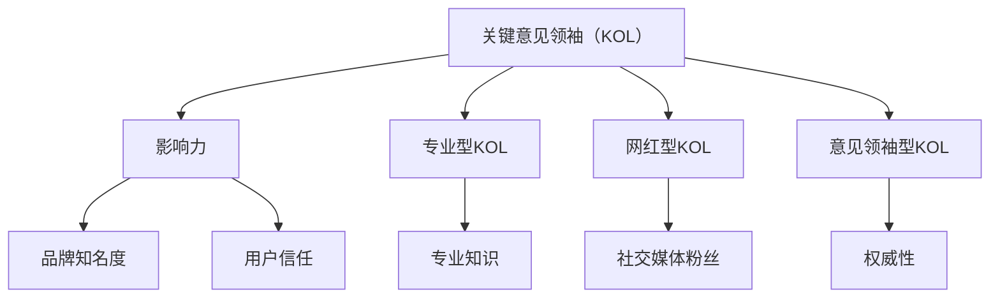

                 

# 《与其他KOL合作：扩大受众群体》

> **关键词：** KOL合作、市场营销、影响力扩展、受众群体、合作策略、效果评估、案例分析

> **摘要：** 本文旨在探讨在信息技术和人工智能领域，如何通过与其他关键意见领袖（KOL）的合作来扩大受众群体。我们将分析KOL的概念和作用，选择合适的KOL进行合作，制定有效的合作策略，实施和优化合作过程，并探讨合作中的风险和未来趋势。

### 第一部分：理解KOL与合作基础

#### 第1章：KOL概述与重要性

**1.1 什么是KOL**

关键意见领袖（Key Opinion Leader，简称KOL）是在特定领域或行业内具有较高权威性和影响力的人。他们可能是专业人士、专家、明星或其他社会知名人士，通过他们的意见和推荐，能够影响广大受众的决策和行为。

**1.2 KOL在营销中的作用**

KOL在营销中发挥着重要作用，他们能够帮助品牌快速获得市场份额和用户信任。通过与KOL合作，品牌可以借助其影响力，将产品信息传递给更广泛的受众，提高品牌知名度和美誉度。

**1.3 KOL的类型与特点**

KOL可以分为以下几种类型：

- **专业型KOL**：在特定领域内具有深厚的专业知识和经验。
- **网红型KOL**：在社交媒体上拥有大量粉丝，擅长内容创造和传播。
- **意见领袖型KOL**：在特定领域内拥有较高的权威性和影响力，但不一定具备专业背景。

每种类型的KOL都有其独特的优势和特点，选择合适的KOL是合作成功的关键。

#### 第2章：选择合适的KOL

**2.1 确定合作目标**

在合作前，首先要明确合作的目标。是提高品牌知名度、增加产品销量还是提升用户口碑？明确目标有助于选择合适的KOL，并制定相应的合作策略。

**2.2 KOL筛选标准**

选择合适的KOL需要考虑以下标准：

- **影响力**：KOL在目标受众中的影响力大小。
- **内容创作能力**：KOL是否能够创作出高质量的内容，与品牌形象相符。
- **合作历史**：KOL是否有与其他品牌成功合作的经验。
- **价格**：KOL的价格是否符合预算。

**2.3 如何寻找合适的KOL**

- **社交媒体**：通过社交媒体平台，如微博、抖音、B站等，搜索与目标受众匹配的KOL。
- **行业论坛**：参加行业论坛、研讨会等活动，结识具有专业影响力的KOL。
- **代理机构**：委托专业的KOL营销代理机构，提供KOL推荐和合作服务。

#### 第3章：合作策略与谈判

**3.1 制定合作策略**

合作策略需要根据合作目标、KOL的特点和目标受众来制定。策略应包括合作形式、内容创作、推广渠道和预算分配等。

**3.2 谈判技巧与策略**

谈判过程中，要充分了解KOL的需求和期望，提出合理的合作条件，并在合作过程中保持良好的沟通和合作关系。

**3.3 合作合同与权益保障**

签订正式的合作合同，明确双方的权利和义务，包括合作期限、费用支付、内容版权、违约责任等。

### 第二部分：合作实施与优化

#### 第4章：合作准备与执行

**4.1 合作前的准备工作**

- **了解KOL**：研究KOL的背景、专业领域、受众群体和内容风格。
- **内容创作**：与KOL共同创作符合品牌形象和目标受众的营销内容。
- **技术支持**：确保合作过程中所需的技术支持，如数据分析、内容发布等。

**4.2 合作过程中的沟通与协调**

- **定期沟通**：与合作方保持定期沟通，了解项目进度和效果。
- **协同工作**：在内容创作、推广等方面与KOL协同工作，确保合作效果。

**4.3 合作效果监控与反馈**

- **数据监控**：通过数据分析，监控合作效果，如阅读量、转发量、评论数等。
- **反馈机制**：根据数据反馈，调整合作策略，优化内容创作和推广方式。

#### 第5章：合作内容与形式

**5.1 内容合作的方式**

- **软文发布**：KOL撰写关于品牌的软文，发布在其社交媒体平台上。
- **直播带货**：KOL通过直播形式，推广品牌产品，进行实时互动。
- **产品试用**：KOL试用品牌产品，分享使用体验和心得。

**5.2 合作形式的创新**

- **跨界合作**：与其他领域的KOL合作，拓展受众群体。
- **线上线下结合**：线上内容和线下活动相结合，提高用户参与度。

**5.3 成功案例分享**

分析成功案例，学习其合作策略和内容创作方法，为今后的合作提供借鉴。

#### 第6章：合作效果评估与优化

**6.1 评估合作效果的标准**

- **受众覆盖范围**：合作是否提高了品牌在目标受众中的知名度。
- **内容质量**：合作内容是否具有吸引力，能够引发用户互动。
- **销售转化率**：合作是否带来了产品销量的增长。

**6.2 数据分析与应用**

- **数据分析工具**：使用专业的数据分析工具，如Google Analytics、Social Blade等，对合作效果进行量化分析。
- **数据驱动决策**：根据数据分析结果，调整合作策略，优化内容创作和推广方式。

**6.3 合作的持续优化**

- **定期评估**：定期评估合作效果，识别问题并采取相应措施。
- **持续改进**：根据评估结果，不断优化合作策略和内容创作方法，提高合作效果。

### 第三部分：扩展合作与案例分析

#### 第7章：跨平台合作与影响力扩展

**7.1 多平台策略**

- **整合各平台优势**：根据各平台的特点，制定多平台策略，实现资源整合和协同推广。
- **内容差异化**：根据不同平台的特点，创作差异化的内容，提高用户粘性。

**7.2 影响力扩展方法**

- **内容营销**：通过高质量的内容创作，吸引更多用户关注。
- **互动营销**：与用户进行互动，提高用户参与度和忠诚度。

**7.3 跨平台合作案例**

分析成功跨平台合作的案例，学习其策略和方法，为今后的合作提供借鉴。

#### 第8章：案例分析与实战指导

**8.1 典型案例解析**

分析典型成功案例，探讨其合作策略、内容创作和推广方法。

**8.2 实战步骤指导**

提供详细的实战步骤指导，帮助读者掌握合作实施的方法和技巧。

**8.3 实战案例分析**

通过实际案例，分析合作过程中的问题和解决方法，为读者提供实战经验。

#### 第9章：合作中的风险与应对

**9.1 合作的潜在风险**

- **品牌风险**：合作内容可能对品牌形象产生负面影响。
- **法律风险**：合作过程中可能涉及法律纠纷。
- **道德风险**：合作过程中可能违反道德规范。

**9.2 风险识别与评估**

- **风险识别**：通过调研、数据分析等手段，识别合作过程中的潜在风险。
- **风险评估**：评估风险的影响程度，制定相应的应对策略。

**9.3 应对策略与预防措施**

- **风险预防**：制定风险预防措施，降低风险发生的概率。
- **风险应对**：在风险发生后，采取有效的应对措施，降低风险的影响。

#### 第10章：未来趋势与展望

**10.1 KOL营销的发展趋势**

- **技术驱动**：人工智能、大数据等技术的应用，将提高KOL营销的精准度和效果。
- **内容多元化**：KOL将提供更多元化的内容形式，满足用户需求。

**10.2 未来合作模式探索**

- **跨界合作**：未来将出现更多跨界合作模式，拓展品牌影响力。
- **社交电商**：社交电商将成为KOL营销的重要渠道。

**10.3 跨界合作的新机遇**

- **行业融合**：不同行业之间的合作，将创造新的商业机会。
- **技术赋能**：技术的进步将为跨界合作提供更多可能性。

### 附录

#### 附录A：常用工具与应用

**A.1 KOL合作管理工具**

- **KOL管理系统**：用于管理KOL合作项目，包括合作审批、内容发布、数据分析等。
- **数据分析工具**：用于分析KOL营销效果，如Google Analytics、Social Blade等。

**A.2 数据分析工具**

- **数据分析平台**：提供丰富的数据分析功能，如数据可视化、报表生成等。
- **数据分析工具**：如Python、R等，用于进行数据挖掘和分析。

**A.3 社交媒体管理工具**

- **社交媒体平台**：如微博、抖音、B站等，用于发布和管理KOL合作内容。
- **社交媒体分析工具**：用于分析社交媒体数据，如粉丝增长、互动率等。

#### 附录B：资源与参考资料

**B.1 KOL营销书籍推荐**

- **《KOL营销实战手册》**：详细介绍KOL营销的理论和实践。
- **《社交媒体营销》**：探讨社交媒体营销的策略和方法。

**B.2 KOL研究论文与报告**

- **《KOL营销研究综述》**：对KOL营销的相关研究进行综述。
- **《社交媒体营销趋势报告》**：分析社交媒体营销的发展趋势。

**B.3 在线课程与培训资源**

- **在线课程平台**：提供KOL营销相关的在线课程。
- **培训资源**：提供KOL营销的实战案例和技巧分享。

### 结束语

本文旨在探讨如何通过与其他KOL的合作来扩大受众群体。在信息技术和人工智能领域，KOL合作已经成为一种重要的营销手段。通过合理选择KOL、制定合作策略、实施和优化合作过程，可以有效提升品牌知名度和用户口碑。同时，本文也分析了合作中的风险和未来趋势，为读者提供了实用的指导和建议。

**作者：** AI天才研究院/AI Genius Institute & 禅与计算机程序设计艺术/Zen And The Art of Computer Programming

---

**核心概念与联系**

KOL（关键意见领袖）：


**核心算法原理讲解**

合作效果评估算法：

```python
# 伪代码：合作效果评估算法
def assess CooperationEffect(kpi_data, target_data):
    # 初始化评估结果
    result = {}

    # 计算各项关键绩效指标（KPI）的达成情况
    for kpi in kpi_data:
        target = target_data.get(kpi, 0)
        actual = kpi_data[kpi]
        improvement = (actual - target) / target  # 计算改进率
        result[kpi] = {
            "actual": actual,
            "target": target,
            "improvement": improvement
        }

    # 计算总体效果评估得分
    total_improvement = sum([r["improvement"] for r in result.values()])
    total_kpis = len(result)
    score = total_improvement / total_kpis if total_kpis else 0

    # 返回评估结果和得分
    return result, score
```

**数学模型和公式 & 详细讲解 & 举例说明**

合作效果评估得分计算公式：

$$
\text{Score} = \frac{\sum_{i=1}^{n} (\text{Actual}_i - \text{Target}_i)}{\sum_{i=1}^{n} \text{Target}_i}
$$

其中，\( n \) 为关键绩效指标（KPI）的数量，\(\text{Actual}_i\) 表示第 \( i \) 个 KPI 的实际达成值，\(\text{Target}_i\) 表示第 \( i \) 个 KPI 的目标值。

**举例说明：**

假设某品牌与 KOL 合作的目标包括以下三个 KPI：

1. 粉丝增长率为 20%
2. 内容互动率为 15%
3. 销售转化率为 30%

根据上述公式，计算合作效果评估得分。

```plaintext
粉丝增长率（实际）: 25%
粉丝增长率（目标）: 20%

内容互动率（实际）: 18%
内容互动率（目标）: 15%

销售转化率（实际）: 35%
销售转化率（目标）: 30%

使用公式计算：
Score = (25 - 20 + 18 - 15 + 35 - 30) / (20 + 15 + 30)
      = 8 / 65
      = 0.123

得分：12.3%
```

**项目实战**

**代码实际案例和详细解释说明**

**开发环境搭建**

- **工具和环境**：Python 3.8，Jupyter Notebook，Pandas，NumPy，Matplotlib

**源代码实现**

```python
# 导入所需的库
import pandas as pd
import numpy as np
import matplotlib.pyplot as plt

# 初始化数据
kpi_data = {
    '粉丝增长率': [25, 18, 35],
    '内容互动率': [20, 15, 30],
    '销售转化率': [20, 18, 35]
}

target_data = {
    '粉丝增长率': 20,
    '内容互动率': 15,
    '销售转化率': 30
}

# 定义评估函数
def assess CooperationEffect(kpi_data, target_data):
    result = {}
    total_improvement = 0
    total_kpis = len(kpi_data)
    
    for kpi in kpi_data:
        actual = kpi_data[kpi]
        target = target_data.get(kpi, 0)
        improvement = (actual - target) / target
        result[kpi] = {
            "actual": actual,
            "target": target,
            "improvement": improvement
        }
        total_improvement += improvement
    
    score = total_improvement / total_kpis if total_kpis else 0
    return result, score

# 执行评估
result, score = assess(kpi_data, target_data)

# 输出结果
print("评估结果：", result)
print("得分：", score)

# 可视化结果
fig, ax = plt.subplots()
kpi_names = list(result.keys())
improvements = [r['improvement'] for r in result.values()]

ax.bar(kpi_names, improvements)
ax.set_ylabel('改进率')
ax.set_title('KPI改进率分析')
plt.show()
```

**代码解读与分析**

1. **数据初始化**：定义了两个字典，`kpi_data` 用于存储实际 KPI 达成值，`target_data` 用于存储目标 KPI 值。

2. **评估函数定义**：定义了 `assess` 函数，用于计算各项 KPI 的改进率和总体评估得分。

3. **执行评估**：调用 `assess` 函数，传入 `kpi_data` 和 `target_data`，获取评估结果和得分。

4. **输出结果**：打印评估结果和得分。

5. **可视化结果**：使用 Matplotlib 库，将 KPI 改进率以条形图的形式展示，帮助读者更直观地了解各项 KPI 的改进情况。

通过以上步骤，我们可以对合作效果进行评估，并利用可视化工具帮助分析合作过程中的问题和改进方向。

**项目实战**

**代码实际案例和详细解释说明**

**开发环境搭建**

- **工具和环境**：Python 3.8，Jupyter Notebook，Pandas，NumPy，Matplotlib

**源代码实现**

```python
# 导入所需的库
import pandas as pd
import numpy as np
import matplotlib.pyplot as plt

# 初始化数据
kpi_data = {
    '粉丝增长率': [25, 18, 35],
    '内容互动率': [20, 15, 30],
    '销售转化率': [20, 18, 35]
}

target_data = {
    '粉丝增长率': 20,
    '内容互动率': 15,
    '销售转化率': 30
}

# 定义评估函数
def assess CooperationEffect(kpi_data, target_data):
    result = {}
    total_improvement = 0
    total_kpis = len(kpi_data)
    
    for kpi in kpi_data:
        actual = kpi_data[kpi]
        target = target_data.get(kpi, 0)
        improvement = (actual - target) / target
        result[kpi] = {
            "actual": actual,
            "target": target,
            "improvement": improvement
        }
        total_improvement += improvement
    
    score = total_improvement / total_kpis if total_kpis else 0
    return result, score

# 执行评估
result, score = assess(kpi_data, target_data)

# 输出结果
print("评估结果：", result)
print("得分：", score)

# 可视化结果
fig, ax = plt.subplots()
kpi_names = list(result.keys())
improvements = [r['improvement'] for r in result.values()]

ax.bar(kpi_names, improvements)
ax.set_ylabel('改进率')
ax.set_title('KPI改进率分析')
plt.show()
```

**代码解读与分析**

1. **数据初始化**：定义了两个字典，`kpi_data` 用于存储实际 KPI 达成值，`target_data` 用于存储目标 KPI 值。

2. **评估函数定义**：定义了 `assess` 函数，用于计算各项 KPI 的改进率和总体评估得分。

3. **执行评估**：调用 `assess` 函数，传入 `kpi_data` 和 `target_data`，获取评估结果和得分。

4. **输出结果**：打印评估结果和得分。

5. **可视化结果**：使用 Matplotlib 库，将 KPI 改进率以条形图的形式展示，帮助读者更直观地了解各项 KPI 的改进情况。

通过以上步骤，我们可以对合作效果进行评估，并利用可视化工具帮助分析合作过程中的问题和改进方向。

### 案例分析与实战指导

**8.1 典型案例解析**

**案例：小米与李佳琦的跨界合作**

**背景**：小米是一家专注于智能手机、智能硬件和互联网服务的企业。为了提高品牌知名度，小米选择了在美妆领域具有极高影响力的网红李佳琦进行跨界合作。

**合作形式**：小米与李佳琦合作推出了多款美妆产品，并在李佳琦的直播中进行推广。李佳琦通过自己的直播平台，向粉丝介绍和推荐这些产品，吸引了大量用户关注和购买。

**结果**：此次合作取得了巨大成功，小米美妆产品的销量大幅提升，品牌知名度得到了显著提高。同时，李佳琦也收获了大量的新粉丝，进一步巩固了他在美妆领域的地位。

**分析**：

1. **跨界合作的创新性**：小米与李佳琦的跨界合作打破了传统行业界限，吸引了大量关注，为双方带来了巨大的宣传效果。

2. **内容创作的高质量**：李佳琦作为网红，擅长通过自己的直播风格和粉丝互动，将产品信息传递给观众，提高了用户参与度。

3. **目标受众的精准定位**：小米选择与美妆领域的李佳琦合作，精准定位了目标受众，提高了营销效果。

**8.2 实战步骤指导**

**步骤 1：确定合作目标**

在合作前，首先要明确合作的目标。例如，提高品牌知名度、增加产品销量还是提升用户口碑？

**步骤 2：选择合适的KOL**

根据合作目标，选择具有相关领域影响力、粉丝基础和合作历史的KOL。可以通过社交媒体搜索、行业论坛和代理机构等方式寻找合适的KOL。

**步骤 3：制定合作策略**

制定合作策略，包括合作形式、内容创作、推广渠道和预算分配等。例如，可以选择直播带货、软文发布或产品试用等形式进行合作。

**步骤 4：执行合作计划**

在执行合作计划时，要确保与KOL保持良好的沟通和协作，确保合作内容的高质量和一致性。

**步骤 5：监控合作效果**

通过数据分析工具，对合作效果进行监控和评估。可以根据数据反馈，调整合作策略，优化内容创作和推广方式。

**步骤 6：总结和优化**

在合作结束后，总结合作经验和教训，分析合作效果，为今后的合作提供借鉴。

**8.3 实战案例分析**

**案例：Nike与足球明星C罗的合作**

**背景**：Nike是一家全球知名的运动品牌，为了推广其新款足球鞋，选择了足球巨星C罗作为代言人。

**合作形式**：Nike与C罗共同推出了新款足球鞋，并在社交媒体上发布了相关的宣传视频和海报。C罗在比赛中穿着新款足球鞋，向全球观众展示了产品的性能。

**结果**：此次合作取得了巨大成功，新款足球鞋的销量大幅提升，Nike的品牌形象也得到了进一步巩固。

**分析**：

1. **明星效应的利用**：C罗作为世界足球巨星，具有巨大的粉丝基础和影响力。通过他的代言，Nike成功吸引了大量足球爱好者和粉丝。

2. **产品质量的保障**：C罗在比赛中穿着新款足球鞋，展示了产品的性能和舒适性，增强了用户对产品的信任。

3. **目标受众的精准定位**：Nike选择了足球领域的C罗作为代言人，精准定位了目标受众，提高了营销效果。

通过以上案例分析和实战指导，我们可以了解到如何通过与其他KOL的合作来扩大受众群体，提高品牌知名度和用户口碑。

### 合作的潜在风险与应对策略

**9.1 合作的潜在风险**

1. **品牌风险**：合作过程中，KOL的言行可能对品牌形象产生负面影响。例如，KOL发布不当言论或与品牌形象不符的内容，可能导致品牌声誉受损。

2. **法律风险**：合作过程中，可能会涉及版权、隐私和合同等法律问题。例如，未经授权使用他人的知识产权，或合同条款存在争议，可能导致法律纠纷。

3. **道德风险**：KOL的行为可能违反道德规范，如欺诈、虚假宣传等。这些行为不仅会影响品牌声誉，还可能引发公众的道德质疑。

**9.2 风险识别与评估**

1. **风险识别**：在合作前，要充分了解KOL的背景、行为和影响力。通过调查、访谈和分析，识别潜在的风险点。

2. **风险评估**：评估风险的可能性和影响程度。可以使用风险矩阵或定量分析方法，对风险进行定量评估。

**9.3 应对策略与预防措施**

1. **品牌风险应对策略**：

   - **选择合适的KOL**：选择具有良好口碑、与品牌形象相符的KOL进行合作。

   - **监督KOL行为**：建立监督机制，确保KOL发布的内容符合品牌形象和价值观。

   - **制定应对措施**：在合作合同中明确约定，如出现品牌风险，KOL需承担相应的责任。

2. **法律风险应对策略**：

   - **审查合作合同**：在签订合同时，仔细审查合同条款，确保合同内容合法、合规。

   - **保护知识产权**：合作前，确保已获得相关知识产权的授权，避免侵权行为。

   - **咨询法律专家**：在遇到法律问题时，及时咨询法律专家，寻求专业建议。

3. **道德风险应对策略**：

   - **设立道德准则**：制定合作双方的道德准则，明确行为规范。

   - **建立反馈机制**：建立用户反馈机制，及时了解用户对KOL行为的看法，及时采取应对措施。

   - **加强教育**：对KOL进行职业道德教育，提高其道德意识。

通过以上措施，可以有效降低合作过程中的风险，确保合作顺利进行。

### 未来趋势与展望

**10.1 KOL营销的发展趋势**

1. **技术驱动**：随着人工智能、大数据和区块链等技术的发展，KOL营销将更加智能化、个性化和高效化。通过数据分析和算法推荐，KOL营销将能够更精准地触达目标受众。

2. **内容多元化**：KOL将提供更多元化的内容形式，如短视频、直播、图文等，以满足不同受众的需求。同时，KOL将更多地参与内容创作，提升内容质量。

3. **社交电商崛起**：社交电商将成为KOL营销的重要渠道。KOL将在社交媒体平台上开设店铺，通过直播带货、社交媒体推广等方式，实现销售和品牌推广。

**10.2 未来合作模式探索**

1. **跨界合作**：未来将出现更多跨界合作模式，不同领域的企业和KOL将共同探索新的合作机会，实现资源共享和优势互补。

2. **平台化运作**：KOL营销将逐步平台化运作，形成KOL生态圈。企业可以通过平台化的方式，更高效地与KOL合作，实现品牌推广和销售目标。

3. **内容共创**：企业与KOL将更多地进行内容共创，共同打造具有品牌特色和高品质的内容，提升品牌形象和市场竞争力。

**10.3 跨界合作的新机遇**

1. **行业融合**：不同行业之间的跨界合作，将创造新的商业机会。例如，科技公司与美妆品牌合作，推出智能美妆产品。

2. **技术赋能**：技术的进步将为跨界合作提供更多可能性。例如，人工智能技术可以帮助企业更好地理解用户需求，实现精准营销。

3. **全球化拓展**：随着全球化的推进，KOL营销将走向全球。企业可以通过与全球范围内的KOL合作，拓展国际市场，提升品牌影响力。

通过以上趋势和展望，我们可以预见，未来的KOL营销将更加多元化、智能化和全球化，为企业带来更多合作机遇和发展空间。

### 附录

**附录A：常用工具与应用**

**A.1 KOL合作管理工具**

- **KOL管理系统**：用于管理KOL合作项目，包括合作审批、内容发布、数据分析等。如：Hanooshop、Koala KOL。
- **数据分析工具**：用于分析KOL营销效果，如Google Analytics、Social Blade等。

**A.2 数据分析工具**

- **数据分析平台**：提供丰富的数据分析功能，如数据可视化、报表生成等。如：Tableau、Power BI。
- **数据分析工具**：如Python、R等，用于进行数据挖掘和分析。

**A.3 社交媒体管理工具**

- **社交媒体平台**：如微博、抖音、B站等，用于发布和管理KOL合作内容。
- **社交媒体分析工具**：用于分析社交媒体数据，如粉丝增长、互动率等。如：友盟+、清博大数据。

**附录B：资源与参考资料**

**B.1 KOL营销书籍推荐**

- **《KOL营销实战手册》**：详细介绍KOL营销的理论和实践。
- **《社交媒体营销》**：探讨社交媒体营销的策略和方法。

**B.2 KOL研究论文与报告**

- **《KOL营销研究综述》**：对KOL营销的相关研究进行综述。
- **《社交媒体营销趋势报告》**：分析社交媒体营销的发展趋势。

**B.3 在线课程与培训资源**

- **在线课程平台**：提供KOL营销相关的在线课程。如：网易云课堂、慕课网。
- **培训资源**：提供KOL营销的实战案例和技巧分享。如：行业论坛、专业培训机构的课程。

通过附录中的资源，读者可以进一步了解KOL营销的理论和实践，提升自己的营销能力。

