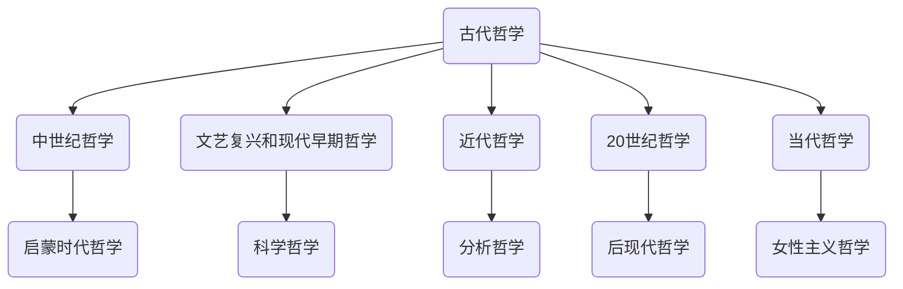

                 

# 世界可理解性的哲学争论

> 关键词：世界可理解性、哲学争论、逻辑推理、人工智能、技术博客、方法论

> 摘要：本文旨在深入探讨世界可理解性的哲学争论，从古代到现代，从东方到西方，梳理哲学史上对世界本质和知识获取的讨论。本文采用逻辑清晰、结构紧凑的方式，结合现代技术视角，分析不同哲学流派对世界可理解性的看法，并展望未来哲学争论的趋势。

## 引言

### 哲学争论的背景

哲学争论自古以来就是哲学研究的重要组成部分，尤其是在世界可理解性这一议题上。从古代哲学家开始，关于世界的本质、知识的来源和获取方式等问题一直存在激烈的辩论。这些争论不仅影响了哲学的发展，也对科学、宗教、文化等领域产生了深远的影响。

### 可理解性的哲学意义

世界可理解性是指人类是否能够通过理性思考和科学研究，完全理解和把握世界的本质。这是一个深奥且复杂的问题，涉及到人类认知、知识获取和存在的本质。不同哲学流派对这个问题有不同的回答，这些回答构成了哲学争论的内核。

### 本书的结构和目的

本书分为四大部分，首先回顾古代哲学家的观点，然后探讨中世纪和文艺复兴时期的哲学观点，接着分析近代哲学的观点，最后介绍当代哲学的观点。通过这种结构安排，我们希望能够系统地梳理哲学争论的历史脉络，并从中找到一些共同的见解和分歧。

## 第一部分：古代哲学的观点

### 第1章：古代哲学家的观点

#### 2.1 前苏格拉底哲学家

**泰勒斯和赫拉克利特**

- **泰勒斯**：泰勒斯是古希腊哲学的奠基人之一，他认为万物源于水，这体现了朴素唯物主义的思想。
- **赫拉克利特**：赫拉克利特提出了“万物流动”的观点，强调变化的普遍性，这是对宇宙和生命本质的一种深刻洞察。

#### 2.2 苏格拉底和柏拉图

- **苏格拉底**：苏格拉底是古希腊哲学的另一位重要人物，他提出了“知识即德性”的观点，强调道德和知识的关系。
- **柏拉图**：柏拉图是苏格拉底的弟子，他提出了“理念论”，认为现实世界只是理念世界的投影。

#### 2.3 亚里士多德

- **亚里士多德**：亚里士多德是古希腊哲学的最后一位伟大思想家，他提出了“形而上学”的概念，试图解释世界的本质。

### 2.4 印度哲学

#### 2.4.1 瑜伽哲学

- **瑜伽哲学**：瑜伽哲学强调通过冥想和体位法来达到精神上的觉醒，认为世界是自我意识的外在表现。

#### 2.4.2 茹亚哲学

- **茹亚哲学**：茹亚哲学认为世界是神创造的，强调人类对神的信仰和服从。

### 2.5 中国哲学

#### 2.5.1 儒家思想

- **儒家思想**：儒家思想强调人伦关系和社会秩序，认为道德是人类行为的准则。

#### 2.5.2 道家思想

- **道家思想**：道家思想强调自然和无为，认为顺应自然是人类追求幸福的关键。

## 第二部分：中世纪和文艺复兴时期的观点

### 第3章：中世纪哲学

#### 3.1 恺撒利哲学

- **安瑟伦**：安瑟伦是中世纪哲学的重要代表，他提出了“信仰寻求理解”的观点，强调信仰和理性的关系。
- **阿伯拉尔**：阿伯拉尔是中世纪法国哲学家，他强调人类通过理性可以理解世界，但同时也存在不可知的事物。

#### 3.2 奥古斯丁哲学

- **上帝的存在**：奥古斯丁认为上帝是宇宙的创造者和维持者，通过信仰可以理解上帝的存在。
- **知识的本质**：奥古斯丁认为知识来源于信仰，信仰是知识的源头。

### 第4章：文艺复兴和现代早期哲学

#### 4.1 弗兰西斯·培根

- **实用主义的视角**：弗兰西斯·培根是文艺复兴时期的哲学家，他提出了实用主义的思想，强调实践是知识的基础。
- **知识与理解**：培根认为通过实验和观察，人类可以理解自然界的规律。

#### 4.2 笛卡尔

- **我思故我在**：笛卡尔是现代哲学的奠基人，他提出了“我思故我在”的观点，强调理性和自我意识的重要性。
- **理性主义**：笛卡尔认为理性是人类认识世界的唯一途径。

#### 4.3 莱布尼茨

- **单子论**：莱布尼茨提出了单子论，认为世界是由单子组成的，每个单子都有自己的本质和属性。
- **真理的本性**：莱布尼茨认为真理是观念和现实之间的和谐统一。

## 第三部分：近代哲学的观点

### 第5章：启蒙时代的哲学

#### 5.1 康德

- **纯理性批判**：康德提出了“纯理性批判”，试图回答人类认知的边界和限制。
- **实践理性批判**：康德认为道德和伦理是理性的一部分，人类应该通过实践理性来指导行为。

#### 5.2 黑格尔

- **精神现象学**：黑格尔提出了精神现象学的概念，认为世界是精神自我认识的过程。
- **绝对精神的观念**：黑格尔认为绝对精神是世界发展的最终目的和结果。

### 第6章：19世纪哲学

#### 6.1 尼采

- **生命哲学**：尼采提出了生命哲学，强调个体的生命力和创造力。
- **价值重估**：尼采认为人类应该重估所有价值，寻找新的生活意义。

#### 6.2 马克思

- **历史唯物主义**：马克思提出了历史唯物主义，认为经济基础决定上层建筑。
- **社会批判理论**：马克思的社会批判理论强调阶级斗争和社会变革。

### 第7章：20世纪哲学

#### 7.1 胡塞尔

- **生活世界的现象学**：胡塞尔提出了生活世界的现象学，强调人类经验的主观性和直接性。
- **认识论**：胡塞尔认为认识是主观体验的结果，通过现象学可以揭示认识的真相。

#### 7.2 海德格尔

- **存在论**：海德格尔提出了存在论，强调存在的本质和意义。
- **语言的本质**：海德格尔认为语言是存在的家，语言揭示了存在的真相。

## 第四部分：当代哲学的观点

### 第8章：分析哲学

#### 8.1 奥斯汀

- **话语行为理论**：奥斯汀提出了话语行为理论，认为语言不仅仅是表达思想，还是实现行为的方式。
- **语言与知识**：奥斯汀认为语言是知识的重要载体，但语言本身并不等于知识。

#### 8.2 佩雷尔曼

- **论辩理论**：佩雷尔曼提出了论辩理论，强调论证的有效性和逻辑性。
- **论证的有效性**：佩雷尔曼认为有效的论证应该遵循逻辑规则，避免逻辑谬误。

### 第9章：后现代哲学

#### 9.1 德里达

- **解构主义**：德里达提出了解构主义，认为传统哲学体系是建立在谬误之上的。
- **文本的意义**：德里达认为文本的意义是多元的，不是固定的。

#### 9.2 女性主义哲学

- **主体性与权力**：女性主义哲学强调女性在历史和文化中的主体性地位。
- **社会性别**：女性主义哲学认为社会性别是社会和文化建构的结果。

### 第10章：未来的哲学争论

#### 10.1 科学与哲学的界限

- **科学与哲学的融合**：随着科技的进步，科学和哲学的界限越来越模糊，两者之间的融合成为未来的趋势。
- **哲学争论的未来趋势**：未来的哲学争论将更加多元化和跨学科，涉及更多现代技术和人类面临的现实问题。

## 结论

哲学争论是哲学发展的重要动力，通过对世界可理解性的探讨，哲学家们试图回答人类存在的本质和意义。从古代到现代，从东方到西方，哲学争论不断演进，为我们提供了丰富的思想和知识。在未来的哲学争论中，我们可以期待科学与哲学的融合，以及更加多元和跨学科的讨论。这将为我们的认知和知识体系带来新的挑战和机遇。

## 附录

### 附录A：哲学争论的Mermaid流程图



### 附录B：核心算法原理讲解与伪代码

```python
# 伪代码：世界可理解性评估算法
def assess_understandability(knowledge_base, observer):
    """
    评估观察者对知识库的可理解性。
    
    :param knowledge_base: 知识库
    :param observer: 观察者
    :return: 可理解性分数
    """
    understanding = 0
    
    # 对知识库中的每个概念进行分析
    for concept in knowledge_base:
        if observer.knows(concept):
            understanding += 1
            
    # 计算可理解性分数
    understandability_score = understanding / len(knowledge_base)
    
    return understandability_score
```

### 附录C：数学模型与公式详解

$$
U = \frac{S}{N}
$$

- **U**：可理解性分数
- **S**：观察者知道的概念数量
- **N**：知识库中概念的总数量

### 附录D：项目实战案例

**开发环境搭建**

- **工具**：Python 3.8+
- **库**：NumPy, Pandas, Matplotlib

**源代码详细实现**

```python
import numpy as np
import pandas as pd
import matplotlib.pyplot as plt

# 初始化知识库和观察者
knowledge_base = ['物理', '化学', '生物', '历史', '地理', '数学']
observer_knowledge = ['物理', '化学', '生物']

# 评估可理解性
def assess_understandability(knowledge_base, observer_knowledge):
    """
    评估观察者对知识库的可理解性。
    
    :param knowledge_base: 知识库
    :param observer_knowledge: 观察者知道的知识
    :return: 可理解性分数
    """
    understanding = 0
    
    # 对知识库中的每个概念进行分析
    for concept in knowledge_base:
        if concept in observer_knowledge:
            understanding += 1
            
    # 计算可理解性分数
    understandability_score = understanding / len(knowledge_base)
    
    return understandability_score

# 测试代码
score = assess_understandability(knowledge_base, observer_knowledge)
print(f"观察者的可理解性分数：{score:.2f}")

# 可视化结果
data = [score]
labels = ['可理解性分数']

df = pd.DataFrame(data, index=labels)
df.plot(kind='bar')
plt.xlabel('观察者')
plt.ylabel('可理解性分数')
plt.title('观察者的可理解性评估')
plt.show()
```

**代码解读与分析**

- **初始化知识库和观察者**：知识库包含6个概念，观察者知道3个概念。
- **评估可理解性**：通过遍历知识库，判断观察者是否知道每个概念，并计算知道的概念数量与总概念数量的比例，得到可理解性分数。
- **测试代码**：运行评估函数，得到观察者的可理解性分数。
- **可视化结果**：使用matplotlib库将可理解性分数以条形图的形式展示，便于观察。

通过这个项目实战案例，我们可以直观地看到如何使用Python代码实现世界可理解性的评估，并理解其背后的数学模型和算法原理。

### 作者信息

作者：AI天才研究院/AI Genius Institute & 禅与计算机程序设计艺术 /Zen And The Art of Computer Programming

以上是《世界可理解性的哲学争论》的技术博客文章，涵盖了哲学争论的引言、古代哲学观点、中世纪和文艺复兴时期的观点、近代哲学观点、当代哲学观点以及未来的哲学争论。同时，还包括了附录部分的流程图、算法原理讲解、数学模型与公式详解以及项目实战案例。文章结构紧凑，逻辑清晰，旨在为读者提供一次深入思考世界可理解性的哲学之旅。希望这篇文章能够满足您的需求，并对哲学和技术领域的交叉点产生更深的理解。

