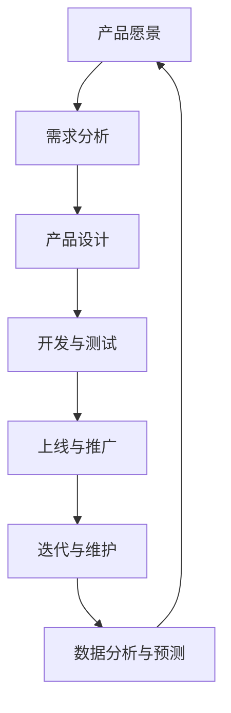

                 

# 《个人开发者的产品生命周期管理》

> 关键词：个人开发者、产品生命周期管理、产品设计、用户体验、迭代维护、数据分析、算法原理、数学模型、实战案例

> 摘要：本文将详细介绍个人开发者的产品生命周期管理，包括产品策略与规划、产品开发流程、产品设计与用户体验、产品测试与质量控制、产品上线与推广、产品迭代与维护等核心环节。通过数据分析与预测算法、用户体验评估算法、产品生命周期数学模型等核心算法原理讲解，结合实际案例与代码解析，帮助个人开发者高效管理产品生命周期，提升产品竞争力。

## 《个人开发者的产品生命周期管理》目录大纲

### 第一部分：产品生命周期管理基础

#### 第1章：产品生命周期管理概述
- 1.1 什么是产品生命周期管理（PLM）
- 1.2 产品生命周期的四个阶段
- 1.3 产品生命周期管理的重要性

#### 第2章：产品策略与规划
- 2.1 制定产品策略的步骤
- 2.2 产品规划的重要性
- 2.3 产品规划的方法与工具

#### 第3章：产品开发流程
- 3.1 产品开发的生命周期
- 3.2 产品开发的关键环节
- 3.3 如何有效管理产品开发流程

#### 第4章：产品设计与用户体验
- 4.1 产品设计的原则
- 4.2 用户体验（UX）设计的重要性
- 4.3 用户研究方法与技巧

#### 第5章：产品测试与质量控制
- 5.1 产品测试的类型
- 5.2 质量控制的方法与工具
- 5.3 如何进行有效的产品测试

#### 第6章：产品上线与推广
- 6.1 产品上线前的准备工作
- 6.2 产品推广的策略
- 6.3 社交媒体与SEO推广

#### 第7章：产品迭代与维护
- 7.1 产品迭代的重要性
- 7.2 如何进行有效的产品迭代
- 7.3 产品维护的策略与技巧

### 第二部分：核心概念与联系

#### 第8章：产品生命周期管理的核心概念与联系
- 8.1 产品生命周期管理中的关键概念
- 8.2 这些概念之间的联系与相互作用
- 8.3 Mermaid流程图：产品生命周期管理全流程

### 第三部分：核心算法原理讲解

#### 第9章：数据分析与预测算法原理
- 9.1 数据分析的基础知识
- 9.2 预测算法的原理与伪代码
- 9.3 如何运用预测算法进行产品趋势分析

#### 第10章：用户体验评估算法
- 10.1 用户体验评估的基础知识
- 10.2 评估算法的原理与伪代码
- 10.3 如何运用评估算法优化产品

### 第四部分：数学模型与公式解析

#### 第11章：产品生命周期数学模型
- 11.1 产品生命周期的数学模型介绍
- 11.2 数学公式与详细讲解
- 11.3 实际案例与举例说明

#### 第12章：数据驱动的决策模型
- 12.1 数据驱动决策模型的基础知识
- 12.2 数学公式与详细讲解
- 12.3 数据驱动决策模型的应用案例

### 第五部分：项目实战与代码解析

#### 第13章：产品生命周期管理实战案例
- 13.1 实战案例介绍
- 13.2 实战案例的代码实现
- 13.3 代码解读与分析

#### 第14章：产品生命周期管理工具实战
- 14.1 常用的产品生命周期管理工具
- 14.2 工具使用方法与技巧
- 14.3 工具实战案例解析

#### 第15章：个人开发者产品生命周期管理实践
- 15.1 个人开发者如何进行产品生命周期管理
- 15.2 个人开发者面临的挑战与应对策略
- 15.3 成功案例分享与经验总结

### 附录

#### 附录A：产品生命周期管理工具与资源
- A.1 常用产品生命周期管理工具介绍
- A.2 开源资源与在线工具
- A.3 学习资源与推荐阅读

#### 附录B：产品生命周期管理参考书籍与文献
- B.1 重要的参考书籍
- B.2 关键文献与论文
- B.3 在线学习资源与课程推荐</|assistant|>## 第一部分：产品生命周期管理基础

### 第1章：产品生命周期管理概述

#### 1.1 什么是产品生命周期管理（PLM）

产品生命周期管理（Product Lifecycle Management，简称PLM）是一种系统性的方法，用于管理产品从构思到终止的整个过程。它涵盖了产品从概念阶段到市场退出，包括设计、开发、测试、发布、维护和最终淘汰的各个阶段。PLM的核心目标是确保产品在整个生命周期中保持质量、成本效益和市场竞争力。

产品生命周期管理并非一个孤立的过程，而是与企业的整体战略紧密相连。它通过跨部门协作，整合设计、工程、制造、采购、销售、市场、服务和供应链等多个环节，确保产品在各个阶段都能得到有效管理。

#### 1.2 产品生命周期的四个阶段

产品生命周期通常可以分为四个主要阶段：引入阶段、成长阶段、成熟阶段和衰退阶段。

1. **引入阶段**（Introduction Phase）
   - 特点：新产品发布，市场推广，用户接受度低，成本高，收入低。
   - 重点：市场研究，产品定位，用户反馈，风险控制。

2. **成长阶段**（Growth Phase）
   - 特点：市场份额增加，用户接受度高，成本下降，收入增长。
   - 重点：扩大市场份额，提高产品质量，优化供应链，提升品牌认知。

3. **成熟阶段**（Maturity Phase）
   - 特点：市场份额稳定，市场竞争激烈，成本和收入趋于平衡。
   - 重点：维护市场份额，降低成本，提高用户满意度，持续创新。

4. **衰退阶段**（Decline Phase）
   - 特点：市场份额下降，用户减少，成本高于收入。
   - 重点：评估产品退出策略，减少损失，可能包括产品升级或替代。

#### 1.3 产品生命周期管理的重要性

产品生命周期管理对于个人开发者来说具有重要意义。首先，它能够帮助开发者更好地理解产品的全生命周期，从而制定更有效的产品策略和规划。其次，通过有效的PLM，开发者可以优化资源分配，降低开发成本，提高产品质量和市场竞争力。此外，PLM还能够帮助开发者及时识别产品问题，进行快速迭代和改进，提升用户体验。

在实际应用中，产品生命周期管理有助于开发者实现以下目标：

- **提升产品质量**：通过系统的测试和质量控制流程，确保产品在不同阶段都能达到既定的质量标准。
- **降低开发成本**：通过有效的资源管理和流程优化，减少不必要的浪费，提高开发效率。
- **增强市场竞争力**：通过持续的产品迭代和优化，确保产品能够满足市场需求，保持竞争力。
- **提高用户满意度**：通过关注用户体验，及时反馈和改进，提升用户满意度和忠诚度。

总之，产品生命周期管理是个人开发者成功的关键要素之一，它不仅帮助开发者实现产品的持续改进，还能够提升整个团队的协作效率和项目管理能力。接下来，我们将进一步探讨产品策略与规划、产品开发流程、产品设计与用户体验等核心内容，帮助开发者深入理解和掌握产品生命周期管理的各个方面。

### 第2章：产品策略与规划

#### 2.1 制定产品策略的步骤

制定产品策略是产品生命周期管理中的关键环节，它直接决定了产品的市场表现和未来发展。以下是制定产品策略的常见步骤：

1. **市场研究**
   - **目标市场定义**：明确目标客户群体，包括用户特征、需求、行为习惯等。
   - **市场趋势分析**：研究市场动态，了解当前和未来的市场需求变化。
   - **竞争分析**：分析竞争对手的产品、优势和劣势，找出差异化的机会。

2. **需求分析**
   - **用户需求调研**：通过问卷调查、用户访谈、焦点小组等方式收集用户需求。
   - **需求排序**：根据用户需求的紧急程度和重要性进行排序，确定优先级。

3. **产品定位**
   - **目标市场定位**：基于市场研究和需求分析，确定产品在市场中的定位。
   - **差异化优势**：明确产品的独特卖点（USP），即与其他竞争产品相比的优势。

4. **产品愿景与目标**
   - **产品愿景**：描述产品的长期目标和愿景，明确产品想要实现的核心价值。
   - **短期目标**：设定具体的、可量化的短期目标，如市场份额、收入增长等。

5. **策略制定**
   - **开发计划**：根据产品愿景和目标，制定详细的产品开发计划，包括时间表、资源分配、关键里程碑等。
   - **风险管理**：识别潜在风险，制定风险应对策略，确保项目顺利进行。

6. **评审与调整**
   - **定期评审**：定期对产品策略进行评审，检查策略是否符合市场变化和业务目标。
   - **调整与优化**：根据评审结果，及时调整产品策略，确保其持续有效。

#### 2.2 产品规划的重要性

产品规划是产品开发过程中的重要环节，它决定了产品能否顺利实现市场目标。以下是产品规划的重要性：

1. **明确目标**：通过产品规划，可以明确产品的目标市场和用户需求，确保产品开发的方向正确。

2. **资源分配**：产品规划有助于合理分配开发资源，确保项目在预算和时间范围内完成。

3. **风险管理**：通过风险评估和应对策略的制定，可以减少项目风险，提高成功概率。

4. **协调协作**：产品规划促进了跨部门之间的协作，确保不同团队在产品开发过程中保持一致的目标和方向。

5. **优化流程**：产品规划有助于识别并优化开发流程中的瓶颈和浪费，提高开发效率。

#### 2.3 产品规划的方法与工具

以下是几种常见的产品规划方法和工具：

1. **需求管理工具**
   - **JIRA**：用于跟踪和管理产品需求和任务。
   - **Trello**：提供直观的看板式界面，便于需求梳理和任务分配。

2. **项目管理工具**
   - **Microsoft Project**：提供详细的项目计划和时间跟踪功能。
   - **Asana**：提供任务管理、协作和进度跟踪功能。

3. **敏捷开发**
   - **Scrum**：通过短周期的迭代开发，快速响应市场需求变化。
   - **Kanban**：通过看板系统，可视化工作流程，优化开发效率。

4. **数据驱动的决策**
   - **数据分析工具**：如Google Analytics、Tableau等，用于收集和分析用户数据，支持产品规划决策。

5. **市场调研工具**
   - **SurveyMonkey**：提供专业的在线调查工具，帮助收集用户反馈。
   - **Qualtrics**：提供强大的调研和数据收集功能。

通过合理运用这些方法和工具，个人开发者可以更加高效地制定和执行产品规划，确保产品在整个生命周期中保持竞争力和用户满意度。接下来，我们将深入探讨产品开发流程、产品设计与用户体验、产品测试与质量控制等关键内容，帮助开发者全面掌握产品生命周期管理的各个方面。

### 第3章：产品开发流程

#### 3.1 产品开发的生命周期

产品开发的生命周期是指从产品概念生成到产品退出市场的整个过程。通常，产品开发生命周期可以分为以下五个主要阶段：

1. **概念阶段**（Concept Phase）
   - **目标**：确定产品概念，识别市场需求和机会。
   - **过程**：市场研究、需求分析、初步设计。
   - **输出**：产品愿景、需求文档、初步设计文档。

2. **开发阶段**（Development Phase）
   - **目标**：构建产品原型，进行详细设计和技术验证。
   - **过程**：详细设计、编码、单元测试。
   - **输出**：功能完善的产品原型、详细设计文档、代码库、单元测试结果。

3. **测试阶段**（Testing Phase）
   - **目标**：确保产品功能符合需求，发现和修复缺陷。
   - **过程**：集成测试、系统测试、用户验收测试。
   - **输出**：测试报告、缺陷记录、产品发布准备。

4. **发布阶段**（Release Phase）
   - **目标**：将产品发布到市场，启动用户反馈收集。
   - **过程**：发布计划、发布、用户反馈收集。
   - **输出**：产品发布文档、用户反馈。

5. **维护阶段**（Maintenance Phase）
   - **目标**：持续优化产品，解决用户问题和功能需求。
   - **过程**：问题修复、功能增强、用户支持。
   - **输出**：产品更新日志、用户支持文档。

#### 3.2 产品开发的关键环节

在产品开发过程中，有几个关键环节对产品的成功至关重要：

1. **需求分析**
   - **目标**：确保产品满足用户需求和市场预期。
   - **过程**：收集用户需求、分析市场需求、制定需求文档。
   - **工具**：问卷调查、用户访谈、市场调研工具。

2. **设计**
   - **目标**：构建产品的功能性和易用性。
   - **过程**：设计原型、详细设计、设计评审。
   - **工具**：Axure、Figma、Sketch。

3. **编码**
   - **目标**：将设计转化为可执行的代码。
   - **过程**：编写代码、代码评审、单元测试。
   - **工具**：集成开发环境（IDE）、版本控制系统。

4. **测试**
   - **目标**：确保产品功能完善、无缺陷。
   - **过程**：单元测试、集成测试、系统测试、用户验收测试。
   - **工具**：测试框架、自动化测试工具。

5. **发布**
   - **目标**：将产品交付给用户，确保顺利上线。
   - **过程**：发布准备、发布、用户反馈收集。
   - **工具**：发布管理工具、自动化部署工具。

#### 3.3 如何有效管理产品开发流程

为了确保产品开发流程的高效和顺利进行，个人开发者可以采取以下措施：

1. **明确目标和职责**
   - **明确目标**：为每个阶段设定明确的目标和里程碑。
   - **职责分配**：明确团队成员的职责和任务，确保每个任务都有负责人。

2. **采用敏捷开发方法**
   - **短周期迭代**：通过短周期迭代，快速响应市场需求变化。
   - **持续集成**：通过持续集成，确保代码质量和部署效率。

3. **使用项目管理工具**
   - **任务管理**：使用任务管理工具（如JIRA、Asana）跟踪任务进度。
   - **协作沟通**：通过即时通讯工具（如Slack、Microsoft Teams）保持团队成员之间的沟通。

4. **定期评审和调整**
   - **阶段评审**：在每个阶段结束后进行评审，检查目标完成情况。
   - **调整策略**：根据评审结果，及时调整开发计划和策略。

5. **质量控制**
   - **代码评审**：通过代码评审，确保代码质量和一致性。
   - **测试覆盖**：确保测试覆盖率达到100%，减少缺陷漏报。

通过以上措施，个人开发者可以更加高效地管理产品开发流程，确保产品顺利推向市场，并在竞争激烈的市场中保持竞争力。接下来，我们将探讨产品设计与用户体验、产品测试与质量控制等关键内容，帮助开发者进一步提升产品质量和用户满意度。

### 第4章：产品设计与用户体验

#### 4.1 产品设计的原则

产品设计的核心目标是创造满足用户需求和期望的价值。为了达到这一目标，设计师需要遵循以下原则：

1. **以用户为中心**
   - **理解用户需求**：深入了解目标用户的需求、行为和痛点。
   - **用户体验**：将用户体验放在首位，确保产品的易用性和可访问性。

2. **简洁性**
   - **去除冗余**：简化设计，去除不必要的元素和功能。
   - **清晰界面**：确保界面清晰简洁，易于用户理解和操作。

3. **一致性**
   - **视觉一致性**：保持视觉元素（如颜色、字体、图标）的一致性。
   - **交互一致性**：确保用户在不同页面和功能中拥有一致的交互体验。

4. **可访问性**
   - **无障碍设计**：确保产品对所有用户（包括残疾人士）都是可访问的。
   - **多语言支持**：提供多语言版本，满足不同语言用户的需求。

5. **灵活性**
   - **可扩展性**：设计应具有可扩展性，能够适应未来功能的需求变化。
   - **模块化**：采用模块化设计，便于后续的功能更新和升级。

#### 4.2 用户体验（UX）设计的重要性

用户体验（UX）设计是产品成功的关键因素之一。以下是用户体验设计的重要性：

1. **用户满意度**：优秀的用户体验能够提高用户满意度，增加用户忠诚度。

2. **用户留存率**：良好的用户体验有助于降低用户流失率，提高用户留存率。

3. **市场竞争力**：在竞争激烈的市场中，优秀的用户体验可以成为产品区别于其他竞品的独特优势。

4. **业务增长**：用户满意度和留存率直接关系到业务增长，优秀的用户体验能够带动业务增长。

5. **品牌形象**：用户体验体现了品牌的价值观和服务质量，有助于提升品牌形象。

#### 4.3 用户研究方法与技巧

为了设计出优秀的用户体验，用户研究是必不可少的。以下是几种常见的用户研究方法：

1. **用户访谈**
   - **目标**：深入了解用户的需求、行为和痛点。
   - **过程**：进行一对一访谈，引导用户分享他们的经验和意见。
   - **技巧**：保持开放性，倾听用户的真实反馈，避免引导性提问。

2. **问卷调查**
   - **目标**：收集大量用户的数据，识别用户共性。
   - **过程**：设计问卷，通过在线平台或邮件发送给用户。
   - **技巧**：设计简短、清晰的问卷，避免冗长和复杂的问题。

3. **用户行为分析**
   - **目标**：了解用户在产品中的行为模式和偏好。
   - **过程**：通过数据分析工具（如Google Analytics）收集用户行为数据。
   - **技巧**：关注关键指标，如用户留存率、点击率、转化率。

4. **A/B测试**
   - **目标**：通过对比不同设计方案的性能，优化用户体验。
   - **过程**：设计多个版本，对目标用户进行测试，分析用户反馈。
   - **技巧**：确保测试样本足够大，数据足够准确。

5. **可用性测试**
   - **目标**：评估用户对产品设计的理解和使用情况。
   - **过程**：邀请用户进行实际操作，观察和记录他们的行为。
   - **技巧**：设计真实场景，确保测试环境与实际使用环境相似。

通过以上用户研究方法，开发者可以深入了解用户需求，优化产品设计，提升用户体验。接下来，我们将探讨产品测试与质量控制、产品上线与推广等关键内容，帮助开发者进一步完善产品生命周期管理。

### 第5章：产品测试与质量控制

#### 5.1 产品测试的类型

产品测试是确保产品质量和功能完整性的关键环节。根据测试的目的和阶段，产品测试可以分为以下几种类型：

1. **单元测试（Unit Testing）**
   - **定义**：单元测试是对软件中最小的可测试部分（如一个函数、一个方法）进行测试。
   - **目的**：验证单元的功能是否正确实现，确保代码质量。
   - **工具**：JUnit、NUnit、TestNG。

2. **集成测试（Integration Testing）**
   - **定义**：集成测试是将各个单元整合起来进行测试，以验证模块之间的交互是否正确。
   - **目的**：发现单元之间可能存在的接口错误或通信问题。
   - **工具**：JUnit、Mocha、Jest。

3. **系统测试（System Testing）**
   - **定义**：系统测试是对完整的、集成的系统进行测试，以验证系统是否符合设计要求。
   - **目的**：确保系统功能、性能、可靠性、安全性等满足预期。
   - **工具**：Selenium、Cypress、JMeter。

4. **验收测试（Acceptance Testing）**
   - **定义**：验收测试是由用户或客户进行的最终测试，以确定产品是否满足用户需求和业务要求。
   - **目的**：确保产品能够顺利上线，用户能够接受和使用。
   - **工具**：手动测试、验收测试脚本。

5. **性能测试（Performance Testing）**
   - **定义**：性能测试是通过模拟实际负载，评估系统的响应时间、吞吐量、稳定性等性能指标。
   - **目的**：确保系统在高负载下仍能稳定运行。
   - **工具**：LoadRunner、JMeter、Gatling。

6. **安全性测试（Security Testing）**
   - **定义**：安全性测试是通过模拟攻击，评估系统的安全漏洞和防护能力。
   - **目的**：确保系统的数据安全，防止黑客攻击和数据泄露。
   - **工具**：OWASP ZAP、Burp Suite、Metasploit。

#### 5.2 质量控制的方法与工具

质量控制是确保产品在整个生命周期中保持高质量的重要手段。以下是几种常见的质量控制方法和工具：

1. **代码审查（Code Review）**
   - **定义**：代码审查是通过人工或自动化工具，检查代码的语法、逻辑、性能和安全性。
   - **目的**：提高代码质量，减少缺陷和漏洞。
   - **工具**：SonarQube、GitLab CI/CD、CodeClimate。

2. **持续集成（Continuous Integration，CI）**
   - **定义**：持续集成是通过自动化构建和测试，确保代码库中的每个提交都保持一致性和可构建性。
   - **目的**：提高开发效率，降低集成风险。
   - **工具**：Jenkins、Travis CI、CircleCI。

3. **持续交付（Continuous Delivery，CD）**
   - **定义**：持续交付是通过自动化测试和部署，确保产品能够快速、安全地发布到生产环境。
   - **目的**：缩短产品交付周期，提高交付质量。
   - **工具**：Jenkins、Docker、Kubernetes。

4. **缺陷管理（Defect Management）**
   - **定义**：缺陷管理是跟踪、记录和修复产品中的缺陷。
   - **目的**：确保产品在发布前解决所有关键缺陷。
   - **工具**：JIRA、Bugzilla、Asana。

5. **测试自动化（Test Automation）**
   - **定义**：测试自动化是通过编写脚本或使用自动化工具，自动化执行测试用例。
   - **目的**：提高测试效率和覆盖率，减少人工测试的工作量。
   - **工具**：Selenium、Appium、TestCafe。

#### 5.3 如何进行有效的产品测试

为了确保产品测试的有效性，个人开发者可以采取以下措施：

1. **制定详细的测试计划**
   - **目标**：明确测试的目标、范围、策略和资源分配。
   - **过程**：包括测试策略、测试用例设计、测试执行和结果分析。

2. **建立自动化测试框架**
   - **目标**：通过自动化测试，提高测试效率和覆盖率。
   - **过程**：包括测试环境搭建、测试脚本编写、测试执行和结果分析。

3. **定期评审和反馈**
   - **目标**：及时发现和解决测试过程中出现的问题。
   - **过程**：定期进行测试评审，分析测试结果，提出改进建议。

4. **用户参与测试**
   - **目标**：通过真实用户的反馈，验证产品的易用性和功能完整性。
   - **过程**：邀请用户参与验收测试，收集用户反馈，改进产品设计。

5. **持续改进**
   - **目标**：通过不断优化测试过程和工具，提高测试效率和效果。
   - **过程**：分析测试结果，识别改进点，实施改进措施。

通过以上措施，个人开发者可以确保产品测试的有效性，提高产品质量和市场竞争力。接下来，我们将探讨产品上线与推广、产品迭代与维护等关键内容，帮助开发者进一步完善产品生命周期管理。

### 第6章：产品上线与推广

#### 6.1 产品上线前的准备工作

产品上线是产品生命周期中的一个关键环节，为了确保产品能够顺利上线并取得良好的市场反响，个人开发者需要做好充分的准备工作。以下是几个重要的准备工作：

1. **确定上线时间表**
   - **目标**：明确产品的上线时间，确保所有工作在既定时间内完成。
   - **过程**：制定详细的时间表，包括各个阶段的任务和里程碑。

2. **环境搭建**
   - **目标**：确保产品上线所需的环境已经搭建完毕，包括服务器、数据库、网络等。
   - **过程**：根据产品需求，配置相应的服务器和网络环境，确保环境的稳定性和安全性。

3. **数据备份**
   - **目标**：在上线前进行数据备份，以防止数据丢失或损坏。
   - **过程**：进行全量备份和增量备份，确保备份数据的完整性和可恢复性。

4. **上线文档**
   - **目标**：准备详尽的上线文档，包括操作手册、故障排查指南等。
   - **过程**：编写文档，涵盖产品功能、使用方法、常见问题等，便于用户和团队成员使用。

5. **内部测试**
   - **目标**：在上线前进行内部测试，确保产品功能完整、无缺陷。
   - **过程**：组织团队成员进行功能测试、性能测试和安全测试，及时修复发现的问题。

6. **用户培训**
   - **目标**：确保用户能够顺利使用产品，提高用户满意度。
   - **过程**：准备用户手册、视频教程和线上培训课程，帮助用户快速上手。

#### 6.2 产品推广的策略

产品上线后，如何推广产品以吸引更多的用户和市场份额，是个人开发者需要重点关注的方面。以下是几种常见的推广策略：

1. **社交媒体营销**
   - **目标**：利用社交媒体平台，提高产品的曝光度和用户参与度。
   - **过程**：发布有吸引力的内容，与用户互动，建立品牌影响力。

2. **内容营销**
   - **目标**：通过有价值的内容，吸引用户并建立品牌认知。
   - **过程**：撰写高质量的技术博客、用户案例、教程等，提供行业洞察和实用信息。

3. **SEO优化**
   - **目标**：通过搜索引擎优化，提高产品在搜索引擎中的排名，吸引更多潜在用户。
   - **过程**：优化网站内容、关键词、外链等，提高搜索引擎友好度。

4. **广告投放**
   - **目标**：通过付费广告，快速扩大产品的用户基础。
   - **过程**：选择适合的广告平台和渠道，制定合理的广告预算和投放策略。

5. **合作推广**
   - **目标**：通过与其他品牌或平台的合作，扩大产品的受众范围。
   - **过程**：寻找合作伙伴，制定合作计划和推广策略，实现共赢。

6. **用户反馈**
   - **目标**：通过用户反馈，不断优化产品和服务，提高用户满意度和忠诚度。
   - **过程**：建立用户反馈机制，积极收集和处理用户意见，持续改进产品。

#### 6.3 社交媒体与SEO推广

社交媒体和SEO是现代产品推广的重要手段，以下是如何有效地利用这两种方法进行产品推广：

1. **社交媒体推广**
   - **策略**：选择合适的社交媒体平台（如微博、微信、Facebook、Twitter等），制定有针对性的内容策略。
   - **技巧**：发布高质量的内容，包括产品介绍、用户案例、技术文章等，与用户互动，提高用户参与度。
   - **案例**：小米通过微博和微信，发布产品信息和技术文章，吸引用户关注和参与，取得了显著的推广效果。

2. **SEO推广**
   - **策略**：优化网站内容和结构，提高搜索引擎友好度。
   - **技巧**：合理使用关键词，优化页面标题、描述、内容等，提高页面在搜索引擎中的排名。
   - **案例**：谷歌通过SEO优化，使其网站在搜索引擎中的排名大幅提升，吸引了大量用户访问，成为全球最大的搜索引擎。

通过有效的社交媒体和SEO推广策略，个人开发者可以扩大产品的用户基础，提高品牌知名度，为产品的持续发展奠定坚实基础。接下来，我们将探讨产品迭代与维护、数据分析与预测算法原理等关键内容，帮助开发者进一步优化产品生命周期管理。

### 第7章：产品迭代与维护

#### 7.1 产品迭代的重要性

产品迭代是产品生命周期管理中至关重要的一环。通过迭代，开发者可以不断优化产品，满足用户需求，提高产品竞争力。以下是产品迭代的重要性：

1. **适应市场变化**：市场需求和竞争环境不断变化，通过迭代，产品可以快速适应这些变化，保持市场竞争力。

2. **优化用户体验**：用户的需求和偏好也在不断变化，通过迭代，开发者可以收集用户反馈，不断优化产品界面和功能，提升用户体验。

3. **降低风险**：迭代开发可以帮助开发者及早发现和解决潜在问题，降低项目风险，确保产品按时上线。

4. **提高开发效率**：通过短周期迭代，开发者可以更快地完成产品功能，提高开发效率，缩短产品交付时间。

5. **增强团队协作**：迭代开发需要团队成员紧密协作，通过不断沟通和反馈，提高团队协作效率和凝聚力。

#### 7.2 如何进行有效的产品迭代

为了实现有效的产品迭代，个人开发者可以采取以下步骤：

1. **需求分析**：定期收集用户反馈和市场动态，分析用户需求和市场趋势，确定下一版本的需求优先级。

2. **迭代计划**：根据需求分析结果，制定详细的迭代计划，包括时间表、任务分配和里程碑。

3. **开发与测试**：在迭代周期内，团队成员按照计划进行开发，并进行持续测试，确保产品质量。

4. **用户反馈**：在迭代过程中，及时向用户展示新功能，收集用户反馈，根据反馈调整后续开发方向。

5. **迭代评审**：在迭代结束时，进行评审，检查目标完成情况，分析问题，制定改进措施。

6. **文档记录**：记录每个迭代的过程和结果，为后续迭代提供参考。

#### 7.3 产品维护的策略与技巧

产品上线后，维护是确保产品稳定运行、持续优化的重要环节。以下是几个产品维护的策略和技巧：

1. **定期更新**：定期发布产品更新，修复已知问题，增加新功能，提升用户体验。

2. **监控与预警**：通过监控工具，实时监控产品的运行状态，及时发现并解决潜在问题。

3. **用户支持**：提供及时的用户支持，解决用户在使用过程中遇到的问题，提高用户满意度。

4. **安全防护**：定期进行安全检查和升级，防止黑客攻击和数据泄露。

5. **性能优化**：通过性能优化，提高产品运行速度和稳定性，提升用户满意度。

6. **自动化运维**：采用自动化运维工具，简化运维流程，提高运维效率。

通过有效的迭代和维护，个人开发者可以持续优化产品，提高市场竞争力，确保产品的长期成功。接下来，我们将探讨产品生命周期管理的核心概念与联系，帮助开发者深入理解产品生命周期管理的整体框架。

### 第二部分：核心概念与联系

#### 第8章：产品生命周期管理的核心概念与联系

在产品生命周期管理（PLM）中，多个核心概念相互联系，共同构成了一个完整的管理框架。了解这些概念及其相互关系，对于开发者来说至关重要。以下是产品生命周期管理中的几个关键概念及它们之间的联系：

#### 8.1 产品生命周期管理中的关键概念

1. **产品愿景**：产品愿景是产品开发的起点，明确了产品的长期目标和价值主张。它是产品生命周期管理的基石，决定了产品的方向和战略。

2. **需求分析**：需求分析是理解用户需求和市场趋势的过程，它是制定产品策略和规划的基础。

3. **产品设计**：产品设计涵盖了产品的功能设计和用户体验设计，它确保产品既符合用户需求，又具备良好的易用性和视觉体验。

4. **开发与测试**：开发与测试是将产品设计转化为实际产品的重要环节，通过持续迭代和严格测试，确保产品的质量。

5. **上线与推广**：上线与推广是将产品推向市场的关键步骤，包括环境搭建、数据备份、内部测试、用户培训和市场推广等。

6. **迭代与维护**：迭代与维护是产品生命周期中的重要环节，通过定期更新和优化，确保产品能够持续满足用户需求和市场变化。

7. **数据分析与预测**：数据分析与预测是利用数据驱动的决策过程，通过分析用户行为和市场趋势，优化产品策略和运营。

#### 8.2 这些概念之间的联系与相互作用

- **产品愿景**决定了产品的方向和目标，它指导了后续的需求分析、产品设计、开发与测试等环节。

- **需求分析**提供了产品的具体需求和市场背景，它是产品设计的重要输入，直接影响产品的用户体验和功能设计。

- **产品设计**将需求转化为具体的实现方案，它需要与开发与测试紧密配合，确保设计能够顺利实施和通过测试。

- **开发与测试**确保了产品的质量和功能完整性，是产品上线和推广的前提条件。

- **上线与推广**是将产品推向市场的关键步骤，它需要根据市场需求和用户反馈进行调整和优化。

- **迭代与维护**是产品生命周期中的持续过程，通过不断更新和优化，确保产品能够持续满足用户需求和市场变化。

- **数据分析与预测**为产品策略和运营提供了数据支持，它帮助开发者更好地理解用户行为和市场趋势，优化产品决策。

#### 8.3 Mermaid流程图：产品生命周期管理全流程

为了更直观地展示产品生命周期管理的全流程，我们使用Mermaid语言绘制了一个简化的流程图：



这个流程图展示了产品生命周期管理的主要环节及其相互关系，从产品愿景开始，经过需求分析、产品设计、开发与测试、上线与推广，再到迭代与维护，最后通过数据分析与预测，形成一个闭环，指导产品的持续改进。

通过理解和运用这些核心概念与联系，个人开发者可以更好地管理产品生命周期，确保产品从构思到退出市场的整个过程都能高效、有序地进行。接下来，我们将探讨数据分析与预测算法原理，帮助开发者利用数据驱动的方法优化产品生命周期管理。

### 第三部分：核心算法原理讲解

#### 第9章：数据分析与预测算法原理

数据分析与预测是产品生命周期管理中的重要组成部分，它帮助开发者更好地理解用户行为、市场趋势，从而做出更明智的决策。以下是数据分析与预测算法的原理与应用。

#### 9.1 数据分析的基础知识

数据分析（Data Analysis）是指从大量数据中提取有价值的信息和知识的过程。数据分析的基本步骤包括：

1. **数据收集**：从各种来源收集数据，如用户行为数据、市场数据、销售数据等。
2. **数据清洗**：处理数据中的噪声、错误和不一致性，确保数据的质量。
3. **数据探索**：使用统计方法和可视化工具，探索数据的分布、趋势和相关性。
4. **数据建模**：选择合适的统计模型，对数据进行分析和预测。

数据分析的基础知识包括：

- **统计学**：统计学提供了分析数据的基本方法，如描述性统计、推断性统计、回归分析等。
- **数据可视化**：数据可视化通过图形和图表，帮助开发者更直观地理解数据。

#### 9.2 预测算法的原理与伪代码

预测算法（Predictive Modeling）是数据分析的核心，它通过历史数据预测未来的趋势和行为。以下是几种常见的预测算法及其原理：

1. **线性回归（Linear Regression）**
   - **原理**：线性回归是一种预测连续值的算法，通过建立因变量和自变量之间的线性关系进行预测。
   - **伪代码**：
     ```python
     def linear_regression(X, y):
         # 计算系数
         theta = (X.T * X).I * X.T * y
         return theta
     ```

2. **决策树（Decision Tree）**
   - **原理**：决策树通过一系列判断条件，将数据划分为不同的区域，每个区域对应一个预测结果。
   - **伪代码**：
     ```python
     def build_decision_tree(X, y):
         # 判断是否达到终止条件
         if stop_condition_met(X, y):
             return leaf_node(y)
         else:
             # 寻找最佳分割
             best_split = find_best_split(X, y)
             # 构建子节点
             left_child = build_decision_tree(X[best_split==0], y[best_split==0])
             right_child = build_decision_tree(X[best_split==1], y[best_split==1])
             return decision_node(best_split, left_child, right_child)
     ```

3. **随机森林（Random Forest）**
   - **原理**：随机森林是一种集成学习方法，通过构建多个决策树，并取它们的平均值进行预测。
   - **伪代码**：
     ```python
     def random_forest(X, y, n_trees):
         forests = []
         for _ in range(n_trees):
             # 随机选择特征和样本子集
             X_subset = random_sample(X, n_features)
             y_subset = random_sample(y, n_samples)
             # 构建决策树
             tree = build_decision_tree(X_subset, y_subset)
             forests.append(tree)
         return average_predictions(forests)
     ```

4. **时间序列预测（Time Series Forecasting）**
   - **原理**：时间序列预测通过分析时间序列数据，预测未来的趋势和周期性波动。
   - **伪代码**：
     ```python
     def time_series_forecast(data, model):
         # 训练模型
         model.fit(data)
         # 预测未来值
         future_values = model.predict(data)
         return future_values
     ```

#### 9.3 如何运用预测算法进行产品趋势分析

预测算法可以应用于产品趋势分析，帮助开发者了解产品的市场表现和未来趋势。以下是应用预测算法进行产品趋势分析的步骤：

1. **数据收集**：收集与产品相关的数据，如销售数据、用户活跃度、市场动态等。
2. **数据预处理**：清洗数据，处理缺失值和异常值，确保数据质量。
3. **特征选择**：选择与产品趋势相关的特征，如时间、季节性因素、促销活动等。
4. **模型选择**：根据数据特点，选择合适的预测算法，如线性回归、决策树、随机森林等。
5. **模型训练与评估**：训练模型，使用交叉验证等方法评估模型性能。
6. **预测与解读**：使用训练好的模型进行预测，分析预测结果，为产品策略提供数据支持。

通过数据分析与预测算法，开发者可以更好地理解产品趋势，优化产品策略，提高市场竞争力。接下来，我们将探讨用户体验评估算法，帮助开发者进一步优化产品设计和用户体验。

### 第10章：用户体验评估算法

用户体验（UX）评估是产品生命周期管理中至关重要的一环，它帮助开发者了解用户对产品的感受和反应，从而优化产品设计。以下是用户体验评估算法的原理与应用。

#### 10.1 用户体验评估的基础知识

用户体验评估涉及多个方面，包括用户满意度、易用性、可用性和吸引力等。以下是几种常见的用户体验评估方法：

1. **问卷调查**：通过设计问卷，收集用户对产品的评价和反馈。
2. **用户访谈**：与用户进行一对一访谈，深入了解他们对产品的感受和意见。
3. **A/B测试**：通过对比不同设计方案的性能，评估用户偏好和满意度。
4. **可用性测试**：邀请用户进行实际操作，观察和记录他们的行为和反馈。

#### 10.2 评估算法的原理与伪代码

用户体验评估算法通常基于机器学习技术，通过分析用户行为数据和评估结果，预测用户满意度和其他用户体验指标。以下是几种常见的用户体验评估算法：

1. **回归分析（Regression Analysis）**
   - **原理**：回归分析通过建立用户满意度与其他变量之间的线性关系，预测用户满意度。
   - **伪代码**：
     ```python
     def regression_analysis(user_data, satisfaction):
         # 训练回归模型
         model = LinearRegression()
         model.fit(user_data, satisfaction)
         # 预测用户满意度
         predicted_satisfaction = model.predict(user_data)
         return predicted_satisfaction
     ```

2. **分类算法（Classification Algorithms）**
   - **原理**：分类算法通过建立用户满意度与其他变量之间的分类模型，预测用户满意度。
   - **伪代码**：
     ```python
     def classification_algorithm(user_data, satisfaction):
         # 训练分类模型
         model = RandomForestClassifier()
         model.fit(user_data, satisfaction)
         # 预测用户满意度
         predicted_satisfaction = model.predict(user_data)
         return predicted_satisfaction
     ```

3. **聚类算法（Clustering Algorithms）**
   - **原理**：聚类算法通过将用户分为不同的群体，分析不同群体的满意度差异。
   - **伪代码**：
     ```python
     def clustering_algorithm(user_data):
         # 训练聚类模型
         model = KMeans(n_clusters=k)
         model.fit(user_data)
         # 获取聚类结果
         clusters = model.predict(user_data)
         return clusters
     ```

#### 10.3 如何运用评估算法优化产品

通过用户体验评估算法，开发者可以了解用户对产品的反馈和需求，从而优化产品设计。以下是运用评估算法优化产品的步骤：

1. **数据收集**：收集用户行为数据和评估结果，包括问卷调查、用户访谈、A/B测试等。
2. **数据预处理**：清洗数据，处理缺失值和异常值，确保数据质量。
3. **特征选择**：选择与用户体验相关的特征，如用户满意度、操作时间、错误率等。
4. **模型训练**：选择合适的评估算法，训练模型，评估模型性能。
5. **预测与解读**：使用训练好的模型，预测用户满意度和其他用户体验指标，分析结果，找出优化点。
6. **迭代优化**：根据评估结果，迭代优化产品设计，提高用户体验。

通过用户体验评估算法，开发者可以更科学地了解用户需求，优化产品设计，提高用户满意度和产品竞争力。接下来，我们将探讨产品生命周期数学模型，帮助开发者进一步理解产品生命周期的量化管理。

### 第四部分：数学模型与公式解析

#### 第11章：产品生命周期数学模型

产品生命周期数学模型是理解产品在整个生命周期内表现和演变的量化工具。通过这些模型，开发者可以预测产品的市场表现、生命周期长度以及可能的衰退趋势。以下是几种常见的数学模型及其公式解析。

#### 11.1 产品生命周期的数学模型介绍

1. **Logistic模型**：Logistic模型是一种用于预测产品生命周期曲线的常用模型。它假设产品接受度随时间呈S形增长，最终达到市场饱和。

2. **Gompertz模型**：Gompertz模型是Logistic模型的变体，特别适用于描述产品生命周期的衰退阶段。

3. **Rosenberg模型**：Rosenberg模型通过非线性方程描述产品生命周期的波动和突变。

#### 11.2 数学公式与详细讲解

1. **Logistic模型**
   - **公式**：
     $$ N(t) = \frac{N_0 \cdot e^{rt}}{1 + e^{rt}} $$
     其中，\( N(t) \) 是在时间 \( t \) 的产品用户数量，\( N_0 \) 是初始用户数量，\( r \) 是增长速率。

   - **讲解**：
     Logistic模型中的 \( r \) 是增长速率，它决定了产品在引入阶段和成长阶段的增长速度。当 \( r \) 增加时，产品的市场接受度会更快增长，但达到饱和的时间也会缩短。

2. **Gompertz模型**
   - **公式**：
     $$ N(t) = N_0 \cdot e^{-\lambda \cdot e^{-rt}} $$
     其中，\( \lambda \) 是衰变速率，\( r \) 是增长速率。

   - **讲解**：
     Gompertz模型假设产品在成长阶段的增长速度逐渐减缓，并在成熟阶段达到平稳状态。\( \lambda \) 越大，产品的衰退速度越快。

3. **Rosenberg模型**
   - **公式**：
     $$ N(t) = N_0 \cdot e^{-\alpha \cdot t^{\beta}} $$
     其中，\( \alpha \) 和 \( \beta \) 是模型参数。

   - **讲解**：
     Rosenberg模型通过非线性方程描述产品生命周期的波动和突变。这种模型适用于描述那些在生命周期中出现显著波动和突变的产品。

#### 11.3 实际案例与举例说明

为了更好地理解这些数学模型，我们可以通过一个实际案例进行举例说明。

**案例**：一个新手机产品的生命周期

- **初始用户数量**：\( N_0 = 10000 \)
- **增长速率**：\( r = 0.1 \)
- **衰变速率**：\( \lambda = 0.05 \)

**Logistic模型计算**：
$$ N(t) = \frac{10000 \cdot e^{0.1t}}{1 + e^{0.1t}} $$

- 当 \( t = 1 \) 年时，\( N(1) = 6825 \)
- 当 \( t = 3 \) 年时，\( N(3) = 11529 \)
- 当 \( t = 5 \) 年时，\( N(5) = 14342 \)

**Gompertz模型计算**：
$$ N(t) = 10000 \cdot e^{-0.05 \cdot e^{-0.1t}} $$

- 当 \( t = 1 \) 年时，\( N(1) = 6758 \)
- 当 \( t = 3 \) 年时，\( N(3) = 11278 \)
- 当 \( t = 5 \) 年时，\( N(5) = 13960 \)

通过这些计算，我们可以看到不同模型对产品生命周期预测的不同影响。Logistic模型预测产品将在较长的时间内持续增长，而Gompertz模型则预测产品将在较短的时间内达到市场饱和并开始衰退。

这些数学模型为开发者提供了量化分析工具，帮助他们在产品生命周期的不同阶段做出更科学的决策。通过深入理解和应用这些模型，开发者可以更好地预测产品市场表现，优化产品策略和资源配置，提高产品的市场竞争力。接下来，我们将探讨数据驱动的决策模型，帮助开发者利用数据分析优化产品策略和运营。

### 第12章：数据驱动的决策模型

在产品生命周期管理中，数据驱动的决策模型扮演着至关重要的角色。这些模型利用大量数据，通过统计分析和机器学习技术，帮助开发者做出更准确、更高效的决策。以下是数据驱动的决策模型的基础知识、数学公式以及应用案例。

#### 12.1 数据驱动决策模型的基础知识

数据驱动决策模型基于对大量数据的分析，通过以下步骤实现：

1. **数据收集**：收集与决策相关的数据，如用户行为、市场趋势、销售数据等。
2. **数据预处理**：清洗和整理数据，处理缺失值、异常值和噪声。
3. **特征工程**：选择和构造对决策有用的特征，如用户满意度、点击率、转化率等。
4. **模型训练**：使用统计模型或机器学习算法，训练决策模型。
5. **模型评估**：评估模型的性能，通过交叉验证、A/B测试等方法。
6. **决策制定**：利用训练好的模型，为决策提供数据支持。

#### 12.2 数学公式与详细讲解

1. **回归模型（Regression Models）**
   - **公式**：
     $$ y = \beta_0 + \beta_1 \cdot x_1 + \beta_2 \cdot x_2 + ... + \beta_n \cdot x_n $$
     其中，\( y \) 是目标变量，\( x_1, x_2, ..., x_n \) 是特征变量，\( \beta_0, \beta_1, ..., \beta_n \) 是模型参数。

   - **讲解**：
     回归模型通过建立目标变量与特征变量之间的关系，预测目标变量的值。在产品生命周期管理中，回归模型可以用于预测销售量、用户留存率等关键指标。

2. **逻辑回归（Logistic Regression）**
   - **公式**：
     $$ P(y=1) = \frac{1}{1 + e^{-(\beta_0 + \beta_1 \cdot x_1 + \beta_2 \cdot x_2 + ... + \beta_n \cdot x_n)}} $$
     其中，\( P(y=1) \) 是目标变量为1的概率。

   - **讲解**：
     逻辑回归是一种分类模型，通过建立概率模型，预测目标变量属于某个类别的概率。在产品生命周期管理中，逻辑回归可以用于预测用户流失、转化等分类问题。

3. **决策树（Decision Trees）**
   - **公式**：
     $$ y = g(\sum_{i=1}^{n} \beta_i \cdot x_i) $$
     其中，\( g \) 是激活函数，通常为\( g(z) = 1 \) 或\( g(z) = 0 \)。

   - **讲解**：
     决策树通过一系列的条件判断，将数据划分为不同的区域，每个区域对应一个预测结果。在产品生命周期管理中，决策树可以用于预测用户行为、市场趋势等。

4. **随机森林（Random Forest）**
   - **公式**：
     $$ \hat{y} = \text{mode}(\hat{y}_1, \hat{y}_2, ..., \hat{y}_m) $$
     其中，\( \hat{y}_1, \hat{y}_2, ..., \hat{y}_m \) 是多个决策树的预测结果，\( \text{mode} \) 是多数投票。

   - **讲解**：
     随机森林通过构建多个决策树，并取它们的平均值进行预测，提高预测的准确性和稳定性。在产品生命周期管理中，随机森林可以用于预测市场表现、用户行为等。

#### 12.3 数据驱动决策模型的应用案例

以下是一个数据驱动决策模型的应用案例：

**案例**：预测用户流失

目标：预测哪些用户有可能在一个月内流失。

1. **数据收集**：收集用户行为数据，包括登录次数、使用时长、活跃时间等。
2. **数据预处理**：清洗数据，处理缺失值和异常值。
3. **特征工程**：构造特征，如最近一次登录时间、平均登录时长、日活跃度等。
4. **模型训练**：使用逻辑回归模型训练预测模型。
5. **模型评估**：通过交叉验证和A/B测试评估模型性能。
6. **决策制定**：使用训练好的模型，预测哪些用户有可能流失。

通过这个案例，我们可以看到数据驱动决策模型如何帮助开发者识别潜在问题，制定针对性的策略，提高用户留存率和产品竞争力。数据驱动决策模型的应用不仅限于用户流失预测，还可以用于市场分析、产品优化、营销策略等各个方面，为产品生命周期管理提供强有力的支持。接下来，我们将探讨项目实战与代码解析，帮助开发者通过实际案例深入了解产品生命周期管理的实践。

### 第13章：产品生命周期管理实战案例

#### 13.1 实战案例介绍

在本章中，我们将通过一个实际案例来深入探讨产品生命周期管理的全过程。该案例是一个名为“SmartGym”的健身应用，旨在帮助用户跟踪他们的健身进度、提供个性化的训练计划和营养建议。以下是一个详细的案例介绍，涵盖从需求分析到产品维护的各个阶段。

**1. 需求分析：**
- **用户调研**：通过问卷调查和用户访谈，收集用户对健身应用的需求，包括进度跟踪、个性化训练计划和营养建议等。
- **市场研究**：分析当前市场上类似产品的功能和用户评价，确定SmartGym的独特卖点和差异化策略。

**2. 产品规划：**
- **制定产品策略**：基于用户需求和市场竞争，确定SmartGym的目标用户和产品定位。
- **详细规划**：制定产品开发计划，包括功能模块、开发时间表、资源分配等。

**3. 产品开发：**
- **设计阶段**：使用Figma和Axure设计SmartGym的用户界面和交互流程。
- **编码阶段**：开发团队使用Git进行版本控制，编写代码实现设计。

**4. 测试阶段：**
- **单元测试**：对每个功能模块进行单元测试，确保代码质量。
- **集成测试**：将各个功能模块整合，进行集成测试，确保模块间的交互正常。
- **用户验收测试**：邀请内部用户进行测试，收集反馈，修复问题。

**5. 发布阶段：**
- **准备工作**：搭建测试环境，准备发布文档，进行数据备份。
- **发布**：将SmartGym部署到生产环境，确保产品能够顺利上线。

**6. 迭代与维护：**
- **用户反馈**：上线后，收集用户反馈，分析用户行为数据。
- **迭代更新**：根据用户反馈和市场变化，不断优化产品功能。

#### 13.2 实战案例的代码实现

为了更具体地展示产品生命周期管理的代码实现，我们选取了SmartGym中两个关键功能模块：用户进度跟踪和个性化训练计划。

**1. 用户进度跟踪模块：**
- **功能描述**：记录用户的健身数据，包括体重、运动时长、运动类型等。
- **实现细节**：
  ```python
  # 用户进度跟踪模块伪代码
  class UserProgressTracker:
      def __init__(self):
          self.user_data = {}

      def add_progress(self, user_id, weight, exercise_time, exercise_type):
          self.user_data[user_id] = {
              'weight': weight,
              'exercise_time': exercise_time,
              'exercise_type': exercise_type
          }

      def get_progress(self, user_id):
          return self.user_data.get(user_id, {})
  ```

**2. 个性化训练计划模块：**
- **功能描述**：根据用户的健身目标、当前进度和偏好，生成个性化的训练计划。
- **实现细节**：
  ```python
  # 个性化训练计划模块伪代码
  class PersonalizedTrainingPlan:
      def __init__(self):
          self.training_plans = {}

      def generate_plan(self, user_id, goals, current_progress, preferences):
          self.training_plans[user_id] = {
              'goals': goals,
              'current_progress': current_progress,
              'preferences': preferences,
              'plan': self.create_training_plan(goals, current_progress, preferences)
          }

      def create_training_plan(self, goals, current_progress, preferences):
          # 根据目标和进度生成训练计划
          plan = ...
          return plan
  ```

#### 13.3 代码解读与分析

以上代码是实现SmartGym用户进度跟踪和个性化训练计划模块的核心部分。以下是对关键代码的解读与分析：

- **用户进度跟踪模块**：`UserProgressTracker`类负责记录和获取用户健身数据。`add_progress`方法用于添加新用户的健身数据，`get_progress`方法用于获取指定用户的健身数据。
- **个性化训练计划模块**：`PersonalizedTrainingPlan`类负责生成和获取用户的个性化训练计划。`generate_plan`方法根据用户的目标、当前进度和偏好，生成训练计划，并存储在`training_plans`字典中。`create_training_plan`方法负责具体的训练计划生成逻辑。

通过实际案例和代码实现，我们可以看到产品生命周期管理是如何在实践中具体应用的。从需求分析到代码实现，再到测试和发布，每个阶段都体现了产品生命周期管理的系统性和全面性。接下来，我们将探讨产品生命周期管理工具的实战应用，帮助开发者更高效地管理产品生命周期。

### 第14章：产品生命周期管理工具实战

在产品生命周期管理（PLM）中，选择合适的工具对于提高开发效率、确保产品质量和优化项目进度至关重要。以下将介绍几种常用的产品生命周期管理工具，以及如何在实际项目中使用这些工具。

#### 14.1 常用的产品生命周期管理工具

1. **JIRA**
   - **功能**：JIRA是一款功能强大的项目管理工具，支持任务管理、敏捷开发、问题跟踪和报告生成。
   - **使用场景**：适用于需求管理、任务分配、进度跟踪和团队协作。

2. **Trello**
   - **功能**：Trello是一款基于看板的任务管理工具，提供直观的界面，便于任务分解和可视化进度。
   - **使用场景**：适用于小型项目和团队协作，特别是需要动态调整任务优先级和状态时。

3. **GitLab**
   - **功能**：GitLab是一款集成版本控制和项目管理于一体的平台，支持代码审查、持续集成和持续交付。
   - **使用场景**：适用于大型项目和复杂代码库的管理，确保代码质量和开发进度。

4. **GitHub**
   - **功能**：GitHub是全球最受欢迎的代码托管平台，提供代码托管、项目管理、团队协作和代码审查功能。
   - **使用场景**：适用于开源项目和协作开发，便于团队成员共享代码和协同工作。

5. **Asana**
   - **功能**：Asana是一款专业的任务和项目管理工具，提供任务分配、进度跟踪和报告生成功能。
   - **使用场景**：适用于跨部门和跨团队的复杂项目，确保任务执行的透明度和可追踪性。

6. **Jenkins**
   - **功能**：Jenkins是一款持续集成和持续交付工具，支持自动化构建、测试和部署。
   - **使用场景**：适用于需要频繁发布和测试的软件项目，确保代码质量和部署效率。

7. **Selenium**
   - **功能**：Selenium是一款自动化测试工具，支持Web应用的自动化测试。
   - **使用场景**：适用于Web应用的测试和验证，确保产品质量和功能完整性。

#### 14.2 工具使用方法与技巧

以下是几种常用产品生命周期管理工具的使用方法和技巧：

1. **JIRA使用方法**
   - **创建项目**：在JIRA中创建项目，为项目定义工作空间和权限。
   - **创建任务**：为项目创建任务，分配任务给团队成员。
   - **任务跟踪**：通过JIRA的仪表板和报告功能，实时跟踪任务进度。
   - **代码审查**：使用JIRA与GitLab或GitHub集成，进行代码审查和合并请求。

2. **Trello使用方法**
   - **创建看板**：在Trello中创建看板，为项目划分不同的任务列表。
   - **添加卡片**：为每个任务添加卡片，描述任务详情和进度。
   - **拖放任务**：使用拖放操作，调整任务的优先级和状态。
   - **协作沟通**：通过评论和通知功能，与团队成员保持沟通。

3. **GitLab使用方法**
   - **创建仓库**：在GitLab中创建代码仓库，存放项目源代码。
   - **代码提交**：通过GitLab的Web界面或Git客户端，提交代码到仓库。
   - **代码审查**：通过Merge Request功能，发起代码审查和合并请求。
   - **持续集成**：配置CI/CD管道，实现自动化构建、测试和部署。

4. **Asana使用方法**
   - **创建项目**：在Asana中创建项目，为项目定义任务和工作流程。
   - **分配任务**：为任务分配团队成员，设置截止日期和依赖关系。
   - **进度跟踪**：使用Asana的看板和日历视图，实时跟踪项目进度。
   - **报告生成**：通过Asana的内置报告功能，生成项目进展报告。

5. **Jenkins使用方法**
   - **安装配置**：安装并配置Jenkins服务器，设置自动化构建脚本。
   - **创建任务**：在Jenkins中创建构建任务，配置构建脚本和测试脚本。
   - **持续集成**：配置持续集成管道，实现自动化测试和部署。
   - **监控与报警**：通过Jenkins的监控和报警功能，实时监控构建状态。

6. **Selenium使用方法**
   - **安装驱动**：安装浏览器驱动，如ChromeDriver或GeckoDriver。
   - **编写测试脚本**：使用Selenium编写自动化测试脚本，模拟用户操作。
   - **执行测试**：运行测试脚本，检查Web应用的界面和功能。
   - **结果报告**：生成测试报告，记录测试结果和缺陷。

通过合理运用这些产品生命周期管理工具，开发者可以更加高效地管理项目，确保产品质量，缩短开发周期。接下来，我们将探讨个人开发者如何进行产品生命周期管理，帮助个人开发者克服挑战，实现产品成功。

### 第15章：个人开发者产品生命周期管理实践

#### 15.1 个人开发者如何进行产品生命周期管理

个人开发者在进行产品生命周期管理时，面临着资源有限、时间紧迫等挑战。以下是一些具体的实践方法，帮助个人开发者有效地管理产品生命周期，提高成功概率。

1. **明确目标与规划**
   - **设定清晰目标**：明确产品的市场定位和用户需求，设定具体、可量化的目标。
   - **制定详细计划**：制定详细的产品开发计划，包括时间表、任务分配和关键里程碑。

2. **高效的需求管理**
   - **用户调研**：通过问卷调查、用户访谈等手段，深入了解用户需求。
   - **需求文档**：编写详细的需求文档，确保所有团队成员对产品需求有统一理解。

3. **敏捷开发**
   - **短周期迭代**：采用敏捷开发方法，快速响应市场变化，缩短产品开发周期。
   - **持续集成**：通过持续集成，确保代码质量和部署效率，减少集成风险。

4. **注重测试与质量**
   - **自动化测试**：编写自动化测试脚本，提高测试覆盖率，确保产品质量。
   - **定期评审**：定期进行代码评审和测试评审，及时发现问题并进行修复。

5. **优化时间管理**
   - **优先级排序**：根据任务的重要性和紧急程度，合理分配时间和资源。
   - **时间跟踪**：使用项目管理工具（如Trello、Asana），实时跟踪任务进度。

6. **利用开源资源**
   - **开源工具**：利用开源工具（如Git、Jenkins、GitHub）进行版本控制和自动化测试。
   - **社区支持**：参与开源社区，获取技术支持和建议。

7. **持续学习与改进**
   - **关注新技术**：不断学习新的技术趋势和工具，提升自身技能。
   - **用户反馈**：重视用户反馈，持续优化产品功能和用户体验。

#### 15.2 个人开发者面临的挑战与应对策略

尽管个人开发者通过上述实践可以有效地管理产品生命周期，但仍然面临一些独特的挑战。以下是一些常见挑战及其应对策略：

1. **资源有限**
   - **合理分配资源**：优先处理关键任务，合理分配时间和预算。
   - **利用开源资源**：利用开源软件和工具，降低开发成本。

2. **时间紧迫**
   - **高效利用时间**：制定详细的时间计划，避免浪费时间。
   - **敏捷开发**：采用敏捷开发方法，快速迭代，缩短开发周期。

3. **技术技能局限**
   - **持续学习**：通过在线课程、技术博客和开源项目，提升技术能力。
   - **团队协作**：组建小团队，利用团队成员的互补技能。

4. **市场需求变化**
   - **灵活调整策略**：根据市场反馈，灵活调整产品方向和开发计划。
   - **用户调研**：定期进行用户调研，了解市场动态和用户需求。

5. **项目管理经验不足**
   - **学习最佳实践**：学习行业最佳实践，借鉴其他开发者的经验。
   - **参与开源项目**：参与开源项目，积累项目管理经验。

通过以上实践方法和应对策略，个人开发者可以更加高效地管理产品生命周期，克服资源有限、时间紧迫等挑战，实现产品的成功。接下来，我们将分享一些成功案例，提供实际操作的经验和启示。

#### 15.3 成功案例分享与经验总结

以下是几个个人开发者在产品生命周期管理中的成功案例，通过他们的经验和实践，我们可以获得宝贵的启示。

**案例1：个人开发者开发的健康管理应用**

**背景**：一位个人开发者看到市场上缺乏便捷的健康管理应用，决定开发一款能够帮助用户记录健康数据、提供个性化建议的健康管理应用。

**解决方案**：
- **需求分析**：通过用户访谈和问卷调查，确定用户对健康管理应用的需求，包括数据记录、个性化建议、健康分析等。
- **敏捷开发**：采用敏捷开发方法，快速迭代，通过不断收集用户反馈，优化产品功能。
- **测试与质量**：编写自动化测试脚本，确保产品的稳定性和可靠性。

**结果**：该应用上线后，用户数量快速增长，通过持续优化，用户满意度和留存率持续提高。

**经验总结**：敏捷开发和持续反馈是成功的关键，快速响应用户需求，确保产品质量。

**案例2：个人开发者开发的编程学习平台**

**背景**：一位有编程背景的个人开发者看到编程学习资源匮乏，决定开发一款编程学习平台，帮助初学者快速掌握编程技能。

**解决方案**：
- **需求分析**：通过用户调研，确定学习者的需求和兴趣点，包括项目式学习、互动式教学、即时反馈等。
- **模块化开发**：采用模块化设计，便于后续功能扩展和升级。
- **数据驱动决策**：利用用户数据，优化学习路径和教学内容。

**结果**：平台上线后，用户活跃度较高，用户通过率显著提高。

**经验总结**：模块化设计和数据驱动决策能够提高产品的灵活性和用户满意度。

**案例3：个人开发者开发的智能家居控制应用**

**背景**：一位对智能家居有浓厚兴趣的个人开发者，决定开发一款智能家居控制应用，让用户能够方便地控制家中的智能设备。

**解决方案**：
- **市场调研**：研究市场上的智能家居产品，确定应用的功能点和差异化优势。
- **用户测试**：在开发过程中，邀请用户进行测试，收集反馈，优化用户体验。
- **开放平台**：构建开放平台，允许第三方开发者集成智能家居设备。

**结果**：应用上线后，用户增长迅速，通过开放平台，吸引了更多的智能家居设备开发者。

**经验总结**：市场调研和用户测试是成功的关键，开放平台能够扩大产品的应用范围。

通过这些成功案例，我们可以看到，个人开发者通过细致的需求分析、敏捷开发、测试与质量优化、数据驱动决策等实践，能够有效管理产品生命周期，实现产品的成功。这些经验对于其他个人开发者具有宝贵的借鉴意义。

### 附录

#### 附录A：产品生命周期管理工具与资源

**A.1 常用产品生命周期管理工具介绍**

1. **JIRA**：一款功能强大的项目管理工具，支持任务管理、敏捷开发、问题跟踪和报告生成。
2. **Trello**：基于看板的任务管理工具，提供直观的界面，便于任务分解和可视化进度。
3. **GitLab**：集成版本控制和项目管理于一体的平台，支持代码审查、持续集成和持续交付。
4. **GitHub**：全球最受欢迎的代码托管平台，支持代码托管、项目管理、团队协作和代码审查。
5. **Asana**：专业的任务和项目管理工具，提供任务分配、进度跟踪和报告生成功能。
6. **Jenkins**：持续集成和持续交付工具，支持自动化构建、测试和部署。
7. **Selenium**：自动化测试工具，支持Web应用的自动化测试。

**A.2 开源资源与在线工具**

1. **GitHub**：提供丰富的开源项目，个人开发者可以借鉴和学习。
2. **GitLab**：开源的代码托管平台，支持个人开发者创建和管理自己的项目。
3. **Stack Overflow**：编程问答社区，个人开发者可以在这里提问和获取技术支持。
4. **CodePen**：在线代码编辑和展示平台，个人开发者可以在这里分享和展示自己的代码作品。

**A.3 学习资源与推荐阅读**

1. **《产品经理手册》**：一本全面的产品管理指南，适合个人开发者了解产品管理的各个方面。
2. **《敏捷开发实践指南》**：介绍敏捷开发方法的经典著作，帮助个人开发者掌握敏捷开发的最佳实践。
3. **《用户体验要素》**：讲解用户体验设计的核心要素，适合个人开发者提高产品设计水平。
4. **《数据驱动产品》**：介绍如何利用数据分析优化产品设计和运营，适合个人开发者提升数据驱动能力。

通过这些工具和资源，个人开发者可以更加高效地管理产品生命周期，提升产品竞争力。附录的这些内容为个人开发者提供了实用的工具和指南，有助于他们在产品开发过程中取得成功。

### 附录B：产品生命周期管理参考书籍与文献

**B.1 重要的参考书籍**

1. **《产品经理手册》（作者：史蒂夫·布兰克）**：全面介绍了产品管理的流程和方法，适合初学者和专业人士。
2. **《敏捷开发实践指南》（作者：杰夫·萨瑟兰）**：详细讲解了敏捷开发的方法和工具，帮助个人开发者快速掌握敏捷实践。
3. **《用户体验要素》（作者：杰里·齐默）**：阐述了用户体验设计的核心要素，对于提升产品设计水平有重要指导作用。
4. **《数据驱动产品》（作者：乔尔·普莱希特）**：介绍了如何利用数据分析优化产品设计和运营，适合希望提高数据驱动能力的开发者。

**B.2 关键文献与论文**

1. **《产品生命周期管理：理论与实践》（作者：罗伯特·库克）**：该文献详细探讨了产品生命周期的各个阶段和策略。
2. **《基于数据驱动的方法论：产品开发的策略与工具》（作者：安德烈亚斯·科斯洛夫斯基）**：介绍了如何利用数据分析优化产品开发过程。
3. **《敏捷项目管理：实践者的指南》（作者：詹姆斯·A·林赛）**：提供了敏捷项目管理的方法和实践案例。

**B.3 在线学习资源与课程推荐**

1. **Coursera**：提供丰富的在线课程，包括产品管理、敏捷开发、用户体验设计等。
2. **Udemy**：提供各种编程和项目管理课程，适合个人开发者提升技能。
3. **Pluralsight**：提供专业的技术培训，包括持续集成、自动化测试等。
4. **edX**：提供由知名大学和机构提供的在线课程，涵盖多个技术领域。

通过参考这些书籍、文献和在线课程，个人开发者可以深入了解产品生命周期管理的理论和实践，提升自身的专业知识和技能。这些资源为个人开发者提供了宝贵的学习材料和实用的指导，有助于他们在产品开发过程中取得成功。

