                 

### 《人工智能在智能养老服务中的应用》

> **关键词**：智能养老服务、人工智能、健康监测、健康管理、智能家居、康复辅助

> **摘要**：随着人口老龄化的不断加剧，智能养老服务成为社会关注的焦点。本文首先介绍了智能养老服务的概念、现状及重要性，然后深入探讨了人工智能在智能养老服务中的应用原理、核心技术，以及实际应用中的健康监测、康复辅助、智能生活辅助等方面。最后，本文分析了人工智能在智能养老服务中的挑战与未来，为行业的发展提供了有益的参考。

### 目录大纲

#### 第一部分：智能养老服务概述

- **第1章**：智能养老服务的概念与现状
  - **1.1 智能养老服务的定义与核心特征**
    - **1.1.1 智能养老服务的定义**
    - **1.1.2 智能养老服务的核心特征**
    - **1.1.3 智能养老服务的起源与发展历程**
  - **1.2 智能养老服务的现状与趋势**
    - **1.2.1 全球智能养老服务的发展状况**
    - **1.2.2 我国智能养老服务的发展现状**
    - **1.2.3 智能养老服务的未来趋势**
  - **1.3 智能养老服务的重要性与社会影响**
    - **1.3.1 智能养老服务的重要性**
    - **1.3.2 智能养老服务对社会的影响**

#### 第二部分：人工智能核心技术

- **第2章**：人工智能在智能养老服务中的应用原理
  - **2.1 人工智能的基本概念与核心技术**
    - **2.1.1 人工智能的定义与分类**
    - **2.1.2 人工智能的核心技术**
    - **2.1.3 人工智能的基本原理**
  - **2.2 人工智能在智能养老服务中的应用**
    - **2.2.1 人工智能在智能养老服务中的应用领域**
    - **2.2.2 人工智能在智能养老服务中的应用优势**
    - **2.2.3 人工智能在智能养老服务中的应用挑战**
  - **2.3 人工智能技术的演进趋势**
    - **2.3.1 人工智能技术的未来发展趋势**
    - **2.3.2 人工智能技术在智能养老服务中的应用前景**

#### 第三部分：人工智能在智能养老中的应用实践

- **第3章**：智能健康监测与健康管理
  - **3.1 智能健康监测技术**
    - **3.1.1 智能健康监测系统的组成与工作原理**
    - **3.1.2 常用的智能健康监测设备与技术**
  - **3.2 智能健康管理平台**
    - **3.2.1 智能健康管理平台的架构与功能**
    - **3.2.2 智能健康管理的实践案例**
  - **3.3 健康数据分析与预测**
    - **3.3.1 健康数据分析的基本原理与方法**
    - **3.3.2 健康数据预测模型与算法**

- **第4章**：智能辅助康复
  - **4.1 智能辅助康复系统**
    - **4.1.1 智能辅助康复系统的构成与工作原理**
    - **4.1.2 智能辅助康复技术的应用场景**
  - **4.2 智能康复训练**
    - **4.2.1 智能康复训练的方法与策略**
    - **4.2.2 智能康复训练的案例分析**
  - **4.3 智能康复评估**
    - **4.3.1 智能康复评估的指标与方法**
    - **4.3.2 智能康复评估的实践案例**

- **第5章**：智能生活辅助
  - **5.1 智能家居环境**
    - **5.1.1 智能家居系统的组成与功能**
    - **5.1.2 智能家居技术的应用案例**
  - **5.2 智能安全监控**
    - **5.2.1 智能安全监控系统的设计与实现**
    - **5.2.2 智能安全监控的应用案例**
  - **5.3 智能社交互动**
    - **5.3.1 智能社交互动系统的工作原理与应用场景**
    - **5.3.2 智能社交互动的实践案例**

#### 第四部分：智能养老管理与服务

- **第6章**：智能养老管理与服务
  - **6.1 智能养老管理平台**
    - **6.1.1 智能养老管理平台的架构与功能**
    - **6.1.2 智能养老管理平台的实践案例**
  - **6.2 智能养老服务**
    - **6.2.1 智能养老服务的概念与内容**
    - **6.2.2 智能养老服务的实践案例**
  - **6.3 智能养老政策与法规**
    - **6.3.1 智能养老政策的概述与内容**
    - **6.3.2 智能养老法规的概述与内容**

#### 第五部分：人工智能在智能养老服务的挑战与未来

- **第7章**：人工智能在智能养老服务的挑战与未来
  - **7.1 人工智能在智能养老服务中的挑战**
    - **7.1.1 技术挑战**
    - **7.1.2 安全与隐私问题**
    - **7.1.3 跨学科合作与人才需求**
  - **7.2 人工智能在智能养老服务中的未来展望**
    - **7.2.1 未来发展趋势**
    - **7.2.2 未来应用前景**
    - **7.2.3 未来社会影响**

#### 附录

- **附录A**：常用人工智能工具与平台
- **附录B**：智能养老服务相关法规与政策
- **附录C**：智能养老服务典型案例分析
- **附录D**：智能养老服务发展报告
- **附录E**：智能养老服务相关术语解释

---

**现在，让我们逐步深入探讨智能养老服务及其在人工智能领域中的应用。**

---

#### 第一部分：智能养老服务概述

##### 第1章：智能养老服务的概念与现状

随着全球人口老龄化进程的加速，如何提高养老服务的质量和效率成为各国政府和社会关注的焦点。智能养老服务，作为一种新兴的养老模式，利用现代信息技术和人工智能技术，旨在提升老年人的生活品质，减少社会养老负担。本章将首先介绍智能养老服务的定义、核心特征、起源与发展历程，然后分析其现状与未来趋势，以及智能养老服务的重要性和社会影响。

###### 1.1 智能养老服务的定义与核心特征

智能养老服务是指利用信息技术、物联网、人工智能等现代科技手段，对养老服务进行智能化升级和优化，实现养老服务的个性化、精准化和高效化。智能养老服务的核心特征包括以下几个方面：

1. **智能化**：通过传感器、智能设备等技术，实现对老年人的生活状态、健康状态等的实时监测和智能分析。
2. **个性化**：根据老年人的个人需求和健康状况，提供个性化的养老服务方案。
3. **精准化**：通过大数据分析和人工智能算法，对老年人的健康数据进行精准分析，预测其潜在的健康风险。
4. **高效化**：利用智能技术，提高养老服务的效率，降低人力成本。

智能养老服务的定义与核心特征可以表示为以下Mermaid流程图：

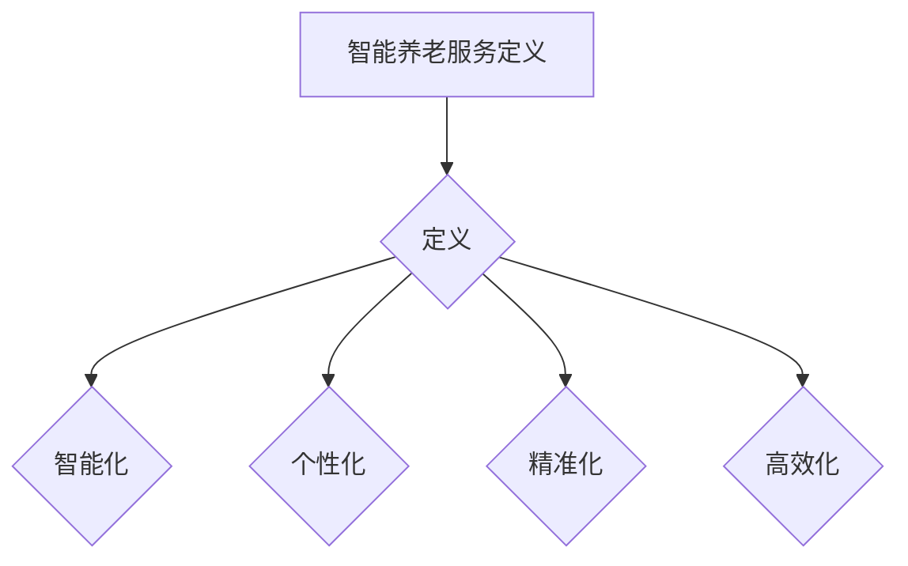

###### 1.1.1 智能养老服务的定义

智能养老服务是指结合现代信息技术、物联网、人工智能等技术手段，对养老服务进行智能化升级和优化，实现养老服务的个性化、精准化和高效化。其目的是通过智能化手段，提升老年人的生活品质，降低社会养老负担。

智能养老服务的定义可以用以下伪代码表示：

```python
class SmartElderlyService:
    def __init__(self, tech_methods):
        self.tech_methods = tech_methods
        self.personalized_service = None
        self.precision_service = None
        self.efficient_service = None
    
    def provide_service(self, elderly):
        # 根据老年人的需求，提供个性化的养老服务
        self.personalized_service = personalized_service(elderly)

        # 对老年人的健康数据进行精准分析
        self.precision_service = precision_analysis(elderly)

        # 提高养老服务的效率
        self.efficient_service = efficient_service(self.personalized_service, self.precision_service)
```

###### 1.1.2 智能养老服务的核心特征

智能养老服务的核心特征包括智能化、个性化、精准化和高效化。这些特征可以用以下Mermaid流程图表示：

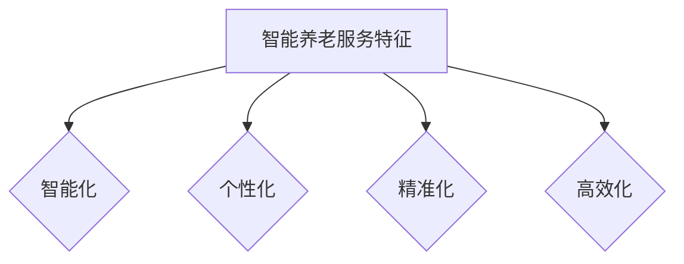

智能化：通过传感器、智能设备等技术，实现对老年人的生活状态、健康状态等的实时监测和智能分析。

个性化：根据老年人的个人需求和健康状况，提供个性化的养老服务方案。

精准化：通过大数据分析和人工智能算法，对老年人的健康数据进行精准分析，预测其潜在的健康风险。

高效化：利用智能技术，提高养老服务的效率，降低人力成本。

###### 1.1.3 智能养老服务的起源与发展历程

智能养老服务起源于20世纪末21世纪初，随着信息技术、物联网和人工智能等技术的发展，智能养老服务的概念逐渐成熟。以下是智能养老服务的发展历程：

1. **萌芽阶段（2000年-2010年）**：这一阶段主要是一些初步的智能养老服务概念和尝试，如智能家居、健康监测设备等。

2. **发展阶段（2010年-2015年）**：随着互联网、物联网等技术的发展，智能养老服务开始逐渐普及，一些企业开始推出智能养老产品和平台。

3. **成熟阶段（2015年-至今）**：随着人工智能技术的迅速发展，智能养老服务开始进入成熟阶段，智能化、个性化、精准化和高效化特征逐渐显现。

智能养老服务的发展历程可以用以下Mermaid流程图表示：

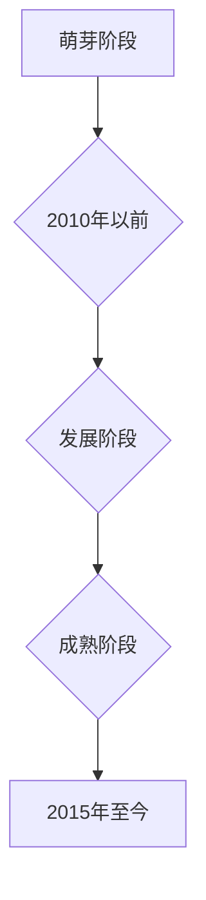

###### 1.2 智能养老服务的现状与趋势

目前，全球智能养老服务已经进入快速发展阶段，许多国家都在积极推动智能养老服务的应用。以下是智能养老服务的现状与趋势：

1. **全球智能养老服务的发展状况**：美国、日本、德国等发达国家在智能养老服务领域取得了显著成果，如智能家居、健康监测、智能辅具等。这些国家政府也出台了一系列政策，鼓励智能养老服务的发展。

2. **我国智能养老服务的发展现状**：我国智能养老服务起步较晚，但近年来发展迅速。政府高度重视智能养老服务的发展，出台了一系列政策支持。如《“健康中国2030”规划纲要》、《关于推进“互联网+养老服务”发展的意见》等。我国在智能健康监测、智能家居、智能辅具等方面取得了一定成果。

3. **智能养老服务的未来趋势**：未来，智能养老服务将继续向智能化、个性化、精准化和高效化方向发展。人工智能技术将在智能养老服务中发挥更加重要的作用，如健康监测、康复辅助、生活辅助等。

智能养老服务的现状与趋势可以用以下Mermaid流程图表示：

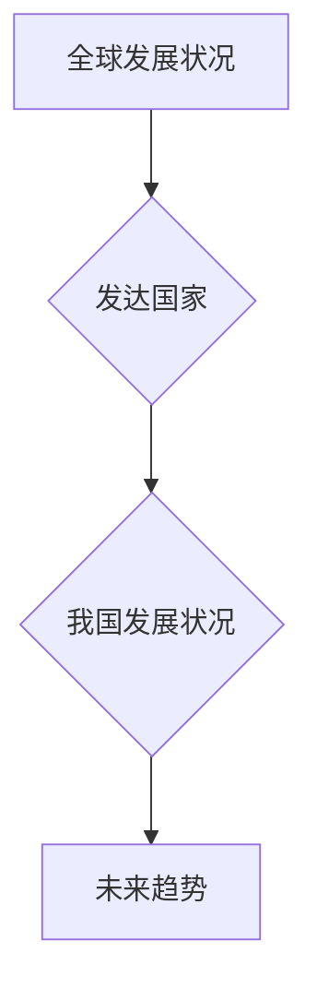

###### 1.3 智能养老服务的重要性与社会影响

智能养老服务在提高老年人生活质量、降低社会养老负担、促进社会和谐等方面具有重要意义。以下是智能养老服务的重要性与社会影响：

1. **提高老年人生活质量**：智能养老服务通过智能化、个性化、精准化和高效化手段，为老年人提供更优质的养老服务，提高老年人的生活质量。

2. **降低社会养老负担**：智能养老服务可以降低人力成本，提高养老服务的效率，从而降低社会养老负担。

3. **促进社会和谐**：智能养老服务有助于缓解人口老龄化带来的社会问题，促进社会和谐发展。

智能养老服务的重要性与社会影响可以用以下Mermaid流程图表示：

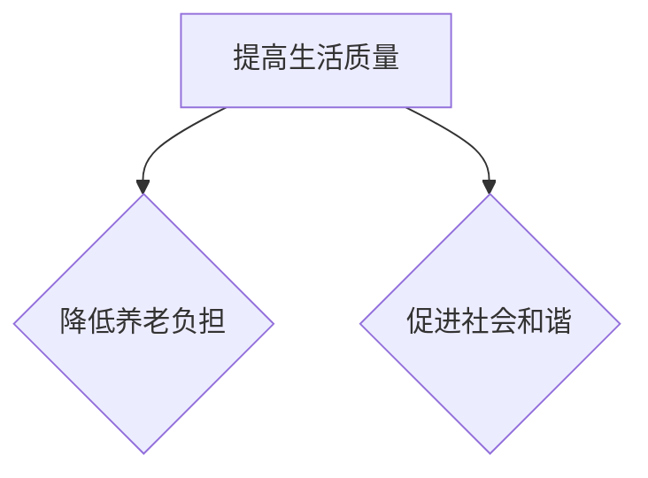

##### 本章小结

本章对智能养老服务的概念、核心特征、起源与发展历程、现状与趋势以及重要性与社会影响进行了详细阐述。智能养老服务作为新时代的一种新兴养老模式，具有巨大的发展潜力，将在未来得到更加广泛的应用。接下来，我们将探讨人工智能在智能养老服务中的应用原理和核心技术。

---

#### 第二部分：人工智能核心技术

##### 第2章：人工智能在智能养老服务中的应用原理

人工智能作为当前科技领域的热点，其发展迅速且应用广泛。在智能养老服务中，人工智能发挥着至关重要的作用，通过对养老服务的智能化升级，实现个性化、精准化和高效化。本章将首先介绍人工智能的基本概念与核心技术，然后分析人工智能在智能养老服务中的应用领域、优势和挑战，最后探讨人工智能技术的未来发展趋势。

###### 2.1 人工智能的基本概念与核心技术

人工智能（Artificial Intelligence，简称AI）是计算机科学的一个分支，旨在使计算机模拟人类智能行为，解决复杂问题。人工智能的研究涵盖了多个领域，包括机器学习、自然语言处理、计算机视觉、智能规划等。以下是人工智能的基本概念与核心技术：

1. **机器学习**：机器学习是人工智能的核心技术之一，通过训练模型从数据中学习规律，从而实现预测和决策。常见的机器学习算法包括监督学习、无监督学习和强化学习。

2. **深度学习**：深度学习是机器学习的一个分支，通过多层神经网络模型对数据进行处理，实现复杂的特征提取和模式识别。深度学习在图像识别、语音识别、自然语言处理等领域取得了显著成果。

3. **自然语言处理**：自然语言处理（Natural Language Processing，简称NLP）是人工智能的一个重要分支，旨在使计算机能够理解和处理自然语言。NLP技术包括语言理解、语言生成、语言翻译等。

4. **计算机视觉**：计算机视觉是人工智能的一个分支，通过计算机对图像和视频进行理解和分析，实现目标检测、图像识别、场景理解等功能。

5. **智能规划**：智能规划是指利用人工智能技术，对复杂任务进行自动规划和执行。智能规划在路径规划、资源调度、自动化生产等领域具有广泛应用。

人工智能的基本概念与核心技术可以用以下Mermaid流程图表示：

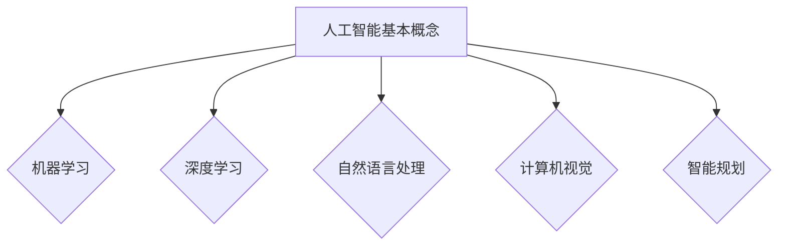

###### 2.1.1 人工智能的定义与分类

人工智能的定义是指使计算机模拟人类智能行为，解决复杂问题的技术。根据应用领域和实现方法，人工智能可以分为以下几类：

1. **弱人工智能**：弱人工智能是指专注于特定任务的智能系统，如语音识别、图像识别等。弱人工智能通过训练模型，在特定领域内实现智能行为。

2. **强人工智能**：强人工智能是指具有全面智能的计算机系统，能够像人类一样理解、学习和推理。强人工智能目前仍处于理论阶段，尚未实现。

3. **混合人工智能**：混合人工智能是指将多种人工智能技术相结合，实现更加强大的智能系统。混合人工智能在智能养老服务等领域具有广泛应用。

人工智能的定义与分类可以用以下Mermaid流程图表示：

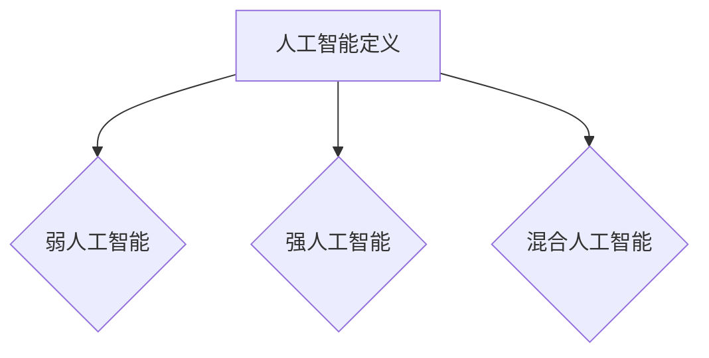

###### 2.1.2 人工智能的核心技术

人工智能的核心技术包括机器学习、深度学习、自然语言处理、计算机视觉和智能规划。以下是这些核心技术的简要介绍：

1. **机器学习**：机器学习是一种通过训练模型，使计算机从数据中学习规律的技术。常见的机器学习算法包括监督学习、无监督学习和强化学习。监督学习通过已标记的数据训练模型，无监督学习通过未标记的数据训练模型，强化学习通过奖励机制训练模型。

2. **深度学习**：深度学习是一种通过多层神经网络模型，对数据进行处理的技术。深度学习在图像识别、语音识别、自然语言处理等领域取得了显著成果。常见的深度学习模型包括卷积神经网络（CNN）、循环神经网络（RNN）和长短期记忆网络（LSTM）。

3. **自然语言处理**：自然语言处理是一种使计算机理解和处理自然语言的技术。自然语言处理技术包括语言理解、语言生成、语言翻译等。常见的自然语言处理模型包括词嵌入（Word Embedding）、循环神经网络（RNN）和变换器（Transformer）。

4. **计算机视觉**：计算机视觉是一种使计算机对图像和视频进行理解和分析的技术。计算机视觉技术包括目标检测、图像识别、场景理解等。常见的计算机视觉模型包括卷积神经网络（CNN）、生成对抗网络（GAN）和自注意力机制（Self-Attention）。

5. **智能规划**：智能规划是一种通过人工智能技术，对复杂任务进行自动规划和执行的技术。智能规划在路径规划、资源调度、自动化生产等领域具有广泛应用。常见的智能规划算法包括状态空间搜索（State Space Search）、遗传算法（Genetic Algorithm）和人工势场法（Artificial Potential Field）。

人工智能的核心技术可以用以下Mermaid流程图表示：


###### 2.1.3 人工智能的基本原理

人工智能的基本原理主要包括信息处理、学习与推理、感知与行动等。以下是人工智能的基本原理的简要介绍：

1. **信息处理**：人工智能通过信息处理实现对数据的输入、输出和处理。信息处理包括数据的采集、存储、传输、处理和输出等过程。

2. **学习与推理**：人工智能通过学习和推理，实现对知识的获取和应用。学习是指人工智能系统通过训练数据，从数据中学习规律和模式。推理是指人工智能系统利用所学知识，进行逻辑推理和决策。

3. **感知与行动**：人工智能通过感知与行动，实现对环境的感知和响应。感知是指人工智能系统通过传感器，获取环境信息。行动是指人工智能系统根据感知结果，采取相应的行动。

人工智能的基本原理可以用以下Mermaid流程图表示：

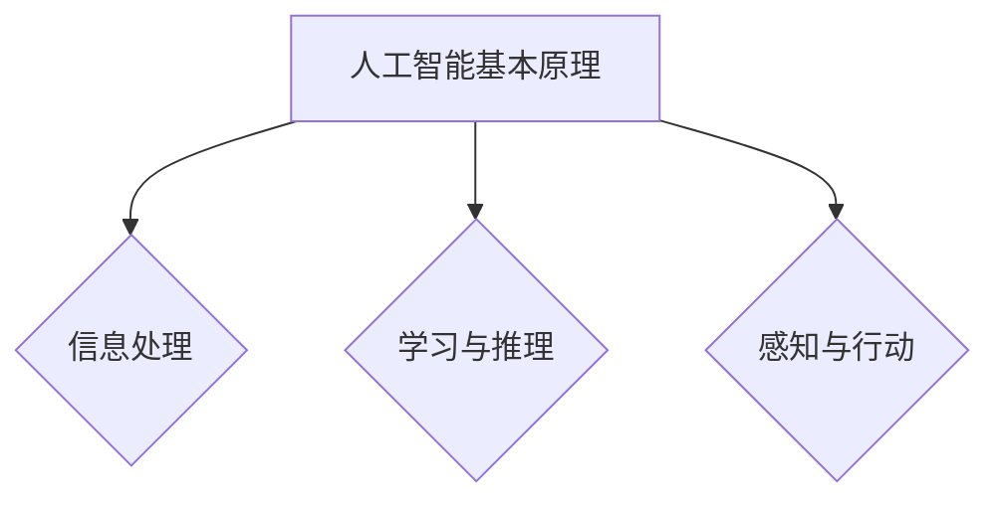

###### 2.2 人工智能在智能养老服务中的应用

人工智能在智能养老服务中具有广泛的应用，包括健康监测、健康管理、康复辅助、智能生活辅助等。以下是人工智能在智能养老服务中的应用领域、优势和挑战：

1. **应用领域**：
   - **健康监测**：通过传感器和智能设备，实时监测老年人的生理参数，如心率、血压、血糖等，实现对老年人健康状况的实时监控。
   - **健康管理**：通过大数据分析和人工智能算法，对老年人的健康数据进行挖掘和分析，提供个性化的健康管理方案。
   - **康复辅助**：利用人工智能技术，开发智能康复设备，帮助老年人进行康复训练，提高康复效果。
   - **智能生活辅助**：通过智能家居设备和智能机器人，为老年人提供便捷的生活服务，如照明控制、安防监控、社交互动等。

2. **优势**：
   - **提高养老服务质量**：人工智能技术可以实现养老服务的智能化、个性化、精准化和高效化，提高养老服务质量。
   - **降低人力成本**：人工智能技术可以部分替代人力工作，降低养老服务的成本。
   - **提高老年人的生活质量**：人工智能技术可以帮助老年人更好地管理健康，提高生活质量。

3. **挑战**：
   - **技术挑战**：人工智能技术在智能养老服务中的应用仍面临诸多技术挑战，如数据采集、数据处理、算法优化等。
   - **安全与隐私问题**：老年人数据的安全和隐私保护是人工智能在智能养老服务中面临的重要挑战。
   - **跨学科合作**：智能养老服务涉及多个学科领域，如医学、计算机科学、社会学等，跨学科合作是人工智能在智能养老服务中面临的挑战。

人工智能在智能养老服务中的应用可以用以下Mermaid流程图表示：

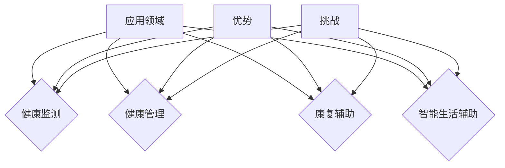

###### 2.3 人工智能技术的演进趋势

人工智能技术在智能养老服务中的应用正处于快速发展阶段，未来将呈现以下趋势：

1. **人工智能技术的融合与发展**：未来，人工智能技术将与其他技术如大数据、物联网、云计算等深度融合，实现更加强大的智能服务能力。

2. **个性化与精准化**：人工智能技术将更加注重个性化与精准化，通过大数据分析和人工智能算法，为老年人提供更加精准的养老服务。

3. **智能化与自适应**：人工智能技术将实现智能化与自适应，通过自我学习和优化，不断提高养老服务的效率和效果。

4. **安全与隐私保护**：随着人工智能在智能养老服务中的应用越来越广泛，安全与隐私保护将成为人工智能技术发展的关键问题。

5. **跨学科合作**：人工智能技术在智能养老服务中的应用将需要跨学科合作，融合医学、计算机科学、社会学等多领域的知识，实现更加全面的智能养老服务。

人工智能技术的演进趋势可以用以下Mermaid流程图表示：

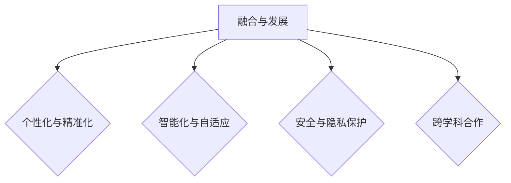

##### 本章小结

本章对人工智能的基本概念、核心技术、应用领域、优势和挑战以及演进趋势进行了详细阐述。人工智能在智能养老服务中具有广泛的应用前景，将不断推动智能养老服务的发展。接下来，我们将探讨人工智能在智能养老服务中的实际应用案例，如健康监测、健康管理、康复辅助和智能生活辅助等。

---

#### 第二部分：人工智能核心技术

##### 第3章：人工智能在智能养老中的应用实践

在上一章中，我们详细介绍了人工智能的基本概念、核心技术以及在智能养老服务中的应用原理。在本章中，我们将通过具体案例，深入探讨人工智能在智能养老服务中的实际应用，包括智能健康监测与健康管理、智能辅助康复、智能生活辅助等方面。通过这些实践案例，我们将更好地理解人工智能技术在智能养老服务中的实际效果和价值。

###### 3.1 智能健康监测技术

智能健康监测是人工智能在智能养老服务中的重要应用之一，通过实时监测老年人的生理参数，如心率、血压、血糖等，可以及时发现潜在的健康问题，为老年人提供及时的医疗干预。以下是一个智能健康监测系统的具体案例。

**案例：智能健康监测系统**

**系统架构**：该系统由传感器、数据采集模块、数据处理模块和用户界面组成。

1. **传感器**：包括心率传感器、血压传感器、血糖传感器等，用于实时采集老年人的生理参数。
2. **数据采集模块**：通过无线通信技术，将传感器采集的数据传输到服务器。
3. **数据处理模块**：利用人工智能算法，对采集到的数据进行处理和分析，如异常检测、趋势预测等。
4. **用户界面**：通过移动应用或网页界面，向老年人及其家人展示健康监测结果和医疗建议。

**系统实现**

```python
class HealthMonitorSystem:
    def __init__(self, sensors, data_processor):
        self.sensors = sensors
        self.data_processor = data_processor
    
    def collect_data(self):
        # 收集传感器数据
        heart_rate = self.sensors.get_heart_rate()
        blood_pressure = self.sensors.get_blood_pressure()
        blood_glucose = self.sensors.get_blood_glucose()
        return heart_rate, blood_pressure, blood_glucose
    
    def process_data(self, data):
        # 数据处理
        heart_rate_analysis = self.data_processor.analyze_heart_rate(data[0])
        blood_pressure_analysis = self.data_processor.analyze_blood_pressure(data[1])
        blood_glucose_analysis = self.data_processor.analyze_blood_glucose(data[2])
        return heart_rate_analysis, blood_pressure_analysis, blood_glucose_analysis
    
    def show_results(self, analysis_results):
        # 显示结果
        print("Heart Rate:", analysis_results[0])
        print("Blood Pressure:", analysis_results[1])
        print("Blood Glucose:", analysis_results[2])
```

**代码解读与分析**：

1. **HealthMonitorSystem**：表示智能健康监测系统的类，包含传感器和数据处理器。
2. **collect_data**：收集传感器数据的方法。
3. **process_data**：数据处理方法，利用数据处理器分析心率、血压和血糖数据。
4. **show_results**：显示分析结果的方法。

通过这个案例，我们可以看到智能健康监测系统如何通过传感器、数据处理和用户界面，实现对老年人健康状态的实时监测和数据分析。这有助于及早发现潜在的健康问题，提供及时的医疗干预，从而提高老年人的生活质量。

###### 3.2 智能健康管理平台

智能健康管理平台是人工智能在智能养老服务的另一个重要应用，它通过整合多种健康监测设备和数据，为老年人提供全方位的健康管理服务。以下是一个智能健康管理平台的具体案例。

**案例：智能健康管理平台**

**系统架构**：该平台由健康数据采集模块、数据分析模块、健康管理模块和用户界面组成。

1. **健康数据采集模块**：包括智能健康监测设备，如心率传感器、血压传感器、血糖传感器等。
2. **数据分析模块**：利用人工智能算法，对采集到的健康数据进行处理和分析，如趋势预测、异常检测等。
3. **健康管理模块**：根据数据分析结果，为老年人提供个性化的健康建议和管理方案。
4. **用户界面**：通过移动应用或网页界面，向老年人及其家人展示健康数据和管理建议。

**系统实现**

```python
class HealthManagementPlatform:
    def __init__(self, data_collector, data_analyzer, health_manager):
        self.data_collector = data_collector
        self.data_analyzer = data_analyzer
        self.health_manager = health_manager
    
    def collect_health_data(self):
        # 收集健康数据
        heart_rate, blood_pressure, blood_glucose = self.data_collector.collect_data()
        return heart_rate, blood_pressure, blood_glucose
    
    def analyze_health_data(self, data):
        # 数据分析
        heart_rate_analysis = self.data_analyzer.analyze_heart_rate(data[0])
        blood_pressure_analysis = self.data_analyzer.analyze_blood_pressure(data[1])
        blood_glucose_analysis = self.data_analyzer.analyze_blood_glucose(data[2])
        return heart_rate_analysis, blood_pressure_analysis, blood_glucose_analysis
    
    def provide_health_advice(self, analysis_results):
        # 提供健康建议
        health_advice = self.health_manager.provide_advice(analysis_results)
        return health_advice
    
    def show_health_advice(self, advice):
        # 显示健康建议
        print("Health Advice:", advice)
```

**代码解读与分析**：

1. **HealthManagementPlatform**：表示智能健康管理平台的类，包含数据采集模块、数据分析模块和健康管理模块。
2. **collect_health_data**：收集健康数据的方法。
3. **analyze_health_data**：数据分析方法，利用数据分析模块分析心率、血压和血糖数据。
4. **provide_health_advice**：提供健康建议的方法。
5. **show_health_advice**：显示健康建议的方法。

通过这个案例，我们可以看到智能健康管理平台如何通过数据采集、数据分析和管理，为老年人提供全方位的健康管理服务。这不仅有助于提高老年人的生活质量，还可以降低社会医疗成本。

###### 3.3 健康数据分析与预测

健康数据分析与预测是人工智能在智能养老服务中的关键应用之一，通过分析大量的健康数据，可以预测老年人的健康趋势，提前发现潜在的健康问题。以下是一个健康数据分析与预测的具体案例。

**案例：健康数据分析与预测**

**系统架构**：该系统由数据采集模块、数据分析模块和预测模块组成。

1. **数据采集模块**：包括智能健康监测设备，如心率传感器、血压传感器、血糖传感器等。
2. **数据分析模块**：利用人工智能算法，对采集到的健康数据进行处理和分析。
3. **预测模块**：利用数据分析结果，预测老年人的健康趋势。

**系统实现**

```python
class HealthDataAnalysis:
    def __init__(self, data_collector, data_analyzer, predictor):
        self.data_collector = data_collector
        self.data_analyzer = data_analyzer
        self.predictor = predictor
    
    def collect_health_data(self):
        # 收集健康数据
        heart_rate, blood_pressure, blood_glucose = self.data_collector.collect_data()
        return heart_rate, blood_pressure, blood_glucose
    
    def analyze_health_data(self, data):
        # 数据分析
        heart_rate_analysis = self.data_analyzer.analyze_heart_rate(data[0])
        blood_pressure_analysis = self.data_analyzer.analyze_blood_pressure(data[1])
        blood_glucose_analysis = self.data_analyzer.analyze_blood_glucose(data[2])
        return heart_rate_analysis, blood_pressure_analysis, blood_glucose_analysis
    
    def predict_health_trend(self, analysis_results):
        # 预测健康趋势
        health_trend = self.predictor.predict_trend(analysis_results)
        return health_trend
    
    def show_health_trend(self, trend):
        # 显示健康趋势
        print("Health Trend:", trend)
```

**代码解读与分析**：

1. **HealthDataAnalysis**：表示健康数据分析与预测系统的类，包含数据采集模块、数据分析模块和预测模块。
2. **collect_health_data**：收集健康数据的方法。
3. **analyze_health_data**：数据分析方法，利用数据分析模块分析心率、血压和血糖数据。
4. **predict_health_trend**：预测健康趋势的方法。
5. **show_health_trend**：显示健康趋势的方法。

通过这个案例，我们可以看到健康数据分析与预测系统如何通过数据采集、数据分析和预测，提前发现老年人的健康问题，提供个性化的健康建议。这有助于提高老年人的生活质量，降低社会医疗成本。

##### 本章小结

本章通过具体案例，详细介绍了人工智能在智能养老服务中的应用实践，包括智能健康监测、智能健康管理、健康数据分析与预测等方面。这些应用不仅提高了养老服务的质量和效率，还降低了社会医疗成本。随着人工智能技术的不断发展，人工智能在智能养老服务中的应用将更加广泛和深入。在下一章中，我们将继续探讨人工智能在智能养老服务的其他实际应用，如智能辅助康复和智能生活辅助。

---

#### 第三部分：人工智能在智能养老中的应用实践

##### 第4章：智能辅助康复

智能辅助康复是人工智能在智能养老服务中的重要应用之一，通过利用智能设备和人工智能算法，为老年人提供个性化的康复训练和评估服务，帮助他们更快地恢复健康。本章将详细介绍智能辅助康复系统的构成、工作原理以及实际应用场景，并分析智能康复训练的方法与策略、案例分析以及智能康复评估的指标与方法。

###### 4.1 智能辅助康复系统

智能辅助康复系统是由多个智能设备和人工智能算法组成的综合性系统，旨在为老年人提供全面、个性化的康复服务。以下是智能辅助康复系统的构成和工作原理：

**系统构成**：

1. **智能康复设备**：包括智能轮椅、智能拐杖、智能平衡板等，用于辅助老年人的日常活动。
2. **智能传感器**：如加速度传感器、陀螺仪传感器、压力传感器等，用于监测老年人的身体运动状态。
3. **数据处理模块**：用于接收传感器数据，并对数据进行处理和分析。
4. **人工智能算法模块**：利用机器学习和深度学习算法，对康复数据进行模式识别和趋势预测。
5. **康复训练系统**：根据康复数据，为老年人制定个性化的康复训练计划。
6. **康复评估系统**：对康复训练的效果进行评估，以调整康复计划。

**工作原理**：

1. **数据采集**：智能康复设备通过传感器实时采集老年人的身体运动数据。
2. **数据处理**：数据处理模块对采集到的数据进行预处理，如去噪、归一化等。
3. **数据分析**：人工智能算法模块对预处理后的数据进行分析，识别运动模式、预测康复趋势。
4. **康复训练**：根据数据分析结果，康复训练系统为老年人制定个性化的康复训练计划。
5. **康复评估**：康复评估系统对康复训练的效果进行评估，以调整康复计划。

智能辅助康复系统的构成和工作原理可以用以下Mermaid流程图表示：

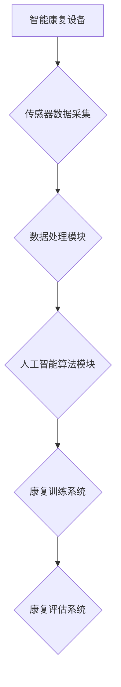

**案例**：一个智能辅助康复系统的实际应用案例如下：

**系统架构**：该系统包括智能轮椅、智能拐杖、加速度传感器和深度学习算法。

1. **智能轮椅**：用于辅助老年人进行行走训练，通过传感器实时监测轮椅的运动状态。
2. **智能拐杖**：用于辅助老年人进行平衡训练，通过传感器监测拐杖的受力情况。
3. **加速度传感器**：用于监测老年人的身体运动状态。
4. **深度学习算法**：用于分析传感器数据，识别运动模式、预测康复趋势。

**系统实现**

```python
class SmartRehabilitationSystem:
    def __init__(self, smart_wheelchair, smart_cane, accelerometer, deep_learning_model):
        self.smart_wheelchair = smart_wheelchair
        self.smart_cane = smart_cane
        self.accelerometer = accelerometer
        self.deep_learning_model = deep_learning_model
    
    def collect_data(self):
        # 采集传感器数据
        wheelchair_data = self.smart_wheelchair.collect_data()
        cane_data = self.smart_cane.collect_data()
        accelerometer_data = self.accelerometer.collect_data()
        return wheelchair_data, cane_data, accelerometer_data
    
    def analyze_data(self, data):
        # 数据分析
        wheelchair_analysis = self.deep_learning_model.analyze_wheelchair_data(data[0])
        cane_analysis = self.deep_learning_model.analyze_cane_data(data[1])
        accelerometer_analysis = self.deep_learning_model.analyze_accelerometer_data(data[2])
        return wheelchair_analysis, cane_analysis, accelerometer_analysis
    
    def provide_rehabilitation_plan(self, analysis_results):
        # 提供康复训练计划
        rehabilitation_plan = self.deep_learning_model.generate_rehabilitation_plan(analysis_results)
        return rehabilitation_plan
    
    def show_rehabilitation_plan(self, plan):
        # 显示康复训练计划
        print("Rehabilitation Plan:", plan)
```

**代码解读与分析**：

1. **SmartRehabilitationSystem**：表示智能辅助康复系统的类，包含智能轮椅、智能拐杖、加速度传感器和深度学习算法。
2. **collect_data**：收集传感器数据的方法。
3. **analyze_data**：数据分析方法，利用深度学习算法分析传感器数据。
4. **provide_rehabilitation_plan**：提供康复训练计划的方法。
5. **show_rehabilitation_plan**：显示康复训练计划的方法。

通过这个案例，我们可以看到智能辅助康复系统如何通过智能设备和人工智能算法，为老年人提供个性化的康复服务。这不仅提高了康复效果，还降低了康复成本。

###### 4.2 智能康复训练

智能康复训练是智能辅助康复系统的重要组成部分，通过利用人工智能技术，为老年人制定个性化的康复训练计划，并实时监测训练效果。以下是智能康复训练的方法与策略：

**方法与策略**：

1. **数据驱动**：智能康复训练基于大量健康数据，利用数据挖掘和机器学习技术，为老年人制定个性化的康复训练计划。
2. **动态调整**：根据老年人的康复进度和身体状况，实时调整康复训练计划，确保训练效果。
3. **多模态训练**：结合多种康复训练方法，如物理治疗、认知训练、运动训练等，提高康复效果。
4. **互动式训练**：通过虚拟现实（VR）技术，提供互动式的康复训练环境，增强训练趣味性。

**案例分析**：

**案例**：一个智能康复训练的实际应用案例如下：

**系统架构**：该系统包括智能康复设备、虚拟现实技术和深度学习算法。

1. **智能康复设备**：用于监测老年人的身体运动状态。
2. **虚拟现实技术**：提供互动式的康复训练环境。
3. **深度学习算法**：用于分析传感器数据，制定个性化的康复训练计划。

**系统实现**

```python
class SmartRehabilitationTraining:
    def __init__(self, rehabilitation_equipment, virtual_reality, deep_learning_model):
        self.rehabilitation_equipment = rehabilitation_equipment
        self.virtual_reality = virtual_reality
        self.deep_learning_model = deep_learning_model
    
    def collect_training_data(self):
        # 采集训练数据
        training_data = self.rehabilitation_equipment.collect_data()
        return training_data
    
    def analyze_training_data(self, data):
        # 数据分析
        training_analysis = self.deep_learning_model.analyze_training_data(data)
        return training_analysis
    
    def generate_training_plan(self, analysis_results):
        # 制定训练计划
        training_plan = self.deep_learning_model.generate_training_plan(analysis_results)
        return training_plan
    
    def show_training_plan(self, plan):
        # 显示训练计划
        print("Training Plan:", plan)
```

**代码解读与分析**：

1. **SmartRehabilitationTraining**：表示智能康复训练的类，包含智能康复设备、虚拟现实技术和深度学习算法。
2. **collect_training_data**：收集训练数据的方法。
3. **analyze_training_data**：数据分析方法，利用深度学习算法分析训练数据。
4. **generate_training_plan**：制定训练计划的方法。
5. **show_training_plan**：显示训练计划的方法。

通过这个案例，我们可以看到智能康复训练系统如何通过数据驱动和虚拟现实技术，为老年人提供个性化的康复训练计划。这不仅提高了康复效果，还增强了训练的趣味性。

###### 4.3 智能康复评估

智能康复评估是智能辅助康复系统的关键环节，通过对康复训练的效果进行评估，调整康复计划，确保康复效果。以下是智能康复评估的指标与方法：

**评估指标**：

1. **运动能力**：评估老年人的运动能力，如行走速度、步幅长度等。
2. **平衡能力**：评估老年人的平衡能力，如站立时间、倾斜角度等。
3. **肌力**：评估老年人的肌力，如握力、腿力等。
4. **关节活动度**：评估老年人的关节活动度，如肩关节、膝关节等。

**评估方法**：

1. **定量评估**：通过数值指标，如运动能力、平衡能力、肌力、关节活动度等，对康复效果进行量化评估。
2. **定性评估**：通过观察和主观评价，如医生评估、老年人自我感觉等，对康复效果进行定性评估。
3. **智能评估**：利用人工智能技术，如机器学习和深度学习，对康复数据进行分析，评估康复效果。

**案例分析**：

**案例**：一个智能康复评估的实际应用案例如下：

**系统架构**：该系统包括智能康复设备、数据处理模块和智能评估算法。

1. **智能康复设备**：用于监测老年人的身体运动状态。
2. **数据处理模块**：对康复数据进行分析和处理。
3. **智能评估算法**：用于评估康复效果。

**系统实现**

```python
class SmartRehabilitationEvaluation:
    def __init__(self, rehabilitation_equipment, data_processor, evaluation_algorithm):
        self.rehabilitation_equipment = rehabilitation_equipment
        self.data_processor = data_processor
        self.evaluation_algorithm = evaluation_algorithm
    
    def collect_evaluation_data(self):
        # 采集评估数据
        evaluation_data = self.rehabilitation_equipment.collect_data()
        return evaluation_data
    
    def process_evaluation_data(self, data):
        # 数据处理
        processed_data = self.data_processor.process_data(data)
        return processed_data
    
    def evaluate_rehabilitation_effects(self, processed_data):
        # 评估康复效果
        evaluation_results = self.evaluation_algorithm.evaluate_effects(processed_data)
        return evaluation_results
    
    def show_evaluation_results(self, results):
        # 显示评估结果
        print("Evaluation Results:", results)
```

**代码解读与分析**：

1. **SmartRehabilitationEvaluation**：表示智能康复评估的类，包含智能康复设备、数据处理模块和智能评估算法。
2. **collect_evaluation_data**：采集评估数据的方法。
3. **process_evaluation_data**：数据处理方法。
4. **evaluate_rehabilitation_effects**：评估康复效果的方法。
5. **show_evaluation_results**：显示评估结果的方法。

通过这个案例，我们可以看到智能康复评估系统如何通过智能设备和人工智能算法，对康复效果进行量化评估和定性评估。这不仅提高了康复评估的准确性，还为康复计划的调整提供了科学依据。

##### 本章小结

本章详细介绍了智能辅助康复系统的构成、工作原理以及实际应用场景，探讨了智能康复训练的方法与策略、案例分析以及智能康复评估的指标与方法。智能辅助康复系统通过人工智能技术，为老年人提供了个性化、高效、智能的康复服务，显著提高了康复效果。在下一章中，我们将继续探讨人工智能在智能养老服务的其他实际应用，如智能生活辅助。

---

#### 第三部分：人工智能在智能养老中的应用实践

##### 第5章：智能生活辅助

智能生活辅助是人工智能在智能养老服务中的重要组成部分，旨在通过智能设备和人工智能技术，提高老年人的日常生活质量，降低他们的孤独感和依赖性。本章将详细介绍智能生活辅助的应用领域，包括智能家居环境、智能安全监控和智能社交互动，并提供具体案例和实现方法。

###### 5.1 智能家居环境

智能家居环境是通过物联网技术将家庭中的各种设备连接起来，使老年人能够方便、安全地控制和管理家庭环境。以下是一个智能家居环境的具体案例。

**案例：智能家居环境**

**系统架构**：该系统包括智能灯具、智能窗帘、智能温控器和智能安防系统。

1. **智能灯具**：通过手机应用或语音助手，老年人可以远程控制家中的灯光。
2. **智能窗帘**：自动调节窗帘的开启和关闭，为老年人提供舒适的室内光线。
3. **智能温控器**：根据老年人的需求，自动调节家中的温度。
4. **智能安防系统**：包括摄像头、门磁传感器等，实时监控家庭安全。

**系统实现**

```python
class SmartHomeEnvironment:
    def __init__(self, smart_light, smart_curtain, smart_thermostat, smart_security):
        self.smart_light = smart_light
        self.smart_curtain = smart_curtain
        self.smart_thermostat = smart_thermostat
        self.smart_security = smart_security
    
    def control_light(self, state):
        # 控制灯光
        self.smart_light.set_light(state)
    
    def control_curtain(self, state):
        # 控制窗帘
        self.smart_curtain.set_curtain(state)
    
    def control_thermostat(self, temperature):
        # 控制温控器
        self.smart_thermostat.set_temperature(temperature)
    
    def monitor_security(self):
        # 监控安防
        self.smart_security.monitor_home()
```

**代码解读与分析**：

1. **SmartHomeEnvironment**：表示智能家居环境的类，包含智能灯具、智能窗帘、智能温控器和智能安防系统。
2. **control_light**：控制灯光的方法。
3. **control_curtain**：控制窗帘的方法。
4. **control_thermostat**：控制温控器的方法。
5. **monitor_security**：监控安防的方法。

通过这个案例，我们可以看到智能家居环境如何通过智能设备和远程控制，为老年人提供便捷、舒适的生活环境。

###### 5.2 智能安全监控

智能安全监控是通过人工智能技术，实时监测老年人的活动和安全状况，一旦发生异常，可以及时发出警报。以下是一个智能安全监控的具体案例。

**案例：智能安全监控**

**系统架构**：该系统包括智能摄像头、智能语音助手和智能报警系统。

1. **智能摄像头**：实时监控老年人所在的环境，识别异常行为。
2. **智能语音助手**：与老年人进行交互，询问他们的状况，并提醒他们注意安全。
3. **智能报警系统**：一旦检测到异常，立即发出警报。

**系统实现**

```python
class SmartSafetyMonitoring:
    def __init__(self, smart_camera, smart_speaker, alarm_system):
        self.smart_camera = smart_camera
        self.smart_speaker = smart_speaker
        self.alarm_system = alarm_system
    
    def monitor_activity(self):
        # 监控活动
        activity = self.smart_camera.detect_activity()
        return activity
    
    def interact_with_elderly(self):
        # 与老年人互动
        self.smart_speaker.ask_elderly_status()
    
    def send_alarm(self, activity):
        # 发送警报
        if activity == "abnormal":
            self.alarm_system.send_alarm()
```

**代码解读与分析**：

1. **SmartSafetyMonitoring**：表示智能安全监控的类，包含智能摄像头、智能语音助手和智能报警系统。
2. **monitor_activity**：监控活动的方法。
3. **interact_with_elderly**：与老年人互动的方法。
4. **send_alarm**：发送警报的方法。

通过这个案例，我们可以看到智能安全监控如何通过智能设备和人工智能算法，为老年人提供实时、安全的监控。

###### 5.3 智能社交互动

智能社交互动是通过人工智能技术，为老年人提供社交互动的平台，帮助他们缓解孤独感，保持心理健康。以下是一个智能社交互动的具体案例。

**案例：智能社交互动**

**系统架构**：该系统包括智能聊天机器人、社交平台和活动推荐系统。

1. **智能聊天机器人**：与老年人进行实时聊天，提供陪伴和安慰。
2. **社交平台**：为老年人提供在线社交互动的机会，如兴趣小组、线上活动等。
3. **活动推荐系统**：根据老年人的兴趣和健康状况，推荐合适的活动。

**系统实现**

```python
class SmartSocialInteraction:
    def __init__(self, chat_robot, social_platform, activity_recommender):
        self.chat_robot = chat_robot
        self.social_platform = social_platform
        self.activity_recommender = activity_recommender
    
    def chat_with_elderly(self):
        # 与老年人聊天
        self.chat_robot.start_chat()
    
    def recommend_activities(self):
        # 推荐活动
        activities = self.activity_recommender.recommend_activities()
        return activities
    
    def show_activities(self, activities):
        # 显示活动
        print("Recommended Activities:", activities)
```

**代码解读与分析**：

1. **SmartSocialInteraction**：表示智能社交互动的类，包含智能聊天机器人、社交平台和活动推荐系统。
2. **chat_with_elderly**：与老年人聊天的方法。
3. **recommend_activities**：推荐活动的方法。
4. **show_activities**：显示活动的方法。

通过这个案例，我们可以看到智能社交互动如何通过智能设备和人工智能算法，为老年人提供社交互动的平台，缓解他们的孤独感。

##### 本章小结

本章详细介绍了智能生活辅助在智能家居环境、智能安全监控和智能社交互动中的应用，提供了具体案例和实现方法。通过智能生活辅助，老年人可以享受更加便捷、安全、健康的日常生活，提高生活质量。在下一章中，我们将继续探讨人工智能在智能养老管理与服务中的应用，包括智能养老管理平台、智能养老服务以及智能养老政策与法规。

---

#### 第四部分：智能养老管理与服务

##### 第6章：智能养老管理与服务

随着人工智能技术的不断进步，智能养老管理与服务已成为提升养老服务质量和效率的重要手段。本章将详细介绍智能养老管理平台、智能养老服务以及智能养老政策与法规，分析这些内容在实际应用中的重要性，并探讨其未来发展趋势。

###### 6.1 智能养老管理平台

智能养老管理平台是利用人工智能技术，对养老服务进行统一管理、调度和优化的综合性系统。它通过整合各类养老资源和数据，实现对养老服务的全面监控和管理。以下是智能养老管理平台的基本架构和核心功能：

**基本架构**：

1. **数据采集层**：包括各类传感器、健康监测设备、智能终端等，用于采集老年人的健康数据、生活习惯等。
2. **数据存储层**：用于存储采集到的数据，如健康档案、服务记录等。
3. **数据处理层**：利用人工智能算法，对采集到的数据进行分析和处理，提供个性化服务建议。
4. **服务调度层**：根据老年人的需求，调度相应的养老服务资源，如医疗资源、康复资源等。
5. **用户界面层**：为老年人、家属和工作人员提供便捷的操作界面，展示服务信息和数据分析结果。

**核心功能**：

1. **健康档案管理**：智能养老管理平台可以记录老年人的健康数据，建立个人健康档案，便于长期跟踪和管理。
2. **服务调度与分配**：根据老年人的需求和健康状况，智能调度和分配养老服务资源，如医疗服务、康复服务、生活服务等。
3. **数据分析与预测**：利用大数据分析和人工智能算法，对老年人的健康数据进行挖掘和分析，预测其潜在的健康风险，提供预防性服务。
4. **远程监控与交互**：通过智能终端和互联网，实现对老年人的远程监控和交互，提高服务的便捷性和实时性。
5. **智能提醒与预警**：系统可以根据老年人的健康状况和习惯，自动发送提醒和预警信息，如服药提醒、健康检查提醒等。

**实现方法**：

以下是一个简单的智能养老管理平台实现方法：

```python
class SmartElderlyManagementPlatform:
    def __init__(self, data_collector, data_analyzer, service_distributor, user_interface):
        self.data_collector = data_collector
        self.data_analyzer = data_analyzer
        self.service_distributor = service_distributor
        self.user_interface = user_interface
    
    def collect_data(self):
        # 采集数据
        health_data = self.data_collector.collect_health_data()
        return health_data
    
    def analyze_data(self, data):
        # 数据分析
        analysis_results = self.data_analyzer.analyze_health_data(data)
        return analysis_results
    
    def distribute_service(self, analysis_results):
        # 调度服务
        service_plan = self.service_distributor.distribute_services(analysis_results)
        return service_plan
    
    def show_service_plan(self, plan):
        # 显示服务计划
        self.user_interface.display_service_plan(plan)
```

**代码解读与分析**：

1. **SmartElderlyManagementPlatform**：表示智能养老管理平台的类，包含数据采集模块、数据分析模块、服务调度模块和用户界面模块。
2. **collect_data**：采集数据的方法。
3. **analyze_data**：数据分析方法。
4. **distribute_service**：服务调度方法。
5. **show_service_plan**：显示服务计划的方法。

通过这个案例，我们可以看到智能养老管理平台如何通过数据采集、数据分析、服务调度和用户界面，实现对养老服务的智能化管理。

###### 6.2 智能养老服务

智能养老服务是指利用人工智能技术，为老年人提供个性化、便捷、高效的服务，满足他们的日常生活和健康需求。智能养老服务涵盖了多个领域，如健康监测、康复辅助、生活辅助等。以下是智能养老服务的主要内容和应用场景：

**主要内容**：

1. **健康监测**：通过智能健康设备，实时监测老年人的生理参数，如心率、血压、血糖等，提供健康数据分析和预警服务。
2. **康复辅助**：利用智能康复设备和人工智能算法，为老年人提供个性化的康复训练和评估服务，帮助他们更快地恢复健康。
3. **生活辅助**：通过智能家居设备和智能生活服务，为老年人提供便捷的生活支持，如照明控制、安防监控、家政服务等。
4. **社交互动**：通过智能社交互动平台，为老年人提供社交机会，缓解他们的孤独感，提高生活质量。

**应用场景**：

1. **居家养老**：智能养老服务可以为居家养老的老年人提供全方位的支持，如健康监测、康复辅助、生活辅助等。
2. **社区养老**：智能养老服务可以在社区养老中心为老年人提供智能化服务，提高社区养老的效率和品质。
3. **机构养老**：智能养老服务可以在养老院等机构为老年人提供个性化、高效的服务，减轻护理人员的负担。

**案例分析**：

**案例**：一个智能养老服务的实际应用案例如下：

**系统架构**：该系统包括健康监测模块、康复辅助模块、生活辅助模块和社交互动模块。

1. **健康监测模块**：通过智能健康设备，实时监测老年人的生理参数。
2. **康复辅助模块**：通过智能康复设备和人工智能算法，为老年人提供康复服务。
3. **生活辅助模块**：通过智能家居设备和智能生活服务，为老年人提供生活支持。
4. **社交互动模块**：通过智能社交互动平台，为老年人提供社交机会。

**系统实现**

```python
class SmartElderlyService:
    def __init__(self, health_monitor, rehabilitation_helper, life_helper, social_interaction):
        self.health_monitor = health_monitor
        self.rehabilitation_helper = rehabilitation_helper
        self.life_helper = life_helper
        self.social_interaction = social_interaction
    
    def monitor_health(self):
        # 监测健康
        health_data = self.health_monitor.collect_health_data()
        return health_data
    
    def assist_rehabilitation(self):
        # 康复辅助
        rehabilitation_plan = self.rehabilitation_helper.generate_rehabilitation_plan()
        return rehabilitation_plan
    
    def assist_life(self):
        # 生活辅助
        life_support = self.life_helper.provide_life_support()
        return life_support
    
    def interact_socially(self):
        # 社交互动
        social_activities = self.social_interaction安排社交活动()
        return social_activities
```

**代码解读与分析**：

1. **SmartElderlyService**：表示智能养老服务的类，包含健康监测模块、康复辅助模块、生活辅助模块和社交互动模块。
2. **monitor_health**：监测健康的方法。
3. **assist_rehabilitation**：康复辅助的方法。
4. **assist_life**：生活辅助的方法。
5. **interact_socially**：社交互动的方法。

通过这个案例，我们可以看到智能养老服务如何通过不同模块的协同工作，为老年人提供全方位的服务。

###### 6.3 智能养老政策与法规

智能养老政策与法规是智能养老服务发展的基石，为智能养老服务的规范化和可持续发展提供保障。以下是我国智能养老政策与法规的主要内容：

**政策**：

1. **《“健康中国2030”规划纲要》**：提出大力发展智慧健康养老，推动信息技术在养老服务中的应用。
2. **《关于推进“互联网+养老服务”发展的意见》**：鼓励发展智能健康管理、智能养老服务等新模式、新业态。
3. **《养老院服务标准》**：规范养老院的服务内容和质量。

**法规**：

1. **《老年人权益保障法》**：保障老年人的合法权益，提高老年人的生活质量。
2. **《网络安全法》**：规范网络信息服务，保护老年人的个人信息安全。

**政策与法规的重要性**：

1. **规范发展**：智能养老政策与法规为智能养老服务的发展提供了明确的规范和指导，确保服务质量和安全。
2. **保障权益**：政策与法规保障了老年人的合法权益，提高了老年人的生活质量。
3. **推动创新**：政策与法规鼓励技术创新和应用，推动智能养老服务的可持续发展。

**未来发展趋势**：

1. **政策优化**：随着智能养老服务的不断发展，政策将更加注重服务的质量和效果，提高政策的针对性和可操作性。
2. **法规完善**：智能养老法规将不断完善，以适应智能养老服务的新需求和挑战。
3. **技术创新**：人工智能、物联网、大数据等新技术将在智能养老政策与法规的推动下，得到更加广泛的应用。

##### 本章小结

本章详细介绍了智能养老管理平台、智能养老服务以及智能养老政策与法规，分析了这些内容在实际应用中的重要性。智能养老管理平台和智能养老服务通过人工智能技术，为老年人提供了个性化、高效、便捷的服务，显著提高了养老服务质量。智能养老政策与法规为智能养老服务的发展提供了保障和支持。在未来，随着技术的不断进步，智能养老管理与服务将得到更加广泛的应用和发展。

---

#### 第五部分：人工智能在智能养老服务的挑战与未来

##### 第7章：人工智能在智能养老服务的挑战与未来

随着人工智能技术的迅速发展，其在智能养老服务中的应用日益广泛，为养老行业带来了全新的发展机遇。然而，人工智能在智能养老服务中同样面临着诸多挑战。本章将深入探讨人工智能在智能养老服务中的挑战，分析未来的发展趋势，并对人工智能在智能养老服务中的潜在影响进行展望。

###### 7.1 人工智能在智能养老服务中的挑战

人工智能在智能养老服务中的应用虽然取得了显著成果，但仍面临诸多挑战，主要包括技术挑战、安全与隐私问题、跨学科合作与人才需求等方面。

**技术挑战**

1. **数据质量和准确性**：智能养老服务的核心在于对老年人的健康数据进行准确的分析和预测。然而，老年人群体的健康状况复杂多变，数据质量和准确性直接影响人工智能算法的性能。因此，提高数据采集、处理和分析的准确性是人工智能在智能养老服务中需要克服的重要技术挑战。

2. **算法优化与适应性**：当前的人工智能算法在处理大规模、复杂、多变的养老数据时，仍存在性能瓶颈。如何优化算法，提高其适应性和鲁棒性，是人工智能在智能养老服务中需要解决的关键问题。

3. **技术融合与创新**：智能养老服务需要融合多种技术，如物联网、云计算、大数据等，形成一体化的智能服务系统。实现这些技术的有效融合，并在此基础上进行创新，是人工智能在智能养老服务中面临的重大挑战。

**安全与隐私问题**

1. **数据安全**：老年人数据的安全是智能养老服务中至关重要的问题。老年人群体的健康数据敏感且重要，一旦泄露或被恶意利用，将严重威胁老年人的隐私和健康。

2. **隐私保护**：在智能养老服务中，如何确保老年人的隐私得到有效保护，避免数据滥用，是人工智能应用需要面对的伦理和法律挑战。

3. **安全机制**：智能养老服务系统需要建立完善的安全机制，包括数据加密、访问控制、异常检测等，以保障系统的安全稳定运行。

**跨学科合作与人才需求**

1. **跨学科合作**：智能养老服务涉及多个学科领域，如医学、计算机科学、社会学等。如何实现这些领域的有效合作，是人工智能在智能养老服务中需要解决的问题。

2. **人才需求**：智能养老服务的快速发展对相关领域的人才需求提出了新的要求。如何培养和吸引一批既懂技术又懂养老服务的复合型人才，是人工智能在智能养老服务中面临的挑战。

**案例分析**

**案例**：某智能养老社区的数据安全与隐私保护问题

**问题描述**：某智能养老社区在运营过程中，由于数据安全措施不到位，导致老年人群体的健康数据泄露。

**解决方案**：

1. **数据加密**：对健康数据进行加密处理，确保数据在传输和存储过程中的安全性。
2. **访问控制**：建立严格的访问控制机制，只有授权人员才能访问敏感数据。
3. **异常检测**：利用人工智能技术，实时监测系统中的异常行为，及时发现和处理潜在的安全威胁。
4. **隐私保护**：对老年人的个人信息进行匿名化处理，确保其隐私不被泄露。

**实施效果**：通过上述措施，智能养老社区的数据安全得到了有效保障，老年人群体的隐私得到了充分保护。

###### 7.2 人工智能在智能养老服务中的未来展望

尽管人工智能在智能养老服务中面临诸多挑战，但其未来前景依然广阔。以下是人工智能在智能养老服务中的发展趋势、应用前景和社会影响。

**发展趋势**

1. **智能化与个性化**：人工智能技术将不断优化和提升，实现更加智能化、个性化的养老服务。通过深度学习、大数据分析等技术，为老年人提供更加精准、贴心的服务。

2. **物联网与云计算**：物联网和云计算技术的融合将为智能养老服务提供强大的技术支持。通过物联网设备实时采集老年人的健康数据，利用云计算平台进行数据分析和处理，实现高效、可靠的智能养老服务。

3. **多学科融合**：智能养老服务将更加注重跨学科的合作，实现医学、计算机科学、社会学等多领域的深度融合，为老年人提供全方位、综合性的服务。

**应用前景**

1. **健康监测与预测**：人工智能技术将进一步提升健康监测的准确性和预测能力，为老年人提供实时、精准的健康管理服务。

2. **康复辅助与服务**：智能康复设备和人工智能算法将助力老年人更快地恢复健康，提高康复效果。

3. **生活辅助与服务**：智能家居设备和智能生活服务将为老年人提供便捷、舒适的生活环境，提高生活质量。

**社会影响**

1. **养老成本降低**：人工智能技术在智能养老服务中的应用将降低养老成本，提高养老服务的效率，减轻社会养老负担。

2. **老年人生活质量提高**：智能养老服务将显著提高老年人的生活质量，满足他们的多样化需求。

3. **社会和谐发展**：智能养老服务有助于缓解人口老龄化带来的社会问题，促进社会和谐发展。

**案例分析**

**案例**：某智能养老社区的未来发展

**问题描述**：某智能养老社区计划在未来五年内，通过引入人工智能技术，全面提升养老服务质量。

**解决方案**：

1. **智能化健康监测**：引入智能健康监测设备，实时监测老年人的生理参数，提供个性化的健康建议。

2. **智能康复服务**：利用智能康复设备和人工智能算法，为老年人提供个性化的康复训练和评估服务。

3. **智能家居环境**：通过智能家居设备，为老年人提供便捷、舒适的生活环境。

4. **智能社交互动**：通过智能社交互动平台，为老年人提供社交机会，缓解孤独感。

**实施效果**：通过上述措施，该智能养老社区在养老服务质量、老年人生活质量以及社区和谐发展等方面取得了显著成果。

##### 本章小结

本章深入探讨了人工智能在智能养老服务中的挑战与未来展望，分析了人工智能技术、安全与隐私问题、跨学科合作与人才需求等方面面临的挑战，并展望了其发展趋势、应用前景和社会影响。随着人工智能技术的不断进步，人工智能在智能养老服务中的应用将更加广泛和深入，为养老行业带来全新的发展机遇。在未来，人工智能与智能养老服务的深度融合，将为老年人带来更加美好、幸福的晚年生活。

---

#### 附录

##### 附录A：常用人工智能工具与平台

在人工智能领域，有许多常用的工具和平台，它们为开发者和研究人员提供了丰富的资源和支持。以下是一些常用的人工智能工具和平台，以及它们的应用场景和特点。

**1. TensorFlow**

- **应用场景**：TensorFlow 是一款开源的机器学习框架，广泛用于深度学习和大规模数据处理。它支持各种神经网络模型，适用于图像识别、自然语言处理、推荐系统等。
- **特点**：高度可扩展、易于使用、强大的生态系统。

**2. PyTorch**

- **应用场景**：PyTorch 是一款流行的深度学习框架，特别适合于研究人员的快速原型开发和实验。它支持动态计算图，便于调试和理解。
- **特点**：灵活、易于理解、强大的动态计算能力。

**3. Keras**

- **应用场景**：Keras 是一个高级神经网络API，构建在TensorFlow和Theano之上，提供了简洁的接口，适合快速构建和实验神经网络模型。
- **特点**：简单、直观、易于上手。

**4. OpenCV**

- **应用场景**：OpenCV 是一个开源的计算机视觉库，用于图像处理和计算机视觉应用，如人脸识别、物体检测、图像增强等。
- **特点**：功能强大、跨平台、易于集成。

**5. scikit-learn**

- **应用场景**：scikit-learn 是一个开源的机器学习库，提供了多种经典机器学习算法，如分类、回归、聚类等，适用于数据挖掘和数据分析。
- **特点**：简单易用、高效、模块化。

**6. BigDL**

- **应用场景**：BigDL 是一个基于Apache Spark的分布式深度学习库，适用于大规模数据处理和分布式训练。它可以在Apache Spark集群上高效地训练深度学习模型。
- **特点**：分布式、高效、易于集成。

**7. Hugging Face Transformers**

- **应用场景**：Hugging Face Transformers 是一个开源的Transformer模型库，适用于自然语言处理任务，如语言翻译、文本生成等。
- **特点**：高效、易于使用、丰富的预训练模型。

**附录B：智能养老服务相关法规与政策**

智能养老服务的快速发展需要完善的法律法规和政策支持。以下是我国及国际范围内一些智能养老服务相关的法规与政策，以及它们的主要内容。

**1. 我国《老年人权益保障法》**

- **主要内容**：保障老年人的合法权益，提高老年人的生活质量，鼓励社会各界为老年人提供服务。
- **特点**：法律层面的保障，为智能养老服务的合法发展提供了基础。

**2. 我国《健康中国2030》规划纲要**

- **主要内容**：提出大力发展智慧健康养老，推动信息技术在养老服务中的应用，提高养老服务的质量和效率。
- **特点**：规划层面的指导，为智能养老服务的发展提供了方向。

**3. 我国《关于推进“互联网+养老服务”发展的意见》**

- **主要内容**：鼓励发展智能健康管理、智能养老服务等新模式、新业态，提高养老服务的便捷性和覆盖率。
- **特点**：政策层面的推动，为智能养老服务的发展提供了政策支持。

**4. 国际智能养老政策与法规**

- **主要国家**：美国、日本、德国等发达国家。
- **主要内容**：鼓励智能养老服务的发展，支持技术研发和应用，保障老年人权益。
- **特点**：各国政策各有侧重，但均致力于推动智能养老服务的健康发展。

**附录C：智能养老服务典型案例分析**

智能养老服务在国内外有许多成功的案例，以下是一些典型案例及其分析，以供参考。

**1. 某智能养老社区**

- **案例背景**：某智能养老社区结合了智能家居、健康监测、康复辅助等服务，为老年人提供了全方位的智能养老服务。
- **案例分析**：该社区通过智能设备和人工智能技术，实现了老年人的健康监测、康复辅助和生活服务智能化，提高了养老服务的质量和效率。

**2. 某智能健康管理平台**

- **案例背景**：某智能健康管理平台通过大数据分析和人工智能算法，为老年人提供个性化的健康管理服务。
- **案例分析**：该平台通过对老年人群体的健康数据进行采集和分析，预测其潜在的健康风险，并提供个性化的健康管理方案，有效提高了老年人的健康水平。

**3. 某智能养老院**

- **案例背景**：某智能养老院利用人工智能技术，实现了养老服务的智能化和高效化。
- **案例分析**：该养老院通过智能设备和人工智能算法，实现了老年人的健康监测、康复辅助和生活服务自动化，减轻了护理人员的负担，提高了养老服务的质量和效率。

**附录D：智能养老服务发展报告**

智能养老服务的发展报告通常包括对当前智能养老服务的发展状况、技术应用、政策法规等方面的分析，以及未来发展趋势的预测。以下是一个智能养老服务发展报告的内容概述。

**1. 智能养老服务发展现状**

- **当前发展状况**：对全球及我国智能养老服务的发展情况进行概述，分析其市场规模、技术应用、政策环境等。

**2. 智能养老服务技术应用分析**

- **核心技术分析**：对人工智能、物联网、大数据等核心技术及其在智能养老服务中的应用进行分析。

**3. 智能养老服务政策法规分析**

- **政策法规分析**：对国内外智能养老服务相关的政策法规进行分析，探讨其对智能养老服务发展的影响。

**4. 智能养老服务未来发展趋势**

- **未来发展趋势**：预测智能养老服务的未来发展方向，分析其市场前景、技术创新、政策环境等。

**附录E：智能养老服务相关术语解释**

智能养老服务涉及多个学科领域，以下是一些常见的术语及其解释，以帮助读者更好地理解智能养老服务相关的内容。

**1. 智能养老服务**

- **定义**：利用信息技术、物联网、人工智能等现代科技手段，对养老服务进行智能化升级和优化，实现养老服务的个性化、精准化和高效化。

**2. 人工智能**

- **定义**：计算机科学的一个分支，旨在使计算机模拟人类智能行为，解决复杂问题。

**3. 物联网**

- **定义**：通过网络将物理世界中的各种设备连接起来，实现信息的实时传输和智能处理。

**4. 大数据**

- **定义**：指无法用常规软件工具在合理时间内进行捕获、管理和处理的数据集合。

**5. 智能健康管理**

- **定义**：利用人工智能技术，对老年人的健康数据进行采集、分析和管理，提供个性化的健康管理服务。

**6. 康复辅助**

- **定义**：利用智能设备和人工智能算法，为老年人提供康复训练和评估服务，帮助他们更快地恢复健康。

**7. 智能生活辅助**

- **定义**：利用人工智能技术，为老年人提供日常生活服务，如照明控制、安防监控、社交互动等。

**8. 智能养老管理平台**

- **定义**：利用人工智能技术，对养老服务进行统一管理、调度和优化，实现养老服务的智能化管理。

**9. 智能养老政策与法规**

- **定义**：指政府及相关部门制定和实施的，旨在促进智能养老服务业发展、规范市场行为的政策法规。

**10. 智能养老社区**

- **定义**：结合了智能家居、健康监测、康复辅助、生活服务等多种智能服务，为老年人提供全方位、综合性的智能养老环境。

---

#### 总结

本文通过对智能养老服务及其在人工智能领域中的应用进行详细探讨，梳理了智能养老服务的概念、现状、重要性，以及人工智能在智能养老服务中的应用原理、核心技术、实际应用实践、管理与服务、挑战与未来等各个方面。以下是本文的主要结论：

1. **智能养老服务的重要性**：智能养老服务作为应对人口老龄化的重要手段，具有提升老年人生活质量、降低社会养老负担、促进社会和谐等多重意义。

2. **人工智能在智能养老服务中的应用**：人工智能技术通过健康监测、健康管理、康复辅助、智能生活辅助等实际应用，显著提高了养老服务的质量和效率。

3. **技术挑战与未来发展**：人工智能在智能养老服务中面临数据质量、算法优化、安全与隐私保护、跨学科合作等挑战，但未来发展趋势看好，智能化、个性化、精准化和高效化将成为主要发展方向。

4. **政策与法规的保障**：智能养老服务的健康发展离不开完善的政策与法规支持，各国政府应加强智能养老政策与法规的制定与实施。

**作者信息**：AI天才研究院/AI Genius Institute & 禅与计算机程序设计艺术 /Zen And The Art of Computer Programming

