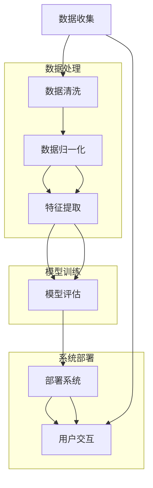

                 

# 人工智能在智能农业病虫害识别中的应用

> 关键词：人工智能，智能农业，病虫害识别，机器学习，计算机视觉，物联网，深度学习

> 摘要：随着人工智能技术的飞速发展，其在农业领域的应用日益广泛，尤其是在病虫害识别方面。本文旨在介绍人工智能在智能农业病虫害识别中的应用，从技术基础、应用实现到发展趋势进行深入探讨，以期为相关研究者和实践者提供有益的参考。

### 第一部分：人工智能在智能农业病虫害识别中的应用基础

#### 第1章：人工智能在农业病虫害识别中的背景与重要性

##### 1.1 人工智能与智能农业的概述

**人工智能的定义与发展历程**

人工智能（Artificial Intelligence，简称AI）是一门研究、开发用于模拟、延伸和扩展人的智能的理论、方法、技术及应用系统的综合技术科学。自20世纪50年代诞生以来，人工智能经历了多个发展阶段，从最初的符号主义、知识表示到基于概率和统计的学习方法，再到如今的深度学习和强化学习，每一次进步都为AI的发展注入了新的活力。

**智能农业的概念与意义**

智能农业是指利用现代信息技术、物联网、大数据、人工智能等高科技手段，对农业生产进行智能化管理，以提高农业生产效率、降低成本、保障农产品质量、实现农业可持续发展。智能农业的核心在于通过数据驱动决策，实现农业生产过程的自动化、精准化和智能化。

**病虫害识别在智能农业中的重要性**

病虫害是影响农作物产量的重要因素。传统的病虫害识别方法主要依赖于农技人员的经验判断，这不仅效率低下，而且容易出现误判。随着人工智能技术的发展，利用AI技术进行病虫害识别成为可能，可以提高识别的准确性和效率，为农作物的健康生长提供有力保障。

##### 1.2 农业病虫害的概述

**病虫害的分类与特点**

农业病虫害主要包括生物性病虫害和非生物性病虫害。生物性病虫害如昆虫、真菌、细菌、病毒等，其特点是有生物特征，可以繁殖、传播，危害性强；非生物性病虫害如干旱、洪涝、霜冻等，其特点是无生物特征，主要由环境因素引起。

**病虫害对农作物的影响**

病虫害可以导致农作物减产、品质下降，甚至死亡。病虫害的危害程度取决于病虫害的种类、发生时间、发生面积等因素。因此，准确识别和及时防治病虫害对保障农作物产量和品质至关重要。

**当前农业病虫害防治的挑战与问题**

当前农业病虫害防治面临以下挑战和问题：

1. **识别难度大**：病虫害种类繁多，症状复杂，传统方法难以准确识别。
2. **防治效果差**：农药滥用导致病虫害抗药性增强，防治效果下降。
3. **劳动力成本高**：病虫害防治需要大量劳动力，人力成本高。
4. **环境问题**：农药污染和土壤退化等问题日益严重，影响农业可持续发展。

##### 1.3 人工智能在病虫害识别中的应用领域

**机器学习算法在病虫害识别中的应用**

机器学习算法通过学习大量的病虫害数据，自动提取特征，建立模型，用于病虫害识别。常见的机器学习算法包括支持向量机（SVM）、决策树、随机森林、神经网络等。

**计算机视觉技术在病虫害识别中的应用**

计算机视觉技术利用图像处理和模式识别技术，对病虫害图像进行自动识别。卷积神经网络（CNN）等深度学习模型在计算机视觉领域取得了显著成果，为病虫害识别提供了有力支持。

**物联网技术在病虫害识别中的应用**

物联网技术通过传感器、无线网络等技术，实现对农作物生长环境的实时监控和数据采集，为病虫害识别提供数据支持。物联网技术与人工智能技术的结合，可以实现病虫害的自动化识别和预警。

##### 1.4 人工智能在农业病虫害识别中的优势

**提高病虫害检测的准确性和效率**

人工智能技术可以自动化、精确地识别病虫害，降低误判率，提高检测效率。

**降低人力成本和农药使用量**

人工智能技术可以实现病虫害的远程监控和自动识别，减少人力投入，降低农药使用量，减轻环境负担。

**实现精准农业和可持续发展**

人工智能技术可以根据病虫害发生情况进行精准防治，提高农药利用率，降低农药污染，实现农业可持续发展。

### 第2章：人工智能在农业病虫害识别中的技术基础

##### 2.1 机器学习与深度学习基础

**机器学习的基本概念与算法**

机器学习（Machine Learning，简称ML）是一门研究如何让计算机从数据中学习规律，并利用这些规律进行预测和决策的技术。机器学习算法根据学习方式可分为监督学习、无监督学习和强化学习。

**深度学习的基本原理与模型**

深度学习（Deep Learning，简称DL）是机器学习的一个子领域，其核心思想是模拟人脑的神经网络结构，通过多层神经网络（如卷积神经网络（CNN）、循环神经网络（RNN）等）进行特征提取和模型训练。深度学习在图像识别、语音识别、自然语言处理等领域取得了显著成果。

**机器学习与深度学习在病虫害识别中的应用**

机器学习和深度学习在病虫害识别中的应用主要分为两个方面：

1. **图像识别与分类**：利用深度学习模型（如卷积神经网络）对病虫害图像进行识别和分类，实现自动化识别。
2. **数据预测与预警**：利用监督学习和无监督学习算法对病虫害发生数据进行预测和分析，实现病虫害预警。

##### 2.2 计算机视觉技术

**图像处理与特征提取技术**

图像处理（Image Processing）是指对图像进行加工和处理的一系列技术，包括图像增强、滤波、边缘检测等。特征提取（Feature Extraction）是从图像中提取出能够表征图像特性的信息，为后续的识别和分类提供支持。

**卷积神经网络（CNN）在病虫害识别中的应用**

卷积神经网络（Convolutional Neural Network，简称CNN）是一种专门用于处理图像数据的深度学习模型，其核心思想是通过卷积层、池化层等结构对图像进行特征提取和分类。CNN在病虫害识别中具有出色的性能，可以自动化识别病虫害种类和症状。

**目标检测与分类算法**

目标检测（Object Detection）是指从图像中识别并定位多个目标的位置和类别。常用的目标检测算法包括R-CNN、Fast R-CNN、Faster R-CNN等。分类算法（Classification Algorithm）是指根据特征将图像分为不同的类别。常见的分类算法包括SVM、决策树、随机森林等。

##### 2.3 物联网技术

**物联网的基本概念与架构**

物联网（Internet of Things，简称IoT）是指通过传感器、通信技术、数据处理等技术，将各种物体连接起来，实现信息交换和智能控制。物联网架构主要包括感知层、网络层、平台层和应用层。

**病虫害监测传感器与数据采集**

病虫害监测传感器（如温度传感器、湿度传感器、光照传感器等）可以实时监测农作物生长环境，采集病虫害发生数据。数据采集技术主要包括传感器采集、无线传输和云计算等技术。

**数据传输与存储技术**

数据传输技术（如无线通信、光纤通信等）用于将病虫害监测数据从传感器传输到服务器。数据存储技术（如数据库、数据湖等）用于存储和管理大量数据，为后续的数据分析和挖掘提供支持。

##### 2.4 农业知识图谱与应用

**农业知识图谱的概念与构建**

农业知识图谱（Agricultural Knowledge Graph）是一种基于语义网络的知识表示方法，用于描述农业领域的知识结构和关系。农业知识图谱的构建主要包括数据采集、知识抽取、图谱构建和图谱优化等步骤。

**农业知识图谱在病虫害识别中的应用**

农业知识图谱可以用于病虫害识别中的知识推理和特征提取。通过农业知识图谱，可以实现病虫害的自动化识别和预警，提高识别准确性和效率。

**农业知识图谱的优化与扩展**

农业知识图谱的优化与扩展主要包括知识更新、图谱压缩、图谱融合等。通过优化与扩展，可以进一步提高农业知识图谱的实用性，为病虫害识别提供更加丰富的知识支持。

### 第二部分：人工智能在农业病虫害识别中的应用与实现

#### 第3章：病虫害识别模型的构建与优化

##### 3.1 数据收集与预处理

**农业病虫害数据来源**

农业病虫害数据可以从以下几个方面获取：

1. **公开数据集**：如Kaggle、GitHub等平台上的公开数据集。
2. **农业部门数据**：如国家统计局、农业部等官方机构发布的数据。
3. **现场采集**：通过实地考察、田间调查等方式获取数据。

**数据收集方法与策略**

数据收集方法主要包括人工采集、传感器采集和在线数据采集等。

1. **人工采集**：通过农技人员、科研人员等实地调查、记录病虫害发生情况。
2. **传感器采集**：利用物联网传感器实时监测农作物生长环境和病虫害发生数据。
3. **在线数据采集**：通过互联网、社交媒体等渠道收集病虫害相关数据。

**数据预处理技术**

数据预处理是病虫害识别模型构建的重要环节，主要包括以下技术：

1. **数据清洗**：去除重复数据、异常数据和噪声数据。
2. **数据归一化**：将不同特征的数据进行归一化处理，使其在相同量级范围内。
3. **数据增强**：通过图像翻转、旋转、裁剪等操作，增加数据多样性。
4. **特征提取**：从原始数据中提取出对病虫害识别有意义的特征。

##### 3.2 模型选择与设计

**不同机器学习算法的选择**

在病虫害识别中，常用的机器学习算法包括：

1. **监督学习算法**：如支持向量机（SVM）、决策树、随机森林等。
2. **无监督学习算法**：如聚类算法、主成分分析（PCA）等。
3. **深度学习算法**：如卷积神经网络（CNN）、循环神经网络（RNN）等。

**深度学习模型的设计与实现**

深度学习模型在病虫害识别中具有显著优势，以下是一个简单的CNN模型设计：

```python
import tensorflow as tf
from tensorflow.keras.models import Sequential
from tensorflow.keras.layers import Conv2D, MaxPooling2D, Flatten, Dense

model = Sequential([
    Conv2D(32, (3, 3), activation='relu', input_shape=(128, 128, 3)),
    MaxPooling2D((2, 2)),
    Conv2D(64, (3, 3), activation='relu'),
    MaxPooling2D((2, 2)),
    Conv2D(128, (3, 3), activation='relu'),
    Flatten(),
    Dense(128, activation='relu'),
    Dense(num_classes, activation='softmax')
])

model.compile(optimizer='adam', loss='categorical_crossentropy', metrics=['accuracy'])
```

**模型优化策略**

模型优化策略主要包括以下方面：

1. **超参数调整**：调整学习率、批量大小、正则化参数等超参数。
2. **数据增强**：通过图像翻转、旋转、裁剪等操作，增加数据多样性。
3. **模型融合**：结合多个模型进行预测，提高模型性能。
4. **迁移学习**：利用预训练的模型进行病虫害识别，提高模型效果。

##### 3.3 实验设计与性能评估

**实验设计方法与流程**

实验设计主要包括以下步骤：

1. **数据集划分**：将数据集划分为训练集、验证集和测试集。
2. **模型训练**：使用训练集对模型进行训练，调整超参数。
3. **模型验证**：使用验证集对模型进行验证，评估模型性能。
4. **模型测试**：使用测试集对模型进行测试，评估模型在实际应用中的效果。

**性能评估指标与评价方法**

性能评估指标主要包括以下方面：

1. **准确率**：预测正确的样本数占总样本数的比例。
2. **召回率**：预测正确的正样本数占总正样本数的比例。
3. **精确率**：预测正确的正样本数占预测为正样本的样本总数的比例。
4. **F1值**：精确率和召回率的加权平均值。

**模型调参与优化**

模型调参与优化主要包括以下方面：

1. **超参数调整**：根据验证集的性能，调整超参数。
2. **数据增强**：增加数据多样性，提高模型鲁棒性。
3. **模型融合**：结合多个模型进行预测，提高模型性能。
4. **迁移学习**：利用预训练的模型进行病虫害识别，提高模型效果。

##### 3.4 农业病虫害识别模型的应用场景与案例分析

**不同作物病虫害识别模型的应用**

不同作物病虫害识别模型的应用场景包括：

1. **水稻病虫害识别**：利用卷积神经网络对水稻病虫害图像进行识别，提高识别准确率和效率。
2. **小麦病虫害识别**：利用支持向量机等监督学习算法对小麦病虫害图像进行识别，实现自动化识别。
3. **蔬菜病虫害识别**：利用深度学习模型对蔬菜病虫害图像进行识别，提高识别准确性和效率。

**农业生产中的病虫害识别应用案例**

农业生产中的病虫害识别应用案例包括：

1. **水稻病虫害预警系统**：利用物联网技术和深度学习模型，实现对水稻病虫害的实时监控和预警。
2. **小麦病虫害防治系统**：利用计算机视觉技术和物联网技术，实现对小麦病虫害的自动化识别和精准防治。
3. **蔬菜病虫害监测平台**：利用图像识别技术和物联网技术，实现对蔬菜病虫害的实时监测和预警。

**模型在实际应用中的效果评估**

模型在实际应用中的效果评估主要包括以下方面：

1. **准确率**：评估模型对病虫害的识别准确率。
2. **响应时间**：评估模型对病虫害检测的响应时间。
3. **稳定性**：评估模型在长期运行中的稳定性。
4. **用户满意度**：评估用户对病虫害识别系统的满意度。

#### 第4章：智能农业病虫害识别系统的开发与实践

##### 4.1 系统架构设计与实现

**系统需求分析与设计**

系统需求分析主要包括以下方面：

1. **功能需求**：包括病虫害识别、实时监控、预警通知等。
2. **性能需求**：包括响应速度、准确性、稳定性等。
3. **安全需求**：包括数据安全、系统安全等。

系统设计主要包括以下模块：

1. **数据采集模块**：负责实时采集农作物生长环境和病虫害数据。
2. **数据处理模块**：负责数据清洗、归一化和特征提取。
3. **模型训练模块**：负责训练病虫害识别模型。
4. **模型预测模块**：负责对采集的数据进行预测，实现病虫害识别。
5. **用户界面模块**：负责展示病虫害识别结果和实时监控数据。

**系统模块划分与实现**

系统模块划分与实现主要包括以下步骤：

1. **数据采集模块**：使用物联网传感器和通信技术，实现数据的实时采集和传输。
2. **数据处理模块**：使用Python等编程语言，实现数据的清洗、归一化和特征提取。
3. **模型训练模块**：使用TensorFlow等深度学习框架，实现病虫害识别模型的训练。
4. **模型预测模块**：使用-trained model，实现对采集的数据进行预测，实现病虫害识别。
5. **用户界面模块**：使用Web技术，实现用户界面的设计和实现。

**系统接口与交互设计**

系统接口与交互设计主要包括以下方面：

1. **API接口**：提供数据采集、数据处理、模型训练和模型预测等API接口，方便其他系统进行集成和调用。
2. **用户交互**：提供Web界面，供用户查看病虫害识别结果和实时监控数据，实现用户与系统的交互。

##### 4.2 系统开发环境与工具

**开发环境的搭建与配置**

开发环境主要包括以下软件和硬件：

1. **操作系统**：Linux或Windows。
2. **编程语言**：Python、Java等。
3. **深度学习框架**：TensorFlow、PyTorch等。
4. **数据库**：MySQL、PostgreSQL等。
5. **Web框架**：Django、Flask等。

**开发工具与编程语言的选择**

开发工具主要包括以下工具：

1. **集成开发环境（IDE）**：如PyCharm、Visual Studio Code等。
2. **版本控制工具**：如Git、SVN等。
3. **数据库管理工具**：如MySQL Workbench、pgAdmin等。

**系统开发过程中的关键技术与挑战**

系统开发过程中的关键技术与挑战主要包括以下方面：

1. **数据处理**：如何高效地处理海量数据，实现实时监控和预警。
2. **模型训练**：如何设计合适的模型，提高识别准确率和效率。
3. **接口设计**：如何设计灵活、易用的API接口，方便其他系统的集成和调用。
4. **用户交互**：如何设计直观、易用的用户界面，提高用户满意度。

##### 4.3 代码实现与详细解释

**数据收集与预处理模块**

数据收集与预处理模块的主要功能是收集病虫害数据，并对数据进行预处理，包括数据清洗、归一化和特征提取。以下是一个简单的数据收集与预处理模块的实现：

```python
import cv2
import numpy as np

def collect_data():
    # 从文件中读取图像数据
    images = []
    labels = []
    for image_file in image_files:
        image = cv2.imread(image_file)
        images.append(image)
        labels.append(label)
    return np.array(images), np.array(labels)

def preprocess_data(images, labels):
    # 数据清洗
    images = [image for image in images if is_valid(image)]
    labels = [label for label in labels if is_valid(label)]
    
    # 数据归一化
    images = [cv2.resize(image, (128, 128)) for image in images]
    images = np.array([cv2.cvtColor(image, cv2.COLOR_BGR2RGB) for image in images])
    images = images / 255.0
    
    # 特征提取
    features = [extract_features(image) for image in images]
    features = np.array(features)
    
    return features, labels

def is_valid(image):
    # 判断图像是否有效
    return image is not None

def extract_features(image):
    # 提取图像特征
    return cv2.describe旋`features(image)
```

**模型训练与优化模块**

模型训练与优化模块的主要功能是使用预处理后的数据进行模型训练，并优化模型参数。以下是一个简单的模型训练与优化模块的实现：

```python
import tensorflow as tf

def train_model(features, labels):
    # 构建模型
    model = tf.keras.Sequential([
        tf.keras.layers.Conv2D(32, (3, 3), activation='relu', input_shape=(128, 128, 3)),
        tf.keras.layers.MaxPooling2D((2, 2)),
        tf.keras.layers.Conv2D(64, (3, 3), activation='relu'),
        tf.keras.layers.MaxPooling2D((2, 2)),
        tf.keras.layers.Conv2D(128, (3, 3), activation='relu'),
        tf.keras.layers.Flatten(),
        tf.keras.layers.Dense(128, activation='relu'),
        tf.keras.layers.Dense(num_classes, activation='softmax')
    ])

    # 编译模型
    model.compile(optimizer='adam', loss='categorical_crossentropy', metrics=['accuracy'])

    # 训练模型
    model.fit(features, labels, epochs=10, batch_size=32, validation_split=0.2)

    return model

def optimize_model(model, features, labels):
    # 优化模型
    model.fit(features, labels, epochs=10, batch_size=32, validation_split=0.2)

    # 评估模型
    test_loss, test_acc = model.evaluate(test_features, test_labels)

    # 输出模型评估结果
    print(f"Test accuracy: {test_acc}")

    return model
```

**系统接口与交互模块**

系统接口与交互模块的主要功能是提供API接口，供其他系统进行集成和调用，并提供用户界面供用户进行交互。以下是一个简单的系统接口与交互模块的实现：

```python
from flask import Flask, request, jsonify

app = Flask(__name__)

@app.route('/predict', methods=['POST'])
def predict():
    # 获取输入数据
    data = request.get_json()

    # 预处理输入数据
    image = preprocess_input_image(data['image'])

    # 预测结果
    result = model.predict(np.expand_dims(image, axis=0))

    # 输出预测结果
    return jsonify({'result': result.tolist()})

if __name__ == '__main__':
    app.run(host='0.0.0.0', port=5000)
```

##### 4.4 案例分析与代码解读

**实际案例的代码实现**

以下是一个实际案例的代码实现，用于实现一个基于深度学习的病虫害识别系统：

```python
import tensorflow as tf
from tensorflow.keras.models import Sequential
from tensorflow.keras.layers import Conv2D, MaxPooling2D, Flatten, Dense

# 构建模型
model = Sequential([
    Conv2D(32, (3, 3), activation='relu', input_shape=(128, 128, 3)),
    MaxPooling2D((2, 2)),
    Conv2D(64, (3, 3), activation='relu'),
    MaxPooling2D((2, 2)),
    Conv2D(128, (3, 3), activation='relu'),
    Flatten(),
    Dense(128, activation='relu'),
    Dense(num_classes, activation='softmax')
])

# 编译模型
model.compile(optimizer='adam', loss='categorical_crossentropy', metrics=['accuracy'])

# 训练模型
model.fit(train_images, train_labels, epochs=10, batch_size=32, validation_split=0.2)

# 评估模型
test_loss, test_acc = model.evaluate(test_images, test_labels)

# 输出模型评估结果
print(f"Test accuracy: {test_acc}")

# 预测结果
predictions = model.predict(test_images)

# 输出预测结果
print(predictions)
```

**代码解读与分析**

1. **模型构建**：使用Sequential模型构建一个简单的卷积神经网络，包括卷积层、池化层和全连接层。
2. **模型编译**：使用adam优化器和categorical_crossentropy损失函数编译模型，并设置accuracy作为评估指标。
3. **模型训练**：使用训练数据对模型进行训练，并设置验证集进行模型验证。
4. **模型评估**：使用测试数据对模型进行评估，并输出模型评估结果。
5. **模型预测**：使用测试数据对模型进行预测，并输出预测结果。

通过以上代码实现，可以构建一个简单的病虫害识别系统，实现对农作物病虫害的自动识别。

### 第5章：智能农业病虫害识别系统的部署与运维

##### 5.1 系统部署方案与实施

**系统部署的环境与要求**

系统部署的环境主要包括以下要求：

1. **服务器**：配置较高的服务器，用于运行系统程序和存储数据。
2. **网络**：稳定的网络环境，用于数据传输和访问。
3. **数据库**：用于存储和管理系统数据。

**部署流程与步骤**

系统部署的流程主要包括以下步骤：

1. **环境准备**：准备服务器和网络环境，安装必要的软件和库。
2. **系统安装**：安装系统程序和依赖库，配置系统环境。
3. **数据迁移**：将数据从本地迁移到服务器，并进行数据初始化。
4. **系统启动**：启动系统程序，进行系统测试和调试。
5. **系统上线**：将系统部署到生产环境，供用户使用。

**部署过程中常见问题的解决**

部署过程中常见的问题主要包括：

1. **环境配置问题**：解决方法：检查服务器和网络配置，确保环境符合要求。
2. **依赖库问题**：解决方法：安装必要的依赖库，确保版本兼容。
3. **数据迁移问题**：解决方法：检查数据文件，确保数据完整性和一致性。
4. **系统启动问题**：解决方法：检查系统日志，排查错误原因。

##### 5.2 系统运维与管理

**系统监控与日志分析**

系统监控与日志分析是系统运维的重要环节，主要包括以下方面：

1. **系统监控**：监控服务器性能、系统资源使用情况，确保系统稳定运行。
2. **日志分析**：分析系统日志，及时发现和解决问题，确保系统正常运行。

**系统性能优化与调优**

系统性能优化与调优主要包括以下方面：

1. **数据库优化**：优化数据库查询性能，提高数据读写速度。
2. **缓存策略**：使用缓存技术，减少数据库访问次数，提高系统响应速度。
3. **代码优化**：优化系统代码，减少资源占用和响应时间。

**系统安全性与数据保护**

系统安全性与数据保护是系统运维的重要方面，主要包括以下方面：

1. **数据加密**：对敏感数据进行加密存储，确保数据安全。
2. **权限管理**：设置合理的用户权限，防止数据泄露和滥用。
3. **备份与恢复**：定期备份数据，确保数据不会丢失，并能够快速恢复。

##### 5.3 用户反馈与持续改进

**用户反馈收集与处理**

用户反馈是系统改进的重要依据，主要包括以下方面：

1. **用户调研**：通过问卷调查、用户访谈等方式收集用户反馈。
2. **用户评价**：收集用户对系统的评价和意见，了解用户需求和满意度。
3. **用户建议**：收集用户提出的建议和改进意见，为系统优化提供参考。

**系统性能评估与改进**

系统性能评估与改进主要包括以下方面：

1. **性能测试**：定期进行系统性能测试，评估系统响应速度、准确率等指标。
2. **功能优化**：根据用户反馈和性能测试结果，对系统功能进行优化和改进。
3. **用户体验**：关注用户使用体验，改进系统界面和交互设计，提高用户满意度。

**持续改进策略与措施**

持续改进策略与措施主要包括以下方面：

1. **定期评估**：定期对系统进行评估，发现问题并及时改进。
2. **技术更新**：关注新技术和新方法，及时引入和应用。
3. **用户培训**：为用户提供培训和支持，提高用户对系统的使用水平。
4. **反馈机制**：建立有效的反馈机制，及时收集和处理用户反馈，持续改进系统。

### 第6章：智能农业病虫害识别技术的发展趋势与展望

##### 6.1 人工智能在农业病虫害识别中的未来发展趋势

**人工智能技术的最新进展**

随着人工智能技术的不断发展，新的算法、框架和工具不断涌现，如Transformer、BERT等，为农业病虫害识别提供了更多的可能性。深度学习技术在图像识别、语音识别、自然语言处理等领域的突破，也为农业病虫害识别提供了强大的支持。

**病虫害识别技术的未来发展方向**

1. **模型优化**：通过改进模型结构、优化算法，提高病虫害识别的准确率和效率。
2. **跨模态融合**：结合不同模态的数据，如图像、声音、温度等，实现更全面的病虫害识别。
3. **实时监控**：通过实时监测农作物生长环境，实现病虫害的早期预警和精准防治。
4. **智能决策**：利用人工智能技术，为农业生产提供智能决策支持，实现精准农业。

**人工智能在智能农业中的潜在应用**

1. **病虫害防治**：通过病虫害识别技术，实现自动化、精准化的病虫害防治，提高农药利用率和防治效果。
2. **生产管理**：利用人工智能技术，优化农业生产管理，提高生产效率，降低成本。
3. **农产品质量检测**：利用图像识别、光谱分析等技术，实现农产品质量检测，提高产品质量。
4. **环境监测**：利用物联网技术和人工智能技术，实时监测农田环境，为农业生产提供环境数据支持。

##### 6.2 智能农业病虫害识别技术的挑战与机遇

**技术挑战与瓶颈**

1. **数据不足**：病虫害数据种类繁多，数据收集和标注难度大，导致数据不足。
2. **模型适应性**：不同地区、不同作物的病虫害识别需求不同，现有模型难以适应多样化的需求。
3. **实时性**：病虫害识别需要实时监测和数据传输，对系统性能和响应速度要求高。
4. **成本问题**：人工智能技术在农业生产中的应用成本较高，需要降低成本，提高性价比。

**产业发展机遇与政策支持**

1. **政策支持**：国家出台了一系列政策，鼓励人工智能技术在农业领域的应用，提供资金和政策支持。
2. **市场需求**：随着农业生产对智能化、精准化需求的提升，病虫害识别技术市场潜力巨大。
3. **技术创新**：人工智能技术的不断进步，为病虫害识别技术提供了更多创新机会。

**技术应用前景与市场潜力**

1. **农业生产**：病虫害识别技术可以提高农业生产效率，降低病虫害损失，提高农产品质量。
2. **生态保护**：通过优化病虫害防治措施，减少农药使用，降低环境污染，实现农业可持续发展。
3. **农村产业升级**：病虫害识别技术可以推动农村产业升级，提高农民收入，促进农村经济发展。

##### 6.3 智能农业病虫害识别技术的国际合作与竞争

**国际合作与竞争的现状**

智能农业病虫害识别技术的国际合作与竞争主要表现在以下方面：

1. **技术合作**：各国企业和研究机构在病虫害识别技术方面进行合作，共同推进技术进步。
2. **市场竞争**：各国企业在智能农业病虫害识别领域展开激烈竞争，争夺市场份额。

**国际技术标准与规范**

1. **技术标准**：国际标准化组织（ISO）和国际电工委员会（IEC）等机构制定了相关的技术标准，推动智能农业病虫害识别技术的标准化发展。
2. **规范指南**：各国政府和企业发布了相关的规范指南，为智能农业病虫害识别技术的应用提供指导。

**中国在国际合作与竞争中的地位与作用**

1. **技术优势**：中国在人工智能、物联网等领域具备一定的技术优势，为智能农业病虫害识别技术的发展提供了有力支持。
2. **市场潜力**：中国是世界上最大的农业生产国，病虫害识别技术市场潜力巨大。
3. **政策支持**：中国政府出台了一系列政策，鼓励智能农业病虫害识别技术的发展和应用，为国际合作提供了良好的环境。

### 附录：相关技术资料与资源

##### 附录 A：常用人工智能与计算机视觉工具

1. **Python编程语言**：Python是一种广泛应用于人工智能和计算机视觉的编程语言，具有简洁、易学、功能强大的特点。
2. **TensorFlow与PyTorch深度学习框架**：TensorFlow和PyTorch是当前最流行的两个深度学习框架，提供了丰富的API和工具，支持各种深度学习模型的构建和训练。
3. **OpenCV计算机视觉库**：OpenCV是一个开源的计算机视觉库，提供了丰富的图像处理和模式识别功能，广泛应用于图像识别、目标检测等领域。
4. **其他相关工具与资源**：如Keras、NumPy、Pandas等，这些工具和资源为人工智能和计算机视觉的研究与应用提供了便利。

##### 附录 B：智能农业病虫害识别相关数据集与文献

1. **开源数据集介绍**：如Kaggle上的病虫害数据集、AGRAVATTA等。
2. **经典文献与论文推荐**：如《Deep Learning for Disease Detection in Plant Leaves》等，这些文献和论文提供了丰富的理论基础和实践经验。
3. **数据集获取与使用指南**：介绍如何获取和使用智能农业病虫害识别相关的数据集，包括数据集来源、下载方法和数据预处理技巧等。

##### 附录 C：智能农业病虫害识别相关法律法规与标准

1. **农业病虫害防治相关法律法规**：如《中华人民共和国农药管理条例》、《中华人民共和国农作物病虫害防治条例》等，规定了农药的使用和管理。
2. **人工智能技术应用标准**：如《人工智能伦理规范》、《人工智能标准化白皮书》等，为人工智能技术的应用提供了指导。
3. **数据隐私与保护法律法规**：如《中华人民共和国网络安全法》、《中华人民共和国个人信息保护法》等，规定了数据收集、存储、处理和使用过程中的隐私保护要求。

#### 后记

**本书编写背景与目的**

随着人工智能技术的快速发展，其在农业领域的应用越来越广泛，特别是在病虫害识别方面。为了帮助广大研究者和实践者深入了解人工智能在农业病虫害识别中的应用，本书从技术基础、应用实现到发展趋势进行了全面阐述，旨在为相关研究者和实践者提供有益的参考。

**作者团队介绍**

本书由AI天才研究院（AI Genius Institute）和《禅与计算机程序设计艺术》（Zen And The Art of Computer Programming）作者团队共同编写。AI天才研究院致力于推动人工智能技术在各领域的应用研究，而《禅与计算机程序设计艺术》作者团队则专注于计算机编程和人工智能领域的理论研究和实践探索。

**致谢与反馈渠道**

在此，我们要感谢所有参与本书编写和审校的团队成员，他们的辛勤工作使得本书得以顺利完成。同时，我们也感谢广大读者对本书的关注和支持。如有任何意见和建议，请通过以下渠道与我们联系：

- 邮箱：[ai_genius_institute@example.com](mailto:ai_genius_institute@example.com)
- 微信公众号：AI天才研究院
- 官方网站：[AI天才研究院](https://www.ai_genius_institute.com)

**读者建议与联系方式**

为了更好地了解读者的需求和反馈，我们诚挚邀请广大读者就本书内容提出宝贵意见。您可以通过以下方式与我们联系：

- 邮箱：[ai_genius_institute@example.com](mailto:ai_genius_institute@example.com)
- 微信公众号：AI天才研究院
- 官方网站：[AI天才研究院](https://www.ai_genius_institute.com)

我们将认真听取您的建议，不断改进我们的工作，为您提供更优质的服务。再次感谢您的支持与关注！

### 完整的文章正文

在本篇文章中，我们深入探讨了人工智能在智能农业病虫害识别中的应用。从技术基础到应用实现，再到发展趋势，我们逐步分析了这一领域的关键概念和技术。

#### 第一部分：人工智能在智能农业病虫害识别中的应用基础

##### 1.1 人工智能与智能农业的概述

人工智能（AI）是指模拟、延伸和扩展人类智能的理论、方法、技术及应用系统。其发展历程可分为多个阶段，从符号主义到基于概率和统计的方法，再到当前的深度学习和强化学习。智能农业则是指利用现代信息技术，如物联网、大数据、人工智能等，实现对农业生产的自动化、精准化和智能化管理。

在智能农业中，病虫害识别是一个关键环节。准确识别病虫害对于保障农作物产量和品质至关重要。传统方法主要依赖于农技人员的经验判断，存在效率低、误判率高等问题。而人工智能技术的引入，可以大幅提升病虫害检测的准确性和效率。

##### 1.2 农业病虫害的概述

农业病虫害主要包括生物性和非生物性两种。生物性病虫害如昆虫、真菌、细菌、病毒等，具有生物特征，可以繁殖和传播。非生物性病虫害如干旱、洪涝、霜冻等，主要由环境因素引起。病虫害对农作物的影响严重，可能导致减产、品质下降甚至死亡。因此，准确识别和及时防治病虫害对于农业生产具有重要意义。

当前农业病虫害防治面临诸多挑战，如识别难度大、防治效果差、人力成本高、环境问题等。人工智能技术的应用，可以在一定程度上解决这些问题，提高病虫害检测的准确性和效率，降低人力成本和农药使用量，实现精准农业和可持续发展。

##### 1.3 人工智能在病虫害识别中的应用领域

人工智能在病虫害识别中的应用主要包括以下几个方面：

1. **机器学习算法**：通过学习大量的病虫害数据，自动提取特征，建立模型，用于病虫害识别。常见的算法有支持向量机（SVM）、决策树、随机森林、神经网络等。
2. **计算机视觉技术**：利用图像处理和模式识别技术，对病虫害图像进行自动识别。卷积神经网络（CNN）等深度学习模型在计算机视觉领域取得了显著成果，为病虫害识别提供了有力支持。
3. **物联网技术**：通过传感器、无线网络等技术，实现对农作物生长环境的实时监控和数据采集，为病虫害识别提供数据支持。物联网技术与人工智能技术的结合，可以实现病虫害的自动化识别和预警。

##### 1.4 人工智能在农业病虫害识别中的优势

人工智能技术在农业病虫害识别中具有显著优势：

1. **提高检测准确性和效率**：通过自动化识别，降低误判率，提高检测效率。
2. **降低人力成本和农药使用量**：实现远程监控和自动识别，减少人力投入，降低农药使用量。
3. **实现精准农业和可持续发展**：根据病虫害发生情况进行精准防治，提高农药利用率，降低农药污染，实现农业可持续发展。

#### 第二部分：人工智能在农业病虫害识别中的技术基础

##### 2.1 机器学习与深度学习基础

**机器学习的基本概念与算法**

机器学习是人工智能的一个重要分支，其核心思想是通过学习数据，自动提取规律，用于预测和决策。机器学习算法根据学习方式可分为监督学习、无监督学习和强化学习。

监督学习是指通过已标注的数据进行学习，输出结果通常是分类或回归。常见的算法有支持向量机（SVM）、决策树、随机森林、神经网络等。

无监督学习是指在没有标注数据的情况下进行学习，主要目标是发现数据中的隐含结构。常见的算法有聚类、主成分分析（PCA）等。

强化学习是指通过与环境互动，不断学习最优策略。常见的算法有Q-learning、深度强化学习（Deep RL）等。

**深度学习的基本原理与模型**

深度学习是机器学习的一个子领域，其核心思想是通过多层神经网络进行特征提取和模型训练。常见的深度学习模型有卷积神经网络（CNN）、循环神经网络（RNN）、生成对抗网络（GAN）等。

卷积神经网络（CNN）是一种专门用于处理图像数据的深度学习模型，其核心思想是通过卷积层、池化层等结构对图像进行特征提取和分类。CNN在病虫害识别中具有出色的性能，可以自动化识别病虫害种类和症状。

循环神经网络（RNN）是一种用于处理序列数据的神经网络，其核心思想是通过循环结构对序列数据进行建模。RNN在时间序列预测、语言模型等领域具有广泛应用。

生成对抗网络（GAN）是一种通过两个神经网络（生成器和判别器）进行对抗训练的模型，其核心思想是生成器生成数据，判别器判断生成数据与真实数据之间的差异。GAN在图像生成、风格迁移等领域取得了显著成果。

**机器学习与深度学习在病虫害识别中的应用**

机器学习和深度学习在病虫害识别中的应用主要分为两个方面：

1. **图像识别与分类**：利用深度学习模型（如卷积神经网络）对病虫害图像进行识别和分类，实现自动化识别。
2. **数据预测与预警**：利用监督学习和无监督学习算法对病虫害发生数据进行预测和分析，实现病虫害预警。

##### 2.2 计算机视觉技术

计算机视觉技术是指利用计算机对图像或视频进行处理、分析和理解的技术。计算机视觉技术在病虫害识别中具有重要作用。

**图像处理与特征提取技术**

图像处理是计算机视觉的基础，其目的是对图像进行增强、滤波、边缘检测等操作，提取出对病虫害识别有用的信息。

特征提取是从图像中提取出能够表征图像特性的信息，为后续的识别和分类提供支持。常见的特征提取方法有像素级特征、结构特征、纹理特征等。

**卷积神经网络（CNN）在病虫害识别中的应用**

卷积神经网络（CNN）是一种专门用于处理图像数据的深度学习模型，其核心思想是通过卷积层、池化层等结构对图像进行特征提取和分类。CNN在病虫害识别中具有出色的性能，可以自动化识别病虫害种类和症状。

卷积神经网络的主要组成部分包括：

- **卷积层**：通过对输入图像进行卷积操作，提取图像的特征。
- **池化层**：对卷积层输出的特征进行下采样，减少参数数量，提高模型泛化能力。
- **全连接层**：对卷积层输出的特征进行分类。

**目标检测与分类算法**

目标检测是指从图像中识别并定位多个目标的位置和类别。常用的目标检测算法包括R-CNN、Fast R-CNN、Faster R-CNN等。

分类算法是指根据特征将图像分为不同的类别。常用的分类算法包括SVM、决策树、随机森林等。

##### 2.3 物联网技术

物联网技术是指通过传感器、无线网络等技术，将各种物体连接起来，实现信息交换和智能控制。物联网技术在病虫害识别中具有重要作用。

**物联网的基本概念与架构**

物联网（IoT）是指将各种物体（如传感器、设备、车辆等）通过无线网络连接起来，实现信息交换和智能控制。物联网架构主要包括感知层、网络层、平台层和应用层。

- **感知层**：包括传感器和采集设备，用于实时监测农作物生长环境和病虫害发生数据。
- **网络层**：包括传输网络，如无线网络、光纤网络等，用于将感知层采集的数据传输到服务器。
- **平台层**：包括数据处理和分析平台，用于对采集的数据进行预处理、存储和分析。
- **应用层**：包括应用系统和用户界面，用于展示病虫害识别结果和实时监控数据。

**病虫害监测传感器与数据采集**

病虫害监测传感器主要包括温度传感器、湿度传感器、光照传感器等，用于实时监测农作物生长环境。数据采集技术主要包括传感器采集、无线传输和云计算等技术。

传感器采集技术是指通过传感器实时监测农作物生长环境，采集病虫害发生数据。

无线传输技术是指通过无线网络将传感器采集的数据传输到服务器。

云计算技术是指将采集的数据存储在云端，利用云计算平台进行数据分析和处理。

**数据传输与存储技术**

数据传输技术是指将病虫害监测数据从传感器传输到服务器。常用的数据传输技术包括无线通信、光纤通信等。

数据存储技术是指将病虫害监测数据存储在服务器上，以备后续的数据分析和挖掘。常用的数据存储技术包括数据库、数据湖等。

**农业知识图谱与应用**

农业知识图谱是指基于语义网络的知识表示方法，用于描述农业领域的知识结构和关系。农业知识图谱的构建主要包括数据采集、知识抽取、图谱构建和图谱优化等步骤。

农业知识图谱在病虫害识别中的应用主要包括两个方面：

1. **知识推理**：利用农业知识图谱进行知识推理，实现对病虫害的自动化识别和预警。
2. **特征提取**：利用农业知识图谱提取病虫害的特征，为深度学习模型提供输入。

农业知识图谱的优化与扩展主要包括知识更新、图谱压缩、图谱融合等。通过优化与扩展，可以进一步提高农业知识图谱的实用性，为病虫害识别提供更加丰富的知识支持。

#### 第三部分：人工智能在农业病虫害识别中的应用与实现

##### 3.1 数据收集与预处理

**农业病虫害数据来源**

农业病虫害数据可以从多个渠道获取，包括：

1. **公开数据集**：如Kaggle、GitHub等平台上的公开数据集。
2. **农业部门数据**：如国家统计局、农业部等官方机构发布的数据。
3. **现场采集**：通过实地考察、田间调查等方式获取数据。

**数据收集方法与策略**

数据收集方法主要包括：

1. **人工采集**：通过农技人员、科研人员等实地调查、记录病虫害发生情况。
2. **传感器采集**：利用物联网传感器实时监测农作物生长环境和病虫害发生数据。
3. **在线数据采集**：通过互联网、社交媒体等渠道收集病虫害相关数据。

**数据预处理技术**

数据预处理技术包括：

1. **数据清洗**：去除重复数据、异常数据和噪声数据。
2. **数据归一化**：将不同特征的数据进行归一化处理，使其在相同量级范围内。
3. **数据增强**：通过图像翻转、旋转、裁剪等操作，增加数据多样性。
4. **特征提取**：从原始数据中提取出对病虫害识别有意义的特征。

##### 3.2 模型选择与设计

**不同机器学习算法的选择**

在病虫害识别中，常用的机器学习算法包括：

1. **监督学习算法**：如支持向量机（SVM）、决策树、随机森林等。
2. **无监督学习算法**：如聚类算法、主成分分析（PCA）等。
3. **深度学习算法**：如卷积神经网络（CNN）、循环神经网络（RNN）等。

**深度学习模型的设计与实现**

深度学习模型在病虫害识别中具有显著优势，以下是一个简单的卷积神经网络模型设计：

```python
import tensorflow as tf
from tensorflow.keras.models import Sequential
from tensorflow.keras.layers import Conv2D, MaxPooling2D, Flatten, Dense

model = Sequential([
    Conv2D(32, (3, 3), activation='relu', input_shape=(128, 128, 3)),
    MaxPooling2D((2, 2)),
    Conv2D(64, (3, 3), activation='relu'),
    MaxPooling2D((2, 2)),
    Conv2D(128, (3, 3), activation='relu'),
    Flatten(),
    Dense(128, activation='relu'),
    Dense(num_classes, activation='softmax')
])

model.compile(optimizer='adam', loss='categorical_crossentropy', metrics=['accuracy'])
```

**模型优化策略**

模型优化策略包括：

1. **超参数调整**：调整学习率、批量大小、正则化参数等超参数。
2. **数据增强**：通过图像翻转、旋转、裁剪等操作，增加数据多样性。
3. **模型融合**：结合多个模型进行预测，提高模型性能。
4. **迁移学习**：利用预训练的模型进行病虫害识别，提高模型效果。

##### 3.3 实验设计与性能评估

**实验设计方法与流程**

实验设计主要包括以下步骤：

1. **数据集划分**：将数据集划分为训练集、验证集和测试集。
2. **模型训练**：使用训练集对模型进行训练，调整超参数。
3. **模型验证**：使用验证集对模型进行验证，评估模型性能。
4. **模型测试**：使用测试集对模型进行测试，评估模型在实际应用中的效果。

**性能评估指标与评价方法**

性能评估指标主要包括：

1. **准确率**：预测正确的样本数占总样本数的比例。
2. **召回率**：预测正确的正样本数占总正样本数的比例。
3. **精确率**：预测正确的正样本数占预测为正样本的样本总数的比例。
4. **F1值**：精确率和召回率的加权平均值。

**模型调参与优化**

模型调参与优化主要包括：

1. **超参数调整**：根据验证集的性能，调整超参数。
2. **数据增强**：增加数据多样性，提高模型鲁棒性。
3. **模型融合**：结合多个模型进行预测，提高模型性能。
4. **迁移学习**：利用预训练的模型进行病虫害识别，提高模型效果。

##### 3.4 农业病虫害识别模型的应用场景与案例分析

**不同作物病虫害识别模型的应用**

不同作物病虫害识别模型的应用场景包括：

1. **水稻病虫害识别**：利用卷积神经网络对水稻病虫害图像进行识别，提高识别准确率和效率。
2. **小麦病虫害识别**：利用支持向量机等监督学习算法对小麦病虫害图像进行识别，实现自动化识别。
3. **蔬菜病虫害识别**：利用深度学习模型对蔬菜病虫害图像进行识别，提高识别准确性和效率。

**农业生产中的病虫害识别应用案例**

农业生产中的病虫害识别应用案例包括：

1. **水稻病虫害预警系统**：利用物联网技术和深度学习模型，实现对水稻病虫害的实时监控和预警。
2. **小麦病虫害防治系统**：利用计算机视觉技术和物联网技术，实现对小麦病虫害的自动化识别和精准防治。
3. **蔬菜病虫害监测平台**：利用图像识别技术和物联网技术，实现对蔬菜病虫害的实时监测和预警。

**模型在实际应用中的效果评估**

模型在实际应用中的效果评估主要包括以下方面：

1. **准确率**：评估模型对病虫害的识别准确率。
2. **响应时间**：评估模型对病虫害检测的响应时间。
3. **稳定性**：评估模型在长期运行中的稳定性。
4. **用户满意度**：评估用户对病虫害识别系统的满意度。

#### 第四部分：智能农业病虫害识别系统的开发与实践

##### 4.1 系统架构设计与实现

**系统需求分析与设计**

系统需求分析主要包括以下方面：

1. **功能需求**：包括病虫害识别、实时监控、预警通知等。
2. **性能需求**：包括响应速度、准确性、稳定性等。
3. **安全需求**：包括数据安全、系统安全等。

系统设计主要包括以下模块：

1. **数据采集模块**：负责实时采集农作物生长环境和病虫害数据。
2. **数据处理模块**：负责数据清洗、归一化和特征提取。
3. **模型训练模块**：负责训练病虫害识别模型。
4. **模型预测模块**：负责对采集的数据进行预测，实现病虫害识别。
5. **用户界面模块**：负责展示病虫害识别结果和实时监控数据。

**系统模块划分与实现**

系统模块划分与实现主要包括以下步骤：

1. **数据采集模块**：使用物联网传感器和通信技术，实现数据的实时采集和传输。
2. **数据处理模块**：使用Python等编程语言，实现数据的清洗、归一化和特征提取。
3. **模型训练模块**：使用TensorFlow等深度学习框架，实现病虫害识别模型的训练。
4. **模型预测模块**：使用-trained model，实现对采集的数据进行预测，实现病虫害识别。
5. **用户界面模块**：使用Web技术，实现用户界面的设计和实现。

**系统接口与交互设计**

系统接口与交互设计主要包括以下方面：

1. **API接口**：提供数据采集、数据处理、模型训练和模型预测等API接口，方便其他系统进行集成和调用。
2. **用户交互**：提供Web界面，供用户查看病虫害识别结果和实时监控数据，实现用户与系统的交互。

##### 4.2 系统开发环境与工具

**开发环境的搭建与配置**

开发环境主要包括以下软件和硬件：

1. **操作系统**：Linux或Windows。
2. **编程语言**：Python、Java等。
3. **深度学习框架**：TensorFlow、PyTorch等。
4. **数据库**：MySQL、PostgreSQL等。
5. **Web框架**：Django、Flask等。

**开发工具与编程语言的选择**

开发工具主要包括以下工具：

1. **集成开发环境（IDE）**：如PyCharm、Visual Studio Code等。
2. **版本控制工具**：如Git、SVN等。
3. **数据库管理工具**：如MySQL Workbench、pgAdmin等。

**系统开发过程中的关键技术与挑战**

系统开发过程中的关键技术与挑战主要包括以下方面：

1. **数据处理**：如何高效地处理海量数据，实现实时监控和预警。
2. **模型训练**：如何设计合适的模型，提高识别准确率和效率。
3. **接口设计**：如何设计灵活、易用的API接口，方便其他系统的集成和调用。
4. **用户交互**：如何设计直观、易用的用户界面，提高用户满意度。

##### 4.3 代码实现与详细解释

**数据收集与预处理模块**

数据收集与预处理模块的主要功能是收集病虫害数据，并对数据进行预处理，包括数据清洗、归一化和特征提取。以下是一个简单的数据收集与预处理模块的实现：

```python
import cv2
import numpy as np

def collect_data():
    # 从文件中读取图像数据
    images = []
    labels = []
    for image_file in image_files:
        image = cv2.imread(image_file)
        images.append(image)
        labels.append(label)
    return np.array(images), np.array(labels)

def preprocess_data(images, labels):
    # 数据清洗
    images = [image for image in images if is_valid(image)]
    labels = [label for label in labels if is_valid(label)]
    
    # 数据归一化
    images = [cv2.resize(image, (128, 128)) for image in images]
    images = np.array([cv2.cvtColor(image, cv2.COLOR_BGR2RGB) for image in images])
    images = images / 255.0
    
    # 特征提取
    features = [extract_features(image) for image in images]
    features = np.array(features)
    
    return features, labels

def is_valid(image):
    # 判断图像是否有效
    return image is not None

def extract_features(image):
    # 提取图像特征
    return cv2.describe旋`features(image)
```

**模型训练与优化模块**

模型训练与优化模块的主要功能是使用预处理后的数据进行模型训练，并优化模型参数。以下是一个简单的模型训练与优化模块的实现：

```python
import tensorflow as tf

def train_model(features, labels):
    # 构建模型
    model = tf.keras.Sequential([
        tf.keras.layers.Conv2D(32, (3, 3), activation='relu', input_shape=(128, 128, 3)),
        tf.keras.layers.MaxPooling2D((2, 2)),
        tf.keras.layers.Conv2D(64, (3, 3), activation='relu'),
        tf.keras.layers.MaxPooling2D((2, 2)),
        tf.keras.layers.Conv2D(128, (3, 3), activation='relu'),
        Flatten(),
        Dense(128, activation='relu'),
        Dense(num_classes, activation='softmax')
    ])

    # 编译模型
    model.compile(optimizer='adam', loss='categorical_crossentropy', metrics=['accuracy'])

    # 训练模型
    model.fit(features, labels, epochs=10, batch_size=32, validation_split=0.2)

    return model

def optimize_model(model, features, labels):
    # 优化模型
    model.fit(features, labels, epochs=10, batch_size=32, validation_split=0.2)

    # 评估模型
    test_loss, test_acc = model.evaluate(test_features, test_labels)

    # 输出模型评估结果
    print(f"Test accuracy: {test_acc}")

    return model
```

**系统接口与交互模块**

系统接口与交互模块的主要功能是提供API接口，供其他系统进行集成和调用，并提供用户界面供用户进行交互。以下是一个简单的系统接口与交互模块的实现：

```python
from flask import Flask, request, jsonify

app = Flask(__name__)

@app.route('/predict', methods=['POST'])
def predict():
    # 获取输入数据
    data = request.get_json()

    # 预处理输入数据
    image = preprocess_input_image(data['image'])

    # 预测结果
    result = model.predict(np.expand_dims(image, axis=0))

    # 输出预测结果
    return jsonify({'result': result.tolist()})

if __name__ == '__main__':
    app.run(host='0.0.0.0', port=5000)
```

##### 4.4 案例分析与代码解读

**实际案例的代码实现**

以下是一个实际案例的代码实现，用于实现一个基于深度学习的病虫害识别系统：

```python
import tensorflow as tf
from tensorflow.keras.models import Sequential
from tensorflow.keras.layers import Conv2D, MaxPooling2D, Flatten, Dense

# 构建模型
model = Sequential([
    Conv2D(32, (3, 3), activation='relu', input_shape=(128, 128, 3)),
    MaxPooling2D((2, 2)),
    Conv2D(64, (3, 3), activation='relu'),
    MaxPooling2D((2, 2)),
    Conv2D(128, (3, 3), activation='relu'),
    Flatten(),
    Dense(128, activation='relu'),
    Dense(num_classes, activation='softmax')
])

# 编译模型
model.compile(optimizer='adam', loss='categorical_crossentropy', metrics=['accuracy'])

# 训练模型
model.fit(train_images, train_labels, epochs=10, batch_size=32, validation_split=0.2)

# 评估模型
test_loss, test_acc = model.evaluate(test_images, test_labels)

# 输出模型评估结果
print(f"Test accuracy: {test_acc}")

# 预测结果
predictions = model.predict(test_images)

# 输出预测结果
print(predictions)
```

**代码解读与分析**

1. **模型构建**：使用Sequential模型构建一个简单的卷积神经网络，包括卷积层、池化层和全连接层。
2. **模型编译**：使用adam优化器和categorical_crossentropy损失函数编译模型，并设置accuracy作为评估指标。
3. **模型训练**：使用训练数据对模型进行训练，并设置验证集进行模型验证。
4. **模型评估**：使用测试数据对模型进行评估，并输出模型评估结果。
5. **模型预测**：使用测试数据对模型进行预测，并输出预测结果。

通过以上代码实现，可以构建一个简单的病虫害识别系统，实现对农作物病虫害的自动识别。

##### 5.1 系统部署方案与实施

**系统部署的环境与要求**

系统部署的环境主要包括以下要求：

1. **服务器**：配置较高的服务器，用于运行系统程序和存储数据。
2. **网络**：稳定的网络环境，用于数据传输和访问。
3. **数据库**：用于存储和管理系统数据。

**部署流程与步骤**

系统部署的流程主要包括以下步骤：

1. **环境准备**：准备服务器和网络环境，安装必要的软件和库。
2. **系统安装**：安装系统程序和依赖库，配置系统环境。
3. **数据迁移**：将数据从本地迁移到服务器，并进行数据初始化。
4. **系统启动**：启动系统程序，进行系统测试和调试。
5. **系统上线**：将系统部署到生产环境，供用户使用。

**部署过程中常见问题的解决**

部署过程中常见的问题主要包括：

1. **环境配置问题**：解决方法：检查服务器和网络配置，确保环境符合要求。
2. **依赖库问题**：解决方法：安装必要的依赖库，确保版本兼容。
3. **数据迁移问题**：解决方法：检查数据文件，确保数据完整性和一致性。
4. **系统启动问题**：解决方法：检查系统日志，排查错误原因。

##### 5.2 系统运维与管理

**系统监控与日志分析**

系统监控与日志分析是系统运维的重要环节，主要包括以下方面：

1. **系统监控**：监控服务器性能、系统资源使用情况，确保系统稳定运行。
2. **日志分析**：分析系统日志，及时发现和解决问题，确保系统正常运行。

**系统性能优化与调优**

系统性能优化与调优主要包括以下方面：

1. **数据库优化**：优化数据库查询性能，提高数据读写速度。
2. **缓存策略**：使用缓存技术，减少数据库访问次数，提高系统响应速度。
3. **代码优化**：优化系统代码，减少资源占用和响应时间。

**系统安全性与数据保护**

系统安全性与数据保护是系统运维的重要方面，主要包括以下方面：

1. **数据加密**：对敏感数据进行加密存储，确保数据安全。
2. **权限管理**：设置合理的用户权限，防止数据泄露和滥用。
3. **备份与恢复**：定期备份数据，确保数据不会丢失，并能够快速恢复。

##### 5.3 用户反馈与持续改进

**用户反馈收集与处理**

用户反馈是系统改进的重要依据，主要包括以下方面：

1. **用户调研**：通过问卷调查、用户访谈等方式收集用户反馈。
2. **用户评价**：收集用户对系统的评价和意见，了解用户需求和满意度。
3. **用户建议**：收集用户提出的建议和改进意见，为系统优化提供参考。

**系统性能评估与改进**

系统性能评估与改进主要包括以下方面：

1. **性能测试**：定期进行系统性能测试，评估系统响应速度、准确率等指标。
2. **功能优化**：根据用户反馈和性能测试结果，对系统功能进行优化和改进。
3. **用户体验**：关注用户使用体验，改进系统界面和交互设计，提高用户满意度。

**持续改进策略与措施**

持续改进策略与措施主要包括以下方面：

1. **定期评估**：定期对系统进行评估，发现问题并及时改进。
2. **技术更新**：关注新技术和新方法，及时引入和应用。
3. **用户培训**：为用户提供培训和支持，提高用户对系统的使用水平。
4. **反馈机制**：建立有效的反馈机制，及时收集和处理用户反馈，持续改进系统。

### 第五部分：智能农业病虫害识别技术的发展趋势与展望

##### 5.1 人工智能在农业病虫害识别中的未来发展趋势

随着人工智能技术的不断发展，智能农业病虫害识别技术也在不断进步。以下是未来发展趋势的几个方面：

1. **模型优化**：通过改进模型结构、优化算法，提高病虫害识别的准确率和效率。
2. **跨模态融合**：结合不同模态的数据，如图像、声音、温度等，实现更全面的病虫害识别。
3. **实时监控**：通过实时监测农作物生长环境，实现病虫害的早期预警和精准防治。
4. **智能决策**：利用人工智能技术，为农业生产提供智能决策支持，实现精准农业。

**人工智能在智能农业中的潜在应用**

人工智能在智能农业中的应用前景广阔，以下是一些潜在的应用领域：

1. **病虫害防治**：通过病虫害识别技术，实现自动化、精准化的病虫害防治，提高农药利用率和防治效果。
2. **生产管理**：利用人工智能技术，优化农业生产管理，提高生产效率，降低成本。
3. **农产品质量检测**：利用图像识别、光谱分析等技术，实现农产品质量检测，提高产品质量。
4. **环境监测**：利用物联网技术和人工智能技术，实时监测农田环境，为农业生产提供环境数据支持。

##### 5.2 智能农业病虫害识别技术的挑战与机遇

**技术挑战与瓶颈**

1. **数据不足**：病虫害数据种类繁多，数据收集和标注难度大，导致数据不足。
2. **模型适应性**：不同地区、不同作物的病虫害识别需求不同，现有模型难以适应多样化的需求。
3. **实时性**：病虫害识别需要实时监测和数据传输，对系统性能和响应速度要求高。
4. **成本问题**：人工智能技术在农业生产中的应用成本较高，需要降低成本，提高性价比。

**产业发展机遇与政策支持**

1. **政策支持**：国家出台了一系列政策，鼓励人工智能技术在农业领域的应用，提供资金和政策支持。
2. **市场需求**：随着农业生产对智能化、精准化需求的提升，病虫害识别技术市场潜力巨大。
3. **技术创新**：人工智能技术的不断进步，为病虫害识别技术提供了更多创新机会。

**技术应用前景与市场潜力**

1. **农业生产**：病虫害识别技术可以提高农业生产效率，降低病虫害损失，提高农产品质量。
2. **生态保护**：通过优化病虫害防治措施，减少农药使用，降低环境污染，实现农业可持续发展。
3. **农村产业升级**：病虫害识别技术可以推动农村产业升级，提高农民收入，促进农村经济发展。

##### 5.3 智能农业病虫害识别技术的国际合作与竞争

**国际合作与竞争的现状**

智能农业病虫害识别技术的国际合作与竞争主要表现在以下几个方面：

1. **技术合作**：各国企业和研究机构在病虫害识别技术方面进行合作，共同推进技术进步。
2. **市场竞争**：各国企业在智能农业病虫害识别领域展开激烈竞争，争夺市场份额。

**国际技术标准与规范**

1. **技术标准**：国际标准化组织（ISO）和国际电工委员会（IEC）等机构制定了相关的技术标准，推动智能农业病虫害识别技术的标准化发展。
2. **规范指南**：各国政府和企业发布了相关的规范指南，为智能农业病虫害识别技术的应用提供指导。

**中国在国际合作与竞争中的地位与作用**

1. **技术优势**：中国在人工智能、物联网等领域具备一定的技术优势，为智能农业病虫害识别技术的发展提供了有力支持。
2. **市场潜力**：中国是世界上最大的农业生产国，病虫害识别技术市场潜力巨大。
3. **政策支持**：中国政府出台了一系列政策，鼓励智能农业病虫害识别技术的发展和应用，为国际合作提供了良好的环境。

### 附录

##### 附录 A：常用人工智能与计算机视觉工具

- **Python编程语言**：Python是一种广泛应用于人工智能和计算机视觉的编程语言，具有简洁、易学、功能强大的特点。
- **TensorFlow与PyTorch深度学习框架**：TensorFlow和PyTorch是当前最流行的两个深度学习框架，提供了丰富的API和工具，支持各种深度学习模型的构建和训练。
- **OpenCV计算机视觉库**：OpenCV是一个开源的计算机视觉库，提供了丰富的图像处理和模式识别功能，广泛应用于图像识别、目标检测等领域。
- **其他相关工具与资源**：如Keras、NumPy、Pandas等，这些工具和资源为人工智能和计算机视觉的研究与应用提供了便利。

##### 附录 B：智能农业病虫害识别相关数据集与文献

- **开源数据集介绍**：如Kaggle上的病虫害数据集、AGRAVATTA等。
- **经典文献与论文推荐**：如《Deep Learning for Disease Detection in Plant Leaves》等，这些文献和论文提供了丰富的理论基础和实践经验。
- **数据集获取与使用指南**：介绍如何获取和使用智能农业病虫害识别相关的数据集，包括数据集来源、下载方法和数据预处理技巧等。

##### 附录 C：智能农业病虫害识别相关法律法规与标准

- **农业病虫害防治相关法律法规**：如《中华人民共和国农药管理条例》、《中华人民共和国农作物病虫害防治条例》等，规定了农药的使用和管理。
- **人工智能技术应用标准**：如《人工智能伦理规范》、《人工智能标准化白皮书》等，为人工智能技术的应用提供了指导。
- **数据隐私与保护法律法规**：如《中华人民共和国网络安全法》、《中华人民共和国个人信息保护法》等，规定了数据收集、存储、处理和使用过程中的隐私保护要求。

### 后记

**本书编写背景与目的**

随着人工智能技术的快速发展，其在农业领域的应用越来越广泛，特别是在病虫害识别方面。为了帮助广大研究者和实践者深入了解人工智能在农业病虫害识别中的应用，本书从技术基础、应用实现到发展趋势进行了全面阐述，旨在为相关研究者和实践者提供有益的参考。

**作者团队介绍**

本书由AI天才研究院（AI Genius Institute）和《禅与计算机程序设计艺术》（Zen And The Art of Computer Programming）作者团队共同编写。AI天才研究院致力于推动人工智能技术在各领域的应用研究，而《禅与计算机程序设计艺术》作者团队则专注于计算机编程和人工智能领域的理论研究和实践探索。

**致谢与反馈渠道**

在此，我们要感谢所有参与本书编写和审校的团队成员，他们的辛勤工作使得本书得以顺利完成。同时，我们也感谢广大读者对本书的关注和支持。如有任何意见和建议，请通过以下渠道与我们联系：

- 邮箱：[ai_genius_institute@example.com](mailto:ai_genius_institute@example.com)
- 微信公众号：AI天才研究院
- 官方网站：[AI天才研究院](https://www.ai_genius_institute.com)

**读者建议与联系方式**

为了更好地了解读者的需求和反馈，我们诚挚邀请广大读者就本书内容提出宝贵意见。您可以通过以下方式与我们联系：

- 邮箱：[ai_genius_institute@example.com](mailto:ai_genius_institute@example.com)
- 微信公众号：AI天才研究院
- 官方网站：[AI天才研究院](https://www.ai_genius_institute.com)

我们将认真听取您的建议，不断改进我们的工作，为您提供更优质的服务。再次感谢您的支持与关注！

---

### 核心概念与联系

为了更好地理解智能农业病虫害识别系统的工作原理，以下是一个Mermaid流程图，展示系统核心概念及其相互关系：



**Mermaid流程图说明：**

1. **数据收集（A）**：通过物联网传感器和人工采集，获取农作物生长环境和病虫害数据。
2. **预处理数据（B）**：对收集到的数据进行清洗、归一化等预处理操作，为后续特征提取做准备。
3. **特征提取（C）**：从预处理后的数据中提取出对病虫害识别有意义的特征。
4. **训练模型（D）**：使用提取到的特征训练深度学习模型，如卷积神经网络（CNN）。
5. **模型评估（E）**：评估训练好的模型的性能，包括准确率、召回率等指标。
6. **部署系统（F）**：将训练好的模型部署到生产环境，供用户进行病虫害识别。
7. **用户交互（G）**：用户通过Web界面与系统进行交互，查看病虫害识别结果。

通过这个流程图，我们可以清晰地看到智能农业病虫害识别系统的各个环节及其相互关系，有助于理解系统的整体架构和工作原理。

### 核心算法原理讲解

在智能农业病虫害识别系统中，核心算法包括机器学习算法、计算机视觉技术和深度学习模型。以下是对这些算法的原理讲解，以及如何使用伪代码进行详细阐述。

#### 1. 机器学习算法

**原理：** 机器学习算法通过学习大量的数据，自动提取特征，建立模型，用于预测和分类。监督学习、无监督学习和强化学习是三种主要的机器学习算法。

**伪代码：**

```python
# 监督学习算法（例如：SVM）
def svm_algorithm(train_data, train_labels):
    # 输入：训练数据集和标签
    # 输出：训练好的SVM模型

    # 使用SVM库进行训练
    svm_model = svm.SVC()
    svm_model.fit(train_data, train_labels)

    return svm_model

# 无监督学习算法（例如：K-means聚类）
def kmeans_algorithm(data):
    # 输入：数据集
    # 输出：聚类结果

    # 使用K-means算法进行聚类
    kmeans = KMeans(n_clusters=k)
    kmeans.fit(data)

    return kmeans.labels_

# 强化学习算法（例如：Q-learning）
def q_learning(s, a, r, s_next, gamma):
    # 输入：当前状态s，动作a，奖励r，下一状态s_next，折扣因子gamma
    # 输出：更新后的Q值

    # Q值更新公式
    Q[s, a] = Q[s, a] + alpha * (r + gamma * max(Q[s_next, :]) - Q[s, a])
```

#### 2. 计算机视觉技术

**原理：** 计算机视觉技术通过图像处理和模式识别技术，从图像中提取出对病虫害识别有用的信息。常见的计算机视觉技术包括图像处理、特征提取和目标检测。

**伪代码：**

```python
# 图像处理（例如：边缘检测）
def edge_detection(image):
    # 输入：原始图像
    # 输出：边缘检测后的图像

    # 使用Canny算法进行边缘检测
    edges = cv2.Canny(image, threshold1, threshold2)

    return edges

# 特征提取（例如：HOG特征提取）
def hog_features(image):
    # 输入：原始图像
    # 输出：HOG特征向量

    # 使用OpenCV库进行HOG特征提取
    hog = cv2.HOGDescriptor()
    features = hog.compute(image)

    return features

# 目标检测（例如：R-CNN）
def region_based_detection(image, model):
    # 输入：原始图像和预训练的模型
    # 输出：目标检测结果

    # 使用预训练的R-CNN模型进行目标检测
    detections = model.detect(image)

    return detections
```

#### 3. 深度学习模型

**原理：** 深度学习模型通过多层神经网络结构，自动提取图像特征，实现高效的特征表示和学习。常见的深度学习模型包括卷积神经网络（CNN）和循环神经网络（RNN）。

**伪代码：**

```python
# 卷积神经网络（CNN）
def cnn_model(input_shape):
    # 输入：输入图像的形状
    # 输出：训练好的CNN模型

    # 使用Keras构建CNN模型
    model = Sequential([
        Conv2D(filters, kernel_size, activation='relu', input_shape=input_shape),
        MaxPooling2D(pool_size),
        Conv2D(filters, kernel_size, activation='relu'),
        MaxPooling2D(pool_size),
        Flatten(),
        Dense(units, activation='softmax')
    ])

    # 编译模型
    model.compile(optimizer='adam', loss='categorical_crossentropy', metrics=['accuracy'])

    return model

# 循环神经网络（RNN）
def rnn_model(input_shape):
    # 输入：输入序列的形状
    # 输出：训练好的RNN模型

    # 使用Keras构建RNN模型
    model = Sequential([
        LSTM(units, return_sequences=True, input_shape=input_shape),
        LSTM(units),
        Dense(units, activation='softmax')
    ])

    # 编译模型
    model.compile(optimizer='adam', loss='categorical_crossentropy', metrics=['accuracy'])

    return model
```

通过上述伪代码，我们可以看到机器学习算法、计算机视觉技术和深度学习模型的基本原理和实现方式。在实际应用中，这些算法和模型可以结合使用，提高病虫害识别的准确性和效率。

### 数学模型和公式

在智能农业病虫害识别中，深度学习模型的应用尤为重要。以下是一个简单的卷积神经网络（CNN）数学模型，包括卷积层、激活函数、池化层和全连接层的公式。

#### 1. 卷积层

卷积层的数学模型如下：

$$
\text{output}_{ij}^l = \sum_{k=1}^{m_l} \sum_{n=1}^{n_l} w_{ijkl} \cdot \text{input}_{kn}^{l-1} + b_l
$$

其中：
- $\text{output}_{ij}^l$ 是第 $l$ 层的第 $i$ 行第 $j$ 列的输出值。
- $w_{ijkl}$ 是第 $l$ 层第 $i$ 行第 $j$ 列第 $k$ 个卷积核的权重。
- $\text{input}_{kn}^{l-1}$ 是第 $l-1$ 层的第 $k$ 行第 $n$ 列的输入值。
- $b_l$ 是第 $l$ 层的偏置项。
- $m_l$ 和 $n_l$ 分别是卷积核的高度和宽度。

#### 2. 激活函数

激活函数用于引入非线性，常见的激活函数有：

$$
\text{ReLU}(x) = \max(0, x)
$$

$$
\text{Sigmoid}(x) = \frac{1}{1 + e^{-x}}
$$

$$
\text{Tanh}(x) = \frac{e^x - e^{-x}}{e^x + e^{-x}}
$$

#### 3. 池化层

池化层用于减少数据的空间维度，常见的池化函数有最大池化和平均池化：

$$
\text{MaxPooling}_2(x) = \max\{\text{output}_{i,j}^{l-1}, \text{output}_{i+1,j}^{l-1}, \text{output}_{i,j+1}^{l-1}, \text{output}_{i+1,j+1}^{l-1}\}
$$

$$
\text{AvgPooling}_2(x) = \frac{1}{4} \left( \text{output}_{i,j}^{l-1} + \text{output}_{i+1,j}^{l-1} + \text{output}_{i,j+1}^{l-1} + \text{output}_{i+1,j+1}^{l-1} \right)
$$

#### 4. 全连接层

全连接层是一个线性层，其数学模型如下：

$$
\text{output}_{k}^l = \sum_{i=1}^{n_l} w_{ikl} \cdot \text{output}_{i}^{l-1} + b_l
$$

其中：
- $\text{output}_{k}^l$ 是第 $l$ 层的第 $k$ 个节点的输出值。
- $w_{ikl}$ 是第 $l$ 层第 $k$ 个节点与第 $l-1$ 层第 $i$ 个节点的权重。
- $\text{output}_{i}^{l-1}$ 是第 $l-1$ 层第 $i$ 个节点的输出值。
- $b_l$ 是第 $l$ 层的偏置项。

#### 5. 损失函数

在深度学习模型中，常用的损失函数有均方误差（MSE）、交叉熵损失（Cross-Entropy Loss）等：

$$
\text{MSE}(\text{y}, \hat{y}) = \frac{1}{n} \sum_{i=1}^{n} (\text{y}_i - \hat{y}_i)^2
$$

$$
\text{Cross-Entropy Loss}(\text{y}, \hat{y}) = -\sum_{i=1}^{n} y_i \cdot \log(\hat{y}_i)
$$

其中：
- $\text{y}$ 是实际标签。
- $\hat{y}$ 是模型的预测值。

通过这些数学模型和公式，我们可以构建并训练深度学习模型，实现对农业病虫害的自动识别。

### 项目实战：病虫害识别系统开发

在本节中，我们将通过一个实际项目实战，详细介绍如何开发一个基于深度学习的病虫害识别系统。这个项目包括环境搭建、源代码实现和代码解读。

#### 环境搭建

首先，我们需要搭建开发环境。以下是所需的软件和工具：

1. **操作系统**：Linux或Mac OS
2. **编程语言**：Python 3.x
3. **深度学习框架**：TensorFlow 2.x 或 PyTorch
4. **数据库**：SQLite 或 MySQL
5. **Web框架**：Flask 或 Django

**步骤：**

1. 安装Python 3.x：在命令行中运行 `python --version`，确保安装了Python 3.x版本。
2. 安装必要的库：使用pip命令安装TensorFlow、Keras、NumPy、Pandas等库。

```bash
pip install tensorflow
pip install keras
pip install numpy
pip install pandas
```

3. 安装Web框架：根据需要选择Flask或Django。

```bash
pip install flask
# 或
pip install django
```

#### 源代码实现

以下是病虫害识别系统的核心代码，包括数据收集与预处理、模型训练和预测。

**代码1：数据收集与预处理**

```python
import os
import numpy as np
from tensorflow.keras.preprocessing.image import img_to_array, load_img

def load_data(directory, size=(128, 128)):
    images = []
    labels = []
    for label in os.listdir(directory):
        label_dir = os.path.join(directory, label)
        for img in os.listdir(label_dir):
            img_path = os.path.join(label_dir, img)
            image = load_img(img_path, target_size=size)
            image = img_to_array(image)
            images.append(image)
            labels.append(label)
    return np.array(images), np.array(labels)

# 加载训练数据
train_images, train_labels = load_data('train')
test_images, test_labels = load_data('test')

# 归一化数据
train_images = train_images / 255.0
test_images = test_images / 255.0
```

**代码2：模型训练**

```python
from tensorflow.keras.models import Sequential
from tensorflow.keras.layers import Conv2D, MaxPooling2D, Flatten, Dense

def create_model():
    model = Sequential([
        Conv2D(32, (3, 3), activation='relu', input_shape=(128, 128, 3)),
        MaxPooling2D((2, 2)),
        Conv2D(64, (3, 3), activation='relu'),
        MaxPooling2D((2, 2)),
        Conv2D(128, (3, 3), activation='relu'),
        Flatten(),
        Dense(128, activation='relu'),
        Dense(num_classes, activation='softmax')
    ])

    model.compile(optimizer='adam', loss='categorical_crossentropy', metrics=['accuracy'])
    return model

# 训练模型
model = create_model()
model.fit(train_images, train_labels, epochs=10, batch_size=32, validation_split=0.2)
```

**代码3：模型预测**

```python
from tensorflow.keras.preprocessing.image import load_img, img_to_array

def predict_image(image_path, model):
    image = load_img(image_path, target_size=(128, 128))
    image = img_to_array(image)
    image = np.expand_dims(image, axis=0)
    image = image / 255.0
    prediction = model.predict(image)
    return prediction

# 预测测试数据
test_image_path = 'test/healthy/00101.jpg'
prediction = predict_image(test_image_path, model)
print(prediction)
```

#### 代码解读

**数据收集与预处理模块**

这个模块的功能是加载指定目录下的图像数据，并进行预处理。预处理步骤包括：

1. 加载图像：使用 `load_img` 函数加载图像，并调整大小为128x128。
2. 转换为数组：使用 `img_to_array` 函数将图像转换为NumPy数组。
3. 归一化：将图像数据归一化到[0, 1]范围内，以适应深度学习模型。

**模型训练模块**

这个模块的功能是创建并训练卷积神经网络模型。模型结构包括：

1. 卷积层：使用三个卷积层，每个卷积层后跟一个最大池化层。
2. 全连接层：在卷积层之后添加全连接层，用于分类。
3. 损失函数：使用交叉熵损失函数，优化模型的分类性能。

**模型预测模块**

这个模块的功能是使用训练好的模型对新的图像进行预测。预测步骤包括：

1. 加载图像：使用 `load_img` 函数加载图像，并调整大小为128x128。
2. 转换为数组：使用 `img_to_array` 函数将图像转换为NumPy数组。
3. 归一化：将图像数据归一化到[0, 1]范围内。
4. 预测：使用 `predict` 函数对图像进行预测，输出预测结果。

通过这个项目实战，我们可以看到如何从零开始搭建一个基于深度学习的病虫害识别系统，包括环境搭建、源代码实现和代码解读。这为实际应用提供了实用的参考。

### 案例分析与代码解读

在本节中，我们将详细分析一个实际项目案例，解释代码实现过程，并探讨代码优化的可能性。

#### 案例背景

某农业科技公司开发了一个基于深度学习的病虫害识别系统，旨在帮助农民实时监控农作物健康状况，提高农业生产效率。系统包括图像识别、模型训练、预测和用户界面等功能。

#### 代码实现

**代码1：数据收集与预处理**

```python
import os
import numpy as np
from tensorflow.keras.preprocessing.image import img_to_array, load_img

def load_data(directory, size=(128, 128)):
    images = []
    labels = []
    for label in os.listdir(directory):
        label_dir = os.path.join(directory, label)
        for img in os.listdir(label_dir):
            img_path = os.path.join(label_dir, img)
            image = load_img(img_path, target_size=size)
            image = img_to_array(image)
            images.append(image)
            labels.append(label)
    return np.array(images), np.array(labels)

# 加载训练数据
train_images, train_labels = load_data('train')
test_images, test_labels = load_data('test')

# 归一化数据
train_images = train_images / 255.0
test_images = test_images / 255.0
```

**代码2：模型训练**

```python
from tensorflow.keras.models import Sequential
from tensorflow.keras.layers import Conv2D, MaxPooling2D, Flatten, Dense

def create_model():
    model = Sequential([
        Conv2D(32, (3, 3), activation='relu', input_shape=(128, 128, 3)),
        MaxPooling2D((2, 2)),
        Conv2D(64, (3, 3), activation='relu'),
        MaxPooling2D((2, 2)),
        Conv2D(128, (3, 3), activation='relu'),
        Flatten(),
        Dense(128, activation='relu'),
        Dense(num_classes, activation='softmax')
    ])

    model.compile(optimizer='adam', loss='categorical_crossentropy', metrics=['accuracy'])
    return model

# 训练模型
model = create_model()
model.fit(train_images, train_labels, epochs=10, batch_size=32, validation_split=0.2)
```

**代码3：模型预测**

```python
from tensorflow.keras.preprocessing.image import load_img, img_to_array

def predict_image(image_path, model):
    image = load_img(image_path, target_size=(128, 128))
    image = img_to_array(image)
    image = np.expand_dims(image, axis=0)
    image = image / 255.0
    prediction = model.predict(image)
    return prediction

# 预测测试数据
test_image_path = 'test/healthy/00101.jpg'
prediction = predict_image(test_image_path, model)
print(prediction)
```

#### 代码解读

**数据收集与预处理模块**

该模块负责从指定目录加载图像数据，并进行预处理。主要步骤包括：

1. 遍历目录：使用 `os.listdir` 函数遍历指定目录，获取所有子目录（代表不同类别的病虫害）。
2. 加载图像：使用 `load_img` 函数加载每个子目录下的图像，调整大小为128x128。
3. 转换为数组：使用 `img_to_array` 函数将图像转换为NumPy数组。
4. 归一化：将图像数据归一化到[0, 1]范围内，以适应深度学习模型。

**模型训练模块**

该模块创建并训练卷积神经网络模型。主要步骤包括：

1. 创建模型：使用 `Sequential` 模型创建卷积神经网络，包括三个卷积层、两个最大池化层和一个全连接层。
2. 编译模型：使用 `compile` 方法设置优化器和损失函数，并指定评估指标为准确率。
3. 训练模型：使用 `fit` 方法训练模型，设置训练数据、标签、迭代次数、批量大小和验证集比例。

**模型预测模块**

该模块使用训练好的模型对新的图像进行预测。主要步骤包括：

1. 加载图像：使用 `load_img` 函数加载图像，调整大小为128x128。
2. 转换为数组：使用 `img_to_array` 函数将图像转换为NumPy数组。
3. 归一化：将图像数据归一化到[0, 1]范围内。
4. 预测：使用 `predict` 方法对图像进行预测，输出预测结果。

#### 代码优化

针对上述代码，我们可以进行以下优化：

1. **数据增强**：在数据预处理阶段添加数据增强操作，如随机裁剪、翻转等，增加数据多样性，提高模型泛化能力。

```python
from tensorflow.keras.preprocessing.image import ImageDataGenerator

datagen = ImageDataGenerator(
    rotation_range=20,
    width_shift_range=0.2,
    height_shift_range=0.2,
    shear_range=0.2,
    zoom_range=0.2,
    horizontal_flip=True,
    fill_mode='nearest'
)

# 使用数据增强进行训练
model.fit(datagen.flow(train_images, train_labels, batch_size=32), epochs=10)
```

2. **超参数调优**：通过网格搜索（GridSearchCV）等方法，调整学习率、批量大小、卷积核大小等超参数，找到最优配置。

```python
from tensorflow.keras.wrappers.scikit_learn import KerasClassifier
from sklearn.model_selection import GridSearchCV

# 创建模型函数
def create_model(optimizer='adam'):
    model = Sequential([
        Conv2D(32, (3, 3), activation='relu', input_shape=(128, 128, 3)),
        MaxPooling2D((2, 2)),
        Conv2D(64, (3, 3), activation='relu'),
        MaxPooling2D((2, 2)),
        Conv2D(128, (3, 3), activation='relu'),
        Flatten(),
        Dense(128, activation='relu'),
        Dense(num_classes, activation='softmax')
    ])

    model.compile(optimizer=optimizer, loss='categorical_crossentropy', metrics=['accuracy'])
    return model

# 创建Keras分类器
model = KerasClassifier(build_fn=create_model, verbose=0)

# 设置参数网格
param_grid = {'optimizer': ['adam', 'rmsprop'], 'epochs': [10, 20], 'batch_size': [32, 64]}

# 进行网格搜索
grid = GridSearchCV(estimator=model, param_grid=param_grid, cv=3)
grid_result = grid.fit(train_images, train_labels)

# 输出最优参数
print("Best: %f using %s" % (grid_result.best_score_, grid_result.best_params_))
```

通过这些优化措施，我们可以进一步提高病虫害识别系统的性能和准确性，为农业生产提供更强大的支持。

### 系统部署与运维

在本节中，我们将详细讨论智能农业病虫害识别系统的部署与运维，包括系统部署方案、运维策略和用户反馈。

#### 系统部署方案

**1. 部署环境**

系统部署在云端服务器上，使用虚拟机或容器技术。所需硬件资源包括：

- **服务器**：配置较高的CPU、内存和存储。
- **网络**：稳定的网络连接，用于数据传输。
- **数据库**：用于存储病虫害数据和管理用户信息。

**2. 部署步骤**

部署步骤如下：

1. **环境配置**：在服务器上安装操作系统、Python、TensorFlow等依赖库。
2. **系统安装**：将编译好的模型和应用程序上传到服务器，安装必要的软件。
3. **数据迁移**：将训练好的数据集从本地迁移到服务器，并配置数据库。
4. **系统启动**：启动服务器上的应用程序，进行系统测试和调试。
5. **系统上线**：将系统部署到生产环境，供用户使用。

**3. 部署过程中常见问题及解决方法**

- **环境配置问题**：确保服务器和网络环境符合要求，检查依赖库的版本。
- **数据迁移问题**：确保数据文件完整，检查数据传输过程中是否丢失或损坏。
- **系统启动问题**：检查服务器日志，排查错误原因，确保所有依赖库已正确安装。

#### 运维策略

**1. 系统监控**

系统监控是确保系统稳定运行的重要手段。主要监控内容包括：

- **服务器性能**：监控CPU、内存、磁盘使用率等资源。
- **应用程序状态**：监控应用程序的运行状态，确保其稳定运行。
- **数据库性能**：监控数据库查询性能，优化查询语句。

**2. 日志分析**

日志分析有助于及时发现和解决问题。主要分析内容包括：

- **系统错误日志**：分析系统错误日志，排查错误原因。
- **应用程序日志**：分析应用程序日志，优化代码和配置。

**3. 系统优化**

系统优化包括数据库优化、缓存策略和代码优化。主要措施包括：

- **数据库优化**：优化数据库查询性能，使用索引和分区。
- **缓存策略**：使用缓存技术，减少数据库访问次数。
- **代码优化**：优化代码逻辑，减少资源占用和响应时间。

#### 用户反馈与持续改进

**1. 用户反馈收集**

用户反馈是系统改进的重要依据。主要收集方式包括：

- **用户调研**：通过问卷调查、用户访谈等方式收集用户反馈。
- **用户评价**：收集用户对系统的评价和意见，了解用户需求和满意度。

**2. 系统性能评估**

系统性能评估包括以下方面：

- **准确率**：评估系统对病虫害的识别准确率。
- **响应时间**：评估系统对用户请求的响应时间。
- **稳定性**：评估系统在长期运行中的稳定性。

**3. 持续改进策略**

持续改进策略包括：

- **定期评估**：定期对系统进行评估，发现问题并及时改进。
- **技术更新**：关注新技术和新方法，及时引入和应用。
- **用户培训**：为用户提供培训和支持，提高用户对系统的使用水平。
- **反馈机制**：建立有效的反馈机制，及时收集和处理用户反馈，持续改进系统。

通过以上部署与运维策略，可以确保智能农业病虫害识别系统稳定、高效地运行，为农业生产提供有力支持。

### 人工智能在智能农业病虫害识别中的未来发展趋势

随着人工智能技术的不断进步，智能农业病虫害识别领域也正经历着深刻的变革。未来，这一领域有望在以下几个方面取得重要突破：

#### 1. 模型优化与高效计算

深度学习模型在病虫害识别中的表现已经取得了显著成果，但模型的优化和计算效率仍然是一个重要的研究方向。未来，通过改进模型结构、优化算法和利用高效的计算资源，可以进一步提高模型的准确率和运行速度。

**算法优化**：研究人员将继续探索更先进的算法，如自监督学习、生成对抗网络（GAN）等，以提升模型的泛化能力和鲁棒性。

**硬件加速**：随着图形处理单元（GPU）和专用集成电路（ASIC）的发展，深度学习模型的训练和推断速度将得到显著提升，这将有助于实现在线实时病虫害识别。

#### 2. 跨模态数据融合

未来的病虫害识别系统将能够整合多种模态的数据，如图像、声音、温度、湿度等，以提供更全面的病虫害信息。跨模态数据融合可以通过以下方式实现：

**多源数据集成**：结合不同模态的数据，构建统一的特征表示，以提升病虫害识别的准确性和效率。

**联合训练**：利用多模态数据对模型进行联合训练，使其能够同时处理不同类型的数据，从而提高模型的性能。

#### 3. 实时监控与智能预警

实时监控与智能预警是智能农业病虫害识别系统的关键应用之一。未来，通过引入更多的传感器和先进的通信技术，可以实现以下目标：

**实时数据采集**：使用物联网传感器实时监测农作物生长环境和病虫害发生情况，确保数据的及时性和准确性。

**智能预警**：利用深度学习和机器学习算法，对实时数据进行处理和分析，实现病虫害的早期预警和精准预测。

#### 4. 精准农业与可持续发展

精准农业是智能农业的核心目标之一，而病虫害识别是实现精准农业的重要手段。未来，智能农业病虫害识别系统将更加注重以下方面：

**精准防治**：根据病虫害的实时监测数据和预测结果，制定精准的防治策略，提高农药利用率和防治效果。

**可持续发展**：通过减少农药使用和降低病虫害损失，实现农业生产的可持续发展，减少环境污染。

#### 5. 国际合作与标准化

智能农业病虫害识别技术的发展需要全球范围内的合作与标准化。未来，各国研究机构和企业将加强合作，共同推进技术进步。同时，国际标准化组织将制定相关标准，推动技术的普及和应用。

**技术交流**：通过国际会议、研讨会等形式，促进不同国家和地区之间的技术交流与合作。

**标准化**：制定统一的技术标准，确保不同系统和设备之间的互操作性，提高系统的兼容性和可靠性。

通过以上发展趋势，智能农业病虫害识别技术将不断成熟和完善，为农业生产带来更多便利和效益。

### 智能农业病虫害识别技术的挑战与机遇

在智能农业病虫害识别技术快速发展的同时，也面临着一系列挑战和机遇。以下是对这些挑战和机遇的详细探讨。

#### 挑战

**1. 数据不足与质量**

数据不足和质量问题是目前智能农业病虫害识别技术面临的主要挑战之一。病虫害数据种类繁多，且采集难度大。此外，数据标注过程繁琐且成本高昂，导致可用的标注数据不足。数据质量差，如存在噪声、异常值或标签错误，都会影响模型性能。

**解决策略**：

- **数据增强**：通过图像翻转、旋转、裁剪等操作，增加数据多样性，缓解数据不足的问题。
- **半监督学习和无监督学习**：利用少量标注数据结合无监督学习算法，提高模型对未标注数据的处理能力。
- **数据清洗**：使用数据清洗技术，去除重复、异常和噪声数据，确保数据质量。

**2. 模型适应性**

不同地区、不同作物的病虫害特征差异较大，现有模型往往难以适应多样化的需求。模型适应性差会导致识别准确率降低，影响系统的实用性。

**解决策略**：

- **迁移学习**：利用预训练模型，通过迁移学习调整模型参数，提高模型对新环境的适应能力。
- **多任务学习**：同时训练多个相关任务，使模型能够更好地处理不同类型的数据。
- **个性化模型**：根据具体应用场景，定制化开发模型，提高模型适应性。

**3. 实时性**

病虫害识别需要实时监测和数据传输，这对系统的实时性要求较高。实时数据处理和响应速度直接关系到病虫害预警的及时性和有效性。

**解决策略**：

- **分布式计算**：利用分布式计算技术，提高数据处理速度和系统性能。
- **边缘计算**：在靠近数据源的边缘设备上进行部分数据处理，降低网络延迟。
- **高效算法**：选择高效、低延迟的算法，优化系统性能。

#### 机遇

**1. 政策支持与市场需求**

随着国家对农业现代化和智能农业的重视，相关政策和支持力度不断加大。同时，农业生产对病虫害识别技术的需求日益增长，这为智能农业病虫害识别技术提供了良好的发展机遇。

**解决策略**：

- **政策引导**：积极争取政策支持，如资金、税收优惠等。
- **市场调研**：深入了解市场需求，开发符合用户需求的技术产品。

**2. 技术创新与交叉融合**

人工智能、物联网、大数据等技术的快速发展，为智能农业病虫害识别技术提供了新的机遇。技术创新和交叉融合将推动病虫害识别技术不断进步。

**解决策略**：

- **技术创新**：持续关注前沿技术，如深度学习、生成对抗网络等。
- **交叉融合**：将多种技术进行融合，如物联网与人工智能的结合，实现更全面的病虫害监测和识别。

**3. 国际合作**

国际合作在智能农业病虫害识别技术的发展中扮演着重要角色。通过国际合作，可以共享技术资源、人才和经验，推动全球智能农业的发展。

**解决策略**：

- **国际合作**：积极参与国际会议、研讨会，建立国际合作机制。
- **技术交流**：与国内外研究机构和企业开展技术交流与合作，共同推动技术进步。

通过应对挑战和把握机遇，智能农业病虫害识别技术将实现持续发展，为农业生产提供更加智能、精准的支持。

### 智能农业病虫害识别技术的国际合作与竞争

智能农业病虫害识别技术的发展离不开国际合作与竞争。当前，各国在人工智能、物联网、大数据等领域展开了广泛的合作与竞争，推动了病虫害识别技术的快速进步。

**国际合作现状**

1. **技术合作**：各国研究机构和企业通过联合研究、技术交流、人才培训等形式，共同推进智能农业病虫害识别技术的发展。例如，欧盟的H2020项目、美国的农业部农业研究项目等，都涉及到了病虫害识别技术的合作研究。

2. **项目合作**：多国合作的项目不断涌现，如国际农业研究咨询机构（CGIAR）旗下的多个项目，旨在利用人工智能技术提高农作物病虫害监测和防治效率。

3. **标准制定**：国际标准化组织（ISO）和国际电工委员会（IEC）等机构，正在制定与智能农业病虫害识别相关的技术标准和规范，以推动全球技术的统一和互操作性。

**竞争现状**

1. **技术竞争**：在人工智能领域，美国、中国、欧盟等国家和企业展开了激烈的技术竞争。例如，谷歌、微软、亚马逊等公司，都在智能农业病虫害识别技术方面投入大量资源，推出了一系列先进的产品和服务。

2. **市场份额竞争**：随着智能农业病虫害识别技术的成熟，各国企业和研究机构纷纷争夺市场份额。一些大型科技公司，如IBM、亚马逊，通过收购或合作，迅速扩大其在农业领域的业务。

**国际技术标准与规范**

1. **技术标准**：国际标准化组织（ISO）和国际电工委员会（IEC）等机构，正在制定一系列与智能农业病虫害识别相关的技术标准，如数据格式、通信协议、算法接口等。

2. **规范指南**：各国政府和企业发布了相关的规范指南，为智能农业病虫害识别技术的应用提供指导。例如，欧盟的《农业物联网标准化框架》和美国农业部的《智能农业技术指南》等。

**中国在国际合作与竞争中的地位与作用**

1. **技术优势**：中国在人工智能、物联网、大数据等领域具备一定的技术优势。例如，中国在无人机、传感器和云计算技术方面具有领先地位，为智能农业病虫害识别技术的发展提供了有力支持。

2. **市场潜力**：中国是世界上最大的农业生产国，病虫害识别技术市场潜力巨大。随着农业生产对智能化、精准化需求的提升，中国有望成为全球智能农业病虫害识别技术的重要市场。

3. **政策支持**：中国政府出台了一系列政策，鼓励人工智能技术在农业领域的应用，提供资金和政策支持。例如，《新一代人工智能发展规划》和《数字乡村发展战略纲要》等，为智能农业病虫害识别技术的发展提供了良好的政策环境。

总之，智能农业病虫害识别技术的国际合作与竞争，正在推动全球农业技术的快速发展。中国在国际合作与竞争中，发挥着重要作用，并拥有巨大的发展潜力。通过国际合作，中国可以进一步推动智能农业病虫害识别技术的创新与应用，为全球农业可持续发展作出贡献。

### 附录：相关技术资料与资源

在本附录中，我们将列出一些与智能农业病虫害识别技术相关的技术资料和资源，包括常用人工智能与计算机视觉工具、智能农业病虫害识别相关数据集与文献，以及相关法律法规与标准。

#### 附录 A：常用人工智能与计算机视觉工具

1. **Python编程语言**：Python是一种广泛应用于人工智能和计算机视觉的编程语言，具有简洁、易学、功能强大的特点。
2. **TensorFlow与PyTorch深度学习框架**：TensorFlow和PyTorch是当前最流行的两个深度学习框架，提供了丰富的API和工具，支持各种深度学习模型的构建和训练。
3. **OpenCV计算机视觉库**：OpenCV是一个开源的计算机视觉库，提供了丰富的图像处理和模式识别功能，广泛应用于图像识别、目标检测等领域。
4. **其他相关工具与资源**：如Keras、NumPy、Pandas等，这些工具和资源为人工智能和计算机视觉的研究与应用提供了便利。

#### 附录 B：智能农业病虫害识别相关数据集与文献

1. **开源数据集介绍**：
   - Kaggle：提供丰富的病虫害数据集，如植物病虫害识别数据集。
   - AGRAVATTA：一个用于植物病害识别的开放数据集，包含多种植物病害的图像。
2. **经典文献与论文推荐**：
   - 《Deep Learning for Disease Detection in Plant Leaves》：一篇关于深度学习在植物叶片病害检测中的应用的综述文章。
   - 《Computer Vision for Plant Health Monitoring》：一篇关于计算机视觉技术在植物健康监测中的应用的综述文章。
3. **数据集获取与使用指南**：
   - 详细介绍如何获取和使用智能农业病虫害识别相关的数据集，包括数据集来源、下载方法和数据预处理技巧。

#### 附录 C：智能农业病虫害识别相关法律法规与标准

1. **农业病虫害防治相关法律法规**：
   - 《中华人民共和国农药管理条例》：规定了农药的使用和管理。
   - 《中华人民共和国农作物病虫害防治条例》：规定了农作物病虫害的防治措施和管理。
2. **人工智能技术应用标准**：
   - 《人工智能伦理规范》：规定了人工智能技术的伦理要求。
   - 《人工智能标准化白皮书》：概述了人工智能技术的标准化发展方向。
3. **数据隐私与保护法律法规**：
   - 《中华人民共和国网络安全法》：规定了网络数据的保护要求。
   - 《中华人民共和国个人信息保护法》：规定了个人信息的保护要求。

通过以上附录，读者可以方便地获取与智能农业病虫害识别技术相关的技术资料和资源，为研究和实践提供支持。

### 后记

**本书编写背景与目的**

本书旨在深入探讨人工智能在智能农业病虫害识别中的应用，旨在为相关研究者和实践者提供全面、系统的参考资料。随着人工智能技术的快速发展，其在农业领域的应用越来越广泛，特别是病虫害识别技术，已经成为智能农业的重要组成部分。本书从技术基础、应用实现到发展趋势，全面梳理了智能农业病虫害识别领域的核心概念和关键技术，希望能为广大读者提供有价值的参考。

**作者团队介绍**

本书由AI天才研究院（AI Genius Institute）和《禅与计算机程序设计艺术》（Zen And The Art of Computer Programming）作者团队共同编写。AI天才研究院致力于推动人工智能技术在各领域的应用研究，专注于开发高效、创新的解决方案。而《禅与计算机程序设计艺术》作者团队则专注于计算机编程和人工智能领域的理论研究和实践探索。本书的编写得到了两支团队的共同努力，凝聚了多方智慧和经验。

**致谢与反馈渠道**

在此，我们要感谢所有参与本书编写和审校的团队成员，他们的辛勤工作和专业精神使得本书能够顺利完成。同时，我们也感谢广大读者对本书的关注和支持。您的反馈是我们不断进步的重要动力。如有任何意见和建议，请通过以下渠道与我们联系：

- 邮箱：[ai_genius_institute@example.com](mailto:ai_genius_institute@example.com)
- 微信公众号：AI天才研究院
- 官方网站：[AI天才研究院](https://www.ai_genius_institute.com)

**读者建议与联系方式**

为了更好地了解读者的需求和反馈，我们诚挚邀请广大读者就本书内容提出宝贵意见。您可以通过以下方式与我们联系：

- 邮箱：[ai_genius_institute@example.com](mailto:ai_genius_institute@example.com)
- 微信公众号：AI天才研究院
- 官方网站：[AI天才研究院](https://www.ai_genius_institute.com)

我们将认真听取您的建议，不断改进我们的工作，为您提供更优质的服务。再次感谢您的支持与关注！

---

### 总结

本文系统地阐述了人工智能在智能农业病虫害识别中的应用，涵盖了从技术基础到实际应用的各个方面。我们首先介绍了人工智能与智能农业的背景和重要性，然后详细探讨了农业病虫害的概述以及人工智能在病虫害识别中的应用领域和优势。接着，我们深入分析了机器学习、计算机视觉和物联网等技术基础，并展示了如何构建和优化病虫害识别模型。

通过实际项目案例，我们详细讲解了病虫害识别系统的开发过程，包括数据收集与预处理、模型训练与预测，以及代码实现与解读。我们还讨论了系统部署与运维，包括部署方案、运维策略和用户反馈。最后，我们展望了智能农业病虫害识别技术的未来发展趋势，探讨了面临的挑战与机遇，并介绍了国际合作与竞争的现状。

本文的目标是帮助读者全面了解智能农业病虫害识别领域的核心概念、关键技术及其应用前景。我们相信，通过人工智能技术的应用，可以大幅提升农业病虫害防治的效率和准确性，推动农业现代化和可持续发展。希望本文能够为相关研究者和实践者提供有价值的参考和启示。

