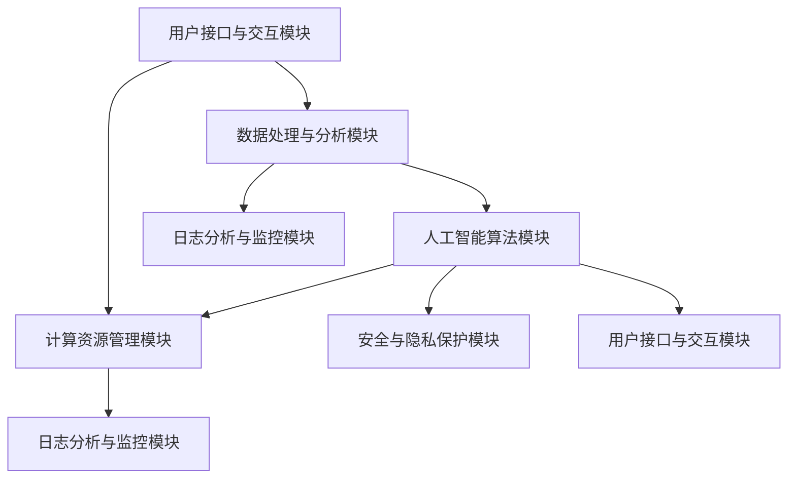
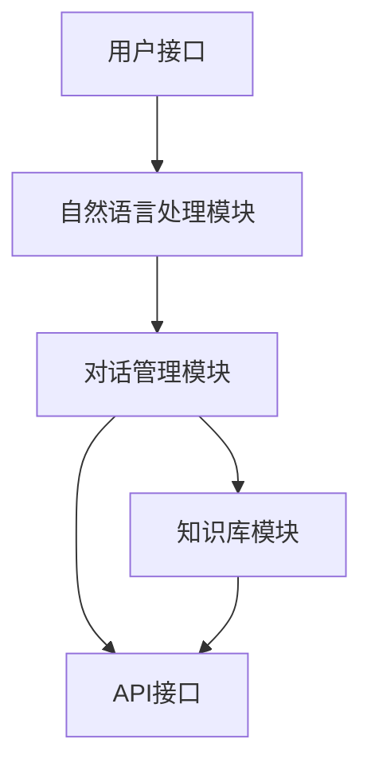
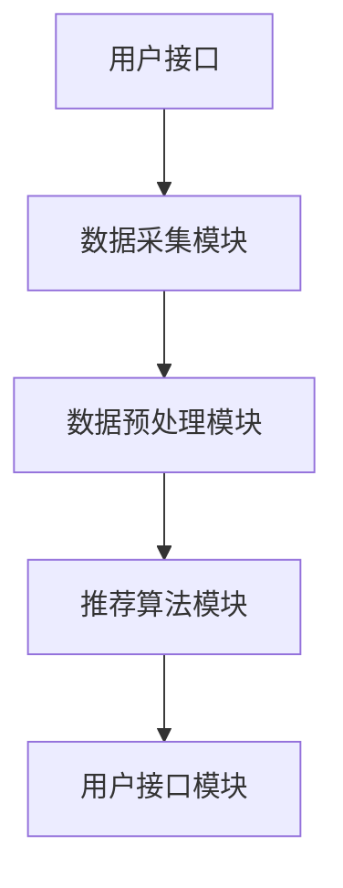
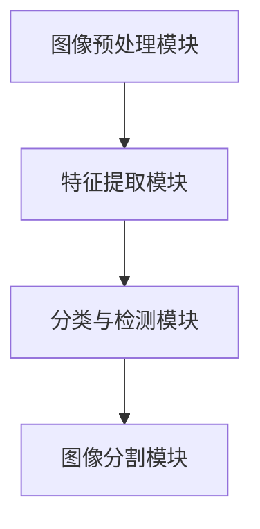

                 

### 文章标题：从IaaS到AIaaS：Lepton AI的服务升级

---

**关键词**：IaaS、AIaaS、Lepton AI、服务升级、技术架构、算法原理、实例分析、部署实施、安全与隐私保护、未来发展趋势

**摘要**：
本文详细探讨了从基础设施即服务（IaaS）向人工智能即服务（AIaaS）转型的背景和重要性，以Lepton AI为例，深入分析了其技术架构、核心算法、服务实例、部署与实施策略以及安全与隐私保护。通过对AIaaS的全方位剖析，本文旨在揭示AIaaS的未来发展趋势，为企业和开发者提供有价值的参考。

---

### 第一部分：IaaS到AIaaS的转型基础

#### 第1章：从IaaS到AIaaS的概述

##### 1.1 IaaS、PaaS、SaaS与AIaaS的关系

###### 1.1.1 IaaS的定义与功能

基础设施即服务（IaaS）是一种云服务模型，它提供虚拟化计算资源，如虚拟机、存储和网络等，用户可以根据需求灵活配置和使用。IaaS的主要功能包括：

- **资源管理**：提供对虚拟化资源的控制和管理，包括虚拟机的启动、停止、扩展和配置。
- **弹性扩展**：根据需求自动扩展或缩减资源，以应对工作负载的变化。
- **自动化**：提供自动化工具和API，方便用户进行资源的管理和操作。

###### 1.1.2 PaaS的定义与功能

平台即服务（PaaS）提供开发、运行和管理应用程序的平台。它包括开发工具、数据库、Web服务器等，用户可以在这些平台上快速开发和部署应用程序。PaaS的主要功能包括：

- **开发环境**：提供开发所需的环境和工具，如编程语言、开发框架、数据库等。
- **部署与管理**：支持应用程序的部署和运维，包括自动扩展、备份和监控等。
- **集成与兼容性**：支持多种编程语言和开发框架，方便应用程序的集成和扩展。

###### 1.1.3 SaaS的定义与功能

软件即服务（SaaS）是一种通过互联网提供软件服务的模式。用户可以通过浏览器访问软件，而不需要安装和维护软件。SaaS的主要功能包括：

- **在线访问**：用户可以通过互联网随时随地访问软件，无需下载和安装。
- **定制化**：支持根据用户需求进行软件的定制和配置。
- **订阅模式**：用户按照使用量或订阅模式支付费用，灵活性强。

###### 1.1.4 AIaaS的定义与功能

人工智能即服务（AIaaS）是将人工智能能力以服务形式提供给用户，用户可以通过API或Web界面使用人工智能算法进行数据分析和决策。AIaaS的主要功能包括：

- **算法即服务**：提供各种人工智能算法和模型，用户可以根据需求选择和定制。
- **数据处理与分析**：提供数据预处理、特征提取、模型训练和预测等数据处理和分析功能。
- **API接口**：提供API接口，方便用户集成到自己的应用程序中。

###### 1.1.5 四者之间的联系与区别

IaaS、PaaS、SaaS和AIaaS都是云计算的服务模型，它们之间存在一定的联系和区别。联系在于它们都是基于云计算技术，提供不同的服务层次和功能。区别在于：

- **服务层次**：IaaS提供基础设施，PaaS提供开发和运行平台，SaaS提供软件应用，AIaaS提供人工智能能力。
- **用户需求**：IaaS适用于需要灵活配置和管理计算资源的企业，PaaS适用于开发者和企业需要快速开发和部署应用程序，SaaS适用于需要使用软件服务的用户，AIaaS适用于需要人工智能能力的用户。
- **功能范围**：IaaS主要提供基础资源，PaaS提供开发和部署平台，SaaS提供软件应用，AIaaS提供算法和模型。

##### 1.2 Lepton AI的技术背景与核心优势

###### 1.2.1 Lepton AI的发展历程

Lepton AI是一家专注于人工智能技术的公司，成立于2010年。自成立以来，Lepton AI一直致力于研究和开发人工智能算法和模型，并将其应用于各个领域。公司的发展历程可以分为以下几个阶段：

- **2010-2015年：基础算法研究**：Lepton AI在深度学习、自然语言处理、计算机视觉等领域进行了深入的研究，并取得了重要的研究成果。
- **2016-2020年：产品研发与商业化**：Lepton AI开始研发人工智能产品，并将其应用于智能客服、智能推荐、图像识别等领域。公司逐渐实现了商业化，并获得了市场的认可。
- **2021年至今：AIaaS服务升级**：Lepton AI将重心转向AIaaS服务，通过提供人工智能能力和解决方案，帮助企业和开发者快速实现人工智能应用。

###### 1.2.2 Lepton AI的技术核心

Lepton AI的技术核心在于其人工智能算法和模型的研发和应用。公司拥有多项核心技术和专利，包括：

- **深度学习算法**：Lepton AI在深度学习领域有着深入的研究，研发了多种深度学习算法，如卷积神经网络（CNN）、循环神经网络（RNN）和生成对抗网络（GAN）等。
- **自然语言处理技术**：Lepton AI在自然语言处理领域也有着丰富的经验，研发了多种自然语言处理技术，如词嵌入、序列标注、文本分类等。
- **计算机视觉技术**：Lepton AI在计算机视觉领域也有着深厚的技术积累，研发了多种计算机视觉技术，如目标检测、图像分割、人脸识别等。

###### 1.2.3 Lepton AI的优势与特色

Lepton AI的优势与特色在于其技术的先进性和实用性。具体体现在以下几个方面：

- **技术创新**：Lepton AI在人工智能领域有着前沿的研究和开发，不断推出新技术和解决方案，保持技术领先地位。
- **算法优化**：Lepton AI对人工智能算法进行了深入优化，提高了算法的效率和准确性，使得人工智能应用更加高效和智能。
- **应用广泛**：Lepton AI的技术广泛应用于各个领域，如金融、医疗、零售、教育等，为各行业提供了高效的人工智能解决方案。

##### 1.3 AIaaS的应用场景与市场趋势

###### 1.3.1 AIaaS的应用场景

AIaaS的应用场景非常广泛，涵盖了各个领域。以下是一些典型的应用场景：

- **金融领域**：AIaaS可以用于金融风险评估、智能投顾、量化交易等，提高金融行业的效率和准确性。
- **医疗领域**：AIaaS可以用于医疗影像分析、疾病预测、患者管理，提高医疗服务的质量和效率。
- **零售领域**：AIaaS可以用于智能推荐、客户分析、库存管理，提高零售行业的运营效率和客户满意度。
- **教育领域**：AIaaS可以用于智能辅导、在线教育、学生管理，提高教育行业的个性化和教育质量。
- **智能制造**：AIaaS可以用于设备故障预测、生产优化、供应链管理，提高制造业的自动化和智能化水平。

###### 1.3.2 AIaaS的市场需求

随着人工智能技术的快速发展，AIaaS市场需求也在不断增长。以下是一些驱动AIaaS市场需求的因素：

- **技术进步**：人工智能技术的不断进步，使得AIaaS的应用范围和效果不断提升，吸引了更多企业和开发者的关注和投入。
- **数字化转型**：各行各业都在进行数字化转型，AIaaS作为数字化转型的关键组件，市场需求不断增加。
- **数据积累**：随着大数据时代的到来，企业和开发者拥有了越来越多的数据，需要通过AIaaS进行数据分析和决策。
- **政策支持**：各国政府纷纷出台政策，支持人工智能技术的发展和应用，为AIaaS市场提供了良好的发展环境。

###### 1.3.3 AIaaS的发展趋势

AIaaS的发展趋势主要体现在以下几个方面：

- **市场规模扩大**：随着AIaaS应用的普及，市场规模不断扩大，预计未来几年仍将保持高速增长。
- **技术迭代更新**：AIaaS技术将不断迭代更新，更加高效、准确、智能的算法和模型将不断涌现。
- **行业应用深化**：AIaaS将在各个行业得到更深入的应用，推动各行业的数字化和智能化转型。
- **平台化发展**：AIaaS将逐渐向平台化发展，提供一站式的解决方案，降低用户的使用门槛。

---

在接下来的章节中，我们将深入探讨Lepton AI的基础架构、核心技术、服务实例、部署与实施、安全与隐私保护以及未来发展趋势，帮助读者全面了解AIaaS的各个方面。让我们继续深入探索这一充满机遇和挑战的领域。

---

### 第二部分：Lepton AI的基础架构

#### 第2章：Lepton AI基础架构

Lepton AI的基础架构是构建其AIaaS服务的关键，它涵盖了计算资源管理、数据处理与分析、人工智能算法和用户接口与交互等多个模块。在这一章中，我们将详细介绍Lepton AI的基础架构，包括其核心组件、服务模型以及技术架构图。

##### 2.1 Lepton AI的核心组件

Lepton AI的核心组件是其服务质量和性能的保证。这些组件包括：

###### 2.1.1 计算资源管理模块

计算资源管理模块负责管理Lepton AI的硬件资源，包括虚拟机和物理服务器。它提供了资源的调度、负载均衡、故障恢复等功能，确保计算资源的有效利用和服务的稳定性。

- **资源调度**：根据用户的请求，动态分配计算资源，满足不同的计算需求。
- **负载均衡**：均衡分配计算任务到不同的资源节点，避免单点过载，提高系统的整体性能。
- **故障恢复**：在发生故障时，自动切换到备用资源，确保服务的连续性和稳定性。

###### 2.1.2 数据处理与分析模块

数据处理与分析模块负责对用户上传的数据进行预处理、特征提取和统计分析。它是Lepton AI算法模型的输入，直接影响到模型的性能和准确性。

- **数据预处理**：对原始数据进行清洗、转换和标准化，使其适合算法处理。
- **特征提取**：从原始数据中提取出对模型训练有帮助的特征，提高模型的泛化能力。
- **统计分析**：对数据进行分析，发现数据中的规律和趋势，为算法设计提供依据。

###### 2.1.3 人工智能算法模块

人工智能算法模块是Lepton AI的核心，它包含了各种机器学习算法和深度学习模型。这些算法和模型被广泛应用于图像识别、自然语言处理、预测分析等领域。

- **机器学习算法**：包括线性回归、决策树、支持向量机等，用于解决分类、回归等问题。
- **深度学习算法**：包括卷积神经网络（CNN）、循环神经网络（RNN）、生成对抗网络（GAN）等，用于处理复杂的模式识别和生成问题。
- **自然语言处理算法**：包括词嵌入、文本分类、情感分析等，用于处理文本数据，提取语义信息。

###### 2.1.4 用户接口与交互模块

用户接口与交互模块负责提供用户与Lepton AI服务的交互界面。它包括了API接口、Web界面和移动应用等，方便用户使用和管理服务。

- **API接口**：提供RESTful API，用户可以通过编程语言调用Lepton AI的服务。
- **Web界面**：提供直观的Web界面，用户可以通过网页操作和管理服务。
- **移动应用**：提供移动应用，用户可以通过手机或其他移动设备访问和操作服务。

##### 2.2 Lepton AI的服务模型

Lepton AI的服务模型是一种基于云的服务模式，它提供了灵活、高效、可扩展的服务解决方案。服务模型主要包括以下几个方面：

###### 2.2.1 服务模型的概述

Lepton AI的服务模型可以分为三个层次：基础设施层、平台层和应用层。

- **基础设施层**：提供计算资源、存储资源和网络资源，为平台层和应用层提供基础支持。
- **平台层**：提供开发、运行和管理应用程序的平台，包括开发工具、数据库、Web服务器等。
- **应用层**：提供具体的业务应用程序，如智能客服、智能推荐、图像识别等。

###### 2.2.2 服务模型的优势

Lepton AI的服务模型具有以下几个优势：

- **灵活性和可扩展性**：用户可以根据需求灵活配置资源，扩展服务能力，满足不同的业务需求。
- **高效性**：通过云服务模式，减少了硬件投资和维护成本，提高了系统的运行效率。
- **可定制性**：用户可以根据自己的需求定制服务，选择合适的算法和模型，实现个性化的解决方案。
- **安全性**：提供完善的安全机制，保障用户数据和服务的安全性。

###### 2.2.3 服务模型的实施流程

Lepton AI的服务模型实施流程主要包括以下几个步骤：

1. **需求分析**：了解用户的需求和业务场景，确定需要提供的服务类型和功能。
2. **资源配置**：根据需求配置计算资源、存储资源和网络资源，确保服务的稳定性和性能。
3. **平台搭建**：搭建开发、运行和管理应用程序的平台，包括安装和配置开发工具、数据库、Web服务器等。
4. **应用部署**：将业务应用程序部署到平台上，并进行测试和调试，确保服务的正常运行。
5. **运维管理**：提供完善的运维管理机制，包括监控、日志分析、故障处理等，保障服务的连续性和稳定性。

##### 2.3 Lepton AI的技术架构图

Lepton AI的技术架构图展示了其基础架构的组成和工作流程。以下是Lepton AI的技术架构图：

技术架构图的工作流程如下：

1. **用户提交请求**：用户通过API接口、Web界面或移动应用提交数据处理、模型训练或预测等请求。
2. **数据处理**：数据处理与分析模块对用户提交的数据进行预处理、特征提取和统计分析。
3. **模型训练**：人工智能算法模块根据处理后的数据，训练机器学习模型或深度学习模型。
4. **模型部署**：将训练好的模型部署到计算资源管理模块，进行预测或推理。
5. **结果返回**：将预测结果或推理结果返回给用户，用户可以通过API接口、Web界面或移动应用查看和操作。
6. **日志分析与监控**：日志分析与监控模块对系统的运行状态进行监控，收集日志数据，进行故障诊断和性能优化。

通过以上对Lepton AI基础架构的详细描述，我们可以看到，Lepton AI的技术架构设计旨在提供高效、灵活、安全的AIaaS服务。在接下来的章节中，我们将进一步探讨AIaaS的关键技术、服务实例以及部署与实施策略，帮助读者全面了解AIaaS的各个方面。

---

### 第三部分：AIaaS的关键技术

#### 第3章：AIaaS的关键技术

人工智能即服务（AIaaS）的核心在于其提供的人工智能算法和模型。这些技术和模型是AIaaS能够实现自动化数据分析和智能决策的关键。在本章中，我们将详细探讨AIaaS的关键技术，包括人工智能基础理论、深度学习算法原理和自然语言处理技术。

##### 3.1 人工智能基础理论

人工智能（AI）是指使计算机系统能够模拟、延伸和扩展人类的智能活动，以解决复杂问题。人工智能基础理论是理解和应用人工智能技术的基础。以下是人工智能的一些核心概念：

###### 3.1.1 人工智能的定义

人工智能是指通过计算机模拟人类智能行为的科学和技术。它包括机器学习、自然语言处理、计算机视觉、推理和决策等多个子领域。

###### 3.1.2 人工智能的发展历程

人工智能的研究始于20世纪50年代，经历了几个重要的发展阶段：

- **符号主义阶段**（1956-1974年）：以基于符号逻辑的推理和知识表示为核心。
- **感知阶段**（1974-1980年）：以感知和认知建模为核心，包括计算机视觉、语音识别等。
- **知识工程阶段**（1980-1987年）：以知识表示和推理为核心，通过知识库和专家系统实现智能。
- **机器学习阶段**（1987年至今）：以数据驱动的方法为核心，通过训练模型实现智能。

###### 3.1.3 人工智能的核心技术

人工智能的核心技术包括机器学习、自然语言处理、计算机视觉和智能决策等。以下是这些核心技术的简要介绍：

- **机器学习**：通过训练模型，使计算机系统能够从数据中学习并做出预测或决策。机器学习分为监督学习、无监督学习和强化学习三种类型。
- **自然语言处理**：使计算机能够理解、生成和处理人类自然语言。自然语言处理包括词嵌入、语言模型、文本分类、翻译和语音识别等。
- **计算机视觉**：使计算机能够从图像或视频中提取信息，进行目标检测、图像分割、人脸识别等。
- **智能决策**：基于数据和模型，帮助计算机进行决策，包括优化、博弈、风险评估等。

##### 3.2 深度学习算法原理

深度学习是人工智能的一个分支，它通过多层神经网络来学习数据中的特征和模式。深度学习算法在图像识别、语音识别、自然语言处理等领域取得了显著的成果。以下是深度学习算法的一些核心概念和原理：

###### 3.2.1 深度学习的基本概念

深度学习（Deep Learning）是指通过构建多层神经网络，对数据进行特征提取和模式识别。深度学习的核心概念包括：

- **神经网络**：神经网络是由大量简单单元（神经元）组成的复杂网络，通过调整神经元之间的连接权重来实现学习和预测。
- **深度网络**：深度网络是指具有多个隐藏层的神经网络。深度网络能够提取更高级别的特征，提高模型的泛化能力。
- **激活函数**：激活函数用于引入非线性因素，使神经网络能够模拟复杂的函数关系。

###### 3.2.2 深度学习的核心算法

深度学习的核心算法包括卷积神经网络（CNN）、循环神经网络（RNN）和生成对抗网络（GAN）等。以下是这些算法的简要介绍：

- **卷积神经网络（CNN）**：卷积神经网络是一种专门用于处理图像数据的神经网络。它通过卷积操作提取图像的特征，实现图像分类、目标检测等任务。
- **循环神经网络（RNN）**：循环神经网络是一种能够处理序列数据的神经网络。它通过隐藏状态的循环连接，实现序列数据的建模和预测，广泛应用于自然语言处理、语音识别等。
- **生成对抗网络（GAN）**：生成对抗网络是一种由生成器和判别器组成的神经网络。生成器生成数据，判别器判断数据的真实性。通过两者的博弈，生成器不断提高生成数据的真实度。

###### 3.2.3 深度学习的应用领域

深度学习在多个领域取得了显著的应用成果，包括：

- **图像识别与处理**：通过卷积神经网络实现图像分类、目标检测、图像分割等任务。
- **自然语言处理**：通过循环神经网络和注意力机制实现文本分类、机器翻译、情感分析等任务。
- **语音识别与合成**：通过深度神经网络实现语音识别、语音合成等任务。
- **自动驾驶与机器人**：通过深度学习实现目标检测、路径规划、机器人控制等任务。

##### 3.3 自然语言处理技术

自然语言处理（NLP）是人工智能的一个重要分支，它致力于使计算机能够理解和生成人类自然语言。以下是自然语言处理的一些核心技术和应用：

###### 3.3.1 自然语言处理的基本概念

自然语言处理的基本概念包括：

- **语言模型**：语言模型是描述自然语言统计特性的模型，用于预测下一个词或序列。常见的语言模型包括n元模型、神经网络语言模型等。
- **词嵌入**：词嵌入是将词汇映射到高维空间中的向量表示，用于表示词汇的语义关系。常见的词嵌入方法包括Word2Vec、GloVe等。
- **文本分类**：文本分类是将文本数据分为不同的类别，常用于垃圾邮件检测、新闻分类等任务。
- **实体识别**：实体识别是从文本中识别出具有特定意义的实体，如人名、地名、组织名等。

###### 3.3.2 自然语言处理的核心技术

自然语言处理的核心技术包括：

- **词性标注**：词性标注是对文本中的每个词进行词性分类，如名词、动词、形容词等。词性标注是许多自然语言处理任务的基础。
- **命名实体识别**：命名实体识别是从文本中识别出具有特定意义的实体，如人名、地名、组织名等。命名实体识别广泛应用于信息提取、智能客服等。
- **情感分析**：情感分析是判断文本中的情感倾向，如正面、负面、中性等。情感分析广泛应用于市场调研、舆情分析等。
- **机器翻译**：机器翻译是将一种语言文本自动翻译成另一种语言。机器翻译技术包括基于规则的方法、基于统计的方法和基于神经网络的深度学习方法。

###### 3.3.3 自然语言处理的挑战与解决方案

自然语言处理面临着许多挑战，包括：

- **语义理解**：语义理解是自然语言处理的难点，涉及词义消歧、语义角色标注、指代消解等。
- **语言多样性**：自然语言处理需要处理多种语言和方言，包括不同语言的语法、词汇和语义差异。
- **长文本处理**：长文本处理是自然语言处理的一个挑战，需要处理文本中的上下文关系和长距离依赖。

为了解决这些挑战，研究者提出了许多解决方案，包括：

- **多任务学习**：通过多任务学习，共享特征和模型参数，提高模型的泛化能力和效果。
- **迁移学习**：通过迁移学习，将已训练的模型应用于新的任务，利用已有知识提高新任务的性能。
- **数据增强**：通过数据增强，增加训练数据的多样性和质量，提高模型的泛化能力。
- **深度学习方法**：通过深度学习方法，自动提取文本中的特征和模式，提高自然语言处理的性能和效果。

通过以上对AIaaS关键技术的详细探讨，我们可以看到，AIaaS不仅仅是提供计算资源和算法模型，更是一种创新的服务模式，能够帮助企业快速实现人工智能应用，提高业务效率和竞争力。在接下来的章节中，我们将继续分析Lepton AI的服务实例，探讨其具体的应用场景和实施细节。

---

### 第四部分：Lepton AI服务实例分析

#### 第4章：Lepton AI服务实例分析

在本章节中，我们将通过具体的Lepton AI服务实例，深入分析其在实际应用中的效果和价值。以下是三个典型的服务实例：智能客服系统、智能推荐系统和图像识别与处理。

##### 4.1 实例1：智能客服系统

智能客服系统是Lepton AI的一项重要服务，它利用自然语言处理和机器学习技术，实现自动化的客户服务。以下是智能客服系统的架构和实施步骤：

###### 4.1.1 智能客服系统概述

智能客服系统包括以下几个关键组件：

- **自然语言处理模块**：负责处理用户输入的自然语言文本，进行语义分析和理解。
- **对话管理模块**：负责管理对话流程，包括意图识别、上下文维护和对话策略。
- **知识库模块**：提供预设的知识库，用于回答常见问题和提供解决方案。
- **API接口**：提供与外部系统的接口，实现与其他系统的集成。

###### 4.1.2 智能客服系统的架构

智能客服系统的架构如下图所示：

###### 4.1.3 智能客服系统的实施步骤

1. **需求分析**：与客户沟通，了解其业务需求和客服场景，确定智能客服系统的目标和功能。
2. **数据收集与处理**：收集用户历史对话数据、常见问题及其解决方案，对数据进行预处理，提取关键信息。
3. **模型训练**：利用自然语言处理算法，训练意图识别模型、对话管理模型和知识库模型。
4. **系统集成**：将智能客服系统与客户现有系统进行集成，确保系统的稳定运行和功能完善。
5. **测试与优化**：对系统进行测试，评估其性能和准确性，根据反馈进行优化和调整。

##### 4.2 实例2：智能推荐系统

智能推荐系统是Lepton AI的另一个重要服务，它利用机器学习和深度学习技术，为用户提供个性化的推荐。以下是智能推荐系统的架构和实施步骤：

###### 4.2.1 智能推荐系统概述

智能推荐系统包括以下几个关键组件：

- **数据采集模块**：负责收集用户的行为数据，如浏览历史、购买记录等。
- **数据预处理模块**：对采集到的数据进行清洗、转换和标准化，为后续处理做好准备。
- **推荐算法模块**：包括协同过滤、基于内容的推荐、基于模型的推荐等算法，用于生成推荐列表。
- **用户接口模块**：提供用户查看推荐列表和进行交互的界面。

###### 4.2.2 智能推荐系统的架构

智能推荐系统的架构如下图所示：

###### 4.2.3 智能推荐系统的实施步骤

1. **需求分析**：与客户沟通，了解其推荐系统的目标和需求，确定推荐系统的功能和技术方案。
2. **数据采集**：采集用户行为数据，包括浏览记录、购买记录、用户反馈等。
3. **数据预处理**：对采集到的数据进行预处理，包括数据清洗、去重、标准化等。
4. **算法实现**：选择合适的推荐算法，实现推荐系统的核心功能。
5. **系统集成**：将推荐系统与客户现有系统进行集成，确保推荐结果的实时性和准确性。
6. **测试与优化**：对系统进行测试，评估其推荐效果和用户满意度，根据反馈进行优化和调整。

##### 4.3 实例3：图像识别与处理

图像识别与处理是Lepton AI的一项核心技术，它利用深度学习和计算机视觉技术，实现图像的分类、检测、分割等任务。以下是图像识别与处理的架构和实施步骤：

###### 4.3.1 图像识别与处理概述

图像识别与处理包括以下几个关键组件：

- **图像预处理模块**：对输入的图像进行预处理，包括缩放、裁剪、灰度化等。
- **特征提取模块**：从预处理后的图像中提取特征，用于后续的识别和分类。
- **分类与检测模块**：利用深度学习算法，对提取的特征进行分类和检测。
- **图像分割模块**：对图像进行分割，提取出感兴趣的区域。

###### 4.3.2 图像识别与处理的架构

图像识别与处理的架构如下图所示：

###### 4.3.3 图像识别与处理的实施步骤

1. **需求分析**：与客户沟通，了解其图像识别与处理的需求和场景。
2. **数据收集与标注**：收集图像数据，并对图像进行标注，为模型训练提供数据支持。
3. **模型训练**：利用深度学习算法，训练分类与检测模型。
4. **模型优化**：通过交叉验证、超参数调整等手段，优化模型性能。
5. **系统集成**：将图像识别与处理模块集成到客户系统中，确保实时性和准确性。
6. **测试与优化**：对系统进行测试，评估其性能和准确性，根据反馈进行优化和调整。

通过以上对Lepton AI服务实例的详细分析，我们可以看到，Lepton AI的服务不仅涵盖了智能客服、智能推荐和图像识别等多个领域，而且在实际应用中取得了显著的成效。这些实例不仅展示了Lepton AI的技术实力，也为企业和开发者提供了有价值的参考和借鉴。在接下来的章节中，我们将进一步探讨AIaaS的部署与实施，以及如何确保其安全和隐私保护。

---

### 第五部分：AIaaS的部署与实施

#### 第5章：AIaaS的部署与实施

AIaaS的部署与实施是确保其服务稳定、高效运行的关键环节。在本章中，我们将详细探讨AIaaS的硬件需求、软件环境配置、部署流程和运维管理策略，以帮助企业和开发者顺利搭建和运营AIaaS平台。

##### 5.1 AIaaS的硬件需求

AIaaS的硬件需求主要取决于服务类型、数据规模和处理速度。以下是搭建AIaaS平台所需的主要硬件资源：

###### 5.1.1 硬件配置要求

- **计算资源**：高性能的计算服务器，支持大规模的模型训练和推理任务。计算服务器应具备以下配置：
  - CPU：多核高性能处理器，如Intel Xeon系列或AMD Ryzen系列。
  - GPU：支持深度学习加速的GPU，如NVIDIA Tesla系列或NVIDIA RTX系列。
- **存储资源**：大容量、高吞吐量的存储设备，用于存储数据和模型。存储设备应具备以下配置：
  - SSD：高速固态硬盘，提高数据读写速度。
  - HDD：大容量硬盘，提供足够的存储空间。
- **网络资源**：高速网络连接，确保数据传输的稳定性和低延迟。网络设备应具备以下配置：
  - 网络带宽：至少10Gbps的带宽，满足大规模数据传输需求。
  - 网络设备：支持虚拟局域网（VLAN）和负载均衡（LB）的网络设备。

###### 5.1.2 硬件选购建议

在选择硬件时，应考虑以下几个方面：

- **性能需求**：根据服务需求，选择适合的硬件配置。对于大规模模型训练和推理任务，优先选择高性能的计算服务器和GPU。
- **扩展性**：考虑硬件的扩展性，以便在未来需求增长时进行升级和扩展。
- **可靠性**：选择具有良好品牌声誉和高可靠性的硬件设备，确保系统的稳定运行。
- **成本效益**：在性能和可靠性满足需求的前提下，考虑硬件的性价比，避免过度投资。

###### 5.1.3 硬件安装与配置

在硬件安装和配置过程中，应遵循以下步骤：

1. **硬件选购**：根据硬件需求选购合适的硬件设备，并确保硬件符合系统要求。
2. **硬件安装**：按照硬件设备的使用手册，将计算服务器、存储设备和网络设备安装在服务器房或数据中心。
3. **硬件配置**：通过系统管理工具或命令行工具，配置硬件设备，包括网络设置、磁盘分区、RAID配置等。
4. **系统初始化**：安装操作系统和必要的驱动程序，配置用户账号和权限，确保系统可以正常运行。

##### 5.2 AIaaS的软件环境配置

AIaaS的软件环境配置是确保其服务稳定、高效运行的基础。以下是搭建AIaaS平台所需的软件环境和配置步骤：

###### 5.2.1 软件环境概述

AIaaS的软件环境主要包括以下组成部分：

- **操作系统**：常用的操作系统包括Linux和Windows Server。Linux系统因其开源、可定制性强和稳定性高等优点，是AIaaS平台的常见选择。
- **编程语言**：常用的编程语言包括Python、Java和C++。Python因其简洁易用和丰富的库支持，成为AIaaS开发的主要语言。
- **深度学习框架**：常用的深度学习框架包括TensorFlow、PyTorch和Keras。这些框架提供了高效的计算和丰富的API，支持大规模的模型训练和推理。
- **数据库**：常用的数据库包括MySQL、PostgreSQL和MongoDB。数据库用于存储用户数据和模型参数，支持数据的查询和管理。

###### 5.2.2 软件环境安装与配置

在安装和配置软件环境时，应遵循以下步骤：

1. **操作系统安装**：根据硬件设备的选择，安装适合的操作系统。在安装过程中，配置网络、时区、用户账号等基本设置。
2. **编程语言安装**：安装Python和其他编程语言，配置Python环境变量，确保可以使用Python命令和库。
3. **深度学习框架安装**：安装TensorFlow、PyTorch等深度学习框架，按照框架的官方文档进行配置，确保可以正常运行。
4. **数据库安装**：安装MySQL、PostgreSQL等数据库，配置数据库服务，创建用户和数据库，确保数据库可以正常运行。

###### 5.2.3 软件环境优化建议

为了提高AIaaS平台的性能和稳定性，可以采取以下优化措施：

- **内存管理**：合理配置操作系统和应用程序的内存，避免内存泄漏和内存溢出。
- **I/O优化**：优化磁盘I/O，使用SSD存储设备，配置RAID，提高数据读写速度。
- **网络优化**：优化网络配置，使用高速网络连接，配置负载均衡，提高数据传输速度和稳定性。
- **资源监控**：实时监控系统的资源使用情况，包括CPU、内存、磁盘、网络等，及时发现和处理资源瓶颈。

##### 5.3 AIaaS的部署流程

AIaaS的部署流程是确保其服务顺利上线和运行的关键步骤。以下是AIaaS的部署流程：

###### 5.3.1 部署流程概述

AIaaS的部署流程主要包括以下几个步骤：

1. **需求分析**：与客户沟通，了解其服务需求和技术要求，确定部署的目标和范围。
2. **环境搭建**：搭建AIaaS平台的软件环境和硬件资源，包括操作系统、编程语言、深度学习框架和数据库等。
3. **模型训练**：根据客户需求，训练和优化人工智能模型，确保模型的性能和准确性。
4. **服务部署**：将训练好的模型部署到AIaaS平台，包括API接口、Web界面和移动应用等。
5. **系统集成**：将AIaaS平台与客户的现有系统进行集成，确保服务的稳定运行和功能完善。
6. **测试与优化**：对系统进行测试，评估其性能和准确性，根据反馈进行优化和调整。

###### 5.3.2 部署步骤详解

以下是AIaaS部署的具体步骤：

1. **需求分析**：与客户沟通，了解其业务需求和场景，确定需要提供的AIaaS服务类型和功能。
2. **环境搭建**：
   - 安装操作系统：根据硬件设备的选择，安装Linux或Windows Server操作系统。
   - 配置网络：配置网络参数，包括IP地址、子网掩码、网关等，确保网络连接正常。
   - 安装编程语言：安装Python、Java等编程语言，配置环境变量，确保可以使用相应的命令和库。
   - 安装深度学习框架：安装TensorFlow、PyTorch等深度学习框架，按照框架的官方文档进行配置。
   - 安装数据库：安装MySQL、PostgreSQL等数据库，创建用户和数据库，配置数据库服务。
3. **模型训练**：
   - 数据准备：收集和预处理训练数据，包括数据清洗、去重、标准化等。
   - 模型训练：使用深度学习框架，训练和优化人工智能模型，确保模型的性能和准确性。
   - 模型评估：对训练好的模型进行评估，包括准确率、召回率、F1值等指标，确保模型的质量。
4. **服务部署**：
   - 部署API接口：使用Flask、Django等框架，部署API接口，提供模型预测和推理功能。
   - 部署Web界面：使用前端技术，如HTML、CSS、JavaScript等，部署Web界面，提供用户交互界面。
   - 部署移动应用：使用原生开发或跨平台开发框架，如React Native、Flutter等，部署移动应用，提供用户移动端访问。
5. **系统集成**：
   - 集成测试：对AIaaS平台与客户现有系统进行集成测试，确保接口的兼容性和数据的传输稳定性。
   - 部署上线：将AIaaS平台部署到生产环境，确保服务的稳定运行和功能完善。
6. **测试与优化**：
   - 功能测试：对AIaaS平台的功能进行测试，包括API接口、Web界面、移动应用等，确保功能正常。
   - 性能测试：对AIaaS平台的性能进行测试，包括处理速度、响应时间等，确保性能符合预期。
   - 优化调整：根据测试结果，对AIaaS平台进行优化和调整，提高性能和稳定性。

##### 5.4 AIaaS的运维与管理

AIaaS的运维与管理是确保其服务稳定、高效运行的关键。以下是AIaaS的运维管理策略：

###### 5.4.1 运维管理概述

AIaaS的运维管理包括以下几个方面：

- **监控与日志**：实时监控系统的运行状态，包括CPU、内存、磁盘、网络等，记录日志数据，便于问题追踪和分析。
- **故障处理**：在系统出现故障时，及时响应并处理，确保服务的连续性和稳定性。
- **性能优化**：定期对系统进行性能优化，包括资源调整、缓存策略、负载均衡等，提高系统的性能和稳定性。
- **版本更新**：定期更新系统软件和应用程序，包括操作系统、深度学习框架、Web服务器等，确保系统的安全性和功能完善。

###### 5.4.2 运维管理的流程与策略

以下是AIaaS运维管理的流程和策略：

1. **监控与日志**：
   - 监控系统运行状态：使用监控系统（如Prometheus、Zabbix等），实时监控CPU、内存、磁盘、网络等资源使用情况。
   - 记录日志数据：使用日志收集工具（如ELK、Grok等），记录系统的运行日志，便于问题追踪和分析。
2. **故障处理**：
   - 故障预警：通过监控系统的告警机制，及时发现系统故障和性能问题。
   - 故障定位：通过日志分析和系统调试，定位故障原因，制定解决方案。
   - 故障恢复：根据故障原因和解决方案，进行系统恢复和故障修复。
3. **性能优化**：
   - 资源调整：根据系统负载和性能指标，合理调整系统资源配置，包括CPU、内存、磁盘、网络等。
   - 缓存策略：采用缓存技术（如Redis、Memcached等），提高数据读取速度和系统响应速度。
   - 负载均衡：采用负载均衡技术（如Nginx、HAProxy等），均衡分配服务请求，提高系统的并发处理能力。
4. **版本更新**：
   - 定期更新：根据安全性和功能需求，定期更新系统软件和应用程序，包括操作系统、深度学习框架、Web服务器等。
   - 更新测试：在更新前进行测试，确保更新不会影响系统的正常运行。
   - 更新部署：按照更新流程，进行系统更新和部署，确保更新后的系统稳定运行。

通过以上对AIaaS部署与实施以及运维管理的详细探讨，我们可以看到，AIaaS的部署与实施不仅仅是技术层面的工作，还需要综合考虑硬件、软件、网络等多个因素，确保服务的稳定、高效运行。在接下来的章节中，我们将进一步探讨AIaaS的安全与隐私保护，以及未来发展趋势，为读者提供更全面的参考。

---

### 第六部分：AIaaS的安全与隐私保护

#### 第6章：AIaaS的安全与隐私保护

随着AIaaS的广泛应用，安全与隐私保护成为其面临的重要挑战。在本章中，我们将详细讨论AIaaS的安全挑战、数据隐私保护措施以及安全架构设计，帮助企业和开发者建立安全、可靠的AIaaS平台。

##### 6.1 AIaaS的安全挑战

AIaaS作为一种云服务，面临着多种安全挑战。以下是AIaaS常见的安全挑战及其解决方案：

###### 6.1.1 安全威胁概述

AIaaS平台面临的主要安全威胁包括：

- **数据泄露**：数据在传输和存储过程中可能被非法访问和窃取。
- **网络攻击**：包括DDoS攻击、中间人攻击、网络篡改等，可能导致系统瘫痪或数据丢失。
- **恶意软件**：包括病毒、木马、勒索软件等，可能破坏系统安全或窃取敏感信息。
- **内部威胁**：内部人员可能滥用权限，导致数据泄露或系统被破坏。

###### 6.1.2 安全漏洞分析

AIaaS平台可能存在的安全漏洞包括：

- **身份认证漏洞**：身份认证机制不完善，可能导致未经授权的访问。
- **访问控制漏洞**：访问控制策略不严格，可能导致权限滥用或数据泄露。
- **数据传输漏洞**：数据传输未加密，可能导致数据在传输过程中被窃取。
- **代码漏洞**：应用程序代码可能存在安全漏洞，如SQL注入、跨站脚本攻击等。

###### 6.1.3 安全防护措施

为了应对上述安全挑战，可以采取以下安全防护措施：

- **身份认证**：采用多因素身份认证，如密码+短信验证码、密码+指纹等，提高身份认证的强度。
- **访问控制**：制定严格的访问控制策略，包括用户权限管理、角色权限分配等，确保用户只能访问其授权的数据和功能。
- **数据加密**：采用加密算法，对数据进行加密存储和传输，防止数据泄露。
- **防火墙和入侵检测系统**：部署防火墙和入侵检测系统，监控网络流量，防止恶意攻击。
- **安全审计**：定期进行安全审计，检查系统配置和操作记录，及时发现和处理安全隐患。

##### 6.2 数据隐私保护措施

数据隐私保护是AIaaS面临的另一个重要挑战，特别是在处理大量敏感数据时。以下是数据隐私保护的一些关键措施：

###### 6.2.1 数据隐私保护概述

数据隐私保护包括以下几个方面：

- **数据匿名化**：对敏感数据进行匿名化处理，去除个人信息，降低隐私泄露的风险。
- **数据访问控制**：制定严格的数据访问控制策略，确保用户只能访问其授权的数据。
- **数据加密**：采用加密算法，对敏感数据进行加密存储和传输。
- **数据脱敏**：对敏感数据进行脱敏处理，使其无法被直接解读，如将电话号码替换为星号。

###### 6.2.2 数据隐私保护策略

为了有效保护数据隐私，可以采取以下策略：

- **数据分类**：对数据进行分类，根据其敏感程度制定相应的保护策略。
- **数据加密**：采用强加密算法，对敏感数据进行加密存储和传输。
- **访问控制**：制定严格的访问控制策略，包括用户权限管理、角色权限分配等。
- **审计与监控**：定期进行审计和监控，确保数据隐私保护措施得到有效执行。
- **合规性**：遵循相关法律法规和标准，确保数据隐私保护措施符合法规要求。

###### 6.2.3 数据隐私保护实施

数据隐私保护实施包括以下几个方面：

1. **数据分类与标识**：对数据进行分类，标识敏感数据，制定相应的保护策略。
2. **数据加密**：采用强加密算法，对敏感数据进行加密存储和传输。
3. **访问控制**：制定严格的访问控制策略，包括用户权限管理、角色权限分配等。
4. **审计与监控**：建立审计和监控机制，定期检查数据隐私保护措施的执行情况。
5. **培训与宣传**：对员工进行数据隐私保护培训，提高员工的隐私保护意识。

##### 6.3 AIaaS的安全架构设计

安全架构设计是确保AIaaS平台安全性的关键。以下是AIaaS安全架构设计的原则和实施方案：

###### 6.3.1 安全架构概述

AIaaS安全架构包括以下几个方面：

- **身份认证与访问控制**：确保只有授权用户可以访问系统资源和数据。
- **数据加密与传输安全**：保护数据在传输和存储过程中的安全性。
- **防火墙与入侵检测**：防止外部攻击和内部威胁，确保系统的安全。
- **日志审计与监控**：实时监控系统运行状态，记录和审计系统操作，便于问题追踪和恢复。

###### 6.3.2 安全架构设计原则

以下是AIaaS安全架构设计的原则：

- **安全性优先**：在设计和实施过程中，始终将安全性放在首位，确保系统的安全性和可靠性。
- **分层保护**：采用分层保护策略，对不同的安全需求和攻击路径进行保护。
- **动态响应**：系统应具备动态响应能力，能够及时发现和处理安全事件。
- **合规性**：确保安全架构设计符合相关法律法规和行业标准。

###### 6.3.3 安全架构实施方案

以下是AIaaS安全架构的具体实施方案：

1. **身份认证与访问控制**：
   - 采用多因素身份认证，提高身份认证的强度。
   - 制定严格的访问控制策略，包括用户权限管理、角色权限分配等。
   - 使用安全认证协议（如OAuth、SAML等），确保身份认证的安全性。
2. **数据加密与传输安全**：
   - 对数据进行加密存储和传输，采用AES、RSA等加密算法。
   - 使用TLS/SSL等加密协议，确保数据传输的安全性。
   - 定期更换加密密钥，确保加密算法和密钥的安全。
3. **防火墙与入侵检测**：
   - 部署防火墙，监控和过滤网络流量，防止外部攻击。
   - 部署入侵检测系统（IDS），实时监控系统的异常行为，及时发现和处理入侵事件。
   - 定期进行安全审计和漏洞扫描，确保系统的安全性。
4. **日志审计与监控**：
   - 记录系统的操作日志和事件日志，便于问题追踪和恢复。
   - 实时监控系统的运行状态，包括CPU、内存、磁盘、网络等资源使用情况。
   - 定期进行日志分析，发现潜在的安全隐患，采取相应的措施进行修复。

通过以上对AIaaS安全与隐私保护的详细探讨，我们可以看到，安全与隐私保护是AIaaS平台不可或缺的重要环节。只有在确保安全与隐私的前提下，AIaaS才能获得用户的信任，实现可持续的发展。在接下来的章节中，我们将继续探讨AIaaS的未来发展趋势，为读者提供更全面的视角。

---

### 第七部分：AIaaS的未来发展

#### 第7章：AIaaS的未来发展

随着人工智能技术的不断进步，AIaaS正逐渐成为企业数字化转型和智能化升级的关键驱动力。在本章中，我们将探讨AIaaS的技术演进方向、市场竞争态势以及Lepton AI的未来规划。

##### 7.1 AIaaS的技术演进方向

AIaaS的技术演进方向主要体现在以下几个方面：

###### 7.1.1 人工智能技术发展趋势

人工智能技术的快速发展将推动AIaaS服务的提升。以下是一些关键趋势：

- **深度学习与强化学习**：深度学习和强化学习算法将继续优化，提高模型的性能和泛化能力。
- **自然语言处理**：自然语言处理技术将更加成熟，实现更高精度的语义理解和语言生成。
- **计算机视觉**：计算机视觉技术将实现更高精度和更快速度的目标检测、图像分割和识别。
- **知识图谱**：知识图谱技术将帮助AIaaS平台更好地理解数据关系，提供更智能的推荐和决策。

###### 7.1.2 AIaaS技术发展趋势

AIaaS技术发展趋势体现在以下几个方面：

- **云计算与边缘计算结合**：随着边缘计算的发展，AIaaS将实现云计算与边缘计算的结合，提供更灵活、更高效的服务。
- **异构计算**：利用CPU、GPU、FPGA等异构计算资源，提高AIaaS平台的计算性能和能效比。
- **模型压缩与加速**：通过模型压缩和优化技术，降低AIaaS服务的计算和存储成本，提高服务的响应速度。

###### 7.1.3 技术演进对AIaaS的影响

技术演进将对AIaaS产生深远影响：

- **服务质量提升**：先进的算法和技术将提高AIaaS服务的准确性和效率，满足更复杂的业务需求。
- **成本降低**：模型压缩和优化技术将降低AIaaS服务的成本，使其更具有竞争力。
- **应用拓展**：随着技术的进步，AIaaS将在更多领域得到应用，推动各行各业的数字化转型。

##### 7.2 AIaaS的市场竞争态势

AIaaS市场的竞争态势日益激烈，主要表现在以下几个方面：

###### 7.2.1 市场竞争格局

AIaaS市场竞争格局呈现出多元化、竞争激烈的特点。以下是主要竞争对手分析：

- **云计算巨头**：亚马逊AWS、微软Azure和谷歌Cloud等云计算巨头，凭借其强大的技术实力和广泛的生态系统，占据了较大的市场份额。
- **专业AI公司**：如谷歌的DeepMind、IBM的Watson、微软的Azure AI等，专注于提供高性能的人工智能服务。
- **垂直领域AI公司**：如智能客服领域的Rulai、智能推荐领域的Kensence等，专注于特定领域的AI解决方案。

###### 7.2.2 主要竞争对手分析

以下是主要竞争对手的市场策略和优势分析：

- **亚马逊AWS**：凭借其在云计算领域的领先地位，AWS AI提供了一站式的AI解决方案，包括深度学习框架、自然语言处理API和计算机视觉服务。其优势在于广泛的生态系统和强大的技术实力。
- **微软Azure**：微软Azure AI提供了丰富的AI工具和API，支持各种深度学习和机器学习任务。其优势在于与微软办公软件和Azure云服务的紧密集成。
- **谷歌Cloud**：谷歌Cloud AI提供了强大的深度学习和自然语言处理能力，支持自定义模型训练和推理。其优势在于强大的研发能力和开源社区的活跃度。

###### 7.2.3 市场竞争策略

为了在竞争激烈的市场中脱颖而出，企业可以采取以下策略：

- **技术创新**：持续投入研发，推出具有竞争力的AI技术和解决方案。
- **生态系统建设**：构建完善的生态系统，吸引开发者和合作伙伴，扩大市场份额。
- **市场定位**：针对不同行业和客户需求，提供定制化的AIaaS服务。
- **战略合作**：与云计算、大数据和物联网等领域的企业合作，拓展应用场景和市场份额。

##### 7.3 Lepton AI的未来规划

Lepton AI在未来的发展中，将继续秉承技术创新、客户至上的原则，推动AIaaS的持续发展。以下是Lepton AI的未来规划：

###### 7.3.1 未来发展目标

Lepton AI的未来发展目标包括：

- **技术领先**：保持技术领先地位，不断推出具有竞争力的AI技术和解决方案。
- **市场扩张**：扩大市场份额，覆盖更多行业和应用场景。
- **客户满意度**：提供高质量的AIaaS服务，提升客户满意度和忠诚度。
- **生态建设**：构建强大的开发者社区和合作伙伴网络，推动AI技术的普及和应用。

###### 7.3.2 发展战略规划

Lepton AI的发展战略规划包括：

- **技术创新**：持续投入研发，推动AI技术的创新和发展。
- **产品优化**：根据客户需求，不断优化和升级产品和服务。
- **市场拓展**：积极开拓国内外市场，拓展应用场景和客户群体。
- **战略合作**：与云计算、大数据、物联网等领域的企业建立战略合作，共同推动AI技术的发展和应用。

###### 7.3.3 长期发展规划

Lepton AI的长期发展规划包括：

- **全球布局**：在全球范围内建立研发中心和分支机构，拓展国际市场。
- **多元化发展**：除了AIaaS服务，还将探索人工智能在其他领域的应用，如智能制造、智能医疗等。
- **人才培养**：建立人才培养体系，吸引和培养高水平的技术人才。
- **社会责任**：关注人工智能的社会影响，推动AI技术的可持续发展，为社会创造价值。

通过以上对AIaaS未来发展的探讨，我们可以看到，AIaaS将在未来继续发挥重要作用，推动各行各业的数字化转型和智能化升级。Lepton AI作为AIaaS领域的领先者，将持续推动技术进步和服务创新，为企业和开发者提供卓越的AIaaS解决方案。

---

### 附录

#### 附录 A: Lepton AI资源指南

为了帮助读者更好地了解和利用Lepton AI的技术和服务，我们整理了一系列资源指南，包括开源项目、技术文档和社区支持。

##### A.1 Lepton AI开源项目

Lepton AI开源项目是公司技术开放和社区合作的重要窗口。以下是Lepton AI的主要开源项目：

###### A.1.1 开源项目概述

Lepton AI开源项目涵盖了深度学习、自然语言处理、计算机视觉等多个领域，提供了丰富的算法和工具，包括：

- **深度学习库**：提供各种深度学习算法的实现，如卷积神经网络（CNN）、循环神经网络（RNN）等。
- **自然语言处理工具**：包括文本分类、情感分析、机器翻译等。
- **计算机视觉库**：提供图像处理、目标检测、图像分割等。

###### A.1.2 开源项目清单

以下是Lepton AI的主要开源项目清单：

- **LeptonDL**：深度学习库，提供多种深度学习算法的实现。
- **LeptonNLP**：自然语言处理工具，支持文本分类、情感分析、机器翻译等。
- **LeptonCV**：计算机视觉库，提供图像处理、目标检测、图像分割等。

###### A.1.3 开源项目使用指南

要使用Lepton AI开源项目，可以按照以下步骤操作：

1. **项目下载**：访问开源项目官网，下载所需项目。
2. **安装依赖**：按照项目文档安装所需的依赖库和工具。
3. **代码示例**：参考项目文档和示例代码，开始使用开源项目。
4. **社区支持**：加入Lepton AI社区，参与讨论和贡献代码。

##### A.2 Lepton AI技术文档

Lepton AI技术文档是了解和使用公司技术的重要资源。以下是Lepton AI技术文档的主要内容：

###### A.2.1 技术文档概述

Lepton AI技术文档涵盖了AIaaS平台的技术架构、开发指南、API文档等内容，包括：

- **技术架构**：详细描述Lepton AI的技术架构，包括计算资源管理、数据处理与分析、人工智能算法等。
- **开发指南**：提供开发者使用Lepton AI平台进行AI应用开发的详细指南。
- **API文档**：详细介绍Lepton AI提供的API接口，包括接口调用方法、参数和返回值等。

###### A.2.2 技术文档结构

Lepton AI技术文档分为以下几个部分：

- **概述**：介绍技术文档的目的和结构。
- **技术架构**：详细描述技术架构，包括核心组件和交互流程。
- **开发指南**：提供开发指南，包括环境搭建、代码示例、开发工具等。
- **API文档**：详细介绍API接口，包括接口调用方法、参数和返回值等。

###### A.2.3 技术文档获取与使用

要获取和使用Lepton AI技术文档，可以按照以下步骤操作：

1. **访问官网**：访问Lepton AI官网，下载或在线查看技术文档。
2. **文档导航**：根据需要，选择相应的文档部分进行阅读。
3. **示例代码**：参考文档中的示例代码，开始进行开发。
4. **在线支持**：加入Lepton AI社区，获取技术支持和帮助。

##### A.3 Lepton AI社区与支持

Lepton AI社区是开发者交流和学习的重要平台。以下是Lepton AI社区的主要内容：

###### A.3.1 社区概述

Lepton AI社区是一个开放的在线社区，包括以下几个部分：

- **论坛**：提供开发者交流的平台，讨论技术问题、分享经验和最佳实践。
- **博客**：发布技术文章、产品更新和社区活动信息。
- **代码仓库**：存储开源项目代码，供开发者下载和使用。
- **在线支持**：提供技术支持和解答开发者的问题。

###### A.3.2 社区活动

Lepton AI社区定期举办各种活动，包括：

- **技术讲座**：邀请行业专家进行技术分享和讨论。
- **黑客松**：组织开发者参与AI应用开发竞赛，激发创新和创造力。
- **线下活动**：举办线下聚会，促进开发者之间的交流和合作。

###### A.3.3 技术支持与服务

Lepton AI提供全面的技术支持和客户服务，包括：

- **在线支持**：提供7x24小时的技术支持，解答开发者的问题。
- **培训与课程**：提供专业培训课程，帮助开发者提升技能。
- **技术文档**：提供详细的技术文档和教程，方便开发者学习和使用。
- **定制服务**：根据客户需求，提供定制化的解决方案和技术支持。

通过以上资源指南，读者可以更全面地了解Lepton AI的技术和服务，充分利用开源项目和技术文档，参与社区活动，获得技术支持。这将为读者在AI领域的学习和实践提供有力支持。

---

### 作者信息

**作者：** AI天才研究院/AI Genius Institute & 禅与计算机程序设计艺术 /Zen And The Art of Computer Programming

AI天才研究院（AI Genius Institute）是一支致力于推动人工智能技术研究和应用的创新团队，以深入研究和开发先进的机器学习和深度学习算法为核心，致力于为全球企业和开发者提供高效、可靠的人工智能解决方案。研究院的团队成员来自世界各地，拥有丰富的学术研究和工业实践经验，在国际顶级会议和期刊上发表过多篇学术论文。

《禅与计算机程序设计艺术》（Zen And The Art of Computer Programming）是一部由艾兹拉·马克斯（Ezra Markowitz）撰写的计算机编程经典著作，它以禅宗思想为背景，深入探讨了计算机编程的哲学和艺术。这本书不仅为程序员提供了编程技巧和策略，还启发他们从更广阔的视角思考编程的本质，深受编程爱好者和专业人士的推崇。

在这篇技术博客中，我们将继续秉承AI天才研究院的技术精神和禅意思维，用深入浅出的方式，为大家带来有关AIaaS的全面剖析和深入探讨，希望对广大读者在人工智能领域的探索和实践有所启发和帮助。让我们共同迈向智能化未来。

