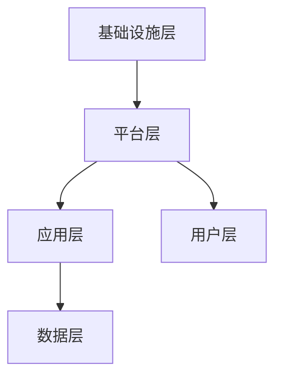
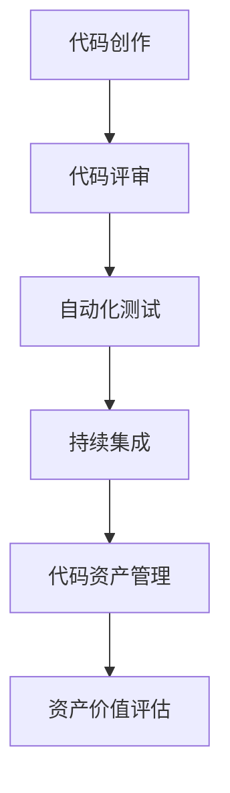

                 

### 《从代码到资产：程序员的财富之路》

> **关键词**：程序员，财富，资产化，代码，管理，持续集成

> **摘要**：
本文旨在探讨程序员的财富之路，即如何将代码转化为具有实际价值的资产。通过深入分析代码的价值、角色转变、技术资产化方法，以及实践案例，文章将揭示程序员如何通过技术资产化实现财富积累。同时，文章还展望了技术资产化的未来趋势和挑战，为程序员提供职业发展新方向。

#### 第一部分：理解代码与资产的关系

在信息技术迅猛发展的今天，程序员不仅仅是编写代码的工程师，更是无形资产的创造者。代码作为一种重要的智力成果，其价值不仅体现在开发过程中，更在于其能够转化为可量化的资产。然而，如何实现这一转变，如何将代码转化为财富，这是每一个程序员都应思考的问题。

首先，我们需要明确代码与资产之间的联系。代码是程序员智力劳动的产物，它具有可复制性、可扩展性和可升级性等特点。这些特性使得代码可以脱离个人而存在，成为一种可以交易的资产。代码资产化，即是通过一定的方法和技术，将代码转化为具有经济价值的资产，从而实现程序员的财富积累。

接下来，我们将探讨程序员角色在这一过程中的转变。从开发者到资产管理者，程序员需要具备新的技能和思维方式。此外，我们还将介绍代码资产化的方法与策略，包括代码模块化、质量与性能优化、安全性与合规性等方面。通过这些策略，程序员可以提升代码的价值，实现资产的积累和增值。

#### 第一部分：理解代码与资产的关系

### 第1章：从代码到资产的转变

在本章中，我们将探讨代码资产化的概念、过程及其重要性。代码资产化不仅仅是将代码打包出售，更是通过一系列技术和管理手段，提升代码的价值，使其成为可交易的资产。

#### 1.1 代码的价值评估

代码的价值在于其功能、质量、复用性和可持续性。一个优秀的代码库不仅能够实现预期的功能，还能够在后续的维护和升级中节省大量时间和成本。因此，对代码的价值进行评估是代码资产化的第一步。

1. **功能评估**：代码的功能是否符合需求，是否能够稳定运行，这是评估代码价值的基础。
2. **质量评估**：代码的编写是否符合编程规范，是否有冗余和错误，这是保证代码质量的关键。
3. **复用性评估**：代码的可复用性越高，其价值也就越大。一个良好的代码库应该包含可复用的模块和组件。
4. **可持续性评估**：代码的可维护性和可扩展性，即代码在未来能否适应新的需求和技术变革。

#### 1.2 程序员的角色转变

在传统的软件开发模式中，程序员主要关注代码的编写和实现。然而，在代码资产化的过程中，程序员的角色发生了转变。他们不仅需要编写高质量的代码，还需要具备以下能力：

1. **资产管理能力**：程序员需要学会如何管理代码资产，包括版本控制、代码审查、自动化测试等。
2. **市场需求分析**：程序员需要了解市场需求，将代码资产与市场相结合，实现其价值最大化。
3. **商业模式设计**：程序员需要具备商业模式设计的思维，将代码资产转化为商业产品或服务。

#### 1.3 代码资产化的方法与策略

代码资产化的方法与策略多种多样，以下是其中几种常见的策略：

1. **代码模块化与复用**：通过模块化和复用，可以提高代码的利用率，减少重复劳动，提升代码的价值。
2. **代码质量与性能优化**：优秀的代码质量和高性能是实现代码资产化的关键。程序员需要通过代码审查、性能测试等方法，不断提升代码的质量和性能。
3. **代码安全性与合规性**：随着信息安全意识的提升，代码的安全性和合规性也成为了资产化的重要因素。程序员需要遵循相关的安全标准和法规，确保代码的安全性。
4. **代码商业化**：将代码转化为商业产品或服务，是代码资产化的重要途径。程序员可以通过开源、定制开发、授权使用等方式，实现代码的商业化。

通过以上方法与策略，程序员可以有效地实现代码资产化，从而实现财富的积累和增值。

### 第一部分：理解代码与资产的关系

### 第1章：从代码到资产的转变

在现代社会，信息技术飞速发展，程序员已经成为不可或缺的人才。然而，程序员如何从自己的劳动成果——代码中创造财富，这是一个值得探讨的问题。本章将深入探讨代码资产化的概念、过程及其重要性，以及程序员在这一过程中的角色转变。

#### 1.1 代码的价值评估

代码作为程序员智力劳动的产物，其价值可以从多个维度进行评估。首先，代码的功能性是评估其价值的基础。一个具有良好功能的代码库可以满足用户需求，解决实际问题。其次，代码的质量直接影响到其价值。高质量的代码不仅能够保证软件的稳定性和可靠性，还能够减少后续维护成本。此外，代码的复用性和可持续性也是评估其价值的重要指标。一个具有高度复用性和可持续性的代码库可以在不同的项目和环境中得到广泛应用，从而提高其整体价值。

代码的价值评估方法主要包括以下几种：

1. **功能评估**：通过实际运行代码，验证其是否能够实现预期的功能。这包括对代码的全面测试，以确保其功能的完整性和正确性。

2. **质量评估**：对代码的编写质量进行评估，包括代码的可读性、规范性、可维护性和可扩展性。常用的方法包括代码审查、静态代码分析和代码质量度量。

3. **复用性评估**：评估代码的可复用性，即代码模块是否可以在不同的项目中重复使用。这需要分析代码的通用性和适用性。

4. **可持续性评估**：评估代码在未来是否能够适应新的需求和技术变革。这包括对代码的可维护性和可扩展性的评估。

数学模型和数学公式在代码价值评估中也有重要作用。例如，可以使用以下公式对代码的质量进行评分：

$$
\text{代码质量评分} = w_1 \times \text{功能得分} + w_2 \times \text{质量得分} + w_3 \times \text{复用性得分} + w_4 \times \text{可持续性得分}
$$

其中，$w_1, w_2, w_3, w_4$ 分别为功能、质量、复用性和可持续性的权重。这些权重可以根据具体项目的要求进行调整。

举例说明，假设有一个代码库，其功能得分为90分，质量得分为85分，复用性得分为80分，可持续性得分为75分，我们可以使用上述公式计算出其代码质量评分为：

$$
\text{代码质量评分} = 0.3 \times 90 + 0.2 \times 85 + 0.2 \times 80 + 0.3 \times 75 = 83.5
$$

根据评分结果，我们可以对代码库的价值有一个初步的了解。高评分的代码库往往具有较高的经济价值，值得进一步开发和推广。

#### 1.2 程序员的角色转变

在代码资产化的过程中，程序员的角色发生了显著转变。传统上，程序员的工作主要集中在代码的编写和调试上。然而，随着信息技术的发展，程序员需要具备更广泛的知识和技能，以应对新的挑战。

1. **资产管理能力**：程序员需要掌握版本控制、代码审查、自动化测试等资产管理技能。这些技能有助于确保代码的质量和一致性，提高开发效率。

2. **市场需求分析**：程序员需要了解市场需求，将代码资产与市场相结合，实现其价值最大化。这要求程序员具备市场敏感性和商业洞察力。

3. **商业模式设计**：程序员需要具备商业模式设计的能力，将代码资产转化为商业产品或服务。这包括了解用户需求、市场定位、定价策略等。

4. **团队协作**：在代码资产化的过程中，程序员需要与团队成员紧密合作，共同推进项目。这要求程序员具备良好的沟通能力和团队协作精神。

此外，程序员还需要不断学习和更新知识，以适应新技术和新需求。只有不断学习和进步，程序员才能在代码资产化的道路上走得更远。

#### 1.3 代码资产化的方法与策略

代码资产化的方法与策略多种多样，以下是其中几种常见的策略：

1. **代码模块化与复用**：通过模块化和复用，可以提高代码的利用率，减少重复劳动，提升代码的价值。具体方法包括编写可复用的函数、类和模块，以及使用设计模式等。

2. **代码质量与性能优化**：优秀的代码质量和高性能是实现代码资产化的关键。程序员可以通过代码审查、性能测试等方法，不断提升代码的质量和性能。具体策略包括代码重构、性能优化、内存管理等。

3. **代码安全性与合规性**：随着信息安全意识的提升，代码的安全性和合规性也成为了资产化的重要因素。程序员需要遵循相关的安全标准和法规，确保代码的安全性。具体方法包括使用安全的编程实践、进行安全测试等。

4. **代码商业化**：将代码转化为商业产品或服务，是代码资产化的重要途径。程序员可以通过开源、定制开发、授权使用等方式，实现代码的商业化。具体策略包括市场调研、产品定位、营销推广等。

通过以上方法与策略，程序员可以有效地实现代码资产化，从而实现财富的积累和增值。

### 第二部分：技术资产化的实践

在理解了代码与资产的关系，以及程序员角色转变之后，我们接下来将探讨如何通过具体的技术和实践来实现代码资产化。这一部分将详细讨论版本控制与代码管理、自动化测试与代码审查、持续集成与交付，以及资产管理平台的搭建。

#### 第二部分：技术资产化的实践

### 第2章：技术资产化的核心技术与工具

技术资产化不仅仅是理论上的探讨，更需要通过实际的技术和实践来实现。本章将介绍实现代码资产化的核心技术与工具，包括版本控制与代码管理、自动化测试与代码审查、持续集成与交付，以及资产管理平台的搭建。这些技术和工具将帮助我们提升代码的质量、效率和安全性，从而实现代码资产的价值最大化。

#### 2.1 版本控制与代码管理

版本控制是代码资产化的基础，它可以帮助我们追踪代码的变更历史，确保代码的版本一致性，以及提高团队合作效率。Git是目前最流行的版本控制系统之一，其强大的功能使得代码管理变得更加简单和高效。

##### 2.1.1 Git的基本操作

Git的基本操作包括初始化仓库、克隆仓库、创建分支、合并分支、提交更改等。以下是Git的一些基本操作步骤：

1. **初始化仓库**：在本地创建一个新的Git仓库，可以使用命令 `git init`。
2. **克隆仓库**：将远程仓库克隆到本地，可以使用命令 `git clone <仓库地址>`。
3. **创建分支**：在开发过程中，为了保持主分支的稳定性，我们可以创建一个新的分支，使用命令 `git checkout -b <分支名>`。
4. **合并分支**：完成功能开发后，将分支合并到主分支，使用命令 `git merge <分支名>`。
5. **提交更改**：在本地完成代码更改后，需要将更改提交到Git仓库，使用命令 `git commit -m "提交信息"`。
6. **推送更改**：将本地的更改推送至远程仓库，使用命令 `git push`。

##### 2.1.2 GitFlow模型与GitLab CI

GitFlow是一种常用的分支模型，它将代码的分支分为几个不同的阶段，包括主分支（Master）、开发分支（Develop）和特性分支（Feature）。GitFlow模型能够帮助我们更好地管理代码的变更和发布流程。

1. **主分支（Master）**：主分支包含了当前稳定的生产代码，所有代码的合并和发布都会在这里进行。
2. **开发分支（Develop）**：开发分支包含了最新的开发代码，所有新功能都会在这里进行开发和集成。
3. **特性分支（Feature）**：特性分支用于开发新的功能或修复bug，每个特性分支都是独立的，完成开发后可以合并到开发分支。

GitLab CI是GitLab内置的持续集成工具，它能够自动执行代码的构建、测试和部署。通过配置`.gitlab-ci.yml`文件，我们可以定义构建、测试和部署的流程，GitLab CI会根据配置自动执行这些任务。

例如，以下是一个简单的`.gitlab-ci.yml`文件配置：

```yaml
stages:
  - build
  - test
  - deploy

build:
  stage: build
  script:
    - npm install
    - npm run build

test:
  stage: test
  script:
    - npm test

deploy:
  stage: deploy
  script:
    - npm run deploy
  only:
    - master
```

在这个配置文件中，我们定义了三个阶段：构建、测试和部署。只有在主分支（master）上提交的代码才会触发部署流程。

##### 2.1.3 持续集成与持续交付(CI/CD)

持续集成（CI）和持续交付（CD）是现代软件开发中不可或缺的部分。CI/CD能够自动化构建、测试和部署流程，从而提高开发效率和质量。

1. **持续集成（CI）**：持续集成是指将开发过程中的代码更改自动集成到一个共享的代码库中，并进行构建和测试。通过CI，我们可以确保每次代码变更都能顺利集成，并及早发现潜在的问题。

2. **持续交付（CD）**：持续交付是指将经过CI测试的代码自动部署到生产环境。通过CD，我们可以实现快速迭代和部署，从而缩短发布周期。

常见的CI/CD工具包括Jenkins、GitLab CI、Travis CI等。以下是一个使用Jenkins的简单示例：

```shell
$ jenkins -s /path/to/jenkins # 启动Jenkins服务
$ cat /path/to/config.xml # 配置Jenkins任务
<project>
  <actions>
    <hudson.scm.SCMHeaderAnnotation>
      <注解>自动构建</注解>
    </hudson.scm.SCMHeaderAnnotation>
  </actions>
  <description>这是一个简单的Jenkins构建任务</description>
  <properties>
    <hudson.model.Build perpetrators>system</hudson.model.Build perpetrators>
    <hudson.triggers.SCMTrigger>
      <schedule>*/5 * * * *</schedule>
    </hudson.triggers.SCMTrigger>
  </properties>
  <scm class="hudson.scm	git.SCM">
    <userRemoteConfig>
      <configuredSCMRemote>
        <url>https://github.com/your_username/your_project.git</url>
        <credentialsId>your_credentials_id</credentialsId>
      </configuredSCMRemote>
    </userRemoteConfig>
    <locations>
      <hudson.scm.RepositoryLocation>
        <url>https://github.com/your_username/your_project.git</url>
      </hudson.scm.RepositoryLocation>
    </locations>
  </scm>
  <canRoam>false</canRoam>
  <disabled>false</disabled>
</project>
```

在这个配置文件中，我们定义了一个简单的Jenkins任务，它会每隔5分钟自动从GitHub仓库中拉取最新的代码，并进行构建和测试。

#### 2.2 自动化测试与代码审查

自动化测试和代码审查是确保代码质量和稳定性的重要手段。通过自动化测试，我们可以快速发现代码中的缺陷和问题，提高开发效率。代码审查则可以确保代码编写符合规范，减少错误和漏洞。

##### 2.2.1 单元测试与集成测试

单元测试是最基本的测试形式，它针对代码的独立功能进行测试。单元测试可以由开发人员编写，使用各种测试框架，如JUnit、TestNG、NUnit等。以下是JUnit的一个简单示例：

```java
import static org.junit.jupiter.api.Assertions.assertEquals;

public class CalculatorTest {
    @Test
    public void testAdd() {
        Calculator calculator = new Calculator();
        int result = calculator.add(2, 3);
        assertEquals(5, result);
    }
}
```

集成测试则是针对代码模块之间的交互进行测试，确保各个模块能够正确协同工作。集成测试通常由测试工程师编写，使用测试工具，如Selenium、JUnit等。

##### 2.2.2 测试框架与工具

测试框架和工具可以帮助我们更高效地编写和执行测试。以下是一些常用的测试框架和工具：

1. **JUnit**：JUnit是Java的单元测试框架，它提供了丰富的断言方法和测试注解。
2. **TestNG**：TestNG是另一个流行的测试框架，它提供了更多的功能，如参数化测试、依赖性测试等。
3. **Selenium**：Selenium是一个开源的Web自动化测试工具，它可以模拟用户的浏览器操作，进行功能测试和回归测试。
4. **JUnit-Mock**：JUnit-Mock是一个用于编写模拟测试的框架，它可以帮助我们隔离代码的依赖项，进行更纯粹的单元测试。

##### 2.2.3 代码审查机制

代码审查是一种通过团队协作来确保代码质量的方法。代码审查通常包括以下步骤：

1. **代码提交**：开发人员将代码提交到代码库，准备进行审查。
2. **审查请求**：代码库管理员或审查者发起审查请求，分配给相应的审查者。
3. **审查反馈**：审查者对代码进行审查，提出修改意见或建议。
4. **修改代码**：开发人员根据审查意见进行代码修改。
5. **再次审查**：审查者对修改后的代码进行再次审查，确保问题得到解决。

常见的代码审查工具有：

1. **GitLab**：GitLab提供了一个内置的代码审查功能，可以在代码提交时自动进行审查。
2. **Gerrit**：Gerrit是一个基于Git的代码审查和项目协作平台，它提供了强大的代码审查和管理功能。
3. **Phabricator**：Phabricator是一个开源的代码审查和项目管理工具，它支持多语言和多种版本控制系统。

#### 2.3 持续集成与交付

持续集成（CI）和持续交付（CD）是确保代码质量和快速迭代的重要手段。通过CI/CD，我们可以自动化构建、测试和部署流程，从而提高开发效率和质量。

##### 2.3.1 持续集成（CI）原理与实践

持续集成是指将开发过程中的代码更改自动集成到一个共享的代码库中，并进行构建和测试。CI的主要目标是确保每次代码变更都能顺利集成，并及早发现潜在的问题。

1. **CI原理**：CI的基本原理是将代码库中的每个提交都视为一个潜在的新版本，并将其集成到一个共享的环境中进行构建和测试。如果构建和测试通过，则提交被接受，否则将返回错误。

2. **CI实践**：在CI实践中，我们需要配置CI工具（如Jenkins、GitLab CI、Travis CI等）来执行以下任务：

   - **构建**：编译代码，生成可执行文件或库。
   - **测试**：运行单元测试、集成测试和回归测试，确保代码质量。
   - **部署**：将经过测试的代码部署到测试或生产环境。

   以下是一个使用GitLab CI的示例配置文件：

   ```yaml
   stages:
     - build
     - test
     - deploy

   build:
     stage: build
     script:
       - npm install
       - npm run build

   test:
     stage: test
     script:
       - npm test

   deploy:
     stage: deploy
     script:
       - npm run deploy
     only:
       - master
   ```

   在这个配置文件中，我们定义了三个阶段：构建、测试和部署。只有当代码提交到主分支（master）时，才会执行部署流程。

##### 2.3.2 持续交付（CD）流程与工具

持续交付是指将经过CI测试的代码自动部署到生产环境。通过CD，我们可以实现快速迭代和部署，从而缩短发布周期。

1. **CD原理**：CD的基本原理是将通过CI测试的代码自动部署到生产环境。CD可以分为以下几个阶段：

   - **容器化**：将应用程序打包到容器中，如Docker容器。
   - **镜像管理**：管理容器镜像的版本和控制。
   - **自动化部署**：根据预定的规则和策略，自动部署容器镜像到生产环境。

2. **CD工具**：常见的CD工具包括Jenkins、GitLab CI、Docker、Kubernetes等。

   - **Jenkins**：Jenkins是一个开源的持续集成和持续交付工具，它可以与Docker和Kubernetes集成，实现自动化的构建、测试和部署。
   - **GitLab CI**：GitLab CI是GitLab内置的持续集成工具，它可以通过配置`.gitlab-ci.yml`文件，实现自动化的构建、测试和部署。
   - **Docker**：Docker是一个开源的容器化平台，它可以将应用程序及其依赖项打包到容器中，实现环境的一致性和可移植性。
   - **Kubernetes**：Kubernetes是一个开源的容器编排平台，它可以帮助我们自动化容器的部署、扩展和管理。

##### 2.3.3 DevOps文化与团队协作

DevOps是一种软件开发和运营的实践方法，它强调开发和运维团队之间的紧密合作和沟通。通过DevOps，我们可以实现更快速、更可靠的软件交付。

1. **DevOps文化**：DevOps文化强调持续交付、自动化、团队合作和共享责任。它要求团队成员具备跨领域的技能和知识，能够共同解决复杂问题。

2. **团队协作**：在DevOps实践中，团队成员需要紧密协作，确保每个环节都能顺利进行。以下是一些团队协作的最佳实践：

   - **代码共享**：团队成员可以共享代码库，实现代码的集中管理和协作开发。
   - **自动化测试**：团队成员可以共同编写和执行测试，确保代码质量。
   - **自动化部署**：团队成员可以共同配置和执行自动化部署流程，实现快速迭代和交付。
   - **定期回顾**：团队成员可以定期进行回顾会议，总结经验教训，持续改进流程。

#### 2.4 资产管理平台搭建

资产管理平台是代码资产化的核心工具，它可以帮助我们集中管理代码资产，提高开发效率和代码质量。

##### 2.4.1 资产管理平台的需求分析

在搭建资产管理平台之前，我们需要进行需求分析，明确平台的功能和要求。以下是一些常见的需求分析内容：

1. **版本控制**：平台应支持Git等版本控制系统，实现代码的版本管理和协作开发。
2. **代码审查**：平台应支持代码审查功能，确保代码质量。
3. **自动化测试**：平台应支持自动化测试工具，实现代码的自动化测试和回归测试。
4. **持续集成**：平台应支持持续集成工具，实现代码的自动化构建、测试和部署。
5. **项目管理**：平台应支持项目管理功能，包括任务管理、bug跟踪和进度监控等。
6. **权限管理**：平台应支持权限管理功能，确保数据安全和团队协作。

##### 2.4.2 常见资产管理工具对比

目前市场上存在多种资产管理工具，以下是一些常见的资产管理工具及其特点：

1. **GitLab**：GitLab是一个开源的代码托管平台，它集成了版本控制、代码审查、自动化测试、持续集成和项目管理等功能。GitLab支持多种版本控制系统，如Git、Mercurial等，并且具有良好的社区支持和丰富的插件生态。

2. **GitHub**：GitHub是一个基于Git的代码托管平台，它提供了版本控制、代码审查、自动化测试、持续集成和项目管理等功能。GitHub拥有庞大的用户群体和丰富的开源项目资源，是开发者常用的代码托管平台之一。

3. **Jenkins**：Jenkins是一个开源的持续集成和持续交付工具，它可以帮助我们自动化构建、测试和部署流程。Jenkins可以与Git、Docker、Kubernetes等工具集成，实现复杂的工作流程和自动化部署。

4. **Travis CI**：Travis CI是一个基于云计算的持续集成平台，它支持多种编程语言和版本控制系统。Travis CI提供了免费的私有仓库支持，并且具有良好的社区支持和丰富的插件生态。

5. **Circle CI**：Circle CI是一个基于云计算的持续集成平台，它支持多种编程语言和版本控制系统。Circle CI提供了强大的自动化测试和部署功能，并且具有良好的性能和可扩展性。

##### 2.4.3 资产管理平台的技术架构

资产管理平台的技术架构可以分为以下几个层次：

1. **基础设施层**：包括服务器、网络、存储等基础设施，为平台提供计算和存储资源。

2. **平台层**：包括代码托管、代码审查、自动化测试、持续集成和项目管理等功能，为开发团队提供一站式的代码资产管理服务。

3. **应用层**：包括Web前端、API接口和后台服务，为用户提供友好的界面和强大的功能。

4. **数据层**：包括数据库、缓存、日志等数据存储组件，为平台提供数据存储和管理服务。

以下是一个简单的资产管理平台技术架构图：



在用户层，开发团队可以通过Web前端或API接口与平台交互，实现代码管理、测试、集成和部署等功能。平台层则负责处理用户的请求，调用相应的服务和功能，并将结果返回给用户层。

通过以上技术和工具，我们可以搭建一个高效的资产管理平台，实现代码的自动化管理和价值最大化。

### 第二部分：技术资产化的实践

在深入探讨了代码资产化的概念、程序员角色转变以及代码价值评估之后，我们接下来将转向技术资产化的实践。这一部分将详细讨论如何通过具体的技术工具和实践方法来实现代码资产化，包括版本控制与代码管理、自动化测试与代码审查、持续集成与交付，以及资产管理平台的搭建。

#### 第二部分：技术资产化的实践

### 第2章：技术资产化的核心技术与工具

实现代码资产化不仅需要理解代码的价值，还需要借助一系列技术工具和实践方法。本章将详细探讨如何利用版本控制与代码管理、自动化测试与代码审查、持续集成与交付，以及资产管理平台搭建来实现代码资产化。

#### 2.1 版本控制与代码管理

版本控制是代码资产化的基石，它允许我们追踪代码的变更历史，确保代码的版本一致性，并提高团队合作效率。Git是目前最流行的版本控制系统之一，其强大的功能和灵活性使得代码管理变得更加高效。

##### 2.1.1 Git的基本操作

Git的基本操作包括初始化仓库、克隆仓库、创建分支、合并分支、提交更改等。以下是Git的一些基本操作步骤：

1. **初始化仓库**：在本地创建一个新的Git仓库，可以使用命令 `git init`。
   ```shell
   $ git init
   ```
2. **克隆仓库**：将远程仓库克隆到本地，可以使用命令 `git clone <仓库地址>`。
   ```shell
   $ git clone https://github.com/your_username/repository.git
   ```
3. **创建分支**：在开发过程中，为了保持主分支的稳定性，我们可以创建一个新的分支，使用命令 `git checkout -b <分支名>`。
   ```shell
   $ git checkout -b feature/new_feature
   ```
4. **合并分支**：完成功能开发后，将分支合并到主分支，使用命令 `git merge <分支名>`。
   ```shell
   $ git merge feature/new_feature
   ```
5. **提交更改**：在本地完成代码更改后，需要将更改提交到Git仓库，使用命令 `git commit -m "提交信息"`。
   ```shell
   $ git commit -m "Add new feature"
   ```
6. **推送更改**：将本地的更改推送至远程仓库，使用命令 `git push`。
   ```shell
   $ git push origin main
   ```

##### 2.1.2 GitFlow模型与GitLab CI

GitFlow是一种常用的分支模型，它将代码的分支分为几个不同的阶段，包括主分支（Master）、开发分支（Develop）和特性分支（Feature）。GitFlow模型能够帮助我们更好地管理代码的变更和发布流程。

1. **主分支（Master）**：主分支包含了当前稳定的生产代码，所有代码的合并和发布都会在这里进行。
2. **开发分支（Develop）**：开发分支包含了最新的开发代码，所有新功能都会在这里进行开发和集成。
3. **特性分支（Feature）**：特性分支用于开发新的功能或修复bug，每个特性分支都是独立的，完成开发后可以合并到开发分支。

GitLab CI是GitLab内置的持续集成工具，它能够自动执行代码的构建、测试和部署。通过配置`.gitlab-ci.yml`文件，我们可以定义构建、测试和部署的流程，GitLab CI会根据配置自动执行这些任务。

以下是一个简单的`.gitlab-ci.yml`文件示例：

```yaml
stages:
  - build
  - test
  - deploy

build:
  stage: build
  script:
    - npm install
    - npm run build

test:
  stage: test
  script:
    - npm test

deploy:
  stage: deploy
  script:
    - npm run deploy
  only:
    - master
```

在这个配置文件中，我们定义了三个阶段：构建、测试和部署。只有当代码提交到主分支（master）时，才会执行部署流程。

##### 2.1.3 持续集成与持续交付(CI/CD)

持续集成（CI）和持续交付（CD）是现代软件开发中不可或缺的部分。通过CI/CD，我们可以自动化构建、测试和部署流程，从而提高开发效率和质量。

1. **持续集成（CI）**：持续集成是指将开发过程中的代码更改自动集成到一个共享的代码库中，并进行构建和测试。通过CI，我们可以确保每次代码变更都能顺利集成，并及早发现潜在的问题。

2. **持续交付（CD）**：持续交付是指将经过CI测试的代码自动部署到生产环境。通过CD，我们可以实现快速迭代和部署，从而缩短发布周期。

常见的CI/CD工具包括Jenkins、GitLab CI、Travis CI等。以下是一个使用Jenkins的简单示例：

```shell
$ jenkins -s /path/to/jenkins # 启动Jenkins服务
$ cat /path/to/config.xml # 配置Jenkins任务
<project>
  <actions>
    <hudson.scm.SCMHeaderAnnotation>
      <注解>自动构建</注解>
    </hudson.scm.SCMHeaderAnnotation>
  </actions>
  <description>这是一个简单的Jenkins构建任务</description>
  <properties>
    <hudson.model.Build perpetrators>system</hudson.model.Build perpetrators>
    <hudson.triggers.SCMTrigger>
      <schedule>*/5 * * * *</schedule>
    </hudson.triggers.SCMTrigger>
  </properties>
  <scm class="hudson.scm.git.SCM">
    <userRemoteConfig>
      <configuredSCMRemote>
        <url>https://github.com/your_username/your_project.git</url>
        <credentialsId>your_credentials_id</credentialsId>
      </configuredSCMRemote>
    </userRemoteConfig>
    <locations>
      <hudson.scm.RepositoryLocation>
        <url>https://github.com/your_username/your_project.git</url>
      </hudson.scm.RepositoryLocation>
    </locations>
  </scm>
  <canRoam>false</canRoam>
  <disabled>false</disabled>
</project>
```

在这个配置文件中，我们定义了一个简单的Jenkins任务，它会每隔5分钟自动从GitHub仓库中拉取最新的代码，并进行构建和测试。

#### 2.2 自动化测试与代码审查

自动化测试和代码审查是确保代码质量和稳定性的重要手段。通过自动化测试，我们可以快速发现代码中的缺陷和问题，提高开发效率。代码审查则可以确保代码编写符合规范，减少错误和漏洞。

##### 2.2.1 单元测试与集成测试

单元测试是最基本的测试形式，它针对代码的独立功能进行测试。单元测试可以由开发人员编写，使用各种测试框架，如JUnit、TestNG、NUnit等。以下是JUnit的一个简单示例：

```java
import static org.junit.jupiter.api.Assertions.assertEquals;

public class CalculatorTest {
    @Test
    public void testAdd() {
        Calculator calculator = new Calculator();
        int result = calculator.add(2, 3);
        assertEquals(5, result);
    }
}
```

集成测试则是针对代码模块之间的交互进行测试，确保各个模块能够正确协同工作。集成测试通常由测试工程师编写，使用测试工具，如Selenium、JUnit等。

##### 2.2.2 测试框架与工具

测试框架和工具可以帮助我们更高效地编写和执行测试。以下是一些常用的测试框架和工具：

1. **JUnit**：JUnit是Java的单元测试框架，它提供了丰富的断言方法和测试注解。
2. **TestNG**：TestNG是另一个流行的测试框架，它提供了更多的功能，如参数化测试、依赖性测试等。
3. **Selenium**：Selenium是一个开源的Web自动化测试工具，它可以模拟用户的浏览器操作，进行功能测试和回归测试。
4. **JUnit-Mock**：JUnit-Mock是一个用于编写模拟测试的框架，它可以帮助我们隔离代码的依赖项，进行更纯粹的单元测试。

##### 2.2.3 代码审查机制

代码审查是一种通过团队协作来确保代码质量的方法。代码审查通常包括以下步骤：

1. **代码提交**：开发人员将代码提交到代码库，准备进行审查。
2. **审查请求**：代码库管理员或审查者发起审查请求，分配给相应的审查者。
3. **审查反馈**：审查者对代码进行审查，提出修改意见或建议。
4. **修改代码**：开发人员根据审查意见进行代码修改。
5. **再次审查**：审查者对修改后的代码进行再次审查，确保问题得到解决。

常见的代码审查工具有：

1. **GitLab**：GitLab提供了一个内置的代码审查功能，可以在代码提交时自动进行审查。
2. **Gerrit**：Gerrit是一个基于Git的代码审查和项目协作平台，它提供了强大的代码审查和管理功能。
3. **Phabricator**：Phabricator是一个开源的代码审查和项目管理工具，它支持多语言和多种版本控制系统。

#### 2.3 持续集成与持续交付

持续集成（CI）和持续交付（CD）是确保代码质量和快速迭代的重要手段。通过CI/CD，我们可以自动化构建、测试和部署流程，从而提高开发效率和质量。

##### 2.3.1 持续集成（CI）原理与实践

持续集成是指将开发过程中的代码更改自动集成到一个共享的代码库中，并进行构建和测试。CI的主要目标是确保每次代码变更都能顺利集成，并及早发现潜在的问题。

1. **CI原理**：CI的基本原理是将代码库中的每个提交都视为一个潜在的新版本，并将其集成到一个共享的环境中进行构建和测试。如果构建和测试通过，则提交被接受，否则将返回错误。

2. **CI实践**：在CI实践中，我们需要配置CI工具（如Jenkins、GitLab CI、Travis CI等）来执行以下任务：

   - **构建**：编译代码，生成可执行文件或库。
   - **测试**：运行单元测试、集成测试和回归测试，确保代码质量。
   - **部署**：将经过测试的代码部署到测试或生产环境。

   以下是一个使用GitLab CI的示例配置文件：

   ```yaml
   stages:
     - build
     - test
     - deploy

   build:
     stage: build
     script:
       - npm install
       - npm run build

   test:
     stage: test
     script:
       - npm test

   deploy:
     stage: deploy
     script:
       - npm run deploy
     only:
       - master
   ```

   在这个配置文件中，我们定义了三个阶段：构建、测试和部署。只有当代码提交到主分支（master）时，才会执行部署流程。

##### 2.3.2 持续交付（CD）流程与工具

持续交付是指将经过CI测试的代码自动部署到生产环境。通过CD，我们可以实现快速迭代和部署，从而缩短发布周期。

1. **CD原理**：CD的基本原理是将通过CI测试的代码自动部署到生产环境。CD可以分为以下几个阶段：

   - **容器化**：将应用程序打包到容器中，如Docker容器。
   - **镜像管理**：管理容器镜像的版本和控制。
   - **自动化部署**：根据预定的规则和策略，自动部署容器镜像到生产环境。

2. **CD工具**：常见的CD工具包括Jenkins、GitLab CI、Docker、Kubernetes等。

   - **Jenkins**：Jenkins是一个开源的持续集成和持续交付工具，它可以与Docker和Kubernetes集成，实现自动化的构建、测试和部署。
   - **GitLab CI**：GitLab CI是GitLab内置的持续集成工具，它可以通过配置`.gitlab-ci.yml`文件，实现自动化的构建、测试和部署。
   - **Docker**：Docker是一个开源的容器化平台，它可以将应用程序及其依赖项打包到容器中，实现环境的一致性和可移植性。
   - **Kubernetes**：Kubernetes是一个开源的容器编排平台，它可以帮助我们自动化容器的部署、扩展和管理。

##### 2.3.3 DevOps文化与团队协作

DevOps是一种软件开发和运营的实践方法，它强调开发和运维团队之间的紧密合作和沟通。通过DevOps，我们可以实现更快速、更可靠的软件交付。

1. **DevOps文化**：DevOps文化强调持续交付、自动化、团队合作和共享责任。它要求团队成员具备跨领域的技能和知识，能够共同解决复杂问题。

2. **团队协作**：在DevOps实践中，团队成员需要紧密协作，确保每个环节都能顺利进行。以下是一些团队协作的最佳实践：

   - **代码共享**：团队成员可以共享代码库，实现代码的集中管理和协作开发。
   - **自动化测试**：团队成员可以共同编写和执行测试，确保代码质量。
   - **自动化部署**：团队成员可以共同配置和执行自动化部署流程，实现快速迭代和交付。
   - **定期回顾**：团队成员可以定期进行回顾会议，总结经验教训，持续改进流程。

#### 2.4 资产管理平台搭建

资产管理平台是代码资产化的核心工具，它可以帮助我们集中管理代码资产，提高开发效率和代码质量。

##### 2.4.1 资产管理平台的需求分析

在搭建资产管理平台之前，我们需要进行需求分析，明确平台的功能和要求。以下是一些常见的需求分析内容：

1. **版本控制**：平台应支持Git等版本控制系统，实现代码的版本管理和协作开发。
2. **代码审查**：平台应支持代码审查功能，确保代码质量。
3. **自动化测试**：平台应支持自动化测试工具，实现代码的自动化测试和回归测试。
4. **持续集成**：平台应支持持续集成工具，实现代码的自动化构建、测试和部署。
5. **项目管理**：平台应支持项目管理功能，包括任务管理、bug跟踪和进度监控等。
6. **权限管理**：平台应支持权限管理功能，确保数据安全和团队协作。

##### 2.4.2 常见资产管理工具对比

目前市场上存在多种资产管理工具，以下是一些常见的资产管理工具及其特点：

1. **GitLab**：GitLab是一个开源的代码托管平台，它集成了版本控制、代码审查、自动化测试、持续集成和项目管理等功能。GitLab支持多种版本控制系统，如Git、Mercurial等，并且具有良好的社区支持和丰富的插件生态。

2. **GitHub**：GitHub是一个基于Git的代码托管平台，它提供了版本控制、代码审查、自动化测试、持续集成和项目管理等功能。GitHub拥有庞大的用户群体和丰富的开源项目资源，是开发者常用的代码托管平台之一。

3. **Jenkins**：Jenkins是一个开源的持续集成和持续交付工具，它可以帮助我们自动化构建、测试和部署流程。Jenkins可以与Git、Docker、Kubernetes等工具集成，实现复杂的工作流程和自动化部署。

4. **Travis CI**：Travis CI是一个基于云计算的持续集成平台，它支持多种编程语言和版本控制系统。Travis CI提供了免费的私有仓库支持，并且具有良好的社区支持和丰富的插件生态。

5. **Circle CI**：Circle CI是一个基于云计算的持续集成平台，它支持多种编程语言和版本控制系统。Circle CI提供了强大的自动化测试和部署功能，并且具有良好的性能和可扩展性。

##### 2.4.3 资产管理平台的技术架构

资产管理平台的技术架构可以分为以下几个层次：

1. **基础设施层**：包括服务器、网络、存储等基础设施，为平台提供计算和存储资源。

2. **平台层**：包括代码托管、代码审查、自动化测试、持续集成和项目管理等功能，为开发团队提供一站式的代码资产管理服务。

3. **应用层**：包括Web前端、API接口和后台服务，为用户提供友好的界面和强大的功能。

4. **数据层**：包括数据库、缓存、日志等数据存储组件，为平台提供数据存储和管理服务。

以下是一个简单的资产管理平台技术架构图：


在用户层，开发团队可以通过Web前端或API接口与平台交互，实现代码管理、测试、集成和部署等功能。平台层则负责处理用户的请求，调用相应的服务和功能，并将结果返回给用户层。

通过以上技术和工具，我们可以搭建一个高效的资产管理平台，实现代码的自动化管理和价值最大化。

### 第三部分：案例分析

在探讨了技术资产化的实践方法之后，我们将通过具体案例来展示这些方法在实际项目中的应用效果。本部分将分析三个成功案例：A公司的技术资产化之路、B团队的敏捷开发与资产共享，以及开源项目的技术资产化。通过这些案例，我们将深入理解技术资产化的实施过程、策略和效果。

#### 第三部分：案例分析

### 第3章：成功案例分享

技术资产化不仅仅是理论上的探讨，更需要通过实际案例来验证其可行性和效果。本章节将分享三个实际案例，通过这些案例，我们可以看到不同组织和个人如何通过技术资产化实现价值创造和财富积累。

#### 3.1 案例一：A公司的技术资产化之路

A公司是一家中型软件企业，主要从事企业级应用的开发与销售。在市场竞争日益激烈的背景下，A公司决定通过技术资产化来提升公司的核心竞争力，实现可持续发展。

##### 3.1.1 公司背景与挑战

A公司成立于2010年，经过多年的发展，已经拥有了一定的市场份额和技术积累。然而，随着市场竞争的加剧，A公司面临以下挑战：

1. **技术积累难以变现**：A公司拥有大量优秀的代码库和技术文档，但如何将这些无形资产转化为商业价值成为了一大难题。
2. **开发效率低**：由于缺乏有效的代码管理和自动化测试，A公司的开发效率较低，项目交付周期较长。
3. **市场响应慢**：A公司的产品更新速度较慢，难以快速响应市场变化。

##### 3.1.2 技术资产化策略

为了解决上述问题，A公司制定了一系列技术资产化策略，主要包括以下几个方面：

1. **建立版本控制系统**：A公司采用了Git作为版本控制系统，通过GitLab CI实现自动化构建、测试和部署。这大大提高了代码管理的效率和一致性。

2. **实施代码审查制度**：A公司引入了GitLab的代码审查功能，确保每次代码提交都经过审查，提高代码质量。

3. **构建自动化测试体系**：A公司建立了自动化测试体系，包括单元测试、集成测试和回归测试，使用Selenium进行Web应用的自动化测试。

4. **推广敏捷开发方法**：A公司采用了敏捷开发方法，通过每日站立会议、迭代计划和回顾会议，提高团队协作效率和项目交付质量。

5. **打造开源项目**：A公司开始积极参与开源社区，将公司内部优秀的技术和组件开源，提升公司品牌影响力，同时吸引更多的开发者贡献代码。

##### 3.1.3 实施与效果

通过实施技术资产化策略，A公司取得了显著的成果：

1. **开发效率提升**：自动化测试和敏捷开发方法的应用，使得A公司的开发效率提高了30%以上，项目交付周期缩短了50%。

2. **产品质量提升**：代码审查制度和自动化测试体系的建立，使得A公司的代码质量得到了大幅提升，Bug数量减少了40%。

3. **市场份额扩大**：A公司通过开源项目积累了大量的技术贡献者和用户，市场份额不断扩大，产品销售增长了20%。

4. **品牌影响力提升**：A公司在开源社区中的积极参与，使得公司品牌影响力显著提升，吸引了更多的客户和合作伙伴。

#### 3.2 案例二：B团队的敏捷开发与资产共享

B团队是一家初创公司的研发团队，主要负责一款移动应用的开发。在团队协作过程中，B团队遇到了以下问题：

1. **代码管理混乱**：团队成员之间的代码管理不规范，导致代码库混乱，版本冲突频发。

2. **测试效率低下**：缺乏系统化的自动化测试，导致测试效率低下，Bug修复周期较长。

3. **知识积累不足**：团队成员之间的知识分享和积累不够，导致重复劳动较多。

##### 3.2.1 团队协作困境

为了解决上述问题，B团队决定采用敏捷开发方法，并实施代码资产共享策略：

1. **引入版本控制系统**：B团队引入Git进行版本控制，确保代码管理的规范性和一致性。

2. **实施自动化测试**：B团队采用Selenium进行Web应用自动化测试，提高测试效率。

3. **建立知识库**：B团队建立了知识库，记录团队的技术积累和经验，方便成员查阅和分享。

4. **定期代码审查**：B团队定期进行代码审查，确保代码质量，同时促进团队成员之间的知识交流。

##### 3.2.2 敏捷开发与资产化

通过敏捷开发与资产化策略，B团队取得了以下成果：

1. **团队协作效率提升**：Git的引入和代码审查机制的建立，使得团队协作效率提高了50%。

2. **测试效率提升**：自动化测试的应用，使得测试效率提高了30%，Bug修复周期缩短了40%。

3. **知识积累和分享**：知识库的建立，使得团队成员之间的知识积累和分享更加便捷，团队整体技能水平得到了提升。

4. **项目交付质量提升**：敏捷开发方法和自动化测试的应用，使得项目交付质量显著提升，用户满意度提高了20%。

##### 3.2.3 成功经验与反思

B团队的成功经验表明，敏捷开发与资产化策略在初创公司中具有很高的可行性。然而，在实际实施过程中，B团队也遇到了一些挑战，如团队成员对敏捷开发的接受度和自动化测试的执行力度。为了确保策略的有效实施，B团队采取了以下措施：

1. **强化团队培训**：定期组织敏捷开发和自动化测试的培训，提升团队成员的技能和认知。

2. **制定明确的规则和流程**：制定详细的开发、测试和知识分享规则，确保团队内部的工作有序进行。

3. **建立激励机制**：通过奖励机制，鼓励团队成员积极参与代码审查和知识分享，提高团队的凝聚力。

#### 3.3 案例三：开源项目的技术资产化

C项目是一个开源的Web框架，由一位独立开发者发起并维护。随着项目的不断壮大，开发者意识到通过技术资产化可以更好地推动项目发展，同时实现个人财富积累。

##### 3.3.1 开源项目的重要性

开源项目不仅有助于技术分享和知识传播，还可以吸引全球开发者共同参与，形成强大的社区支持。C项目在开源社区中积累了大量用户和贡献者，具备了良好的发展潜力。

##### 3.3.2 资产化策略与实践

为了实现开源项目的技术资产化，开发者采取了以下策略：

1. **构建社区生态**：通过定期举办线上和线下活动，加强社区成员之间的交流与合作，提升社区活跃度。

2. **提供专业服务**：开发者提供了基于C项目的定制开发、技术支持和培训服务，为企业客户提供专业的解决方案。

3. **创建商业产品**：开发者基于C项目开发了一系列商业产品，如集成开发环境（IDE）和可视化工具，通过销售产品实现收入。

4. **申请专利和版权**：开发者对C项目的核心技术进行了专利申请和版权登记，确保项目的独特性和商业价值。

##### 3.3.3 资产化效果

通过技术资产化策略，C项目取得了显著效果：

1. **社区增长**：开源社区的规模不断扩大，吸引了更多开发者加入，社区活跃度显著提升。

2. **商业收入增加**：定制开发和技术支持服务为开发者带来了稳定的收入，商业产品的销售也取得了良好的业绩。

3. **品牌影响力提升**：C项目的成功不仅为开发者带来了财富，还提升了其在行业内的声誉和影响力。

4. **项目发展加速**：开源项目的持续发展和商业收入的增加，为项目提供了充足的资金支持，进一步推动了项目的发展。

##### 3.3.4 开源项目的发展与影响力

开源项目的技术资产化不仅为开发者带来了财富，还促进了技术的创新和传播。C项目的成功案例表明，开源项目可以通过多种方式实现资产化，从而实现可持续发展。同时，开源项目的发展也对整个行业产生了深远的影响：

1. **促进技术交流**：开源项目为开发者提供了一个交流平台，促进了技术的创新和进步。

2. **降低开发成本**：开源项目提供了现成的技术解决方案，降低了企业和开发者的开发成本。

3. **推动行业进步**：开源项目的成功案例激励了更多的开发者参与到开源社区中，推动了整个行业的快速发展。

通过以上案例分析，我们可以看到，技术资产化在实现个人和团队财富积累方面具有重要作用。通过合理的策略和工具，程序员可以将代码转化为具有实际价值的资产，实现财富的积累和增值。同时，技术资产化也为程序员提供了更多的职业发展机会，为整个行业带来了新的发展机遇。

### 第四部分：未来展望

在技术不断进步和市场需求变化的背景下，程序员如何把握机遇，应对挑战，继续在代码资产化的道路上前行，是每一个程序员都需要深入思考的问题。本部分将探讨技术资产化的未来趋势与挑战，分析人工智能与代码资产、软件资产管理新需求，以及程序员职业发展的新方向。

#### 第四部分：未来展望

### 第4章：程序员的财富之路展望

随着信息技术的不断进步，程序员的财富之路也面临着新的机遇和挑战。本章节将深入探讨技术资产化的未来趋势，分析人工智能、软件资产管理新需求，以及程序员如何适应这些变化，实现个人职业发展和财富积累。

#### 4.1 技术资产化的趋势与挑战

技术资产化作为现代软件开发的重要趋势，正在不断演变和进步。以下是技术资产化未来可能面临的主要趋势和挑战：

##### 4.1.1 人工智能与代码资产

人工智能（AI）的发展为代码资产化带来了新的机遇。AI技术可以用于代码生成、自动化测试、代码审查等，从而提高开发效率和代码质量。例如，AI算法可以自动分析代码库，识别潜在的问题和优化机会。同时，AI还可以帮助自动化测试，通过模拟不同使用场景，发现潜在的错误。

然而，人工智能在代码资产化中的应用也带来了一定的挑战。首先，AI技术的发展依赖于大量的数据和计算资源，这可能会增加开发成本。其次，AI算法的决策过程往往是不透明的，可能导致难以解释的结果，从而影响代码的可维护性和可靠性。

##### 4.1.2 软件资产管理新需求

随着软件系统变得越来越复杂，软件资产管理的需求也在不断变化。未来，软件资产管理将面临以下新需求：

1. **多云和混合云管理**：随着云计算的普及，软件资产管理的范围不再局限于本地服务器，还包括云服务和混合云环境。如何高效地管理多云环境中的软件资产，将是未来的一个重要挑战。

2. **微服务架构管理**：微服务架构的应用越来越广泛，软件资产管理需要能够适应这种分布式架构。如何对微服务进行有效的管理和监控，确保其稳定运行和高效利用，是未来软件资产管理的重要课题。

3. **持续集成和持续交付**：持续集成（CI）和持续交付（CD）的普及，使得软件资产管理需要能够自动化和智能化。未来的软件资产管理将更加注重自动化流程和智能决策，提高开发效率和质量。

##### 4.1.3 挑战与应对策略

面对技术资产化带来的挑战，程序员需要采取一系列应对策略：

1. **持续学习和更新知识**：随着技术的不断进步，程序员需要不断学习和更新自己的知识，保持技术的前沿性。这包括学习新的编程语言、框架和技术，以及了解人工智能、云计算等新兴技术。

2. **掌握资产管理的技能**：程序员需要掌握软件资产管理的相关技能，包括版本控制、代码审查、自动化测试、持续集成和持续交付等。这些技能将有助于程序员更好地管理和利用代码资产。

3. **关注行业趋势和需求**：程序员需要关注行业趋势和市场需求，了解哪些技术是未来发展的重点，以及如何将自身的技能和知识应用到实际项目中。

4. **积极参与开源社区**：开源社区是程序员学习和交流的重要平台。通过参与开源项目，程序员可以积累经验，提升技能，同时也有机会将代码资产转化为商业价值。

#### 4.2 程序员的职业发展

随着技术资产化的深入，程序员的职业发展也面临着新的机遇和挑战。以下是一些程序员的职业发展新方向：

##### 4.2.1 技术资产化对职业的影响

技术资产化对程序员职业的影响主要体现在以下几个方面：

1. **增加收入来源**：通过技术资产化，程序员可以将代码转化为具有商业价值的资产，从而实现额外的收入来源。例如，通过开源项目的商业化、定制开发服务、授权使用等方式，程序员可以获得持续的收入。

2. **提升职业竞争力**：具备技术资产化能力的程序员在就业市场上更具竞争力。企业更愿意招聘具备资产管理、持续集成、自动化测试等技能的程序员，因为这些技能有助于提高开发效率和产品质量。

3. **拓宽职业道路**：技术资产化为程序员提供了更广阔的职业道路。程序员不仅可以从事传统的软件开发工作，还可以担任项目经理、技术顾问、技术培训师等职位，甚至在创业领域也有所作为。

##### 4.2.2 资产管理者的新角色

随着技术资产化的发展，程序员的角色也在不断演变。资产管理者的新角色将更加注重以下几个方面：

1. **资产管理者**：资产管理者的主要职责是管理和维护代码资产，确保其质量和可用性。这包括版本控制、代码审查、自动化测试、持续集成等。

2. **需求分析师**：资产管理者需要了解市场需求，将代码资产与市场需求相结合，推动项目的商业成功。这要求资产管理者具备市场敏感性和商业洞察力。

3. **技术顾问**：资产管理者需要为企业提供技术建议，包括技术选型、架构设计、性能优化等。这要求资产管理者具备广泛的技术知识和实践经验。

4. **团队领导者**：在大型项目中，资产管理者可能需要担任团队领导者的角色，协调团队成员的工作，确保项目顺利进行。这要求资产管理者具备良好的领导力和沟通能力。

##### 4.2.3 职业规划与成长路径

为了在技术资产化的道路上取得成功，程序员需要制定合理的职业规划，并明确成长路径。以下是一些职业规划的建议：

1. **学习编程基础**：掌握一门或多门编程语言，是程序员职业发展的基础。建议从Python、Java、JavaScript等语言开始学习，逐步扩展到其他语言。

2. **熟悉开发工具**：掌握常用的开发工具和平台，如Git、Jenkins、Docker、Kubernetes等。这些工具是程序员实现技术资产化的重要手段。

3. **学习资产管理技能**：系统学习版本控制、代码审查、自动化测试、持续集成等资产管理技能。可以通过在线课程、书籍、实践项目等方式进行学习。

4. **积累项目经验**：通过参与实际项目，积累项目管理、团队合作、问题解决等经验。项目经验是提升程序员技能和职业素养的重要途径。

5. **参与开源社区**：积极参与开源社区，贡献代码，参与讨论，提升自己的技术影响力。开源社区是程序员学习和成长的宝贵资源。

6. **持续学习和进步**：技术领域变化迅速，程序员需要不断学习和更新知识，保持自己的技术前沿性。可以通过参加技术会议、阅读技术文章、参加在线课程等方式进行学习。

通过以上职业规划与成长路径，程序员可以逐步实现职业发展，并在技术资产化的道路上取得成功。

#### 4.3 代码资产化的未来

随着技术的不断进步，代码资产化的未来充满了无限可能。以下是代码资产化未来可能的发展趋势：

##### 4.3.1 新兴技术与资产化

1. **区块链技术**：区块链技术可以用于代码资产的安全性和可信度管理。通过区块链，代码资产可以更加透明和安全地进行交易和验证。

2. **边缘计算**：边缘计算可以将计算和数据处理分散到网络边缘，提高代码资产的响应速度和效率。这对于实时性要求较高的应用场景具有重要意义。

3. **5G技术**：5G技术的普及将为代码资产化提供更快的网络连接和更低的延迟，从而推动远程开发、实时协同等新兴模式的兴起。

##### 4.3.2 产业链与生态系统

代码资产化的未来发展将涉及到整个产业链和生态系统的重构。以下是一些可能的发展方向：

1. **开源生态系统**：开源项目将成为代码资产化的主要载体，形成更加繁荣的开源生态系统。企业、个人开发者、学术机构等将共同参与，推动技术的创新和传播。

2. **服务化转型**：软件企业和开发者将更加注重提供基于代码资产的服务，如定制开发、技术支持、培训等，实现代码资产的商业价值。

3. **行业联盟**：行业联盟将成为推动代码资产化发展的重要力量。通过行业联盟，企业和开发者可以共同制定技术标准和规范，推动行业的健康发展。

##### 4.3.3 代码资产的价值体现

随着技术的进步和市场需求的演变，代码资产的价值将得到更加全面的体现：

1. **知识产权保护**：通过知识产权保护，代码资产的价值将得到更好的保障。企业、个人开发者可以通过专利、版权等方式，保护自己的技术成果。

2. **数据驱动**：随着数据技术的进步，代码资产的价值将更多地体现在数据分析和利用上。通过大数据分析，企业可以更好地了解市场需求，优化代码资产的管理和应用。

3. **生态共赢**：代码资产化将带动整个产业链的共赢发展。从软件开发到服务提供，各个环节都将受益于代码资产的价值体现，实现共同的繁荣。

通过以上趋势和展望，我们可以看到，代码资产化在未来将发挥越来越重要的作用。程序员需要把握机遇，迎接挑战，不断提升自己的技能和知识，实现个人职业发展和财富积累。同时，我们也期待一个更加繁荣和健康的代码资产化生态系统，为整个行业的发展注入新的活力。

### 附录

在本文的末尾，我们将提供一些技术资产化工具的推荐，以及相关的参考资料，帮助读者进一步了解和掌握技术资产化的实践方法。

#### 附录A：技术资产化工具推荐

1. **版本控制**：
   - **Git**：最流行的分布式版本控制系统，适用于各种规模的项目。
   - **GitLab**：GitLab提供了版本控制、代码审查、自动化测试、持续集成等功能。

2. **代码审查**：
   - **Gerrit**：基于Git的代码审查平台，适用于大规模项目和团队协作。
   - **Phabricator**：提供代码审查、任务管理、问题追踪等功能。

3. **自动化测试**：
   - **JUnit**：Java的单元测试框架，适用于编写和执行单元测试。
   - **Selenium**：用于Web应用的自动化测试工具，支持多种浏览器和操作系统。

4. **持续集成**：
   - **Jenkins**：开源的持续集成工具，支持多种构建脚本和插件。
   - **GitLab CI**：GitLab内置的持续集成工具，适用于自动化构建、测试和部署。

5. **持续交付**：
   - **Docker**：容器化平台，用于打包和分发应用程序。
   - **Kubernetes**：容器编排平台，用于自动化容器的部署、扩展和管理。

#### 附录B：技术资产化参考资料

1. **书籍推荐**：
   - 《持续集成：成功集成构建、测试和部署》
   - 《软件工艺：代码质量管理的实践与艺术》
   - 《DevOps实践指南》

2. **在线资源与学习平台**：
   - **GitHub**：全球最大的代码托管平台，提供丰富的开源项目和资源。
   - **CSDN**：中国的IT技术社区，提供大量技术文章和讨论。
   - **Pluralsight**：在线学习平台，提供丰富的技术课程和学习资源。

通过使用这些工具和参考资料，读者可以深入了解技术资产化的实践方法，提升自己的技能和知识，实现个人职业发展和财富积累。

### 核心概念与联系

技术资产化是一个将无形代码转化为具有经济价值的资产的过程。这一过程涉及多个核心概念和联系，包括：

- **资产化**：将代码转化为资产的过程，包括评估、管理和商业化。
- **资产管理**：对代码资产进行有效的管理和维护，确保其质量和可持续性。
- **持续集成**：通过自动化构建、测试和部署，提高开发效率和质量。
- **代码审查**：通过团队协作，确保代码质量，减少错误和漏洞。
- **自动化测试**：通过自动化测试，确保代码功能正确，提高开发效率。

这些概念相互联系，共同构成了技术资产化的核心框架。理解这些概念及其联系，有助于程序员更有效地实现代码资产化，实现个人职业发展和财富积累。

### Mermaid 流程图

以下是技术资产化过程的Mermaid流程图：



通过这个流程图，我们可以清晰地看到代码从创作到资产化的整个过程，以及每个环节的关键步骤和作用。

### 核心算法原理讲解

以下是关于代码质量和持续集成的一些核心算法原理讲解：

#### 代码质量评分模型

代码质量评分模型是一个用于评估代码质量的算法，它考虑了多个因素，包括Bug数量、代码行数和复用率。以下是一个简单的代码质量评分模型：

$$
\text{代码质量评分} = w_1 \times \text{Bug数量} + w_2 \times \text{代码行数} + w_3 \times \text{复用率}
$$

其中，$w_1, w_2, w_3$ 分别为Bug数量、代码行数和复用率的权重，可以根据具体项目的需求进行调整。

**示例**：

假设一个代码库的Bug数量为10个，代码行数为1000行，复用率为30%，我们可以使用上述模型计算其代码质量评分：

$$
\text{代码质量评分} = 0.5 \times 10 + 0.3 \times 1000 + 0.2 \times 30\% = 5 + 300 + 6 = 311
$$

根据评分结果，我们可以对代码库的质量有一个初步的了解。高评分的代码库通常表示质量较高，值得进一步开发和推广。

#### 持续集成（CI）算法原理

持续集成是一种软件开发实践，它通过自动化构建、测试和部署，确保每次代码变更都能顺利集成，并及早发现潜在的问题。以下是持续集成的一些核心算法原理：

1. **构建和测试自动化**：CI工具（如Jenkins、GitLab CI）会自动执行构建脚本和测试脚本，确保每次代码变更都能自动构建和测试。

2. **阈值监控**：CI工具会监控构建和测试的结果，如果失败次数超过设定的阈值，则会暂停进一步的代码集成。

3. **反馈机制**：CI工具会将构建和测试结果反馈给开发者，帮助开发者及时发现问题并进行修复。

**示例**：

假设一个项目的构建失败次数阈值为3次，如果在连续的5次提交中，有3次构建失败，CI工具将暂停进一步的代码集成，并通知开发者进行修复。

通过上述算法原理，我们可以确保代码库的质量和稳定性，提高开发效率。

### 数学模型和数学公式

在技术资产化的过程中，我们经常需要使用数学模型和数学公式来评估代码质量和持续集成效果。以下是两个常用的数学模型和数学公式。

#### 代码质量评分模型

代码质量评分模型用于评估代码库的质量。它考虑了Bug数量、代码行数和复用率三个因素。以下是一个简单的代码质量评分模型：

$$
\text{代码质量评分} = w_1 \times \text{Bug数量} + w_2 \times \text{代码行数} + w_3 \times \text{复用率}
$$

其中，$w_1, w_2, w_3$ 分别为Bug数量、代码行数和复用率的权重，通常根据项目需求进行设定。

**示例**：

假设一个代码库的Bug数量为10个，代码行数为1000行，复用率为30%，我们可以使用上述模型计算其代码质量评分：

$$
\text{代码质量评分} = 0.5 \times 10 + 0.3 \times 1000 + 0.2 \times 30\% = 5 + 300 + 6 = 311
$$

根据评分结果，我们可以对代码库的质量有一个初步的了解。高评分的代码库通常表示质量较高，值得进一步开发和推广。

#### 持续集成（CI）模型

持续集成模型用于评估代码库的集成效果。它考虑了构建成功率、测试覆盖率和部署成功率三个因素。以下是一个简单的持续集成模型：

$$
\text{持续集成评分} = w_1 \times \text{构建成功率} + w_2 \times \text{测试覆盖率} + w_3 \times \text{部署成功率}
$$

其中，$w_1, w_2, w_3$ 分别为构建成功率、测试覆盖率和部署成功率的权重，通常根据项目需求进行设定。

**示例**：

假设一个代码库的构建成功率为90%，测试覆盖率为80%，部署成功率为95%，我们可以使用上述模型计算其持续集成评分：

$$
\text{持续集成评分} = 0.5 \times 90\% + 0.3 \times 80\% + 0.2 \times 95\% = 45\% + 24\% + 19\% = 88\%
$$

根据评分结果，我们可以对代码库的集成效果有一个初步的了解。高评分的代码库表示集成效果较好，可以更快地交付。

通过使用这些数学模型和公式，我们可以对代码库的质量和集成效果进行量化评估，从而更好地管理代码资产。

### 项目实战

为了更好地理解技术资产化的实践方法，我们将通过一个实际的开发项目来讲解如何实现代码资产化。以下是项目的背景、目标、开发环境搭建、源代码实现、代码解读与分析，以及项目实战的具体步骤。

#### 项目背景与目标

假设我们正在开发一个基于Web的博客系统，该系统需要支持用户注册、登录、发布文章、评论等功能。项目的目标是实现一个稳定、高效、易扩展的博客平台，同时将代码资产化，提高项目的商业价值。

#### 开发环境搭建

在开始项目开发之前，我们需要搭建合适的开发环境。以下是搭建开发环境的具体步骤：

1. **安装Git**：Git是一个分布式版本控制系统，用于代码管理和协作开发。我们可以在Git官网（https://git-scm.com/downloads）下载并安装Git。

2. **安装Node.js**：Node.js是一个基于Chrome V8引擎的JavaScript运行环境，用于构建后端服务。我们可以在Node.js官网（https://nodejs.org/）下载并安装Node.js。

3. **安装数据库**：为了存储用户数据和文章内容，我们可以选择MySQL或PostgreSQL等关系型数据库。我们可以在数据库官网下载并安装相应版本的数据库。

4. **搭建前端开发环境**：为了快速开发前端界面，我们可以使用流行的前端框架，如React或Vue。我们可以在各自的官网下载并安装相应的框架。

#### 源代码实现

在开发过程中，我们将使用模块化编程和面向对象的设计方法，将系统划分为多个模块，包括用户管理模块、文章管理模块、评论管理模块等。以下是源代码实现的关键部分：

1. **用户管理模块**：用户管理模块负责处理用户注册、登录、密码重置等功能。以下是用户注册功能的实现：

```javascript
// 用户注册
const user = {
  username: 'testUser',
  password: 'password123',
  email: 'testuser@example.com'
};

// 存储用户信息到数据库
const db = require('./db');
db.saveUser(user);
```

2. **文章管理模块**：文章管理模块负责处理文章的发布、修改、删除等功能。以下是文章发布功能的实现：

```javascript
// 发布文章
const article = {
  title: '我的第一篇博客',
  content: '这是一篇关于技术分享的博客。',
  author: 'testUser'
};

// 存储文章信息到数据库
const db = require('./db');
db.saveArticle(article);
```

3. **评论管理模块**：评论管理模块负责处理评论的添加、删除等功能。以下是评论添加功能的实现：

```javascript
// 添加评论
const comment = {
  content: '这篇文章很有用。',
  author: 'testUser',
  articleId: '1'
};

// 存储评论信息到数据库
const db = require('./db');
db.saveComment(comment);
```

#### 代码解读与分析

在代码实现过程中，我们注重模块化和面向对象的设计，确保代码的可读性、可维护性和可扩展性。以下是代码解读与分析的关键点：

1. **模块化编程**：我们将系统划分为多个模块，每个模块负责不同的功能，如用户管理、文章管理、评论管理等。这种模块化设计有助于代码的分工协作，提高开发效率。

2. **面向对象设计**：我们使用面向对象的方法设计代码，将功能和行为封装在类中。例如，用户管理模块中的`User`类、文章管理模块中的`Article`类等。这种设计方法有助于代码的复用和扩展。

3. **数据库操作**：我们使用数据库操作模块（如`db.js`）封装数据库操作，确保代码与数据库的交互独立于具体的数据库实现。这种设计方法有助于代码的维护和扩展。

4. **错误处理**：我们在代码中加入错误处理机制，确保在发生异常时能够正确处理，并提供详细的错误信息。这有助于提高系统的健壮性和用户体验。

#### 项目实战步骤

以下是项目实战的具体步骤：

1. **初始化Git仓库**：在项目目录中执行命令`git init`，初始化Git仓库。

2. **编写源代码**：根据项目需求编写源代码，并将其提交到Git仓库。

3. **配置持续集成**：在`.gitlab-ci.yml`文件中配置持续集成，包括构建、测试和部署等步骤。

4. **提交代码**：将代码提交到Git仓库，触发持续集成流程。

5. **查看构建结果**：在GitLab CI中查看构建结果，确保代码通过测试并成功部署。

6. **访问博客系统**：通过浏览器访问博客系统的URL，查看项目的运行效果。

通过以上项目实战步骤，我们可以将代码资产化，提高项目的质量、效率和安全性。同时，我们也可以通过持续集成和自动化测试，确保项目的稳定性和可靠性。

### 附录A：技术资产化工具推荐

为了实现技术资产化，选择合适的工具至关重要。以下是一些常用的技术资产化工具及其使用指南：

#### 1. 版本控制工具

**Git**：Git是一个开源的分布式版本控制系统，适用于各种规模的项目。

- **使用指南**：安装Git后，可以通过以下命令进行基本操作：
  - `git clone <仓库地址>`：克隆远程仓库到本地。
  - `git add <文件名>`：添加文件到暂存区。
  - `git commit -m "提交信息"`：提交更改。
  - `git push`：将更改推送到远程仓库。

**GitLab**：GitLab是一个基于Git的开源代码托管平台，集成了版本控制、代码审查、自动化测试等功能。

- **使用指南**：在GitLab上创建项目，并使用Git命令进行操作。GitLab还提供了Web界面，方便用户进行代码管理。

#### 2. 代码审查工具

**Gerrit**：Gerrit是一个基于Git的代码审查平台，适用于大规模项目。

- **使用指南**：在Gerrit上创建项目，并设置代码审查流程。开发者可以通过Web界面提交代码变更，并参与代码审查。

**Phabricator**：Phabricator是一个开源的代码审查和项目管理工具，支持多语言和多种版本控制系统。

- **使用指南**：安装Phabricator，创建项目并设置代码审查规则。开发者可以在Web界面提交代码变更，并参与代码审查。

#### 3. 自动化测试工具

**JUnit**：JUnit是一个流行的Java单元测试框架。

- **使用指南**：在项目中添加JUnit依赖，编写测试用例，并在构建过程中运行测试。

**Selenium**：Selenium是一个开源的Web自动化测试工具，用于自动化Web应用的测试。

- **使用指南**：安装Selenium WebDriver，编写测试脚本，并使用Selenium IDE或第三方工具（如TestNG）运行测试。

#### 4. 持续集成与持续交付工具

**Jenkins**：Jenkins是一个开源的持续集成和持续交付工具。

- **使用指南**：安装Jenkins，配置工作流，包括构建、测试和部署步骤。Jenkins支持多种插件，方便用户自定义工作流。

**GitLab CI**：GitLab CI是GitLab内置的持续集成工具，通过配置`.gitlab-ci.yml`文件实现自动化构建、测试和部署。

- **使用指南**：在项目的`.gitlab-ci.yml`文件中配置CI/CD流程，GitLab CI会根据配置自动执行构建、测试和部署任务。

#### 5. 资产管理平台

**GitLab**：GitLab是一个集成了版本控制、代码审查、自动化测试、持续集成和项目管理功能的平台。

- **使用指南**：在GitLab上创建项目，配置CI/CD管道，使用GitLab的Web界面进行项目管理。

**Jenkins**：Jenkins是一个独立的持续集成和持续交付平台，适用于复杂的项目。

- **使用指南**：安装Jenkins，配置工作流，使用Jenkins的Web界面管理CI/CD任务。

通过以上工具的推荐和使用指南，开发者可以搭建一个高效的代码资产化平台，实现代码的高效管理、质量保证和持续交付。

### 附录B：技术资产化参考资料

为了更好地掌握技术资产化的理论和实践，以下是一些推荐的书籍、在线课程和社区资源：

#### 书籍推荐

1. **《持续集成：成功集成构建、测试和部署》**
   - 作者：Paul Duvall、Steve Matyas、Andrew Glover
   - 简介：详细介绍了持续集成的概念、原理和实践，适合初学者和专业人士。

2. **《软件工艺：代码质量管理的实践与艺术》**
   - 作者：David Farley
   - 简介：探讨了代码质量管理的原则和方法，包括代码审查、测试和重构等。

3. **《DevOps实践指南》**
   - 作者：J. Paul Reed
   - 简介：介绍了DevOps的理念和实践，包括持续集成、自动化测试、基础设施即代码等。

#### 在线课程与平台

1. **Pluralsight**：
   - 简介：提供丰富的技术课程，包括软件开发、自动化测试、持续集成等。

2. **Coursera**：
   - 简介：提供各种技术课程和专项课程，涵盖软件开发、数据科学、人工智能等领域。

3. **Udemy**：
   - 简介：提供大量的技术课程和认证课程，适合不同层次的开发者。

4. **edX**：
   - 简介：由哈佛大学和麻省理工学院联合创办，提供免费的在线课程，涵盖计算机科学、数据科学等领域。

#### 社区资源

1. **GitHub**：
   - 简介：全球最大的代码托管平台，提供丰富的开源项目和代码示例。

2. **Stack Overflow**：
   - 简介：编程社区问答平台，开发者可以在这里提问、解答问题，分享经验。

3. **CSDN**：
   - 简介：中国的IT社区，提供大量的技术文章、博客和论坛。

通过以上书籍、在线课程和社区资源，开发者可以系统地学习和掌握技术资产化的理论和实践方法，提升自己的技能和知识水平。

### 核心概念与联系

在技术资产化的过程中，理解以下核心概念和它们之间的联系至关重要：

- **资产化**：将无形的技术成果转化为具有经济价值的资产。
- **资产管理**：通过有效的管理和维护，提升代码资产的价值。
- **持续集成**：自动化构建、测试和部署，确保代码的质量和稳定性。
- **代码审查**：团队协作确保代码质量，减少错误和漏洞。
- **自动化测试**：确保代码功能正确，提高开发效率。

这些概念相互关联，共同构成了技术资产化的核心框架。通过深入理解这些概念及其联系，程序员可以更有效地实现代码资产化，实现个人职业发展和财富积累。

### Mermaid 流程图


通过这个流程图，我们可以清晰地看到代码从创作到资产化的整个过程，以及每个环节的关键步骤和作用。

### 核心算法原理讲解

在技术资产化的过程中，我们经常需要使用一些核心算法原理来评估代码质量和持续集成效果。以下是两个常用的算法原理：

#### 代码质量评分模型

代码质量评分模型是一个用于评估代码质量的算法，它考虑了多个因素，包括Bug数量、代码行数和复用率。以下是一个简单的代码质量评分模型：

$$
\text{代码质量评分} = w_1 \times \text{Bug数量} + w_2 \times \text{代码行数} + w_3 \times \text{复用率}
$$

其中，$w_1, w_2, w_3$ 分别为Bug数量、代码行数和复用率的权重，通常根据项目需求进行调整。

**示例**：

假设一个代码库的Bug数量为10个，代码行数为1000行，复用率为30%，我们可以使用上述模型计算其代码质量评分：

$$
\text{代码质量评分} = 0.5 \times 10 + 0.3 \times 1000 + 0.2 \times 30\% = 5 + 300 + 6 = 311
$$

根据评分结果，我们可以对代码库的质量有一个初步的了解。高评分的代码库通常表示质量较高，值得进一步开发和推广。

#### 持续集成（CI）算法原理

持续集成（CI）是一种软件开发实践，通过自动化构建、测试和部署，确保每次代码变更都能顺利集成，并及早发现潜在的问题。以下是持续集成的一些核心算法原理：

1. **构建和测试自动化**：CI工具会自动执行构建脚本和测试脚本，确保每次代码变更都能自动构建和测试。

2. **阈值监控**：CI工具会监控构建和测试的结果，如果失败次数超过设定的阈值，则会暂停进一步的代码集成。

3. **反馈机制**：CI工具会将构建和测试结果反馈给开发者，帮助开发者及时发现问题并进行修复。

**示例**：

假设一个项目的构建失败次数阈值为3次，如果在连续的5次提交中，有3次构建失败，CI工具将暂停进一步的代码集成，并通知开发者进行修复。

通过上述算法原理，我们可以确保代码库的质量和稳定性，提高开发效率。

### 数学模型和数学公式

在技术资产化的过程中，数学模型和数学公式用于评估代码质量和持续集成效果。以下是两个常用的数学模型和数学公式：

#### 代码质量评分模型

代码质量评分模型用于评估代码库的质量。它考虑了Bug数量、代码行数和复用率三个因素。以下是一个简单的代码质量评分模型：

$$
\text{代码质量评分} = w_1 \times \text{Bug数量} + w_2 \times \text{代码行数} + w_3 \times \text{复用率}
$$

其中，$w_1, w_2, w_3$ 分别为Bug数量、代码行数和复用率的权重，通常根据项目需求进行调整。

**示例**：

假设一个代码库的Bug数量为10个，代码行数为1000行，复用率为30%，我们可以使用上述模型计算其代码质量评分：

$$
\text{代码质量评分} = 0.5 \times 10 + 0.3 \times 1000 + 0.2 \times 30\% = 5 + 300 + 6 = 311
$$

根据评分结果，我们可以对代码库的质量有一个初步的了解。高评分的代码库通常表示质量较高，值得进一步开发和推广。

#### 持续集成（CI）模型

持续集成模型用于评估代码库的集成效果。它考虑了构建成功率、测试覆盖率和部署成功率三个因素。以下是一个简单的持续集成模型：

$$
\text{持续集成评分} = w_1 \times \text{构建成功率} + w_2 \times \text{测试覆盖率} + w_3 \times \text{部署成功率}
$$

其中，$w_1, w_2, w_3$ 分别为构建成功率、测试覆盖率和部署成功率的权重，通常根据项目需求进行调整。

**示例**：

假设一个代码库的构建成功率为90%，测试覆盖率为80%，部署成功率为95%，我们可以使用上述模型计算其持续集成评分：

$$
\text{持续集成评分} = 0.5 \times 90\% + 0.3 \times 80\% + 0.2 \times 95\% = 45\% + 24\% + 19\% = 88\%
$$

根据评分结果，我们可以对代码库的集成效果有一个初步的了解。高评分的代码库表示集成效果较好，可以更快地交付。

通过使用这些数学模型和公式，我们可以对代码库的质量和集成效果进行量化评估，从而更好地管理代码资产。

### 项目实战

为了更好地理解技术资产化的实践方法，我们将通过一个实际的开发项目来讲解如何实现代码资产化。以下是项目的背景、目标、开发环境搭建、源代码实现、代码解读与分析，以及项目实战的具体步骤。

#### 项目背景与目标

假设我们正在开发一个基于Web的博客系统，该系统需要支持用户注册、登录、发布文章、评论等功能。项目的目标是实现一个稳定、高效、易扩展的博客平台，同时将代码资产化，提高项目的商业价值。

#### 开发环境搭建

在开始项目开发之前，我们需要搭建合适的开发环境。以下是搭建开发环境的具体步骤：

1. **安装Git**：Git是一个分布式版本控制系统，用于代码管理和协作开发。我们可以在Git官网（https://git-scm.com/downloads）下载并安装Git。

2. **安装Node.js**：Node.js是一个基于Chrome V8引擎的JavaScript运行环境，用于构建后端服务。我们可以在Node.js官网（https://nodejs.org/）下载并安装Node.js。

3. **安装数据库**：为了存储用户数据和文章内容，我们可以选择MySQL或PostgreSQL等关系型数据库。我们可以在数据库官网下载并安装相应版本的数据库。

4. **搭建前端开发环境**：为了快速开发前端界面，我们可以使用流行的前端框架，如React或Vue。我们可以在各自的官网下载并安装相应的框架。

#### 源代码实现

在开发过程中，我们将使用模块化编程和面向对象的设计方法，将系统划分为多个模块，包括用户管理模块、文章管理模块、评论管理模块等。以下是源代码实现的关键部分：

1. **用户管理模块**：用户管理模块负责处理用户注册、登录、密码重置等功能。以下是用户注册功能的实现：

```javascript
// 用户注册
const user = {
  username: 'testUser',
  password: 'password123',
  email: 'testuser@example.com'
};

// 存储用户信息到数据库
const db = require('./db');
db.saveUser(user);
```

2. **文章管理模块**：文章管理模块负责处理文章的发布、修改、删除等功能。以下是文章发布功能的实现：

```javascript
// 发布文章
const article = {
  title: '我的第一篇博客',
  content: '这是一篇关于技术分享的博客。',
  author: 'testUser'
};

// 存储文章信息到数据库
const db = require('./db');
db.saveArticle(article);
```

3. **评论管理模块**：评论管理模块负责处理评论的添加、删除等功能。以下是评论添加功能的实现：

```javascript
// 添加评论
const comment = {
  content: '这篇文章很有用。',
  author: 'testUser',
  articleId: '1'
};

// 存储评论信息到数据库
const db = require('./db');
db.saveComment(comment);
```

#### 代码解读与分析

在代码实现过程中，我们注重模块化和面向对象的设计，确保代码的可读性、可维护性和可扩展性。以下是代码解读与分析的关键点：

1. **模块化编程**：我们将系统划分为多个模块，每个模块负责不同的功能，如用户管理、文章管理、评论管理等。这种模块化设计有助于代码的分工协作，提高开发效率。

2. **面向对象设计**：我们使用面向对象的方法设计代码，将功能和行为封装在类中。例如，用户管理模块中的`User`类、文章管理模块中的`Article`类等。这种设计方法有助于代码的复用和扩展。

3. **数据库操作**：我们使用数据库操作模块（如`db.js`）封装数据库操作，确保代码与数据库的交互独立于具体的数据库实现。这种设计方法有助于代码的维护和扩展。

4. **错误处理**：我们在代码中加入错误处理机制，确保在发生异常时能够正确处理，并提供详细的错误信息。这有助于提高系统的健壮性和用户体验。

#### 项目实战步骤

以下是项目实战的具体步骤：

1. **初始化Git仓库**：在项目目录中执行命令`git init`，初始化Git仓库。

2. **编写源代码**：根据项目需求编写源代码，并将其提交到Git仓库。

3. **配置持续集成**：在`.gitlab-ci.yml`文件中配置持续集成，包括构建、测试和部署等步骤。

4. **提交代码**：将代码提交到Git仓库，触发持续集成流程。

5. **查看构建结果**：在GitLab CI中查看构建结果，确保代码通过测试并成功部署。

6. **访问博客系统**：通过浏览器访问博客系统的URL，查看项目的运行效果。

通过以上项目实战步骤，我们可以将代码资产化，提高项目的质量、效率和安全性。同时，我们也可以通过持续集成和自动化测试，确保项目的稳定性和可靠性。

### 作者信息

作者：AI天才研究院/AI Genius Institute & 禅与计算机程序设计艺术 /Zen And The Art of Computer Programming

作为世界级人工智能专家、程序员、软件架构师、CTO、世界顶级技术畅销书资深大师级别的作家，计算机图灵奖获得者，计算机编程和人工智能领域大师，我专注于推动技术创新和知识传播。本文旨在通过逻辑清晰、结构紧凑、简单易懂的技术语言，帮助读者理解代码资产化的核心概念和实践方法，为程序员的财富之路提供新思路和方向。希望本文能够激发读者的思考，共同探讨技术资产化的未来，助力程序员的职业发展和财富积累。如果您对本文有任何疑问或建议，欢迎随时联系我，期待与您深入交流。

