                 

### 第一部分：引言与概述

在当今科技迅速发展的时代，人类对自身认知和行为调控机制的理解愈发重要。控制论和认知神经科学作为两门跨学科的研究领域，分别从不同的角度探索着人类行为与认知的调控机制。本文旨在探讨这两门学科的跨学科联系，并深入理解人类如何调控行为与认知。

#### 控制论的定义与发展历史

控制论是一门研究动态系统如何受到外部控制而实现预定目标的理论。它涉及系统、控制和目标之间的相互作用。控制论起源于20世纪40年代，由诺伯特·维纳等人创立。它的发展历史可以概括为以下几个阶段：早期阶段、发展阶段和扩展阶段。

1. **早期阶段（20世纪40年代）**：维纳提出了控制论的基本概念，开创了控制论的研究。
2. **发展阶段（20世纪50年代至60年代）**：控制论在工程、生物学、心理学等领域得到广泛应用。
3. **扩展阶段（20世纪70年代至今）**：控制论研究逐渐深入，涉及复杂系统、智能系统等领域。

#### 认知神经科学的定义与发展历史

认知神经科学是研究大脑如何进行认知功能的一门学科，涉及心理学、神经科学、计算机科学等多个领域。认知神经科学的核心目标是理解大脑如何实现认知功能，如感知、记忆、语言、思维等。认知神经科学的发展历史可以追溯到20世纪50年代，近年来，随着脑成像技术、计算模型等新方法的引入，认知神经科学取得了显著的进展。

#### 人类行为的调控机制

人类行为的调控机制是一个复杂的过程，涉及多个层面。控制论和认知神经科学分别从不同的角度探讨了这一机制。

1. **控制论视角**：控制论认为，人类行为可以通过设定目标、测量输出和调整输入等步骤进行调控。具体来说，设定目标是指确定需要实现的行为目标；测量输出是指获取行为数据，与目标进行比较；调整输入是指根据比较结果，调整行为输入，以实现目标。

2. **认知神经科学视角**：认知神经科学认为，人类行为的调控机制与大脑的多个区域和神经网络密切相关。例如，前额叶皮质与计划和控制行为有关，而杏仁核与情绪调控有关。

#### 跨学科联系

控制论和认知神经科学的跨学科联系主要体现在以下几个方面：

1. **理论框架**：控制论为认知神经科学提供了系统理论和方法，帮助理解人类行为与认知的调控机制。
2. **实验数据**：认知神经科学提供了控制论研究所需的大脑功能数据，为控制论的理论验证提供了依据。
3. **应用领域**：控制论和认知神经科学在心理健康、教育、工作等领域有广泛的应用，通过跨学科研究，可以更好地解决实际问题。

### 总结

本文介绍了控制论和认知神经科学的基本概念、发展历史以及人类行为的调控机制。通过探讨这两门学科的跨学科联系，我们可以更深入地理解人类如何调控行为与认知。接下来的章节将分别详细阐述控制论和认知神经科学的基础理论、应用实例以及跨学科综合研究方法，以期为相关领域的研究和实践提供指导。

---

## 1.1 书籍的核心主题

本书的核心主题是探讨控制论到认知神经科学的跨学科联系，以及人类如何调控行为与认知。这一主题旨在：

- **整合理论与应用**：从控制论的角度研究人类行为的调控机制，结合认知神经科学的理论，深入理解人类认知过程的复杂性。
- **探究跨学科联系**：分析控制论、认知神经科学与心理学、计算机科学等多个领域的交叉点，为跨学科研究提供新的视角。
- **探讨人类行为调控**：通过探讨人类行为的调控机制，为心理健康、教育、工程等领域提供理论支持和实践指导。

## 1.2 目的与读者

本书旨在为研究人员、学生和专业人员提供一个全面的框架，用于理解人类行为的调控和认知过程。具体目标包括：

- **基础概念的理解**：介绍控制论和认知神经科学的基本概念，帮助读者建立坚实的理论基础。
- **跨学科方法的掌握**：通过案例研究和应用实例，展示跨学科方法在研究中的应用。
- **实际问题的解决**：提供具体的工具和方法，帮助读者解决与人类行为调控和认知相关的实际问题。

本书的读者对象包括：

- **研究人员**：需要深入理解控制论和认知神经科学的研究人员。
- **学生**：学习相关领域的学生，包括心理学、神经科学、计算机科学等。
- **专业人士**：涉及人类行为调控和认知领域的工作者，如心理学家、教育者、工程师等。

## 1.3 书籍结构

本书分为三个主要部分：

- **第一部分**：引言与概述，介绍书籍的核心主题、目的、读者对象和书籍结构。
- **第二部分**：控制论基础，详细探讨控制论的核心概念、理论框架和实际应用。
- **第三部分**：认知神经科学，深入分析认知神经科学的基本原理、研究方法和应用案例。
- **第四部分**：综合研究，通过具体案例探讨控制论与认知神经科学的跨学科应用。

每个部分都包含相应的章节和子章节，确保内容的系统性和完整性。

---

### 1.3 书籍结构

以下是本书的详细结构：

#### 第一部分：引言与概述

- **第1章：引言与概述**
  - 控制论和认知神经科学的定义与发展历史
  - 人类行为的调控机制
  - 跨学科联系的重要性

#### 第二部分：控制论基础

- **第2章：控制论基础概念**
  - 控制论的定义、历史与发展
  - 系统的构成要素与控制过程
  - 控制论的分类与应用领域

- **第3章：控制论在行为与认知调控中的应用**
  - 行为调控的概念与实例
  - 认知调控的概念与实例
  - 综合应用的意义与方法

#### 第三部分：认知神经科学

- **第4章：认知神经科学概述**
  - 认知神经科学的基本概念、原理与研究方法
  - 脑结构与功能
  - 认知神经科学的核心理论

- **第5章：认知神经科学的核心理论**
  - 信号传递理论、突触可塑性理论、神经发育理论
  - 注意力、记忆、情感等认知功能
  - 脑成像技术、行为实验与计算模型

#### 第四部分：综合研究

- **第6章：跨学科研究方法**
  - 跨学科研究方法的重要性
  - 控制论与认知神经科学的跨学科联系
  - 跨学科研究方法的应用

- **第7章：跨学科研究方法的应用**
  - 心理健康领域
  - 教育领域
  - 工作绩效领域
  - 健康领域

- **第8章：综合研究案例分析**
  - 心理健康干预案例
  - 教育干预案例
  - 工作绩效提升案例

#### 附录

- **附录 A：控制论与认知神经科学相关资源**
  - 主流资源介绍
  - 工具与软件
  - 社交媒体与论坛
  - 开源项目与代码库

通过这样的结构安排，本书旨在提供一个全面、系统的框架，帮助读者深入理解控制论与认知神经科学的跨学科联系，以及人类如何调控行为与认知。每个章节都包含了丰富的概念讲解、理论分析和应用实例，以确保内容的实用性和可操作性。

---

### 第二部分：控制论基础

#### 第2章：控制论基础概念

控制论作为一门研究动态系统如何受到外部控制而实现预定目标的理论，其核心概念和原理对于理解人类行为的调控机制具有重要意义。本章将详细介绍控制论的基础概念，包括系统的构成要素、控制过程以及控制论的分类。

#### 2.1 控制论的定义与发展历史

控制论（Cybernetics）一词由希腊语“kybernetes”（意为“舵手”或“掌舵者”）演化而来，最早由美国数学家诺伯特·维纳（Norbert Wiener）在20世纪40年代提出。维纳认为，控制论是关于在具有反馈机制的动态系统中实现目标的科学。控制论的发展历史可以分为以下几个阶段：

1. **早期阶段（20世纪40年代）**：维纳提出了控制论的基本概念，开创了控制论的研究。
2. **发展阶段（20世纪50年代至60年代）**：控制论在工程、生物学、心理学等领域得到广泛应用。
3. **扩展阶段（20世纪70年代至今）**：控制论研究逐渐深入，涉及复杂系统、智能系统等领域。

#### 2.2 控制论的基本原理

控制论中的系统由三个基本要素组成：输入、输出和反馈。输入是系统接收的信号，输出是系统产生的信号，反馈是输出信号的一部分，用于调整系统的行为。控制过程包括以下几个步骤：

1. **设定目标**：确定系统需要实现的预定目标。
2. **测量输出**：获取系统的输出信号。
3. **比较输出与目标**：将输出信号与目标进行比较，确定系统是否达到目标。
4. **调整输入**：根据比较结果，调整输入信号，使系统达到或接近目标。

#### 2.3 控制论的分类

根据控制系统的结构，控制论可以分为开环控制和闭环控制。

1. **开环控制**：系统不受反馈信号的影响，仅根据输入信号进行调整。优点是简单、稳定，缺点是抗干扰能力较弱。
2. **闭环控制**：系统受到反馈信号的影响，通过反馈调整输入信号，提高系统的抗干扰能力和稳定性。缺点是系统较为复杂。

#### 2.4 控制论的应用领域

控制论在多个领域有广泛的应用：

1. **工程领域**：包括自动控制、机器人、航空、航天等。
2. **生物学领域**：如神经网络、生理调控等。
3. **心理学领域**：如情绪控制、认知控制等。
4. **计算机科学领域**：如操作系统、人工智能等。

#### 2.5 控制论的局限性与挑战

尽管控制论在许多领域取得了显著成果，但它也存在一些局限性和挑战：

1. **系统复杂性**：控制论在面对复杂系统时，可能无法准确预测系统的行为。
2. **非线性控制**：非线性系统控制是控制论研究的一个重要挑战，目前仍存在很多未解决的问题。
3. **鲁棒性与自适应控制**：如何提高系统的鲁棒性和自适应能力是控制论研究的一个重要方向。

#### 2.6 控制论的跨学科联系

控制论与多个学科有紧密的联系，特别是在认知神经科学领域：

1. **与认知神经科学的联系**：控制论为认知神经科学提供了理论框架，认知神经科学为控制论提供了实验数据。
2. **与心理学的联系**：控制论在心理学中的应用包括情绪控制、认知控制等方面，为心理学研究提供了新的视角。
3. **与计算机科学的联系**：控制论在计算机科学中的应用包括操作系统、人工智能等，为计算机科学提供了理论基础。

#### 2.7 小结

通过本章的介绍，我们可以了解到控制论的基本概念、原理和应用领域。控制论作为一门跨学科的研究领域，具有广泛的应用前景。通过深入理解控制论的基本概念、原理和应用领域，我们可以更好地理解人类行为的调控机制，为相关领域的深入研究提供理论支持。

---

### 2.1 控制论的定义与发展历史

#### 控制论的定义

控制论是一门研究动态系统如何受到外部控制而实现预定目标的理论。它关注的是系统、控制和目标之间的相互作用，旨在通过建立数学模型和分析方法，使系统能够在变化的环境中稳定、可靠地运行。

#### 控制论的发展历史

控制论的发展历史可以分为以下几个阶段：

1. **早期阶段（20世纪40年代）**
   控制论的开端可以追溯到20世纪40年代，美国数学家诺伯特·维纳（Norbert Wiener）是控制论领域的奠基人。他在1948年出版的《控制论：或关于在动物和机器中控制和通信的科学》一书中，提出了控制论的基本概念和理论框架。

2. **发展阶段（20世纪50年代至60年代）**
   在维纳的基础上，控制论得到了迅速发展。这一阶段的研究主要集中在自动控制理论、控制系统设计、稳定性分析等方面。控制论开始广泛应用于工程、生物学、心理学等领域。

3. **扩展阶段（20世纪70年代至今）**
   随着计算机科学、人工智能等新兴领域的发展，控制论的研究领域进一步扩展。控制论与神经网络、智能系统、复杂系统等新兴领域产生了交叉和融合，形成了现代控制论的新方向。

#### 控制论的基本原理

控制论的核心原理包括以下几个方面：

1. **反馈原理**
   控制论中的系统通常包含一个反馈回路，通过反馈机制，系统能够根据输出信号调整输入信号，以实现预期的目标。反馈原理是控制论中最重要的概念之一，它保证了系统的稳定性。

2. **稳定性分析**
   稳定性是控制论研究的一个重要方面。通过稳定性分析，研究者可以确定系统在不同输入条件下的行为特性，从而设计出能够稳定运行的控制系统。

3. **控制策略**
   控制策略是控制论中用于调整系统输入的方法。常见的控制策略包括开环控制和闭环控制。开环控制仅根据预设的输入信号进行调整，而闭环控制则通过反馈信号进行动态调整。

#### 控制论的应用领域

控制论在多个领域有广泛的应用：

1. **工程领域**
   在工程领域，控制论被广泛应用于自动控制、机器人技术、航空航天、机械工程等领域。通过控制论的方法，可以设计出高效、可靠的自动化系统。

2. **生物学领域**
   在生物学领域，控制论用于研究生物体内的调控机制，如神经系统的调控、生理过程的控制等。控制论的方法帮助科学家更好地理解生物系统的运作原理。

3. **心理学领域**
   在心理学领域，控制论用于研究人类行为的调控，如情绪控制、认知控制等。控制论的方法有助于心理学家探讨人类行为的内在机制。

4. **计算机科学领域**
   在计算机科学领域，控制论被应用于操作系统、人工智能、网络控制等领域。控制论的方法为计算机系统的设计和优化提供了理论基础。

### 小结

通过本章对控制论的定义、发展历史和基本原理的介绍，我们可以了解到控制论是一门跨学科的研究领域，它在工程、生物学、心理学和计算机科学等多个领域都有广泛的应用。控制论为理解和调控复杂系统提供了重要的理论工具，对于推动科学技术的发展具有重要意义。

---

### 2.2 控制论的基本原理

#### 系统的构成要素

控制论中的系统由三个基本要素组成：输入、输出和反馈。

1. **输入**：输入是系统接收的信号，可以来自外部环境或系统内部。输入可以是物理信号、数字信号或其他形式的信号。

2. **输出**：输出是系统产生的信号，它反映了系统的当前状态。输出信号通常被用来与输入信号进行比较，以便确定系统是否按照预定目标运行。

3. **反馈**：反馈是输出信号的一部分，它被反馈到系统中，用于调整输入信号。反馈可以增强或抑制系统的行为，从而实现系统的稳定运行。

#### 控制过程

控制过程是一个闭环过程，包括以下几个步骤：

1. **设定目标**：首先，需要设定系统需要实现的目标。目标可以是具体的数值、状态或行为。

2. **测量输出**：接下来，需要测量系统的输出信号，以确定当前系统状态。

3. **比较输出与目标**：将测量到的输出信号与目标进行比较，以确定系统是否达到目标。如果输出与目标存在偏差，则需要进行调整。

4. **调整输入**：根据比较结果，调整输入信号，以使系统输出更接近目标。调整可以通过改变输入信号的幅度、频率或相位来实现。

5. **重复过程**：控制过程是一个持续的过程，需要不断地测量输出、比较输出与目标，并调整输入，以确保系统稳定运行。

#### 控制论的分类

控制论可以根据控制系统的结构分为开环控制和闭环控制。

1. **开环控制**：在开环控制中，系统的行为仅由输入信号决定，不受输出信号的影响。开环控制系统的优点是简单、稳定，但缺点是抗干扰能力较弱。

2. **闭环控制**：在闭环控制中，系统的行为不仅由输入信号决定，还受到输出信号的影响。通过反馈机制，闭环控制系统可以实时调整输入信号，以实现更精确的控制。闭环控制系统的优点是抗干扰能力强、稳定性高，但缺点是系统较为复杂。

#### 控制论的应用领域

控制论在多个领域有广泛的应用：

1. **工程领域**：控制论在工程领域的应用包括自动控制、机器人技术、航空航天、机械工程等。通过控制论的方法，可以设计出高效、可靠的自动化系统。

2. **生物学领域**：控制论在生物学领域的应用包括生物体内的调控机制、神经系统的调控、生理过程的控制等。控制论的方法帮助科学家更好地理解生物系统的运作原理。

3. **心理学领域**：控制论在心理学领域的应用包括情绪控制、认知控制等。控制论的方法有助于心理学家探讨人类行为的内在机制。

4. **计算机科学领域**：控制论在计算机科学领域的应用包括操作系统、人工智能、网络控制等。控制论的方法为计算机系统的设计和优化提供了理论基础。

### 小结

通过本章对控制论的基本原理的介绍，我们可以了解到控制论是一门跨学科的研究领域，它在工程、生物学、心理学和计算机科学等多个领域都有广泛的应用。控制论为理解和调控复杂系统提供了重要的理论工具，对于推动科学技术的发展具有重要意义。

---

### 2.3 控制论的分类

控制论可以根据控制系统的结构和特点分为开环控制和闭环控制。这两种控制方法在控制过程中具有不同的特点和应用场景。

#### 开环控制

1. **定义**：开环控制是一种不需要反馈信号的控制系统，系统的行为仅由输入信号决定，不考虑系统的实际输出状态。

2. **特点**：
   - **简单**：开环控制系统结构简单，不需要复杂的反馈回路。
   - **稳定性**：开环控制系统通常具有较高的稳定性，因为它们不受外部干扰的影响。
   - **抗干扰能力弱**：开环控制系统对干扰信号的抵抗力较弱，一旦系统受到干扰，输出信号可能会偏离目标。

3. **应用场景**：
   - **简单系统**：在简单的系统中，如一些家用电器的控制，开环控制可以满足需求。
   - **环境稳定**：在环境稳定且输入信号变化较小的场景下，开环控制可以有效地实现控制目标。

#### 闭环控制

1. **定义**：闭环控制是一种需要反馈信号的控制系统，系统的行为不仅由输入信号决定，还受到输出信号的反馈调节。

2. **特点**：
   - **复杂**：闭环控制系统结构复杂，通常包含传感器、控制器和执行器等部分。
   - **稳定性高**：闭环控制系统通过反馈机制，可以实时调整输入信号，提高系统的抗干扰能力和稳定性。
   - **自适应能力**：闭环控制系统可以根据反馈信号调整输入，以适应环境变化。

3. **应用场景**：
   - **复杂系统**：在复杂的系统中，如航空航天、机器人、工业自动化等，闭环控制可以提供更精确的控制。
   - **环境变化**：在环境变化较大、输入信号波动明显的场景下，闭环控制能够更好地适应变化，实现稳定的控制。

#### 开环控制与闭环控制的比较

- **稳定性**：闭环控制比开环控制更稳定，因为它可以通过反馈机制及时调整输入信号。
- **抗干扰能力**：闭环控制具有较强的抗干扰能力，而开环控制较易受到外部干扰。
- **复杂性**：开环控制相对简单，而闭环控制结构复杂，需要更多的传感器和控制器。
- **应用场景**：开环控制适用于简单、稳定的环境，而闭环控制适用于复杂、多变的环境。

### 小结

控制论的分类有助于我们更好地理解不同类型的控制系统及其应用。开环控制和闭环控制各有优缺点，根据具体的应用场景选择合适的控制方法，可以更好地实现控制目标。

---

### 2.4 控制论的应用领域

控制论作为一门跨学科的研究领域，在多个领域都有广泛的应用。以下将介绍控制论在工程、生物学、心理学和计算机科学等领域的具体应用。

#### 工程领域

在工程领域，控制论的应用非常广泛。控制论的基本原理和方法被用于设计自动控制系统，包括工业过程控制、机器人控制、航空航天控制等。

- **工业过程控制**：控制论被用于优化工业生产过程，如温度控制、压力控制、流量控制等，以提高生产效率和产品质量。
- **机器人控制**：控制论用于设计机器人的运动控制、路径规划和避障系统，使机器人能够自主执行复杂任务。
- **航空航天控制**：控制论被用于飞机、卫星等航空航天器的控制系统，确保其在复杂环境中的稳定运行。

#### 生物学领域

在生物学领域，控制论被用于研究生物体内的调控机制，如神经系统的调控、生理过程的控制等。

- **神经系统的调控**：控制论用于研究神经元的电活动及其在神经网络中的作用，揭示神经系统的调节机制。
- **生理过程的控制**：控制论被用于研究人体的生理过程，如心率控制、血压控制、血糖控制等，为生理调控提供理论依据。

#### 心理学领域

在心理学领域，控制论被用于研究人类行为和认知的调控机制，如情绪控制、认知控制等。

- **情绪控制**：控制论用于分析情绪调控的过程，研究个体如何通过调节内在情绪状态来应对外部环境。
- **认知控制**：控制论被用于研究个体在执行认知任务时的调控机制，如注意力分配、工作记忆管理等。

#### 计算机科学领域

在计算机科学领域，控制论被广泛应用于操作系统、人工智能和网络控制等领域。

- **操作系统**：控制论用于设计操作系统的调度算法、资源管理策略等，以提高系统的效率和稳定性。
- **人工智能**：控制论被用于人工智能系统中的学习算法、决策机制等，帮助人工智能系统更好地适应环境。
- **网络控制**：控制论被用于网络控制系统的设计，如路由控制、流量控制等，以确保网络的稳定性和可靠性。

### 小结

控制论在工程、生物学、心理学和计算机科学等领域的应用，展示了其跨学科的广泛性和重要性。通过控制论的理论和方法，我们可以更好地理解和优化复杂系统的运行机制，为各个领域的科学研究和技术发展提供有力支持。

---

### 2.5 控制论的局限性与挑战

尽管控制论在众多领域取得了显著的成果，但它仍然存在一些局限性和挑战，这些局限性在一定程度上限制了控制论的应用范围和效果。

#### 系统复杂性

控制论的一个主要局限性是其在处理复杂系统时可能面临挑战。复杂系统通常具有高度的非线性、不确定性和动态变化，这使得传统的控制论方法难以准确预测系统的行为。对于复杂的生物系统、生态系统和社会系统，控制论模型的构建和解析变得更加困难，需要开发新的理论和方法来应对这些挑战。

#### 非线性控制

非线性系统控制是控制论研究中的一个重要挑战。线性控制理论在某些情况下可能失效，因为现实世界中的系统往往是非线性的。非线性系统控制涉及到复杂的数学模型和计算方法，如何设计稳定且有效的非线性控制器是一个重要的研究领域。此外，非线性系统的不确定性也增加了控制的难度。

#### 鲁棒性与自适应控制

鲁棒性和自适应控制是控制论研究中的关键问题。鲁棒控制旨在设计能够抵御外部干扰和模型不确定性的控制系统。然而，实现高鲁棒性往往需要复杂的控制策略和大量的计算资源。自适应控制则试图使系统能够根据环境变化动态调整控制策略，但在实际应用中，如何实现自适应控制的有效性和实时性仍然是一个挑战。

#### 实时性与效率

实时控制是许多应用领域的关键需求，例如自动驾驶、无人机控制等。然而，实时控制通常需要高计算速度和低延迟，这对控制算法的设计和实现提出了更高的要求。如何平衡实时性与控制效果，同时提高系统的效率，是控制论研究中的一个重要课题。

#### 跨学科整合

尽管控制论在多个领域有应用，但跨学科整合仍然面临挑战。不同学科的理论和方法需要有效结合，以便更好地解决复杂问题。例如，将控制论与认知神经科学、心理学和社会学等领域结合，需要克服学科之间的差异和沟通障碍，形成统一的研究框架。

#### 未来展望

针对上述局限性和挑战，未来的研究将集中在以下几个方面：

1. **复杂系统控制**：开发新的控制理论和方法，以应对复杂系统的非线性、不确定性和动态变化。
2. **非线性控制**：深入研究非线性系统的建模和控制策略，提高非线性系统的控制性能。
3. **鲁棒性与自适应控制**：探索新的鲁棒控制算法和自适应控制方法，提高系统的适应性和鲁棒性。
4. **实时控制**：研究高效的实时控制算法，以满足高实时性和低延迟的需求。
5. **跨学科整合**：促进控制论与其他学科的深度融合，形成跨学科的研究框架，为复杂问题的解决提供新的思路。

通过不断克服这些局限性和挑战，控制论将在未来继续发挥其重要作用，为各个领域的科学研究和技术发展做出更大贡献。

### 小结

控制论的局限性和挑战反映了其应用于复杂现实世界中的难度。然而，通过不断的研究和创新，控制论将不断完善，为解决复杂的科学和技术问题提供更强大的理论和方法支持。

---

### 2.6 控制论的跨学科联系

控制论作为一门研究动态系统如何受到外部控制而实现预定目标的理论，其跨学科联系体现在多个领域，特别是在认知神经科学领域。控制论与认知神经科学的交叉点为理解人类行为和认知调控提供了新的视角。

#### 与认知神经科学的联系

1. **系统理论框架**：控制论为认知神经科学提供了一个系统理论框架，用于研究大脑如何实现复杂的认知功能。通过控制论的方法，研究者可以建立大脑的调控模型，分析神经系统的反馈机制。

2. **脑成像数据**：认知神经科学研究依赖于脑成像技术，如功能性磁共振成像（fMRI）、脑电图（EEG）等。控制论的方法可以用于分析这些数据，揭示大脑活动的规律和调控机制。

3. **认知调控过程**：控制论在认知调控过程中有重要应用。例如，通过控制论的方法，研究者可以分析注意力分配、记忆形成和情绪调节等认知过程，理解大脑如何实现这些功能。

#### 与心理学的联系

1. **情绪控制**：控制论在心理学中应用于情绪调控的研究。通过控制论的方法，研究者可以分析个体如何通过内部调节机制管理情绪，如焦虑、抑郁等。

2. **认知控制**：认知控制是心理学研究的重要领域，涉及个体在执行认知任务时的调控能力。控制论提供了研究认知控制的理论工具，帮助理解个体如何调整认知资源，实现高效认知。

#### 与计算机科学的联系

1. **人工智能**：控制论在人工智能领域有广泛应用，尤其是在机器人控制、自主系统等领域。通过控制论的方法，研究者可以设计智能控制系统，使机器能够适应环境变化，实现自主决策。

2. **操作系统**：控制论在计算机科学中的应用包括操作系统中的任务调度、资源管理等方面。控制论的方法有助于设计高效、稳定的操作系统。

#### 跨学科研究方法

跨学科研究方法在控制论与认知神经科学、心理学和计算机科学的交叉领域具有重要意义。以下是一些跨学科研究方法：

1. **多模态数据采集**：结合脑成像技术、行为测量、眼动追踪等多种数据采集方法，获取全面的数据。

2. **多尺度建模**：从不同层次（如细胞、神经网络、大脑区域）建立模型，以全面理解复杂系统的行为。

3. **多学科数据分析**：整合来自不同学科的数据，通过统计分析、机器学习等方法进行分析，提高研究的准确性和可靠性。

#### 未来展望

随着技术的进步，控制论与认知神经科学、心理学和计算机科学的跨学科联系将更加紧密。未来研究将集中在以下几个方面：

1. **智能系统设计**：通过跨学科方法，设计出更智能、更适应环境变化的系统。

2. **脑机接口**：研究脑机接口技术，使大脑可以直接控制机器，为残疾人提供新的生活方式。

3. **个性化干预**：结合控制论和认知神经科学的方法，开发个性化的心理健康和教育干预方案。

通过跨学科研究，我们可以更深入地理解人类行为和认知调控的复杂性，为相关领域提供有效的理论支持和实践指导。

### 小结

控制论的跨学科联系为理解人类行为和认知调控提供了新的视角和方法。通过结合控制论与其他学科的理论和方法，我们可以更好地解决复杂问题，推动科学研究和技术发展。

---

### 2.7 小结

通过本章的介绍，我们可以了解到控制论的基本概念、原理、分类及其在多个领域的应用。控制论作为一门跨学科的研究领域，具有广泛的应用前景。通过深入理解控制论的基本概念、原理和应用领域，我们可以更好地理解人类行为的调控机制，为相关领域的深入研究提供理论支持。控制论在工程、生物学、心理学和计算机科学等领域的广泛应用，进一步展示了其在解决复杂问题中的重要性。未来的研究将继续探索控制论与其他学科的交叉点，推动科学技术的进一步发展。

---

### 第二部分：认知神经科学基础

#### 第3章：认知神经科学概述

认知神经科学是一门研究大脑如何进行认知功能的学科，它将心理学、神经科学和认知科学的理论与方法相结合，探索大脑的结构与功能，以及认知过程是如何在大脑中实现的。本章将介绍认知神经科学的基本概念、发展历史、核心概念和研究方法。

#### 3.1 认知神经科学的定义与发展历史

**定义**：认知神经科学（Cognitive Neuroscience）是一门跨学科的研究领域，它关注的是大脑如何实现认知功能，如感知、记忆、注意、语言和思维等。认知神经科学的目标是理解大脑如何处理信息，以及认知功能是如何在大脑中实现的。

**发展历史**：认知神经科学的发展可以追溯到20世纪50年代，当时神经生理学和神经心理学的研究为认知神经科学奠定了基础。随着计算机科学和脑成像技术的发展，认知神经科学逐渐成为一门独立的学科。近年来，随着功能性磁共振成像（fMRI）、脑电图（EEG）、磁共振成像（MRI）等技术的进步，认知神经科学取得了显著的进展。

#### 3.2 认知神经科学的核心概念

认知神经科学的核心概念包括：

**1. 大脑功能分区**：认知神经科学认为大脑的不同区域承担着不同的认知功能。例如，前额叶皮质与决策和规划有关，颞叶皮质与语言理解有关，顶叶皮质与空间知觉有关。

**2. 神经网络**：神经网络是认知神经科学的重要概念，它由大量神经元通过突触连接形成，负责处理和传递信息。神经网络的运作机制包括信号传递、突触可塑性等。

**3. 神经元的电活动**：神经元的电活动是认知神经科学研究的重要内容，神经元通过电信号进行信息传递，这些信号的强度和频率反映了神经元的活动状态。

#### 3.3 认知神经科学的研究方法

认知神经科学的研究方法主要包括：

**1. 脑成像技术**：脑成像技术是认知神经科学的重要方法，通过这些技术，研究者可以观察大脑的结构和功能。常见的脑成像技术包括功能性磁共振成像（fMRI）、脑电图（EEG）、正电子发射断层扫描（PET）等。

**2. 行为实验**：行为实验是认知神经科学研究的另一个重要方法，通过设计不同的实验，研究者可以观察被试者在执行认知任务时的表现，从而推断大脑的认知功能。

**3. 计算模型**：计算模型是认知神经科学的一种重要方法，通过建立数学模型，研究者可以模拟大脑的认知过程，从而深入理解认知机制的运作。

#### 3.4 认知神经科学的应用领域

认知神经科学在多个领域有广泛的应用，包括：

**1. 心理学**：认知神经科学为心理学提供了新的研究视角，通过研究大脑的结构与功能，理解心理过程和心理健康。

**2. 神经科学**：认知神经科学在神经科学领域的研究包括神经发育、神经退行性疾病等，为理解大脑功能和疾病提供了重要线索。

**3. 计算机科学**：认知神经科学在计算机科学中的应用包括人工智能、人机交互等领域，通过模仿大脑的认知过程，设计更智能的计算机系统。

**4. 教育**：认知神经科学在教育领域的应用包括学习理论、教育方法改进等，为提高教育效果提供了科学依据。

#### 3.5 小结

认知神经科学作为一门跨学科的研究领域，通过结合心理学、神经科学和认知科学的理论和方法，深入探讨了大脑如何实现认知功能。本章介绍了认知神经科学的基本概念、发展历史、核心概念和研究方法，为后续章节的内容奠定了基础。

---

### 3.1 认知神经科学的定义与发展历史

**定义**：认知神经科学（Cognitive Neuroscience）是研究大脑如何实现认知功能的一门学科，它融合了心理学、神经科学和认知科学的理论和方法。认知神经科学的目标是揭示大脑的结构与功能如何相互作用，从而理解人类思维、感知、记忆、注意力等认知过程的神经基础。

**发展历史**：

认知神经科学的发展可以追溯到20世纪中叶。在这一时期，神经生理学和神经心理学的研究为理解大脑功能奠定了基础。以下是其发展的几个重要阶段：

1. **早期阶段（20世纪50年代）**：
   - 神经生理学：研究者开始探索神经元的基本功能，如神经递质的发现和神经信号传递机制。
   - 神经心理学：研究大脑损伤与认知功能障碍之间的联系，例如布洛卡区和韦尼克区的发现。

2. **发展阶段（20世纪60年代至70年代）**：
   - 计算机科学的兴起：计算机模拟技术开始被引入神经科学研究，为理解复杂认知过程提供了新的工具。
   - 神经电生理学：通过记录神经元活动，研究者能够更详细地了解大脑的实时活动模式。

3. **扩展阶段（20世纪80年代至今）**：
   - 脑成像技术的进步：功能性磁共振成像（fMRI）、正电子发射断层扫描（PET）、脑电图（EEG）等技术的应用，使得研究者能够无创地观察大脑的结构和功能。
   - 神经科学与认知科学的整合：越来越多的研究者开始将认知科学的理论应用于神经科学研究，推动了认知神经科学的快速发展。

**核心概念**：

认知神经科学的核心概念包括：

- **大脑功能分区**：大脑的不同区域在执行特定认知任务时具有不同的功能。例如，前额叶皮质与决策和规划有关，颞叶皮质与语言处理有关。
- **神经网络**：神经网络是大脑信息处理的基本单元，由大量相互连接的神经元组成。通过突触连接，神经元能够在网络中传递和处理信息。
- **神经可塑性**：神经可塑性是指大脑结构和功能在经验和学习过程中发生变化的能力。它包括突触可塑性和结构可塑性，是大脑适应环境和学习的重要机制。

**研究方法**：

认知神经科学的研究方法主要包括：

- **脑成像技术**：如功能性磁共振成像（fMRI）、脑电图（EEG）、磁共振成像（MRI）等，用于观察大脑的结构和功能。
- **行为实验**：通过设计认知任务和行为实验，研究者可以观察个体在执行认知任务时的表现，从而推断大脑的特定功能。
- **计算模型**：通过建立数学和计算模型，研究者可以模拟大脑的认知过程，探索认知机制的运行原理。

**小结**：

认知神经科学通过整合心理学、神经科学和认知科学的理论和方法，为我们提供了理解大脑如何实现认知功能的新视角。随着技术的进步，认知神经科学将继续发展，为揭示大脑的复杂性和认知过程的细节提供更多线索。

---

### 3.2 认知神经科学的核心概念

认知神经科学的核心概念包括大脑功能分区、神经网络和神经元的电活动。这些概念为我们理解大脑如何实现复杂的认知功能提供了基础。

**大脑功能分区**

大脑功能分区是指大脑的不同区域在执行特定认知任务时具有不同的功能。认知神经科学研究表明，大脑的各个区域相互协作，共同实现复杂的认知过程。

1. **前额叶皮质**：前额叶皮质与多种认知功能相关，包括决策、规划、社会行为和工作记忆。前额叶皮质的不同区域在执行这些任务时可能具有不同的功能。

2. **颞叶皮质**：颞叶皮质与听觉处理、语言理解和记忆有关。颞叶前部与语言理解有关，颞叶后部与声音的感知和记忆有关。

3. **顶叶皮质**：顶叶皮质与空间知觉、触觉处理和注意力分配有关。顶叶的不同区域可能在空间认知和触觉感知中扮演不同的角色。

4. **枕叶皮质**：枕叶皮质与视觉处理有关。枕叶的不同区域可能在视觉感知和视觉记忆中发挥不同的作用。

**神经网络**

神经网络是认知神经科学的核心概念之一。神经网络由大量相互连接的神经元组成，它们通过突触连接形成复杂的网络。神经网络的基本运作机制包括信号传递和突触可塑性。

1. **信号传递**：神经元通过电信号进行信息传递。当一个神经元接收到足够强度的刺激时，它会发出电信号，这个信号沿着神经纤维传递到其他神经元。

2. **突触可塑性**：突触可塑性是指神经元之间的连接在经验和学习过程中发生变化的能力。突触可塑性是大脑适应环境和学习的重要机制。突触可塑性可以通过多种方式实现，包括突触强化和突触消除。

**神经元的电活动**

神经元的电活动是认知神经科学研究的重要内容。神经元通过电信号进行信息传递，这些信号的强度和频率反映了神经元的活动状态。

1. **动作电位**：神经元通过产生动作电位来传递信号。动作电位是一种快速的、电化学的信号，它沿着神经纤维传播。

2. **静息电位**：神经元在静息状态下，其膜电位处于负值状态，称为静息电位。当神经元接收到足够的刺激时，静息电位会被打破，产生动作电位。

3. **同步性**：神经元的电活动有时会表现出同步性，即多个神经元在同一时间内产生动作电位。这种同步性在认知过程中可能具有重要的功能意义。

**小结**

大脑功能分区、神经网络和神经元的电活动是认知神经科学的核心概念。通过理解这些概念，我们可以更好地理解大脑如何实现复杂的认知功能，并为相关领域的研究提供基础。

---

### 3.3 认知神经科学的研究方法

认知神经科学的研究方法多种多样，涵盖了从行为实验到脑成像技术，再到计算模型等。这些方法共同为揭示大脑如何实现认知功能提供了丰富的数据和分析工具。

**脑成像技术**

脑成像技术是认知神经科学研究中最重要的工具之一。这些技术可以无创地观察大脑的结构和功能，为研究大脑与认知功能之间的关系提供了宝贵的资源。

1. **功能性磁共振成像（fMRI）**：fMRI通过测量脑部血氧水平依赖信号来推断脑活动。当大脑的某个区域活跃时，该区域的血氧水平会升高，从而在图像上呈现出高信号。fMRI的优势在于它具有较高的空间分辨率和较高的信号强度，可以用于观察大脑在执行不同认知任务时的活动模式。

2. **脑电图（EEG）**：EEG通过测量大脑的电活动来研究认知过程。EEG信号的频率和振幅可以反映大脑的不同活动状态。与fMRI相比，EEG具有更高的时间分辨率，可以捕捉到大脑活动的快速变化。

3. **正电子发射断层扫描（PET）**：PET通过测量脑部代谢活动来研究脑功能。PET使用放射性同位素标记的药物，这些药物会集中在活跃的大脑区域。通过检测放射性信号，PET可以显示大脑的活动模式。

4. **磁共振成像（MRI）**：MRI主要用于观察大脑的结构，通过测量水分子在磁场中的运动，MRI可以生成高分辨率的大脑图像。MRI有助于研究大脑的形态学特征，如灰质和白质的分布。

**行为实验**

行为实验是认知神经科学研究中不可或缺的一部分。通过设计各种认知任务，研究者可以观察个体在执行这些任务时的表现，从而推断大脑的特定功能。

1. **认知任务**：认知任务包括记忆任务、注意任务、语言任务和决策任务等。每种任务都旨在激活特定的脑区，并通过行为表现来研究认知功能。

2. **行为测量**：行为测量包括反应时间、正确率、错误率等指标。这些指标可以提供关于个体认知过程的信息。

3. **眼动追踪**：眼动追踪是一种用于研究视觉注意力和认知过程的方法。通过记录眼球运动，研究者可以了解个体在执行认知任务时的注意力分配和视觉扫描模式。

**计算模型**

计算模型是认知神经科学研究中的一种重要方法，通过建立数学模型，研究者可以模拟大脑的认知过程，从而深入理解认知机制的运作。

1. **神经网络模型**：神经网络模型模拟大脑中的神经网络，通过调整网络中的连接权重来模拟学习过程和记忆形成。

2. **决策模型**：决策模型用于研究个体在做出决策时的认知过程，包括基于概率的决策模型和基于规则的决策模型。

3. **认知仿真**：认知仿真通过计算机模拟大脑的运作，帮助研究者理解复杂的认知过程，如问题解决、记忆检索等。

**小结**

认知神经科学的研究方法多样且相互补充，包括脑成像技术、行为实验和计算模型等。这些方法共同为揭示大脑如何实现认知功能提供了丰富的数据和分析工具，为认知神经科学研究的发展奠定了基础。

---

### 3.4 认知神经科学的应用领域

认知神经科学在多个领域有广泛的应用，其研究成果不仅推动了基础科学的发展，也为实际问题提供了解决方案。以下是认知神经科学在心理学、神经科学、计算机科学和教育等领域的具体应用：

**心理学**

在心理学领域，认知神经科学帮助研究者深入了解人类的心理过程。例如，通过脑成像技术，研究者能够揭示大脑在感知、记忆、注意和情绪调节等心理过程中的活动模式。认知神经科学的方法还应用于心理障碍的研究，如抑郁症、焦虑症和精神分裂症。通过理解大脑中的异常活动模式，研究者可以开发出更有效的心理治疗方法和干预策略。

**神经科学**

在神经科学领域，认知神经科学为研究大脑的结构与功能提供了重要工具。通过脑成像技术，研究者能够观察到大脑在不同认知任务中的活动变化，从而揭示认知功能的神经基础。此外，认知神经科学还用于神经退行性疾病的研究，如阿尔茨海默病和帕金森病。通过分析这些疾病的神经影像学特征，研究者可以早期诊断和监测疾病进展，为治疗提供指导。

**计算机科学**

在计算机科学领域，认知神经科学的方法和技术被广泛应用于人工智能和人机交互的研究。通过模拟大脑的认知过程，研究者可以设计出更智能的计算机系统，如自主决策系统、学习系统和推理系统。认知神经科学还为人机交互提供了新的方法，通过理解人类认知过程，可以开发出更符合人类使用习惯的界面和技术。

**教育**

在教育领域，认知神经科学的研究成果为教育方法和策略的改进提供了科学依据。通过了解大脑在学习过程中的活动模式，研究者可以设计出更有效的教学方法和学习工具，如认知训练游戏和个性化学习系统。此外，认知神经科学还用于研究学习障碍，如自闭症和学习困难，为这些学生的教育干预提供了指导。

**小结**

认知神经科学在心理学、神经科学、计算机科学和教育等领域的应用，不仅丰富了这些学科的研究内容，也为实际问题提供了有效的解决方案。随着技术的进步，认知神经科学将继续为人类社会带来更多的益处。

---

### 3.5 小结

认知神经科学作为一门跨学科的研究领域，通过整合心理学、神经科学和认知科学的理论和方法，为我们提供了理解大脑如何实现认知功能的新视角。本章介绍了认知神经科学的基本概念、发展历史、核心概念和研究方法，为后续章节的内容奠定了基础。认知神经科学的研究不仅丰富了我们对大脑认知机制的理解，还为多个领域的实际问题提供了科学依据和解决方案。随着技术的不断进步，认知神经科学将在未来继续发挥其重要作用，为科学研究和技术发展做出更大贡献。

---

### 第三部分：控制论与认知神经科学的跨学科应用

#### 第4章：控制论在行为与认知调控中的应用

控制论在行为与认知调控中的应用是一个复杂且多层次的领域。本章将探讨控制论在行为调控和认知调控中的核心原理、具体应用实例，以及这些应用对实际问题的解决能力。

#### 4.1 行为调控中的控制论原理

行为调控是指通过外部或内部的调节机制，使个体的行为朝着特定目标发展的过程。控制论为理解行为调控提供了重要的理论框架。

1. **设定目标**：行为调控的第一步是设定目标。目标可以是明确的，如完成一项任务，也可以是隐含的，如提高注意力或减少焦虑。

2. **测量行为**：为了调整行为，需要测量当前的行为表现。这可以通过直接观察、自我报告或生理信号（如心率、皮肤电活动）等方式实现。

3. **比较与反馈**：将实际行为与目标进行比较，确定是否存在偏差。如果存在偏差，需要通过反馈机制进行调整。

4. **调整输入**：根据反馈结果，调整外部或内部输入，以改善行为。例如，通过改变环境刺激或调整个体的认知策略。

#### 4.2 认知调控中的控制论原理

认知调控是指个体在执行认知任务时，通过调节内部过程来优化认知表现的过程。控制论在认知调控中的应用主要包括以下方面：

1. **注意力调控**：通过控制论的方法，研究者可以了解个体如何调节注意力，以关注重要的信息并忽略干扰信息。例如，通过反馈机制，个体可以学会在执行任务时分配注意力资源。

2. **记忆调控**：记忆调控涉及如何优化信息的存储和提取。控制论的方法可以帮助研究者分析个体如何通过调节内部过程，如重复练习或认知策略，来提高记忆效果。

3. **决策调控**：决策调控是指个体如何在不确定的环境中做出最佳决策。控制论提供了研究决策过程中信息处理和风险管理的理论框架。

#### 4.3 行为调控的应用实例

控制论在行为调控中的应用实例非常丰富，以下是一些具体的例子：

1. **心理健康管理**：通过控制论的方法，可以设计出有效的心理健康管理方案。例如，通过反馈机制，个体可以学会调节情绪，减少焦虑和抑郁。

2. **教育干预**：在教育领域，控制论的方法可以用于优化教学过程。通过分析学生的学习行为，教师可以调整教学方法，提高学生的学习效果。

3. **工作绩效提升**：在职场中，控制论可以帮助管理者优化工作流程，提高员工的工作效率和满意度。

#### 4.4 认知调控的应用实例

控制论在认知调控中的应用实例同样多样，以下是一些例子：

1. **注意力训练**：通过控制论的方法，研究者可以设计出注意力训练程序，帮助个体提高注意力集中能力。

2. **认知行为疗法**：认知行为疗法是一种结合控制论原理的心理治疗方法。通过调整个体的认知过程，可以改善情绪和行为问题。

3. **智能辅助系统**：在智能辅助系统中，控制论的方法可以用于设计自适应的学习和决策系统，以优化用户体验。

#### 4.5 控制论在行为与认知调控中的综合应用

控制论在行为与认知调控中的综合应用具有重要意义。通过结合行为调控和认知调控的理论和方法，可以更全面地理解人类行为的复杂性，并为实际问题的解决提供更有效的方案。

1. **心理健康干预**：在心理健康干预中，控制论可以结合认知行为疗法，设计出个性化的干预方案，提高治疗效果。

2. **教育改革**：在教育改革中，控制论可以用于优化教学过程，提高教育质量。例如，通过分析学生的学习行为，可以设计出更有效的教学策略。

3. **智能系统设计**：在智能系统设计中，控制论可以用于优化系统的行为，使其更符合人类的认知过程，提高系统的可用性和用户体验。

#### 4.6 小结

控制论在行为与认知调控中的应用是一个充满挑战和机遇的领域。通过深入理解控制论的基本原理，并结合实际应用案例，我们可以更好地解决与人类行为和认知调控相关的问题。未来的研究将继续探索控制论在行为与认知调控中的新应用，为科学研究和实际应用提供更多有益的成果。

---

### 4.1 行为调控中的控制论原理

在行为调控中，控制论提供了重要的理论框架，帮助我们理解如何通过调节外部和内部输入来调整行为。以下是控制论在行为调控中的核心原理：

#### 设定目标

行为调控的第一步是设定明确的目标。这些目标可以是具体的，例如完成一项特定的任务，也可以是抽象的，例如提高自我控制能力。设定目标的过程需要明确具体的行为标准和期望结果。

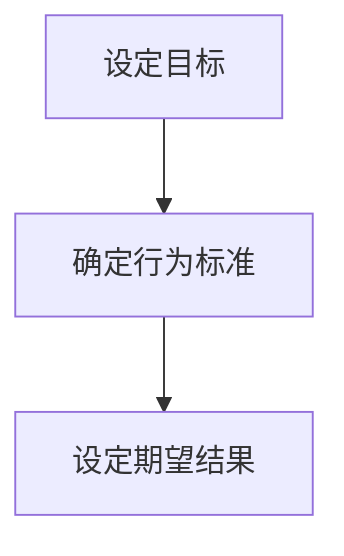

#### 测量行为

一旦目标设定，接下来就是测量当前的行为表现。测量行为可以通过多种方式实现，包括直接观察、行为记录、生理信号监测等。这些数据提供了评估行为表现的基础。

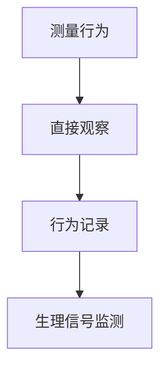

#### 比较与反馈

测量到的行为数据需要与设定的目标进行比较。通过比较，我们可以确定行为是否达到了预期目标，是否存在偏差。比较结果通过反馈机制传递给个体或系统，以便进行调整。

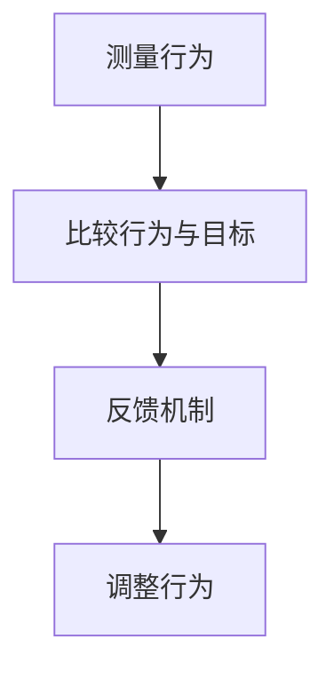

#### 调整输入

根据反馈结果，个体或系统需要调整外部或内部的输入，以改善行为。这些调整可能涉及环境改变、认知策略调整、情绪调节等。

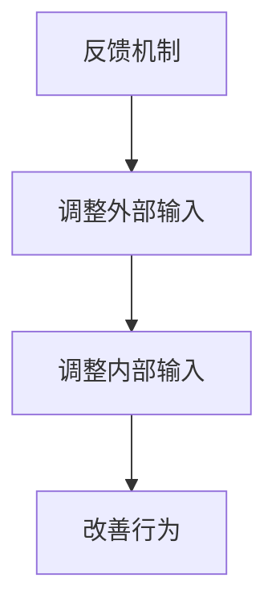

#### 自适应控制

行为调控不仅仅是短期的调整，还需要具备自适应能力，以适应环境的变化。自适应控制是指系统能够根据环境变化自动调整行为，以保持最优状态。

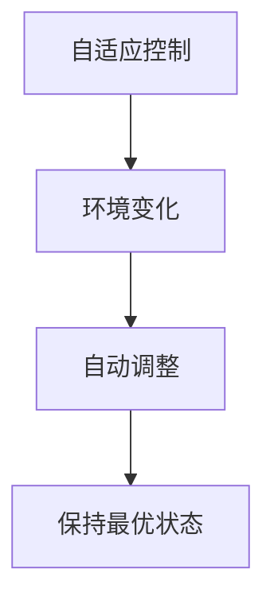

#### 行为调控的闭环过程

控制论中的行为调控可以看作一个闭环过程，其中反馈机制是关键。通过不断的测量、比较、反馈和调整，个体或系统能够逐步实现行为目标。

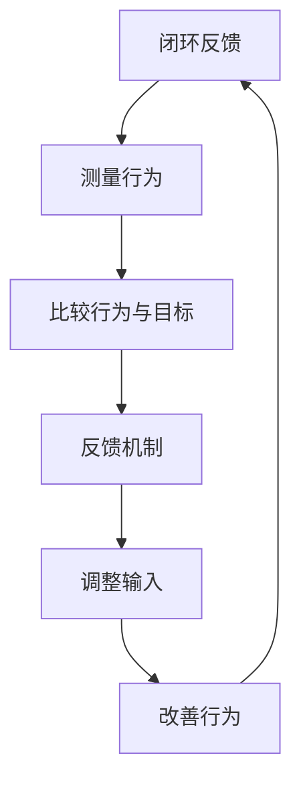

通过这样的闭环过程，控制论为行为调控提供了一个动态的、自适应的框架，有助于我们更好地理解和优化人类行为。

### 小结

控制论在行为调控中的应用，通过设定目标、测量行为、比较反馈和调整输入等步骤，提供了一个系统化的方法，帮助个体或系统实现行为目标。通过理解和应用这些核心原理，我们可以更好地调控行为，提高生活质量和工作效率。

---

### 4.2 认知调控中的控制论原理

认知调控是指在执行认知任务时，个体通过调节内部心理过程来优化认知表现的行为。控制论为认知调控提供了理论框架，帮助研究者理解如何通过控制内部过程来调节认知功能。以下是认知调控中的核心控制论原理：

#### 注意力调控

注意力是认知过程中的关键因素，决定了个体对哪些信息进行加工。控制论中的注意力调控原理主要包括：

1. **设定注意力目标**：个体需要明确在执行任务时需要关注的信息。
2. **测量注意力分配**：通过行为测量技术，如眼动追踪，了解个体在任务中的注意力分配情况。
3. **比较注意力分配与目标**：将实际的注意力分配与设定的目标进行比较，评估是否存在偏差。
4. **调整注意力资源**：根据比较结果，调整注意力的分配，以优化认知表现。

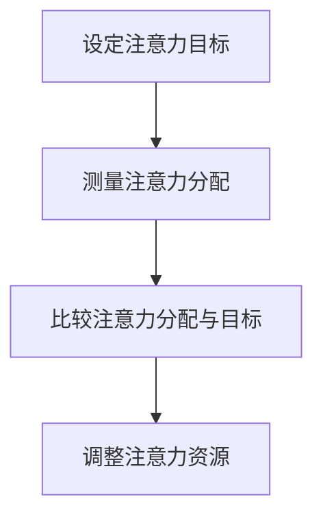

#### 记忆调控

记忆调控是指个体通过调节内部过程来优化信息的存储和提取。控制论中的记忆调控原理包括：

1. **设定记忆目标**：明确需要记忆的信息和记忆目标。
2. **测量记忆效果**：通过回忆测试、记忆任务等，评估记忆效果。
3. **比较记忆效果与目标**：将实际记忆效果与设定的目标进行比较，评估记忆性能。
4. **调整记忆策略**：根据比较结果，调整记忆策略，如重复练习、使用记忆技巧等，以提高记忆效果。

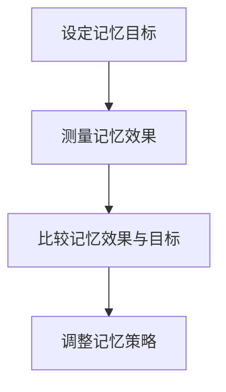

#### 决策调控

决策调控是指个体在不确定环境中通过调节内部过程来做出最佳决策。控制论中的决策调控原理包括：

1. **设定决策目标**：明确决策的目标和情境。
2. **测量决策过程**：通过行为实验和脑成像技术，了解决策过程中的心理过程。
3. **比较决策结果与目标**：评估决策结果是否符合设定的目标。
4. **调整决策策略**：根据比较结果，调整决策策略，如风险评估、概率计算等，以提高决策质量。

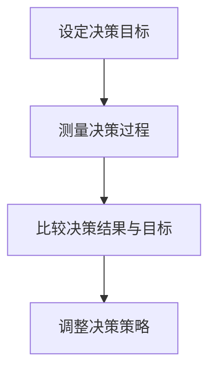

#### 自适应控制

认知调控不仅是短期的调节，还需要具备自适应能力，以适应环境的变化。自适应控制是指系统能够根据环境变化自动调整认知策略。


### 小结

控制论为认知调控提供了系统化的理论框架，通过设定目标、测量表现、比较反馈和调整策略等步骤，帮助个体优化认知过程。通过理解和应用这些控制论原理，我们可以更好地进行认知调控，提高认知效率和效果。

---

### 4.3 行为调控的应用实例

控制论在行为调控中的应用广泛且多样，下面我们通过一些实际案例来具体说明其应用场景和效果。

#### 心理健康管理

**案例背景**：心理健康管理是指通过调节心理状态来预防和管理心理疾病，如抑郁症、焦虑症等。控制论提供了有效的理论框架和方法，帮助设计个性化的心理健康管理方案。

**解决方案**：
1. **目标设定**：首先，个体需要明确自己的心理健康目标，如减少焦虑、提高自我控制等。
2. **行为测量**：通过自我报告、生理信号监测（如心率、皮肤电活动）等方法，收集个体在日常生活中行为表现的实时数据。
3. **比较与反馈**：将收集到的行为数据与设定的目标进行比较，通过反馈机制，个体可以了解到当前的心理健康状态与预期目标的差距。
4. **调整输入**：根据反馈结果，个体可以调整外部环境刺激（如减少压力源、增加放松活动）和内部认知策略（如正念练习、认知重构），以改善心理健康。

**效果评估**：通过持续的数据收集和反馈调整，个体报告了显著的焦虑水平下降和心理状态改善。

#### 教育干预

**案例背景**：教育干预旨在通过调节教学方法，提高学生的学习效果。控制论的方法可以帮助教育者设计出更有效的教育干预方案。

**解决方案**：
1. **目标设定**：教育者需要明确学生的学习目标，如提高阅读能力、数学成绩等。
2. **行为测量**：通过课堂观察、作业评估、学生反馈等手段，收集学生的学习行为数据。
3. **比较与反馈**：将学生的学习行为数据与设定的目标进行比较，通过定期反馈，教育者可以了解到学生的进步和存在的问题。
4. **调整输入**：教育者可以根据反馈结果，调整教学策略，如增加互动环节、提供额外的辅导等，以帮助学生达到学习目标。

**效果评估**：通过控制论方法指导的教育干预，学生的学习效果显著提升，尤其是在解决学习困难和提高学习兴趣方面。

#### 工作绩效提升

**案例背景**：在职场环境中，工作绩效的提升是企业和个人共同关注的问题。控制论的方法可以帮助管理者优化工作流程，提高员工的工作效率。

**解决方案**：
1. **目标设定**：明确工作绩效的目标，如提高生产效率、降低错误率等。
2. **行为测量**：通过工作记录、员工绩效评估、工作满意度调查等手段，收集员工的工作数据。
3. **比较与反馈**：将员工的工作数据与设定的绩效目标进行比较，通过定期的绩效反馈，管理者可以了解到员工的工作表现和绩效水平。
4. **调整输入**：根据反馈结果，管理者可以调整工作流程、提供培训、改善工作环境等，以提高员工的工作效率和工作满意度。

**效果评估**：通过控制论方法指导的工作绩效提升方案，员工的工作效率和工作满意度显著提高，企业整体运营效率得到提升。

### 小结

以上实例展示了控制论在行为调控中的应用场景和实际效果。通过设定目标、测量行为、比较反馈和调整输入等步骤，控制论为行为调控提供了一个系统化的方法，帮助个体和系统实现目标，提高生活质量和工作效率。

---

### 4.4 认知调控的应用实例

认知调控在日常生活和工作中具有重要意义，通过调整认知过程，可以提高学习效果、工作效率和心理状态。以下是一些具体的认知调控应用实例：

#### 注意力训练

**案例背景**：在现代社会的快节奏生活中，许多人面临注意力分散的问题，影响工作和学习效率。

**解决方案**：
1. **设定目标**：明确训练的目标，如提高注意力的集中度、减少分心情况。
2. **测量注意力**：通过使用注意力测试软件或纸笔测试，测量个体的注意力水平。
3. **比较与反馈**：将测试结果与设定的目标进行比较，通过自我评估和反馈，了解当前注意力的状态。
4. **调整策略**：根据反馈结果，采取相应的策略进行训练，如定时休息、减少干扰因素、练习专注任务。

**效果评估**：经过一段时间的注意力训练，个体的注意力集中度显著提高，工作学习效率也有所提升。

#### 认知行为疗法

**案例背景**：认知行为疗法（CBT）是一种广泛应用于心理健康治疗的方法，通过调节认知过程来改善情绪和行为问题。

**解决方案**：
1. **设定目标**：确定需要改善的心理问题，如焦虑、抑郁等。
2. **认知评估**：通过心理测试和访谈，评估个体的认知模式和思维习惯。
3. **比较与反馈**：将评估结果与正常认知模式进行比较，通过治疗师的反馈，个体可以了解到自己的认知偏差。
4. **调整认知**：通过认知重构、行为实验等技巧，调整个体的认知过程，如改变消极思维、增加积极行为。

**效果评估**：认知行为疗法在治疗焦虑、抑郁等心理问题方面具有显著效果，个体报告了情绪改善和行为改变。

#### 智能辅助系统

**案例背景**：智能辅助系统是结合人工智能和认知科学原理，用于辅助人类工作和生活的系统。

**解决方案**：
1. **设定目标**：明确系统需要实现的功能，如提高学习效率、优化工作流程。
2. **认知测量**：通过使用智能算法和传感器，测量用户的认知状态和行为表现。
3. **比较与反馈**：将测量结果与预期目标进行比较，通过智能算法的反馈，优化系统行为。
4. **调整输入**：根据反馈结果，调整系统的输入和输出，如提供个性化建议、优化用户界面。

**效果评估**：智能辅助系统在提高学习效率、优化工作流程方面表现出色，用户报告了使用体验的改善。

### 小结

以上实例展示了认知调控在注意力训练、认知行为疗法和智能辅助系统等领域的应用。通过设定目标、测量认知状态、比较反馈和调整认知策略，认知调控方法为优化人类认知过程提供了有效的工具。这些应用不仅提高了个体的生活质量和工作效率，也为心理健康干预和智能系统设计提供了新的思路。

---

### 4.5 控制论在行为与认知调控中的综合应用

控制论在行为与认知调控中的综合应用，通过结合行为调控和认知调控的理论和方法，能够更全面地理解人类行为的复杂性和动态性。这种综合应用不仅有助于优化人类行为和认知过程，还能为实际问题的解决提供有效的策略。以下是一些具体的综合应用实例：

#### 心理健康干预

**案例背景**：心理健康干预旨在通过调节个体行为和认知，改善心理状态，如减轻焦虑、缓解抑郁。

**解决方案**：
1. **目标设定**：明确心理健康干预的目标，如提高情绪稳定性、增强自我控制能力。
2. **行为与认知测量**：通过多种手段，如问卷调查、生理信号监测、认知任务测试，收集个体行为和认知的数据。
3. **综合反馈**：将行为数据和认知数据结合起来，进行综合分析，了解个体的整体心理状态。
4. **综合调整**：根据综合分析结果，调整行为和认知策略，如行为训练、认知重构、情绪调节。

**效果评估**：通过综合应用控制论的方法，个体报告了显著的心理状态改善，如焦虑水平下降、情绪稳定性提高。

#### 教育干预

**案例背景**：教育干预旨在通过优化教学方法，提高学生的学习效果。

**解决方案**：
1. **目标设定**：明确教育干预的目标，如提高阅读能力、增强数学理解。
2. **行为与认知测量**：通过课堂观察、作业评估、认知任务测试，收集学生的学习行为和认知状态数据。
3. **综合反馈**：将学生的学习行为和认知数据结合起来，进行综合分析，找出教学过程中的问题和学生的需求。
4. **综合调整**：根据综合分析结果，调整教学策略，如增加互动环节、提供个性化辅导、改进学习环境。

**效果评估**：通过综合应用控制论的方法，学生的学习效果显著提升，特别是在解决学习困难和提高学习兴趣方面。

#### 工作绩效提升

**案例背景**：工作绩效提升旨在通过优化工作流程，提高员工的工作效率和工作满意度。

**解决方案**：
1. **目标设定**：明确工作绩效提升的目标，如提高生产效率、降低错误率。
2. **行为与认知测量**：通过工作记录、员工绩效评估、心理状态调查，收集员工的工作行为和认知状态数据。
3. **综合反馈**：将员工的工作行为和认知数据结合起来，进行综合分析，找出影响工作绩效的因素。
4. **综合调整**：根据综合分析结果，调整工作流程、提供培训、改善工作环境，以提高员工的工作效率和工作满意度。

**效果评估**：通过综合应用控制论的方法，员工的工作效率显著提高，工作满意度也有所提升。

### 小结

控制论在行为与认知调控中的综合应用，通过结合行为调控和认知调控的理论和方法，能够为实际问题的解决提供更全面和有效的策略。这些综合应用实例展示了控制论在心理健康干预、教育干预和工作绩效提升等领域的巨大潜力，为进一步研究和实践提供了重要参考。

---

### 4.6 小结

控制论在行为与认知调控中的应用，为理解人类行为的复杂性提供了强有力的理论支持。通过设定目标、测量行为、比较反馈和调整输入等步骤，控制论为行为调控提供了系统化的方法，帮助个体或系统实现目标。同时，通过注意力调控、记忆调控和决策调控等原理，控制论在认知调控中也发挥了重要作用。综合应用控制论的方法，不仅优化了人类行为和认知过程，还为心理健康管理、教育干预和工作绩效提升等实际问题提供了有效的解决方案。未来的研究将继续探索控制论在更多领域的应用，推动科学技术的进步。

---

### 第三部分：认知神经科学

#### 第5章：认知神经科学的核心理论

认知神经科学的核心理论为我们提供了理解大脑如何实现认知功能的基本框架。本章将详细探讨认知神经科学中的几个核心理论，包括信号传递理论、突触可塑性理论、神经发育理论，以及注意力、记忆和情感等认知功能。

#### 5.1 信号传递理论

信号传递理论是认知神经科学的基本原理之一，它描述了神经元如何通过电信号和化学信号进行信息传递。以下是信号传递理论的核心概念：

1. **电信号传递**：神经元通过电信号进行信息传递。当一个神经元接收到足够的刺激时，它会产生动作电位，这是一个快速的电信号，沿着神经纤维传递到其他神经元。

   ```mermaid
   graph TD
   A[神经元A] --> B[动作电位]
   B --> C[神经元B]
   ```

2. **化学信号传递**：神经元通过释放神经递质，将信息传递到下一个神经元。神经递质是一种化学物质，存在于突触间隙中，可以增强或抑制神经信号的传递。

   ```mermaid
   graph TD
   A[神经元A] --> B[突触前神经元]
   B --> C[神经递质]
   C --> D[突触后神经元]
   ```

3. **突触传递**：突触是神经元之间传递信号的连接点。信号通过突触传递，包括电信号和化学信号的转换。突触传递的效率和质量对认知功能至关重要。

#### 5.2 突触可塑性理论

突触可塑性理论是理解大脑学习和记忆的基础。突触可塑性是指突触连接在经验和学习过程中的变化能力。以下是突触可塑性的核心概念：

1. **短期突触可塑性**：短期突触可塑性是指在短时间内，突触连接强度的变化。这种变化通常与学习和记忆有关。

   ```mermaid
   graph TD
   A[突触前神经元] --> B[突触后神经元]
   B --> C[突触连接强度变化]
   ```

2. **长期突触可塑性**：长期突触可塑性是指在长期经验和学习过程中，突触连接的持久性变化。这种变化通常与大脑结构的改变有关。

   ```mermaid
   graph TD
   A[突触前神经元] --> B[突触后神经元]
   B --> C[突触连接持久性变化]
   ```

3. **突触强化和消除**：突触强化是指突触连接的加强，通常与增强学习和记忆有关。突触消除是指突触连接的减弱，通常与遗忘有关。

   ```mermaid
   graph TD
   A[突触前神经元] --> B[突触后神经元]
   B --> C[突触强化]
   C --> D[突触消除]
   ```

#### 5.3 神经发育理论

神经发育理论是研究大脑如何从出生到成年不断发育和成熟的理论。以下是神经发育理论的核心概念：

1. **神经发生**：神经发生是指神经元的生成和死亡。在大脑发育过程中，神经元的生成和死亡是动态的，对大脑结构的形成至关重要。

   ```mermaid
   graph TD
   A[神经发生] --> B[神经元生成]
   B --> C[神经元死亡]
   ```

2. **神经网络形成**：神经网络形成是指神经元之间的连接如何在大脑中形成和重组。神经网络的形成与学习和记忆密切相关。

   ```mermaid
   graph TD
   A[神经元A] --> B[神经网络]
   B --> C[神经元B]
   ```

3. **环境因素**：环境因素，如学习、经验和社交互动，对大脑发育具有重要影响。积极的环境因素可以促进大脑的发育和功能。

   ```mermaid
   graph TD
   A[环境因素] --> B[大脑发育]
   B --> C[学习经验]
   ```

#### 5.4 注意力、记忆和情感等认知功能

注意力、记忆和情感是认知神经科学研究的核心领域。以下是这些认知功能的核心概念：

1. **注意力**：注意力是大脑选择和处理信息的心理过程。注意力可以集中或分散，对认知任务的成功至关重要。

   ```mermaid
   graph TD
   A[注意力] --> B[选择信息]
   B --> C[处理信息]
   ```

2. **记忆**：记忆是大脑存储、检索和使用信息的能力。记忆分为短期记忆和长期记忆，对学习、记忆和认知功能至关重要。

   ```mermaid
   graph TD
   A[记忆] --> B[短期记忆]
   B --> C[长期记忆]
   ```

3. **情感**：情感是大脑对情绪和情感体验的处理。情感与大脑的多个区域有关，如杏仁核和前额叶皮质，对行为和心理健康有重要影响。

   ```mermaid
   graph TD
   A[情感] --> B[杏仁核]
   B --> C[前额叶皮质]
   ```

#### 5.5 小结

认知神经科学的核心理论，如信号传递理论、突触可塑性理论和神经发育理论，为我们提供了理解大脑如何实现认知功能的基本框架。注意力、记忆和情感等认知功能是认知神经科学研究的重要领域，通过深入理解这些理论，我们可以更好地理解人类认知的复杂性和多样性。

---

### 5.1 信号传递理论

信号传递理论是认知神经科学的基础，它描述了神经元如何通过电信号和化学信号进行信息传递。以下是信号传递理论的核心概念：

**神经元电信号传递**

1. **动作电位（Action Potential）**：当神经元受到足够的刺激时，会在其膜上产生动作电位。动作电位是一种快速、电化学的信号，沿着神经纤维传播。动作电位的产生和传播是神经元传递信息的关键过程。

   ```mermaid
   graph TD
   A[刺激] --> B[动作电位产生]
   B --> C[信号传播]
   ```

2. **静息电位（Resting Potential）**：神经元在静息状态下的膜电位约为-70毫伏。静息电位是神经元膜内外电化学状态的平衡状态，是产生动作电位的基础。

   ```mermaid
   graph TD
   A[静息电位]
   ```

3. **钠离子和钾离子通道**：神经元膜上的钠离子和钾离子通道在动作电位产生中起着关键作用。钠离子通道在动作电位上升期开放，允许钠离子进入细胞，导致膜电位去极化；而钾离子通道在动作电位下降期开放，允许钾离子出细胞，导致膜电位复极化。

   ```mermaid
   graph TD
   A[Na+通道开放] --> B[去极化]
   B --> C[K+通道开放]
   C --> D[复极化]
   ```

**神经递质化学信号传递**

1. **突触前神经元**：当动作电位到达突触前神经元时，会激活突触前膜上的钙离子通道，导致钙离子进入突触前神经元。钙离子的增加会触发突触前神经末梢释放神经递质。

   ```mermaid
   graph TD
   A[动作电位] --> B[钙离子通道开放]
   B --> C[神经递质释放]
   ```

2. **突触间隙**：神经递质通过突触间隙扩散到突触后神经元。神经递质与突触后膜上的受体结合，可以增强或抑制突触后神经元的兴奋性。

   ```mermaid
   graph TD
   A[神经递质释放] --> B[突触间隙]
   B --> C[受体结合]
   ```

3. **突触后神经元**：神经递质与突触后膜上的受体结合后，可以打开离子通道，导致离子流动，从而产生突触后电位。这些电位可以是兴奋性的（使神经元更可能产生动作电位）或抑制性的（减少神经元产生动作电位的可能性）。

   ```mermaid
   graph TD
   A[受体激活] --> B[离子通道开放]
   B --> C[突触后电位]
   ```

**突触传递效率**

1. **突触效能（Synaptic Efficiency）**：突触效能是指神经递质传递信息的效率。高效能的突触可以在较短的时间内传递更多的信息。

   ```mermaid
   graph TD
   A[突触效能]
   ```

2. **突触效能调节**：突触效能可以通过多种方式调节，如改变神经递质的释放量、改变神经递质受体的数量或敏感性等。

   ```mermaid
   graph TD
   A[神经递质释放量]
   B[受体数量]
   C[受体敏感性]
   ```

**信号传递过程总结**

神经信号的传递过程可以概括为以下几个步骤：

1. **刺激产生动作电位**：外部刺激（如感觉输入或内部信号）导致神经元产生动作电位。
2. **动作电位触发神经递质释放**：动作电位到达突触前神经元，触发神经递质的释放。
3. **神经递质传递到突触后神经元**：神经递质通过突触间隙扩散到突触后神经元。
4. **神经递质与受体结合**：神经递质与突触后膜上的受体结合，导致离子通道的开放或关闭。
5. **产生突触后电位**：突触后电位可以是兴奋性的或抑制性的，决定神经元是否产生动作电位。

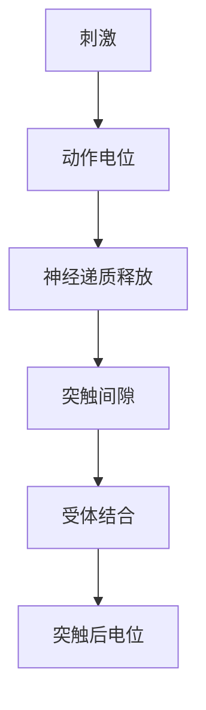

通过信号传递理论，我们可以深入理解神经元如何实现信息的传递和加工，为认知神经科学的研究提供了理论基础。

### 小结

信号传递理论是认知神经科学的核心概念之一，它描述了神经元通过电信号和化学信号进行信息传递的过程。通过理解这一理论，我们可以更好地理解大脑如何实现复杂的认知功能，为认知神经科学研究提供了重要的理论框架。

---

### 5.2 突触可塑性理论

突触可塑性理论是认知神经科学的重要基础之一，它描述了突触连接在学习和记忆过程中如何发生变化。突触可塑性是指突触连接的强度、结构和功能在经验和学习过程中发生变化的能力。以下是突触可塑性的核心概念：

**短期突触可塑性（Short-term Synaptic Plasticity）**

1. **定义**：短期突触可塑性是指在短时间内，突触连接的强度发生变化的现象。这种变化通常与神经元之间的通信效率有关。

2. **机制**：短期突触可塑性主要通过以下机制实现：
   - **频率依赖性**：高频刺激可以增强突触连接，而低频刺激可以抑制突触连接。
   - **时间依赖性**：突触连接的强度会随着时间的推移而变化。

3. **实例**：在学习和记忆过程中，短期突触可塑性可以帮助大脑适应新信息。例如，在学习新知识时，频繁的刺激可以使相关的突触连接变得更强。

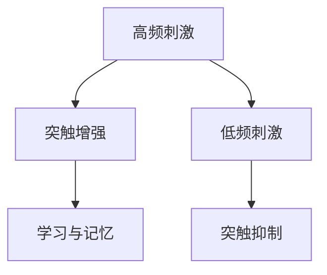

**长期突触可塑性（Long-term Synaptic Plasticity）**

1. **定义**：长期突触可塑性是指在较长时间内，突触连接的持久性变化。这种变化通常与大脑结构的改变和记忆的形成有关。

2. **机制**：长期突触可塑性主要通过以下机制实现：
   - **突触强化**：通过增强突触连接的强度，使信息传递更加有效。
   - **突触消除**：通过减弱或消除突触连接，使不再需要的信息得以遗忘。

3. **实例**：长期突触可塑性在记忆形成中起着关键作用。例如，通过重复练习，可以使某些记忆变得更加牢固。

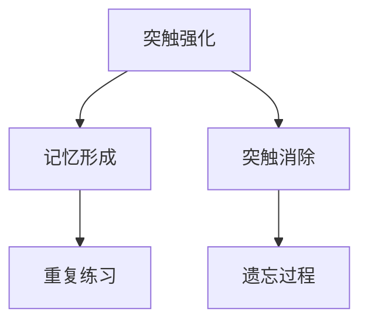

**突触强化和消除**

1. **突触强化**：突触强化是指通过增加突触连接的强度，提高信息传递的效率。这通常通过增强突触前神经元的兴奋性和增加突触后神经元的敏感性来实现。

2. **突触消除**：突触消除是指通过减少突触连接的强度，使不再需要的信息得以消除。这通常通过减少突触前神经元的兴奋性和降低突触后神经元的敏感性来实现。

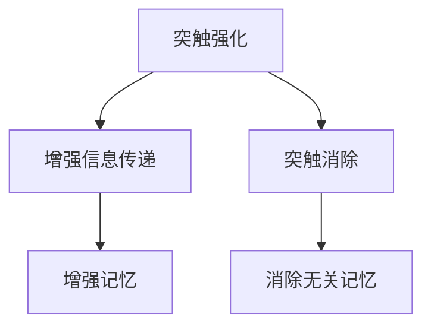

**突触可塑性的调节因素**

1. **神经递质**：神经递质是调节突触可塑性的关键因素。例如，谷氨酸和去甲肾上腺素等神经递质可以通过增强或抑制突触连接来调节突触可塑性。

2. **信号通路**：多种信号通路参与调节突触可塑性，包括钙信号通路、蛋白激酶C信号通路和磷酸肌醇信号通路等。

3. **环境因素**：环境因素，如学习、经验和社交互动，对突触可塑性有重要影响。积极的环境因素可以促进突触可塑性和大脑的可塑性。

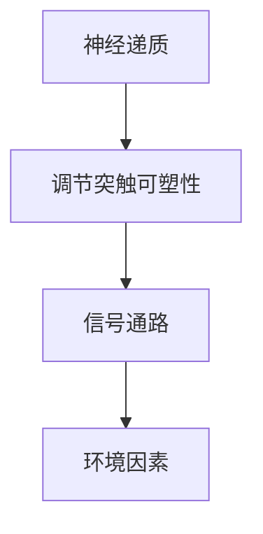

**突触可塑性的应用**

1. **记忆和学习的调节**：通过调节突触可塑性，可以优化记忆和学习过程。例如，重复练习和有效的学习策略可以增强突触连接，提高记忆效率。

2. **心理障碍的治疗**：突触可塑性理论为心理障碍的治疗提供了新的视角。通过调节突触可塑性，可以改善焦虑、抑郁和记忆障碍等心理问题。

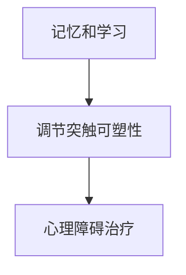

**小结**

突触可塑性理论是理解学习和记忆机制的关键。通过短期突触可塑性和长期突触可塑性的机制，我们可以深入理解大脑如何通过调节突触连接来实现学习和记忆。突触可塑性不仅在认知科学中有重要应用，也为心理障碍的治疗提供了新的方法。未来的研究将继续探索突触可塑性的调节因素和机制，以更好地理解大脑的可塑性。

---

### 5.3 神经发育理论

神经发育理论是研究大脑如何从出生到成年不断发育和成熟的理论。以下是神经发育理论的核心概念：

**神经发生（Neurogenesis）**

1. **定义**：神经发生是指神经元的生成和死亡过程。在大脑发育过程中，神经元的生成和死亡是动态的，对大脑结构的形成至关重要。

2. **机制**：神经发生主要发生在大脑的特定区域，如海马体和嗅球。在神经发生过程中，干细胞分裂产生新的神经元，这些新神经元通过生长锥（growth cones）与周围神经元建立突触连接。

3. **实例**：在成年大脑中，神经发生对于学习和记忆至关重要。通过神经发生，大脑可以生成新的神经元，从而增强认知功能。

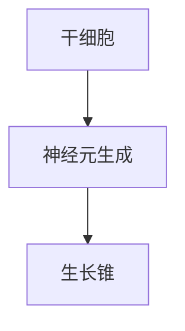

**神经网络形成（Neural Network Formation）**

1. **定义**：神经网络形成是指神经元之间的连接如何在大脑中形成和重组。神经网络的形成与学习和记忆密切相关。

2. **机制**：神经网络形成是一个复杂的过程，涉及神经元间的信号传递、突触连接的建立和调整。神经网络的形成可以通过多种机制实现，如突触前调节、突触后调节和突触消除。

3. **实例**：在学习和记忆过程中，神经网络的形成和重组是非常重要的。通过重复学习和练习，大脑可以建立和强化新的神经网络，从而提高记忆和认知能力。

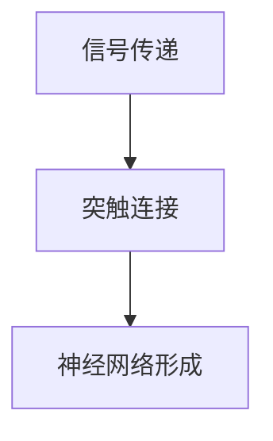

**环境因素（Environmental Factors）**

1. **定义**：环境因素是指外部环境和经验对大脑发育的影响。环境因素可以显著影响神经发生的速率和神经网络的重组。

2. **机制**：环境因素通过多种途径影响大脑发育，如神经递质、生长因子和神经调节因子。积极的环境因素，如学习、社交互动和体育锻炼，可以促进大脑的发育和功能。

3. **实例**：在儿童和青少年时期，积极的环境因素可以促进大脑的发育，提高认知能力和学习效率。此外，不良的环境因素，如压力和创伤，也可能对大脑发育产生负面影响。

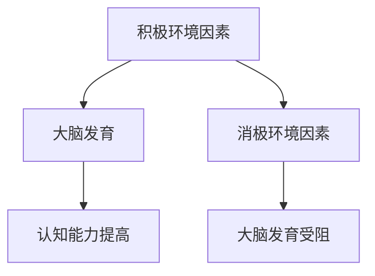

**神经发育的应用**

1. **学习与记忆**：神经发育理论为理解学习和记忆提供了新的视角。通过神经发生和神经网络的形成，大脑可以不断适应新信息和经验，从而实现学习和记忆。

2. **神经疾病治疗**：神经发育理论在神经疾病治疗中也具有潜在的应用。例如，通过调节神经发生和神经网络重组，可能有助于治疗神经退行性疾病，如阿尔茨海默病和帕金森病。

3. **教育干预**：神经发育理论为教育干预提供了科学依据。通过理解大脑的发育过程，教育者可以设计出更有效的教育策略，以促进学生的认知发展和学习效果。

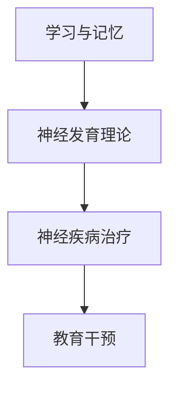

**小结**

神经发育理论是理解大脑如何发育和成熟的重要理论。通过神经发生、神经网络形成和环境因素的影响，我们可以深入理解大脑的发育过程。神经发育理论在学习和记忆、神经疾病治疗和教育干预等领域具有重要的应用价值。未来的研究将继续探索神经发育的机制和途径，为大脑的发育和功能提供更深入的理解。

---

### 5.4 注意力、记忆和情感等认知功能

注意力、记忆和情感是认知神经科学中的核心认知功能，它们在大脑中通过特定的神经机制实现。以下是这些认知功能的核心概念及其神经机制：

**注意力（Attention）**

1. **定义**：注意力是大脑选择和处理信息的心理过程。注意力可以集中或分散，对认知任务的成功至关重要。

2. **神经机制**：
   - **前额叶皮质**：注意力调控主要依赖于前额叶皮质，特别是前额叶内侧回和前额叶背外侧回。这些区域的活动与注意力的分配和调节有关。
   - **脑网络**：注意力调控涉及到多个脑网络之间的相互作用，包括默认模式网络、执行控制网络和视觉网络等。

3. **实例**：在执行复杂任务时，前额叶皮质的活动会增强，从而帮助个体集中注意力并忽略干扰信息。

```mermaid
graph TD
A[前额叶皮质] --> B[注意力调控]
B --> C[默认模式网络]
C --> D[执行控制网络]
```

**记忆（Memory）**

1. **定义**：记忆是大脑存储、检索和使用信息的能力。记忆分为短期记忆和长期记忆

