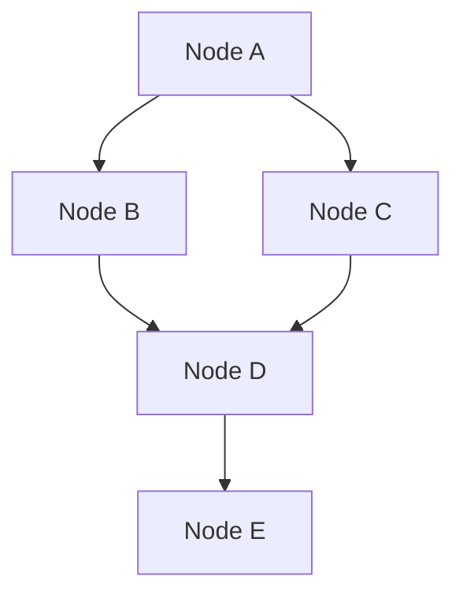
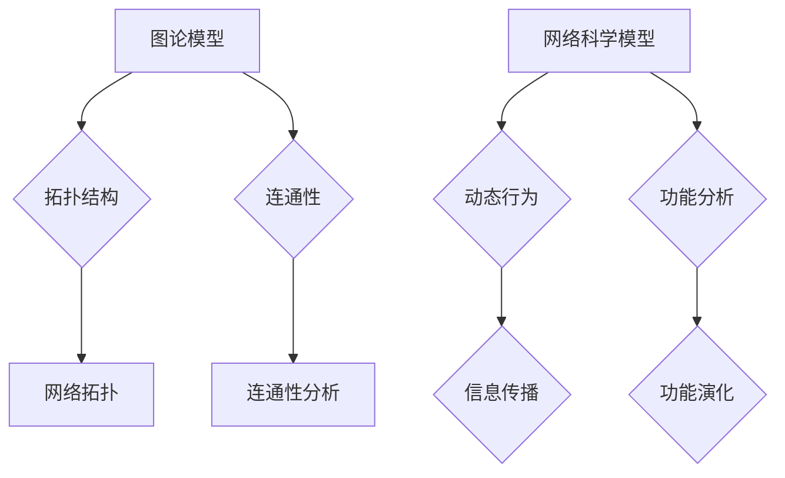
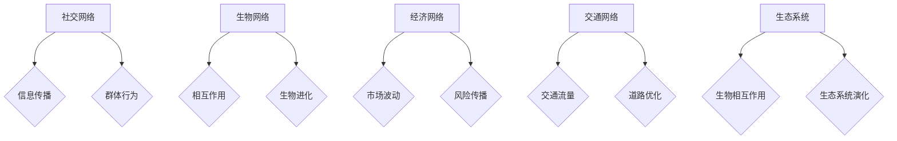

                 

### 从线性因果到复杂网络：理解多因素交互的世界

#### 关键词：复杂网络、多因素交互、线性因果、网络科学、算法原理

#### 摘要：
本文旨在探讨从线性因果模型到复杂网络的转变，分析多因素交互的复杂性及其对现实世界的影响。首先，我们将回顾线性因果模型的基本原理及其局限性，随后详细介绍复杂网络的概念、结构和核心算法。接着，通过实际案例展示复杂网络在多个领域的应用，并探讨复杂网络分析在决策支持系统中的重要性。最后，本文将展望复杂网络分析的未来发展趋势与挑战，为读者提供全面而深入的理解。

### 第1章: 从线性因果到复杂网络概述

线性因果模型是许多学科领域中的基础工具，它帮助我们理解和预测变量之间的关系。然而，随着数据复杂性的增加，线性因果模型在处理多因素交互问题时显得力不从心。复杂网络作为一种描述多因素交互的有效工具，能够更好地揭示现实世界的复杂性和多样性。

#### 1.1 线性因果与复杂网络的基本概念

**线性因果模型**：在线性因果模型中，一个变量的变化被认为是其他变量变化的线性组合。这种模型通常通过线性回归方程来描述，如下所示：

\[ y = \beta_0 + \beta_1x_1 + \beta_2x_2 + ... + \beta_nx_n + \epsilon \]

其中，\( y \) 是因变量，\( x_1, x_2, ..., x_n \) 是自变量，\( \beta_0, \beta_1, \beta_2, ..., \beta_n \) 是回归系数，\( \epsilon \) 是误差项。

**复杂网络**：复杂网络由大量节点和连接构成，这些节点和连接可以代表现实世界中的各种实体和关系。复杂网络的典型特征包括网络拓扑的异质性、节点度的分布不均匀性以及短路径特性。复杂网络的一个基本概念是网络的拓扑结构，它决定了节点之间的连接方式和信息传递路径。

#### 1.2 从线性因果到复杂网络的转变

线性因果模型在处理简单关系时非常有效，但当面临复杂的多因素交互问题时，其局限性逐渐显现。首先，线性模型难以捕捉非线性关系。其次，线性模型在处理交互效应时存在困难，因为交互效应往往是非线性的。此外，线性模型对不确定性处理不足，难以适应动态变化的复杂环境。

复杂网络的出现为解决这些问题提供了一种新的视角。复杂网络能够描述多因素之间的复杂相互作用，通过分析网络的拓扑结构和节点属性，可以揭示出隐藏在复杂系统中的模式和规律。

#### 1.3 复杂网络的基本结构

复杂网络的基本结构由节点和边组成。节点代表网络中的个体或实体，边代表节点之间的连接或关系。复杂网络的拓扑结构可以描述节点之间的连接方式和信息传递路径。以下是一个简单的复杂网络结构的 Mermaid 流程图：



在这个例子中，节点 A、B、C、D 和 E 形成了一个简单的复杂网络。节点之间的边代表了它们之间的连接关系。

#### 1.4 复杂网络中的核心概念与联系

复杂网络中存在许多重要的核心概念，包括度分布、聚类系数和路径长度等。度分布描述了网络中节点连接数的分布情况，聚类系数衡量了节点之间连接的紧密程度，路径长度描述了节点之间最短路径的长度。

**度分布**：度分布是描述网络中节点度数（连接数）的概率分布。一个常见的度分布模型是泊松分布，其概率质量函数（PMF）为：

\[ P(k) = \frac{\lambda^k e^{-\lambda}}{k!} \]

其中，\( \lambda \) 是平均度数，\( k \) 是节点的度数。

**聚类系数**：聚类系数是衡量网络中节点之间连接紧密程度的指标。一个网络的最大聚类系数（\(\omega_{\max}\)）定义为：

\[ \omega_{\max} = \frac{3m_c}{n(n-1)} \]

其中，\( m_c \) 是网络中的闭合三元组的数量，\( n \) 是网络的节点数。

**路径长度**：路径长度是描述节点之间最短路径长度的指标。平均路径长度（\(L\)）定义为：

\[ L = \frac{1}{n(n-1)} \sum_{i \neq j} d(i, j) \]

其中，\( d(i, j) \) 是节点 \( i \) 和节点 \( j \) 之间的最短路径长度。

#### 1.5 复杂网络的建模方法

复杂网络的建模方法包括图论模型和网络科学模型等。图论模型主要关注网络的拓扑结构，而网络科学模型则结合拓扑结构和动态行为，用于分析网络的功能和演化。

**图论模型**：图论模型是复杂网络分析的基础。它使用图论的基本概念，如节点、边、路径和连通性等，来描述网络的拓扑结构。

**网络科学模型**：网络科学模型结合拓扑结构和动态行为，用于分析网络的功能和演化。例如，社会网络分析中的信息传播模型、生物网络分析中的进化模型等。

**图论模型和网络科学模型的关系**：图论模型和网络科学模型是相辅相成的。图论模型提供了分析网络拓扑结构的基础，而网络科学模型则在此基础上分析了网络的动态行为和功能。

以下是一个 Mermaid 流程图，展示了图论模型和网络科学模型的基本概念和关系：



#### 1.6 复杂网络的应用场景

复杂网络在许多领域都有广泛的应用。以下是一些典型的应用场景：

**社交网络**：社交网络是复杂网络的典型例子。通过分析社交网络的拓扑结构和节点属性，可以揭示社交网络中的群体行为和传播现象。

**生物网络**：生物网络描述了生物分子之间的相互作用。通过分析生物网络的拓扑结构和节点属性，可以揭示生物系统的功能和机制。

**经济网络**：经济网络描述了市场中的交易关系和金融资产之间的关联。通过分析经济网络的拓扑结构和节点属性，可以揭示金融市场的波动和风险传播。

**交通网络**：交通网络描述了城市中的道路和交通流。通过分析交通网络的拓扑结构和节点属性，可以优化交通流量、减少拥堵。

**生态系统**：生态系统描述了生物群落中的生物相互作用。通过分析生态系统的拓扑结构和节点属性，可以揭示生态系统的稳定性和演化。

以下是一个 Mermaid 流程图，展示了复杂网络在不同领域中的应用：



#### 1.7 总结

复杂网络为理解多因素交互的世界提供了新的视角。通过分析复杂网络的拓扑结构和节点属性，我们可以揭示隐藏在复杂系统中的模式和规律。复杂网络在社交网络、生物网络、经济网络、交通网络和生态系统等领域都有广泛的应用。随着技术的发展，复杂网络将在更多领域发挥重要作用。

## 第2章: 线性因果模型原理

### 2.1 线性因果模型的定义与基本概念

线性因果模型是一种描述变量之间线性关系的统计模型。在线性因果模型中，因变量（响应变量）与自变量（预测变量）之间存在线性关系。这种模型广泛应用于经济学、社会科学、工程学等领域，用于预测和分析变量之间的关系。

**基本概念**：

- **因变量（Response Variable）**：模型中被预测的变量，通常用 \( y \) 表示。
- **自变量（Predictor Variables）**：模型中用于预测因变量的变量，通常用 \( x_1, x_2, ..., x_n \) 表示。
- **回归系数（Regression Coefficients）**：描述自变量对因变量的影响程度，通常用 \( \beta_0, \beta_1, ..., \beta_n \) 表示。
- **误差项（Error Term）**：描述模型中未能解释的随机误差，通常用 \( \epsilon \) 表示。

线性因果模型的数学表示如下：

\[ y = \beta_0 + \beta_1x_1 + \beta_2x_2 + ... + \beta_nx_n + \epsilon \]

其中，\( \beta_0 \) 是截距，\( \beta_1, \beta_2, ..., \beta_n \) 是回归系数，\( \epsilon \) 是误差项。

### 2.2 线性回归模型原理

线性回归模型是线性因果模型的一种具体实现，它通过最小二乘法来估计回归系数。线性回归模型的基本形式如下：

\[ y = \beta_0 + \beta_1x_1 + \beta_2x_2 + ... + \beta_nx_n + \epsilon \]

其中，\( y \) 是因变量，\( x_1, x_2, ..., x_n \) 是自变量，\( \beta_0, \beta_1, ..., \beta_n \) 是回归系数，\( \epsilon \) 是误差项。

#### 2.2.1 线性回归的基本形式

线性回归模型的基本形式是一个线性方程，表示因变量 \( y \) 与自变量 \( x_1, x_2, ..., x_n \) 之间的关系。具体来说，每个自变量都与一个回归系数相乘，然后求和得到因变量的估计值。

#### 2.2.2 线性回归的参数估计

线性回归的参数估计通常使用最小二乘法。最小二乘法的思想是选择一组回归系数，使得因变量的预测值与实际值之间的误差平方和最小。

假设我们有一个包含 \( n \) 个观测值的样本数据，每个观测值包括因变量 \( y_i \) 和自变量 \( x_{i1}, x_{i2}, ..., x_{in} \)。线性回归模型的参数估计问题可以表示为以下最小化问题：

\[ \min_{\beta_0, \beta_1, ..., \beta_n} \sum_{i=1}^{n} (y_i - (\beta_0 + \beta_1x_{i1} + ... + \beta_nx_{in}))^2 \]

通过求解这个最小化问题，可以得到最优的回归系数估计值。

#### 2.2.3 线性回归的假设条件

线性回归模型通常满足以下假设条件：

1. **线性关系**：因变量与自变量之间存在线性关系，即 \( y = \beta_0 + \beta_1x_1 + ... + \beta_nx_n + \epsilon \)。
2. **独立性**：观测值之间相互独立，即 \( \epsilon_1, \epsilon_2, ..., \epsilon_n \) 相互独立。
3. **同方差性**：误差项的方差相同，即 \( Var(\epsilon_i) = \sigma^2 \) 对于所有 \( i \)。
4. **正态性**：误差项服从正态分布，即 \( \epsilon_i \sim N(0, \sigma^2) \)。

这些假设条件是线性回归模型有效性的基础，但在实际应用中，这些假设条件可能不总是满足。

### 2.3 线性时间序列分析

线性时间序列分析是线性因果模型在时间序列数据中的应用。时间序列数据是一系列按时间顺序排列的数值，通常用于分析经济现象、金融市场、天气变化等。

**时间序列的基本概念**：

- **时间序列**：一系列按时间顺序排列的数值。
- **趋势**：时间序列中的长期变化趋势。
- **季节性**：时间序列中的周期性变化，如一年中的季节变化。
- **周期性**：时间序列中的周期性波动，如经济周期的波动。

**时间序列分析的基本模型**：

1. **自回归模型（AR）**：自回归模型描述当前值与过去值的线性关系。自回归模型的一般形式如下：

\[ X_t = c + \phi_1X_{t-1} + \phi_2X_{t-2} + ... + \phi_pX_{t-p} + \epsilon_t \]

其中，\( X_t \) 是时间序列的当前值，\( \phi_1, \phi_2, ..., \phi_p \) 是自回归系数，\( \epsilon_t \) 是误差项。

2. **移动平均模型（MA）**：移动平均模型描述当前值与未来值的线性关系。移动平均模型的一般形式如下：

\[ X_t = c + \theta_1\epsilon_{t-1} + \theta_2\epsilon_{t-2} + ... + \theta_q\epsilon_{t-q} \]

其中，\( X_t \) 是时间序列的当前值，\( \theta_1, \theta_2, ..., \theta_q \) 是移动平均系数，\( \epsilon_t \) 是误差项。

3. **自回归移动平均模型（ARMA）**：自回归移动平均模型结合了自回归模型和移动平均模型，描述当前值与过去值和未来值的线性关系。自回归移动平均模型的一般形式如下：

\[ X_t = c + \phi_1X_{t-1} + ... + \phi_pX_{t-p} + \theta_1\epsilon_{t-1} + ... + \theta_q\epsilon_{t-q} + \epsilon_t \]

### 2.4 线性因果模型的应用

线性因果模型广泛应用于各个领域，包括经济预测、金融市场分析、医疗诊断等。

#### 2.4.1 经济预测

经济预测是线性因果模型的重要应用之一。通过分析历史数据，可以预测未来的经济指标，如 GDP、通货膨胀率、利率等。线性回归模型和自回归模型等是常用的经济预测方法。

例如，在预测通货膨胀率时，可以使用以下线性回归模型：

\[ \pi_t = \beta_0 + \beta_1r_t + \beta_2u_t + \epsilon_t \]

其中，\( \pi_t \) 是通货膨胀率，\( r_t \) 是利率，\( u_t \) 是失业率，\( \beta_0, \beta_1, \beta_2 \) 是回归系数，\( \epsilon_t \) 是误差项。

通过训练模型并输入当前的利率和失业率数据，可以预测未来的通货膨胀率。

#### 2.4.2 金融市场分析

金融市场分析是另一个重要应用领域。通过分析历史交易数据，可以预测股票价格、汇率等金融指标。线性回归模型和自回归模型等是常用的金融市场分析方法。

例如，在预测股票价格时，可以使用以下线性回归模型：

\[ p_t = \beta_0 + \beta_1p_{t-1} + \beta_2r_t + \epsilon_t \]

其中，\( p_t \) 是股票价格，\( p_{t-1} \) 是前一期股票价格，\( r_t \) 是利率，\( \beta_0, \beta_1, \beta_2 \) 是回归系数，\( \epsilon_t \) 是误差项。

通过训练模型并输入当前的利率数据，可以预测未来的股票价格。

#### 2.4.3 医疗诊断

医疗诊断是线性因果模型的另一个重要应用领域。通过分析患者的病历数据，可以预测疾病的诊断结果。线性回归模型和逻辑回归模型等是常用的医疗诊断方法。

例如，在预测心脏病诊断结果时，可以使用以下逻辑回归模型：

\[ P(\text{心脏病}) = \frac{1}{1 + e^{-(\beta_0 + \beta_1\text{年龄} + \beta_2\text{血压})}} \]

其中，\( P(\text{心脏病}) \) 是心脏病发生的概率，\( \beta_0, \beta_1, \beta_2 \) 是回归系数，\( \text{年龄} \) 和 \( \text{血压} \) 是自变量。

通过训练模型并输入患者的年龄和血压数据，可以预测患者是否患有心脏病。

#### 2.4.4 线性因果模型的局限

尽管线性因果模型在许多领域都有广泛应用，但它也存在一些局限性。

1. **非线性关系的处理能力不足**：线性模型难以捕捉复杂的非线性关系。
2. **交互效应的识别困难**：线性模型难以识别变量之间的交互效应。
3. **不确定性处理的不足**：线性模型在处理不确定性方面存在局限。

因此，在实际应用中，可能需要结合其他方法，如非线性模型、机器学习方法等，来克服这些局限性。

### 2.4.5 线性因果模型的改进

为了克服线性因果模型的局限性，研究人员提出了一些改进方法。以下是一些常见的改进方法：

1. **非线性回归模型**：非线性回归模型能够捕捉复杂的非线性关系。例如，多项式回归模型、逻辑回归模型、支持向量机等。
2. **机器学习方法**：机器学习方法，如决策树、随机森林、神经网络等，可以用于分析和预测复杂的数据集。
3. **混合模型**：混合模型结合了线性模型和非线性模型的特点，能够同时处理线性关系和非线性关系。

通过结合这些改进方法，可以更好地捕捉现实世界的复杂性和多样性。

### 总结

线性因果模型是一种描述变量之间线性关系的统计模型，广泛应用于各个领域。然而，它在处理复杂的多因素交互问题时存在局限性。复杂网络作为一种描述多因素交互的有效工具，为解决这些局限性提供了新的视角。在接下来的章节中，我们将深入探讨复杂网络的概念、结构和核心算法，以便更好地理解复杂网络在现实世界中的应用。

### 第3章: 复杂网络的建模方法

#### 3.1 图论模型基础

图论模型是复杂网络分析的基础，它通过数学方法描述网络的结构和属性。图论模型的核心概念包括节点、边、路径和连通性等。

**节点**：节点是网络中的基本单元，可以代表任何实体，如人、物体、组织等。

**边**：边连接两个节点，表示节点之间的某种关系，如社交关系、物理连接、信息传递等。

**路径**：路径是指节点之间的一条序列，路径的长度是路径中边的数量。

**连通性**：连通性是指网络中任意两个节点之间是否存在路径连接。网络的连通性是分析网络稳定性和传递性能的重要指标。

**图的表示方法**：图的表示方法包括邻接矩阵、邻接表和图形表示等。

- **邻接矩阵**：邻接矩阵是一个二维数组，其中第 \( i \) 行第 \( j \) 列的元素表示节点 \( i \) 和节点 \( j \) 之间是否存在边。

- **邻接表**：邻接表是一个数组，其中每个元素指向一个链表，链表中的元素表示与该节点相连的其他节点。

- **图形表示**：图形表示是通过图形直观地展示网络结构，通常使用节点和边表示。

**图的基本操作**：图的基本操作包括节点的添加、删除、边的添加、删除以及路径的查找等。

- **添加节点**：向图中添加一个新的节点，节点可以是任意实体。

- **删除节点**：从图中删除一个节点，删除节点时需要同时删除与之相连的所有边。

- **添加边**：在两个节点之间添加一条边，表示它们之间存在某种关系。

- **删除边**：从图中删除一条边，表示两个节点之间的关系消失。

- **路径查找**：在图中查找从起点到终点的路径，可以使用深度优先搜索、广度优先搜索等算法。

**连通性分析**：连通性分析是图论模型中的重要内容，它包括连通分量、桥、割点等概念。

- **连通分量**：连通分量是指图中不包含孤立节点的最大子图。

- **桥**：桥是指如果删除边 \( e \) 后，图不再是连通的，则 \( e \) 是桥。

- **割点**：割点是指如果删除节点 \( v \) 后，图不再是连通的，则 \( v \) 是割点。

**连通性算法**：常用的连通性算法包括深度优先搜索（DFS）和广度优先搜索（BFS）。

- **深度优先搜索**：DFS 是一种递归算法，从起点开始，遍历相邻节点，直到到达终点。

- **广度优先搜索**：BFS 是一种非递归算法，从起点开始，依次遍历相邻节点，直到到达终点。

#### 3.2 网络科学模型

网络科学模型是基于图论模型进一步发展的理论框架，它不仅关注网络的静态结构，还关注网络的动态行为。网络科学模型广泛应用于社会网络、生物网络、经济网络等领域。

**社会网络分析**：社会网络分析是研究人与人之间的社交关系的网络分析方法。它关注社交网络的结构特性、群体行为和传播现象。

- **小世界效应**：小世界效应是指社交网络中节点之间的平均路径长度较短，但网络的聚类系数较高。这表明社交网络具有高度的聚集性和全局性。

- **无标度网络**：无标度网络是指网络中节点度的分布服从幂律分布，即大部分节点度较低，但存在少数高度节点。无标度网络具有高度的网络稳定性和抗毁性。

**生物网络分析**：生物网络分析是研究生物分子之间相互作用的网络分析方法。它关注生物网络的拓扑结构、功能和进化。

- **蛋白质相互作用网络**：蛋白质相互作用网络描述了蛋白质之间的相互作用关系，它是生物网络分析的重要研究领域。通过分析蛋白质相互作用网络，可以揭示生物系统的功能和机制。

- **基因调控网络**：基因调控网络描述了基因之间的调控关系，它是生物网络分析的另一个重要研究领域。通过分析基因调控网络，可以揭示生物系统的调控机制和进化规律。

**经济网络分析**：经济网络分析是研究经济活动中交易关系和金融资产之间关联的网络分析方法。它关注经济网络的拓扑结构、风险传播和市场行为。

- **金融市场网络**：金融市场网络描述了金融市场中交易者和资产之间的关联关系，它是经济网络分析的重要研究领域。通过分析金融市场网络，可以揭示金融市场的波动性和风险传染。

- **供应链网络**：供应链网络描述了供应链中各个环节之间的物流和信息流，它是经济网络分析的另一个重要研究领域。通过分析供应链网络，可以优化供应链效率和降低成本。

#### 3.3 复杂网络建模的常见方法

复杂网络建模的常见方法包括社会网络分析模型、生物网络分析模型和经济网络分析模型等。

**社会网络分析模型**：社会网络分析模型是研究社会网络的结构特性、群体行为和传播现象的方法。常见的模型包括小世界效应模型和无标度网络模型等。

- **小世界效应模型**：小世界效应模型通过在无标度网络中引入短路径特性，模拟出真实的社交网络。小世界效应模型的核心思想是在保持无标度特性的同时，增加节点之间的平均路径长度。

- **无标度网络模型**：无标度网络模型通过生成服从幂律分布的节点度，模拟出真实的社交网络。无标度网络模型的核心思想是大部分节点度较低，但存在少数高度节点。

**生物网络分析模型**：生物网络分析模型是研究生物分子之间相互作用的网络分析方法。常见的模型包括蛋白质相互作用网络模型和基因调控网络模型等。

- **蛋白质相互作用网络模型**：蛋白质相互作用网络模型通过模拟蛋白质之间的相互作用关系，构建出蛋白质相互作用网络。蛋白质相互作用网络模型的核心思想是蛋白质之间的相互作用是随机且动态的。

- **基因调控网络模型**：基因调控网络模型通过模拟基因之间的调控关系，构建出基因调控网络。基因调控网络模型的核心思想是基因之间的调控是层次化且动态的。

**经济网络分析模型**：经济网络分析模型是研究经济活动中交易关系和金融资产之间关联的方法。常见的模型包括金融市场网络模型和供应链网络模型等。

- **金融市场网络模型**：金融市场网络模型通过模拟金融市场中交易者和资产之间的关联关系，构建出金融市场网络。金融市场网络模型的核心思想是金融市场的波动和风险传染是动态的。

- **供应链网络模型**：供应链网络模型通过模拟供应链中各个环节之间的物流和信息流，构建出供应链网络。供应链网络模型的核心思想是供应链的效率和稳定性是动态变化的。

#### 3.4 复杂网络的演化模型

复杂网络的演化模型描述了网络结构随时间变化的动态过程。网络演化模型可以分为节点演化模型和边演化模型两种。

**节点演化模型**：节点演化模型描述了网络中节点的动态变化过程，包括节点的加入、移除和状态变化等。

- **节点加入**：节点加入模型描述了网络中新节点的加入过程，如随机节点加入模型、优先连接模型等。

- **节点移除**：节点移除模型描述了网络中节点的移除过程，如随机节点移除模型、最小度数移除模型等。

- **节点状态变化**：节点状态变化模型描述了网络中节点的状态变化过程，如社会网络中的活跃度变化、生物网络中的蛋白质活性变化等。

**边演化模型**：边演化模型描述了网络中边的动态变化过程，包括边的加入、移除和状态变化等。

- **边加入**：边加入模型描述了网络中新边的加入过程，如随机边加入模型、优先连接模型等。

- **边移除**：边移除模型描述了网络中边的移除过程，如随机边移除模型、最小度数移除模型等。

- **边状态变化**：边状态变化模型描述了网络中边的状态变化过程，如社交网络中的关系强度变化、生物网络中的相互作用强度变化等。

**网络演化模型的应用**：网络演化模型广泛应用于社会网络、生物网络和经济网络等领域，用于模拟和预测网络结构的动态变化。

- **社会网络演化**：社会网络演化模型可以用于模拟社交网络中的群体行为和传播现象，如病毒传播、谣言传播等。

- **生物网络演化**：生物网络演化模型可以用于模拟生物网络的进化过程和功能变化，如蛋白质相互作用网络的进化、基因调控网络的演化等。

- **经济网络演化**：经济网络演化模型可以用于模拟经济网络中的波动和风险传播，如金融市场中的波动、供应链网络中的风险传染等。

### 3.5 复杂网络建模的挑战与对策

复杂网络建模面临一些挑战，包括数据获取、模型选择和算法效率等。

**数据获取**：复杂网络的建模需要大量的数据支持，但现实世界中的网络数据往往存在噪声、缺失和不完整性等问题。为了解决这些问题，可以采用以下对策：

- **数据清洗**：通过去除噪声、填补缺失值和消除重复数据等手段，提高数据质量。
- **数据集成**：将多个来源的数据进行整合，形成一个统一的数据集，以便进行建模和分析。

**模型选择**：复杂网络建模需要选择合适的模型，以便准确描述网络的结构和动态行为。选择模型时需要考虑以下因素：

- **网络特性**：根据网络的结构特性，选择合适的模型，如无标度网络选择无标度网络模型、小世界网络选择小世界效应模型等。
- **应用场景**：根据具体的建模目标和应用场景，选择合适的模型，如社会网络分析选择社会网络分析模型、生物网络分析选择生物网络分析模型等。

**算法效率**：复杂网络的建模和分析需要高效的算法支持，以提高计算速度和降低计算成本。为了解决算法效率问题，可以采用以下对策：

- **并行计算**：通过分布式计算和并行算法，提高计算速度和效率。
- **优化算法**：通过优化算法结构和算法实现，降低计算复杂度和提高计算性能。

### 3.6 复杂网络建模的展望

随着技术的发展，复杂网络建模在未来将面临新的机遇和挑战。以下是复杂网络建模的一些展望：

**新模型的发展**：随着网络科学的深入研究和跨学科融合，新的复杂网络模型将不断涌现，如动态复杂网络模型、多模态复杂网络模型等。

**跨学科应用**：复杂网络建模将在更多领域得到应用，如生物医学、金融科技、智慧城市等，推动跨学科研究和应用的发展。

**人工智能融合**：复杂网络建模与人工智能技术的融合将产生新的研究热点，如基于深度学习的复杂网络建模、基于因果推断的复杂网络建模等。

**开源工具的发展**：开源工具和资源的不断丰富将为复杂网络建模提供更多的支持，推动复杂网络建模的普及和发展。

### 总结

复杂网络的建模方法包括图论模型和网络科学模型等。图论模型描述了网络的拓扑结构和基本操作，网络科学模型进一步分析了网络的动态行为和功能。复杂网络建模面临数据获取、模型选择和算法效率等挑战，但随着技术的发展，这些挑战将得到逐步解决。复杂网络建模在未来将继续发展，为跨学科应用和人工智能融合提供新的机遇。

### 第4章: 复杂网络中的核心算法原理

#### 4.1 社会网络分析算法

社会网络分析（SNA）是研究社交网络中个体之间关系和群体行为的算法集合。这些算法通过分析节点和边的关系，揭示社交网络的结构特性、传播现象和群体动力学。

**4.1.1 中心性度量**

中心性度量是衡量节点在社交网络中重要性的指标，常用的中心性度量包括：

- **度中心性**：度中心性衡量节点连接的边数，度数越高，节点越中心。
  ```mermaid
  graph TD
  A[Node A] --> B[Node B]
  A --> C[Node C]
  B --> D[Node D]
  C --> D
  D --> E[Node E]
  ```
  在这个例子中，节点 D 的度中心性最高，因为它连接了最多的其他节点。

- **介数中心性**：介数中心性衡量节点位于其他节点之间最短路径上的程度，介数中心性越高，节点越中心。
  ```mermaid
  graph TD
  A[Node A] --> B[Node B]
  A --> C[Node C]
  B --> D[Node D]
  C --> D
  D --> E[Node E]
  ```
  在这个例子中，节点 C 和 D 的介数中心性较高，因为它们位于其他节点之间最短路径上。

- **接近中心性**：接近中心性衡量节点与其他节点的平均距离，接近中心性越低，节点越中心。
  ```mermaid
  graph TD
  A[Node A] --> B[Node B]
  A --> C[Node C]
  B --> D[Node D]
  C --> D
  D --> E[Node E]
  ```
  在这个例子中，节点 A 的接近中心性最低，因为它与其他节点的距离最短。

**4.1.2 社团发现算法**

社团发现算法用于识别社交网络中的紧密连接的群体，常见的算法包括：

- **基于模块度的方法**：模块度度量社团内部节点之间的紧密连接程度和社团之间的分离程度。模块度越高，社团越紧密。
  ```mermaid
  graph TD
  A[Node A] --> B[Node B]
  A --> C[Node C]
  B --> D[Node D]
  C --> D
  D --> E[Node E]
  ```
  在这个例子中，节点 B、C、D 形成了一个紧密连接的社团。

- **基于密度的方法**：密度度量社团内部节点的连接密度。密度越高，社团越紧密。
  ```mermaid
  graph TD
  A[Node A] --> B[Node B]
  A --> C[Node C]
  B --> D[Node D]
  C --> D
  D --> E[Node E]
  ```
  在这个例子中，节点 B、C、D 形成了一个紧密连接的社团。

**4.1.3 社会影响传播算法**

社会影响传播算法用于分析社交网络中信息的传播过程，常见的算法包括：

- **线性阈值模型**：线性阈值模型假设节点的采纳概率与其邻居节点的采纳概率相关，节点的采纳概率是邻居节点的采纳概率的平均值。
  ```mermaid
  graph TD
  A[Node A] --> B[Node B]
  A --> C[Node C]
  B --> D[Node D]
  C --> D
  D --> E[Node E]
  ```
  在这个例子中，节点 A 的影响会传递给节点 B 和 C，节点 B 和 C 的影响会传递给节点 D 和 E。

- **感染模型**：感染模型假设节点的采纳概率与其邻居节点的采纳状态相关，节点的采纳状态是感染状态。
  ```mermaid
  graph TD
  A[Node A] --> B[Node B]
  A --> C[Node C]
  B --> D[Node D]
  C --> D
  D --> E[Node E]
  ```
  在这个例子中，节点 A 的感染状态会传递给节点 B 和 C，节点 B 和 C 的感染状态会传递给节点 D 和 E。

#### 4.2 生物网络分析算法

生物网络分析算法用于研究生物分子之间的相互作用和生物系统的功能，常见的算法包括：

**4.2.1 蛋白质相互作用网络分析**

蛋白质相互作用网络分析用于识别蛋白质之间的相互作用关系和关键蛋白质，常见的算法包括：

- **网络拓扑分析**：网络拓扑分析用于识别蛋白质相互作用网络中的关键节点和关键路径，如介数中心性和接近中心性。
  ```mermaid
  graph TD
  A[Node A] --> B[Node B]
  A --> C[Node C]
  B --> D[Node D]
  C --> D
  D --> E[Node E]
  ```
  在这个例子中，节点 D 是一个关键节点，因为它连接了多个其他节点。

- **功能模块识别**：功能模块识别用于识别蛋白质相互作用网络中的功能模块，如基于模块度的模块识别算法。
  ```mermaid
  graph TD
  A[Node A] --> B[Node B]
  A --> C[Node C]
  B --> D[Node D]
  C --> D
  D --> E[Node E]
  ```
  在这个例子中，节点 B、C、D 形成了一个功能模块。

**4.2.2 基因表达数据分析**

基因表达数据分析用于识别基因之间的相关性、差异表达基因和基因调控网络，常见的算法包括：

- **差异表达基因识别**：差异表达基因识别用于识别在不同条件或疾病状态下表达差异显著的基因。
  ```mermaid
  graph TD
  A[Node A] --> B[Node B]
  A --> C[Node C]
  B --> D[Node D]
  C --> D
  D --> E[Node E]
  ```
  在这个例子中，节点 B 和 C 的基因表达在不同条件下差异显著。

- **基因调控网络分析**：基因调控网络分析用于识别基因之间的调控关系和基因调控网络的结构，如基于共表达网络的基因调控网络分析。
  ```mermaid
  graph TD
  A[Node A] --> B[Node B]
  A --> C[Node C]
  B --> D[Node D]
  C --> D
  D --> E[Node E]
  ```
  在这个例子中，节点 A 和 B 之间的调控关系可以被识别。

**4.2.3 药物反应网络分析**

药物反应网络分析用于研究药物与生物分子之间的相互作用和药物的作用机制，常见的算法包括：

- **药物靶点识别**：药物靶点识别用于识别药物作用的靶点蛋白，如基于网络药理学的方法。
  ```mermaid
  graph TD
  A[Node A] --> B[Node B]
  A --> C[Node C]
  B --> D[Node D]
  C --> D
  D --> E[Node E]
  ```
  在这个例子中，节点 B 和 C 可能是药物作用的靶点。

- **药物组合策略**：药物组合策略用于识别药物组合的最佳组合，以提高治疗效果和降低副作用。
  ```mermaid
  graph TD
  A[Node A] --> B[Node B]
  A --> C[Node C]
  B --> D[Node D]
  C --> D
  D --> E[Node E]
  ```
  在这个例子中，节点 B、C、D 形成了一个有效的药物组合。

#### 4.3 经济网络分析算法

经济网络分析算法用于研究金融市场的结构特性、风险传播和市场行为，常见的算法包括：

**4.3.1 金融网络分析**

金融网络分析用于研究金融市场中的交易关系和金融资产之间的关联，常见的算法包括：

- **网络拓扑分析**：网络拓扑分析用于识别金融网络中的关键节点和关键路径，如介数中心性和接近中心性。
  ```mermaid
  graph TD
  A[Node A] --> B[Node B]
  A --> C[Node C]
  B --> D[Node D]
  C --> D
  D --> E[Node E]
  ```
  在这个例子中，节点 D 是一个关键节点，因为它连接了多个其他节点。

- **风险传染机制**：风险传染机制用于识别金融网络中的风险传播路径和风险传染机制。
  ```mermaid
  graph TD
  A[Node A] --> B[Node B]
  A --> C[Node C]
  B --> D[Node D]
  C --> D
  D --> E[Node E]
  ```
  在这个例子中，节点 D 的风险可能会传染给节点 E。

**4.3.2 供应链网络分析**

供应链网络分析用于研究供应链中各个环节之间的物流和信息流，常见的算法包括：

- **网络结构优化**：网络结构优化用于优化供应链网络的结构，以提高供应链效率和降低成本。
  ```mermaid
  graph TD
  A[Node A] --> B[Node B]
  A --> C[Node C]
  B --> D[Node D]
  C --> D
  D --> E[Node E]
  ```
  在这个例子中，可以通过优化节点之间的连接来提高供应链效率。

- **需求预测**：需求预测用于预测供应链中的需求变化，以优化库存管理和生产计划。
  ```mermaid
  graph TD
  A[Node A] --> B[Node B]
  A --> C[Node C]
  B --> D[Node D]
  C --> D
  D --> E[Node E]
  ```
  在这个例子中，可以通过需求预测来优化供应链中的库存管理和生产计划。

#### 4.4 多因素交互分析算法

多因素交互分析算法用于分析复杂网络中多个因素之间的相互作用，常见的算法包括：

**4.4.1 多层网络分析**

多层网络分析用于分析多个网络层之间的相互作用，常见的算法包括：

- **多网络融合**：多网络融合用于将多个网络层融合为一个综合网络，以分析多个网络层之间的相互作用。
  ```mermaid
  graph TD
  A[Node A] --> B[Node B]
  A --> C[Node C]
  B --> D[Node D]
  C --> D
  D --> E[Node E]
  ```
  在这个例子中，可以通过融合不同网络层的节点和边来分析多个网络层之间的相互作用。

- **多视角分析**：多视角分析用于从不同角度分析多个网络层之间的相互作用，以获得更全面的理解。
  ```mermaid
  graph TD
  A[Node A] --> B[Node B]
  A --> C[Node C]
  B --> D[Node D]
  C --> D
  D --> E[Node E]
  ```
  在这个例子中，可以通过从不同视角分析多个网络层之间的相互作用来获得更全面的理解。

**4.4.2 多向因果推断**

多向因果推断用于推断复杂网络中多个因素之间的因果关系，常见的算法包括：

- **因果图**：因果图用于表示复杂网络中多个因素之间的因果关系，通过分析因果图可以推断出多个因素之间的因果结构。
  ```mermaid
  graph TD
  A[Node A] --> B[Node B]
  A --> C[Node C]
  B --> D[Node D]
  C --> D
  D --> E[Node E]
  ```
  在这个例子中，可以通过分析因果图来推断节点 A、B、C、D 和 E 之间的因果关系。

- **结构方程模型**：结构方程模型用于分析复杂网络中多个因素之间的线性关系，通过分析结构方程模型可以推断出多个因素之间的因果结构。
  ```mermaid
  graph TD
  A[Node A] --> B[Node B]
  A --> C[Node C]
  B --> D[Node D]
  C --> D
  D --> E[Node E]
  ```
  在这个例子中，可以通过分析结构方程模型来推断节点 A、B、C、D 和 E 之间的因果关系。

**4.4.3 多维数据融合分析**

多维数据融合分析用于融合来自不同维度或来源的数据，以分析复杂网络中的多因素交互，常见的算法包括：

- **数据集成**：数据集成用于将来自不同维度或来源的数据进行整合，形成一个统一的数据集，以便进行进一步分析。
  ```mermaid
  graph TD
  A[Node A] --> B[Node B]
  A --> C[Node C]
  B --> D[Node D]
  C --> D
  D --> E[Node E]
  ```
  在这个例子中，可以通过数据集成将不同维度或来源的数据进行整合。

- **特征选择**：特征选择用于从多维数据中选取对分析结果最有影响力的特征，以提高分析效率和准确性。
  ```mermaid
  graph TD
  A[Node A] --> B[Node B]
  A --> C[Node C]
  B --> D[Node D]
  C --> D
  D --> E[Node E]
  ```
  在这个例子中，可以通过特征选择从多维数据中选取对分析结果最有影响力的特征。

### 总结

复杂网络中的核心算法原理涵盖了社会网络分析、生物网络分析、经济网络分析和多因素交互分析等多个领域。这些算法通过分析网络的结构特性、传播现象、相互作用和因果结构，为揭示复杂网络的本质提供了重要的工具和方法。随着技术的不断发展，这些算法将继续完善和扩展，为复杂网络分析提供更强大的支持。

### 第5章: 数学模型与数学公式详解

#### 5.1 网络拓扑的度分布

网络拓扑的度分布描述了网络中节点度数的概率分布，是复杂网络分析的重要基础。度分布通常分为两类：幂律分布和对数正态分布。

**5.1.1 度分布公式推导**

假设网络中有 \( n \) 个节点，每个节点的度数为 \( k \)。度分布 \( P(k) \) 表示节点度数为 \( k \) 的概率。

- **幂律分布**：幂律分布的度分布函数通常表示为：

  \[ P(k) = C \cdot k^{-\gamma} \]

  其中，\( C \) 是常数，\( \gamma \) 是幂律指数。当 \( \gamma > 2 \) 时，网络呈现无标度特性。

- **对数正态分布**：对数正态分布的度分布函数通常表示为：

  \[ P(k) = \frac{1}{\sigma_k \sqrt{2\pi}} \exp\left(-\frac{(\ln k - \mu_k)^2}{2\sigma_k^2}\right) \]

  其中，\( \mu_k \) 和 \( \sigma_k \) 分别是度数的对数均值和对数标准差。

**5.1.2 度分布的应用案例**

- **社交网络**：在社交网络中，度分布通常呈现幂律分布，说明少数节点拥有大量连接，而大多数节点连接较少。例如，Twitter 社交网络中的用户度分布。

- **生物网络**：在生物网络中，度分布可能更接近对数正态分布，表示大多数节点度数接近平均值，而极少数节点度数远高于平均值。例如，蛋白质相互作用网络中的节点度分布。

#### 5.2 聚类系数的计算

聚类系数是衡量网络中节点连接紧密程度的指标，描述了节点之间的三元闭合结构。

**5.2.1 聚类系数的定义**

聚类系数 \( C \) 定义为：

\[ C = \frac{2m_c}{n(n-1)} \]

其中，\( m_c \) 是网络中的闭合三元组的数量，\( n \) 是网络中的节点数。

**5.2.2 聚类系数的应用场景**

- **社交网络**：社交网络的聚类系数通常较高，表示节点之间具有较强的连接关系，形成紧密的社交圈子。

- **生物网络**：生物网络的聚类系数可能较低，因为生物分子之间的相互作用较为复杂，网络结构较为松散。

#### 5.3 路径长度的估计

路径长度是描述网络中节点之间连接距离的指标，反映了网络的结构特性。

**5.3.1 路径长度公式推导**

路径长度 \( L \) 的估计公式为：

\[ L = \frac{1}{n(n-1)} \sum_{i \neq j} d(i, j) \]

其中，\( d(i, j) \) 是节点 \( i \) 和节点 \( j \) 之间的最短路径长度。

**5.3.2 路径长度在复杂网络分析中的应用**

- **社交网络**：在社交网络中，较短的平均路径长度表示节点之间连接较为紧密，有利于信息传播和社交互动。

- **交通网络**：在交通网络中，较短的路径长度有助于提高交通效率和减少拥堵。

#### 5.4 网络流模型的数学描述

网络流模型描述了网络中节点的流量分布和流动规律，广泛应用于交通网络、通信网络和经济网络等领域。

**5.4.1 网络流模型的基本方程**

网络流模型的基本方程为：

\[ \sum_{j \in V} f_{ij} = 0 \quad \forall i \in V \]

\[ \sum_{i \in V} f_{ij} = 0 \quad \forall j \in V \]

其中，\( f_{ij} \) 表示从节点 \( i \) 到节点 \( j \) 的流量，\( V \) 表示网络中的节点集合。

**5.4.2 网络流模型的应用实例**

- **交通网络**：在交通网络中，流量模型用于优化交通流量分配，减少拥堵和交通事故。

- **通信网络**：在通信网络中，流量模型用于优化数据传输路径，提高网络传输效率和可靠性。

#### 5.5 动力学模型的建立

动力学模型描述了网络中节点状态随时间变化的动态过程，广泛应用于社会网络、生物网络和经济网络等领域。

**5.5.1 动力学模型的基本形式**

动力学模型的基本形式为：

\[ X_{t+1} = f(X_t, U_t) \]

其中，\( X_t \) 表示节点在时间 \( t \) 的状态，\( U_t \) 表示时间 \( t \) 的外部扰动，\( f \) 表示状态转移函数。

**5.5.2 动力学模型的应用领域**

- **社会网络**：在社会网络中，动力学模型用于分析群体行为和传播现象，如病毒传播、谣言传播等。

- **生物网络**：在生物网络中，动力学模型用于分析生物分子的动态交互和生物系统的功能变化，如蛋白质相互作用网络、基因调控网络等。

- **经济网络**：在经济网络中，动力学模型用于分析金融市场波动、经济周期等。

### 总结

数学模型和数学公式在复杂网络分析中扮演着重要的角色，用于描述网络的度分布、聚类系数、路径长度等特性，以及网络流、动力学等动态过程。通过理解和应用这些数学模型，我们可以更深入地分析复杂网络的特性，为决策支持提供有力的依据。

### 第6章: 复杂网络的应用案例

#### 6.1 社交网络的案例分析

社交网络是复杂网络的典型代表，其中信息传播、群体行为和社交圈子的识别是重要的研究课题。以下是一个具体的案例分析：

**6.1.1 数据来源**

我们以Twitter社交网络为例，使用Twitter公开的API获取用户关系数据，包括用户之间的关注关系和被提及关系。

**6.1.2 社交网络的拓扑分析**

通过获取的用户关系数据，我们可以构建Twitter社交网络的拓扑结构。使用NetworkX库，我们可以计算网络的基本属性，如节点数、边数、平均度数、聚类系数和平均路径长度等。

```python
import networkx as nx

# 构建社交网络图
G = nx.Graph()

# 添加节点和边
G.add_nodes_from(user_ids)
G.add_edges_from(edges)

# 计算基本属性
print("节点数：", nx.number_of_nodes(G))
print("边数：", nx.number_of_edges(G))
print("平均度数：", nx.average_degree_connectivity(G))
print("聚类系数：", nx.transitivity(G))
print("平均路径长度：", nx.average_shortest_path_length(G))
```

**6.1.3 社交网络的影响传播分析**

为了分析社交网络中的影响传播，我们可以使用信息传播模型，如线性阈值模型和感染模型。以下是一个简单的线性阈值模型的实现：

```python
import numpy as np

def linear_threshold_model(G, initial_nodes, threshold):
    infected_nodes = set(initial_nodes)
    while True:
        new_infected = set()
        for node in infected_nodes:
            neighbors = list(G.neighbors(node))
            infected_neighbors = sum(1 for neighbor in neighbors if neighbor in infected_nodes)
            if infected_neighbors >= threshold:
                new_infected.update(neighbors)
        if not new_infected:
            break
        infected_nodes.update(new_infected)
    return infected_nodes

# 初始感染节点
initial_infected = [node for node, degree in G.degree() if degree > threshold]
# 线性阈值模型
infected_nodes = linear_threshold_model(G, initial_infected, threshold)

# 绘制感染节点
nx.draw_networkx(G, nodesize=10, node_color=['red' if node in infected_nodes else 'blue' for node in G.nodes()])
plt.show()
```

#### 6.2 生物网络的案例分析

生物网络描述了生物分子之间的相互作用，如蛋白质相互作用网络和基因调控网络。以下是一个蛋白质相互作用网络的案例分析：

**6.2.1 数据来源**

我们以STRING数据库中的蛋白质相互作用网络为例，使用数据库提供的API获取蛋白质相互作用数据。

**6.2.2 生物网络的拓扑分析**

通过获取的蛋白质相互作用数据，我们可以构建蛋白质相互作用网络的拓扑结构。使用NetworkX库，我们可以计算网络的基本属性，如节点数、边数、平均度数、聚类系数和平均路径长度等。

```python
import networkx as nx

# 构建蛋白质相互作用网络图
G = nx.Graph()

# 添加节点和边
G.add_nodes_from(prot_ids)
G.add_edges_from(edges)

# 计算基本属性
print("节点数：", nx.number_of_nodes(G))
print("边数：", nx.number_of_edges(G))
print("平均度数：", nx.average_degree_connectivity(G))
print("聚类系数：", nx.transitivity(G))
print("平均路径长度：", nx.average_shortest_path_length(G))
```

**6.2.3 生物网络的功能分析**

为了分析生物网络的功能，我们可以使用网络拓扑分析方法，如介数中心性和接近中心性。以下是一个介数中心性的计算示例：

```python
import networkx as nx

# 计算介数中心性
betweenness_centrality = nx.betweenness_centrality(G)

# 排序并获取前10个关键节点
key_nodes = sorted(betweenness_centrality, key=betweenness_centrality.get, reverse=True)[:10]

# 绘制关键节点
nx.draw_networkx(G, nodesize=[v * 10 for v in betweenness_centrality.values()], node_color='blue')
plt.show()
```

#### 6.3 经济网络的案例分析

经济网络描述了经济活动中交易关系和金融资产之间的关联。以下是一个金融市场网络的案例分析：

**6.3.1 数据来源**

我们以金融市场的交易数据为例，使用交易所提供的API获取交易数据，包括股票价格、交易量等。

**6.3.2 经济网络的拓扑分析**

通过获取的交易数据，我们可以构建金融市场网络的拓扑结构。使用NetworkX库，我们可以计算网络的基本属性，如节点数、边数、平均度数、聚类系数和平均路径长度等。

```python
import networkx as nx

# 构建金融市场网络图
G = nx.Graph()

# 添加节点和边
G.add_nodes_from(stock_ids)
G.add_edges_from(edges)

# 计算基本属性
print("节点数：", nx.number_of_nodes(G))
print("边数：", nx.number_of_edges(G))
print("平均度数：", nx.average_degree_connectivity(G))
print("聚类系数：", nx.transitivity(G))
print("平均路径长度：", nx.average_shortest_path_length(G))
```

**6.3.3 经济网络的风险分析**

为了分析经济网络的风险，我们可以使用网络拓扑分析方法，如节点重要性和边重要性。以下是一个节点重要性的计算示例：

```python
import networkx as nx

# 计算节点重要性
closeness_centrality = nx.closeness_centrality(G)

# 排序并获取前10个关键节点
key_nodes = sorted(closeness_centrality, key=closeness_centrality.get, reverse=True)[:10]

# 绘制关键节点
nx.draw_networkx(G, nodesize=[v * 10 for v in closeness_centrality.values()], node_color='red')
plt.show()
```

### 总结

复杂网络在社交网络、生物网络和经济网络等领域具有广泛的应用。通过分析网络的基本属性和拓扑结构，我们可以揭示网络中的关键节点和关键路径，从而为信息传播、功能分析和风险识别提供重要的依据。这些应用案例展示了复杂网络分析方法在实际问题中的强大潜力。

### 第7章: 复杂网络分析与决策支持系统

#### 7.1 复杂网络分析系统的架构设计

复杂网络分析系统是一个集成多种算法和技术的综合平台，用于从大规模网络数据中提取有价值的信息和知识。一个典型的复杂网络分析系统架构包括数据采集与预处理、数据存储与查询、分析算法与模型集成以及用户界面设计等几个关键部分。

**7.1.1 数据采集与预处理**

数据采集是复杂网络分析系统的第一步，涉及从各种数据源获取网络数据。这些数据源可以是社交媒体平台、科学数据库、金融交易系统等。数据采集后，需要进行预处理，以去除噪声、填补缺失值和消除重复数据等，确保数据的质量。

**7.1.2 数据存储与查询**

为了高效地存储和查询大规模网络数据，复杂网络分析系统通常使用图数据库或分布式存储系统。图数据库能够有效地存储和查询图结构的网络数据，支持快速的节点和边操作。常见的图数据库包括Neo4j、ArangoDB和JanusGraph等。

**7.1.3 分析算法与模型集成**

分析算法与模型集成是复杂网络分析系统的核心，用于从网络数据中提取有价值的信息。常见的分析算法包括网络拓扑分析、社交网络分析、生物网络分析、经济网络分析等。这些算法和模型可以集成在系统中，支持多种网络分析和可视化功能。

**7.1.4 用户界面设计**

用户界面设计是复杂网络分析系统与用户交互的重要部分，用于提供直观、易用的操作界面。用户界面可以包括图形界面、命令行界面或Web界面等。通过用户界面，用户可以方便地操作数据、运行分析算法和查看结果。

#### 7.2 决策支持系统的实现

决策支持系统（DSS）是基于复杂网络分析系统的高级应用，旨在为决策者提供数据驱动的决策支持。一个典型的决策支持系统包括需求分析、功能模块设计、系统实现和用户培训等几个关键步骤。

**7.2.1 需求分析**

需求分析是决策支持系统的第一步，涉及与决策者沟通和了解他们的需求。需求分析的结果是决策支持系统的功能需求和技术需求，包括数据采集、数据预处理、网络分析、结果可视化等。

**7.2.2 功能模块设计**

功能模块设计是根据需求分析的结果，设计决策支持系统的功能模块。常见的功能模块包括数据导入与导出、数据预处理、网络建模与分析、结果可视化等。每个功能模块都包含具体的算法和数据处理流程。

**7.2.3 系统实现**

系统实现是决策支持系统的具体开发过程，涉及编码、测试和部署。系统实现需要遵循软件开发的最佳实践，包括模块化设计、代码规范、单元测试和集成测试等。

**7.2.4 用户培训**

用户培训是决策支持系统成功实施的关键，涉及向决策者介绍系统的功能和使用方法。用户培训可以包括在线教程、面对面培训和技术支持等，确保用户能够熟练使用系统。

#### 7.3 复杂网络分析在实际应用中的挑战与对策

复杂网络分析在实际应用中面临一些挑战，包括数据隐私保护、计算效率优化和决策模型的解释性等。

**7.3.1 数据隐私保护**

数据隐私保护是复杂网络分析应用中的一个重要问题。为了保护用户的隐私，可以采用以下对策：

- **数据匿名化**：通过数据匿名化技术，将敏感数据转换为无法识别的匿名数据。
- **差分隐私**：通过差分隐私技术，确保在数据发布时无法推断出单个个体的隐私信息。
- **同态加密**：通过同态加密技术，确保在数据计算和存储过程中保护数据隐私。

**7.3.2 计算效率优化**

计算效率优化是复杂网络分析应用中的另一个挑战。为了提高计算效率，可以采用以下对策：

- **并行计算**：通过并行计算技术，将计算任务分布在多台计算机上，提高计算速度。
- **分布式计算**：通过分布式计算技术，将计算任务分布在多个节点上，提高计算效率和容错能力。
- **算法优化**：通过算法优化技术，改进算法结构和实现，降低计算复杂度和提高计算性能。

**7.3.3 决策模型的解释性**

决策模型的解释性是复杂网络分析应用中的关键问题。为了提高决策模型的解释性，可以采用以下对策：

- **可视化**：通过可视化技术，将决策模型的结构和结果以图形化的方式展示，帮助用户理解模型的内部机制。
- **可解释性算法**：通过开发可解释性算法，如基于规则的算法、决策树等，提高模型的透明度和可解释性。
- **交互式分析**：通过交互式分析技术，允许用户动态调整模型参数和输入数据，直观地观察模型对输入变化的响应。

#### 7.4 未来发展趋势

随着技术的不断发展，复杂网络分析在决策支持系统中的应用前景广阔。以下是未来发展趋势：

**7.4.1 新型复杂网络算法的研发**

随着复杂网络问题的不断涌现，新型复杂网络算法将不断涌现。这些算法将结合深度学习、因果推断和图神经网络等技术，提供更强大的网络分析和决策支持能力。

**7.4.2 复杂网络与人工智能的融合**

复杂网络与人工智能的融合将成为未来研究的重要方向。通过结合复杂网络分析技术和机器学习方法，可以开发出更智能、更高效的决策支持系统。

**7.4.3 复杂网络在新兴领域的应用**

随着技术的进步和跨学科研究的深入，复杂网络分析将在更多新兴领域得到应用，如生物医学、金融科技、智慧城市等。这些应用将推动复杂网络分析技术的发展和普及。

### 总结

复杂网络分析与决策支持系统是一个集成多种技术和算法的综合平台，用于从大规模网络数据中提取有价值的信息和知识。在实际应用中，面临数据隐私保护、计算效率优化和决策模型解释性等挑战。随着技术的不断发展，复杂网络分析在决策支持系统中的应用前景将更加广阔。

### 第8章: 复杂网络在特定领域的应用

#### 8.1 复杂网络在公共安全管理中的应用

公共安全管理是维护社会稳定和公共安全的关键领域。复杂网络分析技术为公共安全管理提供了新的工具和方法，可以用于事件预测、风险评估和应急响应等方面。

**8.1.1 公共安全事件的网络分析**

公共安全事件往往具有复杂的网络结构，例如恐怖活动、网络攻击和传染病爆发等。通过复杂网络分析，可以揭示事件之间的关联关系和传播路径。具体应用包括：

- **事件关联分析**：通过分析事件之间的连接关系，识别潜在的关联关系和合作网络。
- **传播路径分析**：通过分析事件的传播路径，预测事件的发展趋势和潜在影响范围。

**8.1.2 风险评估与预警机制**

复杂网络分析技术可以用于评估公共安全风险，并建立预警机制。具体应用包括：

- **风险评估**：通过分析事件的影响因素和关联关系，评估事件的风险等级和潜在影响。
- **预警机制**：通过实时监测和分析事件数据，及时发现潜在风险，并采取相应的预警措施。

**8.1.3 谣言传播路径的识别与干预**

谣言传播是公共安全事件中的一个重要方面。通过复杂网络分析，可以识别谣言的传播路径，并采取干预措施。具体应用包括：

- **谣言传播路径识别**：通过分析社交媒体上的信息传播路径，识别谣言的传播渠道和关键节点。
- **谣言干预措施**：通过干预关键节点和传播渠道，阻止谣言的扩散，减少谣言对社会造成的影响。

#### 8.2 复杂网络在生物医学领域的应用

生物医学领域中的复杂网络分析涉及基因组学、蛋白质组学、代谢组学等多个方面，可以用于疾病预测、药物发现和治疗方案优化等。

**8.2.1 蛋白质相互作用网络分析**

蛋白质相互作用网络（PIN）是生物医学领域中的一个重要网络，描述了细胞内蛋白质之间的相互作用关系。通过复杂网络分析，可以揭示PIN中的关键蛋白质和相互作用路径。具体应用包括：

- **关键蛋白质识别**：通过分析PIN的拓扑结构，识别关键蛋白质和核心模块。
- **相互作用路径分析**：通过分析PIN中的相互作用路径，揭示生物分子的功能和信号传导途径。

**8.2.2 疾病传播网络的建模与预测**

疾病传播网络是生物医学领域中另一个重要的网络，描述了疾病在人群中的传播过程。通过复杂网络分析，可以建模和预测疾病的传播趋势。具体应用包括：

- **疾病传播模型**：通过建立疾病传播模型，预测疾病的传播速度和影响范围。
- **疫情预测**：通过分析疫情数据，预测疫情的爆发和传播趋势，为疫情控制提供科学依据。

**8.2.3 药物组合治疗的优化策略**

药物组合治疗是提高治疗效果和减少副作用的重要策略。通过复杂网络分析，可以优化药物组合，提高治疗效果。具体应用包括：

- **药物相互作用分析**：通过分析药物相互作用网络，识别具有协同作用的药物组合。
- **药物组合优化**：通过优化药物组合，提高治疗效果和减少副作用。

#### 8.3 复杂网络在金融领域的应用

金融领域中的复杂网络分析涉及金融市场、金融网络和金融机构等方面，可以用于风险分析、投资策略和市场预测等。

**8.3.1 金融市场的网络拓扑分析**

金融市场是一个复杂的网络系统，涉及众多金融资产和交易者。通过复杂网络分析，可以揭示金融市场的拓扑结构。具体应用包括：

- **金融市场拓扑分析**：通过分析金融市场的节点和边，揭示市场的网络结构。
- **关键节点识别**：通过分析金融市场的关键节点，识别具有重要影响力的金融机构和金融资产。

**8.3.2 风险网络的识别与评估**

金融风险是一个复杂的问题，涉及多个市场和资产。通过复杂网络分析，可以识别和评估金融风险。具体应用包括：

- **风险网络识别**：通过分析金融市场中的风险传递关系，构建风险网络。
- **风险评估**：通过分析风险网络的拓扑结构和节点属性，评估金融风险的大小和影响。

**8.3.3 投资策略的优化与风险管理**

投资策略的优化和风险管理是金融领域中的重要任务。通过复杂网络分析，可以优化投资策略和降低风险。具体应用包括：

- **投资策略优化**：通过分析金融市场的网络结构，优化投资组合和交易策略。
- **风险管理**：通过分析风险网络的拓扑结构和节点属性，制定有效的风险管理措施。

#### 8.4 复杂网络在交通网络优化中的应用

交通网络是一个复杂的网络系统，涉及道路、车辆和交通信号等方面。通过复杂网络分析，可以优化交通网络，提高交通效率。具体应用包括：

**8.4.1 交通流量预测与优化**

交通流量预测与优化是交通网络优化中的关键问题。通过复杂网络分析，可以预测交通流量和优化交通信号。具体应用包括：

- **交通流量预测**：通过分析历史交通数据，预测未来的交通流量。
- **交通信号优化**：通过分析交通流量和交通信号，优化交通信号灯的周期和相位。

**8.4.2 交通网络故障诊断与修复**

交通网络故障诊断与修复是保障交通网络正常运行的重要任务。通过复杂网络分析，可以诊断交通网络的故障和制定修复方案。具体应用包括：

- **故障诊断**：通过分析交通网络的拓扑结构和流量数据，诊断交通网络的故障。
- **修复方案制定**：通过分析交通网络的故障原因，制定有效的修复方案。

**8.4.3 智能交通系统的设计与实现**

智能交通系统是未来交通网络发展的重要方向。通过复杂网络分析，可以设计和实现智能交通系统。具体应用包括：

- **交通信息管理**：通过分析交通数据，实时监测和管理交通状况。
- **车辆调度**：通过分析交通流量和车辆状态，优化车辆调度和路径规划。

#### 8.5 复杂网络在其他领域的应用

除了上述领域，复杂网络分析还在许多其他领域得到广泛应用，如能源网络、生态系统和社会网络等。

**8.5.1 能源网络**

能源网络是一个复杂的网络系统，涉及电力网络、燃气网络和石油网络等。通过复杂网络分析，可以优化能源网络，提高能源利用效率。具体应用包括：

- **能源流优化**：通过分析能源网络的拓扑结构和流量数据，优化能源流。
- **能源供应保障**：通过分析能源网络的拓扑结构和节点属性，保障能源供应的稳定性。

**8.5.2 生态系统**

生态系统是一个复杂的网络系统，描述了生物群落中的生物相互作用。通过复杂网络分析，可以揭示生态系统的结构和功能。具体应用包括：

- **生态系统稳定性分析**：通过分析生态系统的拓扑结构和节点属性，评估生态系统的稳定性。
- **生物相互作用分析**：通过分析生态系统中的生物相互作用，揭示生物群落的结构和功能。

**8.5.3 社会网络分析的新兴应用领域**

社会网络分析在新兴领域得到广泛应用，如社交媒体分析、舆情监测和社交媒体营销等。通过复杂网络分析，可以揭示社会网络中的关键节点和传播路径，为社会治理和公共管理提供科学依据。具体应用包括：

- **社交媒体分析**：通过分析社交媒体网络，揭示社交媒体中的群体行为和传播现象。
- **舆情监测**：通过分析社交媒体和网络新闻，监测和分析舆情动态。
- **社交媒体营销**：通过分析社交媒体网络，制定有效的社交媒体营销策略。

### 总结

复杂网络分析在公共安全、生物医学、金融、交通和其他领域具有广泛的应用。通过分析网络的结构和动态行为，可以揭示网络中的关键节点和关键路径，为决策支持、风险管理、优化设计和创新应用提供科学依据。随着技术的不断发展，复杂网络分析将在更多领域发挥重要作用。

### 第9章: 复杂网络的未来发展趋势与挑战

#### 9.1 复杂网络研究的趋势

复杂网络研究的趋势体现在新型复杂网络模型的提出、复杂网络与人工智能的深度融合以及复杂网络在新兴领域的广泛应用等方面。

**9.1.1 新型复杂网络模型的提出**

随着网络科学的深入发展，研究人员不断提出新型复杂网络模型，如动态复杂网络模型、多模态复杂网络模型和复杂网络演化模型等。这些模型能够更好地模拟现实世界的复杂性和动态性，为解决实际问题提供新的理论和方法。

**9.1.2 复杂网络与人工智能的深度融合**

人工智能技术的发展为复杂网络分析提供了强大的工具和方法。深度学习、因果推断和图神经网络等人工智能技术在复杂网络分析中的应用，使得网络预测、推理和优化变得更加高效和准确。未来，复杂网络与人工智能的深度融合将成为研究的热点。

**9.1.3 复杂网络在新兴领域的广泛应用**

复杂网络分析在新兴领域得到广泛应用，如生物医学、金融科技、智慧城市和能源管理等。通过复杂网络分析，可以揭示新兴领域中的关键节点和关键路径，为决策支持、风险管理和优化设计提供科学依据。未来，复杂网络分析将在更多新兴领域发挥重要作用。

#### 9.2 复杂网络分析的挑战

复杂网络分析在实际应用中面临一些挑战，包括数据隐私保护、计算效率优化和复杂网络模型的解释性等方面。

**9.2.1 数据隐私保护**

随着数据隐私保护意识的提高，如何在复杂网络分析过程中保护用户隐私成为一个重要挑战。为了解决这个问题，可以采用数据匿名化、差分隐私和同态加密等技术来保护用户隐私。

**9.2.2 计算效率优化**

复杂网络分析涉及大规模数据处理和高复杂度算法，计算效率成为一个重要挑战。为了提高计算效率，可以采用并行计算、分布式计算和算法优化等技术。此外，优化算法结构和实现也是提高计算效率的重要手段。

**9.2.3 复杂网络模型的解释性**

复杂网络模型在预测和推理中具有很高的准确性，但其内部机制往往复杂且难以解释。为了提高复杂网络模型的解释性，可以采用可视化、可解释性算法和交互式分析等技术，使模型更加透明和易于理解。

#### 9.3 未来发展方向与建议

为了推动复杂网络分析的发展，提出以下发展方向和建议：

**9.3.1 加强跨学科研究**

复杂网络分析涉及多个学科领域，如数学、计算机科学、物理学和社会学等。加强跨学科研究，促进不同领域之间的知识交流与合作，将有助于推动复杂网络分析的发展。

**9.3.2 促进开源工具与资源的发展**

开源工具和资源在复杂网络分析中起着重要作用。促进开源工具和资源的发展，提高其可用性和易用性，将有助于降低研究门槛，推动复杂网络分析的应用。

**9.3.3 培养复合型人才**

复杂网络分析需要具备多学科背景的复合型人才。培养复合型人才，提高其跨学科知识和技能，将有助于推动复杂网络分析的研究和应用。

**9.3.4 加强政策支持与标准化**

政府和企业应加强对复杂网络分析的政策支持和标准化工作，制定相关政策和标准，推动复杂网络分析技术的研发和应用。

### 总结

复杂网络分析在科学研究和实际应用中具有重要意义。未来，随着新型复杂网络模型的提出、复杂网络与人工智能的深度融合以及复杂网络在新兴领域的广泛应用，复杂网络分析将迎来新的发展机遇。同时，面对数据隐私保护、计算效率优化和复杂网络模型解释性等挑战，需要加强跨学科研究、促进开源工具与资源的发展、培养复合型人才和加强政策支持与标准化工作，以推动复杂网络分析的发展。

### 第10章: 案例实践

#### 10.1 复杂网络分析实践项目

**10.1.1 项目背景与目标**

本案例项目旨在分析一个社交网络中的信息传播过程，识别关键节点和传播路径，以便更好地理解社交网络中的信息传播规律，为社交平台提供有效的信息管理策略。

**10.1.2 数据获取与预处理**

数据来源为Twitter平台的公开API，获取用户之间的关注关系和微博内容。预处理步骤包括：

- **数据清洗**：去除重复数据、缺失值和无效数据。
- **数据格式转换**：将原始数据转换为适合分析的格式，如邻接矩阵或图数据结构。
- **节点和边的表示**：将用户表示为节点，将关注关系表示为边。

**10.1.3 复杂网络建模与分析**

使用Python的NetworkX库构建社交网络的图模型，并计算网络的基本属性：

```python
import networkx as nx

# 构建社交网络

