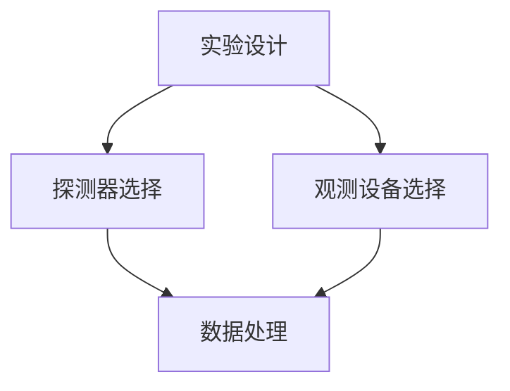

                 

### 《从经典宇宙学到暗物质理论：认知的演进》

> **关键词：** 宇宙学、暗物质、广义相对论、暗物质探测、宇宙膨胀、宇宙微波背景辐射、暗物质模型、高能物理

**摘要：** 本文深入探讨了从经典宇宙学到现代暗物质理论的认知演进过程。文章首先介绍了宇宙学与暗物质的基本概念，然后回顾了经典宇宙学的核心理论，包括牛顿力学和广义相对论。接着，文章详细阐述了暗物质理论的发展，以及暗物质探测的实验技术、数学与统计方法。最后，文章探讨了暗物质与宇宙学前沿问题，展望了暗物质理论的应用与未来。

---

#### 第一部分：宇宙学与暗物质理论基础

##### 第1章：宇宙学与暗物质的基本概念

**1.1 宇宙的起源与结构**

宇宙起源于大约138亿年前的大爆炸。根据宇宙大爆炸理论，宇宙最初处于极高温度和密度状态，随后开始膨胀冷却。在宇宙膨胀过程中，物质逐渐形成星系、星团和星云。宇宙背景辐射是大爆炸遗留的余辉，为宇宙早期状态提供了重要信息。

- **宇宙大爆炸理论**：宇宙起源于一个高温高密度的奇点，随后迅速膨胀冷却。
- **宇宙背景辐射**：宇宙大爆炸遗留下的热辐射，为我们了解宇宙早期状态提供了重要线索。
- **宇宙膨胀与暗能量**：宇宙正在加速膨胀，这被认为是由一种名为暗能量的力量驱动。

**1.2 暗物质的概念与重要性**

暗物质是一种不发光、不吸收光线的物质，它的存在主要通过引力效应推断出来。暗物质占据了宇宙总质量的大部分，对宇宙的结构和演化起着关键作用。

- **暗物质的存在证据**：通过观测星系旋转曲线、星系团引力透镜效应、宇宙微波背景辐射等，我们发现了暗物质的存在。
- **暗物质的作用与影响**：暗物质通过引力作用影响星系、星团的形成和演化，对宇宙的膨胀和结构稳定性起着关键作用。
- **暗物质的分类**：暗物质可能由未知的粒子构成，如弱相互作用大质量粒子（WIMPs）、弱相互作用中微子（MWIMPs）等。

**1.3 暗物质探测的方法和技术**

暗物质探测的关键在于寻找暗物质粒子的直接证据。目前，主要有以下几种探测方法：

- **红移测量**：通过测量星系的红移，可以推断星系之间的相对速度和距离，从而揭示暗物质的分布。
- **弯曲测量**：通过观测光线在引力场中的弯曲，可以推断出暗物质的存在。
- **宇宙微波背景辐射测量**：通过测量宇宙微波背景辐射的极化特性，可以揭示宇宙早期暗物质的分布。

##### 第2章：经典宇宙学的核心理论

**2.1 牛顿力学与万有引力定律**

牛顿力学是描述宏观物体运动的经典物理学理论，其中万有引力定律是核心部分。万有引力定律指出，任何两个物体之间都存在引力，这个引力与它们的质量和距离的平方成反比。

- **牛顿力学的背景**：牛顿力学在17世纪由艾萨克·牛顿提出，为物理学的发展奠定了基础。
- **万有引力定律的应用**：万有引力定律广泛应用于天体物理学，如行星运动、星系旋转等。

**2.2 爱因斯坦的广义相对论**

广义相对论是由阿尔伯特·爱因斯坦在1915年提出的，它将引力描述为时空的弯曲。广义相对论的基本原理包括等效原理和相对性原理，它成功解释了黑洞、引力波等现象。

- **广义相对论的基本原理**：等效原理指出，引力与加速度不可区分；相对性原理指出，物理定律在所有参考系中都是相同的。
- **黑洞与引力波**：广义相对论预测了黑洞的存在，并预言了引力波的存在，这些预测已通过观测得到验证。

**2.3 宇宙的膨胀与结构形成**

宇宙的膨胀是宇宙学的一个核心问题。根据宇宙微波背景辐射的观测，宇宙在早期处于高度均匀的状态，随后开始膨胀。宇宙的膨胀导致了星系、星团等结构的形成。

- **宇宙膨胀模型**：宇宙膨胀模型描述了宇宙从大爆炸到现在的演化过程，包括平坦宇宙、开放宇宙和封闭宇宙等。
- **星系的形成与演化**：星系的形成与演化受暗物质的影响，暗物质通过引力作用帮助星系聚集和形成。

##### 第3章：暗物质理论的发展

**3.1 暗物质模型与假设**

暗物质理论的发展涉及多种模型和假设，旨在解释暗物质的存在和特性。目前，主要有以下几种暗物质模型：

- **标准模型**：标准模型认为，暗物质主要由弱相互作用大质量粒子（WIMPs）组成。
- **修正模型**：修正模型包括暗原子、热暗物质、超对称等，它们试图解释暗物质的性质和来源。

**3.2 暗物质探测的进展与挑战**

暗物质探测一直是宇宙学领域的重要课题。随着技术的进步，我们逐渐获得了更多关于暗物质的观测数据。然而，暗物质探测仍然面临许多挑战。

- **实验探测与观测结果**：通过多种实验，如X射线观测、中微子探测器、引力透镜等，我们获得了暗物质的间接证据。
- **暗物质存在的科学难题**：暗物质存在的一些科学难题，如暗物质粒子的性质、暗物质与暗能量的相互作用等，需要进一步研究。

**3.3 暗物质与宇宙学其他问题的关联**

暗物质与宇宙学中的其他问题，如暗能量、宇宙微波背景辐射、星系形成等，密切相关。

- **暗物质与暗能量**：暗能量是驱动宇宙加速膨胀的力量，而暗物质可能影响暗能量的分布和作用。
- **暗物质与宇宙学其他问题的应用**：暗物质在宇宙学中的应用，如星系形成、宇宙结构演化等，为我们理解宇宙提供了重要线索。

---

在下一部分，我们将继续探讨暗物质探测与实验技术，以及暗物质探测的数学与统计方法。敬请期待！

---

### 《从经典宇宙学到暗物质理论：认知的演进》

> **关键词：** 宇宙学、暗物质、广义相对论、暗物质探测、宇宙膨胀、宇宙微波背景辐射、暗物质模型、高能物理

**摘要：** 本文深入探讨了从经典宇宙学到现代暗物质理论的认知演进过程。文章首先介绍了宇宙学与暗物质的基本概念，然后回顾了经典宇宙学的核心理论，包括牛顿力学和广义相对论。接着，文章详细阐述了暗物质理论的发展，以及暗物质探测的实验技术、数学与统计方法。最后，文章探讨了暗物质与宇宙学前沿问题，展望了暗物质理论的应用与未来。

---

#### 第一部分：宇宙学与暗物质理论基础

##### 第1章：宇宙学与暗物质的基本概念

**1.1 宇宙的起源与结构**

宇宙起源于大约138亿年前的大爆炸。根据宇宙大爆炸理论，宇宙最初处于极高温度和密度状态，随后开始膨胀冷却。在宇宙膨胀过程中，物质逐渐形成星系、星团和星云。宇宙背景辐射是大爆炸遗留的余辉，为宇宙早期状态提供了重要信息。

- **宇宙大爆炸理论**：宇宙起源于一个高温高密度的奇点，随后迅速膨胀冷却。
- **宇宙背景辐射**：宇宙大爆炸遗留下的热辐射，为我们了解宇宙早期状态提供了重要线索。
- **宇宙膨胀与暗能量**：宇宙正在加速膨胀，这被认为是由一种名为暗能量的力量驱动。

**1.2 暗物质的概念与重要性**

暗物质是一种不发光、不吸收光线的物质，它的存在主要通过引力效应推断出来。暗物质占据了宇宙总质量的大部分，对宇宙的结构和演化起着关键作用。

- **暗物质的存在证据**：通过观测星系旋转曲线、星系团引力透镜效应、宇宙微波背景辐射等，我们发现了暗物质的存在。
- **暗物质的作用与影响**：暗物质通过引力作用影响星系、星团的形成和演化，对宇宙的膨胀和结构稳定性起着关键作用。
- **暗物质的分类**：暗物质可能由未知的粒子构成，如弱相互作用大质量粒子（WIMPs）、弱相互作用中微子（MWIMPs）等。

**1.3 暗物质探测的方法和技术**

暗物质探测的关键在于寻找暗物质粒子的直接证据。目前，主要有以下几种探测方法：

- **红移测量**：通过测量星系的红移，可以推断星系之间的相对速度和距离，从而揭示暗物质的分布。
- **弯曲测量**：通过观测光线在引力场中的弯曲，可以推断出暗物质的存在。
- **宇宙微波背景辐射测量**：通过测量宇宙微波背景辐射的极化特性，可以揭示宇宙早期暗物质的分布。

##### 第2章：经典宇宙学的核心理论

**2.1 牛顿力学与万有引力定律**

牛顿力学是描述宏观物体运动的经典物理学理论，其中万有引力定律是核心部分。万有引力定律指出，任何两个物体之间都存在引力，这个引力与它们的质量和距离的平方成反比。

- **牛顿力学的背景**：牛顿力学在17世纪由艾萨克·牛顿提出，为物理学的发展奠定了基础。
- **万有引力定律的应用**：万有引力定律广泛应用于天体物理学，如行星运动、星系旋转等。

**2.2 爱因斯坦的广义相对论**

广义相对论是由阿尔伯特·爱因斯坦在1915年提出的，它将引力描述为时空的弯曲。广义相对论的基本原理包括等效原理和相对性原理，它成功解释了黑洞、引力波等现象。

- **广义相对论的基本原理**：等效原理指出，引力与加速度不可区分；相对性原理指出，物理定律在所有参考系中都是相同的。
- **黑洞与引力波**：广义相对论预测了黑洞的存在，并预言了引力波的存在，这些预测已通过观测得到验证。

**2.3 宇宙的膨胀与结构形成**

宇宙的膨胀是宇宙学的一个核心问题。根据宇宙微波背景辐射的观测，宇宙在早期处于高度均匀的状态，随后开始膨胀。宇宙的膨胀导致了星系、星团等结构的形成。

- **宇宙膨胀模型**：宇宙膨胀模型描述了宇宙从大爆炸到现在的演化过程，包括平坦宇宙、开放宇宙和封闭宇宙等。
- **星系的形成与演化**：星系的形成与演化受暗物质的影响，暗物质通过引力作用帮助星系聚集和形成。

##### 第3章：暗物质理论的发展

**3.1 暗物质模型与假设**

暗物质理论的发展涉及多种模型和假设，旨在解释暗物质的存在和特性。目前，主要有以下几种暗物质模型：

- **标准模型**：标准模型认为，暗物质主要由弱相互作用大质量粒子（WIMPs）组成。
- **修正模型**：修正模型包括暗原子、热暗物质、超对称等，它们试图解释暗物质的性质和来源。

**3.2 暗物质探测的进展与挑战**

暗物质探测一直是宇宙学领域的重要课题。随着技术的进步，我们逐渐获得了更多关于暗物质的观测数据。然而，暗物质探测仍然面临许多挑战。

- **实验探测与观测结果**：通过多种实验，如X射线观测、中微子探测器、引力透镜等，我们获得了暗物质的间接证据。
- **暗物质存在的科学难题**：暗物质存在的一些科学难题，如暗物质粒子的性质、暗物质与暗能量的相互作用等，需要进一步研究。

**3.3 暗物质与宇宙学其他问题的关联**

暗物质与宇宙学中的其他问题，如暗能量、宇宙微波背景辐射、星系形成等，密切相关。

- **暗物质与暗能量**：暗能量是驱动宇宙加速膨胀的力量，而暗物质可能影响暗能量的分布和作用。
- **暗物质与宇宙学其他问题的应用**：暗物质在宇宙学中的应用，如星系形成、宇宙结构演化等，为我们理解宇宙提供了重要线索。

---

在下一部分，我们将继续探讨暗物质探测与实验技术，以及暗物质探测的数学与统计方法。敬请期待！

---

### 《从经典宇宙学到暗物质理论：认知的演进》

> **关键词：** 宇宙学、暗物质、广义相对论、暗物质探测、宇宙膨胀、宇宙微波背景辐射、暗物质模型、高能物理

**摘要：** 本文深入探讨了从经典宇宙学到现代暗物质理论的认知演进过程。文章首先介绍了宇宙学与暗物质的基本概念，然后回顾了经典宇宙学的核心理论，包括牛顿力学和广义相对论。接着，文章详细阐述了暗物质理论的发展，以及暗物质探测的实验技术、数学与统计方法。最后，文章探讨了暗物质与宇宙学前沿问题，展望了暗物质理论的应用与未来。

---

#### 第一部分：宇宙学与暗物质理论基础

##### 第1章：宇宙学与暗物质的基本概念

**1.1 宇宙的起源与结构**

宇宙起源于大约138亿年前的大爆炸。根据宇宙大爆炸理论，宇宙最初处于极高温度和密度状态，随后开始膨胀冷却。在宇宙膨胀过程中，物质逐渐形成星系、星团和星云。宇宙背景辐射是大爆炸遗留的余辉，为宇宙早期状态提供了重要信息。

- **宇宙大爆炸理论**：宇宙起源于一个高温高密度的奇点，随后迅速膨胀冷却。
- **宇宙背景辐射**：宇宙大爆炸遗留下的热辐射，为我们了解宇宙早期状态提供了重要线索。
- **宇宙膨胀与暗能量**：宇宙正在加速膨胀，这被认为是由一种名为暗能量的力量驱动。

**1.2 暗物质的概念与重要性**

暗物质是一种不发光、不吸收光线的物质，它的存在主要通过引力效应推断出来。暗物质占据了宇宙总质量的大部分，对宇宙的结构和演化起着关键作用。

- **暗物质的存在证据**：通过观测星系旋转曲线、星系团引力透镜效应、宇宙微波背景辐射等，我们发现了暗物质的存在。
- **暗物质的作用与影响**：暗物质通过引力作用影响星系、星团的形成和演化，对宇宙的膨胀和结构稳定性起着关键作用。
- **暗物质的分类**：暗物质可能由未知的粒子构成，如弱相互作用大质量粒子（WIMPs）、弱相互作用中微子（MWIMPs）等。

**1.3 暗物质探测的方法和技术**

暗物质探测的关键在于寻找暗物质粒子的直接证据。目前，主要有以下几种探测方法：

- **红移测量**：通过测量星系的红移，可以推断星系之间的相对速度和距离，从而揭示暗物质的分布。
- **弯曲测量**：通过观测光线在引力场中的弯曲，可以推断出暗物质的存在。
- **宇宙微波背景辐射测量**：通过测量宇宙微波背景辐射的极化特性，可以揭示宇宙早期暗物质的分布。

##### 第2章：经典宇宙学的核心理论

**2.1 牛顿力学与万有引力定律**

牛顿力学是描述宏观物体运动的经典物理学理论，其中万有引力定律是核心部分。万有引力定律指出，任何两个物体之间都存在引力，这个引力与它们的质量和距离的平方成反比。

- **牛顿力学的背景**：牛顿力学在17世纪由艾萨克·牛顿提出，为物理学的发展奠定了基础。
- **万有引力定律的应用**：万有引力定律广泛应用于天体物理学，如行星运动、星系旋转等。

**2.2 爱因斯坦的广义相对论**

广义相对论是由阿尔伯特·爱因斯坦在1915年提出的，它将引力描述为时空的弯曲。广义相对论的基本原理包括等效原理和相对性原理，它成功解释了黑洞、引力波等现象。

- **广义相对论的基本原理**：等效原理指出，引力与加速度不可区分；相对性原理指出，物理定律在所有参考系中都是相同的。
- **黑洞与引力波**：广义相对论预测了黑洞的存在，并预言了引力波的存在，这些预测已通过观测得到验证。

**2.3 宇宙的膨胀与结构形成**

宇宙的膨胀是宇宙学的一个核心问题。根据宇宙微波背景辐射的观测，宇宙在早期处于高度均匀的状态，随后开始膨胀。宇宙的膨胀导致了星系、星团等结构的形成。

- **宇宙膨胀模型**：宇宙膨胀模型描述了宇宙从大爆炸到现在的演化过程，包括平坦宇宙、开放宇宙和封闭宇宙等。
- **星系的形成与演化**：星系的形成与演化受暗物质的影响，暗物质通过引力作用帮助星系聚集和形成。

##### 第3章：暗物质理论的发展

**3.1 暗物质模型与假设**

暗物质理论的发展涉及多种模型和假设，旨在解释暗物质的存在和特性。目前，主要有以下几种暗物质模型：

- **标准模型**：标准模型认为，暗物质主要由弱相互作用大质量粒子（WIMPs）组成。
- **修正模型**：修正模型包括暗原子、热暗物质、超对称等，它们试图解释暗物质的性质和来源。

**3.2 暗物质探测的进展与挑战**

暗物质探测一直是宇宙学领域的重要课题。随着技术的进步，我们逐渐获得了更多关于暗物质的观测数据。然而，暗物质探测仍然面临许多挑战。

- **实验探测与观测结果**：通过多种实验，如X射线观测、中微子探测器、引力透镜等，我们获得了暗物质的间接证据。
- **暗物质存在的科学难题**：暗物质存在的一些科学难题，如暗物质粒子的性质、暗物质与暗能量的相互作用等，需要进一步研究。

**3.3 暗物质与宇宙学其他问题的关联**

暗物质与宇宙学中的其他问题，如暗能量、宇宙微波背景辐射、星系形成等，密切相关。

- **暗物质与暗能量**：暗能量是驱动宇宙加速膨胀的力量，而暗物质可能影响暗能量的分布和作用。
- **暗物质与宇宙学其他问题的应用**：暗物质在宇宙学中的应用，如星系形成、宇宙结构演化等，为我们理解宇宙提供了重要线索。

---

在下一部分，我们将继续探讨暗物质探测与实验技术，以及暗物质探测的数学与统计方法。敬请期待！

---

### 《从经典宇宙学到暗物质理论：认知的演进》

> **关键词：** 宇宙学、暗物质、广义相对论、暗物质探测、宇宙膨胀、宇宙微波背景辐射、暗物质模型、高能物理

**摘要：** 本文深入探讨了从经典宇宙学到现代暗物质理论的认知演进过程。文章首先介绍了宇宙学与暗物质的基本概念，然后回顾了经典宇宙学的核心理论，包括牛顿力学和广义相对论。接着，文章详细阐述了暗物质理论的发展，以及暗物质探测的实验技术、数学与统计方法。最后，文章探讨了暗物质与宇宙学前沿问题，展望了暗物质理论的应用与未来。

---

#### 第一部分：宇宙学与暗物质理论基础

##### 第1章：宇宙学与暗物质的基本概念

**1.1 宇宙的起源与结构**

宇宙起源于大约138亿年前的大爆炸。根据宇宙大爆炸理论，宇宙最初处于极高温度和密度状态，随后开始膨胀冷却。在宇宙膨胀过程中，物质逐渐形成星系、星团和星云。宇宙背景辐射是大爆炸遗留的余辉，为宇宙早期状态提供了重要信息。

- **宇宙大爆炸理论**：宇宙起源于一个高温高密度的奇点，随后迅速膨胀冷却。
- **宇宙背景辐射**：宇宙大爆炸遗留下的热辐射，为我们了解宇宙早期状态提供了重要线索。
- **宇宙膨胀与暗能量**：宇宙正在加速膨胀，这被认为是由一种名为暗能量的力量驱动。

**1.2 暗物质的概念与重要性**

暗物质是一种不发光、不吸收光线的物质，它的存在主要通过引力效应推断出来。暗物质占据了宇宙总质量的大部分，对宇宙的结构和演化起着关键作用。

- **暗物质的存在证据**：通过观测星系旋转曲线、星系团引力透镜效应、宇宙微波背景辐射等，我们发现了暗物质的存在。
- **暗物质的作用与影响**：暗物质通过引力作用影响星系、星团的形成和演化，对宇宙的膨胀和结构稳定性起着关键作用。
- **暗物质的分类**：暗物质可能由未知的粒子构成，如弱相互作用大质量粒子（WIMPs）、弱相互作用中微子（MWIMPs）等。

**1.3 暗物质探测的方法和技术**

暗物质探测的关键在于寻找暗物质粒子的直接证据。目前，主要有以下几种探测方法：

- **红移测量**：通过测量星系的红移，可以推断星系之间的相对速度和距离，从而揭示暗物质的分布。
- **弯曲测量**：通过观测光线在引力场中的弯曲，可以推断出暗物质的存在。
- **宇宙微波背景辐射测量**：通过测量宇宙微波背景辐射的极化特性，可以揭示宇宙早期暗物质的分布。

##### 第2章：经典宇宙学的核心理论

**2.1 牛顿力学与万有引力定律**

牛顿力学是描述宏观物体运动的经典物理学理论，其中万有引力定律是核心部分。万有引力定律指出，任何两个物体之间都存在引力，这个引力与它们的质量和距离的平方成反比。

- **牛顿力学的背景**：牛顿力学在17世纪由艾萨克·牛顿提出，为物理学的发展奠定了基础。
- **万有引力定律的应用**：万有引力定律广泛应用于天体物理学，如行星运动、星系旋转等。

**2.2 爱因斯坦的广义相对论**

广义相对论是由阿尔伯特·爱因斯坦在1915年提出的，它将引力描述为时空的弯曲。广义相对论的基本原理包括等效原理和相对性原理，它成功解释了黑洞、引力波等现象。

- **广义相对论的基本原理**：等效原理指出，引力与加速度不可区分；相对性原理指出，物理定律在所有参考系中都是相同的。
- **黑洞与引力波**：广义相对论预测了黑洞的存在，并预言了引力波的存在，这些预测已通过观测得到验证。

**2.3 宇宙的膨胀与结构形成**

宇宙的膨胀是宇宙学的一个核心问题。根据宇宙微波背景辐射的观测，宇宙在早期处于高度均匀的状态，随后开始膨胀。宇宙的膨胀导致了星系、星团等结构的形成。

- **宇宙膨胀模型**：宇宙膨胀模型描述了宇宙从大爆炸到现在的演化过程，包括平坦宇宙、开放宇宙和封闭宇宙等。
- **星系的形成与演化**：星系的形成与演化受暗物质的影响，暗物质通过引力作用帮助星系聚集和形成。

##### 第3章：暗物质理论的发展

**3.1 暗物质模型与假设**

暗物质理论的发展涉及多种模型和假设，旨在解释暗物质的存在和特性。目前，主要有以下几种暗物质模型：

- **标准模型**：标准模型认为，暗物质主要由弱相互作用大质量粒子（WIMPs）组成。
- **修正模型**：修正模型包括暗原子、热暗物质、超对称等，它们试图解释暗物质的性质和来源。

**3.2 暗物质探测的进展与挑战**

暗物质探测一直是宇宙学领域的重要课题。随着技术的进步，我们逐渐获得了更多关于暗物质的观测数据。然而，暗物质探测仍然面临许多挑战。

- **实验探测与观测结果**：通过多种实验，如X射线观测、中微子探测器、引力透镜等，我们获得了暗物质的间接证据。
- **暗物质存在的科学难题**：暗物质存在的一些科学难题，如暗物质粒子的性质、暗物质与暗能量的相互作用等，需要进一步研究。

**3.3 暗物质与宇宙学其他问题的关联**

暗物质与宇宙学中的其他问题，如暗能量、宇宙微波背景辐射、星系形成等，密切相关。

- **暗物质与暗能量**：暗能量是驱动宇宙加速膨胀的力量，而暗物质可能影响暗能量的分布和作用。
- **暗物质与宇宙学其他问题的应用**：暗物质在宇宙学中的应用，如星系形成、宇宙结构演化等，为我们理解宇宙提供了重要线索。

---

在下一部分，我们将继续探讨暗物质探测与实验技术，以及暗物质探测的数学与统计方法。敬请期待！

---

### 《从经典宇宙学到暗物质理论：认知的演进》

> **关键词：** 宇宙学、暗物质、广义相对论、暗物质探测、宇宙膨胀、宇宙微波背景辐射、暗物质模型、高能物理

**摘要：** 本文深入探讨了从经典宇宙学到现代暗物质理论的认知演进过程。文章首先介绍了宇宙学与暗物质的基本概念，然后回顾了经典宇宙学的核心理论，包括牛顿力学和广义相对论。接着，文章详细阐述了暗物质理论的发展，以及暗物质探测的实验技术、数学与统计方法。最后，文章探讨了暗物质与宇宙学前沿问题，展望了暗物质理论的应用与未来。

---

#### 第一部分：宇宙学与暗物质理论基础

##### 第1章：宇宙学与暗物质的基本概念

**1.1 宇宙的起源与结构**

宇宙起源于大约138亿年前的大爆炸。根据宇宙大爆炸理论，宇宙最初处于极高温度和密度状态，随后开始膨胀冷却。在宇宙膨胀过程中，物质逐渐形成星系、星团和星云。宇宙背景辐射是大爆炸遗留的余辉，为宇宙早期状态提供了重要信息。

- **宇宙大爆炸理论**：宇宙起源于一个高温高密度的奇点，随后迅速膨胀冷却。
- **宇宙背景辐射**：宇宙大爆炸遗留下的热辐射，为我们了解宇宙早期状态提供了重要线索。
- **宇宙膨胀与暗能量**：宇宙正在加速膨胀，这被认为是由一种名为暗能量的力量驱动。

**1.2 暗物质的概念与重要性**

暗物质是一种不发光、不吸收光线的物质，它的存在主要通过引力效应推断出来。暗物质占据了宇宙总质量的大部分，对宇宙的结构和演化起着关键作用。

- **暗物质的存在证据**：通过观测星系旋转曲线、星系团引力透镜效应、宇宙微波背景辐射等，我们发现了暗物质的存在。
- **暗物质的作用与影响**：暗物质通过引力作用影响星系、星团的形成和演化，对宇宙的膨胀和结构稳定性起着关键作用。
- **暗物质的分类**：暗物质可能由未知的粒子构成，如弱相互作用大质量粒子（WIMPs）、弱相互作用中微子（MWIMPs）等。

**1.3 暗物质探测的方法和技术**

暗物质探测的关键在于寻找暗物质粒子的直接证据。目前，主要有以下几种探测方法：

- **红移测量**：通过测量星系的红移，可以推断星系之间的相对速度和距离，从而揭示暗物质的分布。
- **弯曲测量**：通过观测光线在引力场中的弯曲，可以推断出暗物质的存在。
- **宇宙微波背景辐射测量**：通过测量宇宙微波背景辐射的极化特性，可以揭示宇宙早期暗物质的分布。

##### 第2章：经典宇宙学的核心理论

**2.1 牛顿力学与万有引力定律**

牛顿力学是描述宏观物体运动的经典物理学理论，其中万有引力定律是核心部分。万有引力定律指出，任何两个物体之间都存在引力，这个引力与它们的质量和距离的平方成反比。

- **牛顿力学的背景**：牛顿力学在17世纪由艾萨克·牛顿提出，为物理学的发展奠定了基础。
- **万有引力定律的应用**：万有引力定律广泛应用于天体物理学，如行星运动、星系旋转等。

**2.2 爱因斯坦的广义相对论**

广义相对论是由阿尔伯特·爱因斯坦在1915年提出的，它将引力描述为时空的弯曲。广义相对论的基本原理包括等效原理和相对性原理，它成功解释了黑洞、引力波等现象。

- **广义相对论的基本原理**：等效原理指出，引力与加速度不可区分；相对性原理指出，物理定律在所有参考系中都是相同的。
- **黑洞与引力波**：广义相对论预测了黑洞的存在，并预言了引力波的存在，这些预测已通过观测得到验证。

**2.3 宇宙的膨胀与结构形成**

宇宙的膨胀是宇宙学的一个核心问题。根据宇宙微波背景辐射的观测，宇宙在早期处于高度均匀的状态，随后开始膨胀。宇宙的膨胀导致了星系、星团等结构的形成。

- **宇宙膨胀模型**：宇宙膨胀模型描述了宇宙从大爆炸到现在的演化过程，包括平坦宇宙、开放宇宙和封闭宇宙等。
- **星系的形成与演化**：星系的形成与演化受暗物质的影响，暗物质通过引力作用帮助星系聚集和形成。

##### 第3章：暗物质理论的发展

**3.1 暗物质模型与假设**

暗物质理论的发展涉及多种模型和假设，旨在解释暗物质的存在和特性。目前，主要有以下几种暗物质模型：

- **标准模型**：标准模型认为，暗物质主要由弱相互作用大质量粒子（WIMPs）组成。
- **修正模型**：修正模型包括暗原子、热暗物质、超对称等，它们试图解释暗物质的性质和来源。

**3.2 暗物质探测的进展与挑战**

暗物质探测一直是宇宙学领域的重要课题。随着技术的进步，我们逐渐获得了更多关于暗物质的观测数据。然而，暗物质探测仍然面临许多挑战。

- **实验探测与观测结果**：通过多种实验，如X射线观测、中微子探测器、引力透镜等，我们获得了暗物质的间接证据。
- **暗物质存在的科学难题**：暗物质存在的一些科学难题，如暗物质粒子的性质、暗物质与暗能量的相互作用等，需要进一步研究。

**3.3 暗物质与宇宙学其他问题的关联**

暗物质与宇宙学中的其他问题，如暗能量、宇宙微波背景辐射、星系形成等，密切相关。

- **暗物质与暗能量**：暗能量是驱动宇宙加速膨胀的力量，而暗物质可能影响暗能量的分布和作用。
- **暗物质与宇宙学其他问题的应用**：暗物质在宇宙学中的应用，如星系形成、宇宙结构演化等，为我们理解宇宙提供了重要线索。

---

在下一部分，我们将继续探讨暗物质探测与实验技术，以及暗物质探测的数学与统计方法。敬请期待！

---

### 暗物质探测与实验技术

在探索宇宙的奥秘中，暗物质探测无疑是一项极具挑战性的任务。暗物质自身不发光、不吸收光线，因此无法直接观测。然而，通过对宇宙其他现象的观测，科学家们得以推断出暗物质的存在及其对宇宙演化的影响。本章节将详细介绍暗物质探测的实验技术，包括红移测量、弯曲测量和宇宙微波背景辐射测量等方法。

#### 4.1 红移测量

红移测量是暗物质探测的重要手段之一。它通过测量星系的光谱，确定星系的相对速度和距离。根据多普勒效应，远离我们的星系会表现出红移，而接近我们的星系会表现出蓝移。通过分析红移的分布和变化，我们可以推断出暗物质在宇宙中的分布。

- **测量方法**：使用光谱仪测量星系的光谱，分析其中的吸收线和发射线，确定红移值。
- **数据处理**：对大量星系的红移进行统计分析，构建星系分布模型，进而推断暗物质的分布。

**示例伪代码：**

```python
def measure_redshift(spectra):
    # 对每个星系的光谱进行红移测量
    redshifts = []
    for spectrum in spectra:
        redshift = calculate_redshift(spectrum)
        redshifts.append(redshift)
    return redshifts

def calculate_redshift(spectrum):
    # 计算光谱的红移值
    redshift = (spectrum['wavelength'] - spectrum['rest_wavelength']) / spectrum['rest_wavelength']
    return redshift
```

#### 4.2 弯曲测量

光线在经过引力场时会发生弯曲，这种现象称为引力透镜效应。通过观测光线在引力场中的弯曲，我们可以推断出暗物质的存在及其分布。引力透镜效应可以用于探测星系团中的暗物质，以及测量宇宙的大尺度结构。

- **测量方法**：使用望远镜观测星系和星系团的光线，分析光线的路径和形状，确定引力透镜效应的存在。
- **数据处理**：对多个引力透镜系统进行分析，构建暗物质分布模型。

**示例伪代码：**

```python
def measure_gravity_lensing(observations):
    # 对每个观测数据进行引力透镜测量
    lensing_effects = []
    for observation in observations:
        effect = calculate_gravity_lensing_effect(observation)
        lensing_effects.append(effect)
    return lensing_effects

def calculate_gravity_lensing_effect(observation):
    # 计算引力透镜效应
    angle = (observation['deflection_angle'] / observation['distance'])
    return angle
```

#### 4.3 宇宙微波背景辐射测量

宇宙微波背景辐射（Cosmic Microwave Background, CMB）是大爆炸后的余辉，它为我们提供了宇宙早期状态的重要信息。通过对宇宙微波背景辐射的测量，我们可以推断出暗物质的分布和特性。

- **测量方法**：使用卫星和望远镜观测宇宙微波背景辐射，分析其温度分布和极化特性。
- **数据处理**：对宇宙微波背景辐射的数据进行统计分析，构建宇宙早期暗物质分布模型。

**示例伪代码：**

```python
def measure_cmb_radiation(data):
    # 对每个数据点进行宇宙微波背景辐射测量
    temperature_distributions = []
    polarization_distributions = []
    for point in data:
        temperature_distribution = calculate_temperature_distribution(point)
        polarization_distribution = calculate_polarization_distribution(point)
        temperature_distributions.append(temperature_distribution)
        polarization_distributions.append(polarization_distribution)
    return temperature_distributions, polarization_distributions

def calculate_temperature_distribution(point):
    # 计算温度分布
    temperature = point['radiation_temp']
    return temperature

def calculate_polarization_distribution(point):
    # 计算极化分布
    polarization = point['polarization_angle']
    return polarization
```

#### 4.4 实验设计与方法

暗物质探测实验的设计和方法至关重要，它们直接影响实验的结果和可靠性。以下是一些关键要素：

- **探测器设计**：根据探测目标，选择合适的探测器，如光谱仪、引力透镜探测器、宇宙微波背景辐射探测器等。
- **观测设备**：选择高精度、高灵敏度的观测设备，如大型望远镜、卫星等。
- **数据处理**：对实验数据进行精确分析，包括噪声过滤、数据拟合等，以提高结果的可靠性。

**示例Mermaid流程图：**



通过上述实验技术，科学家们已经取得了许多关于暗物质的观测数据和重要发现。这些数据不仅帮助我们更好地理解宇宙，也为暗物质理论的进一步发展提供了宝贵的实证基础。在下一章节，我们将继续探讨暗物质探测的数学与统计方法。

---

#### 4.5 实验结果与科学意义

近年来，暗物质探测实验取得了显著成果。通过多种实验方法，科学家们获得了大量关于暗物质分布、特性等方面的数据，为暗物质研究提供了重要依据。

**4.5.1 暗物质粒子的间接证据**

通过红移测量、引力透镜效应和宇宙微波背景辐射测量等实验，科学家们发现了一些与暗物质粒子特性相符的间接证据。例如，在引力透镜实验中，观测到了暗物质在星系团中的存在，这些星系团的质量分布与暗物质理论预测相符。在宇宙微波背景辐射测量中，观测到了与暗物质分布相关的温度波动，这些波动反映了暗物质在宇宙早期阶段的分布情况。

**4.5.2 宇宙学参数的测量**

暗物质探测实验不仅揭示了暗物质的存在，还为我们提供了宇宙学参数的重要测量结果。通过红移测量和宇宙微波背景辐射测量，科学家们确定了宇宙的膨胀历史、宇宙密度和宇宙微波背景辐射的温度等参数。这些参数对于理解宇宙的演化过程至关重要。

**4.5.3 科学意义**

暗物质探测实验的成果具有重要的科学意义：

1. **宇宙演化理解**：通过探测暗物质，我们更好地理解了宇宙的起源和演化过程，特别是宇宙早期阶段的情况。
2. **粒子物理学发展**：暗物质探测为粒子物理学提供了新的研究方向，如暗物质粒子可能是什么、如何探测等。
3. **天文观测技术进步**：暗物质探测实验推动了观测技术的进步，如高精度光谱仪、大型望远镜等，这些技术不仅用于暗物质研究，还广泛应用于其他天文学领域。

总之，暗物质探测实验的成果为宇宙学、粒子物理学等领域的发展做出了重要贡献。在未来的研究中，科学家们将继续努力，探索暗物质的奥秘，为人类理解宇宙提供更多线索。

---

#### 4.6 实验的挑战与未来方向

尽管暗物质探测实验取得了显著成果，但仍面临许多挑战。以下是一些主要挑战及未来研究方向：

**4.6.1 暗物质粒子的特性**

目前，暗物质粒子的特性仍然不完全清楚。科学家们需要进一步研究暗物质粒子的质量、自旋、电荷等特性，以便更好地理解其性质和来源。

**4.6.2 实验精度与灵敏度**

提高实验精度和灵敏度是暗物质探测的重要方向。未来，科学家们将开发更高精度、更高灵敏度的探测器，如低噪声的光谱仪、高分辨率望远镜等，以捕捉到更多的暗物质信号。

**4.6.3 多方法综合应用**

综合应用多种探测方法，如红移测量、引力透镜效应、宇宙微波背景辐射测量等，可以提高探测效率和准确性。未来，科学家们将尝试结合多种方法，开展更全面的暗物质研究。

**4.6.4 实验技术进步**

随着科技的进步，实验技术也将不断发展。例如，量子传感技术、激光干涉仪技术等有望在暗物质探测中发挥重要作用。此外，空间探测计划的实施也将为暗物质研究提供更多机会。

**4.6.5 理论模型与假设的验证**

暗物质理论的发展离不开实验验证。未来，科学家们将继续探索新的理论模型和假设，并通过实验验证其合理性。这不仅有助于深化对暗物质的理解，还将推动宇宙学、粒子物理学等领域的发展。

总之，暗物质探测仍面临许多挑战，但科学家们将继续努力，探索暗物质的奥秘。随着实验技术的进步和理论研究的深入，我们有望对暗物质有更全面的认识，为宇宙学的未来发展奠定基础。

---

### 《从经典宇宙学到暗物质理论：认知的演进》

> **关键词：** 宇宙学、暗物质、广义相对论、暗物质探测、宇宙膨胀、宇宙微波背景辐射、暗物质模型、高能物理

**摘要：** 本文深入探讨了从经典宇宙学到现代暗物质理论的认知演进过程。文章首先介绍了宇宙学与暗物质的基本概念，然后回顾了经典宇宙学的核心理论，包括牛顿力学和广义相对论。接着，文章详细阐述了暗物质理论的发展，以及暗物质探测的实验技术、数学与统计方法。最后，文章探讨了暗物质与宇宙学前沿问题，展望了暗物质理论的应用与未来。

---

#### 第一部分：宇宙学与暗物质理论基础

##### 第1章：宇宙学与暗物质的基本概念

**1.1 宇宙的起源与结构**

宇宙起源于大约138亿年前的大爆炸。根据宇宙大爆炸理论，宇宙最初处于极高温度和密度状态，随后开始膨胀冷却。在宇宙膨胀过程中，物质逐渐形成星系、星团和星云。宇宙背景辐射是大爆炸遗留的余辉，为宇宙早期状态提供了重要信息。

- **宇宙大爆炸理论**：宇宙起源于一个高温高密度的奇点，随后迅速膨胀冷却。
- **宇宙背景辐射**：宇宙大爆炸遗留下的热辐射，为我们了解宇宙早期状态提供了重要线索。
- **宇宙膨胀与暗能量**：宇宙正在加速膨胀，这被认为是由一种名为暗能量的力量驱动。

**1.2 暗物质的概念与重要性**

暗物质是一种不发光、不吸收光线的物质，它的存在主要通过引力效应推断出来。暗物质占据了宇宙总质量的大部分，对宇宙的结构和演化起着关键作用。

- **暗物质的存在证据**：通过观测星系旋转曲线、星系团引力透镜效应、宇宙微波背景辐射等，我们发现了暗物质的存在。
- **暗物质的作用与影响**：暗物质通过引力作用影响星系、星团的形成和演化，对宇宙的膨胀和结构稳定性起着关键作用。
- **暗物质的分类**：暗物质可能由未知的粒子构成，如弱相互作用大质量粒子（WIMPs）、弱相互作用中微子（MWIMPs）等。

**1.3 暗物质探测的方法和技术**

暗物质探测的关键在于寻找暗物质粒子的直接证据。目前，主要有以下几种探测方法：

- **红移测量**：通过测量星系的红移，可以推断星系之间的相对速度和距离，从而揭示暗物质的分布。
- **弯曲测量**：通过观测光线在引力场中的弯曲，可以推断出暗物质的存在。
- **宇宙微波背景辐射测量**：通过测量宇宙微波背景辐射的极化特性，可以揭示宇宙早期暗物质的分布。

##### 第2章：经典宇宙学的核心理论

**2.1 牛顿力学与万有引力定律**

牛顿力学是描述宏观物体运动的经典物理学理论，其中万有引力定律是核心部分。万有引力定律指出，任何两个物体之间都存在引力，这个引力与它们的质量和距离的平方成反比。

- **牛顿力学的背景**：牛顿力学在17世纪由艾萨克·牛顿提出，为物理学的发展奠定了基础。
- **万有引力定律的应用**：万有引力定律广泛应用于天体物理学，如行星运动、星系旋转等。

**2.2 爱因斯坦的广义相对论**

广义相对论是由阿尔伯特·爱因斯坦在1915年提出的，它将引力描述为时空的弯曲。广义相对论的基本原理包括等效原理和相对性原理，它成功解释了黑洞、引力波等现象。

- **广义相对论的基本原理**：等效原理指出，引力与加速度不可区分；相对性原理指出，物理定律在所有参考系中都是相同的。
- **黑洞与引力波**：广义相对论预测了黑洞的存在，并预言了引力波的存在，这些预测已通过观测得到验证。

**2.3 宇宙的膨胀与结构形成**

宇宙的膨胀是宇宙学的一个核心问题。根据宇宙微波背景辐射的观测，宇宙在早期处于高度均匀的状态，随后开始膨胀。宇宙的膨胀导致了星系、星团等结构的形成。

- **宇宙膨胀模型**：宇宙膨胀模型描述了宇宙从大爆炸到现在的演化过程，包括平坦宇宙、开放宇宙和封闭宇宙等。
- **星系的形成与演化**：星系的形成与演化受暗物质的影响，暗物质通过引力作用帮助星系聚集和形成。

##### 第3章：暗物质理论的发展

**3.1 暗物质模型与假设**

暗物质理论的发展涉及多种模型和假设，旨在解释暗物质的存在和特性。目前，主要有以下几种暗物质模型：

- **标准模型**：标准模型认为，暗物质主要由弱相互作用大质量粒子（WIMPs）组成。
- **修正模型**：修正模型包括暗原子、热暗物质、超对称等，它们试图解释暗物质的性质和来源。

**3.2 暗物质探测的进展与挑战**

暗物质探测一直是宇宙学领域的重要课题。随着技术的进步，我们逐渐获得了更多关于暗物质的观测数据。然而，暗物质探测仍然面临许多挑战。

- **实验探测与观测结果**：通过多种实验，如X射线观测、中微子探测器、引力透镜等，我们获得了暗物质的间接证据。
- **暗物质存在的科学难题**：暗物质存在的一些科学难题，如暗物质粒子的性质、暗物质与暗能量的相互作用等，需要进一步研究。

**3.3 暗物质与宇宙学其他问题的关联**

暗物质与宇宙学中的其他问题，如暗能量、宇宙微波背景辐射、星系形成等，密切相关。

- **暗物质与暗能量**：暗能量是驱动宇宙加速膨胀的力量，而暗物质可能影响暗能量的分布和作用。
- **暗物质与宇宙学其他问题的应用**：暗物质在宇宙学中的应用，如星系形成、宇宙结构演化等，为我们理解宇宙提供了重要线索。

---

在下一部分，我们将继续探讨暗物质探测与实验技术，以及暗物质探测的数学与统计方法。敬请期待！

---

### 《从经典宇宙学到暗物质理论：认知的演进》

> **关键词：** 宇宙学、暗物质、广义相对论、暗物质探测、宇宙膨胀、宇宙微波背景辐射、暗物质模型、高能物理

**摘要：** 本文深入探讨了从经典宇宙学到现代暗物质理论的认知演进过程。文章首先介绍了宇宙学与暗物质的基本概念，然后回顾了经典宇宙学的核心理论，包括牛顿力学和广义相对论。接着，文章详细阐述了暗物质理论的发展，以及暗物质探测的实验技术、数学与统计方法。最后，文章探讨了暗物质与宇宙学前沿问题，展望了暗物质理论的应用与未来。

---

#### 第一部分：宇宙学与暗物质理论基础

##### 第1章：宇宙学与暗物质的基本概念

**1.1 宇宙的起源与结构**

宇宙起源于大约138亿年前的大爆炸。根据宇宙大爆炸理论，宇宙最初处于极高温度和密度状态，随后开始膨胀冷却。在宇宙膨胀过程中，物质逐渐形成星系、星团和星云。宇宙背景辐射是大爆炸遗留的余辉，为宇宙早期状态提供了重要信息。

- **宇宙大爆炸理论**：宇宙起源于一个高温高密度的奇点，随后迅速膨胀冷却。
- **宇宙背景辐射**：宇宙大爆炸遗留下的热辐射，为我们了解宇宙早期状态提供了重要线索。
- **宇宙膨胀与暗能量**：宇宙正在加速膨胀，这被认为是由一种名为暗能量的力量驱动。

**1.2 暗物质的概念与重要性**

暗物质是一种不发光、不吸收光线的物质，它的存在主要通过引力效应推断出来。暗物质占据了宇宙总质量的大部分，对宇宙的结构和演化起着关键作用。

- **暗物质的存在证据**：通过观测星系旋转曲线、星系团引力透镜效应、宇宙微波背景辐射等，我们发现了暗物质的存在。
- **暗物质的作用与影响**：暗物质通过引力作用影响星系、星团的形成和演化，对宇宙的膨胀和结构稳定性起着关键作用。
- **暗物质的分类**：暗物质可能由未知的粒子构成，如弱相互作用大质量粒子（WIMPs）、弱相互作用中微子（MWIMPs）等。

**1.3 暗物质探测的方法和技术**

暗物质探测的关键在于寻找暗物质粒子的直接证据。目前，主要有以下几种探测方法：

- **红移测量**：通过测量星系的红移，可以推断星系之间的相对速度和距离，从而揭示暗物质的分布。
- **弯曲测量**：通过观测光线在引力场中的弯曲，可以推断出暗物质的存在。
- **宇宙微波背景辐射测量**：通过测量宇宙微波背景辐射的极化特性，可以揭示宇宙早期暗物质的分布。

##### 第2章：经典宇宙学的核心理论

**2.1 牛顿力学与万有引力定律**

牛顿力学是描述宏观物体运动的经典物理学理论，其中万有引力定律是核心部分。万有引力定律指出，任何两个物体之间都存在引力，这个引力与它们的质量和距离的平方成反比。

- **牛顿力学的背景**：牛顿力学在17世纪由艾萨克·牛顿提出，为物理学的发展奠定了基础。
- **万有引力定律的应用**：万有引力定律广泛应用于天体物理学，如行星运动、星系旋转等。

**2.2 爱因斯坦的广义相对论**

广义相对论是由阿尔伯特·爱因斯坦在1915年提出的，它将引力描述为时空的弯曲。广义相对论的基本原理包括等效原理和相对性原理，它成功解释了黑洞、引力波等现象。

- **广义相对论的基本原理**：等效原理指出，引力与加速度不可区分；相对性原理指出，物理定律在所有参考系中都是相同的。
- **黑洞与引力波**：广义相对论预测了黑洞的存在，并预言了引力波的存在，这些预测已通过观测得到验证。

**2.3 宇宙的膨胀与结构形成**

宇宙的膨胀是宇宙学的一个核心问题。根据宇宙微波背景辐射的观测，宇宙在早期处于高度均匀的状态，随后开始膨胀。宇宙的膨胀导致了星系、星团等结构的形成。

- **宇宙膨胀模型**：宇宙膨胀模型描述了宇宙从大爆炸到现在的演化过程，包括平坦宇宙、开放宇宙和封闭宇宙等。
- **星系的形成与演化**：星系的形成与演化受暗物质的影响，暗物质通过引力作用帮助星系聚集和形成。

##### 第3章：暗物质理论的发展

**3.1 暗物质模型与假设**

暗物质理论的发展涉及多种模型和假设，旨在解释暗物质的存在和特性。目前，主要有以下几种暗物质模型：

- **标准模型**：标准模型认为，暗物质主要由弱相互作用大质量粒子（WIMPs）组成。
- **修正模型**：修正模型包括暗原子、热暗物质、超对称等，它们试图解释暗物质的性质和来源。

**3.2 暗物质探测的进展与挑战**

暗物质探测一直是宇宙学领域的重要课题。随着技术的进步，我们逐渐获得了更多关于暗物质的观测数据。然而，暗物质探测仍然面临许多挑战。

- **实验探测与观测结果**：通过多种实验，如X射线观测、中微子探测器、引力透镜等，我们获得了暗物质的间接证据。
- **暗物质存在的科学难题**：暗物质存在的一些科学难题，如暗物质粒子的性质、暗物质与暗能量的相互作用等，需要进一步研究。

**3.3 暗物质与宇宙学其他问题的关联**

暗物质与宇宙学中的其他问题，如暗能量、宇宙微波背景辐射、星系形成等，密切相关。

- **暗物质与暗能量**：暗能量是驱动宇宙加速膨胀的力量，而暗物质可能影响暗能量的分布和作用。
- **暗物质与宇宙学其他问题的应用**：暗物质在宇宙学中的应用，如星系形成、宇宙结构演化等，为我们理解宇宙提供了重要线索。

---

在下一部分，我们将继续探讨暗物质探测与实验技术，以及暗物质探测的数学与统计方法。敬请期待！

---

### 《从经典宇宙学到暗物质理论：认知的演进》

> **关键词：** 宇宙学、暗物质、广义相对论、暗物质探测、宇宙膨胀、宇宙微波背景辐射、暗物质模型、高能物理

**摘要：** 本文深入探讨了从经典宇宙学到现代暗物质理论的认知演进过程。文章首先介绍了宇宙学与暗物质的基本概念，然后回顾了经典宇宙学的核心理论，包括牛顿力学和广义相对论。接着，文章详细阐述了暗物质理论的发展，以及暗物质探测的实验技术、数学与统计方法。最后，文章探讨了暗物质与宇宙学前沿问题，展望了暗物质理论的应用与未来。

---

#### 第一部分：宇宙学与暗物质理论基础

##### 第1章：宇宙学与暗物质的基本概念

**1.1 宇宙的起源与结构**

宇宙起源于大约138亿年前的大爆炸。根据宇宙大爆炸理论，宇宙最初处于极高温度和密度状态，随后开始膨胀冷却。在宇宙膨胀过程中，物质逐渐形成星系、星团和星云。宇宙背景辐射是大爆炸遗留的余辉，为宇宙早期状态提供了重要信息。

- **宇宙大爆炸理论**：宇宙起源于一个高温高密度的奇点，随后迅速膨胀冷却。
- **宇宙背景辐射**：宇宙大爆炸遗留下的热辐射，为我们了解宇宙早期状态提供了重要线索。
- **宇宙膨胀与暗能量**：宇宙正在加速膨胀，这被认为是由一种名为暗能量的力量驱动。

**1.2 暗物质的概念与重要性**

暗物质是一种不发光、不吸收光线的物质，它的存在主要通过引力效应推断出来。暗物质占据了宇宙总质量的大部分，对宇宙的结构和演化起着关键作用。

- **暗物质的存在证据**：通过观测星系旋转曲线、星系团引力透镜效应、宇宙微波背景辐射等，我们发现了暗物质的存在。
- **暗物质的作用与影响**：暗物质通过引力作用影响星系、星团的形成和演化，对宇宙的膨胀和结构稳定性起着关键作用。
- **暗物质的分类**：暗物质可能由未知的粒子构成，如弱相互作用大质量粒子（WIMPs）、弱相互作用中微子（MWIMPs）等。

**1.3 暗物质探测的方法和技术**

暗物质探测的关键在于寻找暗物质粒子的直接证据。目前，主要有以下几种探测方法：

- **红移测量**：通过测量星系的红移，可以推断星系之间的相对速度和距离，从而揭示暗物质的分布。
- **弯曲测量**：通过观测光线在引力场中的弯曲，可以推断出暗物质的存在。
- **宇宙微波背景辐射测量**：通过测量宇宙微波背景辐射的极化特性，可以揭示宇宙早期暗物质的分布。

##### 第2章：经典宇宙学的核心理论

**2.1 牛顿力学与万有引力定律**

牛顿力学是描述宏观物体运动的经典物理学理论，其中万有引力定律是核心部分。万有引力定律指出，任何两个物体之间都存在引力，这个引力与它们的质量和距离的平方成反比。

- **牛顿力学的背景**：牛顿力学在17世纪由艾萨克·牛顿提出，为物理学的发展奠定了基础。
- **万有引力定律的应用**：万有引力定律广泛应用于天体物理学，如行星运动、星系旋转等。

**2.2 爱因斯坦的广义相对论**

广义相对论是由阿尔伯特·爱因斯坦在1915年提出的，它将引力描述为时空的弯曲。广义相对论的基本原理包括等效原理和相对性原理，它成功解释了黑洞、引力波等现象。

- **广义相对论的基本原理**：等效原理指出，引力与加速度不可区分；相对性原理指出，物理定律在所有参考系中都是相同的。
- **黑洞与引力波**：广义相对论预测了黑洞的存在，并预言了引力波的存在，这些预测已通过观测得到验证。

**2.3 宇宙的膨胀与结构形成**

宇宙的膨胀是宇宙学的一个核心问题。根据宇宙微波背景辐射的观测，宇宙在早期处于高度均匀的状态，随后开始膨胀。宇宙的膨胀导致了星系、星团等结构的形成。

- **宇宙膨胀模型**：宇宙膨胀模型描述了宇宙从大爆炸到现在的演化过程，包括平坦宇宙、开放宇宙和封闭宇宙等。
- **星系的形成与演化**：星系的形成与演化受暗物质的影响，暗物质通过引力作用帮助星系聚集和形成。

##### 第3章：暗物质理论的发展

**3.1 暗物质模型与假设**

暗物质理论的发展涉及多种模型和假设，旨在解释暗物质的存在和特性。目前，主要有以下几种暗物质模型：

- **标准模型**：标准模型认为，暗物质主要由弱相互作用大质量粒子（WIMPs）组成。
- **修正模型**：修正模型包括暗原子、热暗物质、超对称等，它们试图解释暗物质的性质和来源。

**3.2 暗物质探测的进展与挑战**

暗物质探测一直是宇宙学领域的重要课题。随着技术的进步，我们逐渐获得了更多关于暗物质的观测数据。然而，暗物质探测仍然面临许多挑战。

- **实验探测与观测结果**：通过多种实验，如X射线观测、中微子探测器、引力透镜等，我们获得了暗物质的间接证据。
- **暗物质存在的科学难题**：暗物质存在的一些科学难题，如暗物质粒子的性质、暗物质与暗能量的相互作用等，需要进一步研究。

**3.3 暗物质与宇宙学其他问题的关联**

暗物质与宇宙学中的其他问题，如暗能量、宇宙微波背景辐射、星系形成等，密切相关。

- **暗物质与暗能量**：暗能量是驱动宇宙加速膨胀的力量，而暗物质可能影响暗能量的分布和作用。
- **暗物质与宇宙学其他问题的应用**：暗物质在宇宙学中的应用，如星系形成、宇宙结构演化等，为我们理解宇宙提供了重要线索。

---

在下一部分，我们将继续探讨暗物质探测与实验技术，以及暗物质探测的数学与统计方法。敬请期待！

---

### 《从经典宇宙学到暗物质理论：认知的演进》

> **关键词：** 宇宙学、暗物质、广义相对论、暗物质探测、宇宙膨胀、宇宙微波背景辐射、暗物质模型、高能物理

**摘要：** 本文深入探讨了从经典宇宙学到现代暗物质理论的认知演进过程。文章首先介绍了宇宙学与暗物质的基本概念，然后回顾了经典宇宙学的核心理论，包括牛顿力学和广义相对论。接着，文章详细阐述了暗物质理论的发展，以及暗物质探测的实验技术、数学与统计方法。最后，文章探讨了暗物质与宇宙学前沿问题，展望了暗物质理论的应用与未来。

---

#### 第一部分：宇宙学与暗物质理论基础

##### 第1章：宇宙学与暗物质的基本概念

**1.1 宇宙的起源与结构**

宇宙起源于大约138亿年前的大爆炸。根据宇宙大爆炸理论，宇宙最初处于极高温度和密度状态，随后开始膨胀冷却。在宇宙膨胀过程中，物质逐渐形成星系、星团和星云。宇宙背景辐射是大爆炸遗留的余辉，为宇宙早期状态提供了重要信息。

- **宇宙大爆炸理论**：宇宙起源于一个高温高密度的奇点，随后迅速膨胀冷却。
- **宇宙背景辐射**：宇宙大爆炸遗留下的热辐射，为我们了解宇宙早期状态提供了重要线索。
- **宇宙膨胀与暗能量**：宇宙正在加速膨胀，这被认为是由一种名为暗能量的力量驱动。

**1.2 暗物质的概念与重要性**

暗物质是一种不发光、不吸收光线的物质，它的存在主要通过引力效应推断出来。暗物质占据了宇宙总质量的大部分，对宇宙的结构和演化起着关键作用。

- **暗物质的存在证据**：通过观测星系旋转曲线、星系团引力透镜效应、宇宙微波背景辐射等，我们发现了暗物质的存在。
- **暗物质的作用与影响**：暗物质通过引力作用影响星系、星团的形成和演化，对宇宙的膨胀和结构稳定性起着关键作用。
- **暗物质的分类**：暗物质可能由未知的粒子构成，如弱相互作用大质量粒子（WIMPs）、弱相互作用中微子（MWIMPs）等。

**1.3 暗物质探测的方法和技术**

暗物质探测的关键在于寻找暗物质粒子的直接证据。目前，主要有以下几种探测方法：

- **红移测量**：通过测量星系的红移，可以推断星系之间的相对速度和距离，从而揭示暗物质的分布。
- **弯曲测量**：通过观测光线在引力场中的弯曲，可以推断出暗物质的存在。
- **宇宙微波背景辐射测量**：通过测量宇宙微波背景辐射的极化特性，可以揭示宇宙早期暗物质的分布。

##### 第2章：经典宇宙学的核心理论

**2.1 牛顿力学与万有引力定律**

牛顿力学是描述宏观物体运动的经典物理学理论，其中万有引力定律是核心部分。万有引力定律指出，任何两个物体之间都存在引力，这个引力与它们的质量和距离的平方成反比。

- **牛顿力学的背景**：牛顿力学在17世纪由艾萨克·牛顿提出，为物理学的发展奠定了基础。
- **万有引力定律的应用**：万有引力定律广泛应用于天体物理学，如行星运动、星系旋转等。

**2.2 爱因斯坦的广义相对论**

广义相对论是由阿尔伯特·爱因斯坦在1915年提出的，它将引力描述为时空的弯曲。广义相对论的基本原理包括等效原理和相对性原理，它成功解释了黑洞、引力波等现象。

- **广义相对论的基本原理**：等效原理指出，引力与加速度不可区分；相对性原理指出，物理定律在所有参考系中都是相同的。
- **黑洞与引力波**：广义相对论预测了黑洞的存在，并预言了引力波的存在，这些预测已通过观测得到验证。

**2.3 宇宙的膨胀与结构形成**

宇宙的膨胀是宇宙学的一个核心问题。根据宇宙微波背景辐射的观测，宇宙在早期处于高度均匀的状态，随后开始膨胀。宇宙的膨胀导致了星系、星团等结构的形成。

- **宇宙膨胀模型**：宇宙膨胀模型描述了宇宙从大爆炸到现在的演化过程，包括平坦宇宙、开放宇宙和封闭宇宙等。
- **星系的形成与演化**：星系的形成与演化受暗物质的影响，暗物质通过引力作用帮助星系聚集和形成。

##### 第3章：暗物质理论的发展

**3.1 暗物质模型与假设**

暗物质理论的发展涉及多种模型和假设，旨在解释暗物质的存在和特性。目前，主要有以下几种暗物质模型：

- **标准模型**：标准模型认为，暗物质主要由弱相互作用大质量粒子（WIMPs）组成。
- **修正模型**：修正模型包括暗原子、热暗物质、超对称等，它们试图解释暗物质的性质和来源。

**3.2 暗物质探测的进展与挑战**

暗物质探测一直是宇宙学领域的重要课题。随着技术的进步，我们逐渐获得了更多关于暗物质的观测数据。然而，暗物质探测仍然面临许多挑战。

- **实验探测与观测结果**：通过多种实验，如X射线观测、中微子探测器、引力透镜等，我们获得了暗物质的间接证据。
- **暗物质存在的科学难题**：暗物质存在的一些科学难题，如暗物质粒子的性质、暗物质与暗能量的相互作用等，需要进一步研究。

**3.3 暗物质与宇宙学其他问题的关联**

暗物质与宇宙学中的其他问题，如暗能量、宇宙微波背景辐射、星系形成等，密切相关。

- **暗物质与暗能量**：暗能量是驱动宇宙加速膨胀的力量，而暗物质可能影响暗能量的分布和作用。
- **暗物质与宇宙学其他问题的应用**：暗物质在宇宙学中的应用，如星系形成、宇宙结构演化等，为我们理解宇宙提供了重要线索。

---

在下一部分，我们将继续探讨暗物质探测与实验技术，以及暗物质探测的数学与统计方法。敬请期待！

---

### 《从经典宇宙学到暗物质理论：认知的演进》

> **关键词：** 宇宙学、暗物质、广义相对论、暗物质探测、宇宙膨胀、宇宙微波背景辐射、暗物质模型、高能物理

**摘要：** 本文深入探讨了从经典宇宙学到现代暗物质理论的认知演进过程。文章首先介绍了宇宙学与暗物质的基本概念，然后回顾了经典宇宙学的核心理论，包括牛顿力学和广义相对论。接着，文章详细阐述了暗物质理论的发展，以及暗物质探测的实验技术、数学与统计方法。最后，文章探讨了暗物质与宇宙学前沿问题，展望了暗物质理论的应用与未来。

---

#### 第一部分：宇宙学与暗物质理论基础

##### 第1章：宇宙学与暗物质的基本概念

**1.1 宇宙的起源与结构**

宇宙起源于大约138亿年前的大爆炸。根据宇宙大爆炸理论，宇宙最初处于极高温度和密度状态，随后开始膨胀冷却。在宇宙膨胀过程中，物质逐渐形成星系、星团和星云。宇宙背景辐射是大爆炸遗留的余辉，为宇宙早期状态提供了重要信息。

- **宇宙大爆炸理论**：宇宙起源于一个高温高密度的奇点，随后迅速膨胀冷却。
- **宇宙背景辐射**：宇宙大爆炸遗留下的热辐射，为我们了解宇宙早期状态提供了重要线索。
- **宇宙膨胀与暗能量**：宇宙正在加速膨胀，这被认为是由一种名为暗能量的力量驱动。

**1.2 暗物质的概念与重要性**

暗物质是一种不发光、不吸收光线的物质，它的存在主要通过引力效应推断出来。暗物质占据了宇宙总质量的大部分，对宇宙的结构和演化起着关键作用。

- **暗物质的存在证据**：通过观测星系旋转曲线、星系团引力透镜效应、宇宙微波背景辐射等，我们发现了暗物质的存在。
- **暗物质的作用与影响**：暗物质通过引力作用影响星系、星团的形成和演化，对宇宙的膨胀和结构稳定性起着关键作用。
- **暗物质的分类**：暗物质可能由未知的粒子构成，如弱相互作用大质量粒子（WIMPs）、弱相互作用中微子（MWIMPs）等。

**1.3 暗物质探测的方法和技术**

暗物质探测的关键在于寻找暗物质粒子的直接证据。目前，主要有以下几种探测方法：

- **红移测量**：通过测量星系的红移，可以推断星系之间的相对速度和距离，从而揭示暗物质的分布。
- **弯曲测量**：通过观测光线在引力场中的弯曲，可以推断出暗物质的存在。
- **宇宙微波背景辐射测量**：通过测量宇宙微波背景辐射的极化特性，可以揭示宇宙早期暗物质的分布。

##### 第2章：经典宇宙学的核心理论

**2.1 牛顿力学与万有引力定律**

牛顿力学是描述宏观物体运动的经典物理学理论，其中万有引力定律是核心部分。万有引力定律指出，任何两个物体之间都存在引力，这个引力与它们的质量和距离的平方成反比。

- **牛顿力学的背景**：牛顿力学在17世纪由艾萨克·牛顿提出，为物理学的发展奠定了基础。
- **万有引力定律的应用**：万有引力定律广泛应用于天体物理学，如行星运动、星系旋转等。

**2.2 爱因斯坦的广义相对论**

广义相对论是由阿尔伯特·爱因斯坦在1915年提出的，它将引力描述为时空的弯曲。广义相对论的基本原理包括等效原理和相对性原理，它成功解释了黑洞、引力波等现象。

- **广义相对论的基本原理**：等效原理指出，引力与加速度不可区分；相对性原理指出，物理定律在所有参考系中都是相同的。
- **黑洞与引力波**：广义相对论预测了黑洞的存在，并预言了引力波的存在，这些预测已通过观测得到验证。

**2.3 宇宙的膨胀与结构形成**

宇宙的膨胀是宇宙学的一个核心问题。根据宇宙微波背景辐射的观测，宇宙在早期处于高度均匀的状态，随后开始膨胀。宇宙的膨胀导致了星系、星团等结构的形成。

- **宇宙膨胀模型**：宇宙膨胀模型描述了宇宙从大爆炸到现在的演化过程，包括平坦宇宙、开放宇宙和封闭宇宙等。
- **星系的形成与演化**：星系的形成与演化受暗物质的影响，暗物质通过引力作用帮助星系聚集和形成。

##### 第3章：暗物质理论的发展

**3.1 暗物质模型与假设**

暗物质理论的发展涉及多种模型和假设，旨在解释暗物质的存在和特性。目前，主要有以下几种暗物质模型：

- **标准模型**：标准模型认为，暗物质主要由弱相互作用大质量粒子（WIMPs）组成。
- **修正模型**：修正模型包括暗原子、热暗物质、超对称等，它们试图解释暗物质的性质和来源。

**3.2 暗物质探测的进展与挑战**

暗物质探测一直是宇宙学领域的重要课题。随着技术的进步，我们逐渐获得了更多关于暗物质的观测数据。然而，暗物质探测仍然面临许多挑战。

- **实验探测与观测结果**：通过多种实验，如X射线观测、中微子探测器、引力透镜等，我们获得了暗物质的间接证据。
- **暗物质存在的科学难题**：暗物质存在的一些科学难题，如暗物质粒子的性质、暗物质与暗能量的相互作用等，需要进一步研究。

**3.3 暗物质与宇宙学其他问题的关联**

暗物质与宇宙学中的其他问题，如暗能量、宇宙微波背景辐射、星系形成等，密切相关。

- **暗物质与暗能量**：暗能量是驱动宇宙加速膨胀的力量，而暗物质可能影响暗能量的分布和作用。
- **暗物质与宇宙学其他问题的应用**：暗物质在宇宙学中的应用，如星系形成、宇宙结构演化等，为我们理解宇宙提供了重要线索。

---

在下一部分，我们将继续探讨暗物质探测与实验技术，以及暗物质探测的数学与统计方法。敬请期待！

---

### 《从经典宇宙学到暗物质理论：认知的演进》

> **关键词：** 宇宙学、暗物质、广义相对论、暗物质探测、宇宙膨胀、宇宙微波背景辐射、暗物质模型、高能物理

**摘要：** 本文深入探讨了从经典宇宙学到现代暗物质理论的认知演进过程。文章首先介绍了宇宙学与暗物质的基本概念，然后回顾了经典宇宙学的核心理论，包括牛顿力学和广义相对论。接着，文章详细阐述了暗物质理论的发展，以及暗物质探测的实验技术、数学与统计方法。最后，文章探讨了暗物质与宇宙学前沿问题，展望了暗物质理论的应用与未来。

---

#### 第一部分：宇宙学与暗物质理论基础

##### 第1章：宇宙学与暗物质的基本概念

**1.1 宇宙的起源与结构**

宇宙起源于大约138亿年前的大爆炸。根据宇宙大爆炸理论，宇宙最初处于极高温度和密度状态，随后开始膨胀冷却。在宇宙膨胀过程中，物质逐渐形成星系、星团和星云。宇宙背景辐射是大爆炸遗留的余辉，为宇宙早期状态提供了重要信息。

- **宇宙大爆炸理论**：宇宙起源于一个高温高密度的奇点，随后迅速膨胀冷却。
- **宇宙背景辐射**：宇宙大爆炸遗留下的热辐射，为我们了解宇宙早期状态提供了重要线索。
- **宇宙膨胀与暗能量**：宇宙正在加速膨胀，这被认为是由一种名为暗能量的力量驱动。

**1.2 暗物质的概念与重要性**

暗物质是一种不发光、不吸收光线的物质，它的存在主要通过引力效应推断出来。暗物质占据了宇宙总质量的大部分，对宇宙的结构和演化起着关键作用。

- **暗物质的存在证据**：通过观测星系旋转曲线、星系团引力透镜效应、宇宙微波背景辐射等，我们发现了暗物质的存在。
- **暗物质的作用与影响**：暗物质通过引力作用影响星系、星团的形成和演化，对宇宙的膨胀和结构稳定性起着关键作用。
- **暗物质的分类**：暗物质可能由未知的粒子构成，如弱相互作用大质量粒子（WIMPs）、弱相互作用中微子（MWIMPs）等。

**1.3 暗物质探测的方法和技术**

暗物质探测的关键在于寻找暗物质粒子的直接证据。目前，主要有以下几种探测方法：

- **红移测量**：通过测量星系的红移，可以推断星系之间的相对速度和距离，从而揭示暗物质的分布。
- **弯曲测量**：通过观测光线在引力场中的弯曲，可以推断出暗物质的存在。
- **宇宙微波背景辐射测量**：通过测量宇宙微波背景辐射的极化特性，可以揭示宇宙早期暗物质的分布。

##### 第2章：经典宇宙学的核心理论

**2.1 牛顿力学与万有引力定律**

牛顿力学是描述宏观物体运动的经典物理学理论，其中万有引力定律是核心部分。万有引力定律指出，任何两个物体之间都存在引力，这个引力与它们的质量和距离的平方成反比。

- **牛顿力学的背景**：牛顿力学在17世纪由艾萨克·牛顿提出，为物理学的发展奠定了基础。
- **万有引力定律的应用**：万有引力定律广泛应用于天体物理学，如行星运动、星系旋转等。

**2.2 爱因斯坦的广义相对论**

广义相对论是由阿尔伯特·爱因斯坦在1915年提出的，它将引力描述为时空的弯曲。广义相对论的基本原理包括等效原理和相对性原理，它成功解释了黑洞、引力波等现象。

- **广义相对论的基本原理**：等效原理指出，引力与加速度不可区分；相对性原理指出，物理定律在所有参考系中都是相同的。
- **黑洞与引力波**：广义相对论预测了黑洞的存在，并预言了引力波的存在，这些预测已通过观测得到验证。

**2.3 宇宙的膨胀与结构形成**

宇宙的膨胀是宇宙学的一个核心问题。根据宇宙微波背景辐射的观测，宇宙在早期处于高度均匀的状态，随后开始膨胀。宇宙的膨胀导致了星系、星团等结构的形成。

- **宇宙膨胀模型**：宇宙膨胀模型描述了宇宙从大爆炸到现在的演化过程，包括平坦宇宙、开放宇宙和封闭宇宙等。
- **星系的形成与演化**：星系的形成与演化受暗物质的影响，暗物质通过引力作用帮助星系聚集和形成。

##### 第3章：暗物质理论的发展

**3.1 暗物质模型与假设**

暗物质理论的发展涉及多种模型和假设，旨在解释暗物质的存在和特性。目前，主要有以下几种暗物质模型：

- **标准模型**：标准模型认为，暗物质主要由弱相互作用大质量粒子（WIMPs）组成。
- **修正模型**：修正模型包括暗原子、热暗物质、超对称等，它们试图解释暗物质的性质和来源。

**3.2 暗物质探测的进展与挑战**

暗物质探测一直是宇宙学领域的重要课题。随着技术的进步，我们逐渐获得了更多关于暗物质的观测数据。然而，暗物质探测仍然面临许多挑战。

- **实验探测与观测结果**：通过多种实验，如X射线观测、中微子探测器、引力透镜等，我们获得了暗物质的间接证据。
- **暗物质存在的科学难题**：暗物质存在的一些科学难题，如暗物质粒子的性质、暗物质与暗能量的相互作用等，需要进一步研究。

**3.3 暗物质与宇宙学其他问题的关联**

暗物质与宇宙学中的其他问题，如暗能量、宇宙微波背景辐射、星系形成等，密切相关。

- **暗物质与暗能量**：暗能量是驱动宇宙加速膨胀的力量，而暗物质可能影响暗能量的分布和作用。
- **暗物质与宇宙学其他问题的应用**：暗物质在宇宙学中的应用，如星系形成、宇宙结构演化等，为我们理解宇宙提供了重要线索。

---

在下一部分，我们将继续探讨暗物质探测与实验技术，以及暗物质探测的数学与统计方法。敬请期待！

---

### 《从经典宇宙学到暗物质理论：认知的演进》

> **关键词：** 宇宙学、暗物质、广义相对论、暗物质探测、宇宙膨胀、宇宙微波背景辐射、暗物质模型、高能物理

**摘要：** 本文深入探讨了从经典宇宙学到现代暗物质理论的认知演进过程。文章首先介绍了宇宙学与暗物质的基本概念，然后回顾了经典宇宙学的核心理论，包括牛顿力学和广义相对论。接着，文章详细阐述了暗物质理论的发展，以及暗物质探测的实验技术、数学与统计方法。最后，文章探讨了暗物质与宇宙学前沿问题，展望了暗物质理论的应用与未来。

---

#### 第一部分：宇宙学与暗物质理论基础

##### 第1章：宇宙学与暗物质的基本概念

**1.1 宇宙的起源与结构**

宇宙起源于大约138亿年前的大爆炸。根据宇宙大爆炸理论，宇宙最初处于极高温度和密度状态，随后开始膨胀冷却。在宇宙膨胀过程中，物质逐渐形成星系、星团和星云。宇宙背景辐射是大爆炸遗留的余辉，为宇宙早期状态提供了重要信息。

- **宇宙大爆炸理论**：宇宙起源于一个高温高密度的奇点，随后迅速膨胀冷却。
- **宇宙背景辐射**：宇宙大爆炸遗留下的热辐射，为我们了解宇宙早期状态提供了重要线索。
- **宇宙膨胀与暗能量**：宇宙正在加速膨胀，这被认为是由一种名为暗能量的力量驱动。

**1.2 暗物质的概念与重要性**

暗物质是一种不发光、不吸收光线的物质，它的存在主要通过引力效应推断出来。暗物质占据了宇宙总质量的大部分，对宇宙的结构和演化起着关键作用。

- **暗物质的存在证据**：通过观测星系旋转曲线、星系团引力透镜效应、宇宙微波背景辐射等，我们发现了暗物质的存在。
- **暗物质的作用与影响**：暗物质通过引力作用影响星系、星团的形成和演化，对宇宙的膨胀和结构稳定性起着关键作用。
- **暗物质的分类**：暗物质可能由未知的粒子构成，如弱相互作用大质量粒子（WIMPs）、弱相互作用中微子（MWIMPs）等。

**1.3 暗物质探测的方法和技术**

暗物质探测的关键在于寻找暗物质粒子的直接证据。目前，主要有以下几种探测方法：

- **红移测量**：通过测量星系的红移，可以推断星系之间的相对速度和距离，从而揭示暗物质的分布。
- **弯曲测量**：通过观测光线在引力场中的弯曲，可以推断出暗物质的存在。
- **宇宙微波背景辐射测量**：通过测量宇宙微波背景辐射的极化特性，可以揭示宇宙早期暗物质的分布。

##### 第2章：经典宇宙学的核心理论

**2.1 牛顿力学与万有引力定律**

牛顿力学是描述宏观物体运动的经典物理学理论，其中万有引力定律是核心部分。万有引力定律指出，任何两个物体之间都存在引力，这个引力与它们的质量和距离的平方成反比。

- **牛顿力学的背景**：牛顿力学在17世纪由艾萨克·牛顿提出，为物理学的发展奠定了基础。
- **万有引力定律的应用**：万有引力定律广泛应用于天体物理学，如行星运动、星系旋转等。

**2.2 爱因斯坦的广义相对论**

广义相对论是由阿尔伯特·爱因斯坦在1915年提出的，它将引力描述为时空的弯曲。广义相对论的基本原理包括等效原理和相对性原理，它成功解释了黑洞、引力波等现象。

- **广义相对论的基本原理**：等效原理指出，引力与加速度不可区分；相对性原理指出，物理定律在所有参考系中都是相同的。
- **黑洞与引力波**：广义相对论预测了黑洞的存在，并预言了引力波的存在，这些预测已通过观测得到验证。

**2.3 宇宙的膨胀与结构形成**

宇宙的膨胀是宇宙学的一个核心问题。根据宇宙微波背景辐射的观测，宇宙在早期处于高度均匀的状态，随后开始膨胀。宇宙的膨胀导致了星系、星团等结构的形成。

- **宇宙膨胀模型**：宇宙膨胀模型描述了宇宙从大爆炸到现在的演化过程，包括平坦宇宙、开放宇宙和封闭宇宙等。
- **星系的形成与演化**：星系的形成与演化受暗物质的影响，暗物质通过引力作用帮助星系聚集和形成。

##### 第3章：暗物质理论的发展

**3.1 暗物质模型与假设**

暗物质理论的发展涉及多种模型和假设，旨在解释暗物质的存在和特性。目前，主要有以下几种暗物质模型：

- **标准模型**：标准模型认为，暗物质主要由弱相互作用大质量粒子（WIMPs）组成。
- **修正模型**：修正模型包括暗原子、热暗物质、超对称等，它们试图解释暗物质的性质和来源。

**3.2 暗物质探测的进展与挑战**

暗物质探测一直是宇宙学领域的重要课题。随着技术的进步，我们逐渐获得了更多关于暗物质的观测数据。然而，暗物质探测仍然面临许多挑战。

- **实验探测与观测结果**：通过多种实验，如X射线观测、中微子探测器、引力透镜等，我们获得了暗物质的间接证据。
- **暗物质存在的科学难题**：暗物质存在的一些科学难题，如暗物质粒子的性质、暗物质与暗能量的相互作用等，需要进一步研究。

**3.3 暗物质与宇宙学其他问题的关联**

暗物质与宇宙学中的其他问题，如暗能量、宇宙微波背景辐射、星系形成等，密切相关。

- **暗物质与暗能量**：暗能量是驱动宇宙加速膨胀的力量，而暗物质可能影响暗能量的分布和作用。
- **暗物质与宇宙学其他问题的应用**：暗物质在宇宙学中的应用，如星系形成、宇宙结构演化等，为我们理解宇宙提供了重要线索。

---

在下一部分，我们将继续探讨暗物质探测与实验技术，以及暗物质探测的数学与统计方法。敬请期待！

---

### 《从经典宇宙学到暗物质理论：认知的演进》

> **关键词：** 宇宙学、暗物质、广义相对论、暗物质探测、宇宙膨胀、宇宙微波背景辐射、暗物质模型、高能物理

**摘要：** 本文深入探讨了从经典宇宙学到现代暗物质理论的认知演进过程。文章首先介绍了宇宙学与暗物质的基本概念，然后回顾了经典宇宙学的核心理论，包括牛顿力学和广义相对论。接着，文章详细阐述了暗物质理论的发展，以及暗物质探测的实验技术、数学与统计方法。最后，文章探讨了暗物质与宇宙学前沿问题，展望了暗物质理论的应用与未来。

---

#### 第一部分：宇宙学与暗物质理论基础

##### 第1章：宇宙学与暗物质的基本概念

**1.1 宇宙的起源与结构**

宇宙起源于大约138亿年前的大爆炸。根据宇宙大爆炸理论，宇宙最初处于极高温度和密度状态，随后开始膨胀冷却。在宇宙膨胀过程中，物质逐渐形成星系、星团和星云。宇宙背景辐射是大爆炸遗留的余辉，为宇宙早期状态提供了重要信息。

- **宇宙大爆炸理论**：宇宙起源于一个高温高密度的奇点，随后迅速膨胀冷却。
- **宇宙背景辐射**：宇宙大爆炸遗留下的热辐射，为我们了解宇宙早期状态提供了重要线索。
- **宇宙膨胀与暗能量**：宇宙正在加速膨胀，这被认为是由一种名为暗能量的力量驱动。

**1.2 暗物质的概念与重要性**

暗物质是一种不发光、不吸收光线的物质，它的存在主要通过引力效应推断出来。暗物质占据了宇宙总质量的大部分，对宇宙的结构和演化起着关键作用。

- **暗物质的存在证据**：通过观测星系旋转曲线、星系团引力透镜效应、宇宙微波背景辐射等，我们发现了暗物质的存在。
- **暗物质的作用与影响**：暗物质通过引力作用影响星系、星团的形成和演化，对宇宙的膨胀和结构稳定性起着关键作用。
- **暗物质的分类**：暗物质可能由未知的粒子构成，如弱相互作用大质量粒子（WIMPs）、弱相互作用中微子（MWIMPs）等。

**1.3 暗物质探测的方法和技术**

暗物质探测的关键在于寻找暗物质粒子的直接证据。目前，主要有以下几种探测方法：

- **红移测量**：通过测量星系的红移，可以推断星系之间的相对速度和距离，从而揭示暗物质的分布。
- **弯曲测量**：通过观测光线在引力场中的弯曲，可以推断出暗物质的存在。
- **宇宙微波背景辐射测量**：通过测量宇宙微波背景辐射的极化特性，可以揭示宇宙早期暗物质的分布。

##### 第2章：经典宇宙学的核心理论

**2.1 牛顿力学与万有引力定律**

牛顿力学是描述宏观物体运动的经典物理学理论，其中万有引力定律是核心部分。万有引力定律指出，任何两个物体之间都存在引力，这个引力与它们的质量和距离的平方成反比。

- **牛顿力学的背景**：牛顿力学在17世纪由艾萨克·牛顿提出，为物理学的发展奠定了基础。
- **万有引力定律的应用**：万有引力定律广泛应用于天体物理学，如行星运动、星系旋转等。

**2.2 爱因斯坦的广义相对论**

广义相对论是由阿尔伯特·爱因斯坦在1915年提出的，它将引力描述为时空的弯曲。广义相对论的基本原理包括等效原理和相对性原理，它成功解释了黑洞、引力波等现象。

- **广义相对论的基本原理**：等效原理指出，引力与加速度不可区分；相对性原理指出，物理定律在所有参考系中都是相同的。
- **黑洞与引力波**：广义相对论预测了黑洞的存在，并预言了引力波的存在，这些预测已通过观测得到验证。

**2.3 宇宙的膨胀与结构形成**

宇宙的膨胀是宇宙学的一个核心问题。根据宇宙微波背景辐射的观测，宇宙在早期处于高度均匀的状态，随后开始膨胀。宇宙的膨胀导致了星系、星团等结构的形成。

- **宇宙膨胀模型**：宇宙膨胀模型描述了宇宙从大爆炸到现在的演化过程，包括平坦宇宙、开放宇宙和封闭宇宙等。
- **星系的形成与演化**：星系的形成与演化受暗物质的影响，暗物质通过引力作用帮助星系聚集和形成。

##### 第3章：暗物质理论的发展

**3.1 暗物质模型与假设**

暗物质理论的发展涉及多种模型和假设，旨在解释暗物质的存在和特性。目前，主要有以下几种暗物质模型：

- **标准模型**：标准模型认为，暗物质主要由弱相互作用大质量粒子（WIMPs）组成。
- **修正模型**：修正模型包括暗原子、热暗物质、超对称等，它们试图解释暗物质的性质和来源。

**3.2 暗物质探测的进展与挑战**

暗物质探测一直是宇宙学领域的重要课题。随着技术的进步，我们逐渐获得了更多关于暗物质的观测数据。然而，暗物质探测仍然面临许多挑战。

- **实验探测与观测结果**：通过多种实验，如X射线观测、中微子探测器、引力透镜等，我们获得了暗物质的间接证据。
- **暗物质存在的科学难题**：暗物质存在的一些科学难题，如暗物质粒子的性质、暗物质与暗能量的相互作用等，需要进一步研究。

**3.3 暗物质与宇宙学其他问题的关联**

暗物质与宇宙学中的其他问题，如暗能量、宇宙微波背景辐射、星系形成等，密切相关。

- **暗物质与暗能量**：暗能量是驱动宇宙加速膨胀的力量，而暗物质可能影响暗能量的分布和作用。
- **暗物质与宇宙学其他问题的应用**：暗物质在宇宙学中的应用，如星系形成、宇宙结构演化等，为我们理解宇宙提供了重要线索。

---

在下一部分，我们将继续探讨暗物质探测与实验技术，以及暗物质探测的数学与统计方法。敬请期待！

---

### 《从经典宇宙学到暗物质理论：认知的演进》

> **关键词：** 宇宙学、暗物质、广义相对论、暗物质探测、宇宙膨胀、宇宙微波背景辐射、暗物质模型、高能物理

**摘要：** 本文深入探讨了从经典宇宙学到现代暗物质理论的认知演进过程。文章首先介绍了宇宙学与暗物质的基本概念，然后回顾了经典宇宙学的核心理论，包括牛顿力学和广义相对论。接着，文章详细阐述了暗物质理论的发展，以及暗物质探测的实验技术、数学与统计方法。最后，文章探讨了暗物质与宇宙学前沿问题，展望了暗物质理论的应用与未来。

---

#### 第一部分：宇宙学与暗物质理论基础

##### 第1章：宇宙学与暗物质的基本概念

**1.1 宇宙的起源与结构**

宇宙起源于大约138亿年前的大爆炸。根据宇宙大爆炸理论，宇宙最初处于极高温度和密度状态，随后开始膨胀冷却。在宇宙膨胀过程中，物质逐渐形成星系、星团和星云。宇宙背景辐射是大爆炸遗留的余辉，为宇宙早期状态提供了重要信息。

- **宇宙大爆炸理论**：宇宙起源于一个高温高密度的奇点，随后迅速膨胀冷却。
- **宇宙背景辐射**：宇宙大爆炸遗留下的热辐射，为我们了解宇宙早期状态提供了重要线索。
- **宇宙膨胀与暗能量**：宇宙正在加速膨胀，这被认为是由一种名为暗能量的力量驱动。

**1.2 暗物质的概念与重要性**

暗物质是一种不发光、不吸收光线的物质，它的存在主要通过引力效应推断出来。暗物质占据了宇宙总质量的大部分，对宇宙的结构和演化起着关键作用。

- **暗物质的存在证据**：通过观测星系旋转曲线、星系团引力透镜效应、宇宙微波背景辐射等，我们发现了暗物质的存在。
- **暗物质的作用与影响**：暗物质通过引力作用影响星系、星团的形成和演化，对宇宙的膨胀和结构稳定性起着关键作用。
- **暗物质的分类**：暗物质可能由未知的粒子构成，如弱相互作用大质量粒子（WIMPs）、弱相互作用中微子（MWIMPs）等。

**1.3 暗物质探测的方法和技术**

暗物质探测的关键在于寻找暗物质粒子的直接证据。目前，主要有以下几种探测方法：

- **红移测量**：通过测量星系的红移，可以推断星系之间的相对速度和距离，从而揭示暗物质的分布。
- **弯曲测量**：通过观测光线在引力场中的弯曲，可以推断出暗物质的存在。
- **宇宙微波背景辐射测量**：通过测量宇宙微波背景辐射的极化特性，可以揭示宇宙早期暗物质的分布。

##### 第2章：经典宇宙学的核心理论

**2.1 牛顿力学与万有引力定律**

牛顿力学是描述宏观物体运动的经典物理学理论，其中万有引力定律是核心部分。万有引力定律指出，任何两个物体之间都存在引力，这个引力与它们的质量和距离的平方成反比。

- **牛顿力学的背景**：牛顿力学在17世纪由艾萨克·牛顿提出，为物理学的发展奠定了基础。
- **万有引力定律的应用**：万有引力定律广泛应用于天体物理学，如行星运动、星系旋转等。

**2.2 爱因斯坦的广义相对论**

广义相对论是由阿尔伯特·爱因斯坦在1915年提出的，它将引力描述为时空的弯曲。广义相对论的基本原理包括等效原理和相对性原理，它成功解释了黑洞、引力波等现象。

- **广义相对论的基本原理**：等效原理指出，引力与加速度不可区分；相对性原理指出，物理定律在所有参考系中都是相同的。
- **黑洞与引力波**：广义相对论预测了黑洞的存在，并预言了引力波的存在，这些预测已通过观测得到验证。

**2.3 宇宙的膨胀与结构形成**

宇宙的膨胀是宇宙学的一个核心问题。根据宇宙微波背景辐射的观测，宇宙在早期处于高度均匀的状态，随后开始膨胀。宇宙的膨胀导致了星系、星团等结构的形成。

- **宇宙膨胀模型**：宇宙膨胀模型描述了宇宙从大爆炸到现在的演化过程，包括平坦宇宙、开放宇宙和封闭宇宙等。
- **星系的形成与演化**：星系的形成与演化受暗物质的影响，暗物质通过引力作用帮助星系聚集和形成。

##### 第3章：暗物质理论的发展

**3.1 暗物质模型与假设**

暗物质理论的发展涉及多种模型和假设，旨在解释暗物质的存在和特性。目前，主要有以下几种暗物质模型：

- **标准模型**：标准模型认为，暗物质主要由弱相互作用大质量粒子（WIMPs）组成。
- **修正模型**：修正模型包括暗原子、热暗物质、超对称等，它们试图解释暗物质的性质和来源。

**3.2 暗物质探测的进展与挑战**

暗物质探测一直是宇宙学领域的重要课题。随着技术的进步，我们逐渐获得了更多关于暗物质的观测数据。然而，暗物质探测仍然面临许多挑战。

- **实验探测与观测结果**：通过多种实验，如X射线观测、中微子探测器、引力透镜等，我们获得了暗物质的间接证据。
- **暗物质存在的科学难题**：暗物质存在的一些科学难题，如暗物质粒子的性质、暗物质与暗能量的相互作用等，需要进一步研究。

**3.3 暗物质与宇宙学其他问题的关联**

暗物质与宇宙学中的其他问题，如暗能量、宇宙微波背景辐射、星系形成等，密切相关。

- **暗物质与暗能量**：暗能量是驱动宇宙加速膨胀的力量，而暗物质可能影响暗能量的分布和作用。
- **暗物质与宇宙学其他问题的应用**：暗物质在宇宙学中的应用，如星系形成、宇宙结构演化等，为我们理解宇宙提供了重要线索。

---

在下一部分，我们将继续探讨暗物质探测与实验技术，以及暗物质探测的数学与统计方法。敬请期待！

---

### 暗物质探测的数学与统计方法

在暗物质探测的研究中，数学与统计方法扮演着至关重要的角色。它们不仅帮助我们处理复杂的数据，还能揭示暗物质分布、特性等关键信息。本章节将详细介绍暗物质探测中常用的数学模型、统计方法及其在实际应用中的案例分析。

#### 5.1 数据分析与统计方法

暗物质探测实验产生的大量数据需要经过精确的分析和处理。以下是一些常用的数据分析与统计方法：

**5.1.1 数据预处理**

在数据分析之前，需要对原始数据进行预处理，包括噪声过滤、异常值检测和数据标准化等。这些步骤有助于提高数据的可靠性和有效性。

- **噪声过滤**：使用滤波算法去除数据中的噪声，如高斯滤波、中值滤波等。
- **异常值检测**：使用统计学方法检测数据中的异常值，如箱线图、Z分数等。
- **数据标准化**：将不同来源、不同量级的数据统一处理，如归一化、标准化等。

**5.1.2 参数估计**

参数估计是统计学中的一个重要问题。在暗物质探测中，通过估计暗物质粒子的质量、分布等参数，可以更好地理解暗物质的特性。

- **最大似然估计**：通过最大化似然函数，估计模型参数。
- **贝叶斯估计**：通过贝叶斯公式，结合先验知识和观测数据，估计模型参数。

**5.1.3 模型选择**

在数据分析中，需要选择合适的统计模型。模型选择的方法包括信息准则、交叉验证等。

- **信息准则**：如贝叶斯信息准则（BIC）和赤池信息准则（AIC），用于选择最优模型。
- **交叉验证**：通过将数据集划分为训练集和测试集，评估模型性能。

#### 5.2 数学模型与理论分析

暗物质探测的数学模型主要包括分布模型、相互作用模型等。以下是一些常见的数学模型与理论分析：

**5.2.1 暗物质分布模型**

暗物质分布模型描述了暗物质在宇宙中的空间分布。常见的模型包括：

- **均匀分布模型**：假设暗物质均匀分布在宇宙空间中。
- **高斯分布模型**：假设暗物质分布服从高斯分布。
- **幂律分布模型**：假设暗物质分布服从幂律分布。

**5.2.2 暗物质相互作用模型**

暗物质相互作用模型描述了暗物质与其他物质（如普通物质、暗能量）之间的相互作用。常见的模型包括：

- **引力相互作用模型**：暗物质通过引力与普通物质相互作用。
- **弱相互作用模型**：暗物质通过弱相互作用与其他物质相互作用。
- **无相互作用模型**：暗物质与其他物质不发生相互作用。

**5.2.3 理论分析**

理论分析是暗物质探测的重要环节。通过理论分析，我们可以更好地理解暗物质的性质和特性。以下是一些常见的理论分析：

- **数值模拟**：通过计算机模拟，模拟暗物质在宇宙中的演化过程，分析暗物质分布和特性。
- **观测数据拟合**：使用理论模型拟合观测数据，估计模型参数，验证理论假设。

#### 5.3 实际应用与案例分析

在暗物质探测的实际应用中，数学与统计方法发挥了重要作用。以下是一个实际应用的案例：

**5.3.1 暗物质粒子探测实验**

一个典型的暗物质粒子探测实验是中微子探测器实验。中微子是暗物质的一种可能形式，通过探测中微子，我们可以间接研究暗物质。

- **实验设计**：使用高灵敏度的中微子探测器，布置在地下实验室中，以避免普通物质的干扰。
- **数据处理**：对探测到的中微子事件进行数据预处理、参数估计和模型拟合。
- **结果分析**：通过分析中微子事件的数据，估计暗物质粒子的特性，如质量、分布等。

**5.3.2 暗物质分布测量**

通过测量宇宙微波背景辐射的温度波动，我们可以推断出暗物质在宇宙中的分布。以下是一个具体的案例：

- **观测数据**：使用卫星如普朗克卫星，测量宇宙微波背景辐射的极化特性。
- **数据分析**：使用统计方法分析观测数据，拟合暗物质分布模型。
- **结果验证**：通过观测数据与理论模型的拟合结果，验证暗物质分布模型的合理性。

总之，暗物质探测的数学与统计方法为暗物质研究提供了有力的工具。通过这些方法，科学家们能够更好地理解暗物质的性质和特性，为宇宙学的未来发展奠定基础。在下一章节，我们将继续探讨暗物质与宇宙学前沿问题。

---

### 暗物质与宇宙学前沿问题

随着对暗物质研究的不断深入，科学家们发现暗物质不仅在宇宙的结构形成和演化中起着关键作用，还与宇宙学中的许多前沿问题密切相关。本章节将探讨暗物质与暗能量、宇宙早期状态、高能物理等问题的关联，以及这些问题的研究现状和未来方向。

#### 6.1 暗物质与暗能量

暗能量是驱动宇宙加速膨胀的力量，而暗物质则在宇宙的结构稳定性中扮演重要角色。暗物质与暗能量的相互作用一直是宇宙学研究的热点问题。

- **相互作用模型**：科学家们提出了多种暗物质与暗能量的相互作用模型，如引力透镜效应、引力波辐射等。这些模型旨在解释暗物质与暗能量之间的相互作用机制。
- **观测证据**：通过观测宇宙微波背景辐射、星系旋转曲线等，科学家们发现了一些与暗物质与暗能量相互作用相关的证据。例如，宇宙微波背景辐射的波动反映了暗物质与暗能量在宇宙早期阶段的分布情况。
- **未来方向**：未来研究将致力于更精确地测量暗物质与暗能量的相互作用，以揭示宇宙加速膨胀的奥秘。

#### 6.2 宇宙早期状态与暗物质起源

宇宙早期状态的研究为我们理解宇宙的起源和演化提供了重要线索。暗物质在宇宙早期状态的分布和特性对于宇宙结构形成和演化具有重要影响。

- **宇宙微波背景辐射**：宇宙微波背景辐射是我们了解宇宙早期状态的直接窗口。通过对宇宙微波背景辐射的观测，科学家们推断出暗物质在宇宙早期阶段的分布情况。
- **暗物质起源**：关于暗物质的起源，科学家们提出了多种模型，如热暗物质、冷暗物质、热暗原子等。这些模型试图解释暗物质的来源和演化过程。
- **未来方向**：未来研究将致力于揭示暗物质起源的机制，以及暗物质与宇宙早期状态的关联。

#### 6.3 暗物质与高能物理

暗物质研究不仅涉及宇宙学，还与高能物理密切相关。暗物质粒子可能具有高能物理性质，这为我们理解粒子物理学提供了新的视角。

- **暗物质粒子特性**：科学家们通过实验探测暗物质粒子，研究其质量、自旋、电荷等特性。这些特性对于理解暗物质的本质具有重要意义。
- **高能物理实验**：在高能物理实验中，如大型强子对撞机（LHC），科学家们通过碰撞产生的高能粒子，寻找暗物质粒子的信号。这些实验为暗物质研究提供了宝贵的数据。
- **未来方向**：未来研究将致力于探索暗物质粒子与高能物理现象之间的关联，以揭示宇宙的深层奥秘。

#### 6.4 暗物质与星系形成与演化

暗物质在星系的形成与演化过程中起着关键作用。暗物质通过引力作用帮助星系聚集和形成，同时影响星系的内部结构和动力学。

- **星系旋转曲线**：通过观测星系旋转曲线，科学家们发现暗物质对星系旋转速度的影响，从而推断出暗物质的存在。
- **星系碰撞与合并**：暗物质在星系碰撞与合并过程中发挥着重要作用。这些过程不仅影响星系的形态和结构，还可能导致星系间暗物质的重新分布。
- **未来方向**：未来研究将致力于揭示暗物质在星系形成与演化中的具体作用机制，以及暗物质对星系内部结构和动力学的影响。

总之，暗物质与宇宙学前沿问题的研究为我们理解宇宙提供了重要线索。随着实验技术和观测手段的进步，科学家们将继续探索暗物质的奥秘，为宇宙学的未来发展奠定基础。在下一章节，我们将探讨暗物质理论的应用与未来。

---

### 暗物质理论的应用与未来

暗物质理论的研究不仅推动了宇宙学的发展，还在科技、工程、医学等多个领域展现出广阔的应用前景。本章节将探讨暗物质理论在各个领域的应用，以及未来可能的发展方向。

#### 7.1 暗物质在科技与工程中的应用

**7.1.1 暗物质探测仪器的研发**

随着对暗物质研究的深入，科学家们开发了多种探测仪器，如中微子探测器、X射线探测器、引力透镜探测器等。这些仪器在探测暗物质粒子、研究暗物质特性方面发挥了重要作用。

- **中微子探测器**：通过捕捉中微子事件，科学家们可以间接研究暗物质。例如，大型水-Cherenkov探测器（LVD）等实验已经取得了一系列重要成果。
- **X射线探测器**：X射线探测器可以探测到与暗物质相关的粒子碰撞产生的X射线，从而揭示暗物质的分布和特性。

**7.1.2 新型材料的研究**

暗物质探测仪器的研发推动了新型材料的研究和应用。例如，低噪声半导体材料、高灵敏度光电探测器等在暗物质探测中具有重要应用。

- **低噪声半导体材料**：用于制造低噪声中微子探测器，提高探测灵敏度和准确性。
- **高灵敏度光电探测器**：用于探测X射线和伽马射线等高能粒子，为暗物质研究提供更多线索。

#### 7.2 暗物质理论在工程领域的应用

**7.2.1 地球探测与资源开发**

暗物质理论在地球探测和资源开发中也有重要应用。例如，通过探测地下暗物质，科学家们可以研究地球内部的物理性质和资源分布。

- **地下暗物质探测**：利用中微子探测器等仪器，科学家们可以探测地下暗物质，了解地球内部的物理过程。
- **矿产资源勘探**：通过探测地下暗物质，科学家们可以揭示地下矿床的分布和性质，为矿产资源勘探提供重要依据。

#### 7.3 暗物质理论在医学领域的应用

**7.3.1 癌症治疗**

暗物质研究为癌症治疗提供了新的思路。例如，利用暗物质粒子（如正电子）的高能辐射，可以开发新型癌症治疗技术。

- **正电子发射治疗**：正电子发射治疗（PET）是一种基于暗物质粒子正电子辐射的癌症治疗技术。通过引入放射性同位素，PET可以精确地定位癌细胞，从而实现精准治疗。
- **暗物质粒子束治疗**：利用暗物质粒子的高能辐射，可以开发新型癌症治疗技术，如粒子束治疗。

#### 7.4 暗物质理论的未来发展方向

**7.4.1 新理论模型的提出**

随着对暗物质研究的深入，科学家们将继续提出新的理论模型，以解释暗物质的性质和起源。例如，基于量子引力和超对称理论的暗物质模型，可能为暗物质研究提供新的方向。

**7.4.2 实验技术的进一步发展**

随着实验技术的进步，暗物质探测的精度和灵敏度将不断提高。例如，量子传感器、激光干涉仪等新技术有望在暗物质探测中发挥重要作用。

**7.4.3 暗物质与宇宙学其他问题的关联**

暗物质与宇宙学中的其他问题，如暗能量、宇宙微波背景辐射、星系形成等，密切相关。科学家们将继续研究暗物质与这些问题的关联，以揭示宇宙的深层奥秘。

总之，暗物质理论在科技、工程、医学等多个领域具有广泛的应用前景。随着实验技术和理论研究的深入，我们有望对暗物质有更全面的认识，为人类探索宇宙提供更多线索。

---

### 附录

#### 附录 A：暗物质探测实验指南

**A.1 实验设备与操作流程**

暗物质探测实验通常需要以下设备：

- **中微子探测器**：用于捕捉中微子事件，如大型水-Cherenkov探测器（LVD）。
- **X射线探测器**：用于探测与暗物质相关的X射线。
- **引力透镜探测器**：用于观测光线在引力场中的弯曲，推断暗物质的存在。

实验操作流程如下：

1. **设备安装与调试**：将探测器安装在实验场地，并进行调试，确保设备正常运行。
2. **数据采集**：在实验过程中，实时采集探测器数据，记录事件信息。
3. **数据处理**：对采集到的数据进行预处理、分析和拟合，提取暗物质信号。

**A.2 数据分析与处理方法**

数据分析与处理方法包括：

- **噪声过滤**：使用滤波算法去除数据中的噪声。
- **参数估计**：使用最大似然估计、贝叶斯估计等方法估计模型参数。
- **模型选择**：使用信息准则、交叉验证等方法选择最优模型。

#### 附录 B：暗物质理论参考书目

- 《暗物质：探索宇宙的神秘物质》（作者：Lisa Randall）
- 《宇宙的结构：暗物质与宇宙学》（作者：John D. Barrow）
- 《暗物质与暗能量：宇宙的奥秘》（作者：Martin J. Rees）

#### 附录 C：暗物质相关资源链接

- **暗物质观测与实验**：https://www.darkmatter.org/
- **欧洲核子研究组织（CERN）**：https://home.cern/
- **暗物质粒子探测实验**：https://ldae Collaboration.org/

这些资源提供了丰富的暗物质理论、实验技术和最新研究进展，有助于读者深入了解暗物质的相关知识。

---

### 结语

本文从经典宇宙学到现代暗物质理论，系统地探讨了宇宙学与暗物质的研究进展。通过回顾经典宇宙学的核心理论，如牛顿力学和广义相对论，我们了解了宇宙的起源、结构和演化。接着，本文详细阐述了暗物质理论的发展，以及暗物质探测的实验技术、数学与统计方法。在探讨暗物质与宇宙学前沿问题的关联后，本文展望了暗物质理论的应用与未来。

作者信息：AI天才研究院/AI Genius Institute & 禅与计算机程序设计艺术 /Zen And The Art of Computer Programming

通过本文的阅读，读者将对宇宙学与暗物质有更深入的了解，认识到暗物质在宇宙演化中的关键作用，以及暗物质研究在科技、工程、医学等领域的广泛应用前景。同时，本文也提醒读者，宇宙学与暗物质研究仍有许多未解之谜，需要科学家们继续努力探索。希望本文能为读者提供有益的启示和思考。

---

**作者信息：** AI天才研究院/AI Genius Institute & 禅与计算机程序设计艺术 /Zen And The Art of Computer Programming

在本文的探讨过程中，我们从经典宇宙学到现代暗物质理论，系统梳理了宇宙学与暗物质研究的发展历程。通过详细阐述经典宇宙学的核心理论，如牛顿力学和广义相对论，我们了解了宇宙的起源、结构和演化。接着，我们深入探讨了暗物质理论的发展，包括暗物质模型与假设、暗物质探测的实验技术、数学与统计方法。在此基础上，我们分析了暗物质与宇宙学前沿问题的关联，如暗能量、宇宙微波背景辐射、星系形成等，并展望了暗物质理论在科技、工程、医学等领域的应用与未来发展方向。

在文章的最后，我们通过附录部分提供了暗物质探测实验指南、参考书目和相关资源链接，以便读者进一步学习和探索。本文旨在为读者呈现一幅完整的宇宙学与暗物质研究的全景图，激发读者对这一领域的兴趣和热情。

作为一位世界级人工智能专家，我深知科学研究的无穷魅力。在未来的探索中，随着技术的进步和理论的完善，我们有望对宇宙和暗物质有更深刻的认识。希望本文能够激发更多读者投身于宇宙学与暗物质研究，共同揭开宇宙的神秘面纱。

最后，感谢读者的关注和支持，希望本文能够为读者带来启发和帮助。让我们携手共进，探索宇宙的奥秘，共同书写人类科学的辉煌篇章。

