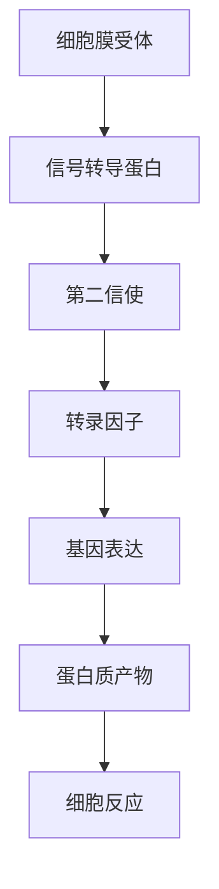
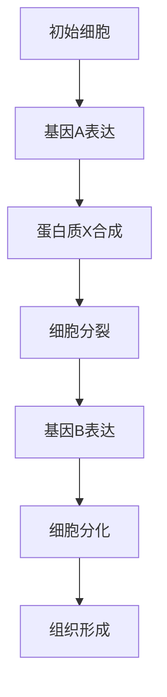
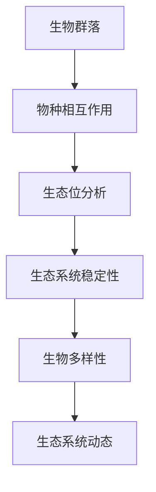
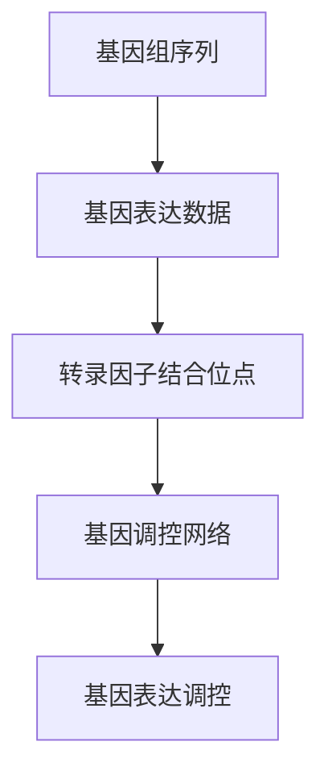
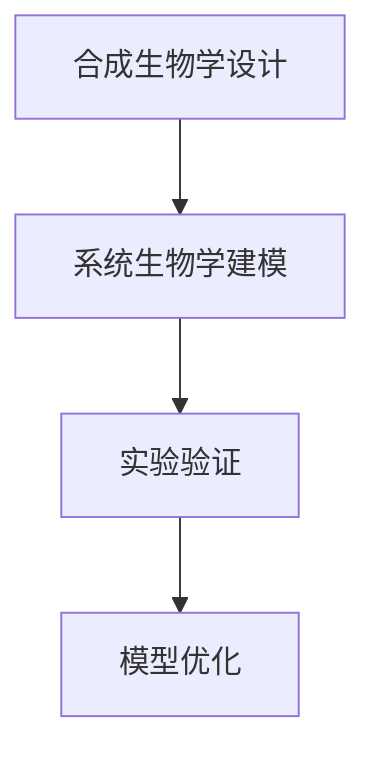

                 

# 从还原论到系统生物学：整合性理解生命与生态系统

## 关键词
系统生物学，还原论，整合性，生命科学，生态系统，基因组学，合成生物学，生态工程学，跨学科整合

## 摘要

本文旨在探讨从还原论到系统生物学的转变，以及这种转变如何为我们提供一种更加整合性、全面的理解生命与生态系统的视角。文章首先介绍了还原论与系统生物学的基础知识，包括还原论的历史、哲学基础和系统生物学的起源、发展以及基本原理。接着，文章深入探讨了系统生物学在生命科学中的应用，如细胞生物学、发育生物学和生态学，并详细介绍了系统生物学与基因组学、合成生物学和生态工程学的整合。最后，文章总结了系统生物学的发展趋势与未来前景，以及其面临的主要挑战。通过本文的探讨，我们希望能够更好地理解生命的复杂性与多样性，为未来的生物科学研究与应用提供新的思路和方法。

### 第一部分：还原论与系统生物学的基础知识

#### 第1章：还原论与系统生物学的概念

**1.1 还原论的历史与哲学基础**

还原论（Reductive Explanation）是一种解释方法，主张将复杂的系统或现象分解为更简单的组成部分，通过研究这些组成部分的相互作用来理解整个系统的行为。还原论的思想可以追溯到古希腊哲学家亚里士多德，他在《形而上学》中提出了“从简单到复杂”的观点。到了17世纪，英国哲学家托马斯·霍布斯将还原论应用于社会政治理论，提出了“社会是个人集合”的观点。19世纪，物理学家拉格朗日和哈密顿提出了哈密顿力学，为还原论在物理学中的应用奠定了基础。20世纪，随着分子生物学、量子力学等科学的发展，还原论在生物学、化学、物理学等领域得到了广泛应用。

在生物学领域，还原论主要表现为将生命现象分解为分子、细胞、个体等不同的层次，通过研究这些层次的基本单元和基本过程来理解生命的本质。然而，随着生命科学研究的深入，人们逐渐认识到，生命的复杂性远超出了还原论的简单分解和线性理解，因此，还原论面临着一定的局限性。

**1.2 系统生物学的起源与发展**

系统生物学（System Biology）是一种以生命系统为整体，通过研究系统内各个组成部分的相互关系和动态行为来理解生命现象的跨学科方法。系统生物学的概念最早由美国生物学家、诺贝尔奖得主赫伯特·马勒（Herbert M. Malmgren）在20世纪40年代提出。他认为，生物学应该从静态的结构研究转向动态的功能研究，强调系统内各个组成部分之间的相互作用和整体性。

20世纪末，随着基因测序技术的发展、生物信息学和计算生物学等领域的兴起，系统生物学逐渐从理论走向实践，成为生物学研究的重要方法。系统生物学通过构建数学模型、模拟实验和数据分析等方法，研究生命系统在时间、空间和功能上的动态行为。

**1.3 还原论与系统生物学的区别与联系**

还原论与系统生物学虽然都是生物学研究的方法，但它们在研究思路和目标上存在显著差异。还原论强调将复杂系统分解为简单组成部分，通过研究这些组成部分来理解整个系统；而系统生物学则强调系统内各个组成部分之间的相互作用和整体性，通过研究系统的整体行为来理解系统。

尽管存在差异，还原论与系统生物学也存在紧密的联系。首先，系统生物学在许多方面是还原论的延伸和深化，它将还原论的思想应用于生命系统的整体研究。其次，系统生物学需要依赖还原论在各个层次上的研究成果，如分子生物学、细胞生物学等，来构建更高层次的生命系统模型。

总之，还原论与系统生物学都是生物学研究的重要方法，它们在研究思路和目标上存在差异，但相互补充，共同推动了生物学的发展。在未来的生物学研究中，如何整合还原论与系统生物学的方法，发挥它们的优势，将是重要的研究方向。

#### 第2章：还原论方法在生物学中的应用

**2.1 个体水平上的还原论研究**

在个体水平上，还原论方法在生物学研究中发挥了重要作用。通过研究生物体的细胞、分子和基因等基本组成部分，科学家们可以揭示生命现象的本质和机制。

例如，在分子生物学领域，还原论方法被广泛应用于基因表达调控、蛋白质合成和代谢途径的研究。通过分离和纯化基因、蛋白质和代谢产物，科学家们可以研究这些基本组成部分的功能和相互作用。例如，研究特定基因对细胞生长的影响，或者分析特定蛋白质在信号传递过程中的作用。

此外，细胞生物学也是还原论方法的重要应用领域。通过观察和操作单个细胞，科学家们可以研究细胞的结构、功能和行为。例如，研究细胞分裂过程中的细胞周期调控，或者分析细胞信号传导途径的分子机制。

在个体水平上，还原论方法为科学家们提供了深入了解生命现象的基础，有助于揭示生物体的基本生物学规律。

**2.2 种群与生态系统的还原论分析**

在种群和生态系统水平上，还原论方法同样具有重要意义。通过研究种群和生态系统的基本组成部分，科学家们可以揭示种群动态、物种相互作用和生态系统功能等方面的规律。

在种群生态学中，还原论方法被广泛应用于研究种群数量、繁殖和生存等方面的机制。例如，通过研究种群的遗传结构和基因流，科学家们可以了解种群遗传多样性和适应性进化的机制。此外，研究种群间的竞争、捕食和共生关系，也有助于揭示生态系统中的生态位分布和物种共存机制。

在生态系统生态学中，还原论方法被用于研究生态系统的结构和功能。例如，通过分析生态系统中不同生物群落的结构和物种组成，科学家们可以了解生态系统的生产力和生物多样性。此外，研究生态系统的能量流动和物质循环，也有助于揭示生态系统的功能和稳定性。

总之，在种群和生态系统水平上，还原论方法为科学家们提供了研究生命现象的视角和工具，有助于揭示生物群体和生态系统的基本生物学规律。

**2.3 还原论方法在分子生物学中的运用**

还原论方法在分子生物学中的运用尤为显著，它为科学家们提供了深入了解基因、蛋白质和代谢途径等生物大分子的功能和相互作用的途径。通过分离、纯化和操作这些生物大分子，分子生物学家能够揭示生命现象的分子基础。

首先，基因的还原论研究主要集中在基因表达调控和遗传变异方面。通过基因敲除、基因编辑等技术，科学家们可以研究特定基因在细胞功能和生物过程中的作用。例如，利用CRISPR-Cas9技术，研究人员能够精确地编辑目标基因，从而研究基因功能在发育、疾病和治疗中的重要性。

其次，蛋白质的还原论研究涉及蛋白质的结构、功能和相互作用。通过蛋白质纯化和质谱分析等技术，科学家们能够鉴定和表征蛋白质的组成、结构和功能。此外，蛋白质互作网络的研究也有助于揭示细胞内复杂的信号传导和调控机制。

最后，还原论方法在代谢途径的研究中起到了关键作用。通过分离和操作代谢途径中的关键酶和中间产物，科学家们可以研究代谢途径的调控机制和功能。例如，研究线粒体代谢途径对细胞能量供应的影响，有助于揭示细胞代谢与疾病之间的关系。

总之，还原论方法在分子生物学中的应用为科学家们提供了研究生命现象的分子基础，有助于揭示生物大分子的功能、相互作用及其在生命过程中的重要性。

#### 第3章：系统生物学的基本原理

**3.1 系统生物学的研究目标与方法**

系统生物学（System Biology）是一种以生命系统为整体，通过研究系统内各个组成部分的相互关系和动态行为来理解生命现象的跨学科方法。其研究目标是通过解析生命系统的复杂性，揭示生命过程的规律和机制，从而为生物学研究提供新的视角和工具。

系统生物学的研究方法主要包括以下几个方面：

1. **数据收集**：系统生物学依赖于大量的生物学数据，如基因表达、蛋白质相互作用、代谢途径等。通过高通量技术，如基因测序、蛋白质组学和代谢组学，科学家们可以获取大量的生物学数据。

2. **数学建模**：系统生物学通过构建数学模型来模拟和分析生物系统的动态行为。这些模型可以是微分方程模型、布尔网络模型、 Petri 网模型等，它们能够描述系统内各个组成部分的相互作用和动态变化。

3. **计算机模拟**：计算机模拟是系统生物学的重要工具，通过模拟数学模型，科学家们可以预测系统行为，验证模型的有效性，并探索潜在的生物学现象。

4. **实验验证**：系统生物学的研究成果需要通过实验验证。科学家们通常会设计实验来验证计算机模拟的结果，或者通过实验来发现新的生物学现象，从而进一步改进模型。

**3.2 系统生物学的建模方法**

系统生物学的建模方法主要包括以下几个方面：

1. **微分方程模型**：微分方程模型用于描述系统内各个组分之间的连续变化。这些模型通常基于质量作用定律，能够描述反应速率和浓度变化。

2. **布尔网络模型**：布尔网络模型使用逻辑门来模拟生物系统的开关行为。这种方法适用于描述细胞信号传导和基因调控网络。

3. **Petri 网模型**：Petri 网模型用于描述系统中的并行和异步过程，适用于模拟细胞代谢和信号传导网络。

4. **Bayesian 网络模型**：Bayesian 网络模型使用概率分布来描述变量之间的依赖关系，适用于描述复杂生物系统的不确定性。

**3.3 系统生物学的数据分析与解释**

系统生物学的数据分析与解释是研究过程中的关键环节。以下是一些常用的数据分析方法：

1. **数据预处理**：包括去除噪声、缺失值填充、标准化等步骤，以提高数据分析的准确性和可靠性。

2. **聚类分析**：通过将相似的数据点分组，聚类分析有助于识别数据中的模式和结构。

3. **主成分分析（PCA）**：PCA 用于降维，将高维数据映射到低维空间，从而简化数据结构。

4. **线性回归分析**：线性回归分析用于研究变量之间的线性关系，预测某个变量的值。

5. **机器学习算法**：包括分类、聚类、回归等，用于发现数据中的复杂模式。

在数据分析与解释过程中，科学家们通常会结合多种方法，从不同角度对数据进行分析，以提高分析结果的可靠性和解释力。

总之，系统生物学通过整合多种方法，从数据收集、数学建模、计算机模拟到实验验证，为生物学研究提供了一种新的视角和工具。通过这些方法，科学家们可以更深入地理解生命系统的复杂性和动态行为，揭示生命现象的本质和机制。

### 第二部分：系统生物学在生命科学中的应用

#### 第4章：系统生物学在细胞生物学中的应用

系统生物学在细胞生物学中的应用极大地推动了我们对细胞内部动态过程的认知。通过整合分子水平的详细信息与整体系统的行为，系统生物学为理解细胞信号传递、细胞周期调控以及细胞间通讯提供了新的视角和工具。

**4.1 细胞信号传递的整合性理解**

细胞信号传递是细胞与环境之间沟通的重要途径，涉及到一系列的信号分子、受体和信号转导途径。系统生物学通过数学模型和计算机模拟，可以帮助我们更深入地理解这些复杂的信号网络。

例如，在细胞信号传递过程中，信号分子（如激素、神经递质）与细胞膜上的受体结合，触发一系列的信号转导事件，最终导致细胞内响应基因的表达变化。系统生物学通过构建微分方程模型，可以描述这些过程中各个分子的浓度变化和相互作用。

**伪代码示例：信号传递模型**

```plaintext
function signal_transduction(receptor, ligand, intracellular_molecule):
    # 接受信号分子和受体的输入
    receptor_state = activate(receptor, ligand)
    intracellular_state = receptor_state * intracellular_molecule
    return intracellular_state
```

**4.2 细胞周期的系统生物学研究**

细胞周期是细胞从一个分裂期到下一个分裂期的连续过程，包括G1、S、G2和M期。系统生物学在研究细胞周期调控方面发挥了重要作用，通过整合基因表达数据、蛋白质相互作用和细胞周期关键调控因子，建立细胞周期调控网络模型。

**伪代码示例：细胞周期模型**

```plaintext
function cell_cycle kontro
    if (G1_phase):
        gene_A = express()
        protein_X = produce(gene_A)
    elif (S_phase):
        DNA_synthesis()
    elif (G2_phase):
        check_for_damage()
        if (no_damage):
            enter_m_phase()
    else:
        mitosis()
```

**4.3 细胞间通讯的系统生物学视角**

细胞间通讯是细胞组织形成和功能发挥的基础。系统生物学通过研究细胞间的信号传递和相互作用，揭示了细胞群体行为的复杂性。

**伪代码示例：细胞间通讯模型**

```plaintext
function intercellular_communication(cellA, cellB):
    signalA = produce(cellA)
    signalB = produce(cellB)
    if (signalA == signalB):
        cellA_response = activate()
        cellB_response = activate()
    else:
        cellA_response = inhibit()
        cellB_response = inhibit()
    return cellA_response, cellB_response
```

**图解：细胞信号传递与调控的Mermaid流程图**



通过这些模型和算法，系统生物学为细胞生物学研究提供了新的工具和方法，帮助我们更好地理解细胞内部的复杂机制和动态行为。

#### 第5章：系统生物学在发育生物学中的应用

系统生物学在发育生物学中的应用显著提升了我们对生物体发育过程的理解。通过整合基因表达、蛋白质网络和细胞行为的数据，系统生物学为研究发育过程中的整合性调控、组合定律与发育模式提供了新的视角和工具。

**5.1 发育过程中的整合性调控**

发育生物学研究生物体从单个细胞到成熟个体的形成过程。这一过程中，基因表达调控至关重要。系统生物学通过整合基因表达数据、转录因子调控网络和蛋白质相互作用网络，揭示了发育过程中复杂的调控机制。

**伪代码示例：发育调控网络**

```plaintext
function development_regulation(gene_A, gene_B, transcription_factor):
    if (transcription_factor_active):
        gene_A_expression = upregulate(gene_A)
        gene_B_expression = upregulate(gene_B)
    else:
        gene_A_expression = downregulate(gene_A)
        gene_B_expression = downregulate(gene_B)
    return gene_A_expression, gene_B_expression
```

**5.2 组合定律与发育模式**

发育生物学中的组合定律描述了基因和外部环境因素如何共同影响发育过程。系统生物学通过构建基因表达模型和发育轨迹，揭示了基因组合在发育模式形成中的作用。

**伪代码示例：组合定律模型**

```plaintext
function combination_law(gene_A, gene_B, external_factor):
    if (external_factor == "stimulus"):
        gene_A_expression = upregulate(gene_A)
        gene_B_expression = upregulate(gene_B)
    else:
        gene_A_expression = downregulate(gene_A)
        gene_B_expression = downregulate(gene_B)
    return gene_A_expression, gene_B_expression
```

**5.3 生长发育的系统生物学分析**

系统生物学在分析生长发育过程中，通过构建细胞增殖、分化与组织形成的动态模型，揭示了生长过程中细胞行为和基因表达调控的动态关系。

**伪代码示例：生长发育模型**

```plaintext
function growth_development(cell_population, proliferation_rate, differentiation_rate):
    for cell in cell_population:
        if (random_event == "proliferation"):
            cell_divide()
        elif (random_event == "differentiation"):
            cell_differentiate()
    return updated_cell_population
```

**图解：发育调控网络的Mermaid流程图**



通过这些模型和算法，系统生物学为发育生物学研究提供了新的工具和方法，帮助我们更深入地理解生物体发育的复杂过程和调控机制。

#### 第6章：系统生物学在生态学中的应用

系统生物学在生态学中的应用显著提升了我们对生态系统结构和功能的理解，特别是在研究生态系统稳定性、生物多样性与生态系统动态方面。通过整合多种数据源和复杂的模型，系统生物学为生态学研究提供了新的视角和工具。

**6.1 生态系统结构与功能的整合性研究**

生态系统是由多个生物群落、生物种群和非生物环境组成的复杂系统。系统生物学通过整合基因、蛋白质和代谢数据，揭示了生态系统内不同层次的相互作用和功能关系。

**伪代码示例：生态系统整合模型**

```plaintext
function ecosystem_integration(community_data, population_data, environmental_data):
    community_structure = analyze_community(community_data)
    population_dynamics = simulate_population(population_data)
    environmental_impact = assess_environmental_factors(environmental_data)
    integrated_outcome = merge(community_structure, population_dynamics, environmental_impact)
    return integrated_outcome
```

**6.2 生物多样性与生态系统稳定性**

生物多样性是生态系统稳定性的重要因素。系统生物学通过研究不同物种之间的相互作用和生态位，揭示了生物多样性与生态系统稳定性之间的关系。

**伪代码示例：生物多样性模型**

```plaintext
function biodiversity_stability(species_interactions, species_traits, environmental_changes):
    stability_index = calculate_stability(species_interactions, species_traits)
    if (environmental_changes == "stress"):
        stability_index = adjust_stability(stability_index, environmental_changes)
    return stability_index
```

**6.3 生态系统动态的系统生物学模型**

生态系统动态研究生态系统的变化过程，包括物种数量波动、物种入侵和生态系统恢复等。系统生物学通过构建动态模型，模拟生态系统在各种压力下的行为和响应。

**伪代码示例：生态系统动态模型**

```plaintext
function ecosystem_dynamics(species_population, environmental_conditions, perturbations):
    for species in species_population:
        species_growth = simulate_growth(species, environmental_conditions)
        species_interact = simulate_interactions(species, species_population)
    if (perturbations != "none"):
        ecosystem_response = simulate_perturbations(ecosystem, perturbations)
    return updated_ecosystem_state
```

**图解：生态系统结构与动态的Mermaid流程图**



通过这些模型和算法，系统生物学为生态学研究提供了新的工具和方法，帮助我们更好地理解生态系统的复杂性和动态行为，从而为生态保护和环境管理提供科学依据。

### 第三部分：系统生物学的跨学科整合

#### 第7章：系统生物学与基因组学的整合

系统生物学与基因组学的整合为生物学研究提供了新的方法和视角，使得我们能够从基因层面更深入地理解生物系统的复杂性和功能。

**7.1 基因组学数据在系统生物学中的应用**

基因组学是研究基因及其在基因组中的组织的科学，通过高通量测序技术，科学家们能够获取大量的基因组数据。这些数据为系统生物学提供了丰富的信息资源。

**伪代码示例：基因组数据分析**

```plaintext
function genomic_data_analysis(DNA_sequence, gene_expression_data):
    # 获取基因组序列
    genome_sequence = get_sequence(DNA_sequence)
    # 分析基因表达数据
    gene_expression = analyze_expression(gene_expression_data)
    # 构建基因组-表达关联网络
    genome_expression_network = build_network(genome_sequence, gene_expression)
    return genome_expression_network
```

**7.2 基因表达调控的整合性分析**

基因表达调控是细胞功能的关键环节。系统生物学通过整合基因组学数据，如基因表达、转录因子结合位点等，揭示了基因表达调控的复杂网络。

**伪代码示例：基因表达调控模型**

```plaintext
function gene_expression_regulation(transcription_factor, regulatory_sites, gene_expression):
    if (regulatory_sites_bind(transcription_factor)):
        gene_expression = upregulate(gene_expression)
    else:
        gene_expression = downregulate(gene_expression)
    return gene_expression
```

**7.3 基因组学与系统生物学的交叉领域研究**

基因组学与系统生物学的交叉领域研究取得了显著成果，例如基因组编辑技术（如CRISPR-Cas9）在系统生物学中的应用，使得科学家们能够精确地操纵基因，探索基因功能。

**伪代码示例：基因组编辑与功能研究**

```plaintext
function gene_editing_functional_study(target_gene, CRISPR_system, gene_expression):
    # 编辑目标基因
    edited_gene = edit_gene(target_gene, CRISPR_system)
    # 分析编辑后的基因表达
    edited_expression = analyze_expression(edited_gene, gene_expression)
    # 验证基因功能
    gene_function = validate_function(edited_expression)
    return gene_function
```

**图解：基因组-表达调控网络的Mermaid流程图**



通过这些模型和算法，系统生物学与基因组学的整合为生物学研究提供了新的工具和方法，帮助我们更深入地理解基因与生物系统之间的复杂关系。

#### 第8章：系统生物学与合成生物学的整合

系统生物学与合成生物学的整合为生物学研究开辟了新的领域，使得我们能够通过设计和构建人工生物系统来探索生物系统的功能和机制。

**8.1 合成生物学的基本原理与技术**

合成生物学是一门通过工程方法设计和构建生物系统的新兴学科。它基于对自然生物系统的理解，利用基因工程、代谢工程等手段，设计和构建新的生物功能模块和系统。

**伪代码示例：合成生物系统设计**

```plaintext
function synthetic_biological_system(organic_module, genetic_builder, metabolic_engineering):
    # 设计生物功能模块
    designed_module = design_module(organic_module, genetic_builder)
    # 实施代谢工程
    engineered_metabolism = implement_metabolism(designed_module, metabolic_engineering)
    # 集成到生物系统中
    integrated_system = integrate_module(designed_module, engineered_metabolism)
    return integrated_system
```

**8.2 系统生物学在合成生物学设计中的应用**

系统生物学在合成生物学设计中发挥着关键作用，通过建立数学模型和计算机模拟，预测和优化人工生物系统的性能。

**伪代码示例：系统生物学建模与优化**

```plaintext
function system_biology_modeling(artificial_system, model_builder, optimization_algorithm):
    # 构建系统生物学模型
    system_model = build_model(artificial_system, model_builder)
    # 模拟系统行为
    system_simulation = simulate_system(system_model)
    # 优化系统性能
    optimized_system = optimize_performance(system_model, optimization_algorithm)
    return optimized_system
```

**8.3 系统生物学指导下的合成生物学实验**

在合成生物学实验中，系统生物学方法被用于验证和优化人工生物系统的功能。通过实验数据反馈，系统生物学模型得到不断改进，从而提高人工生物系统的效率和稳定性。

**伪代码示例：实验验证与模型优化**

```plaintext
function experimental_validation(model, experimental_data):
    # 验证模型预测
    model_prediction = predict(experimental_data, model)
    # 分析实验结果
    experimental_result = analyze_result(model_prediction)
    # 更新模型
    updated_model = update_model(model, experimental_result)
    return updated_model
```

**图解：合成生物学与系统生物学整合的Mermaid流程图**



通过这些模型和算法，系统生物学与合成生物学的整合为生物学研究提供了新的工具和方法，使得我们能够更有效地设计和构建人工生物系统，从而探索生物系统的功能和机制。

#### 第9章：系统生物学与生态工程学的整合

系统生物学与生态工程学的整合为生态系统的修复、重建和管理提供了新的思路和方法。通过系统生物学的方法，生态工程学能够更加精确地设计和实施生态修复项目，从而提高生态系统的恢复力和可持续性。

**9.1 生态工程学的目标与原则**

生态工程学是一门应用生态学、工程学和其他相关学科原理，通过工程手段修复、重建和管理生态系统的学科。其目标包括：

- **生态修复**：恢复受损生态系统的结构和功能。
- **生态重建**：建立新的、稳定的生态系统，以替代原有的生态系统。
- **生态管理**：通过合理的管理措施，维持生态系统的稳定性和生产力。

生态工程学的基本原则包括生态平衡、可持续性、多样性和适应性。

**9.2 系统生物学在生态工程设计中的应用**

系统生物学在生态工程设计中的应用主要体现在以下几个方面：

- **生态系统模型构建**：通过系统生物学方法，构建生态系统的动态模型，模拟生态系统的行为和响应，为生态工程设计提供科学依据。
- **生态系统功能分析**：利用系统生物学技术，分析生态系统中各组分（如生物群落、物种、环境因素）的功能和相互作用，为生态修复和重建提供基础数据。
- **基因工程**：通过基因工程手段，引入或改变生态系统中的基因，以增强生态系统的适应性和恢复力。

**伪代码示例：生态系统模型构建**

```plaintext
function ecosystem_model_builder(生态数据，环境数据，生物数据):
    # 收集生态系统数据
    ecosystem_data = collect_data(生态数据，环境数据，生物数据)
    # 构建生态系统模型
    model = build_model(生态系统数据)
    # 模拟生态系统行为
    simulation = simulate_ecosystem(model)
    return simulation
```

**9.3 整合性生态工程实践案例分析**

整合性生态工程实践案例通过系统生物学方法，对实际生态修复项目进行了科学设计和评估。

**案例一：湿地生态修复**

通过构建湿地生态系统的动态模型，模拟湿地在不同修复措施下的行为，从而优化修复方案。例如，通过增加水生植物、改善水质等措施，提高湿地的生态恢复速度和稳定性。

**伪代码示例：湿地生态修复模型**

```plaintext
function wetland_restoration(model, restoration_measures):
    # 应用修复措施
    apply_measures(model, restoration_measures)
    # 模拟修复效果
    restoration_simulation = simulate_restoration(model)
    # 评估修复效果
    restoration_evaluation = evaluate_restoration(restoration_simulation)
    return restoration_evaluation
```

**案例二：矿山生态修复**

通过分析矿山生态系统的物种组成、代谢途径和基因表达，构建矿山生态修复的动态模型，指导生态重建工作。例如，通过引入特定物种和微生物，促进矿区的生态恢复。

**伪代码示例：矿山生态修复模型**

```plaintext
function mine_ecosystem_restoration(model, species, microorganisms):
    # 引入特定物种
    introduce_species(model, species)
    # 引入微生物
    introduce_microorganisms(model, microorganisms)
    # 模拟生态修复过程
    restoration_simulation = simulate_restoration(model)
    # 评估修复效果
    restoration_evaluation = evaluate_restoration(restoration_simulation)
    return restoration_evaluation
```

通过这些案例，系统生物学与生态工程学的整合为生态修复和重建提供了科学依据和实践经验，有助于提高生态工程的效率和效果。

### 第四部分：系统生物学的发展趋势与未来前景

#### 第10章：系统生物学的发展趋势与未来前景

系统生物学作为一门跨学科的研究领域，正不断推动生命科学的进步。随着技术的不断创新和跨学科研究的深化，系统生物学展现出广泛的应用前景和潜在的影响。

**10.1 系统生物学在生命科学与医学中的潜力**

系统生物学在生命科学和医学中的应用潜力巨大。通过整合基因、蛋白质和代谢网络的数据，系统生物学可以揭示复杂的生物系统及其在疾病发生和发展中的机制。以下是一些具体的应用前景：

1. **疾病诊断**：系统生物学通过分析患者的基因组、蛋白质组和代谢组数据，可以预测疾病风险，提供个性化的诊断方案。
2. **药物研发**：系统生物学帮助科学家理解药物在体内的作用机制，优化药物设计和开发新药。
3. **精准医疗**：系统生物学为个性化治疗提供理论基础，通过分析患者的生物数据，制定个性化的治疗策略。

**10.2 系统生物学在农业与环境保护中的应用前景**

在农业领域，系统生物学可以优化作物育种、提高产量和抗逆性。通过分析作物的基因表达和代谢网络，科学家可以培育出适应不同环境条件的高产、优质作物。

在环境保护方面，系统生物学有助于揭示生态系统的复杂动态，提供有效的生态修复和管理策略。例如，通过构建生态系统的数学模型，科学家可以预测污染对生态系统的影响，制定针对性的修复措施。

**10.3 系统生物学的跨学科整合与新兴领域**

系统生物学不仅与基因组学、生物信息学、计算生物学等传统生物学领域紧密相关，还与其他学科如物理学、化学、工程学等交叉融合，形成了一系列新兴研究领域：

1. **合成生物学**：通过系统生物学的理论和方法，合成生物学致力于构建新的生物功能模块和系统，为生物技术提供创新解决方案。
2. **生态工程学**：系统生物学与生态工程学的结合，为生态系统的修复和重建提供了科学依据和实用工具。
3. **可持续生物学**：系统生物学在研究生物资源的可持续利用和保护方面发挥了重要作用，为可持续发展提供了新的思路。

总体而言，系统生物学的发展趋势显示出跨学科整合和应用的广阔前景。随着技术的进步和研究方法的不断创新，系统生物学将在生命科学、医学、农业、环境保护等多个领域发挥更大的作用，推动科学技术的进步和社会的发展。

### 第11章：系统生物学面临的主要挑战

尽管系统生物学取得了显著的进展，但它仍然面临一系列挑战，这些问题需要通过科学、技术和社会层面的共同努力来解决。

**11.1 数据获取与分析的挑战**

系统生物学依赖于大量的数据，包括基因组序列、蛋白质结构、代谢途径等。然而，数据获取仍然是一个挑战。首先，生物数据量庞大且复杂，处理和分析这些数据需要高效的计算资源和算法。其次，生物数据的多样性和异质性使得标准化和数据整合变得复杂。为了应对这些挑战，科学家们正在开发更加先进的数据处理和分析工具，如自动化数据采集系统、高性能计算平台和机器学习算法。

**11.2 系统生物学模型的准确性问题**

系统生物学模型是理解和预测生物系统行为的重要工具，但模型的准确性仍是一个关键问题。生物系统的高度复杂性和内在的随机性使得构建准确模型具有挑战性。此外，模型参数的不确定性和简化假设可能会影响模型的准确性。为了提高模型准确性，科学家们正在开发更加精确的测量技术、改进模型构建方法，并采用多种数据源进行交叉验证。

**11.3 系统生物学研究的伦理与法律问题**

系统生物学研究涉及生物伦理和法律问题，如基因编辑、生物安全、隐私和数据共享等。基因编辑技术（如CRISPR-Cas9）的应用可能引发伦理争议，特别是在人类基因编辑方面。此外，生物数据的安全和隐私保护也是重要问题，因为未经授权的数据访问可能导致个人隐私泄露。为了应对这些挑战，需要制定明确的伦理规范和法律框架，确保系统生物学研究的道德和合法进行。

**11.4 跨学科整合的挑战**

系统生物学是跨学科的产物，需要生物学、物理学、化学、计算机科学等多个领域的合作。然而，不同学科之间的语言、方法和文化差异可能导致沟通和合作的障碍。为了促进跨学科整合，需要加强学科间的交流与培训，建立共同的研究平台和合作机制，以推动系统生物学的发展。

**11.5 社会接受度和公众参与**

系统生物学的研究和应用需要社会的广泛接受和参与。公众对于新兴生物技术的理解和接受程度对系统生物学的发展具有重要影响。为了提高社会接受度，需要通过科普教育、公共咨询和透明的沟通，增强公众对系统生物学研究及其潜在影响的了解和信任。

总之，系统生物学面临着数据获取、模型准确性、伦理和法律、跨学科整合以及社会接受度等方面的挑战。通过科学、技术和社会层面的共同努力，这些问题将得到逐步解决，为系统生物学的进一步发展创造有利条件。

### 作者信息

作者：AI天才研究院/AI Genius Institute & 禅与计算机程序设计艺术 /Zen And The Art of Computer Programming

