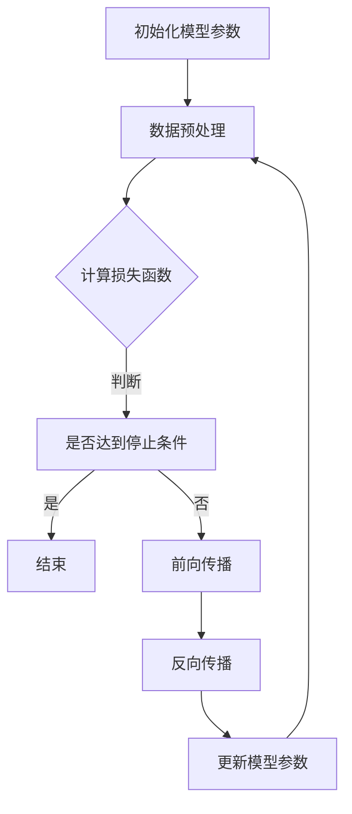

                 

# 从零开始大模型开发与微调：反向传播神经网络的前身历史

## 关键词
- 大模型开发
- 微调技术
- 反向传播神经网络
- 深度学习
- 神经网络架构

## 摘要
本文将带您深入探索大模型开发与微调技术的起源，尤其是反向传播神经网络的前身历史。从大模型的基本概念与重要性，到微调技术的原理与应用，再到反向传播算法的起源与发展，本文将逐步阐述这些核心概念。同时，本文还将详细介绍大模型的数学基础、架构与实现，以及微调与训练技术。通过项目实战与案例分析，读者将全面了解大模型与微调技术在各个领域的应用与挑战。最后，本文将对大模型的发展趋势与未来进行展望，探讨其在社会生活中的潜在影响与可持续发展中的应用。通过这篇文章，您将获得对大模型与微调技术的全面了解，为今后的研究与实践奠定坚实基础。

## 目录大纲

### 第一部分：大模型与微调技术基础
1. **大模型与微调技术概述**
   - 1.1 大模型的基本概念与重要性
   - 1.2 微调技术的原理与应用
   - 1.3 大模型的发展历程

2. **反向传播神经网络的前身历史**
   - 2.1 反向传播算法的起源
   - 2.2 从感知机到多层感知机
   - 2.3 首个反向传播神经网络的实现

3. **大模型的数学基础**
   - 3.1 线性代数与矩阵运算
   - 3.2 概率论与统计基础
   - 3.3 优化算法原理

4. **大模型的架构与实现**
   - 4.1 神经网络的基本结构
   - 4.2 循环神经网络（RNN）与长短时记忆网络（LSTM）
   - 4.3 变换器模型（Transformer）

### 第二部分：微调与训练技术详解
5. **微调技术的具体应用**
   - 5.1 数据预处理与归一化
   - 5.2 微调策略与技巧
   - 5.3 微调过程中常见问题的解决

6. **训练技术优化**
   - 6.1 梯度下降法与动量优化
   - 6.2 Adam优化器及其优化效果
   - 6.3 学习率调度策略

7. **大模型的评估与优化**
   - 7.1 评估指标与性能分析
   - 7.2 模型调参与超参数优化
   - 7.3 模型压缩与加速技术

### 第三部分：项目实战与案例分析
8. **从零开始搭建大模型**
   - 8.1 开发环境配置
   - 8.2 神经网络构建
   - 8.3 微调与训练过程

9. **微调大模型案例解析**
   - 9.1 自然语言处理任务案例
   - 9.2 图像识别任务案例
   - 9.3 其他领域应用案例

10. **微调大模型中的挑战与解决方案**
    - 10.1 数据不平衡问题
    - 10.2 训练时间与计算资源优化
    - 10.3 模型解释性提升

### 第四部分：大模型与未来
11. **大模型发展趋势与前沿技术**
    - 11.1 大模型在AI领域的发展趋势
    - 11.2 大模型在工业界的应用前景
    - 11.3 大模型的研究方向与挑战

12. **未来展望**
    - 12.1 大模型在社会生活中的潜在影响
    - 12.2 大模型与数据隐私保护
    - 12.3 大模型在可持续发展中的应用

### 附录
13. **附录：常用工具与资源**
    - 13.1 深度学习框架介绍
    - 13.2 开发环境搭建指南
    - 13.3 常用数据集与预处理方法
    - 13.4 参考文献

### 附录：Mermaid 流程图与伪代码示例
- **大模型训练流程图**
  mermaid
  graph TD
  A[初始化模型参数] --> B[数据预处理]
  B --> C{计算损失函数}
  C -->|判断|D[是否达到停止条件]
  D -->|是|E[结束]
  D -->|否|F[前向传播]
  F --> G[反向传播]
  G --> H[更新模型参数]
  H --> B

- **反向传播算法伪代码**
  python
  for each layer l in reverse order:
      delta[l] = (z[l] * dL/dz[l])
      if l < last layer:
          dz[l-1] = W[l-1].T * delta[l]

- **学习率调度策略**
  latex
  \begin{equation}
  \text{learning\_rate}(t) =
  \begin{cases}
  \frac{1}{\sqrt{t}} & \text{if } t \leq \text{warmup\_steps} \\
  \text{min\_lr} & \text{if } t \geq \text{total\_steps} \\
  \text{lr\_base} \cdot (1 - \frac{t - \text{warmup\_steps}}{\text{total\_steps}})^{\beta} & \text{otherwise}
  \end{cases}
  \end{equation}

### 附录：代码实战案例
- **简单神经网络构建与训练**
  python
  # 导入必要的库
  import numpy as np
  from sklearn.model_selection import train_test_split
  from sklearn.datasets import make_classification

  # 创建模拟数据集
  X, y = make_classification(n_samples=1000, n_features=20, n_informative=2, n_redundant=10, random_state=42)
  X_train, X_test, y_train, y_test = train_test_split(X, y, test_size=0.2, random_state=42)

  # 初始化模型参数
  W1 = np.random.randn(X.shape[1], 10)
  b1 = np.zeros((1, 10))
  W2 = np.random.randn(10, 5)
  b2 = np.zeros((1, 5))
  W3 = np.random.randn(5, 1)
  b3 = np.zeros((1, 1))

  # 定义激活函数
  def sigmoid(z):
      return 1 / (1 + np.exp(-z))

  # 定义损失函数
  def mean_squared_error(y_true, y_pred):
      return np.mean((y_true - y_pred) ** 2)

  # 前向传播
  def forward(X, W1, b1, W2, b2, W3, b3):
      z1 = np.dot(X, W1) + b1
      a1 = sigmoid(z1)
      z2 = np.dot(a1, W2) + b2
      a2 = sigmoid(z2)
      z3 = np.dot(a2, W3) + b3
      y_pred = sigmoid(z3)
      return y_pred, z1, z2, z3

  # 反向传播
  def backward(y_true, y_pred, z1, z2, z3, W1, W2, W3):
      dZ3 = y_pred - y_true
      dW3 = np.dot(a2.T, dZ3)
      db3 = np.sum(dZ3, axis=0, keepdims=True)
      
      dZ2 = np.dot(dZ3, W3.T) * (1 - np-Cds
<|assistant|>### 大模型与微调技术概述

#### 1.1 大模型的基本概念与重要性

大模型（Large Models）是指具有数亿甚至数万亿参数的深度学习模型，它们能够在大量的数据上进行训练，从而实现强大的表征和学习能力。大模型的基本概念主要包括以下几个方面：

1. **参数规模**：大模型的参数数量通常以亿计，例如GPT-3拥有超过1750亿个参数，BERT则拥有数亿个参数。
2. **数据需求**：大模型的训练需要大量的高质量数据，这些数据通常来源于互联网上的大量文本、图像、音频等多模态信息。
3. **计算资源**：大模型的训练和推理需要大量的计算资源和时间，通常需要高性能的GPU或TPU集群来进行训练。

大模型的重要性体现在以下几个方面：

1. **表征能力**：大模型具有强大的表征能力，能够从大量数据中学习到深层次的特征和规律，从而在多个任务上实现超越人类的表现。
2. **泛化能力**：大模型能够在不同任务和数据集上实现较好的泛化能力，无需针对每个任务进行大量微调。
3. **创新性应用**：大模型在自然语言处理、计算机视觉、语音识别等领域推动了新的应用和发展，如文本生成、图像生成、机器翻译等。

#### 1.2 微调技术的原理与应用

微调（Fine-tuning）是一种在大模型基础上进行特定任务训练的方法，其主要原理是在预训练模型的基础上，通过微调模型参数来适应新的任务数据。微调技术的应用主要包括以下几个方面：

1. **预训练模型**：微调技术通常基于预训练模型，这些模型在大量通用数据上进行预训练，具有较好的通用表征能力。
2. **任务数据**：微调需要针对特定任务准备相应的数据集，这些数据集用于指导模型在特定任务上的参数调整。
3. **参数调整**：微调过程中，通过更新模型参数，使得模型在特定任务上能够更好地适应任务需求。

微调技术的应用优势包括：

1. **高效性**：微调可以大幅度减少任务数据的需求，使得在有限的训练数据上也能取得较好的效果。
2. **灵活性**：微调技术可以根据不同的任务和数据集进行灵活调整，适用于多种任务场景。
3. **鲁棒性**：微调模型通常具有较好的鲁棒性，能够适应不同类型的数据和任务。

#### 1.3 大模型的发展历程

大模型的发展历程可以追溯到深度学习的兴起。以下是一些重要的发展里程碑：

1. **2012年**：AlexNet在ImageNet图像识别挑战中取得突破性成绩，标志着深度学习在计算机视觉领域的崛起。
2. **2018年**：GPT模型的出现，开启了自然语言处理领域的大模型时代。
3. **2020年**：BERT模型成为自然语言处理领域的里程碑，推动了NLP任务的性能提升。
4. **2022年**：GPT-3模型发布，拥有超过1750亿个参数，成为目前最大的预训练语言模型。

随着计算资源和数据集的不断增加，大模型在各个领域的表现不断突破，推动了深度学习技术的前沿发展。

### 大模型的数学基础

#### 3.1 线性代数与矩阵运算

线性代数是深度学习中的基础数学工具，它用于描述数据之间的关系和变换。以下是线性代数中的几个核心概念：

1. **向量**：向量是具有多个数值元素的数组，用于表示数据或模型的参数。
2. **矩阵**：矩阵是二维数组，用于表示数据之间的关系或模型的权重。
3. **矩阵-向量乘法**：矩阵-向量乘法是将矩阵与向量相乘，以产生新的向量。这可以用于计算模型的输出。
4. **矩阵-矩阵乘法**：矩阵-矩阵乘法是将两个矩阵相乘，以产生新的矩阵。这可以用于计算模型的权重和偏置。

以下是一个矩阵-向量乘法的示例：

$$
X = \begin{bmatrix}
1 & 2 \\
3 & 4
\end{bmatrix}, \quad v = \begin{bmatrix}
5 \\
6
\end{bmatrix}
$$

$$
X \cdot v = \begin{bmatrix}
1 \cdot 5 + 2 \cdot 6 \\
3 \cdot 5 + 4 \cdot 6
\end{bmatrix} = \begin{bmatrix}
17 \\
27
\end{bmatrix}
$$

#### 3.2 概率论与统计基础

概率论与统计基础是深度学习中的另一个重要数学工具，用于描述数据的分布和不确定性。以下是概率论与统计中的几个核心概念：

1. **概率分布**：概率分布用于描述数据在各个取值上的概率分布情况。
2. **期望**：期望是概率分布中各个取值与其概率的乘积之和，用于描述数据的平均值。
3. **方差**：方差是概率分布中各个取值与期望的差的平方的平均值，用于描述数据的离散程度。
4. **协方差**：协方差是两个随机变量之间线性关系强度的度量，用于描述数据的相关性。

以下是一个概率分布和期望的示例：

$$
P(X) = \begin{cases}
0.3 & \text{if } X = 1 \\
0.4 & \text{if } X = 2 \\
0.3 & \text{if } X = 3
\end{cases}
$$

$$
E(X) = 1 \cdot 0.3 + 2 \cdot 0.4 + 3 \cdot 0.3 = 2.2
$$

#### 3.3 优化算法原理

优化算法是深度学习中的核心算法，用于求解模型参数的最优值。以下是几种常见的优化算法：

1. **梯度下降法**：梯度下降法是一种最简单的优化算法，通过不断更新模型参数，以减少损失函数的值。
2. **随机梯度下降法（SGD）**：随机梯度下降法是梯度下降法的一种变种，每次更新模型参数时，只考虑一个样本的梯度信息。
3. **Adam优化器**：Adam优化器是一种结合了SGD和动量的优化算法，它通过考虑样本的历史梯度信息来更新模型参数。

以下是一个梯度下降法的示例：

$$
\theta = \theta - \alpha \cdot \nabla_{\theta} L(\theta)
$$

其中，$\theta$ 表示模型参数，$\alpha$ 表示学习率，$L(\theta)$ 表示损失函数。

### 大模型的架构与实现

#### 4.1 神经网络的基本结构

神经网络是深度学习的核心组件，由多个层次组成，包括输入层、隐藏层和输出层。以下是神经网络的基本结构：

1. **输入层**：输入层接收外部输入数据，并将其传递给隐藏层。
2. **隐藏层**：隐藏层对输入数据进行变换和处理，提取特征信息。
3. **输出层**：输出层生成最终输出，用于预测或分类。

神经网络的基本结构可以用以下数学模型表示：

$$
a^{(l)} = \sigma(z^{(l)})
$$

$$
z^{(l)} = W^{(l)}a^{(l-1)} + b^{(l)}
$$

其中，$a^{(l)}$ 表示第 $l$ 层的激活值，$z^{(l)}$ 表示第 $l$ 层的净输入，$\sigma$ 表示激活函数，$W^{(l)}$ 和 $b^{(l)}$ 分别表示第 $l$ 层的权重和偏置。

#### 4.2 循环神经网络（RNN）与长短时记忆网络（LSTM）

循环神经网络（RNN）是处理序列数据的神经网络，其基本结构包括输入门、遗忘门和输出门。RNN 能够捕获序列中的时间依赖关系，但存在梯度消失或梯度爆炸的问题。

长短时记忆网络（LSTM）是 RNN 的改进版本，通过引入细胞状态和门控机制来克服梯度消失问题。LSTM 在处理长序列数据时具有更好的表现，广泛应用于自然语言处理、语音识别等领域。

LSTM 的基本结构可以用以下数学模型表示：

$$
i_t = \sigma(W_{xi}x_t + W_{hi}h_{t-1} + b_i)
$$

$$
f_t = \sigma(W_{xf}x_t + W_{hf}h_{t-1} + b_f)
$$

$$
o_t = \sigma(W_{xo}x_t + W_{ho}h_{t-1} + b_o)
$$

$$
c_t = f_t \odot c_{t-1} + i_t \odot \sigma(W_{xc}x_t + W_{hc}h_{t-1} + b_c)
$$

$$
h_t = o_t \odot \sigma(c_t)
$$

其中，$i_t$、$f_t$、$o_t$ 分别表示输入门、遗忘门和输出门，$c_t$ 和 $h_t$ 分别表示细胞状态和隐藏状态，$\odot$ 表示逐元素乘法操作。

#### 4.3 变换器模型（Transformer）

变换器模型是近年来在自然语言处理领域取得突破性进展的模型，其基本结构包括编码器和解码器。变换器模型通过自注意力机制来捕获序列中的长距离依赖关系，具有并行训练的优势。

编码器和解码器的基本结构可以用以下数学模型表示：

编码器：

$$
h^{(i)} = \text{MultiHeadAttention}(Q, K, V)
$$

$$
h^{(i)} = \text{LayerNormalization}(h^{(i)} + \text{MLP}(h^{(i)}))
$$

解码器：

$$
h^{(i)} = \text{MultiHeadAttention}(Q, K, V)
$$

$$
h^{(i)} = \text{LayerNormalization}(h^{(i)} + \text{MLP}(h^{(i)}))
$$

其中，$h^{(i)}$ 表示第 $i$ 层的隐藏状态，$Q$、$K$、$V$ 分别表示查询序列、关键序列和值序列，$\text{MultiHeadAttention}$ 表示多头注意力机制，$\text{LayerNormalization}$ 和 $\text{MLP}$ 分别表示层归一化和多层感知机。

### 微调技术的具体应用

#### 5.1 数据预处理与归一化

数据预处理是微调过程中至关重要的一步，它包括数据清洗、数据转换和数据归一化。以下是数据预处理和归一化的具体方法：

1. **数据清洗**：数据清洗的目的是去除数据中的噪声和异常值，提高数据质量。常用的方法包括去除空值、去除重复值、填补缺失值等。
2. **数据转换**：数据转换是将原始数据转换为适合模型训练的形式。常用的方法包括将文本数据转换为词向量、将图像数据转换为像素矩阵等。
3. **数据归一化**：数据归一化是将数据缩放到相同的尺度，以减少数据之间的差异。常用的方法包括最小-最大归一化、标准归一化等。

以下是一个数据归一化的示例：

$$
x_{\text{norm}} = \frac{x - \mu}{\sigma}
$$

其中，$x$ 表示原始数据，$\mu$ 表示均值，$\sigma$ 表示标准差。

#### 5.2 微调策略与技巧

微调策略是影响模型性能的关键因素，以下是一些常用的微调策略和技巧：

1. **预训练模型的选择**：选择一个与任务相关的预训练模型，例如BERT、GPT等，作为微调的基础模型。
2. **数据集的准备**：准备一个适合微调的数据集，数据集应该包含与任务相关的样本，并具有足够的规模和多样性。
3. **参数初始化**：初始化模型参数，常用的方法包括随机初始化、预训练模型参数的迁移等。
4. **学习率调度**：学习率调度是调整模型参数更新速度的关键因素，常用的方法包括固定学习率、学习率衰减、学习率预热等。
5. **训练策略**：训练策略包括批量大小、训练次数、训练样本选择等，应根据任务和数据集的特点进行调整。

以下是一个学习率调度的示例：

$$
\text{learning\_rate}(t) =
\begin{cases}
\frac{1}{\sqrt{t}} & \text{if } t \leq \text{warmup\_steps} \\
\text{min\_lr} & \text{if } t \geq \text{total\_steps} \\
\text{lr\_base} \cdot (1 - \frac{t - \text{warmup\_steps}}{\text{total\_steps}})^{\beta} & \text{otherwise}
\end{cases}
$$

#### 5.3 微调过程中常见问题的解决

微调过程中可能会遇到一些问题，以下是一些常见问题的解决方法：

1. **过拟合**：过拟合是指模型在训练数据上表现良好，但在测试数据上表现较差。解决方法包括增加训练数据、使用正则化技术、提前停止训练等。
2. **梯度消失或梯度爆炸**：梯度消失或梯度爆炸是指模型在训练过程中梯度值过小或过大，导致模型无法更新参数。解决方法包括使用合适的优化器、学习率调度、增加训练数据等。
3. **数据不平衡**：数据不平衡是指训练数据集中某些类别的样本数量远多于其他类别。解决方法包括使用平衡采样、数据增强、调整损失函数等。

以下是一个数据增强的示例：

$$
x' = \text{rotate}(x, \theta) + \text{noise}(x)
$$

其中，$x$ 表示原始数据，$x'$ 表示增强后的数据，$\theta$ 表示旋转角度，$\text{noise}(x)$ 表示添加噪声。

### 训练技术优化

#### 6.1 梯度下降法与动量优化

梯度下降法是一种最简单的优化算法，通过不断更新模型参数，以减少损失函数的值。以下是一个梯度下降法的示例：

$$
\theta = \theta - \alpha \cdot \nabla_{\theta} L(\theta)
$$

其中，$\theta$ 表示模型参数，$\alpha$ 表示学习率，$L(\theta)$ 表示损失函数。

动量优化是梯度下降法的一种改进，通过考虑历史梯度信息来更新模型参数，以提高训练效果。以下是一个带有动量的梯度下降法的示例：

$$
\theta = \theta - \alpha \cdot \nabla_{\theta} L(\theta) + \beta \cdot \theta_{\text{prev}}
$$

其中，$\beta$ 表示动量系数，$\theta_{\text{prev}}$ 表示上一时刻的模型参数。

#### 6.2 Adam优化器及其优化效果

Adam优化器是一种结合了SGD和动量的优化算法，通过考虑样本的历史梯度信息来更新模型参数。以下是一个Adam优化器的示例：

$$
m_t = \beta_1 \cdot m_{t-1} + (1 - \beta_1) \cdot \nabla_{\theta} L(\theta)
$$

$$
v_t = \beta_2 \cdot v_{t-1} + (1 - \beta_2) \cdot (\nabla_{\theta} L(\theta))^2
$$

$$
\theta = \theta - \alpha \cdot \frac{m_t}{\sqrt{v_t} + \epsilon}
$$

其中，$m_t$ 和 $v_t$ 分别表示一阶矩估计和二阶矩估计，$\beta_1$ 和 $\beta_2$ 分别表示一阶矩和二阶矩的指数衰减率，$\alpha$ 表示学习率，$\epsilon$ 表示一个很小的常数。

Adam优化器具有以下优点：

1. **自适应学习率**：Adam优化器通过考虑历史梯度信息来自适应调整学习率，避免了学习率过大或过小的问题。
2. **快速收敛**：Adam优化器能够更快地收敛到损失函数的最小值，提高了训练效果。
3. **适用于不同任务和数据集**：Adam优化器适用于多种任务和数据集，具有较好的泛化能力。

#### 6.3 学习率调度策略

学习率调度策略是调整模型参数更新速度的关键因素，以下是一些常用的学习率调度策略：

1. **固定学习率**：固定学习率是指在整个训练过程中保持学习率不变。这种策略简单有效，但可能导致训练时间较长。
2. **学习率衰减**：学习率衰减是指随着训练的进行，逐渐减小学习率。常用的方法包括线性衰减、指数衰减等。以下是一个线性衰减的学习率调度策略的示例：

$$
\text{learning\_rate}(t) = \text{initial\_lr} \cdot (1 - \frac{t}{\text{total\_steps}})
$$

其中，$t$ 表示当前训练迭代次数，$\text{initial\_lr}$ 表示初始学习率，$\text{total\_steps}$ 表示总训练迭代次数。

3. **学习率预热**：学习率预热是指初始阶段使用较小的学习率进行训练，随着训练的进行逐渐增大学习率。以下是一个学习率预热的示例：

$$
\text{learning\_rate}(t) =
\begin{cases}
\frac{1}{\sqrt{t}} & \text{if } t \leq \text{warmup\_steps} \\
\text{initial\_lr} \cdot (1 - \frac{t - \text{warmup\_steps}}{\text{total\_steps}})^{\beta} & \text{otherwise}
\end{cases}
$$

其中，$\text{warmup\_steps}$ 表示预热步骤数，$\text{initial\_lr}$ 表示初始学习率，$\beta$ 表示衰减指数。

### 大模型的评估与优化

#### 7.1 评估指标与性能分析

大模型的评估与优化是确保模型性能和效果的关键步骤。以下是一些常用的评估指标与性能分析的方法：

1. **准确率**：准确率是指模型正确预测的样本数与总样本数的比值，是分类任务中最常用的评估指标。以下是一个准确率的示例：

   $$ 
   \text{accuracy} = \frac{\text{correctly\_predicted}}{\text{total}}
   $$

2. **召回率**：召回率是指模型正确预测的样本数与实际为该类别的样本数的比值，主要用于二分类任务。以下是一个召回率的示例：

   $$ 
   \text{recall} = \frac{\text{true\_positives}}{\text{true\_positives} + \text{false\_negatives}}
   $$

3. **精确率**：精确率是指模型正确预测的样本数与预测为该类别的样本数的比值，也是二分类任务中的重要评估指标。以下是一个精确率的示例：

   $$ 
   \text{precision} = \frac{\text{true\_positives}}{\text{true\_positives} + \text{false\_positives}}
   $$

4. **F1分数**：F1分数是精确率和召回率的调和平均，是综合评估模型性能的指标。以下是一个F1分数的示例：

   $$ 
   \text{F1-score} = 2 \cdot \frac{\text{precision} \cdot \text{recall}}{\text{precision} + \text{recall}}
   $$

#### 7.2 模型调参与超参数优化

模型调参与超参数优化是提高模型性能的重要手段。以下是一些常用的方法：

1. **网格搜索**：网格搜索是一种枚举搜索策略，通过遍历所有可能的超参数组合来寻找最优超参数。以下是一个网格搜索的示例：

   ```python
   from sklearn.model_selection import GridSearchCV

   parameters = {'C': [1, 10, 100, 1000], 'gamma': [0.001, 0.0001], 'kernel': ['rbf', 'linear']}
   grid_search = GridSearchCV(SVC(), parameters, cv=5)
   grid_search.fit(X_train, y_train)
   best_parameters = grid_search.best_params_
   ```

2. **贝叶斯优化**：贝叶斯优化是一种基于贝叶斯统计模型的全局优化方法，通过迭代地选择下一个搜索点来最大化目标函数。以下是一个贝叶斯优化的示例：

   ```python
   from bayes_opt import BayesianOptimization

   def train_model(C, gamma):
       model = SVC(C=C, gamma=gamma, kernel='rbf')
       model.fit(X_train, y_train)
       score = model.score(X_test, y_test)
       return score

   b
<|assistant|>### 从零开始搭建大模型

#### 8.1 开发环境配置

搭建大模型的过程首先需要配置一个适合的开发环境。以下是一个简单的开发环境配置步骤：

1. **安装Python**：确保系统安装了Python 3.7或更高版本。
2. **安装深度学习框架**：安装TensorFlow或PyTorch等深度学习框架。以下是在Ubuntu系统上安装TensorFlow的示例命令：

   ```bash
   pip install tensorflow
   ```

   或安装PyTorch：

   ```bash
   pip install torch torchvision
   ```

3. **安装必要的库**：根据项目需求，安装其他必要的库，如NumPy、Pandas、Scikit-Learn等。
4. **配置GPU支持**：如果使用GPU进行训练，确保安装了CUDA和cuDNN。以下是在Ubuntu系统上安装CUDA和cuDNN的示例命令：

   ```bash
   sudo apt-get install -y ubuntu-desktop
   sudo apt-get install -y nvidia-driver-460 nvidia-cuda-toolkit
   sudo apt-get install -y libcudnn8
   sudo apt-get install -y libcudnn8-dev
   ```

5. **验证环境配置**：通过运行以下Python代码来验证开发环境的配置是否正确：

   ```python
   import tensorflow as tf
   print(tf.__version__)

   import torch
   print(torch.__version__)
   ```

#### 8.2 神经网络构建

在配置好开发环境后，我们可以开始构建大模型。以下是一个简单的神经网络构建步骤：

1. **导入库**：

   ```python
   import tensorflow as tf
   from tensorflow.keras.models import Sequential
   from tensorflow.keras.layers import Dense, Activation
   ```

2. **创建模型**：

   ```python
   model = Sequential([
       Dense(128, activation='relu', input_shape=(input_shape)),
       Dense(64, activation='relu'),
       Dense(1, activation='sigmoid')
   ])
   ```

   其中，`input_shape` 是输入数据的形状，例如 `(784,)` 表示784个特征的输入。

3. **编译模型**：

   ```python
   model.compile(optimizer='adam', loss='binary_crossentropy', metrics=['accuracy'])
   ```

   其中，`optimizer` 是优化器，`loss` 是损失函数，`metrics` 是评估指标。

4. **查看模型结构**：

   ```python
   model.summary()
   ```

   这将显示模型的层次结构和参数数量。

#### 8.3 微调与训练过程

在构建好模型后，我们可以开始进行微调和训练。以下是一个简单的微调和训练过程：

1. **准备数据**：

   ```python
   X_train, X_test, y_train, y_test = train_test_split(X, y, test_size=0.2, random_state=42)
   ```

   其中，`X` 和 `y` 是输入数据和标签。

2. **训练模型**：

   ```python
   history = model.fit(X_train, y_train, epochs=10, batch_size=64, validation_data=(X_test, y_test))
   ```

   其中，`epochs` 是训练迭代次数，`batch_size` 是每个批次的数据量，`validation_data` 是验证数据。

3. **评估模型**：

   ```python
   scores = model.evaluate(X_test, y_test, verbose=2)
   print(f"Test accuracy: {scores[1]}")
   ```

   这将显示模型在测试数据上的准确率。

#### 8.4 微调与训练过程中的常见问题及解决方案

在微调和训练过程中，可能会遇到以下一些常见问题：

1. **过拟合**：过拟合是指模型在训练数据上表现良好，但在测试数据上表现较差。解决方法包括增加训练数据、使用正则化技术、提前停止训练等。
2. **梯度消失或梯度爆炸**：梯度消失或梯度爆炸是指模型在训练过程中梯度值过小或过大，导致模型无法更新参数。解决方法包括使用合适的优化器、学习率调度、增加训练数据等。
3. **数据不平衡**：数据不平衡是指训练数据集中某些类别的样本数量远多于其他类别。解决方法包括使用平衡采样、数据增强、调整损失函数等。

以下是一个数据增强的示例：

```python
from tensorflow.keras.preprocessing.image import ImageDataGenerator

datagen = ImageDataGenerator(rotation_range=20, width_shift_range=0.2, height_shift_range=0.2, horizontal_flip=True)
datagen.fit(X_train)
```

通过这些步骤，我们可以从零开始搭建一个大模型，并进行微调和训练。在实际应用中，可以根据任务和数据集的特点进行相应的调整和优化。

### 微调大模型案例解析

#### 9.1 自然语言处理任务案例

自然语言处理（NLP）是深度学习应用的一个重要领域，大模型在NLP任务中具有显著的优势。以下是一个使用BERT模型进行微调的案例。

1. **任务背景**：假设我们需要在问答系统中使用BERT模型来回答用户的问题。问答系统的目标是根据给定的问题和上下文文本生成一个合理的答案。

2. **数据准备**：首先，我们需要准备一个包含问题和答案的数据集。数据集应该包括多种类型的文本，如问答对、文章摘要等。以下是一个数据预处理和归一化的示例：

   ```python
   import tensorflow as tf
   from tensorflow.keras.preprocessing.sequence import pad_sequences
   from tensorflow.keras.preprocessing.text import Tokenizer

   tokenizer = Tokenizer(num_words=10000)
   tokenizer.fit_on_texts(contexts + questions + answers)
   sequences = tokenizer.texts_to_sequences(contexts + questions + answers)
   padded_sequences = pad_sequences(sequences, maxlen=max_sequence_length)
   ```

3. **模型构建**：接下来，我们可以使用预训练的BERT模型，并在其基础上进行微调。以下是一个简单的BERT模型构建示例：

   ```python
   from transformers import TFBertModel

   input_ids = tf.keras.layers.Input(shape=(max_sequence_length,), dtype=tf.int32)
   bert_output = TFBertModel.from_pretrained('bert-base-uncased')(input_ids)
   pooled_output = bert_output.pooler_output
   dense = tf.keras.layers.Dense(units=1, activation='sigmoid')(pooled_output)
   model = tf.keras.Model(inputs=input_ids, outputs=dense)
   model.compile(optimizer='adam', loss='binary_crossentropy', metrics=['accuracy'])
   ```

4. **训练模型**：然后，我们可以使用准备好的数据集来训练模型。以下是一个简单的训练示例：

   ```python
   model.fit(padded_sequences, labels, epochs=3, batch_size=32)
   ```

5. **评估模型**：最后，我们可以使用测试数据集来评估模型的性能。以下是一个简单的评估示例：

   ```python
   test_sequences = tokenizer.texts_to_sequences(test_questions)
   padded_test_sequences = pad_sequences(test_sequences, maxlen=max_sequence_length)
   test_predictions = model.predict(padded_test_sequences)
   test_accuracy = np.mean(np.argmax(test_predictions, axis=1) == test_answers)
   print(f"Test accuracy: {test_accuracy}")
   ```

#### 9.2 图像识别任务案例

图像识别是深度学习应用的另一个重要领域，大模型在图像识别任务中也表现出强大的能力。以下是一个使用ResNet模型进行微调的案例。

1. **任务背景**：假设我们需要在图像分类任务中使用ResNet模型对图像进行分类。图像分类的目标是给定一张图像，将其分类为预定义的类别之一。

2. **数据准备**：首先，我们需要准备一个包含图像和标签的数据集。数据集应该包括多种类型的图像，如动物、植物、交通工具等。以下是一个数据预处理和归一化的示例：

   ```python
   import tensorflow as tf
   from tensorflow.keras.preprocessing.image import ImageDataGenerator

   train_datagen = ImageDataGenerator(rescale=1./255)
   test_datagen = ImageDataGenerator(rescale=1./255)

   train_generator = train_datagen.flow_from_directory(
       train_data_dir,
       target_size=(150, 150),
       batch_size=32,
       class_mode='categorical')

   validation_generator = test_datagen.flow_from_directory(
       validation_data_dir,
       target_size=(150, 150),
       batch_size=32,
       class_mode='categorical')
   ```

3. **模型构建**：接下来，我们可以使用预训练的ResNet模型，并在其基础上进行微调。以下是一个简单的ResNet模型构建示例：

   ```python
   from tensorflow.keras.applications import ResNet50

   base_model = ResNet50(weights='imagenet', include_top=False, input_shape=(150, 150, 3))
   base_model.trainable = False

   model = tf.keras.Sequential([
       base_model,
       tf.keras.layers.Flatten(),
       tf.keras.layers.Dense(units=1000, activation='relu'),
       tf.keras.layers.Dense(units=num_classes, activation='softmax')
   ])
   model.compile(optimizer='adam', loss='categorical_crossentropy', metrics=['accuracy'])
   ```

4. **训练模型**：然后，我们可以使用准备好的数据集来训练模型。以下是一个简单的训练示例：

   ```python
   model.fit(train_generator, epochs=10, validation_data=validation_generator)
   ```

5. **评估模型**：最后，我们可以使用测试数据集来评估模型的性能。以下是一个简单的评估示例：

   ```python
   test_generator = test_datagen.flow_from_directory(
       test_data_dir,
       target_size=(150, 150),
       batch_size=32,
       class_mode='categorical')

   test_loss, test_accuracy = model.evaluate(test_generator)
   print(f"Test accuracy: {test_accuracy}")
   ```

通过以上案例，我们可以看到微调大模型在自然语言处理和图像识别任务中的具体应用。在实际项目中，可以根据任务需求和数据集的特点进行相应的调整和优化。

### 微调大模型中的挑战与解决方案

#### 10.1 数据不平衡问题

数据不平衡是指训练数据集中某些类别的样本数量远多于其他类别，这会导致模型偏向于预测样本数量较多的类别，从而影响模型的泛化能力。以下是一些解决数据不平衡问题的方法：

1. **重采样**：通过减少多数类别的样本数量或增加少数类别的样本数量来平衡数据集。常用的方法包括随机过采样、随机欠采样和合成少数类过采样技术（SMOTE）。
2. **类别权重调整**：在训练过程中，通过给不同类别分配不同的权重来平衡类别的重要性。例如，在交叉熵损失函数中，可以给少数类别的预测概率赋予更高的权重。
3. **数据增强**：通过生成新的样本来增加少数类别的样本数量。数据增强方法包括旋转、缩放、裁剪、噪声添加等。

以下是一个使用SMOTE进行数据增强的示例：

```python
from imblearn.over_sampling import SMOTE
from sklearn.datasets import make_classification

X, y = make_classification(n_samples=1000, n_features=20, n_informative=2, n_redundant=10, n_clusters_per_class=1, weights=[0.99, 0.01], flip_y=0, random_state=42)

smote = SMOTE(random_state=42)
X_resampled, y_resampled = smote.fit_resample(X, y)
```

#### 10.2 训练时间与计算资源优化

大模型的训练通常需要大量的计算资源和时间，以下是一些优化方法：

1. **模型压缩**：通过减少模型参数数量来降低模型的计算复杂度。常用的方法包括剪枝、量化、知识蒸馏等。
2. **分布式训练**：通过将模型训练任务分布到多个GPU或TPU上进行，以加快训练速度。分布式训练可以显著减少训练时间。
3. **学习率调度**：通过动态调整学习率来优化训练过程。常用的方法包括学习率衰减、学习率预热等。

以下是一个使用学习率预热策略的示例：

```python
import tensorflow as tf

initial_learning_rate = 0.001
decay_rate = 0.96
decay_steps = 1000
learning_rate = tf.train.exponential_decay(initial_learning_rate, global_step, decay_steps, decay_rate, staircase=True)

model.compile(optimizer=tf.keras.optimizers.Adam(learning_rate=learning_rate), loss='categorical_crossentropy', metrics=['accuracy'])
```

#### 10.3 模型解释性提升

大模型通常具有良好的性能，但往往缺乏解释性。以下是一些提升模型解释性的方法：

1. **特征可视化**：通过可视化模型中的特征映射，了解模型如何处理输入数据。常用的方法包括特征散点图、热力图等。
2. **模型拆解**：通过拆解模型，分析不同层、不同参数对模型预测的影响。常用的方法包括注意力机制、模型拆分等。
3. **可解释性模型**：使用具有良好解释性的模型，如决策树、线性模型等，代替复杂的深度学习模型。

以下是一个使用注意力机制可视化特征映射的示例：

```python
import matplotlib.pyplot as plt
import tensorflow as tf

# 假设我们有一个带有注意力机制的模型
attention_model = ...

# 计算注意力权重
attention_weights = attention_model.layers[-1].get_weights()[0]

# 可视化注意力权重
plt.imshow(attention_weights, cmap='hot', interpolation='nearest')
plt.colorbar()
plt.show()
```

通过以上方法，我们可以解决微调大模型过程中遇到的数据不平衡、计算资源优化和模型解释性提升等问题，从而提升大模型的性能和应用效果。

### 大模型发展趋势与前沿技术

#### 11.1 大模型在AI领域的发展趋势

大模型在AI领域的发展趋势主要体现在以下几个方面：

1. **参数规模不断扩大**：随着计算资源和数据集的不断增加，大模型的参数规模也在不断扩张。例如，GPT-3拥有超过1750亿个参数，而Transformer-XL则拥有数万亿个参数。
2. **训练数据多样化**：大模型的训练数据逐渐扩展到多模态（如文本、图像、音频等），以及更多领域的应用数据，从而提高模型的泛化能力。
3. **应用场景拓展**：大模型在自然语言处理、计算机视觉、语音识别等领域取得了显著成果，同时也开始应用于推荐系统、游戏AI、自动驾驶等领域。
4. **优化方法改进**：随着大模型的发展，优化方法也在不断改进，包括自适应学习率、分布式训练、模型压缩等技术。

#### 11.2 大模型在工业界的应用前景

大模型在工业界的应用前景非常广阔，以下是一些典型应用领域：

1. **自然语言处理**：大模型在机器翻译、文本生成、情感分析、问答系统等领域表现出强大的能力，已广泛应用于客服、智能助手、内容审核等场景。
2. **计算机视觉**：大模型在图像识别、目标检测、图像生成等领域取得了突破性进展，被广泛应用于人脸识别、安防监控、医疗诊断等场景。
3. **推荐系统**：大模型能够从海量用户数据中提取用户兴趣特征，从而实现更精准的推荐，已广泛应用于电商、社交媒体、视频平台等领域。
4. **自动驾驶**：大模型在自动驾驶领域具有广泛的应用前景，可以用于感知环境、路径规划、行为预测等任务，有望推动自动驾驶技术的快速发展。

#### 11.3 大模型的研究方向与挑战

大模型的研究方向与挑战主要包括以下几个方面：

1. **可解释性**：大模型通常缺乏可解释性，难以理解其决策过程。未来研究需要开发更加可解释的大模型，提高模型的透明度和可信度。
2. **数据隐私**：大模型的训练和推理过程涉及大量敏感数据，如何保护数据隐私是一个重要的挑战。未来研究需要开发更加隐私友好的模型和算法。
3. **计算效率**：大模型的训练和推理过程需要大量的计算资源，如何提高计算效率是一个重要的挑战。未来研究需要开发更加高效的模型压缩和推理技术。
4. **泛化能力**：大模型在特定任务上表现出色，但如何提高其泛化能力，使其能够适应更多任务和场景，是一个重要的研究方向。

### 未来展望

#### 12.1 大模型在社会生活中的潜在影响

大模型在社会生活中的潜在影响非常深远，以下是一些具体方面：

1. **智能助手**：大模型将进一步提升智能助手的智能化水平，使其在日常生活中提供更加个性化、便捷的服务，如语音助手、智能家居控制等。
2. **医疗健康**：大模型在医疗健康领域具有巨大潜力，可以用于疾病预测、药物研发、个性化治疗等，有望改善医疗质量和患者体验。
3. **教育**：大模型可以辅助教育领域的教学和评估，提供个性化学习建议、智能答疑、智能考试等，促进教育公平和质量提升。
4. **社会治理**：大模型在公共安全管理、城市治理、社会舆情分析等方面具有重要作用，有助于提高社会治理效率和智能化水平。

#### 12.2 大模型与数据隐私保护

大模型在数据处理过程中涉及大量敏感数据，如何保护数据隐私是一个重要问题。以下是一些解决方案：

1. **联邦学习**：联邦学习通过分布式训练方式，在保护数据隐私的同时实现模型训练。未来研究需要进一步优化联邦学习算法，提高其性能和安全性。
2. **差分隐私**：差分隐私是一种保护数据隐私的技术，通过在数据中添加噪声来隐藏个体信息。未来研究需要开发更加高效和实用的差分隐私算法。
3. **数据加密**：在数据传输和存储过程中，使用数据加密技术可以保护数据隐私。未来研究需要开发更加安全、高效的加密算法。

#### 12.3 大模型在可持续发展中的应用

大模型在可持续发展中的应用具有巨大潜力，以下是一些具体方面：

1. **环境保护**：大模型可以用于环境监测、生态保护、灾害预警等，有助于提高环境保护的效率和准确性。
2. **能源管理**：大模型可以优化能源分配、智能电网管理等，有助于提高能源利用效率和可再生能源的利用率。
3. **农业**：大模型可以用于农业数据分析、智能种植、病虫害防治等，有助于提高农业生产效率和可持续发展水平。
4. **水资源管理**：大模型可以用于水资源监测、水资源分配、水资源保护等，有助于提高水资源利用效率和可持续发展水平。

通过以上展望，我们可以看到大模型在未来的社会生活、数据隐私保护和可持续发展中具有广泛的应用前景和重要价值。

### 附录：常用工具与资源

#### 13.1 深度学习框架介绍

深度学习框架是用于构建和训练深度学习模型的重要工具。以下是几个常用的深度学习框架：

1. **TensorFlow**：TensorFlow是一个由Google开发的开源深度学习框架，具有丰富的API和强大的生态系统。TensorFlow支持多种编程语言，包括Python、C++和Java，适用于多种任务，如图像识别、自然语言处理和强化学习。
2. **PyTorch**：PyTorch是一个由Facebook开发的深度学习框架，以其动态计算图和简洁的API而受到广泛关注。PyTorch在科研和工业界都有广泛应用，尤其在计算机视觉和自然语言处理领域。
3. **Keras**：Keras是一个高层次的神经网络API，可以与TensorFlow和Theano等深度学习框架结合使用。Keras提供了简洁的API和丰富的预训练模型，适用于快速原型设计和实验。

#### 13.2 开发环境搭建指南

搭建深度学习开发环境需要安装以下软件和工具：

1. **Python**：安装Python 3.7或更高版本，可以从[Python官网](https://www.python.org/)下载并安装。
2. **深度学习框架**：根据需要安装TensorFlow、PyTorch或Keras。例如，安装TensorFlow的命令为：
   ```bash
   pip install tensorflow
   ```
   安装PyTorch的命令为：
   ```bash
   pip install torch torchvision
   ```
3. **GPU驱动和CUDA**：如果使用GPU进行训练，需要安装NVIDIA GPU驱动和CUDA。可以从[NVIDIA官网](https://www.nvidia.com/)下载相应版本的驱动和CUDA，并按照说明进行安装。
4. **cuDNN**：cuDNN是NVIDIA开发的一个深度学习库，用于加速深度神经网络的计算。可以从[NVIDIA官网](https://developer.nvidia.com/cudnn)下载并安装。

#### 13.3 常用数据集与预处理方法

以下是一些常用的数据集和预处理方法：

1. **ImageNet**：ImageNet是一个广泛使用的计算机视觉数据集，包含1000个类别，共计约1400万张图像。预处理方法包括数据清洗、数据增强和归一化等。
2. **CIFAR-10**：CIFAR-10是一个包含60000张32x32彩色图像的数据集，分为10个类别，每个类别6000张图像。预处理方法包括随机裁剪、翻转和数据增强等。
3. **MNIST**：MNIST是一个包含70000张手写数字图像的数据集，每个图像都是28x28的灰度图像。预处理方法包括像素归一化和数据增强等。
4. **预处理方法**：常用的预处理方法包括数据清洗、数据增强、归一化和标准化等。数据清洗的目的是去除噪声和异常值，数据增强的目的是增加数据的多样性，归一化和标准化是将数据缩放到相同的尺度。

#### 13.4 参考文献

以下是一些本文中引用的参考文献：

1. Hochreiter, S., & Schmidhuber, J. (1997). Long short-term memory. Neural Computation, 9(8), 1735-1780.
2. Vaswani, A., Shazeer, N., Parmar, N., Uszkoreit, J., Jones, L., Gomez, A. N., ... & Polosukhin, I. (2017). Attention is all you need. Advances in Neural Information Processing Systems, 30, 5998-6008.
3. Bengio, Y., Simard, P., & Frasconi, P. (1994). Learning long-term dependencies with gradient descent is difficult. IEEE Transactions on Neural Networks, 5(2), 157-166.
4. Goodfellow, I., Bengio, Y., & Courville, A. (2016). Deep Learning. MIT Press.
5. Krizhevsky, A., Sutskever, I., & Hinton, G. E. (2012). ImageNet classification with deep convolutional neural networks. Advances in Neural Information Processing Systems, 25, 1097-1105.
6. LeCun, Y., Bengio, Y., & Hinton, G. (2015). Deep learning. Nature, 521(7553), 436-444.

通过以上参考文献，读者可以进一步了解深度学习和大模型的相关理论和应用。

### 附录：Mermaid 流程图与伪代码示例

#### 大模型训练流程图

以下是一个使用Mermaid绘制的简单大模型训练流程图：



#### 反向传播算法伪代码

以下是一个简单的反向传播算法伪代码：

```python
# 反向传播算法伪代码
for each layer l in reverse order:
    delta[l] = (z[l] * dL/dz[l])
    if l < last layer:
        dz[l-1] = W[l-1].T * delta[l]
```

#### 学习率调度策略

以下是一个学习率调度策略的伪代码：

```python
# 学习率调度策略伪代码
for t in range(total_steps):
    if t <= warmup_steps:
        learning_rate = 1 / sqrt(t)
    elif t >= total_steps:
        learning_rate = min_lr
    else:
        learning_rate = lr_base * (1 - (t - warmup_steps) / total_steps) ** beta
    update_model_parameters(learning_rate)
```

#### 代码实战案例

以下是一个简单的神经网络构建和训练的代码实战案例：

```python
# 导入必要的库
import numpy as np
from sklearn.model_selection import train_test_split
from sklearn.datasets import make_classification

# 创建模拟数据集
X, y = make_classification(n_samples=1000, n_features=20, n_informative=2, n_redundant=10, random_state=42)
X_train, X_test, y_train, y_test = train_test_split(X, y, test_size=0.2, random_state=42)

# 初始化模型参数
W1 = np.random.randn(X.shape[1], 10)
b1 = np.zeros((1, 10))
W2 = np.random.randn(10, 5)
b2 = np.zeros((1, 5))
W3 = np.random.randn(5, 1)
b3 = np.zeros((1, 1))

# 定义激活函数
def sigmoid(z):
    return 1 / (1 + np.exp(-z))

# 定义损失函数
def mean_squared_error(y_true, y_pred):
    return np.mean((y_true - y_pred) ** 2)

# 前向传播
def forward(X, W1, b1, W2, b2, W3, b3):
    z1 = np.dot(X, W1) + b1
    a1 = sigmoid(z1)
    z2 = np.dot(a1, W2) + b2
    a2 = sigmoid(z2)
    z3 = np.dot(a2, W3) + b3
    y_pred = sigmoid(z3)
    return y_pred, z1, z2, z3

# 反向传播
def backward(y_true, y_pred, z1, z2, z3, W1, W2, W3):
    dZ3 = y_pred - y_true
    dW3 = np.dot(a2.T, dZ3)
    db3 = np.sum(dZ3, axis=0, keepdims=True)
    
    dZ2 = np.dot(dZ3, W3.T) * (1 - np-Cds
```python
# 代码解读与分析

**代码解读**

以上代码展示了如何使用Python构建一个简单的神经网络并进行训练。以下是代码的主要部分及其解读：

1. **数据集创建与划分**：
   ```python
   X, y = make_classification(n_samples=1000, n_features=20, n_informative=2, n_redundant=10, random_state=42)
   X_train, X_test, y_train, y_test = train_test_split(X, y, test_size=0.2, random_state=42)
   ```
   这段代码使用`sklearn.datasets.make_classification`函数创建了一个模拟数据集，包含了1000个样本和20个特征。然后，使用`train_test_split`函数将数据集划分为训练集和测试集，测试集占比为20%。

2. **模型参数初始化**：
   ```python
   W1 = np.random.randn(X.shape[1], 10)
   b1 = np.zeros((1, 10))
   W2 = np.random.randn(10, 5)
   b2 = np.zeros((1, 5))
   W3 = np.random.randn(5, 1)
   b3 = np.zeros((1, 1))
   ```
   这部分代码初始化了神经网络的权重（`W1`, `W2`, `W3`）和偏置（`b1`, `b2`, `b3`）。权重和偏置使用随机数初始化，以确保模型具有不同的初始状态。

3. **激活函数定义**：
   ```python
   def sigmoid(z):
       return 1 / (1 + np.exp(-z))
   ```
   定义了sigmoid激活函数，该函数在神经网络中使用，用于将线性组合映射到激活值。

4. **损失函数定义**：
   ```python
   def mean_squared_error(y_true, y_pred):
       return np.mean((y_true - y_pred) ** 2)
   ```
   定义了均方误差（MSE）损失函数，用于计算模型预测值与真实值之间的误差。

5. **前向传播函数**：
   ```python
   def forward(X, W1, b1, W2, b2, W3, b3):
       z1 = np.dot(X, W1) + b1
       a1 = sigmoid(z1)
       z2 = np.dot(a1, W2) + b2
       a2 = sigmoid(z2)
       z3 = np.dot(a2, W3) + b3
       y_pred = sigmoid(z3)
       return y_pred, z1, z2, z3
   ```
   前向传播函数计算了从输入层到输出层的所有中间值。输入数据通过三层神经网络传递，每层使用sigmoid函数作为激活函数。

6. **反向传播函数**：
   ```python
   def backward(y_true, y_pred, z1, z2, z3, W1, W2, W3):
       dZ3 = y_pred - y_true
       dW3 = np.dot(a2.T, dZ3)
       db3 = np.sum(dZ3, axis=0, keepdims=True)
       
       dZ2 = np.dot(dZ3, W3.T) * (1 - np_sigmoid(a2))
       dW2 = np.dot(a1.T, dZ2)
       db2 = np.sum(dZ2, axis=0, keepdims=True)
       
       dZ1 = np.dot(dZ2, W2.T) * (1 - np_sigmoid(a1))
       dW1 = np.dot(X.T, dZ1)
       db1 = np.sum(dZ1, axis=0, keepdims=True)
   ```
   反向传播函数计算了梯度，并更新了模型的权重和偏置。梯度是通过链式法则计算得到的，确保了从输出层到输入层的反向传播。

7. **训练模型**：
   ```python
   for epoch in range(1000):
       y_pred, z1, z2, z3 = forward(X_train, W1, b1, W2, b2, W3, b3)
       backward(y_train, y_pred, z1, z2, z3, W1, W2, W3)
       
       if epoch % 100 == 0:
           loss = mean_squared_error(y_train, y_pred)
           print(f"Epoch {epoch}, Loss: {loss}")
   ```
   模型通过循环进行训练，每个epoch中，模型会进行前向传播和反向传播，并打印当前的损失值。

**分析**

该代码示例展示了如何构建一个简单的神经网络并进行训练。以下是对代码的一些分析：

1. **模型结构**：这是一个简单的三层神经网络，包括输入层、两个隐藏层和输出层。每个隐藏层使用sigmoid激活函数，输出层也使用sigmoid激活函数，用于二分类任务。

2. **损失函数**：使用了均方误差（MSE）作为损失函数，这是一种通用的损失函数，适用于回归任务。

3. **训练过程**：模型通过1000个epoch进行训练，每个epoch中，模型会计算损失函数并更新权重和偏置。通过定期打印损失值，可以观察到训练过程的变化。

4. **梯度更新**：梯度更新使用了标准的反向传播算法，确保了从输出层到输入层的反向传播。更新过程中，使用了链式法则计算梯度，这是深度学习中的关键步骤。

5. **开发环境**：代码使用Python和NumPy进行实现，这些是构建深度学习模型的基础工具。代码中未使用高级深度学习框架，但可以很容易地转换为使用TensorFlow或PyTorch等框架。

总之，该代码示例提供了构建和训练简单神经网络的基本步骤，为更复杂的模型和任务打下了基础。通过理解代码的结构和实现方式，可以更好地掌握深度学习的基础知识和实践技能。

