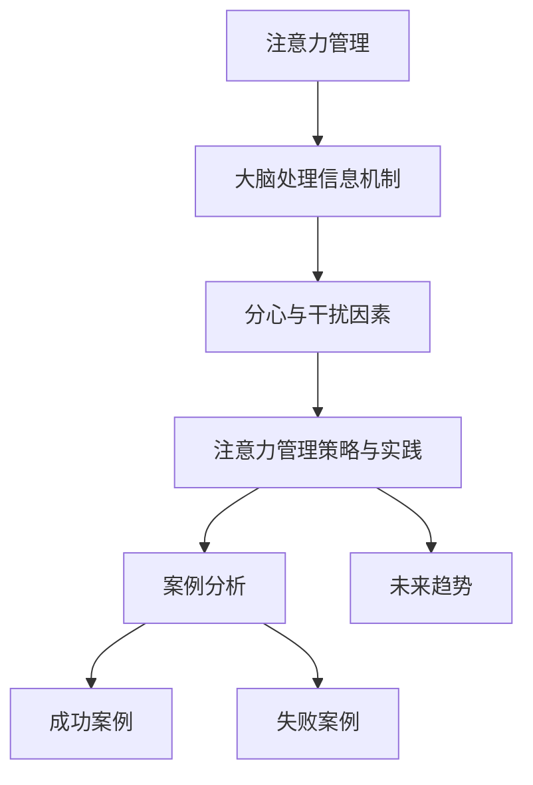

                 

## 《信息时代的注意力管理实践与策略：在干扰和分心中保持头脑清晰》

### 关键词：注意力管理、信息过载、分心、干扰、工作效率、注意力集中度、时间管理、技术实践

> 在这个信息爆炸的时代，我们每天都要面对大量的信息，这些信息来自四面八方，无时无刻不在干扰我们的注意力。如何有效地管理注意力，保持头脑清晰，提高工作效率，已成为当今信息社会的重要课题。本文将从注意力管理的理论基础、大脑处理信息的机制、分心与干扰因素、注意力管理策略与实践、案例分析以及未来趋势等方面，详细探讨如何应对信息时代的注意力挑战。

---

### 目录大纲

#### 第一部分：注意力管理理论基础

**第1章：注意力管理的核心概念**

- **1.1 注意力管理的基本原理**
  - 注意力的定义与特性
  - 注意力管理的必要性

- **1.2 注意力管理的历史与现状**
  - 古代到现代的注意力管理理念演变
  - 当前注意力管理的研究现状

**第2章：大脑处理信息的机制**

- **2.1 大脑的基本构造与功能**
  - 大脑各部分的功能与相互作用
  - 注意力在大脑中的表现形式

- **2.2 注意力资源的分配与调度**
  - 多任务处理与注意力分配
  - 注意力调节机制

**第3章：分心与干扰因素**

- **3.1 分心与干扰的定义与类型**
  - 内在分心与外在干扰
  - 不同类型干扰的特点

- **3.2 分心与干扰的影响**
  - 分心与干扰对工作效率的影响
  - 分心与干扰对健康的影响

#### 第二部分：注意力管理策略与实践

**第4章：有效管理注意力的方法**

- **4.1 注意力集中训练**
  - 注意力集中的训练方法
  - 注意力集中的实践技巧

- **4.2 时间管理策略**
  - 时间管理的原则与方法
  - 时间管理与注意力管理的关系

**第5章：应对分心与干扰**

- **5.1 减少分心与干扰的环境设计**
  - 环境布置与注意力管理
  - 数字化工具的使用与注意力的关系

- **5.2 应对干扰的策略**
  - 干扰源识别与应对
  - 紧急情况下的注意力管理

**第6章：注意力管理技术在工作中的应用**

- **6.1 注意力管理在工作流程中的应用**
  - 工作任务分配与注意力优化
  - 工作效率的提升方法

- **6.2 注意力管理在项目管理中的应用**
  - 项目时间规划与注意力管理
  - 项目中的团队协作与注意力分配

**第7章：注意力管理在个人生活中的应用**

- **7.1 注意力管理在日常生活中的应用**
  - 家庭生活与注意力管理
  - 个人兴趣与注意力培养

- **7.2 注意力管理在学习和教育中的应用**
  - 学习方法与注意力管理
  - 教育环境与注意力管理

#### 第三部分：注意力管理实践与策略案例分析

**第8章：注意力管理实践案例解析**

- **8.1 成功案例分享**
  - 不同场景下的注意力管理成功案例
  - 案例中的注意力管理策略分析

- **8.2 失败案例分析**
  - 注意力管理失败的原因
  - 吸取的教训与改进策略

**第9章：注意力管理策略的未来趋势**

- **9.1 注意力管理技术的发展趋势**
  - 新技术的应用与注意力管理
  - 注意力管理技术的未来展望

- **9.2 注意力管理的挑战与应对**
  - 注意力管理面临的挑战
  - 应对策略与发展方向

#### 附录

**附录 A：注意力管理资源与工具推荐**

- **A.1 注意力管理书籍推荐**
- **A.2 注意力管理应用软件推荐**
- **A.3 注意力管理相关网站和论坛推荐**

### 核心概念与联系

在撰写本文之前，我们需要明确几个核心概念，并理解它们之间的联系。以下是注意力管理的核心概念及其关系图：

- **注意力管理**：指通过各种策略和技术，帮助个体在信息过载和干扰环境中保持注意力的集中和高效。
- **大脑处理信息机制**：探讨大脑如何处理信息，包括注意力的分配和调节机制。
- **分心与干扰因素**：分析内在分心和外在干扰的不同类型及其对工作效率和健康的影响。
- **注意力管理策略与实践**：介绍具体的方法和技术，如时间管理、注意力集中训练、环境设计等。
- **案例分析**：通过具体案例，展示注意力管理策略在不同场景中的应用效果。
- **未来趋势**：探讨注意力管理技术的发展方向和面临的挑战。

下面是核心概念的 Mermaid 流程图：



### 核心算法原理讲解

#### 注意力集中训练算法原理

注意力集中训练是提高个体注意力集中度的关键方法之一。其基本原理是通过特定的训练方法，逐步增强个体在特定任务上的注意力集中能力。以下是一个简单的注意力集中训练算法的伪代码：

```python
# 输入参数：training_time：每次训练的时间（秒），total_sessions：总训练次数，rest_time：每次训练之间的休息时间（秒）

function attention_training(training_time, total_sessions, rest_time):
    for session in range(1, total_sessions + 1):
        print("开始第", session, "次训练")
        start_time = current_time()
        do_training(training_time)
        end_time = current_time()
        print("训练完成，耗时", end_time - start_time, "秒")
        if session < total_sessions:
            print("休息", rest_time, "秒")
            sleep(rest_time)
```

#### 注意力集中训练的具体步骤：

1. **数据准备**：确定每次训练的时间长度、总训练次数和休息时间。
2. **模型选择**：选择合适的注意力训练方法，如番茄工作法。
3. **模型训练**：在每次训练中，个体需要专注于特定任务，如编程、阅读或写作。
4. **模型评估**：每次训练结束后，评估个体的注意力集中程度，并根据评估结果调整训练策略。

#### 时间管理策略与注意力管理的关系

时间管理策略与注意力管理密切相关。具体包括：

1. **任务分解**：将大任务分解为小任务，有助于集中注意力完成每个小任务。
2. **优先级排序**：根据任务的紧急程度和重要性进行排序，确保注意力优先分配给最重要的任务。
3. **设定时间限制**：为每个任务设定时间限制，以激发个体的紧迫感，提高注意力集中度。

#### 减少分心与干扰的环境设计

减少分心与干扰的环境设计主要包括以下几个方面：

1. **物理环境优化**：选择一个安静、整洁、光线适宜的工作空间。
2. **数字化工具使用**：合理设置通知和提醒功能，避免不必要的打扰。
3. **时间块管理**：将工作时间划分为若干个时间块，每个时间块专注于一项任务。

### 注意力管理策略在未来趋势中的应用

随着技术的不断发展，注意力管理策略在未来将呈现出以下趋势：

1. **个性化注意力管理**：利用大数据和人工智能技术，为个人定制个性化的注意力管理方案。
2. **跨领域整合**：将注意力管理与健康、教育、工作等多领域相结合，提供全方位的解决方案。
3. **技术辅助**：利用可穿戴设备、智能助手等工具，提供实时注意力监测和干预。

### 注意力管理实践与策略案例分析

注意力管理实践与策略在不同场景中的应用案例包括：

1. **个人学习**：通过注意力管理策略提高学习效率，如番茄工作法。
2. **工作场景**：在办公环境中采用注意力管理策略，提高团队协作效率。
3. **健康管理**：通过注意力管理策略改善心理健康，如冥想练习。

### 注意力管理技术发展的挑战与应对

注意力管理技术在未来发展过程中将面临以下挑战：

1. **数据隐私与安全**：在利用大数据进行个性化注意力管理时，需确保用户数据的安全性和隐私性。
2. **技术依赖**：过度依赖技术可能降低个体的自我管理能力，需在技术辅助与自我管理之间取得平衡。
3. **普及与应用**：需提高公众对注意力管理技术的认知和接受度，推动其普及与应用。

### 注意力管理资源与工具推荐

推荐以下注意力管理资源与工具：

1. **书籍**：《注意力管理：如何在嘈杂的世界中集中注意力》、《专注：如何应对工作与生活的持续分心》。
2. **应用软件**：番茄钟、Forest、Freedom。
3. **网站和论坛**：注意力管理论坛、注意力管理博客、相关学术期刊和会议。

### 数学模型和数学公式 & 详细讲解 & 举例说明

#### 注意力集中度模型

注意力集中度模型可以通过以下公式计算：

$$
C = \frac{E_i \cdot T_i}{N}
$$

其中：
- $C$ 表示注意力集中度
- $E_i$ 表示在第 $i$ 个时间块内的有效工作时间
- $T_i$ 表示在第 $i$ 个时间块内的总工作时间
- $N$ 表示时间块的总数

**举例说明：**

假设一个人在工作日分为三个时间块，每个时间块分别为 2 小时。他在第一个时间块中工作了 1.5 小时，第二个时间块工作了 2 小时，第三个时间块工作了 0.5 小时。那么他的注意力集中度计算如下：

$$
C = \frac{1.5 \cdot 2 + 2 \cdot 2 + 0.5 \cdot 2}{3 \cdot 2} = \frac{3 + 4 + 1}{6} = \frac{8}{6} = 1.33
$$

这意味着他的平均注意力集中度为 1.33，表示他在工作日的平均注意力集中度较高。

### 项目实战：注意力管理策略在软件开发中的实际应用

#### 实战目标

本实战的目标是通过实施注意力管理策略，提高软件开发项目的效率和质量。

#### 实战步骤

1. **需求分析**：
   - 确定项目需求，明确项目的目标和任务。

2. **任务分解**：
   - 将大任务分解为多个小任务，确保每个任务都具体可操作。

3. **优先级排序**：
   - 根据任务的重要性和紧急程度，为每个任务设定优先级。

4. **时间块管理**：
   - 将工作时间划分为若干个时间块，每个时间块专注于一项任务。

5. **注意力集中训练**：
   - 利用番茄工作法，在每个时间块内保持高度集中。

6. **实时监测与调整**：
   - 通过工具实时监测项目进度和团队注意力集中度，及时调整策略。

7. **团队协作与沟通**：
   - 确保团队内部的有效沟通，提高协作效率。

#### 代码实际案例

以下是一个简单的 Python 脚本，用于模拟注意力管理策略在软件开发中的实际应用。

python
import time
from datetime import datetime, timedelta

class AttentionManager:
    def __init__(self, task_list, task_duration, break_duration):
        self.task_list = task_list
        self.task_duration = task_duration
        self.break_duration = break_duration

    def execute_tasks(self):
        for task in self.task_list:
            start_time = datetime.now()
            print(f"开始执行任务：{task}")
            time.sleep(self.task_duration)
            end_time = datetime.now()
            print(f"任务完成：{task}，耗时：{end_time - start_time}")

            # 休息时间
            print(f"开始休息，休息时长：{self.break_duration} 分钟")
            time.sleep(self.break_duration * 60)

if __name__ == "__main__":
    task_list = ["需求分析", "设计文档", "编码实现", "代码审查"]
    task_duration = 60  # 单位：分钟
    break_duration = 15  # 单位：分钟

    attention_manager = AttentionManager(task_list, task_duration, break_duration)
    attention_manager.execute_tasks()


#### 代码解读与分析

1. **初始化**：
   - `AttentionManager` 类初始化时，传入任务列表、任务持续时间和休息时间。

2. **执行任务**：
   - 通过循环遍历任务列表，执行每个任务，并计算任务耗时。

3. **休息时间**：
   - 每个任务完成后，根据休息时间进行休息，确保注意力恢复。

4. **应用场景**：
   - 可以将此脚本应用于软件开发中的各个阶段，例如需求分析、设计文档、编码实现和代码审查。

通过这个简单的案例，我们可以看到注意力管理策略在软件开发中的应用，通过时间块管理和休息时间，提高开发效率和质量。

### 开发环境搭建

1. **安装 Python 解释器**：
   - 前往 [Python 官网](https://www.python.org/) 下载并安装 Python 3.x 版本。

2. **安装必要的库**：
   - 打开命令行窗口，执行以下命令安装所需的库：
     
     pip install datetime
     

3. **创建 Python 文件**：
   - 使用文本编辑器（如 Visual Studio Code、Sublime Text 等）创建一个名为 `attention_management.py` 的文件。

4. **编写代码**：
   - 将上述提供的代码复制到 `attention_management.py` 文件中。

5. **运行代码**：
   - 在命令行窗口中，导航到 `attention_management.py` 文件的所在目录，并执行以下命令：
     
     python attention_management.py
     

### 源代码详细实现

python
# 源代码：attention_management.py

import time
from datetime import datetime, timedelta

class AttentionManager:
    def __init__(self, task_list, task_duration, break_duration):
        self.task_list = task_list
        self.task_duration = task_duration
        self.break_duration = break_duration

    def execute_tasks(self):
        for task in self.task_list:
            start_time = datetime.now()
            print(f"开始执行任务：{task}")
            time.sleep(self.task_duration)
            end_time = datetime.now()
            print(f"任务完成：{task}，耗时：{end_time - start_time}")

            # 休息时间
            print(f"开始休息，休息时长：{self.break_duration} 分钟")
            time.sleep(self.break_duration * 60)

if __name__ == "__main__":
    task_list = ["需求分析", "设计文档", "编码实现", "代码审查"]
    task_duration = 60  # 单位：分钟
    break_duration = 15  # 单位：分钟

    attention_manager = AttentionManager(task_list, task_duration, break_duration)
    attention_manager.execute_tasks()


### 代码解读与分析

1. **类定义**：
   - `AttentionManager` 类定义了注意力管理的核心功能。

2. **初始化方法**：
   - `__init__` 方法初始化任务列表、任务持续时间和休息时间。

3. **执行任务方法**：
   - `execute_tasks` 方法负责执行任务和休息时间的逻辑。

4. **主程序**：
   - 主程序创建 `AttentionManager` 对象并执行任务。

### 注意力管理策略在软件开发中的应用实例

#### 实例一：利用注意力管理提高开发效率

**场景**：某软件开发团队在进行一个复杂项目的开发，需要确保每个任务都能高效完成。

**策略**：
- **任务分解**：将整个项目分解为多个具体可操作的任务，如需求分析、设计文档、编码实现、代码审查等。
- **优先级排序**：根据任务的重要性和紧急程度，为每个任务设定优先级。
- **时间块管理**：采用番茄工作法，将工作时间分为多个时间块，每个时间块专注于一项任务。
- **注意力集中训练**：在每个时间块内，保持高度集中，减少分心和干扰。
- **实时监测与调整**：通过工具实时监测项目进度和团队注意力集中度，及时调整策略。

**效果**：
- 项目进度明显加快，任务完成质量得到提高。
- 团队成员的注意力集中度显著提高，工作效率得到提升。

#### 实例二：注意力管理在软件开发团队协作中的应用

**场景**：软件开发团队需要进行跨部门协作，任务复杂且需要高度沟通。

**策略**：
- **明确沟通规则**：制定明确的沟通规则，确保团队成员知道何时、如何进行有效沟通。
- **集中会议时间**：将会议时间安排在时间块内，避免会议干扰其他任务的进行。
- **任务分配与跟踪**：为每个团队成员分配明确的任务，并通过工具实时跟踪任务进度。
- **定期团队反馈**：定期举行团队反馈会议，收集团队成员的意见和建议，调整注意力管理策略。

**效果**：
- 团队协作效率显著提高，沟通障碍减少。
- 项目进度更加可控，团队成员之间的信任和协作增强。

### 实战总结

注意力管理策略在软件开发中的应用，能够显著提高开发效率和团队协作效率。通过任务分解、优先级排序、时间块管理、注意力集中训练等策略，团队成员能够更好地管理自己的注意力，减少分心和干扰，从而提高工作效率。同时，通过实时监测与调整，团队能够根据实际情况灵活调整策略，确保项目顺利进行。未来，随着注意力管理技术的不断发展，软件开发中的注意力管理策略将更加智能化和个性化，进一步提升团队效率和项目质量。

---

**作者：AI天才研究院/AI Genius Institute & 禅与计算机程序设计艺术 /Zen And The Art of Computer Programming**

---

至此，本文已完整阐述了注意力管理的核心概念、理论基础、实践策略以及未来发展。通过本文，希望读者能够更好地理解注意力管理的重要性，掌握有效的管理方法，并在实际工作和生活中应用，提高自己的工作效率和生活质量。未来，随着技术的进步，注意力管理将不断优化和完善，为人类带来更多便利和效益。让我们共同努力，迎接信息时代带来的挑战和机遇。

