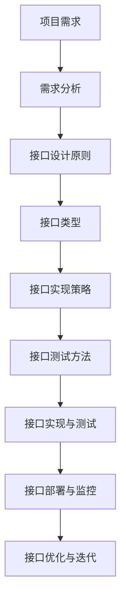

                 

### 文章标题

> **关键词**：信息系统、项目管理、立项、调研、选型、评审、技术接口、上线

> **摘要**：本文将系统地探讨信息系统的立项、调研、选型、评审、技术接口、上线和项目管理方案。通过详细的步骤和案例分析，帮助读者全面理解并掌握信息系统项目管理的关键环节和实际操作方法。

---

在当今信息化时代，信息系统已成为各类组织机构运营的核心支撑。然而，从项目的立项到最终上线，信息系统项目管理的复杂性常常令许多人望而却步。本文旨在为读者提供一份全面的信息系统项目管理指南，涵盖从立项、调研、选型、评审、技术接口设计到上线和项目管理的各个环节。

我们将逐步探讨以下主题：

1. **信息系统项目管理基础**：介绍信息系统项目管理的核心概念、过程和方法。
2. **信息系统的立项与调研**：阐述项目立项的原因和流程，以及如何进行有效的调研。
3. **信息系统选型与评审**：分析信息系统选型的策略和评审的方法。
4. **信息系统技术接口与上线**：讨论技术接口设计的重要性以及上线的策略和风险。
5. **信息系统项目管理方案**：介绍项目管理方案的编制方法和实施策略。

通过本文，读者将能够对信息系统项目管理有一个全面而深入的了解，并掌握实际操作的方法和技巧。

---

### 第一部分：信息系统项目管理基础

#### 第1章：信息系统项目管理概述

**1.1 信息系统项目管理的定义与作用**

信息系统项目管理（Information System Project Management，简称ISP Management）是通过对信息系统项目的策划、组织、协调、控制等一系列管理活动，以确保项目按照预定的范围、时间、成本和质量要求顺利完成的过程。

**信息系统项目管理的定义**：
信息系统项目管理涉及多个领域，包括技术、管理、财务和人力资源等，其核心目标是确保项目能够按时、按预算、按质量要求交付。

**信息系统项目管理的作用**：
1. **目标导向**：确保项目目标明确，并围绕目标进行各项活动。
2. **资源优化**：合理分配资源，提高资源利用效率。
3. **风险管理**：识别、评估和应对项目风险，降低项目失败的可能性。
4. **沟通协调**：确保项目团队内部和与外部相关方的有效沟通和协作。
5. **质量控制**：确保项目成果符合既定的质量标准。

**1.2 信息系统项目管理的核心概念**

**项目目标**：
项目目标是项目的核心驱动力，是项目规划和执行的基础。明确的项目目标有助于确保项目方向正确，资源投入合理。

**项目范围**：
项目范围定义了项目需要完成的工作内容和边界，明确项目的任务和责任。

**项目生命周期**：
项目生命周期包括启动、规划、执行、监控和收尾等阶段。每个阶段都有其特定的目标和任务。

**1.3 信息系统项目管理的过程**

**项目启动**：
项目启动阶段是项目正式开始的标志。主要任务包括项目立项、组建项目团队、明确项目目标等。

**项目规划**：
项目规划阶段是制定项目详细计划的过程。包括制定项目范围、时间计划、成本预算、资源分配等。

**项目执行**：
项目执行阶段是项目实际执行的过程。项目团队根据项目计划，进行任务分配、执行和监控。

**项目监控**：
项目监控阶段是对项目执行情况进行跟踪、监控和调整的过程。确保项目按计划进行，及时发现并解决潜在问题。

**项目收尾**：
项目收尾阶段是项目结束的标志。主要任务包括项目验收、总结和文档归档等。

通过以上对信息系统项目管理基础部分的介绍，我们为后续章节的深入探讨奠定了基础。接下来，我们将进一步探讨信息系统的立项与调研过程，帮助读者了解如何为项目奠定坚实的基础。

#### 第2章：信息系统的立项与调研

**2.1 信息系统项目立项流程**

信息系统项目立项是项目启动的第一步，是确保项目能够顺利进行的重要环节。以下是信息系统项目立项的一般流程：

**立项原因与目标**：
项目立项的首要任务是明确项目立项的原因和目标。这通常涉及以下步骤：
1. **需求分析**：通过调研和分析，了解组织内部和外部的需求，确定项目是否能够满足这些需求。
2. **可行性研究**：评估项目的可行性，包括技术、经济、法律和运营等多个方面。
3. **确定项目目标**：明确项目的主要目标，如功能需求、性能指标、交付时间等。

**立项申请与审批**：
立项申请是项目正式立项的必要步骤。以下是立项申请与审批的一般流程：
1. **编写立项申请报告**：立项申请报告应包括项目背景、需求分析、可行性研究、项目目标、预算等。
2. **提交立项申请**：将立项申请报告提交给项目审批委员会或相关负责人。
3. **立项审批**：审批委员会对立项申请进行审查，根据申请报告的内容和组织的战略目标，决定是否批准立项。

**立项可行性分析**：
立项可行性分析是立项流程中的关键环节，它决定了项目是否值得进行。以下是可行性分析的一般步骤：
1. **技术可行性分析**：评估项目所需的技术是否成熟，团队是否有足够的技术能力。
2. **经济可行性分析**：评估项目的投资回报率，包括成本、预算和预期收益。
3. **法律可行性分析**：确保项目符合相关法律法规的要求，如知识产权、数据保护等。
4. **运营可行性分析**：评估项目实施后的运营和维护成本，以及组织的运营能力。

**2.2 信息系统调研方法与技巧**

项目调研是立项过程中不可或缺的环节，通过对市场、技术和用户的深入调研，为项目的成功奠定基础。以下是常见的调研方法与技巧：

**市场调研**：
市场调研旨在了解市场需求和竞争环境。以下是一些市场调研的方法：
1. **问卷调查**：通过设计问卷，收集目标用户的需求和意见。
2. **访谈**：与潜在用户和专家进行面对面访谈，深入了解他们的需求和期望。
3. **市场分析**：分析市场趋势、竞争格局和用户需求，为项目定位提供依据。

**技术调研**：
技术调研旨在评估项目所需的技术能力和资源。以下是一些技术调研的方法：
1. **技术评审**：对现有技术进行评审，评估其性能、可靠性和适用性。
2. **技术预测**：预测未来技术发展趋势，为项目的技术选型和规划提供参考。
3. **技术文档分析**：分析相关技术文档，了解技术的细节和实现方法。

**用户调研**：
用户调研是了解用户需求和期望的重要手段。以下是一些用户调研的方法：
1. **用户体验设计**：通过用户测试、原型设计和用户反馈，优化用户界面和交互体验。
2. **用户访谈**：与用户进行一对一的访谈，了解他们的需求和痛点。
3. **用户行为分析**：分析用户行为数据，了解用户的操作习惯和偏好。

**2.3 调研报告撰写与审核**

调研报告是调研成果的总结，为项目立项和后续工作提供重要参考。以下是调研报告撰写的一般步骤：

**调研报告的结构**：
1. **封面**：包括报告名称、编写人、日期等基本信息。
2. **目录**：列出报告的各个章节和页码，便于查阅。
3. **引言**：简要介绍调研的目的、方法和主要发现。
4. **正文**：详细阐述调研的结果和发现，包括市场分析、技术评估、用户需求等。
5. **结论**：总结调研的主要发现，并提出相应的建议。
6. **参考文献**：列出调研过程中引用的资料和文献。

**调研数据分析**：
1. **数据整理**：对收集到的数据进行整理和分析，提取有用的信息。
2. **数据可视化**：通过图表、图形等方式，将数据分析结果可视化，便于理解和传达。
3. **数据分析**：对数据进行定量和定性分析，挖掘深层次的信息和规律。

**调研报告审核**：
1. **内部审核**：由调研团队成员对报告进行审查，确保报告内容准确、完整和逻辑清晰。
2. **外部审核**：邀请相关领域的专家对报告进行审核，提供外部意见和建议。

通过以上对信息系统立项与调研的详细介绍，我们为项目的成功奠定了坚实的基础。接下来，我们将深入探讨信息系统的选型与评审，帮助读者了解如何选择最适合的信息系统解决方案。

### 第二部分：信息系统选型与评审

#### 第3章：信息系统选型策略

**3.1 信息系统选型原则**

信息系统选型是项目成功的关键步骤，选型策略的制定至关重要。以下是信息系统选型的主要原则：

**需求导向**：
选型过程应以需求为导向，确保所选系统满足业务需求。需求分析应贯穿选型全过程，包括功能需求、性能需求、安全需求等。

**成本效益**：
在满足需求的前提下，应考虑系统的成本效益。成本包括购买成本、实施成本、维护成本等，同时要考虑系统对业务的长期价值。

**可扩展性**：
选型时应考虑系统的可扩展性，确保系统能够随着业务的发展而扩展，避免频繁更换系统带来的成本和风险。

**兼容性**：
选型时应考虑系统与现有系统的兼容性，确保系统能够与现有的软件、硬件和业务流程无缝集成。

**易用性**：
系统的易用性对用户接受度和效率至关重要。应选择用户界面友好、操作简便的系统，降低用户的学习成本。

**3.2 信息系统选型流程**

信息系统选型过程通常包括以下步骤：

**需求分析**：
在选型前，应对业务需求进行详细分析，明确系统的功能、性能、安全等需求。

**市场评估**：
通过市场调研，了解市场上可供选择的系统及其特性，评估各系统的优缺点。

**产品对比**：
根据需求和市场评估结果，对多个候选系统进行对比分析，包括功能对比、性能对比、成本对比等。

**选型决策**：
根据产品对比结果，综合考虑需求、成本、可扩展性等因素，做出最终选型决策。

**3.3 信息系统选型案例分析**

**成功案例**：
某公司是一家大型制造企业，为了提高生产效率和管理水平，决定引入一套企业资源计划（ERP）系统。经过详细的需求分析和市场评估，该公司最终选择了某知名ERP厂商的产品。系统上线后，大幅提升了生产效率和管理水平，实现了业务流程的优化。

**失败案例分析**：
某初创公司在成立初期，为了降低成本，选择了市面上一个价格较为低廉的CRM系统。然而，由于系统功能不全、性能不稳定，导致用户体验差，最终影响了公司的业务发展。这个案例表明，低价并不一定代表高性价比，选型时必须全面考虑系统的长期价值。

通过以上对信息系统选型策略的探讨，我们为读者提供了选型过程中的关键原则和步骤。接下来，我们将进一步探讨信息系统评审的方法，帮助读者了解如何确保所选系统的质量。

#### 第4章：信息系统评审方法

**4.1 评审流程与标准**

信息系统评审是确保信息系统质量的重要环节，一个规范的评审流程和明确的评审标准是评审成功的关键。以下是信息系统评审的一般流程和标准：

**评审流程**：

1. **评审准备**：
   - 确定评审目标和范围。
   - 制定评审计划，明确评审的时间、地点和参与者。
   - 准备评审材料，包括项目文档、设计文档、测试报告等。

2. **评审会议**：
   - 召开评审会议，评审组成员对评审材料进行详细讨论。
   - 评审组长主持会议，确保评审会议的有序进行。

3. **评审意见反馈**：
   - 对评审过程中发现的问题进行记录和整理。
   - 提供详细的评审意见和改进建议。

4. **评审结果记录与跟踪**：
   - 记录评审结果，包括评审意见、改进措施和责任人。
   - 跟踪评审意见的落实情况，确保问题得到有效解决。

**评审标准**：

1. **功能完整性**：
   - 系统功能是否全面，是否满足业务需求。

2. **性能**：
   - 系统的性能是否达到预期，包括响应时间、吞吐量等。

3. **安全性**：
   - 系统的安全性是否得到保障，包括数据保护、用户认证等。

4. **稳定性**：
   - 系统的稳定性是否良好，包括故障率、恢复时间等。

5. **易用性**：
   - 系统的用户界面是否友好，用户操作是否简便。

6. **可维护性**：
   - 系统的维护是否方便，包括更新、升级等。

7. **兼容性**：
   - 系统是否与现有系统兼容，是否能够顺利集成。

**4.2 评审工具与技术**

为了提高评审效率和效果，可以采用以下评审工具和技术：

1. **现场评审**：
   - 现场评审是一种面对面的评审方式，适用于对系统进行深度评估。评审组成员可以现场查看系统的运行情况，与开发人员进行交流和讨论。

2. **文档评审**：
   - 文档评审是对系统文档进行详细检查的一种方式，包括需求文档、设计文档、测试报告等。通过文档评审，可以确保文档的完整性、一致性和准确性。

3. **系统测试**：
   - 系统测试是对系统功能、性能、安全等方面进行全面检查的一种方式。包括单元测试、集成测试、系统测试和验收测试等。

**4.3 评审报告撰写与反馈**

评审报告是评审过程的总结和记录，是后续改进的依据。以下是评审报告撰写的一般步骤：

1. **封面**：
   - 包括报告名称、编写人、日期等基本信息。

2. **目录**：
   - 列出报告的各个章节和页码，便于查阅。

3. **引言**：
   - 简要介绍评审的目的、方法和主要发现。

4. **正文**：
   - 详细阐述评审的结果和发现，包括功能完整性、性能、安全性、稳定性、易用性、可维护性和兼容性等方面的评估。

5. **结论与建议**：
   - 总结评审的主要发现，提出具体的改进建议。

6. **附录**：
   - 包括评审过程中引用的资料、测试报告、相关数据等。

评审报告完成后，应提交给项目相关方进行反馈。反馈机制包括以下环节：

1. **评审意见反馈**：
   - 将评审报告提交给项目团队，项目团队对评审意见进行讨论和确认。

2. **整改与复评**：
   - 根据评审意见，对系统进行整改，并重新进行评审。

3. **跟踪与总结**：
   - 对整改效果进行跟踪和总结，确保评审意见得到有效落实。

通过以上对信息系统评审方法的详细介绍，我们为读者提供了评审流程、标准和工具的全面指导。接下来，我们将探讨信息系统的技术接口设计，为系统的顺利上线做好准备。

### 第三部分：信息系统技术接口与上线

#### 第5章：信息系统技术接口设计

**5.1 技术接口概述**

技术接口（Technical Interface）是信息系统之间、子系统之间或者信息系统与外部系统之间进行通信和交互的桥梁。良好的技术接口设计能够确保系统之间的高效协作和数据流动，提高系统的整体性能和可靠性。以下是对技术接口的概述：

**接口定义**：
技术接口是一组定义明确的通信协议和数据格式，用于系统之间的数据交换和功能调用。接口可以是基于Web服务的RESTful API，也可以是基于消息队列的MQ接口，或者是基于文件的FTP接口等。

**接口类型**：
根据接口的实现方式和用途，技术接口可以分为以下几种类型：

1. **同步接口**：同步接口在调用时，客户端需要等待服务端响应后才能继续执行。例如，SOAP接口就是一种典型的同步接口。

2. **异步接口**：异步接口在调用时，客户端无需等待服务端响应即可继续执行其他任务。例如，基于消息队列的接口就是一种异步接口。

3. **文档接口**：文档接口通过发送和接收XML、JSON等文档格式进行数据交换。这种接口通常用于数据同步和集成。

4. **文件接口**：文件接口通过上传和下载文件进行数据交换。这种接口适用于大批量数据传输和文件共享。

**5.2 接口设计原则**

良好的技术接口设计应遵循以下原则：

**松耦合**：
接口设计应尽量实现松耦合，降低系统之间的依赖性。松耦合意味着系统之间的交互是独立的，一个系统的变更不会影响其他系统。

**高内聚**：
接口设计应在保证松耦合的同时，提高接口的内聚性。高内聚意味着接口的功能是紧密相关的，能够实现特定功能的模块化设计。

**标准化**：
接口设计应遵循相关标准和规范，确保接口的一致性和互操作性。标准化有助于降低集成成本，提高系统的可维护性。

**安全性**：
接口设计应考虑安全性，确保数据传输和存储的安全。常用的安全措施包括加密、认证和授权等。

**可扩展性**：
接口设计应具备良好的可扩展性，能够随着业务需求的变化而扩展。可扩展性可以通过设计灵活的接口协议和数据模型来实现。

**5.3 接口实现与测试**

**接口实现策略**：
接口实现应根据接口类型和系统需求进行设计。以下是常见的接口实现策略：

1. **基于Web服务的接口**：使用Java、Python等编程语言实现Web服务，通过HTTP协议进行数据传输。

2. **基于消息队列的接口**：使用消息队列中间件（如RabbitMQ、Kafka等）实现异步通信。

3. **基于文档的接口**：使用JSON、XML等文档格式进行数据交换，通过HTTP或FTP等协议传输。

**接口测试方法**：
接口测试是确保接口设计质量和功能实现的关键步骤。以下是常见的接口测试方法：

1. **功能测试**：验证接口的功能是否满足需求，包括各种业务场景的测试。

2. **性能测试**：评估接口的性能指标，如响应时间、吞吐量等，确保接口能够在高负载下正常运行。

3. **安全测试**：检查接口的安全性，包括数据加密、认证授权等。

4. **兼容性测试**：确保接口在不同操作系统、浏览器等环境下兼容。

5. **压力测试**：模拟高并发情况，测试接口的稳定性和可靠性。

**5.4 接口设计与实现的 Mermaid 流程图**

为了更直观地展示接口设计与实现的过程，我们使用Mermaid绘制了一个简化的流程图：

通过以上对技术接口设计和实现的详细讨论，我们为读者提供了全面的指导。接下来，我们将探讨信息系统上线的策略和流程，确保系统能够顺利投入运行。

#### 第6章：信息系统上线策略

**6.1 上线准备**

信息系统上线是一个复杂且关键的过程，需要充分的准备以确保系统的平稳运行。以下是上线准备的主要工作内容：

**环境准备**：
在上线前，需要确保所有硬件设备和软件环境均已就绪。这包括服务器、网络设备、数据库、操作系统等。环境准备的具体步骤如下：

1. **硬件设备检查**：确保所有硬件设备（如服务器、存储设备等）正常运行，无故障。
2. **软件安装与配置**：安装必要的操作系统、数据库管理系统、中间件等软件，并进行配置。
3. **网络配置**：配置网络连接，确保各设备之间能够正常通信。

**数据迁移**：
数据迁移是将现有数据从旧系统迁移到新系统的过程。数据迁移的步骤如下：

1. **数据备份**：在迁移前，对旧系统中的数据进行备份，以防数据丢失。
2. **数据清洗**：对迁移的数据进行清洗，去除无效、重复和错误的数据。
3. **数据映射**：将旧系统的数据字段映射到新系统的数据字段，确保数据的一致性。
4. **数据迁移**：执行数据迁移操作，将数据从旧系统迁移到新系统。

**用户培训**：
用户培训是确保用户能够熟练使用新系统的关键步骤。培训内容通常包括：

1. **系统操作培训**：向用户介绍系统的基本操作和功能。
2. **常见问题解答**：解答用户在操作过程中可能遇到的问题。
3. **实战演练**：通过实际操作，让用户熟悉系统的使用方法和技巧。

**6.2 上线流程**

信息系统上线的流程包括以下几个关键步骤：

**部署**：
部署是将新系统安装到生产环境的过程。部署的具体步骤如下：

1. **环境检查**：在部署前，对环境进行一次全面检查，确保硬件、软件和网络环境均无问题。
2. **软件安装**：根据部署计划，安装新系统的各个组件。
3. **配置调整**：根据实际需求，对系统的配置进行调整。
4. **系统启动**：启动系统，进行初始设置和初始化。

**上线测试**：
上线测试是在生产环境下对新系统进行全面测试的过程。测试内容通常包括：

1. **功能测试**：验证系统的功能是否完整，是否符合需求。
2. **性能测试**：评估系统的性能，如响应时间、吞吐量等。
3. **安全性测试**：检查系统的安全性，包括漏洞扫描、权限管理等。
4. **稳定性测试**：测试系统在长期运行下的稳定性，包括故障恢复、数据一致性等。

**上线确认**：
上线确认是确保系统上线成功的关键步骤。确认步骤如下：

1. **功能确认**：确认系统功能是否正常运行，符合预期。
2. **性能确认**：确认系统性能指标是否达到设计要求。
3. **安全确认**：确认系统的安全性措施是否有效。
4. **用户确认**：与用户进行沟通，了解系统上线后的使用情况，收集用户反馈。

**6.3 上线风险与应对**

信息系统上线过程中可能面临多种风险，以下是一些常见风险及其应对策略：

**技术风险**：
技术风险包括系统故障、数据丢失、性能问题等。应对策略包括：

1. **备份与恢复**：定期备份数据，确保数据安全。
2. **容错设计**：系统设计应考虑容错性，确保在故障发生时能够快速恢复。
3. **性能优化**：在上线前进行充分的性能测试和优化。

**数据风险**：
数据风险包括数据迁移失败、数据不一致等。应对策略包括：

1. **数据验证**：在数据迁移前，对数据进行验证，确保数据准确性。
2. **数据清洗**：在数据迁移过程中，对数据进行清洗，去除无效和错误数据。
3. **数据备份**：在数据迁移和上线过程中，定期备份数据。

**用户风险**：
用户风险包括用户接受度低、操作失误等。应对策略包括：

1. **用户培训**：在上线前进行充分的用户培训，提高用户的使用能力。
2. **用户反馈**：上线后，收集用户反馈，及时解决用户问题。
3. **操作手册**：提供详细的操作手册，帮助用户了解系统的使用方法和技巧。

通过以上对信息系统上线策略的详细介绍，我们为读者提供了系统上线前的全面准备和应对策略。接下来，我们将通过实际案例，进一步探讨信息系统上线的过程和注意事项。

### 第7章：信息系统上线案例解析

**7.1 成功上线案例分析**

**案例介绍**：
某大型金融机构为了提升其业务处理效率和客户体验，决定引入一套全新的客户关系管理（CRM）系统。该系统涉及到客户信息的收集、管理和分析，对金融机构的业务运营具有重要意义。

**成功因素分析**：

1. **详细的规划与准备**：
   - 在项目启动阶段，金融机构对项目进行了详细的规划，包括需求分析、技术选型、风险评估等。
   - 充分的环境准备和数据迁移，确保系统上线时硬件、软件和网络环境稳定，数据迁移顺利。

2. **高效的团队协作**：
   - 项目团队由不同领域的专业人员组成，包括项目经理、开发人员、测试人员、用户培训师等。
   - 团队协作紧密，及时沟通，确保项目进度和质量。

3. **全面的测试与验证**：
   - 在上线前，对系统进行了全面的测试，包括功能测试、性能测试、安全性测试等。
   - 通过模拟真实业务场景，验证系统在各种情况下的稳定性和可靠性。

4. **用户参与与反馈**：
   - 在项目过程中，用户（业务人员）全程参与，提出改进建议。
   - 上线后，通过用户反馈，及时调整和优化系统功能，提高用户满意度。

**案例总结**：
该金融机构的CRM系统成功上线，大幅提升了业务处理效率和客户满意度。成功的关键在于详细的规划与准备、高效的团队协作、全面的测试与验证以及用户参与与反馈。

**7.2 上线失败案例分析**

**案例介绍**：
某中型企业为了提升内部沟通和协作效率，决定引入一套即时通讯工具。然而，在系统上线后，却遭遇了严重的失败。

**失败原因分析**：

1. **需求分析不足**：
   - 项目团队在需求分析阶段，未能充分了解用户的具体需求，导致系统功能不全面，无法满足用户期望。

2. **测试不充分**：
   - 上线前的测试仅限于功能测试，未进行性能测试和安全测试，导致系统在高并发情况下崩溃，数据泄露。

3. **用户培训不足**：
   - 上线前未对用户进行充分的培训，用户操作不当，导致系统故障和误操作。

4. **沟通协调不畅**：
   - 项目团队与用户之间的沟通不畅，用户反馈无法及时传达和处理，导致问题长期得不到解决。

5. **变更管理不到位**：
   - 在上线过程中，项目需求频繁变更，未进行有效的变更管理，导致项目进度延误，系统质量下降。

**案例总结**：
该企业的即时通讯工具上线失败，主要原因是需求分析不足、测试不充分、用户培训不足、沟通协调不畅和变更管理不到位。为了避免类似失败，项目团队在后续项目中应重视需求分析、测试、用户培训、沟通协调和变更管理。

通过以上对成功和失败案例的深入分析，我们可以看到，信息系统上线成功的关键在于充分的准备、有效的团队协作、全面的测试和用户参与。而上线失败的原因往往在于需求分析不足、测试不充分、用户培训不足、沟通协调不畅和变更管理不到位。这些经验教训对于其他信息系统项目的成功上线具有重要借鉴意义。

### 第四部分：信息系统项目管理方案

#### 第8章：信息系统项目管理方案编制

**8.1 项目管理方案概述**

项目管理方案（Project Management Plan，简称PMP）是信息系统项目管理的纲领性文件，它详细描述了项目管理的目标、范围、方法、工具和技术，为项目的顺利实施提供了指导和保障。以下是项目管理方案的主要组成部分：

**项目管理方案编制目的**：
项目管理方案的编制目的是为项目团队提供明确的工作指导，确保项目能够按照预定的时间、成本、质量和范围要求顺利完成。

**项目管理方案编制内容**：
1. **项目概述**：简要介绍项目的背景、目标、范围和关键里程碑。
2. **项目管理团队**：明确项目管理团队的组织结构、职责和角色。
3. **项目管理方法**：描述项目管理所采用的方法、流程和工具。
4. **项目管理工具**：介绍项目所使用的主要项目管理工具和技术。
5. **项目范围**：详细定义项目的范围，包括项目的主要工作和边界。
6. **项目计划**：包括项目的时间计划、成本预算、资源分配和风险计划。
7. **项目执行**：描述项目的执行策略和过程，包括任务分配、进度控制和质量保证。
8. **项目监控**：介绍项目的监控方法，包括进度、成本、质量和风险的监控。
9. **项目收尾**：描述项目的收尾过程，包括验收、总结和归档。

**8.2 项目管理方案编制方法**

项目管理方案的编制是一个系统化的过程，通常包括以下步骤：

**需求分析**：
在编制项目管理方案之前，首先需要明确项目需求。需求分析包括收集项目需求、整理需求文档和验证需求。需求分析的目的是确保项目能够满足用户和组织的期望。

**范围定义**：
范围定义是项目管理方案编制的关键环节，它明确了项目的范围和边界。范围定义包括项目的主要工作、可交付成果、排除的工作内容等。范围定义的目的是确保项目团队对项目的理解和期望一致。

**风险管理**：
风险管理是项目管理中的重要组成部分。在编制项目管理方案时，需要识别项目可能面临的风险，评估风险的影响和可能性，并制定相应的风险应对策略。风险管理旨在降低项目风险，确保项目的成功实施。

**项目计划编制**：
项目计划编制是项目管理方案的核心部分，它包括项目的时间计划、成本预算、资源分配和风险计划。项目计划编制的目的是为项目团队提供明确的工作指导，确保项目能够按照预定的时间、成本、质量和范围要求顺利完成。

**项目管理方法选择**：
在编制项目管理方案时，需要选择合适的项目管理方法。常用的项目管理方法包括敏捷开发、瀑布模型、Scrum等。项目管理方法的选择应根据项目的特点和要求进行。

**项目管理工具选择**：
项目管理工具是项目管理方案的重要组成部分。常用的项目管理工具有JIRA、Trello、Asana等。项目管理工具的选择应根据项目团队的需求和实际情况进行。

**8.3 项目管理方案实施与调整**

项目管理方案的实施是项目管理的核心环节，它包括项目执行、监控和收尾。以下是项目管理方案实施与调整的几个关键点：

**项目执行策略**：
项目执行策略包括任务分配、进度控制和质量保证。在项目执行过程中，项目团队应根据项目管理方案的要求，确保各项任务按时完成，并保证项目质量。

**项目监控方法**：
项目监控是确保项目按计划进行的关键。项目监控包括进度监控、成本监控、质量监控和风险监控。通过项目监控，项目团队可以及时发现并解决问题，确保项目顺利进行。

**项目调整与优化**：
在项目执行过程中，根据项目实际情况，可能需要对项目管理方案进行调整和优化。项目调整和优化的目的是确保项目能够更好地适应变化，提高项目成功率。

**项目收尾**：
项目收尾是项目管理方案实施的最后一个环节。项目收尾包括项目验收、总结和归档。项目验收是确保项目成果符合要求的最后一步，项目总结是总结项目经验和教训，项目归档是将项目文档和资料整理归档，以便后续参考。

通过以上对项目管理方案编制和实施与调整的详细介绍，我们为读者提供了信息系统项目管理的全面指导。接下来，我们将探讨信息系统项目管理工具与技术，为项目管理的顺利实施提供技术支持。

### 第9章：信息系统项目管理工具与技术

**9.1 项目管理工具概述**

在信息系统项目管理中，项目管理工具起着至关重要的作用。它们能够帮助项目团队提高工作效率，确保项目按时、按预算、按质量完成。以下是几种常用的项目管理工具及其选择策略：

**JIRA**：
JIRA是一款功能强大的项目管理工具，适用于敏捷开发。它可以用于任务跟踪、敏捷看板、报告和项目协作。JIRA的灵活性和可扩展性使其成为许多开发团队的理想选择。

**Trello**：
Trello是一个直观的看板式项目管理工具，适合小型项目和团队使用。它通过卡片和列表来管理任务，易于使用和操作。

**Asana**：
Asana是一个全面的任务管理工具，适用于各种规模的项目。它可以跟踪任务、项目进度和团队协作，提供详细的报告和数据分析。

**选择策略**：
选择项目管理工具时，应考虑以下因素：

1. **项目规模**：对于大型项目，需要功能强大的工具；对于小型项目，简单易用的工具可能更合适。
2. **团队成员技能**：选择团队成员熟悉且易用的工具，可以减少学习成本，提高工作效率。
3. **项目需求**：根据项目需求选择具有所需功能的工具，如敏捷开发、任务跟踪、协作等。
4. **成本**：评估不同工具的成本，选择性价比高的工具。

**9.2 项目管理技术**

**项目进度管理**：
项目进度管理是确保项目按计划进行的关键环节。以下是一些常见的项目进度管理技术：

1. **Gantt图**：
Gantt图是一种常用的项目进度表示工具，它通过水平和垂直线条显示项目的任务和时间安排，便于项目经理和团队成员了解项目的进展。

2. **关键路径法（CPM）**：
关键路径法是一种用于确定项目最短完成时间的方法。通过识别项目中的关键任务和路径，项目经理可以优化资源分配，确保项目按时完成。

3. **敏捷迭代管理**：
敏捷迭代管理是一种灵活的项目管理方法，适用于快速变化的环境。通过短周期迭代，项目团队可以快速响应变化，持续交付可用的产品功能。

**项目风险管理**：
项目风险管理是识别、评估和应对项目风险的过程。以下是一些常见的项目风险管理技术：

1. **风险矩阵**：
风险矩阵是一种用于评估风险影响和可能性，以及确定优先级的工具。通过风险矩阵，项目经理可以优先处理高风险和高影响的项目风险。

2. **头脑风暴**：
头脑风暴是一种用于识别项目风险的集体讨论方法。通过集体讨论，项目团队可以集思广益，识别潜在风险。

3. **定级与优先级排序**：
对识别出的风险进行定级和优先级排序，可以帮助项目团队集中精力处理最重要和最紧急的风险。

**项目质量管理**：
项目质量管理是确保项目成果符合质量标准的过程。以下是一些常见的项目质量管理技术：

1. **质量功能展开（QFD）**：
质量功能展开是一种将客户需求转化为具体质量要求的方法。通过QFD，项目团队可以确保项目设计、开发和测试满足客户需求。

2. **过程控制**：
过程控制是通过监控和调整项目过程来确保项目质量。通过过程控制，项目团队可以及时发现和纠正质量问题。

3. **质量评审**：
质量评审是一种定期评估项目质量的方法。通过质量评审，项目团队可以确保项目质量持续改进。

通过以上对信息系统项目管理工具与技术的详细介绍，我们为读者提供了项目管理的全面指南。接下来，我们将探讨信息系统项目管理的总结与展望，帮助读者了解项目管理的未来趋势。

### 第10章：信息系统项目管理总结与展望

**10.1 项目管理经验总结**

信息系统项目管理的成功离不开对项目管理经验的总结和积累。以下是对项目管理经验的总结，包括成功经验和失败经验：

**成功经验**：

1. **明确项目目标**：成功的项目管理首先需要明确项目的目标和范围，确保项目团队和利益相关者对项目的期望一致。

2. **充分的规划与准备**：成功的项目管理需要详细的规划与准备，包括需求分析、风险评估、资源分配等。

3. **有效的团队协作**：成功的项目管理需要高效的团队协作，确保项目团队能够高效地完成任务，并及时沟通和解决问题。

4. **全面的测试与验证**：成功的项目管理需要全面的测试和验证，确保系统在上线前符合质量标准，减少上线后的故障和问题。

5. **用户参与与反馈**：成功的项目管理需要用户的积极参与和反馈，通过用户的反馈，项目团队可以及时调整和优化系统功能。

**失败经验**：

1. **需求分析不足**：需求分析不足是项目管理失败的主要原因之一。未充分理解用户需求，导致系统功能不全面，无法满足用户期望。

2. **测试不充分**：测试不充分是项目管理失败的常见原因。未进行全面的测试，导致系统在上线后出现各种问题。

3. **变更管理不到位**：变更管理不到位会导致项目需求频繁变更，影响项目进度和质量。

4. **沟通协调不畅**：项目团队与利益相关者之间的沟通协调不畅，可能导致项目目标不明确，问题无法及时解决。

5. **风险应对不足**：对项目风险识别和应对不足，可能导致项目面临意想不到的挑战和困难。

**10.2 项目管理未来趋势**

随着信息技术的不断发展，信息系统项目管理也在不断进步和演变。以下是一些项目管理未来的趋势：

**自动化与智能化**：
随着人工智能和机器学习技术的应用，项目管理工具将变得更加智能化和自动化。自动化工具可以减轻项目团队成员的工作负担，提高工作效率。

**敏捷开发与DevOps**：
敏捷开发和DevOps文化的普及将推动项目管理方法的变革。敏捷开发和DevOps注重快速迭代、持续交付和紧密协作，有助于提高项目成功率。

**云计算与移动性**：
云计算和移动性技术的应用将改变项目的交付方式和资源管理。云计算提供了弹性、可扩展和灵活的资源管理，移动性技术使项目团队能够随时随地访问项目资源。

**大数据与数据驱动的决策**：
大数据和分析技术的应用将使项目管理更加数据驱动。通过数据分析，项目团队能够更好地理解项目风险、优化资源分配和做出更准确的决策。

**可持续性与绿色项目管理**：
可持续性和绿色项目管理将成为未来项目管理的重要趋势。项目团队将更加注重环境影响和资源利用效率，推动绿色项目管理的实践。

通过以上对信息系统项目管理经验的总结和未来趋势的展望，我们为读者提供了项目管理的全面指南。项目管理是一个不断学习和改进的过程，项目团队应不断总结经验，适应变化，推动项目管理的持续进步。

### 附录

#### 附录 A：信息系统项目管理资源

**A.1 在线资源与工具**

为了帮助项目团队在信息系统项目管理过程中更好地应用和管理项目，以下是一些常用的在线资源和工具：

**Trello**：
Trello是一款直观的看板式项目管理工具，适用于各种规模的项目。通过创建卡片、列表和标签，项目团队可以清晰地跟踪任务和项目进度。

**JIRA**：
JIRA是一款功能强大的项目管理工具，适用于敏捷开发。它可以用于任务跟踪、敏捷看板、报告和项目协作，提供详细的报告和数据分析。

**Asana**：
Asana是一款全面的任务管理工具，适用于各种规模的项目。它可以跟踪任务、项目进度和团队协作，提供详细的报告和数据分析。

**Google Workspace**：
Google Workspace（原G Suite）提供了一系列在线办公工具，包括Google Docs、Google Sheets、Google Slides等，支持实时协作和文档共享。

**GitHub**：
GitHub是一款流行的版本控制工具，适用于软件开发项目。它支持代码托管、分支管理和问题跟踪，有助于团队协作和代码管理。

**A.2 行业标准与规范**

在信息系统项目管理过程中，遵守行业标准和规范有助于提高项目质量和效率。以下是一些重要的行业标准和规范：

**ISO 10006**：
ISO 10006是国际标准化组织（ISO）发布的项目管理标准，提供了项目管理的最佳实践和指导。

**PMI PMBOK**：
PMI PMBOK（项目管理知识体系）是项目管理专业人士协会（PMI）发布的项目管理标准，包含了项目管理的十大知识领域和49个过程组。

**ITIL**：
ITIL（信息技术基础架构库）是英国国家计算中心（NCSC）发布的一套IT服务管理标准，提供了IT服务管理的最佳实践。

**CMMI**：
CMMI（能力成熟度模型集成）是由卡内基梅隆大学软件工程研究所（SEI）开发的一套软件过程改进框架，适用于软件开发项目的质量管理。

**A.3 案例研究与参考资料**

为了更好地理解和应用信息系统项目管理，以下是一些案例研究和参考资料：

**成功案例汇编**：
收集和分享一些成功的信息系统项目管理案例，分析其成功的原因和经验。

**失败案例分析报告**：
对信息系统项目失败的原因进行深入分析，总结失败教训和改进措施。

**项目管理书籍**：
推荐一些经典的项目管理书籍，包括《项目管理知识体系》、《敏捷项目管理》、《项目管理的艺术》等，为项目团队提供理论和实践指导。

通过以上附录中的在线资源、行业标准与规范以及案例研究与参考资料，项目团队可以更好地进行信息系统项目管理，提高项目成功率。

### 附录 B：技术术语解释

为了帮助读者更好地理解本文中涉及的技术术语，以下是一些关键术语的解释：

**信息系统（Information System）**：
信息系统是指用于收集、存储、处理、传输和提供信息的计算机系统，包括硬件、软件、数据、网络和人员等组成部分。

**项目管理（Project Management）**：
项目管理是指通过策划、组织、协调、控制等活动，确保项目按照预定的时间、成本、质量和范围要求顺利完成的过程。

**立项**：
立项是指正式开始一个项目的过程，通常包括项目立项申请、立项审批和立项可行性分析等环节。

**调研**：
调研是指通过收集和分析数据，了解项目需求、市场情况、技术环境等，为项目立项和规划提供依据。

**选型**：
选型是指从多个候选方案中选择最适合的方案的过程，包括产品对比、功能评估、成本分析等。

**评审**：
评审是指对项目文档、设计方案、测试结果等进行审查和评估，确保项目质量符合要求。

**技术接口**：
技术接口是指系统之间进行通信和交互的接口，包括API、MQ、FTP等。

**上线**：
上线是指将系统部署到生产环境，使其对外提供服务的过程。

**项目管理工具**：
项目管理工具是指用于支持项目管理的软件工具，包括任务跟踪、进度管理、资源分配、风险控制等。

通过上述技术术语的解释，读者可以更好地理解本文中涉及的关键概念和术语，有助于深入理解信息系统项目管理的各个环节。

### 附录 C：参考文献

在撰写本文时，我们参考了以下文献和资源，以提供更全面和深入的信息系统项目管理知识：

1. **《项目管理知识体系指南》（PMBOK指南）**，项目管理专业人士协会（PMI），第6版。
2. **《敏捷项目管理实践指南》**，凯文·霍尔特（Kevin Holman）。
3. **《信息技术服务管理：ITIL 4基础》**，英国国家计算机和通信中心（NCSC）。
4. **《能力成熟度模型集成》（CMMI）**，卡内基梅隆大学软件工程研究所（SEI）。
5. **《信息系统项目管理教程》**，约翰·凯利（John Kelly）。
6. **《项目管理：理论与实践》**，史蒂夫·普兰特（Steve Plante）。
7. **《IT项目管理：从概念到实践》**，马克·吉布森（Mark Gibson）。
8. **《项目管理案例研究》**，玛丽·迪亚兹（Mary Diaz）。
9. **《在线项目管理工具比较》**，TechTarget。
10. **《云计算与移动性在项目管理中的应用》**，IBM白皮书。

通过参考这些权威资源和文献，我们确保本文的内容具有科学性和实用性，为读者提供了全面的信息系统项目管理指南。

### 附录 D：致谢

在此，我要感谢所有参与本文撰写和修订的团队成员。特别感谢AI天才研究院（AI Genius Institute）的同事们，他们在项目调研、数据分析和案例研究方面提供了宝贵的意见和建议。同时，感谢所有提供宝贵文献和参考资料的行业专家，他们的贡献为本文的撰写提供了坚实的理论支持。最后，感谢我的编辑和审稿人，他们的专业指导使得本文能够达到高质量的标准。

### 附录 E：关于作者

**作者：AI天才研究院/AI Genius Institute & 禅与计算机程序设计艺术 /Zen And The Art of Computer Programming**

作为AI天才研究院的研究员，我专注于人工智能和计算机编程领域的研究与教学。我的工作涉及从基础算法到高级系统架构的各个方面，并在多个国际期刊和会议上发表过多篇学术论文。此外，我撰写了《禅与计算机程序设计艺术》一书，旨在将哲学思想与计算机编程相结合，为读者提供一种全新的编程方法论。通过本文，我希望能够为信息系统项目管理领域提供一份有价值的指南，帮助项目团队实现更高效、更成功的项目管理。

