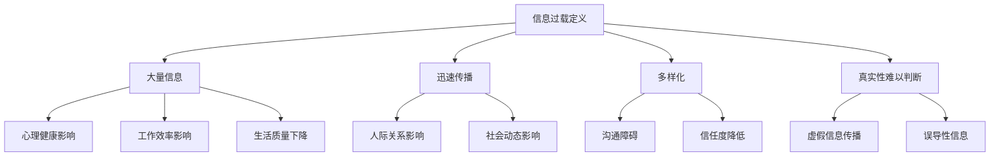

                 

### 第一部分：信息过载的陷阱

## 第1章：信息过载的现象与危害

在当今数字化时代，信息过载已成为一种普遍现象。人们无时无刻不被大量的信息所包围，这些信息来自各种渠道，包括社交媒体、电子邮件、新闻、广告等。那么，什么是信息过载？它有哪些特征？又对我们的生活和社会产生了哪些危害？

首先，我们来定义一下信息过载。信息过载是指个体接收的信息超过了其处理能力，导致信息处理效率下降，甚至产生负面影响。这个定义中的关键点是“接收信息超过了处理能力”。这意味着，当我们无法有效处理接收到的信息时，信息过载就发生了。

### 1.1 信息过载的定义与特征

信息过载具有以下特征：

1. **大量信息**：信息过载的首要特征是信息的数量庞大。每天，我们都会接收到成千上万的信息，这些信息可能包括文字、图片、音频、视频等多种形式。

2. **迅速传播**：信息的传播速度越来越快。随着互联网和移动通信技术的快速发展，信息可以在瞬间传播到全球的每一个角落。

3. **多样化**：信息的来源多样化，包括社交媒体、新闻媒体、政府机构、商业组织等。这些信息的种类繁多，从新闻事件、娱乐资讯到广告推销，无所不包。

4. **真实性难以判断**：在信息过载的环境中，大量信息的真实性难以判断。虚假信息、谣言和误导性信息层出不穷，给人们的生活带来困扰。

### 1.2 信息过载对个体的影响

信息过载对个体产生了深远的影响，主要体现在以下几个方面：

1. **心理健康影响**：信息过载容易导致压力、焦虑、抑郁等心理健康问题。面对大量信息，人们常常感到疲惫和无力，难以集中注意力。

2. **工作效率影响**：信息过载导致个体注意力分散，决策效率降低，生产力下降。研究人员发现，在信息过载的环境中，人们更容易分心，导致任务完成时间延长。

3. **生活质量下降**：信息过载影响了人们的日常生活。人们在处理大量信息的过程中，往往忽略了与家人和朋友相处的时间，生活质量下降。

### 1.3 信息过载的社会影响

信息过载不仅对个体产生了影响，也对整个社会产生了深远的影响：

1. **人际关系影响**：信息过载导致沟通障碍，人们难以有效交流。同时，虚假信息和谣言的传播可能导致信任度降低，人际关系紧张。

2. **社会动态影响**：信息过载可能导致社会分裂。在信息过载的环境中，人们往往只关注自己感兴趣的信息，导致信息孤岛现象的出现。这可能导致社会分歧加剧，社会凝聚力下降。

总结来说，信息过载是一种普遍现象，它对个体和社会都产生了负面影响。为了应对信息过载，我们需要采取有效的策略，提高信息处理能力，减少信息过载对生活和社会的负面影响。

### Mermaid 流程图

下面是信息过载对个体和社会影响的 Mermaid 流程图：



通过这个流程图，我们可以更清晰地看到信息过载的定义、特征以及它对个体和社会的具体影响。

### 1.2 信息过载对个体的影响

信息过载对个体产生了深远的影响，主要体现在以下几个方面：

1. **心理健康影响**：信息过载容易导致压力、焦虑、抑郁等心理健康问题。面对大量信息，人们常常感到疲惫和无力，难以集中注意力。

   - **压力**：在信息过载的环境中，人们需要不断处理大量的信息，这会导致心理压力增加。长期的压力可能导致心理疲劳和健康问题。

   - **焦虑**：信息过载可能引发焦虑感。人们担心错过重要信息，导致焦虑情绪的加剧。

   - **抑郁**：信息过载可能导致情绪低落。面对大量无用的信息，人们可能会感到无聊和孤独，进而导致抑郁情绪。

2. **工作效率影响**：信息过载导致个体注意力分散，决策效率降低，生产力下降。研究人员发现，在信息过载的环境中，人们更容易分心，导致任务完成时间延长。

   - **注意力分散**：在信息过载的环境中，个体需要不断切换注意力，这会导致注意力分散，降低工作效率。

   - **决策效率降低**：信息过载使得个体难以做出有效决策。面对大量信息，人们可能会犹豫不决，导致决策效率降低。

   - **生产力下降**：信息过载可能导致生产力下降。个体在处理信息的过程中，可能会花费大量时间在无效的任务上，导致整体生产力下降。

3. **生活质量下降**：信息过载影响了人们的日常生活。人们在处理大量信息的过程中，往往忽略了与家人和朋友相处的时间，生活质量下降。

   - **时间管理问题**：信息过载导致时间管理问题。人们可能会花费大量时间在处理信息上，导致其他重要活动的时间被压缩。

   - **家庭关系紧张**：信息过载可能导致家庭关系紧张。面对大量信息，人们可能会忽略与家人的交流，导致家庭关系紧张。

   - **社交质量下降**：信息过载可能降低社交质量。人们可能会在社交媒体上花费大量时间，导致面对面的社交活动减少。

### 实例分析

为了更好地理解信息过载对个体的影响，我们可以通过一些实例来分析：

1. **工作场景**：

   - 某个企业高管每天需要处理大量的电子邮件、报告和会议邀请。这些信息使得高管感到疲惫和压力，导致工作效率下降。

   - 由于信息过载，高管无法集中注意力，导致会议决策效率降低，企业运营受到影响。

2. **个人生活场景**：

   - 一位年轻的职场新人每天需要处理大量的社交媒体信息、邮件和工作任务。这导致他感到焦虑和压力，影响了他的心理健康。

   - 由于信息过载，这位职场新人无法有效分配时间，导致工作与家庭生活之间的平衡失调，生活质量下降。

### 伪代码与数学公式

为了更深入地探讨信息过载对个体的影响，我们可以通过一些伪代码和数学公式来分析：

```python
# 伪代码：分析信息过载对心理健康的影响

def analyze_information overload心理健康(信息量):
    压力 = 信息量 * 0.1
    焦虑 = 信息量 * 0.2
    抑郁 = 信息量 * 0.3
    return 压力，焦虑，抑郁

# 示例：计算一位高管在信息过载情况下的心理健康指标
信息量 = 1000  # 假设信息量为1000条
心理健康指标 = analyze_information overload心理健康(信息量)
print("压力:", 心理健康指标[0])
print("焦虑:", 心理健康指标[1])
print("抑郁:", 心理健康指标[2])
```

数学公式：

$$
\text{心理健康影响} = \text{压力} + \text{焦虑} + \text{抑郁}
$$

通过这个伪代码和数学公式，我们可以计算出信息过载对个体心理健康的具体影响。

### 总结

信息过载对个体产生了深远的影响，主要体现在心理健康、工作效率和生活质量等方面。为了应对信息过载，我们需要采取有效的策略，提高信息处理能力，减少信息过载对生活的负面影响。在下一章中，我们将探讨多任务处理的陷阱，分析多任务处理的心理机制及其负面影响。

### 1.3 信息过载的社会影响

信息过载不仅对个体产生了负面影响，也对整个社会产生了深远的影响。这些影响主要体现在人际关系、社会动态和整体社会生产力等方面。

#### 1.3.1 人际关系影响

信息过载对人际关系产生了显著的负面影响。首先，信息过载可能导致沟通障碍。在信息过载的环境中，人们往往被大量信息所包围，导致他们无法有效地进行沟通。这种沟通障碍不仅体现在日常对话中，也体现在工作和社交场合中。例如，在团队工作中，信息过载可能导致团队成员之间的沟通不畅，影响工作效率和团队合作。

其次，信息过载可能导致信任度降低。在信息过载的环境中，虚假信息和误导性信息层出不穷，这可能导致人们对他人的信任度降低。例如，社交媒体上的虚假新闻和谣言的传播可能导致公众对媒体的信任度下降，影响社会的整体信任基础。

此外，信息过载还可能导致人际关系紧张。在信息过载的环境中，人们往往只关注自己感兴趣的信息，而忽视其他信息。这可能导致信息孤岛现象的出现，加剧社会分化，影响社会和谐。

#### 1.3.2 社会动态影响

信息过载对社会动态产生了深远的影响。首先，信息过载可能导致社会分裂。在信息过载的环境中，人们只关注自己感兴趣的信息，导致信息孤岛现象的出现。这种现象可能导致社会分裂，加剧社会矛盾。

其次，信息过载可能导致社会动荡。在信息过载的环境中，虚假信息和谣言的传播可能导致社会恐慌和不安。例如，一些虚假新闻报道可能引发公众的恐慌，导致社会动荡。

此外，信息过载还可能导致社会价值观的混乱。在信息过载的环境中，大量信息涌入，人们难以判断信息的真实性和价值，这可能导致社会价值观的混乱，影响社会的稳定和发展。

#### 1.3.3 整体社会生产力影响

信息过载对整体社会生产力也产生了负面影响。首先，信息过载可能导致生产效率下降。在信息过载的环境中，人们需要花费大量时间处理信息，导致他们的生产效率下降。例如，一个企业的高管可能因为信息过载而无法有效地管理企业，影响企业的运营和发展。

其次，信息过载可能导致创新能力的下降。在信息过载的环境中，人们往往被大量信息所包围，导致他们无法有效地进行创新。创新需要深入的思考和研究，而信息过载可能阻碍这种深入思考的过程。

此外，信息过载还可能导致人才流失。在信息过载的环境中，一些优秀的人才可能因为无法应对大量信息而感到压力和疲惫，选择离开原岗位，导致人才流失。

### 1.3.4 社会治理的挑战

信息过载还给社会治理带来了新的挑战。首先，信息过载可能导致社会治理难度增加。在信息过载的环境中，政府需要处理大量的信息，这可能导致政府的工作效率下降，影响社会治理的效果。

其次，信息过载可能导致社会治理的复杂性增加。在信息过载的环境中，政府需要处理的信息种类繁多，包括社会问题、经济问题、环境问题等。这可能导致社会治理的复杂性增加，影响政府应对各种问题的能力。

此外，信息过载还可能导致社会治理的成本增加。在信息过载的环境中，政府需要投入大量资源来处理信息，这可能导致社会治理的成本增加，影响社会的可持续发展。

### 实例分析

为了更好地理解信息过载对社会的影响，我们可以通过一些实例来分析：

1. **社交媒体平台**：

   - 某社交媒体平台每天有数以亿计的用户发布和分享信息。这些信息的数量庞大，导致用户难以有效管理和筛选信息，产生信息过载问题。

   - 信息过载导致用户之间的沟通不畅，影响社交媒体平台的用户黏性和用户体验。

2. **新闻报道**：

   - 某新闻机构每天发布大量的新闻报道，包括政治、经济、社会等各个领域。这些信息的数量庞大，导致读者难以有效获取和消化信息。

   - 信息过载导致读者对新闻的真实性和价值的判断困难，影响新闻机构的公信力和影响力。

### 总结

信息过载不仅对个体产生了负面影响，也对整个社会产生了深远的影响。这些影响主要体现在人际关系、社会动态、整体社会生产力以及社会治理等方面。为了应对信息过载，我们需要采取有效的策略，提高信息处理能力，减少信息过载对社会的负面影响。在下一章中，我们将探讨多任务处理的陷阱，分析多任务处理的心理机制及其负面影响。

### 1.3 信息过载的社会影响

信息过载不仅对个体产生了负面影响，也对整个社会产生了深远的影响。这些影响主要体现在人际关系、社会动态和整体社会生产力等方面。

#### 1.3.1 人际关系影响

信息过载对人际关系产生了显著的负面影响。首先，信息过载可能导致沟通障碍。在信息过载的环境中，人们往往被大量信息所包围，导致他们无法有效地进行沟通。这种沟通障碍不仅体现在日常对话中，也体现在工作和社交场合中。例如，在团队工作中，信息过载可能导致团队成员之间的沟通不畅，影响工作效率和团队合作。

其次，信息过载可能导致信任度降低。在信息过载的环境中，虚假信息和误导性信息层出不穷，这可能导致人们对他人的信任度降低。例如，社交媒体上的虚假新闻和谣言的传播可能导致公众对媒体的信任度下降，影响社会的整体信任基础。

此外，信息过载还可能导致人际关系紧张。在信息过载的环境中，人们往往只关注自己感兴趣的信息，而忽视其他信息。这可能导致信息孤岛现象的出现，加剧社会分化，影响社会和谐。

#### 1.3.2 社会动态影响

信息过载对社会动态产生了深远的影响。首先，信息过载可能导致社会分裂。在信息过载的环境中，人们只关注自己感兴趣的信息，导致信息孤岛现象的出现。这种现象可能导致社会分裂，加剧社会矛盾。

其次，信息过载可能导致社会动荡。在信息过载的环境中，虚假信息和谣言的传播可能导致社会恐慌和不安。例如，一些虚假新闻报道可能引发公众的恐慌，导致社会动荡。

此外，信息过载还可能导致社会价值观的混乱。在信息过载的环境中，大量信息涌入，人们难以判断信息的真实性和价值，这可能导致社会价值观的混乱，影响社会的稳定和发展。

#### 1.3.3 整体社会生产力影响

信息过载对整体社会生产力也产生了负面影响。首先，信息过载可能导致生产效率下降。在信息过载的环境中，人们需要花费大量时间处理信息，导致他们的生产效率下降。例如，一个企业的高管可能因为信息过载而无法有效地管理企业，影响企业的运营和发展。

其次，信息过载可能导致创新能力的下降。在信息过载的环境中，人们往往被大量信息所包围，导致他们无法有效地进行创新。创新需要深入的思考和研究，而信息过载可能阻碍这种深入思考的过程。

此外，信息过载还可能导致人才流失。在信息过载的环境中，一些优秀的人才可能因为无法应对大量信息而感到压力和疲惫，选择离开原岗位，导致人才流失。

### 1.3.4 社会治理的挑战

信息过载还给社会治理带来了新的挑战。首先，信息过载可能导致社会治理难度增加。在信息过载的环境中，政府需要处理大量的信息，这可能导致政府的工作效率下降，影响社会治理的效果。

其次，信息过载可能导致社会治理的复杂性增加。在信息过载的环境中，政府需要处理的信息种类繁多，包括社会问题、经济问题、环境问题等。这可能导致社会治理的复杂性增加，影响政府应对各种问题的能力。

此外，信息过载还可能导致社会治理的成本增加。在信息过载的环境中，政府需要投入大量资源来处理信息，这可能导致社会治理的成本增加，影响社会的可持续发展。

### 实例分析

为了更好地理解信息过载对社会的影响，我们可以通过一些实例来分析：

1. **社交媒体平台**：

   - 某社交媒体平台每天有数以亿计的用户发布和分享信息。这些信息的数量庞大，导致用户难以有效管理和筛选信息，产生信息过载问题。

   - 信息过载导致用户之间的沟通不畅，影响社交媒体平台的用户黏性和用户体验。

2. **新闻报道**：

   - 某新闻机构每天发布大量的新闻报道，包括政治、经济、社会等各个领域。这些信息的数量庞大，导致读者难以有效获取和消化信息。

   - 信息过载导致读者对新闻的真实性和价值的判断困难，影响新闻机构的公信力和影响力。

### 总结

信息过载不仅对个体产生了负面影响，也对整个社会产生了深远的影响。这些影响主要体现在人际关系、社会动态、整体社会生产力以及社会治理等方面。为了应对信息过载，我们需要采取有效的策略，提高信息处理能力，减少信息过载对社会的负面影响。在下一章中，我们将探讨多任务处理的陷阱，分析多任务处理的心理机制及其负面影响。

### 2.1 多任务处理的定义与特点

多任务处理（Multitasking）是指在有限的时间内同时处理多个任务的行为。在现代社会中，多任务处理已经成为一种普遍的现象，人们常常需要在工作中同时处理多个任务，如同时回复电子邮件、参加会议、处理报告等。多任务处理的定义和特点如下：

#### 2.1.1 定义

多任务处理是指个体在认知和心理资源有限的情况下，同时处理两个或两个以上的任务。这些任务可以是相同的，也可以是不同的，如同时处理电子邮件和电话通话，或者同时处理文档编辑和浏览网页。

#### 2.1.2 特点

1. **任务切换**：多任务处理的一个显著特点是任务切换。个体需要在不同的任务之间快速切换注意力，这可能会导致任务切换成本，降低整体效率。

2. **资源分配**：多任务处理要求个体在认知、时间和其他资源之间进行有效分配。例如，在处理多个任务时，个体需要合理分配时间，确保每个任务都能得到适当的关注。

3. **时间管理**：多任务处理要求个体具备良好的时间管理技能，能够合理规划任务，确保在有限的时间内完成多个任务。

#### 2.1.3 多任务处理的实际应用

多任务处理在许多领域都有广泛应用，以下是一些典型的应用场景：

1. **工作场所**：在职场中，多任务处理是一种常见的工作方式。员工需要同时处理多个任务，如回复邮件、参加会议、撰写报告等。多任务处理的能力和效率直接影响到工作效率和职业发展。

2. **家庭生活**：在家庭生活中，多任务处理也是必不可少的。例如，家长在照顾孩子的同时，还需要处理家务、工作等其他任务。这种多任务处理能力有助于提高家庭生活质量和效率。

3. **教育领域**：在教育领域，多任务处理也是学生和教师必须面对的问题。学生需要同时处理学习任务、作业、课外活动等，教师需要同时教授多个班级、处理学生问题等。

4. **个人兴趣**：在个人兴趣和爱好中，多任务处理也是一种常见的现象。例如，爱好者在玩游戏的同时，可能会听音乐、浏览社交媒体等。

#### 2.1.4 多任务处理的优势与劣势

多任务处理既有其优势，也存在劣势。以下是一些典型的优势与劣势：

**优势**：

1. **提高效率**：合理的多任务处理可以提高工作效率，帮助个体在有限的时间内完成更多任务。

2. **灵活应变**：多任务处理能力使个体能够灵活应对各种突发事件和紧急任务。

3. **提升技能**：通过多任务处理，个体可以提升时间管理、注意力分配和其他相关技能。

**劣势**：

1. **降低专注度**：频繁的任务切换可能导致专注度下降，降低任务质量。

2. **增加压力**：多任务处理可能导致个体承受较大的心理压力，影响心理健康。

3. **效率损失**：不合理的多任务处理可能导致效率损失，反而增加完成任务的时间。

#### 2.1.5 多任务处理的心理学机制

多任务处理的心理学机制涉及到注意力分配、认知负荷和任务切换等方面。以下是一些关键点：

1. **注意力分配**：多任务处理要求个体将注意力在不同任务之间进行分配。然而，人的注意力是有限的，频繁的任务切换可能导致注意力分散，降低任务质量。

2. **认知负荷**：多任务处理会增加个体的认知负荷，导致认知资源不足。例如，同时处理多个任务可能导致大脑处理信息的能力下降，影响决策和问题解决能力。

3. **任务切换成本**：任务切换需要消耗时间，并且在任务切换过程中，个体可能会丢失一些信息，这增加了任务完成的难度。

#### 2.1.6 多任务处理的社会影响

多任务处理不仅对个体产生影响，也对社会产生了广泛的影响。以下是一些社会影响：

1. **工作效率**：在组织和企业中，多任务处理可能影响员工的工作效率。合理的多任务处理可以提高工作效率，而不合理的多任务处理可能导致效率下降。

2. **团队合作**：在团队合作中，多任务处理可能导致团队成员之间的沟通不畅，影响团队合作效果。

3. **教育模式**：在教育领域，多任务处理可能影响学生的学习效果。合理的多任务处理可以帮助学生提升学习效率，而不合理的多任务处理可能导致学习效果下降。

4. **社会价值观**：多任务处理可能影响社会的价值观。在一些情况下，过度追求多任务处理可能被视为一种成功和效率的象征，这可能导致人们忽视单一任务处理的优点。

### 伪代码与数学公式

为了更深入地探讨多任务处理的心理学机制，我们可以通过一些伪代码和数学公式来分析：

```python
# 伪代码：分析多任务处理的注意力分配问题

def analyze_attention_allocation(任务数):
    注意力消耗 = 任务数 * 0.1
    注意力分散度 = 任务数 * 0.2
    return 注意力消耗，注意力分散度

# 示例：分析同时处理三个任务时的注意力分配问题
任务数 = 3
注意力分配结果 = analyze_attention_allocation(任务数)
print("注意力消耗:", 注意力分配结果[0])
print("注意力分散度:", 注意力分配结果[1])
```

数学公式：

$$
\text{注意力消耗} = \text{任务数} \times \text{每个任务的注意力消耗系数}
$$

$$
\text{注意力分散度} = \text{任务数} \times \text{每个任务的注意力分散度系数}
$$

通过这个伪代码和数学公式，我们可以计算出在同时处理多个任务时，注意力的消耗和分散度。

### 总结

多任务处理是一种在现代社会中普遍存在的现象，它涉及到任务切换、资源分配和时间管理等方面。尽管多任务处理有其优势，但也存在明显的劣势，如降低专注度和增加压力等。在下一章中，我们将探讨多任务处理的负面影响，包括效率下降和创造力受损等问题。

### 2.2 多任务处理的心理机制

多任务处理不仅是一种行为，它还涉及复杂的心理机制。理解这些机制有助于我们更好地认识多任务处理的负面影响，从而采取有效的策略来应对。

#### 2.2.1 注意力分配

注意力是有限的资源，而多任务处理要求我们在多个任务之间分配注意力。注意力分配涉及到如何将有限的认知资源在不同的任务之间进行分配。以下是一些关键点：

1. **注意力的分散**：当人们尝试同时处理多个任务时，他们的注意力会分散，导致每个任务的完成质量下降。这种分散不仅是因为任务切换的频率，还因为大脑需要分配资源来处理每个任务。

2. **注意力损耗**：频繁的任务切换会导致注意力损耗。每一次切换都会消耗一定的注意力资源，使得个体在返回前一个任务时，需要重新调整注意力，这增加了任务完成的难度。

3. **注意力优先级**：在多任务处理中，个体需要根据任务的重要性和紧急性来分配注意力。然而，这种优先级分配并不总是明确的，可能导致一些任务得不到足够的关注，从而影响整体效率。

#### 2.2.2 认知负荷

认知负荷是指大脑在处理信息时所需的认知资源，包括注意力、记忆和执行功能。多任务处理会增加认知负荷，主要表现在以下几个方面：

1. **认知资源的竞争**：同时处理多个任务时，大脑需要将认知资源分配给每个任务。这种资源竞争可能导致每个任务的认知负荷增加，从而降低任务完成的质量。

2. **任务记忆的负荷**：多任务处理需要大脑同时记住多个任务的状态和细节。这种记忆负荷可能导致记忆的拥挤，使得个体难以有效地管理和跟踪任务。

3. **执行功能的挑战**：执行功能包括计划、决策和问题解决等高级认知功能。多任务处理可能分散执行功能资源，导致决策效率降低，问题解决能力下降。

#### 2.2.3 任务切换

任务切换是多任务处理的核心特征之一。以下是一些与任务切换相关的心理机制：

1. **任务切换成本**：每次任务切换都会带来额外的认知负荷，称为任务切换成本。这种成本包括重新聚焦注意力和调整认知状态，使得任务切换变得更加耗时和低效。

2. **中断效应**：当人们从一个任务切换到另一个任务时，之前任务的工作记忆可能会受到干扰，导致中断效应。这种中断效应可能导致任务的完成质量下降，甚至忘记之前的工作进展。

3. **习惯性任务切换**：长期的多任务处理可能导致个体形成习惯性任务切换模式。这种模式可能会降低个体的任务专注度，使得他们在处理单一任务时更加困难。

#### 2.2.4 注意力管理策略

为了应对多任务处理的负面影响，个体可以采取一些注意力管理策略，如：

1. **专注训练**：通过专注力训练，个体可以提高专注度，减少任务切换频率，从而提高任务完成质量。

2. **任务优先级排序**：根据任务的重要性和紧急性，个体可以制定任务优先级排序，确保关键任务得到足够的时间和关注。

3. **环境优化**：优化工作环境，减少干扰因素，如关闭不必要的通知和社交媒体，有助于个体集中注意力。

### 伪代码与数学公式

为了更深入地探讨多任务处理的心理机制，我们可以通过一些伪代码和数学公式来分析：

```python
# 伪代码：分析任务切换对认知负荷的影响

def analyze_cognitive_load(任务数):
    初始认知负荷 = 任务数 * 0.1
    切换成本 = 任务数 * 0.2
    中断效应 = 任务数 * 0.3
    return 初始认知负荷 + 切换成本 + 中断效应

# 示例：分析同时处理五个任务时的认知负荷
任务数 = 5
认知负荷 = analyze_cognitive_load(任务数)
print("总认知负荷:", 认知负荷)
```

数学公式：

$$
\text{总认知负荷} = \text{初始认知负荷} + \text{切换成本} + \text{中断效应}
$$

通过这个伪代码和数学公式，我们可以计算出在同时处理多个任务时，总的认知负荷。

### 总结

多任务处理的心理机制涉及注意力分配、认知负荷和任务切换等方面。这些机制导致了多任务处理的负面影响，如效率下降和创造力受损等。理解这些心理机制有助于我们采取有效的策略来提高任务完成质量和效率。在下一章中，我们将探讨多任务处理的负面影响，包括效率下降和创造力受损等问题。

### 2.3 多任务处理的负面影响

尽管多任务处理在某些情况下可能看起来很高效，但实际上，它往往会导致一系列负面影响。以下是一些主要的负面影响：

#### 2.3.1 效率下降

多任务处理的一个显著负面影响是效率下降。由于注意力是有限的，频繁的任务切换会导致注意力分散，使得每个任务的完成质量下降。以下是一些具体的效率下降表现：

1. **任务完成时间延长**：在多任务处理中，个体需要在不同的任务之间切换注意力，这增加了任务完成的复杂性。每次切换都需要时间来重新聚焦注意力，导致总体完成时间延长。

2. **任务质量下降**：由于注意力分散，个体在处理每个任务时可能无法集中精力，导致任务质量下降。例如，一个团队成员可能在同时处理邮件、参加会议和编写报告时，无法有效地完成任何一项任务。

3. **决策效率降低**：多任务处理还会降低决策效率。个体在处理多个任务时，可能会忽略关键信息，导致决策失误。例如，一个高管在同时处理多个紧急任务时，可能会忽略重要的市场数据，导致错误的决策。

#### 2.3.2 创造力受损

多任务处理不仅影响效率，还可能损害创造力。以下是一些创造力受损的表现：

1. **思维阻塞**：多任务处理可能导致思维阻塞。个体在处理多个任务时，可能会陷入惯性思维，难以产生新的创意。例如，一个设计师在同时处理多个项目时，可能无法跳出固有的设计模式，导致创意枯竭。

2. **灵感流失**：多任务处理分散了个体的注意力，使得个体无法专注于思考问题。这种分散的注意力可能导致灵感的流失，影响创造性思维。

3. **创新难度增加**：多任务处理增加了创新的难度。个体在处理多个任务时，可能没有足够的时间和精力进行深入的思考和研究，这限制了创新的潜力。

#### 2.3.3 心理压力增加

多任务处理往往伴随着更高的心理压力。以下是一些心理压力增加的表现：

1. **焦虑和紧张**：个体在处理多个任务时，可能会感到焦虑和紧张。他们担心无法按时完成每个任务，导致心理压力增加。

2. **疲劳和倦怠**：频繁的任务切换和持续的注意力分散可能导致个体感到疲劳和倦怠。长期处于这种状态，可能对心理健康产生负面影响。

3. **压力累积**：多任务处理可能导致压力累积。个体可能在一段时间内承受较高的心理压力，但无法有效释放，导致心理健康问题。

#### 2.3.4 人际关系紧张

多任务处理不仅影响个体，还可能对人际关系产生负面影响。以下是一些人际关系紧张的表现：

1. **沟通障碍**：多任务处理可能导致沟通障碍。个体在处理多个任务时，可能会忽略他人的需求和信息，导致沟通不畅。

2. **信任度降低**：在多任务处理的环境中，个体可能会感到压力和焦虑，这可能导致他们对他人产生不信任感。

3. **协作困难**：多任务处理可能影响团队合作。个体在处理多个任务时，可能无法有效地与他人协作，导致团队协作效率下降。

#### 2.3.5 社会动态影响

多任务处理还可能对社会动态产生影响。以下是一些社会动态影响的表现：

1. **社会分裂**：在多任务处理的文化中，人们可能只关注与自己利益相关的事物，导致社会分裂。

2. **社会动荡**：多任务处理可能导致社会动荡。在信息过载和任务过载的环境中，人们可能因为信息误解和任务冲突而产生紧张和冲突。

3. **价值观混乱**：多任务处理可能影响社会价值观。在追求效率和快速完成任务的压力下，人们可能忽视道德和伦理标准，导致社会价值观混乱。

### 总结

多任务处理虽然看起来可以提高效率，但实际上可能带来一系列负面影响，包括效率下降、创造力受损、心理压力增加、人际关系紧张以及社会动态影响等。理解这些负面影响有助于我们更好地管理时间和资源，提高生活和工作质量。在下一章中，我们将探讨单一任务处理的优势和好处，为应对多任务处理的负面影响提供一种解决方案。

### 3.1 单一任务处理的定义与优势

单一任务处理（Single-tasking）是一种专注于单个任务直到其完成的方法。与多任务处理相比，单一任务处理要求个体在一段时间内集中全部精力和注意力在一个任务上，避免频繁的任务切换和注意力分散。这种方法在提高工作效率和提升生活质量方面具有显著优势。

#### 3.1.1 定义

单一任务处理是指个体在一段时间内专注于一个任务，直到任务完成。这种处理方式强调集中注意力和精力，避免分散注意力，确保任务得到有效和高效的完成。

#### 3.1.2 优势

1. **提高效率**：单一任务处理能够显著提高工作效率。当个体专注于一个任务时，他们能够更快速地理解和解决问题，减少因任务切换而产生的浪费时间和精力的现象。

2. **增强专注力**：单一任务处理有助于增强专注力。在专注于单一任务的过程中，个体能够更好地集中注意力，避免外界干扰，从而提高任务完成质量。

3. **提升工作质量**：由于个体在单一任务处理中能够更深入地理解和处理任务，工作质量通常较高。这种深入的工作方式有助于发现和解决潜在问题，减少错误和返工。

4. **减少压力**：单一任务处理能够有效减少压力。当个体专注于一个任务时，他们不会因为任务切换和注意力分散而产生的焦虑和压力。这种专注有助于提高个体的心理健康水平。

5. **提升创造力**：单一任务处理有助于激发创造力。在专注于一个任务的过程中，个体有更多的时间和空间进行思考和探索，这有助于产生新的想法和创意。

#### 3.1.3 单一任务处理的方法

为了有效进行单一任务处理，个体可以采用以下方法：

1. **设定明确的目标**：在开始任务前，设定明确的任务目标，确保个体知道需要完成什么，避免因为目标模糊而导致的任务拖延和效率下降。

2. **消除干扰**：在工作环境中消除干扰因素，如关闭不必要的通知、清理工作区域等，有助于个体更好地集中注意力。

3. **时间管理**：合理安排时间，采用时间管理工具，如番茄工作法，将工作时间分割为若干个短时间段，每个时间段专注于一个任务。

4. **避免任务切换**：在单一任务处理过程中，尽量避免任务切换。如果必须切换任务，确保当前任务已经达到一个合理的进度，避免中断。

5. **定期休息**：在长时间专注于一个任务后，适时休息，有助于恢复精力，避免过度疲劳。

#### 3.1.4 单一任务处理的心理学原理

单一任务处理的心理学原理主要涉及以下几个方面：

1. **注意力集中**：单一任务处理强调注意力集中，个体在一段时间内将所有注意力集中在单一任务上，避免分散注意力。

2. **认知负荷**：单一任务处理有助于减少认知负荷。当个体专注于一个任务时，他们不需要在多个任务之间分配认知资源，从而减轻认知负荷。

3. **情绪调节**：单一任务处理有助于情绪调节。在专注于一个任务的过程中，个体能够更好地控制自己的情绪，避免因为多任务处理而产生的焦虑和压力。

4. **心理舒适度**：单一任务处理提供了一种心理舒适度，个体在完成任务后能够感受到成就感和满足感，有助于提升心理健康。

#### 3.1.5 单一任务处理的优势案例

单一任务处理在实际应用中展现了显著的优势。以下是一些案例：

1. **程序员**：在软件开发过程中，程序员采用单一任务处理可以更好地理解和解决代码问题，减少错误和返工。

2. **研究人员**：在科学研究中，研究人员通过单一任务处理可以更深入地研究数据，提高研究成果的质量。

3. **创意工作者**：如设计师、作家等创意工作者，通过单一任务处理可以更有效地发挥创造力，产生高质量的作品。

4. **日常事务处理**：在日常事务处理中，如处理邮件、回复消息等，采用单一任务处理可以提高效率，减少拖延。

### 总结

单一任务处理是一种有效的方法，可以提高工作效率、增强专注力、提升工作质量、减少压力和激发创造力。通过设定明确的目标、消除干扰、合理安排时间和避免任务切换等方法，个体可以更好地实践单一任务处理。理解单一任务处理的心理学原理有助于我们更好地应用这种方法，提高生活和工作的质量。

### 3.2 单一任务处理的方法与实践

单一任务处理不仅是一种理念，还需要通过具体的方法和实践来落实。以下是一些实用的技巧和方法，帮助个体有效地进行单一任务处理。

#### 3.2.1 专注技巧

专注是单一任务处理的核心。以下是一些提高专注度的技巧：

1. **专注力训练**：通过练习冥想、深呼吸等方法，提高专注力。专注力训练可以帮助个体在长时间内保持专注。

2. **消除干扰**：在工作环境中消除干扰因素，如关闭不必要的通知、将手机调至静音模式、清理工作区域等。这些措施有助于个体集中注意力。

3. **番茄工作法**：番茄工作法是一种时间管理技巧，通过将工作时间分割为25分钟的工作周期（称为“番茄钟”），每个周期后休息5分钟。这种方法有助于个体集中精力，提高工作效率。

4. **设定明确目标**：在开始任务前，设定明确的任务目标，确保个体知道需要完成什么。明确的目标有助于减少目标模糊导致的拖延和效率下降。

5. **专注工具**：使用专注工具，如Forest、番茄钟等，这些工具可以帮助个体跟踪专注时间，提醒休息时间，提高专注度。

#### 3.2.2 消除干扰

干扰是影响专注度的最大障碍之一。以下是一些消除干扰的方法：

1. **环境优化**：选择一个安静、舒适的工作环境，减少外界干扰。如果条件不允许，可以使用耳塞或降噪耳机。

2. **时间管理**：合理安排时间，将工作时间和休息时间分开。在专注于任务时，避免安排其他活动，确保时间得到有效利用。

3. **提醒机制**：使用提醒工具，如闹钟、提醒软件等，确保在休息时间能够及时休息，避免过度疲劳。

4. **避免多任务处理**：在工作时避免多任务处理，专注于单一任务。如果需要处理多个任务，确保任务之间有足够的时间间隔，以便更好地切换。

5. **心理调适**：培养积极的心态，面对干扰时保持冷静，避免因干扰而产生的焦虑和压力。

#### 3.2.3 设定目标

设定明确的目标是单一任务处理的关键。以下是一些设定目标的方法：

1. **SMART原则**：使用SMART原则（具体、可衡量、可实现、相关、时限）来设定目标。具体的目标有助于个体明确任务方向，提高工作效率。

2. **分解目标**：将大目标分解为小目标，每个小目标都应具有明确的实现步骤和时间表。这种方法有助于个体逐步完成任务，避免因目标过大而导致的拖延。

3. **优先级排序**：根据任务的重要性和紧急性，对目标进行优先级排序。确保关键任务得到优先处理，提高工作效率。

4. **定期回顾**：定期回顾任务进度和目标实现情况，根据实际情况调整目标。这种方法有助于确保目标的实现，避免目标设定不合理导致的效率下降。

5. **持续改进**：通过不断总结经验和反馈，改进目标设定和任务处理方法，提高单一任务处理的效果。

#### 3.2.4 时间管理

时间管理是单一任务处理的重要组成部分。以下是一些时间管理技巧：

1. **时间块**：将工作时间分割为多个时间块，每个时间块专注于一个任务。这种方法有助于提高时间利用效率，减少任务切换的成本。

2. **优先级排序**：根据任务的重要性和紧急性，对任务进行优先级排序。确保关键任务得到优先处理，提高工作效率。

3. **紧急与重要的任务分离**：将紧急任务和重要任务分开处理。紧急任务通常需要立即处理，而重要任务可能需要更多的时间和精力。

4. **避免拖延**：设定明确的时间限制，避免拖延。如果任务无法在预定时间内完成，重新评估任务的重要性和紧急性，调整处理顺序。

5. **反思与总结**：定期反思和总结时间管理的效果，根据实际情况调整时间管理策略。这种方法有助于提高时间管理的有效性。

#### 3.2.5 单一任务处理的具体案例

以下是一些单一任务处理的具体案例：

1. **程序员**：在编码过程中，程序员可以采用单一任务处理，专注于解决一个bug或实现一个功能。通过集中精力，他们能够更快地理解和解决问题。

2. **作家**：在写作过程中，作家可以采用单一任务处理，专注于撰写一篇文章或一章内容。通过集中精力，他们能够更好地发挥创造力，提高写作质量。

3. **学生**：在学习过程中，学生可以采用单一任务处理，专注于完成一个作业或准备一门考试。通过集中精力，他们能够更好地掌握知识和提高学习效果。

4. **销售人员**：在销售过程中，销售人员可以采用单一任务处理，专注于与一个潜在客户进行沟通。通过集中精力，他们能够更好地了解客户需求，提高销售成功率。

通过以上方法和技巧，个体可以更有效地进行单一任务处理，提高工作效率和生活质量。

### 3.3 单一任务处理的心理效应

单一任务处理不仅在提高工作效率方面具有显著优势，还能对个体的心理健康产生积极影响。以下是单一任务处理对心理健康的一些具体心理效应：

#### 3.3.1 减少压力

单一任务处理有助于减少压力。当个体专注于一个任务时，他们可以更好地控制自己的情绪，避免因多任务处理而产生的焦虑和压力。以下是一些具体表现：

1. **情绪稳定**：单一任务处理有助于情绪稳定。在专注于一个任务的过程中，个体能够更好地管理自己的情绪，避免因任务切换而产生的情绪波动。

2. **减少焦虑**：单一任务处理能够显著减少焦虑感。当个体专注于一个任务时，他们不会因为任务切换和不确定性而产生的焦虑感。

3. **降低压力水平**：单一任务处理有助于降低长期压力水平。通过专注于一个任务，个体可以更好地分配时间和精力，减少因为任务积压而产生的压力。

#### 3.3.2 提高幸福感

单一任务处理能够提高个体的幸福感。当个体能够专注于一个任务并高效地完成任务时，他们会感到满足和成就感。以下是一些具体表现：

1. **成就感**：单一任务处理有助于提升成就感。当个体专注于一个任务并成功完成时，他们会感到满足和自豪，从而提高幸福感。

2. **目标实现感**：通过单一任务处理，个体能够更好地实现短期和长期目标。这种目标实现感有助于提高个体的幸福感。

3. **提高生活质量**：单一任务处理有助于提高生活质量。当个体能够专注于一个任务并高效地完成任务时，他们可以有更多的时间和精力享受生活，从而提高整体幸福感。

#### 3.3.3 增强专注力

单一任务处理有助于增强专注力。当个体在一段时间内专注于一个任务时，他们能够更好地集中注意力，避免分散注意力。以下是一些具体表现：

1. **注意力集中**：单一任务处理有助于注意力集中。在专注于一个任务的过程中，个体能够更好地控制自己的注意力，避免因任务切换而产生的注意力分散。

2. **提高工作效率**：增强的专注力有助于提高工作效率。当个体能够专注于一个任务时，他们可以更快地完成任务，提高整体工作效率。

3. **减少错误率**：增强的专注力有助于减少错误率。在专注于一个任务的过程中，个体能够更好地发现和纠正错误，从而提高任务完成质量。

#### 3.3.4 提高问题解决能力

单一任务处理能够提高个体的问题解决能力。当个体专注于一个任务时，他们有更多的时间和精力深入思考和解决复杂问题。以下是一些具体表现：

1. **深入思考**：单一任务处理有助于深入思考。在专注于一个任务的过程中，个体能够更深入地分析问题，找到更有效的解决方案。

2. **创新思维**：增强的专注力有助于激发创新思维。在专注于一个任务的过程中，个体可以更好地发挥创造力，提出新颖的解决方案。

3. **提高决策能力**：单一任务处理有助于提高决策能力。当个体专注于一个任务时，他们有更多的时间和精力收集信息、分析问题和做出决策。

#### 3.3.5 提升人际关系

单一任务处理能够提升人际关系。当个体能够专注于与他人的沟通和互动时，他们可以更好地理解和满足他人的需求。以下是一些具体表现：

1. **有效沟通**：单一任务处理有助于有效沟通。在专注于与他人的互动时，个体能够更好地倾听和理解对方，提高沟通质量。

2. **增强信任**：通过专注于与他人的互动，个体可以更好地建立信任。这种信任有助于加强人际关系，提高团队合作效果。

3. **减少冲突**：单一任务处理有助于减少冲突。当个体专注于一个任务时，他们可以更好地管理自己的情绪和行为，减少因任务冲突而产生的冲突。

### 总结

单一任务处理对心理健康具有显著的积极影响，包括减少压力、提高幸福感、增强专注力、提高问题解决能力和提升人际关系等。通过专注于单一任务，个体不仅能够提高工作效率，还能改善心理健康，提升整体生活质量。在下一章中，我们将探讨单一任务处理在工作中的应用，以及如何通过单一任务处理提升工作效率和团队协作。

### 3.4 单一任务处理在工作中的应用

单一任务处理在职场中的应用可以帮助员工提高工作效率，提升个人和团队的整体绩效。以下是一些具体的场景和应用方法：

#### 3.4.1 工作分配

在工作分配中，单一任务处理是一种有效的策略。通过将任务分配给最适合处理这些任务的员工，可以确保任务得到高效和高质量的完成。以下是一些工作分配的方法：

1. **明确任务目标**：在分配任务时，明确任务的目标和期望成果，确保每个员工都清楚自己的任务和责任。

2. **评估员工能力**：根据员工的能力和特长，将任务分配给最适合处理这些任务的员工。这样可以确保任务能够得到高效完成。

3. **合理分配工作量**：合理分配工作量，避免过度负担或资源浪费。确保每个员工都有足够的时间和精力来完成分配的任务。

4. **反馈与沟通**：定期与员工沟通，了解他们的工作进展和遇到的困难，提供必要的支持和帮助。

#### 3.4.2 单一任务处理在工作流程中的应用

在工作流程中，单一任务处理有助于优化工作流程，减少任务切换的成本，提高工作效率。以下是一些具体的方法：

1. **任务模块化**：将复杂的工作任务分解为小的、可管理的模块，每个模块专注于一个任务。这种方法有助于减少任务切换的成本，提高工作效率。

2. **优先级排序**：根据任务的重要性和紧急性，对任务进行优先级排序。确保关键任务得到优先处理，减少任务积压和延迟。

3. **集中处理**：在一段时间内集中处理某个任务或任务模块，避免频繁的任务切换。这种方法有助于提高专注度，减少错误和返工。

4. **实时监控与调整**：实时监控工作进度，根据实际情况调整工作计划。及时识别和解决问题，确保工作流程的顺利进行。

#### 3.4.3 团队协作

在团队协作中，单一任务处理有助于提高团队的整体效率和协作效果。以下是一些团队协作的方法：

1. **明确角色和职责**：在团队中，每个成员都应该明确自己的角色和职责，确保任务能够得到高效完成。

2. **任务分配与协调**：合理分配任务，确保每个成员都有明确的任务目标，并与其他成员保持良好的沟通和协作。

3. **专注团队目标**：团队应该将注意力集中在共同的目标上，避免分散注意力，确保团队能够高效地完成工作。

4. **定期团队会议**：定期召开团队会议，讨论工作进展、遇到的问题和解决方案。这种方法有助于保持团队的高效运转。

5. **透明沟通**：建立透明的沟通机制，确保团队成员之间的信息畅通，减少误解和冲突。

#### 3.4.4 个人职业发展

在个人职业发展中，单一任务处理可以帮助员工提升专业技能和职业素养。以下是一些具体的方法：

1. **专注技能提升**：将注意力集中在提升专业技能上，通过专注于一个任务或项目，深入学习和掌握相关技能。

2. **持续学习**：利用业余时间进行学习和自我提升，参加培训课程、阅读专业书籍等，提高自己的综合素质。

3. **职业规划**：制定明确的职业规划，设定短期和长期目标，确保职业发展的方向和目标清晰。

4. **定期评估**：定期评估自己的工作表现和职业发展情况，根据实际情况调整职业规划，确保职业发展的顺利进行。

5. **主动沟通**：与上级和同事保持良好的沟通，了解行业动态和职业发展机会，抓住职业发展的重要机遇。

#### 3.4.5 案例分析

以下是一个实际案例，展示如何在一个团队中应用单一任务处理：

**案例**：一个软件开发团队在开发一个复杂的项目时，面临多个任务和紧迫的交付日期。为了提高工作效率和项目质量，团队决定采用单一任务处理策略。

1. **任务分解**：团队将项目分解为若干个小的模块，每个模块专注于一个特定的功能。

2. **任务分配**：根据团队成员的技能和特长，将任务分配给最适合处理这些任务的成员。

3. **集中处理**：团队成员在一段时间内集中精力处理自己的任务，避免频繁的任务切换。

4. **实时沟通**：团队成员之间保持良好的沟通，及时分享进度和遇到的问题，确保团队能够高效协作。

5. **反馈与改进**：团队定期进行项目评估，根据反馈和改进意见，调整工作计划和策略。

通过以上方法，团队成功地提高了工作效率，项目质量也得到了显著提升，最终按时完成了项目交付。

### 总结

单一任务处理在工作中的应用可以帮助员工提高工作效率，提升个人和团队的整体绩效。通过明确任务目标、合理分配工作量、优化工作流程、加强团队协作和个人职业发展，单一任务处理能够为职场中的个体和团队带来显著的优势和效果。

### 3.5 单一任务处理在项目管理中的应用

在项目管理中，单一任务处理是一种有效的策略，可以帮助项目经理更好地规划和管理项目，确保项目按时、按质完成。以下是单一任务处理在项目管理中的应用方法和实际案例：

#### 3.5.1 任务分解

任务分解是项目管理的基础，单一任务处理在这一过程中尤为重要。通过将复杂的项目分解为小的、可管理的任务，可以确保每个任务都能得到高效和高质量的完成。以下是一些具体的方法：

1. **细化任务**：将项目分解为更小的子任务，每个子任务都应具有明确的可衡量目标。这种方法有助于项目经理更好地控制任务进度，提高工作效率。

2. **任务优先级排序**：根据任务的重要性和紧急性，对任务进行优先级排序。确保关键任务得到优先处理，从而确保项目按时完成。

3. **任务责任分配**：将任务分配给最适合处理这些任务的团队成员，确保每个任务都有明确的责任人。这样可以提高任务的完成质量和效率。

#### 3.5.2 进度监控

进度监控是确保项目按时完成的重要环节，单一任务处理在这一过程中同样发挥着关键作用。以下是一些具体的监控方法：

1. **实时跟踪**：使用项目管理工具（如Jira、Trello等）实时跟踪任务进度，确保项目经理能够及时了解任务状态，发现并解决问题。

2. **定期会议**：定期召开项目进度会议，讨论任务进展、遇到的问题和解决方案。这种方法有助于保持团队的高效运转，确保项目按计划进行。

3. **反馈机制**：建立反馈机制，鼓励团队成员提供项目进展的反馈。这样可以及时发现和解决潜在问题，避免项目延误。

#### 3.5.3 时间管理

时间管理是项目管理的关键，单一任务处理在这一过程中可以显著提高时间利用效率。以下是一些时间管理方法：

1. **番茄工作法**：使用番茄工作法，将工作时间分割为25分钟的工作周期（番茄钟），每个周期后休息5分钟。这种方法有助于提高专注度，减少任务切换的成本。

2. **优先级排序**：根据任务的重要性和紧急性，对任务进行优先级排序。确保关键任务得到优先处理，从而提高整体工作效率。

3. **时间块**：将工作时间分割为多个时间块，每个时间块专注于一个任务。这种方法有助于提高时间利用效率，减少任务切换的成本。

#### 3.5.4 实际案例

以下是一个实际案例，展示如何在一个项目中应用单一任务处理：

**案例**：一个软件开发团队正在开发一款复杂的应用程序，需要在规定时间内完成。为了确保项目按时完成，团队决定采用单一任务处理策略。

1. **任务分解**：团队将项目分解为若干个子任务，每个子任务都专注于一个特定的功能模块。

2. **任务分配**：根据团队成员的技能和特长，将任务分配给最适合处理这些任务的成员。

3. **进度监控**：团队使用项目管理工具实时跟踪任务进度，每周召开一次项目进度会议，讨论任务进展和遇到的问题。

4. **时间管理**：团队采用番茄工作法，将工作时间分割为25分钟的工作周期，每个周期后休息5分钟。这种方法有助于提高专注度，减少任务切换的成本。

5. **反馈与改进**：团队建立了反馈机制，鼓励成员提供项目进展的反馈。根据反馈，团队及时调整工作计划和策略，确保项目按计划进行。

通过以上方法，团队成功地提高了工作效率，项目质量也得到了显著提升，最终按时完成了项目交付。

### 总结

单一任务处理在项目管理中的应用可以帮助项目经理更好地规划和管理项目，确保项目按时、按质完成。通过任务分解、进度监控、时间管理等方法，单一任务处理能够为项目带来显著的优势和效果，提高项目成功的可能性。

### 3.6 单一任务处理在个人职业发展中的应用

单一任务处理在个人职业发展中具有重要的应用价值，它可以帮助职业人士提升专业技能、明确职业目标，并在竞争激烈的职场中脱颖而出。以下是一些具体的方法和实际案例：

#### 3.6.1 技能提升

在个人职业发展中，单一任务处理有助于提升专业技能。通过将注意力集中在某一特定技能或项目上，职业人士可以更深入地学习和掌握相关知识和技能。以下是一些具体方法：

1. **专注学习**：将时间集中在特定技能的学习上，通过阅读专业书籍、参加在线课程和研讨会等途径，提升自己的专业技能。

2. **项目实践**：参与实际项目，将所学知识应用于实践中，通过解决实际问题，提升自己的实践能力和技能水平。

3. **反馈与改进**：在学习和实践过程中，主动寻求反馈，根据反馈不断改进自己的方法，提高技能水平。

#### 3.6.2 职业规划

单一任务处理有助于职业人士制定和实现职业规划。通过专注于一个目标，职业人士可以更清晰地规划自己的职业道路，以下是一些具体方法：

1. **设定短期和长期目标**：根据个人兴趣和职业发展方向，设定短期和长期目标。短期目标可以是掌握一项新技能，长期目标可以是晋升到更高职位或实现职业转型。

2. **优先级排序**：根据目标的重要性和紧急性，对任务进行优先级排序。确保关键任务得到优先处理，从而实现职业规划。

3. **定期评估**：定期评估职业规划的实施情况，根据实际情况调整目标和计划。这种方法有助于确保职业规划的顺利进行。

#### 3.6.3 案例分析

以下是一个实际案例，展示如何通过单一任务处理实现个人职业发展：

**案例**：张伟是一名软件工程师，他在职业发展中遇到了瓶颈，感到自己的技能提升停滞。为了突破瓶颈，他决定采用单一任务处理策略。

1. **专注学习**：张伟将时间集中在学习一项新技能——数据分析和机器学习上。他报名参加了在线课程，购买了相关书籍，并通过实际项目应用所学知识。

2. **项目实践**：张伟参与了一个数据分析项目，通过解决实际问题，提升了自己的数据分析和机器学习技能。

3. **反馈与改进**：在项目过程中，张伟积极寻求团队成员和导师的反馈，根据反馈不断改进自己的方法和技能。

4. **职业规划**：张伟根据自己的兴趣和职业发展方向，制定了短期目标——成为一名数据科学家，并设定了长期目标——在五年内晋升为数据科学团队负责人。

通过以上方法，张伟成功地提升了专业技能，实现了职业发展目标。他的努力得到了公司领导的认可，不久后，他被晋升为数据科学团队的负责人。

### 总结

单一任务处理在个人职业发展中的应用，可以帮助职业人士提升专业技能、明确职业目标，并在竞争激烈的职场中脱颖而出。通过专注学习、项目实践和职业规划，单一任务处理能够为职业发展带来显著的优势和效果。

### 3.7 单一任务处理在日常生活中的应用

单一任务处理不仅在工作和职业发展中具有显著优势，在日常生活中也同样适用。通过将单一任务处理的方法应用于日常事务，可以提升生活效率，改善生活质量。以下是一些具体的应用场景和策略：

#### 3.7.1 家庭生活

在家庭生活中，单一任务处理可以帮助家庭成员更好地分配时间和精力，改善家庭关系。以下是一些具体的应用场景和策略：

1. **家务分工**：家庭成员可以采用单一任务处理方法，每人负责一项家务，直到任务完成。例如，父亲可以负责洗碗，母亲可以负责打扫卫生，孩子可以负责整理玩具。

2. **家庭会议**：定期召开家庭会议，讨论家庭事务和家庭成员的需求。这种方法有助于家庭成员明确任务和责任，提高家务处理效率。

3. **亲子互动**：父母可以采用单一任务处理，专注于与孩子进行高质量的互动。例如，每天安排一段时间，全神贯注地陪伴孩子玩耍或阅读，提升亲子关系。

#### 3.7.2 个人兴趣

在个人兴趣和爱好中，单一任务处理可以帮助爱好者更好地专注和享受自己的爱好。以下是一些具体的应用场景和策略：

1. **专注培养**：爱好者可以采用单一任务处理，专注于一项兴趣爱好，例如绘画、音乐、运动等。通过集中时间和精力，提升自己的技能和兴趣。

2. **兴趣拓展**：在提升一项兴趣的同时，可以尝试将单一任务处理应用于其他兴趣爱好。例如，在练习绘画时，可以同时学习音乐，拓展自己的兴趣领域。

3. **时间管理**：合理规划时间，为兴趣爱好分配特定的时间段，避免与其他事务冲突。这种方法有助于提高兴趣的专注度和质量。

#### 3.7.3 社交活动

在社交活动中，单一任务处理可以帮助人们更好地享受社交时光，提升社交质量。以下是一些具体的应用场景和策略：

1. **减少社交活动**：合理规划社交活动，避免参加过多无意义的社交活动。将精力集中在有意义和重要的社交活动上，提升社交质量。

2. **高质量陪伴**：在参加社交活动时，采用单一任务处理，专注于与朋友和家人进行互动。通过高质量的陪伴，增进彼此的感情。

3. **专注社交技巧**：通过学习和练习社交技巧，提高自己的社交能力。例如，学习倾听技巧、表达技巧等，提升社交效果。

### 3.7.4 公益服务

在参与公益活动时，单一任务处理可以帮助志愿者更高效地参与服务，提升公益活动的效果。以下是一些具体的应用场景和策略：

1. **任务明确**：在参与公益活动前，明确任务目标和责任。采用单一任务处理方法，专注于完成分配的任务，提高工作效率。

2. **团队协作**：与团队成员明确分工，每个人专注于自己的任务，协同合作，提高团队效率。

3. **持续参与**：定期参与公益活动，通过持续的任务处理，积累经验，提升公益服务的质量。

### 总结

单一任务处理在日常生活中的应用，可以帮助我们更好地管理时间和精力，提升生活效率和质量。通过在家庭生活、个人兴趣、社交活动以及公益服务中应用单一任务处理，我们可以更好地专注于重要事务，提升生活质量，享受更美好的生活。

### 第三部分：单一任务处理的挑战与应对

#### 第6章：单一任务处理的挑战

尽管单一任务处理在提高效率和质量方面具有显著优势，但在实际应用中仍面临一些挑战。这些挑战主要包括习惯的养成与改变、工作环境的影响以及紧急任务的应对。以下将详细探讨这些挑战及其应对策略。

#### 6.1 挑战一：习惯的养成与改变

**问题**：长期多任务处理形成的习惯难以改变。

多任务处理在现代社会中已成为一种普遍的工作和生活方式。人们习惯了同时处理多个任务，这种习惯使得他们在尝试单一任务处理时面临困难。长期的多任务处理导致大脑形成了特定的神经通路，使得个体在处理任务时倾向于分散注意力。

**对策**：逐步减少多任务处理，培养单一任务习惯。

为了改变这一习惯，可以采取以下策略：

1. **从小处入手**：从一些简单的任务开始，逐步培养单一任务处理的习惯。例如，先从回复一封邮件或完成一项简单的任务开始，逐渐增加任务的复杂度和持续时间。

2. **设定明确的任务目标**：在开始任务前，设定明确的目标和期望结果。这有助于个体将注意力集中在任务上，避免分散注意力。

3. **时间管理**：采用时间管理工具，如番茄工作法，将工作时间分割为若干个短时间段，每个时间段专注于一个任务。这种方法有助于培养专注习惯。

4. **定期反思**：定期反思自己的任务处理习惯，了解自己在任务处理中遇到的问题和挑战，并根据实际情况调整策略。

#### 6.2 挑战二：工作环境的影响

**问题**：工作环境中的多任务文化。

在现代职场中，多任务处理已成为一种常见的工作方式。许多公司和团队鼓励员工同时处理多个任务，这种多任务文化可能对单一任务处理形成阻碍。

**对策**：建立单一任务处理的团队文化，提升整体工作效率。

为了应对这一挑战，可以采取以下策略：

1. **明确团队目标**：确保团队成员了解单一任务处理的重要性，并明确团队的目标和期望。这有助于团队形成共识，共同推动单一任务处理文化的建立。

2. **培养团队协作**：通过培养团队协作，确保团队成员能够相互支持，共同完成任务。例如，在任务切换时，确保团队成员之间的沟通顺畅，减少干扰。

3. **建立奖励机制**：为表现出色的单一任务处理者提供奖励和认可，激励团队成员积极采用单一任务处理。

4. **培训与教育**：为团队成员提供关于单一任务处理的培训和教育，帮助他们了解单一任务处理的优势和具体方法，提高单一任务处理的能力。

#### 6.3 挑战三：紧急任务的应对

**问题**：紧急任务可能导致单一任务处理的中断。

在职场中，紧急任务时常发生，这些任务可能需要立即处理，导致原本的单一任务处理计划被打断。

**对策**：制定紧急任务应对策略，确保主要任务的完成。

为了应对紧急任务，可以采取以下策略：

1. **紧急任务优先级排序**：在处理任务时，根据任务的重要性和紧急性进行优先级排序。确保关键任务得到优先处理，避免因紧急任务导致主要任务延误。

2. **灵活调整计划**：在紧急任务发生时，及时调整任务计划，确保主要任务能够按时完成。例如，可以重新安排工作时间，或推迟一些非紧急任务。

3. **设置备用计划**：在紧急任务可能发生的情况下，提前制定备用计划，确保在紧急任务处理过程中，主要任务不会受到太大影响。

4. **及时沟通与协调**：与团队成员保持及时沟通和协调，确保紧急任务处理过程中，团队成员能够相互支持，共同完成任务。

#### 6.4 挑战四：习惯改变的心理障碍

**问题**：习惯改变可能引起心理障碍。

习惯的改变可能会引起个体的心理障碍，如焦虑、恐惧和抵触情绪。这种心理障碍可能阻碍单一任务处理习惯的养成。

**对策**：采用心理疏导策略，缓解心理障碍。

为了缓解习惯改变引起的心理障碍，可以采取以下策略：

1. **逐步改变**：逐步改变任务处理习惯，避免一次性改变过多。例如，可以逐渐减少多任务处理的时间，逐步增加单一任务处理的时间。

2. **积极心理暗示**：通过积极的自我暗示，如“我能够成功地改变习惯”，“我能够更好地管理任务”，来增强自信心，缓解焦虑和恐惧。

3. **寻求支持**：寻求家人、朋友或同事的支持，与他们分享自己的挑战和进展，获得他们的鼓励和理解。

4. **心理放松技巧**：采用深呼吸、冥想等心理放松技巧，帮助个体缓解压力和焦虑，增强心理韧性。

### 总结

单一任务处理在实际应用中面临一些挑战，包括习惯的养成与改变、工作环境的影响、紧急任务的应对以及习惯改变引起的心理障碍。通过逐步减少多任务处理、建立单一任务处理的团队文化、制定紧急任务应对策略以及采用心理疏导策略，可以应对这些挑战，有效实施单一任务处理，提高工作和生活质量。

### 7.1 单一任务处理的发展趋势

随着科技的进步和社会的发展，单一任务处理正逐渐成为提升工作效率和生活质量的重要工具。以下是一些单一任务处理的发展趋势：

#### 7.1.1 技术支持

技术的快速发展为单一任务处理提供了强大的支持。人工智能（AI）和机器学习（ML）技术正在被广泛应用于任务管理和自动化处理。例如，智能助手和自动化工具可以帮助个体更高效地管理任务，减少手动操作，提高工作效率。这些技术不仅能够自动化处理重复性任务，还能够根据用户的行为和偏好，提供个性化的任务建议和提醒。

**实例**：例如，Microsoft的To Do应用结合了人工智能技术，能够根据用户的日程安排自动生成任务列表，并提供任务优先级的排序建议，帮助用户更好地进行时间管理和任务处理。

#### 7.1.2 工作模式的转变

远程办公和灵活工作模式的普及，使得单一任务处理变得更加重要。在远程办公环境中，员工需要更加高效地管理自己的时间和任务，以保持工作进度和团队协作。单一任务处理可以帮助员工在分散的工作环境中保持专注，提高工作效率。

**实例**：例如，远程办公工具如Zoom和Slack等，不仅支持视频会议和即时通讯，还能够整合任务管理功能，帮助员工在远程办公中更好地进行单一任务处理。

#### 7.1.3 教育领域的应用

在教育领域，单一任务处理的理念也逐渐受到重视。教育工作者开始关注如何帮助学生培养专注力和时间管理能力，以应对复杂的学习任务和考试压力。单一任务处理的教育模式，如集中授课、小组讨论和个体学习等，正被广泛应用于课堂和课外活动。

**实例**：例如，一些学校开始采用“学习时间块”策略，将学习时间分割为若干个集中时间段，每个时间段专注于一个学习任务，以帮助学生提高学习效率。

#### 7.1.4 医疗领域的应用

在医疗领域，单一任务处理的理念也被应用于医疗服务中。医疗工作者需要在有限的时间内处理大量患者信息和任务，单一任务处理可以帮助他们提高工作效率，减少错误率，提供更高质量的服务。

**实例**：例如，电子健康记录系统（EHR）可以帮助医生在处理患者信息时进行单一任务处理，减少信息录入的时间，提高诊断和治疗的效率。

#### 7.1.5 单一任务处理的未来展望

随着科技的不断进步，单一任务处理在未来有望在更多领域得到应用。以下是一些未来展望：

1. **更智能的任务管理**：人工智能技术将进一步提升任务管理的智能化水平，提供更精准的任务建议和自动化解决方案。

2. **个性化教育**：单一任务处理的理念将更加深入地应用于个性化教育，帮助学生和教师更高效地学习和教学。

3. **心理健康应用**：单一任务处理将应用于心理健康领域，帮助人们更好地管理压力和焦虑，提升心理健康水平。

4. **工作环境优化**：企业和组织将更加关注工作环境的优化，为员工提供更好的单一任务处理工具和支持，提高整体工作效率。

5. **全球协作**：随着远程办公和全球化协作的普及，单一任务处理将成为全球协作的重要工具，帮助团队成员更高效地合作。

### 总结

单一任务处理正逐渐成为提升工作效率和生活质量的重要工具。随着技术的进步和社会的发展，单一任务处理将在更多领域得到应用，为人们的生活和工作带来更多便利和效率。未来，我们有望看到更智能、更个性化的单一任务处理解决方案，帮助人们更好地管理时间和资源，实现更高的生活质量和工作效率。

### 7.2 单一任务处理对社会的影响

单一任务处理作为一种提高工作效率和生活质量的方法，不仅在个人层面产生了积极影响，也对整个社会产生了深远的影响。以下从生产力提升、生活质量提升和未来展望三个方面进行探讨。

#### 7.2.1 生产力提升

单一任务处理能够显著提高生产力。通过集中精力完成单个任务，个体能够在更短的时间内完成任务，减少任务切换带来的时间和效率损失。以下是一些具体的表现：

1. **工作速度提升**：单一任务处理使得个体能够更专注于任务，提高工作速度和效率。例如，程序员在专注于编码时，可以更快地编写和调试代码，提高软件开发的速度。

2. **任务质量提升**：在单一任务处理模式下，个体能够更加深入地分析和解决问题，提高任务完成质量。例如，研究人员在专注于研究课题时，可以更深入地进行数据分析，提出更有价值的见解。

3. **团队协作效率提升**：在团队中，单一任务处理可以减少团队成员之间的任务冲突和依赖，提高团队协作效率。团队成员可以更专注于自己的任务，减少等待和协调的时间。

4. **生产效率提升**：在生产线和制造业中，单一任务处理可以帮助工人更专注于特定的工作环节，减少错误和返工，提高生产效率。

#### 7.2.2 生活质量提升

单一任务处理不仅提高了工作效率，也对个人的生活质量产生了积极影响。以下是一些具体表现：

1. **心理健康改善**：通过减少任务切换和注意力分散，单一任务处理有助于降低焦虑和压力水平，改善心理健康。个体可以更好地管理自己的情绪，减少因多任务处理导致的情绪波动。

2. **时间管理提升**：单一任务处理有助于个体更好地管理时间，将更多时间用于休息、娱乐和与家人朋友相处。这种方法有助于提高生活满意度，提升生活质量。

3. **人际关系改善**：通过专注于单一任务，个体可以更好地与他人进行沟通和互动，提高人际关系的质量。例如，在家庭生活中，父母可以更专注于陪伴孩子，提高亲子关系。

4. **兴趣发展**：单一任务处理可以帮助个体更好地发展个人兴趣和爱好，提升生活质量。个体可以花更多时间专注于自己的兴趣，提升技能和满意度。

#### 7.2.3 未来展望

随着单一任务处理理念的应用和推广，未来它将在社会各个方面产生更深远的影响。以下是一些未来展望：

1. **教育领域**：在教育领域，单一任务处理将被广泛应用于课堂教学和课外活动。学校和教育机构将更加注重培养学生的专注力和时间管理能力，提高教育质量和效果。

2. **医疗领域**：在医疗领域，单一任务处理将被应用于医护人员的工作中，提高工作效率和医疗质量。例如，通过合理安排工作时间，医护人员可以更好地专注于诊断和治疗任务。

3. **企业管理**：在企业管理中，单一任务处理将被广泛应用于项目管理和团队协作。企业将更加注重培养员工的专注力和时间管理能力，提高整体工作效率和竞争力。

4. **技术创新**：随着技术的不断进步，单一任务处理将得到更广泛的应用。例如，人工智能和机器学习技术将帮助个体更好地进行任务管理和自动化处理，提高单一任务处理的效果。

5. **社会价值观**：单一任务处理将被更多人接受和推崇，成为一种新的社会价值观。人们将更加重视专注和效率，减少无效的多任务处理，提高整体社会生产力和生活质量。

### 总结

单一任务处理作为一种提升工作效率和生活质量的方法，已经在个人和社会层面产生了积极影响。未来，随着技术的进步和社会的变革，单一任务处理将在更多领域得到应用，为个人和社会带来更多福祉。

### 7.3 单一任务处理的未来发展

随着科技的不断进步和社会的发展，单一任务处理（single-tasking）作为一种专注于单一任务直至其完成的方法，正在逐步被更多人接受和应用。未来，单一任务处理有望在多个领域产生深远的影响，具体包括以下几个方面：

#### 7.3.1 教育领域的应用

在教育领域，单一任务处理理念的应用前景非常广阔。随着教育信息化和个性化教育的推进，单一任务处理可以帮助学生更好地集中注意力，提高学习效果。以下是一些具体的应用场景：

1. **课堂管理**：教师可以采用单一任务处理策略，将课堂时间分割为若干个短时间段，每个时间段专注于一个特定的教学内容。这种方法有助于提高学生的专注力和学习效率。

2. **作业管理**：学生可以通过单一任务处理，将时间分配给不同的作业任务，确保每个任务都能得到充分的关注和完成。例如，学生在完成数学作业时，可以专注于解题，避免同时处理其他任务。

3. **课外活动**：学生可以参加一些专注于单一任务的课外活动，如编程训练营、科学实验工作坊等。这些活动有助于学生在特定领域内深入学习和实践，提升技能。

4. **在线教育**：在线教育平台可以结合单一任务处理理念，提供专注模式的学习体验。学生在专注模式下，可以减少外界干扰，专注于课程学习，提高学习效果。

#### 7.3.2 医疗领域的应用

在医疗领域，单一任务处理有助于提高医护人员的工作效率和医疗质量。以下是一些具体的应用场景：

1. **手术管理**：手术过程中，医生和手术团队可以采用单一任务处理策略，专注于手术操作，减少因任务切换导致的手术失误。

2. **患者护理**：医护人员在护理患者时，可以采用单一任务处理，专注于为患者提供高质量的服务。例如，护士在为患者输液时，可以专注于输液过程，确保操作准确无误。

3. **医疗数据分析**：医疗数据分析人员可以采用单一任务处理，专注于数据分析任务，提高数据分析的准确性和效率。

4. **远程医疗服务**：远程医疗服务可以通过单一任务处理，提高医生和患者之间的沟通效率。医生在远程诊断和治疗过程中，可以专注于诊断和治疗任务，确保服务质量和效果。

#### 7.3.3 企业管理的应用

在企业管理的层面，单一任务处理可以帮助企业提高工作效率，优化资源配置。以下是一些具体的应用场景：

1. **项目管理**：项目经理可以采用单一任务处理策略，将项目任务分解为若干个短期目标，每个时间段专注于一个项目任务。这种方法有助于确保项目按时、按质完成。

2. **团队协作**：企业可以通过单一任务处理，优化团队协作模式，提高团队整体效率。例如，团队成员可以专注于自己的任务，减少任务切换带来的干扰。

3. **员工培训**：企业可以通过单一任务处理，为员工提供专注的学习环境，提高培训效果。员工可以在专注模式下，深入学习和掌握新技能。

4. **决策支持**：企业决策者可以采用单一任务处理，专注于关键决策任务，提高决策质量和效率。

#### 7.3.4 技术创新的推动

随着科技的不断发展，单一任务处理理念将在技术创新中发挥重要作用。以下是一些具体的应用场景：

1. **人工智能**：在人工智能领域，单一任务处理可以帮助研究者专注于特定的人工智能任务，提高研究效率和成果质量。

2. **大数据分析**：在大数据时代，单一任务处理可以帮助数据分析师专注于数据分析任务，提高数据处理和分析的效率。

3. **软件开发**：在软件开发领域，单一任务处理可以帮助开发人员专注于编码和调试任务，提高软件开发的效率和质量。

4. **硬件设计**：在硬件设计领域，单一任务处理可以帮助工程师专注于电路设计、芯片设计等任务，提高硬件设计的效率和质量。

#### 7.3.5 社会文化的转变

随着单一任务处理理念的应用和推广，社会文化也将逐渐发生变化。人们将更加重视专注和效率，减少无效的多任务处理，提高整体社会生产力和生活质量。以下是一些具体的表现：

1. **工作态度**：人们将更加重视工作态度，专注于工作任务，减少因任务切换导致的效率损失。

2. **生活态度**：人们将更加重视生活态度，专注于生活和工作中的关键任务，提高生活质量。

3. **时间观念**：人们将更加重视时间观念，合理安排时间，提高时间利用效率。

4. **人际交往**：人们将更加注重人际交往的质量，通过专注于交流，提高人际交往的效果。

#### 7.3.6 未来展望

单一任务处理的未来发展充满希望。随着技术的不断进步和社会的变革，单一任务处理将在更多领域得到应用，为个人和社会带来更多福祉。以下是一些未来展望：

1. **智能化**：随着人工智能技术的发展，单一任务处理将变得更加智能化，能够自动识别和分配任务，提高任务处理效率。

2. **个性化**：随着大数据和个性化推荐技术的应用，单一任务处理将更加个性化，根据个体的需求和偏好，提供定制化的任务处理方案。

3. **普及化**：随着单一任务处理理念的普及，更多人将接受并应用单一任务处理，提高整体社会生产力和生活质量。

4. **融合化**：单一任务处理将与其他管理理念（如敏捷管理、精益管理等）相结合，形成更高效、更全面的任务处理模式。

5. **国际化**：随着全球化的推进，单一任务处理理念将跨越国界，成为国际社会共识，推动全球生产力提升和生活质量改善。

### 总结

单一任务处理作为一种提高工作效率和生活质量的方法，正在逐步被更多人接受和应用。未来，随着科技的进步和社会的发展，单一任务处理将在更多领域产生深远的影响，为个人和社会带来更多福祉。通过智能化、个性化、普及化和融合化的发展，单一任务处理有望成为提升工作效率和生活质量的重要工具。

### 附录A：单一任务处理工具与资源

为了更好地实践单一任务处理，以下是一些常用的专注工具和学习资源，这些工具和资源可以帮助个体更有效地管理时间和注意力。

#### 专注工具

1. **番茄钟（Pomodoro Technique）**：
   - **简介**：番茄钟是一种时间管理技术，通过将工作时间分割为25分钟的工作周期（称为一个“番茄”），每个周期后休息5分钟。
   - **优点**：有助于提高专注力和工作效率，减少疲劳感。
   - **使用方法**：使用专门的番茄钟应用，如Pomodoro Timer、Tomato Timer等，或者使用计时器功能来实现。

2. **Forest**：
   - **简介**：Forest是一款专注应用，通过种树的游戏机制来帮助用户保持专注。用户在专注时种树，分心时树会枯死。
   - **优点**：通过游戏化的方式提高专注力，减少干扰。
   - **使用方法**：下载Forest应用，设置专注时间，开始专注任务。

3. **Focus@Will**：
   - **简介**：Focus@Will是一款音乐播放应用，提供专为专注设计的背景音乐，帮助用户保持专注。
   - **优点**：提供有助于专注的音乐，减少干扰。
   - **使用方法**：订阅Focus@Will服务，选择适合自己的音乐播放列表，开始专注工作。

#### 学习资源

1. **书籍**：
   - **《深度工作》（Deep Work）** by Cal Newport
     - **简介**：介绍了深度工作的概念和技巧，帮助读者提高专注力和工作效率。
     - **内容**：内容包括深度工作的定义、如何找到深度工作的环境、如何排除干扰等。
   - **《专注力》（The Power of Focus）** by Jack Canfield, Mark Victor Hansen
     - **简介**：介绍了专注力的概念和应用，帮助读者提高专注力和实现目标。
     - **内容**：内容包括专注力的定义、如何培养专注力、如何将专注力应用于工作和生活中等。

2. **在线课程**：
   - **“专注力训练”（Focus Training）”** by Coursera
     - **简介**：这是一门专注于提升专注力的在线课程，适合所有希望提高专注能力的用户。
     - **内容**：课程内容包括专注力基础、专注力训练技巧、专注力在日常生活中的应用等。

3. **博客和文章**：
   - **“Getting Things Done”（GTD）** by David Allen
     - **简介**：介绍了GTD（Getting Things Done）时间管理方法，这种方法强调任务清单和任务处理流程。
     - **内容**：内容包括如何制定任务清单、如何处理任务、如何保持工作流程等。

#### 实用建议

1. **设定明确的目标**：在开始任务前，明确任务的目标和期望结果，这有助于提高专注力和任务完成质量。

2. **减少干扰**：在工作环境中减少干扰因素，如关闭不必要的通知、将手机调至静音模式等。

3. **定期休息**：在长时间专注后，适时休息，有助于恢复精力，避免过度疲劳。

4. **反馈与调整**：定期回顾任务完成情况，根据反馈调整任务处理策略，提高单一任务处理的效果。

通过使用这些专注工具和学习资源，个体可以更有效地进行单一任务处理，提高工作效率和生活质量。

### 附录B：案例分析

为了更好地展示单一任务处理的实际应用效果，以下提供一些成功和失败的案例，并分析其成功或失败的原因及改进措施。

#### 成功案例

**案例一：软件开发公司提升工作效率**

某软件开发公司在项目开发过程中，面临任务繁杂、人员分散、沟通不畅等问题，影响了项目进度和质量。为了解决这些问题，公司决定实施单一任务处理策略。

1. **成功原因**：
   - **任务分解**：公司通过将大项目分解为若干个小模块，每个模块由特定的小组负责，确保每个小组专注于自己的模块。
   - **专注训练**：公司为员工提供专注力训练，提高员工的专注度和工作效率。
   - **沟通机制**：公司建立了明确的沟通机制，确保团队成员之间信息畅通，减少任务切换和沟通成本。

2. **改进措施**：
   - **定期反馈**：公司定期召开项目进度会议，收集团队成员的反馈，及时调整工作计划和策略。
   - **任务优先级排序**：根据任务的重要性和紧急性，对任务进行优先级排序，确保关键任务得到优先处理。

**案例二：个人职业发展**

张伟是一名软件工程师，他在职业发展中遇到了瓶颈，感到自己的技能提升停滞。为了突破瓶颈，他决定采用单一任务处理策略，专注于提升自己的技能。

1. **成功原因**：
   - **专注学习**：张伟将时间集中在学习一项新技能——数据分析和机器学习上。
   - **项目实践**：张伟参与了一个数据分析项目，通过解决实际问题，提升了自己的技能。
   - **反馈与改进**：张伟积极寻求团队成员和导师的反馈，根据反馈不断改进自己的方法和技能。

2. **改进措施**：
   - **定期评估**：张伟定期评估自己的学习进度和技能提升情况，根据实际情况调整学习计划。
   - **时间管理**：张伟合理安排学习时间，确保有足够的时间专注于学习和实践。

#### 失败案例

**案例一：市场营销团队任务积压**

某市场营销团队在项目启动初期，由于任务繁杂、人员不足，导致任务积压和效率下降。团队决定采用单一任务处理策略，但未能有效实施。

1. **失败原因**：
   - **任务分配不合理**：任务分配不均衡，导致部分成员任务过多，而其他成员任务过少。
   - **缺乏沟通**：团队成员之间缺乏有效的沟通，导致任务理解不一致，工作进展受阻。
   - **时间管理不当**：团队成员未能合理安排时间，导致任务完成时间延误。

2. **改进措施**：
   - **任务优先级排序**：重新评估任务的重要性和紧急性，对任务进行优先级排序，确保关键任务得到优先处理。
   - **明确责任**：明确每个成员的任务和责任，确保任务分配合理，减少任务积压。
   - **加强沟通**：建立有效的沟通机制，确保团队成员之间信息畅通，减少误解和冲突。

**案例二：个人时间管理不当**

李华是一名大学生，他在学习、工作和社会活动之间难以平衡，导致时间管理混乱，效率低下。

1. **失败原因**：
   - **缺乏明确目标**：李华没有明确的学习和工作目标，导致时间分配混乱。
   - **多任务处理**：李华习惯于同时处理多个任务，导致注意力分散，任务完成质量下降。
   - **缺乏计划**：李华未能制定合理的时间管理计划，导致时间浪费和任务延误。

2. **改进措施**：
   - **设定明确目标**：李华需要设定明确的学习和工作目标，确保时间分配合理。
   - **单一任务处理**：李华应采用单一任务处理策略，专注于一个任务直至完成，提高工作效率。
   - **制定时间管理计划**：李华需要制定合理的时间管理计划，合理安排时间，确保任务按时完成。

通过以上案例，我们可以看到单一任务处理在实际应用中的成功和失败。成功的关键在于任务分解、明确责任、有效沟通和专注力提升，而失败的原因则在于任务分配不合理、缺乏沟通和缺乏计划。通过总结成功经验和失败教训，我们可以更好地实施单一任务处理，提高工作效率和生活质量。

### 附录C：单一任务处理的优点和缺点

单一任务处理作为一种提高工作效率和生活质量的方法，具有显著的优点，但也存在一些缺点。以下是对其优点和缺点的详细分析：

#### 优点

1. **提高工作效率**：单一任务处理可以帮助个体将注意力集中在单一任务上，减少任务切换带来的时间和效率损失，从而提高工作效率。

2. **提升工作质量**：通过专注于单一任务，个体能够更深入地理解和解决问题，提高工作质量和任务完成质量。

3. **减少压力**：单一任务处理有助于减少任务切换和注意力分散带来的压力和焦虑，提高个体的心理健康水平。

4. **增强专注力**：单一任务处理能够显著增强个体的专注力，减少分心和注意力分散，提高工作效率和任务完成质量。

5. **提高创造力**：专注于单一任务有助于激发个体的创造力和创新思维，为复杂问题和挑战提供更有效的解决方案。

6. **培养时间管理能力**：通过单一任务处理，个体可以更好地管理时间，合理安排工作任务，提高时间利用效率。

#### 缺点

1. **任务积压**：单一任务处理可能导致某些任务因专注于其他任务而延误，导致任务积压和进度延误。

2. **无法灵活应对紧急任务**：在紧急任务发生时，单一任务处理可能无法快速调整，导致紧急任务无法及时处理。

3. **缺乏灵活性**：单一任务处理强调专注单一任务，可能缺乏应对突发情况和复杂任务的灵活性。

4. **可能增加工作负担**：在某些情况下，单一任务处理可能使个体在一段时间内过于专注于某一任务，导致其他任务被忽视，增加工作负担。

5. **可能降低团队协作效果**：在团队协作中，单一任务处理可能导致团队成员过于专注于自己的任务，影响团队整体协作效果。

#### 总结

单一任务处理具有显著的优点，如提高工作效率、提升工作质量、减少压力和增强专注力等。然而，它也存在一些缺点，如任务积压、缺乏灵活性和可能增加工作负担等。为了充分发挥单一任务处理的优势，个体需要根据实际情况合理应用，避免其缺点带来的负面影响。通过结合单一任务处理和其他时间管理方法，个体可以更好地管理时间和资源，提高工作和生活质量。

