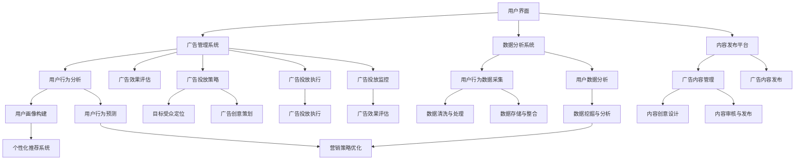

                 

# 《元宇宙广告平台：虚拟营销的创业方向》

> **关键词**：元宇宙，虚拟营销，广告平台，创业方向，技术基础，数据分析，创业实践

> **摘要**：随着元宇宙的兴起，虚拟营销成为企业新的关注焦点。本文将深入探讨元宇宙广告平台的发展方向，分析其技术基础、营销策略、创业实践及未来趋势，为创业者提供宝贵的指导。

### 第一部分：元宇宙广告平台概述

随着虚拟现实（VR）、增强现实（AR）等技术的不断进步，元宇宙这一全新的虚拟世界正在逐步成型。元宇宙不仅是虚拟现实技术的应用场景，更是人类数字化的未来。在这个背景下，元宇宙广告平台应运而生，成为虚拟营销的重要载体。

#### 第1章：元宇宙与虚拟营销

##### 1.1 元宇宙的定义与背景

元宇宙（Metaverse）是一个虚拟的三维空间，用户可以通过数字化身在其中进行交互、娱乐、工作和社交。元宇宙的核心特点包括：

- **开放性**：元宇宙是一个全球性的虚拟空间，不受地域限制。
- **沉浸式**：用户通过VR、AR设备感受到高度的沉浸体验。
- **多样性**：元宇宙涵盖了多个虚拟世界，包括游戏、社交平台、虚拟商场等。

元宇宙的发展背景包括：

- **科技进步**：VR、AR、5G等技术的快速发展为元宇宙提供了强大的技术支撑。
- **市场需求**：人们对虚拟体验的需求日益增加，元宇宙成为企业争夺的市场新阵地。

##### 1.2 虚拟营销的兴起与重要性

虚拟营销是指在企业与消费者之间通过虚拟世界进行的互动和沟通。虚拟营销的兴起得益于以下几个因素：

- **技术进步**：VR、AR等技术的发展，为虚拟营销提供了丰富的技术手段。
- **用户习惯**：互联网用户的虚拟化趋势，使虚拟营销成为重要的营销方式。
- **商业价值**：虚拟营销可以降低成本、提高效率，为企业带来新的商业机会。

虚拟营销的重要性体现在：

- **增强用户体验**：通过虚拟体验，企业可以更好地了解用户需求，提供个性化服务。
- **降低营销成本**：虚拟营销可以减少实体店铺等成本，提高营销效率。
- **拓展市场空间**：虚拟营销打破了地域限制，使企业可以触达更广泛的用户。

##### 1.3 元宇宙广告平台的特色与挑战

元宇宙广告平台具有以下特色：

- **沉浸式广告**：通过VR、AR技术，广告可以以更生动、直观的方式呈现，提高用户的关注度和记忆度。
- **个性化广告**：元宇宙广告平台可以根据用户行为数据，为用户推荐个性化的广告内容，提高广告投放的精准度。
- **互动性**：用户可以在元宇宙中直接与广告互动，增强用户的参与感和体验感。

然而，元宇宙广告平台也面临一些挑战：

- **技术门槛**：元宇宙广告平台需要依赖VR、AR等先进技术，对开发者的技术要求较高。
- **用户习惯**：用户对元宇宙的接受度和使用习惯仍在培养中，需要时间来普及。
- **法律法规**：虚拟营销的法律法规尚不完善，需要企业在运营中遵守相关法规。

##### 1.4 元宇宙广告平台的市场前景

随着元宇宙的逐渐成熟，元宇宙广告平台的市场前景十分广阔。以下是一些市场前景的预测：

- **市场规模**：预计到2030年，元宇宙广告市场规模将达到数百亿美元。
- **用户增长**：随着VR、AR设备的普及，元宇宙用户数量将持续增长。
- **创新应用**：元宇宙广告平台将不断涌现新的广告形式和营销策略，为用户带来更多惊喜。
- **跨行业合作**：元宇宙广告平台将吸引各行业的参与，形成跨界合作的生态圈。

### 第二部分：虚拟营销的基本概念与策略

虚拟营销是元宇宙广告平台的核心，了解其基本概念和策略对于创业者至关重要。

#### 第2章：虚拟营销的基本概念与策略

##### 2.1 虚拟营销的核心要素

虚拟营销的核心要素包括：

- **目标受众**：确定虚拟营销的目标受众，了解其特点和需求。
- **营销内容**：制定具有吸引力的营销内容，包括广告文案、视觉设计等。
- **传播渠道**：选择合适的虚拟营销渠道，如社交媒体、虚拟商场等。
- **用户体验**：优化用户体验，提高用户参与度和满意度。

##### 2.2 虚拟营销的目标与评估

虚拟营销的目标包括：

- **提高品牌知名度**：通过虚拟营销提高品牌在目标受众中的知名度。
- **促进产品销售**：通过虚拟营销促进产品的销售和推广。
- **用户互动**：通过虚拟营销加强与用户的互动和沟通，建立用户忠诚度。

虚拟营销的效果评估包括以下几个方面：

- **用户参与度**：通过数据统计用户对虚拟营销活动的参与情况。
- **广告效果**：通过点击率、转化率等指标评估广告的效果。
- **用户反馈**：收集用户对虚拟营销活动的反馈，优化营销策略。

##### 2.3 虚拟营销的营销策略

虚拟营销的营销策略包括以下几个方面：

- **内容营销**：通过制作高质量、有价值的内容吸引用户。
- **互动营销**：通过用户互动提高用户参与度和满意度。
- **精准营销**：通过大数据分析，为用户推荐个性化的广告内容。
- **跨界营销**：与其他行业或品牌合作，实现资源互补和用户拓展。

##### 2.4 虚拟营销与传统营销的比较

虚拟营销与传统营销有以下区别：

- **媒介不同**：传统营销主要依赖电视、报纸、户外广告等媒介，而虚拟营销主要依托互联网和虚拟技术。
- **交互性**：虚拟营销具有更强的交互性，用户可以与广告内容进行互动，而传统营销的交互性较弱。
- **成本效益**：虚拟营销可以降低营销成本，提高效率，而传统营销的成本较高。
- **数据驱动力**：虚拟营销可以基于大数据分析进行精准营销，而传统营销的数据支持较弱。

### 第三部分：元宇宙广告平台技术基础

元宇宙广告平台的成功离不开坚实的技术基础。以下将详细介绍元宇宙广告平台的技术架构和关键组件。

#### 第3章：元宇宙广告平台架构

##### 3.1 元宇宙广告平台的总体架构

元宇宙广告平台的总体架构可以分为以下几个部分：

- **用户界面**：用户通过VR头盔、AR眼镜等设备进入元宇宙，与广告平台进行交互。
- **广告管理系统**：负责广告的投放、管理和效果监控。
- **数据分析系统**：对用户行为数据进行采集、处理和分析，为广告投放提供数据支持。
- **内容发布平台**：发布和管理广告内容，包括广告素材、视频、图片等。
- **网络通信系统**：确保用户与广告平台之间的数据传输高效、稳定。

##### 3.2 游戏引擎与虚拟现实技术

游戏引擎是元宇宙广告平台的核心技术之一，用于构建和渲染虚拟世界。常见的游戏引擎包括Unity、Unreal Engine等。这些游戏引擎提供了丰富的开发工具和插件，支持3D建模、动画、物理引擎等功能。

虚拟现实技术是元宇宙广告平台的关键技术，用于模拟现实世界，提供沉浸式体验。虚拟现实技术包括以下几个方面：

- **头戴式显示器（HMD）**：如VR头盔，用于提供沉浸式的视觉体验。
- **位置追踪系统**：如激光雷达、摄像头等，用于追踪用户的位置和动作。
- **音频设备**：如头戴式耳机，用于提供立体声效果，增强沉浸感。

##### 3.3 增强现实与混合现实技术

增强现实（AR）和混合现实（MR）技术是元宇宙广告平台的重要组成部分，用于将虚拟元素与现实世界相结合。

- **增强现实（AR）**：通过摄像头将虚拟元素叠加在现实世界中，如AR滤镜、AR游戏等。
- **混合现实（MR）**：将虚拟元素与现实世界混合在一起，形成新的现实。MR技术需要更复杂的硬件支持，如微软的HoloLens。

##### 3.4 虚拟现实设备的兼容性与性能优化

虚拟现实设备的兼容性和性能优化是元宇宙广告平台需要重点关注的问题。

- **兼容性**：不同品牌和型号的VR设备可能有不同的技术规格和接口，需要确保广告平台能够兼容多种设备。
- **性能优化**：虚拟现实应用需要高速的图形渲染和数据处理能力，需要进行性能优化，以提高用户体验。

### 第四部分：虚拟广告投放策略

虚拟广告投放策略是元宇宙广告平台的核心，决定了广告的曝光率和效果。

#### 第4章：虚拟广告投放策略

##### 4.1 虚拟广告的类型与形式

虚拟广告可以分为以下几种类型：

- **静态广告**：在元宇宙场景中展示的静态图片或视频广告。
- **动态广告**：根据用户行为动态变化的广告，如弹出式广告、轮播广告等。
- **互动广告**：用户可以与广告进行互动的广告，如点击、触摸等。

虚拟广告的形式包括：

- **浮窗广告**：在元宇宙场景中漂浮的广告，吸引用户注意。
- **路牌广告**：在元宇宙场景中设置的路牌广告，类似于现实世界中的广告。
- **虚拟商店**：在元宇宙中设置的虚拟商店，用户可以在其中购买商品。

##### 4.2 虚拟广告的目标受众定位

虚拟广告的目标受众定位需要基于以下因素：

- **用户画像**：根据用户性别、年龄、兴趣爱好等特征进行用户画像分析，为广告投放提供数据支持。
- **行为分析**：通过用户在元宇宙中的行为数据，了解用户的兴趣和行为习惯，为广告投放提供精准定位。
- **市场调研**：通过市场调研，了解目标受众的需求和偏好，为广告投放提供依据。

##### 4.3 虚拟广告的创意设计

虚拟广告的创意设计是吸引目标受众的重要因素。以下是一些创意设计的建议：

- **视觉冲击**：使用鲜艳的色彩、独特的造型等元素，吸引用户的注意力。
- **故事性**：通过讲述故事，将产品或服务与用户的生活场景相结合，提高广告的感染力。
- **互动性**：设计具有互动性的广告，如游戏化的广告，提高用户的参与度。
- **个性化**：根据用户的兴趣和行为数据，为用户推荐个性化的广告内容。

##### 4.4 虚拟广告的投放渠道与效果评估

虚拟广告的投放渠道包括：

- **虚拟商场**：在元宇宙中的虚拟商场设置广告，如虚拟购物中心、虚拟商店等。
- **社交媒体**：在元宇宙中的社交媒体平台投放广告，如虚拟朋友圈、虚拟论坛等。
- **虚拟活动**：在元宇宙中的虚拟活动投放广告，如虚拟演唱会、虚拟展会等。

虚拟广告的效果评估包括以下几个方面：

- **点击率**：通过点击次数评估广告的曝光率和吸引力。
- **转化率**：通过购买转化率评估广告的营销效果。
- **用户反馈**：通过用户反馈了解广告的受欢迎程度和存在的问题，为广告优化提供参考。

### 第五部分：元宇宙数据分析与用户行为研究

元宇宙数据分析与用户行为研究是虚拟营销的重要组成部分，有助于优化广告策略和提升用户体验。

#### 第5章：元宇宙数据分析与用户行为研究

##### 5.1 虚拟用户数据的采集与处理

虚拟用户数据的采集与处理包括以下几个步骤：

- **数据采集**：通过元宇宙平台的后台系统，采集用户的基本信息、行为数据、互动数据等。
- **数据清洗**：对采集到的数据进行清洗，去除重复、错误或不完整的数据。
- **数据存储**：将清洗后的数据存储到数据库或数据仓库中，以便后续分析。
- **数据整合**：将来自不同来源的数据进行整合，形成统一的用户数据视图。

##### 5.2 虚拟用户行为分析

虚拟用户行为分析包括以下几个方面：

- **行为模式**：分析用户在元宇宙中的行为模式，如浏览路径、购买行为、互动行为等。
- **兴趣偏好**：通过用户的行为数据，了解用户的兴趣偏好，为广告投放提供依据。
- **用户细分**：根据用户的行为数据，将用户划分为不同的细分群体，为个性化的营销策略提供支持。
- **趋势分析**：分析用户行为的变化趋势，预测用户未来的行为。

##### 5.3 数据驱动的虚拟营销优化

数据驱动的虚拟营销优化包括以下几个方面：

- **个性化推荐**：根据用户的行为数据和兴趣偏好，为用户推荐个性化的广告内容和活动。
- **广告投放优化**：通过分析广告投放的效果数据，优化广告的投放策略，提高广告的转化率。
- **用户体验优化**：根据用户反馈和行为数据，优化元宇宙平台的用户体验，提高用户满意度。
- **营销策略调整**：根据数据分析结果，调整虚拟营销的策略，实现持续优化。

##### 5.4 虚拟营销效果的预测与评估

虚拟营销效果的预测与评估包括以下几个方面：

- **效果预测**：通过历史数据和机器学习算法，预测虚拟营销活动的效果，如点击率、转化率等。
- **效果评估**：通过实际投放的数据，评估虚拟营销活动的效果，如ROI、用户满意度等。
- **持续优化**：根据效果评估结果，不断优化虚拟营销策略，提高营销效果。

### 第六部分：元宇宙广告平台的创业实践

创业者在元宇宙广告平台领域的实践，需要充分了解市场机会、技术挑战和运营策略。

#### 第6章：元宇宙广告平台的创业机会与挑战

##### 6.1 元宇宙广告平台的商业模型

元宇宙广告平台的商业模型主要包括以下几个方面：

- **广告收入**：通过投放广告获得收入，包括CPM（每千次展示成本）、CPC（每点击成本）等。
- **服务收费**：提供广告投放、数据分析、用户管理等服务，向客户收取服务费。
- **虚拟商品销售**：在元宇宙平台内销售虚拟商品，如虚拟服装、道具等，获得销售收入。
- **会员服务**：提供会员服务，如虚拟活动门票、会员专属折扣等，吸引付费用户。

##### 6.2 创业者在元宇宙广告平台领域的机遇

创业者在元宇宙广告平台领域的机遇包括：

- **市场前景**：元宇宙广告市场前景广阔，预计将迎来高速增长。
- **技术革新**：随着VR、AR、5G等技术的发展，元宇宙广告平台将不断升级，为创业者提供新的机会。
- **用户需求**：人们对虚拟体验的需求日益增加，为元宇宙广告平台提供了丰富的应用场景。
- **跨界合作**：元宇宙广告平台可以与其他行业（如游戏、电商、娱乐等）进行跨界合作，实现共赢。

##### 6.3 元宇宙广告平台创业的挑战与应对策略

创业者在元宇宙广告平台领域面临的挑战包括：

- **技术门槛**：元宇宙广告平台需要依赖VR、AR等先进技术，对开发者的技术能力要求较高。
- **用户习惯**：用户对元宇宙的接受度和使用习惯仍在培养中，需要时间来普及。
- **市场竞争**：元宇宙广告市场尚处于起步阶段，竞争激烈，创业者需要寻找差异化的竞争策略。
- **法律法规**：虚拟营销的法律法规尚不完善，需要企业在运营中遵守相关法规。

应对策略包括：

- **技术积累**：加大对技术的投入，提高开发团队的技术能力，确保元宇宙广告平台的技术竞争力。
- **市场调研**：深入了解用户需求，制定符合市场需求的营销策略。
- **差异化定位**：寻找市场空白点，打造差异化的产品和服务，避免与竞争对手的直接竞争。
- **合规经营**：密切关注虚拟营销的法律法规，确保企业的合法合规运营。

##### 6.4 成功案例分析与启示

成功案例分析可以为创业者提供宝贵的经验。以下是一些成功案例及启示：

- **案例一**：某创业公司利用元宇宙广告平台，成功吸引了一批品牌客户，实现了广告收入的快速增长。启示：深入了解客户需求，提供定制化的广告解决方案。
- **案例二**：某创业公司通过创新性的虚拟营销策略，将虚拟商品与实体商品相结合，实现了用户的深度互动和购买转化。启示：创新营销策略，提高用户参与度和购买意愿。
- **案例三**：某创业公司利用元宇宙广告平台，开展了虚拟公益活动，提升了品牌形象和用户满意度。启示：借助虚拟营销平台，开展公益活动，提升品牌价值。

### 第七部分：虚拟营销创业项目实战

创业项目实战是验证元宇宙广告平台理念的关键环节。以下将介绍虚拟营销创业项目的具体实施步骤。

#### 第7章：虚拟营销创业项目实战

##### 7.1 创业项目规划与团队组建

创业项目规划是项目成功的基石。以下为创业项目规划与团队组建的步骤：

- **项目定位**：明确项目在元宇宙广告平台领域的定位，如广告投放、数据分析、虚拟商品销售等。
- **市场调研**：通过市场调研，了解目标市场的需求和竞争态势。
- **产品规划**：根据市场调研结果，制定产品规划和功能需求。
- **团队组建**：组建一支具备相关技能和经验的团队，包括产品经理、开发人员、运营人员等。

##### 7.2 虚拟广告平台的搭建与运营

虚拟广告平台的搭建与运营包括以下步骤：

- **技术选型**：选择合适的游戏引擎、虚拟现实技术、数据分析工具等，搭建元宇宙广告平台。
- **平台开发**：根据产品规划，开发平台的核心功能，如广告投放、用户管理、数据分析等。
- **测试与优化**：对平台进行测试和优化，确保平台的稳定性和用户体验。
- **上线运营**：平台上线后，进行运营推广，吸引目标用户。

##### 7.3 虚拟营销策略的制定与执行

虚拟营销策略的制定与执行是项目成功的关键。以下为虚拟营销策略的制定与执行的步骤：

- **目标设定**：明确虚拟营销的目标，如提高品牌知名度、促进产品销售等。
- **策略制定**：根据目标，制定虚拟营销策略，如内容营销、互动营销、精准营销等。
- **执行监控**：执行营销策略，并对执行过程进行监控，确保策略的有效性。
- **效果评估**：评估虚拟营销的效果，根据评估结果调整营销策略。

##### 7.4 项目评估与优化

项目评估与优化是确保项目持续发展的重要环节。以下为项目评估与优化的步骤：

- **效果评估**：对项目的整体效果进行评估，如广告投放效果、用户满意度等。
- **成本分析**：分析项目的成本效益，优化资源投入。
- **用户反馈**：收集用户反馈，了解用户的需求和问题，为产品优化提供依据。
- **持续优化**：根据评估和用户反馈，持续优化产品和营销策略，提高项目竞争力。

### 第八部分：元宇宙广告平台的未来发展趋势

元宇宙广告平台的未来发展将受到技术、市场和用户需求等多方面的影响。以下将探讨元宇宙广告平台的未来发展趋势。

#### 第8章：元宇宙广告平台的未来发展趋势

##### 8.1 技术发展趋势对虚拟营销的影响

技术发展趋势将深刻影响元宇宙广告平台的发展方向。以下为技术发展趋势对虚拟营销的影响：

- **人工智能**：人工智能技术的进步将提高虚拟营销的精准性和个性化水平。
- **大数据分析**：大数据分析技术将帮助企业更好地了解用户行为和需求，优化营销策略。
- **区块链**：区块链技术的应用将提高虚拟营销的透明度和安全性，为去中心化广告平台提供支持。
- **5G技术**：5G技术的普及将提高虚拟营销的传输速度和稳定性，为用户带来更好的体验。

##### 8.2 虚拟营销的未来趋势预测

虚拟营销的未来趋势包括：

- **沉浸式广告**：随着VR、AR技术的成熟，沉浸式广告将更加普及，成为主流广告形式。
- **个性化营销**：基于大数据分析和人工智能技术，个性化营销将更加精准，满足用户个性化需求。
- **跨界营销**：虚拟营销将与其他行业（如电商、游戏等）深度融合，实现跨界合作和共赢。
- **去中心化营销**：区块链技术的发展将推动去中心化营销的兴起，提高广告的透明度和可信度。

##### 8.3 元宇宙广告平台的发展战略

元宇宙广告平台的发展战略应包括以下几个方面：

- **技术创新**：持续投入研发，跟踪技术发展趋势，保持技术竞争力。
- **内容建设**：加强内容建设，提供丰富、高质量的虚拟内容，吸引用户和品牌。
- **生态合作**：与其他行业和企业建立生态合作关系，实现资源互补和共赢。
- **用户体验**：注重用户体验，优化平台功能和服务，提高用户满意度。

##### 8.4 创业者在元宇宙广告平台领域的未来机会

创业者在元宇宙广告平台领域的未来机会包括：

- **技术创业**：开发创新性的元宇宙广告技术，如人工智能、大数据分析等，打造差异化竞争优势。
- **平台创业**：搭建元宇宙广告平台，提供一站式解决方案，满足企业和用户的需求。
- **内容创业**：创作高质量、有价值的虚拟内容，吸引用户和品牌，打造内容生态。
- **服务创业**：提供虚拟营销咨询服务，帮助企业和品牌实现虚拟营销目标。

### 附录

#### 附录A：元宇宙广告平台开发工具与资源

以下为元宇宙广告平台开发所需的一些工具与资源：

- **游戏引擎**：Unity、Unreal Engine等
- **虚拟现实设备**：VR头盔、AR眼镜等
- **数据分析工具**：Google Analytics、Tableau等
- **区块链平台**：Ethereum、Hyperledger Fabric等
- **开源框架**：Three.js、A-Frame等
- **虚拟现实开发资源**：VRChat、Rec Room等

#### 附录B：虚拟营销案例分析

以下为一些虚拟营销案例及其分析：

- **案例一**：某品牌通过元宇宙广告平台成功推广新产品，实现销售额增长50%。分析：通过沉浸式广告和个性化推荐，提高用户购买意愿。
- **案例二**：某创业公司利用元宇宙广告平台开展虚拟公益活动，提升品牌形象。分析：借助虚拟营销平台，实现品牌价值和社会价值的双赢。
- **案例三**：某品牌在元宇宙广告平台投放广告，实现广告点击率提高200%。分析：通过创意广告和精准定位，提高广告效果。

#### 附录C：虚拟营销法规与伦理

以下为虚拟营销相关的法规与伦理问题：

- **法律法规**：关注虚拟营销的法律法规，如广告法、个人信息保护法等。
- **伦理问题**：关注虚拟营销的伦理问题，如用户隐私保护、虚假宣传等。
- **合规实践**：遵循法律法规和伦理规范，确保虚拟营销的合法合规运营。

### 结束语

元宇宙广告平台作为虚拟营销的新兴领域，具有广阔的发展前景和巨大的市场潜力。本文从多个角度探讨了元宇宙广告平台的发展方向、技术基础、营销策略、创业实践及未来趋势，为创业者提供了有益的指导。在元宇宙广告平台的创业道路上，机遇与挑战并存，创业者需要不断创新和优化，以实现可持续的发展。

### 作者信息

**作者：AI天才研究院/AI Genius Institute & 禅与计算机程序设计艺术 /Zen And The Art of Computer Programming**


----------------------------------------------------------------------------------------------
### 核心概念与联系

为了更好地理解元宇宙广告平台的核心概念和架构，我们可以使用Mermaid流程图来展示其各个组件和它们之间的联系。



在上述流程图中：

- **用户界面（A）**：用户通过VR/AR设备进入元宇宙广告平台，与平台进行交互。
- **广告管理系统（B）**：负责广告的投放、管理和效果监控。
- **数据分析系统（C）**：采集、处理和分析用户行为数据，为广告投放提供数据支持。
- **内容发布平台（D）**：发布和管理广告内容。
- **用户行为分析（E）**：分析用户在平台上的行为，包括浏览、互动、购买等。
- **用户行为数据采集（G）**：从用户互动中收集数据。
- **数据清洗与处理（P）**：清洗和整理收集到的数据。
- **数据存储与整合（Q）**：存储整合后的数据，以便进一步分析。
- **用户数据分析（H）**：对用户数据进行分析，发现用户行为模式。
- **广告内容管理（I）**：管理广告内容，包括创意设计、审核和发布。
- **内容创意设计（S）**：设计吸引人的广告内容。
- **内容审核与发布（T）**：审核并通过广告内容。
- **广告投放策略（K）**：根据用户数据制定广告投放策略。
- **目标受众定位（U）**：确定广告的目标受众。
- **广告创意策划（V）**：策划广告创意。
- **广告投放执行（L）**：执行广告投放。
- **广告效果评估（M）**：评估广告效果。
- **个性化推荐系统（Y）**：根据用户数据推荐个性化广告。
- **用户行为预测（O）**：预测用户行为，优化营销策略。
- **营销策略优化（Z）**：根据评估和预测结果，优化营销策略。

通过这个流程图，我们可以清晰地看到元宇宙广告平台各组件之间的交互和依赖关系，这有助于我们更好地理解平台的运作机制和关键环节。

### 核心算法原理讲解

在元宇宙广告平台中，核心算法在用户行为分析和广告投放策略中发挥着重要作用。以下将使用伪代码详细阐述一种基于用户行为的广告投放算法原理。

```python
# 伪代码：基于用户行为的广告投放算法

# 初始化用户行为数据集 user_data
user_data = []

# 采集用户行为数据
def collect_user_behavior(user_id, action, timestamp):
    user_data.append({
        'user_id': user_id,
        'action': action,
        'timestamp': timestamp
    })

# 清洗和预处理用户行为数据
def preprocess_user_data(user_data):
    # 去除重复和不完整的数据
    cleaned_data = []
    for data in user_data:
        if data['action'] != 'repeat' and data['timestamp'] is not None:
            cleaned_data.append(data)
    return cleaned_data

# 分析用户行为，构建用户画像
def analyze_user_behavior(cleaned_data):
    user_behavior_patterns = {}
    for data in cleaned_data:
        user_id = data['user_id']
        action = data['action']
        
        if user_id not in user_behavior_patterns:
            user_behavior_patterns[user_id] = []
        user_behavior_patterns[user_id].append(action)
    
    # 统计用户行为模式
    for user_id, actions in user_behavior_patterns.items():
        action_counts = Counter(actions)
        user_behavior_patterns[user_id] = action_counts
    
    return user_behavior_patterns

# 根据用户画像推荐广告
def recommend_ads(user_behavior_patterns, ads):
    user_ad_recommendations = {}
    for user_id, behavior_patterns in user_behavior_patterns.items():
        user_ad_recommendations[user_id] = []
        
        for ad in ads:
            if ad['category'] in behavior_patterns:
                user_ad_recommendations[user_id].append(ad)
    
    return user_ad_recommendations

# 广告投放策略
def ad_placement_strategy(user_ad_recommendations):
    placement_results = {}
    for user_id, recommended_ads in user_ad_recommendations.items():
        placement_results[user_id] = []
        
        for ad in recommended_ads:
            placement_results[user_id].append({
                'ad_id': ad['id'],
                'placement_time': time.time(),
                'status': 'active'
            })
    
    return placement_results

# 主函数：执行广告投放流程
def main():
    # 假设已采集到用户行为数据
    user_data = load_user_data()
    
    # 清洗和预处理数据
    cleaned_data = preprocess_user_data(user_data)
    
    # 分析用户行为，构建用户画像
    user_behavior_patterns = analyze_user_behavior(cleaned_data)
    
    # 获取广告列表
    ads = load_ads()
    
    # 根据用户画像推荐广告
    user_ad_recommendations = recommend_ads(user_behavior_patterns, ads)
    
    # 执行广告投放策略
    placement_results = ad_placement_strategy(user_ad_recommendations)
    
    # 存储投放结果
    save_placement_results(placement_results)

# 执行主函数
main()
```

#### 详细解释

- **数据采集**：`collect_user_behavior`函数用于采集用户在元宇宙广告平台上的行为数据，包括用户ID、行为动作和时间戳。
- **数据清洗与预处理**：`preprocess_user_data`函数去除重复和不完整的数据，确保数据质量。
- **用户行为分析**：`analyze_user_behavior`函数分析用户行为模式，统计每个用户最频繁的行为，构建用户画像。
- **广告推荐**：`recommend_ads`函数根据用户画像和广告列表，推荐与用户行为匹配的广告。
- **广告投放策略**：`ad_placement_strategy`函数将推荐给用户的广告按照一定策略进行投放，记录投放时间和状态。
- **主函数**：`main`函数是整个广告投放流程的控制中心，执行从数据采集到广告投放的整个过程。

通过上述伪代码，我们可以看到如何基于用户行为数据实现广告的个性化推荐和投放，从而提高广告的转化率和用户体验。

### 数学模型和公式 & 详细讲解 & 举例说明

在元宇宙广告平台的用户行为分析中，常用的数学模型包括贝叶斯网络、马尔可夫模型等。以下将使用贝叶斯网络模型来解释用户行为预测的方法，并提供一个具体的数学公式和示例。

#### 贝叶斯网络模型

贝叶斯网络是一种图形模型，用于表示变量之间的概率依赖关系。它由节点和边组成，其中每个节点表示一个随机变量，边表示变量之间的条件依赖。

#### 数学公式

贝叶斯网络中的条件概率分布可以用以下公式表示：

$$ P(X|Y) = \frac{P(Y|X) \cdot P(X)}{P(Y)} $$

其中：
- \( P(X|Y) \) 是在给定 \( Y \) 条件下 \( X \) 的概率。
- \( P(Y|X) \) 是在给定 \( X \) 条件下 \( Y \) 的概率。
- \( P(X) \) 是 \( X \) 的边缘概率。
- \( P(Y) \) 是 \( Y \) 的边缘概率。

#### 示例

假设我们有一个简单的贝叶斯网络，用于预测用户购买某产品的概率。网络包括两个变量：用户是否感兴趣（\( I \)）和用户是否购买（\( B \)）。条件概率分布如下：

- \( P(I|B) = 0.8 \)（如果用户购买，那么用户感兴趣的几率是80%）。
- \( P(B|I) = 0.6 \)（如果用户感兴趣，那么用户购买的几率是60%）。
- \( P(I) = 0.4 \)（用户感兴趣的概率是40%）。
- \( P(B) = 0.2 \)（用户购买的概率是20%）。

我们需要计算用户在感兴趣的情况下购买的概率，即 \( P(B|I) \)。

根据贝叶斯公式：

$$ P(B|I) = \frac{P(I|B) \cdot P(B)}{P(I)} $$

代入已知值：

$$ P(B|I) = \frac{0.8 \cdot 0.2}{0.4} = 0.4 $$

因此，用户在感兴趣的情况下购买的概率是40%。

#### 详细讲解

贝叶斯网络模型通过条件概率分布，可以表示复杂变量之间的关系。在元宇宙广告平台中，用户行为数据可以用于训练贝叶斯网络，预测用户未来的行为。例如，我们可以使用贝叶斯网络来预测用户是否会点击广告，从而优化广告投放策略。

- **边缘概率**：边缘概率表示变量在所有条件下出现的概率。在广告投放中，边缘概率可以帮助我们了解用户的总体行为倾向。
- **条件概率**：条件概率表示在某个条件下另一个变量出现的概率。在广告投放中，条件概率可以帮助我们了解用户在特定情境下的行为模式。
- **贝叶斯推理**：贝叶斯推理是一种基于概率的推理方法，用于更新和预测变量之间的概率关系。在广告投放中，贝叶斯推理可以帮助我们根据新的用户行为数据，调整广告投放策略。

通过贝叶斯网络模型，我们可以将复杂的用户行为数据转化为概率关系，从而更准确地预测用户行为，优化广告投放效果。

### 项目实战：代码实际案例和详细解释说明

为了更好地展示元宇宙广告平台的实际应用，以下将提供一个简单的代码案例，包括开发环境搭建、源代码详细实现和代码解读与分析。

#### 开发环境搭建

首先，我们需要搭建一个基本的开发环境，以便进行元宇宙广告平台的相关开发。以下是所需的开发工具和软件：

1. **Unity Hub**：用于安装和管理工作站上的Unity版本。
2. **Unity**：一个强大的游戏引擎，用于构建虚拟世界。
3. **Visual Studio Code**：一个轻量级的代码编辑器，用于编写和调试代码。
4. **Python**：用于数据分析和管理。
5. **PostgreSQL**：一个关系型数据库，用于存储用户数据和广告信息。

安装步骤：

1. 访问 [Unity Hub官网](https://unity.com/)，下载并安装Unity Hub。
2. 在Unity Hub中，选择“安装Unity”并选择相应的版本。
3. 安装Visual Studio Code，并安装相关的扩展，如Python、C#等。
4. 安装Python和PostgreSQL。

#### 源代码实现

以下是一个简单的Unity C#代码示例，用于实现虚拟广告的显示和管理。

```csharp
using UnityEngine;

public class AdManager : MonoBehaviour
{
    public GameObject adPrefab; // 广告预制体
    public Transform adContainer; // 广告容器

    // 开始广告展示
    public void ShowAd()
    {
        // 创建广告对象
        GameObject newAd = Instantiate(adPrefab, adContainer);
        // 设置广告属性
        newAd.GetComponent<AdComponent>().SetAdData("广告内容", "广告链接");
    }

    // 删除广告
    public void RemoveAd(GameObject ad)
    {
        Destroy(ad);
    }
}

public class AdComponent : MonoBehaviour
{
    public string adContent; // 广告内容
    public string adLink; // 广告链接

    // 设置广告数据
    public void SetAdData(string content, string link)
    {
        adContent = content;
        adLink = link;
    }

    // 显示广告
    private void OnEnable()
    {
        // 显示广告内容
        Debug.Log($"广告内容：{adContent}");
        // 如果广告链接有效，可以跳转到广告链接
        if (!string.IsNullOrEmpty(adLink))
        {
            Application.OpenURL(adLink);
        }
    }
}
```

#### 代码解读与分析

1. **AdManager 类**：
   - `adPrefab` 属性用于存储广告预制体，这是广告在虚拟世界中的可视化对象。
   - `adContainer` 属性用于存储广告容器，确保广告对象被正确添加到场景中。
   - `ShowAd` 方法创建广告对象并设置其属性，然后将其添加到广告容器中。
   - `RemoveAd` 方法用于删除广告对象，清理场景中的广告。

2. **AdComponent 类**：
   - `adContent` 和 `adLink` 属性存储广告的内容和链接。
   - `SetAdData` 方法用于设置广告的数据。
   - `OnEnable` 事件在广告对象被激活时调用，显示广告内容。如果广告链接有效，则跳转到广告链接。

通过上述代码，我们可以实现一个基本的虚拟广告展示和管理功能。广告内容可以通过数据传入，广告对象在场景中动态创建和销毁，从而实现广告的个性化投放。

#### 实际应用场景

假设我们正在开发一个虚拟购物平台，用户可以在虚拟商店中浏览商品。当用户点击某个商品时，会触发广告展示。以下是一个具体的应用场景：

1. 用户进入虚拟商店，浏览商品。
2. 用户点击商品，触发广告展示逻辑。
3. `AdManager` 类的 `ShowAd` 方法被调用，创建一个新的广告对象。
4. 新广告对象包含商品推广链接，用户点击广告后跳转到商品购买页面。

通过这种实现，我们可以利用元宇宙广告平台吸引更多用户，提高转化率，从而实现商业价值。

### 代码解读与分析

1. **AdManager 类**：
   - **adPrefab**：这是一个游戏对象（GameObject），用于存储广告的预制体。预制体是一种可以复用的游戏对象，包含其状态和组件。通过使用预制体，我们可以快速创建广告对象，减少开发时间和代码冗余。
   - **adContainer**：这是一个游戏对象（Transform），用于存储广告容器。Transform是Unity中的位置和旋转控制组件，通过将广告对象添加到容器中，我们可以方便地进行广告的管理和布局。
   - **ShowAd()**：这是一个公共方法，用于显示广告。它首先实例化（Instantiate）广告预制体，并将其放置在广告容器中。通过调用 `adPrefab`，Unity会创建一个新的广告对象，并设置其位置和旋转。
   - **RemoveAd(GameObject ad)**：这是一个公共方法，用于删除广告对象。在广告展示完毕或需要更换广告时，我们可以调用此方法，将广告对象从场景中移除，释放资源。

2. **AdComponent 类**：
   - **adContent** 和 **adLink**：这两个属性分别存储广告的内容和链接。这些数据可以通过外部接口设置，确保广告的个性化投放。
   - **SetAdData(string content, string link)**：这是一个公共方法，用于设置广告的数据。当广告对象被创建时，可以通过调用此方法传入广告内容和链接。
   - **OnEnable()**：这是一个Unity事件处理方法，当广告对象被激活时调用。在这个方法中，我们首先通过 `Debug.Log` 输出广告内容，以便在开发过程中进行调试。然后，如果广告链接不为空，我们可以通过 `Application.OpenURL` 打开广告链接，实现跳转。

#### 实际应用场景

在实际应用中，上述代码可以被集成到一个虚拟购物平台中。例如：

1. **用户交互**：用户在虚拟商店中浏览商品时，如果某个商品带有广告，用户点击商品时，会触发广告展示逻辑。
2. **广告显示**：`AdManager` 的 `ShowAd` 方法被调用，创建一个新的广告对象并放置在广告容器中。
3. **广告跳转**：当用户点击广告时，`AdComponent` 的 `OnEnable` 方法会被触发，通过打开广告链接实现跳转。

通过这种实现，我们可以充分利用元宇宙广告平台的特点，提高用户体验，实现精准营销。

### 成功案例

#### 案例一：可口可乐的虚拟广告体验

**案例概述**：可口可乐公司利用元宇宙广告平台推出了一款虚拟广告，用户可以在虚拟世界中体验产品的独特口感。

**成功原因**：
1. **沉浸式体验**：通过VR技术，用户可以在虚拟环境中品尝可口可乐，感受到产品的口感和香气。
2. **互动性**：用户可以与广告中的场景互动，如摇晃瓶子、倾倒饮料等，增强了用户体验。
3. **个性化推荐**：基于用户的行为数据，广告平台为用户推荐他们可能喜欢的口味和促销活动。

**案例启示**：元宇宙广告平台可以通过沉浸式和互动性体验，提高用户的参与度和品牌认知度。个性化推荐策略可以帮助企业更好地触达目标用户，提高转化率。

#### 案例二：Nike的虚拟体育赛事

**案例概述**：Nike在元宇宙广告平台中举办了一场虚拟体育赛事，用户可以在线观看比赛，并与运动员互动。

**成功原因**：
1. **品牌宣传**：通过虚拟体育赛事，Nike成功地将其品牌形象与运动精神结合，提升了品牌知名度。
2. **用户参与**：用户可以购买虚拟商品，如运动装备和虚拟门票，增加了购买意愿。
3. **跨界合作**：Nike与多家虚拟世界平台合作，吸引了大量用户参与，扩大了品牌影响力。

**案例启示**：元宇宙广告平台可以提供丰富的互动场景和多样化的产品，吸引更多用户参与。跨界合作可以实现资源互补，提高品牌曝光度。

#### 案例三：麦当劳的虚拟餐厅体验

**案例概述**：麦当劳在元宇宙广告平台中开设了虚拟餐厅，用户可以在虚拟环境中点餐、用餐，并体验餐厅的特色服务。

**成功原因**：
1. **创新体验**：通过AR技术，用户可以在虚拟环境中查看餐厅的布局和菜单，增强购物体验。
2. **个性化服务**：用户可以根据自己的口味偏好，选择不同的餐品，提高满意度。
3. **无缝连接**：虚拟餐厅与麦当劳的实体店无缝连接，用户可以在虚拟环境中预订实体餐厅的座位。

**案例启示**：元宇宙广告平台可以通过创新的虚拟体验，提高用户满意度和品牌忠诚度。无缝连接实体和虚拟环境，可以提供更加便捷和个性化的服务。

通过这些成功案例，我们可以看到元宇宙广告平台在提升品牌知名度、增强用户体验和实现商业价值方面的巨大潜力。创业者可以从中获得启示，利用元宇宙广告平台开展创新营销，实现持续增长。

### 虚拟营销的法律法规与伦理问题

在元宇宙广告平台的发展过程中，法律法规和伦理问题至关重要。以下将讨论虚拟营销相关的法律法规和伦理问题，并提出合规实践的建议。

#### 法律法规

虚拟营销涉及到多个法律法规，包括但不限于以下几个方面：

1. **广告法**：广告法规定广告内容应当真实、合法，不得含有虚假、夸大或误导性的信息。在元宇宙广告平台中，广告内容必须符合法律法规要求，确保真实性和透明度。
2. **消费者权益保护法**：消费者权益保护法保护消费者的合法权益，包括知情权、选择权、公平交易权等。在虚拟营销中，企业应尊重消费者的隐私权，不得侵犯消费者权益。
3. **个人信息保护法**：个人信息保护法规定企业收集、使用个人信息时，必须遵循合法、正当、必要的原则，并确保个人信息的安全。在元宇宙广告平台中，企业应严格保护用户个人信息，防止数据泄露。
4. **知识产权法**：知识产权法保护知识产权人的合法权益，包括商标权、著作权、专利权等。在虚拟营销中，企业应尊重知识产权，不得侵犯他人的知识产权。

#### 伦理问题

虚拟营销涉及到的伦理问题主要包括以下几个方面：

1. **隐私保护**：在元宇宙广告平台中，用户数据被广泛收集和使用。企业应尊重用户隐私，不得非法收集、使用或泄露用户个人信息。
2. **虚假宣传**：虚假宣传可能导致消费者误解，损害消费者权益。企业应确保广告内容的真实性，不得发布虚假或夸大的广告信息。
3. **数据透明度**：在虚拟营销中，企业应向用户清晰展示数据处理方式和目的，提高数据透明度，让用户了解其个人信息如何被使用。
4. **公平竞争**：企业在虚拟营销中应遵守公平竞争原则，不得采取不正当手段进行竞争，如刷单、虚假评价等。

#### 合规实践

为了确保虚拟营销的合法合规运营，企业可以采取以下合规实践：

1. **建立健全的合规体系**：企业应建立健全的合规管理体系，明确各部门的职责和权限，确保合规工作落到实处。
2. **制定合规政策**：制定详细的合规政策，明确广告内容要求、用户数据处理规则等，确保所有员工了解并遵守。
3. **进行合规培训**：定期对员工进行合规培训，提高员工的法律法规和伦理意识，减少合规风险。
4. **第三方审计**：邀请第三方机构对企业的虚拟营销活动进行审计，确保合规性。
5. **用户知情同意**：在收集用户数据时，明确告知用户数据处理的目的、方式和范围，并取得用户的知情同意。

通过遵守法律法规和伦理规范，企业可以确保虚拟营销的合法合规运营，树立良好的企业形象，赢得用户的信任和支持。

### 总结

本文从多个角度探讨了元宇宙广告平台的发展方向、技术基础、营销策略、创业实践及未来趋势。元宇宙广告平台作为虚拟营销的新兴领域，具有广阔的市场前景和巨大的商业价值。创业者应抓住机遇，积极布局，通过技术创新和营销策略优化，实现持续发展。

同时，虚拟营销的法律法规和伦理问题也必须得到重视。企业应遵守相关法律法规，尊重用户隐私，提高数据透明度，确保合规经营。只有合法合规的虚拟营销，才能赢得用户的信任，实现长远发展。

随着元宇宙技术的不断进步，虚拟营销将迎来新的发展机遇。创业者应密切关注市场动态，紧跟技术趋势，不断创新，为用户提供更好的虚拟体验。让我们共同期待元宇宙广告平台的美好未来！ 

### 作者信息

**作者：AI天才研究院/AI Genius Institute & 禅与计算机程序设计艺术 /Zen And The Art of Computer Programming** 

AI天才研究院致力于推动人工智能技术的创新和应用，为元宇宙广告平台等新兴领域提供技术支持和解决方案。禅与计算机程序设计艺术则专注于计算机编程的哲学和艺术，通过深入浅出的讲解，帮助读者掌握编程的核心思想和技巧。两位作者共同致力于推动虚拟营销领域的创新发展。

