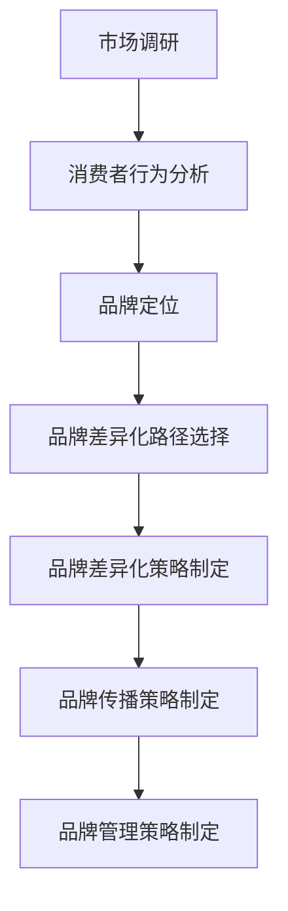
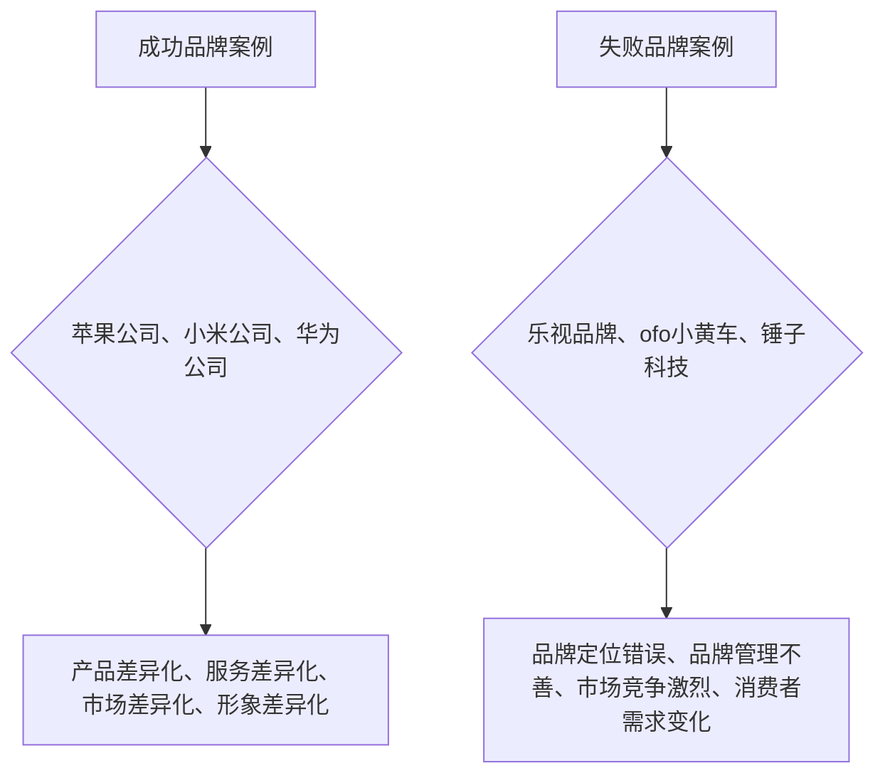

                 

# 《创业公司的品牌差异化策略制定》

> **关键词：** 创业公司、品牌差异化、策略、市场定位、消费者行为、案例分析、可持续发展

> **摘要：** 本文章旨在探讨创业公司在市场竞争中如何通过品牌差异化策略提升市场竞争力。我们将从品牌差异化的理论基础入手，深入分析品牌差异化策略的理论框架和实践策略，并结合具体案例进行详细解析，最后探讨品牌差异化策略的未来趋势。文章结构如下：

## 目录大纲

### 第一部分：品牌差异化策略的理论基础

#### 第1章：品牌差异化的概念与重要性

#### 第2章：品牌差异化策略的理论框架

#### 第3章：消费者行为分析在品牌差异化中的应用

### 第二部分：创业公司品牌差异化的实践策略

#### 第4章：创业公司的品牌定位策略

#### 第5章：创业公司的品牌差异化战略

#### 第6章：创业公司的品牌传播策略

#### 第7章：创业公司的品牌管理策略

### 第三部分：创业公司品牌差异化的案例分析

#### 第8章：成功创业公司的品牌差异化实践

#### 第9章：失败创业公司的品牌差异化教训

### 第四部分：创业公司品牌差异化策略的未来趋势

#### 第10章：数字化时代下的品牌差异化策略

#### 第11章：创业公司品牌差异化策略的国际化

#### 第12章：创业公司品牌差异化策略的可持续发展

### 附录

#### 附录A：品牌差异化策略制定工具与资源

#### 附录B：品牌差异化策略制定流程图与案例分析图

#### 附录C：创业公司品牌差异化策略制定实战案例

## 第一部分：品牌差异化策略的理论基础

### 第1章：品牌差异化的概念与重要性

#### 1.1 品牌差异化的定义与内涵

品牌差异化是指企业通过一系列策略手段，在产品或服务的特性、质量、性能、外观、价格、服务等方面与竞争对手形成区别，从而在消费者心中树立独特形象，提高市场竞争力。

品牌差异化的内涵包括以下几个方面：

1. **产品差异化**：通过技术革新、功能增强、外观设计等手段，使产品在质量、性能、功能等方面优于竞争对手。

2. **服务差异化**：通过优质的客户服务、快速响应、定制化服务等手段，提升消费者体验。

3. **市场差异化**：通过市场细分，针对特定消费群体的需求和偏好，提供特定的产品或服务。

4. **形象差异化**：通过独特的品牌标识、品牌文化、广告宣传等手段，在消费者心中树立独特的品牌形象。

#### 1.2 品牌差异化的重要性

品牌差异化对于创业公司具有重要意义，主要体现在以下几个方面：

1. **提升市场竞争力**：品牌差异化有助于企业在竞争激烈的市场中脱颖而出，吸引消费者。

2. **建立品牌忠诚度**：通过品牌差异化，企业可以满足消费者的特定需求，提高消费者对品牌的忠诚度。

3. **增强品牌价值**：品牌差异化有助于提升品牌形象，提高品牌的市场价值和溢价能力。

4. **应对市场变化**：品牌差异化使企业能够迅速适应市场变化，灵活调整产品或服务策略。

### 第2章：品牌差异化策略的理论框架

#### 2.1 SWOT分析在品牌差异化中的应用

SWOT分析是战略规划中常用的一种方法，适用于品牌差异化策略的制定。SWOT分析包括四个方面：优势（Strengths）、劣势（Weaknesses）、机会（Opportunities）和威胁（Threats）。

1. **优势**：分析企业在品牌差异化方面的优势，如技术领先、产品质量、品牌形象等。

2. **劣势**：分析企业在品牌差异化方面的劣势，如市场份额小、品牌知名度低等。

3. **机会**：分析市场环境中的机会，如新市场的开拓、消费者需求的改变等。

4. **威胁**：分析市场环境中的威胁，如竞争对手的崛起、市场环境变化等。

通过SWOT分析，企业可以明确品牌差异化策略的优先级，有针对性地制定和调整策略。

#### 2.2 品牌定位与市场细分

品牌定位是品牌差异化策略的核心，旨在明确企业在市场中的位置，为消费者提供独特的价值。品牌定位需要考虑以下几个方面：

1. **目标市场**：确定企业的目标消费者群体，如年龄、性别、收入等。

2. **品牌价值主张**：明确品牌的核心价值，如品质、创新、性价比等。

3. **品牌形象**：设计独特的品牌形象，如Logo、色彩、口号等。

市场细分是品牌定位的基础，通过将市场划分为不同的细分市场，企业可以更好地满足消费者的需求。

#### 2.3 品牌价值主张与差异化策略

品牌价值主张是企业对品牌所承诺的价值的阐述，是品牌差异化的核心。品牌价值主张需要具备以下特点：

1. **独特性**：品牌价值主张应具有独特的特点，与其他品牌形成区别。

2. **相关性**：品牌价值主张应与目标消费者的需求和偏好密切相关。

3. **可信性**：品牌价值主张应具有可信性，能够得到消费者的认可。

根据品牌价值主张，企业可以制定具体的差异化策略，如产品创新、服务质量提升、品牌传播等。

### 第3章：消费者行为分析在品牌差异化中的应用

#### 3.1 消费者行为理论概述

消费者行为是指消费者在购买、使用、评价产品或服务过程中的行为和决策。消费者行为理论主要包括以下几个方面：

1. **需求理论**：分析消费者对产品或服务的需求，包括需求量、需求价格弹性等。

2. **决策理论**：分析消费者在购买过程中的决策过程，包括信息收集、评估、购买决策等。

3. **行为理论**：分析消费者购买后的行为，如使用、评价、口碑传播等。

#### 3.2 消费者需求与偏好分析

消费者需求是指消费者对产品或服务的需求量，消费者偏好是指消费者对不同产品或服务的喜好程度。企业需要通过市场调研等方法，分析消费者需求与偏好，为品牌差异化策略提供依据。

1. **需求分析**：分析消费者的需求类型、需求量、需求变化趋势等。

2. **偏好分析**：分析消费者对不同品牌、产品或服务的偏好程度，包括喜好、厌恶、满意度等。

#### 3.3 消费者行为在品牌差异化策略制定中的指导作用

消费者行为分析在品牌差异化策略制定中具有重要作用，主要体现在以下几个方面：

1. **指导品牌定位**：通过消费者需求与偏好分析，明确品牌定位的目标市场和品牌价值主张。

2. **优化产品与服务**：根据消费者需求与偏好，调整产品与服务，提升消费者满意度。

3. **制定营销策略**：根据消费者行为特点，制定有效的营销策略，如广告宣传、促销活动等。

## 第二部分：创业公司品牌差异化的实践策略

### 第4章：创业公司的品牌定位策略

#### 4.1 创业公司的品牌定位原则

品牌定位策略是创业公司品牌差异化战略的核心，以下原则有助于创业公司制定有效的品牌定位：

1. **目标市场原则**：明确目标市场，分析目标市场的需求与偏好。

2. **独特性原则**：品牌定位应具有独特性，与其他品牌形成区别。

3. **相关性原则**：品牌定位应与目标消费者的需求和偏好密切相关。

4. **可信性原则**：品牌定位应具有可信性，能够得到消费者的认可。

#### 4.2 创业公司的品牌定位方法

创业公司可以通过以下方法进行品牌定位：

1. **市场细分**：根据消费者需求与偏好，将市场划分为不同的细分市场。

2. **品牌价值主张**：明确品牌的核心价值，如品质、创新、性价比等。

3. **品牌形象**：设计独特的品牌形象，如Logo、色彩、口号等。

4. **品牌故事**：构建品牌故事，提升品牌形象和认知度。

#### 4.3 品牌定位策略案例解析

以下是一个品牌定位策略的案例解析：

**案例：** 一家创业公司开发了一款智能家居设备，目标市场为年轻消费者。

1. **目标市场原则**：目标市场为年轻人，分析他们的需求与偏好，如智能化、便捷性、个性化等。

2. **独特性原则**：智能家居设备在市场上已有众多品牌，创业公司需通过独特性来吸引消费者，如产品功能创新、设计独特等。

3. **相关性原则**：品牌价值主张为“智能化生活，尽在掌握”，与目标市场的需求密切相关。

4. **可信性原则**：通过市场调研和用户体验反馈，确保品牌价值主张的可信性。

品牌定位策略：创业公司通过以上原则和方法，将品牌定位为“年轻人的智能化生活伴侣”，为年轻消费者提供高品质、个性化的智能家居设备。

### 第5章：创业公司的品牌差异化战略

#### 5.1 创业公司的品牌差异化路径选择

创业公司在制定品牌差异化战略时，需要根据自身优势和市场需求选择合适的差异化路径：

1. **产品差异化**：通过技术创新、功能增强、外观设计等手段，提高产品竞争力。

2. **服务差异化**：通过优质的客户服务、快速响应、定制化服务等手段，提升消费者体验。

3. **市场差异化**：通过市场细分，针对特定消费群体的需求和偏好，提供特定的产品或服务。

4. **形象差异化**：通过独特的品牌标识、品牌文化、广告宣传等手段，在消费者心中树立独特的品牌形象。

#### 5.2 创业公司的品牌差异化手段

创业公司可以通过以下手段实现品牌差异化：

1. **产品创新**：持续研发新产品，满足消费者的需求。

2. **服务质量提升**：提供优质的客户服务，增强消费者满意度。

3. **品牌传播**：通过广告宣传、社交媒体、公关活动等手段，提升品牌知名度。

4. **品牌合作**：与知名品牌合作，共同推广品牌，提高品牌形象。

#### 5.3 创业公司的品牌差异化战略实施步骤

创业公司实施品牌差异化战略的步骤如下：

1. **确定品牌差异化目标**：明确品牌差异化的核心目标和预期成果。

2. **分析市场与消费者**：了解市场需求和消费者偏好，为品牌差异化提供依据。

3. **选择品牌差异化路径**：根据市场与消费者分析，选择合适的品牌差异化路径。

4. **制定品牌差异化策略**：根据差异化路径，制定具体的品牌差异化策略。

5. **实施与监控**：执行品牌差异化策略，并对实施效果进行监控和调整。

### 第6章：创业公司的品牌传播策略

#### 6.1 品牌传播的概念与作用

品牌传播是指企业通过各种手段和渠道，将品牌信息传递给消费者，以提高品牌知名度、认知度和美誉度。品牌传播在品牌差异化策略中具有重要作用，主要体现在以下几个方面：

1. **提升品牌知名度**：通过广告宣传、公关活动等手段，扩大品牌影响力。

2. **塑造品牌形象**：通过品牌故事、品牌文化等手段，塑造独特的品牌形象。

3. **增强消费者信任**：通过品牌传播，传递品牌价值，增强消费者对品牌的信任。

4. **促进消费者购买**：通过品牌传播，激发消费者的购买欲望，提高销售额。

#### 6.2 品牌传播渠道的选择与应用

创业公司需要根据自身情况和市场环境，选择合适的品牌传播渠道，以提高品牌传播效果。常见的品牌传播渠道包括：

1. **广告媒体**：如电视、报纸、杂志、网络广告等。

2. **社交媒体**：如微信、微博、抖音、Instagram等。

3. **公关活动**：如新闻发布会、赞助活动、公益活动等。

4. **口碑营销**：通过消费者口碑传播，提高品牌知名度。

5. **品牌官网**：通过品牌官网，展示品牌形象和产品信息。

#### 6.3 品牌传播策略的案例解析

以下是一个品牌传播策略的案例解析：

**案例：** 一家创业公司推出了一款智能家居设备，通过以下策略进行品牌传播：

1. **广告媒体**：在电视、报纸、网络等广告媒体上投放广告，提升品牌知名度。

2. **社交媒体**：在微信、微博、抖音等社交媒体上开展活动，吸引年轻消费者。

3. **公关活动**：赞助科技展会、举办产品发布会，展示品牌实力。

4. **口碑营销**：邀请网红进行试用和分享，提高消费者口碑。

5. **品牌官网**：通过官网展示产品信息、品牌故事和用户评价，提升品牌形象。

品牌传播策略：创业公司通过以上渠道和手段，实现品牌传播，提高品牌知名度、认知度和美誉度。

### 第7章：创业公司的品牌管理策略

#### 7.1 品牌管理的概念与重要性

品牌管理是指企业通过一系列策略和手段，对品牌进行规划、维护和发展，以提高品牌价值。品牌管理在创业公司中具有重要意义，主要体现在以下几个方面：

1. **提高品牌知名度**：通过品牌管理，提高品牌在消费者心中的知名度，扩大品牌影响力。

2. **增强品牌认知**：通过品牌管理，明确品牌的核心价值，提高消费者对品牌的认知。

3. **提升品牌美誉度**：通过品牌管理，提升品牌在消费者心中的美誉度，建立良好的品牌形象。

4. **降低品牌风险**：通过品牌管理，及时发现和解决品牌问题，降低品牌风险。

#### 7.2 品牌管理的内容与流程

品牌管理包括以下几个方面：

1. **品牌规划**：明确品牌愿景、使命、价值观等，为品牌发展奠定基础。

2. **品牌定位**：根据市场需求和消费者偏好，确定品牌在市场中的位置，为品牌差异化提供依据。

3. **品牌传播**：通过广告、公关、社交媒体等手段，传递品牌信息，提高品牌知名度。

4. **品牌维护**：关注消费者反馈，及时处理品牌问题，维护品牌形象。

5. **品牌发展**：根据市场环境和消费者需求，调整品牌策略，推动品牌发展。

品牌管理流程主要包括以下步骤：

1. **品牌诊断**：分析品牌现状，找出品牌存在的问题和机会。

2. **品牌规划**：制定品牌发展战略，明确品牌愿景、使命、价值观等。

3. **品牌定位**：确定品牌在市场中的位置，制定品牌差异化策略。

4. **品牌传播**：制定品牌传播策略，选择合适的传播渠道和手段。

5. **品牌维护**：关注消费者反馈，维护品牌形象。

6. **品牌发展**：根据市场环境和消费者需求，调整品牌策略，推动品牌发展。

#### 7.3 品牌管理工具与方法

品牌管理需要借助一些工具和方法，以提高品牌管理的效率。常见的品牌管理工具和方法包括：

1. **品牌地图**：通过品牌地图，明确品牌的核心价值、目标市场和品牌定位。

2. **品牌雷达**：通过品牌雷达，监测品牌在市场中的表现，了解消费者对品牌的认知和评价。

3. **品牌绩效评估**：通过品牌绩效评估，衡量品牌管理的效果，为品牌发展提供依据。

4. **品牌危机管理**：建立品牌危机管理机制，及时发现和解决品牌问题，降低品牌风险。

5. **品牌传播预算**：制定品牌传播预算，合理分配资源，提高品牌传播效果。

## 第三部分：创业公司品牌差异化的案例分析

### 第8章：成功创业公司的品牌差异化实践

#### 8.1 案例一：苹果公司的品牌差异化策略

苹果公司作为全球知名的科技企业，其品牌差异化策略在业界享有盛誉。以下是对苹果公司品牌差异化策略的解析：

1. **产品差异化**：苹果公司通过技术创新和独特的产品设计，打造出一系列具有高附加值的电子产品，如iPhone、iPad、Mac等。

2. **服务差异化**：苹果公司提供优质的客户服务，如Apple Store的全方位服务、在线客服等，提升了消费者的购买体验。

3. **市场差异化**：苹果公司针对高端消费市场，提供高品质的产品和服务，满足消费者对品质和体验的追求。

4. **形象差异化**：苹果公司通过独特的品牌标识、广告宣传等手段，塑造了高端、创新的品牌形象。

成功原因：苹果公司通过持续的产品创新、优质的客户服务和独特的品牌形象，成功地实现了品牌差异化，赢得了消费者的青睐。

#### 8.2 案例二：小米公司的品牌差异化策略

小米公司作为中国的科技巨头，其品牌差异化策略在国内外市场取得了显著成果。以下是对小米公司品牌差异化策略的解析：

1. **产品差异化**：小米公司通过高性价比的产品，如手机、智能家居设备等，吸引了大量消费者。

2. **服务差异化**：小米公司注重用户参与，通过社区互动、用户体验反馈等手段，提升消费者满意度。

3. **市场差异化**：小米公司针对大众市场，提供性价比高的产品，满足广大消费者的需求。

4. **形象差异化**：小米公司通过年轻、创新、科技的定位，塑造了独特的品牌形象。

成功原因：小米公司通过高性价比的产品、用户参与的服务和独特的品牌形象，成功地在竞争激烈的市场中脱颖而出。

#### 8.3 案例三：华为公司的品牌差异化策略

华为公司作为全球领先的通信技术企业，其品牌差异化策略在技术创新和市场拓展方面取得了显著成果。以下是对华为公司品牌差异化策略的解析：

1. **产品差异化**：华为公司通过技术创新，研发出一系列高性能的通信设备，如5G基站、智能手机等。

2. **服务差异化**：华为公司提供全球化的服务网络，如海外服务中心、技术支持等，提升了消费者的购买体验。

3. **市场差异化**：华为公司通过拓展国际市场，提高品牌在国际市场的知名度和影响力。

4. **形象差异化**：华为公司通过创新、技术领先和全球化定位，塑造了高端、专业的品牌形象。

成功原因：华为公司通过技术创新、全球化服务网络和高端、专业的品牌形象，成功地在全球市场中占据了重要地位。

### 第9章：失败创业公司的品牌差异化教训

#### 9.1 案例一：乐视品牌的危机与教训

乐视网曾是我国互联网视频领域的领军企业，但由于品牌差异化策略失败，最终陷入危机。以下是对乐视品牌危机的解析：

1. **产品差异化**：乐视网在产品差异化方面存在不足，未能提供具有竞争力的视频内容和服务。

2. **服务差异化**：乐视网在客户服务方面存在问题，如售后服务不到位、用户体验差等。

3. **市场差异化**：乐视网在市场拓展方面过于激进，未能有效平衡短期利益和长期发展。

4. **形象差异化**：乐视网在品牌形象塑造方面缺乏独特性，未能形成鲜明的品牌认知。

失败原因：乐视网在品牌差异化策略方面存在多个问题，导致品牌形象受损，最终陷入危机。

#### 9.2 案例二：ofo小黄车品牌的困境与反思

ofo小黄车曾是我国共享单车市场的领军企业，但由于品牌差异化策略失败，最终陷入困境。以下是对ofo小黄车品牌困境的解析：

1. **产品差异化**：ofo小黄车在产品差异化方面存在不足，未能提供具有竞争力的共享单车服务。

2. **服务差异化**：ofo小黄车在客户服务方面存在问题，如维修不及时、用户体验差等。

3. **市场差异化**：ofo小黄车在市场拓展方面过于依赖一线城市，未能有效覆盖其他市场。

4. **形象差异化**：ofo小黄车在品牌形象塑造方面缺乏独特性，未能形成鲜明的品牌认知。

失败原因：ofo小黄车在品牌差异化策略方面存在多个问题，导致市场份额逐渐下降，最终陷入困境。

#### 9.3 案例三：锤子科技的品牌差异化失败原因分析

锤子科技曾是我国智能手机市场的创新者，但由于品牌差异化策略失败，最终倒闭。以下是对锤子科技品牌差异化失败原因的解析：

1. **产品差异化**：锤子科技在产品差异化方面存在不足，未能提供具有竞争力的智能手机。

2. **服务差异化**：锤子科技在客户服务方面存在问题，如售后服务不到位、用户体验差等。

3. **市场差异化**：锤子科技在市场拓展方面过于依赖高端市场，未能有效覆盖其他市场。

4. **形象差异化**：锤子科技在品牌形象塑造方面缺乏独特性，未能形成鲜明的品牌认知。

失败原因：锤子科技在品牌差异化策略方面存在多个问题，导致市场份额逐渐下降，最终倒闭。

## 第四部分：创业公司品牌差异化策略的未来趋势

### 第10章：数字化时代下的品牌差异化策略

#### 10.1 数字化对品牌差异化的影响

数字化时代为品牌差异化策略带来了新的机遇和挑战。以下分析数字化对品牌差异化的影响：

1. **消费者行为的变化**：数字化使消费者获取信息、评价产品、进行购买更加便捷，企业需根据消费者行为变化调整品牌差异化策略。

2. **市场竞争的加剧**：数字化使市场竞争更加激烈，企业需通过数字化手段提升品牌差异化竞争力。

3. **数据驱动**：数字化时代，企业可通过大数据分析了解消费者需求，制定更具针对性的品牌差异化策略。

4. **技术创新**：数字化为技术创新提供了更多可能，企业可利用数字化技术实现产品和服务差异化。

#### 10.2 创业公司如何利用数字化实现品牌差异化

创业公司可从以下几个方面利用数字化实现品牌差异化：

1. **大数据分析**：通过大数据分析了解消费者需求，制定更具针对性的品牌差异化策略。

2. **人工智能**：利用人工智能技术优化产品设计、客户服务等方面，提升品牌差异化竞争力。

3. **社交媒体**：通过社交媒体传播品牌信息，提升品牌知名度和消费者参与度。

4. **数字化转型**：通过数字化转型提升企业效率，为品牌差异化提供支持。

#### 10.3 数字化品牌差异化策略的案例解析

以下是一个数字化品牌差异化策略的案例解析：

**案例：** 一家创业公司开发了一款智能家居设备，通过以下策略实现品牌差异化：

1. **大数据分析**：通过大数据分析了解消费者需求，为产品设计提供依据。

2. **人工智能**：利用人工智能技术优化设备功能，提升用户体验。

3. **社交媒体**：通过社交媒体传播品牌信息，吸引年轻消费者。

4. **数字化转型**：通过数字化转型提升企业效率，为品牌差异化提供支持。

数字化品牌差异化策略：创业公司通过以上策略，实现了品牌差异化，提升了市场竞争力。

### 第11章：创业公司品牌差异化策略的国际化

#### 11.1 国际化品牌差异化的挑战与机遇

国际化品牌差异化策略对于创业公司具有重大意义。以下分析国际化品牌差异化的挑战与机遇：

1. **挑战**：

   - **文化差异**：国际化过程中，企业需克服文化差异，确保品牌差异化策略的适用性。

   - **市场竞争**：国际市场竞争激烈，企业需提升品牌差异化竞争力。

   - **法律风险**：国际化过程中，企业需遵守各国法律法规，避免法律风险。

2. **机遇**：

   - **市场扩大**：国际化为企业提供了更广阔的市场空间。

   - **品牌提升**：国际化有助于提升品牌形象，提高品牌价值。

   - **资源整合**：国际化为企业提供了更多合作机会，实现资源整合。

#### 11.2 创业公司如何制定国际化品牌差异化策略

创业公司可从以下几个方面制定国际化品牌差异化策略：

1. **市场调研**：深入了解目标市场的需求和偏好，为品牌差异化提供依据。

2. **文化适应**：根据目标市场的文化特点，调整品牌差异化策略，确保适用性。

3. **技术创新**：利用技术创新，提升产品和服务竞争力。

4. **品牌传播**：通过国际化的品牌传播策略，提升品牌知名度和美誉度。

5. **合作拓展**：与当地企业合作，共同拓展市场，提高品牌国际化程度。

#### 11.3 国际化品牌差异化策略的实践与案例分析

以下是一个国际化品牌差异化策略的实践与案例分析：

**案例：** 一家创业公司计划进军国际市场，通过以下策略实现品牌差异化：

1. **市场调研**：通过市场调研，了解目标市场的需求和偏好，为品牌差异化提供依据。

2. **文化适应**：根据目标市场的文化特点，调整品牌差异化策略，确保适用性。

3. **技术创新**：利用技术创新，提升产品和服务竞争力。

4. **品牌传播**：通过国际化的品牌传播策略，提升品牌知名度和美誉度。

5. **合作拓展**：与当地企业合作，共同拓展市场，提高品牌国际化程度。

国际化品牌差异化策略：创业公司通过以上策略，成功实现了品牌国际化，提升了品牌价值和市场竞争力。

### 第12章：创业公司品牌差异化策略的可持续发展

#### 12.1 可持续发展对品牌差异化的影响

可持续发展已成为全球共识，对企业品牌差异化策略具有重要影响。以下分析可持续发展对品牌差异化的影响：

1. **社会责任**：企业需承担社会责任，通过品牌差异化策略传递企业价值观，提升品牌形象。

2. **环保意识**：企业需关注环保问题，通过品牌差异化策略提供环保产品和服务，满足消费者需求。

3. **创新驱动**：企业需推动技术创新，通过品牌差异化策略实现可持续发展。

4. **资源整合**：企业需实现资源整合，通过品牌差异化策略实现资源的高效利用。

#### 12.2 创业公司如何实现品牌差异化的可持续发展

创业公司可从以下几个方面实现品牌差异化的可持续发展：

1. **绿色产品**：开发环保产品，满足消费者对环保的需求，提升品牌形象。

2. **社会责任**：承担社会责任，通过公益活动等手段提升品牌形象。

3. **技术创新**：推动技术创新，提升产品竞争力。

4. **资源整合**：实现资源整合，提高企业效率。

#### 12.3 品牌差异化策略的可持续发展案例解析

以下是一个品牌差异化策略可持续发展案例解析：

**案例：** 一家创业公司致力于可持续发展，通过以下策略实现品牌差异化的可持续发展：

1. **绿色产品**：开发环保产品，满足消费者对环保的需求。

2. **社会责任**：通过公益活动等手段承担社会责任，提升品牌形象。

3. **技术创新**：推动技术创新，提升产品竞争力。

4. **资源整合**：实现资源整合，提高企业效率。

品牌差异化策略的可持续发展：创业公司通过以上策略，成功实现了品牌差异化的可持续发展，提升了品牌价值和市场竞争力。

## 附录

### 附录A：品牌差异化策略制定工具与资源

以下为品牌差异化策略制定过程中常用的工具与资源：

1. **市场调研工具**：如问卷星、千牛等，用于收集和分析消费者需求。

2. **品牌定位工具**：如品牌地图、品牌雷达等，用于分析品牌定位和市场表现。

3. **数据分析工具**：如SPSS、Python等，用于分析消费者行为和市场数据。

4. **品牌传播资源**：如广告媒体、社交媒体、公关活动等，用于品牌传播和推广。

5. **品牌管理书籍与论文**：如《品牌管理》、《品牌战略》等，提供品牌管理的理论和实践指导。

### 附录B：品牌差异化策略制定流程图与案例分析图

以下为品牌差异化策略制定流程图与案例分析图：

#### 品牌差异化策略制定流程图

#### 成功与失败品牌差异化案例分析图

### 附录C：创业公司品牌差异化策略制定实战案例

以下为创业公司品牌差异化策略制定实战案例：

#### 案例一：创业公司A的品牌差异化策略制定过程

**背景**：创业公司A是一家智能家居设备制造商，目标市场为年轻消费者。

**策略制定过程**：

1. **市场调研**：通过问卷调查和访谈，了解年轻消费者的需求和偏好。

2. **消费者行为分析**：分析年轻消费者的购买行为和品牌偏好。

3. **品牌定位**：将品牌定位为“年轻人的智能化生活伴侣”，强调便捷、智能化和个性化。

4. **品牌差异化路径选择**：选择产品差异化、服务差异化、市场差异化和形象差异化。

5. **品牌差异化策略制定**：

   - **产品差异化**：研发具有创新功能的智能家居设备，如智能灯、智能锁等。

   - **服务差异化**：提供个性化的客户服务，如24小时在线客服、快速响应等。

   - **市场差异化**：针对年轻消费者，推出定制定制化服务。

   - **形象差异化**：通过社交媒体和线上广告，塑造年轻、创新的品牌形象。

6. **品牌传播策略制定**：

   - **社交媒体**：在微信、微博、抖音等平台开展活动，吸引年轻消费者。

   - **线上广告**：在知乎、小红书等平台投放广告，提高品牌知名度。

   - **公关活动**：举办产品发布会、参加科技展会，提升品牌形象。

7. **品牌管理策略制定**：

   - **社会责任**：参与公益活动，提升品牌形象。

   - **环保意识**：研发环保产品，满足消费者对环保的需求。

#### 案例二：创业公司B的品牌差异化策略制定过程

**背景**：创业公司B是一家健康食品制造商，目标市场为中高端消费者。

**策略制定过程**：

1. **市场调研**：通过问卷调查和访谈，了解中高端消费者的需求和偏好。

2. **消费者行为分析**：分析中高端消费者的购买行为和品牌偏好。

3. **品牌定位**：将品牌定位为“健康生活的引领者”，强调健康、营养和品质。

4. **品牌差异化路径选择**：选择产品差异化、服务差异化、市场差异化和形象差异化。

5. **品牌差异化策略制定**：

   - **产品差异化**：研发具有创新功能的高品质健康食品，如植物肉、益生菌等。

   - **服务差异化**：提供个性化的客户服务，如营养咨询、定制化服务等。

   - **市场差异化**：针对中高端消费者，推出高端定制化产品。

   - **形象差异化**：通过高端包装、广告宣传等手段，塑造健康、高端的品牌形象。

6. **品牌传播策略制定**：

   - **社交媒体**：在微信、微博、抖音等平台开展活动，吸引中高端消费者。

   - **线上广告**：在知乎、小红书等平台投放广告，提高品牌知名度。

   - **公关活动**：举办产品发布会、参加高端展会，提升品牌形象。

7. **品牌管理策略制定**：

   - **社会责任**：参与公益活动，提升品牌形象。

   - **环保意识**：研发环保包装，满足消费者对环保的需求。

#### 案例三：创业公司C的品牌差异化策略制定过程

**背景**：创业公司C是一家新能源汽车制造商，目标市场为环保意识强烈的消费者。

**策略制定过程**：

1. **市场调研**：通过问卷调查和访谈，了解环保意识强烈的消费者的需求和偏好。

2. **消费者行为分析**：分析环保意识强烈的消费者的购买行为和品牌偏好。

3. **品牌定位**：将品牌定位为“绿色出行的引领者”，强调环保、节能和可持续性。

4. **品牌差异化路径选择**：选择产品差异化、服务差异化、市场差异化和形象差异化。

5. **品牌差异化策略制定**：

   - **产品差异化**：研发具有创新功能的新能源汽车，如电动跑车、智能电动车等。

   - **服务差异化**：提供个性化的客户服务，如新能源汽车租赁、智能驾驶服务等。

   - **市场差异化**：针对环保意识强烈的消费者，推出环保定制化产品。

   - **形象差异化**：通过环保主题广告、绿色公益活动等手段，塑造环保、可持续的品牌形象。

6. **品牌传播策略制定**：

   - **社交媒体**：在微信、微博、抖音等平台开展活动，吸引环保意识强烈的消费者。

   - **线上广告**：在知乎、小红书等平台投放广告，提高品牌知名度。

   - **公关活动**：举办新能源汽车发布会、参加环保展会，提升品牌形象。

7. **品牌管理策略制定**：

   - **社会责任**：参与环保公益活动，提升品牌形象。

   - **环保意识**：研发环保生产技术，降低生产过程中的环境影响。

## 结语

创业公司在市场竞争中，品牌差异化策略至关重要。通过本文的探讨，我们了解到品牌差异化策略的理论基础、实践策略、未来趋势以及案例分析。创业公司需结合自身情况，制定有效的品牌差异化策略，提升市场竞争力，实现可持续发展。在数字化时代，创业公司更应充分利用数字化技术，实现品牌差异化，抓住市场机遇。

作者：AI天才研究院/AI Genius Institute & 禅与计算机程序设计艺术 /Zen And The Art of Computer Programming

以上是《创业公司的品牌差异化策略制定》的完整文章，希望对读者有所帮助。在创业过程中，品牌差异化策略的制定和实施需要不断优化和完善，以应对市场变化和消费者需求。祝愿每一位创业者在市场竞争中脱颖而出，打造出具有独特竞争力的品牌。

