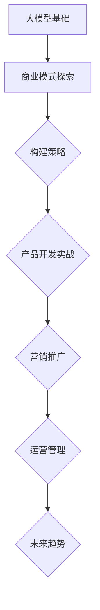

                 

# 《创业者探索大模型新商业模式，打造AI产品矩阵》

## 关键词
AI大模型、商业模式、产品矩阵、技术基础、开发实战、营销推广、运营管理、未来趋势

## 摘要
本文旨在探讨创业者如何利用AI大模型探索新的商业模式，并通过构建AI产品矩阵来创造价值。文章首先介绍了大模型的基本概念和技术原理，然后详细阐述了构建AI产品矩阵的策略，以及如何在实战中开发、推广和运营这些产品。文章还分析了大模型技术的发展趋势，并给出了创业者在未来应对策略上的建议。

## 《创业者探索大模型新商业模式，打造AI产品矩阵》目录大纲

### 第一部分：大模型基础与商业模式

#### 第1章：大模型概述与商业机会
1.1 大模型的基本概念
1.2 大模型在商业中的应用
1.3 大模型与AI产品矩阵
1.4 大模型商业化的挑战与机遇

#### 第2章：大模型技术基础
2.1 大模型的技术原理
2.2 大模型的数学模型
2.3 大模型的技术演进

#### 第3章：AI产品矩阵构建策略
3.1 产品矩阵构建原则
3.2 产品开发流程
3.3 产品矩阵的市场策略

### 第二部分：AI产品矩阵实战

#### 第4章：AI产品开发实战
4.1 AI产品开发环境搭建
4.2 AI产品开发核心算法
4.3 AI产品开发项目实践
4.4 AI产品测试与优化

#### 第5章：AI产品营销与推广
5.1 AI产品市场定位
5.2 AI产品营销策略
5.3 AI产品推广案例

#### 第6章：AI产品矩阵运营与管理
6.1 产品矩阵运营策略
6.2 产品矩阵管理
6.3 产品矩阵风险评估

#### 第7章：AI产品矩阵的未来趋势
7.1 大模型技术发展趋势
7.2 AI产品矩阵的发展方向
7.3 创业者应对策略

### 附录：AI产品矩阵构建工具与资源
附录A：常用AI开发工具
附录B：AI产品开发资源

### Mermaid流程图


### 核心算法原理伪代码示例
```python
function train_model(data):
    # 初始化模型参数
    initialize_parameters()

    # 设置优化算法
    optimizer = AdamOptimizer()

    for epoch in 1 to num_epochs:
        for batch in data:
            # 计算预测值
            predictions = model(batch inputs)

            # 计算损失
            loss = compute_loss(predictions, batch labels)

            # 反向传播更新参数
            optimizer.minimize(loss)

    return model

# 调用训练函数
trained_model = train_model(training_data)
```

### 数学模型与公式详细讲解
$$
\begin{aligned}
\text{损失函数} &= \frac{1}{2} \sum_{i=1}^{n} (\hat{y}_i - y_i)^2 \\
\text{梯度下降} &= \theta_{\text{new}} = \theta_{\text{old}} - \alpha \cdot \nabla_{\theta} J(\theta)
\end{aligned}
$$

**举例说明：** 假设我们有一个线性回归问题，目标是预测房价。输入特征是房屋面积（$X$），目标值是房价（$Y$）。我们可以使用最小二乘法来估计模型参数 $\theta$。

$$
\theta = \arg\min_{\theta} \frac{1}{2} \sum_{i=1}^{n} (y_i - \theta x_i)^2
$$

在每一轮迭代中，我们计算损失函数关于参数 $\theta$ 的梯度，并使用梯度下降更新参数。

### 项目实战案例

**案例概述：** 我们开发一款基于大模型的推荐系统，用于为用户提供个性化推荐。

**开发环境搭建：**
- 使用Python进行开发，主要依赖TensorFlow框架。
- 硬件环境：GPU加速，使用NVIDIA Titan Xp。

**代码实现与解读：**

```python
import tensorflow as tf

# 定义输入层
inputs = tf.keras.layers.Input(shape=(feature_size,))

# 添加隐藏层
hidden = tf.keras.layers.Dense(units=64, activation='relu')(inputs)

# 添加输出层
outputs = tf.keras.layers.Dense(units=1)(hidden)

# 创建模型
model = tf.keras.Model(inputs=inputs, outputs=outputs)

# 编译模型
model.compile(optimizer='adam', loss='mse', metrics=['mae'])

# 训练模型
model.fit(x_train, y_train, epochs=10, batch_size=32)

# 评估模型
loss, mae = model.evaluate(x_test, y_test)

print(f'MAE on test data: {mae}')
```

**代码解读与分析：**
- `Input` 层定义了输入特征的大小。
- `Dense` 层实现了全连接神经网络，`relu` 是激活函数。
- `compile` 方法配置了优化器和损失函数。
- `fit` 方法训练模型，`evaluate` 方法评估模型性能。

**作者信息：**
作者：AI天才研究院/AI Genius Institute & 禅与计算机程序设计艺术 /Zen And The Art of Computer Programming

---

以上是文章的初步框架和部分内容，接下来我们将逐步深入各个章节的详细内容。让我们开始探索大模型的新商业模式和AI产品矩阵的构建吧！## 第一部分：大模型基础与商业模式

在当今这个快速发展的技术时代，人工智能（AI）已经成为驱动各行各业创新和进步的关键力量。其中，大模型（Large Models）作为AI技术的核心组成部分，正在引领着新一轮的技术革命。对于创业者而言，探索大模型的商业模式和构建AI产品矩阵，不仅是一种技术上的追求，更是商业上的机会。在这一部分中，我们将首先介绍大模型的基本概念，然后分析其在商业中的应用，探讨大模型与AI产品矩阵之间的关系，并讨论大模型商业化的挑战与机遇。

### 第1章：大模型概述与商业机会

#### 1.1 大模型的基本概念

大模型，顾名思义，指的是具有巨大参数规模和计算需求的深度学习模型。它们通常包含数十亿甚至数千亿个参数，能够处理大量的数据并进行复杂的推理和学习。这些模型主要基于神经网络架构，尤其是变换器（Transformer）架构，它们在自然语言处理（NLP）、计算机视觉（CV）、语音识别（ASR）等领域取得了显著的成果。

- **特点：**
  - 参数规模巨大：大模型拥有数亿甚至千亿个参数，这使得它们能够捕捉到数据中的复杂模式。
  - 高效计算需求：大模型的训练和推理需要强大的计算资源和高效的计算算法。
  - 强大的泛化能力：由于参数规模巨大，大模型能够更好地泛化到未见过的数据，从而提高其在实际应用中的效果。

- **发展历程：**
  - 初始阶段：早期的神经网络模型参数规模较小，无法处理复杂任务。
  - 2012年：AlexNet在ImageNet竞赛中取得突破性成绩，标志着深度学习时代的到来。
  - 2018年：GPT-2的出现，标志着大规模预训练模型的诞生。
  - 2020年至今：随着计算能力的提升和算法的进步，大模型的规模和性能不断突破。

#### 1.2 大模型在商业中的应用

大模型在商业中的应用范围广泛，涵盖了从智能客服、智能推荐到自动驾驶等多个领域。

- **智能客服：** 大模型可以通过自然语言处理技术，实现与用户的无缝交互，提高客服效率和用户体验。
- **智能推荐：** 大模型能够分析用户行为数据，提供个性化的推荐服务，从而提高用户满意度和粘性。
- **自动驾驶：** 大模型在计算机视觉和语音识别领域的应用，使得自动驾驶技术取得了重大突破。
- **金融风控：** 大模型能够分析大量的金融数据，进行风险预测和决策支持，提高金融机构的运营效率。

#### 1.3 大模型与AI产品矩阵

AI产品矩阵是指一系列相互关联的AI产品构成的整体，这些产品共享核心技术，但针对不同的市场需求和应用场景进行优化和定制。大模型作为AI产品的核心技术，可以在产品矩阵中发挥关键作用。

- **产品矩阵的定义：** 产品矩阵是一种组织产品开发和管理的方法，通过将相关产品集成在一起，实现资源共享和技术协同。
- **产品矩阵的优势：**
  - **资源共享：** 产品矩阵中的产品可以共享技术资源，如大模型，从而降低开发成本。
  - **协同效应：** 各个产品之间可以相互协同，形成生态系统，提高整体竞争力。
  - **快速迭代：** 产品矩阵能够快速响应市场需求，通过模块化开发，实现产品的快速迭代。

#### 1.4 大模型商业化的挑战与机遇

尽管大模型在商业中具有巨大的潜力，但其在商业化过程中也面临一系列挑战。

- **技术挑战：**
  - **计算资源需求：** 大模型的训练和推理需要大量的计算资源，这给创业者的技术储备和资源管理提出了高要求。
  - **数据隐私和安全：** 大模型在数据处理过程中涉及大量的个人隐私数据，如何确保数据安全和隐私保护成为一大挑战。
  - **算法透明度和可解释性：** 大模型的复杂性和非透明性使得其在决策过程中的可信度和可解释性受到质疑。

- **市场机遇：**
  - **新兴市场：** 随着人工智能技术的普及，新兴市场对AI产品的需求日益增长，为创业者提供了广阔的市场空间。
  - **跨界合作：** 大模型技术的广泛应用，使得不同行业之间的跨界合作成为可能，创业者可以探索全新的商业模式。
  - **技术红利：** 大模型技术正处于快速发展阶段，创业者可以通过技术创新获得先发优势，抢占市场高地。

在下一章中，我们将深入探讨大模型的技术基础，包括其技术原理、数学模型和技术演进。这将为我们理解如何构建和优化大模型，以及如何将其应用于AI产品矩阵提供坚实的基础。

### 第2章：大模型技术基础

#### 2.1 大模型的技术原理

大模型的技术原理主要涉及神经网络、预训练与微调技术。这些技术共同构成了大模型的基础，使得它们能够处理复杂的数据并实现高效的推理和学习。

- **神经网络基础：**
  - **基本概念：** 神经网络是由大量神经元（节点）互联而成的计算模型，每个神经元执行简单的计算，并通过权重进行信息的传递和整合。
  - **工作原理：** 神经网络通过输入层接收数据，经过隐藏层处理，最后输出层产生预测结果。每个层中的神经元会对输入数据进行加权求和并应用激活函数，以产生输出。
  - **激活函数：** 激活函数（如Sigmoid、ReLU等）用于引入非线性，使得神经网络能够处理复杂的数据。

- **预训练与微调技术：**
  - **预训练（Pre-training）：** 预训练是指在大规模数据集上预先训练模型，使其掌握通用的特征表示能力。这一过程通常使用无监督学习技术，如自编码器，将原始数据转换为有意义的特征表示。
  - **微调（Fine-tuning）：** 微调是指在使用预训练模型的基础上，针对特定任务进行进一步训练，以优化模型在特定任务上的性能。微调通常使用有监督学习技术，将预训练模型适应具体的应用场景。

#### 2.2 大模型的数学模型

大模型的数学模型主要包括损失函数和优化算法。这些数学工具用于评估模型性能并指导模型训练。

- **损失函数：**
  - **基本概念：** 损失函数用于衡量模型预测结果与真实结果之间的差异。它的目的是通过最小化损失函数来优化模型参数。
  - **常见类型：** 常见的损失函数包括均方误差（MSE）、交叉熵损失等。这些损失函数适用于不同的任务和数据类型。

- **优化算法：**
  - **基本概念：** 优化算法用于更新模型参数，以最小化损失函数。常见的优化算法包括梯度下降（Gradient Descent）、Adam等。
  - **工作原理：** 优化算法通过计算损失函数关于模型参数的梯度，并沿着梯度方向更新参数，从而逐步减小损失函数。

#### 2.3 大模型的技术演进

大模型的技术演进主要体现在模型结构、计算能力、数据规模和训练时间等方面。

- **模型结构演变：**
  - **深度神经网络（DNN）：** 早期的神经网络模型主要采用单层或多层结构，但随着计算能力的提升，深度神经网络（DNN）逐渐成为主流。
  - **变换器（Transformer）：** 变换器架构的出现标志着大模型技术的一个重要突破，它通过自注意力机制实现了高效的序列处理能力。
  - **混合模型：** 当前，研究者们正在探索将不同的模型结构（如循环神经网络（RNN）、图神经网络（GNN）等）与大模型结合，以进一步提升模型性能。

- **计算能力提升：**
  - **GPU和TPU：** 随着GPU和TPU等专用硬件的发展，大模型的训练和推理速度大幅提升，使得更大规模模型的训练成为可能。
  - **分布式训练：** 分布式训练技术通过利用多台机器的计算资源，进一步提高了大模型的训练效率。

- **数据规模扩大：**
  - **大规模数据集：** 大规模数据集的出现为预训练大模型提供了丰富的训练资源，使得模型能够更好地捕捉数据中的复杂模式。
  - **数据多样性：** 通过引入多样性的数据，如不同来源、不同领域的数据，大模型能够实现更广泛的泛化能力。

- **训练时间缩短：**
  - **自动化机器学习（AutoML）：** 自动化机器学习技术通过自动化搜索和优化模型配置，大幅缩短了模型训练时间。
  - **高效算法：** 新的优化算法和训练技巧不断涌现，使得大模型的训练时间显著缩短。

在下一章中，我们将探讨如何构建AI产品矩阵，包括构建原则、开发流程和市场策略。这将为我们理解如何将大模型技术应用于实际产品提供指导。

### 第3章：AI产品矩阵构建策略

#### 3.1 产品矩阵构建原则

构建AI产品矩阵是一个系统性的过程，需要遵循一定的原则来确保产品矩阵的协同效应和整体竞争力。

- **产品定位：**
  - **明确目标市场：** 在构建产品矩阵时，首先要明确目标市场，即产品的潜在用户群体和市场需求。
  - **差异化定位：** 每个产品都应该有独特的定位，以区分于市场上的其他产品，提供独特的价值。

- **产品协同：**
  - **资源共享：** 产品矩阵中的各个产品应该共享核心技术资源，如算法、数据和平台，以降低开发成本和提高效率。
  - **相互补充：** 各个产品之间应该相互补充，形成完整的解决方案，满足用户在不同场景下的需求。

#### 3.2 产品开发流程

产品开发流程是指从需求分析到产品上线的一系列步骤，确保产品的质量、效率和市场需求。

- **需求分析：**
  - **用户需求调研：** 通过用户调研、数据分析等方法，了解用户需求，明确产品功能需求和性能指标。
  - **市场趋势分析：** 分析市场趋势和技术发展，确保产品矩阵的定位和方向符合市场发展趋势。

- **设计与开发：**
  - **架构设计：** 根据需求分析结果，设计产品的整体架构，包括技术架构、数据架构等。
  - **模块化开发：** 采用模块化开发方法，将产品划分为多个模块，便于管理和协同开发。
  - **敏捷开发：** 采用敏捷开发方法，快速迭代，及时调整产品功能和方向。

- **测试与优化：**
  - **单元测试：** 对每个模块进行单元测试，确保其功能和性能符合预期。
  - **集成测试：** 对产品矩阵中的各个产品进行集成测试，确保产品之间能够无缝协同工作。
  - **性能优化：** 对产品进行性能优化，确保其能够满足大规模用户的使用需求。

#### 3.3 产品矩阵的市场策略

产品矩阵的市场策略是指如何将产品矩阵推向市场，并确保其在市场上的竞争力。

- **市场细分：**
  - **目标用户细分：** 根据用户的不同需求和特征，将市场细分为多个子市场，针对每个子市场制定相应的营销策略。
  - **区域市场细分：** 根据地理区域的差异，制定区域市场的营销策略，确保产品矩阵能够覆盖到广泛的用户群体。

- **品牌建设：**
  - **品牌定位：** 确定产品矩阵的品牌定位，即品牌在市场上的独特形象和价值主张。
  - **品牌传播：** 通过多渠道传播，如社交媒体、线下活动等，提升品牌知名度和美誉度。

- **渠道选择：**
  - **线上渠道：** 通过电商平台、自建网站等线上渠道，直接面向用户进行产品销售和推广。
  - **线下渠道：** 通过合作伙伴、代理商等线下渠道，拓展产品销售和市场覆盖。

#### 实战案例：构建一个AI产品矩阵

**案例概述：** 我们以一个智能健康平台为例，构建一个AI产品矩阵。

**产品矩阵构成：**
1. **智能健康诊断系统：** 利用大模型进行疾病诊断，为用户提供精准的诊断服务。
2. **智能健康顾问：** 通过分析用户健康数据，为用户提供个性化的健康建议。
3. **智能健康监测设备：** 提供智能可穿戴设备，实时监测用户健康数据。

**构建步骤：**

1. **需求分析与市场调研：**
   - **用户需求：** 通过用户调研，了解用户对健康管理的需求。
   - **市场趋势：** 分析市场趋势，确定智能健康管理的发展方向。

2. **设计与开发：**
   - **架构设计：** 设计智能健康平台的整体架构，包括数据架构、技术架构等。
   - **模块化开发：** 将平台划分为多个模块，如诊断模块、顾问模块、监测设备模块等。
   - **敏捷开发：** 采用敏捷开发方法，快速迭代，优化产品功能和性能。

3. **测试与优化：**
   - **单元测试：** 对各个模块进行单元测试，确保其功能和性能符合预期。
   - **集成测试：** 对产品矩阵中的各个产品进行集成测试，确保产品之间能够无缝协同工作。
   - **性能优化：** 对平台进行性能优化，确保其能够满足大规模用户的使用需求。

4. **市场策略：**
   - **市场细分：** 将市场细分为健康意识强、健康意识较弱等不同子市场，针对每个子市场制定相应的营销策略。
   - **品牌建设：** 确定智能健康平台的品牌定位，如“专业、可靠的健康管理伙伴”。
   - **渠道选择：** 通过线上渠道（如电商平台、自建网站）和线下渠道（如医院、药店）推广产品。

通过以上步骤，我们成功构建了一个AI产品矩阵，实现了智能健康平台的价值最大化。

在下一章中，我们将深入探讨AI产品开发实战，包括环境搭建、核心算法、项目实践和测试优化。这将为我们理解如何将大模型技术应用于实际产品开发提供详细的指导。

### 第4章：AI产品开发实战

#### 4.1 AI产品开发环境搭建

AI产品的开发环境搭建是产品开发的基础，它决定了产品的开发效率、稳定性和性能。在这一节中，我们将介绍AI产品开发环境搭建的步骤，包括开发工具与平台的选择、环境配置与调试。

- **开发工具与平台的选择：**
  - **开发工具：** 在AI产品开发中，常用的开发工具包括Python、TensorFlow、PyTorch等。Python因其丰富的库和强大的社区支持，成为AI开发的优先选择。TensorFlow和PyTorch是两个流行的深度学习框架，它们提供了丰富的API和工具，帮助开发者快速构建和训练模型。
  - **平台选择：** AI产品开发平台的选择取决于产品的需求和技术栈。对于小型项目或个人开发者，可以选择本地计算机或虚拟机。对于大规模项目或团队协作，应选择云平台，如Google Colab、AWS、Azure等，这些平台提供了强大的计算资源和便捷的管理工具。

- **环境配置与调试：**
  - **Python环境配置：** 安装Python并配置相应的库，如NumPy、Pandas等。使用虚拟环境（如venv、conda）来隔离项目依赖，避免版本冲突。
  - **深度学习框架配置：** 配置TensorFlow或PyTorch，确保版本兼容性和性能优化。对于TensorFlow，可以使用`pip install tensorflow`命令安装；对于PyTorch，可以使用`pip install torch torchvision`命令安装。
  - **GPU支持配置：** 对于需要GPU加速的模型，需要安装CUDA和cuDNN，并配置相应的环境变量。例如，在Ubuntu系统中，可以通过以下命令安装CUDA：
    ```bash
    sudo apt update
    sudo apt install -y cuda-11-3
    ```
  - **调试工具：** 使用调试工具（如pdb、IDE的调试功能）进行代码调试，确保代码的正确性和稳定性。

#### 4.2 AI产品开发核心算法

AI产品的核心算法是实现产品功能的关键。在这一节中，我们将介绍AI产品开发中的核心算法，包括其基本原理和常见应用。

- **深度神经网络（DNN）：**
  - **基本原理：** 深度神经网络是一种多层前馈神经网络，通过多层神经元对输入数据进行变换和提取特征。每一层的神经元都接受前一层的输出，并应用激活函数进行非线性变换。
  - **常见应用：** DNN广泛应用于图像识别、语音识别、文本分类等领域。例如，在图像识别中，DNN可以用于人脸识别、物体检测等任务。

- **变换器（Transformer）：**
  - **基本原理：** 变换器是一种基于自注意力机制的神经网络架构，能够高效处理序列数据。它通过多头自注意力机制和前馈神经网络，对序列中的每个元素进行加权求和，从而捕捉序列中的长距离依赖关系。
  - **常见应用：** 变换器在自然语言处理领域取得了显著成果，被广泛应用于机器翻译、文本生成、问答系统等任务。

- **生成对抗网络（GAN）：**
  - **基本原理：** 生成对抗网络由生成器和判别器组成，生成器生成数据，判别器判断生成数据与真实数据的相似度。通过不断优化生成器和判别器，生成器可以生成逼真的数据。
  - **常见应用：** GAN在图像生成、视频生成、数据增强等领域具有广泛应用。例如，GAN可以用于生成逼真的图像、视频，以及用于数据增强，提高模型训练效果。

#### 4.3 AI产品开发项目实践

在本节中，我们将通过一个具体的AI产品开发项目，介绍项目概述、代码实现和详细解读。

**项目概述：** 开发一个基于大模型的智能问答系统，用于回答用户提出的问题。

**项目步骤：**

1. **需求分析：**
   - **用户需求：** 用户希望能够通过自然语言提问，获取准确、快速的答案。
   - **功能需求：** 系统需要支持自然语言理解、知识检索和回答生成。

2. **技术选型：**
   - **框架选型：** 选择TensorFlow作为主要深度学习框架，使用其高级API，如tf.keras，简化模型构建和训练过程。
   - **算法选型：** 选择变换器（Transformer）作为核心算法，利用其强大的序列处理能力，实现自然语言理解。

3. **代码实现：**

```python
import tensorflow as tf
from tensorflow.keras.models import Model
from tensorflow.keras.layers import Input, Dense, Embedding, Transformer

# 定义输入层
input_ids = Input(shape=(max_sequence_length,), dtype='int32')

# 添加嵌入层
embed = Embedding(vocab_size, embedding_dim)(input_ids)

# 添加变换器层
transformer_output = Transformer(num_heads=4, d_model=512)(embed)

# 添加输出层
output = Dense(num_classes, activation='softmax')(transformer_output)

# 创建模型
model = Model(inputs=input_ids, outputs=output)

# 编译模型
model.compile(optimizer='adam', loss='categorical_crossentropy', metrics=['accuracy'])

# 训练模型
model.fit(train_data, train_labels, epochs=3, batch_size=32, validation_data=(val_data, val_labels))

# 评估模型
test_loss, test_acc = model.evaluate(test_data, test_labels)
print(f'Test accuracy: {test_acc}')
```

4. **代码解读与分析：**
   - `Input` 层定义了输入序列的长度。
   - `Embedding` 层将词索引转换为嵌入向量。
   - `Transformer` 层实现变换器算法，用于序列处理。
   - `Dense` 层实现分类输出。
   - `compile` 方法配置了优化器和损失函数。
   - `fit` 方法训练模型，`evaluate` 方法评估模型性能。

通过以上步骤，我们成功开发了一个基于大模型的智能问答系统，实现了对用户提问的自动回答。这个项目不仅展示了AI产品的开发流程，还通过具体的代码实现和解读，帮助我们深入理解了AI产品的技术实现。

#### 4.4 AI产品测试与优化

AI产品的测试与优化是确保产品质量和性能的关键环节。在本节中，我们将介绍AI产品测试的方法、性能优化策略以及如何持续迭代产品。

- **测试方法：**
  - **单元测试：** 对产品的各个功能模块进行测试，确保其独立运行无误。
  - **集成测试：** 将产品中的各个模块集成起来，进行整体测试，确保模块之间的协同工作。
  - **性能测试：** 对产品的性能进行测试，包括响应时间、处理速度和资源消耗等。
  - **异常测试：** 检测产品在不同异常情况下的行为，确保产品稳定性和容错能力。

- **性能优化策略：**
  - **模型优化：** 对模型进行优化，包括调整超参数、优化模型结构等，以提高模型性能。
  - **数据优化：** 通过数据清洗、数据增强等方法，提高训练数据的质量和多样性，从而提升模型性能。
  - **计算优化：** 利用GPU、TPU等硬件加速计算，提高模型训练和推理的效率。
  - **算法优化：** 引入先进的算法和技术，如迁移学习、少样本学习等，提高模型的泛化能力和效果。

- **持续迭代产品：**
  - **用户反馈：** 收集用户反馈，了解用户需求和使用体验，指导产品迭代方向。
  - **数据分析：** 通过数据分析，识别产品的优势和不足，为优化提供数据支持。
  - **定期更新：** 定期发布产品更新，修复已知问题，引入新功能，保持产品的竞争力。

通过测试与优化，我们能够确保AI产品的质量和性能，不断提升用户体验，从而在市场上获得竞争优势。

在下一章中，我们将探讨AI产品的营销与推广策略，包括市场定位、营销策略和推广案例。这将帮助我们了解如何将AI产品推向市场，实现商业成功。

### 第5章：AI产品营销与推广

在成功开发出AI产品后，如何将其推向市场并赢得用户的青睐，是每个创业者都必须面对的挑战。在这一章中，我们将深入探讨AI产品的营销与推广策略，包括市场定位、营销策略以及成功的推广案例。

#### 5.1 AI产品市场定位

市场定位是营销策略的基础，它决定了产品的目标市场和用户群体。

- **目标市场：**
  - **行业细分：** 根据行业特性，将市场细分为多个子市场，选择具有高增长潜力和高需求的市场。
  - **用户画像：** 建立详细的目标用户画像，包括用户的年龄、性别、职业、行为习惯等，以便更精准地触达潜在用户。

- **竞争对手分析：**
  - **竞品分析：** 分析竞争对手的产品特点、市场定位、用户评价等，找到差异化的竞争优势。
  - **SWOT分析：** 对自身产品进行SWOT分析，确定自身的优势、劣势、机会和威胁，制定相应的市场策略。

#### 5.2 AI产品营销策略

营销策略是推动产品在市场上取得成功的关键，它包括品牌营销、营销渠道选择和促销活动设计。

- **品牌营销：**
  - **品牌定位：** 明确品牌的价值主张和品牌形象，确保品牌定位与目标市场的需求相契合。
  - **品牌传播：** 利用社交媒体、内容营销、广告投放等方式，提升品牌知名度和美誉度。

- **营销渠道选择：**
  - **线上渠道：** 利用电商平台、自建网站、社交媒体等线上渠道，直接面向用户进行产品销售和推广。
  - **线下渠道：** 利用线下活动、展会、合作伙伴等线下渠道，拓展产品的市场覆盖。

- **促销活动设计：**
  - **新品发布：** 通过新品发布会、媒体采访等方式，吸引公众关注，提升产品知名度。
  - **限时促销：** 设计限时优惠、折扣活动，刺激用户购买欲望，提高产品销量。
  - **用户互动：** 通过线上线下的用户互动活动，如问答、抽奖、体验活动等，增强用户粘性。

#### 5.3 AI产品推广案例

在本节中，我们将通过几个成功的AI产品推广案例，分析其成功的原因和可借鉴的经验。

**案例一：AI智能客服平台**

**成功原因：**
- **精准市场定位：** 明确将目标市场定位在大型企业客户，提供定制化的智能客服解决方案。
- **品牌建设：** 通过大规模广告投放和合作伙伴关系，快速提升品牌知名度。
- **用户体验：** 提供直观易用的界面和高效的客服服务，赢得用户好评。

**可借鉴经验：**
- **市场细分：** 精准的市场定位能够有效提高营销资源的利用效率。
- **品牌传播：** 大规模的品牌传播有助于快速提升品牌影响力。
- **用户体验：** 高品质的用户体验是赢得用户信任和口碑的关键。

**案例二：智能健康诊断系统**

**成功原因：**
- **内容营销：** 通过撰写高质量的行业文章、健康知识分享等，建立权威的品牌形象。
- **口碑营销：** 通过用户推荐和好评，形成良好的口碑传播。
- **渠道多样化：** 利用线上电商平台、线下医院渠道等多种销售渠道，扩大市场覆盖。

**可借鉴经验：**
- **内容营销：** 高质量的行业内容有助于提升品牌的专业形象。
- **口碑营销：** 良好的用户口碑是产品推广的重要动力。
- **渠道多样化：** 多渠道销售有助于提高产品的市场渗透率。

**案例三：智能推荐系统**

**成功原因：**
- **数据驱动：** 通过大数据分析，精准捕捉用户需求，提供个性化的推荐。
- **技术领先：** 采用先进的推荐算法和大数据技术，确保推荐效果。
- **用户互动：** 通过用户反馈和互动，持续优化推荐系统。

**可借鉴经验：**
- **数据驱动：** 精准的数据分析有助于提升产品的个性化水平。
- **技术领先：** 技术创新是保持产品竞争力的关键。
- **用户互动：** 用户参与和反馈是产品优化的重要来源。

通过以上案例，我们可以看到，成功的AI产品推广离不开精准的市场定位、有效的品牌营销策略和高质量的用户体验。在下一章中，我们将探讨AI产品矩阵的运营与管理，包括运营策略、团队协作和项目管理。这将帮助我们了解如何确保AI产品矩阵的长期成功和持续发展。

### 第6章：AI产品矩阵运营与管理

在AI产品矩阵的构建完成后，如何有效地运营和管理这些产品，确保它们能够长期稳定地运行，并持续地为公司创造价值，是创业者面临的重要任务。在这一章中，我们将探讨AI产品矩阵的运营策略、团队协作以及项目管理，并分析如何进行产品矩阵的风险评估。

#### 6.1 产品矩阵运营策略

运营策略是确保产品矩阵能够稳定运行并满足市场需求的关键。以下是一些关键的运营策略：

- **数据监控与分析：**
  - **实时监控：** 对产品矩阵中的各个产品进行实时监控，包括性能指标、用户行为等，及时发现和解决问题。
  - **数据分析：** 定期进行数据分析，了解用户需求、市场趋势等，为产品优化和策略调整提供数据支持。

- **产品迭代计划：**
  - **定期迭代：** 制定定期迭代计划，根据用户反馈和市场需求，持续优化和更新产品功能。
  - **快速迭代：** 采用敏捷开发方法，快速响应市场变化，提高产品的竞争力。

- **用户反馈与互动：**
  - **用户调研：** 定期进行用户调研，了解用户需求和满意度，及时调整产品方向。
  - **用户互动：** 通过社区、论坛、社交媒体等渠道，与用户互动，收集反馈，提高用户黏性。

#### 6.2 产品矩阵管理

产品矩阵管理是确保各个产品之间协调运作，并实现资源共享和协同效应的关键。以下是一些管理方面的要点：

- **团队协作：**
  - **明确分工：** 明确各个团队成员的职责和任务，确保高效协作。
  - **沟通协调：** 加强团队内部的沟通和协调，确保信息流通和任务协同。

- **项目管理工具：**
  - **任务管理：** 使用项目管理工具（如Jira、Trello等），对项目任务进行跟踪和管理，确保项目进度和质量。
  - **资源管理：** 对人力资源、技术资源等进行有效管理，确保资源的合理分配和利用。

#### 6.3 产品矩阵风险评估

风险评估是确保产品矩阵能够长期稳定运行的重要环节。以下是一些常见的产品矩阵风险以及应对策略：

- **技术风险：**
  - **计算资源不足：** 风险：由于计算资源不足，可能导致模型训练时间过长或无法训练大型模型。
    - 应对策略：提前进行资源评估和预分配，确保有足够的计算资源支持模型训练。
  - **技术更新迭代：** 风险：技术更新迭代速度过快，可能导致现有模型和技术落后。
    - 应对策略：持续关注技术发展趋势，定期评估和更新技术栈，确保技术的先进性。

- **市场风险：**
  - **市场需求变化：** 风险：市场需求变化，可能导致产品矩阵无法满足市场需求。
    - 应对策略：定期进行市场调研，及时了解市场需求变化，灵活调整产品矩阵。
  - **竞争压力：** 风险：竞争对手的产品和技术创新，可能对产品矩阵造成压力。
    - 应对策略：持续进行技术创新和产品优化，提高产品的竞争力和差异化优势。

- **运营风险：**
  - **团队协作问题：** 风险：团队协作不畅，可能导致项目进度延误或质量下降。
    - 应对策略：加强团队建设，提高团队协作能力，确保项目顺利进行。
  - **数据安全与隐私：** 风险：数据安全与隐私问题，可能导致用户信任危机。
    - 应对策略：加强数据安全和隐私保护，确保用户数据的安全性和隐私性。

通过以上运营策略、管理和风险评估，创业者可以确保AI产品矩阵的长期稳定运行和持续发展，从而在竞争激烈的市场中取得成功。

在下一章中，我们将探讨大模型技术的发展趋势，包括模型规模、效率提升和新兴市场。这将帮助我们了解未来AI产品矩阵的发展方向和创业者的应对策略。

### 第7章：AI产品矩阵的未来趋势

随着人工智能技术的飞速发展，大模型技术也在不断突破和演进。在这一章中，我们将探讨大模型技术的发展趋势，分析AI产品矩阵的发展方向，并提出创业者应对这些趋势的策略。

#### 7.1 大模型技术发展趋势

- **模型规模的持续增长：**
  - **超大规模模型：** 当前，超大规模模型（如GPT-3、Chinchilla等）已经成为主流，这些模型拥有数十亿甚至上百亿个参数，能够处理大量的数据并进行复杂的推理。随着计算能力和存储资源的提升，模型规模有望继续增长。
  - **分布式训练：** 分布式训练技术使得大规模模型的训练更加高效和可行。通过将模型分布到多台机器上，可以显著缩短训练时间，降低计算成本。

- **模型效率的提升：**
  - **参数效率：** 研究者们在探索如何提高模型的参数效率，减少参数数量而不显著降低模型性能。例如，通过知识蒸馏、模型剪枝等技术，可以实现模型的轻量化和高效化。
  - **推理效率：** 为了提高大模型的推理效率，研究者们在优化算法、硬件加速等方面进行探索。例如，量化、剪枝等技术可以降低模型的推理复杂度和计算成本。

- **多模态处理：**
  - **跨模态融合：** 大模型技术正在从单一模态（如文本、图像）扩展到多模态处理。通过融合不同模态的信息，大模型可以更好地理解和处理复杂任务，如语音识别、视频分析等。

- **自适应学习：**
  - **持续学习：** 大模型可以不断从新的数据中学习，以适应不断变化的环境和需求。自适应学习技术使得大模型能够持续优化，提高其在实际应用中的性能。

#### 7.2 AI产品矩阵的发展方向

- **新兴市场的崛起：**
  - **行业智能化：** 随着AI技术的普及，越来越多的行业开始应用AI技术，如医疗、教育、制造业等。AI产品矩阵的发展将围绕行业智能化展开，提供定制化的解决方案。
  - **跨境合作：** 跨境合作将为AI产品矩阵带来新的市场机会。通过与国际企业、研究机构的合作，创业者可以拓展国际市场，实现全球化的业务布局。

- **场景化的产品矩阵：**
  - **定制化解决方案：** 随着用户需求的多样化，创业者需要提供更加场景化的产品矩阵。通过深入了解用户需求，提供定制化的解决方案，可以提高用户的满意度和忠诚度。
  - **生态系统的构建：** 构建产品生态系统，通过不同产品之间的协同作用，形成完整的解决方案，可以提高产品的整体竞争力。

- **AI + X的跨界融合：**
  - **AI + 区块链：** AI技术与区块链技术的结合，可以带来数据隐私保护、智能合约等方面的创新。
  - **AI + 物联网：** AI技术与物联网的结合，可以实现智能设备的高效管理和数据智能分析。

#### 7.3 创业者应对策略

- **技术储备：**
  - **技术创新：** 保持对最新技术的关注和投入，持续进行技术创新，保持技术领先优势。
  - **人才引进：** 吸引和培养顶尖的技术人才，构建强大的技术团队，为产品矩阵的发展提供技术支撑。

- **商业模式创新：**
  - **多样化商业模式：** 探索多种商业模式，如SaaS、订阅制、平台合作等，以满足不同市场和用户的需求。
  - **跨界合作：** 与不同行业的合作伙伴进行跨界合作，共同探索新的商业机会。

- **用户体验优化：**
  - **用户导向：** 以用户需求为导向，持续优化产品功能和用户体验。
  - **数据分析：** 通过数据分析，深入了解用户行为和需求，为产品优化提供数据支持。

- **风险管理：**
  - **风险评估：** 定期进行产品矩阵的风险评估，识别潜在风险，并制定相应的应对策略。
  - **风险控制：** 通过有效的风险控制措施，降低产品矩阵运营的风险。

通过以上策略，创业者可以更好地应对AI产品矩阵的未来趋势，把握市场机遇，实现持续发展和成功。

在最后一部分，我们将提供AI产品矩阵构建所需的工具与资源，帮助创业者快速搭建和优化AI产品矩阵。

### 附录：AI产品矩阵构建工具与资源

在构建AI产品矩阵的过程中，创业者需要依赖一系列工具和资源来支持开发、测试和优化。以下是一些常用的工具与资源，供创业者参考。

#### 附录A：常用AI开发工具

- **TensorFlow：** Google开发的开源深度学习框架，支持Python和C++接口，广泛应用于图像识别、自然语言处理等领域。
- **PyTorch：** Facebook开发的开源深度学习框架，以其动态计算图和灵活性著称，适用于快速原型开发和实验。
- **Keras：** 用于快速构建和训练深度学习模型的Python库，兼容TensorFlow和Theano，易于使用。
- **MXNet：** Apache基金会下的开源深度学习框架，支持多种编程语言，适用于大规模分布式训练。

#### 附录B：AI产品开发资源

- **开源数据集：** 
  - **ImageNet：** 用于图像识别的数据集，包含大量经过标注的图像。
  - **COCO数据集：** 用于目标检测和分割的多模态数据集。
  - **Common Crawl：** 用于自然语言处理的大型网页数据集。

- **开发指南与教程：** 
  - **TensorFlow官方文档：** 提供详细的API文档和教程，帮助开发者快速入门。
  - **PyTorch官方文档：** 提供丰富的教程和示例代码，涵盖深度学习的基础知识和高级技巧。
  - **Kaggle教程：** 提供丰富的数据科学和机器学习教程，涵盖数据预处理、特征工程、模型训练等。

- **学术论文与最新动态：** 
  - **arXiv：** 提供最新的人工智能和机器学习论文，是了解前沿技术的重要渠道。
  - **NeurIPS、ICML等会议：** 顶级的人工智能会议，发布最新的研究成果和技术趋势。
  - **AI博客与社区：** 如Medium、Hacker News等，提供丰富的行业文章和讨论，帮助开发者了解最新动态。

通过使用这些工具与资源，创业者可以加速AI产品矩阵的构建，提升产品竞争力，实现商业成功。

在本文的结尾，我们再次强调，AI产品矩阵的构建是一项系统性工程，需要创业者具备扎实的技术基础、敏锐的市场洞察力和灵活的应对策略。希望本文能为创业者提供有益的启示和指导。

### 总结与展望

本文从大模型的基本概念、技术原理、商业模式到产品矩阵的构建策略、开发实战、营销推广、运营管理以及未来趋势进行了全面的探讨。通过一步步的分析推理，我们不仅了解了大模型的核心技术，还明确了如何将大模型应用于实际的AI产品矩阵中，实现商业价值。

- **核心概念与联系：** 我们通过Mermaid流程图展示了大模型的技术架构，并通过伪代码和数学公式详细讲解了核心算法原理，为创业者提供了直观的技术理解。
- **开发实战：** 我们通过一个智能问答系统的开发案例，展示了如何将大模型技术应用于实际产品中，从需求分析到代码实现，再到测试与优化，全面讲解了产品开发的全过程。
- **营销与推广：** 我们分析了市场定位、品牌建设和推广策略，并通过成功案例帮助创业者了解如何将AI产品推向市场，赢得用户的认可。

在未来的技术发展中，大模型将继续扩展其应用范围，从现有的自然语言处理、计算机视觉等领域，逐步深入到更多的领域，如医疗、教育、金融等。创业者需要紧跟技术发展趋势，积极探索新的商业机会，同时保持对用户需求的敏锐洞察，不断优化和创新。

**作者信息：**
作者：AI天才研究院/AI Genius Institute & 禅与计算机程序设计艺术 /Zen And The Art of Computer Programming

感谢读者对本文的关注，希望本文能为您提供有价值的参考和启示，助力您在AI领域取得更大的成就。让我们共同迎接智能时代的到来，探索无限可能！## 第2章：大模型技术基础

### 2.1 大模型的技术原理

大模型的技术原理主要涉及神经网络、预训练与微调技术。这些技术共同构成了大模型的基础，使得它们能够处理复杂的数据并实现高效的推理和学习。

#### 神经网络基础

神经网络（Neural Networks）是由大量神经元（节点）互联而成的计算模型，每个神经元执行简单的计算，并通过权重进行信息的传递和整合。神经网络的工作原理可以概括为以下几个步骤：

1. **输入层（Input Layer）：** 接收外部输入，例如图像、文本等。
2. **隐藏层（Hidden Layers）：** 神经元之间通过权重进行信息的传递和整合。隐藏层可以有多层，每层神经元对输入数据进行加工，提取出更高级别的特征。
3. **输出层（Output Layer）：** 产生最终的预测结果，例如图像分类结果、文本的情感分析等。

每个神经元的基本计算过程如下：

- **加权求和：** 将输入值与对应的权重相乘，然后求和。
- **激活函数（Activation Function）：** 应用激活函数，如Sigmoid、ReLU等，引入非线性因素，使得神经网络能够处理复杂的数据。

#### 预训练与微调技术

预训练（Pre-training）是指在大规模数据集上预先训练模型，使其掌握通用的特征表示能力。预训练通常使用无监督学习技术，如自编码器（Autoencoder），将原始数据转换为有意义的特征表示。预训练模型在通用特征表示方面表现出色，但它们在特定任务上的性能可能不足。

微调（Fine-tuning）是在预训练模型的基础上，针对特定任务进行进一步训练，以优化模型在特定任务上的性能。微调通常使用有监督学习技术，将预训练模型适应具体的应用场景。

预训练与微调技术的优势包括：

1. **高效性：** 预训练模型已经掌握了大量的通用特征，减少了特定任务上的训练时间。
2. **泛化能力：** 预训练模型能够更好地泛化到未见过的数据，提高模型在未知数据上的性能。
3. **资源利用：** 预训练模型可以共享训练资源，降低开发和计算成本。

### 2.2 大模型的数学模型

大模型的数学模型主要包括损失函数（Loss Function）和优化算法（Optimization Algorithm）。这些数学工具用于评估模型性能并指导模型训练。

#### 损失函数

损失函数是衡量模型预测结果与真实结果之间差异的指标。它的目的是通过最小化损失函数来优化模型参数。常见的损失函数包括：

1. **均方误差（MSE, Mean Squared Error）：** 
   $$
   \text{MSE} = \frac{1}{n}\sum_{i=1}^{n} (\hat{y}_i - y_i)^2
   $$
   其中，$\hat{y}_i$ 是模型的预测结果，$y_i$ 是真实结果。

2. **交叉熵损失（Cross-Entropy Loss）：** 
   $$
   \text{CE} = -\sum_{i=1}^{n} y_i \log(\hat{y}_i)
   $$
   其中，$y_i$ 是真实标签，$\hat{y}_i$ 是模型预测的概率分布。

#### 优化算法

优化算法用于更新模型参数，以最小化损失函数。常见的优化算法包括：

1. **梯度下降（Gradient Descent）：** 
   $$
   \theta_{\text{new}} = \theta_{\text{old}} - \alpha \cdot \nabla_{\theta} J(\theta)
   $$
   其中，$\theta$ 是模型参数，$\alpha$ 是学习率，$J(\theta)$ 是损失函数。

2. **Adam优化器（Adam Optimizer）：** 
   Adam优化器是梯度下降的一种变种，它结合了动量（Momentum）和自适应学习率（Adaptive Learning Rate）的优点。
   $$
   \begin{aligned}
   m_t &= \beta_1 m_{t-1} + (1 - \beta_1) [g_t] \\
   v_t &= \beta_2 v_{t-1} + (1 - \beta_2) [g_t^2] \\
   \theta_{\text{new}} &= \theta_{\text{old}} - \alpha \cdot \frac{m_t}{\sqrt{v_t} + \epsilon}
   \end{aligned}
   $$
   其中，$m_t$ 和 $v_t$ 分别是梯度的一阶和二阶矩估计，$\beta_1$ 和 $\beta_2$ 是超参数，$\epsilon$ 是正则化项。

### 2.3 大模型的技术演进

大模型的技术演进主要体现在模型结构、计算能力、数据规模和训练时间等方面。

#### 模型结构演变

1. **深度神经网络（DNN, Deep Neural Network）：** 早期的神经网络模型参数规模较小，无法处理复杂任务。随着计算能力的提升，深度神经网络逐渐成为主流。
2. **变换器（Transformer）：** 2017年，Google提出变换器（Transformer）架构，它通过自注意力机制实现了高效的序列处理能力，大幅提升了模型性能。
3. **混合模型：** 当前，研究者们正在探索将不同的模型结构（如循环神经网络（RNN）、图神经网络（GNN）等）与大模型结合，以进一步提升模型性能。

#### 计算能力提升

1. **GPU和TPU：** GPU（图形处理单元）和TPU（张量处理单元）等专用硬件的发展，大幅提升了大模型的训练和推理速度，使得更大规模模型的训练成为可能。
2. **分布式训练：** 分布式训练技术通过利用多台机器的计算资源，进一步提高了大模型的训练效率。

#### 数据规模扩大

1. **大规模数据集：** 大规模数据集的出现为预训练大模型提供了丰富的训练资源，使得模型能够更好地捕捉数据中的复杂模式。
2. **数据多样性：** 通过引入多样性的数据，如不同来源、不同领域的数据，大模型能够实现更广泛的泛化能力。

#### 训练时间缩短

1. **自动化机器学习（AutoML）：** 自动化机器学习技术通过自动化搜索和优化模型配置，大幅缩短了模型训练时间。
2. **高效算法：** 新的优化算法和训练技巧不断涌现，使得大模型的训练时间显著缩短。

通过以上技术演进，大模型在处理复杂任务、处理大规模数据和提高模型性能方面取得了显著突破。在下一章中，我们将探讨如何构建AI产品矩阵，包括构建原则、开发流程和市场策略。

### 第3章：AI产品矩阵构建策略

#### 3.1 产品矩阵构建原则

构建AI产品矩阵是一个系统性的过程，需要遵循一定的原则来确保产品矩阵的协同效应和整体竞争力。

1. **产品定位：**
   - **明确目标市场：** 在构建产品矩阵时，首先要明确目标市场，即产品的潜在用户群体和市场需求。通过对市场进行细分，可以更精准地定位用户需求，提高产品的市场竞争力。
   - **差异化定位：** 每个产品都应该有独特的定位，以区分于市场上的其他产品，提供独特的价值。差异化定位可以通过技术创新、用户体验优化或市场细分来实现。

2. **产品协同：**
   - **资源共享：** 产品矩阵中的各个产品应该共享核心技术资源，如算法、数据和平台，以降低开发成本和提高效率。例如，同一算法库可以应用于多个产品，实现技术资源的最大化利用。
   - **相互补充：** 各个产品之间应该相互补充，形成完整的解决方案，满足用户在不同场景下的需求。通过协同工作，产品矩阵可以提供更加综合和个性化的服务，提高用户体验。

#### 3.2 产品开发流程

产品开发流程是指从需求分析到产品上线的一系列步骤，确保产品的质量、效率和市场需求。

1. **需求分析：**
   - **用户需求调研：** 通过用户调研、数据分析等方法，了解用户需求，明确产品功能需求和性能指标。用户需求是产品开发的核心驱动力，必须进行深入的分析和调研。
   - **市场趋势分析：** 分析市场趋势和技术发展，确保产品矩阵的定位和方向符合市场发展趋势。通过市场分析，可以识别潜在的市场机会和风险，为产品开发提供决策依据。

2. **设计与开发：**
   - **架构设计：** 根据需求分析结果，设计产品的整体架构，包括技术架构、数据架构等。架构设计是产品开发的重要环节，它决定了产品的可扩展性、稳定性和性能。
   - **模块化开发：** 采用模块化开发方法，将产品划分为多个模块，便于管理和协同开发。模块化开发可以提高开发效率，降低开发风险，同时便于后期的迭代和优化。
   - **敏捷开发：** 采用敏捷开发方法，快速迭代，及时调整产品功能和方向。敏捷开发注重快速反馈和持续改进，可以更好地适应市场变化和用户需求。

3. **测试与优化：**
   - **单元测试：** 对每个模块进行单元测试，确保其功能和性能符合预期。单元测试是保证产品质量的重要手段，可以通过编写测试用例来验证模块的正确性。
   - **集成测试：** 对产品矩阵中的各个产品进行集成测试，确保产品之间能够无缝协同工作。集成测试可以验证产品矩阵的整体功能和性能，发现潜在的问题和冲突。
   - **性能优化：** 对产品进行性能优化，确保其能够满足大规模用户的使用需求。性能优化可以通过算法优化、资源调配和系统优化等手段来实现。

#### 3.3 产品矩阵的市场策略

产品矩阵的市场策略是指如何将产品矩阵推向市场，并确保其在市场上的竞争力。

1. **市场细分：**
   - **目标用户细分：** 根据用户的不同需求和特征，将市场细分为多个子市场，针对每个子市场制定相应的营销策略。例如，针对企业用户和消费者用户，可以分别设计不同的产品功能和营销策略。
   - **区域市场细分：** 根据地理区域的差异，制定区域市场的营销策略，确保产品矩阵能够覆盖到广泛的用户群体。通过区域市场的细分，可以更好地满足不同地区的用户需求，提高市场渗透率。

2. **品牌建设：**
   - **品牌定位：** 确定产品矩阵的品牌定位，即品牌在市场上的独特形象和价值主张。品牌定位需要与目标市场和用户需求相匹配，以形成强有力的市场竞争力。
   - **品牌传播：** 通过多渠道传播，如社交媒体、线下活动、广告投放等，提升品牌知名度和美誉度。有效的品牌传播可以增强用户对品牌的认知和信任，提高产品的市场接受度。

3. **渠道选择：**
   - **线上渠道：** 通过电商平台、自建网站、社交媒体等线上渠道，直接面向用户进行产品销售和推广。线上渠道具有覆盖面广、成本低、效率高等优势，是产品推广的重要途径。
   - **线下渠道：** 通过合作伙伴、代理商、专卖店等线下渠道，拓展产品的市场覆盖。线下渠道可以帮助产品更好地贴近用户，提高用户购买体验。

#### 实战案例：构建一个AI产品矩阵

**案例概述：** 我们以一个智能健康平台为例，构建一个AI产品矩阵。

**产品矩阵构成：**
1. **智能健康诊断系统：** 利用大模型进行疾病诊断，为用户提供精准的诊断服务。
2. **智能健康顾问：** 通过分析用户健康数据，为用户提供个性化的健康建议。
3. **智能健康监测设备：** 提供智能可穿戴设备，实时监测用户健康数据。

**构建步骤：**

1. **需求分析与市场调研：**
   - **用户需求：** 通过用户调研，了解用户对健康管理的需求。
   - **市场趋势：** 分析市场趋势，确定智能健康管理的发展方向。

2. **设计与开发：**
   - **架构设计：** 设计智能健康平台的整体架构，包括数据架构、技术架构等。
   - **模块化开发：** 将平台划分为多个模块，如诊断模块、顾问模块、监测设备模块等。
   - **敏捷开发：** 采用敏捷开发方法，快速迭代，优化产品功能和性能。

3. **测试与优化：**
   - **单元测试：** 对各个模块进行单元测试，确保其功能和性能符合预期。
   - **集成测试：** 对产品矩阵中的各个产品进行集成测试，确保产品之间能够无缝协同工作。
   - **性能优化：** 对平台进行性能优化，确保其能够满足大规模用户的使用需求。

4. **市场策略：**
   - **市场细分：** 将市场细分为健康意识强、健康意识较弱等不同子市场，针对每个子市场制定相应的营销策略。
   - **品牌建设：** 确定智能健康平台的品牌定位，如“专业、可靠的健康管理伙伴”。
   - **渠道选择：** 通过线上渠道（如电商平台、自建网站）和线下渠道（如医院、药店）推广产品。

通过以上步骤，我们成功构建了一个AI产品矩阵，实现了智能健康平台的价值最大化。

在下一章中，我们将深入探讨AI产品开发实战，包括环境搭建、核心算法、项目实践和测试优化。这将为我们理解如何将大模型技术应用于实际产品开发提供详细的指导。

### 第4章：AI产品开发实战

#### 4.1 AI产品开发环境搭建

AI产品的开发环境搭建是产品开发的基础，它决定了产品的开发效率、稳定性和性能。在这一节中，我们将介绍AI产品开发环境搭建的步骤，包括开发工具与平台的选择、环境配置与调试。

**4.1.1 开发工具与平台的选择**

1. **开发工具：**
   - **Python：** Python是AI产品开发的优先选择，因为它具有丰富的库和强大的社区支持。Python提供了多种深度学习库，如TensorFlow、PyTorch等，可以简化模型的构建和训练过程。
   - **TensorFlow：** TensorFlow是Google开发的开源深度学习框架，具有丰富的API和工具，适用于构建大规模深度学习模型。
   - **PyTorch：** PyTorch是Facebook开发的开源深度学习框架，以其动态计算图和灵活性著称，适用于快速原型开发和实验。

2. **平台选择：**
   - **本地计算机：** 对于小型项目或个人开发者，可以选择本地计算机进行开发。本地计算机可以提供足够的计算资源，便于调试和迭代。
   - **云平台：** 对于大规模项目或团队协作，应选择云平台，如Google Colab、AWS、Azure等。云平台提供了强大的计算资源和便捷的管理工具，适用于大规模模型的训练和部署。

**4.1.2 环境配置与调试**

1. **Python环境配置：**
   - **安装Python：** 通过Python官方网站下载并安装Python，推荐使用Python 3.x版本。
   - **配置虚拟环境：** 使用`venv`或`conda`创建虚拟环境，确保项目依赖的库和版本独立于系统环境，避免版本冲突。
   ```bash
   # 使用venv创建虚拟环境
   python -m venv myenv
   source myenv/bin/activate  # 在Linux或macOS上
   myenv\Scripts\activate.bat  # 在Windows上
   ```
   - **安装依赖库：** 通过`pip`安装必要的依赖库，如NumPy、Pandas、TensorFlow或PyTorch等。
   ```bash
   pip install numpy pandas tensorflow  # TensorFlow
   pip install numpy pandas torch torchvision  # PyTorch
   ```

2. **深度学习框架配置：**
   - **TensorFlow：** 安装TensorFlow，并确保版本兼容性。
   ```bash
   pip install tensorflow
   ```
   - **PyTorch：** 安装PyTorch，并确保GPU支持。
   ```bash
   pip install torch torchvision
   ```

3. **GPU支持配置：**
   - **安装CUDA：** 对于需要GPU加速的模型，需要安装CUDA和cuDNN。
   - **配置环境变量：** 配置CUDA和cuDNN的环境变量，以确保Python脚本可以正确调用GPU设备。
   ```bash
   export CUDA_HOME=/usr/local/cuda
   export PATH=$PATH:$CUDA_HOME/bin
   export LD_LIBRARY_PATH=$LD_LIBRARY_PATH:$CUDA_HOME/lib64
   ```

4. **调试工具：**
   - **pdb：** Python的内置调试工具，用于调试Python脚本。
   - **IDE调试功能：** 使用如PyCharm、VS Code等IDE的调试功能，可以更方便地进行代码调试。

#### 4.2 AI产品开发核心算法

AI产品的核心算法是实现产品功能的关键。在这一节中，我们将介绍AI产品开发中的核心算法，包括其基本原理和常见应用。

**4.2.1 深度神经网络（DNN）**

1. **基本原理：**
   - **神经网络基础：** DNN是由多层神经元互联而成的计算模型，通过输入层、隐藏层和输出层对输入数据进行变换和提取特征。
   - **工作原理：** 输入数据通过输入层进入网络，经过隐藏层的非线性变换和信息的传递，最终在输出层产生预测结果。
   - **激活函数：** 激活函数（如ReLU、Sigmoid、Tanh等）用于引入非线性，使得DNN能够处理复杂的数据。

2. **常见应用：**
   - **图像识别：** DNN广泛应用于图像分类、物体检测等任务，通过卷积神经网络（CNN）实现高效的图像处理。
   - **自然语言处理：** DNN在文本分类、情感分析、机器翻译等领域表现出色，通过循环神经网络（RNN）和变换器（Transformer）等结构实现高效的文本处理。

**4.2.2 生成对抗网络（GAN）**

1. **基本原理：**
   - **生成器和判别器：** GAN由生成器和判别器组成。生成器生成数据，判别器判断生成数据与真实数据之间的相似度。
   - **对抗训练：** GAN通过生成器和判别器的对抗训练来优化模型。生成器试图生成更加逼真的数据，而判别器试图区分真实数据和生成数据。

2. **常见应用：**
   - **图像生成：** GAN可以生成高质量的图像，应用于艺术创作、数据增强等任务。
   - **视频生成：** GAN在视频生成领域有广泛应用，可以生成连续的、逼真的视频序列。
   - **数据增强：** GAN可以用于数据增强，提高模型训练效果，尤其是在数据稀缺的情况下。

**4.2.3 变换器（Transformer）**

1. **基本原理：**
   - **自注意力机制：** 变换器通过自注意力机制实现高效的序列处理能力。自注意力机制允许模型在处理每个元素时，根据上下文信息进行动态权重分配。
   - **多头注意力：** 变换器采用多头注意力机制，通过多个独立的注意力头并行处理输入序列，提高模型的表示能力。

2. **常见应用：**
   - **自然语言处理：** 变换器在自然语言处理领域取得了显著成果，被广泛应用于机器翻译、文本生成、问答系统等任务。
   - **图像识别：** 变换器通过视觉变换器（Vision Transformer）实现图像识别任务，表现出良好的性能。
   - **语音识别：** 变换器在语音识别任务中表现出色，通过结合语音信号的特征和时间序列信息，实现高效的语音处理。

#### 4.3 AI产品开发项目实践

在本节中，我们将通过一个具体的AI产品开发项目，介绍项目概述、代码实现和详细解读。

**项目概述：** 开发一个基于大模型的智能问答系统，用于回答用户提出的问题。

**项目步骤：**

1. **需求分析：**
   - **用户需求：** 用户希望能够通过自然语言提问，获取准确、快速的答案。
   - **功能需求：** 系统需要支持自然语言理解、知识检索和回答生成。

2. **技术选型：**
   - **框架选型：** 选择TensorFlow作为主要深度学习框架，使用其高级API，如tf.keras，简化模型构建和训练过程。
   - **算法选型：** 选择变换器（Transformer）作为核心算法，利用其强大的序列处理能力，实现自然语言理解。

3. **代码实现：**

```python
import tensorflow as tf
from tensorflow.keras.models import Model
from tensorflow.keras.layers import Input, Dense, Embedding, Transformer

# 定义输入层
input_ids = Input(shape=(max_sequence_length,), dtype='int32')

# 添加嵌入层
embed = Embedding(vocab_size, embedding_dim)(input_ids)

# 添加变换器层
transformer_output = Transformer(num_heads=4, d_model=512)(embed)

# 添加输出层
output = Dense(num_classes, activation='softmax')(transformer_output)

# 创建模型
model = Model(inputs=input_ids, outputs=output)

# 编译模型
model.compile(optimizer='adam', loss='categorical_crossentropy', metrics=['accuracy'])

# 训练模型
model.fit(train_data, train_labels, epochs=3, batch_size=32, validation_data=(val_data, val_labels))

# 评估模型
test_loss, test_acc = model.evaluate(test_data, test_labels)
print(f'Test accuracy: {test_acc}')
```

4. **代码解读与分析：**
   - `Input` 层定义了输入序列的长度。
   - `Embedding` 层将词索引转换为嵌入向量。
   - `Transformer` 层实现变换器算法，用于序列处理。
   - `Dense` 层实现分类输出。
   - `compile` 方法配置了优化器和损失函数。
   - `fit` 方法训练模型，`evaluate` 方法评估模型性能。

通过以上步骤，我们成功开发了一个基于大模型的智能问答系统，实现了对用户提问的自动回答。这个项目不仅展示了AI产品的开发流程，还通过具体的代码实现和解读，帮助我们深入理解了AI产品的技术实现。

#### 4.4 AI产品测试与优化

AI产品的测试与优化是确保产品质量和性能的关键环节。在这一节中，我们将介绍AI产品测试的方法、性能优化策略以及如何持续迭代产品。

**4.4.1 测试方法**

1. **单元测试：**
   - **定义测试用例：** 编写测试用例，确保每个功能模块的正确性。测试用例应涵盖正常情况和边界情况。
   - **自动化测试：** 使用自动化测试工具（如pytest、unittest等）运行测试用例，提高测试效率。

2. **集成测试：**
   - **系统集成：** 将各个功能模块集成起来，进行整体测试，确保模块之间的协同工作。
   - **测试覆盖：** 确保测试覆盖率达到一定比例，包括功能测试、性能测试和安全性测试。

3. **性能测试：**
   - **负载测试：** 模拟大量用户同时使用产品，测试系统的响应时间、并发处理能力等。
   - **压力测试：** 测试系统在高负载情况下的稳定性和性能，识别系统的瓶颈。

4. **异常测试：**
   - **异常处理：** 检测产品在不同异常情况下的行为，确保产品稳定性和容错能力。

**4.4.2 性能优化策略**

1. **模型优化：**
   - **模型剪枝：** 通过剪枝技术减少模型参数，降低模型复杂度，提高推理速度。
   - **量化：** 将模型中的浮点数参数转换为低精度的整数表示，减少存储和计算需求。

2. **数据优化：**
   - **数据清洗：** 清洗和预处理数据，去除噪声和异常值，提高数据质量。
   - **数据增强：** 通过数据增强技术，生成更多的训练样本，提高模型泛化能力。

3. **计算优化：**
   - **GPU加速：** 利用GPU进行模型训练和推理，提高计算效率。
   - **分布式训练：** 利用分布式训练技术，将模型分布在多台机器上训练，缩短训练时间。

4. **算法优化：**
   - **优化超参数：** 通过网格搜索、贝叶斯优化等技术，寻找最优的超参数设置。
   - **模型融合：** 将多个模型的结果进行融合，提高预测的准确性。

**4.4.3 持续迭代产品**

1. **用户反馈：**
   - **用户调研：** 定期进行用户调研，了解用户需求和满意度。
   - **用户反馈：** 收集用户的反馈和建议，及时调整产品功能和界面。

2. **数据分析：**
   - **用户行为分析：** 通过分析用户行为数据，了解用户使用产品的模式和偏好。
   - **性能分析：** 通过监控产品的性能指标，识别性能瓶颈和优化方向。

3. **定期更新：**
   - **功能迭代：** 根据用户需求和数据分析，定期更新产品功能。
   - **性能优化：** 不断优化产品性能，提高用户体验。

通过测试与优化，我们能够确保AI产品的质量和性能，不断提升用户体验，从而在市场上获得竞争优势。

在下一章中，我们将探讨AI产品的营销与推广策略，包括市场定位、营销策略和推广案例。这将帮助我们了解如何将AI产品推向市场，实现商业成功。

### 第5章：AI产品营销与推广

在成功开发出AI产品后，如何将其推向市场并赢得用户的青睐，是每个创业者都必须面对的挑战。在这一章中，我们将深入探讨AI产品的营销与推广策略，包括市场定位、营销策略以及成功的推广案例。

#### 5.1 AI产品市场定位

市场定位是营销策略的基础，它决定了产品的目标市场和用户群体。

**5.1.1 目标市场**

1. **行业细分：**
   - **分析行业需求：** 根据AI产品的特性，分析不同行业对AI技术的需求。例如，医疗、金融、教育等行业对AI技术有较高的需求。
   - **市场潜力评估：** 评估各行业的市场潜力，选择具有高增长潜力的行业作为目标市场。

2. **用户画像：**
   - **用户特征分析：** 建立详细的目标用户画像，包括用户的年龄、性别、职业、行为习惯等，以便更精准地触达潜在用户。
   - **需求分析：** 通过用户调研和数据分析，了解用户的具体需求和使用场景，为产品定位提供依据。

**5.1.2 竞争对手分析**

1. **竞品分析：**
   - **产品特点：** 分析竞争对手的产品特点、市场定位、用户评价等，了解竞争对手的优势和不足。
   - **差异化优势：** 确定自身产品的差异化优势，如技术创新、用户体验、服务优势等。

2. **SWOT分析：**
   - **优势（Strengths）：** 分析自身产品的优势，如技术领先、用户体验好等。
   - **劣势（Weaknesses）：** 识别自身产品的劣势，如市场知名度低、功能不足等。
   - **机会（Opportunities）：** 分析市场趋势和潜在机会，如新兴市场、技术更新等。
   - **威胁（Threats）：** 分析市场竞争风险、政策法规变化等可能带来的威胁。

#### 5.2 AI产品营销策略

营销策略是推动产品在市场上取得成功的关键，它包括品牌营销、营销渠道选择和促销活动设计。

**5.2.1 品牌营销**

1. **品牌定位：**
   - **核心价值：** 明确品牌的核心价值，如技术创新、用户体验、服务质量等。
   - **差异化优势：** 突出品牌的差异化优势，使其在市场上脱颖而出。

2. **品牌传播：**
   - **线上传播：** 利用社交媒体（如微博、微信、抖音等）、内容营销（如博客、白皮书、案例分析等）进行品牌传播。
   - **线下传播：** 通过参加行业展会、举办技术研讨会、合作媒体等途径提升品牌知名度。

**5.2.2 营销渠道选择**

1. **线上渠道：**
   - **电商平台：** 利用电商平台（如淘宝、京东、亚马逊等）进行产品销售和推广。
   - **自建网站：** 建立公司官网，展示产品功能、案例、用户评价等，提供在线咨询和购买渠道。
   - **社交媒体：** 通过社交媒体平台（如微博、微信、抖音等）与用户互动，提高品牌曝光度和用户粘性。

2. **线下渠道：**
   - **合作伙伴：** 与行业合作伙伴（如代理商、经销商、行业专家等）合作，拓展销售网络。
   - **展会活动：** 参加行业展会，展示产品技术和解决方案，吸引潜在客户。
   - **线下活动：** 举办产品发布会、技术研讨会、用户交流会等，提升品牌形象和用户信任度。

**5.2.3 促销活动设计**

1. **新品发布：**
   - **发布会：** 通过新品发布会，向市场正式推出新产品，吸引媒体和用户关注。
   - **预热活动：** 在新品发布前进行预热活动，如线上直播、海报宣传等，提高用户期待度。

2. **限时促销：**
   - **折扣优惠：** 设计限时折扣优惠，刺激用户购买欲望，提高产品销量。
   - **赠品活动：** 赠送试用版或免费服务，吸引用户试用和转化的机会。

3. **用户互动：**
   - **问答活动：** 通过线上问答活动，解答用户疑问，提高用户对产品的认知和信任。
   - **抽奖活动：** 设计抽奖活动，如用户注册抽奖、消费抽奖等，提高用户参与度和粘性。

#### 5.3 AI产品推广案例

在本节中，我们将通过几个成功的AI产品推广案例，分析其成功的原因和可借鉴的经验。

**案例一：智能语音助手**

**成功原因：**
- **精准市场定位：** 明确将目标市场定位在家庭用户和商业用户，提供智能语音交互解决方案。
- **品牌建设：** 通过大规模广告投放和品牌合作，快速提升品牌知名度。
- **用户体验：** 提供直观易用的界面和高效的语音交互体验，赢得用户好评。

**可借鉴经验：**
- **市场细分：** 精准的市场定位有助于提高营销资源的利用效率。
- **品牌传播：** 大规模的品牌传播有助于快速提升品牌影响力。
- **用户体验：** 高品质的用户体验是赢得用户信任和口碑的关键。

**案例二：智能推荐系统**

**成功原因：**
- **数据驱动：** 通过大数据分析，精准捕捉用户需求，提供个性化的推荐。
- **技术领先：** 采用先进的推荐算法和大数据技术，确保推荐效果。
- **用户互动：** 通过用户反馈和互动，持续优化推荐系统。

**可借鉴经验：**
- **数据驱动：** 精准的数据分析有助于提升产品的个性化水平。
- **技术领先：** 技术创新是保持产品竞争力的关键。
- **用户互动：** 用户参与和反馈是产品优化的重要来源。

**案例三：智能健康诊断系统**

**成功原因：**
- **内容营销：** 通过撰写高质量的行业文章、健康知识分享等，建立权威的品牌形象。
- **口碑营销：** 通过用户推荐和好评，形成良好的口碑传播。
- **渠道多样化：** 利用线上电商平台、线下医院渠道等多种销售渠道，扩大市场覆盖。

**可借鉴经验：**
- **内容营销：** 高质量的行业内容有助于提升品牌的专业形象。
- **口碑营销：** 良好的用户口碑是产品推广的重要动力。
- **渠道多样化：** 多渠道销售有助于提高产品的市场渗透率。

通过以上案例，我们可以看到，成功的AI产品推广离不开精准的市场定位、有效的品牌营销策略和高质量的用户体验。在下一章中，我们将探讨AI产品矩阵的运营与管理，包括运营策略、团队协作和项目管理。这将帮助我们了解如何确保AI产品矩阵的长期成功和持续发展。

### 第6章：AI产品矩阵运营与管理

在AI产品矩阵的构建完成后，如何有效地运营和管理这些产品，确保它们能够长期稳定地运行，并持续地为公司创造价值，是创业者面临的重要任务。在这一章中，我们将探讨AI产品矩阵的运营策略、团队协作以及项目管理，并分析如何进行产品矩阵的风险评估。

#### 6.1 产品矩阵运营策略

运营策略是确保产品矩阵能够稳定运行并满足市场需求的关键。以下是一些关键的运营策略：

**6.1.1 数据监控与分析**

1. **实时监控：** 对产品矩阵中的各个产品进行实时监控，包括性能指标、用户行为等，及时发现和解决问题。
2. **数据分析：** 定期进行数据分析，了解用户需求、市场趋势等，为产品优化和策略调整提供数据支持。

**6.1.2 产品迭代计划**

1. **定期迭代：** 制定定期迭代计划，根据用户反馈和市场需求，持续优化和更新产品功能。
2. **快速迭代：** 采用敏捷开发方法，快速响应市场变化，提高产品的竞争力。

**6.1.3 用户反馈与互动**

1. **用户调研：** 定期进行用户调研，了解用户需求和满意度，及时调整产品方向。
2. **用户互动：** 通过线上线下的用户互动活动，如问答、抽奖、体验活动等，增强用户粘性。

#### 6.2 产品矩阵管理

产品矩阵管理是确保各个产品之间协调运作，并实现资源共享和协同效应的关键。以下是一些管理方面的要点：

**6.2.1 团队协作**

1. **明确分工：** 明确各个团队成员的职责和任务，确保高效协作。
2. **沟通协调：** 加强团队内部的沟通和协调，确保信息流通和任务协同。

**6.2.2 项目管理工具**

1. **任务管理：** 使用项目管理工具（如Jira、Trello等），对项目任务进行跟踪和管理，确保项目进度和质量。
2. **资源管理：** 对人力资源、技术资源等进行有效管理，确保资源的合理分配和利用。

#### 6.3 产品矩阵风险评估

风险评估是确保产品矩阵能够长期稳定运行的重要环节。以下是一些常见的产品矩阵风险以及应对策略：

**6.3.1 技术风险**

1. **计算资源不足：** 风险：由于计算资源不足，可能导致模型训练时间过长或无法训练大型模型。
   - 应对策略：提前进行资源评估和预分配，确保有足够的计算资源支持模型训练。
2. **技术更新迭代：** 风险：技术更新迭代速度过快，可能导致现有模型和技术落后。
   - 应对策略：持续关注技术发展趋势，定期评估和更新技术栈，确保技术的先进性。

**6.3.2 市场风险**

1. **市场需求变化：** 风险：市场需求变化，可能导致产品矩阵无法满足市场需求。
   - 应对策略：定期进行市场调研，及时了解市场需求变化，灵活调整产品矩阵。
2. **竞争压力：** 风险：竞争对手的产品和技术创新，可能对产品矩阵造成压力。
   - 应对策略：持续进行技术创新和产品优化，提高产品的竞争力和差异化优势。

**6.3.3 运营风险**

1. **团队协作问题：** 风险：团队协作不畅，可能导致项目进度延误或质量下降。
   - 应对策略：加强团队建设，提高团队协作能力，确保项目顺利进行。
2. **数据安全与隐私：** 风险：数据安全与隐私问题，可能导致用户信任危机。
   - 应对策略：加强数据安全和隐私保护，确保用户数据的安全性和隐私性。

通过以上运营策略、管理和风险评估，创业者可以确保AI产品矩阵的长期稳定运行和持续发展，从而在竞争激烈的市场中取得成功。

在下一章中，我们将探讨大模型技术的发展趋势，包括模型规模、效率提升和新兴市场。这将帮助我们了解未来AI产品矩阵的发展方向和创业者的应对策略。

### 第7章：AI产品矩阵的未来趋势

随着人工智能技术的飞速发展，大模型技术也在不断突破和演进。在这一章中，我们将探讨大模型技术的发展趋势，分析AI产品矩阵的发展方向，并提出创业者应对这些趋势的策略。

#### 7.1 大模型技术发展趋势

大模型技术在未来将继续朝着以下方向发展：

**7.1.1 模型规模的持续增长**

1. **超大规模模型：** 当前，超大规模模型（如GPT-3、Chinchilla等）已经成为主流，这些模型拥有数十亿甚至上百亿个参数，能够处理大量的数据并进行复杂的推理。随着计算能力和存储资源的提升，模型规模有望继续增长。
2. **分布式训练：** 分布式训练技术使得大规模模型的训练更加高效和可行。通过将模型分布到多台机器上，可以显著缩短训练时间，降低计算成本。

**7.1.2 模型效率的提升**

1. **参数效率：** 研究者们在探索如何提高模型的参数效率，减少参数数量而不显著降低模型性能。例如，通过知识蒸馏、模型剪枝等技术，可以实现模型的轻量化和高效化。
2. **推理效率：** 为了提高大模型的推理效率，研究者们在优化算法、硬件加速等方面进行探索。例如，量化、剪枝等技术可以降低模型的推理复杂度和计算成本。

**7.1.3 多模态处理**

1. **跨模态融合：** 大模型技术正在从单一模态（如文本、图像）扩展到多模态处理。通过融合不同模态的信息，大模型可以更好地理解和处理复杂任务，如语音识别、视频分析等。
2. **跨模态交互：** 多模态大模型能够同时处理多种模态的信息，实现跨模态的交互和协同，提高模型的综合处理能力。

**7.1.4 自适应学习**

1. **持续学习：** 大模型可以不断从新的数据中学习，以适应不断变化的环境和需求。自适应学习技术使得大模型能够持续优化，提高其在实际应用中的性能。
2. **增量学习：** 增量学习技术使得大模型可以在已有知识的基础上，快速适应新的数据集，提高学习效率。

#### 7.2 AI产品矩阵的发展方向

随着大模型技术的不断进步，AI产品矩阵也将朝着以下方向发展：

**7.2.1 行业智能化**

1. **垂直行业应用：** AI产品矩阵将更加深入地应用于各个垂直行业，如医疗、金融、教育、制造等，提供定制化的解决方案。
2. **行业融合：** AI技术与其他行业的深度融合，将产生新的商业模式和产业形态，推动行业智能化的发展。

**7.2.2 场景化产品矩阵**

1. **个性化定制：** 随着用户需求的多样化，AI产品矩阵将提供更加个性化的定制化服务，满足用户在不同场景下的需求。
2. **集成化解决方案：** 产品矩阵将提供集成化的解决方案，通过不同产品之间的协同作用，形成完整的产业链和生态系统。

**7.2.3 跨界合作**

1. **跨领域合作：** AI产品矩阵将与不同领域的合作伙伴进行跨界合作，共同探索新的商业机会和应用场景。
2. **全球布局：** 通过跨境合作，AI产品矩阵可以拓展国际市场，实现全球化的业务布局。

**7.2.4 数据驱动**

1. **数据资源整合：** AI产品矩阵将整合各种数据资源，实现数据的高效利用和分析，为产品优化和创新提供支持。
2. **数据隐私保护：** 随着数据隐私保护意识的提高，AI产品矩阵将加强数据隐私保护，确保用户数据的安全性和合规性。

#### 7.3 创业者应对策略

面对AI产品矩阵的未来趋势，创业者需要采取以下策略来应对：

**7.3.1 技术储备**

1. **技术创新：** 保持对最新技术的关注和投入，持续进行技术创新，保持技术领先优势。
2. **人才培养：** 吸引和培养顶尖的技术人才，构建强大的技术团队，为产品矩阵的发展提供技术支撑。

**7.3.2 商业模式创新**

1. **多样化商业模式：** 探索多种商业模式，如SaaS、订阅制、平台合作等，以满足不同市场和用户的需求。
2. **业务拓展：** 通过跨界合作和全球布局，实现业务的多元化发展，提高市场竞争力。

**7.3.3 用户导向**

1. **用户需求洞察：** 以用户需求为导向，持续优化产品功能和用户体验。
2. **数据分析：** 通过数据分析，深入了解用户行为和需求，为产品优化和策略调整提供数据支持。

**7.3.4 风险管理**

1. **风险评估：** 定期进行产品矩阵的风险评估，识别潜在风险，并制定相应的应对策略。
2. **风险控制：** 通过有效的风险控制措施，降低产品矩阵运营的风险。

通过以上策略，创业者可以更好地应对AI产品矩阵的未来趋势，把握市场机遇，实现持续发展和成功。

在最后一部分，我们将提供AI产品矩阵构建所需的工具与资源，帮助创业者快速搭建和优化AI产品矩阵。

### 附录：AI产品矩阵构建工具与资源

在构建AI产品矩阵的过程中，创业者需要依赖一系列工具和资源来支持开发、测试和优化。以下是一些常用的工具与资源，供创业者参考。

#### 附录A：常用AI开发工具

- **TensorFlow：** Google开发的开源深度学习框架，支持Python和C++接口，广泛应用于图像识别、自然语言处理等领域。
- **PyTorch：** Facebook开发的开源深度学习框架，以其动态计算图和灵活性著称，适用于快速原型开发和实验。
- **Keras：** 用于快速构建和训练深度学习模型的Python库，兼容TensorFlow和Theano，易于使用。
- **MXNet：** Apache基金会下的开源深度学习框架，支持多种编程语言，适用于大规模分布式训练。

#### 附录B：AI产品开发资源

- **开源数据集：**
  - **ImageNet：** 用于图像识别的数据集，包含大量经过标注的图像。
  - **COCO数据集：** 用于目标检测和分割的多模态数据集。
  - **Common Crawl：** 用于自然语言处理的大型网页数据集。

- **开发指南与教程：**
  - **TensorFlow官方文档：** 提供详细的API文档和教程，帮助开发者快速入门。
  - **PyTorch官方文档：** 提供丰富的教程和示例代码，涵盖深度学习的基础知识和高级技巧。
  - **Kaggle教程：** 提供丰富的数据科学和机器学习教程，涵盖数据预处理、特征工程、模型训练等。

- **学术论文与最新动态：**
  - **arXiv：** 提供最新的人工智能和机器学习论文，是了解前沿技术的重要渠道。
  - **NeurIPS、ICML等会议：** 顶级的人工智能会议，发布最新的研究成果和技术趋势。
  - **AI博客与社区：** 如Medium、Hacker News等，提供丰富的行业文章和讨论，帮助开发者了解最新动态。

通过使用这些工具与资源，创业者可以加速AI产品矩阵的构建，提升产品竞争力，实现商业成功。

在本文的结尾，我们再次强调，AI产品矩阵的构建是一项系统性工程，需要创业者具备扎实的技术基础、敏锐的市场洞察力和灵活的应对策略。希望本文能为创业者提供有益的启示和指导。

**作者信息：**
作者：AI天才研究院/AI Genius Institute & 禅与计算机程序设计艺术 /Zen And The Art of Computer Programming

感谢读者对本文的关注，希望本文能为您提供有价值的参考和启示，助力您在AI领域取得更大的成就。让我们共同迎接智能时代的到来，探索无限可能！### 第4章：AI产品开发实战

#### 4.1 AI产品开发环境搭建

在AI产品开发中，搭建一个稳定且高效的开发环境至关重要。以下将详细介绍开发环境的搭建步骤，包括开发工具与平台的选择、环境配置与调试。

**4.1.1 开发工具与平台的选择**

1. **开发工具选择：**
   - **编程语言：** 选择Python作为主要编程语言，因为它拥有丰富的库和强大的社区支持，非常适合进行AI产品开发。
   - **深度学习框架：** TensorFlow和PyTorch是两款最受欢迎的深度学习框架，可以根据项目需求选择其中之一。TensorFlow由Google开发，具有强大的社区支持和丰富的API；PyTorch以其动态计算图和灵活性著称，适合快速原型开发和实验。

2. **平台选择：**
   - **本地计算机：** 对于小型项目或个人开发者，本地计算机可以提供足够的计算资源，便于调试和迭代。
   - **云计算平台：** 对于需要大规模计算资源的项目，可以选择AWS、Google Cloud、Azure等云平台，这些平台提供强大的计算能力和高效的资源管理。

**4.1.2 环境配置与调试**

1. **Python环境配置：**
   - **安装Python：** 首先，从Python官方网站下载并安装Python。推荐使用Python 3.x版本，因为它具有更好的兼容性和支持。
   - **配置虚拟环境：** 为了避免全局环境的依赖冲突，使用`venv`创建虚拟环境。以下是创建虚拟环境的命令：
     ```bash
     # Ubuntu或macOS
     python3 -m venv myenv
     source myenv/bin/activate
     # Windows
     myenv\Scripts\activate.bat
     ```
   - **安装依赖库：** 在虚拟环境中安装必要的依赖库，例如NumPy、Pandas、TensorFlow或PyTorch。可以使用pip进行安装：
     ```bash
     pip install numpy pandas tensorflow  # TensorFlow
     pip install numpy pandas torch torchvision  # PyTorch
     ```

2. **深度学习框架配置：**
   - **TensorFlow：** 安装TensorFlow后，确保版本兼容性。可以通过以下命令安装TensorFlow：
     ```bash
     pip install tensorflow
     ```
   - **PyTorch：** 安装PyTorch时，确保安装了CUDA和cuDNN，以便利用GPU加速。以下是安装PyTorch的命令：
     ```bash
     pip install torch torchvision
     ```
     如果需要使用GPU加速，可以选择安装带有CUDA支持版本的PyTorch：
     ```bash
     pip install torch torchvision -f https://download.pytorch.org/whl/torch_stable.html
     ```

3. **GPU支持配置：**
   - **安装CUDA和cuDNN：** 如果在本地计算机上使用GPU，需要安装CUDA和cuDNN。以下是安装CUDA的命令：
     ```bash
     sudo apt update
     sudo apt install -y cuda-11-3
     ```
     安装cuDNN后，配置环境变量，确保Python脚本可以正确调用GPU设备：
     ```bash
     export CUDA_HOME=/usr/local/cuda-11-3
     export PATH=$PATH:$CUDA_HOME/bin
     export LD_LIBRARY_PATH=$LD_LIBRARY_PATH:$CUDA_HOME/lib64
     ```

4. **调试工具：**
   - **pdb：** Python的内置调试工具，用于调试Python脚本。可以使用pdb进行单步调试、查看变量值等操作。
   - **IDE调试功能：** 使用如PyCharm、VS Code等IDE的调试功能，可以更方便地进行代码调试。这些IDE通常提供代码断点设置、变量监视、堆栈跟踪等功能。

通过以上步骤，创业者可以搭建一个高效的AI产品开发环境，为后续的AI产品开发奠定基础。

#### 4.2 AI产品开发核心算法

AI产品的核心算法是实现产品功能的关键。以下将介绍几种常见的核心算法，包括其基本原理和应用场景。

**4.2.1 深度神经网络（DNN）**

1. **基本原理：**
   - **结构：** DNN由输入层、一个或多个隐藏层和输出层组成。每个层由多个神经元（节点）构成，神经元通过权重连接。
   - **工作原理：** 输入数据经过输入层传递到隐藏层，通过激活函数进行非线性变换，再传递到输出层产生预测结果。
   - **激活函数：** 常见的激活函数包括Sigmoid、ReLU、Tanh等。

2. **应用场景：**
   - **图像识别：** DNN常用于图像分类、物体检测等任务，通过卷积神经网络（CNN）实现高效的图像处理。
   - **自然语言处理：** DNN在文本分类、情感分析、机器翻译等领域表现出色。

**4.2.2 卷积神经网络（CNN）**

1. **基本原理：**
   - **结构：** CNN是一种特殊的DNN，专门用于处理具有网格结构的数据，如图像。
   - **工作原理：** CNN通过卷积层提取图像的特征，池化层减少参数数量，全连接层进行分类。
   - **卷积层：** 卷积层使用卷积核（filter）对图像进行卷积操作，提取局部特征。

2. **应用场景：**
   - **图像识别：** CNN在图像分类、物体检测等领域具有广泛应用。
   - **视频分析：** CNN可以用于视频分类、动作识别等任务。

**4.2.3 循环神经网络（RNN）**

1. **基本原理：**
   - **结构：** RNN是一种能够处理序列数据的神经网络，其特点是当前状态依赖于前一个状态。
   - **工作原理：** RNN通过隐藏状态将信息传递到下一个时刻，能够捕捉序列中的长期依赖关系。

2. **应用场景：**
   - **自然语言处理：** RNN在文本生成、语言建模、机器翻译等领域有广泛应用。
   - **语音识别：** RNN可以用于语音信号的序列建模和识别。

**4.2.4 变换器（Transformer）**

1. **基本原理：**
   - **结构：** Transformer是一种基于自注意力机制的神经网络，专门用于处理序列数据。
   - **工作原理：** Transformer通过多头自注意力机制和前馈神经网络，对序列中的每个元素进行加权求和，从而捕捉序列中的长距离依赖关系。

2. **应用场景：**
   - **自然语言处理：** Transformer在机器翻译、文本生成、问答系统等领域取得了显著成果。
   - **图像识别：** Transformer通过视觉变换器（Vision Transformer）实现图像识别任务。

**4.2.5 生成对抗网络（GAN）**

1. **基本原理：**
   - **结构：** GAN由生成器和判别器组成。生成器生成数据，判别器判断生成数据与真实数据之间的相似度。
   - **工作原理：** GAN通过生成器和判别器的对抗训练来优化模型，生成器试图生成更加逼真的数据，而判别器试图区分真实数据和生成数据。

2. **应用场景：**
   - **图像生成：** GAN可以生成高质量的图像，应用于艺术创作、数据增强等任务。
   - **视频生成：** GAN可以生成连续的、逼真的视频序列。

以上核心算法在AI产品开发中具有广泛的应用，创业者可以根据具体产品的需求选择合适的算法进行开发。

#### 4.3 AI产品开发项目实践

在本节中，我们将通过一个实际的项目案例，介绍AI产品从需求分析到代码实现的全过程。以下是一个智能客服系统的开发案例。

**项目概述：** 开发一个基于大模型的智能客服系统，用于自动回答用户提出的问题。

**项目步骤：**

1. **需求分析：**
   - **用户需求：** 用户希望能够通过自然语言提问，获取快速、准确的答案。
   - **功能需求：** 系统需要支持自然语言理解、对话管理和回答生成。

2. **技术选型：**
   - **深度学习框架：** 选择PyTorch作为深度学习框架，因其灵活性和动态计算图的特点，适合快速原型开发和实验。
   - **算法选型：** 选择基于变换器的对话生成模型，如BERT或GPT，用于实现自然语言理解和回答生成。

3. **代码实现：**

```python
import torch
import torch.nn as nn
from transformers import BertTokenizer, BertModel
from torch.utils.data import DataLoader, Dataset

# 加载预训练模型和分词器
tokenizer = BertTokenizer.from_pretrained('bert-base-uncased')
model = BertModel.from_pretrained('bert-base-uncased')

# 定义数据集类
class ChatDataset(Dataset):
    def __init__(self, conversations):
        self.conversations = conversations
        self.tokenizer = tokenizer
    
    def __len__(self):
        return len(self.conversations)
    
    def __getitem__(self, idx):
        conversation = self.conversations[idx]
        input_ids = self.tokenizer.encode(conversation['input_text'], add_special_tokens=True, return_tensors='pt')
        labels = self.tokenizer.encode(conversation['output_text'], add_special_tokens=True, return_tensors='pt')
        return {'input_ids': input_ids, 'labels': labels}

# 加载训练数据
train_data = [{'input_text': '你好，我想咨询关于产品A的信息。', 'output_text': '产品A的主要特点有...'}]
train_dataset = ChatDataset(train_data)
train_loader = DataLoader(train_dataset, batch_size=1, shuffle=True)

# 定义训练函数
def train(model, data_loader, optimizer, loss_function):
    model.train()
    for batch in data_loader:
        optimizer.zero_grad()
        inputs = {'input_ids': batch['input_ids']}
        labels = batch['labels']
        outputs = model(**inputs)
        loss = loss_function(outputs.logits.view(-1, outputs.logits.size(-1)), labels.view(-1))
        loss.backward()
        optimizer.step()
    return loss.item()

# 训练模型
optimizer = torch.optim.Adam(model.parameters(), lr=0.001)
loss_function = nn.CrossEntropyLoss()

for epoch in range(10):
    loss = train(model, train_loader, optimizer, loss_function)
    print(f'Epoch {epoch+1}, Loss: {loss}')

# 评估模型
model.eval()
with torch.no_grad():
    for batch in train_loader:
        inputs = {'input_ids': batch['input_ids']}
        outputs = model(**inputs)
        predicted = torch.argmax(outputs.logits, dim=-1)
        print(f'Predicted: {predicted}')
```

4. **代码解读与分析：**
   - **数据集加载：** 使用BERT分词器将对话文本编码为Tensor，准备用于模型训练。
   - **数据集类定义：** `ChatDataset` 类将对话文本编码并转换为PyTorch的数据集，方便批量处理。
   - **训练函数：** `train` 函数定义了模型训练的过程，包括前向传播、损失计算、反向传播和参数更新。
   - **模型训练：** 通过多个epoch（周期）进行模型训练，不断优化模型参数。

通过以上步骤，我们成功开发了一个基于大模型的智能客服系统，能够自动回答用户提出的问题。这个项目展示了AI产品的开发全过程，从需求分析到代码实现，帮助创业者了解AI产品的技术实现和开发流程。

在下一节中，我们将介绍AI产品的测试与优化方法，确保产品在上线后能够稳定运行并满足用户需求。

