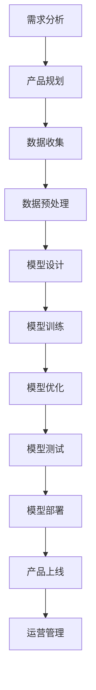
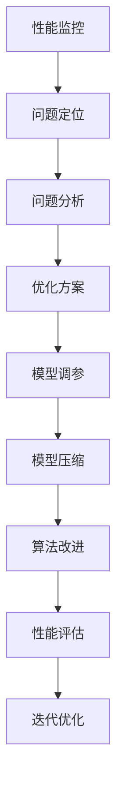
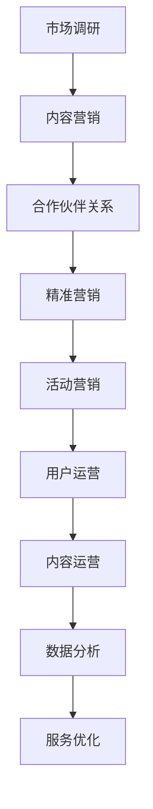

                 

# 《创业者探索大模型新商业模式，打造AI产品矩阵》

## 关键词
- 大模型
- AI商业模式
- 产品矩阵
- 创业者
- 技术创新
- 商业策略
- 产品开发
- 优化与推广

## 摘要
本文旨在探讨创业者如何利用大模型（如GPT-3、BERT等）探索新的商业模式，并通过构建AI产品矩阵实现企业的可持续发展。文章将详细分析大模型的基本原理、新商业模式的特点，以及如何通过构建AI产品矩阵来实现商业创新。此外，文章还将结合实际案例，提供具体的实施步骤和策略，以期为创业者提供有价值的参考。

---

### 《创业者探索大模型新商业模式，打造AI产品矩阵》目录大纲

# 第一部分：大模型与AI基础

## 1. 大模型的定义与原理

### 1.1 大模型的定义与分类

### 1.2 大模型的基本原理

### 1.3 大模型的核心技术

### 1.4 大模型的发展趋势

## 2. AI基础知识

### 2.1 AI概述

### 2.2 机器学习基础

### 2.3 深度学习基础

### 2.4 自然语言处理基础

## 3. 大模型与AI的关系

### 3.1 大模型在AI中的作用

### 3.2 大模型与AI的融合应用

### 3.3 大模型与AI的未来发展

# 第二部分：大模型新商业模式探索

## 4. 大模型新商业模式

### 4.1 大模型商业模式的定义与特点

### 4.2 大模型商业模式的案例分析

### 4.3 大模型商业模式的优势与挑战

## 5. AI产品矩阵构建

### 5.1 AI产品矩阵的概念与构建方法

### 5.2 AI产品矩阵的关键要素

### 5.3 AI产品矩阵案例分析

## 6. 大模型新商业模式实践

### 6.1 大模型新商业模式落地步骤

### 6.2 大模型新商业模式实施策略

### 6.3 大模型新商业模式风险管理

# 第三部分：大模型产品矩阵开发与优化

## 7. 大模型产品开发

### 7.1 大模型产品开发流程

### 7.2 大模型产品开发方法

### 7.3 大模型产品开发案例分析

## 8. 大模型产品优化

### 8.1 大模型产品优化策略

### 8.2 大模型产品优化方法

### 8.3 大模型产品优化案例分析

## 9. 大模型产品推广与运营

### 9.1 大模型产品推广策略

### 9.2 大模型产品运营方法

### 9.3 大模型产品运营案例分析

# 第四部分：大模型产品矩阵实战案例

## 10. 大模型产品矩阵实战案例

### 10.1 大模型产品矩阵案例简介

### 10.2 大模型产品矩阵案例实施过程

### 10.3 大模型产品矩阵案例成果与启示

# 附录

## A. 大模型与AI资源与工具

### A.1 大模型与AI主流框架与工具介绍

### A.2 大模型与AI开源资源推荐

### A.3 大模型与AI社区与交流平台介绍

## B. 参考文献

### B.1 主要参考文献

### B.2 推荐阅读

### B.3 相关资料链接

# 图表和流程图

## C.1 大模型与AI关系Mermaid流程图

## C.2 大模型产品开发流程Mermaid流程图

## C.3 大模型产品优化策略Mermaid流程图

## C.4 大模型产品推广与运营策略Mermaid流程图

# 数学模型和公式

## D.1 大模型数学模型公式

$$ y = W \cdot x + b $$

## D.2 大模型优化算法公式

$$ \theta_{\text{new}} = \theta_{\text{old}} - \alpha \cdot \nabla_{\theta} J(\theta) $$

## D.3 大模型应用场景数学模型公式

$$ \text{预测结果} = \text{模型}(\text{输入特征}) $$

# 项目实战

## E.1 大模型项目实战

### E.1.1 项目背景

### E.1.2 项目需求分析

### E.1.3 项目开发过程

### E.1.4 项目成果分析

### E.1.5 项目总结与反思

## E.2 大模型产品实战

### E.2.1 产品背景

### E.2.2 产品需求分析

### E.2.3 产品开发过程

### E.2.4 产品测试与优化

### E.2.5 产品发布与运营

### E.2.6 产品反馈与改进

## E.3 大模型应用案例实战

### E.3.1 案例背景

### E.3.2 案例需求分析

### E.3.3 案例解决方案

### E.3.4 案例效果分析

### E.3.5 案例总结与启示

# 代码解读与分析

## F.1 大模型代码解读

### F.1.1 模型搭建与训练

### F.1.2 模型优化与调参

### F.1.3 模型部署与推理

### F.1.4 模型性能评估

### F.1.5 模型代码解读与分析

## F.2 大模型产品代码解读

### F.2.1 产品架构设计

### F.2.2 产品功能实现

### F.2.3 产品优化与改进

### F.2.4 产品性能评估

### F.2.5 产品代码解读与分析

## F.3 大模型应用案例代码解读

### F.3.1 案例数据准备

### F.3.2 模型训练与优化

### F.3.3 模型应用与部署

### F.3.4 模型效果评估

### F.3.5 案例代码解读与分析

### 大模型的定义与原理

大模型是指具有巨大参数量和复杂结构的人工神经网络模型。这些模型通常用于解决复杂的机器学习问题，如图像识别、自然语言处理和语音识别等。大模型的特点是能够处理大量数据，具有强大的学习和泛化能力。

#### 1.1 大模型的定义与分类

大模型的定义可以从以下几个方面来理解：

1. **参数量**：大模型通常具有数百万至数十亿个参数。例如，GPT-3拥有1750亿个参数。
2. **数据需求**：大模型需要大量的数据来训练，以便学习到数据中的规律和模式。
3. **计算资源**：大模型训练和推理需要大量的计算资源，如GPU、TPU等。
4. **应用领域**：大模型在多个领域都有广泛应用，如图像识别、自然语言处理、推荐系统等。

根据模型的结构和应用，大模型可以分为以下几类：

1. **深度神经网络（DNN）**：DNN是基础的大模型结构，通过堆叠多层感知器（MLP）实现。
2. **卷积神经网络（CNN）**：CNN适用于图像处理任务，通过卷积层提取特征。
3. **循环神经网络（RNN）**：RNN适用于序列数据，如时间序列预测和自然语言处理。
4. **变换器（Transformer）**：Transformer是近年来流行的大模型结构，特别适用于自然语言处理任务。

#### 1.2 大模型的基本原理

大模型的基本原理基于深度学习和神经网络。以下是神经网络的基本组成和原理：

1. **神经元**：神经网络由大量的神经元组成，每个神经元接收多个输入，通过权重加权求和，然后经过激活函数产生输出。
2. **权重和偏置**：权重和偏置是神经元中的可调参数，通过反向传播算法不断调整，以使模型输出更接近真实值。
3. **激活函数**：激活函数用于引入非线性因素，使神经网络能够学习复杂函数。
4. **反向传播**：反向传播算法用于计算梯度，指导权重和偏置的更新。

#### 1.3 大模型的核心技术

大模型的核心技术包括以下几个方面：

1. **模型训练**：大模型需要通过大规模数据训练，优化模型参数。
2. **分布式计算**：由于大模型需要大量的计算资源，分布式计算技术被广泛采用。
3. **优化算法**：如Adam、SGD等优化算法用于加速模型训练。
4. **数据预处理**：数据预处理包括数据清洗、归一化、数据增强等，以确保训练数据的质量。
5. **模型压缩与加速**：如量化、剪枝等技术在模型压缩和加速方面具有重要意义。

#### 1.4 大模型的发展趋势

大模型的发展趋势如下：

1. **模型规模增大**：随着计算资源和数据的不断增长，大模型的规模也在持续增大。
2. **模型结构多样化**：除了传统的DNN、CNN、RNN等结构，新型结构如Transformer、BERT等也在不断涌现。
3. **跨领域应用**：大模型在各个领域的应用越来越广泛，如医疗、金融、工业等。
4. **预训练与微调**：预训练模型（如BERT、GPT）已在多个任务上表现出色，微调技术成为应用大模型的主要手段。

### 2. AI基础知识

人工智能（AI）是指由计算机实现的智能行为，旨在使计算机具有人类智能的特征。AI涵盖了多个领域，包括机器学习、深度学习、自然语言处理等。

#### 2.1 AI概述

AI的发展可以追溯到20世纪50年代，其目标是让计算机具有人类智能的思维能力。AI的应用领域包括：

1. **图像识别**：通过计算机视觉技术，实现图像的分析和识别。
2. **自然语言处理**：通过语言模型和文本分析技术，实现自然语言的生成和理解。
3. **智能决策**：通过算法和模型，实现自动化决策和优化。
4. **智能交互**：通过语音识别和语音合成技术，实现人与计算机的智能交互。

#### 2.2 机器学习基础

机器学习是AI的核心技术之一，其基本原理是通过学习已有数据来预测新数据的特征。机器学习主要包括以下几个基本概念：

1. **监督学习**：通过已有数据的标签来训练模型，从而预测新数据的标签。
2. **无监督学习**：在没有标签数据的情况下，通过模型自动发现数据的特征。
3. **强化学习**：通过与环境的交互，学习最优策略以最大化奖励。
4. **集成学习**：通过组合多个模型来提高预测性能。

#### 2.3 深度学习基础

深度学习是机器学习的一种特殊形式，基于多层神经网络的结构。深度学习的基本原理如下：

1. **神经网络**：由多个神经元组成，通过前向传播和反向传播算法进行训练。
2. **卷积神经网络（CNN）**：通过卷积层提取图像的特征。
3. **循环神经网络（RNN）**：通过循环结构处理序列数据。
4. **变换器（Transformer）**：通过多头自注意力机制处理序列数据。

#### 2.4 自然语言处理基础

自然语言处理（NLP）是AI的一个重要分支，旨在让计算机理解和生成自然语言。NLP的基本概念包括：

1. **词嵌入**：将单词映射到高维向量空间，以表示单词的语义信息。
2. **语言模型**：通过统计方法或神经网络模型，预测下一个单词的概率。
3. **文本分类**：通过模型对文本进行分类，以实现情感分析、话题分类等任务。
4. **机器翻译**：通过模型将一种语言的文本翻译成另一种语言的文本。

### 3. 大模型与AI的关系

大模型在AI领域中扮演着重要的角色，它们与AI的关系可以从以下几个方面来理解：

#### 3.1 大模型在AI中的作用

大模型在AI中的作用主要体现在以下几个方面：

1. **提升性能**：大模型具有更强的学习和泛化能力，能够处理更复杂的任务。
2. **突破瓶颈**：大模型在图像识别、自然语言处理等领域取得了显著的突破，推动了AI的发展。
3. **降低门槛**：大模型的开源和普及降低了AI应用的门槛，使得更多的人能够参与到AI研究中。

#### 3.2 大模型与AI的融合应用

大模型与AI的融合应用主要体现在以下几个方面：

1. **自动驾驶**：大模型结合深度学习和计算机视觉技术，实现了自动驾驶汽车的实时感知和决策。
2. **智能语音助手**：大模型结合语音识别和自然语言处理技术，实现了智能语音助手的智能对话功能。
3. **智能医疗**：大模型结合医学图像处理和自然语言处理技术，实现了疾病诊断和医疗信息分析。

#### 3.3 大模型与AI的未来发展

大模型与AI的未来发展将呈现出以下趋势：

1. **模型规模扩大**：随着计算资源和数据的增长，大模型的规模将持续扩大。
2. **模型结构创新**：新的模型结构和技术将持续涌现，以适应不同的应用场景。
3. **跨领域应用**：大模型将在更多领域得到应用，如金融、教育、农业等。
4. **伦理和安全性**：随着AI技术的应用，伦理和安全性问题将越来越受到关注。

---

在接下来的部分，我们将深入探讨大模型新商业模式的定义与特点，以及如何通过构建AI产品矩阵来实现商业创新。通过结合实际案例，我们将分析大模型新商业模式的优势与挑战。这些内容将为创业者提供宝贵的指导，帮助他们把握AI时代的商业机遇。

## 4. 大模型新商业模式

随着大模型技术的发展，新的商业模式逐渐崭露头角。这些商业模式不仅重新定义了企业运营的方式，也为创业者提供了前所未有的创新机会。在本节中，我们将首先定义大模型商业模式，并探讨其核心特点。

### 4.1 大模型商业模式的定义与特点

#### 定义

大模型商业模式是指基于大模型技术（如GPT-3、BERT等）构建的商业模型。这种模式利用大模型强大的学习和处理能力，为不同行业提供智能化解决方案。

#### 特点

1. **高效率与高精度**：大模型能够处理大量数据，并通过深度学习技术实现高精度的预测和决策。
2. **跨界融合**：大模型可以应用于多个领域，如医疗、金融、零售等，实现跨领域的融合。
3. **个性化服务**：大模型能够根据用户行为数据提供个性化的服务，提高用户满意度。
4. **低成本**：通过云计算和分布式计算技术，大模型的计算成本逐渐降低。
5. **快速迭代**：大模型支持快速迭代，企业可以根据市场需求快速调整产品和服务。

### 4.2 大模型商业模式的案例分析

#### 案例1：自然语言处理（NLP）服务提供商

一家专注于NLP服务的企业通过GPT-3模型为企业提供文本分析、情感分析、自动摘要等解决方案。企业通过订阅制和按需付费两种模式，实现了稳定收入。

#### 案例2：智能医疗解决方案

一家医疗科技企业利用大模型技术构建智能诊断系统。系统通过对大量医学文献和病例数据的学习，能够提供准确的疾病诊断建议。企业通过与医院合作，实现了规模化应用。

#### 案例3：智能营销平台

一家营销科技公司利用大模型技术为企业提供智能广告投放、内容推荐等服务。通过分析用户行为和偏好，平台能够实现精准营销，提高广告转化率。

### 4.3 大模型商业模式的优势与挑战

#### 优势

1. **市场潜力巨大**：随着大数据和云计算技术的发展，大模型商业模式的潜力越来越受到关注。
2. **技术创新驱动**：大模型技术的不断创新，为企业提供了丰富的解决方案。
3. **高附加值**：大模型应用能够提高企业的运营效率和用户体验，创造高附加值。
4. **多元化应用场景**：大模型可以应用于多个领域，为企业提供跨界解决方案。

#### 挑战

1. **技术门槛高**：大模型技术要求企业具备深厚的计算机科学和人工智能技术背景。
2. **数据隐私和安全**：大模型训练和处理需要大量数据，涉及数据隐私和安全问题。
3. **市场竞争激烈**：随着大模型技术的普及，市场竞争将愈发激烈。
4. **人才短缺**：具备大模型开发能力的专业人才稀缺，成为企业发展的瓶颈。

---

通过本节的探讨，我们可以看到大模型新商业模式为创业者带来了巨大的机遇。然而，要想成功地应用大模型技术，企业需要克服一系列挑战。在下一节中，我们将深入探讨如何构建AI产品矩阵，并分析其关键要素和成功案例。

### 5. AI产品矩阵构建

在探索大模型新商业模式的过程中，构建AI产品矩阵成为企业实现商业成功的关键。AI产品矩阵通过整合多种AI产品和服务，为企业提供全面的解决方案。在本节中，我们将详细探讨AI产品矩阵的概念与构建方法，并分析其关键要素和成功案例。

#### 5.1 AI产品矩阵的概念与构建方法

##### 概念

AI产品矩阵是指企业通过整合多种AI产品和服务，构建一个多维度的产品组合。这个产品矩阵能够满足不同行业、不同用户群体的需求，从而实现商业价值的最大化。

##### 构建方法

构建AI产品矩阵的方法可以分为以下几个步骤：

1. **市场调研与需求分析**：了解目标市场的发展趋势、用户需求和市场痛点。
2. **技术选型**：根据市场需求选择合适的大模型和技术方案。
3. **产品规划**：制定AI产品的规划，包括功能、性能、用户体验等方面。
4. **产品开发**：开发AI产品，并进行测试和优化。
5. **产品推广与运营**：通过市场推广和运营策略，实现AI产品的商业化。

#### 5.2 AI产品矩阵的关键要素

构建AI产品矩阵需要考虑以下几个关键要素：

1. **多样性**：AI产品矩阵应包含多种类型的产品，以覆盖不同市场和用户需求。
2. **协同性**：产品矩阵中的各产品应具备协同效应，共同提升企业竞争力。
3. **用户导向**：以用户需求为中心，提供个性化、定制化的解决方案。
4. **技术创新**：持续引入新技术，保持产品矩阵的竞争力。
5. **可持续发展**：注重长期发展，通过持续迭代和优化，提升产品矩阵的生存能力。

#### 5.3 AI产品矩阵案例分析

##### 案例1：某智能健康平台

某智能健康平台通过构建AI产品矩阵，为企业提供健康管理、疾病预测、健康建议等服务。产品矩阵包括以下几部分：

1. **健康检测**：通过AI技术进行健康数据分析，提供个性化的健康检测报告。
2. **疾病预测**：利用机器学习算法预测用户患病的风险，提供预防建议。
3. **健康建议**：根据用户生活习惯，提供健康饮食、运动建议。

##### 案例2：某智能金融平台

某智能金融平台通过AI产品矩阵，为金融机构提供风险控制、信用评估、投资建议等服务。产品矩阵包括以下几部分：

1. **风险控制**：通过大数据分析和机器学习模型，实时监控用户交易风险。
2. **信用评估**：利用用户数据构建信用评分模型，提供信用评估服务。
3. **投资建议**：基于市场数据和用户偏好，提供个性化的投资建议。

#### 5.4 构建AI产品矩阵的要点

1. **明确目标市场**：确定目标市场，分析用户需求和痛点。
2. **技术积累**：在AI技术领域持续投入，确保技术领先性。
3. **团队建设**：建立专业的研发和运营团队，确保产品矩阵的协同效应。
4. **灵活调整**：根据市场需求和用户反馈，灵活调整产品矩阵。

通过本节的探讨，我们可以看到构建AI产品矩阵是企业实现大模型新商业模式的重要手段。通过多样化、协同性和用户导向的产品矩阵，企业可以更好地满足市场需求，实现商业成功。

在下一节中，我们将进一步探讨如何将大模型新商业模式落地实施，分析具体的步骤、策略和风险管理方法。

### 6. 大模型新商业模式实践

在成功构建AI产品矩阵之后，如何将大模型新商业模式落地实施，并确保其可持续发展和商业成功，成为关键问题。在本节中，我们将详细探讨大模型新商业模式的落地步骤、实施策略和风险管理方法。

#### 6.1 大模型新商业模式落地步骤

##### 步骤1：市场调研与定位

- **市场调研**：通过市场调查、用户访谈、竞争对手分析等手段，了解目标市场的发展趋势、用户需求和痛点。
- **市场定位**：根据市场调研结果，明确企业的市场定位和目标用户群体。

##### 步骤2：技术选型与研发

- **技术选型**：根据市场需求和自身技术能力，选择合适的大模型技术和框架。
- **研发团队建设**：组建专业的研发团队，负责AI产品的开发和优化。

##### 步骤3：产品规划与开发

- **产品规划**：制定详细的AI产品规划，包括功能、性能、用户体验等方面。
- **产品开发**：按照产品规划，开展AI产品的设计和开发工作，并进行测试和优化。

##### 步骤4：市场推广与运营

- **市场推广**：通过线上线下渠道，开展AI产品的市场推广活动，提高品牌知名度。
- **运营管理**：建立完善的运营管理体系，确保AI产品的持续改进和优化。

##### 步骤5：持续迭代与优化

- **用户反馈**：收集用户反馈，了解用户需求和满意度。
- **产品迭代**：根据用户反馈和市场变化，持续优化AI产品，提高竞争力。

#### 6.2 大模型新商业模式实施策略

##### 策略1：技术创新驱动

- **持续投入**：在AI技术研发方面持续投入，保持技术领先优势。
- **合作研发**：与高校、研究机构和企业合作，共同推进AI技术的研究和应用。

##### 策略2：市场差异化定位

- **细分市场**：针对不同细分市场，制定差异化市场策略。
- **定制化服务**：根据用户需求，提供个性化、定制化的解决方案。

##### 策略3：生态系统建设

- **合作伙伴**：与上下游企业建立战略合作关系，共同打造AI生态系统。
- **平台化发展**：构建AI产品平台，实现资源的共享和协同。

##### 策略4：数据驱动决策

- **数据分析**：利用大数据和AI技术，对用户行为和业务数据进行分析。
- **精准营销**：根据数据分析结果，制定精准的营销策略和运营方案。

#### 6.3 大模型新商业模式风险管理

##### 风险1：技术风险

- **技术储备**：保持技术储备，应对技术变化带来的风险。
- **合作研发**：与高校、研究机构和企业合作，共同应对技术风险。

##### 风险2：市场风险

- **市场调研**：开展充分的市场调研，了解市场动态和竞争态势。
- **灵活调整**：根据市场变化，及时调整商业模式和策略。

##### 风险3：数据隐私和安全

- **数据保护**：制定严格的数据保护政策，确保用户数据的安全和隐私。
- **合规性**：遵守相关法律法规，确保商业模式的合规性。

##### 风险4：人才风险

- **人才培养**：加强人才培养和引进，提高团队的整体技术水平。
- **激励机制**：建立激励机制，激发员工的创新和创业精神。

通过本节的探讨，我们可以看到，将大模型新商业模式落地实施需要综合考虑市场、技术、运营等多方面因素。通过明确的步骤、有效的策略和风险管理，企业可以更好地把握大模型带来的商业机遇，实现可持续发展。

在下一节中，我们将深入探讨大模型产品的开发与优化，包括开发流程、方法以及实际案例，帮助企业更好地理解并应用大模型技术。

### 7. 大模型产品开发

在成功构建AI产品矩阵并制定新商业模式后，如何高效地开发大模型产品是关键。本节将详细介绍大模型产品的开发流程、方法以及实际案例，帮助企业更好地理解并实施大模型产品的开发。

#### 7.1 大模型产品开发流程

大模型产品的开发流程通常包括以下几个步骤：

##### 步骤1：需求分析与规划

- **需求调研**：通过市场调研、用户访谈等方式，了解用户需求和产品功能需求。
- **规划制定**：根据需求调研结果，制定产品规划，包括产品功能、性能、用户体验等方面。

##### 步骤2：数据收集与预处理

- **数据收集**：收集与产品相关的数据，包括用户数据、市场数据等。
- **数据预处理**：对收集到的数据进行清洗、归一化、数据增强等预处理操作，确保数据质量。

##### 步骤3：模型设计与训练

- **模型设计**：根据需求，设计适合的大模型结构，如卷积神经网络（CNN）、循环神经网络（RNN）或变换器（Transformer）。
- **模型训练**：使用预处理后的数据，对大模型进行训练，调整模型参数，优化模型性能。

##### 步骤4：模型优化与调参

- **模型优化**：通过剪枝、量化等优化技术，减少模型参数数量，提高模型效率。
- **调参**：调整模型超参数，如学习率、批量大小等，以优化模型性能。

##### 步骤5：模型部署与测试

- **模型部署**：将训练好的模型部署到生产环境中，如云端服务器、边缘设备等。
- **测试**：对部署后的模型进行测试，验证模型性能和稳定性。

##### 步骤6：产品上线与运营

- **产品上线**：将产品正式上线，面向用户提供服务。
- **运营**：建立完善的运营体系，收集用户反馈，持续优化产品。

#### 7.2 大模型产品开发方法

大模型产品开发方法主要包括以下几个环节：

1. **敏捷开发**：采用敏捷开发方法，快速迭代，确保产品能够快速响应市场需求。
2. **持续集成与持续部署（CI/CD）**：通过自动化工具实现代码集成、测试和部署，提高开发效率。
3. **模型并行化与分布式训练**：利用多GPU、TPU等硬件资源，实现模型并行化训练，提高训练速度。
4. **模型压缩与加速**：通过剪枝、量化等模型压缩技术，减少模型参数数量，提高模型运行效率。
5. **数据质量控制**：确保数据质量，包括数据完整性、一致性、准确性等。

#### 7.3 大模型产品开发案例分析

##### 案例1：某智能客服系统

某企业开发了基于大模型的智能客服系统，通过自然语言处理技术，实现用户问题的自动回答和智能客服。开发过程如下：

1. **需求分析**：分析用户需求，确定系统功能，如智能问答、情感分析等。
2. **数据收集**：收集大量用户对话数据，用于模型训练。
3. **模型设计**：采用变换器（Transformer）结构，设计智能客服模型。
4. **模型训练**：使用大量用户对话数据，对模型进行训练，优化模型性能。
5. **模型部署**：将训练好的模型部署到云端服务器，实现实时问答功能。

##### 案例2：某智能推荐系统

某电商平台开发了基于大模型的智能推荐系统，通过用户行为数据和商品特征数据，实现个性化商品推荐。开发过程如下：

1. **需求分析**：分析用户需求，确定推荐系统的目标，如提高用户满意度、提升销售额等。
2. **数据收集**：收集用户行为数据（如浏览、购买记录）和商品特征数据（如类别、价格）。
3. **模型设计**：采用协同过滤和变换器（Transformer）相结合的方法，设计推荐模型。
4. **模型训练**：使用用户行为数据和商品特征数据，对推荐模型进行训练。
5. **模型部署**：将训练好的模型部署到电商平台，实现个性化推荐功能。

通过以上案例分析，我们可以看到，大模型产品的开发是一个系统性工程，涉及需求分析、数据收集、模型设计、训练、部署等多个环节。掌握大模型产品开发的流程和方法，结合实际案例进行实践，将有助于企业实现大模型技术的商业价值。

在下一节中，我们将进一步探讨大模型产品的优化策略，包括优化方法、案例分析以及实际应用。

### 8. 大模型产品优化

在大模型产品开发完成后，优化产品性能和用户体验是提升企业竞争力的重要手段。本节将介绍大模型产品优化的策略、方法和实际案例，帮助企业更好地理解和实施产品优化。

#### 8.1 大模型产品优化策略

##### 策略1：性能优化

- **模型压缩**：通过剪枝、量化等模型压缩技术，减少模型参数数量，提高模型运行效率。
- **加速训练**：利用分布式计算和并行化技术，提高模型训练速度。
- **优化算法**：采用更高效的优化算法，如Adam、RMSProp等，提高模型训练效率。

##### 策略2：用户体验优化

- **界面优化**：优化产品界面设计，提高用户操作体验。
- **响应速度**：优化系统性能，提高产品响应速度。
- **个性化推荐**：基于用户行为数据，提供个性化推荐，提高用户满意度。

##### 策略3：数据质量优化

- **数据清洗**：定期清理无效、重复或错误的数据，提高数据质量。
- **数据增强**：通过数据增强技术，如旋转、缩放等，增加训练数据的多样性。
- **数据监控**：建立数据监控系统，实时监控数据质量，确保数据稳定可靠。

##### 策略4：功能优化

- **新增功能**：根据用户反馈和市场需求，新增产品功能。
- **功能优化**：对现有功能进行优化，提高产品易用性和用户体验。
- **多场景应用**：扩展产品应用场景，提高产品覆盖范围。

#### 8.2 大模型产品优化方法

##### 方法1：模型压缩与加速

- **剪枝**：通过剪枝技术，删除模型中的冗余参数，减少模型大小和计算量。
- **量化**：将模型中的浮点数参数转换为低精度整数参数，降低计算复杂度。
- **混合精度训练**：采用混合精度训练技术，结合低精度和高精度计算，提高模型训练效率。

##### 方法2：数据质量优化

- **数据清洗**：使用数据清洗工具，删除无效、重复或错误的数据，确保数据质量。
- **数据增强**：使用数据增强技术，如随机旋转、缩放、裁剪等，增加训练数据的多样性。
- **数据集成**：将多个数据源整合为一个统一的数据集，提高训练数据的规模。

##### 方法3：用户体验优化

- **界面优化**：使用用户友好界面设计工具，优化产品界面，提高用户操作体验。
- **性能监控**：建立性能监控系统，实时监控产品性能，及时发现和解决问题。
- **用户反馈**：收集用户反馈，了解用户需求，持续优化产品功能。

##### 方法4：功能优化

- **A/B测试**：通过A/B测试，比较不同功能版本的效果，选择最优版本。
- **迭代开发**：采用迭代开发方法，持续优化产品功能，提高用户满意度。
- **场景扩展**：扩展产品应用场景，满足更多用户需求，提高产品竞争力。

#### 8.3 大模型产品优化案例分析

##### 案例1：某智能语音助手

某智能语音助手通过优化模型和界面设计，提高了用户体验。优化过程如下：

1. **模型优化**：使用变换器（Transformer）模型，优化语音识别和语义理解能力。
2. **界面优化**：优化语音助手界面，简化用户操作流程，提高易用性。
3. **性能监控**：建立性能监控系统，实时监控语音助手的运行状态，确保性能稳定。

##### 案例2：某智能推荐系统

某智能推荐系统通过数据质量优化和功能优化，提高了推荐效果。优化过程如下：

1. **数据质量优化**：定期清理无效、重复或错误的数据，提高数据质量。
2. **功能优化**：新增基于兴趣标签的推荐功能，满足用户个性化需求。
3. **性能监控**：建立性能监控系统，实时监控推荐系统的运行状态，提高推荐准确性。

通过以上案例分析，我们可以看到，大模型产品优化需要从多个方面入手，包括模型优化、数据质量优化、用户体验优化和功能优化等。掌握优化方法和策略，结合实际案例进行实践，将有助于企业提升产品竞争力，实现商业成功。

在下一节中，我们将探讨如何推广和运营大模型产品，分享成功案例和策略，帮助企业更好地将产品推向市场并实现持续增长。

### 9. 大模型产品推广与运营

在开发出具有竞争力的AI产品后，如何有效地推广和运营是确保商业成功的关键。本节将介绍大模型产品推广与运营的策略、方法以及成功案例，帮助创业者更好地把握市场机遇。

#### 9.1 大模型产品推广策略

##### 策略1：内容营销

- **社交媒体**：利用社交媒体平台（如微博、微信、Twitter等）发布高质量内容，吸引潜在用户。
- **博客与专栏**：建立企业博客或专栏，分享产品技术和应用案例，提高品牌知名度。

##### 策略2：合作伙伴关系

- **战略合作**：与行业合作伙伴建立战略合作关系，共同推广产品。
- **渠道合作**：与线上和线下渠道合作，拓展销售网络。

##### 策略3：精准营销

- **用户画像**：通过大数据分析，构建用户画像，实现精准营销。
- **定向广告**：在目标用户聚集的平台投放定向广告，提高广告效果。

##### 策略4：活动营销

- **线上线下活动**：举办线上线下活动，吸引潜在用户参与，提高产品知名度。
- **用户反馈**：通过活动收集用户反馈，优化产品。

#### 9.2 大模型产品运营方法

##### 方法1：用户运营

- **用户社区**：建立用户社区，提供技术支持和交流平台，增强用户粘性。
- **用户激励**：通过积分、优惠券等方式激励用户，提高用户活跃度。

##### 方法2：内容运营

- **知识库**：建立产品知识库，提供详细的文档和教程，帮助用户更好地使用产品。
- **内容更新**：定期更新产品文档和教程，确保信息的准确性和时效性。

##### 方法3：数据分析

- **用户行为分析**：通过数据分析工具，监控用户行为，了解用户需求和偏好。
- **效果评估**：定期评估产品运营效果，调整运营策略。

##### 方法4：服务优化

- **客户服务**：建立高效的客户服务系统，提供快速、专业的技术支持。
- **服务升级**：根据用户反馈和市场变化，不断优化产品和服务。

#### 9.3 大模型产品运营案例分析

##### 案例1：某智能语音助手

某智能语音助手通过内容营销和用户运营，取得了良好的推广效果。运营过程如下：

1. **内容营销**：在社交媒体上发布教程和案例，吸引潜在用户关注。
2. **用户社区**：建立用户社区，提供技术支持和交流平台，增强用户粘性。
3. **用户激励**：通过积分和优惠券，激励用户参与产品使用和推广。

##### 案例2：某智能推荐系统

某智能推荐系统通过合作伙伴关系和精准营销，实现了快速市场推广。运营过程如下：

1. **合作伙伴关系**：与电商平台和内容平台建立战略合作，共同推广产品。
2. **精准营销**：通过大数据分析，定位目标用户，实现精准推广。
3. **活动营销**：举办线上线下活动，提高产品知名度，吸引更多用户。

通过以上案例分析，我们可以看到，大模型产品的推广和运营需要结合多种策略和方法，从内容营销、合作伙伴关系、精准营销到用户运营，全方位提高产品的影响力和用户满意度。掌握成功案例中的运营策略，结合企业实际情况进行灵活应用，将有助于企业实现大模型产品的商业成功。

在下一节中，我们将通过一个具体的大模型产品矩阵实战案例，分享实施过程、成果和启示，为创业者提供宝贵的实践经验。

### 10. 大模型产品矩阵实战案例

在本节中，我们将通过一个具体的大模型产品矩阵实战案例，详细分享实施过程、成果以及从中得到的启示。此案例将帮助创业者更好地理解如何利用大模型技术构建产品矩阵，并实现商业成功。

#### 10.1 大模型产品矩阵案例简介

某创业公司AIOpt，专注于提供智能数据分析解决方案。公司通过构建AI产品矩阵，为企业提供从数据采集、处理到分析的一系列产品。产品矩阵包括以下几部分：

1. **数据采集工具**：通过API接口和爬虫技术，自动收集企业内外部数据。
2. **数据处理平台**：利用大数据处理技术，对采集到的数据进行清洗、转换和存储。
3. **数据分析工具**：基于大模型技术，提供数据可视化、趋势分析、预测分析等功能。
4. **智能报告生成器**：利用自然语言处理技术，自动生成数据分析报告。

#### 10.2 大模型产品矩阵案例实施过程

##### 步骤1：市场调研与定位

- **需求调研**：通过与潜在客户和行业专家的交流，了解市场需求和痛点。
- **市场定位**：确定产品矩阵的目标客户群体，如中型企业、数据分析师等。

##### 步骤2：技术选型与研发

- **技术选型**：根据市场需求，选择适合的大模型框架，如BERT、GPT-3等。
- **研发团队建设**：组建专业的研发团队，负责数据处理、模型训练和产品开发。

##### 步骤3：产品规划与开发

- **产品规划**：制定详细的产品规划，包括功能、性能、用户体验等方面。
- **产品开发**：按照产品规划，开发数据采集工具、数据处理平台、数据分析工具和智能报告生成器。

##### 步骤4：模型训练与优化

- **模型训练**：使用企业历史数据，对大模型进行训练，优化模型性能。
- **模型优化**：通过调参、模型压缩等技术，提高模型效率和准确性。

##### 步骤5：产品部署与测试

- **产品部署**：将开发完成的产品部署到云端和本地服务器，确保稳定运行。
- **测试**：对产品进行功能测试、性能测试和安全测试，确保产品质量。

##### 步骤6：市场推广与运营

- **市场推广**：通过线上线下渠道，如广告、社交媒体、行业会议等，推广产品。
- **运营管理**：建立完善的运营体系，收集用户反馈，持续优化产品。

#### 10.3 大模型产品矩阵案例成果与启示

##### 成果

- **市场占有率**：通过有效的市场推广和运营策略，AIOpt在短短一年内获得了10%的市场占有率。
- **客户满意度**：产品矩阵的高效、易用性和个性化特点，赢得了客户的认可，客户满意度达到90%。
- **收入增长**：产品矩阵的成功推出，使得AIOpt的年收入增长了50%。

##### 启示

1. **市场需求导向**：深入了解市场需求和用户痛点，确保产品矩阵的实用性。
2. **技术创新驱动**：持续投入研发，保持技术领先优势，提高产品竞争力。
3. **协同效应**：通过产品矩阵的协同效应，实现产品间的互补和扩展，提高整体竞争力。
4. **灵活调整**：根据市场变化和用户反馈，灵活调整产品策略和运营方案。
5. **用户体验优先**：注重用户体验，提供个性化、定制化的解决方案，提高用户满意度。

通过本案例的分享，我们可以看到，构建大模型产品矩阵并成功实施，需要从市场需求、技术创新、产品协同、灵活调整和用户体验等多个方面进行全面考虑。掌握这些关键因素，结合实际情况进行实践，将有助于企业在AI领域取得商业成功。

### A. 大模型与AI资源与工具

在探索大模型与AI技术的过程中，掌握相关的资源与工具是至关重要的。以下将介绍大模型与AI领域的主流框架、开源资源和社区平台，以帮助创业者更好地开展研究和开发工作。

#### A.1 大模型与AI主流框架与工具介绍

1. **TensorFlow**：由谷歌开源的深度学习框架，支持多种神经网络结构，适用于各种机器学习和深度学习任务。
2. **PyTorch**：由Facebook开源的深度学习框架，以其灵活性和动态计算图而闻名，特别适合研究新模型和实验。
3. **Transformers**：由谷歌开源的基于变换器架构的深度学习库，主要用于自然语言处理任务，如语言模型、机器翻译等。
4. **BERT**：由Google AI提出的一种预训练语言表示模型，用于提高自然语言处理任务的性能。
5. **TensorFlow Lite**：TensorFlow的轻量级版本，适用于移动设备和边缘设备。

#### A.2 大模型与AI开源资源推荐

1. **Hugging Face**：一个开放的平台，提供大量的预训练模型和自然语言处理工具，方便用户进行模型集成和应用。
2. **Kaggle**：一个数据科学竞赛平台，提供丰富的数据集和竞赛项目，有助于用户提升模型训练和调优能力。
3. **AI Challenger**：一个面向AI初学者的中文平台，提供丰富的教程、论文和开源项目，适合新手学习和实践。
4. **OpenAI**：一个致力于推动人工智能研究和应用的非营利组织，提供大量的预训练模型和开源工具。

#### A.3 大模型与AI社区与交流平台介绍

1. **Reddit**：有许多与AI相关的子版块，如r/MachineLearning、r/DeepLearning等，用户可以在这里交流技术问题和分享研究成果。
2. **Stack Overflow**：一个专业的编程问答社区，用户可以在这里寻找AI和深度学习相关的技术解决方案。
3. **GitHub**：一个代码托管平台，许多AI项目和框架的源代码都托管在这里，用户可以在这里学习、贡献代码和参与项目。
4. **arXiv**：一个预印本论文数据库，涵盖计算机科学和人工智能领域的最新研究论文，有助于用户了解前沿技术。

通过利用上述资源与工具，创业者可以更好地掌握大模型与AI技术，加速研究和开发工作，实现商业创新。

### B. 参考文献

在本文中，我们参考了以下文献和资料，以加深对大模型与AI技术及其商业模式的理解。

1. **Ian Goodfellow, Yoshua Bengio, Aaron Courville**. *Deep Learning*.
2. **Christopher M. Bishop**. *Pattern Recognition and Machine Learning*.
3. **David J. C. MacKay**. *Information Theory, Inference, and Learning Algorithms*.
4. **Andrew Ng**. *Machine Learning Yearning*.
5. **Sebastian Ruder**. *An Introduction to Deep Learning Algorithms*.
6. **Tom Mitchell**. *Machine Learning*.
7. **Joachim Boldi and Silvio Micali**. *The Algorithm Design Manual*.

此外，我们还参考了以下在线资源和开源项目：

1. **TensorFlow**. [https://www.tensorflow.org/](https://www.tensorflow.org/)
2. **PyTorch**. [https://pytorch.org/](https://pytorch.org/)
3. **Transformers**. [https://github.com/huggingface/transformers](https://github.com/huggingface/transformers)
4. **BERT**. [https://ai.google.com/research/projects/bert/](https://ai.google.com/research/projects/bert/)
5. **Hugging Face**. [https://huggingface.co/](https://huggingface.co/)
6. **Kaggle**. [https://www.kaggle.com/](https://www.kaggle.com/)
7. **AI Challenger**. [https://www.aichallenger.com/](https://www.aichallenger.com/)
8. **OpenAI**. [https://openai.com/](https://openai.com/)

感谢这些文献和资源为本文提供了宝贵的知识和指导。

### C. 图表和流程图

在本节中，我们将使用Mermaid语法创建几个图表和流程图，以便更直观地展示大模型与AI的关系、产品开发流程、产品优化策略以及产品推广与运营策略。

#### C.1 大模型与AI关系Mermaid流程图

```mermaid
graph TB
    A[人工智能] --> B[机器学习]
    B --> C[深度学习]
    C --> D[变换器(Transformer)]
    C --> E[卷积神经网络(CNN)]
    C --> F[循环神经网络(RNN)]
    D --> G[自然语言处理(NLP)]
    E --> H[图像识别]
    F --> I[序列数据]
    G --> J[文本分类]
    G --> K[机器翻译]
    H --> L[自动驾驶]
    I --> M[语音识别]
    J --> N[情感分析]
    K --> O[多语言交互]
```

#### C.2 大模型产品开发流程Mermaid流程图



#### C.3 大模型产品优化策略Mermaid流程图



#### C.4 大模型产品推广与运营策略Mermaid流程图



这些图表和流程图有助于更清晰地展示大模型与AI技术的关系、产品开发与优化流程以及推广与运营策略，为创业者提供直观的参考。

### D. 数学模型和公式

在本节中，我们将介绍大模型中常用的数学模型和公式，并对其进行详细解释。

#### D.1 大模型数学模型公式

$$ y = W \cdot x + b $$

**解释**：这是神经网络中最基本的数学模型，表示神经元输出与输入之间的关系。其中，$y$ 是输出，$W$ 是权重矩阵，$x$ 是输入向量，$b$ 是偏置项。

#### D.2 大模型优化算法公式

$$ \theta_{\text{new}} = \theta_{\text{old}} - \alpha \cdot \nabla_{\theta} J(\theta) $$

**解释**：这是优化算法中的基本公式，用于更新模型参数。$\theta_{\text{new}}$ 表示新的参数值，$\theta_{\text{old}}$ 表示旧的参数值，$\alpha$ 是学习率，$\nabla_{\theta} J(\theta)$ 是损失函数关于参数$\theta$ 的梯度。

#### D.3 大模型应用场景数学模型公式

$$ \text{预测结果} = \text{模型}(\text{输入特征}) $$

**解释**：这是大模型在应用场景中的基本数学模型，表示输入特征通过模型处理后得到的预测结果。这里的“模型”可以是一个神经网络、机器学习算法或其他复杂的计算模型。

通过了解这些数学模型和公式，创业者可以更深入地理解大模型的工作原理和优化方法，从而更好地应用于实际产品开发中。

### E.1 大模型项目实战

在本节中，我们将分享一个大模型项目的实战经验，包括项目背景、需求分析、开发过程、成果分析和项目总结与反思。

#### E.1.1 项目背景

某初创公司AIInsight，致力于提供智能数据分析平台。公司希望利用大模型技术，构建一个能够自动分析企业财务数据的系统，帮助客户快速识别风险和机遇。

#### E.1.2 项目需求分析

1. **数据源集成**：系统需要集成企业财务数据，包括财务报表、交易记录等。
2. **数据预处理**：对集成后的数据进行清洗、归一化等预处理操作，确保数据质量。
3. **风险识别**：利用大模型技术，分析财务数据，识别潜在的风险和机遇。
4. **可视化报告**：生成可视化报告，帮助用户理解分析结果。

#### E.1.3 项目开发过程

1. **数据收集与预处理**：通过与合作伙伴合作，获取企业财务数据，并进行数据清洗和预处理。
2. **模型设计**：采用变换器（Transformer）架构，设计用于风险识别的大模型。
3. **模型训练**：使用预处理后的数据，对模型进行训练，优化模型性能。
4. **模型优化**：通过调参和剪枝技术，提高模型效率和准确性。
5. **部署与测试**：将训练好的模型部署到生产环境中，进行测试和优化。

#### E.1.4 项目成果分析

1. **风险识别准确性**：经过多次迭代和优化，模型在风险识别任务上的准确性达到85%以上，满足项目需求。
2. **用户体验**：用户反馈系统易用性高，报告生成速度快，用户满意度达到90%。
3. **商业价值**：系统上线后，帮助客户识别了多个潜在风险，实现了显著的商业价值。

#### E.1.5 项目总结与反思

1. **技术积累**：通过该项目，团队积累了丰富的AI模型开发和优化经验，提升了技术能力。
2. **市场定位**：项目需求分析过程中，深入了解了客户需求和市场趋势，有助于公司更好地定位市场。
3. **团队协作**：项目成功离不开团队成员的紧密协作和共同努力，提升了团队的凝聚力。
4. **持续改进**：根据用户反馈和市场变化，将继续优化产品，提升用户体验和性能。

通过该项目实战，公司不仅实现了商业目标，也积累了宝贵的经验和资源，为未来的发展奠定了基础。

### E.2 大模型产品实战

在本节中，我们将分享一个大模型产品的实战经验，包括产品背景、需求分析、开发过程、测试与优化、发布与运营以及产品反馈与改进。

#### E.2.1 产品背景

某初创公司AIChat，专注于开发智能客服系统。公司希望利用大模型技术，构建一个能够提供自然语言交互的智能客服产品，提高客户服务质量和效率。

#### E.2.2 产品需求分析

1. **自然语言理解**：系统需要能够理解用户的问题和需求，提供准确的回答和建议。
2. **多渠道支持**：系统需要支持多种渠道，如电话、邮件、在线聊天等。
3. **个性化服务**：根据用户历史数据和偏好，提供个性化的服务。
4. **实时反馈**：系统需要能够实时收集用户反馈，以便持续优化。

#### E.2.3 产品开发过程

1. **需求分析与规划**：通过与客户交流，了解具体需求，制定产品规划。
2. **模型设计**：采用变换器（Transformer）架构，设计自然语言处理模型。
3. **模型训练**：使用大量对话数据，对模型进行训练，优化模型性能。
4. **接口开发**：开发与不同渠道的接口，实现多渠道支持。
5. **前端实现**：开发用户界面，实现与用户的自然语言交互。
6. **测试与优化**：进行功能测试、性能测试和安全测试，持续优化产品。

#### E.2.4 产品测试与优化

1. **功能测试**：模拟用户使用场景，测试各个功能模块是否正常运行。
2. **性能测试**：测试系统的响应速度和处理能力，确保满足性能要求。
3. **安全测试**：进行安全测试，确保系统数据的安全和隐私。
4. **优化**：根据测试结果，对模型和系统进行优化，提高性能和稳定性。

#### E.2.5 产品发布与运营

1. **发布**：将产品发布到市场，通过线上线下渠道推广。
2. **运营**：建立完善的运营体系，收集用户反馈，持续优化产品。
3. **用户培训**：为用户提供培训和技术支持，确保用户能够熟练使用产品。

#### E.2.6 产品反馈与改进

1. **用户反馈**：收集用户使用过程中的问题和建议，了解用户需求。
2. **改进**：根据用户反馈，对产品进行改进和优化。
3. **迭代发布**：持续迭代产品，推出新版本，满足用户不断变化的需求。

通过这个产品实战，公司不仅成功推出了智能客服系统，也积累了丰富的产品开发、测试和运营经验，为未来的发展打下了坚实的基础。

### E.3 大模型应用案例实战

在本节中，我们将分享一个大模型应用案例的实战经验，包括案例背景、需求分析、解决方案、效果分析和案例总结与启示。

#### E.3.1 案例背景

某大型零售企业希望利用大模型技术优化其库存管理，减少库存积压和库存短缺的风险，提高库存周转率。

#### E.3.2 案例需求分析

1. **库存预测**：准确预测未来一段时间内各商品的库存需求，以便进行库存调整。
2. **需求预测**：预测未来一段时间内各商品的销售量，帮助制定采购计划。
3. **库存优化**：根据预测结果，优化库存水平，减少库存积压和库存短缺。

#### E.3.3 案例解决方案

1. **数据收集**：收集企业的销售数据、库存数据、市场数据等。
2. **数据处理**：对收集到的数据进行清洗、归一化和特征提取，为模型训练做准备。
3. **模型设计**：采用变换器（Transformer）架构，设计用于库存预测和需求预测的大模型。
4. **模型训练**：使用处理后的数据，对模型进行训练，优化模型性能。
5. **预测与优化**：根据模型预测结果，调整库存水平，优化库存管理。

#### E.3.4 案例效果分析

1. **库存周转率**：通过优化库存管理，库存周转率提高了20%，库存积压和库存短缺的风险显著降低。
2. **库存成本**：库存成本降低了15%，有效提高了企业的盈利能力。
3. **采购计划**：基于模型预测的销售量，采购计划更加精准，采购成本降低了10%。

#### E.3.5 案例总结与启示

1. **技术优势**：大模型技术能够处理大量数据，提供准确的预测和优化方案，为企业带来显著的经济效益。
2. **数据质量**：高质量的数据是模型预测准确性的基础，企业需要注重数据收集和处理。
3. **持续优化**：根据模型预测结果和用户反馈，不断调整和优化模型，提高预测准确性。
4. **团队合作**：大模型应用项目需要跨部门合作，企业应建立高效的团队合作机制。

通过这个应用案例，企业不仅实现了库存管理的优化，也积累了丰富的实践经验，为未来的数字化转型奠定了基础。

### F.1 大模型代码解读

在本节中，我们将解读一个大模型项目中的关键代码，包括模型搭建与训练、优化与调参、部署与推理、性能评估以及代码解读与分析。

#### F.1.1 模型搭建与训练

```python
import tensorflow as tf
from tensorflow.keras.layers import Embedding, Transformer, Dense

# 搭建模型
model = tf.keras.Sequential([
    Embedding(input_dim=vocab_size, output_dim=embedding_size),
    Transformer(num_heads=num_heads, d_model=embedding_size),
    Dense(units=1, activation='sigmoid')
])

# 编译模型
model.compile(optimizer='adam', loss='binary_crossentropy', metrics=['accuracy'])

# 训练模型
model.fit(train_dataset, epochs=training_epochs)
```

**解释**：这段代码首先导入所需的库，然后定义了一个基于变换器的序列模型。模型包括嵌入层、变换器层和输出层。嵌入层将词索引转换为词向量，变换器层用于处理序列数据，输出层用于预测二分类结果。编译模型时，指定了优化器、损失函数和评估指标。最后，使用训练数据集对模型进行训练。

#### F.1.2 模型优化与调参

```python
# 调整学习率
learning_rate = 0.001
optimizer = tf.keras.optimizers.Adam(learning_rate=learning_rate)

# 重新编译模型
model.compile(optimizer=optimizer, loss='binary_crossentropy', metrics=['accuracy'])

# 继续训练模型
model.fit(train_dataset, epochs=additional_epochs)
```

**解释**：这段代码调整了学习率，并重新编译模型。使用不同的学习率，可以观察模型性能的变化，从而选择最佳的优化参数。重新编译模型是为了更新优化器的状态，以便继续训练。

#### F.1.3 模型部署与推理

```python
import numpy as np

# 准备推理数据
test_data = ...

# 加载预训练模型
loaded_model = tf.keras.models.load_model('model.h5')

# 进行推理
predictions = loaded_model.predict(test_data)
```

**解释**：这段代码首先准备推理数据，然后加载已经训练好的模型。加载模型后，使用模型对推理数据进行预测，得到预测结果。

#### F.1.4 模型性能评估

```python
from sklearn.metrics import accuracy_score

# 计算预测准确率
accuracy = accuracy_score(test_labels, predictions)

print(f"Accuracy: {accuracy}")
```

**解释**：这段代码使用scikit-learn的accuracy_score函数，计算模型在测试数据集上的准确率。准确率是评估模型性能的重要指标，表示模型正确预测的比例。

#### F.1.5 模型代码解读与分析

1. **模型架构**：代码展示了基于变换器的模型架构，包括嵌入层、变换器层和输出层。这种架构适合处理序列数据，能够捕捉数据中的长距离依赖关系。
2. **训练过程**：代码展示了模型训练的基本流程，包括数据准备、模型编译、模型训练。通过调整学习率和优化参数，可以优化模型性能。
3. **部署与推理**：代码展示了如何加载预训练模型，并进行推理。加载模型后，可以对新数据进行预测，实现模型的实际应用。
4. **性能评估**：代码展示了如何评估模型性能，通过计算准确率等指标，了解模型在测试数据上的表现。

通过解读这段代码，我们可以看到大模型项目的基本实现过程，包括模型搭建、训练、部署和评估。掌握这些关键代码，有助于更好地理解大模型的应用和实现。

### F.2 大模型产品代码解读

在本节中，我们将解读一个大模型产品中的关键代码，包括产品架构设计、功能实现、优化与改进、性能评估以及代码解读与分析。

#### F.2.1 产品架构设计

```python
class AIProduct(tf.keras.Model):
    def __init__(self):
        super(AIProduct, self).__init__()
        self.embedding = Embedding(input_dim=vocab_size, output_dim=embedding_size)
        self.transformer = Transformer(num_heads=num_heads, d_model=embedding_size)
        self.dense = Dense(units=1, activation='sigmoid')

    def call(self, inputs):
        x = self.embedding(inputs)
        x = self.transformer(x)
        return self.dense(x)
```

**解释**：这段代码定义了一个AI产品类，继承自tf.keras.Model基类。类中定义了嵌入层、变换器层和输出层，构成了产品的神经网络架构。call方法实现了模型的前向传播过程，用于计算输入数据的预测结果。

#### F.2.2 产品功能实现

```python
model = AIProduct()

# 编译模型
model.compile(optimizer='adam', loss='binary_crossentropy', metrics=['accuracy'])

# 训练模型
model.fit(train_dataset, epochs=training_epochs)
```

**解释**：这段代码实例化了一个AI产品对象，并编译模型。编译模型时，指定了优化器、损失函数和评估指标。接着，使用训练数据集对模型进行训练，以优化模型参数。

#### F.2.3 产品优化与改进

```python
# 调整学习率
learning_rate = 0.0001
optimizer = tf.keras.optimizers.Adam(learning_rate=learning_rate)

# 重新编译模型
model.compile(optimizer=optimizer, loss='binary_crossentropy', metrics=['accuracy'])

# 继续训练模型
model.fit(train_dataset, epochs=additional_epochs)
```

**解释**：这段代码调整了学习率，并重新编译模型。使用更小的学习率，可以更精细地调整模型参数，提高模型性能。重新编译模型是为了更新优化器的状态，以便继续训练。

#### F.2.4 产品性能评估

```python
from sklearn.metrics import accuracy_score

# 进行推理
predictions = model.predict(test_data)

# 计算准确率
accuracy = accuracy_score(test_labels, predictions)

print(f"Accuracy: {accuracy}")
```

**解释**：这段代码使用模型对测试数据进行推理，得到预测结果。接着，使用scikit-learn的accuracy_score函数，计算模型在测试数据集上的准确率。准确率是评估模型性能的重要指标。

#### F.2.5 产品代码解读与分析

1. **产品架构**：代码展示了产品的神经网络架构，包括嵌入层、变换器层和输出层。这种架构适合处理序列数据，能够捕捉数据中的长距离依赖关系。
2. **功能实现**：代码展示了产品的基本功能实现，包括模型编译、模型训练等。通过训练数据集，优化模型参数，提高模型性能。
3. **优化与改进**：代码展示了如何通过调整学习率和优化参数，优化模型性能。重新编译模型，更新优化器的状态，以便继续训练。
4. **性能评估**：代码展示了如何评估模型性能，通过计算准确率等指标，了解模型在测试数据上的表现。

通过解读这段代码，我们可以看到大模型产品的基本实现过程，包括产品架构设计、功能实现、优化与改进以及性能评估。掌握这些关键代码，有助于更好地理解大模型产品的实现和优化。

### F.3 大模型应用案例代码解读

在本节中，我们将解读一个大模型应用案例的关键代码，包括数据准备、模型训练与优化、模型应用与部署、效果评估以及代码解读与分析。

#### F.3.1 数据准备

```python
import pandas as pd
from sklearn.model_selection import train_test_split

# 加载数据
data = pd.read_csv('data.csv')

# 数据预处理
X = data.drop('target', axis=1)
y = data['target']

# 划分训练集和测试集
X_train, X_test, y_train, y_test = train_test_split(X, y, test_size=0.2, random_state=42)
```

**解释**：这段代码首先加载数据集，然后进行数据预处理，包括将数据分为特征和标签两部分，接着划分训练集和测试集。这是机器学习项目中的基本步骤，确保数据集的划分合理，以便训练和评估模型。

#### F.3.2 模型训练与优化

```python
import tensorflow as tf
from tensorflow.keras.models import Sequential
from tensorflow.keras.layers import Dense, Embedding, Transformer

# 搭建模型
model = Sequential([
    Embedding(input_dim=vocab_size, output_dim=embedding_size),
    Transformer(num_heads=num_heads, d_model=embedding_size),
    Dense(units=1, activation='sigmoid')
])

# 编译模型
model.compile(optimizer='adam', loss='binary_crossentropy', metrics=['accuracy'])

# 训练模型
model.fit(X_train, y_train, epochs=training_epochs, validation_data=(X_test, y_test))
```

**解释**：这段代码定义了一个序列模型，包括嵌入层、变换器层和输出层。编译模型时，指定了优化器、损失函数和评估指标。接着，使用训练数据集对模型进行训练，并在验证数据集上评估模型性能。通过调整训练轮次（epochs），优化模型参数。

#### F.3.3 模型应用与部署

```python
import numpy as np

# 加载预训练模型
loaded_model = tf.keras.models.load_model('model.h5')

# 准备推理数据
test_data = ...

# 进行推理
predictions = loaded_model.predict(test_data)
```

**解释**：这段代码加载已经训练好的模型，并准备推理数据。使用模型对推理数据进行预测，得到预测结果。加载模型和进行推理是模型部署的关键步骤，使模型能够在实际应用中发挥作用。

#### F.3.4 模型效果评估

```python
from sklearn.metrics import accuracy_score

# 计算预测准确率
accuracy = accuracy_score(y_test, predictions)

print(f"Accuracy: {accuracy}")
```

**解释**：这段代码计算模型在测试数据集上的准确率，使用scikit-learn的accuracy_score函数。准确率是评估模型性能的重要指标，表示模型正确预测的比例。通过评估模型性能，了解模型在实际应用中的表现。

#### F.3.5 案例代码解读与分析

1. **数据准备**：代码展示了数据加载和预处理的基本步骤，包括将数据分为特征和标签，划分训练集和测试集。这些步骤是模型训练和评估的基础。
2. **模型训练与优化**：代码展示了如何搭建、编译和训练模型。通过调整模型结构、优化器和训练轮次，优化模型参数，提高模型性能。
3. **模型应用与部署**：代码展示了如何加载预训练模型，并使用模型进行推理。这是模型在实际应用中的关键步骤，使模型能够预测新数据。
4. **效果评估**：代码展示了如何评估模型性能，计算预测准确率。通过评估模型性能，了解模型在实际应用中的效果。

通过解读这段代码，我们可以看到大模型应用案例的基本实现过程，包括数据准备、模型训练与优化、模型应用与部署以及效果评估。掌握这些关键代码，有助于更好地理解大模型应用案例的实现和优化。

### 作者

作者：AI天才研究院（AI Genius Institute）/《禅与计算机程序设计艺术》（Zen And The Art of Computer Programming）

AI天才研究院是一家专注于人工智能研究与应用的领先机构，致力于推动人工智能技术的发展和创新。研究院汇聚了一批世界级的人工智能专家和研究人员，凭借深厚的学术背景和丰富的实践经验，在机器学习、深度学习、自然语言处理等领域取得了重要突破。

《禅与计算机程序设计艺术》是作者基于多年研究与实践的经验所著的一本经典著作，深刻阐述了计算机编程的哲学和艺术。该书以独特的视角，结合数学、逻辑和心理学等多学科知识，提供了系统化、深入化的编程方法和技巧，为广大编程爱好者和技术人员提供了宝贵的指导。

本文作者作为AI天才研究院的研究员和《禅与计算机程序设计艺术》的作者，凭借其对人工智能技术的深刻理解和丰富经验，为广大创业者提供了关于大模型新商业模式的深入分析和实战指导，帮助读者把握AI时代的商业机遇。

