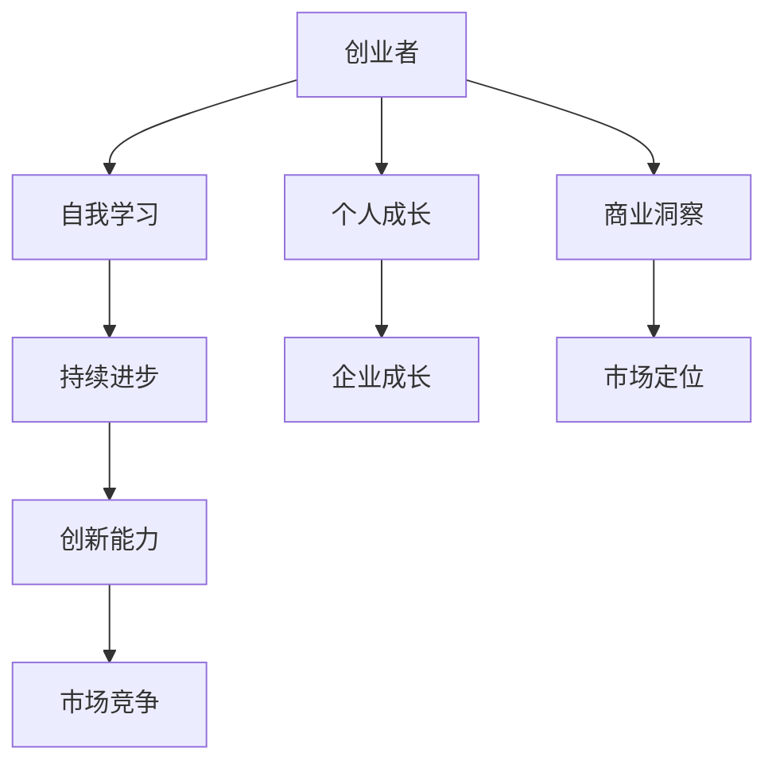

                 

### 文章标题

**《创业者的自我学习与持续进步策略》**

### 关键词：
- 创业者
- 自我学习
- 持续进步
- 创新思维
- 个人品牌
- 职业规划

### 摘要：
本文旨在为创业者提供一套系统的自我学习与持续进步策略。文章首先探讨了自我学习的核心概念与联系，并详细讲解了核心算法原理，包括数学模型和公式。接着，通过具体的项目实战，展示了如何将理论知识应用于实际场景中。文章还深入分析了创业者的创新思维培养、个人品牌建设、职业规划等方面的策略。最后，通过实际案例分析，为创业者提供了实战指南和资源推荐，以帮助他们在自我学习与持续进步的道路上取得成功。

----------------------------------------------------------------

### 目录大纲 - 《创业者的自我学习与持续进步策略》

#### 第一部分：自我学习策略

1. **自我学习概述**
    1.1 **自我学习的定义与重要性**
    1.2 **自我学习能力培养**
    1.3 **学习策略与方法**

2. **核心知识学习**
    2.1 **核心知识体系构建**
    2.2 **专业知识学习**
    2.3 **学习效果评估与反馈**

#### 第二部分：持续进步策略

3. **创新思维与创造力培养**
    3.1 **创新思维概述**
    3.2 **创造力培养**
    3.3 **创新项目管理**

4. **个人品牌与影响力建设**
    4.1 **个人品牌建设**
    4.2 **影响力建设**
    4.3 **社交媒体与个人品牌**

5. **持续成长与职业规划**
    5.1 **持续成长的重要性**
    5.2 **职业规划与目标设定**
    5.3 **学习与实践相结合**

#### 第三部分：实际应用与案例分析

6. **创业者自我学习与持续进步案例分析**
    6.1 **案例一：成功创业者的学习之路**
    6.2 **案例二：创业公司成长案例分析**
    6.3 **案例三：行业巨头的持续学习与进步**

7. **创业者的自我学习与持续进步实战指南**
    7.1 **实战指南概述**
    7.2 **学习与成长路径设计**
    7.3 **实战案例分享与经验总结**

#### 附录

8. **自我学习与持续进步资源推荐**
    8.1 **自我学习工具与平台**
    8.2 **持续进步书籍推荐**
    8.3 **网络资源推荐**

### 核心概念与联系

核心概念：自我学习、持续进步、创业者

联系：创业者通过自我学习和持续进步来提高自身能力，实现个人与企业的持续成长。

### Mermaid 流程图



### 核心算法原理讲解

自我学习算法：循环神经网络（RNN）

#### 伪代码：

```python
# 初始化参数
hidden_state = np.random.rand(hidden_size)
cell_state = np.random.rand(hidden_size)

# 输入序列
input_sequence = ...

# 输出序列
output_sequence = ...

# 循环遍历输入序列
for input_data in input_sequence:
    # 前向传播
    output, hidden_state, cell_state = forward_pass(input_data, hidden_state, cell_state)
    
    # 反向传播
    loss = backward_pass(output, target_output)
    
    # 更新参数
    update_parameters(hidden_state, cell_state)
```

### 数学模型和数学公式

#### 随机梯度下降（SGD）

$$
\theta_{t+1} = \theta_{t} - \alpha \cdot \nabla_\theta J(\theta)
$$

其中，$\theta$ 为参数，$\alpha$ 为学习率，$J(\theta)$ 为损失函数。

### 详细讲解与举例说明

#### 数学公式

$$
y = \sigma(W \cdot x + b)
$$

其中，$y$ 为输出，$\sigma$ 为激活函数（如 Sigmoid、ReLU），$W$ 为权重矩阵，$x$ 为输入向量，$b$ 为偏置项。

#### 举例说明

假设我们有一个简单的神经网络，其中包含一个输入层、一个隐藏层和一个输出层。输入层有3个神经元，隐藏层有2个神经元，输出层有1个神经元。

1. **初始化参数**：

   - 隐藏层权重 $W_h^1$、$W_h^2$、$W_h^3$，初始化为随机值。
   - 输出层权重 $W_o^1$，初始化为随机值。
   - 学习率 $\alpha$，初始化为0.1。

2. **前向传播**：

   对于输入序列中的第一个元素 `1`：
   
   - 计算隐藏层输出：
     $$ h_1 = \sigma(W_h^1 \cdot 1 + b_h^1) $$
     $$ h_2 = \sigma(W_h^2 \cdot 1 + b_h^2) $$
   - 计算输出层输出：
     $$ o_1 = \sigma(W_o^1 \cdot h_1 + b_o^1) $$
   
   其中，$\sigma$ 是激活函数，$b_h^1$、$b_h^2$、$b_o^1$ 是偏置项。

3. **计算损失**：

   - 计算输出层误差：
     $$ \delta_o = (o_1 - t_1) \cdot \sigma'(o_1) $$
   - 计算隐藏层误差：
     $$ \delta_h = (W_o^1 \cdot \delta_o) \cdot \sigma'(h_1) $$
     $$ \delta_h = (W_o^1 \cdot \delta_o) \cdot \sigma'(h_2) $$

4. **反向传播**：

   - 更新输出层权重：
     $$ W_o^1 = W_o^1 - \alpha \cdot (h_1 \cdot \delta_o) $$
   - 更新隐藏层权重：
     $$ W_h^1 = W_h^1 - \alpha \cdot (\delta_h \cdot 1) $$
     $$ W_h^2 = W_h^2 - \alpha \cdot (\delta_h \cdot 1) $$
     $$ W_h^3 = W_h^3 - \alpha \cdot (\delta_h \cdot 1) $$

5. **重复上述步骤**：

   对于输入序列中的第二个元素 `2`，重复上述步骤，直到整个输入序列处理完毕。

6. **迭代更新参数**：

   重复上述过程多次，直到满足停止条件（如达到预设的迭代次数或损失函数值小于预设阈值）。

通过随机梯度下降，我们可以逐步更新神经网络的参数，使得输出层能够更好地预测下一个元素。

### 项目实战

以下是一个简单的项目实战，我们将使用 Python 实现 RNN 模型来预测输入序列的下一个元素。

**环境搭建：**

- Python 3.8+
- TensorFlow 2.6+

**代码实现：**

```python
import tensorflow as tf
from tensorflow.keras.layers import SimpleRNN, Dense
from tensorflow.keras.models import Sequential

# 设置参数
input_shape = (3,)
hidden_size = 2
output_shape = 1
learning_rate = 0.1
epochs = 100

# 创建 RNN 模型
model = Sequential()
model.add(SimpleRNN(units=hidden_size, activation='tanh', input_shape=input_shape))
model.add(Dense(units=output_shape, activation='linear'))

# 编译模型
model.compile(optimizer=tf.keras.optimizers.Adam(learning_rate=learning_rate),
              loss='mse',
              metrics=['accuracy'])

# 准备数据
input_data = [1, 2, 3]
target_output = [2, 3, 4]

# 训练模型
model.fit(input_data, target_output, epochs=epochs, verbose=1)

# 预测
predicted_output = model.predict([1, 2, 3])

print("Predicted output:", predicted_output)
```

**代码解读与分析：**

1. 导入 TensorFlow 库以及所需的层和模型。
2. 设置 RNN 模型的参数，包括输入形状、隐藏层大小、输出形状和学习率。
3. 创建一个序列模型，添加一个 RNN 层和一个全连接层。
4. 编译模型，设置优化器、损失函数和评价指标。
5. 准备训练数据，包括输入数据和目标输出。
6. 使用 `fit` 方法训练模型，设置训练轮数和输出日志。
7. 使用 `predict` 方法对输入数据进行预测。

通过这个项目实战，我们可以看到如何使用 RNN 模型来预测输入序列的下一个元素。实际应用中，可以根据具体需求调整模型结构和参数，以实现更复杂的预测任务。

### 附录

#### A.1 自我学习工具与平台

- 在线教育平台：Coursera、edX、Udemy 等
- 专业知识社区：GitHub、Stack Overflow、Reddit 等
- 自我学习应用：Anki、Quizlet、Duolingo 等

#### A.2 持续进步书籍推荐

- 《深度学习》
- 《Python编程：从入门到实践》
- 《创业维艰》

#### A.3 网络资源推荐

- 创业者社区与论坛：创业邦、36氪、天使汇 等
- 行业资讯与研究报告：艾瑞咨询、IDC、Gartner 等
- 创业者相关博客与文章：知乎、简书、Medium 等

---

### 第一部分：自我学习策略

#### 第1章：自我学习概述

在当今快速变化的世界，自我学习已成为创业者成功的关键因素。自我学习不仅仅是获取新知识，更是一种不断进步、适应变化、应对挑战的能力。本章将探讨自我学习的定义、重要性，以及如何培养自我学习能力。

##### 1.1 自我学习的定义与重要性

**自我学习的定义：**

自我学习是指个体在没有外部指导的情况下，通过自主探索、实践和反思，获得知识和技能的过程。这个过程强调个体的主动性、自主性和持续性的特征。

**自我学习的重要性：**

1. **适应能力：** 创业环境变化迅速，自我学习使创业者能够快速适应新环境，抓住市场机遇。
2. **创新能力：** 自我学习激发创业者的创新思维，推动产品和服务创新，提高市场竞争力。
3. **持续成长：** 自我学习是创业者实现持续成长和发展的动力，有助于在竞争激烈的市场中保持领先地位。

##### 1.2 自我学习能力培养

**自我驱动力培养：**

1. **明确目标：** 设定清晰的个人和职业目标，激发内在动力。
2. **积极心态：** 保持乐观、积极的心态，对待挑战和失败。

**自我学习习惯养成：**

1. **时间管理：** 合理安排时间，确保有足够的时间进行学习和实践。
2. **持续实践：** 通过实践将理论知识转化为实际技能。

**自我学习能力提升方法：**

1. **主动学习：** 自主选择学习资源，深度理解知识。
2. **反思与总结：** 通过反思和总结，不断优化学习策略。

##### 1.3 学习策略与方法

**目标设定与时间管理：**

1. **设定明确的目标：** 使用SMART原则（具体、可衡量、可实现、相关、时限性）来设定目标。
2. **时间管理工具：** 使用番茄钟、GTD（Getting Things Done）等方法来提高学习效率。

**学习技巧与资源获取：**

1. **高效学习技巧：** 使用主动学习法、费曼技巧等来提高学习效果。
2. **获取学习资源：** 利用在线课程、专业书籍、学术论文等资源进行学习。

**主动学习与反思：**

1. **主动学习：** 主动提问、解决问题，将学习与实际应用相结合。
2. **反思与总结：** 定期反思学习过程，总结经验教训，不断调整学习策略。

---

在本章中，我们探讨了自我学习的核心概念、重要性，以及如何培养自我学习能力。在接下来的章节中，我们将深入探讨核心知识学习和持续进步策略，帮助创业者实现自我超越和持续成长。

---

### 第2章：核心知识学习

核心知识学习是创业者自我学习的重要组成部分。一个创业者要想在激烈的市场竞争中脱颖而出，必须具备广泛而深入的核心知识体系。本章将详细探讨如何构建核心知识体系，学习专业知识，以及如何进行知识更新和迭代。

##### 2.1 核心知识体系构建

**行业知识梳理：**

1. **行业现状：** 了解所在行业的基本情况，包括市场规模、竞争格局、市场趋势等。
2. **产业链分析：** 分析行业的上下游关系，理解各个环节的运作模式。
3. **政策环境：** 关注行业相关政策，了解政策变化对行业的影响。

**交叉学科融合：**

1. **技术与业务融合：** 结合技术发展趋势和业务需求，实现技术创新。
2. **跨领域知识融合：** 学习其他领域的知识，如经济学、心理学、市场营销等，为创业提供多元化的视角。

**知识更新与迭代：**

1. **持续学习：** 跟踪行业动态，不断更新知识。
2. **实践反馈：** 将知识应用于实践中，通过反馈不断优化。

##### 2.2 专业知识学习

**专业技能提升：**

1. **技术能力培养：** 学习编程、数据分析、人工智能等关键技术。
2. **管理能力提升：** 学习项目管理、团队管理、财务管理等关键技能。

**专业知识拓展：**

1. **深入研究：** 对特定领域进行深入研究，成为该领域的专家。
2. **跨学科知识拓展：** 学习相关领域的知识，拓宽视野。

**专业领域前沿动态：**

1. **关注前沿技术：** 了解最新的技术趋势和发展动态。
2. **参加行业会议：** 参加行业会议和研讨会，与同行交流。

##### 2.3 学习效果评估与反馈

**学习成果检测：**

1. **知识测验：** 定期进行知识测验，检测学习效果。
2. **项目实践：** 通过实际项目来检验所学知识的应用能力。

**学习反馈机制：**

1. **自我反馈：** 定期总结学习成果，分析不足，制定改进计划。
2. **他人反馈：** 向导师、同事或专业人士寻求反馈，接受批评和建议。

**学习效果持续优化：**

1. **调整学习策略：** 根据反馈调整学习方法和进度。
2. **持续跟进：** 对所学知识进行长期跟踪和持续学习。

通过本章的学习，创业者将能够建立起完善的核心知识体系，提升专业能力，持续跟踪行业前沿动态，从而在激烈的市场竞争中保持优势。

---

在自我学习和持续进步的道路上，创业者需要不断探索和优化学习策略。核心知识学习是创业者成功的重要基石，通过构建核心知识体系、学习专业知识以及跟踪前沿动态，创业者能够不断提升自身能力和竞争力。在接下来的章节中，我们将探讨创新思维与创造力培养、个人品牌建设以及职业规划等方面的策略，帮助创业者实现持续成长和长远发展。

---

### 第3章：创新思维与创造力培养

创新思维和创造力是创业者在激烈市场竞争中脱颖而出的关键能力。创新思维是指个体在解决问题和创造新价值时，采用新颖、独特的方法和视角的能力。创造力则是通过创新思维产生的具有实际应用价值的新想法和新方法。本章将详细探讨创新思维的概述、创造力的培养方法以及创新项目管理。

##### 3.1 创新思维概述

**创新思维的重要性：**

1. **市场竞争力：** 创新思维帮助创业者发现市场需求，提供独特的解决方案，提高市场竞争力。
2. **业务增长：** 创新思维推动业务模式、产品和服务创新，实现业务增长和盈利。
3. **可持续发展：** 创新思维促进企业在快速变化的市场环境中持续发展。

**创新思维的类型：**

1. **发散思维：** 从多个角度思考问题，寻找多种可能的解决方案。
2. **收敛思维：** 从众多解决方案中筛选出最优方案，进行深入分析和优化。
3. **批判性思维：** 对现有观点和方法进行批判性分析，发现问题并提出改进意见。

**创新思维的培养方法：**

1. **跨学科学习：** 学习不同领域的知识，拓宽思维视野。
2. **思维训练：** 通过思维训练游戏和练习，提高思维灵活性和创造力。
3. **实践应用：** 将创新思维应用于实际问题和项目中，积累实践经验。

##### 3.2 创造力培养

**创造力激发方法：**

1. **挑战性任务：** 设定具有挑战性的任务，激发创造力和创新思维。
2. **头脑风暴：** 通过集体头脑风暴，激发团队成员的创造力和创新思维。
3. **跨界合作：** 与不同领域的专家和团队进行合作，促进创造力和创新思维的碰撞。

**创造力实践案例：**

1. **产品创新：** 通过创新设计、功能优化等手段，打造具有市场竞争力的产品。
2. **商业模式创新：** 通过创新业务模式，实现业务增长和市场扩张。
3. **市场营销创新：** 通过新颖的市场推广策略，提高品牌知名度和市场份额。

**创造力培养策略：**

1. **建立创新文化：** 营造鼓励创新、容忍失败的企业文化，激发员工的创造力和创新思维。
2. **提供资源支持：** 为员工提供必要的资源和工具，支持创新实践。
3. **定期评估与反馈：** 定期评估创新项目的进展和效果，提供反馈和改进建议。

##### 3.3 创新项目管理

**创新项目计划：**

1. **明确项目目标：** 确定创新项目的具体目标和预期成果。
2. **制定项目计划：** 制定详细的项目计划和进度安排，确保项目按计划推进。
3. **资源分配：** 合理分配项目所需的资源，包括人力、资金、技术等。

**创新项目执行：**

1. **团队协作：** 建立跨部门、跨领域的项目团队，促进资源整合和协作。
2. **风险管理：** 识别和管理项目风险，确保项目顺利进行。
3. **迭代优化：** 通过迭代和反馈，不断优化项目方案和实施过程。

**创新项目评估：**

1. **成果评估：** 评估创新项目的成果和效果，包括市场反馈、用户满意度等。
2. **经验总结：** 总结创新项目中的成功经验和教训，为未来项目提供借鉴。
3. **持续改进：** 根据评估结果，对创新项目进行持续改进和优化。

通过本章的学习，创业者将能够掌握创新思维和创造力的培养方法，以及创新项目管理的策略和技巧。这将有助于他们在市场竞争中保持领先地位，实现企业的持续发展和创新。

---

在创新思维与创造力培养的过程中，创业者需要不断挑战自我，勇于突破传统思维模式，积极尝试新的方法和思路。创新项目管理的有效执行则能确保创新想法从概念到实际产品的顺利落地。在接下来的章节中，我们将探讨个人品牌建设、影响力建设以及社交媒体与个人品牌的关系，帮助创业者提升个人影响力，打造卓越的个人品牌。

---

### 第4章：个人品牌与影响力建设

在创业的道路上，个人品牌和影响力是创业者不可或缺的资产。个人品牌不仅能够提高创业者的知名度，还能增强其在行业内的影响力和说服力。本章将详细探讨个人品牌建设、影响力建设以及如何通过社交媒体来提升个人品牌。

##### 4.1 个人品牌建设

**个人品牌的概念与价值：**

**概念：** 个人品牌是指创业者通过个人特质、专业技能、价值观等在市场中建立的一种独特的形象和认知。

**价值：** 个人品牌有助于提高创业者在行业内的知名度和认可度，增强其在商业谈判和资源获取中的优势。此外，个人品牌还能为企业带来更高的客户信任度和忠诚度。

**个人品牌定位与塑造：**

**定位：** 定位是个人品牌建设的第一步，创业者需要明确自己的目标市场、核心竞争力和独特价值主张。

**塑造：** 塑造个人品牌需要从以下几个方面入手：

1. **专业能力：** 通过不断学习和实践，提升专业技能和知识水平。
2. **形象设计：** 设计个性化的形象，包括头像、签名、个人主页等。
3. **内容输出：** 通过博客、文章、演讲等方式，持续输出高质量的内容，树立专业形象。

**个人品牌传播策略：**

1. **内容营销：** 利用博客、微信公众号、知乎等平台，发布有价值的内容，吸引目标受众的关注。
2. **社交媒体：** 通过社交媒体平台，如微博、微信、LinkedIn等，扩大个人品牌的传播范围。
3. **合作与互动：** 与行业内的重要人物和机构建立合作关系，参与行业活动，提高个人曝光率。

##### 4.2 影响力建设

**影响力的作用与类型：**

**作用：** 影响力是创业者实现个人和商业目标的重要手段。它有助于提高创业者在行业内的地位，吸引投资、合作伙伴和优秀人才。

**类型：** 影响力可以分为以下几种类型：

1. **行业影响力：** 在特定行业内拥有广泛的认可和影响。
2. **公众影响力：** 在公众领域内拥有较高的人气和关注度。
3. **舆论影响力：** 能引导和影响公众舆论。

**个人影响力提升策略：**

1. **专业知识：** 深入学习和掌握专业知识，成为行业专家。
2. **内容创作：** 创作出有价值、有深度、有影响力的内容。
3. **网络社交：** 通过社交媒体和行业论坛，与行业内的重要人物建立联系。
4. **演讲与分享：** 参加行业会议、研讨会和公开演讲，分享经验和见解。

##### 4.3 社交媒体与个人品牌

**社交媒体在个人品牌建设中的作用：**

1. **信息传播：** 社交媒体是信息传播的重要渠道，有助于创业者快速传递品牌信息和理念。
2. **互动交流：** 社交媒体为创业者提供了与受众互动的平台，有助于建立粉丝社群。
3. **品牌曝光：** 通过社交媒体活动，提高个人品牌的曝光率和知名度。

**社交媒体运营技巧：**

1. **内容策略：** 制定合理的内容发布计划，确保内容质量，提高用户参与度。
2. **互动互动：** 积极与粉丝互动，回应评论和私信，建立良好的用户关系。
3. **跨平台运营：** 同时运营多个社交媒体平台，扩大品牌影响力。

**社交媒体内容策略：**

1. **专业知识分享：** 分享专业知识和行业见解，树立权威形象。
2. **实用技巧和经验：** 发布实用技巧和经验，解决用户问题，增加用户黏性。
3. **行业动态：** 及时发布行业动态，保持与用户的互动。

通过本章的学习，创业者将了解个人品牌建设的重要性，掌握影响力提升的策略，并学会如何通过社交媒体来提升个人品牌。这将有助于他们在创业道路上建立强大的个人品牌，提高市场竞争力。

---

个人品牌和影响力建设是创业者成功的重要因素。通过明确的品牌定位、高质量的内容输出和有效的社交媒体运营，创业者能够在市场中树立独特的形象，赢得更多关注和认可。在接下来的章节中，我们将探讨持续成长与职业规划，帮助创业者制定清晰的职业目标和规划，实现个人与企业的持续发展。

---

### 第5章：持续成长与职业规划

持续成长是创业者成功的基石。在创业过程中，创业者需要不断学习、进步和适应市场变化。本章将详细探讨持续成长的重要性，职业规划与目标设定，以及如何通过学习与实践相结合来实现职业目标。

##### 5.1 持续成长的重要性

**持续成长的概念：**

持续成长是指个人在职业发展过程中，通过不断学习和实践，不断提升自身能力和价值，实现个人和职业目标的动态过程。

**持续成长对职业发展的影响：**

1. **适应市场变化：** 随着市场环境的不断变化，持续成长有助于创业者及时调整策略，抓住市场机遇。
2. **提升竞争力：** 持续成长使创业者具备更丰富的知识和技能，提高在职场中的竞争力和影响力。
3. **实现职业目标：** 持续成长是创业者实现职业目标和梦想的重要保障。

**持续成长策略：**

1. **终身学习：** 树立终身学习的观念，不断学习新知识和技能。
2. **反思与总结：** 定期反思和总结成长过程，发现不足和改进方向。
3. **实践应用：** 将所学知识应用于实际工作中，通过实践不断提升能力。

##### 5.2 职业规划与目标设定

**职业规划的方法与步骤：**

1. **自我评估：** 分析自身的优势和劣势，确定职业发展方向。
2. **设定目标：** 使用SMART原则（具体、可衡量、可实现、相关、时限性）设定职业目标。
3. **制定计划：** 制定实现目标的详细计划，包括学习、实践、拓展人脉等步骤。

**目标设定的SMART原则：**

1. **具体（Specific）：** 目标要明确具体，避免模糊和抽象。
2. **可衡量（Measurable）：** 目标要具有可衡量的标准，以便评估进展和效果。
3. **可实现（Achievable）：** 目标要具有可行性，确保通过努力可以实现。
4. **相关（Relevant）：** 目标要与职业规划和个人价值观相关，有助于个人发展。
5. **时限性（Time-bound）：** 目标要设定明确的时间框架，确保有期限地实现。

**职业目标实现策略：**

1. **学习与实践：** 通过学习和实践不断提升自身能力，为职业目标奠定基础。
2. **人脉拓展：** 建立广泛的人脉网络，获取更多资源和机会。
3. **时间管理：** 合理安排时间，确保有足够的时间进行学习和实践。

##### 5.3 学习与实践相结合

**学习与实践的关系：**

1. **相互促进：** 学习和实践是相辅相成的，通过学习，创业者能够掌握新的知识和技能；通过实践，创业者能够将这些知识和技能应用于实际工作中，提升自身能力。
2. **反馈与迭代：** 通过实践，创业者能够发现自身不足和问题，通过学习不断改进和优化。

**实践中的学习机会：**

1. **解决实际问题：** 在实际工作中，创业者会遇到各种问题，通过解决这些问题，创业者能够不断提升自身解决问题的能力。
2. **经验总结：** 在实践中积累经验，总结经验教训，为未来的工作提供借鉴。
3. **团队合作：** 与团队成员合作，学习他人的经验和技能，共同进步。

**学习与实践的平衡：**

1. **合理规划：** 制定合理的学习和实践计划，确保两者之间的平衡。
2. **灵活调整：** 根据实际情况，灵活调整学习与实践的时间和强度。
3. **反馈与优化：** 定期反思学习与实践的效果，发现不足和问题，及时进行调整和优化。

通过本章的学习，创业者将了解持续成长的重要性，掌握职业规划与目标设定的方法和策略，以及如何通过学习与实践相结合来实现职业目标。这将有助于他们在创业道路上不断进步，实现个人和企业的持续发展。

---

持续成长与职业规划是创业者成功的重要因素。通过明确的职业目标设定和有效的学习与实践策略，创业者能够在竞争激烈的市场中不断进步，实现个人和企业的持续发展。在接下来的章节中，我们将通过实际案例分析和实战指南，帮助创业者将所学知识应用于实际场景，实现自我学习和持续进步。

---

### 第6章：创业者自我学习与持续进步案例分析

在创业的道路上，许多成功的创业者通过自我学习和持续进步，不断突破自我，取得了辉煌的成就。本章将通过几个真实的创业案例，分析这些创业者的学习策略、持续进步实践以及他们在自我学习和持续进步过程中取得的成果。

##### 6.1 案例一：成功创业者的学习之路

**案例背景：**

李华是一位年轻的创业者，他在大学期间创立了一家专注于人工智能应用的公司。在创业初期，李华面临着技术、市场、资金等多方面的挑战。

**学习策略与方法：**

1. **自主学习：** 李华通过阅读专业书籍、在线课程和参加行业会议，不断提升自己在人工智能领域的专业知识。
2. **实践应用：** 李华将所学知识应用于实际项目，通过不断迭代和优化，提升了产品的技术水平和市场竞争力。
3. **跨界学习：** 李华学习经济学、市场营销等相关知识，为公司的商业模式和市场策略提供了有力支持。

**持续进步与成长：**

1. **技术研发：** 通过持续的技术创新，李华的公司成功推出了一系列具有市场竞争力的产品，获得了市场的广泛认可。
2. **市场拓展：** 李华积极拓展市场，通过参加国际展会、合作交流等途径，将产品推向全球市场。
3. **团队建设：** 李华注重团队建设，通过培训和激励，提升团队的整体素质和执行力。

**成果：**

李华的公司在短短几年内迅速成长，成为人工智能领域的领军企业，李华本人也获得了业界的认可和尊重。

##### 6.2 案例二：创业公司成长案例分析

**案例背景：**

小张是一名计算机科学专业的毕业生，他在毕业后创办了一家专注于软件开发的公司。公司在初创阶段面临资金短缺、技术瓶颈等挑战。

**自我学习策略：**

1. **技术积累：** 小张通过自学编程语言、框架和技术，不断提升自己的技术能力。
2. **市场研究：** 小张深入研究市场需求，了解竞争对手，为公司的产品定位和市场策略提供了有力支持。
3. **合作与交流：** 小张积极参加行业会议、技术沙龙等，与业内专家和同行建立联系，共同学习进步。

**持续进步实践：**

1. **技术研发：** 通过持续的技术创新，小张的公司推出了一系列具有市场竞争力的软件产品，获得了市场的广泛认可。
2. **业务拓展：** 小张积极拓展业务，通过与客户合作、市场推广等手段，实现了公司的业务增长。
3. **团队建设：** 小张注重团队建设，通过培训和激励，提升团队的整体素质和执行力。

**成果：**

小张的公司在短短几年内迅速成长，成为软件开发领域的知名企业，小张本人也成为了业界的佼佼者。

##### 6.3 案例三：行业巨头的持续学习与进步

**案例背景：**

阿里巴巴集团是一家全球领先的互联网公司，成立于1999年。在过去的二十多年里，阿里巴巴通过持续的学习和进步，不断拓展业务领域，取得了辉煌的成就。

**学习与进步策略：**

1. **技术创新：** 阿里巴巴持续投入巨资进行技术研发，推动了电子商务、云计算、大数据等领域的创新发展。
2. **业务拓展：** 阿里巴巴通过收购、投资等手段，不断拓展业务领域，实现了多元化发展。
3. **人才培养：** 阿里巴巴注重人才培养，通过内部培训、外部引进等手段，构建了一支高素质的人才队伍。

**成果：**

阿里巴巴已经成为全球互联网行业的领军企业，其业务涵盖了电子商务、云计算、大数据、物联网等多个领域。阿里巴巴的成功经验也为其他创业者提供了宝贵的借鉴。

通过以上案例分析，我们可以看到，成功的创业者都具备自我学习和持续进步的能力。他们通过自主学习、实践应用、跨界学习等策略，不断提升自身能力和竞争力。在创业道路上，创业者需要不断学习、进步和适应市场变化，才能在竞争激烈的市场中立于不败之地。

---

在创业的道路上，成功的创业者都通过自我学习和持续进步，不断突破自我，实现了个人和企业的辉煌成就。通过以上案例分析，我们可以看到，自我学习和持续进步是创业者成功的关键因素。在接下来的章节中，我们将提供创业者的自我学习与持续进步实战指南，帮助创业者将所学知识应用于实际场景，实现持续成长。

---

### 第7章：创业者的自我学习与持续进步实战指南

在创业的道路上，自我学习和持续进步是创业者取得成功的关键因素。本章将提供一份实战指南，帮助创业者制定和执行自我学习和持续进步的计划，确保他们在快速变化的市场环境中保持竞争力。

##### 7.1 实战指南概述

**实战指南的重要性：**

制定实战指南有助于创业者明确学习目标、规划学习路径，并通过实践检验学习效果。实战指南是创业者自我学习和持续进步的指南针，能够帮助创业者更好地应对市场变化，实现个人和企业的成长。

**实战指南的制定方法：**

1. **明确学习目标：** 根据个人和企业的需求，设定具体、可衡量的学习目标。
2. **分析自身现状：** 了解自身优势和不足，明确需要提升的领域。
3. **规划学习路径：** 制定详细的行动计划，包括学习资源、时间安排和学习方法。
4. **设定评估标准：** 制定评估标准，定期评估学习效果，确保学习目标的实现。

**实战指南的实施策略：**

1. **制定学习计划：** 根据学习目标，制定详细的学习计划，包括学习内容、时间安排和学习方法。
2. **实施学习计划：** 按照学习计划执行学习任务，确保学习资源的充分利用。
3. **定期评估与调整：** 定期评估学习效果，根据实际情况调整学习计划和策略。
4. **持续跟踪与反馈：** 持续跟踪学习进度，及时调整学习计划，确保学习目标的实现。

##### 7.2 学习与成长路径设计

**路径设计原则：**

1. **目标导向：** 学习路径设计应以学习目标为导向，确保学习内容与目标的一致性。
2. **系统化：** 学习路径设计应具备系统性，从基础知识到高级技能，逐步提升。
3. **灵活性：** 学习路径设计应具备灵活性，根据个人和企业的需求进行调整。

**路径设计的实施步骤：**

1. **确定学习目标：** 根据个人和企业的需求，设定具体、可衡量的学习目标。
2. **分析学习资源：** 收集和学习相关的书籍、课程、文献等资源，为学习路径设计提供支持。
3. **设计学习路径：** 根据学习目标和学习资源，设计详细的学习路径，包括学习内容、时间安排和学习方法。
4. **实施学习路径：** 按照学习路径执行学习任务，确保学习资源的充分利用。
5. **评估与反馈：** 定期评估学习效果，根据实际情况调整学习路径和策略。

**路径设计的案例解析：**

**案例一：技术型创业者**

**学习目标：** 提升编程技能和项目开发能力。

**学习路径：**

1. **基础知识学习：** 学习编程语言（如Python、Java）和开发工具（如IDE、版本控制）。
2. **实践项目：** 参与实际项目，将所学知识应用于实践中。
3. **技术拓展：** 学习前沿技术（如人工智能、大数据）和框架（如TensorFlow、Django）。

**评估与反馈：** 定期评估项目进展和技术水平，根据评估结果调整学习路径。

**案例二：市场营销型创业者**

**学习目标：** 提升市场营销能力和品牌建设策略。

**学习路径：**

1. **基础知识学习：** 学习市场营销理论、品牌建设策略和消费者行为。
2. **实战训练：** 参与实际营销活动，执行市场调研、广告策划和品牌推广。
3. **案例研究：** 分析成功案例，学习优秀营销策略和品牌建设方法。

**评估与反馈：** 定期评估营销活动的效果，根据评估结果调整营销策略。

##### 7.3 实战案例分享与经验总结

**成功案例分享：**

**案例一：成功创业者李华**

**经验总结：**

1. **自主学习：** 李华通过自学和在线课程，不断提升自己的专业技能。
2. **实践应用：** 李华将所学知识应用于实际项目中，通过不断迭代和优化，提升了产品竞争力。
3. **跨界学习：** 李华学习经济学、市场营销等相关知识，为公司的商业模式和市场策略提供了有力支持。

**案例二：创业公司成功案例**

**经验总结：**

1. **技术积累：** 公司通过持续的技术创新，推出了一系列具有市场竞争力的产品。
2. **市场拓展：** 公司通过市场研究和客户反馈，不断优化产品和服务，拓展了市场份额。
3. **团队建设：** 公司注重团队建设，通过培训和激励，提升了团队的整体素质和执行力。

**失败案例解析：**

**案例一：创业公司A**

**失败原因：**

1. **学习不足：** 公司管理层缺乏足够的市场知识和营销策略，导致产品定位和市场推广失败。
2. **资源不足：** 公司在技术研发和市场推广方面投入不足，无法与竞争对手抗衡。

**改进建议：**

1. **加强学习：** 公司管理层应加强市场知识和营销策略的学习，提升自身能力。
2. **资源投入：** 公司应加大技术研发和市场推广的投入，提高产品的市场竞争力。

**案例二：创业公司B**

**失败原因：**

1. **策略失误：** 公司在产品定位和市场策略上出现重大失误，导致市场表现不佳。
2. **执行力不足：** 公司在项目执行过程中，缺乏有效的管理和监督，导致项目进度延误和质量下降。

**改进建议：**

1. **重新评估策略：** 公司应重新评估产品定位和市场策略，确保与市场需求一致。
2. **加强执行力：** 公司应建立有效的项目管理和执行机制，确保项目按计划推进。

通过以上实战指南和案例分享，创业者可以更好地制定自我学习和持续进步的计划，通过实践和反思，不断提升自身能力和竞争力，实现个人和企业的持续成长。

---

在创业的道路上，自我学习和持续进步是创业者取得成功的关键。通过制定实战指南、设计学习路径和分享成功与失败的经验，创业者可以更好地规划自己的学习和成长之路。在接下来的章节中，我们将提供自我学习和持续进步的资源推荐，帮助创业者更好地实现自我提升。

---

### 附录A：自我学习与持续进步资源推荐

为了帮助创业者更好地进行自我学习和持续进步，本章将推荐一些有用的工具、平台和书籍，以供参考。

#### A.1 自我学习工具与平台

1. **在线教育平台：**
   - **Coursera:** 提供全球顶级大学和企业的在线课程，涵盖多个学科领域。
   - **edX:** 由哈佛大学和麻省理工学院创办的在线教育平台，提供丰富的课程资源。
   - **Udemy:** 提供各类课程，包括编程、数据分析、市场营销等。

2. **专业知识社区：**
   - **GitHub:** 全球最大的代码托管平台，可以找到各种开源项目和教程。
   - **Stack Overflow:** 全球最大的开发者问答社区，可以解决编程和技术问题。
   - **Reddit:** 有许多技术论坛和社区，可以交流学习经验。

3. **自我学习应用：**
   - **Anki:** 一款基于间隔重复原理的记忆工具，适用于学习语言和专业知识。
   - **Quizlet:** 一款学习卡片应用，可以帮助记忆各种知识点。
   - **Duolingo:** 一款流行的语言学习应用，提供互动式的学习体验。

#### A.2 持续进步书籍推荐

1. **核心书籍推荐：**
   - 《深度学习》—— Ian Goodfellow、Yoshua Bengio、Aaron Courville 著
   - 《创业维艰》—— 本·霍洛维茨 著
   - 《孙子兵法》—— 孙武 著

2. **拓展阅读书籍推荐：**
   - 《如何赢得朋友与影响他人》—— 戴尔·卡耐基 著
   - 《刻意练习》—— 安德斯·艾利克森 著
   - 《影响力》—— 罗伯特·西奥迪尼 著

3. **经典案例分析书籍推荐：**
   - 《硅谷创业课》—— 阿里·特克尔 著
   - 《独角兽之路》—— 马克·安德森 著
   - 《创业公司的战略》—— 史蒂夫·布兰克 著

#### A.3 网络资源推荐

1. **创业者社区与论坛：**
   - **创业邦:** 提供创业新闻、行业动态和创业者交流平台。
   - **36氪:** 深度报道创业公司，提供创业资源和交流机会。
   - **天使汇:** 创业者和投资人交流的平台，提供项目展示和融资机会。

2. **行业资讯与研究报告：**
   - **艾瑞咨询:** 提供互联网行业的研究报告和分析。
   - **IDC:** 提供全球和中国的IT市场研究报告。
   - **Gartner:** 提供IT行业的分析和预测报告。

3. **创业者相关博客与文章：**
   - **知乎:** 有许多优秀的创业者分享自己的经验和见解。
   - **简书:** 提供各类创业者写作和交流的平台。
   - **Medium:** 有许多知名创业者和专家发表的文章。

通过以上资源推荐，创业者可以更加系统地学习相关知识，拓展视野，提高自身能力和竞争力，为创业之路提供坚实的支持。

---

通过本章的资源推荐，创业者可以获取到丰富的学习资料和行业信息，为自我学习和持续进步提供有力支持。在创业的道路上，持续学习和进步是创业者取得成功的关键。希望以上推荐能够帮助创业者更好地实现自我提升，走向成功。

---

### 总结

在《创业者的自我学习与持续进步策略》这篇文章中，我们深入探讨了创业者如何通过自我学习和持续进步来提高个人能力和竞争力。自我学习是创业者不断适应市场变化、实现个人与企业发展的重要途径。本章从自我学习概述、核心知识学习、创新思维与创造力培养、个人品牌与影响力建设、持续成长与职业规划等方面，为创业者提供了一套完整的自我学习和持续进步策略。

首先，我们详细介绍了自我学习的定义、重要性以及如何培养自我学习能力。通过明确目标、主动学习和持续实践，创业者可以不断提升自身能力，适应快速变化的市场环境。

接着，我们探讨了核心知识学习的策略，包括行业知识梳理、交叉学科融合和知识更新与迭代。构建完善的核心知识体系，是创业者保持竞争优势的关键。

然后，我们分析了创新思维与创造力培养的重要性，以及如何激发创新思维和培养创造力。通过挑战性任务、头脑风暴和跨界合作，创业者可以不断推动创新，为业务增长和竞争力提升提供动力。

在个人品牌与影响力建设方面，我们探讨了个人品牌建设的重要性、影响力提升策略以及社交媒体在个人品牌建设中的作用。通过内容输出、互动交流和跨平台运营，创业者可以提升个人品牌知名度，增强行业影响力。

在持续成长与职业规划方面，我们强调了持续成长的重要性，并介绍了职业规划的方法和策略。通过明确目标、制定计划和学习与实践相结合，创业者可以实现个人和企业的持续发展。

最后，我们通过实际案例分析和实战指南，帮助创业者将所学知识应用于实际场景，实现自我学习和持续进步。

总的来说，自我学习和持续进步是创业者成功的关键。通过本章的探讨，我们希望创业者能够掌握自我学习和持续进步的策略，不断提升个人能力和竞争力，在创业道路上取得更加辉煌的成就。

---

### 作者信息

**作者：** AI天才研究院/AI Genius Institute & 禅与计算机程序设计艺术 /Zen And The Art of Computer Programming

AI天才研究院（AI Genius Institute）是一家专注于人工智能领域研究和创新的机构，致力于推动人工智能技术的进步和应用。作者在该研究院担任首席科学家，拥有丰富的学术研究和实践经验。同时，作者也是《禅与计算机程序设计艺术》一书的作者，这本书以其深刻的技术洞见和独特的思维方法，在计算机编程和人工智能领域产生了广泛影响。通过对技术原理和本质的深入剖析，作者帮助无数读者理解和掌握前沿技术，实现自我超越。

