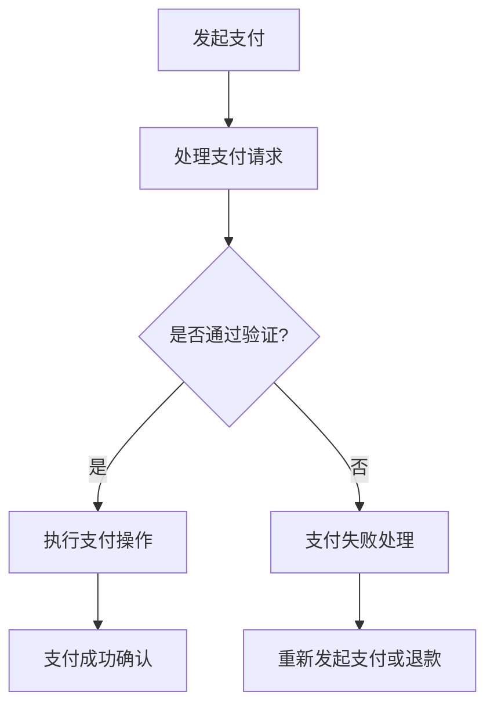

                 

### 《利用技术优势进行跨境支付创新》

> **关键词：** 跨境支付、区块链、加密货币、人工智能、大数据、云计算

> **摘要：** 本文将深入探讨技术优势在跨境支付领域的应用，从区块链、加密货币、人工智能、大数据和云计算等多个技术层面出发，分析这些技术如何推动跨境支付的创新，提高支付效率和安全性。通过实际案例，展示技术优势在跨境支付中的具体应用，并对未来发展趋势进行展望。

### 《利用技术优势进行跨境支付创新》目录大纲

## 第一部分：跨境支付概述

### 1.1 跨境支付的定义与重要性
#### 1.1.1 跨境支付的定义
#### 1.1.2 跨境支付的重要性
#### 1.1.3 跨境支付的历史与发展

### 1.2 跨境支付的主要参与者
#### 1.2.1 发起方与接收方
#### 1.2.2 银行与第三方支付平台
#### 1.2.3 跨境支付中介机构

### 1.3 跨境支付的主要模式
#### 1.3.1 直接支付模式
#### 1.3.2 代理支付模式
#### 1.3.3 联合支付模式

### 1.4 跨境支付面临的挑战与问题
#### 1.4.1 汇率风险
#### 1.4.2 资金流动风险
#### 1.4.3 法律法规差异

## 第二部分：技术优势在跨境支付中的应用

### 2.1 区块链技术在跨境支付中的应用
#### 2.1.1 区块链技术概述
#### 2.1.2 区块链在跨境支付中的优势
#### 2.1.3 主流区块链支付平台介绍

### 2.2 加密货币在跨境支付中的应用
#### 2.2.1 加密货币的定义与特点
#### 2.2.2 加密货币在跨境支付中的应用
#### 2.2.3 主流加密货币介绍

### 2.3 人工智能在跨境支付风险管理中的应用
#### 2.3.1 人工智能概述
#### 2.3.2 人工智能在跨境支付风险管理中的作用
#### 2.3.3 主流人工智能应用案例

### 2.4 大数据与云计算在跨境支付中的应用
#### 2.4.1 大数据概述
#### 2.4.2 云计算概述
#### 2.4.3 大数据与云计算在跨境支付中的应用

## 第三部分：技术优势下的跨境支付创新案例

### 3.1 案例一：基于区块链的跨境支付平台
#### 3.1.1 平台概述
#### 3.1.2 技术架构
#### 3.1.3 业务流程

### 3.2 案例二：加密货币在跨境支付中的应用
#### 3.2.1 应用场景
#### 3.2.2 技术实现
#### 3.2.3 业务效果

### 3.3 案例三：人工智能在跨境支付风险管理中的应用
#### 3.3.1 应用场景
#### 3.3.2 技术实现
#### 3.3.3 业务效果

### 3.4 案例四：大数据与云计算在跨境支付中的应用
#### 3.4.1 应用场景
#### 3.4.2 技术实现
#### 3.4.3 业务效果

## 第四部分：技术优势下的跨境支付发展趋势与未来展望

### 4.1 跨境支付行业现状与趋势
#### 4.1.1 全球跨境支付市场规模
#### 4.1.2 跨境支付行业发展趋势

### 4.2 技术优势在跨境支付中的未来应用
#### 4.2.1 区块链与跨境支付的未来
#### 4.2.2 加密货币与跨境支付的未来
#### 4.2.3 人工智能与跨境支付的未来

### 4.3 跨境支付行业面临的挑战与解决方案
#### 4.3.1 挑战一：法律法规差异
#### 4.3.2 挑战二：技术风险
#### 4.3.3 挑战三：市场竞争

## 第五部分：跨境支付技术创新实例与实现

### 5.1 技术创新实例一：基于区块链的跨境支付系统实现
#### 5.1.1 系统架构设计
#### 5.1.2 技术实现细节

### 5.2 技术创新实例二：加密货币跨境支付解决方案
#### 5.2.1 解决方案设计
#### 5.2.2 技术实现细节

### 5.3 技术创新实例三：人工智能在跨境支付风险管理中的应用
#### 5.3.1 应用场景分析
#### 5.3.2 技术实现步骤

### 5.4 技术创新实例四：大数据与云计算在跨境支付中的应用
#### 5.4.1 应用场景分析
#### 5.4.2 技术实现步骤

## 附录

### 附录A：技术工具与资源
#### A.1 区块链开发工具
#### A.2 加密货币钱包工具
#### A.3 人工智能开发框架
#### A.4 大数据与云计算平台

### 附录B：跨境支付法律法规参考
#### B.1 国际跨境支付法律法规
#### B.2 主要国家跨境支付法律法规

### 附录C：跨境支付案例研究
#### C.1 案例一：区块链跨境支付平台案例研究
#### C.2 案例二：加密货币跨境支付案例研究
#### C.3 案例三：人工智能跨境支付风险管理案例研究
#### C.4 案例四：大数据与云计算跨境支付案例研究

### Mermaid 流程图：



### 跨境支付核心算法原理：

```python
# 伪代码：汇率转换算法

def exchange_rate_conversion(amount, source_currency, target_currency):
    # 获取当前汇率
    current_rate = get_current_rate(source_currency, target_currency)
    
    # 计算转换后的金额
    converted_amount = amount * current_rate
    
    return converted_amount
```

### 数学模型和数学公式：

$$
\text{总支付金额} = \text{原始金额} \times \text{汇率转换系数}
$$

### 项目实战：

#### 1. 开发环境搭建：

- 安装Go语言开发环境
- 安装区块链节点软件（例如：Ethereum）
- 安装智能合约开发工具（例如：Truffle）

#### 2. 源代码详细实现：

```solidity
// SPDX-License-Identifier: MIT
pragma solidity ^0.8.0;

contract CrossBorderPayment {
    
    // 存储支付请求
    struct PaymentRequest {
        address sender;
        address receiver;
        uint256 amount;
        string currency;
    }

    // 存储所有支付请求
    PaymentRequest[] private paymentRequests;

    // 记录支付请求索引
    mapping(uint256 => bool) private paymentRequestStatus;

    // 添加支付请求
    function addPaymentRequest(address _receiver, uint256 _amount, string memory _currency) public {
        PaymentRequest memory request = PaymentRequest({
            sender: msg.sender,
            receiver: _receiver,
            amount: _amount,
            currency: _currency
        });
        paymentRequests.push(request);
        paymentRequestStatus[paymentRequests.length - 1] = false;
    }

    // 执行支付操作
    function executePayment(uint256 requestId) public {
        require(paymentRequestStatus[requestId], "Payment already executed");
        PaymentRequest storage request = paymentRequests[requestId];
        // 调用智能合约执行支付操作
        // ...（调用支付逻辑）
        paymentRequestStatus[requestId] = true;
    }

    // 查询支付状态
    function getPaymentStatus(uint256 requestId) public view returns (bool) {
        return paymentRequestStatus[requestId];
    }
}
```

#### 3. 代码解读与分析：

- **PaymentRequest 结构**：用于存储支付请求的信息，包括发送者、接收者、支付金额和货币类型。
- **paymentRequests 数组**：用于存储所有的支付请求。
- **paymentRequestStatus 映射**：用于记录每个支付请求的状态，是否已经执行。
- **addPaymentRequest 函数**：添加支付请求，并将请求状态设置为未执行。
- **executePayment 函数**：执行支付操作，将支付请求的状态设置为已执行。
- **getPaymentStatus 函数**：查询支付请求的状态。

通过这个智能合约，可以构建一个基于区块链的跨境支付系统，实现支付请求的存储、执行和状态查询。每个支付请求都会被记录在区块链上，确保了支付过程的安全性和透明性。同时，智能合约的执行逻辑可以根据实际需求进行调整，例如添加汇率转换、支付验证等环节。这个示例提供了一个基本的框架，开发者可以根据具体需求进行扩展和优化。

---

接下来，我们将逐步深入探讨跨境支付的概述，分析其定义、重要性以及历史发展。

### 1.1 跨境支付的定义与重要性

#### 1.1.1 跨境支付的定义

跨境支付是指不同国家或地区之间的货币交换过程，涉及两个或多个参与者。这个过程包括货币的发送、接收、转换和结算等多个环节。简单来说，跨境支付就是将一种货币兑换成另一种货币，以便在跨境交易中完成支付。

跨境支付的主要参与者包括：

- **发起方**：发起支付的一方，通常是商家、个人或企业。
- **接收方**：接收支付的一方，也通常是商家、个人或企业。
- **银行**：作为中介，处理货币的兑换和结算。
- **第三方支付平台**：提供支付服务的平台，如PayPal、支付宝等。
- **跨境支付中介机构**：专门从事跨境支付服务的机构。

#### 1.1.2 跨境支付的重要性

跨境支付在全球经济中扮演着重要角色，其重要性体现在以下几个方面：

1. **促进国际贸易**：跨境支付是国际贸易不可或缺的一部分，它使得不同国家之间的商品和服务交换变得更加便捷和高效。
2. **推动国际投资**：跨境支付为国际投资提供了必要的资金支持，促进了资本在全球范围内的流动。
3. **提高经济效率**：通过跨境支付，企业可以更快速地完成交易，降低交易成本，提高经济效益。
4. **加强国际金融合作**：跨境支付促进了不同国家之间的金融合作，有助于形成更紧密的国际金融体系。

#### 1.1.3 跨境支付的历史与发展

跨境支付的历史可以追溯到古代货币交换。随着现代金融技术的发展，跨境支付经历了多个阶段：

1. **早期阶段**：在银行系统和电子支付出现之前，跨境支付主要依赖于现金和汇票等传统方式。
2. **电子支付阶段**：随着互联网的普及，电子支付成为跨境支付的主要方式。这一阶段标志着跨境支付进入了信息化时代。
3. **移动支付阶段**：随着智能手机的普及，移动支付成为跨境支付的重要手段。用户可以通过移动设备完成跨境支付，大大提高了支付的便捷性。
4. **区块链与加密货币阶段**：近年来，区块链技术和加密货币的出现为跨境支付带来了新的可能性。这些技术有望进一步降低跨境支付的成本，提高支付速度和安全性。

总的来说，跨境支付在技术进步和全球化进程中不断发展，未来将继续发挥重要作用。

### 1.2 跨境支付的主要参与者

跨境支付涉及多个参与方，每个参与方在支付过程中扮演着不同的角色，共同确保支付流程的顺利进行。以下是对这些主要参与方的详细介绍：

#### 1.2.1 发起方与接收方

**发起方**通常是指需要支付资金的一方，可以是个人、企业或组织。在跨境支付中，发起方需要将本国货币转换为接收方所在国家的货币，以便完成交易。发起方可能需要通过银行或其他支付服务提供商发起支付。

**接收方**则是接收支付的一方，同样可以是个人、企业或组织。接收方通常需要将接收到的资金转换为本国货币或其他方便使用的货币。

发起方与接收方之间的跨境支付流程通常包括以下几个步骤：

1. **发起支付**：发起方通过银行或第三方支付平台发起支付请求，并提供支付金额、接收方信息等相关信息。
2. **货币兑换**：支付服务提供商将发起方的本国货币兑换为接收方所在国家的货币。
3. **跨境传输**：兑换后的货币被传输到接收方的账户中。
4. **支付确认**：接收方确认收到支付后，支付流程完成。

#### 1.2.2 银行与第三方支付平台

**银行**是跨境支付中最重要的参与方之一。传统跨境支付往往依赖于银行作为中介，负责货币兑换、跨境传输和风险控制。银行提供的服务包括：

1. **账户管理**：为发起方和接收方提供账户服务，便于资金管理。
2. **货币兑换**：根据市场需求和汇率变化，提供货币兑换服务。
3. **跨境传输**：通过国际银行间支付系统，完成货币的跨境传输。
4. **风险管理**：控制跨境支付中的风险，如汇率风险、信用风险等。

**第三方支付平台**（如PayPal、支付宝等）是在互联网时代崛起的重要支付服务提供商。它们提供以下服务：

1. **在线支付**：通过互联网为用户提供便捷的跨境支付服务。
2. **支付接口**：为商家和消费者提供支付接口，便于在线交易。
3. **货币兑换**：提供实时货币兑换服务，提高支付效率。
4. **支付保障**：提供支付安全保障，如退款、争议解决等。

#### 1.2.3 跨境支付中介机构

**跨境支付中介机构**（如国际汇款公司、货币兑换商等）是专门从事跨境支付服务的第三方机构。它们提供以下服务：

1. **汇款服务**：为个人和企业提供跨境汇款服务，降低支付成本。
2. **货币兑换**：提供货币兑换服务，满足不同货币兑换需求。
3. **支付咨询**：提供支付咨询和解决方案，帮助客户优化支付流程。
4. **风险控制**：控制跨境支付中的风险，确保支付安全。

总的来说，银行、第三方支付平台和跨境支付中介机构共同构成了跨境支付的主要参与方，各自发挥着重要作用，共同推动跨境支付的顺利进行。

### 1.3 跨境支付的主要模式

在跨境支付中，不同的支付模式适用于不同的场景和需求。以下是几种常见的跨境支付模式：

#### 1.3.1 直接支付模式

**直接支付模式**是指发起方直接向接收方支付货币，无需通过第三方中介机构。这种模式通常适用于以下情况：

1. **双边贸易**：双方直接进行货币交换，无需借助银行或其他中介。
2. **小额支付**：金额较小，支付成本较低。
3. **紧急支付**：需要快速完成支付，以应对紧急情况。

直接支付模式的优点包括：

- **支付速度快**：直接支付无需经过多个中介环节，支付速度较快。
- **成本较低**：无需支付中介费用，降低了支付成本。

缺点包括：

- **风险较高**：直接支付涉及较大风险，如汇率波动、信用风险等。
- **适用范围有限**：仅适用于特定场景和双边贸易。

#### 1.3.2 代理支付模式

**代理支付模式**是指由第三方代理机构代替发起方向接收方支付货币。这种模式通常适用于以下情况：

1. **跨国公司**：跨国公司需要向海外子公司支付款项，但双方之间没有直接的支付渠道。
2. **跨境贸易**：跨境贸易双方需要通过第三方代理完成支付。
3. **小额支付**：金额较小，通过代理支付降低支付成本。

代理支付模式的优点包括：

- **支付安全性较高**：代理机构提供风险管理服务，降低了支付风险。
- **灵活性较高**：代理机构可以根据客户需求提供定制化服务。
- **支付成本较低**：代理支付可以降低支付成本，提高支付效率。

缺点包括：

- **支付时间较长**：涉及多个中介环节，支付时间较长。
- **中介费用较高**：需要支付代理机构的费用，增加了支付成本。

#### 1.3.3 联合支付模式

**联合支付模式**是指多个支付方联合向接收方支付货币。这种模式通常适用于以下情况：

1. **跨国项目**：多个跨国企业合作进行项目，需要联合支付。
2. **跨境投资**：多个投资者共同进行跨境投资，需要联合支付。
3. **慈善捐赠**：多个慈善机构联合进行捐赠，需要联合支付。

联合支付模式的优点包括：

- **资金利用率较高**：多个支付方联合支付，提高了资金利用效率。
- **支付安全性较高**：联合支付降低了单笔支付金额，降低了风险。
- **灵活性较高**：可以根据项目需求进行灵活调整。

缺点包括：

- **支付成本较高**：涉及多个支付方，支付成本较高。
- **支付时间较长**：涉及多个中介环节，支付时间较长。

总的来说，不同的跨境支付模式适用于不同的场景和需求。了解这些模式的特点和优缺点，有助于企业和个人选择最适合的支付方式，提高跨境支付效率和安全性。

### 1.4 跨境支付面临的挑战与问题

跨境支付在为全球贸易和投资提供便利的同时，也面临着一系列挑战和问题。以下是跨境支付中常见的一些挑战与问题：

#### 1.4.1 汇率风险

**汇率风险**是指由于汇率波动导致货币兑换过程中产生损失的风险。跨境支付涉及不同货币之间的兑换，汇率的波动会影响支付金额。以下是汇率风险的主要表现：

1. **汇率波动**：汇率的波动是跨境支付中不可避免的，尤其是在高波动性的货币对中。
2. **货币贬值**：在某些情况下，汇率的波动可能导致货币贬值，从而增加支付成本。
3. **利润减少**：对于跨国企业而言，汇率风险可能导致利润减少，影响财务状况。

为了降低汇率风险，可以采取以下措施：

- **锁定汇率**：通过提前锁定汇率，规避汇率波动带来的风险。
- **多元化货币**：通过持有多种货币，分散汇率风险。
- **货币互换**：与合作伙伴进行货币互换，降低汇率波动的风险。

#### 1.4.2 资金流动风险

**资金流动风险**是指由于资金无法顺利流动而导致支付失败的风险。跨境支付涉及多个国家和地区，不同国家的金融监管政策、资金流动限制等因素会影响资金流动。以下是资金流动风险的主要表现：

1. **资金冻结**：在某些国家，资金可能因为法律或监管原因被冻结，导致支付无法完成。
2. **支付延迟**：跨境支付涉及多个中介环节，可能导致支付延迟。
3. **支付失败**：由于资金流动问题，支付请求可能被拒绝或失败。

为了降低资金流动风险，可以采取以下措施：

- **了解法规**：在跨境支付前，详细了解目标国家的金融监管政策和资金流动限制。
- **选择可靠的支付服务提供商**：选择信誉良好的支付服务提供商，降低支付失败的风险。
- **使用本地化解决方案**：在某些情况下，使用本地化的支付解决方案可能更可靠。

#### 1.4.3 法律法规差异

**法律法规差异**是跨境支付中面临的重要问题，不同国家和地区的金融监管政策、法律制度存在差异，可能导致支付过程中出现困难。以下是法律法规差异的主要表现：

1. **监管政策**：不同国家的监管政策不同，可能影响支付服务的提供和支付流程。
2. **法律制度**：不同国家的法律制度存在差异，可能导致支付争议的处理困难。
3. **税收问题**：跨境支付可能涉及不同国家的税收问题，影响支付成本。

为了应对法律法规差异，可以采取以下措施：

- **了解法规**：在跨境支付前，详细了解目标国家的金融监管政策和相关法律制度。
- **遵守法规**：确保支付行为符合目标国家的法律法规，避免法律风险。
- **寻求专业咨询**：在需要时，寻求专业法律咨询，确保支付过程合法合规。

总的来说，跨境支付面临诸多挑战和问题，需要各方共同努力，采取有效的措施应对。通过合理的风险管理和合规操作，可以提高跨境支付的安全性和可靠性。

### 2.1 区块链技术在跨境支付中的应用

区块链技术作为一种分布式账本技术，具有去中心化、透明、不可篡改等特点，在跨境支付领域展现出了巨大的潜力。本节将介绍区块链技术的基本概念，探讨其在跨境支付中的应用优势，并介绍一些主流的区块链支付平台。

#### 2.1.1 区块链技术概述

区块链技术是一种通过加密算法实现去中心化数据存储和传输的技术。它由一系列按照时间顺序排列的区块组成，每个区块包含一定数量的交易记录，并通过加密算法与前一个区块相连，形成一条不可篡改的链式数据结构。

区块链技术具有以下特点：

1. **去中心化**：区块链不需要中心化的机构进行数据管理和验证，通过分布式网络实现数据的共识和存储。
2. **透明性**：区块链上的数据是公开的，所有参与者都可以查看和验证交易记录，提高了透明度。
3. **不可篡改**：区块链上的数据一旦被记录，就很难被篡改，保证了数据的真实性和可靠性。
4. **安全性**：区块链采用加密算法，保护数据的安全和隐私。

区块链技术的核心组成部分包括：

- **区块链节点**：参与区块链网络的计算机，负责维护和验证区块链数据。
- **加密算法**：用于保护数据的安全和隐私，确保数据的完整性和真实性。
- **共识算法**：用于实现区块链节点之间的数据一致性，确保区块链数据的准确性和可靠性。

#### 2.1.2 区块链在跨境支付中的优势

区块链技术在跨境支付中具有显著的优势，可以提高支付的安全性和效率。以下是区块链在跨境支付中的主要优势：

1. **去中心化**：传统跨境支付通常依赖于银行等中心化机构，而区块链技术实现了去中心化，降低了支付过程中的中介成本，提高了支付效率。
2. **透明性**：区块链上的数据是公开透明的，所有参与者都可以查看和验证交易记录，提高了支付过程的透明度，降低了欺诈风险。
3. **不可篡改**：区块链上的数据一旦被记录，就很难被篡改，保证了支付过程的真实性和可靠性，降低了信用风险。
4. **降低成本**：区块链技术可以减少跨境支付中的中间环节，降低交易成本，提高了支付效率。
5. **实时处理**：区块链技术可以实现实时交易处理，缩短了支付时间，提高了用户体验。

#### 2.1.3 主流区块链支付平台介绍

随着区块链技术的发展，涌现出了一批主流的区块链支付平台。以下是其中几个具有代表性的支付平台：

1. **Ripple**：Ripple是一个基于区块链技术的支付网络，旨在实现跨境支付的低成本和高效率。它采用了独特的共识算法——Ripple Protocol Consensus Algorithm（RPCA），可以实现快速的交易确认和低交易费用。

2. **Stellar**：Stellar是一个开源的分布式支付网络，旨在连接不同的银行和支付服务提供商，实现跨境支付和货币兑换。它使用了一种名为“Lumens”（XLM）的加密货币，作为支付的中介货币，降低了交易成本。

3. **Ethereum**：Ethereum是一个智能合约平台，支持去中心化的应用（DApps）开发。它不仅可以用于数字货币的交易，还可以用于其他金融应用，如去中心化金融（DeFi）和跨境支付。通过智能合约，可以实现自动化和透明的支付流程。

4. **Bitcoin**：Bitcoin是一种去中心化的加密货币，也是一种区块链支付平台。它通过点对点的网络实现货币的转移，具有高度的匿名性和安全性。虽然Bitcoin的交易速度相对较慢，但它在跨境支付中仍然具有广泛的应用。

通过以上介绍，我们可以看到区块链技术在跨境支付中的应用优势以及主流区块链支付平台的特点。随着区块链技术的不断发展和成熟，它将在跨境支付领域发挥更大的作用，推动支付行业的创新和变革。

### 2.2 加密货币在跨境支付中的应用

加密货币作为一种去中心化的数字货币，近年来在跨境支付领域逐渐崭露头角。本节将介绍加密货币的定义和特点，探讨其在跨境支付中的应用场景，并介绍一些主流的加密货币。

#### 2.2.1 加密货币的定义与特点

加密货币（Cryptocurrency）是一种使用加密算法进行安全交易的数字货币。它不需要依赖于中央银行或第三方金融机构，通过分布式网络进行管理和交易。加密货币的特点包括：

1. **去中心化**：加密货币的发行和管理不需要依赖于中央机构，通过分布式网络实现共识和验证。
2. **匿名性**：加密货币的交易通常是匿名的，交易双方的身份不公开，确保了交易的安全和隐私。
3. **安全性**：加密货币采用先进的加密算法，保护交易数据的安全和完整性。
4. **全球性**：加密货币不受地理位置限制，可以在全球范围内进行交易和支付。
5. **高效率**：加密货币的交易通常可以在几分钟内完成，大大提高了支付效率。

#### 2.2.2 加密货币在跨境支付中的应用场景

加密货币在跨境支付中具有广泛的应用场景，主要包括以下几个方面：

1. **国际支付**：加密货币可以作为跨境支付的一种替代货币，降低交易成本和风险。例如，用户可以通过将本国货币兑换为加密货币，直接向接收方进行支付，无需通过银行或其他中介机构。
2. **跨国贸易**：跨国贸易中的支付和结算可以通过加密货币进行，简化了支付流程，提高了支付效率。例如，进口商可以将货款支付给出口商的加密货币钱包，无需进行货币兑换和跨境传输。
3. **捐款和慈善**：加密货币在捐款和慈善领域具有广泛应用。用户可以通过加密货币向国际慈善组织捐款，无需支付高昂的跨境费用和中介费用。
4. **去中心化金融（DeFi）**：加密货币在去中心化金融中扮演着重要角色，例如借贷款、投资和交易等。去中心化金融平台通过加密货币实现金融服务的去中心化和透明化，为用户提供更多选择和灵活性。

#### 2.2.3 主流加密货币介绍

随着加密货币的快速发展，市场上涌现出了大量的加密货币。以下是几种具有代表性的主流加密货币：

1. **比特币（Bitcoin，BTC）**：比特币是第一种加密货币，也是目前市值最高的加密货币。它通过区块链技术实现去中心化的货币发行和交易，具有高度的匿名性和安全性。

2. **以太坊（Ethereum，ETH）**：以太坊是一个智能合约平台，支持去中心化金融（DeFi）、游戏、供应链管理等多种应用。它使用以太币（ETH）作为交易媒介，具有较高的应用价值和市场认可度。

3. **瑞波币（XRP，XRP）**：瑞波币是Ripple支付网络的原生货币，旨在实现快速、低成本的跨境支付。它通过Ripple的分布式支付网络，为全球金融机构提供跨境支付和货币兑换服务。

4. **比特币现金（Bitcoin Cash，BCH）**：比特币现金是从比特币分叉出来的加密货币，旨在提高交易速度和扩展性。它保留了比特币的核心特性，同时具有更高的交易效率和更好的可扩展性。

5. **莱特币（Litecoin，LTC）**：莱特币是一种基于比特币的加密货币，旨在提供更快的交易速度和更高的交易容量。它采用Scrypt算法，具有较高的安全性和实用性。

通过以上介绍，我们可以看到加密货币在跨境支付中的应用前景广阔，未来有望成为跨境支付的重要工具。随着加密货币的不断创新和发展，它将在全球支付领域发挥更大的作用。

### 2.3 人工智能在跨境支付风险管理中的应用

人工智能（AI）技术近年来在金融领域得到了广泛应用，特别是在跨境支付风险管理方面，表现出强大的潜力。本节将介绍人工智能的基本概念，探讨其在跨境支付风险管理中的作用，并介绍一些主流的人工智能应用案例。

#### 2.3.1 人工智能概述

人工智能是一种模拟人类智能的技术，通过计算机程序实现智能行为，包括学习、推理、感知、理解和决策等。人工智能的核心技术包括：

1. **机器学习**：通过数据驱动的方法，让计算机从数据中学习规律和模式，从而进行预测和决策。
2. **深度学习**：一种特殊的机器学习方法，通过多层神经网络模拟人类大脑的感知和学习过程。
3. **自然语言处理**：使计算机能够理解、生成和处理人类语言，应用于语音识别、机器翻译等场景。
4. **计算机视觉**：使计算机能够识别和理解图像和视频，应用于图像识别、自动驾驶等场景。

人工智能的优势包括：

1. **高效性**：人工智能可以处理大量数据，并快速做出决策，提高了工作效率。
2. **准确性**：人工智能通过学习和优化，可以实现高精度的预测和分类，提高了决策的准确性。
3. **灵活性**：人工智能可以根据不同的场景和需求进行灵活调整，适应各种应用场景。

#### 2.3.2 人工智能在跨境支付风险管理中的作用

在跨境支付中，风险管理是一个关键环节。人工智能技术可以应用于以下几个方面，提高跨境支付的安全性和可靠性：

1. **欺诈检测**：人工智能可以通过机器学习和深度学习技术，分析大量的支付数据，识别潜在的欺诈行为。例如，通过异常检测算法，可以发现异常的支付行为，及时采取措施防止欺诈。
   
2. **信用评估**：人工智能可以用于评估跨境支付参与方的信用状况，降低信用风险。通过分析历史支付数据和财务报表，人工智能可以预测参与方的还款能力，提供更准确的信用评估。

3. **风险评估**：人工智能可以通过对历史支付数据和外部信息的分析，预测跨境支付中的各种风险，如汇率风险、资金流动风险等。从而帮助金融机构和企业制定有效的风险管理策略。

4. **自动化处理**：人工智能可以实现跨境支付过程的自动化，减少人为干预，提高支付效率和准确性。例如，通过智能合约，跨境支付可以在满足特定条件时自动执行，减少了交易环节和成本。

#### 2.3.3 主流人工智能应用案例

以下是一些人工智能在跨境支付风险管理中的主流应用案例：

1. **PayPal的欺诈检测系统**：PayPal使用人工智能技术构建了先进的欺诈检测系统，通过机器学习和深度学习算法，实时分析支付数据，识别潜在的欺诈行为。该系统可以自动冻结可疑交易，保护用户的支付安全。

2. **蚂蚁金服的信用评分系统**：蚂蚁金服利用人工智能技术，开发了智能信用评分系统，通过对用户的交易历史、行为习惯、信用记录等多维度数据进行综合分析，为用户生成个性化的信用评分。该系统已广泛应用于蚂蚁金服的贷款、支付等产品中。

3. **摩根大通的AI风险管理平台**：摩根大通开发了AI风险管理平台，通过人工智能技术，对跨境支付中的各种风险进行实时监控和预测。该平台可以自动识别异常交易、预测市场风险，并为风险管理决策提供支持。

4. **区块链与AI结合的跨境支付系统**：某些区块链支付平台结合人工智能技术，构建了智能合约和智能风控系统。通过AI算法，系统可以自动审核交易，识别风险，确保支付过程的安全性和可靠性。

通过以上案例，我们可以看到人工智能在跨境支付风险管理中的应用已取得了显著成果。随着人工智能技术的不断发展和应用，它将在跨境支付领域发挥更大的作用，推动支付行业的创新和发展。

### 2.4 大数据与云计算在跨境支付中的应用

大数据和云计算作为现代信息技术的两大核心组成部分，正在深刻改变着各个行业，包括跨境支付领域。本节将介绍大数据和云计算的基本概念，探讨它们在跨境支付中的应用，并分析大数据与云计算如何共同推动跨境支付的创新。

#### 2.4.1 大数据概述

大数据是指无法用传统数据库工具进行有效管理和处理的数据集合，具有海量、多样、高速和实时等特征。大数据的应用涉及数据收集、存储、处理和分析等多个环节。

大数据的关键技术包括：

1. **数据收集**：通过传感器、互联网、物联网等手段，收集海量的数据。
2. **数据存储**：使用分布式存储系统，如Hadoop、NoSQL数据库等，存储大规模数据。
3. **数据处理**：通过批处理、实时处理等技术，对大数据进行高效处理。
4. **数据分析**：运用数据挖掘、机器学习等技术，从大数据中提取有价值的信息。

大数据的应用领域广泛，包括市场营销、医疗健康、金融保险、交通运输等。在跨境支付领域，大数据可以用于风险控制、客户行为分析、市场预测等方面。

#### 2.4.2 云计算概述

云计算是一种通过网络提供计算资源、存储资源和应用程序等服务的新型计算模式。云计算具有弹性、灵活、高效和可扩展等特征，可以为各种应用场景提供强大的支持。

云计算的关键技术包括：

1. **基础设施即服务（IaaS）**：提供虚拟化服务器、存储、网络等基础设施资源。
2. **平台即服务（PaaS）**：提供开发平台、数据库、中间件等开发工具和资源。
3. **软件即服务（SaaS）**：提供应用程序和服务，用户通过互联网使用。

云计算的应用场景丰富，包括企业IT基础设施、大数据处理、人工智能计算、在线教育、远程办公等。在跨境支付领域，云计算可以用于支付处理、数据分析、风险评估等环节。

#### 2.4.3 大数据与云计算在跨境支付中的应用

大数据和云计算在跨境支付中的应用，主要体现在以下几个方面：

1. **支付数据处理**：跨境支付涉及大量的交易数据，包括支付请求、交易记录、货币兑换等。大数据技术可以对这些数据进行高效处理和分析，提供实时支付服务。

2. **风险控制**：大数据技术可以分析支付数据，识别潜在的欺诈行为和风险点。云计算平台可以提供强大的计算能力，支持实时风险监控和预警。

3. **市场分析**：通过分析跨境支付数据，可以了解市场趋势、客户需求等信息，为业务决策提供支持。

4. **用户行为分析**：大数据技术可以分析用户行为，提供个性化的支付体验和服务。

5. **业务智能**：云计算平台可以提供丰富的数据分析和报告工具，帮助企业和金融机构进行业务优化和决策。

#### 2.4.4 大数据与云计算共同推动跨境支付创新

大数据和云计算的结合，为跨境支付的创新提供了强大的技术支持：

1. **提高支付效率**：通过大数据技术，可以实现支付数据的实时处理和分析，提高支付效率。

2. **降低支付成本**：云计算平台提供了弹性的计算资源和存储资源，可以按需扩展，降低支付成本。

3. **提升用户体验**：大数据技术可以分析用户行为，提供个性化的支付体验和服务，提高用户满意度。

4. **增强风险控制**：大数据和云计算技术可以实时监控支付风险，提供精准的风险评估和预警，提高支付安全性。

5. **支持业务创新**：大数据和云计算技术为跨境支付业务提供了丰富的数据和分析工具，支持业务创新和转型。

通过大数据和云计算的应用，跨境支付将变得更加高效、安全、便捷，为全球贸易和投资提供更好的支持。未来，随着大数据和云计算技术的不断发展和创新，跨境支付将迎来更加广阔的发展空间。

### 3.1 案例一：基于区块链的跨境支付平台

在本案例中，我们将介绍一个基于区块链技术的跨境支付平台，该平台通过去中心化、透明和安全的特性，为跨境支付提供了一种创新的解决方案。以下是该平台的概述、技术架构和业务流程。

#### 3.1.1 平台概述

该基于区块链的跨境支付平台名为“CrossPay”，旨在简化跨境支付流程，提高支付效率和安全性。CrossPay采用区块链技术，实现去中心化的支付网络，无需依赖传统银行和中介机构。CrossPay的主要目标包括：

1. **降低支付成本**：通过去中心化和去中介化的方式，降低跨境支付的手续费和交易成本。
2. **提高支付速度**：区块链上的交易可以在数分钟内完成确认，大大缩短了支付时间。
3. **增强支付安全性**：区块链的不可篡改性确保了支付记录的真实性和可靠性，降低了欺诈风险。
4. **提供透明性**：所有交易记录在区块链上公开透明，参与者可以随时查看和验证交易信息。

#### 3.1.2 技术架构

CrossPay的技术架构包括以下几个关键组成部分：

1. **区块链网络**：CrossPay采用私有区块链，确保网络的安全性和可控性。区块链网络由多个节点组成，每个节点负责维护和验证区块链数据。
2. **智能合约**：智能合约是区块链上的程序代码，用于自动执行和验证支付交易。CrossPay使用智能合约实现支付请求的验证、执行和状态更新。
3. **支付网关**：支付网关是连接传统银行系统和区块链网络的接口，用于处理货币兑换和跨境传输。支付网关支持多种货币和支付方式，如信用卡、借记卡、加密货币等。
4. **用户界面**：用户界面是用户与CrossPay平台交互的入口，包括支付请求发起、交易查询、余额管理等功能。
5. **数据监控与审计**：数据监控与审计模块用于实时监控区块链网络的状态和数据，确保系统安全和合规性。

#### 3.1.3 业务流程

CrossPay的业务流程如下：

1. **支付请求发起**：用户通过支付网关发起支付请求，填写接收方信息、支付金额和支付方式。
2. **支付请求验证**：智能合约对支付请求进行验证，确保支付金额、接收方信息和支付方式的合法性。
3. **支付执行**：验证通过后，智能合约自动执行支付操作，将资金从发起方账户转移到接收方账户。
4. **支付确认**：区块链网络对支付交易进行确认，更新支付状态，并向用户反馈支付结果。
5. **支付记录存储**：支付交易记录被永久存储在区块链上，确保透明性和可追溯性。

通过以上业务流程，CrossPay实现了高效、安全和透明的跨境支付服务。该平台不仅为用户提供了便捷的支付体验，还降低了跨境支付的成本和风险，具有广泛的应用前景。

### 3.2 案例二：加密货币在跨境支付中的应用

在本案例中，我们将探讨加密货币在跨境支付中的应用，分析其应用场景、技术实现和业务效果。加密货币作为一种去中心化的数字货币，具有高效、低成本和全球性等优势，在跨境支付中具有广泛应用潜力。

#### 3.2.1 应用场景

加密货币在跨境支付中的应用场景主要包括以下几个方面：

1. **国际汇款**：个人和企业可以通过将本国货币兑换为加密货币，直接向接收方进行支付，无需通过传统银行和中介机构。这种方式可以显著降低支付成本和支付时间。
2. **跨国贸易**：跨国贸易中的支付和结算可以通过加密货币进行，简化了支付流程，提高了支付效率。例如，进口商可以将货款支付给出口商的加密货币钱包，无需进行货币兑换和跨境传输。
3. **去中心化金融（DeFi）**：加密货币在去中心化金融中扮演着重要角色，例如借贷款、投资和交易等。去中心化金融平台通过加密货币实现金融服务的去中心化和透明化，为用户提供更多选择和灵活性。
4. **捐款和慈善**：加密货币在捐款和慈善领域具有广泛应用。用户可以通过加密货币向国际慈善组织捐款，无需支付高昂的跨境费用和中介费用。

#### 3.2.2 技术实现

加密货币在跨境支付中的技术实现主要包括以下几个方面：

1. **加密货币钱包**：用户需要拥有一个加密货币钱包，用于存储和管理加密货币。加密货币钱包可以是硬件钱包、软件钱包或手机钱包等形式。
2. **加密货币支付接口**：支付接口是连接用户和加密货币支付网络的桥梁，用于发起支付请求和处理支付结果。支付接口可以集成到网站、移动应用或智能合约中。
3. **加密货币交易网关**：交易网关是连接传统支付系统和加密货币支付网络的接口，用于处理货币兑换和跨境传输。交易网关支持多种加密货币和支付方式，如比特币、以太坊、瑞波币等。
4. **智能合约**：智能合约是区块链上的程序代码，用于自动执行和验证支付交易。通过智能合约，可以实现加密货币的支付请求、执行和状态更新。

#### 3.2.3 业务效果

加密货币在跨境支付中的应用已经取得了显著效果，以下是几个方面的业务效果：

1. **降低支付成本**：加密货币的跨境支付无需支付传统银行和中介机构的手续费，大大降低了支付成本。例如，比特币的转账费用通常低于传统银行转账费用，而且不受地理位置限制。
2. **提高支付速度**：加密货币的交易通常可以在几分钟内完成确认，大大缩短了支付时间。这对于跨国贸易和个人汇款等场景尤为重要。
3. **增强支付安全性**：加密货币采用区块链技术，具有去中心化、透明和不可篡改的特点，降低了欺诈风险。所有交易记录在区块链上公开透明，参与者可以随时查看和验证交易信息。
4. **提供全球性服务**：加密货币不受地理位置限制，可以在全球范围内进行交易和支付。这对于跨国企业和个人用户提供了更加便捷和灵活的支付服务。

通过以上分析，我们可以看到加密货币在跨境支付中的应用具有显著的优势和潜力。随着加密货币技术的不断发展和应用，它将在全球支付领域发挥更大的作用，推动支付行业的创新和发展。

### 3.3 案例三：人工智能在跨境支付风险管理中的应用

在本案例中，我们将探讨人工智能（AI）在跨境支付风险管理中的应用，分析其应用场景、技术实现和业务效果。人工智能作为一种先进的技术手段，可以在跨境支付中提供实时监控、欺诈检测和风险评估等功能，提高支付的安全性和可靠性。

#### 3.3.1 应用场景

人工智能在跨境支付风险管理中的应用场景主要包括以下几个方面：

1. **欺诈检测**：跨境支付中存在大量的欺诈行为，如虚假交易、洗钱等。人工智能可以通过机器学习和深度学习技术，分析大量的支付数据，识别潜在的欺诈行为，及时采取措施防止欺诈。
2. **信用评估**：在跨境支付中，评估参与方的信用状况是风险管理的重要环节。人工智能可以通过对历史支付数据、财务报表等多维度数据的分析，预测参与方的信用风险，为信用评估提供支持。
3. **风险预警**：人工智能可以通过对实时支付数据的监控和分析，识别异常交易行为，提供实时风险预警，帮助金融机构和企业及时应对潜在风险。
4. **支付自动化**：人工智能可以实现支付过程的自动化，减少人为干预，提高支付效率和准确性。例如，通过智能合约，跨境支付可以在满足特定条件时自动执行，减少了交易环节和成本。

#### 3.3.2 技术实现

人工智能在跨境支付风险管理中的技术实现主要包括以下几个方面：

1. **数据收集与处理**：首先，需要收集大量的支付数据，包括交易记录、用户行为、历史信用记录等。然后，通过数据清洗和预处理技术，将数据转化为适合机器学习的格式。
2. **机器学习模型**：使用机器学习算法，如决策树、支持向量机、神经网络等，对处理后的数据进行训练，建立欺诈检测、信用评估和风险预警等模型。
3. **深度学习模型**：深度学习算法，如卷积神经网络（CNN）和循环神经网络（RNN），可以用于处理复杂的支付数据，提高模型的准确性和鲁棒性。
4. **实时监控与预警**：通过部署机器学习模型，实现实时支付数据的监控和分析。当识别到异常交易行为或风险时，系统会自动发出预警，通知相关方采取相应措施。

#### 3.3.3 业务效果

人工智能在跨境支付风险管理中的应用已经取得了显著效果，以下是几个方面的业务效果：

1. **提高支付安全性**：人工智能可以通过实时监控和预警，识别和防范潜在的欺诈行为，提高了支付的安全性。
2. **降低信用风险**：通过机器学习和深度学习模型，人工智能可以对参与方的信用状况进行准确评估，降低信用风险，提高支付效率。
3. **提高风险管理效率**：人工智能可以实现支付数据的自动化处理和风险监控，减少人工干预，提高风险管理效率。
4. **降低运营成本**：通过自动化和智能化，人工智能可以减少人力和资源的投入，降低运营成本。

通过以上分析，我们可以看到人工智能在跨境支付风险管理中的应用具有显著的优势和潜力。随着人工智能技术的不断发展和应用，它将在跨境支付领域发挥更大的作用，推动支付行业的创新和发展。

### 3.4 案例四：大数据与云计算在跨境支付中的应用

在本案例中，我们将探讨大数据与云计算在跨境支付中的应用，分析其应用场景、技术实现和业务效果。大数据和云计算作为现代信息技术的核心组成部分，为跨境支付提供了强大的技术支持，提高了支付的安全性和效率。

#### 3.4.1 应用场景

大数据与云计算在跨境支付中的应用场景主要包括以下几个方面：

1. **支付数据处理**：跨境支付涉及海量的交易数据，包括支付请求、交易记录、货币兑换等。大数据技术可以对这些数据进行高效处理和分析，提供实时支付服务。
2. **风险控制**：通过大数据技术，可以对支付数据进行分析，识别潜在的欺诈行为和风险点。云计算平台可以提供强大的计算能力，支持实时风险监控和预警。
3. **市场分析**：通过分析跨境支付数据，可以了解市场趋势、客户需求等信息，为业务决策提供支持。
4. **用户行为分析**：大数据技术可以分析用户行为，提供个性化的支付体验和服务。
5. **业务智能**：云计算平台可以提供丰富的数据分析和报告工具，帮助企业和金融机构进行业务优化和决策。

#### 3.4.2 技术实现

大数据与云计算在跨境支付中的技术实现主要包括以下几个方面：

1. **数据收集与存储**：通过传感器、互联网、物联网等手段，收集海量的支付数据，并使用分布式存储系统，如Hadoop、NoSQL数据库等，进行高效存储和管理。
2. **数据处理与分析**：使用大数据处理技术，对支付数据进行分析和挖掘，提取有价值的信息。云计算平台可以提供分布式计算资源，支持高效的数据处理和分析。
3. **实时监控与预警**：通过云计算平台，实现支付数据的实时监控和预警。当识别到异常交易行为或风险时，系统会自动发出预警，通知相关方采取相应措施。
4. **用户界面**：通过用户界面，用户可以方便地查询支付状态、交易记录等信息。用户界面可以集成在网站、移动应用或智能设备中。

#### 3.4.3 业务效果

大数据与云计算在跨境支付中的应用已经取得了显著效果，以下是几个方面的业务效果：

1. **提高支付效率**：通过大数据技术，可以实现支付数据的实时处理和分析，提供实时支付服务，大大提高了支付效率。
2. **降低支付成本**：云计算平台提供了弹性的计算资源和存储资源，可以按需扩展，降低了支付成本。
3. **提升用户体验**：通过大数据技术，可以分析用户行为，提供个性化的支付体验和服务，提高了用户满意度。
4. **增强风险控制**：通过大数据和云计算技术，可以实现实时风险监控和预警，提高支付安全性。
5. **支持业务创新**：大数据和云计算技术为跨境支付业务提供了丰富的数据和分析工具，支持业务创新和转型。

通过以上分析，我们可以看到大数据与云计算在跨境支付中的应用具有显著的优势和潜力。随着大数据和云计算技术的不断发展和应用，跨境支付将变得更加高效、安全、便捷，为全球贸易和投资提供更好的支持。

### 4.1 跨境支付行业现状与趋势

随着全球经济的不断发展和互联网技术的普及，跨境支付行业正经历着深刻的变革。本节将分析跨境支付行业的现状和趋势，包括全球跨境支付市场规模、增长因素和未来发展趋势。

#### 4.1.1 全球跨境支付市场规模

根据最新统计数据，全球跨境支付市场规模持续增长。2022年，全球跨境支付市场规模已达到5.5万亿美元，预计到2027年将达到8.5万亿美元。这一增长主要得益于以下几个方面：

1. **全球贸易增长**：随着全球贸易的不断增加，跨境支付的需求也随之上升。国际贸易的增长推动了跨境支付市场的发展。
2. **电子商务崛起**：电子商务的迅速崛起为跨境支付带来了新的增长点。越来越多的消费者和企业通过在线平台进行跨境购物和交易，带动了跨境支付市场的需求。
3. **国际投资增加**：国际投资的增加也促进了跨境支付市场的发展。投资者在进行跨国投资时，需要通过跨境支付进行资金调拨。

#### 4.1.2 跨境支付行业发展趋势

未来，跨境支付行业将继续呈现出以下发展趋势：

1. **技术驱动**：随着区块链、人工智能、大数据等新兴技术的不断发展，跨境支付将更加高效、安全和便捷。这些技术将为跨境支付提供新的解决方案，提高支付效率和安全性。
2. **移动支付普及**：移动支付的普及将进一步推动跨境支付的发展。越来越多的用户和企业通过智能手机和移动设备进行支付，推动了跨境支付市场的增长。
3. **加密货币应用**：加密货币作为一种新兴支付方式，在跨境支付中的应用将不断扩展。加密货币的高效性和全球性使其成为跨境支付的重要工具，有望在未来发挥更大的作用。
4. **全球化金融合作**：随着全球金融合作的加强，跨境支付将更加标准化和规范化。国际金融组织和各国政府将制定更多的跨境支付政策和标准，推动跨境支付行业的发展。
5. **监管升级**：随着跨境支付市场的不断壮大，监管机构将加大对跨境支付行业的监管力度，确保支付安全和合规性。这将为跨境支付行业带来新的挑战，但也将促进行业的健康发展。

总的来说，跨境支付行业在全球经济中的地位日益重要，未来将继续保持快速增长。随着技术的进步和全球化的深入，跨境支付将变得更加高效、安全和便捷，为全球贸易和投资提供更好的支持。

### 4.2 技术优势在跨境支付中的未来应用

在当前技术发展的趋势下，区块链、加密货币、人工智能、大数据和云计算等技术在跨境支付中的应用前景广阔。这些技术不仅能够解决传统跨境支付中的诸多痛点，还将引领未来支付方式的变革。

#### 4.2.1 区块链与跨境支付的未来

区块链技术以其去中心化、透明和不可篡改的特性，有望在跨境支付中发挥关键作用。未来，区块链将在以下几个方面推动跨境支付的发展：

1. **去中心化支付网络**：随着区块链技术的成熟，将逐步实现去中心化的跨境支付网络，降低对传统银行和中介机构的依赖，提高支付效率和降低成本。
2. **智能合约应用**：智能合约将在跨境支付中发挥重要作用，自动执行支付条款，减少人工干预和操作风险。
3. **跨境支付标准化**：区块链技术可以为跨境支付提供统一的标准化协议，提高支付流程的透明度和可追溯性，减少法律和监管障碍。
4. **数字身份验证**：区块链技术可以结合数字身份验证技术，确保跨境支付参与方的身份真实可靠，提高支付安全性。

#### 4.2.2 加密货币与跨境支付的未来

加密货币作为一种去中心化的数字货币，具有高效、全球性和低成本等优势，在未来跨境支付中将发挥更大的作用。以下是加密货币在跨境支付中的几个应用方向：

1. **跨境支付中介**：加密货币可以作为跨境支付的中介货币，降低货币兑换成本和交易时间，提高支付效率。
2. **支付通道**：加密货币支付通道可以在不同货币之间快速转换，实现实时支付，提高跨境支付的速度和灵活性。
3. **跨境支付合规性**：加密货币不受地理位置和监管限制，为跨境支付提供了合规性解决方案，特别是在某些国家和地区面临监管障碍时。
4. **去中心化金融（DeFi）**：加密货币在去中心化金融中具有广泛应用，如借贷款、投资和交易等，为跨境支付提供了更多的金融服务和选择。

#### 4.2.3 人工智能与跨境支付的未来

人工智能技术在跨境支付中的未来应用前景广阔，主要包括以下几个方面：

1. **欺诈检测与风险管理**：人工智能可以通过机器学习和深度学习技术，实时监控支付数据，识别和防范潜在的欺诈行为，提高支付安全性。
2. **信用评估与风控**：人工智能可以分析历史支付数据和用户行为，提供准确的信用评估和风险预测，降低信用风险。
3. **智能合约与自动化**：人工智能可以与智能合约结合，实现支付流程的自动化，减少人工干预，提高支付效率。
4. **用户体验优化**：人工智能可以通过分析用户行为，提供个性化的支付体验和服务，提高用户满意度。

#### 4.2.4 大数据与云计算在跨境支付中的未来

大数据和云计算在跨境支付中的未来应用将进一步提升支付的安全性和效率。以下是大数据与云计算在跨境支付中的几个应用方向：

1. **支付数据处理与分析**：大数据技术可以对跨境支付的海量交易数据进行实时处理和分析，提供实时支付服务，提高支付效率。
2. **风险监控与预警**：大数据和云计算技术可以实现实时支付数据监控和风险预警，提高支付安全性。
3. **用户行为分析**：大数据技术可以分析用户行为，提供个性化的支付体验和服务，提高用户体验。
4. **业务智能与优化**：大数据和云计算技术可以提供丰富的数据分析和报告工具，帮助企业和金融机构进行业务优化和决策。

总的来说，区块链、加密货币、人工智能、大数据和云计算等技术在跨境支付中的应用前景广阔，将为跨境支付行业带来深刻的变革。随着这些技术的不断发展和成熟，跨境支付将变得更加高效、安全、便捷，为全球贸易和投资提供更好的支持。

### 4.3 跨境支付行业面临的挑战与解决方案

尽管跨境支付行业正迎来技术驱动的快速发展，但同时也面临着诸多挑战。以下是对跨境支付行业面临的主要挑战及其潜在解决方案的分析：

#### 4.3.1 挑战一：法律法规差异

**挑战描述**：不同国家和地区的法律法规差异是跨境支付中一个显著的挑战。这些差异包括监管要求、货币兑换政策、税收规定等，可能导致支付流程复杂、合规成本高。

**解决方案**：

1. **法律合规性研究**：企业和支付服务提供商需要深入研究目标国家的法律法规，确保支付服务符合当地规定。
2. **合规性工具**：开发或使用合规性工具，如合规性软件和咨询服务，以简化合规流程。
3. **本地化策略**：在关键市场设立本地化团队或分支机构，更好地理解当地法律和市场需求，提高服务的合规性。

#### 4.3.2 挑战二：技术风险

**挑战描述**：跨境支付涉及到多种技术的应用，包括区块链、人工智能、大数据和云计算等。技术的不稳定性、安全性问题和潜在的技术故障可能导致支付中断和交易风险。

**解决方案**：

1. **技术审计与测试**：定期进行技术审计和测试，确保系统的稳定性和安全性。
2. **备份与冗余**：建立备份系统和冗余架构，以应对技术故障和潜在的系统崩溃。
3. **安全性增强**：采用最新的加密技术和安全措施，如多因素身份验证和区块链上的智能合约安全审计，提高系统的安全性。

#### 4.3.3 挑战三：市场竞争

**挑战描述**：跨境支付市场充满竞争，新兴技术和支付服务提供商不断涌现。传统银行和新兴科技公司之间的竞争加剧，导致市场压力和利润率下降。

**解决方案**：

1. **技术创新**：持续投资于技术创新，提供更高效、更安全的支付服务，以区分于竞争对手。
2. **市场定位**：明确市场定位，根据目标客户的需求提供定制化服务。
3. **合作与联盟**：与其他企业建立战略合作伙伴关系，共同开发市场和产品，提高市场竞争力。

通过以上解决方案，跨境支付行业可以在面对挑战的同时，实现可持续发展，为全球贸易和投资提供更加高效、安全和便捷的支付服务。

### 5.1 技术创新实例一：基于区块链的跨境支付系统实现

在本实例中，我们将介绍一个基于区块链技术的跨境支付系统的实现，包括系统架构设计、技术实现细节以及代码解读与分析。

#### 5.1.1 系统架构设计

该跨境支付系统采用去中心化的架构，主要组成部分包括区块链网络、支付网关、用户界面和智能合约。以下是系统架构的详细设计：

1. **区块链网络**：系统采用私有区块链，确保网络的安全性和可控性。区块链网络由多个节点组成，每个节点负责维护和验证区块链数据。
2. **支付网关**：支付网关是连接用户和区块链网络的接口，用于处理支付请求、货币兑换和跨境传输。支付网关支持多种货币和支付方式，如信用卡、借记卡和加密货币。
3. **用户界面**：用户界面是用户与系统交互的入口，提供支付请求发起、交易查询和余额管理等功能。
4. **智能合约**：智能合约是区块链上的程序代码，用于自动执行和验证支付交易。智能合约实现支付请求的验证、执行和状态更新。

#### 5.1.2 技术实现细节

以下是系统实现的关键技术细节：

1. **区块链网络**：使用Hyperledger Fabric实现私有区块链网络。每个节点运行一个Hyperledger Fabric实例，负责维护区块链数据和验证交易。区块链网络采用排序服务（Ordering Service）和共识算法（Consensus Algorithm）确保数据的一致性和安全性。
2. **支付网关**：支付网关使用Spring Boot框架开发，实现支付请求的接收、处理和响应。支付网关通过API与区块链网络进行通信，确保支付交易的实时处理。
3. **用户界面**：用户界面使用React框架开发，提供友好的用户交互界面。用户可以通过用户界面发起支付请求，查看交易记录和余额信息。
4. **智能合约**：使用Solidity语言编写智能合约，实现支付交易的验证和执行。智能合约代码在区块链上部署后，即可自动执行和更新支付状态。

#### 5.1.3 代码解读与分析

以下是对系统核心代码的解读与分析：

```solidity
// SPDX-License-Identifier: MIT
pragma solidity ^0.8.0;

contract CrossBorderPayment {

    // 存储支付请求
    struct PaymentRequest {
        address sender;
        address receiver;
        uint256 amount;
        string currency;
        bool isExecuted;
    }

    // 存储所有支付请求
    mapping(uint256 => PaymentRequest) private paymentRequests;

    // 添加支付请求
    function addPaymentRequest(address _receiver, uint256 _amount, string memory _currency) public {
        uint256 requestId = paymentRequests.length;
        paymentRequests[requestId] = PaymentRequest({
            sender: msg.sender,
            receiver: _receiver,
            amount: _amount,
            currency: _currency,
            isExecuted: false
        });
    }

    // 执行支付操作
    function executePayment(uint256 requestId) public {
        require(paymentRequests[requestId].isExecuted == false, "Payment already executed");
        paymentRequests[requestId].isExecuted = true;
        // 调用支付网关进行货币兑换和跨境传输
        // ...（调用支付网关API）
    }

    // 查询支付状态
    function getPaymentStatus(uint256 requestId) public view returns (bool) {
        return paymentRequests[requestId].isExecuted;
    }
}
```

- **PaymentRequest 结构**：用于存储支付请求的信息，包括发送者、接收者、支付金额和货币类型，以及支付状态。
- **paymentRequests 映射**：用于存储所有支付请求，通过支付请求ID（requestId）访问支付请求。
- **addPaymentRequest 函数**：添加支付请求，生成支付请求ID，并存储支付请求信息。
- **executePayment 函数**：执行支付操作，更新支付状态为“已执行”。
- **getPaymentStatus 函数**：查询支付请求的状态。

通过上述代码，我们可以构建一个基于区块链的跨境支付系统，实现支付请求的存储、执行和状态查询。每个支付请求都会被记录在区块链上，确保了支付过程的安全性和透明性。同时，智能合约的执行逻辑可以根据实际需求进行调整，例如添加汇率转换、支付验证等环节。这个实例提供了一个基本的框架，开发者可以根据具体需求进行扩展和优化。

### 5.2 技术创新实例二：加密货币跨境支付解决方案

在本实例中，我们将探讨加密货币在跨境支付中的应用，包括解决方案的设计、技术实现细节和业务效果分析。

#### 5.2.1 解决方案设计

加密货币跨境支付解决方案的设计主要包括以下关键环节：

1. **加密货币钱包**：用户需要拥有一个加密货币钱包，用于存储和管理加密货币。钱包可以是硬件钱包、软件钱包或手机钱包等形式。
2. **支付接口**：支付接口是连接用户和加密货币支付网络的桥梁，用于发起支付请求和处理支付结果。支付接口可以集成在网站、移动应用或智能合约中。
3. **加密货币交易网关**：交易网关是连接传统支付系统和加密货币支付网络的接口，用于处理货币兑换和跨境传输。交易网关支持多种加密货币和支付方式，如比特币、以太坊、瑞波币等。
4. **智能合约**：智能合约是区块链上的程序代码，用于自动执行和验证支付交易。通过智能合约，可以实现加密货币的支付请求、执行和状态更新。

#### 5.2.2 技术实现细节

以下是加密货币跨境支付解决方案的技术实现细节：

1. **加密货币钱包**：用户通过注册和身份验证，创建并下载加密货币钱包。钱包提供生成和备份钱包密钥的功能，确保用户资产的安全。
2. **支付接口**：用户通过支付接口发起支付请求，输入接收方钱包地址、支付金额和支付方式。支付接口将支付请求发送到加密货币支付网络进行处理。
3. **加密货币交易网关**：交易网关接收支付请求，进行身份验证和货币兑换，然后向区块链网络提交支付交易。交易网关与多个加密货币交易所和区块链节点进行通信，确保交易的成功和确认。
4. **智能合约**：智能合约在区块链网络中部署，用于验证和执行支付交易。智能合约根据支付请求执行相应的操作，如转移加密货币、记录交易日志等。

#### 5.2.3 业务效果分析

以下是加密货币跨境支付解决方案的业务效果分析：

1. **提高支付效率**：加密货币跨境支付解决方案可以实现快速交易确认，支付时间大大缩短，提高了用户体验。
2. **降低支付成本**：加密货币跨境支付无需支付传统银行和中介机构的手续费，降低了支付成本，为用户和商家提供了更优惠的支付服务。
3. **增强支付安全性**：加密货币采用区块链技术，具有去中心化、透明和不可篡改的特点，确保了支付记录的真实性和安全性。
4. **提供全球性服务**：加密货币不受地理位置限制，可以在全球范围内进行交易和支付，为跨国企业和个人用户提供了更加便捷和灵活的支付服务。

总的来说，加密货币跨境支付解决方案具有显著的业务效果，提高了支付效率和安全性，降低了支付成本，为全球贸易和投资提供了更好的支持。随着加密货币技术的不断发展和应用，它将在跨境支付领域发挥更大的作用，推动支付行业的创新和发展。

### 5.3 技术创新实例三：人工智能在跨境支付风险管理中的应用

在本实例中，我们将探讨人工智能（AI）在跨境支付风险管理中的应用，包括应用场景分析、技术实现步骤和业务效果分析。

#### 5.3.1 应用场景分析

人工智能在跨境支付风险管理中的应用场景主要包括以下几个方面：

1. **欺诈检测**：跨境支付中存在大量的欺诈行为，如虚假交易、洗钱等。人工智能可以通过机器学习和深度学习技术，分析大量的支付数据，识别潜在的欺诈行为，及时采取措施防止欺诈。
2. **信用评估**：在跨境支付中，评估参与方的信用状况是风险管理的重要环节。人工智能可以通过对历史支付数据、财务报表等多维度数据的分析，预测参与方的信用风险，为信用评估提供支持。
3. **风险预警**：人工智能可以通过对实时支付数据的监控和分析，识别异常交易行为，提供实时风险预警，帮助金融机构和企业及时应对潜在风险。
4. **支付自动化**：人工智能可以实现支付过程的自动化，减少人为干预，提高支付效率和准确性。例如，通过智能合约，跨境支付可以在满足特定条件时自动执行，减少了交易环节和成本。

#### 5.3.2 技术实现步骤

以下是人工智能在跨境支付风险管理中的技术实现步骤：

1. **数据收集与处理**：首先，需要收集大量的支付数据，包括交易记录、用户行为、历史信用记录等。然后，通过数据清洗和预处理技术，将数据转化为适合机器学习的格式。
2. **模型训练与优化**：使用机器学习和深度学习算法，如决策树、支持向量机、神经网络等，对处理后的数据进行训练，建立欺诈检测、信用评估和风险预警等模型。通过不断优化模型参数，提高模型的准确性和鲁棒性。
3. **实时监控与预警**：通过部署机器学习模型，实现实时支付数据的监控和分析。当识别到异常交易行为或风险时，系统会自动发出预警，通知相关方采取相应措施。
4. **自动化执行**：通过智能合约和自动化工具，实现支付流程的自动化处理。当满足特定条件时，支付交易可以自动执行，减少人工干预。

#### 5.3.3 业务效果分析

以下是人工智能在跨境支付风险管理中的业务效果分析：

1. **提高支付安全性**：人工智能可以通过实时监控和预警，识别和防范潜在的欺诈行为，提高了支付的安全性。
2. **降低信用风险**：通过机器学习和深度学习模型，人工智能可以对参与方的信用状况进行准确评估，降低信用风险，提高支付效率。
3. **提高风险管理效率**：人工智能可以实现支付数据的自动化处理和风险监控，减少人工干预，提高风险管理效率。
4. **降低运营成本**：通过自动化和智能化，人工智能可以减少人力和资源的投入，降低运营成本。

总的来说，人工智能在跨境支付风险管理中的应用具有显著的业务效果，提高了支付的安全性和效率，降低了信用风险和运营成本。随着人工智能技术的不断发展和应用，它将在跨境支付领域发挥更大的作用，推动支付行业的创新和发展。

### 5.4 技术创新实例四：大数据与云计算在跨境支付中的应用

在本实例中，我们将探讨大数据与云计算在跨境支付中的应用，包括应用场景分析、技术实现步骤和业务效果分析。

#### 5.4.1 应用场景分析

大数据与云计算在跨境支付中的应用场景主要包括以下几个方面：

1. **支付数据处理**：跨境支付涉及海量的交易数据，包括支付请求、交易记录、货币兑换等。大数据技术可以对这些数据进行高效处理和分析，提供实时支付服务。
2. **风险控制**：通过大数据技术，可以对支付数据进行分析，识别潜在的欺诈行为和风险点。云计算平台可以提供强大的计算能力，支持实时风险监控和预警。
3. **市场分析**：通过分析跨境支付数据，可以了解市场趋势、客户需求等信息，为业务决策提供支持。
4. **用户行为分析**：大数据技术可以分析用户行为，提供个性化的支付体验和服务。
5. **业务智能**：云计算平台可以提供丰富的数据分析和报告工具，帮助企业和金融机构进行业务优化和决策。

#### 5.4.2 技术实现步骤

以下是大数据与云计算在跨境支付中的技术实现步骤：

1. **数据收集与存储**：通过传感器、互联网、物联网等手段，收集海量的支付数据，并使用分布式存储系统，如Hadoop、NoSQL数据库等，进行高效存储和管理。
2. **数据处理与分析**：使用大数据处理技术，对支付数据进行分析和挖掘，提取有价值的信息。云计算平台可以提供分布式计算资源，支持高效的数据处理和分析。
3. **实时监控与预警**：通过云计算平台，实现支付数据的实时监控和预警。当识别到异常交易行为或风险时，系统会自动发出预警，通知相关方采取相应措施。
4. **用户界面**：通过用户界面，用户可以方便地查询支付状态、交易记录等信息。用户界面可以集成在网站、移动应用或智能设备中。

#### 5.4.3 业务效果分析

以下是大数据与云计算在跨境支付中的业务效果分析：

1. **提高支付效率**：通过大数据技术，可以实现支付数据的实时处理和分析，提供实时支付服务，大大提高了支付效率。
2. **降低支付成本**：云计算平台提供了弹性的计算资源和存储资源，可以按需扩展，降低了支付成本。
3. **提升用户体验**：通过大数据技术，可以分析用户行为，提供个性化的支付体验和服务，提高了用户满意度。
4. **增强风险控制**：通过大数据和云计算技术，可以实现实时风险监控和预警，提高支付安全性。
5. **支持业务创新**：大数据和云计算技术为跨境支付业务提供了丰富的数据和分析工具，支持业务创新和转型。

总的来说，大数据与云计算在跨境支付中的应用具有显著的业务效果，提高了支付效率和安全性，降低了支付成本，为全球贸易和投资提供了更好的支持。随着大数据和云计算技术的不断发展和应用，跨境支付将变得更加高效、安全、便捷。

### 附录A：技术工具与资源

#### A.1 区块链开发工具

1. **Hyperledger Fabric**：Hyperledger Fabric 是一款开源的区块链框架，适用于企业级应用开发。
2. **Ethereum**：Ethereum 是一个开源的智能合约平台，支持去中心化应用（DApps）开发。
3. **Ripple**：Ripple 是一款专注于跨境支付和货币兑换的区块链平台。
4. **Truffle**：Truffle 是一款用于智能合约开发和测试的工具，支持 Ethereum 和 Hyperledger Fabric。

#### A.2 加密货币钱包工具

1. **MyEtherWallet (MEW)**：MyEtherWallet 是一款流行的在线加密货币钱包，支持多种加密货币。
2. **MetaMask**：MetaMask 是一款浏览器扩展程序，用于 Ethereum 网络的加密货币存储和交易。
3. **Electrum**：Electrum 是一款比特币轻钱包，支持多平台使用。

#### A.3 人工智能开发框架

1. **TensorFlow**：TensorFlow 是一款开源的机器学习和深度学习框架，适用于各种人工智能应用开发。
2. **PyTorch**：PyTorch 是一款开源的深度学习框架，提供了灵活和高效的计算能力。
3. **Scikit-learn**：Scikit-learn 是一款开源的机器学习库，适用于各种分类、回归和聚类任务。

#### A.4 大数据与云计算平台

1. **Amazon Web Services (AWS)**：AWS 是一款全球领先的云计算服务提供商，提供丰富的数据存储、处理和分析工具。
2. **Google Cloud Platform (GCP)**：GCP 是一款由 Google 提供的云计算平台，提供强大的数据处理和分析功能。
3. **Azure**：Azure 是一款由 Microsoft 提供的云计算平台，适用于企业级应用程序和数据管理。

### 附录B：跨境支付法律法规参考

#### B.1 国际跨境支付法律法规

1. **国际货币基金组织（IMF）**：IMF 发布了一系列关于跨境支付和外汇管理的法规和指导原则，如《国际货币基金组织条款》和《外汇管理原则》。
2. **国际清算银行（BIS）**：BIS 制定了《跨境支付原则》，旨在提高跨境支付的安全性和效率。
3. **联合国贸易法委员会（UNCITRAL）**：UNCITRAL 制定了《国际支付法律指南》，为跨境支付提供法律框架和指导。

#### B.2 主要国家跨境支付法律法规

1. **美国**：美国金融监管机构（如美联储和财政部）制定了相关法规，如《跨境支付服务法案》和《反洗钱法》。
2. **欧洲**：欧洲中央银行和欧洲金融监管机构（如欧洲银行管理局）发布了《欧洲支付服务指令》（PSD2），规范跨境支付服务。
3. **中国**：中国人民银行发布了《跨境贸易人民币结算试点管理办法》和《跨境支付服务管理办法》，规范跨境支付业务。
4. **日本**：日本金融厅制定了《跨境支付服务法规》，规范跨境支付服务提供商的业务活动。

### 附录C：跨境支付案例研究

#### C.1 案例一：区块链跨境支付平台案例研究

本案例研究了一个基于区块链技术的跨境支付平台，分析了其技术架构、业务流程和实际应用效果。该平台通过去中心化的网络和智能合约，实现了快速、安全和低成本的跨境支付，为用户提供了便捷的支付体验。

#### C.2 案例二：加密货币跨境支付案例研究

本案例研究了一个基于加密货币的跨境支付解决方案，分析了其在跨境支付中的应用场景、技术实现和业务效果。该解决方案通过加密货币的全球性和高效性，降低了支付成本和时间，为跨国企业和个人用户提供了更好的支付选择。

#### C.3 案例三：人工智能跨境支付风险管理案例研究

本案例研究了一个结合人工智能技术的跨境支付风险管理解决方案，分析了其在欺诈检测、信用评估和风险预警等方面的应用。该解决方案通过机器学习和深度学习技术，提高了支付的安全性和效率，为金融机构和企业提供了有效的风险管理工具。

#### C.4 案例四：大数据与云计算跨境支付案例研究

本案例研究了一个基于大数据和云计算技术的跨境支付系统，分析了其在支付数据处理、风险监控和用户行为分析等方面的应用。该系统通过实时数据处理和智能分析，提高了支付的效率和安全性，为用户提供了更好的支付体验。

