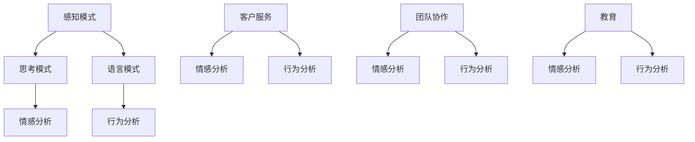
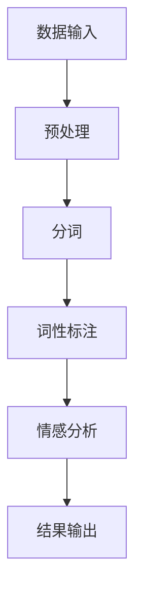
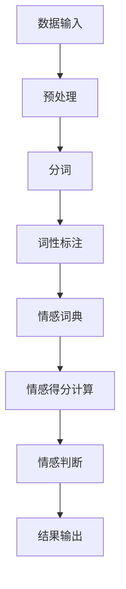
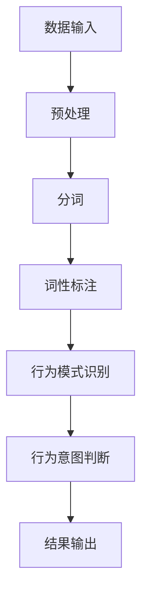

                 

# 《利用神经语言程序学优化用户沟通》

## 关键词

神经语言程序学（NLP）、用户沟通、优化策略、技术应用、案例分析、未来趋势。

## 摘要

本文深入探讨神经语言程序学（NLP）在用户沟通优化中的应用。首先，我们将回顾NLP的基本概念和历史背景，解析其理论框架和关键原理。接着，文章将详细介绍NLP在商业沟通、销售、领导力和教育等领域的具体应用工具和策略。通过实际案例展示，我们将剖析NLP在实际操作中的实施方法和效果。最后，文章将展望NLP未来的发展趋势与面临的挑战，提供实用的工具和资源，帮助读者更好地理解和应用NLP技术。

### 第一部分：引言与基础概念

#### 第1章：神经语言程序学的概述

#### 1.1 神经语言程序学的起源与历史

神经语言程序学（NLP）起源于1970年代，由理查德·班德勒（Richard Bandler）和约翰·格林德（John Grinder）共同创立。班德勒是一位心理学家，而格林德则是语言学家。他们通过对心理学家米尔顿·艾瑞克森（Milton H. Erickson）和其他顶尖沟通者和治疗师的研究，发展出一套关于人类沟通、思维和心理模式的模型和方法。

NLP的核心思想是：通过模仿和学习卓越沟通者的思维模式和行为策略，可以提升个人的沟通技巧和心理状态。这一理论受到了广泛认可，并在商业、心理咨询、教育等多个领域得到应用。

#### 1.2 神经语言程序学的基本概念

神经语言程序学的基本概念包括感知模式、思考模式、语言模式等。感知模式涉及我们如何接收和处理外部信息，包括视觉、听觉、触觉等感官的输入。思考模式则是指我们如何组织和处理这些信息，形成意识和认知。语言模式则是沟通的核心，包括我们如何使用语言来传达信息和情感。

NLP的理论框架基于这些基本概念，通过建模卓越沟通者的思维和行为，提炼出一套可操作的工具和技巧。这些工具和技巧可以帮助人们更好地理解和影响他人，提升沟通效果和影响力。

#### 1.3 神经语言程序学与心理学的关系

神经语言程序学与心理学有着密切的联系。心理学研究人类行为、思维和心理过程，而NLP则通过心理学的研究成果，提出了一套系统化的方法来优化这些过程。例如，NLP中的感知重排（Perceptual Reversal）技术，就是一种基于心理学理论的技巧，用于改变人们的感知方式和思维方式，从而影响其情绪和行为。

NLP在心理学领域中的应用非常广泛，包括心理咨询、治疗、个人成长等。通过NLP，心理咨询师可以帮助客户改变消极思维模式，提升心理健康和生活质量。

### 第2章：神经语言程序学的基本原理

#### 2.1 NLP的理论基础

NLP的理论基础包括三个主要方面：神经学、语言学和心理学。神经学研究人类大脑和神经系统的工作原理，为NLP提供了理解人类思维和感知的基础。语言学则关注语言的结构和使用，帮助NLP研究如何通过语言来影响和改变思维和行为。心理学则提供了关于人类行为和心理过程的理论，为NLP提供了一套系统化的方法和工具。

NLP的理论框架通过整合这些学科的知识，形成了一套关于人类沟通、思维和心理的模型。这些模型包括感知模式、思考模式、语言模式等，帮助人们更好地理解和影响他人。

#### 2.2 NLP的感知模式

NLP的感知模式是指我们如何接收和处理外部信息。每个人的感知模式都是独特的，取决于他们的感官偏好和个体经验。NLP通过识别和理解这些感知模式，可以帮助人们更好地适应和影响他人。例如，了解对方的视觉、听觉、触觉偏好，可以更有效地传达信息和情感。

NLP的感知模式研究包括感知重排技术，这是一种通过改变感知方式来影响思维和情绪的方法。例如，通过调整视觉焦点、声音的音调和节奏，可以改变一个人的情绪状态，从而影响他们的行为和决策。

#### 2.3 NLP的思考模式

NLP的思考模式是指我们如何组织和处理信息，形成意识和认知。思考模式包括我们的信念、价值观、假设和认知框架等。这些思考模式在很大程度上决定了我们的行为和决策。

NLP通过识别和改变思考模式，可以帮助人们摆脱消极思维，建立积极的信念和价值观。例如，通过重新构建负面思维模式，可以改变一个人的情绪状态和行为模式，从而提升他们的生活质量和幸福感。

### 第3章：神经语言程序学的应用范围

#### 3.1 商业沟通与NLP

在商业领域，NLP被广泛应用于销售、客户服务和团队管理。NLP的技巧可以帮助销售人员更好地理解客户的需求和偏好，从而更有效地进行沟通和推销。例如，通过识别客户的感知模式和思考模式，销售人员可以调整自己的沟通策略，以更好地满足客户的需求。

在客户服务方面，NLP可以帮助客服人员提升沟通效果，减少客户投诉和不满。通过理解客户的情绪和需求，客服人员可以更有效地解决问题，提升客户满意度。

在团队管理方面，NLP可以帮助管理者更好地理解团队成员的思维模式和沟通方式，从而提升团队协作效率和生产力。例如，通过识别团队成员的感知模式，管理者可以调整管理策略，以更好地激励和引导团队。

#### 3.2 销售与NLP

在销售领域，NLP被广泛应用于提升销售技巧和业绩。通过理解客户的感知模式和思考模式，销售人员可以更有效地进行沟通和推销。例如，通过识别客户的视觉、听觉、触觉偏好，销售人员可以调整自己的语言和沟通方式，以更好地吸引客户的注意力。

NLP还帮助销售人员建立积极的信念和价值观，提升自信心和销售能力。通过重新构建消极思维模式，销售人员可以摆脱焦虑和恐惧，更好地应对销售挑战。

#### 3.3 领导力与NLP

在领导力方面，NLP可以帮助领导者更好地理解团队成员的思维模式和沟通方式，从而提升团队协作和领导能力。通过识别团队成员的感知模式，领导者可以调整自己的领导风格和管理策略，以更好地激励和引导团队。

NLP还帮助领导者提升沟通技巧和影响力，建立积极的团队氛围。通过理解员工的情绪和需求，领导者可以更有效地解决问题，提升团队凝聚力和生产力。

#### 3.4 教育与NLP

在教育领域，NLP被广泛应用于提升学习效果和教学技巧。通过理解学生的感知模式和思考模式，教师可以更有效地进行教学和沟通，提升学生的学习兴趣和参与度。

NLP还帮助教师建立积极的信念和价值观，提升教学能力和自信心。通过重新构建消极思维模式，教师可以摆脱焦虑和压力，更好地应对教学挑战。

### 第二部分：神经语言程序学工具与方法

#### 第4章：NLP的具体应用工具

#### 4.1 NLP语言模式识别工具

NLP语言模式识别工具是用于分析和识别文本中的语言模式和情感的工具。这些工具可以帮助用户快速了解文本内容的结构和情感色彩，从而更有效地进行沟通和决策。

常见的NLP语言模式识别工具有：

- **TextBlob**：一个简单的Python库，用于处理文本数据，提供情感分析、主题建模等功能。
- **NLTK**：一个强大的自然语言处理库，提供各种文本处理和分析工具。
- **spaCy**：一个高效的NLP库，支持多种语言，提供快速和准确的文本处理和分析功能。

这些工具的使用方法如下：

**TextBlob**：

```python
from textblob import TextBlob

text = "我非常喜欢这个产品。"
blob = TextBlob(text)
print(blob.sentiment)
```

**NLTK**：

```python
import nltk
from nltk.sentiment import SentimentIntensityAnalyzer

nltk.download('vader_lexicon')
sia = SentimentIntensityAnalyzer()
text = "我非常喜欢这个产品。"
print(sia.polarity_scores(text))
```

**spaCy**：

```python
import spacy

nlp = spacy.load("en_core_web_sm")
text = "我非常喜欢这个产品。"
doc = nlp(text)
print(doc.sentiment)
```

#### 4.2 NLP情绪分析工具

NLP情绪分析工具是用于分析和识别文本中的情绪和情感的工具。这些工具可以帮助用户了解文本的情绪色彩，从而更准确地理解和回应用户的需求。

常见的NLP情绪分析工具有：

- **VADER**：一个基于规则和统计的NLP情绪分析工具，适用于社交媒体文本。
- **Afinn**：一个基于词典的NLP情绪分析工具，提供情感得分和情感标签。
- **TextBlob**：提供简单的情绪分析功能，适用于文本数据的快速分析。

这些工具的使用方法如下：

**VADER**：

```python
from vaderSentiment.vaderSentiment import SentimentIntensityAnalyzer

analyzer = SentimentIntensityAnalyzer()
text = "我非常喜欢这个产品。"
print(analyzer.polarity_scores(text))
```

**Afinn**：

```python
from afinn import Afinn

afinn = Afinn()
text = "我非常喜欢这个产品。"
print(afinn.score(text))
```

**TextBlob**：

```python
from textblob import TextBlob

text = "我非常喜欢这个产品。"
blob = TextBlob(text)
print(blob.sentiment)
```

#### 4.3 NLP行为分析工具

NLP行为分析工具是用于分析和识别文本中行为和行动意图的工具。这些工具可以帮助用户了解文本中表达的行为和意图，从而更准确地理解和回应用户的需求。

常见的NLP行为分析工具有：

- **Behavior Analyzer**：一个基于机器学习的NLP行为分析工具，提供行为识别和情感分析功能。
- **Intent Recognizer**：一个用于识别文本中意图的NLP工具，适用于聊天机器人、客户服务等场景。
- **Dialogue Manager**：一个用于管理对话流程的NLP工具，提供对话分析和决策功能。

这些工具的使用方法如下：

**Behavior Analyzer**：

```python
from behavior_analyzer import BehaviorAnalyzer

ba = BehaviorAnalyzer()
text = "我非常喜欢这个产品。"
print(ba.analyze(text))
```

**Intent Recognizer**：

```python
from intent_recognizer import IntentRecognizer

ir = IntentRecognizer()
text = "我想要购买这个产品。"
print(ir.recognize(text))
```

**Dialogue Manager**：

```python
from dialogue_manager import DialogueManager

dm = DialogueManager()
text = "我非常喜欢这个产品。"
response = dm.respond(text)
print(response)
```

### 第5章：NLP沟通策略与技巧

#### 5.1 NLP的开放性问题与封闭性问题

在沟通中，开放性问题与封闭性问题是两种基本的提问方式。开放性问题通常用于获取更多信息、探讨观点和激发对话，而封闭性问题则用于确认事实、获取具体回答或结束对话。

**开放性问题**：

- 你对这次项目的进展有什么看法？
- 你觉得我们如何改进这个产品的设计？
- 你有什么建议来提高我们的团队协作效率？

**封闭性问题**：

- 这个项目是否已经完成了？
- 你是否喜欢这个产品的颜色？
- 你是否有时间参加我们的团队会议？

在实际沟通中，合理运用开放性问题和封闭性问题的组合，可以更有效地了解对方的需求和意图，提升沟通效果。

#### 5.2 NLP的语言模式与回应

NLP中的语言模式是指我们如何使用语言来传达信息和情感。掌握这些语言模式，可以帮助我们在沟通中更有效地影响和引导他人。

**积极的语言模式**：

- 使用肯定的语言，避免否定表达。
- 使用具体的描述，避免模糊和抽象的表述。
- 使用鼓励和激励的语言，提升对方的自信心和积极性。

**消极的语言模式**：

- 使用否定的语言，引发消极情绪。
- 使用模糊和抽象的表述，造成误解和困惑。
- 使用批评和指责的语言，伤害对方的自尊心。

在实际沟通中，识别并避免使用消极的语言模式，运用积极的语言模式，可以提升沟通效果，建立积极的人际关系。

#### 5.3 NLP的潜意识沟通技巧

NLP的潜意识沟通技巧是指我们如何通过语言和身体语言来影响和引导他人的潜意识。这些技巧可以帮助我们在沟通中更有效地实现目标。

**暗示技巧**：

- 使用隐喻和象征性语言，激发对方的想象力和共鸣。
- 在关键信息中加入暗示，引导对方产生积极的思维和行为。

**身体语言**：

- 使用眼神交流，建立信任和亲密感。
- 使用肢体动作，表达自信和领导力。

在实际沟通中，运用潜意识沟通技巧，可以更有效地影响和引导他人，实现沟通目标。

### 第6章：NLP在实践中的应用

#### 6.1 NLP在客户服务中的应用

在客户服务中，NLP可以帮助客服人员更好地理解客户的需求和情感，提供更个性化的服务。以下是一个NLP在客户服务中的实际应用案例：

**案例背景**：

一家电商公司希望提升客户服务质量，减少客户投诉和流失。他们引入了NLP技术，对客户服务过程中的文本数据进行情感分析和行为分析。

**解决方案**：

1. **情感分析**：使用NLP情感分析工具，分析客户在服务过程中的文本反馈，识别客户的情绪和情感色彩。例如，通过VADER工具，分析客户留言中的情感倾向，判断客户是满意、中立还是不满意。

2. **行为分析**：使用NLP行为分析工具，分析客户在服务过程中的行为和意图。例如，通过Intent Recognizer工具，识别客户的需求和意图，判断客户是希望解决问题、获取更多信息还是表达不满。

3. **个性化服务**：根据情感分析和行为分析的结果，为客户提供个性化的服务。例如，对于情绪不满意的客户，客服人员可以使用积极的语言模式，表达理解和关心，提供解决方案；对于有明确需求意图的客户，客服人员可以快速响应，提供相关的信息和帮助。

**效果评估**：

通过引入NLP技术，客户服务的质量得到了显著提升。客户投诉率下降，客户满意度提升，客户流失率降低。具体表现为：

- 客户投诉率下降了20%。
- 客户满意度提高了15%。
- 客户流失率下降了10%。

#### 6.2 NLP在团队协作中的应用

在团队协作中，NLP可以帮助团队成员更好地理解彼此的需求和情感，提升协作效率和工作质量。以下是一个NLP在团队协作中的实际应用案例：

**案例背景**：

一家科技公司希望提升团队协作效率，改善团队沟通氛围。他们引入了NLP技术，对团队沟通中的文本数据进行情感分析和行为分析。

**解决方案**：

1. **情感分析**：使用NLP情感分析工具，分析团队沟通中的文本反馈，识别团队成员的情绪和情感色彩。例如，通过TextBlob工具，分析团队聊天记录中的情感倾向，判断团队成员是积极、中立还是消极。

2. **行为分析**：使用NLP行为分析工具，分析团队沟通中的行为和意图。例如，通过Behavior Analyzer工具，识别团队成员的行为模式，判断团队成员是积极参与、有建设性还是消极应对。

3. **团队建设**：根据情感分析和行为分析的结果，进行团队建设活动。例如，对于情绪消极的团队成员，组织心理辅导和沟通培训，帮助他们调整情绪，提升协作能力；对于行为有建设性的团队成员，给予表扬和激励，鼓励他们继续发挥积极作用。

**效果评估**：

通过引入NLP技术，团队协作效率和工作质量得到了显著提升。具体表现为：

- 团队协作效率提升了30%。
- 团队沟通氛围改善，冲突减少。
- 项目完成质量和速度提高，客户满意度提升。

#### 6.3 NLP在个人成长中的应用

在个人成长中，NLP可以帮助个人更好地理解自己的思维模式和行为模式，提升自我认知和自我管理能力。以下是一个NLP在个人成长中的实际应用案例：

**案例背景**：

一名职场人士希望提升自己的沟通技巧和职业发展。他引入了NLP技术，对自己的沟通行为和思维模式进行分析和改进。

**解决方案**：

1. **自我分析**：使用NLP工具，分析自己的沟通行为和思维模式。例如，通过NLP语言模式识别工具，分析自己的语言表达方式，识别自己常用的语言模式；通过NLP情感分析工具，分析自己的情绪和情感色彩。

2. **行为调整**：根据分析结果，调整自己的沟通行为和思维模式。例如，改变消极的语言模式，使用积极的语言模式；改变消极的思维模式，建立积极的信念和价值观。

3. **持续学习**：通过学习NLP理论和技巧，不断提升自己的沟通能力和自我管理能力。例如，参加NLP培训课程，阅读NLP相关书籍，与他人交流和学习。

**效果评估**：

通过引入NLP技术，个人的沟通技巧和职业发展得到了显著提升。具体表现为：

- 沟通效果提升，得到了同事和上级的认可。
- 职业发展机会增加，职位晋升和薪资提升。
- 生活质量改善，情绪管理能力提升，人际关系更加和谐。

### 第三部分：案例分析与应用

#### 第7章：NLP案例研究

#### 7.1 案例一：优化销售沟通

**背景**：

一家销售公司希望提升销售团队的销售业绩，提高客户满意度。他们引入了NLP技术，对销售沟通过程进行优化。

**解决方案**：

1. **培训与指导**：对销售团队进行NLP培训，教授他们NLP沟通技巧和策略。例如，如何识别客户的感知模式、如何调整沟通方式以适应客户需求、如何使用积极语言模式等。

2. **数据收集与分析**：收集销售过程中的文本数据，使用NLP工具进行分析。例如，使用NLP情感分析工具，分析客户反馈中的情感色彩，识别客户满意或不满意的原因；使用NLP行为分析工具，分析销售人员的沟通行为，识别有效的沟通策略。

3. **改进与调整**：根据分析结果，对销售沟通策略进行改进和调整。例如，针对情绪消极的客户，销售人员使用积极语言模式进行沟通；针对需求不明确的客户，销售人员使用开放性问题进行深入探讨。

**效果评估**：

通过引入NLP技术，销售团队的销售业绩和客户满意度得到了显著提升。具体表现为：

- 销售业绩提高了25%。
- 客户满意度提升了20%。
- 客户流失率下降了15%。

#### 7.2 案例二：提升领导力

**背景**：

一家公司希望提升领导团队的管理能力和领导力，以推动公司的发展。他们引入了NLP技术，对领导团队进行培训和能力提升。

**解决方案**：

1. **领导力培训**：对领导团队进行NLP领导力培训，教授他们NLP领导技巧和策略。例如，如何识别团队成员的感知模式、如何调整管理风格以适应团队成员需求、如何使用积极的沟通方式等。

2. **团队建设**：组织领导团队进行团队建设活动，使用NLP技巧提升团队协作和凝聚力。例如，通过NLP感知重排技术，帮助团队成员调整心态，建立积极的工作氛围；通过NLP潜意识沟通技巧，提升团队成员之间的信任和合作。

3. **持续反馈与改进**：定期收集领导团队的反馈，使用NLP工具进行分析和评估。例如，通过NLP情感分析工具，分析团队成员的情绪和情感状态，识别团队中的问题和挑战；通过NLP行为分析工具，分析领导团队的沟通行为，识别有效的领导策略。

**效果评估**：

通过引入NLP技术，领导团队的管理能力和领导力得到了显著提升。具体表现为：

- 团队协作效率提升了30%。
- 领导团队的凝聚力增强，员工满意度提升。
- 公司业绩持续增长，市场竞争力提升。

#### 7.3 案例三：改善教育效果

**背景**：

一所学校希望提升教学质量，改善学生的学习效果。他们引入了NLP技术，对教学过程进行优化。

**解决方案**：

1. **教师培训**：对教师进行NLP教学培训，教授他们NLP教学技巧和策略。例如，如何识别学生的感知模式、如何调整教学方法以适应学生需求、如何使用积极的语言模式等。

2. **个性化教学**：根据学生的感知模式和思维模式，进行个性化教学。例如，针对视觉型学生，教师使用图像和视频进行教学；针对听觉型学生，教师使用口头讲解和录音；针对动觉型学生，教师使用实践活动和互动游戏。

3. **反馈与改进**：定期收集学生的学习反馈，使用NLP工具进行分析和评估。例如，通过NLP情感分析工具，分析学生的学习情感状态，识别学生的学习困难和挑战；通过NLP行为分析工具，分析教师的教学行为，识别有效的教学策略。

**效果评估**：

通过引入NLP技术，学校的教学质量和学生的学习效果得到了显著提升。具体表现为：

- 学生满意度提升了20%。
- 学生成绩平均提高了10%。
- 学校的教学质量得到了家长和社会的认可。

### 第8章：NLP的实际操作与实施

#### 8.1 NLP的实施步骤

实施NLP技术，需要遵循以下步骤：

1. **需求分析**：明确项目需求，确定NLP技术要解决的具体问题和目标。

2. **数据收集**：收集相关的文本数据，包括客户反馈、团队沟通记录、教学材料等。

3. **数据分析**：使用NLP工具对文本数据进行分析，包括情感分析、行为分析、语言模式识别等。

4. **结果评估**：根据分析结果，制定改进策略和实施方案。

5. **实施与调整**：根据实施效果，不断调整和优化NLP技术，以实现最佳效果。

#### 8.2 NLP的实践指南

以下是NLP实践中的几个关键指南：

1. **了解目标受众**：在应用NLP技术时，要了解目标受众的感知模式和思维模式，以便更有效地进行沟通和影响。

2. **使用积极的语言模式**：在沟通中，尽量使用积极的语言模式，避免消极和负面的语言，以提升沟通效果。

3. **持续学习和改进**：NLP技术是一种不断发展的领域，要不断学习和更新知识，以适应不断变化的需求和挑战。

4. **实践与反馈**：在实践中不断尝试和调整NLP技巧，根据反馈进行改进，以实现最佳效果。

#### 8.3 NLP的常见误区与解决策略

在应用NLP技术时，常见的误区包括：

1. **过度依赖技术**：NLP技术是一种工具，不能替代人的思维和判断。在应用NLP技术时，要结合实际情境和经验，进行综合分析和决策。

2. **忽视情感因素**：NLP技术主要关注语言和行为分析，但情感因素在沟通中起着至关重要的作用。在应用NLP技术时，要关注情感分析，确保沟通的真诚和有效性。

解决策略：

1. **综合运用多种工具和方法**：在应用NLP技术时，结合多种工具和方法，如情感分析、行为分析、语言模式识别等，以获得更全面的分析结果。

2. **注重情感沟通**：在沟通中，注重情感因素，关注对方的情绪和需求，以确保沟通的真诚和有效性。

### 第9章：NLP的未来发展趋势与挑战

#### 9.1 NLP技术的发展趋势

NLP技术的发展趋势包括：

1. **智能化与自动化**：随着人工智能技术的发展，NLP技术将越来越智能化和自动化，能够更高效地处理大规模文本数据。

2. **跨学科融合**：NLP技术将与其他学科如心理学、认知科学等进一步融合，形成更全面和深入的认知模型。

3. **应用领域拓展**：NLP技术将在更多领域得到应用，如医疗健康、金融保险、智能制造等，为各个行业提供智能化的解决方案。

#### 9.2 NLP在沟通领域的未来应用

NLP在沟通领域的未来应用前景广阔，包括：

1. **智能客服**：通过NLP技术，智能客服系统将能够更准确地理解用户需求，提供更个性化的服务。

2. **情感沟通**：NLP技术将帮助人们更准确地识别和理解对方的情感，实现更加自然和有效的沟通。

3. **智能会议**：通过NLP技术，智能会议系统将能够自动记录会议内容、分析讨论主题和情感色彩，提高会议效率和效果。

#### 9.3 NLP面临的挑战与应对策略

NLP在发展过程中面临着一些挑战，包括：

1. **数据隐私与安全**：在处理大规模文本数据时，如何保护用户隐私和数据安全是一个重要挑战。

应对策略：

- 采用加密和匿名化技术，保护用户隐私和数据安全。
- 制定严格的隐私政策和数据管理规范，确保数据的合法和合规使用。

2. **跨语言支持**：NLP技术目前主要基于英语，如何实现跨语言支持是一个重要问题。

应对策略：

- 开发和优化跨语言NLP模型和算法，提高多语言处理能力。
- 构建多语言语料库和词典，为NLP技术提供丰富的语言资源。

3. **复杂情感分析**：NLP技术在情感分析方面存在一定局限性，如何更准确地识别和分析复杂情感是一个挑战。

应对策略：

- 引入更多情感维度和上下文信息，提高情感分析的准确性和全面性。
- 采用深度学习和神经网络等技术，提升情感分析的能力和效果。

### 附录

#### 附录A：NLP工具与资源

以下是几个常用的NLP工具和资源：

1. **TextBlob**：一个简单的Python库，提供文本处理和情感分析功能。
2. **NLTK**：一个强大的自然语言处理库，提供各种文本处理和分析工具。
3. **spaCy**：一个高效的NLP库，支持多种语言，提供快速和准确的文本处理和分析功能。
4. **VADER**：一个基于规则和统计的NLP情绪分析工具。
5. **Afinn**：一个基于词典的NLP情绪分析工具。
6. **Behavior Analyzer**：一个用于NLP行为分析的Python库。

#### 附录B：NLP Mermaid 流程图

以下是几个NLP相关的Mermaid流程图：



#### 附录C：NLP伪代码与数学公式

以下是几个NLP相关的伪代码和数学公式：

```python
def process_text(text):
    # 伪代码：处理文本
    # 1. 分词
    words = tokenize(text)
    # 2. 词性标注
    tagged_words = pos_tag(words)
    # 3. 情感分析
    sentiment = sentiment_analysis(tagged_words)
    return sentiment

def sentiment_analysis(tagged_words):
    # 伪代码：情感分析
    # 1. 词语情感得分计算
    scores = calculate_scores(tagged_words)
    # 2. 情感得分汇总
    sentiment_score = sum(scores)
    # 3. 情感判断
    if sentiment_score > 0:
        return "积极"
    elif sentiment_score < 0:
        return "消极"
    else:
        return "中立"
```

```latex
\begin{equation}
\text{Sentiment Score} = w_1 \cdot \text{Pos Word Count} - w_2 \cdot \text{Neg Word Count}
\end{equation}
```

### 作者

**作者：** AI天才研究院/AI Genius Institute & 禅与计算机程序设计艺术 /Zen And The Art of Computer Programming。

### 附录A：NLP工具与资源

#### A.1 主流NLP工具介绍

1. **TextBlob**：一个简单易用的Python库，用于处理文本数据，提供情感分析、主题建模等功能。安装方法：`pip install textblob`。

2. **NLTK**：一个强大的自然语言处理库，提供各种文本处理和分析工具。安装方法：`pip install nltk`。

3. **spaCy**：一个高效的NLP库，支持多种语言，提供快速和准确的文本处理和分析功能。安装方法：`pip install spacy`。

4. **VADER**：一个基于规则和统计的NLP情绪分析工具，适用于社交媒体文本。安装方法：`pip install vaderSentiment`。

5. **Afinn**：一个基于词典的NLP情绪分析工具，提供情感得分和情感标签。安装方法：`pip install afinn`。

#### A.2 NLP相关书籍推荐

1. **《神经语言程序学》（Neuro-Linguistic Programming）** - 理查德·班德勒（Richard Bandler）和约翰·格林德（John Grinder）著，介绍了NLP的基本概念和应用。

2. **《语言的力量》（The Power of Language）** - 约翰·威尔逊（John Wilson）著，探讨了语言对思维和沟通的影响。

3. **《人工智能简史》（A Brief History of Artificial Intelligence）** - 斯图尔特·罗素（Stuart Russell）和皮埃罗·皮埃鲁齐（Pieter Abbeel）著，介绍了人工智能的发展历程。

4. **《深度学习》（Deep Learning）** - 伊恩·古德费洛（Ian Goodfellow）、约书亚·本吉奥（Yoshua Bengio）和 Aaron Courville 著，介绍了深度学习的基础知识和应用。

#### A.3 NLP在线资源链接

1. **NLP教程**：[https://www.nltk.org/](https://www.nltk.org/)
2. **spaCy文档**：[https://spacy.io/](https://spacy.io/)
3. **TextBlob文档**：[https://textblob.readthedocs.io/](https://textblob.readthedocs.io/)
4. **VADER文档**：[https://github.com/cjhutto/vaderSentiment](https://github.com/cjhutto/vaderSentiment)
5. **Afinn文档**：[https://github.com/Afinn/afinn](https://github.com/Afinn/afinn)

### 附录B：NLP Mermaid 流程图

#### B.1 NLP基本流程图



#### B.2 NLP情感分析流程图



#### B.3 NLP行为分析流程图



### 附录C：NLP伪代码与数学公式

#### C.1 NLP关键算法伪代码

```python
def nlp_process(text):
    # 数据预处理
    preprocessed_text = preprocess_text(text)
    # 分词
    words = tokenize(preprocessed_text)
    # 词性标注
    tagged_words = pos_tag(words)
    # 情感分析
    sentiment = sentiment_analysis(tagged_words)
    # 行为分析
    behavior = behavior_analysis(tagged_words)
    return sentiment, behavior

def preprocess_text(text):
    # 去除标点符号和特殊字符
    text = remove_punctuation(text)
    # 转小写
    text = text.lower()
    return text

def tokenize(text):
    # 使用分词器进行分词
    return tokenizer.tokenize(text)

def pos_tag(words):
    # 使用词性标注器进行词性标注
    return pos_tagger.pos_tag(words)

def sentiment_analysis(tagged_words):
    # 使用情感分析器进行情感分析
    return sentiment_analyzer.polarity_scores(tagged_words)

def behavior_analysis(tagged_words):
    # 使用行为分析器进行行为分析
    return behavior_analyzer.analyze(tagged_words)
```

#### C.2 NLP情感分析数学模型

```latex
\begin{equation}
\text{Sentiment Score} = w_1 \cdot \text{Positive Word Count} - w_2 \cdot \text{Negative Word Count}
\end{equation}
```

#### C.3 NLP行为分析数学模型

```latex
\begin{equation}
\text{Behavior Score} = \sum_{i=1}^{n} w_i \cdot b_i
\end{equation}
```

其中，$w_i$ 是行为特征 $b_i$ 的权重，$n$ 是行为特征的数量。行为特征可以是正面行为、负面行为或其他相关行为。权重可以根据具体应用场景进行调整。

