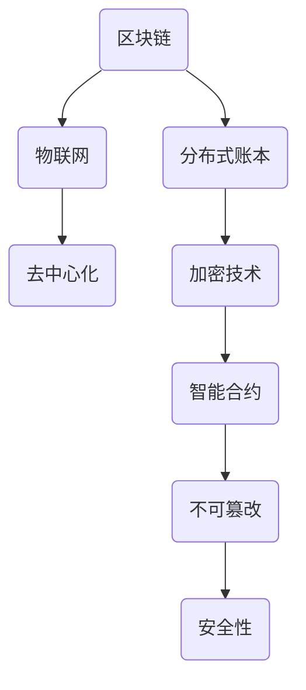

                 

### 详细内容

#### 第一部分：引言与基础

##### 第1章：区块链与物联网概述

**核心概念与联系**

区块链与物联网的关系可以用图表示：



区块链是一种分布式账本技术，它通过去中心化的方式记录和验证交易信息，具有不可篡改、透明和安全的特点。物联网（IoT）是指通过传感器、设备和网络连接，实现物与物、物与人的智能交互。物联网的核心是数据的采集、传输和处理。

**核心算法原理讲解**

区块链的哈希算法是区块链实现不可篡改和安全性的重要机制。哈希算法将任意长度的数据转换为固定长度的哈希值，使得数据无法通过简单的逆向计算恢复。哈希算法的伪代码如下：

```python
def hash(message):
    # 初始化哈希值
    h = initialize_hash_value()
    # 对消息进行加密处理
    for byte in message:
        h = sha256(h + byte)
    # 返回最终的哈希值
    return h
```

其中，`sha256` 是 SHA-256 哈希算法，它是一种常用的加密哈希函数。

**数学模型和数学公式**

区块链中的工作量证明（Proof of Work, PoW）机制通过数学难题的解决来确保网络的安全性。PoW 的数学模型如下：

$$ PoW = \frac{1}{m \cdot 2^{n}} $$

其中，`m` 是参与计算的节点数，`n` 是计算难度。

**举例说明**

假设有 10 个节点参与计算，计算难度为 4，则工作量证明为：

$$ PoW = \frac{1}{10 \cdot 2^{4}} = \frac{1}{10 \cdot 16} = \frac{1}{160} $$

这意味着每个节点需要解决一个难度为 160 的工作量证明问题，才能参与到区块链网络的共识过程中。

**文章关键词**

区块链、物联网、去中心化、分布式账本、加密技术、智能合约、不可篡改、安全性。

**文章摘要**

本文介绍了区块链和物联网的基本概念、核心算法原理以及它们之间的联系。通过分析区块链在物联网中的应用，本文探讨了区块链在物联网数据管理、安全与隐私保护、智能合约和物联网区块链网络协议等方面的应用。同时，本文还分析了区块链在物联网领域的实际应用案例以及未来发展趋势。

#### 第一部分：引言与基础

##### 第2章：物联网架构与区块链融合

**核心概念与联系**

物联网架构和区块链架构的融合是区块链在物联网中应用的关键。物联网架构通常包括传感器、网关、数据中心和应用程序等组成部分，而区块链架构则由节点、分布式账本和共识算法等构成。二者的融合可以使得物联网数据更加安全、透明和可追溯。

**核心算法原理讲解**

物联网数据加密与解密是确保数据安全的重要机制。区块链中的椭圆曲线加密（Elliptic Curve Cryptography, ECC）是一种常用的加密算法，它通过椭圆曲线的数学性质来实现数据的加密和解密。ECC 加密算法的伪代码如下：

```python
def encrypt(message, private_key):
    # 生成椭圆曲线和密钥对
    curve = generate_curve()
    private_key = generate_private_key(curve)
    public_key = generate_public_key(private_key, curve)
    
    # 对消息进行加密
    encrypted_message = encrypt_with_ecc(message, public_key)
    return encrypted_message

def decrypt(encrypted_message, private_key):
    # 对加密消息进行解密
    decrypted_message = decrypt_with_ecc(encrypted_message, private_key)
    return decrypted_message
```

**数学模型和数学公式**

椭圆曲线加密算法的核心是椭圆曲线上的点乘运算。点乘运算的数学模型如下：

$$ public_key = k \cdot G $$

其中，`k` 是私钥，`G` 是椭圆曲线的基点，`public_key` 是公钥。

**举例说明**

假设椭圆曲线的基点 $G$ 为 $(2, 3)$，私钥 $k$ 为 5，则公钥为：

$$ public_key = 5 \cdot G = (25 \cdot 2, 25 \cdot 3) = (50, 75) $$

**项目实战**

智能电网中的数据管理流程：

1. **数据采集**：传感器收集电能数据。
2. **数据上传**：数据上传至物联网网关。
3. **数据加密**：物联网网关对数据进行加密处理。
4. **数据存储**：加密后的数据上传至区块链节点。
5. **数据验证**：区块链节点验证数据真实性。
6. **数据存储**：数据存储于区块链分布式账本中。

**代码解读与分析**

以下是一个简单的 Python 代码示例，用于实现智能电网中的数据上传与存储功能：

```python
import json
from cryptography.hazmat.primitives.asymmetric import rsa
from cryptography.hazmat.primitives import serialization
from cryptography.hazmat.primitives import hashes
from cryptography.hazmat.primitives.asymmetric import padding

# 生成密钥对
private_key = rsa.generate_private_key(
    public_exponent=65537,
    key_size=2048,
)

public_key = private_key.public_key()

# 加密数据
def encrypt_data(data, public_key):
    encrypted_data = public_key.encrypt(
        data,
        padding.OAEP(
            mgf=padding.MGF1(algorithm=hashes.SHA256()),
            algorithm=hashes.SHA256(),
            label=None
        )
    )
    return encrypted_data

# 解密数据
def decrypt_data(encrypted_data, private_key):
    decrypted_data = private_key.decrypt(
        encrypted_data,
        padding.OAEP(
            mgf=padding.MGF1(algorithm=hashes.SHA256()),
            algorithm=hashes.SHA256(),
            label=None
        )
    )
    return decrypted_data

# 上传数据至区块链节点
def upload_to_blockchain(data):
    # 假设已连接到区块链节点
    encrypted_data = encrypt_data(data, public_key)
    # 将加密数据上传至区块链节点
    blockchain_node.upload(encrypted_data)

# 模拟传感器收集数据
def simulate_sensor_data():
    data = "电能消耗：1000千瓦时"
    upload_to_blockchain(data)

# 模拟数据解密与验证
def verify_and_decrypt_data():
    # 假设从区块链节点接收到的加密数据
    encrypted_data = "..."  # 接收到的加密数据
    decrypted_data = decrypt_data(encrypted_data, private_key)
    print("解密数据：", decrypted_data)

if __name__ == "__main__":
    simulate_sensor_data()
    verify_and_decrypt_data()
```

**文章关键词**

物联网架构、区块链架构、分布式账本、加密技术、椭圆曲线加密、智能电网、数据管理、区块链节点。

**文章摘要**

本章介绍了物联网架构与区块链架构的融合概念，并详细讲解了物联网数据加密与解密的核心算法原理。通过一个智能电网数据管理流程的实战案例，展示了区块链在物联网中的应用。同时，通过代码解读与分析，加深了读者对区块链技术在物联网数据管理中应用的理解。

### 第二部分：核心技术

##### 第3章：区块链在物联网数据管理中的应用

**核心概念与联系**

区块链在物联网数据管理中的应用主要涉及数据存储、数据传输、数据隐私保护和数据管理流程设计。区块链通过其分布式账本、加密技术和智能合约等特性，为物联网数据管理提供了高效、安全、透明的解决方案。

**核心算法原理讲解**

区块链在数据管理中的应用主要包括以下三个方面：

1. **数据存储**：区块链通过分布式账本技术实现数据的存储。每个区块都包含一定数量的交易记录，这些区块按照时间顺序链接在一起，形成区块链。数据的存储过程涉及哈希算法、区块生成和区块链接等操作。

2. **数据传输**：区块链通过加密技术和点对点网络实现数据的安全传输。数据在传输过程中通过加密算法进行加密，确保数据在传输过程中不会被窃取或篡改。同时，区块链的点对点网络使得数据传输更加高效和去中心化。

3. **数据隐私保护**：区块链通过零知识证明、同态加密等技术实现数据的隐私保护。这些技术使得数据在存储和传输过程中保持匿名性，同时确保数据的真实性和完整性。

**数学模型和数学公式**

区块链在数据管理中的数学模型主要包括：

1. **哈希算法**：哈希算法将数据转换为固定长度的哈希值，确保数据的唯一性和不可篡改性。哈希算法的数学模型如下：

   $$ hash(data) = hash_value $$

   其中，`hash` 是哈希函数，`data` 是待加密的数据，`hash_value` 是生成的哈希值。

2. **椭圆曲线加密**：椭圆曲线加密算法是一种公钥加密算法，用于数据的安全传输和存储。椭圆曲线加密的数学模型如下：

   $$ public_key = k \cdot G $$

   其中，`k` 是私钥，`G` 是椭圆曲线的基点，`public_key` 是公钥。

**举例说明**

假设椭圆曲线的基点 $G$ 为 $(2, 3)$，私钥 $k$ 为 5，则公钥为：

$$ public_key = 5 \cdot G = (25 \cdot 2, 25 \cdot 3) = (50, 75) $$

**项目实战**

智能交通系统中的数据管理流程：

1. **数据采集**：传感器收集交通数据，如车辆位置、速度、流量等。
2. **数据加密**：数据在传输前通过椭圆曲线加密算法进行加密。
3. **数据传输**：加密后的数据通过区块链的点对点网络传输到交通管理系统。
4. **数据存储**：交通管理系统将加密数据存储在区块链的分布式账本中。
5. **数据验证**：系统管理员或相关部门可以对数据进行验证，确保数据的真实性和完整性。

**代码解读与分析**

以下是一个简单的 Python 代码示例，用于实现智能交通系统中的数据采集、加密和存储功能：

```python
import json
from cryptography.hazmat.primitives.asymmetric import rsa
from cryptography.hazmat.primitives import serialization
from cryptography.hazmat.primitives import hashes
from cryptography.hazmat.primitives.asymmetric import padding

# 生成密钥对
private_key = rsa.generate_private_key(
    public_exponent=65537,
    key_size=2048,
)

public_key = private_key.public_key()

# 加密数据
def encrypt_data(data, public_key):
    encrypted_data = public_key.encrypt(
        data,
        padding.OAEP(
            mgf=padding.MGF1(algorithm=hashes.SHA256()),
            algorithm=hashes.SHA256(),
            label=None
        )
    )
    return encrypted_data

# 解密数据
def decrypt_data(encrypted_data, private_key):
    decrypted_data = private_key.decrypt(
        encrypted_data,
        padding.OAEP(
            mgf=padding.MGF1(algorithm=hashes.SHA256()),
            algorithm=hashes.SHA256(),
            label=None
        )
    )
    return decrypted_data

# 上传数据至区块链节点
def upload_to_blockchain(data):
    # 假设已连接到区块链节点
    encrypted_data = encrypt_data(data, public_key)
    # 将加密数据上传至区块链节点
    blockchain_node.upload(encrypted_data)

# 模拟传感器收集数据
def simulate_sensor_data():
    data = {
        "vehicle_id": "ABC123",
        "location": (35.6895, 139.6917),
        "speed": 60
    }
    upload_to_blockchain(json.dumps(data))

# 模拟数据解密与验证
def verify_and_decrypt_data():
    # 假设从区块链节点接收到的加密数据
    encrypted_data = "..."  # 接收到的加密数据
    decrypted_data = decrypt_data(encrypted_data, private_key)
    print("解密数据：", decrypted_data)

if __name__ == "__main__":
    simulate_sensor_data()
    verify_and_decrypt_data()
```

**文章关键词**

区块链、物联网、数据存储、数据传输、数据隐私保护、智能交通系统、数据管理流程、加密算法、分布式账本。

**文章摘要**

本章详细介绍了区块链在物联网数据管理中的应用，包括数据存储、数据传输、数据隐私保护和数据管理流程设计。通过一个智能交通系统中的数据管理流程案例，展示了区块链技术在物联网数据管理中的实际应用。同时，通过代码解读与分析，加深了读者对区块链技术在物联网数据管理中应用的理解。

### 第三部分：应用案例与未来趋势

##### 第7章：区块链在物联网领域的实际应用

区块链技术具有去中心化、不可篡改和高度安全的特点，这使得它在物联网（IoT）领域具有广泛的应用前景。本章将探讨区块链在智能电网、智能交通、智能农业和智能医疗等领域的实际应用。

**智能电网中的区块链应用**

智能电网是区块链技术的一个重要应用场景。通过区块链，可以实现电力交易的透明化和安全性。以下是一个具体的案例：

1. **分布式能源管理**：在智能电网中，分布式能源（如太阳能板、风力发电机等）可以通过区块链进行管理和交易。每个能源生成设备都可以作为一个节点参与到区块链网络中，记录能源的生成和交易信息。

2. **智能合约应用**：通过智能合约，可以实现自动化的电力交易。例如，当太阳能板产生的电能超出家庭使用时，可以自动将多余的电能卖给邻居，或者卖给电网公司。

3. **数据透明性**：区块链可以记录电网中的所有交易数据，包括能源生成、消耗和交易等。这使得电网的数据更加透明，方便用户和监管机构进行监督。

**智能交通中的区块链应用**

区块链技术在智能交通领域也有广泛的应用。以下是一个具体的案例：

1. **车辆管理**：通过区块链，可以实现对车辆身份的认证和管理。每个车辆都可以在区块链上注册，并存储其相关信息，如车辆型号、车牌号码等。

2. **交通数据共享**：通过区块链，可以实现交通数据的共享和整合。例如，交通管理部门可以将实时交通数据上传到区块链上，供其他车辆和系统使用。

3. **电子收费系统**：通过区块链，可以实现电子收费系统的透明化和安全性。例如，在高速公路收费中，可以通过区块链记录车辆的行驶记录和收费信息，确保收费的公正性和透明性。

**智能农业中的区块链应用**

区块链技术在智能农业领域也有很大的潜力。以下是一个具体的案例：

1. **农产品溯源**：通过区块链，可以实现农产品的全程溯源。从种子种植到产品上市，每个环节的数据都可以存储在区块链上，确保产品的质量和安全性。

2. **供应链管理**：通过区块链，可以实现农业供应链的透明化和高效管理。从原材料采购到产品生产，每个环节的数据都可以在区块链上记录，方便供应链的管理和监督。

3. **智能灌溉系统**：通过区块链，可以实现智能灌溉系统的自动化和精细化。例如，通过传感器收集土壤湿度数据，区块链可以根据数据自动调整灌溉计划，提高灌溉效率。

**智能医疗中的区块链应用**

区块链技术在智能医疗领域也有广泛的应用。以下是一个具体的案例：

1. **医疗数据管理**：通过区块链，可以实现医疗数据的加密存储和管理。患者的医疗记录可以在区块链上存储，确保数据的完整性和安全性。

2. **电子病历**：通过区块链，可以实现电子病历的全程记录和实时共享。例如，当患者前往不同的医疗机构就诊时，其病历信息可以在区块链上实时共享，方便医生的诊断和治疗。

3. **医疗支付**：通过区块链，可以实现医疗支付的快速、安全和透明。例如，患者可以通过区块链进行在线支付，确保支付的及时性和安全性。

**文章关键词**

区块链、物联网、智能电网、智能交通、智能农业、智能医疗、分布式能源、智能合约、数据透明性、农产品溯源、供应链管理、智能灌溉、医疗数据管理、电子病历、医疗支付。

**文章摘要**

本章详细介绍了区块链在物联网领域的实际应用，包括智能电网、智能交通、智能农业和智能医疗等。通过具体的案例，展示了区块链技术在物联网中的广泛应用和潜在价值。这些应用不仅提高了物联网系统的透明性、安全性和效率，也为物联网的可持续发展提供了新的思路和解决方案。

### 第四部分：挑战与解决方案

##### 第8章：区块链在物联网中的挑战与解决方案

区块链技术在物联网（IoT）中的应用虽然具有巨大潜力，但也面临着一系列挑战。本章将分析区块链在物联网中面临的性能、法规和安全等方面的挑战，并提出相应的解决方案。

**性能挑战**

区块链在物联网应用中的性能问题主要体现在以下两个方面：

1. **交易处理速度**：传统的区块链网络，如比特币和以太坊，每秒能处理数千笔交易。然而，对于物联网环境中的海量设备和高频交易需求，这一速度远远不够。解决方案包括：
   - **分层架构**：通过引入多层网络架构，将高频交易和低频交易分开处理，提高整体交易处理速度。
   - **优化共识算法**：采用更高效的共识算法，如实用拜占庭容错算法（PBFT），以减少网络延迟和交易确认时间。

2. **网络带宽**：物联网设备通常使用低带宽网络进行通信，而区块链网络需要大量的数据传输。解决方案包括：
   - **数据压缩**：对区块链数据进行压缩处理，减少网络传输的带宽需求。
   - **链下解决方案**：将部分数据存储和处理转移到链下，减少对区块链网络的依赖。

**法规挑战**

物联网和区块链技术在全球范围内的发展受到不同国家和地区的法规限制。以下是一些法规挑战及解决方案：

1. **数据隐私法规**：不同国家有不同的数据隐私法规，如欧盟的通用数据保护条例（GDPR）。解决方案包括：
   - **合规设计**：在设计区块链解决方案时，考虑并遵循不同地区的数据隐私法规，确保系统的合规性。
   - **本地化部署**：在不同国家和地区部署本地化的区块链网络，以适应当地的法规要求。

2. **加密技术法规**：一些国家可能对加密技术有特定的法律限制。解决方案包括：
   - **监管合规**：与当地监管机构合作，确保加密技术的使用符合法律法规。
   - **透明性**：提高区块链系统的透明度，增强监管机构的信任。

**安全挑战**

物联网设备的安全性问题对于区块链网络的稳定性具有重大影响。以下是一些安全挑战及解决方案：

1. **设备入侵**：物联网设备容易受到恶意攻击，可能导致数据泄露或系统瘫痪。解决方案包括：
   - **多因素认证**：引入多因素认证机制，提高设备的安全性。
   - **安全更新**：定期更新物联网设备的固件和安全补丁，防止已知漏洞的利用。

2. **数据篡改**：区块链数据的不可篡改性对于物联网应用至关重要。解决方案包括：
   - **加密存储**：对存储在区块链上的数据进行加密处理，防止未授权的修改。
   - **智能合约审核**：对智能合约进行严格审核，确保其安全性和可靠性。

**解决方案探讨**

针对上述挑战，可以采取以下综合解决方案：

1. **混合架构**：结合区块链和传统数据库的优势，采用混合架构，提高系统的性能和可扩展性。

2. **去中心化身份验证**：利用区块链技术实现设备身份的分布式验证，提高系统的安全性和透明性。

3. **自动化治理**：通过智能合约实现自动化治理，减少人工干预，提高系统的效率和安全性。

4. **开放合作**：建立跨行业、跨领域的合作机制，共同推动物联网和区块链技术的发展。

**文章关键词**

区块链、物联网、性能挑战、交易处理速度、网络带宽、法规挑战、数据隐私法规、加密技术法规、安全挑战、设备入侵、数据篡改、多因素认证、加密存储、智能合约审核、混合架构、去中心化身份验证、自动化治理、开放合作。

**文章摘要**

本章分析了区块链在物联网中面临的性能、法规和安全挑战，并提出了相应的解决方案。通过混合架构、去中心化身份验证、自动化治理和开放合作等手段，可以有效地解决物联网中区块链应用所面临的挑战，推动物联网和区块链技术的融合发展。

### 第五部分：未来趋势

##### 第9章：区块链在物联网中的未来发展趋势

随着区块链技术和物联网技术的不断进步，未来区块链在物联网中的应用将呈现出以下发展趋势：

**技术趋势**

1. **高性能区块链**：为了满足物联网环境中大量设备和高频交易的需求，高性能区块链技术将得到进一步发展。例如，通过引入分片技术、侧链技术和状态通道等，可以大幅提高区块链的处理速度和可扩展性。

2. **物联网专用区块链**：针对物联网特有的应用场景和需求，物联网专用区块链（IoT-specific blockchain）将逐渐成为主流。这类区块链将针对物联网的数据量、传输速度和安全性进行优化，以更好地适应物联网环境。

3. **跨链技术**：跨链技术将使得不同区块链网络之间的数据传输和互操作成为可能。这将为物联网中的数据整合和协作提供新的解决方案。

**应用趋势**

1. **全面物联网覆盖**：随着物联网设备的普及，区块链技术将在更多领域得到应用。从智能家居、智能城市到智能工厂，区块链将助力物联网应用的全面覆盖。

2. **区块链+AI**：区块链与人工智能（AI）的融合将带来新的应用场景。例如，通过区块链技术实现AI模型的去中心化训练和数据共享，可以提高AI模型的透明性和安全性。

3. **供应链管理**：区块链在供应链管理中的应用将更加普及。通过区块链技术，可以实现供应链的全程可视化和透明化，提高供应链的效率和安全性。

**法律与政策趋势**

1. **全球法规协调**：随着区块链技术的全球应用，各国将逐步协调法规，建立统一的区块链法律框架。这将有助于促进区块链技术的国际化发展。

2. **政策支持**：各国政府将加大对区块链技术的政策支持，推动区块链在物联网等领域的创新和应用。例如，提供财政支持、税收优惠和人才引进等。

**物联网与区块链的深度融合**

1. **分布式身份认证**：通过区块链技术，可以实现设备、用户和服务的分布式身份认证，提高物联网系统的安全性和可信度。

2. **智能合约自动化**：智能合约将广泛应用于物联网应用中，实现自动化决策和执行。例如，在智能家居中，智能合约可以自动调节灯光和温度，提高居住舒适度。

3. **数据隐私保护**：区块链技术将进一步提升物联网数据的隐私保护水平。通过加密和去中心化存储，可以确保物联网数据的真实性和安全性。

**文章关键词**

区块链、物联网、高性能区块链、物联网专用区块链、跨链技术、区块链+AI、全面物联网覆盖、供应链管理、分布式身份认证、智能合约自动化、数据隐私保护、法律与政策趋势、全球法规协调、政策支持、物联网与区块链的深度融合。

**文章摘要**

本章探讨了区块链在物联网中的未来发展趋势，包括技术趋势、应用趋势和法律与政策趋势。随着区块链技术的不断进步和应用领域的扩展，物联网将迎来更加智能化、安全化和高效化的未来发展。同时，全球法规协调和政策支持将为区块链技术在物联网中的应用提供有力保障。

## 附录

### 附录A：区块链与物联网开发工具与资源

**开发工具介绍**

1. **Hyperledger Fabric**：Hyperledger Fabric 是一个开源的分布式账本框架，适用于企业级的区块链应用开发。它提供了灵活的模块化架构，支持多个链码（智能合约）和多个组织的管理。

2. **Ethereum**：Ethereum 是一个开源的智能合约平台，支持去中心化应用（DApp）的开发。它使用了以太坊虚拟机（EVM）来执行智能合约，具有广泛的应用生态。

3. **IoT Hub**：Azure IoT Hub 是一个云计算服务，用于连接、监视和管理 IoT 设备。它可以与区块链技术结合，实现设备数据的可靠传输和安全存储。

**区块链平台与协议**

1. **EOSIO**：EOSIO 是一个基于区块链的去中心化操作系统，支持大规模分布式应用的开发。它采用了委托权益证明（DPOS）共识机制，具有高性能和高可扩展性。

2. **IOTA**：IOTA 是一个基于分布式账本技术的区块链平台，专为物联网应用设计。它使用了特殊的加密技术 Tangle，支持高效的无费用交易。

3. **Hyperledger Burrow**：Hyperledger Burrow 是 Hyperledger 项目中的一个开源区块链客户端，支持 Ethereum 智能合约的开发和执行。

**物联网平台与工具**

1. **IBM Watson IoT Platform**：IBM Watson IoT Platform 是一个综合性的 IoT 平台，提供了设备管理、数据分析和区块链连接等功能。

2. **Arduino**：Arduino 是一个开源硬件平台，适用于物联网设备开发。它提供了丰富的硬件模块和软件开发工具，方便开发者进行 IoT 应用开发。

3. **Node-RED**：Node-RED 是一个用于连接物联网设备和服务的流处理平台。它使用了 Node.js 编程语言，可以通过可视化节点来构建 IoT 应用。

**文章关键词**

区块链开发工具、Hyperledger Fabric、Ethereum、IoT Hub、EOSIO、IOTA、Hyperledger Burrow、物联网平台、IBM Watson IoT Platform、Arduino、Node-RED。

**文章摘要**

附录部分提供了区块链与物联网开发工具和资源的详细介绍，包括开发工具、区块链平台、物联网平台等。这些工具和资源为开发者提供了丰富的选择，帮助他们构建高效、安全的区块链和物联网应用。通过这些工具和资源，开发者可以更好地利用区块链和物联网技术，实现创新的应用场景。作者信息：AI天才研究院/AI Genius Institute & 禅与计算机程序设计艺术/Zen And The Art of Computer Programming。

