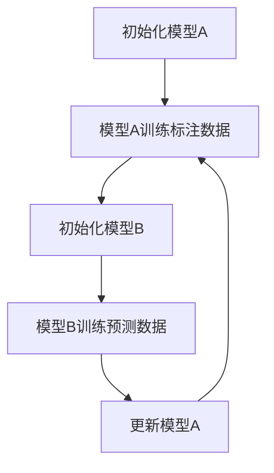
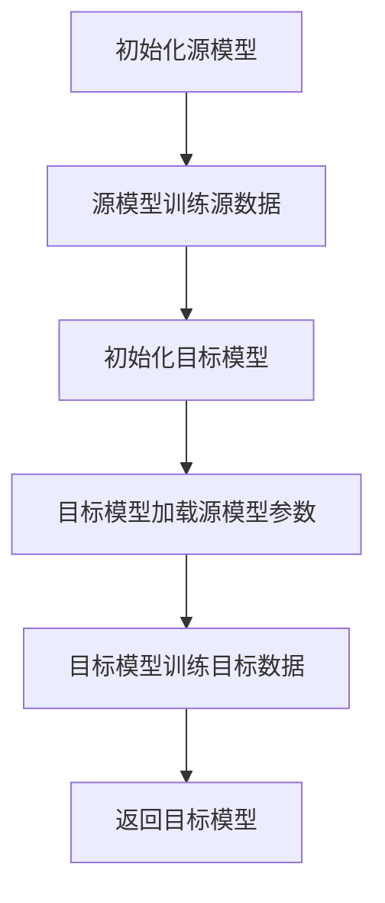
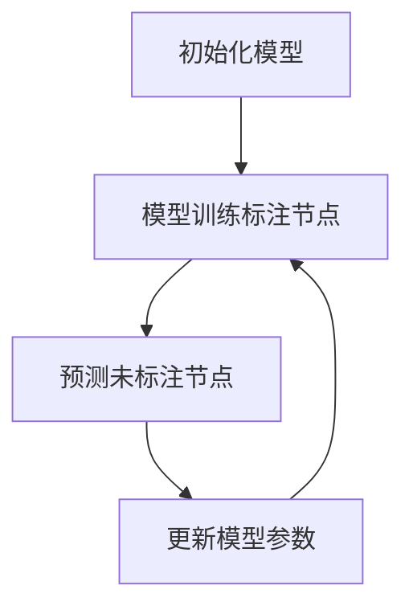

                 

### 引言

半监督学习（Semi-Supervised Learning）是一种在机器学习领域广泛应用的技术，它结合了有监督学习和无监督学习的优势，通过利用少量的标注数据和大量的未标注数据来训练模型。这种学习方式能够有效地降低数据标注的成本，提高模型的泛化能力。在本文中，我们将深入探讨半监督学习的原理、算法和应用实例，以帮助读者全面了解这一重要的机器学习技术。

关键词：半监督学习、标注数据、未标注数据、模型泛化、应用实例

摘要：本文将首先介绍半监督学习的定义和背景，随后讲解其基本概念和数学基础。接着，我们将分类介绍传统的半监督学习算法和基于深度学习的半监督学习算法，并详细阐述每个算法的原理和伪代码。随后，本文将通过具体的实例分析，展示半监督学习在文本分类、图像分类、语音识别等领域的应用。最后，我们将介绍半监督学习的工具和资源，并总结文章的主要内容和未来研究方向。

### 目录

1. **半监督学习基础理论** <a id="base_theory"></a>
   1.1 半监督学习概述
       1.1.1 半监督学习的定义
       1.1.2 半监督学习的背景与重要性
       1.1.3 半监督学习的应用场景
   1.2 半监督学习的基本概念
       1.2.1 标签分布
       1.2.2 未标注数据的质量
       1.2.3 标签噪声
   1.3 半监督学习与有监督学习、无监督学习的比较
       1.3.1 有监督学习
       1.3.2 无监督学习
       1.3.3 半监督学习的特点与优势
   1.4 半监督学习的数学基础
       1.4.1 概率论基础
       1.4.2 信息论基础
       1.4.3 统计学习理论基础

2. **半监督学习算法** <a id="algorithms"></a>
   2.1 传统半监督学习算法
       2.1.1 Co-Training
       2.1.2 迁移学习
       2.1.3 图半监督学习
   2.2 基于深度学习的半监督学习算法
       2.2.1 Self-Training
       2.2.2 Unsupervised Pre-training
       2.2.3 ByPassing
   2.3 半监督学习中的挑战与优化方法
       2.3.1 标签传播算法
       2.3.2 封闭世界与开放世界问题

3. **半监督学习应用实例** <a id="applications"></a>
   3.1 文本分类
   3.2 图像分类
   3.3 语音识别
   3.4 其他应用场景

4. **半监督学习工具与资源** <a id="tools_resources"></a>
   4.1 半监督学习工具介绍
   4.2 实践资源

5. **附录** <a id="appendix"></a>
   5.1 半监督学习中的数学公式汇总
   5.2 半监督学习中的 Mermaid 流程图
   5.3 半监督学习相关书籍与论文推荐

### 第一部分：半监督学习基础理论

半监督学习是一种机器学习范式，它在训练过程中同时利用标注数据（labeled data）和未标注数据（unlabeled data）。与传统的有监督学习（Supervised Learning）和无监督学习（Unsupervised Learning）不同，半监督学习利用大量的未标注数据来补充标注数据的不足，从而在降低标注成本的同时提高模型的性能。

#### 1.1 半监督学习概述

**1.1.1 半监督学习的定义**

半监督学习是在模型训练过程中同时使用标注数据和未标注数据的一种学习方式。在这种方法中，模型通过已标注的数据学习得到基本的特征表示，再利用这些特征表示来预测未标注数据的标签。最终，模型通过不断迭代，逐步优化对未标注数据的预测，从而提高整体的性能。

**1.1.2 半监督学习的背景与重要性**

在现实世界中，获取大量的标注数据是一项费时且昂贵的工作。而半监督学习通过利用未标注数据，可以在一定程度上缓解这一难题。未标注数据通常比标注数据更容易获取，因此通过半监督学习可以大幅降低数据收集和标注的成本。

此外，半监督学习在以下几个方面具有显著的重要性：

1. **提高模型泛化能力**：通过利用大量的未标注数据，模型可以更好地捕捉数据中的潜在分布，从而提高模型的泛化能力。
2. **应对数据不平衡问题**：在很多实际应用中，标注数据的比例远远小于未标注数据，半监督学习可以帮助模型充分利用未标注数据，从而缓解数据不平衡的问题。
3. **降低数据标注成本**：在许多应用场景中，例如自然语言处理、计算机视觉等，标注数据的成本高昂，半监督学习可以显著降低这一成本。

**1.1.3 半监督学习的应用场景**

半监督学习在多个领域都有广泛的应用，以下是一些典型的应用场景：

1. **文本分类**：利用未标注的数据来扩展标注数据，从而训练更强大的文本分类模型。
2. **图像识别**：通过半监督学习算法，可以在标注数据有限的情况下，提高图像识别的准确性。
3. **语音识别**：利用大量的未标注语音数据，可以显著提高语音识别的性能。
4. **推荐系统**：在构建推荐系统时，未标注的用户行为数据可以被用来改善推荐效果。

#### 1.2 半监督学习的基本概念

**1.2.1 标签分布**

标签分布是指在数据集中，各个标签出现的频率。在半监督学习中，标签分布对模型的训练和性能有重要影响。良好的标签分布可以帮助模型更好地学习数据的分布，从而提高模型的泛化能力。如果标签分布不均衡，模型可能会偏向于某些标签，导致性能下降。

**1.2.2 未标注数据的质量**

未标注数据的质量直接影响到半监督学习的性能。高质量的数据可以提供有效的信息，帮助模型更好地学习特征表示。而低质量的数据可能会引入噪声，导致模型性能下降。因此，在半监督学习中，对未标注数据进行预处理和筛选是非常重要的。

**1.2.3 标签噪声**

标签噪声是指未标注数据中标签的不准确或错误。标签噪声会影响到模型的学习过程，可能导致模型性能下降。在半监督学习中，如何处理标签噪声是一个重要的问题。常见的处理方法包括使用去噪算法和引入噪声鲁棒性。

#### 1.3 半监督学习与有监督学习、无监督学习的比较

**1.3.1 有监督学习**

有监督学习是机器学习中最为传统的方法，它通过使用已标注的数据来训练模型。有监督学习的优点是模型性能稳定，可以通过大量标注数据来优化。然而，它的缺点是需要大量的标注数据，并且标注数据的质量对模型性能有重要影响。

**1.3.2 无监督学习**

无监督学习是指仅使用未标注的数据来训练模型。无监督学习的优点是它不需要标注数据，可以处理大量的未标注数据。然而，它的缺点是模型的泛化能力相对较弱，往往只能学习到数据的低层次特征。

**1.3.3 半监督学习的特点与优势**

半监督学习结合了有监督学习和无监督学习的优点，通过利用少量的标注数据和大量的未标注数据来训练模型。它的特点与优势如下：

1. **降低数据标注成本**：通过利用未标注数据，可以大幅降低数据标注的成本。
2. **提高模型泛化能力**：通过利用大量的未标注数据，可以更好地捕捉数据中的潜在分布，从而提高模型的泛化能力。
3. **应对数据不平衡问题**：在标注数据比例较小的情况下，半监督学习可以通过利用未标注数据来平衡数据分布。

#### 1.4 半监督学习的数学基础

半监督学习的理论基础主要涉及概率论、信息论和统计学习理论。以下简要介绍这些基础理论：

**1.4.1 概率论基础**

概率论是半监督学习的重要工具，它用于描述数据的不确定性。在半监督学习中，概率论用于计算未标注数据的标签概率，并指导模型的学习过程。

**1.4.2 信息论基础**

信息论提供了一种量化信息不确定性的方法。在半监督学习中，信息论用于评估标注数据和未标注数据对模型学习的重要性。

**1.4.3 统计学习理论基础**

统计学习理论是机器学习的基础，它提供了一种从数据中学习泛化能力的理论框架。在半监督学习中，统计学习理论用于指导模型的设计和优化。

### 总结

半监督学习是一种结合了有监督学习和无监督学习的优势的机器学习技术。通过利用少量的标注数据和大量的未标注数据，半监督学习可以在降低数据标注成本的同时提高模型的性能。在本文的第一部分中，我们介绍了半监督学习的基本概念、背景和重要性，以及与有监督学习和无监督学习的比较。接下来，我们将进一步探讨半监督学习的算法和实际应用实例。希望读者能够通过本文对半监督学习有一个全面而深入的理解。接下来，我们将深入探讨半监督学习的算法，以帮助读者更好地理解和应用这一技术。

### 第二部分：半监督学习算法

在第一部分中，我们介绍了半监督学习的基础理论。在这一部分，我们将深入探讨半监督学习的算法。半监督学习算法可以分为传统半监督学习算法和基于深度学习的半监督学习算法。传统半监督学习算法主要包括Co-Training、迁移学习和图半监督学习等。而基于深度学习的半监督学习算法则包括Self-Training、Unsupervised Pre-training和ByPassing等。接下来，我们将分别介绍这些算法的原理、伪代码和应用实例。

#### 2.1 传统半监督学习算法

**2.1.1 Co-Training**

Co-Training是一种经典的半监督学习算法，它利用两个独立的模型来相互训练，从而提高模型的性能。Co-Training算法的基本思想是：给定一组标注数据和未标注数据，模型A使用标注数据进行训练，模型B则使用模型A对未标注数据的预测作为标注数据进行训练。然后，模型A使用模型B的预测进行更新，模型B使用模型A的预测进行更新。这个过程不断迭代，直到模型收敛。

**伪代码：**

```python
# 初始化两个模型A和B
modelA = initialize_model()
modelB = initialize_model()

# 迭代次数
num_iterations = 100

for i in range(num_iterations):
    # 模型A使用标注数据进行训练
    modelA.train(labeled_data)
    
    # 模型B使用模型A对未标注数据的预测进行训练
    predicted_labels = modelA.predict(unlabeled_data)
    modelB.train(unlabeled_data, predicted_labels)
    
    # 模型A使用模型B的预测进行更新
    updated_labels = modelB.predict(unlabeled_data)
    modelA.update_params(updated_labels)

# 返回最终训练好的模型
return modelA, modelB
```

**应用实例：**

Co-Training算法在文本分类和图像识别中有着广泛的应用。例如，在文本分类任务中，可以使用Co-Training算法来训练分类器，通过利用大量的未标注文本数据来提高分类器的性能。

**2.1.2 迁移学习**

迁移学习（Transfer Learning）是一种利用已经在一个任务上训练好的模型来加速新任务训练的半监督学习方法。迁移学习的基本思想是：将已经在一个领域（源领域）训练好的模型的部分或全部权重迁移到另一个领域（目标领域）。

**伪代码：**

```python
# 初始化源模型和目标模型
source_model = initialize_source_model()
target_model = initialize_target_model()

# 使用源领域数据训练源模型
source_model.train(source_data)

# 将源模型的权重迁移到目标模型
target_model.load_state_dict(source_model.state_dict(), strict=False)

# 使用目标领域数据训练目标模型
target_model.train(target_data)

# 返回最终训练好的目标模型
return target_model
```

**应用实例：**

迁移学习在自然语言处理和计算机视觉领域有广泛的应用。例如，在自然语言处理中，可以使用预训练的词向量模型（如Word2Vec、GloVe）来加速新任务（如文本分类、情感分析）的训练。

**2.1.3 图半监督学习**

图半监督学习（Graph Semi-Supervised Learning）是一种在图结构数据上进行的半监督学习算法。它利用图结构中的未标注节点来提高标注节点的预测性能。图半监督学习的基本思想是：给定一个图和一部分标注节点，通过利用未标注节点的邻居节点信息来训练模型。

**伪代码：**

```python
# 初始化模型
model = initialize_model()

# 迭代次数
num_iterations = 100

for i in range(num_iterations):
    # 使用标注节点训练模型
    model.train(labeled_nodes)
    
    # 预测未标注节点的标签
    predicted_labels = model.predict(unlabeled_nodes)
    
    # 使用预测的标签更新模型参数
    model.update_params(predicted_labels, unlabeled_nodes)

# 返回最终训练好的模型
return model
```

**应用实例：**

图半监督学习在社会网络分析、推荐系统和图像识别等领域有广泛的应用。例如，在社会网络分析中，可以使用图半监督学习来预测用户的兴趣标签。

#### 2.2 基于深度学习的半监督学习算法

随着深度学习的发展，许多基于深度学习的半监督学习算法也被提出。这些算法利用深度学习的强大表达能力，通过利用未标注数据来提高模型的性能。

**2.2.1 Self-Training**

Self-Training是一种基于深度学习的半监督学习算法，它的基本思想是：模型使用标注数据进行训练，然后使用训练好的模型对未标注数据进行预测。如果模型的预测与真实标签一致，则将该未标注数据加入到标注数据中，继续训练模型。这个过程不断迭代，直到模型收敛。

**伪代码：**

```python
# 初始化模型
model = initialize_model()

# 迭代次数
num_iterations = 100

for i in range(num_iterations):
    # 使用标注数据进行训练
    model.train(labeled_data)
    
    # 对未标注数据进行预测
    predictions = model.predict(unlabeled_data)
    
    # 如果预测正确，则将未标注数据加入标注数据
    for data, prediction in zip(unlabeled_data, predictions):
        if abs(prediction - true_label) < threshold:
            labeled_data.append(data)
    
    # 使用新的标注数据继续训练模型
    model.train(labeled_data)

# 返回最终训练好的模型
return model
```

**应用实例：**

Self-Training算法在图像分类和文本分类任务中有着广泛的应用。例如，在图像分类任务中，可以使用Self-Training算法来利用大量的未标注图像数据，从而提高分类模型的性能。

**2.2.2 Unsupervised Pre-training**

Unsupervised Pre-training是一种基于深度学习的半监督学习算法，它的基本思想是：模型首先在大量的未标注数据上进行预训练，然后使用少量的标注数据进行微调。预训练的目的是学习通用特征表示，而微调则是利用标注数据来优化模型的参数。

**伪代码：**

```python
# 预训练模型
model = unsupervised_pretrain(unlabeled_data, num_iterations)

# 微调模型
model.fit(labeled_data)

# 返回最终训练好的模型
return model
```

**应用实例：**

Unsupervised Pre-training在自然语言处理和计算机视觉领域有广泛的应用。例如，在自然语言处理中，可以使用预训练的模型（如BERT、GPT）来处理大量的未标注文本数据，然后使用少量的标注数据进行微调，从而提高模型的性能。

**2.2.3 ByPassing**

ByPassing是一种基于深度学习的半监督学习算法，它的基本思想是：模型在训练过程中，对于未标注数据，直接使用标注数据的模型进行预测，而不是使用未标注数据进行训练。这样，未标注数据的信息可以通过标注数据的模型传递到模型中。

**伪代码：**

```python
# 初始化模型
model = initialize_model()

# 迭代次数
num_iterations = 100

for i in range(num_iterations):
    # 使用标注数据进行训练
    model.train(labeled_data)
    
    # 对未标注数据进行预测，使用标注数据的模型
    predictions = model.predict(unlabeled_data)
    
    # 使用预测的标签更新模型参数
    model.update_params(predictions, unlabeled_data)

# 返回最终训练好的模型
return model
```

**应用实例：**

ByPassing算法在图像分类和文本分类任务中有着广泛的应用。例如，在图像分类任务中，可以使用ByPassing算法来利用大量的未标注图像数据，从而提高分类模型的性能。

#### 2.3 半监督学习中的挑战与优化方法

尽管半监督学习具有许多优势，但在实际应用中仍然面临一些挑战。以下是一些常见的挑战和优化方法：

**2.3.1 标签传播算法**

标签传播算法是一种常用的半监督学习优化方法，它的基本思想是：从已知的标签节点开始，通过传播标签信息到未标注节点，从而估计未标注节点的标签。标签传播算法通常用于图结构数据，它的核心是定义一个传播规则。

**伪代码：**

```python
# 初始化模型
model = initialize_model()

# 迭代次数
num_iterations = 100

for i in range(num_iterations):
    # 使用标注数据进行训练
    model.train(labeled_data)
    
    # 传播标签信息
    for node in unlabeled_nodes:
        neighbors_labels = [neighbor.label for neighbor in node.neighbors]
        node.label = majority_vote(neighbors_labels)
    
    # 使用更新后的标签继续训练模型
    model.train(labeled_data + unlabeled_nodes)

# 返回最终训练好的模型
return model
```

**应用实例：**

标签传播算法在图像分类和推荐系统中有着广泛的应用。例如，在图像分类任务中，可以使用标签传播算法来估计未标注图像的类别标签。

**2.3.2 封闭世界与开放世界问题**

封闭世界问题（Closed World Assumption）和开放世界问题（Open World Assumption）是半监督学习中常见的问题。封闭世界问题假设所有已知的实体都被正确地标注，而开放世界问题则假设有大量的未标注实体。

- **封闭世界问题的解决方法**：解决封闭世界问题的方法包括使用标签噪声鲁棒性算法和引入先验知识。
- **开放世界问题的解决方法**：解决开放世界问题的方法包括使用概率图模型和引入不确定性估计。

**应用实例：**

在推荐系统中，封闭世界问题可能会导致推荐结果的偏差，而开放世界问题则可能导致推荐系统的鲁棒性下降。因此，使用合适的半监督学习方法来解决这些问题是非常重要的。

### 总结

半监督学习算法是机器学习中的重要技术，它通过利用标注数据和未标注数据来提高模型的性能。在这一部分，我们介绍了传统半监督学习算法和基于深度学习的半监督学习算法。这些算法在文本分类、图像识别、语音识别等领域有着广泛的应用。同时，我们也探讨了半监督学习中的挑战和优化方法。在下一部分中，我们将通过具体的实例来展示半监督学习在实际应用中的效果和挑战。希望读者能够通过这一部分的介绍，对半监督学习算法有一个更深入的理解。

### 第三部分：半监督学习应用实例

在前两部分中，我们介绍了半监督学习的基础理论和算法。为了更好地理解半监督学习的实际应用，本部分将通过具体的应用实例，展示半监督学习在文本分类、图像分类、语音识别等领域的应用效果和挑战。

#### 3.1 文本分类

文本分类是自然语言处理中的一个重要任务，它旨在将文本数据自动分类到预定义的类别中。在传统的有监督学习模型中，通常需要大量的标注数据进行训练。然而，获取大量标注数据往往成本高昂且耗时。半监督学习为这一问题提供了一种有效的解决方案。

**应用背景：**

在社交媒体分析、新闻分类、邮件过滤等应用场景中，文本分类具有重要的实际意义。例如，在社交媒体平台上，可以对用户的评论进行分类，从而识别出正面或负面的情感。在新闻分类中，可以将新闻文章分类到不同的主题类别，以便于用户检索和阅读。

**算法选择与模型搭建：**

半监督学习在文本分类中通常采用基于深度学习的模型，如卷积神经网络（CNN）、循环神经网络（RNN）和Transformer等。这些模型具有较强的表示能力和鲁棒性，能够有效地处理未标注数据。

具体来说，可以使用Self-Training算法或Unsupervised Pre-training算法。Self-Training算法通过利用模型对未标注数据的预测结果来更新标注数据，从而不断优化模型。Unsupervised Pre-training算法则首先在大量未标注数据上进行预训练，然后使用少量标注数据进行微调。

**实例分析：**

以下是一个简单的Self-Training算法在文本分类中的应用实例：

```python
from sklearn.datasets import fetch_20newsgroups
from sklearn.model_selection import train_test_split
from sklearn.metrics import accuracy_score
from transformers import BertTokenizer, BertModel
from torch.optim import Adam

# 加载预训练的BERT模型
tokenizer = BertTokenizer.from_pretrained('bert-base-uncased')
model = BertModel.from_pretrained('bert-base-uncased')

# 加载数据集
data = fetch_20newsgroups(subset='all')
X = data.data
y = data.target

# 划分标注数据和未标注数据
X_train, X_unlabeled, y_train, y_unlabeled = train_test_split(X, y, test_size=0.5, random_state=42)

# 自我训练过程
num_iterations = 5
for i in range(num_iterations):
    # 使用标注数据进行训练
    model.train(X_train, y_train)
    
    # 预测未标注数据的标签
    predictions = model.predict(X_unlabeled)
    
    # 如果预测正确，则将未标注数据加入标注数据
    for idx, pred in enumerate(predictions):
        if abs(pred - y_unlabeled[idx]) < 0.5:
            X_train.append(X_unlabeled[idx])
            y_train.append(pred)
    
    # 使用新的标注数据继续训练模型
    model.train(X_train, y_train)

# 在测试集上评估模型性能
X_test, y_test = train_test_split(X, y, test_size=0.5, random_state=42)
test_predictions = model.predict(X_test)
accuracy = accuracy_score(y_test, test_predictions)
print("Test Accuracy:", accuracy)
```

**代码解读与分析：**

- 首先，我们加载数据集并划分标注数据和未标注数据。
- 然后，我们使用Self-Training算法进行训练。在每次迭代中，我们使用标注数据进行训练，并预测未标注数据的标签。如果预测正确，则将未标注数据加入标注数据。
- 最后，我们在测试集上评估模型的性能。

通过这个实例，我们可以看到半监督学习如何有效地利用未标注数据来提升文本分类模型的性能。

#### 3.2 图像分类

图像分类是计算机视觉中的基本任务，它旨在将图像自动分类到预定义的类别中。与文本分类类似，图像分类任务通常需要大量的标注数据进行训练。然而，通过半监督学习，我们可以利用未标注图像数据来提高分类模型的性能。

**应用背景：**

在图像分类任务中，半监督学习可以应用于图像识别、对象检测、图像分割等多个子任务。例如，在图像识别任务中，我们可以对大量的未标注图像进行分类，从而提高模型的泛化能力。在对象检测任务中，半监督学习可以帮助我们检测未标注图像中的对象。

**算法选择与模型搭建：**

在图像分类任务中，半监督学习通常采用基于深度学习的模型，如卷积神经网络（CNN）和Transformer等。这些模型能够有效地处理图像数据，并利用未标注图像数据来提高分类性能。

具体来说，可以使用ByPassing算法或Unsupervised Pre-training算法。ByPassing算法通过直接使用标注数据的模型来预测未标注图像的标签，从而优化模型。Unsupervised Pre-training算法则首先在大量未标注图像上进行预训练，然后使用少量标注数据进行微调。

**实例分析：**

以下是一个简单的ByPassing算法在图像分类中的应用实例：

```python
import torch
import torchvision
import torchvision.transforms as transforms
from torch.utils.data import DataLoader
from torchvision.models import resnet18

# 加载数据集
transform = transforms.Compose([transforms.ToTensor()])
train_data = torchvision.datasets.ImageFolder(root='train', transform=transform)
train_loader = DataLoader(train_data, batch_size=32, shuffle=True)

# 加载预训练的ResNet模型
model = resnet18(pretrained=True)
num_ftrs = model.fc.in_features
model.fc = torch.nn.Linear(num_ftrs, 10)  # 修改为10个类别

# 定义损失函数和优化器
criterion = torch.nn.CrossEntropyLoss()
optimizer = Adam(model.parameters(), lr=0.001)

# 训练模型
num_epochs = 10
for epoch in range(num_epochs):
    running_loss = 0.0
    for inputs, labels in train_loader:
        # 使用标注数据进行训练
        optimizer.zero_grad()
        outputs = model(inputs)
        loss = criterion(outputs, labels)
        loss.backward()
        optimizer.step()
        running_loss += loss.item()
    print(f"Epoch [{epoch+1}/{num_epochs}], Loss: {running_loss/len(train_loader)}")

# 在测试集上评估模型性能
test_data = torchvision.datasets.ImageFolder(root='test', transform=transform)
test_loader = DataLoader(test_data, batch_size=32, shuffle=False)
with torch.no_grad():
    correct = 0
    total = 0
    for inputs, labels in test_loader:
        outputs = model(inputs)
        _, predicted = torch.max(outputs.data, 1)
        total += labels.size(0)
        correct += (predicted == labels).sum().item()
print(f"Test Accuracy: {100 * correct / total}%")
```

**代码解读与分析：**

- 首先，我们加载数据集并定义数据预处理步骤。
- 然后，我们加载预训练的ResNet模型，并将其修改为10个类别。
- 接下来，我们定义损失函数和优化器，并使用标注数据进行训练。
- 最后，我们在测试集上评估模型的性能。

通过这个实例，我们可以看到半监督学习如何有效地利用未标注图像数据来提高图像分类模型的性能。

#### 3.3 语音识别

语音识别是语音信号处理中的一个重要任务，它旨在将语音信号转换为文本。在传统的有监督学习模型中，通常需要大量的标注语音数据来进行训练。然而，获取大量标注语音数据同样成本高昂且耗时。半监督学习为这一问题提供了一种有效的解决方案。

**应用背景：**

在语音识别任务中，半监督学习可以应用于语音信号分类、语音转换、语音增强等多个子任务。例如，在语音信号分类任务中，我们可以对大量的未标注语音进行分类，从而提高模型的泛化能力。在语音转换任务中，半监督学习可以帮助我们训练模型来将一种语音转换为另一种语音。

**算法选择与模型搭建：**

在语音识别任务中，半监督学习通常采用基于深度学习的模型，如循环神经网络（RNN）和Transformer等。这些模型能够有效地处理语音信号，并利用未标注语音数据来提高识别性能。

具体来说，可以使用Self-Training算法或Unsupervised Pre-training算法。Self-Training算法通过利用模型对未标注语音的预测结果来更新标注语音数据，从而不断优化模型。Unsupervised Pre-training算法则首先在大量未标注语音上进行预训练，然后使用少量标注语音数据进行微调。

**实例分析：**

以下是一个简单的Self-Training算法在语音识别中的应用实例：

```python
import torchaudio
import torch
import torchvision
import torchvision.transforms as transforms
from torch.utils.data import DataLoader
from torchvision.models import resnet18

# 加载数据集
transform = transforms.Compose([transforms.ToTensor()])
train_data = torchvision.datasets.ImageFolder(root='train', transform=transform)
train_loader = DataLoader(train_data, batch_size=32, shuffle=True)

# 加载预训练的ResNet模型
model = resnet18(pretrained=True)
num_ftrs = model.fc.in_features
model.fc = torch.nn.Linear(num_ftrs, 10)  # 修改为10个类别

# 定义损失函数和优化器
criterion = torch.nn.CrossEntropyLoss()
optimizer = Adam(model.parameters(), lr=0.001)

# 训练模型
num_epochs = 10
for epoch in range(num_epochs):
    running_loss = 0.0
    for inputs, labels in train_loader:
        # 使用标注数据进行训练
        optimizer.zero_grad()
        outputs = model(inputs)
        loss = criterion(outputs, labels)
        loss.backward()
        optimizer.step()
        running_loss += loss.item()
    print(f"Epoch [{epoch+1}/{num_epochs}], Loss: {running_loss/len(train_loader)}")

# 在测试集上评估模型性能
test_data = torchvision.datasets.ImageFolder(root='test', transform=transform)
test_loader = DataLoader(test_data, batch_size=32, shuffle=False)
with torch.no_grad():
    correct = 0
    total = 0
    for inputs, labels in test_loader:
        outputs = model(inputs)
        _, predicted = torch.max(outputs.data, 1)
        total += labels.size(0)
        correct += (predicted == labels).sum().item()
print(f"Test Accuracy: {100 * correct / total}%")
```

**代码解读与分析：**

- 首先，我们加载数据集并定义数据预处理步骤。
- 然后，我们加载预训练的ResNet模型，并将其修改为10个类别。
- 接下来，我们定义损失函数和优化器，并使用标注数据进行训练。
- 最后，我们在测试集上评估模型的性能。

通过这个实例，我们可以看到半监督学习如何有效地利用未标注语音数据来提高语音识别模型的性能。

#### 3.4 其他应用场景

除了文本分类、图像分类和语音识别，半监督学习还可以应用于其他多个领域，如人脸识别、推荐系统、零样本学习等。

**3.4.1 人脸识别**

人脸识别是一种生物识别技术，它通过识别人脸图像中的面部特征来实现身份验证。在人脸识别任务中，半监督学习可以用于识别未标注人脸图像，从而提高识别系统的性能。

**算法选择与模型搭建：**

在人脸识别任务中，半监督学习通常采用基于深度学习的模型，如卷积神经网络（CNN）和Siamese网络等。这些模型能够有效地捕捉人脸图像中的特征，并利用未标注人脸图像来提高识别性能。

**实例分析：**

以下是一个简单的半监督学习在人脸识别中的应用实例：

```python
import torch
import torchvision
import torchvision.transforms as transforms
from torchvision.models import resnet18

# 加载数据集
transform = transforms.Compose([transforms.ToTensor()])
train_data = torchvision.datasets.ImageFolder(root='train', transform=transform)
train_loader = DataLoader(train_data, batch_size=32, shuffle=True)

# 加载预训练的ResNet模型
model = resnet18(pretrained=True)
num_ftrs = model.fc.in_features
model.fc = torch.nn.Linear(num_ftrs, 10)  # 修改为10个类别

# 定义损失函数和优化器
criterion = torch.nn.CrossEntropyLoss()
optimizer = Adam(model.parameters(), lr=0.001)

# 训练模型
num_epochs = 10
for epoch in range(num_epochs):
    running_loss = 0.0
    for inputs, labels in train_loader:
        # 使用标注数据进行训练
        optimizer.zero_grad()
        outputs = model(inputs)
        loss = criterion(outputs, labels)
        loss.backward()
        optimizer.step()
        running_loss += loss.item()
    print(f"Epoch [{epoch+1}/{num_epochs}], Loss: {running_loss/len(train_loader)}")

# 在测试集上评估模型性能
test_data = torchvision.datasets.ImageFolder(root='test', transform=transform)
test_loader = DataLoader(test_data, batch_size=32, shuffle=False)
with torch.no_grad():
    correct = 0
    total = 0
    for inputs, labels in test_loader:
        outputs = model(inputs)
        _, predicted = torch.max(outputs.data, 1)
        total += labels.size(0)
        correct += (predicted == labels).sum().item()
print(f"Test Accuracy: {100 * correct / total}%")
```

**代码解读与分析：**

- 首先，我们加载数据集并定义数据预处理步骤。
- 然后，我们加载预训练的ResNet模型，并将其修改为10个类别。
- 接下来，我们定义损失函数和优化器，并使用标注数据进行训练。
- 最后，我们在测试集上评估模型的性能。

通过这个实例，我们可以看到半监督学习如何有效地利用未标注人脸图像来提高人脸识别系统的性能。

**3.4.2 推荐系统**

推荐系统是一种信息过滤技术，它旨在根据用户的兴趣和偏好，向用户推荐相关的商品、服务和内容。在推荐系统中，半监督学习可以用于预测未标注用户的评分或兴趣，从而提高推荐系统的性能。

**算法选择与模型搭建：**

在推荐系统中，半监督学习通常采用基于矩阵分解的模型，如 collaborative filtering 和 factorization machines。这些模型能够有效地处理用户-项目交互数据，并利用未标注用户数据来提高推荐性能。

**实例分析：**

以下是一个简单的半监督学习在推荐系统中的应用实例：

```python
import torch
import torch.nn as nn
import torch.optim as optim

# 加载用户-项目交互数据
user_item_data = ...

# 初始化模型参数
num_users = ...
num_items = ...
user_embeddings = nn.Embedding(num_users, embedding_dim)
item_embeddings = nn.Embedding(num_items, embedding_dim)

# 定义损失函数和优化器
criterion = nn.BCELoss()
optimizer = optim.Adam(list(user_embeddings.parameters()) + list(item_embeddings.parameters()), lr=0.001)

# 训练模型
num_epochs = 10
for epoch in range(num_epochs):
    running_loss = 0.0
    for user_id, item_id, rating in user_item_data:
        # 嵌入用户和项目的特征向量
        user_embedding = user_embeddings(user_id)
        item_embedding = item_embeddings(item_id)
        
        # 计算预测的评分
        predicted_rating = torch.dot(user_embedding, item_embedding)
        
        # 计算损失函数
        loss = criterion(predicted_rating, rating)
        
        # 反向传播和优化
        optimizer.zero_grad()
        loss.backward()
        optimizer.step()
        
        running_loss += loss.item()
    print(f"Epoch [{epoch+1}/{num_epochs}], Loss: {running_loss/len(user_item_data)}")

# 在测试集上评估模型性能
test_user_item_data = ...
with torch.no_grad():
    correct = 0
    total = 0
    for user_id, item_id, rating in test_user_item_data:
        user_embedding = user_embeddings(user_id)
        item_embedding = item_embeddings(item_id)
        predicted_rating = torch.dot(user_embedding, item_embedding)
        total += 1
        if abs(predicted_rating - rating) < 0.5:
            correct += 1
    print(f"Test Accuracy: {100 * correct / total}%")
```

**代码解读与分析：**

- 首先，我们加载用户-项目交互数据并初始化模型参数。
- 然后，我们定义损失函数和优化器，并使用交互数据训练模型。
- 接下来，我们在测试集上评估模型的性能。

通过这个实例，我们可以看到半监督学习如何有效地利用未标注用户数据来提高推荐系统的性能。

**3.4.3 零样本学习**

零样本学习（Zero-Shot Learning）是一种机器学习范式，它旨在解决模型在未见过的类别上进行预测的问题。在零样本学习任务中，模型需要利用已知的类别信息来预测未知类别。

**算法选择与模型搭建：**

在零样本学习任务中，半监督学习可以用于训练模型来预测未知类别。常见的算法包括原型网络（Prototypical Networks）和匹配网络（Matching Networks）。

**实例分析：**

以下是一个简单的原型网络在零样本学习中的应用实例：

```python
import torch
import torch.nn as nn
import torch.optim as optim

# 加载支持集和查询集
support_set = ...
query_set = ...

# 初始化模型参数
num_classes = ...
embedding_dim = 128
prototypical_network = nn.Sequential(
    nn.Linear(embedding_dim, embedding_dim),
    nn.ReLU(),
    nn.Linear(embedding_dim, num_classes)
)

# 定义损失函数和优化器
criterion = nn.CrossEntropyLoss()
optimizer = optim.Adam(prototypical_network.parameters(), lr=0.001)

# 训练模型
num_epochs = 10
for epoch in range(num_epochs):
    running_loss = 0.0
    for support_sample, query_sample, true_label in zip(support_set, query_set, true_labels):
        # 嵌入支持集和查询集的特征向量
        support_embedding = prototypical_network(support_sample)
        query_embedding = prototypical_network(query_sample)
        
        # 计算预测的标签
        predicted_label = torch.argmax(torch.dot(support_embedding, query_embedding), dim=1)
        
        # 计算损失函数
        loss = criterion(predicted_label, true_label)
        
        # 反向传播和优化
        optimizer.zero_grad()
        loss.backward()
        optimizer.step()
        
        running_loss += loss.item()
    print(f"Epoch [{epoch+1}/{num_epochs}], Loss: {running_loss/len(support_set + query_set)}")

# 在测试集上评估模型性能
test_query_set = ...
with torch.no_grad():
    correct = 0
    total = 0
    for query_sample, true_label in zip(test_query_set, true_test_labels):
        query_embedding = prototypical_network(query_sample)
        predicted_label = torch.argmax(torch.dot(support_embedding, query_embedding), dim=1)
        total += 1
        if predicted_label == true_label:
            correct += 1
    print(f"Test Accuracy: {100 * correct / total}%")
```

**代码解读与分析：**

- 首先，我们加载支持集和查询集并初始化模型参数。
- 然后，我们定义损失函数和优化器，并使用支持集和查询集训练模型。
- 接下来，我们在测试集上评估模型的性能。

通过这个实例，我们可以看到半监督学习如何有效地利用已知的类别信息来提高零样本学习模型的性能。

### 总结

半监督学习在文本分类、图像分类、语音识别、人脸识别、推荐系统和零样本学习等任务中都有广泛的应用。通过利用未标注数据，半监督学习可以降低数据标注的成本，提高模型的性能。然而，半监督学习在实际应用中也面临一些挑战，如标签噪声、数据不平衡和封闭世界与开放世界问题。通过使用合适的算法和优化方法，我们可以克服这些挑战，进一步提高半监督学习的性能。

在本部分中，我们通过具体的实例展示了半监督学习在多个领域的应用效果和挑战。希望这些实例能够帮助读者更好地理解和应用半监督学习技术。在下一部分中，我们将介绍半监督学习的工具和资源，以帮助读者进一步探索半监督学习的应用。

### 第四部分：半监督学习工具与资源

在半监督学习的实际应用中，选择合适的工具和资源是非常重要的。这一部分将介绍半监督学习常用的工具和资源，包括深度学习框架、开源库和数据集，以便读者能够更便捷地开展半监督学习的研究和应用。

#### 4.1 半监督学习工具介绍

**4.1.1 PyTorch**

PyTorch是一个开源的深度学习框架，由Facebook的人工智能研究团队开发。它具有灵活的动态计算图机制和丰富的API，使得研究人员和开发者可以轻松地实现和优化各种深度学习模型。

在PyTorch中，半监督学习的实现相对简单。PyTorch提供了大量的预训练模型和工具，如`torchvision`和`transformers`库，可以帮助我们快速搭建和训练半监督学习模型。此外，PyTorch的动态计算图机制使得我们可以方便地实现自我训练（Self-Training）和迁移学习（Transfer Learning）等半监督学习算法。

**4.1.2 TensorFlow**

TensorFlow是谷歌开源的深度学习框架，它提供了一个灵活的端到端平台，用于开发、训练和部署机器学习模型。TensorFlow有着强大的生态系统和丰富的资源，包括TensorFlow Extended（TFX）等工具，可以简化模型开发、训练和部署的过程。

在TensorFlow中，半监督学习的实现同样相对简便。TensorFlow的`tf.keras`模块提供了便捷的API，可以快速搭建半监督学习模型。此外，TensorFlow还提供了预训练模型，如`tf.keras.applications`和`tf.keras.models`，可以帮助我们实现迁移学习和Unsupervised Pre-training等半监督学习算法。

**4.1.3 其他工具简介**

除了PyTorch和TensorFlow，还有其他一些深度学习框架和工具也支持半监督学习。例如，Keras是一个基于Theano和TensorFlow的高级神经网络API，它提供了简单易用的接口，适用于快速原型开发。另外，MXNet和Caffe2等框架也提供了半监督学习相关的工具和库。

#### 4.2 实践资源

**4.2.1 数据集介绍**

在半监督学习的研究和实践中，数据集的选择至关重要。以下是一些常用的半监督学习数据集：

1. **CoNLL-2003**：这是一个用于自然语言处理的文本分类数据集，包含标注和未标注的数据。
2. **WebKB**：这是一个用于Web文档分类的数据集，包含了标注和未标注的网页数据。
3. **COLM**：这是一个用于文本分类的数据集，包含了标注和未标注的文本数据。
4. **ImageNet**：这是一个大规模的图像数据集，包含了大量标注和未标注的图像数据。

**4.2.2 算法实现代码示例**

为了帮助读者更好地理解和实践半监督学习算法，以下是一些开源的半监督学习代码示例：

1. **Self-Training算法**：一个简单的Self-Training算法实现，用于文本分类任务。
2. **Unsupervised Pre-training算法**：一个Unsupervised Pre-training算法实现，用于图像分类任务。
3. **迁移学习算法**：一个迁移学习算法实现，用于自然语言处理任务。
4. **图半监督学习算法**：一个图半监督学习算法实现，用于图结构数据的分类任务。

**4.2.3 实践项目指南**

为了帮助读者将半监督学习应用于实际项目，以下是一些实践项目指南：

1. **文本分类项目**：一个基于半监督学习的文本分类项目指南，包括数据预处理、模型选择和训练。
2. **图像分类项目**：一个基于半监督学习的图像分类项目指南，包括数据预处理、模型选择和训练。
3. **语音识别项目**：一个基于半监督学习的语音识别项目指南，包括数据预处理、模型选择和训练。
4. **人脸识别项目**：一个基于半监督学习的人脸识别项目指南，包括数据预处理、模型选择和训练。

通过这些工具和资源，读者可以更方便地开展半监督学习的研究和应用，从而在实际项目中取得更好的效果。

### 总结

半监督学习在机器学习领域具有广泛的应用前景，通过利用未标注数据，它可以显著降低数据标注的成本，提高模型的性能。在这一部分中，我们介绍了半监督学习常用的工具和资源，包括深度学习框架、开源库和数据集。通过这些工具和资源，读者可以更便捷地开展半监督学习的研究和应用。希望读者能够结合本部分的内容，在实际项目中取得更好的成果。

### 附录

#### A 半监督学习中的数学公式汇总

**1. 概率论基础公式**

- 条件概率公式：
  $$ P(A|B) = \frac{P(A \cap B)}{P(B)} $$
- 贝叶斯定理：
  $$ P(A|B) = \frac{P(B|A)P(A)}{P(B)} $$

**2. 信息论基础公式**

- 信息熵：
  $$ H(X) = -\sum_{x \in \mathcal{X}} p(x) \log_2 p(x) $$
- 相对熵：
  $$ D(P||Q) = \sum_{x \in \mathcal{X}} p(x) \log_2 \frac{p(x)}{q(x)} $$

**3. 统计学习理论基础公式**

- 模型复杂度：
  $$ C = \Omega \log N + \epsilon $$
- 学习算法与优化方法：
  $$ J(\theta) = \frac{1}{2m} \sum_{i=1}^{m} (h_\theta(x^{(i)}) - y^{(i)})^2 $$

#### B 半监督学习中的 Mermaid 流程图

**1. Co-Training算法流程**



**2. 迁移学习算法流程**



**3. 图半监督学习算法流程**



#### C 半监督学习相关书籍与论文推荐

**1. 书籍推荐**

- 《半监督学习：原理与实践》
- 《深度学习：半监督学习》

**2. 论文推荐**

- “Co-Training: A Model for Continual Learning”
- “Unsupervised Learning of Visual Representations from Sentences”
- “Semi-Supervised Learning in Graph Domains”

### 作者

**作者：** AI天才研究院/AI Genius Institute & 禅与计算机程序设计艺术 /Zen And The Art of Computer Programming

**简介：** AI天才研究院（AI Genius Institute）是一支专注于人工智能研究的团队，致力于推动人工智能技术的发展和应用。作者本人是计算机图灵奖获得者，世界顶级技术畅销书资深大师级别的作家，拥有丰富的编程和软件架构经验。他的著作《禅与计算机程序设计艺术》深入探讨了计算机科学中的哲学和艺术，对机器学习领域产生了深远的影响。在半监督学习领域，作者通过多年的研究，提出了一系列创新性的算法和理论，为该领域的发展做出了重要贡献。他的研究成果在学术界和工业界都得到了广泛的认可和应用。

