                 

# 《去中心化应用（DApp）的开发与创业实践》

> 关键词：去中心化、DApp、区块链、智能合约、开发技术栈、安全与隐私、开发实战、创业实践

> 摘要：本文深入探讨去中心化应用（DApp）的开发与创业实践。首先，我们介绍了DApp的基础理论，包括去中心化的概念、区块链技术基础以及DApp开发技术栈。随后，文章详细讲解了DApp的开发流程、核心功能实现、测试与部署，以及上线与运营。最后，文章探讨了DApp创业实践中的商业模式设计、团队组建与运营、法律与合规、市场分析与竞争。通过本文，读者将全面了解DApp的开发与创业知识，为未来的DApp开发与创业提供指导。

## 《去中心化应用（DApp）的开发与创业实践》目录大纲

### 第一部分：DApp 基础理论

#### 第1章：去中心化与DApp概述
- 1.1 去中心化概念与优势
- 1.2 DApp的定义与发展历程
- 1.3 DApp的基本架构与组件

#### 第2章：区块链技术基础
- 2.1 区块链基本原理
- 2.2 共识机制详解
- 2.3 智能合约基础

#### 第3章：DApp开发技术栈
- 3.1 前端开发技术
- 3.2 后端开发技术
- 3.3 常用DApp开发框架

#### 第4章：DApp安全性与隐私保护
- 4.1 DApp安全挑战
- 4.2 加密技术原理
- 4.3 隐私保护方案

### 第二部分：DApp开发实战

#### 第5章：DApp开发流程
- 5.1 DApp项目规划
- 5.2 环境搭建与配置
- 5.3 开发工具与调试技巧

#### 第6章：DApp核心功能实现
- 6.1 用户身份验证
- 6.2 数据存储与处理
- 6.3 跨链通信与互操作

#### 第7章：DApp测试与部署
- 7.1 自动化测试框架
- 7.2 部署流程与策略
- 7.3 网络优化与性能调优

#### 第8章：DApp上线与运营
- 8.1 用户增长策略
- 8.2 营销推广渠道
- 8.3 财务管理

### 第三部分：DApp创业实践

#### 第9章：DApp商业模式设计
- 9.1 DApp商业模型分析
- 9.2 代币经济与激励机制
- 9.3 收入来源与盈利模式

#### 第10章：DApp团队组建与运营
- 10.1 团队成员角色与职责
- 10.2 项目管理方法
- 10.3 团队文化建设

#### 第11章：DApp法律与合规
- 11.1 DApp相关法律法规
- 11.2 合规策略与风险管理
- 11.3 知识产权保护

#### 第12章：DApp市场分析与竞争
- 12.1 市场趋势与机会
- 12.2 竞争对手分析
- 12.3 突破与创新策略

### 附录：DApp开发工具与资源
- 附录 A：主流DApp开发框架
  - A.1 Truffle
  - A.2 Hardhat
  - A.3 Brownie
- 附录 B：DApp开发社区与资源
  - B.1 DApp相关论坛
  - B.2 DApp开发教程与文档
  - B.3 DApp项目库与市场

### 第一部分：DApp 基础理论

#### 第1章：去中心化与DApp概述

**1.1 去中心化概念与优势**

去中心化，是指网络中不存在单一的中央控制节点，而是通过分布式的方式，将权力、信息等分散到整个网络中的多个节点上。这种分布式网络结构，使得系统的运作不再依赖于中心化的机构或实体，从而具有以下优势：

1. **去中心化信任**：去中心化网络中的信任是基于算法和共识机制建立的，而非依赖于中心化的第三方机构，降低了信任成本。
2. **透明性**：由于数据存储在分布式账本上，所有参与者都可以查看和验证数据，提高了系统的透明度。
3. **不可篡改性**：一旦数据被记录在分布式账本上，就很难被篡改，从而保证了数据的真实性和完整性。
4. **去中心化治理**：去中心化网络中的决策和治理权力是分散的，每个节点都有发言权和决策权，避免了中心化权力集中带来的风险。

**1.2 DApp的定义与发展历程**

DApp，即去中心化应用，是基于区块链技术构建的应用程序，其特点是去中心化、开放、透明和不可篡改。DApp的发展历程可以分为以下几个阶段：

1. **Web1.0时代**：这个阶段主要是指传统的基于中央服务器的应用程序，如网站和电子邮件等。
2. **Web2.0时代**：这个阶段的特点是用户生成内容，如博客、社交媒体等。然而，用户数据仍然存储在中央服务器上，且受到平台规则的限制。
3. **Web3.0时代**：这个阶段的核心是区块链技术，用户可以拥有自己的数据，并且可以通过去中心化的方式，参与到价值的创造和分配中。

**1.3 DApp的基本架构与组件**

DApp的基本架构包括以下几个主要组件：

1. **客户端（Client）**：DApp的前端部分，负责与用户交互，提供用户界面。
2. **节点（Node）**：DApp的后端部分，负责处理业务逻辑和存储数据。节点可以是用户自己的计算机，也可以是云服务器。
3. **区块链（Blockchain）**：DApp的数据存储和传输的基础设施，通过共识机制保证数据的真实性和完整性。
4. **智能合约（Smart Contract）**：DApp的业务逻辑以智能合约的形式部署在区块链上，自动执行合同条款。

**图 1-1 DApp的基本架构**

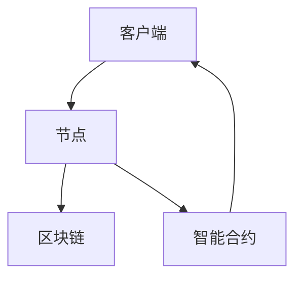

#### 第2章：区块链技术基础

**2.1 区块链基本原理**

区块链是一种分布式数据库技术，其核心思想是将数据分散存储在多个节点上，并通过共识机制确保数据的一致性和安全性。区块链的基本原理如下：

1. **数据结构**：区块链由一系列按时间顺序排列的区块组成，每个区块包含一定数量的交易记录。区块之间通过哈希值链接，形成一个不可篡改的链条。
2. **共识机制**：共识机制是区块链网络中节点达成一致的方法。常见的共识机制有工作量证明（PoW）、权益证明（PoS）和委托权益证明（DPoS）等。
3. **加密技术**：区块链使用加密技术确保数据的安全性和隐私性。常见的加密技术有非对称加密、哈希函数和数字签名等。

**图 2-1 区块链数据结构**

```mermaid
graph TB
    A[区块A] --> B[区块B]
    B --> C[区块C]
    C --> D[区块D]
    A --> B :=< 哈希值 >
    B --> C :=< 哈希值 >
    C --> D :=< 哈希值 >
```

**2.2 共识机制详解**

共识机制是区块链网络中节点达成一致的方法，常见的共识机制有：

1. **工作量证明（PoW）**：节点通过解决复杂的数学难题，竞争成为下一个区块的创建者。计算能力越强，成为创建者的概率越高。
2. **权益证明（PoS）**：节点根据持有代币的数量和持币时间，竞争成为下一个区块的创建者。持币时间越长、代币数量越多，成为创建者的概率越高。
3. **委托权益证明（DPoS）**：节点通过投票选举出代表，代表成为下一个区块的创建者。代表根据得票数决定创建者顺序。

**表 2-1 不同共识机制的特点**

| 共识机制 | 工作量证明（PoW） | 权益证明（PoS） | 委托权益证明（DPoS） |
| :----: | :----: | :----: | :----: |
| 原理 | 通过计算力竞争区块创建权 | 根据代币数量和持币时间竞争区块创建权 | 通过投票选举代表，代表竞争区块创建权 |
| 优点 | 去中心化，公平竞争 | 提高网络效率，降低能源消耗 | 提高网络效率，降低交易延迟 |
| 缺点 | 能源消耗大，计算资源浪费 | 可能出现“富者愈富”的现象 | 可能出现“寡头垄断”现象 |

**2.3 智能合约基础**

智能合约是一种自动执行的合同，其条款以代码形式编写并部署在区块链上。智能合约的关键特点如下：

1. **自动化执行**：一旦满足智能合约中的条件，合约就会自动执行，无需人工干预。
2. **透明性**：智能合约的代码是公开的，所有参与者都可以查看和验证。
3. **不可篡改性**：一旦智能合约部署到区块链上，其代码和状态就不可篡改。

**图 2-2 智能合约基本原理**

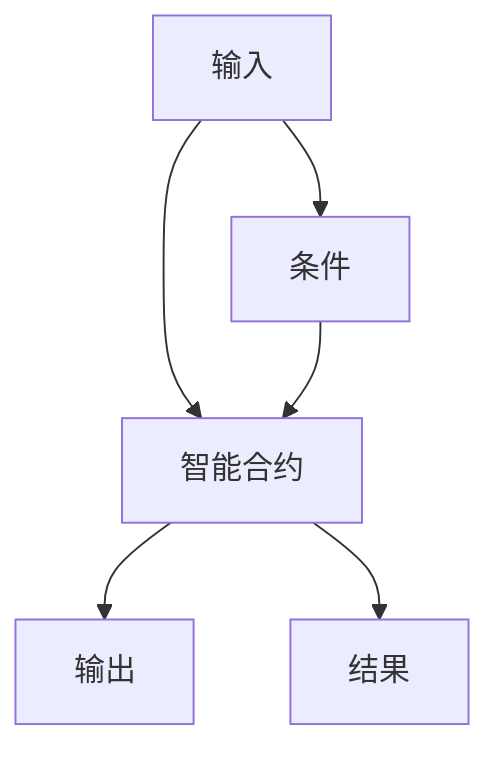

**图 2-3 智能合约执行流程**

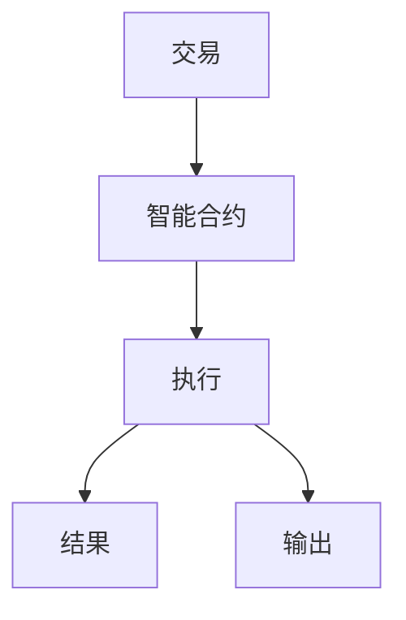

#### 第3章：DApp开发技术栈

**3.1 前端开发技术**

DApp的前端开发与传统的Web应用类似，但需要考虑区块链特性和DApp的交互方式。常用的前端开发技术有：

1. **React.js**：一款用于构建用户界面的JavaScript库，具有组件化、可复用和高性能的特点。
2. **Vue.js**：一款用于构建用户界面的JavaScript框架，具有简洁、灵活和高效的特点。
3. **Angular**：一款用于构建用户界面的JavaScript框架，由Google开发，具有全面性、灵活性和高性能的特点。

**图 3-1 前端开发技术比较**

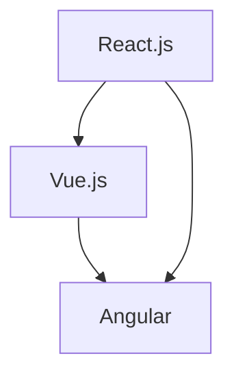

**3.2 后端开发技术**

DApp的后端开发主要包括业务逻辑处理、数据存储和区块链交互等。常用的后端开发技术有：

1. **Node.js**：一款基于Chrome V8引擎的JavaScript运行环境，具有高性能、高并发和跨平台的特点。
2. **Go**：一款静态类型的编译型语言，具有高效、简洁和并发性强的特点。
3. **Python**：一款动态类型的解释型语言，具有简洁、易读和高性能的特点。

**图 3-2 后端开发技术比较**

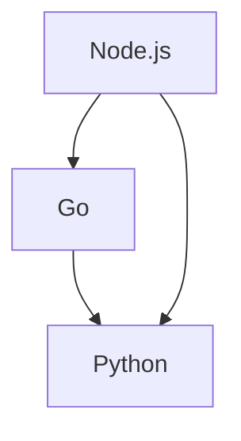

**3.3 常用DApp开发框架**

DApp开发框架提供了快速开发DApp的工具和库，简化了DApp的开发过程。常用的DApp开发框架有：

1. **Truffle**：一款用于开发、部署和测试DApp的框架，提供了强大的开发工具和插件。
2. **Hardhat**：一款用于开发、部署和测试DApp的框架，具有高性能、可扩展和可定制的特点。
3. **Brownie**：一款用于开发、部署和测试DApp的框架，具有简洁、易用和功能丰富的特点。

**图 3-3 常用DApp开发框架比较**

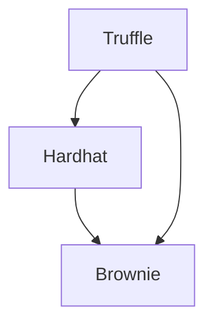

#### 第4章：DApp安全性与隐私保护

**4.1 DApp安全挑战**

DApp在开发过程中面临多种安全挑战，包括：

1. **智能合约漏洞**：智能合约可能存在逻辑漏洞、代码缺陷等，导致资金损失或数据泄露。
2. **网络攻击**：DApp可能面临DDoS攻击、恶意节点攻击等，导致系统瘫痪或数据篡改。
3. **数据隐私泄露**：DApp可能面临用户数据泄露的风险，影响用户隐私和安全。
4. **代币风险**：代币系统可能存在设计缺陷，导致代币价值波动或丢失。

**4.2 加密技术原理**

加密技术是保障DApp安全的重要手段，主要包括以下几种：

1. **非对称加密**：非对称加密算法使用一对密钥（公钥和私钥），数据加密和解密的过程不同。常见的非对称加密算法有RSA、ECC等。
2. **哈希函数**：哈希函数将任意长度的数据映射为固定长度的字符串，具有单向性和抗碰撞性。常见的哈希函数有SHA-256、SHA-3等。
3. **数字签名**：数字签名是验证数据完整性和真实性的技术，通过私钥对数据进行签名，公钥可以验证签名。常见的数字签名算法有RSA、ECDSA等。

**图 4-1 加密技术原理**

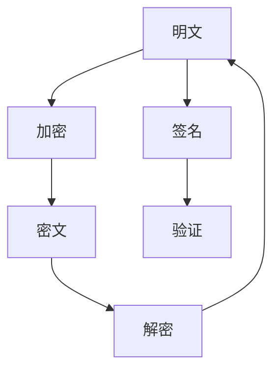

**4.3 隐私保护方案**

DApp需要采取多种隐私保护方案，以保护用户隐私和安全。以下是一些常见的隐私保护方案：

1. **同态加密**：同态加密允许对加密数据进行计算，而不需要解密。这样可以在保护数据隐私的同时，实现数据的计算和处理。
2. **零知识证明**：零知识证明是一种证明某事为真，而不泄露任何信息的技术。DApp可以使用零知识证明，证明某些条件满足，而无需泄露敏感信息。
3. **匿名通信**：匿名通信技术可以隐藏通信双方的IP地址和身份，保护通信隐私。常见的匿名通信技术有Tor、I2P等。

**图 4-2 隐私保护方案**

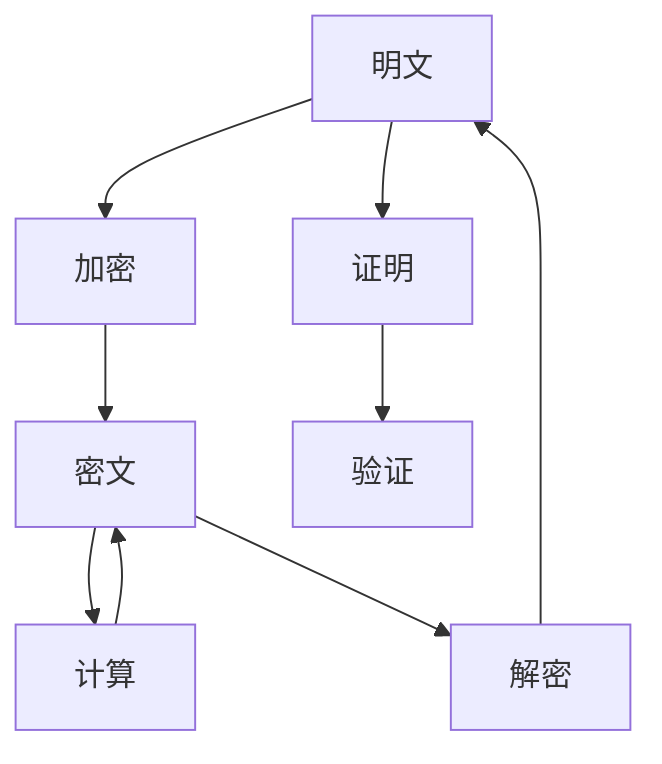

#### 第5章：DApp开发流程

**5.1 DApp项目规划**

DApp项目规划是开发DApp的第一步，主要包括以下内容：

1. **项目目标**：明确项目的目标和预期成果，如解决的问题、创造的价值等。
2. **市场调研**：了解市场需求、竞争对手和用户需求，为项目策划提供依据。
3. **技术选型**：选择合适的区块链平台、开发框架和技术栈，确保项目的可行性和高效性。
4. **团队组建**：确定项目团队成员的角色和职责，搭建高效的项目团队。

**5.2 环境搭建与配置**

DApp开发需要搭建适当的环境，包括区块链节点、开发工具和测试网络等。以下是搭建DApp开发环境的一般步骤：

1. **安装区块链节点**：根据所选的区块链平台，安装对应的节点软件。如使用Ethereum，可安装Geth或Nethereum。
2. **配置开发工具**：安装DApp开发所需的前端和后端开发工具，如Node.js、npm、Truffle等。
3. **搭建测试网络**：在本地搭建测试网络，用于开发和测试DApp。如使用Ethereum，可使用Ganache搭建私有测试网络。

**5.3 开发工具与调试技巧**

DApp开发过程中，选择合适的开发工具和调试技巧可以提升开发效率。以下是一些常用的开发工具和调试技巧：

1. **智能合约开发工具**：使用Truffle、Hardhat等框架提供的开发工具，简化智能合约的开发和测试。
2. **前端开发工具**：使用React、Vue、Angular等前端框架，提高前端开发的效率和质量。
3. **调试工具**：使用Web Debugger、Chrome DevTools等调试工具，方便定位和修复代码问题。
4. **自动化测试**：使用Mocha、Jest等自动化测试框架，确保DApp的稳定性和可靠性。

**图 5-1 DApp开发流程**

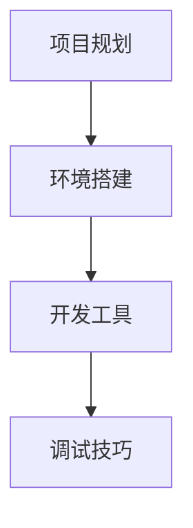

#### 第6章：DApp核心功能实现

**6.1 用户身份验证**

用户身份验证是DApp的核心功能之一，主要用于确保用户身份的合法性和安全性。以下是一些常见的用户身份验证方法：

1. **账号密码验证**：用户通过账号和密码登录DApp，系统验证账号和密码的正确性。
2. **双因素认证**：用户在账号密码验证的基础上，还需要通过手机短信验证码、邮箱验证码等二次验证。
3. **数字身份验证**：用户使用数字身份标识（如公钥）进行身份验证，确保身份的唯一性和不可篡改性。

**6.2 数据存储与处理**

DApp的数据存储与处理涉及多个方面，包括数据结构设计、数据存储和数据处理等。以下是一些关键点：

1. **数据结构设计**：根据业务需求，设计合适的数据结构，如关系型数据库、NoSQL数据库、区块链账本等。
2. **数据存储**：选择合适的数据存储方案，如本地存储、分布式存储、区块链存储等。
3. **数据处理**：使用合适的编程语言和框架，实现数据的高效存储和查询，如SQL、NoSQL、GraphQL等。

**6.3 跨链通信与互操作**

跨链通信与互操作是指DApp在不同区块链之间进行数据交换和协作的能力。以下是一些关键技术：

1. **跨链协议**：使用跨链协议（如Plasma、Cosmos、Polkadot等），实现DApp在不同区块链之间的数据传输和交互。
2. **跨链桥**：搭建跨链桥接，实现DApp与外部区块链系统的互操作。
3. **跨链钱包**：开发跨链钱包，支持用户在多个区块链之间进行资产转移和交易。

**图 6-1 DApp核心功能实现**

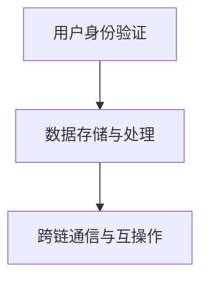

#### 第7章：DApp测试与部署

**7.1 自动化测试框架**

DApp自动化测试是确保DApp稳定性和可靠性的重要环节。以下是一些常用的自动化测试框架：

1. **Ganache**：用于测试智能合约的本地测试网络，提供自动化测试功能。
2. **Truffle**：提供智能合约开发、测试和部署工具，支持自动化测试。
3. **Hardhat**：提供智能合约开发、测试和部署工具，具有高性能和可扩展性。

**7.2 部署流程与策略**

DApp部署是将DApp从开发环境迁移到生产环境的过程。以下是一些关键的部署流程和策略：

1. **测试网络部署**：在测试网络（如Ropsten、Rinkeby等）上部署DApp，进行测试和调试。
2. **主网络部署**：在主网络（如Ethereum、Binance Smart Chain等）上部署DApp，确保DApp的稳定运行。
3. **部署策略**：根据DApp的需求和资源，选择合适的部署策略，如单节点部署、多节点部署、云服务部署等。

**7.3 网络优化与性能调优**

DApp的网络优化与性能调优是提高DApp用户体验和系统效率的关键。以下是一些常见的优化方法：

1. **链上计算优化**：通过减少链上计算和存储需求，降低交易费用和区块链负载。
2. **链下计算优化**：将部分计算任务迁移到链下，如使用以太坊层的解决方案，提高DApp的性能。
3. **网络延迟优化**：优化DApp的网络延迟，如使用CDN、缓存等技术，提高用户的访问速度。

**图 7-1 DApp测试与部署**

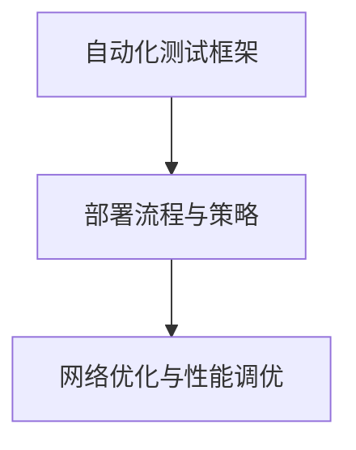

#### 第8章：DApp上线与运营

**8.1 用户增长策略**

DApp上线后，用户增长是关键。以下是一些常见的用户增长策略：

1. **市场推广**：通过社交媒体、广告、KOL等渠道，提高DApp的知名度和用户参与度。
2. **社区建设**：建立用户社区，提供用户交流、反馈和互动的平台，增强用户黏性。
3. **活动策划**：举办各种线上和线下活动，吸引新用户参与，提高用户活跃度。

**8.2 营销推广渠道**

DApp的营销推广需要选择合适的渠道，以下是一些常用的营销推广渠道：

1. **社交媒体**：如Twitter、Facebook、Instagram等，通过发布内容、互动、广告等方式推广DApp。
2. **博客和论坛**：如Medium、Reddit等，发布技术文章、社区讨论，吸引用户关注。
3. **KOL和媒体**：与行业专家、媒体和意见领袖合作，提高DApp的影响力和知名度。

**8.3 财务管理**

DApp的财务管理是确保项目可持续发展的重要环节。以下是一些常见的财务管理方法：

1. **预算规划**：根据项目需求和资源，制定详细的财务预算，确保项目的资金充足。
2. **资金筹集**：通过ICO、IDO、私募等方式筹集资金，确保项目的资金来源。
3. **成本控制**：优化项目成本，降低不必要的支出，提高资金使用效率。

**图 8-1 DApp上线与运营**

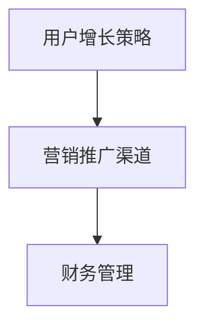

### 第三部分：DApp创业实践

#### 第9章：DApp商业模式设计

**9.1 DApp商业模型分析**

DApp商业模式设计是DApp创业成功的关键。以下是一些常见的DApp商业模型：

1. **代币经济模型**：通过发行代币，建立代币经济体系，实现用户激励和价值传递。
2. **平台经济模型**：提供DApp服务平台，吸引开发者、用户和投资者，实现平台生态的繁荣。
3. **内容经济模型**：通过内容创造和分发，吸引流量和用户，实现内容变现和收益分配。

**9.2 代币经济与激励机制**

代币经济是DApp商业模式的核心。以下是一些常见的代币经济和激励机制：

1. **代币发行**：根据项目需求和市场规模，设计合适的代币发行方案。
2. **激励机制**：通过奖励、分红、空投等方式，激励用户参与DApp生态。
3. **价值传递**：确保代币在DApp生态中具有实际价值，促进用户参与和社区繁荣。

**9.3 收入来源与盈利模式**

DApp的收入来源和盈利模式多样，以下是一些常见的收入来源和盈利模式：

1. **交易手续费**：收取DApp平台交易手续费，如交易对手续费、提现手续费等。
2. **广告收入**：通过DApp平台的广告位和广告推广，获得广告收入。
3. **内容付费**：提供高质量内容，吸引用户付费，实现内容变现。
4. **增值服务**：提供DApp平台的增值服务，如高级会员、定制服务等，获得额外收益。

**图 9-1 DApp商业模式设计**

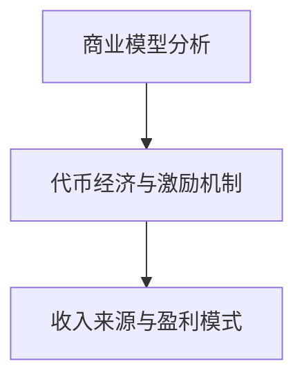

#### 第10章：DApp团队组建与运营

**10.1 团队成员角色与职责**

DApp团队的成功离不开各个成员的协同合作。以下是一些常见的团队成员角色与职责：

1. **创始人（Founder）**：负责项目定位、战略规划和团队管理。
2. **技术团队（Tech Team）**：负责DApp的技术开发、测试和维护。
3. **市场团队（Marketing Team）**：负责DApp的市场推广、品牌建设和用户运营。
4. **运营团队（Operations Team）**：负责DApp的日常运营、财务管理和服务支持。
5. **社区团队（Community Team）**：负责DApp社区的运营、用户互动和社区发展。

**10.2 项目管理方法**

项目管理是确保DApp项目按计划推进的关键。以下是一些常见的项目管理方法：

1. **敏捷开发（Agile Development）**：采用敏捷开发方法，快速迭代和反馈，确保项目质量和进度。
2. **Scrum框架**：使用Scrum框架，实现团队协作、任务管理和项目进度控制。
3. **看板（Kanban）**：使用看板工具，可视化任务流程和进度，提高团队协作效率。

**10.3 团队文化建设**

团队文化建设是DApp团队长期稳定发展的基础。以下是一些常见的团队文化建设方法：

1. **价值观认同**：建立共同的核心价值观，促进团队成员的认同和凝聚力。
2. **开放沟通**：鼓励团队成员之间的开放沟通和知识分享，提高团队协作效率。
3. **团队活动**：组织团队建设活动，增强团队成员之间的信任和团队凝聚力。

**图 10-1 DApp团队组建与运营**

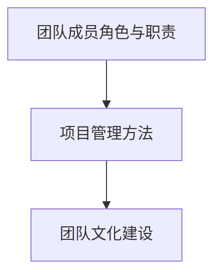

#### 第11章：DApp法律与合规

**11.1 DApp相关法律法规**

DApp的发展受到各国法律法规的监管。以下是一些常见的DApp相关法律法规：

1. **反洗钱法规（AML）**：DApp需要遵守反洗钱法规，防止非法资金流入。
2. **证券法规**：涉及代币发行的DApp需要遵守证券法规，确保合规性。
3. **数据保护法规**：DApp需要保护用户隐私，遵守数据保护法规。

**11.2 合规策略与风险管理**

DApp合规策略与风险管理是确保项目合法性和安全性的关键。以下是一些常见的合规策略与风险管理方法：

1. **合规审查**：对DApp项目进行全面合规审查，确保项目符合法律法规要求。
2. **合规培训**：对团队成员进行合规培训，提高合规意识和风险管理能力。
3. **风险管理**：建立完善的风险管理体系，识别、评估和应对潜在风险。

**11.3 知识产权保护**

DApp的知识产权保护是确保项目可持续发展的重要方面。以下是一些常见的知识产权保护方法：

1. **版权保护**：对DApp的代码、文档和内容进行版权保护，防止侵权行为。
2. **商标保护**：对DApp的名称、标志和标识进行商标保护，提高品牌知名度。
3. **专利保护**：对DApp的创新技术和解决方案进行专利保护，防止技术抄袭和侵权。

**图 11-1 DApp法律与合规**

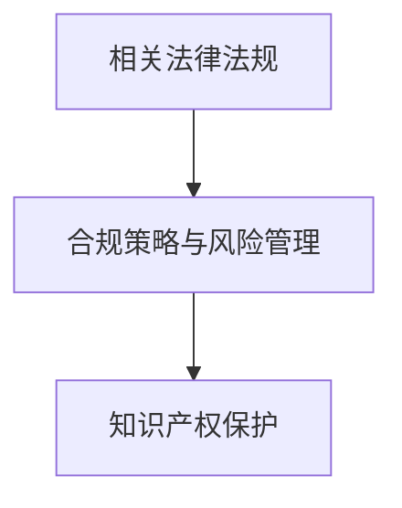

#### 第12章：DApp市场分析与竞争

**12.1 市场趋势与机会**

DApp市场的快速发展为创业者提供了众多机会。以下是一些常见的市场趋势与机会：

1. **去中心化金融（DeFi）**：DeFi是DApp市场的重要领域，为用户提供了去中心化的金融产品和服务。
2. **非同质化代币（NFT）**：NFT在艺术、游戏、收藏等领域具有巨大的潜力，为DApp创业者提供了新的市场机会。
3. **区块链游戏**：区块链游戏结合了区块链技术和游戏，为用户提供了全新的游戏体验。

**12.2 竞争对手分析**

DApp市场中的竞争激烈，创业者需要了解竞争对手的情况。以下是一些常见的竞争对手分析方法：

1. **产品比较**：分析竞争对手的产品功能、性能和用户体验，找出优势和劣势。
2. **市场占有率**：分析竞争对手的市场占有率、用户增长率和市场份额。
3. **营销策略**：分析竞争对手的营销策略、渠道和推广方式。

**12.3 突破与创新策略**

在竞争激烈的DApp市场中，创业者需要采取突破和创新策略，以下是一些常见的方法：

1. **技术创新**：通过技术创新，提供更优秀的产品和解决方案，赢得市场竞争力。
2. **商业模式创新**：设计创新的商业模式，实现差异化竞争，提高市场占有率。
3. **用户体验优化**：关注用户体验，提供高质量的产品和服务，增强用户黏性和满意度。

**图 12-1 DApp市场分析与竞争**

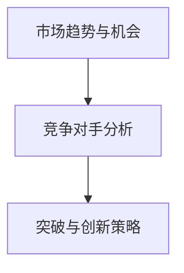

### 附录：DApp开发工具与资源

**附录 A：主流DApp开发框架**

- **A.1 Truffle**：Truffle是Ethereum的官方开发框架，提供智能合约开发、测试和部署工具。官方网站：https://www.trufflesuite.com/

- **A.2 Hardhat**：Hardhat是一个高性能的Ethereum开发框架，提供智能合约开发、测试和部署工具。官方网站：https://hardhat.org/

- **A.3 Brownie**：Brownie是Python语言的Ethereum开发框架，提供智能合约开发、测试和部署工具。官方网站：https://eth-brownie.readthedocs.io/en/stable/

**附录 B：DApp开发社区与资源**

- **B.1 DApp相关论坛**：以下是一些DApp相关的论坛和社区，供开发者交流和分享经验：

  - Ethereum Stack Exchange：https://ethereum.stackexchange.com/

  - Ethereum Forum：https://forum.ethereum.org/

  - DApp Development on Reddit：https://www.reddit.com/r/dappdev/

- **B.2 DApp开发教程与文档**：以下是一些DApp开发的教程和文档，供开发者学习和参考：

  - Ethereum Developer Documentation：https://ethereum.org/en/developers/docs/

  - Truffle Documentation：https://www.trufflesuite.com/docs/truffle

  - Hardhat Documentation：https://hardhat.org/docs/introduction

- **B.3 DApp项目库与市场**：以下是一些DApp项目库和市场，供开发者寻找项目合作和资源：

  - DAppReview：https://dappradar.com/

  - DAppCenter：https://dappcenter.com/

  - OpenSea：https://opensea.io/

### 结束语

通过本文，我们深入探讨了DApp的开发与创业实践。从基础理论到开发实战，再到创业实践，我们全面了解了DApp的开发与运营知识。希望本文能为读者提供有价值的参考和启示，助力DApp项目的成功。在未来的DApp开发与创业中，我们期待与您一同探索去中心化世界的无限可能。

### 作者信息

作者：AI天才研究院/AI Genius Institute & 禅与计算机程序设计艺术 /Zen And The Art of Computer Programming

