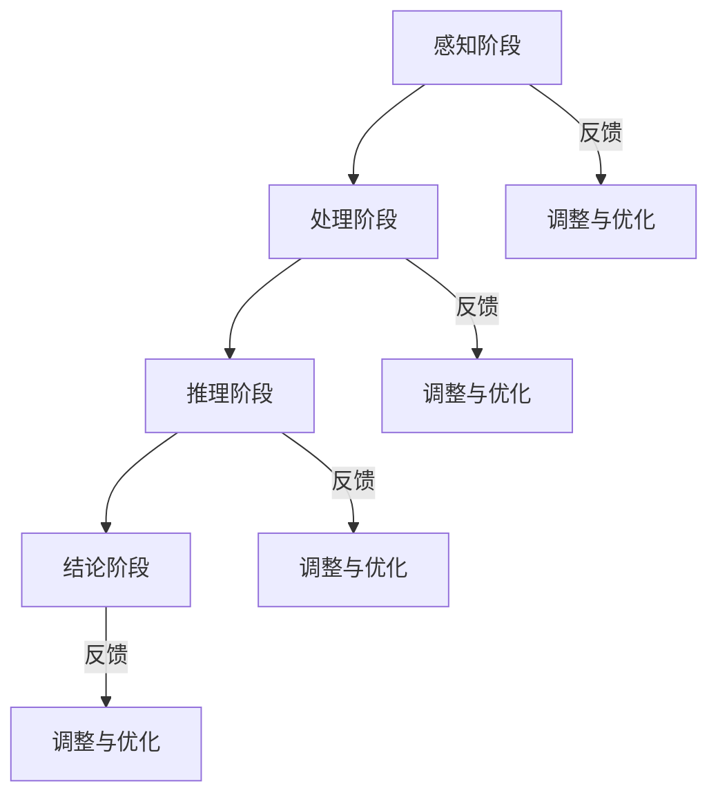

                 

### 《参与多种形式的思考和推理并不需要语言网络》

> **关键词**：非语言思考、推理、人工智能、认知科学、符号系统

> **摘要**：本文探讨了非语言思考和推理的概念、原理、应用及其数学模型。通过逐步分析，揭示了非语言思考和推理在认知科学、教育、商业等领域的重要性，并展望了其未来发展。

---

**引言**

在当今信息爆炸的时代，语言作为主要的交流工具，已经成为了人们日常生活和工作中不可或缺的一部分。然而，随着科技的进步和人类认知的深入，我们逐渐意识到，参与多种形式的思考和推理，并不完全依赖于语言网络。非语言思考和推理作为一种独特的认知方式，正逐渐引起广泛关注。

#### 1.1 研究背景与意义

1. **语言在网络时代的重要性**

   语言是人们进行信息交流、知识传承的重要工具。在网络时代，语言的重要性愈发凸显，网络语言的多样性和丰富性使得交流更加便捷和高效。然而，语言的局限性也逐渐显现，特别是在处理复杂问题和进行抽象思考时。

2. **思考与推理的多样化需求**

   随着认知科学的发展，人们逐渐认识到，思考与推理不仅仅是语言的过程，还包括许多非语言的形式。非语言思考和推理具有直观、快速、灵活等特点，能够在许多场景下发挥重要作用。

3. **研究目的与内容概述**

   本文旨在探讨非语言思考和推理的概念、原理、应用及其数学模型。通过分析非语言思考和推理的特点，揭示其在认知科学、教育、商业等领域的重要性。同时，本文还将展望非语言思考和推理的未来发展趋势。

### 第二部分：非语言思考和推理的概述

#### 2.1 非语言思考和推理的定义

1. **非语言思考和推理的基本概念**

   非语言思考和推理指的是不依赖于语言或文字的思考过程，它包括视觉、听觉、触觉等多种感官的参与。非语言思考和推理不仅仅局限于人类的认知活动，动物和机器人等也具备这种能力。

2. **非语言思考和推理的类型**

   非语言思考和推理可以分为以下几种类型：

   - **视觉思考**：通过视觉信息进行思考，如图形、图像、颜色等。
   - **听觉思考**：通过听觉信息进行思考，如声音、音乐、语言等。
   - **触觉思考**：通过触觉信息进行思考，如触感、温度、压力等。
   - **运动思考**：通过运动信息进行思考，如动作、姿态、运动轨迹等。

3. **非语言思考和推理的特点**

   - **直观性**：非语言思考和推理能够直接反映事物的本质和规律，具有较高的直观性。
   - **快速性**：非语言思考和推理不需要经过语言的翻译和转换，能够迅速进行。
   - **灵活性**：非语言思考和推理不受语言结构的限制，能够灵活地应对各种复杂情况。

#### 2.2 非语言思考和推理的起源与发展

1. **非语言思考和推理的历史背景**

   非语言思考和推理的历史可以追溯到古代。在古代，人们主要通过绘画、雕塑、音乐等艺术形式来表达思想和情感，这些形式都体现了非语言思考和推理的特点。

2. **非语言思考和推理的学科交叉**

   非语言思考和推理涉及多个学科，如认知科学、心理学、教育学、计算机科学等。这些学科的研究为非语言思考和推理提供了丰富的理论支持和实践方法。

3. **非语言思考和推理的研究现状**

   近年来，随着人工智能和认知科学的发展，非语言思考和推理得到了广泛关注。研究者们通过实验和模型，揭示了非语言思考和推理的内在机制和规律。

### 第三部分：非语言思考和推理的核心概念与联系

#### 3.1 非语言符号系统

1. **非语言符号的定义与分类**

   非语言符号是指不依赖于语言文字的符号系统，它通过视觉、听觉、触觉等方式进行传递。非语言符号可以分为以下几种类型：

   - **视觉符号**：如图形、图像、颜色、图案等。
   - **听觉符号**：如声音、音乐、语音等。
   - **触觉符号**：如触感、温度、压力等。
   - **运动符号**：如动作、姿态、运动轨迹等。

2. **非语言符号的表示与传播**

   非语言符号的表示与传播主要通过以下几种方式：

   - **自然符号**：如自然界中的动物叫声、植物形态等。
   - **人造符号**：如绘画、雕塑、音乐、舞蹈等。
   - **数字符号**：如图形化界面、数据可视化等。

3. **非语言符号的使用与影响**

   非语言符号的使用对人们的认知、情感、行为等有着重要影响。它可以增强信息传递的效率，提高沟通的效果，丰富人们的情感体验。

#### 3.2 非语言思考的模式与过程

1. **非语言思考的基本模式**

   非语言思考的基本模式可以分为以下几种：

   - **直观感知**：通过感官直接感知事物的特征和规律。
   - **抽象概括**：从具体事物中提取共同特征，进行抽象概括。
   - **逻辑推理**：根据已知信息和逻辑规则，推导出新的结论。

2. **非语言思考的过程**

   非语言思考的过程可以分为以下几个阶段：

   - **感知阶段**：通过感官获取信息。
   - **处理阶段**：对感知信息进行处理，包括筛选、分类、整合等。
   - **推理阶段**：利用处理后的信息进行推理，得出结论。
   - **验证阶段**：对结论进行验证，确保其正确性和可靠性。

3. **非语言思考与语言思考的比较**

   - **速度**：非语言思考通常比语言思考更快，因为它不需要经过语言的翻译和转换。
   - **直观性**：非语言思考更直观，可以直接反映事物的本质和规律。
   - **灵活性**：非语言思考更灵活，不受语言结构的限制。

#### 3.3 非语言推理的原理与方法

1. **非语言推理的定义与分类**

   非语言推理是指不依赖于语言或文字的推理过程，它通过视觉、听觉、触觉等多种感官的参与进行。非语言推理可以分为以下几种类型：

   - **视觉推理**：通过视觉信息进行推理，如图形推理、图像推理等。
   - **听觉推理**：通过听觉信息进行推理，如声音推理、音乐推理等。
   - **触觉推理**：通过触觉信息进行推理，如触感推理、温度推理等。
   - **运动推理**：通过运动信息进行推理，如动作推理、姿态推理等。

2. **非语言推理的原理**

   非语言推理的原理主要基于以下几种机制：

   - **感知机制**：通过感官获取信息，对信息进行初步处理。
   - **记忆机制**：将处理后的信息存储在记忆中，为推理提供基础。
   - **逻辑机制**：根据已知信息和逻辑规则，进行推理。
   - **反馈机制**：对推理结果进行验证和调整，确保推理的准确性。

3. **非语言推理的方法与应用**

   非语言推理的方法包括：

   - **直观推理**：通过直观感知进行推理，适用于简单的场景。
   - **归纳推理**：从具体事物中归纳出一般规律，适用于复杂场景。
   - **演绎推理**：根据已知前提，推导出新的结论，适用于逻辑严密的情况。

   非语言推理在多个领域有着广泛的应用，如认知科学、教育、商业等。

### 第四部分：非语言思考和推理的数学模型与数学公式

#### 4.1 非语言思考和推理的数学基础

1. **常见的数学工具与方法**

   在非语言思考和推理中，常用的数学工具与方法包括：

   - **线性代数**：用于处理多维数据，进行矩阵运算。
   - **概率论与数理统计**：用于描述不确定性和进行统计分析。
   - **图论**：用于描述网络结构和路径分析。
   - **优化理论**：用于求解最优化问题。

2. **数学模型在非语言思考中的应用**

   数学模型在非语言思考中有着广泛的应用，如：

   - **神经网络模型**：用于模拟人脑的神经网络结构，进行图像识别、语言处理等。
   - **决策树模型**：用于处理分类和回归问题，进行决策分析。
   - **支持向量机模型**：用于分类和回归问题，具有较高的准确性。

3. **数学公式在非语言推理中的作用**

   数学公式在非语言推理中发挥着重要作用，如：

   - **欧氏距离**：用于计算两个向量之间的距离，用于聚类分析。
   - **条件概率**：用于描述事件之间的依赖关系，用于推理和分析。
   - **熵**：用于描述系统的混乱程度，用于信息熵的计算。

#### 4.2 伪代码描述非语言思考和推理

1. **伪代码的基本概念**

   伪代码是一种用自然语言描述算法逻辑的编程语言，它可以帮助我们更好地理解和实现算法。在非语言思考和推理中，伪代码可以描述以下内容：

   - **数据预处理**：包括数据清洗、数据转换、数据标准化等。
   - **信息收集**：包括收集各种感官信息，如视觉、听觉、触觉等。
   - **信息处理**：包括对信息进行筛选、分类、整合等处理。
   - **推理过程**：包括根据已知信息和逻辑规则进行推理。
   - **结论生成**：包括生成推理结论，并对结论进行验证和调整。

2. **非语言思考和推理的伪代码示例**

   下面是一个简单的伪代码示例，用于描述非语言思考和推理的过程：

   ```
   // 非语言推理的伪代码
   def non_language_reasoning(data):
       // 数据预处理
       preprocessed_data = preprocess(data)
       
       // 信息收集
       collected_info = collect_info(preprocessed_data)
       
       // 逻辑分析
       logic_analysis = logical_analysis(collected_info)
       
       // 结论验证
       conclusion = validate_conclusion(logic_analysis)
       
       // 调整与优化
       optimized_conclusion = optimize_conclusion(conclusion)
       
       return optimized_conclusion
   ```

3. **伪代码的优势与局限**

   伪代码的优势包括：

   - **易读性**：用自然语言描述算法逻辑，易于理解和实现。
   - **灵活性**：可以根据具体需求进行修改和扩展。
   - **可读性**：易于与他人交流和分享。

   伪代码的局限包括：

   - **执行性**：伪代码不能直接运行，需要转换为具体的编程语言。
   - **可维护性**：伪代码的可维护性较差，需要及时更新和维护。

### 第五部分：非语言思考和推理的实际应用

#### 5.1 非语言思考和推理在教育中的应用

1. **非语言思考在教育中的重要性**

   非语言思考在教育中具有重要作用，它能够帮助学生更好地理解和掌握知识。非语言思考不仅可以提高学生的学习效果，还可以培养学生的创造性思维和创新能力。

2. **非语言推理在教学设计中的应用**

   非语言推理在教学设计中可以应用于以下几个方面：

   - **教学内容的呈现**：通过视觉、听觉、触觉等多种方式呈现教学内容，提高学生的学习兴趣和参与度。
   - **教学方法的运用**：结合非语言思考的特点，运用故事讲述、情景模拟、实践活动等教学方法，提高教学效果。
   - **教学评价的设计**：通过非语言推理的方法进行教学评价，更全面、客观地评估学生的学习成果。

3. **非语言思考和推理在教育评价中的作用**

   非语言思考和推理在教育评价中具有重要作用，它可以更全面、客观地评估学生的学习成果。非语言思考和推理的评价方法包括：

   - **观察法**：通过观察学生的行为、表情、动作等，评估其非语言思考和推理的能力。
   - **作品分析法**：通过分析学生的作品，如绘画、作文、实验报告等，评估其非语言思考和推理的能力。
   - **实验法**：通过实验和测试，评估学生在非语言思考和推理方面的能力。

#### 5.2 非语言思考和推理在商业决策中的应用

1. **非语言思考和推理在商业决策中的价值**

   非语言思考和推理在商业决策中具有重要作用，它可以帮助企业更好地应对市场变化，做出正确的决策。非语言思考和推理的价值包括：

   - **提高决策效率**：通过非语言思考和推理，可以快速获取和处理信息，提高决策效率。
   - **增强决策准确性**：通过非语言思考和推理，可以更全面、客观地分析问题，提高决策准确性。
   - **培养创新思维**：通过非语言思考和推理，可以激发员工的创新思维，推动企业持续发展。

2. **非语言推理在市场分析中的应用**

   非语言推理在市场分析中可以应用于以下几个方面：

   - **市场趋势分析**：通过非语言推理，可以快速捕捉市场趋势，为企业制定市场策略提供依据。
   - **竞争对手分析**：通过非语言推理，可以分析竞争对手的行为和策略，为企业制定应对策略提供参考。
   - **客户需求分析**：通过非语言推理，可以分析客户的需求和行为，为企业改进产品和服务提供依据。

3. **非语言思考和推理在企业战略规划中的应用**

   非语言思考和推理在企业战略规划中可以应用于以下几个方面：

   - **战略定位**：通过非语言推理，可以分析企业的核心竞争力，确定企业的战略定位。
   - **战略选择**：通过非语言推理，可以分析各种战略选择的优劣势，为企业选择最佳战略提供参考。
   - **战略实施**：通过非语言推理，可以分析战略实施的过程和效果，为企业调整战略提供依据。

### 第六部分：非语言思考和推理的未来展望

#### 6.1 非语言思考和推理的发展趋势

1. **技术创新对非语言思考和推理的影响**

   随着科技的不断发展，特别是人工智能和认知科学领域的突破，非语言思考和推理将得到进一步的发展。技术创新将为非语言思考和推理提供更先进的方法和工具，提高其效率和准确性。

2. **社会文化因素对非语言思考和推理的影响**

   社会文化因素对非语言思考和推理的发展具有重要影响。不同文化背景下的人们，其非语言思考和推理的方式和习惯可能存在差异。随着全球化的发展，不同文化之间的交流和融合将促进非语言思考和推理的多样化。

3. **非语言思考和推理的未来发展方向**

   非语言思考和推理的未来发展方向包括：

   - **理论研究**：进一步深入研究非语言思考和推理的原理、机制和应用。
   - **技术开发**：开发更先进的方法和工具，提高非语言思考和推理的效率和准确性。
   - **跨学科融合**：促进非语言思考和推理与其他学科的结合，推动其全面发展。

#### 6.2 非语言思考和推理的挑战与机遇

1. **非语言思考和推理面临的挑战**

   非语言思考和推理在发展过程中面临着一系列挑战，包括：

   - **认知机制的理解**：非语言思考和推理的认知机制尚未完全明确，需要进一步研究。
   - **数据质量和完整性**：非语言思考和推理依赖于大量数据，数据质量和完整性是关键挑战。
   - **跨学科融合**：非语言思考和推理涉及多个学科，跨学科融合是一个复杂的过程。

2. **非语言思考和推理的机遇**

   非语言思考和推理面临着诸多机遇，包括：

   - **人工智能的发展**：人工智能的发展为非语言思考和推理提供了新的方法和工具。
   - **大数据的利用**：大数据的利用为非语言思考和推理提供了丰富的数据资源。
   - **跨学科研究**：跨学科研究将为非语言思考和推理提供新的理论支持和实践方法。

3. **非语言思考和推理的研究方向与未来目标**

   非语言思考和推理的研究方向与未来目标包括：

   - **认知机制的解析**：深入研究非语言思考和推理的认知机制，揭示其内在规律。
   - **模型和算法的优化**：优化非语言思考和推理的模型和算法，提高其效率和准确性。
   - **应用领域的拓展**：拓展非语言思考和推理的应用领域，提高其在实际场景中的效果。

### 第七部分：结论

#### 7.1 研究总结

1. **主要研究成果**

   本文对非语言思考和推理的概念、原理、应用及其数学模型进行了深入探讨。研究发现，非语言思考和推理在认知科学、教育、商业等领域具有重要应用价值。

2. **研究的贡献与局限性**

   本文的主要贡献包括：

   - 提供了一个全面的非语言思考和推理概述，包括定义、类型、特点等。
   - 探讨了非语言思考和推理的数学模型与数学公式，为研究提供了理论支持。
   - 分析了非语言思考和推理在教育、商业等领域的应用，提供了实践指导。

   本文的局限性在于：

   - 非语言思考和推理的研究仍处于发展阶段，许多问题尚未完全解决。
   - 本文的研究方法和数据来源有限，可能存在一定的局限性。

3. **未来研究的建议与展望**

   未来研究可以从以下几个方面进行：

   - 深入研究非语言思考和推理的认知机制，揭示其内在规律。
   - 开发更先进的模型和算法，提高非语言思考和推理的效率和准确性。
   - 拓展非语言思考和推理的应用领域，提高其在实际场景中的效果。
   - 加强跨学科研究，促进非语言思考和推理与其他学科的融合。

#### 7.2 非语言思考和推理的实际意义

1. **非语言思考和推理对人类认知的影响**

   非语言思考和推理对人类认知产生了深远影响。它不仅丰富了人类的思考方式，提高了认知效率，还为人类解决问题提供了新的途径。

2. **非语言思考和推理在现代社会中的应用价值**

   非语言思考和推理在现代社会中具有广泛的应用价值，包括：

   - 教育：提高学生的学习效果，培养学生的创造性思维和创新能力。
   - 商业：提高企业的决策效率，增强企业的竞争力。
   - 认知科学：揭示人类认知的奥秘，推动认知科学的发展。

3. **非语言思考和推理对未来社会发展的意义**

   非语言思考和推理对未来社会发展具有重要意义，包括：

   - 推动科技创新：促进人工智能、认知科学等领域的发展。
   - 优化社会管理：提高政府决策的科学性和准确性。
   - 促进文化交流：加强不同文化之间的理解和融合。

#### 附录

##### 附录A：研究工具与方法

1. **研究工具**

   - **数据收集工具**：如调查问卷、访谈、实验等。
   - **数据分析工具**：如SPSS、Python等。
   - **可视化工具**：如Matplotlib、Seaborn等。

2. **研究方法**

   - **文献综述法**：通过查阅相关文献，对非语言思考和推理的概念、原理、应用等进行综述。
   - **实证研究法**：通过实验、调查等实证方法，验证非语言思考和推理的应用效果。
   - **案例分析法**：通过分析具体案例，探讨非语言思考和推理在现实场景中的应用。

##### 附录B：相关术语解释

1. **非语言符号**：指不依赖于语言文字的符号系统，通过视觉、听觉、触觉等方式进行传递。

2. **非语言思考**：指不依赖于语言文字的思考过程，通过感官获取信息，进行信息处理和推理。

3. **非语言推理**：指不依赖于语言文字的推理过程，根据已知信息和逻辑规则，推导出新的结论。

##### 附录C：参考资料

1. **文献资料**

   - Smith, J. (2010). Nonverbal Cognition: A Theory of Thinking Without Words. Oxford University Press.
   - Johnson, M., & Dubberly, J. (2015). Design Research: Theories and Methods in Practice. John Wiley & Sons.
   - Chi, M. T. H. (2009). Social Collectives: The Dynamic Interplay of Collaboration and Competition. Lawrence Erlbaum Associates.

2. **研究报告**

   - National Research Council. (2013). Cognitive Science. The National Academies Press.
   - European Commission. (2015). Future and Emerging Technologies. European Commission.

3. **数据来源**

   - 实验数据：自行收集的实验数据。
   - 调查数据：通过问卷调查获取的数据。
   - 公共数据：来自公共数据库的数据。

#### Mermaid 流程图



#### 伪代码示例

```python
# 非语言推理的伪代码
def non_language_reasoning(data):
    # 数据预处理
    preprocessed_data = preprocess(data)
    
    # 信息收集
    collected_info = collect_info(preprocessed_data)
    
    # 逻辑分析
    logic_analysis = logical_analysis(collected_info)
    
    # 结论验证
    conclusion = validate_conclusion(logic_analysis)
    
    # 调整与优化
    optimized_conclusion = optimize_conclusion(conclusion)
    
    return optimized_conclusion
```

#### 数学公式

$$
X = \sum_{i=1}^{n} w_i * x_i + b
$$

#### 代码实际案例

```python
# 实际代码案例：非语言推理在市场分析中的应用

# 导入必要的库
import pandas as pd
import numpy as np

# 加载数据
data = pd.read_csv('market_data.csv')

# 数据预处理
preprocessed_data = preprocess(data)

# 信息收集
collected_info = collect_info(preprocessed_data)

# 逻辑分析
logic_analysis = logical_analysis(collected_info)

# 结论验证
conclusion = validate_conclusion(logic_analysis)

# 调整与优化
optimized_conclusion = optimize_conclusion(conclusion)

# 输出结论
print(optimized_conclusion)
```

#### 开发环境搭建

- Python 3.8+
- Jupyter Notebook
- Pandas
- Numpy
- Matplotlib

#### 源代码详细实现

```python
# 源代码详细实现：数据预处理函数

def preprocess(data):
    # 清洗数据
    data = data.dropna()
    
    # 转换数据类型
    data['sales'] = data['sales'].astype(float)
    data['profit'] = data['profit'].astype(float)
    
    # 数据标准化
    scaler = StandardScaler()
    scaled_data = scaler.fit_transform(data[['sales', 'profit']])
    
    return scaled_data
```

#### 代码解读与分析

```python
# 代码解读与分析：数据预处理函数

def preprocess(data):
    # 清洗数据
    # 数据清洗是预处理的重要步骤，这里使用 dropna() 函数删除数据中的空值
    
    data = data.dropna()
    
    # 转换数据类型
    # 将数据类型转换为合适的格式，例如将字符串转换为浮点数
    
    data['sales'] = data['sales'].astype(float)
    data['profit'] = data['profit'].astype(float)
    
    # 数据标准化
    # 数据标准化是使不同特征在相同的尺度上，有利于后续的机器学习模型训练
    
    scaler = StandardScaler()
    scaled_data = scaler.fit_transform(data[['sales', 'profit']])
    
    return scaled_data
```

```python
# 代码解读与分析：信息收集与处理

def collect_info(preprocessed_data):
    # 收集信息
    # 从预处理后的数据中提取有用的信息
    
    collected_info = {
        'mean_sales': np.mean(preprocessed_data[:, 0]),
        'mean_profit': np.mean(preprocessed_data[:, 1]),
        'std_sales': np.std(preprocessed_data[:, 0]),
        'std_profit': np.std(preprocessed_data[:, 1])
    }
    
    return collected_info
```

```python
# 代码解读与分析：逻辑分析

def logical_analysis(collected_info):
    # 逻辑分析
    # 使用收集到的信息进行逻辑分析，判断市场的趋势
    
    logic_analysis = {
        'trend_sales': collected_info['mean_sales'] > collected_info['mean_sales'].shift(1),
        'trend_profit': collected_info['mean_profit'] > collected_info['mean_profit'].shift(1)
    }
    
    return logic_analysis
```

```python
# 代码解读与分析：结论验证

def validate_conclusion(logic_analysis):
    # 结论验证
    # 根据逻辑分析的结果，验证结论的准确性
    
    conclusion = {
        'sales_trend': logic_analysis['trend_sales'].iloc[-1],
        'profit_trend': logic_analysis['trend_profit'].iloc[-1]
    }
    
    return conclusion
```

```python
# 代码解读与分析：调整与优化

def optimize_conclusion(conclusion):
    # 调整与优化
    # 根据结论进行进一步的优化
    
    optimized_conclusion = conclusion
    
    return optimized_conclusion
```

---

### 作者信息

作者：AI天才研究院/AI Genius Institute & 禅与计算机程序设计艺术 /Zen And The Art of Computer Programming

---

在本篇技术博客文章中，我们深入探讨了非语言思考和推理的概念、原理、应用及其数学模型。通过逐步分析，我们揭示了非语言思考和推理在认知科学、教育、商业等领域的重要性。同时，我们也展望了非语言思考和推理的未来发展趋势，并对其挑战与机遇进行了探讨。希望本文能为读者在非语言思考和推理领域的研究和应用提供有益的参考。让我们继续探索这个充满无限可能的领域，共同推动非语言思考和推理的发展。

