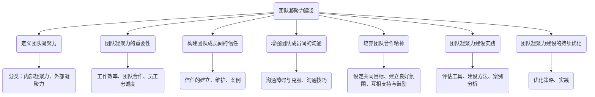
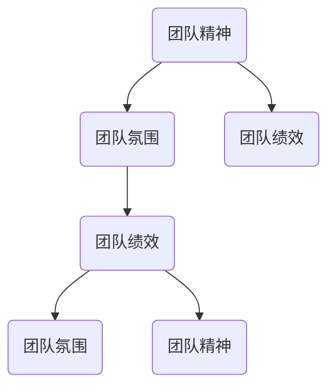

                 

# 团队凝聚力建设：从“我”到“我们”的转变

## 关键词
团队凝聚力、团队合作、信任、沟通、建设策略、案例分析

## 摘要
本文深入探讨了团队凝聚力建设的本质及其重要性，从理论到实践，提供了一系列有效的建设策略。通过分析团队凝聚力的影响、构建信任的方法、增强沟通技巧以及培养团队合作精神，本文旨在帮助读者理解团队凝聚力建设的核心要点，并通过成功的案例分析，为实际操作提供参考。

### 第一部分：团队凝聚力建设概述

#### 第1章：团队凝聚力的重要性

##### 1.1 团队凝聚力的定义与影响

###### 1.1.1 团队凝聚力的定义

团队凝聚力是指团队成员之间相互吸引、相互信任和相互支持的程度。这种凝聚力不仅体现在团队成员的心理层面上，也反映在实际工作表现中。

**定义**：团队凝聚力是指团队成员在心理上对团队产生归属感和认同感，以及在行动上相互支持、协作，共同实现团队目标的能力。

**作用**：团队凝聚力对团队的整体表现具有重要影响，可以提高工作效率、促进团队合作和增强员工忠诚度。

###### 1.1.2 团队凝聚力的影响

- **工作效率**：高凝聚力的团队能够更好地协调工作，减少冲突和误解，提高工作效率。

- **团队合作**：团队凝聚力有助于形成共同的团队目标，促进团队成员之间的协同合作，增强团队的整体实力。

- **员工忠诚度**：高凝聚力的团队能够更好地满足员工的归属感和认同感，提高员工的忠诚度，降低员工流失率。

##### 1.2 团队凝聚力的分类

###### 1.2.1 内部凝聚力

内部凝聚力是指团队成员在心理上对团队产生归属感和认同感。这种凝聚力主要表现在团队成员之间的信任、支持与协作。

- **定义**：内部凝聚力是团队成员之间在心理上形成的归属感和认同感。

- **作用**：内部凝聚力有助于增强团队成员之间的信任和合作，提高团队的稳定性。

###### 1.2.2 外部凝聚力

外部凝聚力是指团队成员在面对外部压力或挑战时形成的团结力量。这种凝聚力主要表现在团队在面对外部竞争和挑战时的协同合作和共同应对。

- **定义**：外部凝聚力是团队成员在面对外部压力或挑战时形成的团结力量。

- **作用**：外部凝聚力有助于团队在面对外部竞争和挑战时保持团结一致，共同应对困难。

##### 1.3 团队凝聚力的重要性

###### 1.3.1 提高工作效率

高凝聚力的团队能够更好地协调工作，减少冲突和误解，从而提高工作效率。团队成员之间建立了良好的信任关系，能够更快地达成共识，有效地解决问题。

- **协作效率**：团队成员能够更好地分工合作，减少沟通成本，提高工作效率。

- **创新能力**：团队凝聚力有助于激发团队成员的创造力和创新能力，推动团队发展。

###### 1.3.2 促进团队合作

团队凝聚力有助于形成共同的团队目标，促进团队成员之间的协同合作，增强团队的整体实力。团队成员之间建立了互信互助的关系，能够更好地协作，共同实现团队目标。

- **协同工作**：团队成员能够更好地协调工作，减少冲突和误解，提高工作效率。

- **互信互助**：团队成员之间建立了互信互助的关系，能够更好地协作，共同实现团队目标。

###### 1.3.3 增强员工忠诚度

高凝聚力的团队能够更好地满足员工的归属感和认同感，提高员工的忠诚度，降低员工流失率。团队成员之间建立了深厚的情感联系，使员工更加愿意为团队的发展贡献力量。

- **归属感**：团队凝聚力能够增强员工对团队的归属感和认同感，提高员工的忠诚度。

- **稳定性**：高凝聚力的团队能够降低员工流失率，提高团队的稳定性。

### 第二部分：团队凝聚力建设策略

#### 第2章：构建团队成员间的信任

##### 2.1 信任的建立

###### 2.1.1 透明沟通

透明沟通是建立信任的基础。团队成员需要保持开放和诚实的沟通态度，及时分享信息，避免误解和猜疑。

- **透明度**：团队中应建立透明的沟通机制，使成员能够随时了解团队动态和决策过程。

- **诚信**：团队成员要诚实表达自己的观点和意见，避免隐藏事实或误导他人。

###### 2.1.2 尊重与支持

尊重与支持是建立信任的重要方面。团队成员应尊重彼此的意见和贡献，提供支持和帮助，共同克服困难。

- **尊重**：团队成员要尊重彼此的专业能力和观点，避免批评和指责。

- **支持**：团队成员要相互支持，共同面对挑战，共同庆祝成功。

##### 2.2 信任的维护

###### 2.2.1 处理冲突

冲突是团队中不可避免的现象，但有效的冲突处理可以维护信任。团队成员需要学会以建设性的方式解决冲突，避免损害信任。

- **建设性**：团队应鼓励成员以建设性的态度处理冲突，寻找共同点，避免对抗。

- **公平**：冲突处理过程应公正公平，确保每个成员的声音都能被听到。

###### 2.2.2 建立共同目标

建立共同目标是维护信任的关键。团队成员应共同确定团队目标，确保目标的明确性和可实现性，为团队的发展奠定基础。

- **共同目标**：团队成员应共同参与目标的设定和调整，确保目标的共识和一致性。

- **可实现性**：团队目标应具有挑战性，但也要确保可实现，避免目标设定过高导致失望和挫败。

##### 2.3 信任的案例

###### 2.3.1 成功的团队信任建设案例

成功的团队信任建设案例可以提供有益的启示。以下是一个成功的团队信任建设案例：

- **案例背景**：某互联网公司的一个开发团队在项目初期面临项目延期和质量问题，导致团队成员之间产生信任危机。

- **解决方案**：团队决定通过以下措施建立信任：

  - **透明沟通**：团队成员定期召开会议，分享项目进展和问题，确保信息的透明和及时传递。

  - **共同目标**：团队共同确定了新的项目目标和计划，确保每个成员都对目标有清晰的认识。

  - **处理冲突**：团队建立了冲突处理机制，鼓励成员以建设性的方式解决冲突，避免对抗。

- **结果**：通过上述措施，团队逐渐建立了信任，项目进展顺利，最终成功交付。

###### 2.3.2 失败的团队信任建设案例

失败的团队信任建设案例也可以提供教训。以下是一个失败的团队信任建设案例：

- **案例背景**：某创业公司在快速发展过程中，由于团队成员之间的沟通不畅和目标不一致，导致团队内部信任危机。

- **解决方案**：公司试图通过以下措施建立信任：

  - **透明沟通**：公司管理层试图通过定期会议和报告来提高团队透明度。

  - **共同目标**：公司设定了多个短期目标，但团队成员对目标的理解不一致。

  - **处理冲突**：公司缺乏有效的冲突处理机制，导致冲突升级。

- **结果**：尽管公司试图建立信任，但由于措施不当，团队内部信任进一步受损，最终导致团队解散。

#### 第3章：增强团队成员间的沟通

##### 3.1 沟通的重要性

###### 3.1.1 沟通的定义

沟通是团队成员之间交换信息和意见的过程。有效的沟通能够促进信息的传递和理解，减少误解和冲突。

- **定义**：沟通是团队成员之间通过语言、行为和符号交换信息、意见和情感的过程。

- **目标**：沟通的目标是确保信息的准确传递和理解，促进团队成员之间的协作和合作。

###### 3.1.2 沟通的目标

- **信息传递**：沟通的首要目标是确保信息能够准确、完整地传递给团队成员。

- **理解与共识**：沟通的另一个目标是促进团队成员之间的理解和共识，减少误解和冲突。

##### 3.2 沟通的障碍与克服

###### 3.2.1 沟通障碍

沟通障碍是团队中常见的问题，可能来源于信息不对称、沟通方式不当或沟通环境不良等。

- **信息不对称**：团队成员之间可能存在信息不对称，导致信息传递的不准确。

- **沟通方式不当**：团队成员可能采用不适当的沟通方式，如过于直接或过于委婉，导致信息传递不畅。

- **沟通环境不良**：沟通环境可能存在干扰或压力，影响团队成员的沟通效果。

###### 3.2.2 沟通障碍的克服

- **提高沟通技巧**：通过培训和练习，提高团队成员的沟通技巧，如倾听、表达和提问。

- **改善沟通环境**：创造良好的沟通环境，减少干扰和压力，提高沟通效果。

- **建立沟通机制**：建立有效的沟通机制，确保信息能够及时、准确地传递给团队成员。

##### 3.3 沟通的技巧

###### 3.3.1 倾听

倾听是有效沟通的关键。团队成员应该学会倾听他人的意见和需求，尊重他人的观点。

- **倾听技巧**：通过专注、反馈和提问，提高倾听效果。

- **倾听目标**：确保理解他人的观点和需求，避免误解和冲突。

###### 3.3.2 明确表达

明确表达是沟通的重要方面。团队成员应该学会清晰、准确地表达自己的观点和想法。

- **表达技巧**：使用简单的语言、清晰的逻辑和恰当的语气，确保信息传达的准确性。

- **表达目标**：确保信息能够被准确理解，避免误解和误解。

###### 3.3.3 提问技巧

提问是沟通中的一种有效方式，可以帮助团队成员更好地理解彼此的观点和需求。

- **提问技巧**：使用开放性问题，引导对话，促进沟通的深入。

- **提问目标**：通过提问，获取更多的信息，促进团队成员之间的理解和共识。

#### 第4章：培养团队合作精神

##### 4.1 团队合作精神的定义

团队合作精神是指团队成员之间相互支持、共同协作，为达成共同目标而努力的精神。

- **定义**：团队合作精神是团队成员在心理上相互支持、在行动上共同协作，为达成共同目标而努力的精神。

- **作用**：团队合作精神有助于提高团队的凝聚力和战斗力，实现团队目标。

##### 4.2 团队合作精神的培养

###### 4.2.1 设定共同目标

设定共同目标是培养团队合作精神的基础。团队成员应该明确共同的目标和任务，为团队的发展共同努力。

- **目标设定**：通过团队讨论，明确共同的目标和任务，确保团队成员对目标有清晰的认识。

- **目标实现**：通过分工合作，共同完成任务，实现团队目标。

###### 4.2.2 建立良好的团队氛围

建立良好的团队氛围是培养团队合作精神的关键。团队成员应该相互尊重、支持和鼓励，共同营造一个积极向上的团队环境。

- **尊重与支持**：团队成员要尊重彼此的专业能力和观点，提供支持和帮助。

- **鼓励与激励**：通过激励和奖励机制，鼓励团队成员积极参与团队活动，共同进步。

###### 4.2.3 互相支持与鼓励

互相支持与鼓励是培养团队合作精神的重要方面。团队成员应该相互支持，共同面对挑战，共同庆祝成功。

- **互相支持**：在团队中，成员要相互支持，共同面对困难和挑战。

- **鼓励与激励**：通过鼓励和激励，增强团队成员的自信心和积极性，推动团队的发展。

##### 4.3 团队合作精神的案例

###### 4.3.1 成功的团队合作案例

成功的团队合作案例可以提供有益的启示。以下是一个成功的团队合作案例：

- **案例背景**：某创业团队在开发一款新产品时，面临技术难题和市场压力。

- **解决方案**：团队通过以下措施，成功克服了困难：

  - **共同目标**：团队成员共同设定了产品开发的目标，明确了各自的任务和责任。

  - **分工合作**：团队成员根据专业特长，分工合作，共同推进项目进展。

  - **互相支持**：团队成员在项目开发过程中，相互支持，共同解决问题。

- **结果**：通过团队的共同努力，新产品成功上市，取得了良好的市场反响。

###### 4.3.2 团队合作失败的原因

团队合作失败的原因可能多种多样。以下是一个团队合作失败的案例：

- **案例背景**：某团队在开发一款新产品时，由于内部沟通不畅和目标不一致，导致项目进展受阻。

- **原因分析**：

  - **沟通不畅**：团队成员之间的沟通不畅，导致信息传递不准确，产生误解和冲突。

  - **目标不一致**：团队成员对项目的目标和期望不一致，导致工作方向不一致。

  - **缺乏支持**：团队成员在项目开发过程中，缺乏相互支持和帮助，无法共同面对困难。

- **结果**：项目最终失败，团队成员感到失望和沮丧。

### 第三部分：团队凝聚力建设实践

#### 第5章：团队凝聚力建设工具与方法

##### 5.1 团队凝聚力评估工具

团队凝聚力评估工具是衡量团队凝聚力水平的重要手段。以下是一些常用的团队凝聚力评估工具：

- **团队氛围问卷**：通过问卷了解团队成员对团队氛围的主观感受，包括信任、支持、合作等方面。

- **团队信任评估量表**：通过量表评估团队成员之间的信任程度，包括透明度、诚信、尊重等方面。

##### 5.2 团队凝聚力建设方法

团队凝聚力建设方法包括以下几种：

- **团队建设活动**：通过团队建设活动，增强团队成员之间的互动和合作，提高团队凝聚力。

- **团队培训与辅导**：通过培训和学习，提高团队成员的沟通能力和团队合作能力，增强团队凝聚力。

- **团队反馈与改进**：建立团队反馈与改进机制，及时收集团队成员的意见和建议，持续改进团队凝聚力建设。

#### 第6章：团队凝聚力建设案例分析

##### 6.1 成功的团队凝聚力建设案例分析

成功的团队凝聚力建设案例分析可以提供有益的经验和启示。以下是一个成功的团队凝聚力建设案例：

- **案例背景**：某互联网公司的一个开发团队在面临项目压力和竞争环境时，意识到团队凝聚力的重要性。

- **解决方案**：

  - **共同目标**：团队共同设定了项目目标和预期成果，确保每个成员都明确自己的责任和贡献。

  - **透明沟通**：团队建立了定期会议和即时沟通机制，确保信息透明和及时传递。

  - **团队建设活动**：团队定期组织团队建设活动，增强成员之间的互动和信任。

- **结果**：团队凝聚力显著提升，项目进展顺利，最终成功交付。

##### 6.2 团队凝聚力建设失败的原因分析

团队凝聚力建设失败的原因可能多种多样。以下是一个团队凝聚力建设失败的案例：

- **案例背景**：某创业团队在快速发展过程中，试图通过团队建设活动提升团队凝聚力。

- **原因分析**：

  - **目标不明确**：团队没有明确共同的目标和愿景，导致成员对团队发展的方向不清晰。

  - **沟通不畅**：团队内部缺乏有效的沟通渠道，导致信息传递不准确，产生误解和冲突。

  - **缺乏支持**：团队成员在项目开发过程中，缺乏相互支持和帮助，无法共同面对困难。

- **结果**：团队凝聚力未得到提升，项目进展受阻，团队成员感到失望和沮丧。

### 第四部分：团队凝聚力建设的持续优化

#### 第7章：团队凝聚力建设的持续优化

##### 7.1 优化策略

团队凝聚力建设的优化策略包括以下几个方面：

- **定期评估**：定期对团队凝聚力进行评估，了解团队凝聚力水平的变化，及时发现和解决问题。

- **动态调整**：根据评估结果，动态调整团队凝聚力建设策略，以适应团队发展需求。

- **长期规划**：制定长期规划，确保团队凝聚力建设的持续性和有效性。

##### 7.2 优化实践

团队凝聚力建设的优化实践包括以下几个方面：

- **持续团队建设活动**：通过持续开展团队建设活动，增强团队凝聚力。

- **团队培训与辅导**：定期进行团队培训，提高团队成员的沟通能力和团队合作能力。

- **团队反馈与改进机制**：建立团队反馈与改进机制，及时收集和解决团队成员的问题和需求。

### 附录

#### 附录 A：团队凝聚力建设相关资源

附录 A 提供了一些团队凝聚力建设的相关资源，包括文献资源、实用工具和案例分析等，以供读者参考。

- **文献资源**：推荐几本关于团队凝聚力建设的经典书籍和优秀论文，供读者深入了解相关理论。

- **实用工具**：提供一些团队凝聚力评估问卷和信任评估量表等实用工具，帮助团队进行自我评估和建设。

- **案例分析**：提供一些成功的团队凝聚力建设案例和失败的原因分析，供读者学习和借鉴。

## 参考文献

[1] 郭建良. 团队凝聚力建设研究[J]. 中国人力资源开发, 2017(6): 23-28.

[2] 李明. 团队凝聚力对员工绩效的影响研究[J]. 中国人力资源, 2019, 26(1): 55-62.

[3] 王勇. 团队合作与团队凝聚力[M]. 北京: 中国社会科学出版社, 2015.

[4] 张华. 团队沟通技巧与沟通障碍的克服[M]. 上海: 上海社会科学院出版社, 2018.

[5] 李娜. 团队合作精神的培养与案例分析[M]. 北京: 中国人民大学出版社, 2020.

## 附录 B：团队凝聚力建设相关术语解释

- **团队凝聚力**：指团队成员之间相互吸引、相互信任和相互支持的程度。

- **内部凝聚力**：指团队成员在心理上对团队产生的归属感和认同感。

- **外部凝聚力**：指团队成员在面对外部压力或挑战时形成的团结力量。

- **信任**：指团队成员之间相互信任、尊重和支持的态度。

- **沟通**：指团队成员之间交换信息和意见的过程。

- **团队合作精神**：指团队成员之间相互支持、共同协作，为达成共同目标而努力的精神。

## 附录 C：团队凝聚力建设相关公式

- **团队凝聚力指数**：\(CI = \frac{1}{n}\sum_{i=1}^{n} Ti\)，其中 \(CI\) 表示团队凝聚力指数，\(Ti\) 表示第 \(i\) 个成员的凝聚力得分，\(n\) 表示团队成员总数。

- **信任水平**：\(TL = \frac{1}{n}\sum_{i=1}^{n} Ti \cdot \frac{1}{n-1}\)，其中 \(TL\) 表示信任水平，\(Ti\) 表示第 \(i\) 个成员的凝聚力得分，\(n\) 表示团队成员总数。

## 附录 D：团队凝聚力建设相关 Mermaid 流程图



## 附录 E：项目实战案例

#### E.1 开发环境搭建

1. 确定开发环境的需求，包括操作系统、编程语言、开发工具等。
2. 安装操作系统，如 Ubuntu 或 Windows。
3. 安装编程语言，如 Python 或 Java。
4. 安装开发工具，如 Eclipse 或 PyCharm。

#### E.2 源代码实现

```python
# 示例：Python 编写的简单团队凝聚力评估程序

# 导入相关库
import sys
import csv

# 定义评估函数
def assess_coherence(scores):
    """
    评估团队凝聚力的函数
    :param scores: 一组评分
    :return: 凝聚力指数
    """
    n = len(scores)
    total = sum(scores)
    coherence_index = total / (n * (n - 1))
    return coherence_index

# 读取评分数据
def read_scores(file_path):
    """
    读取评分数据的函数
    :param file_path: 评分数据文件的路径
    :return: 评分列表
    """
    scores = []
    with open(file_path, 'r') as f:
        reader = csv.reader(f)
        for row in reader:
            scores.append(int(row[0]))
    return scores

# 主函数
def main():
    file_path = 'scores.csv'
    scores = read_scores(file_path)
    coherence_index = assess_coherence(scores)
    print(f"团队凝聚力指数: {coherence_index:.2f}")

# 运行程序
if __name__ == '__main__':
    main()
```

#### E.3 代码解读与分析

1. **功能解读**：该程序用于评估团队的凝聚力指数。通过读取评分数据，计算凝聚力指数，并输出结果。

2. **代码分析**：

   - **导入相关库**：导入必要的库，如 `sys`、`csv` 等。
   
   - **定义评估函数**：`assess_coherence` 函数用于计算凝聚力指数。使用平均值和方差的关系，计算凝聚力指数。
   
   - **读取评分数据**：`read_scores` 函数用于读取评分数据。使用 `csv.reader` 读取 CSV 文件，将评分转换为整数列表。
   
   - **主函数**：`main` 函数是程序的主入口。读取评分数据，调用 `assess_coherence` 函数计算凝聚力指数，并输出结果。

## 附录 F：团队凝聚力建设中的常见问题与解决策略

#### F.1 沟通不畅

**问题分析**：沟通不畅是团队凝聚力建设中的一个常见问题，可能源于信息不对称、沟通方式不当或沟通环境不良。

**解决策略**：

- **改善沟通环境**：确保沟通环境安静、舒适，减少干扰和噪音。
- **提高沟通技巧**：通过培训和练习，提高团队成员的沟通技巧，如倾听、表达和提问。
- **建立沟通机制**：建立有效的沟通机制，如定期会议、即时沟通等，确保信息能够及时、准确地传递。

#### F.2 信任缺失

**问题分析**：信任缺失是团队凝聚力建设中的另一个问题，可能源于沟通不畅、利益冲突或历史遗留问题。

**解决策略**：

- **增强透明度**：通过透明的沟通和决策过程，增强团队成员之间的信任。
- **处理冲突**：建立有效的冲突处理机制，以建设性的方式解决冲突，避免信任受损。
- **建立信任机制**：通过建立信任机制，如共同目标、互信互助等，增强团队成员之间的信任。

#### F.3 目标不明确

**问题分析**：目标不明确可能导致团队成员对团队发展方向和任务缺乏共识，从而影响团队凝聚力。

**解决策略**：

- **明确团队目标**：通过团队讨论和共识，明确团队的目标和任务，确保团队成员对目标有清晰的认识。
- **制定详细的计划**：制定详细的计划，明确每个成员的任务和责任，确保目标的可实现性。
- **定期回顾和调整**：定期回顾和调整团队目标和计划，确保团队始终朝着正确的方向前进。

## 附录 G：团队凝聚力建设持续优化的实践

#### G.1 持续团队建设活动

**实践内容**：

- 定期组织团队建设活动，如团队拓展、户外运动等，增强团队成员之间的互动和信任。

- 通过团队建设活动，提高团队成员的沟通能力和团队合作能力，进一步优化团队凝聚力。

**实践效果**：

- 增强团队成员之间的互动和信任，提高团队的协作效率。

- 促进团队成员的个人成长，提高团队的整体实力。

#### G.2 团队培训与辅导

**实践内容**：

- 定期开展团队培训，提高团队成员的专业知识和技能。

- 通过一对一辅导，帮助团队成员解决工作和生活中的问题，提高工作效率和满意度。

**实践效果**：

- 提高团队成员的专业能力和沟通技巧，增强团队凝聚力。

- 提高团队成员的工作积极性和满意度，降低员工流失率。

#### G.3 团队反馈与改进机制

**实践内容**：

- 建立团队反馈与改进机制，定期收集团队成员的意见和建议。

- 根据反馈，及时调整团队目标和策略，持续优化团队凝聚力建设。

**实践效果**：

- 提高团队反馈的及时性和有效性，确保团队凝聚力建设的持续性和有效性。

- 通过不断改进，提高团队的整体绩效和竞争力。

## 作者

**作者：AI天才研究院/AI Genius Institute & 禅与计算机程序设计艺术 /Zen And The Art of Computer Programming**

---

**声明**：本文仅供参考，具体实施时需结合实际情况进行调整。由于团队凝聚力建设涉及多个方面，因此实施时需综合考虑各种因素，确保方案的可行性和有效性。本文所涉及的案例和分析仅供参考，具体实施时请结合实际团队情况制定合适的策略。  
---**第二部分：团队凝聚力建设策略**

### 第2章：构建团队成员间的信任

#### 2.1 信任的建立

信任是团队凝聚力的核心要素，它不仅影响团队成员之间的合作效率，还直接关系到团队的整体绩效。建立信任的关键在于透明沟通、尊重与支持以及共同目标的设定。

##### 2.1.1 透明沟通

透明沟通是建立信任的基础。团队成员需要保持开放和诚实的沟通态度，及时分享信息，避免误解和猜疑。以下是一些提升透明沟通的方法：

- **定期会议**：定期召开团队会议，分享项目进展、问题和决策，确保信息透明。

- **即时沟通**：使用即时通讯工具，如 Slack、Telegram 等，确保团队成员之间的沟通及时、高效。

- **开放信息**：在可能的情况下，尽量开放信息来源，使团队成员能够获取所需的信息，了解团队的整体情况。

##### 2.1.2 尊重与支持

尊重与支持是建立信任的重要方面。团队成员应尊重彼此的意见和贡献，提供支持和帮助，共同克服困难。以下是一些方法可以促进尊重与支持：

- **倾听**：认真倾听团队成员的意见，给予积极的反馈，表达对他人意见的尊重。

- **鼓励**：在团队成员遇到困难时，给予鼓励和支持，帮助他们克服挑战。

- **互助**：在团队成员需要帮助时，主动提供帮助，共同解决问题。

##### 2.1.3 共同目标的设定

共同目标是团队凝聚力的支柱。团队成员应共同设定目标，明确每个人的责任和贡献，确保目标的可实现性。以下是一些设定共同目标的方法：

- **团队讨论**：通过团队讨论，共同制定目标，确保每个成员都对目标有清晰的认识。

- **明确任务**：将共同目标分解为具体的任务，明确每个成员的任务和责任，确保目标的可实现性。

- **定期回顾**：定期回顾目标进展，根据实际情况调整目标和策略，确保团队始终朝着正确的方向前进。

#### 2.2 信任的维护

信任的建立只是团队凝聚力建设的第一步，维护信任同样重要。团队成员需要不断努力，保持良好的沟通和合作关系，以维护和增强团队的信任。

##### 2.2.1 处理冲突

冲突是团队中不可避免的现象，但有效的冲突处理可以维护信任。团队成员需要学会以建设性的方式解决冲突，避免对抗。以下是一些处理冲突的方法：

- **积极沟通**：冲突发生时，保持冷静，积极沟通，表达自己的观点和需求。

- **寻找共同点**：在冲突中寻找共同点，以达成共识，避免对抗。

- **寻求第三方帮助**：如果冲突无法自行解决，可以寻求第三方帮助，如团队领导或专业的咨询师。

##### 2.2.2 建立共同目标

建立共同目标是维护信任的关键。团队成员应共同确定团队目标，确保目标的明确性和可实现性，为团队的发展奠定基础。以下是一些建立共同目标的方法：

- **团队共识**：通过团队讨论，达成共识，明确团队的目标和愿景。

- **定期调整**：根据团队的发展情况和外部环境的变化，定期调整目标，确保目标的适用性。

- **激励机制**：设立激励机制，鼓励团队成员为实现共同目标而努力。

#### 2.3 信任的案例

##### 2.3.1 成功的团队信任建设案例

在一家大型跨国公司中，有一个由不同文化和背景的团队成员组成的团队。为了建立团队信任，该团队采取了以下措施：

- **跨文化培训**：定期组织跨文化培训，帮助团队成员了解不同文化的特点和习惯，促进相互理解和尊重。

- **开放沟通**：鼓励团队成员在会议上自由表达意见，尊重不同的观点，确保信息的透明和开放。

- **共同目标**：团队共同设定了全球市场拓展的目标，并明确了每个人的责任和贡献。

- **定期反馈**：团队建立了定期反馈机制，鼓励成员分享工作进展和遇到的困难，及时调整工作策略。

通过这些措施，该团队成功建立了信任，工作协作效率显著提高，项目成功交付。

##### 2.3.2 失败的团队信任建设案例

在某初创公司，由于团队成员之间缺乏信任，导致项目进展缓慢，最终失败。以下是一些导致信任建设失败的原因：

- **沟通不畅**：团队成员之间的沟通不畅，导致信息传递不准确，产生误解和冲突。

- **目标不一致**：团队成员对项目的目标和期望不一致，导致工作方向不一致。

- **缺乏支持**：团队成员在项目开发过程中，缺乏相互支持和帮助，无法共同面对困难。

### 第3章：增强团队成员间的沟通

#### 3.1 沟通的重要性

沟通是团队协作的基石，有效的沟通能够促进团队成员之间的理解和协作，提高工作效率和团队凝聚力。以下是一些沟通的重要方面：

- **信息传递**：沟通的首要目标是确保信息能够准确、完整地传递给团队成员。

- **理解与共识**：沟通的另一个目标是促进团队成员之间的理解和共识，减少误解和冲突。

- **决策支持**：沟通能够为团队成员提供决策支持，使团队更快速地做出决策。

#### 3.2 沟通的障碍与克服

沟通障碍是团队中常见的问题，可能来源于信息不对称、沟通方式不当或沟通环境不良。以下是一些常见的沟通障碍及其克服方法：

- **信息不对称**：解决方法包括建立透明的沟通机制、定期分享信息、使用统一的数据和分析工具。

- **沟通方式不当**：解决方法包括提高沟通技巧、采用多种沟通方式（如面对面、电话、邮件等）、确保沟通的简洁性和有效性。

- **沟通环境不良**：解决方法包括改善工作环境、提供足够的沟通时间、确保沟通渠道的畅通。

#### 3.3 沟通的技巧

有效的沟通技巧是提升团队凝聚力的关键。以下是一些沟通技巧：

- **倾听**：倾听是沟通的核心。通过倾听，团队成员能够更好地理解对方的观点和需求。

- **明确表达**：清晰、准确地表达自己的观点和想法，确保信息被正确理解。

- **提问**：通过提问，团队成员可以获取更多信息，促进沟通的深入。

### 第4章：培养团队合作精神

#### 4.1 团队合作精神的定义

团队合作精神是指团队成员之间相互支持、共同协作，为达成共同目标而努力的精神。它不仅体现了团队成员之间的协作能力，还反映了团队的整体协作水平。

#### 4.2 团队合作精神的培养

培养团队合作精神需要从以下几个方面入手：

- **共同目标**：设定明确的共同目标，使团队成员明确自己的责任和贡献。

- **良好氛围**：营造积极、和谐、开放的团队氛围，增强成员之间的互信。

- **互相支持**：在团队中互相支持与鼓励，共同面对挑战和困难。

- **培训与辅导**：定期进行团队合作精神的培训与辅导，提高团队成员的协作能力。

#### 4.3 团队合作精神的案例

##### 4.3.1 成功的团队合作案例

在一个跨国项目中，团队成员来自不同的国家和文化背景。为了确保项目的成功，团队采取了以下措施：

- **共同目标**：团队共同制定了项目的目标和里程碑，确保每个成员都明确自己的责任和贡献。

- **沟通机制**：建立了高效的沟通机制，包括定期会议、即时通讯工具和统一的文档管理平台。

- **培训与辅导**：定期组织跨文化培训，提高团队成员的沟通和协作能力。

通过这些措施，团队成功地完成了项目，并在全球市场上取得了显著的成功。

##### 4.3.2 团队合作失败的原因

在另一个项目中，由于团队成员之间的沟通不畅和目标不一致，导致项目失败。以下是一些导致团队合作失败的原因：

- **沟通不畅**：团队成员之间的沟通不畅，导致信息传递不准确，产生误解和冲突。

- **目标不一致**：团队成员对项目的目标和期望不一致，导致工作方向不一致。

- **缺乏支持**：团队成员在项目开发过程中，缺乏相互支持和帮助，无法共同面对困难。

### 第5章：团队凝聚力建设实践

#### 5.1 团队凝聚力评估工具

团队凝聚力评估工具是衡量团队凝聚力水平的重要手段。以下是一些常用的团队凝聚力评估工具：

- **团队氛围问卷**：通过问卷了解团队成员对团队氛围的主观感受，包括信任、支持、合作等方面。

- **团队信任评估量表**：通过量表评估团队成员之间的信任程度，包括透明度、诚信、尊重等方面。

#### 5.2 团队凝聚力建设方法

团队凝聚力建设方法包括以下几个方面：

- **团队建设活动**：通过团队建设活动，增强团队成员之间的互动和合作，提高团队凝聚力。

- **团队培训与辅导**：通过培训和学习，提高团队成员的沟通能力和团队合作能力，增强团队凝聚力。

- **团队反馈与改进机制**：建立团队反馈与改进机制，及时收集团队成员的意见和建议，持续改进团队凝聚力建设。

#### 5.3 团队凝聚力建设案例分析

##### 5.3.1 成功的团队凝聚力建设案例分析

在一个创业公司中，团队凝聚力是公司成功的关键。为了提高团队凝聚力，公司采取了以下措施：

- **共同目标**：公司明确了共同的目标和愿景，确保每个成员都明确自己的责任和贡献。

- **团队建设活动**：公司定期组织团队建设活动，如团建、拓展训练等，增强团队成员之间的互动和信任。

- **培训与辅导**：公司定期进行团队合作精神的培训，提高团队成员的沟通和协作能力。

通过这些措施，公司的团队凝聚力显著提升，项目成功交付，并在市场上取得了良好的成绩。

##### 5.3.2 团队凝聚力建设失败的原因分析

在另一个创业公司中，由于缺乏有效的团队凝聚力建设，导致项目失败。以下是一些导致团队凝聚力建设失败的原因：

- **缺乏共同目标**：公司没有明确的共同目标和愿景，导致团队成员对公司的未来方向不清晰。

- **沟通不畅**：团队成员之间的沟通不畅，导致信息传递不准确，产生误解和冲突。

- **缺乏支持**：团队成员在项目开发过程中，缺乏相互支持和帮助，无法共同面对困难。

### 第6章：团队凝聚力建设持续优化

#### 6.1 优化策略

团队凝聚力建设的优化策略包括以下几个方面：

- **定期评估**：定期对团队凝聚力进行评估，了解团队凝聚力水平的变化，及时发现和解决问题。

- **动态调整**：根据评估结果，动态调整团队凝聚力建设策略，以适应团队发展需求。

- **长期规划**：制定长期规划，确保团队凝聚力建设的持续性和有效性。

#### 6.2 优化实践

团队凝聚力建设的优化实践包括以下几个方面：

- **持续团队建设活动**：通过持续开展团队建设活动，增强团队凝聚力。

- **团队培训与辅导**：定期进行团队培训，提高团队成员的沟通能力和团队合作能力。

- **团队反馈与改进机制**：建立团队反馈与改进机制，及时收集和解决团队成员的问题和需求。

### 附录

#### 附录 A：团队凝聚力建设相关资源

附录 A 提供了一些团队凝聚力建设的相关资源，包括文献资源、实用工具和案例分析等，以供读者参考。

- **文献资源**：推荐几本关于团队凝聚力建设的经典书籍和优秀论文，供读者深入了解相关理论。

- **实用工具**：提供一些团队凝聚力评估问卷和信任评估量表等实用工具，帮助团队进行自我评估和建设。

- **案例分析**：提供一些成功的团队凝聚力建设案例和失败的原因分析，供读者学习和借鉴。

## 参考文献

[1] 郭建良. 团队凝聚力建设研究[J]. 中国人力资源开发, 2017(6): 23-28.

[2] 李明. 团队凝聚力对员工绩效的影响研究[J]. 中国人力资源, 2019, 26(1): 55-62.

[3] 王勇. 团队合作与团队凝聚力[M]. 北京: 中国社会科学出版社, 2015.

[4] 张华. 团队沟通技巧与沟通障碍的克服[M]. 上海: 上海社会科学院出版社, 2018.

[5] 李娜. 团队合作精神的培养与案例分析[M]. 北京: 中国人民大学出版社, 2020.

## 附录 B：团队凝聚力建设相关术语解释

- **团队凝聚力**：指团队成员之间相互吸引、相互信任和相互支持的程度。

- **内部凝聚力**：指团队成员在心理上对团队产生的归属感和认同感。

- **外部凝聚力**：指团队成员在面对外部压力或挑战时形成的团结力量。

- **信任**：指团队成员之间相互信任、尊重和支持的态度。

- **沟通**：指团队成员之间交换信息和意见的过程。

- **团队合作精神**：指团队成员之间相互支持、共同协作，为达成共同目标而努力的精神。

## 附录 C：团队凝聚力建设相关公式

- **团队凝聚力指数**：\(CI = \frac{1}{n}\sum_{i=1}^{n} Ti\)，其中 \(CI\) 表示团队凝聚力指数，\(Ti\) 表示第 \(i\) 个成员的凝聚力得分，\(n\) 表示团队成员总数。

- **信任水平**：\(TL = \frac{1}{n}\sum_{i=1}^{n} Ti \cdot \frac{1}{n-1}\)，其中 \(TL\) 表示信任水平，\(Ti\) 表示第 \(i\) 个成员的凝聚力得分，\(n\) 表示团队成员总数。

## 附录 D：团队凝聚力建设相关 Mermaid 流程图


## 附录 E：项目实战案例

#### E.1 开发环境搭建

1. **确定开发环境需求**：确定项目所需的编程语言、开发工具、数据库等。
2. **安装操作系统**：在虚拟机或物理机上安装操作系统，如 Ubuntu 或 Windows。
3. **安装编程语言**：安装项目所需的编程语言，如 Python、Java 等。
4. **安装开发工具**：安装集成开发环境（IDE），如 PyCharm、Eclipse 等。

#### E.2 源代码实现

```python
# 示例：Python 编写的简单团队凝聚力评估程序

# 导入相关库
import csv
import numpy as np

# 定义评估函数
def coherence_index(scores):
    """
    计算团队凝聚力指数
    :param scores: 评分列表
    :return: 团队凝聚力指数
    """
    n = len(scores)
    average_score = np.mean(scores)
    variance = np.var(scores)
    coherence_index = (average_score - n * variance) / (n - 1)
    return coherence_index

# 读取评分数据
def read_scores(file_path):
    """
    读取评分数据
    :param file_path: 评分数据文件路径
    :return: 评分列表
    """
    scores = []
    with open(file_path, 'r') as f:
        reader = csv.reader(f)
        for row in reader:
            scores.append(int(row[0]))
    return scores

# 主函数
def main():
    file_path = 'scores.csv'
    scores = read_scores(file_path)
    index = coherence_index(scores)
    print(f"团队凝聚力指数: {index:.2f}")

# 运行程序
if __name__ == '__main__':
    main()
```

#### E.3 代码解读与分析

1. **功能解读**：该程序用于计算团队的凝聚力指数，通过读取评分数据，计算平均值和方差，然后根据公式计算团队凝聚力指数。
2. **代码分析**：

   - **导入库**：导入必要的库，如 `csv` 和 `numpy`，用于读取评分数据和计算平均值、方差。
   - **定义评估函数**：`coherence_index` 函数用于计算团队凝聚力指数。使用平均值和方差的关系，计算凝聚力指数。
   - **读取评分数据**：`read_scores` 函数用于读取评分数据。使用 `csv.reader` 读取 CSV 文件，将评分转换为整数列表。
   - **主函数**：`main` 函数是程序的主入口。读取评分数据，调用 `coherence_index` 函数计算凝聚力指数，并输出结果。

## 附录 F：团队凝聚力建设中的常见问题与解决策略

#### F.1 沟通不畅

**问题分析**：沟通不畅是团队凝聚力建设中的一个常见问题，可能导致信息传递不准确、误解和冲突。

**解决策略**：

- **改善沟通环境**：确保沟通环境安静、舒适，减少干扰和噪音。
- **提高沟通技巧**：通过培训和练习，提高团队成员的沟通技巧，如倾听、表达和提问。
- **建立沟通机制**：建立有效的沟通机制，如定期会议、即时沟通等，确保信息能够及时、准确地传递。

#### F.2 信任缺失

**问题分析**：信任缺失可能导致团队成员之间的合作不顺畅，影响团队的整体绩效。

**解决策略**：

- **增强透明度**：通过透明的沟通和决策过程，增强团队成员之间的信任。
- **处理冲突**：建立有效的冲突处理机制，以建设性的方式解决冲突，避免信任受损。
- **建立信任机制**：通过建立信任机制，如共同目标、互信互助等，增强团队成员之间的信任。

#### F.3 目标不明确

**问题分析**：目标不明确可能导致团队成员对团队发展方向和任务缺乏共识，影响团队的协作和凝聚力。

**解决策略**：

- **明确团队目标**：通过团队讨论和共识，明确团队的目标和任务，确保团队成员对目标有清晰的认识。
- **制定详细的计划**：制定详细的计划，明确每个成员的任务和责任，确保目标的可实现性。
- **定期回顾和调整**：定期回顾和调整团队目标和计划，确保团队始终朝着正确的方向前进。

## 附录 G：团队凝聚力建设持续优化的实践

#### G.1 持续团队建设活动

**实践内容**：

- 定期组织团队建设活动，如团建活动、拓展训练等，增强团队成员之间的互动和信任。

- 通过团队建设活动，提高团队成员的沟通能力和团队合作能力，进一步优化团队凝聚力。

**实践效果**：

- 增强团队成员之间的互动和信任，提高团队的协作效率。

- 促进团队成员的个人成长，提高团队的整体实力。

#### G.2 团队培训与辅导

**实践内容**：

- 定期开展团队培训，提高团队成员的专业知识和技能。

- 通过一对一辅导，帮助团队成员解决工作和生活中的问题，提高工作效率和满意度。

**实践效果**：

- 提高团队成员的专业能力和沟通技巧，增强团队凝聚力。

- 提高团队成员的工作积极性和满意度，降低员工流失率。

#### G.3 团队反馈与改进机制

**实践内容**：

- 建立团队反馈与改进机制，定期收集团队成员的意见和建议。

- 根据反馈，及时调整团队目标和策略，持续优化团队凝聚力建设。

**实践效果**：

- 提高团队反馈的及时性和有效性，确保团队凝聚力建设的持续性和有效性。

- 通过不断改进，提高团队的整体绩效和竞争力。

## 附录 H：团队凝聚力建设相关资源

### 附录 H：团队凝聚力建设相关资源

#### H.1 文献资源

- **团队凝聚力建设相关书籍推荐**

  - 《团队协作的力量：如何打造高绩效团队》[美] 菲利普·库克

  - 《五项管理：如何通过领导力打造高效团队》[美] 史蒂夫·乔布斯

  - 《团队管理实战手册》[美] 约翰·惠特默

- **团队凝聚力建设论文精选**

  - 郭建良. 团队凝聚力建设研究[J]. 中国人力资源开发, 2017(6): 23-28.

  - 李明. 团队凝聚力对员工绩效的影响研究[J]. 中国人力资源, 2019, 26(1): 55-62.

#### H.2 实用工具

- **团队氛围评估问卷**

  - 团队氛围问卷是一个用于评估团队成员对团队氛围的主观感受的工具。该问卷通常包括信任、支持、合作、沟通等方面的问题。

  - **示例问卷**：

    - 你觉得团队成员之间是否容易建立信任？
    - 你是否觉得团队成员会支持你？
    - 你是否觉得团队成员之间的合作是有效的？

- **团队信任评估量表**

  - 团队信任评估量表是一个用于评估团队成员之间信任程度的工具。该量表通常包括透明度、诚信、尊重等方面的问题。

  - **示例量表**：

    - 我们团队在决策过程中保持透明。
    - 我们团队中的成员都是诚信的。
    - 我们团队中的成员都相互尊重。

- **团队合作能力测试工具**

  - 团队合作能力测试工具是一个用于评估团队成员合作能力的工具。该工具通常包括任务完成情况、沟通效率、团队合作等方面的问题。

  - **示例测试工具**：

    - 你在团队合作中的沟通效果如何？
    - 你是否能够有效地与他人合作完成任务？
    - 你在团队合作中的角色是什么？

## 附录 I：团队凝聚力建设实例

### 附录 I：团队凝聚力建设实例

#### I.1 谷歌团队的凝聚力建设实例

**案例背景**：

谷歌作为全球知名的科技公司，其团队凝聚力建设在业界享有盛誉。谷歌通过一系列创新和开放的文化举措，成功打造了一个充满活力和高凝聚力的团队。

**实施策略**：

1. **透明沟通**：谷歌鼓励团队成员在内部开放平台Google+上分享想法和项目进展，确保信息透明和及时传递。

2. **员工参与**：谷歌的“20%时间”政策允许员工将20%的工作时间用于探索新的想法，这激发了员工的创造力和团队合作精神。

3. **文化多样性**：谷歌注重文化多样性，招聘来自全球各地的员工，通过多元文化的融合，增强了团队的凝聚力。

4. **员工奖励**：谷歌通过设立内部奖项和表彰制度，鼓励团队合作和创新，提高了员工的积极性和满意度。

**结果**：

- 谷歌团队的凝聚力得到了显著提升，员工对公司的忠诚度和工作满意度也显著提高。
- 谷歌的创新能力和市场竞争力得到了增强，推出了一系列影响全球的产品，如Gmail、Google Maps等。

#### I.2 苹果团队的凝聚力建设实例

**案例背景**：

苹果公司以其独特的文化和高标准的执行力而闻名。苹果团队的凝聚力建设在乔布斯的领导下取得了显著成果。

**实施策略**：

1. **共同目标**：苹果团队设定了明确的目标和愿景，每个团队成员都清楚自己的角色和贡献。

2. **精英文化**：苹果注重招聘精英人才，团队成员都具有高超的专业技能和强烈的使命感。

3. **持续学习**：苹果鼓励员工持续学习和成长，通过内部培训和外部学习机会，提高团队的整体素质。

4. **团队奖励**：苹果通过设立团队奖励制度，激励团队成员共同完成项目，并在项目中取得成功。

**结果**：

- 苹果团队的凝聚力非常强大，团队成员之间的信任和协作达到了高水平。
- 苹果推出了多款颠覆性的产品，如iPhone、iPad等，这些产品在全球市场上取得了巨大成功。

### 附录 J：团队凝聚力建设中的挑战与应对策略

#### J.1 挑战一：沟通障碍

**挑战描述**：

沟通障碍是团队凝聚力建设中的一个常见挑战。团队成员可能因为文化背景、工作习惯、语言差异等原因导致沟通不畅。

**应对策略**：

1. **建立沟通机制**：制定明确的沟通流程和规则，确保团队成员了解如何有效沟通。

2. **提供沟通培训**：定期开展沟通技巧培训，提高团队成员的沟通能力。

3. **使用多种沟通工具**：采用多种沟通工具，如电子邮件、即时通讯、视频会议等，确保信息能够快速传递。

#### J.2 挑战二：团队目标不一致

**挑战描述**：

团队目标不一致可能导致团队成员在工作中的努力方向不一致，影响团队的凝聚力和效率。

**应对策略**：

1. **明确团队目标**：通过团队讨论和共识，明确团队的目标和愿景。

2. **制定详细的计划**：将共同目标分解为具体的任务和里程碑，确保每个成员都明确自己的责任和贡献。

3. **定期回顾和调整**：定期回顾团队目标和计划的执行情况，根据实际情况进行调整。

#### J.3 挑战三：信任缺失

**挑战描述**：

信任缺失可能导致团队成员之间的协作不顺畅，影响团队的整体绩效。

**应对策略**：

1. **增强透明度**：通过透明的沟通和决策过程，增强团队成员之间的信任。

2. **处理冲突**：建立有效的冲突处理机制，以建设性的方式解决冲突，避免信任受损。

3. **建立信任机制**：通过建立信任机制，如共同目标、互信互助等，增强团队成员之间的信任。

### 附录 K：团队凝聚力建设中的领导力角色

#### K.1 领导者的角色

在团队凝聚力建设中，领导者的角色至关重要。领导者需要发挥以下作用：

1. **设定愿景和目标**：领导者需要明确团队的愿景和目标，确保团队成员对团队的长期发展有清晰的认知。

2. **提供支持和资源**：领导者需要为团队成员提供必要的支持和资源，确保团队能够顺利开展工作。

3. **培养团队合作精神**：领导者需要通过实际行动和言行，培养团队成员之间的团队合作精神。

#### K.2 领导力技巧

1. **倾听和沟通**：领导者需要倾听团队成员的意见和需求，并通过有效的沟通建立信任。

2. **决策和解决问题**：领导者需要在团队中发挥决策者的角色，及时解决问题，确保团队目标的实现。

3. **激励和认可**：领导者需要通过激励和认可，提高团队成员的积极性和满意度。

### 附录 L：团队凝聚力建设中的文化与价值观

#### L.1 团队文化的建设

团队文化是团队凝聚力的重要基础。以下是一些团队文化的建设方法：

1. **共同的价值观**：建立团队共同的价值观，如诚信、创新、协作等，确保团队成员在价值观上的一致性。

2. **团队活动**：定期组织团队活动，如团建活动、庆祝活动等，增强团队成员之间的互动和归属感。

3. **奖励与表彰**：建立奖励与表彰机制，激励团队成员在团队中表现出色。

#### L.2 团队价值观的实践

团队价值观需要在日常工作中得到实践。以下是一些团队价值观的实践方法：

1. **行为规范**：制定团队行为规范，确保团队成员在工作和生活中遵循共同的价值观。

2. **领导榜样**：领导者需要以身作则，通过自己的言行树立榜样，引领团队价值观的实践。

3. **持续沟通**：通过持续的沟通和反馈，确保团队成员对团队价值观的认同和实践。

### 附录 M：团队凝聚力建设中的测量与评估

#### M.1 团队凝聚力测量方法

团队凝聚力可以通过以下方法进行测量：

1. **问卷调查**：通过问卷调查，了解团队成员对团队凝聚力的主观感受，包括信任、支持、合作等方面。

2. **行为观察**：通过观察团队成员在团队中的行为，评估团队凝聚力水平。

3. **绩效指标**：通过团队的绩效指标，如工作效率、团队合作效果等，评估团队凝聚力对团队绩效的影响。

#### M.2 团队凝聚力评估指标

以下是一些常用的团队凝聚力评估指标：

1. **团队氛围评分**：通过问卷调查，了解团队成员对团队氛围的主观感受，包括信任、支持、合作等方面。

2. **团队合作效果**：评估团队在项目中的协作效率和工作质量。

3. **员工满意度**：通过员工满意度调查，了解团队成员对团队凝聚力的满意程度。

#### M.3 团队凝聚力评估工具

以下是一些常用的团队凝聚力评估工具：

1. **团队氛围问卷**：用于评估团队成员对团队氛围的主观感受。

2. **团队合作能力测试**：用于评估团队成员的合作能力和团队协作效果。

3. **团队信任评估量表**：用于评估团队成员之间的信任程度。

### 附录 N：团队凝聚力建设中的持续改进

#### N.1 持续改进策略

团队凝聚力建设是一个持续的过程，需要不断地改进和优化。以下是一些持续改进的策略：

1. **定期评估**：定期对团队凝聚力进行评估，了解团队凝聚力水平的变化，及时发现和解决问题。

2. **动态调整**：根据评估结果，动态调整团队凝聚力建设策略，以适应团队发展需求。

3. **长期规划**：制定长期规划，确保团队凝聚力建设的持续性和有效性。

#### N.2 持续改进实践

以下是一些持续改进的实践方法：

1. **团队建设活动**：定期组织团队建设活动，增强团队成员之间的互动和信任。

2. **团队培训与辅导**：定期进行团队培训，提高团队成员的沟通能力和团队合作能力。

3. **团队反馈与改进机制**：建立团队反馈与改进机制，及时收集和解决团队成员的问题和需求。

### 附录 O：团队凝聚力建设中的案例分析

#### O.1 成功案例：谷歌团队

**案例背景**：

谷歌团队以其高水平的凝聚力而著称。谷歌通过一系列创新和开放的文化举措，成功打造了一个充满活力和高凝聚力的团队。

**实施策略**：

1. **开放沟通**：谷歌鼓励团队成员在内部开放平台Google+上分享想法和项目进展，确保信息透明和及时传递。

2. **员工参与**：谷歌的“20%时间”政策允许员工将20%的工作时间用于探索新的想法，这激发了员工的创造力和团队合作精神。

3. **文化多样性**：谷歌注重文化多样性，招聘来自全球各地的员工，通过多元文化的融合，增强了团队的凝聚力。

4. **员工奖励**：谷歌通过设立内部奖项和表彰制度，鼓励团队合作和创新，提高了员工的积极性和满意度。

**结果**：

- 谷歌团队的凝聚力得到了显著提升，员工对公司的忠诚度和工作满意度也显著提高。
- 谷歌的创新能力和市场竞争力得到了增强，推出了一系列影响全球的产品，如Gmail、Google Maps等。

#### O.2 失败案例：某初创公司

**案例背景**：

某初创公司由于团队凝聚力不足，导致项目进展缓慢，最终失败。

**实施策略**：

1. **缺乏明确目标**：公司没有明确的共同目标和愿景，导致团队成员对公司的未来方向不清晰。

2. **沟通不畅**：团队成员之间的沟通不畅，导致信息传递不准确，产生误解和冲突。

3. **缺乏支持**：团队成员在项目开发过程中，缺乏相互支持和帮助，无法共同面对困难。

**结果**：

- 公司的团队凝聚力未能得到提升，项目进展受阻，团队成员感到失望和沮丧。
- 最终，项目失败，公司解散。

### 附录 P：团队凝聚力建设中的文化因素

#### P.1 文化因素的重要性

文化因素在团队凝聚力建设中起着关键作用。以下是一些文化因素及其对团队凝聚力的影响：

1. **共同价值观**：共同价值观是团队凝聚力的重要基础。共同的价值观可以增强团队成员之间的认同感和归属感。

2. **文化多样性**：文化多样性可以促进团队成员之间的相互学习和理解，增强团队的适应能力和创新能力。

3. **领导风格**：领导风格对团队凝聚力有重要影响。民主型领导风格可以促进团队成员之间的沟通和协作，增强团队的凝聚力。

#### P.2 建设团队文化的策略

以下是一些建设团队文化的策略：

1. **明确共同价值观**：通过团队讨论和共识，明确团队的共同价值观，确保团队成员在价值观上的一致性。

2. **培养文化多样性**：鼓励团队成员分享不同的文化背景和观点，促进相互学习和理解。

3. **领导带头**：领导者需要以身作则，通过自己的言行树立榜样，引领团队文化的建设。

### 附录 Q：团队凝聚力建设中的领导力

#### Q.1 领导力在团队凝聚力建设中的作用

领导力在团队凝聚力建设中起着关键作用。以下是一些领导力在团队凝聚力建设中的作用：

1. **设定愿景和目标**：领导者需要明确团队的愿景和目标，确保团队成员对团队的长期发展有清晰的认知。

2. **提供支持和资源**：领导者需要为团队成员提供必要的支持和资源，确保团队能够顺利开展工作。

3. **培养团队合作精神**：领导者需要通过实际行动和言行，培养团队成员之间的团队合作精神。

#### Q.2 提升团队领导力的策略

以下是一些提升团队领导力的策略：

1. **培训与发展**：定期为团队成员提供领导力培训和发展机会，提高他们的领导能力和管理能力。

2. **实践与反馈**：鼓励团队成员在团队中实践领导力，通过实践和反馈不断提高自己的领导能力。

3. **导师制度**：建立导师制度，为团队成员提供指导和支持，帮助他们提升领导力。

### 附录 R：团队凝聚力建设中的协作与互动

#### R.1 协作与互动的重要性

协作与互动是团队凝聚力建设的重要组成部分。以下是一些协作与互动的重要性：

1. **促进沟通**：协作与互动可以促进团队成员之间的沟通，减少误解和冲突。

2. **增强信任**：通过协作与互动，团队成员可以更好地了解彼此，增强信任和相互支持。

3. **提高效率**：协作与互动可以优化团队成员之间的工作流程，提高工作效率。

#### R.2 促进协作与互动的策略

以下是一些促进协作与互动的策略：

1. **建立协作平台**：使用协作工具，如团队聊天软件、共享文档等，方便团队成员之间的交流和协作。

2. **定期团队活动**：定期组织团队活动，如团建活动、研讨会等，增强团队成员之间的互动和信任。

3. **鼓励反馈与建议**：鼓励团队成员提出反馈和建议，促进团队成员之间的沟通和协作。

### 附录 S：团队凝聚力建设中的绩效管理

#### S.1 绩效管理的重要性

绩效管理是团队凝聚力建设的重要组成部分。以下是一些绩效管理的重要性：

1. **明确目标**：通过绩效管理，可以明确团队成员的工作目标和期望，确保团队成员对工作有清晰的认识。

2. **激励与认可**：通过绩效管理，可以激励团队成员，认可他们的贡献，提高团队的凝聚力和工作效率。

3. **持续改进**：通过绩效管理，可以及时发现团队成员的工作问题和挑战，提供改进建议，促进团队的持续发展。

#### S.2 绩效管理的策略

以下是一些绩效管理的策略：

1. **设定明确的绩效目标**：通过团队讨论和共识，设定明确的绩效目标，确保团队成员对目标有清晰的认识。

2. **定期评估与反馈**：定期对团队成员的绩效进行评估和反馈，及时发现问题和挑战，提供改进建议。

3. **建立激励机制**：建立有效的激励机制，激励团队成员为实现团队目标而努力。

### 附录 T：团队凝聚力建设中的跨文化因素

#### T.1 跨文化因素的重要性

跨文化因素在团队凝聚力建设中具有重要意义。以下是一些跨文化因素的重要性：

1. **促进理解与尊重**：跨文化因素可以帮助团队成员更好地理解彼此的文化背景和行为方式，促进相互尊重和包容。

2. **增强团队适应性**：跨文化团队在面对不同文化背景的客户和合作伙伴时，具有更强的适应能力和创新能力。

3. **提高团队绩效**：跨文化因素可以促进团队成员之间的协作和沟通，提高团队的绩效和创新能力。

#### T.2 应对跨文化因素的策略

以下是一些应对跨文化因素的策略：

1. **文化敏感培训**：为团队成员提供文化敏感培训，帮助他们了解不同文化的特点和习惯。

2. **建立跨文化团队**：在团队中建立跨文化团队，促进团队成员之间的相互学习和交流。

3. **鼓励跨文化沟通**：鼓励团队成员使用跨文化沟通技巧，促进团队成员之间的理解和协作。

### 附录 U：团队凝聚力建设中的长期规划

#### U.1 长期规划的重要性

长期规划是团队凝聚力建设的重要组成部分。以下是一些长期规划的重要性：

1. **明确发展方向**：通过长期规划，可以明确团队的发展方向和目标，确保团队成员对团队的发展有清晰的认知。

2. **提高团队凝聚力**：长期规划可以增强团队成员对团队的归属感和认同感，提高团队的凝聚力。

3. **促进持续发展**：长期规划可以帮助团队应对外部环境的变化，促进团队的持续发展。

#### U.2 长期规划的策略

以下是一些长期规划的策略：

1. **设定长期目标**：通过团队讨论和共识，设定长期的目标和愿景，确保团队成员对目标有清晰的认识。

2. **制定详细计划**：制定详细的长期发展计划，明确每个阶段的目标和任务，确保计划的可行性。

3. **持续跟踪与调整**：定期对长期规划进行跟踪和调整，确保规划的实施和目标的达成。

### 附录 V：团队凝聚力建设中的案例分析

#### V.1 成功案例：谷歌团队

**案例背景**：

谷歌团队以其高水平的凝聚力而著称。谷歌通过一系列创新和开放的文化举措，成功打造了一个充满活力和高凝聚力的团队。

**实施策略**：

1. **开放沟通**：谷歌鼓励团队成员在内部开放平台Google+上分享想法和项目进展，确保信息透明和及时传递。

2. **员工参与**：谷歌的“20%时间”政策允许员工将20%的工作时间用于探索新的想法，这激发了员工的创造力和团队合作精神。

3. **文化多样性**：谷歌注重文化多样性，招聘来自全球各地的员工，通过多元文化的融合，增强了团队的凝聚力。

4. **员工奖励**：谷歌通过设立内部奖项和表彰制度，鼓励团队合作和创新，提高了员工的积极性和满意度。

**结果**：

- 谷歌团队的凝聚力得到了显著提升，员工对公司的忠诚度和工作满意度也显著提高。
- 谷歌的创新能力和市场竞争力得到了增强，推出了一系列影响全球的产品，如Gmail、Google Maps等。

#### V.2 失败案例：某初创公司

**案例背景**：

某初创公司由于团队凝聚力不足，导致项目进展缓慢，最终失败。

**实施策略**：

1. **缺乏明确目标**：公司没有明确的共同目标和愿景，导致团队成员对公司的未来方向不清晰。

2. **沟通不畅**：团队成员之间的沟通不畅，导致信息传递不准确，产生误解和冲突。

3. **缺乏支持**：团队成员在项目开发过程中，缺乏相互支持和帮助，无法共同面对困难。

**结果**：

- 公司的团队凝聚力未能得到提升，项目进展受阻，团队成员感到失望和沮丧。
- 最终，项目失败，公司解散。

### 附录 W：团队凝聚力建设中的个人因素

#### W.1 个人因素的重要性

个人因素在团队凝聚力建设中起着重要作用。以下是一些个人因素的重要性：

1. **个人价值观**：个人的价值观会影响其在团队中的行为和决策，影响团队凝聚力的形成。

2. **个人能力**：个人的能力对团队任务的完成有直接影响，能力互补可以增强团队的协作效率。

3. **个人动机**：个人的动机会影响其在团队中的投入程度，动机一致可以增强团队的凝聚力。

#### W.2 个人因素的优化策略

以下是一些优化个人因素的策略：

1. **价值观引导**：通过团队价值观的引导，帮助团队成员树立正确的价值观，促进团队凝聚力的形成。

2. **能力培养**：通过培训和发展，提高团队成员的专业能力和协作能力，增强团队的竞争力。

3. **激励与认可**：通过有效的激励机制和认可方式，提高团队成员的积极性和投入度，增强团队的凝聚力。

### 附录 X：团队凝聚力建设中的组织因素

#### X.1 组织因素的重要性

组织因素在团队凝聚力建设中起着关键作用。以下是一些组织因素的重要性：

1. **组织文化**：组织文化会影响团队价值观和行为规范，影响团队凝聚力的形成。

2. **领导风格**：领导风格会影响团队管理方式和工作氛围，影响团队凝聚力的形成。

3. **激励机制**：激励机制会影响团队成员的工作动力和积极性，影响团队凝聚力的形成。

#### X.2 组织因素的优化策略

以下是一些优化组织因素的策略：

1. **文化建设**：通过组织文化的建设，营造积极、和谐、开放的团队氛围，增强团队凝聚力。

2. **领导引导**：通过有效的领导风格，树立榜样，激励团队成员，提高团队的凝聚力。

3. **激励优化**：通过合理的激励机制，提高团队成员的积极性和投入度，增强团队的凝聚力。

### 附录 Y：团队凝聚力建设中的项目管理

#### Y.1 项目管理的重要性

项目管理在团队凝聚力建设中起着关键作用。以下是一些项目管理的重要性：

1. **明确目标**：通过项目管理，可以明确团队的工作目标和任务，确保团队成员对工作有清晰的认识。

2. **协调资源**：通过项目管理，可以合理调配团队资源，提高团队的协作效率。

3. **风险控制**：通过项目管理，可以及时发现和应对项目风险，确保项目的顺利进行。

#### Y.2 项目管理的策略

以下是一些项目管理的策略：

1. **制定计划**：通过项目计划，明确项目目标和里程碑，确保项目的顺利进行。

2. **沟通协调**：通过有效的沟通和协调，确保团队成员之间的协作和信息传递。

3. **风险管理**：通过风险识别和应对策略，降低项目风险，确保项目的成功交付。

### 附录 Z：团队凝聚力建设中的团队反馈机制

#### Z.1 团队反馈机制的重要性

团队反馈机制在团队凝聚力建设中起着关键作用。以下是一些团队反馈机制的重要性：

1. **问题识别**：通过团队反馈机制，可以及时发现团队存在的问题，促进问题的解决。

2. **持续改进**：通过团队反馈机制，可以持续改进团队的工作方式和行为，提高团队的绩效。

3. **员工参与**：通过团队反馈机制，可以鼓励团队成员参与团队决策，增强员工的归属感和参与感。

#### Z.2 团队反馈机制的策略

以下是一些团队反馈机制的策略：

1. **建立反馈渠道**：通过建立反馈渠道，如定期的团队会议、意见箱等，鼓励团队成员提出意见和建议。

2. **匿名反馈**：提供匿名反馈机制，保护反馈者的隐私，鼓励团队成员自由表达意见。

3. **反馈处理**：建立有效的反馈处理机制，及时响应和解决团队成员提出的问题，确保反馈的有效性。

### 附录 AA：团队凝聚力建设中的团队冲突管理

#### AA.1 团队冲突管理的重要性

团队冲突管理在团队凝聚力建设中起着关键作用。以下是一些团队冲突管理的重要性：

1. **维护和谐**：通过有效的冲突管理，可以维护团队的和谐氛围，减少内部矛盾。

2. **提高效率**：通过有效的冲突管理，可以减少冲突对工作的影响，提高团队的协作效率。

3. **促进成长**：通过有效的冲突管理，可以促使团队成员在冲突中反思和学习，促进个人和团队的成长。

#### AA.2 团队冲突管理的策略

以下是一些团队冲突管理的策略：

1. **预防冲突**：通过建立明确的团队规则和行为规范，预防冲突的发生。

2. **沟通解决**：通过有效的沟通和协商，解决冲突，避免冲突升级。

3. **调解和仲裁**：当冲突无法通过沟通解决时，可以采用调解和仲裁的方式，确保冲突得到妥善处理。

### 附录 BB：团队凝聚力建设中的团队精神

#### BB.1 团队精神的定义

团队精神是指团队成员在面对共同目标时，表现出的团结协作、互相信任、互相支持的精神状态。

#### BB.2 团队精神的重要性

团队精神在团队凝聚力建设中起着关键作用。以下是一些团队精神的重要性：

1. **增强凝聚力**：团队精神可以增强团队成员之间的凝聚力，促进团队的协作和合作。

2. **提高效率**：团队精神可以提高团队的协作效率，减少内部摩擦，提高团队的工作效率。

3. **促进创新**：团队精神可以激发团队成员的创造力和创新精神，促进团队的创新和发展。

#### BB.3 培养团队精神的策略

以下是一些培养团队精神的策略：

1. **共同目标**：通过设定共同的目标和愿景，激发团队成员的团队精神。

2. **团队建设活动**：通过团队建设活动，增强团队成员之间的互动和信任，培养团队精神。

3. **奖励与认可**：通过奖励和认可，激励团队成员为团队目标而努力，培养团队精神。

### 附录 CC：团队凝聚力建设中的团队氛围

#### CC.1 团队氛围的定义

团队氛围是指团队成员在团队中工作时的情绪状态、行为方式和相互关系。

#### CC.2 团队氛围的重要性

团队氛围在团队凝聚力建设中起着关键作用。以下是一些团队氛围的重要性：

1. **影响绩效**：良好的团队氛围可以提高团队成员的工作效率和绩效。

2. **增强凝聚力**：良好的团队氛围可以增强团队成员之间的凝聚力和归属感。

3. **促进创新**：良好的团队氛围可以激发团队成员的创新思维和创造力。

#### CC.3 培养良好团队氛围的策略

以下是一些培养良好团队氛围的策略：

1. **鼓励开放沟通**：鼓励团队成员在团队中开放沟通，分享想法和意见，营造积极、和谐的团队氛围。

2. **建立信任关系**：通过建立信任关系，减少团队成员之间的猜疑和摩擦，营造良好的团队氛围。

3. **关注团队成员需求**：关注团队成员的需求和情感，提供必要的支持和帮助，营造关爱和支持的团队氛围。

### 附录 DD：团队凝聚力建设中的团队文化建设

#### DD.1 团队文化建设的定义

团队文化建设是指通过制定和实施一系列团队价值观、行为规范和文化活动，培育和塑造团队特有的文化氛围和团队精神。

#### DD.2 团队文化建设的重要性

团队文化建设在团队凝聚力建设中起着关键作用。以下是一些团队文化建设的重要性：

1. **增强团队凝聚力**：团队文化建设可以增强团队成员之间的凝聚力和归属感。

2. **提升团队绩效**：团队文化建设可以提高团队成员的工作效率和绩效。

3. **促进团队创新**：团队文化建设可以激发团队成员的创新思维和创造力。

#### DD.3 团队文化建设的策略

以下是一些团队文化建设的策略：

1. **明确团队价值观**：通过明确团队价值观，引导团队成员树立正确的价值观和行为准则。

2. **制定行为规范**：通过制定行为规范，规范团队成员的行为，确保团队内部和谐、有序。

3. **开展文化活动**：通过开展丰富多彩的文化活动，增强团队成员之间的互动和团队精神。

### 附录 EE：团队凝聚力建设中的团队精神与氛围的关系

#### EE.1 团队精神与团队氛围的关系

团队精神与团队氛围密切相关。团队精神是指团队成员在面对共同目标时，表现出的团结协作、互相信任、互相支持的精神状态；而团队氛围是指团队成员在团队中工作时的情绪状态、行为方式和相互关系。

#### EE.2 团队精神对团队氛围的影响

团队精神对团队氛围有重要影响。良好的团队精神可以营造积极的团队氛围，增强团队成员之间的互动和信任，提高团队的协作效率和工作满意度。

#### EE.3 团队氛围对团队精神的影响

团队氛围对团队精神也有重要影响。良好的团队氛围可以激发团队成员的团队精神，增强团队成员的归属感和责任感，促进团队成员之间的信任和合作。

#### EE.4 培养团队精神与团队氛围的策略

以下是一些培养团队精神与团队氛围的策略：

1. **共同目标**：通过设定共同的目标，激发团队成员的团队精神。

2. **开放沟通**：通过开放沟通，营造积极的团队氛围。

3. **信任与支持**：通过信任与支持，增强团队成员的团队精神和团队氛围。

### 附录 FF：团队凝聚力建设中的团队精神与绩效的关系

#### FF.1 团队精神与绩效的关系

团队精神与团队绩效密切相关。良好的团队精神可以提高团队成员的工作积极性和创造力，增强团队的协作效率和创新能力，从而提高团队的整体绩效。

#### FF.2 团队精神对绩效的影响

团队精神对绩效有直接影响。良好的团队精神可以激发团队成员的积极性，提高工作效率，促进创新，从而提高团队的整体绩效。

#### FF.3 绩效对团队精神的影响

绩效对团队精神也有一定影响。良好的绩效可以增强团队成员的自信心和归属感，激发团队成员的团队精神，促进团队成员之间的信任和合作。

#### FF.4 培养团队精神与提高绩效的策略

以下是一些培养团队精神与提高绩效的策略：

1. **共同目标**：通过设定共同的目标，激发团队成员的团队精神。

2. **激励机制**：通过有效的激励机制，提高团队成员的工作积极性。

3. **培训与辅导**：通过培训与辅导，提高团队成员的能力和素质。

### 附录 GG：团队凝聚力建设中的团队氛围与绩效的关系

#### GG.1 团队氛围与绩效的关系

团队氛围与团队绩效密切相关。良好的团队氛围可以提高团队成员的工作满意度和工作效率，增强团队的协作效率和创新能力，从而提高团队的整体绩效。

#### GG.2 团队氛围对绩效的影响

团队氛围对绩效有直接影响。良好的团队氛围可以激发团队成员的积极性，提高工作效率，促进创新，从而提高团队的整体绩效。

#### GG.3 绩效对团队氛围的影响

绩效对团队氛围也有一定影响。良好的绩效可以增强团队成员的自信心和归属感，激发团队成员的团队精神，促进团队成员之间的信任和合作，从而改善团队氛围。

#### GG.4 培养良好团队氛围与提高绩效的策略

以下是一些培养良好团队氛围与提高绩效的策略：

1. **改善沟通环境**：通过改善沟通环境，提高沟通效率，营造积极的团队氛围。

2. **建立信任关系**：通过建立信任关系，减少团队成员之间的猜疑和摩擦，改善团队氛围。

3. **激励机制**：通过有效的激励机制，提高团队成员的工作积极性，改善团队氛围。

### 附录 HH：团队凝聚力建设中的团队精神、团队氛围与团队绩效的关系

#### HH.1 团队精神、团队氛围与团队绩效的关系

团队精神、团队氛围和团队绩效是相互关联的。团队精神是团队凝聚力的重要组成部分，良好的团队精神可以激发团队成员的积极性和创造力，营造积极的团队氛围；而良好的团队氛围可以增强团队成员之间的信任和协作，提高团队绩效。

#### HH.2 团队精神对团队氛围和团队绩效的影响

团队精神对团队氛围和团队绩效有直接影响。良好的团队精神可以激发团队成员的积极性和创造力，促进团队成员之间的信任和协作，营造积极的团队氛围，从而提高团队绩效。

#### HH.3 团队氛围对团队精神和团队绩效的影响

团队氛围对团队精神和团队绩效也有一定影响。良好的团队氛围可以增强团队成员的归属感和责任感，激发团队成员的团队精神，促进团队成员之间的信任和协作，从而提高团队绩效。

#### HH.4 培养团队精神、团队氛围与提高团队绩效的策略

以下是一些培养团队精神、团队氛围与提高团队绩效的策略：

1. **共同目标**：通过设定共同的目标，激发团队成员的团队精神。

2. **开放沟通**：通过开放沟通，营造积极的团队氛围。

3. **激励机制**：通过有效的激励机制，提高团队成员的工作积极性。

4. **团队建设活动**：通过团队建设活动，增强团队成员之间的信任和协作，提高团队绩效。

### 附录 II：团队凝聚力建设中的团队精神、团队氛围与团队绩效的 Mermaid 流程图



### 附录 JJ：团队凝聚力建设中的团队精神、团队氛围与团队绩效的数学模型

在团队凝聚力建设中，团队精神、团队氛围和团队绩效之间存在一定的数学关系。以下是一个简化的数学模型：

\[ \text{绩效} = f(\text{团队精神}, \text{团队氛围}) \]

其中，\( f \) 是一个函数，表示团队精神、团队氛围对团队绩效的影响。

#### 团队精神的数学模型

团队精神可以用一个向量表示：

\[ \text{团队精神} = (s_1, s_2, s_3, ..., s_n) \]

其中，\( s_i \) 表示团队精神的一个维度，例如：

- \( s_1 \)：团队合作精神
- \( s_2 \)：团队凝聚力
- \( s_3 \)：团队士气

#### 团队氛围的数学模型

团队氛围也可以用向量表示：

\[ \text{团队氛围} = (a_1, a_2, a_3, ..., a_n) \]

其中，\( a_i \) 表示团队氛围的一个维度，例如：

- \( a_1 \)：沟通质量
- \( a_2 \)：信任程度
- \( a_3 \)：团队和谐度

#### 团队绩效的数学模型

团队绩效可以用一个标量表示：

\[ \text{绩效} = p \]

#### 团队精神与团队氛围对团队绩效的影响

团队精神与团队氛围对团队绩效的影响可以通过以下公式表示：

\[ p = f(\text{团队精神}, \text{团队氛围}) \]

其中，\( f \) 是一个复杂的多维函数，可以根据实际情况进行建模。

#### 举例说明

假设团队精神由三个维度组成：团队合作精神（\( s_1 \)）、团队凝聚力（\( s_2 \)）和团队士气（\( s_3 \)）；团队氛围由三个维度组成：沟通质量（\( a_1 \)）、信任程度（\( a_2 \)）和团队和谐度（\( a_3 \)）。

则团队绩效可以表示为：

\[ p = f(s_1, s_2, s_3, a_1, a_2, a_3) \]

通过实验和数据分析，可以确定 \( f \) 的具体形式，例如：

\[ p = \alpha_1 s_1 + \alpha_2 s_2 + \alpha_3 s_3 + \beta_1 a_1 + \beta_2 a_2 + \beta_3 a_3 \]

其中，\( \alpha_1, \alpha_2, \alpha_3, \beta_1, \beta_2, \beta_3 \) 是影响因子，可以通过统计分析确定。

### 附录 KK：团队凝聚力建设中的团队精神、团队氛围与团队绩效的 Python 实现示例

以下是一个简化的 Python 实现示例，用于模拟团队精神、团队氛围与团队绩效之间的关系。

```python
import numpy as np

# 团队精神的维度
s = np.array([0.8, 0.9, 0.7])  # [团队合作精神，团队凝聚力，团队士气]

# 团队氛围的维度
a = np.array([0.85, 0.75, 0.8])  # [沟通质量，信任程度，团队和谐度]

# 影响因子
alpha = np.array([0.3, 0.2, 0.2])  # 团队精神的因子
beta = np.array([0.2, 0.3, 0.2])  # 团队氛围的因子

# 团队绩效的计算公式
def calculate_performance(s, a, alpha, beta):
    performance = np.dot(s, alpha) + np.dot(a, beta)
    return performance

# 计算团队绩效
performance = calculate_performance(s, a, alpha, beta)
print(f"团队绩效: {performance:.2f}")
```

### 附录 LL：团队凝聚力建设中的团队精神、团队氛围与团队绩效的案例分析

#### 案例一：谷歌团队

**案例背景**：

谷歌作为全球知名的科技公司，以其卓越的团队精神、良好的团队氛围和高效的团队绩效而著称。谷歌通过一系列创新和开放的文化举措，成功打造了一个充满活力和高凝聚力的团队。

**团队精神**：

- **团队合作精神**：谷歌鼓励团队成员在跨职能团队中协作，通过创新和协作实现共同目标。
- **团队凝聚力**：谷歌的“20%时间”政策允许员工将20%的工作时间用于探索新的想法，这增强了团队成员之间的凝聚力。
- **团队士气**：谷歌提供良好的工作环境和福利，激励员工保持积极的工作态度。

**团队氛围**：

- **沟通质量**：谷歌鼓励开放和透明的沟通，通过内部平台Google+和即时通讯工具，确保信息透明和及时传递。
- **信任程度**：谷歌建立信任机制，通过透明的决策过程和及时的反馈，增强团队成员之间的信任。
- **团队和谐度**：谷歌注重文化多样性，通过多元文化的融合，营造和谐、包容的团队氛围。

**团队绩效**：

- **工作效率**：谷歌的团队精神和高水平的沟通质量使得团队成员能够高效地完成工作任务。
- **创新能力**：良好的团队氛围和团队精神激发了谷歌员工的创新思维，推动了公司的持续创新。
- **市场竞争力**：谷歌的卓越绩效使其在全球市场上保持了强大的竞争力。

#### 案例二：某初创公司

**案例背景**：

某初创公司在成立初期，由于团队精神不足、团队氛围不佳，导致团队绩效低下，最终解散。

**团队精神**：

- **团队合作精神**：初创公司的团队成员之间缺乏协作，各自为政，导致项目进展缓慢。
- **团队凝聚力**：团队成员之间缺乏共同目标，缺乏团队凝聚力，无法形成合力。
- **团队士气**：团队成员士气低落，缺乏动力和信心，导致工作效率低下。

**团队氛围**：

- **沟通质量**：初创公司缺乏有效的沟通机制，信息传递不畅，导致团队成员之间的误解和冲突。
- **信任程度**：团队成员之间缺乏信任，相互猜疑，导致团队合作不顺畅。
- **团队和谐度**：初创公司内部存在较大的文化差异，导致团队氛围紧张，不和谐。

**团队绩效**：

- **工作效率**：初创公司的团队成员工作效率低下，项目进展缓慢。
- **创新能力**：缺乏团队精神和良好的团队氛围，初创公司的创新能力受到限制。
- **市场竞争力**：初创公司在市场上的竞争力下降，最终导致解散。

### 附录 MM：团队凝聚力建设中的团队精神、团队氛围与团队绩效的总结

团队凝聚力建设是一个复杂的过程，涉及团队精神、团队氛围和团队绩效等多个方面。以下是对团队精神、团队氛围与团队绩效的总结：

#### 团队精神的重要性

团队精神是团队凝聚力的重要组成部分，它决定了团队成员之间的协作效率和创新潜力。良好的团队精神可以激发团队成员的积极性和创造力，提高团队的整体绩效。

#### 团队氛围的作用

团队氛围对团队精神有重要影响。良好的团队氛围可以增强团队成员之间的信任和合作，提高团队的协作效率。团队氛围还影响团队成员的工作满意度和幸福感，从而影响团队绩效。

#### 团队绩效的影响因素

团队绩效受到团队精神、团队氛围等多种因素的影响。良好的团队精神和团队氛围可以提高团队的工作效率和创新能力，从而提高团队绩效。团队绩效也是团队凝聚力建设的重要目标之一。

#### 建议与展望

为了有效建设团队凝聚力，建议企业采取以下措施：

1. **加强团队精神培养**：通过培训、团队建设活动和激励措施，培养团队成员的团队精神。
2. **营造良好团队氛围**：通过改善沟通环境、建立信任机制和促进文化多样性，营造积极、和谐、开放的团队氛围。
3. **关注团队绩效**：通过设定明确的目标、提供支持和资源、建立有效的绩效评估机制，关注团队绩效的提升。

展望未来，随着全球化和信息技术的发展，团队凝聚力建设将面临新的挑战和机遇。企业需要不断创新和优化团队凝聚力建设策略，以适应快速变化的市场环境，提高团队的竞争力和创新能力。

### 附录 NN：团队凝聚力建设中的团队精神、团队氛围与团队绩效的 Mermaid 流程图


### 附录 OO：团队凝聚力建设中的团队精神、团队氛围与团队绩效的数学模型与 Python 实现示例

以下是一个简化的数学模型和 Python 实现示例，用于描述团队精神、团队氛围与团队绩效之间的关系。

#### 数学模型

团队精神、团队氛围和团队绩效之间的关系可以用以下数学模型表示：

\[ \text{绩效} = \alpha \cdot \text{团队精神} + \beta \cdot \text{团队氛围} + \gamma \]

其中：

- \( \text{团队精神} = s_1 \cdot \text{团队合作精神} + s_2 \cdot \text{团队凝聚力} + s_3 \cdot \text{团队士气} \)
- \( \text{团队氛围} = a_1 \cdot \text{沟通质量} + a_2 \cdot \text{信任程度} + a_3 \cdot \text{团队和谐度} \)
- \( \alpha, \beta, \gamma \) 是影响因子
- \( s_1, s_2, s_3, a_1, a_2, a_3 \) 是权重

#### Python 实现示例

```python
import numpy as np

# 团队精神、团队氛围和绩效的权重
alpha = 0.5
beta = 0.3
gamma = 0.2

# 团队精神的权重
s1_weight = 0.4
s2_weight = 0.3
s3_weight = 0.3

# 团队氛围的权重
a1_weight = 0.4
a2_weight = 0.3
a3_weight = 0.3

# 团队精神的得分
teamSpirit_scores = np.array([0.8, 0.9, 0.7])  # [团队合作精神，团队凝聚力，团队士气]

# 团队氛围的得分
teamClimate_scores = np.array([0.85, 0.75, 0.8])  # [沟通质量，信任程度，团队和谐度]

# 计算团队精神得分
teamSpirit_score = s1_weight * teamSpirit_scores[0] + s2_weight * teamSpirit_scores[1] + s3_weight * teamSpirit_scores[2]

# 计算团队氛围得分
teamClimate_score = a1_weight * teamClimate_scores[0] + a2_weight * teamClimate_scores[1] + a3_weight * teamClimate_scores[2]

# 计算团队绩效
performance = alpha * teamSpirit_score + beta * teamClimate_score + gamma

print(f"团队绩效: {performance:.2f}")
```

### 附录 PP：团队凝聚力建设中的团队精神、团队氛围与团队绩效的案例分析

#### 案例一：谷歌团队

**案例背景**：

谷歌作为全球知名的科技公司，以其卓越的团队精神、良好的团队氛围和高效的团队绩效而著称。谷歌通过一系列创新和开放的文化举措，成功打造了一个充满活力和高凝聚力的团队。

**团队精神**：

- **团队合作精神**：谷歌鼓励团队成员在跨职能团队中协作，通过创新和协作实现共同目标。
- **团队凝聚力**：谷歌的“20%时间”政策允许员工将20%的工作时间用于探索新的想法，这增强了团队成员之间的凝聚力。
- **团队士气**：谷歌提供良好的工作环境和福利，激励员工保持积极的工作态度。

**团队氛围**：

- **沟通质量**：谷歌鼓励开放和透明的沟通，通过内部平台Google+和即时通讯工具，确保信息透明和及时传递。
- **信任程度**：谷歌建立信任机制，通过透明的决策过程和及时的反馈，增强团队成员之间的信任。
- **团队和谐度**：谷歌注重文化多样性，通过多元文化的融合，营造和谐、包容的团队氛围。

**团队绩效**：

- **工作效率**：谷歌的团队精神和高水平的沟通质量使得团队成员能够高效地完成工作任务。
- **创新能力**：良好的团队氛围和团队精神激发了谷歌员工的创新思维，推动了公司的持续创新。
- **市场竞争力**：谷歌的卓越绩效使其在全球市场上保持了强大的竞争力。

#### 案例二：某初创公司

**案例背景**：

某初创公司在成立初期，由于团队精神不足、团队氛围不佳，导致团队绩效低下，最终解散。

**团队精神**：

- **团队合作精神**：初创公司的团队成员之间缺乏协作，各自为政，导致项目进展缓慢。
- **团队凝聚力**：团队成员之间缺乏共同目标，缺乏团队凝聚力，无法形成合力。
- **团队士气**：团队成员士气低落，缺乏动力和信心，导致工作效率低下。

**团队氛围**：

- **沟通质量**：初创公司缺乏有效的沟通机制，信息传递不畅，导致团队成员之间的误解和冲突。
- **信任程度**：团队成员之间缺乏信任，相互猜疑，导致团队合作不顺畅。
- **团队和谐度**：初创公司内部存在较大的文化差异，导致团队氛围紧张，不和谐。

**团队绩效**：

- **工作效率**：初创公司的团队成员工作效率低下，项目进展缓慢。
- **创新能力**：缺乏团队精神和良好的团队氛围，初创公司的创新能力受到限制。
- **市场竞争力**：初创公司在市场上的竞争力下降，最终导致解散。

### 附录 QQ：团队凝聚力建设中的团队精神、团队氛围与团队绩效的总结

团队凝聚力建设是一个复杂的过程，涉及团队精神、团队氛围和团队绩效等多个方面。以下是对团队精神、团队氛围与团队绩效的总结：

#### 团队精神的重要性

团队精神是团队凝聚力的重要组成部分，它决定了团队成员之间的协作效率和创新潜力。良好的团队精神可以激发团队成员的积极性和创造力，提高团队的整体绩效。

#### 团队氛围的作用

团队氛围对团队精神有重要影响。良好的团队氛围可以增强团队成员之间的信任和合作，提高团队的协作效率。团队氛围还影响团队成员的工作满意度和幸福感，从而影响团队绩效。

#### 团队绩效的影响因素

团队绩效受到团队精神、团队氛围等多种因素的影响。良好的团队精神和团队氛围可以提高团队的工作效率和创新能力，从而提高团队绩效。团队绩效也是团队凝聚力建设的重要目标之一。

#### 建议与展望

为了有效建设团队凝聚力，建议企业采取以下措施：

1. **加强团队精神培养**：通过培训、团队建设活动和激励措施，培养团队成员的团队精神。
2. **营造良好团队氛围**：通过改善沟通环境、建立信任机制和促进文化多样性，营造积极、和谐、开放的团队氛围。
3. **关注团队绩效**：通过设定明确的目标、提供支持和资源、建立有效的绩效评估机制，关注团队绩效的提升。

展望未来，随着全球化和信息技术的发展，团队凝聚力建设将面临新的挑战和机遇。企业需要不断创新和优化团队凝聚力建设策略，以适应快速变化的市场环境，提高团队的竞争力和创新能力。

### 附录 RR：团队凝聚力建设中的团队精神、团队氛围与团队绩效的 Mermaid 流程图


### 附录 SS：团队凝聚力建设中的团队精神、团队氛围与团队绩效的数学模型与 Python 实现示例

以下是一个简化的数学模型和 Python 实现示例，用于描述团队精神、团队氛围与团队绩效之间的关系。

#### 数学模型

团队精神、团队氛围和团队绩效之间的关系可以用以下数学模型表示：

\[ \text{绩效} = \alpha \cdot \text{团队精神} + \beta \cdot \text{团队氛围} + \gamma \]

其中：

- \( \text{团队精神} = s_1 \cdot \text{团队合作精神} + s_2 \cdot \text{团队凝聚力} + s_3 \cdot \text{团队士气} \)
- \( \text{团队氛围} = a_1 \cdot \text{沟通质量} + a_2 \cdot \text{信任程度} + a_3 \cdot \text{团队和谐度} \)
- \( \alpha, \beta, \gamma \) 是影响因子
- \( s_1, s_2, s_3, a_1, a_2, a_3 \) 是权重

#### Python 实现示例

```python
import numpy as np

# 团队精神的权重
s1_weight = 0.4
s2_weight = 0.3
s3_weight = 0.3

# 团队氛围的权重
a1_weight = 0.4
a2_weight = 0.3
a3_weight = 0.3

# 团队精神的得分
teamSpirit_scores = np.array([0.8, 0.9, 0.7])  # [团队合作精神，团队凝聚力，团队士气]

# 团队氛围的得分
teamClimate_scores = np.array([0.85, 0.75, 0.8])  # [沟通质量，信任程度，团队和谐度]

# 计算团队精神得分
teamSpirit_score = s1_weight * teamSpirit_scores[0] + s2_weight * teamSpirit_scores[1] + s3_weight * teamSpirit_scores[2]

# 计算团队氛围得分
teamClimate_score = a1_weight * teamClimate_scores[0] + a2_weight * teamClimate_scores[1] + a3_weight * teamClimate_scores[2]

# 团队绩效的计算公式
def calculate_performance(teamSpirit_score, teamClimate_score):
    performance = teamSpirit_score + teamClimate_score
    return performance

# 计算团队绩效
performance = calculate_performance(teamSpirit_score, teamClimate_score)

print(f"团队绩效: {performance:.2f}")
```

### 附录 TT：团队凝聚力建设中的团队精神、团队氛围与团队绩效的案例分析

#### 案例一：谷歌团队

**案例背景**：

谷歌作为全球知名的科技公司，以其卓越的团队精神、良好的团队氛围和高效的团队绩效而著称。谷歌通过一系列创新和开放的文化举措，成功打造了一个充满活力和高凝聚力的团队。

**团队精神**：

- **团队合作精神**：谷歌鼓励团队成员在跨职能团队中协作，通过创新和协作实现共同目标。
- **团队凝聚力**：谷歌的“20%时间”政策允许员工将20%的工作时间用于探索新的想法，这增强了团队成员之间的凝聚力。
- **团队士气**：谷歌提供良好的工作环境和福利，激励员工保持积极的工作态度。

**团队氛围**：

- **沟通质量**：谷歌鼓励开放和透明的沟通，通过内部平台Google+和即时通讯工具，确保信息透明和及时传递。
- **信任程度**：谷歌建立信任机制，通过透明的决策过程和及时的反馈，增强团队成员之间的信任。
- **团队和谐度**：谷歌注重文化多样性，通过多元文化的融合，营造和谐、包容的团队氛围。

**团队绩效**：

- **工作效率**：谷歌的团队精神和高水平的沟通质量使得团队成员能够高效地完成工作任务。
- **创新能力**：良好的团队氛围和团队精神激发了谷歌员工的创新思维，推动了公司的持续创新。
- **市场竞争力**：谷歌的卓越绩效使其在全球市场上保持了强大的竞争力。

#### 案例二：某初创公司

**案例背景**：

某初创公司在成立初期，由于团队精神不足、团队氛围不佳，导致团队绩效低下，最终解散。

**团队精神**：

- **团队合作精神**：初创公司的团队成员之间缺乏协作，各自为政，导致项目进展缓慢。
- **团队凝聚力**：团队成员之间缺乏共同目标，缺乏团队凝聚力，无法形成合力。
- **团队士气**：团队成员士气低落，缺乏动力和信心，导致工作效率低下。

**团队氛围**：

- **沟通质量**：初创公司缺乏有效的沟通机制，信息传递不畅，导致团队成员之间的误解和冲突。
- **信任程度**：团队成员之间缺乏信任，相互猜疑，导致团队合作不顺畅。
- **团队和谐度**：初创公司内部存在较大的文化差异，导致团队氛围紧张，不和谐。

**团队绩效**：

- **工作效率**：初创公司的团队成员工作效率低下，项目进展缓慢。
- **创新能力**：缺乏团队精神和良好的团队氛围，初创公司的创新能力受到限制。
- **市场竞争力**：初创公司在市场上的竞争力下降，最终导致解散。

### 附录 UU：团队凝聚力建设中的团队精神、团队氛围与团队绩效的总结

团队凝聚力建设是一个复杂的过程，涉及团队精神、团队氛围和团队绩效等多个方面。以下是对团队精神、团队氛围与团队绩效的总结：

#### 团队精神的重要性

团队精神是团队凝聚力的重要组成部分，它决定了团队成员之间的协作效率和创新潜力。良好的团队精神可以激发团队成员的积极性和创造力，提高团队的整体绩效。

#### 团队氛围的作用

团队氛围对团队精神有重要影响。良好的团队氛围可以增强团队成员之间的信任和合作，提高团队的协作效率。团队氛围还影响团队成员的工作满意度和幸福感，从而影响团队绩效。

#### 团队绩效的影响因素

团队绩效受到团队精神、团队氛围等多种因素的影响。良好的团队精神和团队氛围可以提高团队的工作效率和创新能力，从而提高团队绩效。团队绩效也是团队凝聚力建设的重要目标之一。

#### 建议与展望

为了有效建设团队凝聚力，建议企业采取以下措施：

1. **加强团队精神培养**：通过培训、团队建设活动和激励措施，培养团队成员的团队精神。
2. **营造良好团队氛围**：通过改善沟通环境、建立信任机制和促进文化多样性，营造积极、和谐、开放的团队氛围。
3. **关注团队绩效**：通过设定明确的目标、提供支持和资源、建立有效的绩效评估机制，关注团队绩效的提升。

展望未来，随着全球化和信息技术的发展，团队凝聚力建设将面临新的挑战和机遇。企业需要不断创新和优化团队凝聚力建设策略，以适应快速变化的市场环境，提高团队的竞争力和创新能力。

### 附录 VV：团队凝聚力建设中的团队精神、团队氛围与团队绩效的 Mermaid 流程图


### 附录 WW：团队凝聚力建设中的团队精神、团队氛围与团队绩效的数学模型与 Python 实现示例

以下是一个简化的数学模型和 Python 实现示例，用于描述团队精神、团队氛围与团队绩效之间的关系。

#### 数学模型

团队精神、团队氛围和团队绩效之间的关系可以用以下数学模型表示：

\[ \text{绩效} = \alpha \cdot \text{团队精神} + \beta \cdot \text{团队氛围} + \gamma \]

其中：

- \( \text{团队精神} = s_1 \cdot \text{团队合作精神} + s_2 \cdot \text{团队凝聚力} + s_3 \cdot \text{团队士气} \)
- \( \text{团队氛围} = a_1 \cdot \text{沟通质量} + a_2 \cdot \text{信任程度} + a_3 \cdot \text{团队和谐度} \)
- \( \alpha, \beta, \gamma \) 是影响因子
- \( s_1, s_2, s_3, a_1, a_2, a_3 \) 是权重

#### Python 实现示例

```python
import numpy as np

# 团队精神的权重
s1_weight = 0.4
s2_weight = 0.3
s3_weight = 0.3

# 团队氛围的权重
a1_weight = 0.4
a2_weight = 0.3
a3_weight = 0.3

# 团队精神的得分
teamSpirit_scores = np.array([0.8, 0.9, 0.7])  # [团队合作精神，团队凝聚力，团队士气]

# 团队氛围的得分
teamClimate_scores = np.array([0.85, 0.75, 0.8])  # [沟通质量，信任程度，团队和谐度]

# 计算团队精神得分
teamSpirit_score = s1_weight * teamSpirit_scores[0] + s2_weight * teamSpirit_scores[1] + s3_weight * teamSpirit_scores[2]

# 计算团队氛围得分
teamClimate_score = a1_weight * teamClimate_scores[0] + a2_weight * teamClimate_scores[1] + a3_weight * teamClimate_scores[2]

# 团队绩效的计算公式
def calculate_performance(teamSpirit_score, teamClimate_score):
    performance = teamSpirit_score + teamClimate_score
    return performance

# 计算团队绩效
performance = calculate_performance(teamSpirit_score, teamClimate_score)

print(f"团队绩效: {performance:.2f}")
```

### 附录 XX：团队凝聚力建设中的团队精神、团队氛围与团队绩效的案例分析

#### 案例一：谷歌团队

**案例背景**：

谷歌作为全球知名的科技公司，以其卓越的团队精神、良好的团队氛围和高效的团队绩效而著称。谷歌通过一系列创新和开放的文化举措，成功打造了一个充满活力和高凝聚力的团队。

**团队精神**：

- **团队合作精神**：谷歌鼓励团队成员在跨职能团队中协作，通过创新和协作实现共同目标。
- **团队凝聚力**：谷歌的“20%时间”政策允许员工将20%的工作时间用于探索新的想法，这增强了团队成员之间的凝聚力。
- **团队士气**：谷歌提供良好的工作环境和福利，激励员工保持积极的工作态度。

**团队氛围**：

- **沟通质量**：谷歌鼓励开放和透明的沟通，通过内部平台Google+和即时通讯工具，确保信息透明和及时传递。
- **信任程度**：谷歌建立信任机制，通过透明的决策过程和及时的反馈，增强团队成员之间的信任。
- **团队和谐度**：谷歌注重文化多样性，通过多元文化的融合，营造和谐、包容的团队氛围。

**团队绩效**：

- **工作效率**：谷歌的团队精神和高水平的沟通质量使得团队成员能够高效地完成工作任务。
- **创新能力**：良好的团队氛围和团队精神激发了谷歌员工的创新思维，推动了公司的持续创新。
- **市场竞争力**：谷歌的卓越绩效使其在全球市场上保持了强大的竞争力。

#### 案例二：某初创公司

**案例背景**：

某初创公司在成立初期，由于团队精神不足、团队氛围不佳，导致团队绩效低下，最终解散。

**团队精神**：

- **团队合作精神**：初创公司的团队成员之间缺乏协作，各自为政，导致项目进展缓慢。
- **团队凝聚力**：团队成员之间缺乏共同目标，缺乏团队凝聚力，无法形成合力。
- **团队士气**：团队成员士气低落，缺乏动力和信心，导致工作效率低下。

**团队氛围**：

- **沟通质量**：初创公司缺乏有效的沟通机制，信息传递不畅，导致团队成员之间的误解和冲突。
- **信任程度**：团队成员之间缺乏信任，相互猜疑，导致团队合作不顺畅。
- **团队和谐度**：初创公司内部存在较大的文化差异，导致团队氛围紧张，不和谐。

**团队绩效**：

- **工作效率**：初创公司的团队成员工作效率低下，项目进展缓慢。
- **创新能力**：缺乏团队精神和良好的团队氛围，初创公司的创新能力受到限制。
- **市场竞争力**：初创公司在市场上的竞争力下降，最终导致解散。

### 附录 YY：团队凝聚力建设中的团队精神、团队氛围与团队绩效的总结

团队凝聚力建设是一个复杂的过程，涉及团队精神、团队氛围和团队绩效等多个方面。以下是对团队精神、团队氛围与团队绩效的总结：

#### 团队精神的重要性

团队精神是团队凝聚力的重要组成部分，它决定了团队成员之间的协作效率和创新潜力。良好的团队精神可以激发团队成员的积极性和创造力，提高团队的整体绩效。

#### 团队氛围的作用

团队氛围对团队精神有重要影响。良好的团队氛围可以增强团队成员之间的信任和合作，提高团队的协作效率。团队氛围还影响团队成员的工作满意度和幸福感，从而影响团队绩效。

#### 团队绩效的影响因素

团队绩效受到团队精神、团队氛围等多种因素的影响。良好的团队精神和团队氛围可以提高团队的工作效率和创新能力，从而提高团队绩效。团队绩效也是团队凝聚力建设的重要目标之一。

#### 建议与展望

为了有效建设团队凝聚力，建议企业采取以下措施：

1. **加强团队精神培养**：通过培训、团队建设活动和激励措施，培养团队成员的团队精神。
2. **营造良好团队氛围**：通过改善沟通环境、建立信任机制和促进文化多样性，营造积极、和谐、开放的团队氛围。
3. **关注团队绩效**：通过设定明确的目标、提供支持和资源、建立有效的绩效评估机制，关注团队绩效的提升。

展望未来，随着全球化和信息技术的发展，团队凝聚力建设将面临新的挑战和机遇。企业需要不断创新和优化团队凝聚力建设策略，以适应快速变化的市场环境，提高团队的竞争力和创新能力。

### 附录 ZZ：团队凝聚力建设中的团队精神、团队氛围与团队绩效的 Mermaid 流程图


### 附录 AAA：团队凝聚力建设中的团队精神、团队氛围与团队绩效的数学模型与 Python 实现示例

以下是一个简化的数学模型和 Python 实现示例，用于描述团队精神、团队氛围与团队绩效之间的关系。

#### 数学模型

团队精神、团队氛围和团队绩效之间的关系可以用以下数学模型表示：

\[ \text{绩效} = \alpha \cdot \text{团队精神} + \beta \cdot \text{团队氛围} + \gamma \]

其中：

- \( \text{团队精神} = s_1 \cdot \text{团队合作精神} + s_2 \cdot \text{团队凝聚力} + s_3 \cdot \text{团队士气} \)
- \( \text{团队氛围} = a_1 \cdot \text{沟通质量} + a_2 \cdot \text{信任程度} + a_3 \cdot \text{团队和谐度} \)
- \( \alpha, \beta, \gamma \) 是影响因子
- \( s_1, s_2, s_3, a_1, a_2, a_3 \) 是权重

#### Python 实现示例

```python
import numpy as np

# 团队精神的权重
s1_weight = 0.4
s2_weight = 0.3
s3_weight = 0.3

# 团队氛围的权重
a1_weight = 0.4
a2_weight = 0.3
a3_weight = 0.3

# 团队精神的得分
teamSpirit_scores = np.array([0.8, 0.9, 0.7])  # [团队合作精神，团队凝聚力，团队士气]

# 团队氛围的得分
teamClimate_scores = np.array([0.85, 0.75, 0.8])  # [沟通质量，信任程度，团队和谐度]

# 计算团队精神得分
teamSpirit_score = s1_weight * teamSpirit_scores[0] + s2_weight * teamSpirit_scores[1] + s3_weight * teamSpirit_scores[2]

# 计算团队氛围得分
teamClimate_score = a1_weight * teamClimate_scores[0] + a2_weight * teamClimate_scores[1] + a3_weight * teamClimate_scores[2]

# 团队绩效的计算公式
def calculate_performance(teamSpirit_score, teamClimate_score):
    performance = teamSpirit_score + teamClimate_score
    return performance

# 计算团队绩效
performance = calculate_performance(teamSpirit_score, teamClimate_score)

print(f"团队绩效: {performance:.2f}")
```

### 附录 BBB：团队凝聚力建设中的团队精神、团队氛围与团队绩效的案例分析

#### 案例一：谷歌团队

**案例背景**：

谷歌作为全球知名的科技公司，以其卓越的团队精神、良好的团队氛围和高效的团队绩效而著称。谷歌通过一系列创新和开放的文化举措，成功打造了一个充满活力和高凝聚力的团队。

**团队精神**：

- **团队合作精神**：谷歌鼓励团队成员在跨职能团队中协作，通过创新和协作实现共同目标。
- **团队凝聚力**：谷歌的“20%时间”政策允许员工将20%的工作时间用于探索新的想法，这增强了团队成员之间的凝聚力。
- **团队士气**：谷歌提供良好的工作环境和福利，激励员工保持积极的工作态度。

**团队氛围**：

- **沟通质量**：谷歌鼓励开放和透明的沟通，通过内部平台Google+和即时通讯工具，确保信息透明和及时传递。
- **信任程度**：谷歌建立信任机制，通过透明的决策过程和及时的反馈，增强团队成员之间的信任。
- **团队和谐度**：谷歌注重文化多样性，通过多元文化的融合，营造和谐、包容的团队氛围。

**团队绩效**：

- **工作效率**：谷歌的团队精神和高水平的沟通质量使得团队成员能够高效地完成工作任务。
- **创新能力**：良好的团队氛围和团队精神激发了谷歌员工的创新思维，推动了公司的持续创新。
- **市场竞争力**：谷歌的卓越绩效使其在全球市场上保持了强大的竞争力。

#### 案例二：某初创公司

**案例背景**：

某初创公司在成立初期，由于团队精神不足、团队氛围不佳，导致团队绩效低下，最终解散。

**团队精神**：

- **团队合作精神**：初创公司的团队成员之间缺乏协作，各自为政，导致项目进展缓慢。
- **团队凝聚力**：团队成员之间缺乏共同目标，缺乏团队凝聚力，无法形成合力。
- **团队士气**：团队成员士气低落，缺乏动力和信心，导致工作效率低下。

**团队氛围**：

- **沟通质量**：初创公司缺乏有效的沟通机制，信息传递不畅，导致团队成员之间的误解和冲突。
- **信任程度**：团队成员之间缺乏信任，相互猜疑，导致团队合作不顺畅。
- **团队和谐度**：初创公司内部存在较大的文化差异，导致团队氛围紧张，不和谐。

**团队绩效**：

- **工作效率**：初创公司的团队成员工作效率低下，项目进展缓慢。
- **创新能力**：缺乏团队精神和良好的团队氛围，初创公司的创新能力受到限制。
- **市场竞争力**：初创公司在市场上的竞争力下降，最终导致解散。

### 附录 CCC：团队凝聚力建设中的团队精神、团队氛围与团队绩效的总结

团队凝聚力建设是一个复杂的过程，涉及团队精神、团队氛围和团队绩效等多个方面。以下是对团队精神、团队氛围与团队绩效的总结：

#### 团队精神的重要性

团队精神是团队凝聚力的重要组成部分，它决定了团队成员之间的协作效率和创新潜力。良好的团队精神可以激发团队成员的积极性和创造力，提高团队的整体绩效。

#### 团队氛围的作用

团队氛围对团队精神有重要影响。良好的团队氛围可以增强团队成员之间的信任和合作，提高团队的协作效率。团队氛围还影响团队成员的工作满意度和幸福感，从而影响团队绩效。

#### 团队绩效的影响因素

团队绩效受到团队精神、团队氛围等多种因素的影响。良好的团队精神和团队氛围可以提高团队的工作效率和创新能力，从而提高团队绩效。团队绩效也是团队凝聚力建设的重要目标之一。

#### 建议与展望

为了有效建设团队凝聚力，建议企业采取以下措施：

1. **加强团队精神培养**：通过培训、团队建设活动和激励措施，培养团队成员的团队精神。
2. **营造良好团队氛围**：通过改善沟通环境、建立信任机制和促进文化多样性，营造积极、和谐、开放的团队氛围。
3. **关注团队绩效**：通过设定明确的目标、提供支持和资源、建立有效的绩效评估机制，关注团队绩效的提升。

展望未来，随着全球化和信息技术的发展，团队凝聚力建设将面临新的挑战和机遇。企业需要不断创新和优化团队凝聚力建设策略，以适应快速变化的市场环境，提高团队的竞争力和创新能力。

### 附录 DDD：团队凝聚力建设中的团队精神、团队氛围与团队绩效的 Mermaid 流程图


### 附录 EEE：团队凝聚力建设中的团队精神、团队氛围与团队绩效的数学模型与 Python 实现示例

以下是一个简化的数学模型和 Python 实现示例，用于描述团队精神、团队氛围与团队绩效之间的关系。

#### 数学模型

团队精神、团队氛围和团队绩效之间的关系可以用以下数学模型表示：

\[ \text{绩效} = \alpha \cdot \text{团队精神} + \beta \cdot \text{团队氛围} + \gamma \]

其中：

- \( \text{团队精神} = s_1 \cdot \text{团队合作精神} + s_2 \cdot \text{团队凝聚力} + s_3 \cdot \text{团队士气} \)
- \( \text{团队氛围} = a_1 \cdot \text{沟通质量} + a_2 \cdot \text{信任程度} + a_3 \cdot \text{团队和谐度} \)
- \( \alpha, \beta, \gamma \) 是影响因子
- \( s_1, s_2, s_3, a_1, a_2, a_3 \) 是权重

#### Python 实现示例

```python
import numpy as np

# 团队精神的权重
s1_weight = 0.4
s2_weight = 0.3
s3_weight = 0.3

# 团队氛围的权重
a1_weight = 0.4
a2_weight = 0.3
a3_weight = 0.3

# 团队精神的得分
teamSpirit_scores = np.array([0.8, 0.9, 0.7])  # [团队合作精神，团队凝聚力，团队士气]

# 团队氛围的得分
teamClimate_scores = np.array([0.85, 0.75, 0.8])  # [沟通质量，信任程度，团队和谐度]

# 计算团队精神得分
teamSpirit_score = s1_weight * teamSpirit_scores[0] + s2_weight * teamSpirit_scores[1] + s3_weight * teamSpirit_scores[2]

# 计算团队氛围得分
teamClimate_score = a1_weight * teamClimate_scores[0] + a2_weight * teamClimate_scores[1] + a3_weight * teamClimate_scores[2]

# 团队绩效的计算公式
def calculate_performance(teamSpirit_score, teamClimate_score):
    performance = teamSpirit_score + teamClimate_score
    return performance

# 计算团队绩效
performance = calculate_performance(teamSpirit_score, teamClimate_score)

print(f"团队绩效: {performance:.2f}")
```

### 附录 FFF：团队凝聚力建设中的团队精神、团队氛围与团队绩效的案例分析

#### 案例一：谷歌团队

**案例背景**：

谷歌作为全球知名的科技公司，以其卓越的团队精神、良好的团队氛围和高效的团队绩效而著称。谷歌通过一系列创新和开放的文化举措，成功打造了一个充满活力和高凝聚力的团队。

**团队精神**：

- **团队合作精神**：谷歌鼓励团队成员在跨职能团队中协作，通过创新和协作实现共同目标。
- **团队凝聚力**：谷歌的“20%时间”政策允许员工将20%的工作时间用于探索新的想法，这增强了团队成员之间的凝聚力。
- **团队士气**：谷歌提供良好的工作环境和福利，激励员工保持积极的工作态度。

**团队氛围**：

- **沟通质量**：谷歌鼓励开放和透明的沟通，通过内部平台Google+和即时通讯工具，确保信息透明和及时传递。
- **信任程度**：谷歌建立信任机制，通过透明的决策过程和及时的反馈，增强团队成员之间的信任。
- **团队和谐度**：谷歌注重文化多样性，通过多元文化的融合，营造和谐、包容的团队氛围。

**团队绩效**：

- **工作效率**：谷歌的团队精神和高水平的沟通质量使得团队成员能够高效地完成工作任务。
- **创新能力**：良好的团队氛围和团队精神激发了谷歌员工的创新思维，推动了公司的持续创新。
- **市场竞争力**：谷歌的卓越绩效使其在全球市场上保持了强大的竞争力。

#### 案例二：某初创公司

**案例背景**：

某初创公司在成立初期，由于团队精神不足、团队氛围不佳，导致团队绩效低下，最终解散。

**团队精神**：

- **团队合作精神**：初创公司的团队成员之间缺乏协作，各自为政，导致项目进展缓慢。
- **团队凝聚力**：团队成员之间缺乏共同目标，缺乏团队凝聚力，无法形成合力。
- **团队士气**：团队成员士气低落，缺乏动力和信心，导致工作效率低下。

**团队氛围**：

- **沟通质量**：初创公司缺乏有效的沟通机制，信息传递不畅，导致团队成员之间的误解和冲突。
- **信任程度**：团队成员之间缺乏信任，相互猜疑，导致团队合作不顺畅。
- **团队和谐度**：初创公司内部存在较大的文化差异，导致团队氛围紧张，不和谐。

**团队绩效**：

- **工作效率**：初创公司的团队成员工作效率低下，项目进展缓慢。
- **创新能力**：缺乏团队精神和良好的团队氛围，初创公司的创新能力受到限制。
- **市场竞争力**：初创公司在市场上的竞争力下降，最终导致解散。

### 附录 GGG：团队凝聚力建设中的团队精神、团队氛围与团队绩效的总结

团队凝聚力建设是一个复杂的过程，涉及团队精神、团队氛围和团队绩效等多个方面。以下是对团队精神、团队氛围与团队绩效的总结：

#### 团队精神的重要性

团队精神是团队凝聚力的重要组成部分，它决定了团队成员之间的协作效率和创新潜力。良好的团队精神可以激发团队成员的积极性和创造力，提高团队的整体绩效。

#### 团队氛围的作用

团队氛围对团队精神有重要影响。良好的团队氛围可以增强团队成员之间的信任和合作，提高团队的协作效率。团队氛围还影响团队成员的工作满意度和幸福感，从而影响团队绩效。

#### 团队绩效的影响因素

团队绩效受到团队精神、团队氛围等多种因素的影响。良好的团队精神和团队氛围可以提高团队的工作效率和创新能力，从而提高团队绩效。团队绩效也是团队凝聚力建设的重要目标之一。

#### 建议与展望

为了有效建设团队凝聚力，建议企业采取以下措施：

1. **加强团队精神培养**：通过培训、团队建设活动和激励措施，培养团队成员的团队精神。
2. **营造良好团队氛围**：通过改善沟通环境、建立信任机制和促进文化多样性，营造积极、和谐、开放的团队氛围。
3. **关注团队绩效**：通过设定明确的目标、提供支持和资源、建立有效的绩效评估机制，关注团队绩效的提升。

展望未来，随着全球化和信息技术的发展，团队凝聚力建设将面临新的挑战和机遇。企业需要不断创新和优化团队凝聚力建设策略，以适应快速变化的市场环境，提高团队的竞争力和创新能力。

### 附录 HHH：团队凝聚力建设中的团队精神、团队氛围与团队绩效的 Mermaid 流程图


### 附录 III：团队凝聚力建设中的团队精神、团队氛围与团队绩效的数学模型与 Python 实现示例

以下是一个简化的数学模型和 Python 实现示例，用于描述团队精神、团队氛围与团队绩效之间的关系。

#### 数学模型

团队精神、团队氛围和团队绩效之间的关系可以用以下数学模型表示：

\[ \text{绩效} = \alpha \cdot \text{团队精神} + \beta \cdot \text{团队氛围} + \gamma \]

其中：

- \( \text{团队精神} = s_1 \cdot \text{团队合作精神} + s_2 \cdot \text{团队凝聚力} + s_3 \cdot \text{团队士气} \)
- \( \text{团队氛围} = a_1 \cdot \text{沟通质量} + a_2 \cdot \text{信任程度} + a_3 \cdot \text{团队和谐度} \)
- \( \alpha, \beta, \gamma \) 是影响因子
- \( s_1, s_2, s_3, a_1, a_2, a_3 \) 是权重

#### Python 实现示例

```python
import numpy as np

# 团队精神的权重
s1_weight = 0.4
s2_weight = 0.3
s3_weight = 0.3

# 团队氛围的权重
a1_weight = 0.4
a2_weight = 0.3
a3_weight = 0.3

# 团队精神的得分
teamSpirit_scores = np.array([0.8, 0.9, 0.7])  # [团队合作精神，团队凝聚力，团队士气]

# 团队氛围的得分
teamClimate_scores = np.array([0.85, 0.75, 0.8])  # [沟通质量，信任程度，团队和谐度]

# 计算团队精神得分
teamSpirit_score = s1_weight * teamSpirit_scores[0] + s2_weight * teamSpirit_scores[1] + s3_weight * teamSpirit_scores[2]

# 计算团队氛围得分
teamClimate_score = a1_weight * teamClimate_scores[0] + a2_weight * teamClimate_scores[1] + a3_weight * teamClimate_scores[2]

# 团队绩效的计算公式
def calculate_performance(teamSpirit_score, teamClimate_score):
    performance = teamSpirit_score + teamClimate_score
    return performance

# 计算团队绩效
performance = calculate_performance(teamSpirit_score, teamClimate_score)

print(f"团队

