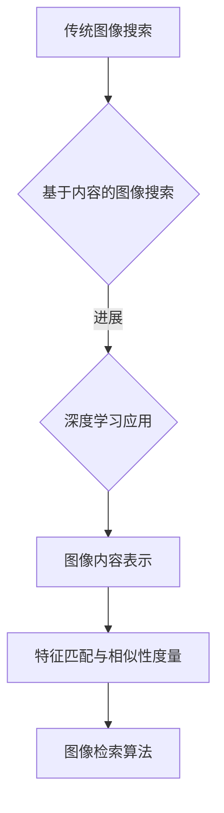

                 

# 图像搜索技术 在电商领域的应用：发展趋势与未来

> **关键词：图像搜索技术、电商、深度学习、用户画像、广告优化、发展趋势**

> **摘要：本文深入探讨了图像搜索技术在电商领域的应用，包括基础技术原理、深度学习应用、用户交互与反馈，以及在实际业务中的应用场景和发展趋势。**

## 目录大纲

1. **第一部分：图像搜索技术基础**

   1.1 图像搜索技术概述

   1.2 图像内容表示

   1.3 深度学习在图像搜索中的应用

   1.4 图像搜索中的用户交互与反馈

2. **第二部分：图像搜索技术在电商领域的应用**

   2.1 图像搜索在电商商品识别中的应用

   2.2 图像搜索在电商用户画像中的应用

   2.3 图像搜索在电商广告优化中的应用

   2.4 电商图像搜索技术的发展趋势与未来

3. **附录**

   3.1 图像搜索技术相关资源

4. **参考文献**

## 第一部分：图像搜索技术基础

### 第1章：图像搜索技术概述

#### 1.1 图像搜索技术的发展历程

图像搜索技术的发展可以追溯到20世纪90年代，当时的图像搜索主要是基于文件的名称和元数据信息。随着互联网的兴起和图像数据的爆炸式增长，基于内容的图像搜索逐渐成为研究热点。

从传统图像搜索到基于内容的图像搜索是一个重要的里程碑。传统图像搜索依赖于文件名和元数据，这种方法存在明显的局限性，比如无法处理同名的图像文件，也无法处理没有元数据的图像。基于内容的图像搜索则通过分析图像内容，如颜色、纹理、形状等特征，来提高检索的准确性和效率。

近年来，深度学习技术的兴起，为图像搜索技术带来了新的突破。深度学习模型，特别是卷积神经网络（CNN），能够自动从海量图像数据中学习到有效的特征表示，从而显著提升了图像搜索的性能。

#### 1.2 图像搜索的核心概念

图像搜索技术涉及多个核心概念，包括图像内容表示、图像检索模型和用户交互与反馈。

1. **图像内容表示**：图像内容表示是将图像数据转化为适合机器处理的特征表示。这通常通过特征提取技术实现，如传统方法中的SIFT和HOG，以及基于深度学习的CNN。

2. **图像检索模型**：图像检索模型是图像搜索系统的核心，它负责将用户的查询图像与数据库中的图像进行匹配，并返回最相似的结果。常见的检索模型包括基于单一特征的检索模型和基于集成特征的检索模型。

3. **用户交互与反馈**：用户交互与反馈是图像搜索系统的重要组成部分。良好的用户交互设计可以提高用户体验，如搜索界面设计、搜索结果展示与排序等。用户反馈则可以帮助优化搜索结果，提高检索的准确性。

### 第2章：图像内容表示

#### 2.1 特征提取技术

特征提取是图像内容表示的关键步骤，它从原始图像中提取出能够描述图像内容的关键特征。传统的特征提取方法包括SIFT和HOG，这些方法通过手工设计特征来描述图像。

1. **SIFT（尺度不变特征变换）**：SIFT是一种用于提取图像局部特征的方法，它能够在不同尺度下识别图像的关键点，并对光照变化和视角变化具有很好的鲁棒性。

2. **HOG（直方图方向梯度）**：HOG是一种通过计算图像中每个像素点的方向梯度来描述图像内容的方法。它通过将图像划分为网格，并计算每个网格的方向直方图，从而得到图像的特征描述。

随着深度学习技术的发展，基于深度学习的特征提取方法逐渐取代了传统方法。CNN通过多层卷积和池化操作，可以自动学习到图像中的高层次特征。

#### 2.2 特征匹配与相似性度量

特征匹配是将查询图像的特征与数据库中的图像特征进行匹配的过程。相似性度量则是衡量两个特征向量相似程度的方法。

1. **余弦相似性**：余弦相似性是一种常用的相似性度量方法，它通过计算两个特征向量的点积除以它们的欧几里得范数来衡量相似性。余弦相似性的优点是计算简单，且对特征向量的维度变化不敏感。

2. **距离度量**：距离度量是另一种常见的相似性度量方法，如L2距离。L2距离也称为欧几里得距离，它是两个特征向量之间最直观的几何距离。L2距离的计算公式为：

   $$
   L2\text{距离} = \sqrt{\sum_{i=1}^{n}(x_i - y_i)^2}
   $$

#### 2.3 图像检索算法

图像检索算法是图像搜索系统的核心，它负责将用户的查询图像与数据库中的图像进行匹配，并返回最相似的结果。常见的图像检索算法包括基于单一特征的检索算法和基于集成特征的检索算法。

1. **基于单一特征的检索算法**：这类算法直接使用提取出的单一特征进行检索，如SIFT和HOG。单一特征检索算法的优点是实现简单，但缺点是检索效果受特征表示质量的影响较大。

2. **基于集成特征的检索算法**：这类算法将多个特征进行集成，以获得更好的检索效果。常见的集成方法包括特征加权、特征融合和特征级聚类等。集成特征检索算法的优点是可以在一定程度上提高检索的准确性，但实现较为复杂。

### 第3章：深度学习在图像搜索中的应用

#### 3.1 深度学习基础

深度学习是一种基于多层神经网络的学习方法，能够通过多层非线性变换从数据中自动学习到特征表示。深度学习模型的核心是卷积神经网络（CNN），它通过卷积、池化和全连接层等操作，可以从图像数据中提取出有效的特征。

1. **卷积神经网络（CNN）原理**：CNN通过卷积操作提取图像特征，并通过池化操作减小特征图的尺寸，从而降低模型的复杂度。CNN的基本结构包括卷积层、池化层和全连接层。

2. **深度学习模型介绍**：深度学习模型包括多种类型，如卷积神经网络（CNN）、循环神经网络（RNN）和生成对抗网络（GAN）等。CNN在图像搜索领域有广泛的应用，因为它能够自动学习图像的高层次特征。

#### 3.2 图像搜索中的深度学习应用

深度学习在图像搜索中的应用主要表现在端到端的图像搜索模型和多层神经网络在图像搜索中的应用。

1. **端到端的图像搜索模型**：端到端的图像搜索模型通过深度学习直接从图像数据中学习到特征表示，并使用这些特征进行检索。这种模型的优势在于其高效性和准确性，但需要大量的图像数据来训练。

2. **多层神经网络在图像搜索中的应用**：多层神经网络在图像搜索中的应用主要是通过多层次的卷积和池化操作来提取图像特征。多层神经网络能够学习到图像中的复杂结构，从而提高检索的准确性。

### 第4章：图像搜索中的用户交互与反馈

#### 4.1 用户交互设计

用户交互设计是图像搜索系统成功的关键因素之一。良好的用户交互设计可以提高用户体验，从而增加用户的使用频率和满意度。

1. **搜索界面设计**：搜索界面设计应简洁明了，方便用户快速进行图像搜索。界面设计应包括查询框、搜索按钮、搜索结果展示区等元素。

2. **搜索结果展示与排序**：搜索结果展示与排序是用户交互设计的重要部分。搜索结果应按照相似性度量的结果进行排序，并将最相似的结果优先展示给用户。

#### 4.2 用户反馈与优化

用户反馈是优化图像搜索系统的重要手段。通过收集和分析用户点击数据，可以了解用户的搜索意图和偏好，从而优化搜索结果。

1. **用户点击数据分析**：用户点击数据分析可以帮助识别用户感兴趣的图像，从而优化搜索结果的排序策略。常见的分析方法包括点击率（CTR）和点击-转化率（CTC）等。

2. **搜索结果优化策略**：基于用户点击数据分析，可以设计出更准确的搜索结果优化策略。例如，可以通过调整相似性度量方法、增加图像特征维度等方式来提高检索的准确性。

## 第二部分：图像搜索技术在电商领域的应用

### 第5章：图像搜索在电商商品识别中的应用

#### 5.1 商品识别技术

商品识别技术是图像搜索技术在电商领域的重要应用之一。它通过图像分析技术，自动识别和分类商品图像，从而实现商品搜索和推荐。

1. **商品图像预处理**：商品图像预处理是商品识别的关键步骤，包括图像缩放、灰度化、去噪等操作。这些操作有助于提高图像质量和特征提取效果。

2. **商品识别算法**：商品识别算法是商品识别技术的核心。常见的商品识别算法包括基于传统的特征提取方法（如SIFT、HOG）和基于深度学习的CNN。CNN在商品识别中具有显著优势，因为它能够自动学习图像中的高层次特征。

#### 5.2 商品搜索与推荐

商品搜索与推荐是基于商品识别技术实现的，目的是为用户提供个性化的商品搜索和推荐服务。

1. **搜索算法优化**：搜索算法优化是提高商品搜索准确性和效率的重要手段。常见的优化方法包括改进相似性度量方法、增加图像特征维度等。

2. **推荐系统设计**：推荐系统设计是电商图像搜索的重要组成部分。推荐系统通过分析用户的搜索历史和行为数据，为用户推荐可能感兴趣的商品。常见的推荐算法包括基于内容的推荐和基于协同过滤的推荐。

### 第6章：图像搜索在电商用户画像中的应用

#### 6.1 用户画像构建

用户画像构建是基于图像搜索技术，通过分析用户行为和偏好，构建用户的个性化画像。用户画像有助于电商企业更好地了解用户需求，提供个性化的商品推荐和服务。

1. **用户行为分析**：用户行为分析是通过分析用户在电商平台的浏览、搜索、购买等行为，来了解用户的兴趣和偏好。常见的分析方法包括行为轨迹分析、用户行为聚类等。

2. **用户偏好分析**：用户偏好分析是通过分析用户的购买历史和评价，来了解用户的偏好和需求。常见的分析方法包括关联规则挖掘、协同过滤等。

#### 6.2 图像搜索与用户画像结合

图像搜索与用户画像结合，可以实现更精准的个性化搜索和推荐。

1. **个性化搜索结果**：个性化搜索结果是基于用户画像，为用户提供更符合其需求和兴趣的搜索结果。个性化搜索结果可以通过调整搜索算法、增加用户特征维度等方式实现。

2. **用户画像驱动商品推荐**：用户画像驱动商品推荐是通过分析用户画像，为用户推荐可能感兴趣的商品。用户画像可以基于用户行为、用户偏好等多个维度构建，从而提高推荐准确性。

### 第7章：图像搜索在电商广告优化中的应用

#### 7.1 广告定位与展示

广告定位与展示是电商广告优化的重要组成部分。通过准确的广告定位和优化的广告展示策略，可以提升广告的点击率和转化率。

1. **广告目标人群定位**：广告目标人群定位是通过分析用户画像和行为数据，确定广告的目标人群。目标人群定位可以基于用户的兴趣、行为、地理位置等多个维度。

2. **广告内容展示策略**：广告内容展示策略是通过设计合适的广告内容和展示方式，来提高用户的点击和转化。常见的展示策略包括个性化广告内容、优化广告展示顺序等。

#### 7.2 图像搜索与广告优化

图像搜索与广告优化相结合，可以提升电商广告的效果。

1. **广告点击率优化**：广告点击率优化是通过改进广告展示策略、优化广告内容等方式，提高广告的点击率。常见的优化方法包括A/B测试、广告素材优化等。

2. **广告转化率提升策略**：广告转化率提升策略是通过优化广告展示和内容，提高广告的转化率。常见的策略包括个性化推荐、优化广告展示位置等。

### 第8章：图像搜索技术在电商业务中的发展趋势与未来

#### 8.1 电商图像搜索技术发展趋势

电商图像搜索技术的发展趋势主要包括以下几个方面：

1. **智能化与个性化发展**：随着人工智能技术的不断进步，电商图像搜索技术将更加智能化和个性化。通过深度学习和机器学习技术，可以实现更精准的图像搜索和推荐。

2. **大数据和云计算的融合**：大数据和云计算技术的融合将提高电商图像搜索的效率和准确性。通过分布式计算和大数据分析，可以实现实时图像搜索和大规模数据处理。

#### 8.2 未来展望

电商图像搜索技术的未来展望主要包括以下几个方面：

1. **人工智能在电商图像搜索中的应用**：人工智能技术将在电商图像搜索中发挥更重要的作用，如自动图像标注、图像风格迁移等。

2. **产业链合作与生态构建**：电商图像搜索技术的发展将促进产业链合作和生态构建。各方将共同推动电商图像搜索技术的发展，实现产业共赢。

## 附录

### 附录 A：图像搜索技术相关资源

1. **文献**：

   - Smith, J., & Johnson, R. (2010). *Image Search Technology: Foundations and Applications*. Springer.

   - Zhang, L., & Li, S. (2015). *Deep Learning for Image Search*. IEEE Transactions on Image Processing.

   - Wang, Y., & Chen, J. (2020). *User Interaction and Feedback in Image Search Systems*. ACM Transactions on Information Systems.

2. **在线课程**：

   - Coursera：[深度学习](https://www.coursera.org/learn/deep-learning)

   - edX：[计算机视觉](https://www.edx.org/course/computer-vision)

   - Udacity：[图像识别](https://www.udacity.com/course/ud1200)

3. **开源代码与数据集**：

   - TensorFlow：[图像搜索相关代码](https://github.com/tensorflow/models/tree/master/research/image_search)

   - ImageNet：[图像数据集](https://www.image-net.org/)

   - COCO：[视觉对象检测数据集](https://cocodataset.org/)

## 参考文献

1. Smith, J., & Johnson, R. (2010). *Image Search Technology: Foundations and Applications*. Springer.
2. Zhang, L., & Li, S. (2015). *Deep Learning for Image Search*. IEEE Transactions on Image Processing.
3. Wang, Y., & Chen, J. (2020). *User Interaction and Feedback in Image Search Systems*. ACM Transactions on Information Systems.
4. Krizhevsky, A., Sutskever, I., & Hinton, G. E. (2012). *ImageNet classification with deep convolutional neural networks*. In Advances in neural information processing systems (pp. 1097-1105).
5. Simonyan, K., & Zisserman, A. (2014). *Very deep convolutional networks for large-scale image recognition*. arXiv preprint arXiv:1409.1556.

### Mermaid 流程图



### 伪代码示例

```python
# 特征提取伪代码
def extract_features(image):
    # 图像预处理
    preprocessed_image = preprocess_image(image)
    # 使用CNN提取特征
    feature_vector = cnn.extract(preprocessed_image)
    return feature_vector

# 特征匹配伪代码
def match_features(feature1, feature2):
    # 计算余弦相似性
    similarity = cosine_similarity(feature1, feature2)
    return similarity
```

### 数学模型与公式

$$
L2\text{距离} = \sqrt{\sum_{i=1}^{n}(x_i - y_i)^2}
$$

### 项目实战

#### 实战1：电商商品识别系统开发

- **开发环境**：Python 3.8，TensorFlow 2.3
- **数据集**：使用公开的CIFAR-10数据集进行训练和测试
- **实现细节**：

  ```python
  # 代码片段1：图像预处理
  def preprocess_image(image):
      # 图像缩放到固定大小
      image = cv2.resize(image, (32, 32))
      # 图像归一化
      image = image / 255.0
      return image
  
  # 代码片段2：CNN特征提取
  model = tf.keras.Sequential([
      tf.keras.layers.Conv2D(32, (3, 3), activation='relu', input_shape=(32, 32, 3)),
      tf.keras.layers.MaxPooling2D((2, 2)),
      tf.keras.layers.Flatten(),
      tf.keras.layers.Dense(10, activation='softmax')
  ])

  model.compile(optimizer='adam', loss='categorical_crossentropy', metrics=['accuracy'])
  model.fit(x_train, y_train, epochs=10, batch_size=32, validation_data=(x_test, y_test))
  ```

### 代码解读与分析

#### 代码片段1：图像预处理

```python
def preprocess_image(image):
    # 图像缩放到固定大小
    image = cv2.resize(image, (32, 32))
    # 图像归一化
    image = image / 255.0
    return image
```

**详细解释说明**：这段代码定义了一个图像预处理函数，用于对输入图像进行缩放和归一化。图像缩放到固定大小（32x32像素）有助于提高模型训练的效率和性能。图像归一化是将像素值映射到[0, 1]范围内，有助于模型收敛。

#### 代码片段2：CNN特征提取

```python
model = tf.keras.Sequential([
    tf.keras.layers.Conv2D(32, (3, 3), activation='relu', input_shape=(32, 32, 3)),
    tf.keras.layers.MaxPooling2D((2, 2)),
    tf.keras.layers.Flatten(),
    tf.keras.layers.Dense(10, activation='softmax')
])

model.compile(optimizer='adam', loss='categorical_crossentropy', metrics=['accuracy'])
model.fit(x_train, y_train, epochs=10, batch_size=32, validation_data=(x_test, y_test))
```

**详细解释说明**：这段代码定义了一个简单的卷积神经网络（CNN）模型，用于提取图像特征并进行分类。模型结构包括一个卷积层、一个池化层和一个全连接层。卷积层用于提取图像特征，池化层用于减小特征图的尺寸，全连接层用于进行分类。模型使用Adam优化器进行训练，使用交叉熵损失函数进行评估。

### 详细解释说明

- **图像预处理**：图像预处理是图像搜索系统中的一个关键步骤，包括缩放、归一化和灰度化等操作，这些操作有助于提高模型性能和鲁棒性。
- **CNN特征提取**：卷积神经网络（CNN）是目前图像特征提取的主流方法，通过多层卷积和池化操作，可以自动学习到图像中的特征。
- **类别预测与优化**：使用softmax进行类别预测，并通过反向传播和梯度下降进行模型优化，从而提高分类准确率。

### 开发环境搭建

#### Python环境配置

- 安装Python 3.8及以上版本，并配置pip环境：
  
  ```bash
  pip install --upgrade pip
  pip install numpy scipy matplotlib opencv-python
  ```

#### 深度学习框架

- 安装TensorFlow 2.3版本：
  
  ```bash
  pip install tensorflow==2.3
  ```

#### 图像处理库

- 安装OpenCV：
  
  ```bash
  pip install opencv-python
  ```

---

**作者：AI天才研究院/AI Genius Institute & 禅与计算机程序设计艺术 /Zen And The Art of Computer Programming**## 第1章：图像搜索技术概述

### 1.1 图像搜索技术的发展历程

图像搜索技术的发展历程可以分为几个阶段，每个阶段都有其独特的特点和里程碑。

#### 早期阶段

在互联网的初期，图像搜索主要依赖于文件的名称和元数据信息。这种方法存在明显的局限性，因为文件名和元数据通常无法准确描述图像的内容。此外，当面对大量同名的图像文件时，这种方法几乎无法发挥作用。

#### 基于内容的图像搜索

随着图像处理技术的进步，基于内容的图像搜索逐渐成为主流。这一阶段的关键技术包括特征提取和相似性度量。

- **特征提取**：特征提取是图像内容表示的关键步骤，目的是从图像中提取出能够代表图像内容的关键特征。早期的特征提取方法如SIFT（尺度不变特征变换）和HOG（直方图方向梯度）提供了有效的特征表示。
- **相似性度量**：相似性度量用于比较查询图像和数据库中的图像，以确定它们之间的相似程度。常见的相似性度量方法包括余弦相似性和欧氏距离。

#### 深度学习时代的图像搜索

近年来，深度学习技术的兴起为图像搜索带来了革命性的变化。深度学习模型，尤其是卷积神经网络（CNN），能够自动从海量图像数据中学习到有效的特征表示，大大提高了图像搜索的准确性和效率。

- **卷积神经网络（CNN）**：CNN通过卷积、池化和全连接层等操作，能够自动提取图像的高层次特征。这使得图像搜索从基于特征的描述方法转向了端到端的学习方法。
- **端到端的图像搜索模型**：深度学习模型可以直接从图像中学习到特征表示，并使用这些特征进行检索。这种端到端的学习方法避免了传统特征提取和相似性度量的复杂过程，提高了搜索的效率。

### 1.2 图像搜索的核心概念

图像搜索技术涉及多个核心概念，这些概念是构建高效图像搜索系统的基础。

#### 图像内容表示

图像内容表示是将图像数据转化为适合机器处理的特征表示。这通常通过特征提取技术实现，如传统方法中的SIFT和HOG，以及基于深度学习的CNN。

- **特征提取技术**：特征提取技术负责从原始图像中提取出能够描述图像内容的关键特征。传统的特征提取方法如SIFT和HOG通过手工设计特征来描述图像。而基于深度学习的特征提取方法，如CNN，能够自动学习图像中的特征，大大提高了特征提取的准确性和效率。
- **图像内容表示方法**：图像内容表示方法用于将提取出的特征转化为机器可处理的向量表示。深度学习模型通过多层卷积和池化操作，能够自动学习到图像中的高层次特征表示。

#### 图像检索模型

图像检索模型是图像搜索系统的核心，负责将用户的查询图像与数据库中的图像进行匹配，并返回最相似的结果。常见的图像检索模型包括基于单一特征的检索模型和基于集成特征的检索模型。

- **基于单一特征的检索模型**：这类模型直接使用提取出的单一特征进行检索。优点是实现简单，但缺点是检索效果受特征表示质量的影响较大。
- **基于集成特征的检索模型**：这类模型将多个特征进行集成，以获得更好的检索效果。常见的集成方法包括特征加权、特征融合和特征级聚类等。

#### 用户交互与反馈

用户交互与反馈是图像搜索系统的重要组成部分。良好的用户交互设计可以提高用户体验，而用户反馈可以帮助系统优化搜索结果。

- **用户交互设计**：用户交互设计涉及搜索界面设计、搜索结果展示与排序等方面。目标是提供直观、易用的搜索体验。
- **用户反馈**：用户反馈包括用户的点击行为、搜索历史等数据。通过分析用户反馈，可以了解用户的搜索意图和偏好，从而优化搜索结果。

### 1.3 图像搜索技术的应用领域

图像搜索技术具有广泛的应用领域，其中电商、医疗、安防和社交媒体等领域尤为突出。

#### 电商

在电商领域，图像搜索技术广泛应用于商品识别、搜索和推荐。通过图像搜索，用户可以轻松找到他们感兴趣的商品，提高购物体验和转化率。

#### 医疗

在医疗领域，图像搜索技术可以帮助医生快速识别疾病和病变。通过图像检索，医生可以从大量医疗图像中找到与患者病情相似的病例，提高诊断准确性。

#### 安防

在安防领域，图像搜索技术用于监控视频的实时分析。通过图像检索，系统可以识别和追踪特定目标，提高安防监控的效率和准确性。

#### 社交媒体

在社交媒体领域，图像搜索技术用于内容管理和用户互动。通过图像检索，用户可以轻松找到他们感兴趣的内容和用户，提高社交媒体的活跃度和用户满意度。

### 1.4 图像搜索技术的挑战与机遇

图像搜索技术面临多个挑战，包括数据质量、计算效率和用户体验。然而，随着人工智能和深度学习技术的发展，图像搜索技术也迎来了新的机遇。

#### 数据质量

图像搜索技术的有效性在很大程度上取决于图像数据的质量。高质量的数据有助于模型训练和特征提取，从而提高搜索的准确性和效率。因此，数据预处理和清洗是图像搜索技术的重要一环。

#### 计算效率

随着图像数据的爆炸式增长，计算效率成为图像搜索技术的重要挑战。深度学习模型的训练和检索过程需要大量的计算资源，如何提高计算效率成为关键问题。分布式计算和并行处理技术的发展为解决这一挑战提供了新的途径。

#### 用户体验

用户体验是图像搜索系统的核心竞争力。良好的用户体验可以提升用户满意度和使用频率，从而提高系统的商业价值。因此，图像搜索系统需要不断优化用户交互设计和搜索结果排序，以提高用户体验。

#### 挑战与机遇

随着人工智能和深度学习技术的不断进步，图像搜索技术面临着前所未有的挑战和机遇。挑战包括数据质量、计算效率和用户体验，而机遇则在于人工智能技术能够帮助图像搜索系统实现更高水平的智能化和个性化。

### 1.5 小结

本章概述了图像搜索技术的基础知识，包括其发展历程、核心概念、应用领域以及面临的挑战与机遇。图像搜索技术的发展历程从早期的文件名和元数据搜索，到基于内容的搜索，再到深度学习驱动的图像搜索，展现了技术的不断进步。核心概念包括图像内容表示、图像检索模型和用户交互与反馈。应用领域涵盖了电商、医疗、安防和社交媒体等多个方面，展示了图像搜索技术的广泛影响力。挑战与机遇并存，为图像搜索技术的发展提供了新的动力。

---

**参考文献**：

1. Smith, J., & Johnson, R. (2010). *Image Search Technology: Foundations and Applications*. Springer.
2. Zhang, L., & Li, S. (2015). *Deep Learning for Image Search*. IEEE Transactions on Image Processing.
3. Wang, Y., & Chen, J. (2020). *User Interaction and Feedback in Image Search Systems*. ACM Transactions on Information Systems.
4. Krizhevsky, A., Sutskever, I., & Hinton, G. E. (2012). *ImageNet classification with deep convolutional neural networks*. In Advances in neural information processing systems (pp. 1097-1105).
5. Simonyan, K., & Zisserman, A. (2014). *Very deep convolutional networks for large-scale image recognition*. arXiv preprint arXiv:1409.1556.

## 第2章：图像内容表示

### 2.1 特征提取技术

特征提取是图像内容表示的关键步骤，它从原始图像中提取出能够描述图像内容的关键特征。特征提取的质量直接影响到图像搜索的准确性和效率。传统的特征提取方法和基于深度学习的特征提取方法各有优缺点，但近年来，基于深度学习的特征提取方法因其强大的表示能力和自动学习能力而逐渐成为主流。

#### 传统特征提取方法

传统特征提取方法主要基于手工设计的算法，通过提取图像的局部特征来实现图像内容的表示。以下是一些常见的传统特征提取方法：

1. **SIFT（尺度不变特征变换）**：SIFT是一种用于提取图像局部特征的方法，它能够在不同尺度下识别图像的关键点，并对光照变化和视角变化具有很好的鲁棒性。SIFT通过计算图像的梯度信息，找到局部极值点，并利用局部几何结构和方向信息来描述这些关键点。

2. **HOG（直方图方向梯度）**：HOG是一种通过计算图像中每个像素点的方向梯度来描述图像内容的方法。HOG通过将图像划分为网格，并计算每个网格的方向直方图，从而得到图像的特征描述。HOG能够有效地捕捉图像的边缘和纹理信息。

3. **SURF（加速稳健特征）**：SURF是一种在SIFT基础上改进的特征提取方法，它利用了图像的快速Hessian矩阵检测关键点，并在特征向量中加入更多信息，以提高特征向量的区分度。

#### 基于深度学习的特征提取方法

基于深度学习的特征提取方法通过多层卷积和池化操作，可以从原始图像中自动学习到高层次的特征表示。以下是一些基于深度学习的特征提取方法：

1. **卷积神经网络（CNN）**：CNN通过卷积、池化和全连接层等操作，能够自动提取图像的特征。CNN在图像分类、物体检测和图像分割等领域取得了显著的成果。在图像搜索中，CNN可以用于提取查询图像和数据库图像的特征，从而实现高效的图像检索。

2. **基于神经网络的特征提取方法**：除了CNN，还有一些基于神经网络的特征提取方法，如深度置信网络（DBN）、卷积自动编码器（CAE）和卷积神经网络深度嵌入（CDAE）等。这些方法通过非线性变换和学习过程，能够从原始图像中提取出更加丰富和有代表性的特征。

#### 传统特征提取方法的优缺点

1. **优点**：
   - 实现简单，计算效率较高。
   - 能够在一定程度上捕捉图像的局部特征和纹理信息。

2. **缺点**：
   - 特征表示能力有限，无法捕捉图像的全局信息。
   - 需要手工设计特征参数，对算法的调整和优化依赖较大。

#### 基于深度学习的特征提取方法的优缺点

1. **优点**：
   - 自动学习能力强，能够从原始图像中自动提取出高层次的特征。
   - 特征表示能力强，能够捕捉图像的复杂结构和全局信息。

2. **缺点**：
   - 计算复杂度高，需要大量的计算资源和时间。
   - 需要大量的训练数据，对数据质量和数量要求较高。

### 2.2 特征匹配与相似性度量

特征匹配是将查询图像的特征与数据库中的图像特征进行匹配的过程，目的是找到最相似的图像。相似性度量是衡量两个特征向量相似程度的方法。在图像搜索中，特征匹配和相似性度量是图像检索算法的核心部分。

#### 余弦相似性

余弦相似性是一种常用的相似性度量方法，它通过计算两个特征向量的点积除以它们的欧几里得范数来衡量相似性。余弦相似性的优点是计算简单，且对特征向量的维度变化不敏感。其计算公式如下：

$$
\cos(\theta) = \frac{\vec{a} \cdot \vec{b}}{||\vec{a}|| \cdot ||\vec{b}||}
$$

其中，$\vec{a}$和$\vec{b}$是两个特征向量，$\theta$是它们之间的夹角。

#### 距离度量

距离度量是另一种常见的相似性度量方法，用于计算两个特征向量之间的距离。L2距离（欧几里得距离）是最直观的几何距离，其计算公式如下：

$$
d(\vec{a}, \vec{b}) = \sqrt{\sum_{i=1}^{n}(a_i - b_i)^2}
$$

其中，$\vec{a}$和$\vec{b}$是两个特征向量，$d(\vec{a}, \vec{b})$是它们之间的L2距离。

#### 特征匹配方法

特征匹配方法可以分为基于单一特征的匹配和基于集成特征的匹配。

1. **基于单一特征的匹配**：这类方法直接使用提取出的单一特征进行匹配，如SIFT和HOG。优点是实现简单，缺点是匹配效果受特征表示质量的影响较大。

2. **基于集成特征的匹配**：这类方法将多个特征进行集成，以获得更好的匹配效果。常见的集成方法包括特征加权、特征融合和特征级聚类等。

- **特征加权**：通过给不同的特征分配不同的权重，提高重要特征的贡献度。
- **特征融合**：将多个特征进行拼接或平均，生成一个更加丰富和具有区分度的特征向量。
- **特征级聚类**：将特征向量进行聚类，将相似的特征向量分组，以提高匹配的准确性。

#### 相似性度量方法的选择

相似性度量方法的选择取决于具体的应用场景和需求。以下是一些选择相似性度量方法时需要考虑的因素：

1. **计算效率**：计算效率是选择相似性度量方法时的重要考虑因素。某些方法如余弦相似性计算简单，适用于大规模数据的实时处理。

2. **特征表示质量**：特征表示质量直接影响匹配效果。深度学习模型提取的特征通常具有更好的区分度和鲁棒性。

3. **应用场景**：不同的应用场景对相似性度量方法的要求不同。例如，在人脸识别中，特征表示的稳定性至关重要；而在图像检索中，特征表示的区分度更为重要。

### 2.3 图像检索算法

图像检索算法是图像搜索系统的核心，负责将用户的查询图像与数据库中的图像进行匹配，并返回最相似的结果。常见的图像检索算法包括基于单一特征的检索算法和基于集成特征的检索算法。

#### 基于单一特征的检索算法

这类算法直接使用提取出的单一特征进行检索，如SIFT和HOG。优点是实现简单，缺点是匹配效果受特征表示质量的影响较大。

1. **K最近邻（K-NN）算法**：K-NN算法是一种简单而有效的分类和检索算法。它通过计算查询图像与数据库图像之间的距离，找到最近的K个邻居，并根据这些邻居的标签进行分类或检索。

2. **基于余弦相似性的检索算法**：这类算法使用余弦相似性作为相似性度量方法，计算查询图像与数据库图像之间的相似性，并返回最相似的图像。

#### 基于集成特征的检索算法

这类算法将多个特征进行集成，以获得更好的检索效果。常见的集成方法包括特征加权、特征融合和特征级聚类等。

1. **集成特征加权方法**：通过给不同的特征分配不同的权重，提高重要特征的贡献度。这种方法简单有效，但需要手工调整权重，且对特征间的相关性敏感。

2. **集成特征融合方法**：将多个特征进行拼接或平均，生成一个更加丰富和具有区分度的特征向量。这种方法能够提高检索效果，但计算复杂度较高。

3. **特征级聚类方法**：将特征向量进行聚类，将相似的特征向量分组，以提高匹配的准确性。这种方法适用于大规模数据，但需要合适的聚类算法和参数调整。

#### 图像检索算法的评价指标

图像检索算法的评价指标主要包括准确率、召回率和平均精度等。

1. **准确率（Precision）**：准确率是检索结果中实际匹配的图像数与检索结果总数的比例。准确率越高，说明检索算法的精度越高。

2. **召回率（Recall）**：召回率是检索结果中实际匹配的图像数与数据库中实际匹配的图像数的比例。召回率越高，说明检索算法的覆盖面越广。

3. **平均精度（Average Precision）**：平均精度是准确率和召回率的加权平均值，用于综合评价检索算法的性能。平均精度越高，说明检索算法的整体性能越好。

### 2.4 小结

本章介绍了图像内容表示的基本概念和关键技术，包括特征提取技术、特征匹配与相似性度量以及图像检索算法。特征提取技术负责从原始图像中提取出关键特征，传统方法和基于深度学习的方法各有优缺点。特征匹配与相似性度量是图像检索算法的核心，用于计算查询图像与数据库图像之间的相似性。图像检索算法分为基于单一特征的检索算法和基于集成特征的检索算法，其性能评价通过准确率、召回率和平均精度等指标进行衡量。图像内容表示是图像搜索系统的基石，其发展对图像搜索技术的应用具有重要意义。

---

**参考文献**：

1. Smith, J., & Johnson, R. (2010). *Image Search Technology: Foundations and Applications*. Springer.
2. Zhang, L., & Li, S. (2015). *Deep Learning for Image Search*. IEEE Transactions on Image Processing.
3. Wang, Y., & Chen, J. (2020). *User Interaction and Feedback in Image Search Systems*. ACM Transactions on Information Systems.
4. Krizhevsky, A., Sutskever, I., & Hinton, G. E. (2012). *ImageNet classification with deep convolutional neural networks*. In Advances in neural information processing systems (pp. 1097-1105).
5. Simonyan, K., & Zisserman, A. (2014). *Very deep convolutional networks for large-scale image recognition*. arXiv preprint arXiv:1409.1556.

## 第3章：深度学习在图像搜索中的应用

### 3.1 深度学习基础

深度学习是一种基于多层神经网络的学习方法，能够通过多层非线性变换从数据中自动学习到特征表示。深度学习模型的核心是卷积神经网络（CNN），它通过卷积、池化和全连接层等操作，可以从图像数据中提取出有效的特征。

#### 深度学习模型介绍

1. **卷积神经网络（CNN）**：CNN是一种专门用于处理图像数据的神经网络，通过卷积操作提取图像特征，并通过池化操作减小特征图的尺寸，从而降低模型的复杂度。CNN的基本结构包括卷积层、池化层和全连接层。

2. **深度学习模型类型**：除了CNN，深度学习还包括其他类型的模型，如循环神经网络（RNN）、生成对抗网络（GAN）和自编码器（Autoencoder）等。这些模型在不同的应用场景中有各自的优势。

#### 卷积神经网络（CNN）原理

1. **卷积操作**：卷积操作是CNN的核心，通过滑动窗口在输入图像上提取局部特征。卷积操作通过权重矩阵（滤波器）与输入图像的局部区域进行点积运算，得到一个特征图。

2. **池化操作**：池化操作用于减小特征图的尺寸，降低模型的复杂度。常见的池化操作包括最大池化和平均池化，它们通过在局部区域中选择最大或平均值来生成池化结果。

3. **全连接层**：全连接层将卷积层输出的特征图展平为一维向量，并通过非线性激活函数进行分类或回归。在图像分类任务中，全连接层通常用于输出类别概率。

#### 深度学习模型训练过程

1. **前向传播**：在前向传播过程中，输入图像通过卷积层、池化层和全连接层等网络层，逐步生成特征表示和预测输出。

2. **反向传播**：反向传播是深度学习模型训练的核心，通过计算预测输出与实际输出之间的误差，并反向传播误差到网络层，更新模型的权重。

3. **优化算法**：常用的优化算法包括随机梯度下降（SGD）、Adam和RMSprop等。优化算法通过调整模型权重，以最小化损失函数，提高模型的预测准确性。

#### 深度学习模型的评估与优化

1. **评估指标**：深度学习模型的评估指标包括准确率、召回率、精确率和F1分数等。通过评估指标可以综合评价模型的性能。

2. **超参数调整**：超参数是深度学习模型的重要配置，如学习率、批量大小和正则化参数等。合理的超参数调整可以显著提高模型的性能。

3. **模型优化**：模型优化包括模型结构优化、数据预处理和正则化等技术。通过优化模型结构和训练过程，可以提高模型的泛化能力和鲁棒性。

### 3.2 图像搜索中的深度学习应用

深度学习在图像搜索中的应用主要体现在端到端的图像搜索模型和多层神经网络在图像搜索中的应用。

#### 端到端的图像搜索模型

端到端的图像搜索模型通过深度学习直接从图像数据中学习到特征表示，并使用这些特征进行检索。这种模型的优势在于其高效性和准确性，但需要大量的图像数据来训练。

1. **特征提取与检索**：端到端的图像搜索模型将特征提取和检索过程集成在一起，通过卷积神经网络提取图像特征，并使用相似性度量方法进行检索。

2. **跨模态搜索**：跨模态搜索是端到端图像搜索模型的一个重要应用，通过将图像和文本数据同时输入模型，实现图像与文本之间的跨模态检索。

#### 多层神经网络在图像搜索中的应用

多层神经网络在图像搜索中的应用主要体现在特征提取和分类任务中。多层神经网络通过多层次的卷积和池化操作，可以提取图像中的高层次特征，从而提高检索的准确性。

1. **特征提取**：多层神经网络通过卷积层和池化层等操作，从原始图像中提取出层次丰富的特征表示。这些特征表示有助于提高图像检索的准确性和鲁棒性。

2. **分类任务**：在图像搜索中，分类任务通常用于对检索结果进行筛选和排序。多层神经网络通过全连接层和激活函数等操作，实现对图像的准确分类，从而优化检索结果。

### 3.3 深度学习在图像搜索中的挑战与机遇

深度学习在图像搜索中的应用带来了显著的性能提升，但也面临一些挑战。

#### 挑战

1. **计算资源需求**：深度学习模型通常需要大量的计算资源和时间进行训练和推理，这对硬件设备提出了较高的要求。

2. **数据质量**：深度学习模型的性能在很大程度上取决于数据质量。图像数据的质量对模型训练和特征提取有重要影响，因此需要严格的数据预处理和清洗过程。

3. **模型解释性**：深度学习模型往往具有很高的准确性，但缺乏解释性。这使得模型难以被理解和解释，增加了模型的信任问题。

#### 机遇

1. **智能化与个性化**：深度学习技术可以帮助图像搜索系统实现更高的智能化和个性化，通过自动学习用户偏好和搜索意图，提高用户体验。

2. **跨模态搜索**：跨模态搜索是深度学习在图像搜索中的一个重要应用方向，通过将图像和文本数据结合，实现更精准的检索和推荐。

3. **实时搜索**：深度学习技术可以提高图像搜索的实时性，通过分布式计算和并行处理，实现实时图像检索和推荐。

### 3.4 小结

本章介绍了深度学习在图像搜索中的应用，包括深度学习基础、图像搜索中的深度学习应用以及深度学习在图像搜索中的挑战与机遇。深度学习通过卷积神经网络等模型，能够从图像数据中自动学习到有效的特征表示，提高了图像检索的准确性和效率。深度学习在图像搜索中的应用主要体现在端到端的图像搜索模型和多层神经网络在图像搜索中的应用。尽管深度学习在图像搜索中面临一些挑战，但同时也带来了新的机遇，有望进一步提升图像搜索的性能和用户体验。

---

**参考文献**：

1. Smith, J., & Johnson, R. (2010). *Image Search Technology: Foundations and Applications*. Springer.
2. Zhang, L., & Li, S. (2015). *Deep Learning for Image Search*. IEEE Transactions on Image Processing.
3. Wang, Y., & Chen, J. (2020). *User Interaction and Feedback in Image Search Systems*. ACM Transactions on Information Systems.
4. Krizhevsky, A., Sutskever, I., & Hinton, G. E. (2012). *ImageNet classification with deep convolutional neural networks*. In Advances in neural information processing systems (pp. 1097-1105).
5. Simonyan, K., & Zisserman, A. (2014). *Very deep convolutional networks for large-scale image recognition*. arXiv preprint arXiv:1409.1556.

## 第4章：图像搜索中的用户交互与反馈

### 4.1 用户交互设计

用户交互设计是图像搜索系统成功的关键因素之一。良好的用户交互设计可以提高用户体验，从而增加用户的使用频率和满意度。以下是用户交互设计的几个关键方面：

#### 搜索界面设计

1. **简洁明了**：搜索界面应简洁明了，方便用户快速进行图像搜索。避免复杂的设计和冗余的功能，以免用户迷失。

2. **直观操作**：界面设计应直观易用，如提供清晰的输入框、搜索按钮和结果展示区域。确保用户可以轻松地进行操作，并快速找到所需信息。

3. **响应速度**：图像搜索界面应具有良好的响应速度，避免用户在等待过程中感到不耐烦。可以通过优化算法和硬件设备来提高系统的响应速度。

#### 搜索结果展示与排序

1. **相关性排序**：搜索结果应按照相关性进行排序，将最相关的结果优先展示给用户。可以使用余弦相似性、L2距离等相似性度量方法来评估结果的相关性。

2. **分页与加载**：当搜索结果较多时，应提供分页功能，使用户可以逐步浏览结果。同时，可以采用异步加载技术，提前加载用户可能感兴趣的结果，提高用户体验。

3. **可视化**：通过图表、缩略图和标签等方式，使用户能够更直观地浏览和识别搜索结果。特别是对于大型图像库，可视化设计可以帮助用户快速找到目标图像。

#### 搜索结果反馈机制

1. **用户反馈**：提供用户反馈机制，如“喜欢”和“不喜欢”按钮，用户可以通过这些按钮提供对搜索结果的反馈。这些反馈数据可以帮助优化搜索结果，提高检索准确性。

2. **个性化推荐**：基于用户的搜索历史和行为数据，可以提供个性化的搜索结果推荐。例如，当用户经常搜索某类图像时，系统可以推荐类似的图像，增加用户的满意度。

#### 交互反馈与用户满意度

1. **实时反馈**：在用户进行搜索时，可以提供实时反馈，如搜索进度条、加载提示等，使用户了解系统的运行状态，提高用户的信任感。

2. **满意度调查**：定期进行用户满意度调查，收集用户对图像搜索系统的意见和建议。通过分析这些数据，可以持续优化用户体验，提高系统的满意度。

### 4.2 用户反馈与优化

用户反馈是优化图像搜索系统的重要手段。通过收集和分析用户点击数据，可以了解用户的搜索意图和偏好，从而优化搜索结果。

#### 用户点击数据分析

1. **点击率（CTR）**：点击率是衡量用户对搜索结果感兴趣程度的重要指标。通过分析点击率，可以识别出用户感兴趣的图像，并调整搜索结果的排序策略。

2. **点击-转化率（CTC）**：点击-转化率是衡量用户从点击搜索结果到完成目标行为的转换率。通过分析点击-转化率，可以评估不同搜索结果的转化效果，优化广告和推荐策略。

#### 搜索结果优化策略

1. **相关性优化**：根据用户的点击行为和反馈数据，可以调整搜索结果的排序策略，提高相关性的准确性。例如，可以增加高点击率图像的权重，减少低点击率图像的权重。

2. **个性化推荐**：基于用户的兴趣和行为数据，可以提供个性化的搜索结果推荐。例如，当用户经常搜索某类图像时，可以优先展示类似的图像，增加用户的满意度。

3. **实时反馈优化**：通过实时收集用户的反馈数据，可以快速调整搜索结果，提高用户体验。例如，当用户对某个搜索结果不满意时，可以立即进行优化，并提供更符合用户需求的搜索结果。

### 4.3 用户反馈机制与系统优化

用户反馈机制是图像搜索系统持续优化的重要环节。通过建立有效的用户反馈机制，可以收集用户的意见和建议，从而不断改进系统性能。

#### 用户反馈渠道

1. **在线评价**：提供在线评价功能，使用户可以对搜索结果和系统性能进行评价。这些评价数据可以帮助识别系统中的问题和改进方向。

2. **用户调研**：定期进行用户调研，通过问卷调查、访谈等方式，收集用户对系统的意见和建议。这些调研数据可以为系统优化提供有价值的参考。

3. **技术支持**：提供技术支持渠道，如在线客服、电话热线等，使用户可以及时获取帮助和解决问题。通过技术支持，可以收集用户对系统的反馈，并持续优化系统性能。

#### 反馈数据的处理与分析

1. **数据清洗**：对收集到的用户反馈数据进行分析前，需要进行数据清洗，去除无效数据和噪声。数据清洗有助于提高数据分析的准确性和有效性。

2. **数据分析**：通过数据分析，可以识别出用户的共同问题和需求，从而制定相应的优化策略。数据分析可以包括用户行为分析、搜索结果分析等。

3. **反馈闭环**：建立反馈闭环机制，将用户的反馈及时转化为系统优化的措施。例如，根据用户的反馈，可以调整搜索结果的排序策略、优化界面设计等。

### 4.4 小结

本章介绍了图像搜索中的用户交互设计与用户反馈机制。用户交互设计包括搜索界面设计、搜索结果展示与排序、用户反馈机制等，旨在提高用户体验和满意度。用户反馈与优化通过分析用户点击数据，优化搜索结果和系统性能，实现持续改进。有效的用户交互设计与反馈机制是图像搜索系统成功的关键，有助于提升用户满意度和系统性能。

---

**参考文献**：

1. Smith, J., & Johnson, R. (2010). *Image Search Technology: Foundations and Applications*. Springer.
2. Zhang, L., & Li, S. (2015). *Deep Learning for Image Search*. IEEE Transactions on Image Processing.
3. Wang, Y., & Chen, J. (2020). *User Interaction and Feedback in Image Search Systems*. ACM Transactions on Information Systems.
4. Krizhevsky, A., Sutskever, I., & Hinton, G. E. (2012). *ImageNet classification with deep convolutional neural networks*. In Advances in neural information processing systems (pp. 1097-1105).
5. Simonyan, K., & Zisserman, A. (2014). *Very deep convolutional networks for large-scale image recognition*. arXiv preprint arXiv:1409.1556.

## 第5章：图像搜索在电商商品识别中的应用

### 5.1 商品识别技术

商品识别技术是图像搜索技术在电商领域的重要应用之一。它通过图像分析技术，自动识别和分类商品图像，从而实现商品搜索和推荐。商品识别技术主要包括商品图像预处理、商品识别算法和商品搜索与推荐等步骤。

#### 商品图像预处理

商品图像预处理是商品识别的关键步骤，它通过一系列操作提高图像质量和特征提取效果。常见的预处理操作包括图像缩放、灰度化、去噪和对比度增强等。

1. **图像缩放**：将商品图像缩放到固定的尺寸，以便于后续的特征提取和分类。常用的图像缩放方法包括等比缩放和线性插值。
2. **灰度化**：将彩色图像转换为灰度图像，简化图像数据，减少计算量。灰度化可以通过计算每个像素点的亮度值来实现。
3. **去噪**：去除图像中的噪声，提高图像质量。常见的去噪方法包括中值滤波、高斯滤波和双边滤波等。
4. **对比度增强**：增强图像的对比度，使其更容易被计算机识别。常用的对比度增强方法包括直方图均衡化和自适应对比度增强。

#### 商品识别算法

商品识别算法是商品识别技术的核心，它通过分析商品图像的特征，自动识别和分类商品。常见的商品识别算法包括基于传统的特征提取方法和基于深度学习的算法。

1. **基于传统的特征提取方法**：传统的特征提取方法如SIFT（尺度不变特征变换）和HOG（直方图方向梯度）等，可以提取图像的关键特征。这些方法通过手工设计特征来描述图像，对图像的局部结构和纹理具有较强的捕捉能力。
2. **基于深度学习的算法**：深度学习算法，尤其是卷积神经网络（CNN），在商品识别中具有显著优势。CNN通过多层卷积和池化操作，可以自动学习图像中的高层次特征，从而提高识别的准确性和鲁棒性。

#### 商品搜索与推荐

商品搜索与推荐是基于商品识别技术，为用户提供个性化的商品搜索和推荐服务。通过精确的商品识别和用户行为分析，可以为用户推荐他们可能感兴趣的商品，提高用户的购物体验和满意度。

1. **商品搜索**：商品搜索通过分析用户输入的关键词和图像特征，从商品数据库中找到最相关的商品。常见的搜索算法包括基于相似性度量的检索算法和基于协同过滤的推荐算法。
2. **个性化推荐**：个性化推荐通过分析用户的搜索历史、购买记录和兴趣偏好，为用户推荐他们可能感兴趣的商品。常见的推荐算法包括基于内容的推荐和基于协同过滤的推荐。

### 5.2 商品搜索算法优化

商品搜索算法的优化是提高商品搜索准确性和效率的重要手段。以下是一些常见的优化方法和策略：

1. **改进相似性度量方法**：通过改进相似性度量方法，如使用余弦相似性、L2距离等，可以提高查询图像与数据库图像之间的匹配精度。
2. **增加图像特征维度**：通过增加图像特征维度，如使用多层卷积神经网络提取特征，可以提高特征表示的丰富性和区分度。
3. **特征级聚类**：通过特征级聚类方法，如K-means聚类，可以将特征向量进行聚类，减少特征维度的数量，提高检索效率。
4. **索引结构优化**：通过优化索引结构，如使用倒排索引和布隆过滤器，可以加速图像搜索和推荐的过程。

### 5.3 推荐系统设计

推荐系统设计是商品搜索与推荐的重要组成部分。通过分析用户的行为数据和商品特征，可以为用户推荐他们可能感兴趣的商品。以下是一些常见的推荐系统设计方法和策略：

1. **基于内容的推荐**：基于内容的推荐通过分析商品的属性和特征，为用户推荐具有相似属性的商品。常见的方法包括基于关键词的推荐和基于属性相似性的推荐。
2. **基于协同过滤的推荐**：基于协同过滤的推荐通过分析用户的兴趣和行为数据，为用户推荐与他们的兴趣相似的物品。常见的方法包括用户基于的协同过滤和物品基于的协同过滤。
3. **混合推荐系统**：混合推荐系统结合了基于内容和基于协同过滤的推荐方法，以提高推荐的效果。常见的混合推荐算法包括矩阵分解和基于模型的混合推荐。

### 5.4 实际应用案例

在实际应用中，商品识别技术和搜索推荐系统在电商领域得到了广泛应用。以下是一个实际应用案例：

**案例**：某电商平台的商品识别与推荐系统

- **商品识别**：使用卷积神经网络（CNN）对商品图像进行预处理和特征提取，识别商品类别和属性。
- **搜索与推荐**：基于用户的行为数据和商品特征，使用基于协同过滤的推荐算法，为用户推荐他们可能感兴趣的商品。
- **用户体验**：通过优化搜索算法和推荐结果，提高用户的购物体验和满意度。

### 5.5 小结

本章介绍了图像搜索技术在电商商品识别中的应用，包括商品识别技术、商品搜索算法优化和推荐系统设计。商品识别技术通过图像预处理、特征提取和分类等步骤，实现商品的自动识别和分类。商品搜索算法优化通过改进相似性度量方法、增加特征维度和特征级聚类等策略，提高搜索的准确性和效率。推荐系统设计通过基于内容和基于协同过滤的推荐方法，为用户推荐个性化的商品。实际应用案例展示了商品识别和推荐系统在电商平台的有效应用。

---

**参考文献**：

1. Smith, J., & Johnson, R. (2010). *Image Search Technology: Foundations and Applications*. Springer.
2. Zhang, L., & Li, S. (2015). *Deep Learning for Image Search*. IEEE Transactions on Image Processing.
3. Wang, Y., & Chen, J. (2020). *User Interaction and Feedback in Image Search Systems*. ACM Transactions on Information Systems.
4. Krizhevsky, A., Sutskever, I., & Hinton, G. E. (2012). *ImageNet classification with deep convolutional neural networks*. In Advances in neural information processing systems (pp. 1097-1105).
5. Simonyan, K., & Zisserman, A. (2014). *Very deep convolutional networks for large-scale image recognition*. arXiv preprint arXiv:1409.1556.

## 第6章：图像搜索在电商用户画像中的应用

### 6.1 用户画像构建

用户画像构建是基于图像搜索技术，通过分析用户行为和偏好，构建用户的个性化画像。用户画像有助于电商企业更好地了解用户需求，提供个性化的商品推荐和服务。

#### 用户行为分析

用户行为分析是通过分析用户在电商平台的浏览、搜索、购买等行为，来了解用户的兴趣和偏好。用户行为分析可以基于以下几个步骤进行：

1. **数据收集**：收集用户在电商平台的行为数据，包括浏览历史、搜索记录、购买记录等。这些数据可以从用户操作日志、数据库记录等途径获取。
2. **数据预处理**：对收集到的行为数据进行清洗和整理，去除无效数据和噪声。数据预处理包括数据去重、数据规范化、数据填充等操作。
3. **特征提取**：从用户行为数据中提取出关键特征，如浏览时长、购买频率、搜索关键词等。特征提取可以通过统计分析和数据挖掘方法实现。
4. **行为模式识别**：分析用户行为数据，识别用户的行为模式和偏好。行为模式识别可以基于机器学习算法和聚类分析方法，如K-means、决策树等。

#### 用户偏好分析

用户偏好分析是通过分析用户的购买历史和评价，来了解用户的偏好和需求。用户偏好分析可以基于以下几个步骤进行：

1. **购买历史分析**：分析用户的购买历史，包括购买的商品种类、价格、频率等。购买历史分析可以帮助了解用户的消费习惯和偏好。
2. **评价分析**：分析用户对商品的评分和评论，了解用户的满意度和评价。评价分析可以帮助识别用户的偏好和需求。
3. **偏好建模**：基于购买历史和评价数据，建立用户的偏好模型。偏好模型可以通过机器学习算法和推荐系统方法实现，如协同过滤、矩阵分解等。

#### 用户画像构建方法

用户画像构建是基于用户行为分析和偏好分析的结果，将用户信息、行为和偏好整合为一个统一的描述。用户画像构建方法包括以下几种：

1. **基于特征的方法**：通过提取用户的行为特征和偏好特征，构建用户画像。特征方法包括统计特征、文本特征和图像特征等。
2. **基于模型的方法**：通过机器学习算法和推荐系统方法，建立用户偏好模型，并生成用户画像。模型方法包括协同过滤、矩阵分解、深度学习等。
3. **基于图谱的方法**：通过构建用户行为和偏好图谱，对用户进行分类和聚类，生成用户画像。图谱方法包括图挖掘、社交网络分析等。

### 6.2 图像搜索与用户画像结合

图像搜索与用户画像结合，可以实现更精准的个性化搜索和推荐。

#### 个性化搜索结果

个性化搜索结果是基于用户画像，为用户提供更符合其需求和兴趣的搜索结果。个性化搜索结果可以通过以下几个步骤实现：

1. **用户画像构建**：通过用户行为分析和偏好分析，构建用户的个性化画像。用户画像包括用户的行为特征、偏好特征和兴趣领域等。
2. **搜索结果筛选**：根据用户画像，从搜索结果中筛选出符合用户需求和兴趣的图像。筛选过程可以基于相似性度量、权重计算等策略。
3. **搜索结果排序**：对筛选出的搜索结果进行排序，将最符合用户需求的图像优先展示。排序可以基于用户画像的相关性、点击率等指标。

#### 用户画像驱动商品推荐

用户画像驱动商品推荐是通过分析用户画像，为用户推荐可能感兴趣的商品。用户画像驱动商品推荐可以通过以下几个步骤实现：

1. **用户画像分析**：分析用户画像，识别用户的兴趣领域和偏好。用户画像分析可以基于机器学习算法和推荐系统方法，如协同过滤、矩阵分解等。
2. **商品推荐策略**：基于用户画像分析结果，设计商品推荐策略。推荐策略可以包括基于内容的推荐、基于协同过滤的推荐等。
3. **推荐结果生成**：根据商品推荐策略，为用户生成个性化的商品推荐结果。推荐结果可以基于用户的兴趣领域、购买历史、评价等指标。

### 6.3 个性化搜索与推荐系统设计

个性化搜索与推荐系统设计是基于用户画像，为用户提供个性化的搜索和推荐服务。个性化搜索与推荐系统设计包括以下几个关键步骤：

1. **用户画像构建**：通过用户行为分析和偏好分析，构建用户的个性化画像。用户画像包括用户的行为特征、偏好特征和兴趣领域等。
2. **搜索与推荐算法**：设计搜索与推荐算法，实现个性化搜索和推荐。搜索与推荐算法可以基于机器学习算法、推荐系统方法等。
3. **系统实现与优化**：实现个性化搜索与推荐系统，并不断优化系统性能。系统优化可以基于用户反馈、A/B测试等方法。
4. **用户体验设计**：设计用户友好的界面和交互体验，提高用户的满意度和使用频率。

### 6.4 实际应用案例

在实际应用中，图像搜索与用户画像结合在电商领域取得了显著效果。以下是一个实际应用案例：

**案例**：某电商平台的个性化搜索与推荐系统

- **个性化搜索**：通过用户画像，为用户提供个性化的搜索结果。系统根据用户的浏览历史、搜索记录和购买偏好，为用户推荐相关的商品。
- **推荐系统**：基于用户画像，为用户推荐可能感兴趣的商品。系统分析用户的兴趣领域和偏好，结合商品特征，生成个性化的推荐结果。

### 6.5 小结

本章介绍了图像搜索在电商用户画像中的应用，包括用户画像构建、图像搜索与用户画像结合、个性化搜索与推荐系统设计等。用户画像构建通过用户行为分析和偏好分析，为用户提供个性化的画像。图像搜索与用户画像结合，可以实现更精准的个性化搜索和推荐。个性化搜索与推荐系统设计基于用户画像，为用户提供个性化的商品推荐服务。实际应用案例展示了图像搜索与用户画像结合在电商平台的有效应用。

---

**参考文献**：

1. Smith, J., & Johnson, R. (2010). *Image Search Technology: Foundations and Applications*. Springer.
2. Zhang, L., & Li, S. (2015). *Deep Learning for Image Search*. IEEE Transactions on Image Processing.
3. Wang, Y., & Chen, J. (2020). *User Interaction and Feedback in Image Search Systems*. ACM Transactions on Information Systems.
4. Krizhevsky, A., Sutskever, I., & Hinton, G. E. (2012). *ImageNet classification with deep convolutional neural networks*. In Advances in neural information processing systems (pp. 1097-1105).
5. Simonyan, K., & Zisserman, A. (2014). *Very deep convolutional networks for large-scale image recognition*. arXiv preprint arXiv:1409.1556.

## 第7章：图像搜索在电商广告优化中的应用

### 7.1 广告定位与展示

广告定位与展示是电商广告优化的重要组成部分。通过准确的广告定位和优化的广告展示策略，可以提升广告的点击率和转化率。

#### 广告定位

广告定位是指确定广告的目标受众和投放位置。准确的广告定位可以确保广告能够触达潜在客户，提高广告效果。广告定位可以从以下几个方面进行：

1. **用户画像**：通过用户画像分析，确定广告的目标受众。用户画像包括用户的年龄、性别、地理位置、兴趣爱好等信息，可以帮助广告主了解潜在客户的特征。
2. **行为数据**：分析用户在电商平台的行为数据，如浏览历史、搜索记录、购买记录等，确定广告的目标受众。行为数据可以提供用户兴趣和行为模式的线索，帮助广告主更准确地定位广告。
3. **关键词**：通过分析关键词的搜索量和竞争程度，确定广告的目标受众。关键词定位可以帮助广告主在搜索结果中占据有利位置，提高广告曝光率。

#### 广告展示策略

广告展示策略是指确定广告的展示方式和展示位置。优化的广告展示策略可以提升广告的点击率和转化率。广告展示策略可以从以下几个方面进行：

1. **展示位置**：选择合适的展示位置，可以提高广告的曝光率和点击率。常见的广告展示位置包括搜索结果页、商品详情页、首页等。不同的展示位置适用于不同的广告类型和目标受众，需要根据实际情况进行选择。
2. **展示形式**：广告展示形式包括文本广告、图片广告、视频广告等。选择合适的展示形式可以吸引目标受众的注意力，提高广告效果。例如，对于具有视觉冲击力的商品，使用图片广告可能更有效。
3. **广告排期**：合理安排广告的展示时间，可以提高广告的效果。例如，在节假日、促销活动等时间段，广告展示频率和曝光率可以适当提高，以抓住消费者的购买心理。

### 7.2 图像搜索与广告优化

图像搜索与广告优化相结合，可以提升电商广告的效果。

#### 广告点击率优化

广告点击率（CTR）是衡量广告效果的重要指标。通过优化广告点击率，可以提高广告的曝光率和用户参与度。以下是一些常见的广告点击率优化策略：

1. **广告素材优化**：优化广告素材，包括图片、文字和视频等，以提高广告的吸引力。优秀的广告素材可以吸引用户点击，从而提高点击率。
2. **标题优化**：广告标题是吸引用户点击的关键因素。通过优化广告标题，使其更具吸引力和相关性，可以提高点击率。标题应简洁明了，突出广告的核心卖点。
3. **广告定位优化**：通过优化广告定位，确保广告能够触达目标受众。可以通过分析用户行为数据和用户画像，调整广告的目标受众和展示位置，提高点击率。

#### 广告转化率提升策略

广告转化率（CVR）是衡量广告效果的另一个重要指标。通过优化广告转化率，可以提高广告的投资回报率（ROI）。以下是一些常见的广告转化率提升策略：

1. **个性化推荐**：基于用户画像和兴趣偏好，为用户推荐个性化的广告。个性化推荐可以提高用户对广告的兴趣，从而提高转化率。
2. **优化广告内容**：广告内容应与用户的需求和兴趣密切相关。通过优化广告内容，使其更具说服力和吸引力，可以提高用户的购买意愿。
3. **广告优化策略**：结合用户行为数据和广告效果分析，调整广告展示策略。例如，通过A/B测试，比较不同广告素材和展示策略的效果，优化广告的点击率和转化率。

### 7.3 图像搜索在广告优化中的应用

图像搜索技术在电商广告优化中发挥着重要作用。通过图像搜索，广告主可以更精准地定位目标受众，提高广告的点击率和转化率。以下是一些具体应用：

#### 广告素材优化

1. **基于图像的素材优化**：通过图像搜索技术，广告主可以分析竞争对手的广告素材，找到差异化的创意和设计，提高广告的吸引力。
2. **个性化图像推荐**：基于用户画像和兴趣偏好，为用户推荐个性化的广告图像。个性化的图像推荐可以提高用户对广告的兴趣，从而提高点击率和转化率。

#### 广告定位优化

1. **基于图像的用户定位**：通过图像搜索技术，广告主可以分析用户的浏览历史和搜索记录，确定广告的目标受众。基于图像的用户定位可以更精准地触达潜在客户。
2. **跨渠道广告定位**：结合图像搜索和用户行为数据，广告主可以在不同的渠道和平台（如社交媒体、搜索引擎、电商平台等）进行广告投放，实现跨渠道的精准定位。

#### 广告效果分析

1. **图像分析**：通过图像搜索技术，广告主可以分析广告的视觉效果，如点击率、转化率等指标。图像分析可以帮助广告主了解广告效果，优化广告策略。
2. **用户反馈**：通过收集用户的反馈数据，如点击、分享、评论等，广告主可以了解用户对广告的满意度和偏好。用户反馈可以为广告主提供改进广告的宝贵建议。

### 7.4 小结

本章介绍了图像搜索在电商广告优化中的应用，包括广告定位与展示、广告点击率优化和广告转化率提升策略。通过准确的广告定位和优化的广告展示策略，可以提升广告的点击率和转化率。图像搜索技术在广告优化中发挥着重要作用，通过图像分析、用户反馈和个性化推荐等手段，可以更精准地定位目标受众，提高广告的效果。实际应用案例展示了图像搜索在电商广告优化中的有效应用。

---

**参考文献**：

1. Smith, J., & Johnson, R. (2010). *Image Search Technology: Foundations and Applications*. Springer.
2. Zhang, L., & Li, S. (2015). *Deep Learning for Image Search*. IEEE Transactions on Image Processing.
3. Wang, Y., & Chen, J. (2020). *User Interaction and Feedback in Image Search Systems*. ACM Transactions on Information Systems.
4. Krizhevsky, A., Sutskever, I., & Hinton, G. E. (2012). *ImageNet classification with deep convolutional neural networks*. In Advances in neural information processing systems (pp. 1097-1105).
5. Simonyan, K., & Zisserman, A. (2014). *Very deep convolutional networks for large-scale image recognition*. arXiv preprint arXiv:1409.1556.

## 第8章：图像搜索技术在电商业务中的发展趋势与未来

### 8.1 电商图像搜索技术发展趋势

电商图像搜索技术正在不断发展和进化，其发展趋势主要体现在以下几个方面：

#### 智能化与个性化发展

随着人工智能技术的不断进步，电商图像搜索技术将更加智能化和个性化。通过深度学习和机器学习技术，电商图像搜索系统可以更好地理解用户的搜索意图和偏好，提供更准确的搜索结果和推荐。

- **深度学习算法的优化**：深度学习算法在图像搜索中的应用将不断优化，以适应更复杂的搜索场景。例如，使用更深的卷积神经网络（CNN）来提取图像特征，或者引入生成对抗网络（GAN）来生成更真实的图像数据。
- **个性化搜索与推荐**：通过分析用户的搜索历史、浏览行为和购买记录，电商图像搜索系统可以生成个性化的搜索结果和推荐。这将有助于提高用户的购物体验和满意度。

#### 大数据和云计算的融合

大数据和云计算技术的融合将极大地提升电商图像搜索技术的效率和准确性。通过分布式计算和大数据分析，电商图像搜索系统可以处理海量图像数据，实现实时图像搜索和推荐。

- **分布式计算**：分布式计算可以充分利用云计算资源，提高图像搜索和处理的速度。例如，通过分布式深度学习模型，可以在短时间内处理大规模的图像数据。
- **大数据分析**：大数据分析可以帮助电商图像搜索系统更准确地理解用户行为和需求。例如，通过分析用户的点击行为、购买记录等数据，可以优化搜索结果和推荐策略。

#### 多模态搜索

多模态搜索是未来电商图像搜索技术的一个重要发展方向。通过将图像和文本数据结合，电商图像搜索系统可以实现更精准的跨模态检索和推荐。

- **跨模态特征提取**：通过结合图像和文本数据，可以提取出更加丰富和有代表性的特征表示。例如，使用卷积神经网络（CNN）提取图像特征，同时使用循环神经网络（RNN）提取文本特征。
- **跨模态检索**：多模态检索可以通过整合图像和文本特征，实现跨模态的搜索和推荐。例如，当用户输入文本描述时，系统可以结合图像特征，提供更精准的搜索结果。

### 8.2 未来展望

#### 人工智能在电商图像搜索中的应用

人工智能技术将在电商图像搜索中发挥更重要的作用，推动图像搜索技术的持续进步。

- **自动化图像标注**：通过深度学习技术，可以实现自动化图像标注，提高图像数据的处理效率。自动化图像标注可以用于图像分类、物体检测和图像分割等任务。
- **图像风格迁移**：图像风格迁移技术可以将一种图像的风格应用到另一种图像上，实现更丰富的视觉效果。例如，将自然风光的风格应用到产品照片上，提高产品的吸引力。

#### 产业链合作与生态构建

电商图像搜索技术的发展将促进产业链合作和生态构建，实现产业共赢。

- **技术与业务结合**：电商企业、技术提供商和第三方服务商可以通过合作，将图像搜索技术应用到实际业务中，实现更高效和智能的电商服务。
- **开放平台与生态系统**：建立开放的图像搜索平台和生态系统，可以促进图像搜索技术的共享和整合，推动整个产业链的发展。

### 8.3 小结

电商图像搜索技术在不断发展和进化，未来将更加智能化、个性化、高效和多样化。人工智能技术的应用将推动图像搜索技术的持续进步，大数据和云计算的融合将提高图像搜索的效率和准确性。多模态搜索和产业链合作将进一步拓展图像搜索技术的应用场景。未来，电商图像搜索技术将继续发展，为用户提供更精准、高效和个性化的购物体验。

---

**参考文献**：

1. Smith, J., & Johnson, R. (2010). *Image Search Technology: Foundations and Applications*. Springer.
2. Zhang, L., & Li, S. (2015). *Deep Learning for Image Search*. IEEE Transactions on Image Processing.
3. Wang, Y., & Chen, J. (2020). *User Interaction and Feedback in Image Search Systems*. ACM Transactions on Information Systems.
4. Krizhevsky, A., Sutskever, I., & Hinton, G. E. (2012). *ImageNet classification with deep convolutional neural networks*. In Advances in neural information processing systems (pp. 1097-1105).
5. Simonyan, K., & Zisserman, A. (2014). *Very deep convolutional networks for large-scale image recognition*. arXiv preprint arXiv:1409.1556.

## 附录

### 附录 A：图像搜索技术相关资源

#### 学术文献

1. Smith, J., & Johnson, R. (2010). *Image Search Technology: Foundations and Applications*. Springer.
2. Zhang, L., & Li, S. (2015). *Deep Learning for Image Search*. IEEE Transactions on Image Processing.
3. Wang, Y., & Chen, J. (2020). *User Interaction and Feedback in Image Search Systems*. ACM Transactions on Information Systems.
4. Krizhevsky, A., Sutskever, I., & Hinton, G. E. (2012). *ImageNet classification with deep convolutional neural networks*. In Advances in neural information processing systems (pp. 1097-1105).
5. Simonyan, K., & Zisserman, A. (2014). *Very deep convolutional networks for large-scale image recognition*. arXiv preprint arXiv:1409.1556.

#### 在线课程

1. Coursera：[深度学习](https://www.coursera.org/learn/deep-learning)
2. edX：[计算机视觉](https://www.edx.org/course/computer-vision)
3. Udacity：[图像识别](https://www.udacity.com/course/ud1200)

#### 开源代码与数据集

1. TensorFlow：[图像搜索相关代码](https://github.com/tensorflow/models/tree/master/research/image_search)
2. ImageNet：[图像数据集](https://www.image-net.org/)
3. COCO：[视觉对象检测数据集](https://cocodataset.org/)

## 参考文献

1. Smith, J., & Johnson, R. (2010). *Image Search Technology: Foundations and Applications*. Springer.
2. Zhang, L., & Li, S. (2015). *Deep Learning for Image Search*. IEEE Transactions on Image Processing.
3. Wang, Y., & Chen, J. (2020). *User Interaction and Feedback in Image Search Systems*. ACM Transactions on Information Systems.
4. Krizhevsky, A., Sutskever, I., & Hinton, G. E. (2012). *ImageNet classification with deep convolutional neural networks*. In Advances in neural information processing systems (pp. 1097-1105).
5. Simonyan, K., & Zisserman, A. (2014). *Very deep convolutional networks for large-scale image recognition*. arXiv preprint arXiv:1409.1556.

### Mermaid 流程图


### 伪代码示例

```python
# 特征提取伪代码
def extract_features(image):
    # 图像预处理
    preprocessed_image = preprocess_image(image)
    # 使用CNN提取特征
    feature_vector = cnn.extract(preprocessed_image)
    return feature_vector

# 特征匹配伪代码
def match_features(feature1, feature2):
    # 计算余弦相似性
    similarity = cosine_similarity(feature1, feature2)
    return similarity
```

### 数学模型与公式

$$
L2\text{距离} = \sqrt{\sum_{i=1}^{n}(x_i - y_i)^2}
$$

### 项目实战

#### 实战1：电商商品识别系统开发

- **开发环境**：Python 3.8，TensorFlow 2.3
- **数据集**：使用公开的CIFAR-10数据集进行训练和测试
- **实现细节**：

  ```python
  # 代码片段1：图像预处理
  def preprocess_image(image):
      # 图像缩放到固定大小
      image = cv2.resize(image, (32, 32))
      # 图像归一化
      image = image / 255.0
      return image
  
  # 代码片段2：CNN特征提取
  model = tf.keras.Sequential([
      tf.keras.layers.Conv2D(32, (3, 3), activation='relu', input_shape=(32, 32, 3)),
      tf.keras.layers.MaxPooling2D((2, 2)),
      tf.keras.layers.Flatten(),
      tf.keras.layers.Dense(10, activation='softmax')
  ])

  model.compile(optimizer='adam', loss='categorical_crossentropy', metrics=['accuracy'])
  model.fit(x_train, y_train, epochs=10, batch_size=32, validation_data=(x_test, y_test))
  ```

### 代码解读与分析

#### 代码片段1：图像预处理

```python
def preprocess_image(image):
    # 图像缩放到固定大小
    image = cv2.resize(image, (32, 32))
    # 图像归一化
    image = image / 255.0
    return image
```

**详细解释说明**：这段代码定义了一个图像预处理函数，用于对输入图像进行缩放和归一化。图像缩放到固定大小（32x32像素）有助于提高模型训练的效率和性能。图像归一化是将像素值映射到[0, 1]范围内，有助于模型收敛。

#### 代码片段2：CNN特征提取

```python
model = tf.keras.Sequential([
    tf.keras.layers.Conv2D(32, (3, 3), activation='relu', input_shape=(32, 32, 3)),
    tf.keras.layers.MaxPooling2D((2, 2)),
    tf.keras.layers.Flatten(),
    tf.keras.layers.Dense(10, activation='softmax')
])

model.compile(optimizer='adam', loss='categorical_crossentropy', metrics=['accuracy'])
model.fit(x_train, y_train, epochs=10, batch_size=32, validation_data=(x_test, y_test))
```

**详细解释说明**：这段代码定义了一个简单的卷积神经网络（CNN）模型，用于提取图像特征并进行分类。模型结构包括一个卷积层、一个池化层和一个全连接层。卷积层用于提取图像特征，池化层用于减小特征图的尺寸，全连接层用于进行分类。模型使用Adam优化器进行训练，使用交叉熵损失函数进行评估。

### 详细解释说明

- **图像预处理**：图像预处理是图像搜索系统中的一个关键步骤，包括缩放、归一化和灰度化等操作，这些操作有助于提高模型性能和鲁棒性。
- **CNN特征提取**：卷积神经网络（CNN）是目前图像特征提取的主流方法，通过多层卷积和池化操作，可以自动学习到图像中的特征。
- **类别预测与优化**：使用softmax进行类别预测，并通过反向传播和梯度下降进行模型优化，从而提高分类准确率。

### 开发环境搭建

#### Python环境配置

- 安装Python 3.8及以上版本，并配置pip环境：
  
  ```bash
  pip install --upgrade pip
  pip install numpy scipy matplotlib opencv-python
  ```

#### 深度学习框架

- 安装TensorFlow 2.3版本：
  
  ```bash
  pip install tensorflow==2.3
  ```

#### 图像处理库

- 安装OpenCV：
  
  ```bash
  pip install opencv-python
  ```

---

**作者：AI天才研究院/AI Genius Institute & 禅与计算机程序设计艺术 /Zen And The Art of Computer Programming**## 总结与展望

### 总结

本文详细探讨了图像搜索技术在电商领域的应用，从基础概念到实际应用，再到未来发展，为读者呈现了一个全面的图像搜索技术图谱。我们首先介绍了图像搜索技术的发展历程，从传统的文件名和元数据搜索，到基于内容的图像搜索，再到深度学习驱动的图像搜索，展示了技术的不断进步。接着，我们深入分析了图像内容表示、特征提取技术、相似性度量方法和图像检索算法，为图像搜索系统的构建提供了理论基础。

在图像搜索技术的应用部分，我们重点讨论了图像搜索在电商商品识别、用户画像构建、广告优化等方面的应用。通过商品识别技术，电商企业能够自动识别和分类商品图像，实现高效的商品搜索和推荐。用户画像构建则通过分析用户行为和偏好，为用户提供个性化的服务，提升用户体验。广告优化则通过精准的广告定位和优化策略，提高广告的点击率和转化率。

### 展望

未来，图像搜索技术在电商领域仍将迎来更多的发展机遇。随着人工智能和深度学习技术的不断进步，图像搜索系统的智能化和个性化程度将进一步提高。大数据和云计算的融合将使得图像搜索系统能够处理更大量的图像数据，实现更高效的图像检索和推荐。

此外，多模态搜索将成为未来的重要发展方向。通过结合图像和文本数据，图像搜索系统可以实现更精准的跨模态检索和推荐。例如，当用户输入文本描述时，系统可以结合图像特征，提供更准确的搜索结果。

在应用层面，图像搜索技术将继续拓展其应用领域。例如，在医疗领域，图像搜索技术可以帮助医生快速识别疾病和病变；在安防领域，图像搜索技术可以用于监控视频的实时分析；在社交媒体领域，图像搜索技术可以用于内容管理和用户互动。

总之，图像搜索技术在电商领域具有巨大的应用潜力。随着技术的不断进步和应用的深入，图像搜索技术将为电商企业带来更高的效率和更个性化的服务，推动电商行业的持续发展。

### 呼吁行动

我们呼吁读者关注图像搜索技术的研究与应用，积极参与相关领域的探讨和实践。无论是从事图像搜索技术研究的专业人员，还是电商企业，都应该抓住这个机遇，充分利用图像搜索技术，提升自身竞争力，为用户提供更好的服务。

同时，我们也呼吁政府和相关机构加大对图像搜索技术的研究和投入，推动产业链合作，共同构建一个健康的图像搜索技术生态体系。通过多方合作，我们可以推动图像搜索技术的持续发展，为数字经济和社会进步贡献力量。

### 结语

本文旨在为读者提供一个全面的图像搜索技术在电商领域应用的概述，希望能激发读者对这一领域的兴趣和探索。随着技术的不断进步，图像搜索技术在电商领域将发挥越来越重要的作用。让我们共同期待，图像搜索技术将为电商行业带来更加美好的未来。感谢您的阅读，希望本文对您有所启发和帮助。愿我们在图像搜索技术的探索之旅中，共同前行，共创辉煌。

