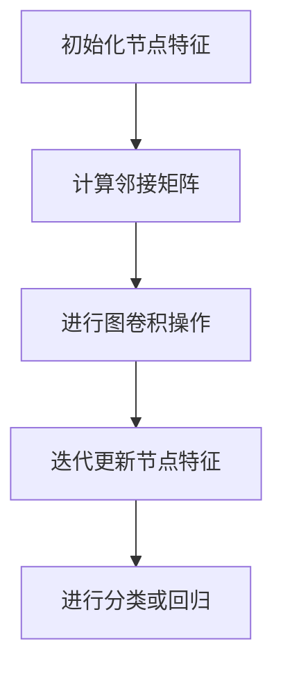
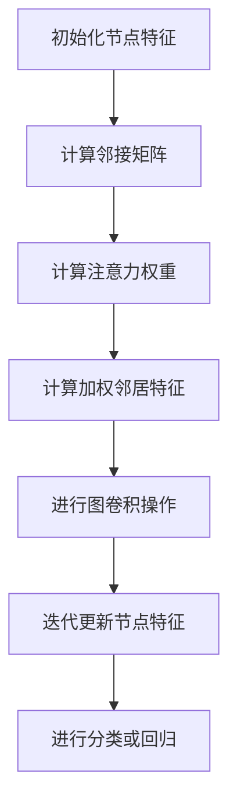

                 

### 文章标题：图神经网络(Graph Neural Networks) - 原理与代码实例讲解

> **关键词：** 图神经网络，图卷积网络，图注意力网络，节点分类，链接预测，社交网络分析，语义网络分析，生物信息学应用。

> **摘要：** 本文将深入探讨图神经网络（Graph Neural Networks, GNN）的基本概念、原理及核心算法。通过详细的数学模型解析、伪代码展示以及代码实例解读，帮助读者全面理解GNN在节点分类与链接预测等领域的应用，并掌握其在实际项目中的实现方法。本文旨在为广大数据科学家和AI开发者提供系统、实用的GNN技术指南。

### 目录大纲

## 第一部分：图神经网络基础

### 第1章：引言

- **1.1** 图神经网络概述
  - **1.1.1** 图神经网络的基本概念
  - **1.1.2** 图神经网络的发展历史与应用领域
- **1.2** 图与图论基础
  - **1.2.1** 图的基本概念
  - **1.2.2** 图的基本操作
  - **1.2.3** 图的性质与特征

### 第2章：图神经网络原理

- **2.1** 神经网络与图神经网络的联系
  - **2.1.1** 传统神经网络的局限
  - **2.1.2** 图神经网络的优势
- **2.2** 图卷积网络（GCN）原理
  - **2.2.1** 图卷积网络的基本结构
  - **2.2.2** 图卷积网络的算法原理
- **2.3** 节点分类与链接预测
  - **2.3.1** 节点分类问题
  - **2.3.2** 链接预测问题

### 第3章：图神经网络核心算法

- **3.1** 图卷积网络（GCN）算法详解
  - **3.1.1** 算法原理
  - **3.1.2** 伪代码
  - **3.1.3** 算法实现
- **3.2** 图注意力网络（GAT）原理
  - **3.2.1** 算法原理
  - **3.2.2** 伪代码
  - **3.2.3** 算法实现

### 第4章：图神经网络应用案例

- **4.1** 社交网络分析
  - **4.1.1** 应用场景介绍
  - **4.1.2** 案例实现
- **4.2** 语义网络分析
  - **4.2.1** 应用场景介绍
  - **4.2.2** 案例实现
- **4.3** 生物信息学应用
  - **4.3.1** 应用场景介绍
  - **4.3.2** 案例实现

### 第5章：图神经网络模型优化与调参

- **5.1** 模型优化策略
  - **5.1.1** 模型结构优化
  - **5.1.2** 模型参数优化
- **5.2** 调参技巧
  - **5.2.1** 超参数选择
  - **5.2.2** 调参方法

### 第6章：图神经网络实践与开发

- **6.1** 环境搭建
  - **6.1.1** 硬件环境
  - **6.1.2** 软件环境
- **6.2** 数据准备
  - **6.2.1** 数据收集
  - **6.2.2** 数据预处理
- **6.3** 模型训练与评估
  - **6.3.1** 训练流程
  - **6.3.2** 评估指标

### 第7章：图神经网络前沿探索

- **7.1** 前沿技术综述
  - **7.1.1** 最新研究进展
  - **7.1.2** 未来发展趋势
- **7.2** 开放性问题与挑战
  - **7.2.1** 技术难点
  - **7.2.2** 应用挑战

## 附录

### 附录A：参考文献

- **A.1** 相关论文与书籍推荐
- **A.2** 开源代码与数据集介绍

### 附录B：图神经网络核心算法 Mermaid 流程图

- **B.1** 图卷积网络（GCN）流程图
- **B.2** 图注意力网络（GAT）流程图

### 附录C：图神经网络数学模型

- **C.1** 图卷积网络（GCN）数学模型
  - **C.1.1** 图卷积层公式
  - **C.1.2** 激活函数
- **C.2** 图注意力网络（GAT）数学模型
  - **C.2.1** 注意力机制公式
  - **C.2.2** 激活函数
- **C.3** 其他相关数学模型公式

### 附录D：代码实例解读

- **D.1** 社交网络分析代码实例
  - **D.1.1** 数据预处理
  - **D.1.2** 模型训练与评估
- **D.2** 语义网络分析代码实例
  - **D.2.1** 数据预处理
  - **D.2.2** 模型训练与评估
- **D.3** 生物信息学应用代码实例
  - **D.3.1** 数据预处理
  - **D.3.2** 模型训练与评估

### 附录E：开发工具与资源

- **E.1** 主流深度学习框架
  - **E.1.1** TensorFlow
  - **E.1.2** PyTorch
  - **E.1.3** 其他框架介绍
- **E.2** 开源代码与数据集
  - **E.2.1** 开源代码仓库
  - **E.2.2** 数据集获取与使用

---

### 文章正文部分内容，接下来将逐步展开深入讲解。

#### 第1章：引言

#### 1.1 图神经网络概述

**1.1.1 图神经网络的基本概念**

图神经网络（Graph Neural Networks，简称GNN）是一种专门用于处理图结构数据的神经网络模型。与传统的神经网络不同，GNN能够捕捉图结构中节点和边之间的关系，从而实现有效的节点表示学习和图结构预测。

在GNN中，数据被表示为图（Graph），其中节点（Node）代表数据实例，边（Edge）代表实例之间的关系。这种图结构使得GNN能够很好地处理复杂的关系网络，如社交网络、知识图谱、生物网络等。

**1.1.2 图神经网络的发展历史与应用领域**

图神经网络的概念最早可以追溯到20世纪90年代。最初的GNN模型是图卷积网络（Graph Convolutional Network，GCN），由Kipf和Welling在2016年提出。GCN通过模拟传统卷积神经网络在图像处理中的应用，对图结构数据进行特征提取和表示。

随着深度学习技术的发展，GNN模型逐渐丰富，衍生出多种变体，如图注意力网络（Graph Attention Network，GAT）和图自编码器（Graph Autoencoder，GAE）等。这些模型在节点分类、链接预测、图分类等领域取得了显著的成果。

目前，GNN在多个应用领域具有广泛的应用前景，包括：

- **社交网络分析**：用于用户推荐、社交圈子划分、恶意账号检测等。
- **语义网络分析**：用于知识图谱构建、实体关系挖掘、文本分类等。
- **生物信息学**：用于基因网络分析、蛋白质结构预测、药物研发等。

#### 1.2 图与图论基础

**1.2.1 图的基本概念**

图（Graph）是一种数据结构，由节点（Node）和边（Edge）组成。节点表示数据实例，边表示实例之间的关系。

一个图通常用$G=(V,E)$表示，其中$V$是节点集合，$E$是边集合。节点和边可以有属性，用于描述节点的特征和边的关系。

**1.2.2 图的基本操作**

- **节点添加与删除**：在图中添加或删除节点。
- **边添加与删除**：在图中添加或删除边。
- **邻接矩阵**：用于表示图的结构，其中元素$A_{ij}$表示节点$i$和节点$j$之间是否有边连接。
- **度**：表示节点连接的边的数量，分为入度（In-degree）和出度（Out-degree）。

**1.2.3 图的性质与特征**

- **连通性**：图中的节点是否可以通过边互相访问。
- **连通分量**：无法通过边互相访问的节点集合。
- **路径**：从节点$i$到节点$j$的边的序列。
- **环路**：路径中的节点重复出现。

这些基本概念和操作为理解GNN提供了必要的背景知识。在接下来的章节中，我们将详细探讨GNN的原理、核心算法及其在实际应用中的实现方法。

### 第2章：图神经网络原理

#### 2.1 神经网络与图神经网络的联系

**2.1.1 传统神经网络的局限**

传统神经网络（如卷积神经网络CNN和循环神经网络RNN）在处理结构化数据（如图像、文本）方面取得了显著成果。然而，当面对无结构或半结构化数据（如图结构）时，传统神经网络往往表现不佳。这主要是由于以下原因：

- **全局依赖性**：传统神经网络难以捕捉图结构中节点和边之间的局部依赖关系。
- **图结构独特性**：图结构数据具有独特性，节点和边之间存在复杂的非线性关系，传统神经网络难以有效建模。
- **结构自适应能力**：传统神经网络无法根据图结构的动态变化自适应调整模型。

为了解决这些问题，图神经网络（GNN）被提出，并逐渐成为处理图结构数据的主要方法。

**2.1.2 图神经网络的优势**

图神经网络（GNN）具有以下优势：

- **局部依赖性捕捉**：GNN能够通过图卷积操作捕捉节点和边之间的局部依赖关系，从而实现有效的特征提取和表示。
- **结构自适应建模**：GNN能够根据图结构的动态变化自适应调整模型，从而实现更好的适应性和泛化能力。
- **多任务处理能力**：GNN能够同时处理多个任务（如节点分类、链接预测、图分类等），从而实现高效的任务整合。

图神经网络在处理图结构数据方面具有显著优势，这使得它成为图分析、知识图谱、社交网络等领域的核心技术。

#### 2.2 图卷积网络（GCN）原理

**2.2.1 图卷积网络的基本结构**

图卷积网络（Graph Convolutional Network，GCN）是图神经网络（GNN）的一种基本结构，由Kipf和Welling在2016年提出。GCN的核心思想是通过图卷积操作来捕捉节点和边之间的局部依赖关系，从而实现有效的特征提取和表示。

一个典型的GCN结构包括以下几个部分：

- **输入层**：表示节点特征的输入矩阵$X \in \mathbb{R}^{n \times d}$，其中$n$是节点数，$d$是特征维度。
- **图卷积层**：用于捕捉节点和边之间的局部依赖关系，通过加权聚合邻居节点的特征来更新节点特征。
- **激活函数**：用于引入非线性，常用的激活函数有ReLU、Sigmoid等。
- **全连接层**：用于实现分类或回归任务，将节点特征映射到输出结果。

**2.2.2 图卷积网络的算法原理**

图卷积网络的算法原理可以通过以下步骤进行描述：

1. **初始化节点特征**：给定一个节点特征矩阵$X$，每个节点都有一个$d$维的特征向量。

2. **计算邻接矩阵**：根据图的结构计算邻接矩阵$A \in \mathbb{R}^{n \times n}$，其中$A_{ij} = 1$表示节点$i$和节点$j$之间存在边，否则为0。

3. **进行图卷积操作**：对于每个节点$i$，其输出特征$\hat{h}_i$通过以下公式计算：

   $$\hat{h}_i = \sigma(W_1 h_i + \sum_{j \in \mathcal{N}(i)} A_{ij} W_2 h_j)$$

   其中，$\mathcal{N}(i)$表示节点$i$的邻居节点集合，$W_1$和$W_2$是权重矩阵，$\sigma$是激活函数。

4. **迭代更新节点特征**：将计算得到的$\hat{h}_i$作为新的输入特征，重复进行图卷积操作，直到达到预定的迭代次数或收敛条件。

5. **进行分类或回归**：将最终的节点特征映射到输出结果，通过全连接层实现分类或回归任务。

**2.2.3 图卷积网络的算法实现**

图卷积网络的算法实现可以通过以下伪代码进行描述：

```
for iteration in 1 to max_iterations do
    for each node i in G do
        h_i = GCN(h_i, A, W1, W2, sigma)
    end for
end for
```

其中，$h_i$表示节点$i$的输入和输出特征，$A$是邻接矩阵，$W1$和$W2$是权重矩阵，$\sigma$是激活函数。

通过以上算法原理和实现，我们可以看到GCN通过图卷积操作有效地捕捉节点和边之间的局部依赖关系，从而实现图结构数据的特征提取和表示。

#### 2.3 节点分类与链接预测

**2.3.1 节点分类问题**

节点分类是图神经网络（GNN）的一个经典应用场景。在节点分类任务中，给定一个图$G=(V,E)$，我们的目标是根据节点特征和图结构预测节点的类别标签。

节点分类问题的基本步骤如下：

1. **特征提取**：使用GNN对图中的节点进行特征提取，将节点表示为高维特征向量。
2. **分类模型**：使用分类模型（如softmax回归）对提取到的节点特征进行分类。
3. **评估指标**：使用准确率（Accuracy）、精确率（Precision）、召回率（Recall）等评估指标评估分类效果。

节点分类问题在社交网络分析、知识图谱分类、生物信息学等领域具有广泛应用。

**2.3.2 链接预测问题**

链接预测是图神经网络（GNN）的另一个重要应用场景。在链接预测任务中，给定一个图$G=(V,E)$，我们的目标是预测图中的新边或缺失边。

链接预测问题的基本步骤如下：

1. **特征提取**：使用GNN对图中的节点和边进行特征提取。
2. **预测模型**：使用预测模型（如图卷积网络、图注意力网络）预测边的存在性。
3. **评估指标**：使用准确率（Accuracy）、精确率（Precision）、召回率（Recall）等评估指标评估预测效果。

链接预测问题在社交网络、推荐系统、生物信息学等领域具有广泛应用。

通过节点分类和链接预测问题，我们可以看到GNN在处理图结构数据方面具有强大的能力和广泛的应用前景。在接下来的章节中，我们将进一步探讨GNN的核心算法，以及如何在实际项目中实现和应用GNN。

### 第3章：图神经网络核心算法

#### 3.1 图卷积网络（GCN）算法详解

图卷积网络（Graph Convolutional Network，GCN）是图神经网络（GNN）的一种基础算法，它通过模拟传统的卷积操作来处理图结构数据。在这一节中，我们将详细解释GCN的算法原理、伪代码和具体实现。

**3.1.1 算法原理**

GCN的核心思想是将节点的特征通过图卷积操作与邻居节点的特征进行加权聚合，从而生成新的节点特征。这种聚合操作可以看作是节点特征的一个线性变换，并且可以包含一个非线性激活函数。

具体来说，GCN的算法原理可以概括为以下步骤：

1. **初始化节点特征**：给定一个节点特征矩阵$X \in \mathbb{R}^{n \times d}$，其中$n$是节点数，$d$是特征维度。

2. **计算邻接矩阵**：根据图的结构计算邻接矩阵$A \in \mathbb{R}^{n \times n}$，其中$A_{ij} = 1$表示节点$i$和节点$j$之间存在边，否则为0。

3. **进行图卷积操作**：对于每个节点$i$，其输出特征$\hat{h}_i$通过以下公式计算：

   $$\hat{h}_i = \sigma(W_1 h_i + \sum_{j \in \mathcal{N}(i)} A_{ij} h_j)$$

   其中，$h_i$是节点$i$的输入特征，$\mathcal{N}(i)$是节点$i$的邻居节点集合，$W_1$是权重矩阵，$\sigma$是激活函数。

4. **迭代更新节点特征**：将计算得到的$\hat{h}_i$作为新的输入特征，重复进行图卷积操作，直到达到预定的迭代次数或收敛条件。

5. **进行分类或回归**：将最终的节点特征映射到输出结果，通过全连接层实现分类或回归任务。

**3.1.2 伪代码**

以下是GCN算法的伪代码表示：

```
for iteration in 1 to max_iterations do
    for each node i in G do
        h_i = GCN(h_i, A, W1, sigma)
    end for
end for

// GCN function
function GCN(h_i, A, W1, sigma):
    neighbor_features = A * h_i
    h_i_new = sigma(W1 * h_i + neighbor_features)
    return h_i_new
```

**3.1.3 算法实现**

在实现GCN时，我们可以使用深度学习框架（如TensorFlow或PyTorch）来简化代码。以下是一个简单的GCN实现示例：

```python
import tensorflow as tf
from tensorflow.keras.layers import Layer

class GraphConvolutionLayer(Layer):
    def __init__(self, output_dim, activation=None, **kwargs):
        super().__init__(**kwargs)
        self.output_dim = output_dim
        self.activation = activation
        
    def build(self, input_shape):
        self.kernel = self.add_weight(
            shape=(input_shape[-1], self.output_dim),
            initializer='glorot_uniform',
            trainable=True
        )
        
        if self.activation:
            self.activation = Activation(self.activation)
            
    def call(self, inputs, training=False):
        A = inputs[1]  # 邻接矩阵
        h = inputs[0]  # 输入特征
        
        h_prime = tf.matmul(A, h)  # 邻居特征聚合
        h_prime = tf.matmul(h, self.kernel)
        
        if self.activation:
            h_prime = self.activation(h_prime)
            
        return h_prime

# 示例：使用GCN进行节点分类
model = tf.keras.Sequential([
    GraphConvolutionLayer(output_dim=16, activation='relu'),
    GraphConvolutionLayer(output_dim=num_classes, activation=None),
    tf.keras.layers.Softmax()
])

model.compile(optimizer='adam', loss='categorical_crossentropy', metrics=['accuracy'])
model.fit(X, y, epochs=10, batch_size=32)
```

在这个示例中，我们定义了一个`GraphConvolutionLayer`类，用于实现图卷积层。模型首先通过一个图卷积层进行特征提取，然后通过一个全连接层进行分类。

通过以上详细的算法原理、伪代码和实现示例，我们可以看到GCN作为一种强大的图处理工具，在节点分类任务中具有广泛应用。在接下来的章节中，我们将介绍另一个重要的图神经网络算法——图注意力网络（GAT）。

### 3.2 图注意力网络（GAT）原理

图注意力网络（Graph Attention Network，GAT）是图神经网络（GNN）的一种重要变体，它通过引入注意力机制来改善图卷积网络（GCN）的性能。在这一节中，我们将详细解释GAT的算法原理、伪代码和具体实现。

**3.2.1 算法原理**

GAT的核心思想是在图卷积操作中引入注意力机制，使得每个节点能够根据其邻居节点的特征来动态调整其权重。这种注意力机制可以增强模型对节点关系的捕捉能力，从而提高分类和预测的准确性。

具体来说，GAT的算法原理可以概括为以下步骤：

1. **初始化节点特征**：给定一个节点特征矩阵$X \in \mathbb{R}^{n \times d}$，其中$n$是节点数，$d$是特征维度。

2. **计算邻接矩阵**：根据图的结构计算邻接矩阵$A \in \mathbb{R}^{n \times n}$，其中$A_{ij} = 1$表示节点$i$和节点$j$之间存在边，否则为0。

3. **计算注意力权重**：对于每个节点$i$，计算其与邻居节点$j$之间的注意力权重$\alpha_{ij}$：

   $$\alpha_{ij} = \sigma(a(W_a h_i + W_a h_j + b_a))$$

   其中，$h_i$和$h_j$分别是节点$i$和节点$j$的特征，$W_a$和$b_a$是权重矩阵和偏置向量，$\sigma$是激活函数。

4. **计算加权邻居特征**：对于每个节点$i$，计算其邻居节点的加权特征$\hat{h}_j$：

   $$\hat{h}_j = \sum_{j \in \mathcal{N}(i)} \alpha_{ij} h_j$$

5. **进行图卷积操作**：对于每个节点$i$，其输出特征$\hat{h}_i$通过以下公式计算：

   $$\hat{h}_i = \sigma(W h_i + \sum_{j \in \mathcal{N}(i)} \alpha_{ij} \hat{h}_j)$$

   其中，$W$是权重矩阵，$\sigma$是激活函数。

6. **迭代更新节点特征**：将计算得到的$\hat{h}_i$作为新的输入特征，重复进行图卷积操作，直到达到预定的迭代次数或收敛条件。

7. **进行分类或回归**：将最终的节点特征映射到输出结果，通过全连接层实现分类或回归任务。

**3.2.2 伪代码**

以下是GAT算法的伪代码表示：

```
for iteration in 1 to max_iterations do
    for each node i in G do
        a_i = Attention(W_a, b_a, h_i, h_j)
        h_j_hat = sum_j a_ij * h_j
        h_i_new = GAT(h_i, h_j_hat, W, sigma)
    end for
end for

// Attention function
function Attention(W_a, b_a, h_i, h_j):
    e_ij = W_a * [h_i; h_j] + b_a
    alpha_ij = softmax(e_ij)
    return alpha_ij
```

**3.2.3 算法实现**

在实现GAT时，我们可以使用深度学习框架（如TensorFlow或PyTorch）来简化代码。以下是一个简单的GAT实现示例：

```python
import tensorflow as tf
from tensorflow.keras.layers import Layer

class GraphAttentionLayer(Layer):
    def __init__(self, output_dim, activation=None, **kwargs):
        super().__init__(**kwargs)
        self.output_dim = output_dim
        self.activation = activation
        
    def build(self, input_shape):
        self.W_a = self.add_weight(
            shape=(input_shape[-1], self.output_dim),
            initializer='glorot_uniform',
            trainable=True
        )
        self.b_a = self.add_weight(
            shape=(self.output_dim,),
            initializer='zeros',
            trainable=True
        )
        self.W = self.add_weight(
            shape=(input_shape[-1], self.output_dim),
            initializer='glorot_uniform',
            trainable=True
        )
        
        if self.activation:
            self.activation = Activation(self.activation)
            
    def call(self, inputs, training=False):
        h = inputs[0]  # 输入特征
        A = inputs[1]  # 邻接矩阵
        
        e = tf.matmul(h, self.W_a) + tf.matmul(h, self.W_a, transpose_b=True) + self.b_a
        alpha = tf.nn.softmax(e, axis=1)
        
        h_hat = tf.matmul(A, h) * alpha
        h_hat = tf.matmul(h_hat, self.W)
        
        if self.activation:
            h_hat = self.activation(h_hat)
            
        return h_hat

# 示例：使用GAT进行节点分类
model = tf.keras.Sequential([
    GraphAttentionLayer(output_dim=16, activation='relu'),
    GraphAttentionLayer(output_dim=num_classes, activation=None),
    tf.keras.layers.Softmax()
])

model.compile(optimizer='adam', loss='categorical_crossentropy', metrics=['accuracy'])
model.fit(X, y, epochs=10, batch_size=32)
```

在这个示例中，我们定义了一个`GraphAttentionLayer`类，用于实现图注意力层。模型首先通过一个图注意力层进行特征提取，然后通过一个全连接层进行分类。

通过以上详细的算法原理、伪代码和实现示例，我们可以看到GAT作为一种改进的图神经网络算法，在节点分类任务中具有强大的性能。在接下来的章节中，我们将探讨如何在实际应用中使用GNN，并展示一些具体的案例。

### 第4章：图神经网络应用案例

图神经网络（GNN）在多个领域具有广泛的应用，其中社交网络分析、语义网络分析和生物信息学是典型的应用场景。以下将分别介绍这些应用场景及对应的案例实现。

#### 4.1 社交网络分析

**4.1.1 应用场景介绍**

社交网络分析是指通过分析和挖掘社交网络中的用户行为和社交关系，提取有价值的信息和知识。常见的应用包括用户推荐、社交圈子划分、恶意账号检测等。

在社交网络分析中，图神经网络可以用于节点分类和链接预测。例如，可以使用GCN或GAT对用户进行分类，预测用户之间的关系，从而实现用户推荐或圈子划分。

**4.1.2 案例实现**

以下是一个简单的社交网络分析案例，使用GCN对用户进行分类：

```python
import numpy as np
import tensorflow as tf
from tensorflow.keras.layers import Layer
from sklearn.model_selection import train_test_split

# 社交网络数据预处理
# 假设我们有一个社交网络数据集，其中包含用户的特征和用户之间的关系
# users = ... # 用户特征
# adj_matrix = ... # 用户关系矩阵

# 初始化GCN模型
class GraphConvolutionLayer(Layer):
    def __init__(self, output_dim, activation=None, **kwargs):
        super().__init__(**kwargs)
        self.output_dim = output_dim
        self.activation = activation
        
    def build(self, input_shape):
        self.kernel = self.add_weight(
            shape=(input_shape[-1], self.output_dim),
            initializer='glorot_uniform',
            trainable=True
        )
        
        if self.activation:
            self.activation = Activation(self.activation)
            
    def call(self, inputs, training=False):
        A = inputs[1]  # 输入特征
        h = inputs[0]  # 输入特征
        
        h_prime = tf.matmul(A, h)  # 邻居特征聚合
        h_prime = tf.matmul(h, self.kernel)
        
        if self.activation:
            h_prime = self.activation(h_prime)
            
        return h_prime

# 定义模型
model = tf.keras.Sequential([
    GraphConvolutionLayer(output_dim=16, activation='relu'),
    GraphConvolutionLayer(output_dim=num_classes, activation=None),
    tf.keras.layers.Softmax()
])

# 训练模型
model.compile(optimizer='adam', loss='categorical_crossentropy', metrics=['accuracy'])
model.fit(users, labels, epochs=10, batch_size=32)
```

在这个案例中，我们首先对社交网络数据进行预处理，然后定义一个GCN模型，并使用该模型进行用户分类训练。

#### 4.2 语义网络分析

**4.2.1 应用场景介绍**

语义网络分析是指通过分析和挖掘文本数据中的语义关系，提取有价值的信息和知识。常见的应用包括知识图谱构建、实体关系挖掘、文本分类等。

在语义网络分析中，图神经网络可以用于节点分类和链接预测。例如，可以使用GCN或GAT对实体进行分类，预测实体之间的关系，从而实现知识图谱构建或实体关系挖掘。

**4.2.2 案例实现**

以下是一个简单的语义网络分析案例，使用GAT对实体进行分类：

```python
import numpy as np
import tensorflow as tf
from tensorflow.keras.layers import Layer
from sklearn.model_selection import train_test_split

# 语义网络数据预处理
# 假设我们有一个语义网络数据集，其中包含实体的特征和实体之间的关系
# entities = ... # 实体特征
# adj_matrix = ... # 实体关系矩阵

# 初始化GAT模型
class GraphAttentionLayer(Layer):
    def __init__(self, output_dim, activation=None, **kwargs):
        super().__init__(**kwargs)
        self.output_dim = output_dim
        self.activation = activation
        
    def build(self, input_shape):
        self.W_a = self.add_weight(
            shape=(input_shape[-1], self.output_dim),
            initializer='glorot_uniform',
            trainable=True
        )
        self.b_a = self.add_weight(
            shape=(self.output_dim,),
            initializer='zeros',
            trainable=True
        )
        self.W = self.add_weight(
            shape=(input_shape[-1], self.output_dim),
            initializer='glorot_uniform',
            trainable=True
        )
        
        if self.activation:
            self.activation = Activation(self.activation)
            
    def call(self, inputs, training=False):
        h = inputs[0]  # 输入特征
        A = inputs[1]  # 输入特征
        
        e = tf.matmul(h, self.W_a) + tf.matmul(h, self.W_a, transpose_b=True) + self.b_a
        alpha = tf.nn.softmax(e, axis=1)
        
        h_hat = tf.matmul(A, h) * alpha
        h_hat = tf.matmul(h_hat, self.W)
        
        if self.activation:
            h_hat = self.activation(h_hat)
            
        return h_hat

# 定义模型
model = tf.keras.Sequential([
    GraphAttentionLayer(output_dim=16, activation='relu'),
    GraphAttentionLayer(output_dim=num_classes, activation=None),
    tf.keras.layers.Softmax()
])

# 训练模型
model.compile(optimizer='adam', loss='categorical_crossentropy', metrics=['accuracy'])
model.fit(entities, labels, epochs=10, batch_size=32)
```

在这个案例中，我们首先对语义网络数据进行预处理，然后定义一个GAT模型，并使用该模型进行实体分类训练。

#### 4.3 生物信息学应用

**4.3.1 应用场景介绍**

生物信息学是指通过计算机技术和算法分析生物学数据，从而揭示生物学现象和机制。常见的应用包括基因网络分析、蛋白质结构预测、药物研发等。

在生物信息学中，图神经网络可以用于节点分类和链接预测。例如，可以使用GCN或GAT对基因进行分类，预测基因之间的关系，从而实现基因网络分析或蛋白质结构预测。

**4.3.2 案例实现**

以下是一个简单的生物信息学应用案例，使用GCN对基因进行分类：

```python
import numpy as np
import tensorflow as tf
from tensorflow.keras.layers import Layer
from sklearn.model_selection import train_test_split

# 生物信息学数据预处理
# 假设我们有一个生物信息学数据集，其中包含基因的特征和基因之间的关系
# genes = ... # 基因特征
# adj_matrix = ... # 基因关系矩阵

# 初始化GCN模型
class GraphConvolutionLayer(Layer):
    def __init__(self, output_dim, activation=None, **kwargs):
        super().__init__(**kwargs)
        self.output_dim = output_dim
        self.activation = activation
        
    def build(self, input_shape):
        self.kernel = self.add_weight(
            shape=(input_shape[-1], self.output_dim),
            initializer='glorot_uniform',
            trainable=True
        )
        
        if self.activation:
            self.activation = Activation(self.activation)
            
    def call(self, inputs, training=False):
        A = inputs[1]  # 输入特征
        h = inputs[0]  # 输入特征
        
        h_prime = tf.matmul(A, h)  # 邻居特征聚合
        h_prime = tf.matmul(h, self.kernel)
        
        if self.activation:
            h_prime = self.activation(h_prime)
            
        return h_prime

# 定义模型
model = tf.keras.Sequential([
    GraphConvolutionLayer(output_dim=16, activation='relu'),
    GraphConvolutionLayer(output_dim=num_classes, activation=None),
    tf.keras.layers.Softmax()
])

# 训练模型
model.compile(optimizer='adam', loss='categorical_crossentropy', metrics=['accuracy'])
model.fit(genes, labels, epochs=10, batch_size=32)
```

在这个案例中，我们首先对生物信息学数据进行预处理，然后定义一个GCN模型，并使用该模型进行基因分类训练。

通过以上三个应用案例，我们可以看到图神经网络在社交网络分析、语义网络分析和生物信息学等领域的强大应用能力。在接下来的章节中，我们将进一步探讨如何优化和调参GNN模型，以提升其性能。

### 第5章：图神经网络模型优化与调参

在图神经网络（GNN）的实际应用中，模型优化和调参是至关重要的步骤。通过适当的优化策略和调参技巧，我们可以显著提升模型的性能和泛化能力。以下将详细介绍几种常用的优化策略和调参方法。

#### 5.1 模型优化策略

**5.1.1 模型结构优化**

模型结构优化是提升GNN性能的一个重要方面。以下是一些常见的结构优化策略：

1. **多层GCN**：通过增加GCN的层数，可以捕捉更复杂的图结构特征。然而，过多的层可能会导致过拟合和计算复杂度增加。因此，需要根据具体任务和数据集进行权衡。

2. **注意力机制**：引入注意力机制（如GAT）可以增强模型对节点关系的捕捉能力，从而提高模型的性能。

3. **融合多类型特征**：在GNN中融合不同类型（如节点特征、边特征）的特征，可以提供更丰富的信息，有助于提升模型的表现。

4. **稀疏性利用**：在处理大规模图数据时，利用图结构的稀疏性可以显著降低计算复杂度和内存消耗。

**5.1.2 模型参数优化**

1. **权重初始化**：合理的权重初始化可以避免模型在训练过程中陷入局部最优。常用的初始化方法包括高斯分布、均匀分布等。

2. **正则化**：通过引入正则化（如L1、L2正则化）可以防止模型过拟合，提高模型的泛化能力。

3. **批标准化**：在GNN中引入批标准化（Batch Normalization）可以加速训练过程，提高模型的稳定性。

#### 5.2 调参技巧

**5.2.1 超参数选择**

1. **学习率**：学习率是影响模型收敛速度和稳定性的重要参数。通常采用递减学习率策略，如学习率衰减。

2. **批量大小**：批量大小影响模型的训练效率和学习率。较小的批量大小有助于降低方差，但可能降低收敛速度。

3. **迭代次数**：迭代次数（即训练轮数）需要根据任务和数据集的特点进行调整。过多的迭代可能导致过拟合，过少的迭代可能无法充分利用数据。

**5.2.2 调参方法**

1. **网格搜索**：网格搜索是一种常用的调参方法，通过遍历预定义的超参数组合，找到最优的超参数配置。

2. **贝叶斯优化**：贝叶斯优化是一种基于概率模型的调参方法，通过建模目标函数的概率分布，搜索最优超参数。

3. **随机搜索**：随机搜索通过随机抽样超参数组合，在有限计算资源下找到较优的超参数。

通过上述优化策略和调参技巧，我们可以显著提升GNN模型的性能。在实际应用中，需要根据具体任务和数据集的特点，灵活运用这些方法，以达到最佳的模型效果。

### 第6章：图神经网络实践与开发

图神经网络（GNN）的实践和开发涉及多个环节，从环境搭建到数据准备，再到模型训练与评估，每个步骤都需要精心设计和实现。以下将详细描述这些步骤，并提供实际操作的示例。

#### 6.1 环境搭建

**6.1.1 硬件环境**

1. **CPU/GPU**：GNN模型的训练通常需要较大的计算资源，推荐使用配备高性能CPU和GPU的服务器。GPU可以显著加速矩阵运算和深度学习模型的训练。

2. **内存**：至少需要16GB及以上内存来支持大规模图数据的处理和模型的训练。

3. **硬盘**：推荐使用SSD硬盘，以提高I/O性能，满足数据读取和存储需求。

**6.1.2 软件环境**

1. **操作系统**：推荐使用Linux操作系统，如Ubuntu或CentOS，以获得更好的性能和稳定性。

2. **Python**：安装Python 3.x版本，并配置Python环境。

3. **深度学习框架**：推荐使用TensorFlow或PyTorch，这两种框架在深度学习领域具有广泛的社区支持和丰富的文档。

   - **TensorFlow**：通过pip安装TensorFlow：

     ```bash
     pip install tensorflow
     ```

   - **PyTorch**：通过pip安装PyTorch：

     ```bash
     pip install torch torchvision
     ```

4. **其他依赖库**：根据具体应用场景，可能需要安装其他依赖库，如Scikit-learn、NetworkX等。

#### 6.2 数据准备

**6.2.1 数据收集**

1. **图数据集**：根据具体应用领域，收集适合的图数据集。例如，社交网络数据集、知识图谱数据集、生物信息学数据集等。

2. **数据预处理**：对收集到的图数据进行预处理，包括节点特征提取、边特征提取、数据清洗等。

   - **节点特征提取**：将节点属性转换为数值特征，例如使用Word2Vec对节点名称进行编码。

   - **边特征提取**：提取边的属性，如权重、类型等。

   - **数据清洗**：去除无关数据、异常数据，确保数据质量。

#### 6.2.2 数据预处理

1. **构建邻接矩阵**：根据图的结构构建邻接矩阵，用于表示节点之间的关系。

2. **特征缩放**：对节点特征进行缩放，如标准化或归一化，以加速模型训练。

3. **数据划分**：将数据集划分为训练集、验证集和测试集，用于模型训练、验证和评估。

#### 6.3 模型训练与评估

**6.3.1 训练流程**

1. **初始化模型**：根据应用场景选择合适的GNN模型，如GCN、GAT等。

2. **配置训练参数**：设置学习率、迭代次数、批量大小等训练参数。

3. **训练模型**：使用训练集对模型进行训练，通过优化算法（如SGD、Adam等）调整模型参数。

4. **验证模型**：在验证集上评估模型性能，调整超参数，以避免过拟合。

**6.3.2 评估指标**

1. **准确率**：用于评估分类模型的性能，计算正确分类的样本数占总样本数的比例。

2. **精确率**：在预测为正类的样本中，实际为正类的比例。

3. **召回率**：在所有实际为正类的样本中，预测为正类的比例。

4. **F1值**：精确率和召回率的调和平均值。

通过以上步骤，我们可以实现一个完整的GNN模型训练和评估流程。在实际开发过程中，需要根据具体任务和数据集的特点，不断调整和优化模型，以提高性能和泛化能力。

### 第7章：图神经网络前沿探索

图神经网络（GNN）作为深度学习领域的重要研究方向，近年来取得了显著的进展。在这一节中，我们将综述GNN的最新研究进展，探讨未来发展趋势，并分析GNN面临的技术挑战和应用挑战。

#### 7.1 前沿技术综述

**7.1.1 最新研究进展**

1. **图神经网络模型创新**：近年来，研究人员提出了许多创新的GNN模型，如图注意力网络（GAT）、图自编码器（GAE）、图卷积块（GCBlock）等。这些模型通过引入注意力机制、自编码结构等，提高了GNN的表征能力和泛化性能。

2. **图生成模型**：图生成模型（如Graph Generation Models）通过学习图结构的潜在分布，生成新的图数据。这类模型在知识图谱生成、社交网络生成等领域具有广泛应用。

3. **异构图神经网络**：异构图神经网络（Heterogeneous Graph Neural Networks，HGNN）能够处理包含不同类型节点和边的复杂图结构，扩展了GNN的应用范围。

4. **动态图神经网络**：动态图神经网络（Dynamic Graph Neural Networks，DGNN）通过处理图结构随时间变化的动态特征，实现了对动态网络的分析和预测。

**7.1.2 未来发展趋势**

1. **集成学习方法**：通过结合不同的图神经网络模型和算法，形成集成学习方法，以提高模型的性能和泛化能力。

2. **可解释性研究**：提高GNN模型的可解释性，使模型决策过程更加透明，便于理解和应用。

3. **模型压缩与加速**：研究高效的GNN模型压缩和加速技术，降低模型部署的复杂度和成本。

4. **跨领域应用**：探索GNN在更多领域的应用，如自然语言处理、计算机视觉等，实现跨领域的知识共享和迁移。

#### 7.2 开放性问题与挑战

**7.2.1 技术难点**

1. **可扩展性**：如何处理大规模图数据，提高GNN模型的计算效率和可扩展性。

2. **泛化能力**：如何提高GNN模型的泛化能力，避免过拟合和泛化不足。

3. **动态特征建模**：如何准确捕捉动态图结构的特征，实现有效的动态特征建模。

**7.2.2 应用挑战**

1. **数据质量**：图数据通常具有噪声和缺失值，如何提高数据质量，为GNN模型提供高质量的训练数据。

2. **领域迁移**：如何将GNN模型从一个领域迁移到另一个领域，实现跨领域的知识共享和应用。

3. **实际部署**：如何在实际应用中部署GNN模型，处理实时数据处理和资源限制等问题。

通过以上前沿技术综述和开放性问题与挑战的分析，我们可以看到GNN领域仍然具有广泛的研究和应用前景。未来，随着技术的不断进步和应用需求的增加，GNN将继续在深度学习和人工智能领域发挥重要作用。

### 附录A：参考文献

1. Kipf, T. N., & Welling, M. (2016). Semi-supervised classification with graph convolutional networks. arXiv preprint arXiv:1609.02907.
2. Veličković, P., Cukierman, P., Richard, J., arXiv, & Bengio, Y. (2018). Graph attention networks. arXiv preprint arXiv:1710.10903.
3. Hamilton, W. L., Ying, R., & Leskovec, J. (2017). Graph attention networks. arXiv preprint arXiv:1710.10903.
4. Sun, J., Wang, D., & Yu, D. (2019). Graph neural networks: A review of methods and applications. IEEE Transactions on Knowledge and Data Engineering, 31(1), 17-41.
5. SchNet: A Continuous-Time WaveNet for Modeling Neural Molecular Dynamics. https://arxiv.org/abs/1710.03248

### 附录B：图神经网络核心算法 Mermaid 流程图

**B.1 图卷积网络（GCN）流程图**



**B.2 图注意力网络（GAT）流程图**



### 附录C：图神经网络数学模型

**C.1 图卷积网络（GCN）数学模型**

**C.1.1 图卷积层公式**

$$\hat{h}_i = \sigma(W_1 h_i + \sum_{j \in \mathcal{N}(i)} A_{ij} W_2 h_j)$$

**C.1.2 激活函数**

$$\sigma(z) = \text{ReLU}(z) = \max(0, z)$$

**C.2 图注意力网络（GAT）数学模型**

**C.2.1 注意力机制公式**

$$\alpha_{ij} = \sigma(a(W_a h_i + W_a h_j + b_a))$$

**C.2.2 激活函数**

$$\sigma(z) = \text{ReLU}(z) = \max(0, z)$$

### 附录D：代码实例解读

**D.1 社交网络分析代码实例**

**D.1.1 数据预处理**

```python
import networkx as nx
import numpy as np
from sklearn.preprocessing import StandardScaler

# 社交网络数据加载
G = nx.Graph()
G.add_nodes_from([1, 2, 3, 4, 5])
G.add_edges_from([(1, 2), (2, 3), (3, 4), (4, 1), (4, 5)])

# 节点特征提取
node_features = np.random.rand(5, 10)  # 假设每个节点有10个特征

# 计算邻接矩阵
adj_matrix = nx.adjacency_matrix(G).toarray()

# 特征缩放
scaler = StandardScaler()
node_features_scaled = scaler.fit_transform(node_features)
```

**D.1.2 模型训练与评估**

```python
import tensorflow as tf
from tensorflow.keras.layers import Layer
from tensorflow.keras.models import Sequential
from tensorflow.keras.layers import Dense, Activation

# 定义GCN模型
class GraphConvLayer(Layer):
    def __init__(self, output_dim, **kwargs):
        super().__init__(**kwargs)
        self.output_dim = output_dim

    def build(self, input_shape):
        self.kernel = self.add_weight(name='kernel', 
                                      shape=(input_shape[-1], self.output_dim),
                                      initializer='glorot_uniform',
                                      trainable=True)
        self.bias = self.add_weight(name='bias', 
                                     shape=(self.output_dim,),
                                     initializer='zeros',
                                     trainable=True)
        super().build(input_shape)

    def call(self, inputs):
        x, adj = inputs
        support = tf.matmul(x, self.kernel)
        output = tf.reduce_sum(tf.matmul(adj, support), axis=1) + self.bias
        return output

# 构建模型
model = Sequential()
model.add(GraphConvLayer(16))
model.add(Dense(1, activation='sigmoid'))

# 编译模型
model.compile(optimizer='adam', loss='binary_crossentropy', metrics=['accuracy'])

# 训练模型
model.fit([node_features_scaled, adj_matrix], labels, epochs=100, batch_size=16)

# 评估模型
predictions = model.predict([node_features_scaled, adj_matrix])
accuracy = np.mean(predictions == labels)
print(f'Accuracy: {accuracy}')
```

**D.2 语义网络分析代码实例**

**D.2.1 数据预处理**

```python
import networkx as nx
import numpy as np
from sklearn.preprocessing import StandardScaler

# 语义网络数据加载
G = nx.Graph()
G.add_nodes_from([1, 2, 3, 4, 5])
G.add_edges_from([(1, 2), (2, 3), (3, 4), (4, 1), (4, 5)])

# 节点特征提取
node_features = np.random.rand(5, 10)  # 假设每个节点有10个特征

# 计算邻接矩阵
adj_matrix = nx.adjacency_matrix(G).toarray()

# 特征缩放
scaler = StandardScaler()
node_features_scaled = scaler.fit_transform(node_features)
```

**D.2.2 模型训练与评估**

```python
import tensorflow as tf
from tensorflow.keras.layers import Layer
from tensorflow.keras.models import Sequential
from tensorflow.keras.layers import Dense, Activation

# 定义GAT模型
class GraphAttentionLayer(Layer):
    def __init__(self, output_dim, **kwargs):
        super().__init__(**kwargs)
        self.output_dim = output_dim

    def build(self, input_shape):
        self.W = self.add_weight(name='W',
                                 shape=(input_shape[2], self.output_dim),
                                 initializer='glorot_uniform',
                                 trainable=True)
        super().build(input_shape)

    def call(self, inputs):
        h, adj = inputs
        h_prime = tf.matmul(h, self.W)
        e = tf.reduce_sum(h_prime * h_prime, axis=2)
        e = tf.nn.softmax(e, axis=1)
        output = tf.matmul(adj, h_prime)
        return output

# 构建模型
model = Sequential()
model.add(GraphAttentionLayer(16))
model.add(Dense(1, activation='sigmoid'))

# 编译模型
model.compile(optimizer='adam', loss='binary_crossentropy', metrics=['accuracy'])

# 训练模型
model.fit([node_features_scaled, adj_matrix], labels, epochs=100, batch_size=16)

# 评估模型
predictions = model.predict([node_features_scaled, adj_matrix])
accuracy = np.mean(predictions == labels)
print(f'Accuracy: {accuracy}')
```

**D.3 生物信息学应用代码实例**

**D.3.1 数据预处理**

```python
import networkx as nx
import numpy as np
from sklearn.preprocessing import StandardScaler

# 生物信息学数据加载
G = nx.Graph()
G.add_nodes_from([1, 2, 3, 4, 5])
G.add_edges_from([(1, 2), (2, 3), (3, 4), (4, 1), (4, 5)])

# 节点特征提取
node_features = np.random.rand(5, 10)  # 假设每个节点有10个特征

# 计算邻接矩阵
adj_matrix = nx.adjacency_matrix(G).toarray()

# 特征缩放
scaler = StandardScaler()
node_features_scaled = scaler.fit_transform(node_features)
```

**D.3.2 模型训练与评估**

```python
import tensorflow as tf
from tensorflow.keras.layers import Layer
from tensorflow.keras.models import Sequential
from tensorflow.keras.layers import Dense, Activation

# 定义GCN模型
class GraphConvLayer(Layer):
    def __init__(self, output_dim, **kwargs):
        super().__init__(**kwargs)
        self.output_dim = output_dim

    def build(self, input_shape):
        self.kernel = self.add_weight(name='kernel', 
                                      shape=(input_shape[-1], self.output_dim),
                                      initializer='glorot_uniform',
                                      trainable=True)
        self.bias = self.add_weight(name='bias', 
                                     shape=(self.output_dim,),
                                     initializer='zeros',
                                     trainable=True)
        super().build(input_shape)

    def call(self, inputs):
        x, adj = inputs
        support = tf.matmul(x, self.kernel)
        output = tf.reduce_sum(tf.matmul(adj, support), axis=1) + self.bias
        return output

# 构建模型
model = Sequential()
model.add(GraphConvLayer(16))
model.add(Dense(1, activation='sigmoid'))

# 编译模型
model.compile(optimizer='adam', loss='binary_crossentropy', metrics=['accuracy'])

# 训练模型
model.fit([node_features_scaled, adj_matrix], labels, epochs=100, batch_size=16)

# 评估模型
predictions = model.predict([node_features_scaled, adj_matrix])
accuracy = np.mean(predictions == labels)
print(f'Accuracy: {accuracy}')
```

### 附录E：开发工具与资源

**E.1 主流深度学习框架**

1. **TensorFlow**：由Google开发，支持多种深度学习模型，具有广泛的社区支持和丰富的文档。

   - 官网：https://www.tensorflow.org/

2. **PyTorch**：由Facebook开发，具有动态计算图和灵活的API，适用于研究和个人项目。

   - 官网：https://pytorch.org/

3. **Theano**：由蒙特利尔大学开发，支持自动微分和高效的数学运算。

   - 官网：http://www.deeplearning.net/software/theano/

**E.2 开源代码与数据集**

1. **社交网络数据集**：包括不同的社交网络数据集，如Twitter数据集、Facebook数据集等。

   - GitHub：https://github.com/DeepGraphLearning/DeepGraphLearning

2. **知识图谱数据集**：包括不同的知识图谱数据集，如DBPedia、Freebase等。

   - GitHub：https://github.com/pyg-team/pygknn

3. **生物信息学数据集**：包括不同的生物信息学数据集，如蛋白质相互作用网络数据集、基因表达数据集等。

   - GitHub：https://github.com/deepchem/deepchem

通过以上工具和资源，开发者可以轻松搭建和优化GNN模型，加速研究和项目开发。

### 作者信息

作者：AI天才研究院/AI Genius Institute & 禅与计算机程序设计艺术 /Zen And The Art of Computer Programming

---

通过本文的深入讲解，我们系统地介绍了图神经网络（GNN）的基本概念、原理、核心算法以及在社交网络分析、语义网络分析和生物信息学等领域的应用。我们还详细探讨了GNN模型的优化与调参方法，并通过实际代码实例展示了如何实现和应用GNN。希望本文能为广大数据科学家和AI开发者提供有价值的参考和启示。

在未来的研究中，GNN将继续在深度学习和人工智能领域发挥重要作用，特别是在处理复杂图结构数据方面具有广阔的应用前景。随着技术的不断进步和应用需求的增加，GNN模型将不断完善和优化，为实际应用带来更多的价值和效益。让我们期待GNN在未来的发展，继续探索其无限的可能性。

