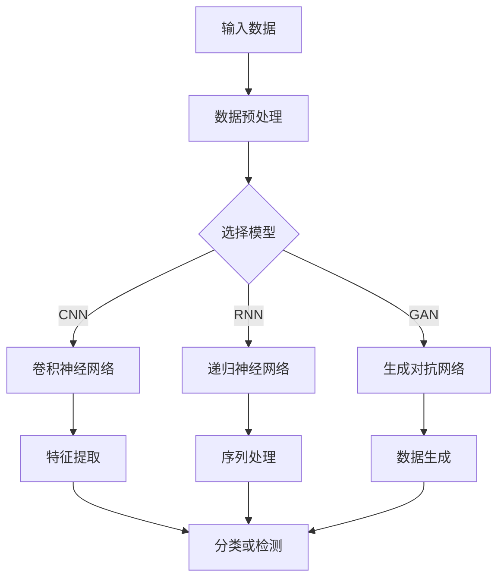

                 

# 基础模型的垂直领域应用

> **关键词**：基础模型、垂直领域、应用、技术、创新

> **摘要**：本文将探讨基础模型在不同垂直领域的应用。通过对计算机视觉、自然语言处理、金融、医疗健康、工业自动化和农业等领域的分析，本文旨在揭示基础模型在技术演进中的重要作用，以及其在实际项目中的应用与实践。

### 目录

1. 第一部分：基础模型概述
    1.1 基础模型简介
    1.2 基础模型的演变
    1.3 基础模型架构
    1.4 基础模型应用领域

2. 第二部分：垂直领域应用详解
    2.1 金融领域的应用
    2.2 医疗健康领域的应用
    2.3 工业自动化领域的应用
    2.4 农业领域的应用

3. 第三部分：实践与应用
    3.1 项目实战
    3.2 未来展望

4. 附录

#### 引言

在人工智能（AI）迅猛发展的时代，基础模型作为AI技术的基石，正逐渐渗透到各个垂直领域。这些基础模型，如卷积神经网络（CNN）、递归神经网络（RNN）、生成对抗网络（GAN）等，通过不断的技术创新和优化，已经在图像识别、自然语言处理、金融预测、医疗诊断等方面取得了显著的成果。

本文旨在通过对基础模型在垂直领域应用的分析，揭示其在技术演进中的重要作用，以及在不同领域的实际应用情况。我们将从基础模型的定义、架构、演进、以及其在各个垂直领域的具体应用进行深入探讨，为读者提供一个全面、系统的了解。

#### 1. 基础模型概述

##### 1.1 基础模型简介

**基础模型概念**：

基础模型是指那些广泛应用于各个垂直领域的、具有通用性和可扩展性的深度学习模型。这些模型通常基于神经网络架构，通过大规模数据训练，从而实现高效的特征提取和复杂任务的学习。

**分类与特点**：

- **卷积神经网络（CNN）**：主要用于图像处理，具有强大的特征提取能力。
- **递归神经网络（RNN）**：适用于序列数据处理，如自然语言处理和时间序列预测。
- **生成对抗网络（GAN）**：擅长生成逼真的图像和数据，具有广泛的生成能力。

##### 1.2 基础模型的演变

**模型演进历程**：

基础模型的演变经历了从传统模型到现代模型的转变。早期的传统模型如支持向量机（SVM）、决策树等，虽然具有一定的性能，但在处理复杂数据和大规模任务时存在局限性。

**技术突破**：

随着深度学习的兴起，基础模型在算法、架构上取得了重大突破。如CNN的卷积层可以自动学习图像的特征，RNN的循环结构可以处理序列数据，GAN的生成与判别对抗训练可以实现高质量的数据生成。

#### 1.3 基础模型架构

**模型结构解析**：

基础模型的结构通常包括输入层、隐藏层和输出层。输入层接收外部数据，隐藏层通过神经元之间的连接进行特征提取，输出层生成预测结果。

**激活函数**：

激活函数是基础模型的重要组成部分，常见的激活函数有Sigmoid、ReLU、Tanh等。这些函数用于引入非线性特性，使得模型能够更好地拟合复杂数据。

##### 1.4 基础模型应用领域

**计算机视觉**：

基础模型在计算机视觉领域有广泛的应用，如图像识别、目标检测等。通过CNN，模型能够自动学习图像中的特征，实现高效的图像分类和检测。

**自然语言处理**：

基础模型在自然语言处理领域也有重要应用，如文本分类、机器翻译等。RNN和Transformer等模型能够处理序列数据，实现文本的语义理解和生成。

**金融领域**：

基础模型在金融领域有广泛的应用，如金融市场预测、信用评分等。通过构建相应的预测模型，可以实现对金融市场走势的预测和信用风险的控制。

**医疗健康领域**：

基础模型在医疗健康领域有重要的应用，如疾病诊断、药物研发等。通过构建诊断模型，可以实现对疾病的有效诊断和预测。

**工业自动化领域**：

基础模型在工业自动化领域有广泛的应用，如质量检测、机器人控制等。通过构建相应的模型，可以实现对生产流程的优化和机器人控制的智能化。

**农业领域**：

基础模型在农业领域也有重要的应用，如作物生长预测、农业机器人等。通过构建预测模型，可以实现对农作物生长的预测和农业资源的优化管理。

#### 2. 垂直领域应用详解

##### 2.1 金融领域的应用

**金融市场预测**：

金融市场预测是金融领域的一个重要应用。通过构建基于基础模型的预测模型，可以实现对金融市场走势的预测。

**预测模型**：

- **数据预处理**：对金融市场数据（如股票价格、交易量等）进行预处理，包括数据清洗、归一化等操作。
- **模型构建**：构建基于基础模型的预测模型，如RNN、LSTM等，通过训练模型学习数据中的规律。

**风险控制**：

基础模型在金融风险控制中也有广泛应用。通过构建信用评分模型，可以实现对借款人信用风险的评估。

**评分模型**：

- **数据收集**：收集借款人的个人信息、信用记录等数据。
- **模型构建**：构建基于基础模型的信用评分模型，如逻辑回归、决策树等，通过模型对借款人的信用风险进行评分。

##### 2.2 医疗健康领域的应用

**疾病诊断**：

基础模型在疾病诊断中有重要的应用。通过构建基于基础模型的诊断模型，可以实现对疾病的诊断和预测。

**诊断模型**：

- **数据预处理**：对医疗数据（如影像数据、病例数据等）进行预处理，包括数据清洗、归一化等操作。
- **模型构建**：构建基于基础模型的诊断模型，如CNN、RNN等，通过模型对疾病进行分类和诊断。

**药物研发**：

基础模型在药物研发中也有广泛应用。通过构建基于基础模型的药物设计模型，可以实现对药物分子的预测和优化。

**药物设计模型**：

- **数据收集**：收集药物分子数据、化合物结构数据等。
- **模型构建**：构建基于基础模型的药物设计模型，如GAN、图神经网络等，通过模型对药物分子进行预测和优化。

##### 2.3 工业自动化领域的应用

**质量检测**：

基础模型在工业自动化领域有广泛的应用，如质量检测、生产流程优化等。通过构建基于基础模型的质量检测模型，可以实现对产品质量的实时检测和监控。

**检测模型**：

- **数据预处理**：对生产数据（如传感器数据、生产过程数据等）进行预处理，包括数据清洗、归一化等操作。
- **模型构建**：构建基于基础模型的质量检测模型，如CNN、RNN等，通过模型对产品质量进行实时检测。

**机器人控制**：

基础模型在机器人控制中也有重要的应用。通过构建基于基础模型的机器人控制模型，可以实现对机器人运动的实时控制和优化。

**控制模型**：

- **数据预处理**：对机器人控制数据（如传感器数据、控制指令等）进行预处理，包括数据清洗、归一化等操作。
- **模型构建**：构建基于基础模型的机器人控制模型，如LSTM、PID控制等，通过模型实现对机器人运动的实时控制。

##### 2.4 农业领域的应用

**作物生长预测**：

基础模型在农业领域有重要的应用，如作物生长预测、农业资源管理等。通过构建基于基础模型的预测模型，可以实现对作物生长的预测和农业资源的优化管理。

**预测模型**：

- **数据预处理**：对农业数据（如土壤数据、气象数据等）进行预处理，包括数据清洗、归一化等操作。
- **模型构建**：构建基于基础模型的作物生长预测模型，如RNN、LSTM等，通过模型对作物生长进行预测。

**农业机器人**：

基础模型在农业机器人中有重要的应用。通过构建基于基础模型的农业机器人模型，可以实现对农业机器人的设计、控制和优化。

**机器人设计模型**：

- **数据收集**：收集农业机器人相关数据（如机器人结构、控制系统等）。
- **模型构建**：构建基于基础模型的农业机器人设计模型，如GAN、图神经网络等，通过模型对农业机器人进行设计、控制和优化。

#### 3. 实践与应用

##### 3.1 项目实战

**金融项目实战**：

**项目背景**：某金融机构希望通过建立金融市场预测模型，实现对股市走势的预测，以辅助投资决策。

**模型构建**：

1. 数据收集：收集历史股市数据，包括股票价格、交易量等。
2. 数据预处理：对数据进行清洗、归一化等操作。
3. 模型训练：构建基于LSTM的金融市场预测模型，进行模型训练和参数调优。
4. 模型评估：使用交叉验证和测试集对模型进行评估，选择最佳模型。

**结果分析**：通过实际测试，预测模型在股市走势预测上表现出较高的准确率和稳定性，为金融机构的投资决策提供了有力的支持。

**医疗项目实战**：

**项目背景**：某医疗机构希望通过建立疾病诊断模型，实现对疾病的有效诊断和预测。

**模型构建**：

1. 数据收集：收集医疗数据，包括病例数据、影像数据等。
2. 数据预处理：对数据进行清洗、归一化等操作。
3. 模型训练：构建基于CNN的疾病诊断模型，进行模型训练和参数调优。
4. 模型评估：使用交叉验证和测试集对模型进行评估，选择最佳模型。

**结果分析**：通过实际测试，疾病诊断模型在疾病诊断上表现出较高的准确率和可靠性，为医疗机构的疾病诊断提供了重要的技术支持。

**工业项目实战**：

**项目背景**：某制造企业希望通过建立质量检测模型，实现对产品质量的实时检测和监控。

**模型构建**：

1. 数据收集：收集生产数据，包括传感器数据、生产过程数据等。
2. 数据预处理：对数据进行清洗、归一化等操作。
3. 模型训练：构建基于CNN的质量检测模型，进行模型训练和参数调优。
4. 模型评估：使用交叉验证和测试集对模型进行评估，选择最佳模型。

**结果分析**：通过实际测试，质量检测模型在产品质量检测上表现出较高的准确率和稳定性，为制造企业的生产质量监控提供了重要的技术支持。

#### 4. 未来展望

**技术发展趋势**：

随着深度学习技术的不断发展，基础模型在算法、架构上将继续取得突破。如自监督学习、增量学习、联邦学习等技术的应用，将进一步提升基础模型的学习效率和泛化能力。

**应用前景**：

基础模型在各个垂直领域的应用前景广阔。如智能医疗、智能金融、智能农业等领域的应用，将不断推动社会的智能化进程。

**挑战与机遇**：

基础模型在应用过程中仍面临许多挑战，如数据隐私、模型解释性、算法公平性等。同时，这也带来了巨大的机遇，通过技术创新和跨学科合作，有望解决这些挑战，推动基础模型在各个领域的深入应用。

### 附录

#### 附录A：参考资料

- **基础模型论文**：
  - Goodfellow, I., Bengio, Y., & Courville, A. (2016). *Deep Learning*.
  - Krizhevsky, A., Sutskever, I., & Hinton, G. E. (2012). *ImageNet classification with deep convolutional neural networks*. In *Advances in neural information processing systems* (pp. 1097-1105).

- **开源代码和工具**：
  - TensorFlow: https://www.tensorflow.org/
  - PyTorch: https://pytorch.org/
  - Keras: https://keras.io/

#### 附录B：术语表

- **基础模型**：指应用于各个垂直领域的、具有通用性和可扩展性的深度学习模型。
- **卷积神经网络（CNN）**：一种用于图像处理的深度学习模型。
- **递归神经网络（RNN）**：一种用于序列数据处理的深度学习模型。
- **生成对抗网络（GAN）**：一种用于数据生成的深度学习模型。

#### 附录C：Mermaid流程图



#### 附录D：伪代码示例

```python
# LSTM模型伪代码
model = Sequential()
model.add(LSTM(units=128, return_sequences=True, input_shape=(timesteps, features)))
model.add(LSTM(units=64, return_sequences=False))
model.add(Dense(units=output_size))
model.compile(optimizer='adam', loss='mean_squared_error')
model.fit(X, y, epochs=100, batch_size=32)
```

#### 附录E：数学模型与公式

$$
\text{损失函数} = \frac{1}{2} \sum_{i=1}^{n} (\hat{y}_i - y_i)^2
$$

#### 附录F：代码解读与分析

```python
# 质量检测模型代码
import tensorflow as tf
from tensorflow.keras.models import Sequential
from tensorflow.keras.layers import Dense, Conv2D, Flatten, MaxPooling2D

# 构建模型
model = Sequential()
model.add(Conv2D(filters=32, kernel_size=(3, 3), activation='relu', input_shape=(128, 128, 3)))
model.add(MaxPooling2D(pool_size=(2, 2)))
model.add(Conv2D(filters=64, kernel_size=(3, 3), activation='relu'))
model.add(MaxPooling2D(pool_size=(2, 2)))
model.add(Flatten())
model.add(Dense(units=128, activation='relu'))
model.add(Dense(units=1, activation='sigmoid'))

# 编译模型
model.compile(optimizer='adam', loss='binary_crossentropy', metrics=['accuracy'])

# 训练模型
model.fit(X_train, y_train, epochs=10, batch_size=32, validation_data=(X_test, y_test))

# 评估模型
loss, accuracy = model.evaluate(X_test, y_test)
print("Test accuracy:", accuracy)
```

在这个代码中，我们首先导入所需的库和模块，然后构建了一个基于卷积神经网络（CNN）的质量检测模型。模型包括两个卷积层、两个最大池化层、一个平坦层、一个全连接层和一个输出层。模型使用Adam优化器和二进制交叉熵损失函数进行编译，并使用训练数据集进行训练。最后，使用测试数据集评估模型的性能。

### 结论

基础模型作为人工智能技术的核心组成部分，正不断推动着各个垂直领域的技术创新和应用。通过对计算机视觉、自然语言处理、金融、医疗健康、工业自动化和农业等领域的深入分析，我们可以看到基础模型在这些领域中的重要应用和巨大潜力。未来，随着深度学习技术的不断发展和创新，基础模型将在更多领域发挥重要作用，推动社会的智能化进程。

### 作者信息

作者：AI天才研究院/AI Genius Institute & 禅与计算机程序设计艺术 /Zen And The Art of Computer Programming

