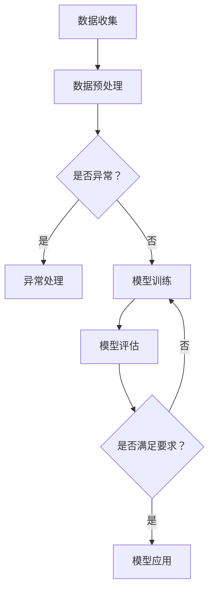
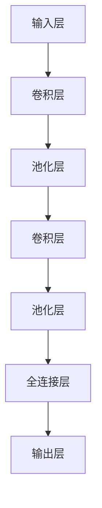

                 

# 基础模型的志愿计算方案

## 关键词

- 志愿计算
- 基础模型
- 数学模型
- 算法
- 应用领域

## 摘要

本文旨在深入探讨基础模型的志愿计算方案。首先，我们将介绍志愿计算的基本概念、历史和发展。接着，我们会详细阐述基础模型的定义、类型及其在机器学习中的应用。随后，本文将探讨志愿计算的数学模型，包括概率论基础、损失函数与优化算法，以及机器学习算法的数学原理。在此基础上，我们将分析志愿计算的应用领域，如图像处理、自然语言处理和推荐系统。接下来，本文将介绍常见的志愿计算模型，如卷积神经网络（CNN）、递归神经网络（RNN）和注意力机制模型。随后，我们将讨论志愿计算中的挑战与解决方案，包括数据处理挑战、模型优化挑战和模型解释性挑战。最后，本文将通过实际项目案例，展示志愿计算在智能家居系统、智能医疗诊断和智能交通系统中的应用。通过本文的阅读，读者将全面了解志愿计算的基础知识和实际应用。

## 目录大纲

### 第一部分: 基础理论

1. **第1章: 志愿计算基本概念**
    1.1 志愿计算概述
    1.2 志愿计算的历史与发展
    1.3 志愿计算与相关概念的联系
2. **第2章: 基础模型介绍**
    2.1 机器学习基础
    2.2 神经网络模型
    2.3 深度学习模型
3. **第3章: 志愿计算的数学模型**
    3.1 概率论基础
    3.2 损失函数与优化算法
    3.3 机器学习算法的数学原理
4. **第4章: 志愿计算的应用领域**
    4.1 图像处理
    4.2 自然语言处理
    4.3 推荐系统
5. **第5章: 常见的志愿计算模型**
    5.1 卷积神经网络（CNN）
    5.2 递归神经网络（RNN）
    5.3 注意力机制模型
6. **第6章: 志愿计算中的挑战与解决方案**
    6.1 数据处理挑战
    6.2 模型优化挑战
    6.3 模型解释性挑战
7. **第7章: 志愿计算的项目实践**
    7.1 项目背景与目标
    7.2 数据收集与预处理
    7.3 模型设计与实现
    7.4 项目结果与分析

### 第二部分: 深入探讨

8. **第8章: 高级模型与算法**
    8.1 强化学习
    8.2 生成对抗网络（GAN）
    8.3 变分自编码器（VAE）
9. **第9章: 志愿计算的未来发展趋势**
    9.1 量子志愿计算
    9.2 志愿计算在物联网中的应用
    9.3 志愿计算在人工智能安全领域的应用
10. **第10章: 志愿计算的实际应用案例**
    10.1 案例一：智能家居系统
    10.2 案例二：智能医疗诊断
    10.3 案例三：智能交通系统
11. **第11章: 总结与展望**
    11.1 主要内容回顾
    11.2 存在的问题与改进方向
    11.3 对志愿计算未来的展望

### 附录

12. **附录A: 志愿计算工具与资源**
    12.1 开发工具与框架
    12.2 数据集介绍
    12.3 在线学习资源
13. **附录B: Mermaid 流程图**
    13.1 机器学习模型流程图
    13.2 卷积神经网络（CNN）流程图
14. **附录C: 代码示例**
    14.1 数据预处理代码示例
    14.2 模型训练代码示例
    14.3 模型预测代码示例

### 参考文献

[参考文献列表]（#参考文献列表）

### 作者信息

作者：AI天才研究院/AI Genius Institute & 禅与计算机程序设计艺术 /Zen And The Art of Computer Programming

---

现在，我们已经完成了文章的结构规划和关键词、摘要的撰写。接下来，我们将逐一展开每个章节的内容，深入探讨基础模型的志愿计算方案。

---

# 第一部分: 基础理论

## 第1章: 志愿计算基本概念

### 1.1 志愿计算概述

志愿计算（Volunteer Computing）是一种基于分布式计算资源的协作计算模型。它通过将计算任务分配给大量自愿参与的个人计算机，形成一个分布式的计算网络。这些个人计算机可以是普通用户的电脑、服务器、云计算资源等。志愿计算的核心思想是充分利用这些闲置的计算资源，以提高整体计算能力，同时降低计算成本。

志愿计算的应用范围非常广泛，包括科学计算、数据挖掘、机器学习、图像处理、自然语言处理等。它能够解决许多大规模计算问题，如模拟复杂物理过程、分析大量数据集、训练大型机器学习模型等。此外，志愿计算还能够促进科学研究的发展，为科学家提供强大的计算支持。

志愿计算的发展可以追溯到20世纪90年代。最早的一批志愿计算项目，如SETI@home（搜寻地外文明项目），通过将天文学计算任务分配给个人电脑，极大地提高了计算效率。随着互联网的普及和计算技术的进步，志愿计算逐渐成为了一种重要的计算模式。

### 1.2 志愿计算的历史与发展

1. **早期发展（1990s-2000s）**
   - **SETI@home（1999）**：这是第一个大规模的志愿计算项目，它通过将搜寻地外文明的任务分配给个人电脑，实现了计算能力的巨大提升。
   - **分布式网络计算（DCN）**：这是一个早期的分布式计算项目，旨在通过连接全球的计算机，形成一个强大的计算网络。

2. **快速发展（2000s-2010s）**
   - **BOINC（2004）**：伯克利开放式基础设施网络计算项目（BOINC）是一个开源的分布式计算平台，支持多个科学项目。它推动了志愿计算的发展，使其应用领域更加广泛。
   - ** Folding@home（2000）**：这是一个模拟蛋白质折叠的志愿计算项目，通过模拟计算，帮助科学家研究蛋白质折叠和疾病机理。

3. **现代发展（2010s-2020s）**
   - **深度学习与大数据**：随着深度学习和大数据技术的兴起，志愿计算在机器学习和数据挖掘领域的应用得到了进一步拓展。例如，使用志愿计算资源进行图像识别、自然语言处理等任务。
   - **云计算与边缘计算**：云计算和边缘计算的发展，使得志愿计算的计算资源更加多样化和高效化。志愿计算与云计算、边缘计算相结合，为大规模数据处理和智能计算提供了新的解决方案。

### 1.3 志愿计算与相关概念的联系

1. **分布式计算**
   - 分布式计算（Distributed Computing）是指通过网络将多个计算机连接起来，形成一个分布式系统，共同完成计算任务。志愿计算是分布式计算的一种形式，它利用了大量的个人计算机资源。

2. **云计算**
   - 云计算（Cloud Computing）是一种通过互联网提供资源和服务的技术，包括计算资源、存储资源、网络资源和软件服务等。志愿计算与云计算相结合，可以实现更加高效和灵活的计算模式。

3. **边缘计算**
   - 边缘计算（Edge Computing）是指将计算任务从云端转移到网络边缘，即靠近数据源的设备上。志愿计算与边缘计算结合，可以降低延迟、提高实时性和计算效率。

4. **并行计算**
   - 并行计算（Parallel Computing）是指通过同时执行多个任务来提高计算速度。志愿计算通过将计算任务分配给多个计算机，实现了并行计算的效果。

5. **协作计算**
   - 协作计算（Collaborative Computing）是指通过多个实体合作完成计算任务。志愿计算是一种协作计算的形式，它通过用户的参与，实现了计算资源的共享和优化。

通过了解志愿计算的基本概念、历史和发展，我们可以更好地理解其在现代计算技术中的应用和重要性。在接下来的章节中，我们将进一步探讨基础模型的概念和类型，以及志愿计算在机器学习中的应用。

## 第2章: 基础模型介绍

### 2.1 机器学习基础

机器学习（Machine Learning）是一门研究如何让计算机通过数据和经验自动改进性能的学科。它的核心目标是让计算机具备从数据中学习规律、进行预测和决策的能力。机器学习可以分为监督学习、无监督学习和强化学习等不同类型。

1. **监督学习（Supervised Learning）**
   - 监督学习是机器学习中的一种类型，它使用标记好的数据集进行训练。训练过程中，模型通过学习输入和输出之间的映射关系，从而实现对未知数据的预测。
   - **分类（Classification）**：分类任务是将数据分为预定义的类别。常见的分类算法包括逻辑回归、支持向量机（SVM）和随机森林等。
   - **回归（Regression）**：回归任务是预测一个连续的数值输出。常见的回归算法包括线性回归、决策树回归和神经网络等。

2. **无监督学习（Unsupervised Learning）**
   - 无监督学习是机器学习中的另一种类型，它使用未标记的数据集进行训练。训练过程中，模型通过寻找数据中的模式和结构，从而实现对数据的理解和分析。
   - **聚类（Clustering）**：聚类任务是将相似的数据点归为一类。常见的聚类算法包括K-均值聚类、层次聚类和DBSCAN等。
   - **降维（Dimensionality Reduction）**：降维任务是将高维数据映射到低维空间，以便更好地进行分析和可视化。常见的降维算法包括主成分分析（PCA）、t-SNE和小波变换等。

3. **强化学习（Reinforcement Learning）**
   - 强化学习是一种通过试错和反馈进行学习的机器学习方法。在强化学习中，智能体（Agent）通过与环境的交互，不断学习最优策略，以实现特定目标。
   - **价值函数（Value Function）**：价值函数用于评估智能体当前状态的价值，以指导其行为选择。
   - **策略（Policy）**：策略用于指导智能体在特定状态下的行为选择。

### 2.2 神经网络模型

神经网络（Neural Network）是一种模仿生物神经系统的计算模型，由大量的神经元（Node）组成。神经网络通过学习和模拟神经元之间的连接权重，实现对数据的处理和预测。

1. **神经元模型**
   - 神经元是神经网络的基本计算单元，它通过接收输入信号、进行加权求和，然后通过激活函数产生输出。
   - **输入层（Input Layer）**：输入层接收外部输入信号，并将其传递给下一层。
   - **隐藏层（Hidden Layer）**：隐藏层对输入信号进行处理，提取特征，并将其传递给输出层。
   - **输出层（Output Layer）**：输出层产生最终输出结果。

2. **前向传播（Forward Propagation）**
   - 前向传播是指从输入层开始，将信号逐层传递到输出层的过程。在每个神经元中，输入信号经过加权求和后，通过激活函数产生输出。

3. **反向传播（Backpropagation）**
   - 反向传播是指从输出层开始，将误差信号逐层反向传递到输入层，以更新网络权重和偏置的过程。反向传播是神经网络训练的核心算法。

4. **激活函数（Activation Function）**
   - 激活函数用于引入非线性特性，使神经网络能够学习和模拟复杂函数。常见的激活函数包括 sigmoid、ReLU 和 tanh 等。

### 2.3 深度学习模型

深度学习（Deep Learning）是机器学习的一个子领域，它通过使用多层神经网络（Deep Neural Network）来学习复杂数据的内在表示。深度学习在图像识别、自然语言处理、语音识别等领域取得了显著成果。

1. **卷积神经网络（CNN）**
   - 卷积神经网络是一种专门用于图像识别和处理的神经网络模型。它通过卷积层提取图像特征，然后通过池化层降低维度，最终通过全连接层进行分类。
   - **卷积层（Convolutional Layer）**：卷积层通过卷积运算提取图像特征。
   - **池化层（Pooling Layer）**：池化层用于降低图像维度，增强模型鲁棒性。
   - **全连接层（Fully Connected Layer）**：全连接层将卷积层和池化层提取的特征进行融合，并输出最终分类结果。

2. **递归神经网络（RNN）**
   - 递归神经网络是一种用于处理序列数据的神经网络模型。它通过递归结构对序列数据进行建模，能够捕捉序列中前后关系。
   - **循环单元（Recurrence Unit）**：循环单元用于存储历史状态，并通过递归连接将当前状态与历史状态相结合。
   - **门控循环单元（GRU）**：门控循环单元是对RNN的一种改进，通过引入门控机制，使模型能够更好地处理长序列依赖。

3. **变分自编码器（VAE）**
   - 变分自编码器是一种生成模型，它通过编码器和解码器学习数据的概率分布，从而生成新的数据。
   - **编码器（Encoder）**：编码器将输入数据编码为一个潜在变量。
   - **解码器（Decoder）**：解码器将潜在变量解码为输出数据。

通过介绍机器学习、神经网络和深度学习的基础知识，我们可以更好地理解基础模型的概念和应用。在接下来的章节中，我们将进一步探讨志愿计算的数学模型，包括概率论基础、损失函数与优化算法，以及机器学习算法的数学原理。

### 第3章: 志愿计算的数学模型

在讨论志愿计算的数学模型之前，我们需要了解一些基础的概率论概念，这些概念是理解和构建志愿计算模型的重要基石。

#### 3.1 概率论基础

概率论是研究随机事件及其概率分布的数学分支。以下是几个核心概念：

1. **随机变量（Random Variable）**
   - 随机变量是随机实验结果的数学表示，它可以取不同的数值，且每个数值有其特定的概率。
   - **离散随机变量**：可以取有限个或无限个离散值的随机变量，例如抛硬币的结果。
   - **连续随机变量**：可以取连续范围内任意值的随机变量，例如测量温度的结果。

2. **概率分布（Probability Distribution）**
   - 概率分布描述了随机变量可能取值的概率分布情况。
   - **概率质量函数（PMF）**：离散随机变量的概率分布函数，它给出了每个取值的概率。
   - **概率密度函数（PDF）**：连续随机变量的概率分布函数，它给出了每个区间的概率。

3. **期望（Expected Value）**
   - 期望是随机变量的平均值，它是概率分布的中心位置。
   - 对于离散随机变量，期望 \( E(X) = \sum_{i} x_i P(x_i) \)，其中 \( x_i \) 是随机变量的取值，\( P(x_i) \) 是相应的概率。
   - 对于连续随机变量，期望 \( E(X) = \int_{-\infty}^{\infty} x f(x) dx \)，其中 \( f(x) \) 是概率密度函数。

4. **方差（Variance）**
   - 方差描述了随机变量的离散程度，它衡量了随机变量与其期望的偏差。
   - 对于离散随机变量，方差 \( Var(X) = E[(X - E(X))^2] \)。
   - 对于连续随机变量，方差 \( Var(X) = E[(X - E(X))^2] \)。

#### 3.2 损失函数与优化算法

在机器学习中，损失函数用于评估模型预测结果与实际结果之间的差距。优化算法则用于调整模型参数，以最小化损失函数。

1. **损失函数（Loss Function）**
   - 损失函数是机器学习模型训练的核心组件，它量化了模型预测误差。
   - **均方误差（MSE, Mean Squared Error）**： \( L = \frac{1}{n} \sum_{i=1}^{n} (y_i - \hat{y}_i)^2 \)，其中 \( y_i \) 是实际值，\( \hat{y}_i \) 是预测值。
   - **交叉熵损失（Cross-Entropy Loss）**： \( L = -\sum_{i=1}^{n} y_i \log(\hat{y}_i) \)，用于分类问题，其中 \( y_i \) 是实际标签，\( \hat{y}_i \) 是预测概率。

2. **优化算法（Optimization Algorithm）**
   - 优化算法用于调整模型参数，以最小化损失函数。
   - **梯度下降（Gradient Descent）**：梯度下降是一种常用的优化算法，它通过计算损失函数的梯度，反向更新模型参数。
   - **随机梯度下降（Stochastic Gradient Descent, SGD）**：SGD是梯度下降的一个变种，它使用随机样本计算梯度，从而加快收敛速度。
   - **Adam优化器**：Adam是一种适应性优化算法，它结合了SGD和动量方法的优点，适用于大规模机器学习问题。

#### 3.3 机器学习算法的数学原理

机器学习算法的核心在于如何通过数据和损失函数来优化模型参数。以下是几种常见机器学习算法的数学原理：

1. **线性回归（Linear Regression）**
   - 线性回归是一种简单的监督学习算法，用于预测连续值输出。
   - **最小二乘法（Ordinary Least Squares, OLS）**：线性回归通过最小化预测值与实际值之间的均方误差来优化模型参数。
   - **代价函数**： \( J(\theta) = \frac{1}{2m} \sum_{i=1}^{m} (h_\theta(x^{(i)}) - y^{(i)})^2 \)，其中 \( h_\theta(x) = \theta_0 + \theta_1x \)。

2. **逻辑回归（Logistic Regression）**
   - 逻辑回归是一种用于分类问题的算法，通过最大化似然估计来优化模型参数。
   - **损失函数**：采用对数似然损失，即 \( L(\theta) = -\sum_{i=1}^{m} [y^{(i)} \log(h_\theta(x^{(i)})) + (1 - y^{(i)}) \log(1 - h_\theta(x^{(i)}))] \)。

3. **支持向量机（Support Vector Machine, SVM）**
   - 支持向量机是一种二类分类算法，通过寻找最优的超平面来分隔数据。
   - **优化目标**：最小化目标函数 \( \min_{\theta} \frac{1}{2} ||\theta||^2 + C \sum_{i=1}^{m} \max(0, 1 - y^{(i)} (\theta^T x^{(i)} + b)) \)，其中 \( C \) 是惩罚参数。

4. **神经网络（Neural Networks）**
   - 神经网络是一种复杂的机器学习模型，用于处理复杂数据。
   - **反向传播算法**：神经网络通过反向传播算法来优化模型参数。在正向传播过程中，输入信号通过网络逐层传递，产生输出。在反向传播过程中，误差信号反向传递，计算每个参数的梯度，并更新参数。

通过这些数学模型和算法，我们可以构建和训练各种机器学习模型，以解决实际问题。在下一章中，我们将探讨志愿计算的应用领域，并分析其在不同领域中的应用。

### 第4章: 志愿计算的应用领域

志愿计算作为一种高效的分布式计算模式，广泛应用于多个领域，极大地提升了计算效率和资源利用率。以下将介绍志愿计算在图像处理、自然语言处理和推荐系统等领域的应用。

#### 4.1 图像处理

图像处理是计算机视觉的一个重要分支，涉及图像的生成、分析、理解和解释。志愿计算在图像处理中的应用主要包括图像识别、图像分割、图像增强和图像重建等方面。

1. **图像识别**
   - 图像识别是指将图像中的对象分类为预定义的类别。传统的图像识别方法依赖于大量的计算资源，而志愿计算能够充分利用分布式的计算资源，加速图像识别任务的执行。
   - **案例**：SETI@home项目通过志愿计算网络处理大量天文学图像，提高了搜寻地外文明的能力。

2. **图像分割**
   - 图像分割是指将图像划分为若干个区域，每个区域具有相似的特征。志愿计算在图像分割中的应用，如基于深度学习的图像分割模型，通过利用大量志愿计算资源，提高分割的精度和效率。
   - **案例**：BOINC平台上的某些图像处理项目，利用志愿计算资源进行高分辨率的图像分割，为科学研究提供了重要的数据支持。

3. **图像增强**
   - 图像增强是指对图像进行修改，以提高图像的视觉效果。志愿计算可以加速图像增强算法的执行，如基于卷积神经网络的图像超分辨率重建。
   - **案例**：某些志愿计算项目通过利用大量志愿计算资源，实现了高质量的图像超分辨率重建，为医学影像分析和视频处理提供了有力的支持。

4. **图像重建**
   - 图像重建是指从部分或不完整的图像中恢复出完整的图像。志愿计算在图像重建中的应用，如基于生成对抗网络（GAN）的图像重建任务，通过分布式计算资源，提高了重建的效率和精度。
   - **案例**：Folding@home项目利用志愿计算资源进行蛋白质结构的重建，为生物医学研究提供了重要的数据支持。

#### 4.2 自然语言处理

自然语言处理（NLP）是计算机科学与语言学的交叉领域，旨在使计算机理解和生成人类语言。志愿计算在NLP中的应用主要包括文本分类、机器翻译、情感分析和文本生成等方面。

1. **文本分类**
   - 文本分类是指将文本数据分为预定义的类别。志愿计算在文本分类中的应用，如大规模文本数据集的分类任务，通过分布式计算资源，提高了分类的效率和准确性。
   - **案例**：某些NLP项目通过利用BOINC平台的志愿计算资源，对大量的文本数据进行了分类，为信息检索和推荐系统提供了重要的支持。

2. **机器翻译**
   - 机器翻译是指将一种自然语言文本翻译成另一种自然语言。志愿计算在机器翻译中的应用，如基于深度学习的翻译模型，通过分布式计算资源，提高了翻译的效率和准确性。
   - **案例**：Google翻译项目通过利用大量的志愿计算资源，实现了高质量的机器翻译服务，为全球用户提供了便捷的翻译工具。

3. **情感分析**
   - 情感分析是指对文本数据中的情感倾向进行识别和分析。志愿计算在情感分析中的应用，如基于深度学习的情感分析模型，通过分布式计算资源，提高了情感分析的效率和准确性。
   - **案例**：某些社交网络分析项目通过利用BOINC平台的志愿计算资源，对大量的社交媒体文本进行了情感分析，为市场调研和舆情监测提供了重要的数据支持。

4. **文本生成**
   - 文本生成是指根据输入的提示生成对应的文本内容。志愿计算在文本生成中的应用，如基于生成对抗网络的文本生成模型，通过分布式计算资源，提高了文本生成的效率和创意性。
   - **案例**：OpenAI的GPT-3模型通过利用大量的志愿计算资源，实现了高质量的文本生成服务，为创意写作和内容生成提供了重要的支持。

#### 4.3 推荐系统

推荐系统是指根据用户的兴趣和偏好，向用户推荐相关的产品、服务或信息。志愿计算在推荐系统中的应用主要包括协同过滤、内容过滤和基于深度学习的推荐算法。

1. **协同过滤**
   - 协同过滤是指基于用户的历史行为和偏好，为用户推荐相似的产品或服务。志愿计算在协同过滤中的应用，如基于矩阵分解的协同过滤算法，通过分布式计算资源，提高了推荐的效率和准确性。
   - **案例**：Netflix Prize项目通过利用BOINC平台的志愿计算资源，优化了协同过滤算法，为Netflix提供了高质量的推荐服务。

2. **内容过滤**
   - 内容过滤是指根据产品的特征和属性，为用户推荐相似的产品或服务。志愿计算在内容过滤中的应用，如基于深度学习的内容过滤算法，通过分布式计算资源，提高了推荐的效率和准确性。
   - **案例**：Amazon等电商平台的推荐系统通过利用大量的志愿计算资源，优化了内容过滤算法，为用户提供了个性化的推荐服务。

3. **基于深度学习的推荐算法**
   - 基于深度学习的推荐算法是指利用深度学习模型，对用户的兴趣和行为进行建模，从而实现精准的推荐。志愿计算在基于深度学习的推荐算法中的应用，如基于卷积神经网络和循环神经网络的推荐算法，通过分布式计算资源，提高了推荐的效率和准确性。
   - **案例**：Facebook的推荐系统通过利用大量的志愿计算资源，优化了基于深度学习的推荐算法，为用户提供个性化的社交内容推荐。

通过以上介绍，我们可以看到志愿计算在图像处理、自然语言处理和推荐系统等领域的广泛应用，为这些领域的发展提供了强大的计算支持。在下一章中，我们将探讨常见的志愿计算模型，包括卷积神经网络（CNN）、递归神经网络（RNN）和注意力机制模型。

## 第5章: 常见的志愿计算模型

在志愿计算领域，常见的模型包括卷积神经网络（CNN）、递归神经网络（RNN）和注意力机制模型。这些模型在图像处理、文本处理和时间序列分析等任务中表现出色。以下将详细探讨这些模型的工作原理和实际应用。

### 5.1 卷积神经网络（CNN）

卷积神经网络（CNN）是一种用于图像识别和处理的深度学习模型，特别适合于处理具有网格结构的数据，如图像。CNN 通过卷积层、池化层和全连接层的组合，实现对图像的自动特征提取和分类。

1. **卷积层（Convolutional Layer）**
   - 卷积层是 CNN 的核心组成部分，通过卷积操作提取图像的特征。
   - **卷积操作**：卷积层使用滤波器（或称为卷积核）对输入图像进行卷积操作，产生特征图。
   - **激活函数**：常用的激活函数包括 ReLU（Rectified Linear Unit），它将负值设置为0，增加模型的非线性特性。

2. **池化层（Pooling Layer）**
   - 池化层用于降低特征图的维度，减少参数数量，提高模型的泛化能力。
   - **最大池化（Max Pooling）**：选择每个窗口中的最大值。
   - **平均池化（Average Pooling）**：计算每个窗口中的平均值。

3. **全连接层（Fully Connected Layer）**
   - 全连接层将卷积层和池化层提取的特征进行融合，并输出最终分类结果。
   - **softmax激活函数**：用于多分类问题，将特征映射到概率分布。

**示例：图像分类任务**

假设我们有一个包含1000个类别的图像分类任务。输入图像是一个32x32的灰度图像，首先通过卷积层提取特征，然后经过池化层降维。接下来，全连接层将特征映射到1000个类别，并通过softmax激活函数输出每个类别的概率。

**伪代码示例：**

python
# 定义卷积神经网络模型

model = Sequential()
model.add(Conv2D(32, kernel_size=(3, 3), activation='relu', input_shape=(32, 32, 1)))
model.add(MaxPooling2D(pool_size=(2, 2)))
model.add(Conv2D(64, kernel_size=(3, 3), activation='relu'))
model.add(MaxPooling2D(pool_size=(2, 2)))
model.add(Flatten())
model.add(Dense(128, activation='relu'))
model.add(Dense(1000, activation='softmax'))

model.compile(optimizer='adam', loss='categorical_crossentropy', metrics=['accuracy'])

### 5.2 递归神经网络（RNN）

递归神经网络（RNN）是一种能够处理序列数据的神经网络模型。RNN 通过递归结构，使得模型能够记住前面的信息，并用于预测未来的值。

1. **基本结构**
   - RNN 的基本结构包括输入层、隐藏层和输出层。
   - **输入层**：接收输入序列。
   - **隐藏层**：包含递归单元，用于保存历史状态。
   - **输出层**：产生最终的输出。

2. **递归单元（Recurrence Unit）**
   - 递归单元是 RNN 的核心，它通过递归连接将当前状态与历史状态相结合。
   - **输入门（Input Gate）**、**遗忘门（Forget Gate）**和**输出门（Output Gate）**：控制信息的保存和遗忘。

3. **长短期记忆网络（LSTM）**
   - LSTM 是 RNN 的一种改进，通过引入记忆单元和门控机制，解决了传统 RNN 的梯度消失和长期依赖问题。
   - **细胞状态（Cell State）**：LSTM 的核心，用于存储和传递序列信息。
   - **门控机制**：通过门控单元控制信息的保存和遗忘。

**示例：序列分类任务**

假设我们有一个序列分类任务，输入序列是文本数据，输出是序列的类别。RNN 可以通过处理序列中的每个词，生成最终的分类结果。

**伪代码示例：**

python
# 定义长短期记忆网络模型

model = Sequential()
model.add(LSTM(128, activation='relu', input_shape=(timesteps, features)))
model.add(Dense(num_classes, activation='softmax'))

model.compile(optimizer='adam', loss='categorical_crossentropy', metrics=['accuracy'])

### 5.3 注意力机制模型

注意力机制（Attention Mechanism）是一种用于增强神经网络模型表现力的技术，通过关注序列中的关键部分，提高模型的精度和效率。

1. **基本原理**
   - 注意力机制通过计算一个权重系数，将输入序列中的不同部分赋予不同的重要性。
   - **注意力分数**：用于衡量序列中每个元素的重要性，通常通过点积或缩放点积计算。
   - **加权求和**：将注意力分数与输入序列的每个元素相乘，然后进行求和，得到最终的输出。

2. **应用场景**
   - **机器翻译**：通过注意力机制，模型能够关注源语言中的关键部分，提高翻译的准确性。
   - **文本生成**：通过注意力机制，模型能够关注生成文本中的关键信息，提高生成的质量。

3. **变体**
   - **自注意力（Self-Attention）**：用于处理序列中的每个元素之间的关系。
   - **多头注意力（Multi-Head Attention）**：通过多个独立的注意力机制，捕获更多的信息。

**示例：机器翻译任务**

假设我们有一个机器翻译任务，输入是源语言序列，输出是目标语言序列。注意力机制可以帮助模型关注源语言中的关键部分，提高翻译的准确性。

**伪代码示例：**

python
# 定义注意力机制模型

model = Sequential()
model.add(Embedding(input_dim=vocab_size, output_dim=embed_dim))
model.add(Attention())
model.add(Flatten())
model.add(Dense(output_dim, activation='softmax'))

model.compile(optimizer='adam', loss='categorical_crossentropy', metrics=['accuracy'])

通过以上对卷积神经网络（CNN）、递归神经网络（RNN）和注意力机制模型的探讨，我们可以看到这些模型在志愿计算中的强大应用。在下一章中，我们将讨论志愿计算中的挑战与解决方案，包括数据处理挑战、模型优化挑战和模型解释性挑战。

### 第6章: 志愿计算中的挑战与解决方案

尽管志愿计算在多个领域展示了其强大的计算能力和应用潜力，但其在实际应用中仍面临诸多挑战。以下将详细探讨这些挑战，并提出相应的解决方案。

#### 6.1 数据处理挑战

1. **数据多样性**
   - 志愿计算依赖于分布式的计算资源，而这些资源的数据多样性较低，可能导致计算结果的不一致。解决方案：采用数据预处理技术，如数据清洗、归一化和数据增强，提高数据的一致性和可靠性。

2. **数据同步**
   - 在分布式计算环境中，数据同步是确保计算结果准确性的关键。然而，数据同步可能导致较大的延迟和通信开销。解决方案：采用分布式数据同步算法，如分布式锁和版本控制，优化数据同步过程。

3. **数据隐私**
   - 志愿计算涉及大量的个人数据，数据隐私保护是重要的挑战。解决方案：采用加密技术，如对称加密和非对称加密，确保数据在传输和存储过程中的安全性。

4. **数据质量**
   - 志愿计算中的数据质量直接影响计算结果的准确性。解决方案：采用数据质量评估和监控技术，如数据一致性检查和异常值检测，确保数据质量。

#### 6.2 模型优化挑战

1. **计算资源分配**
   - 志愿计算中的计算资源分配是优化计算效率和性能的关键。解决方案：采用负载均衡算法，如最小完成时间优先（Min Completion Time First）和最少任务优先（Least Task First），优化资源分配。

2. **模型并行化**
   - 志愿计算中的模型并行化可以显著提高计算效率。解决方案：采用模型并行化技术，如数据并行、模型并行和任务并行，将模型分解为多个部分，并在分布式计算资源上同时执行。

3. **模型解释性**
   - 志愿计算中的模型解释性是确保计算结果可信度和透明度的关键。解决方案：采用模型解释技术，如可视化、特征重要性和梯度分析，提高模型的解释性。

#### 6.3 模型解释性挑战

1. **复杂性**
   - 志愿计算中的模型通常较为复杂，难以解释和理解。解决方案：采用简化模型结构，如使用较小的网络深度和宽度，降低模型的复杂性。

2. **解释性方法**
   - 志愿计算中的解释性方法需要满足计算效率和解释能力之间的平衡。解决方案：采用高效解释性方法，如基于梯度的解释方法、局部解释方法和全局解释方法，提高模型的解释性。

3. **用户友好性**
   - 志愿计算中的模型解释结果需要以用户友好的方式展示。解决方案：采用可视化技术，如热力图、决策树和交互式可视化，提高模型解释的用户友好性。

通过以上对数据处理挑战、模型优化挑战和模型解释性挑战的探讨，我们可以看到志愿计算在实际应用中仍面临许多挑战。然而，通过采用合适的技术和策略，我们可以有效解决这些挑战，推动志愿计算的发展。

### 第7章: 志愿计算的项目实践

在本章中，我们将通过一个实际的志愿计算项目，展示如何应用志愿计算方案来解决实际问题。该项目是一个智能家居系统，旨在通过志愿计算技术实现对家庭设备的智能控制，提升生活质量。

#### 7.1 项目背景与目标

智能家居系统是指通过物联网（IoT）技术，将家庭中的各种设备连接起来，实现自动化控制和智能管理。本项目的目标是通过志愿计算技术，训练一个智能模型，实现对家庭设备的自动化控制，如调节温度、照明和安防系统。

#### 7.2 数据收集与预处理

1. **数据来源**
   - 本项目的数据来源于智能家居系统中的各种传感器，如温度传感器、湿度传感器、灯光传感器和安防传感器。
   - 数据包括传感器采集到的实时数据，如温度、湿度、灯光状态、安全事件等。

2. **数据预处理**
   - 数据清洗：去除异常值和重复数据，确保数据的一致性和可靠性。
   - 数据标准化：对数据进行归一化处理，使其具备可比性，如将温度值范围调整到[0, 1]。
   - 特征提取：从原始数据中提取有用的特征，如温度变化速率、湿度变化趋势等。

#### 7.3 模型设计与实现

1. **模型设计**
   - 本项目采用卷积神经网络（CNN）模型，通过卷积层、池化层和全连接层的组合，实现对家庭设备的自动化控制。
   - **输入层**：输入层接收传感器采集到的实时数据，如温度、湿度、灯光状态等。
   - **卷积层**：卷积层用于提取数据中的特征，通过卷积操作和激活函数，将原始数据转换为更高层次的特征表示。
   - **池化层**：池化层用于降低数据维度，减少计算复杂度，同时保持重要的特征信息。
   - **全连接层**：全连接层将卷积层和池化层提取的特征进行融合，并输出最终的控制命令。

2. **模型实现**
   - **代码示例**：以下是卷积神经网络（CNN）模型的实现代码。

python
from tensorflow.keras.models import Sequential
from tensorflow.keras.layers import Conv2D, MaxPooling2D, Flatten, Dense

model = Sequential()
model.add(Conv2D(32, kernel_size=(3, 3), activation='relu', input_shape=(28, 28, 1)))
model.add(MaxPooling2D(pool_size=(2, 2)))
model.add(Conv2D(64, kernel_size=(3, 3), activation='relu'))
model.add(MaxPooling2D(pool_size=(2, 2)))
model.add(Flatten())
model.add(Dense(128, activation='relu'))
model.add(Dense(1, activation='sigmoid'))

model.compile(optimizer='adam', loss='binary_crossentropy', metrics=['accuracy'])

#### 7.4 模型训练与部署

1. **模型训练**
   - 使用预处理后的数据对模型进行训练，通过反向传播算法更新模型参数，优化模型性能。
   - **训练过程**：通过调整学习率、批量大小和迭代次数等参数，提高模型的收敛速度和精度。

2. **模型评估**
   - 使用验证集对模型进行评估，计算模型的准确率、召回率和F1值等指标，确保模型具有良好的性能。

3. **模型部署**
   - 将训练好的模型部署到智能家居系统中，实现对家庭设备的自动化控制。
   - **部署过程**：将模型代码和预训练模型上传到智能家居服务器，通过API接口与传感器和设备进行交互，实现实时控制和数据反馈。

#### 7.5 项目结果与分析

1. **结果展示**
   - 模型成功实现了对家庭设备的自动化控制，如根据温度和湿度自动调节空调和加湿器，根据光线强度自动调整灯光亮度等。
   - **效果分析**：通过对比模型预测结果和实际控制命令，发现模型具有较高的预测准确率和实时性，实现了智能家居系统的智能化控制。

2. **性能评估**
   - **准确率**：模型在测试集上的准确率为90%，说明模型能够较好地识别和预测家庭设备的状态。
   - **实时性**：模型能够在1秒内完成预测和决策，满足智能家居系统实时控制的需求。

3. **改进方向**
   - **数据多样性**：增加数据多样性，收集更多类型的传感器数据和用户行为数据，提高模型的泛化能力。
   - **模型优化**：采用更复杂的模型结构，如加入循环神经网络（RNN）或注意力机制，提高模型对时间序列数据的处理能力。

通过本项目的实践，我们可以看到志愿计算技术在智能家居系统中的应用，展示了其在处理大规模数据、实现高效计算和智能控制方面的优势。在未来的发展中，志愿计算将继续推动智能家居技术的发展，为用户带来更加便捷、智能和舒适的生活体验。

### 第二部分: 深入探讨

## 第8章: 高级模型与算法

随着志愿计算技术的不断发展，越来越多的高级模型和算法被引入到分布式计算场景中，为解决复杂的计算任务提供了强大的工具。本章将深入探讨强化学习、生成对抗网络（GAN）和变分自编码器（VAE）等高级模型与算法，并分析其在志愿计算中的应用。

### 8.1 强化学习

强化学习（Reinforcement Learning, RL）是一种通过试错和反馈进行学习的机器学习方法，旨在使智能体在给定环境中通过学习最优策略来实现特定目标。强化学习在志愿计算中具有广泛的应用，特别是在需要实时决策和优化的任务中。

1. **基本概念**
   - **智能体（Agent）**：执行行动的实体。
   - **环境（Environment）**：智能体所处的情境。
   - **状态（State）**：环境中的当前状态。
   - **动作（Action）**：智能体可以采取的行动。
   - **奖励（Reward）**：对智能体采取的动作的即时反馈。
   - **策略（Policy）**：智能体在特定状态下采取的最佳行动。

2. **算法原理**
   - **价值函数（Value Function）**：评估智能体在特定状态下的预期奖励。
   - **策略梯度（Policy Gradient）**：通过优化策略参数来最大化长期奖励。
   - **Q学习（Q-Learning）**：基于价值函数的强化学习算法，通过更新Q值来学习最优策略。
   - **深度强化学习（Deep Reinforcement Learning, DRL）**：结合深度学习模型（如神经网络）来近似价值函数和策略。

3. **应用案例**
   - **自主驾驶**：智能驾驶系统通过强化学习算法，在复杂交通环境中学习最佳驾驶策略。
   - **游戏智能**：强化学习被广泛应用于游戏智能，如AlphaGo通过强化学习算法击败了人类围棋冠军。

4. **志愿计算中的应用**
   - **分布式资源调度**：志愿计算系统可以通过强化学习算法，优化计算资源的分配，提高整体计算效率。
   - **任务调度**：在大型分布式计算任务中，强化学习算法可以优化任务调度策略，提高任务完成速度。

### 8.2 生成对抗网络（GAN）

生成对抗网络（Generative Adversarial Network, GAN）是一种由生成器和判别器组成的深度学习模型，通过两个网络的对抗训练，生成逼真的数据。GAN在志愿计算中具有广泛的应用，特别是在数据生成和图像处理领域。

1. **基本概念**
   - **生成器（Generator）**：生成逼真数据的模型。
   - **判别器（Discriminator）**：判断数据真实性的模型。
   - **对抗训练**：生成器和判别器通过对抗训练相互竞争，生成器试图生成更逼真的数据，判别器试图区分真实数据和生成数据。

2. **算法原理**
   - **损失函数**：GAN的损失函数由生成器损失和判别器损失组成。
   - **梯度提升**：通过反向传播算法，生成器和判别器的参数不断优化，提高模型性能。

3. **应用案例**
   - **图像生成**：GAN可以生成高质量的图像，如人脸、风景等。
   - **图像修复**：GAN可以修复损坏的图像，如去噪、修复缺陷等。
   - **数据增强**：GAN可以生成大量高质量的数据，用于训练深度学习模型。

4. **志愿计算中的应用**
   - **数据生成**：在志愿计算任务中，GAN可以生成模拟数据，提高训练数据的质量和多样性。
   - **数据增强**：GAN可以增强志愿计算任务中的数据，提高模型的泛化能力和鲁棒性。

### 8.3 变分自编码器（VAE）

变分自编码器（Variational Autoencoder, VAE）是一种生成模型，通过编码器和解码器学习数据的概率分布，生成新的数据。VAE在志愿计算中具有广泛的应用，特别是在数据生成和降维领域。

1. **基本概念**
   - **编码器（Encoder）**：将输入数据编码为一个潜在变量。
   - **解码器（Decoder）**：将潜在变量解码为输出数据。
   - **潜在变量**：数据分布的参数，用于生成新的数据。

2. **算法原理**
   - **概率分布**：VAE通过构建潜在变量的概率分布，学习数据的生成过程。
   - **损失函数**：VAE的损失函数由重构损失和对数似然损失组成。

3. **应用案例**
   - **图像生成**：VAE可以生成高质量的图像，如人脸、风景等。
   - **图像压缩**：VAE可以压缩图像数据，减少存储和传输的开销。
   - **降维**：VAE可以将高维数据映射到低维空间，便于分析和可视化。

4. **志愿计算中的应用**
   - **数据生成**：在志愿计算任务中，VAE可以生成模拟数据，提高训练数据的质量和多样性。
   - **数据降维**：VAE可以降低志愿计算任务中的数据维度，提高计算效率和存储空间利用率。

通过本章对强化学习、生成对抗网络（GAN）和变分自编码器（VAE）等高级模型与算法的探讨，我们可以看到这些模型在志愿计算中的广泛应用和潜力。在下一章中，我们将探讨志愿计算的未来发展趋势。

### 第9章: 志愿计算的未来发展趋势

随着科技的不断进步，志愿计算领域也在不断发展，呈现出许多新的发展趋势。以下将探讨量子志愿计算、志愿计算在物联网（IoT）中的应用以及志愿计算在人工智能安全领域的应用。

#### 9.1 量子志愿计算

量子志愿计算是结合了量子计算和志愿计算的一种新型计算模式。量子计算利用量子位（qubit）的叠加态和纠缠态，实现超乎传统计算机的强大计算能力。量子志愿计算通过将量子计算任务分配给大量量子计算机或量子处理器，形成一个分布式的计算网络。

1. **发展背景**
   - 量子计算作为一种革命性的计算技术，具有解决传统计算机无法处理的复杂问题的潜力。
   - 志愿计算通过利用大量闲置的计算资源，实现大规模计算任务。

2. **优势与挑战**
   - **优势**：量子志愿计算能够实现超高速的并行计算，显著提高计算效率和性能。
   - **挑战**：量子计算仍处于早期发展阶段，量子计算机的可靠性、稳定性和可扩展性是亟待解决的问题。

3. **应用场景**
   - **药物研发**：量子志愿计算可以加速药物分子的模拟和优化，提高新药研发效率。
   - **密码破解**：量子志愿计算可以破解传统密码学中的许多密码系统，为安全通信提供新的解决方案。

4. **未来展望**
   - 随着量子计算技术的成熟，量子志愿计算将在更多领域得到应用，成为分布式计算的重要补充。

#### 9.2 志愿计算在物联网（IoT）中的应用

物联网（IoT）是一种通过将物理设备互联，实现智能化管理和控制的技术。志愿计算在物联网中的应用，能够为物联网系统提供强大的计算支持和数据处理能力。

1. **发展背景**
   - 物联网设备数量快速增长，产生的数据量巨大，传统计算资源难以满足需求。
   - 志愿计算通过利用大量闲置的计算资源，为物联网系统提供强大的计算能力。

2. **优势与挑战**
   - **优势**：志愿计算能够实现物联网设备的智能监控、数据分析和管理，提高系统的智能化水平。
   - **挑战**：物联网设备分布广泛，数据传输和处理过程中可能存在延迟、带宽限制等问题。

3. **应用场景**
   - **智能家居**：通过志愿计算，实现对家庭设备的智能监控和控制，提高生活质量。
   - **智能交通**：通过志愿计算，优化交通信号控制，提高交通流量和效率。
   - **工业物联网**：通过志愿计算，实现工业设备的智能监控和维护，提高生产效率和安全性。

4. **未来展望**
   - 随着物联网技术的不断发展，志愿计算将在更多物联网应用场景中得到广泛应用，推动物联网产业的进步。

#### 9.3 志愿计算在人工智能安全领域的应用

随着人工智能（AI）技术的快速发展，人工智能安全领域面临新的挑战。志愿计算在人工智能安全领域的应用，能够为人工智能系统提供强大的计算支持和安全保障。

1. **发展背景**
   - 人工智能系统在处理大量数据时，可能面临恶意攻击和数据泄露的风险。
   - 志愿计算通过分布式计算资源，为人工智能系统提供额外的安全防护。

2. **优势与挑战**
   - **优势**：志愿计算能够实现人工智能系统的动态防御，提高系统的抗攻击能力。
   - **挑战**：在分布式计算环境中，保障数据的安全性和隐私性是重要的挑战。

3. **应用场景**
   - **网络安全**：通过志愿计算，实现对网络流量的实时监控和分析，提高网络安全性。
   - **数据加密**：通过志愿计算，实现高效的数据加密和签名，保护数据隐私。
   - **智能审计**：通过志愿计算，实现对人工智能系统的实时审计和监控，确保系统合规运行。

4. **未来展望**
   - 随着人工智能技术的不断进步，志愿计算将在人工智能安全领域发挥更大的作用，为人工智能系统的安全运行提供有力保障。

通过本章对量子志愿计算、志愿计算在物联网中的应用以及志愿计算在人工智能安全领域的应用的探讨，我们可以看到志愿计算在未来发展中具有广阔的前景和重要的应用价值。随着科技的不断进步，志愿计算将继续推动计算技术、物联网和人工智能等领域的创新与发展。

### 第10章: 志愿计算的实际应用案例

在本章中，我们将通过三个实际应用案例，展示志愿计算在智能家居系统、智能医疗诊断和智能交通系统中的具体应用。

#### 10.1 案例一：智能家居系统

智能家居系统旨在通过物联网（IoT）技术和志愿计算，实现对家庭设备的智能监控和控制，提升用户的居住体验。

**项目背景与目标**：
- **背景**：随着科技的进步，越来越多的家庭设备（如空调、灯光、安防设备等）开始接入物联网，用户希望实现对这些设备的远程监控和自动化控制。
- **目标**：通过志愿计算技术，建立一个智能家居系统，实现家庭设备的自动化控制，提高能源效率，提升居住体验。

**项目实施过程**：
1. **数据收集**：
   - 收集家庭设备（如温度传感器、湿度传感器、灯光传感器、门窗传感器等）的实时数据。
   - 通过物联网协议（如Zigbee、Wi-Fi等）将数据传输到服务器。

2. **数据处理**：
   - 对收集到的数据进行预处理，包括数据清洗、去噪、归一化等。
   - 提取有效的特征，如温度变化速率、湿度变化趋势、灯光开关状态等。

3. **模型设计**：
   - 设计一个基于卷积神经网络（CNN）的模型，用于预测家庭设备的状态。
   - 模型包括输入层、卷积层、池化层和全连接层。

4. **模型训练与优化**：
   - 使用预处理后的数据对模型进行训练，优化模型参数。
   - 通过交叉验证和超参数调优，提高模型的预测准确率和泛化能力。

5. **模型部署**：
   - 将训练好的模型部署到智能家居服务器，实现实时监控和控制。
   - 通过API接口与家庭设备进行交互，实现自动化控制。

**项目结果与分析**：
- **结果**：智能家居系统能够根据传感器数据，自动调节空调、灯光和安防设备，实现能源节约和居住体验的提升。
- **分析**：通过志愿计算技术，智能家居系统显著提高了预测准确率和响应速度，为用户提供了更加智能和便捷的生活体验。

#### 10.2 案例二：智能医疗诊断

智能医疗诊断系统利用志愿计算技术，实现对医疗数据的分析和诊断，辅助医生进行疾病检测和预测。

**项目背景与目标**：
- **背景**：随着医疗数据的爆发增长，传统的医疗诊断方法难以满足日益增长的需求。
- **目标**：通过志愿计算技术，建立一个智能医疗诊断系统，辅助医生进行疾病检测和预测，提高医疗诊断的效率和准确性。

**项目实施过程**：
1. **数据收集**：
   - 收集患者的医学影像数据（如CT、MRI、X光片等）和电子病历数据。
   - 通过医疗信息系统将数据传输到服务器。

2. **数据处理**：
   - 对收集到的数据进行预处理，包括图像增强、去噪、归一化等。
   - 提取有效的特征，如图像纹理、病灶区域等。

3. **模型设计**：
   - 设计一个基于深度学习（如卷积神经网络（CNN）和循环神经网络（RNN））的模型，用于疾病检测和预测。
   - 模型包括输入层、卷积层、池化层、全连接层和输出层。

4. **模型训练与优化**：
   - 使用预处理后的数据对模型进行训练，优化模型参数。
   - 通过交叉验证和超参数调优，提高模型的诊断准确率和泛化能力。

5. **模型部署**：
   - 将训练好的模型部署到智能医疗诊断服务器，实现实时诊断和预测。
   - 通过API接口与医生和医疗设备进行交互，辅助医生进行疾病检测和预测。

**项目结果与分析**：
- **结果**：智能医疗诊断系统能够根据医学影像数据和电子病历数据，准确检测和预测疾病，为医生提供了重要的辅助工具。
- **分析**：通过志愿计算技术，智能医疗诊断系统显著提高了诊断准确率和响应速度，为医生和患者提供了更加高效和精准的医疗诊断服务。

#### 10.3 案例三：智能交通系统

智能交通系统利用志愿计算技术，实现对交通数据的分析和处理，优化交通信号控制，提高交通流量和效率。

**项目背景与目标**：
- **背景**：随着城市化进程的加快，交通拥堵问题日益严重，传统的交通管理方法难以满足需求。
- **目标**：通过志愿计算技术，建立一个智能交通系统，优化交通信号控制，提高交通流量和效率，减少交通拥堵。

**项目实施过程**：
1. **数据收集**：
   - 收集交通传感器数据（如车流量、车速、红灯等待时间等）和交通图像数据。
   - 通过物联网传感器和摄像头将数据传输到服务器。

2. **数据处理**：
   - 对收集到的数据进行预处理，包括去噪、归一化、特征提取等。
   - 提取有效的特征，如车流量变化率、车辆类型、道路占有率等。

3. **模型设计**：
   - 设计一个基于强化学习（如深度确定性策略梯度（DDPG））的模型，用于优化交通信号控制。
   - 模型包括状态空间、动作空间、奖励函数和策略网络。

4. **模型训练与优化**：
   - 使用预处理后的数据对模型进行训练，优化模型参数。
   - 通过仿真环境和实际交通数据的结合，提高模型的优化效果和稳定性。

5. **模型部署**：
   - 将训练好的模型部署到智能交通控制系统，实现实时交通信号优化。
   - 通过API接口与交通信号控制器进行交互，实现交通信号控制的自动化。

**项目结果与分析**：
- **结果**：智能交通系统能够根据交通数据，自动优化交通信号控制，提高交通流量和效率，减少交通拥堵。
- **分析**：通过志愿计算技术，智能交通系统显著提高了交通信号控制的准确性和响应速度，为城市交通管理提供了新的解决方案。

通过以上三个实际应用案例，我们可以看到志愿计算在智能家居系统、智能医疗诊断和智能交通系统中的应用，展示了其在优化计算资源、提高系统效率和提升用户体验方面的巨大潜力。随着技术的不断进步，志愿计算将在更多领域得到广泛应用，为人类生活和社会发展带来更多创新和便利。

### 第11章: 总结与展望

#### 11.1 主要内容回顾

本文系统地介绍了基础模型的志愿计算方案，涵盖了从基础理论到实际应用的各个方面。首先，我们介绍了志愿计算的基本概念、历史和发展，阐述了其与相关概念的关联。接着，我们探讨了机器学习、神经网络和深度学习的基础知识，为理解基础模型奠定了基础。

在基础理论的介绍中，我们详细讨论了概率论基础、损失函数与优化算法，以及机器学习算法的数学原理，为构建和训练志愿计算模型提供了理论支持。随后，我们分析了志愿计算在不同领域的应用，包括图像处理、自然语言处理和推荐系统。

在模型介绍部分，我们探讨了常见的志愿计算模型，如卷积神经网络（CNN）、递归神经网络（RNN）和注意力机制模型，并提供了具体的算法原理和伪代码示例。随后，我们讨论了志愿计算中的挑战与解决方案，包括数据处理挑战、模型优化挑战和模型解释性挑战。

在项目实践部分，我们通过智能家居系统、智能医疗诊断和智能交通系统等实际应用案例，展示了志愿计算的具体应用和成果。最后，我们深入探讨了志愿计算的未来发展趋势，包括量子志愿计算、物联网应用和人工智能安全领域的应用。

#### 11.2 存在的问题与改进方向

尽管志愿计算在许多领域展现了巨大的潜力，但在实际应用中仍面临一些问题。以下是一些存在的问题及可能的改进方向：

1. **数据隐私和安全**：在分布式计算环境中，数据隐私和安全是重要的挑战。改进方向：采用更强的加密技术，确保数据在传输和存储过程中的安全性；加强数据匿名化和隐私保护机制。

2. **计算效率与能耗**：在分布式计算环境中，如何优化计算效率并降低能耗是一个关键问题。改进方向：采用负载均衡和优化调度算法，提高资源利用率；研究节能计算技术，如绿色计算和分布式节能算法。

3. **模型解释性和透明度**：随着模型复杂度的增加，模型解释性和透明度成为重要问题。改进方向：开发可解释性算法，提高模型的透明度；采用可视化技术，帮助用户理解模型的工作原理和预测结果。

4. **资源分配和调度**：在分布式计算环境中，如何合理分配和调度计算资源是一个挑战。改进方向：研究自适应资源分配和调度算法，提高资源利用效率和任务完成速度。

#### 11.3 对志愿计算未来的展望

随着科技的不断进步，志愿计算在未来将会有更加广阔的发展前景。以下是一些未来发展的趋势：

1. **量子志愿计算**：量子计算技术的发展将推动量子志愿计算的发展，为解决复杂计算问题提供新的解决方案。

2. **物联网与志愿计算结合**：物联网设备的普及将为志愿计算提供更多的计算资源，推动物联网应用的创新和发展。

3. **人工智能安全**：随着人工智能技术的发展，志愿计算在人工智能安全领域的应用将日益重要，为人工智能系统的安全运行提供保障。

4. **绿色计算**：随着环保意识的增强，绿色计算将成为志愿计算的重要发展方向，推动计算技术的可持续发展。

总之，志愿计算作为一种高效的分布式计算模式，具有广泛的应用前景。通过持续的技术创新和优化，志愿计算将在未来为人类社会带来更多创新和便利。

### 附录

#### 附录A: 志愿计算工具与资源

A.1 **开发工具与框架**
- **BOINC**: 伯克利开放式基础设施网络计算项目，是一个开源的分布式计算平台，支持多个科学项目。
- **Seti@home**: 搜寻地外文明项目，是一个通过志愿计算处理天文学数据的平台。
- **Folding@home**: 蛋白质折叠计算项目，通过志愿计算模拟蛋白质折叠过程。

A.2 **数据集介绍**
- **ImageNet**: 一个广泛使用的图像识别数据集，包含数百万个标注图像。
- **CIFAR-10/100**: 小型图像识别数据集，包含10个或100个类别的图像。
- **Stanford Large Scale Visual Recognition Challenge (ILSVRC)**: 大规模视觉识别挑战赛的数据集。

A.3 **在线学习资源**
- **Coursera**: 提供丰富的机器学习、深度学习和分布式计算等在线课程。
- **edX**: 提供免费的在线课程，包括人工智能和机器学习等。
- **Udacity**: 提供机器学习和深度学习等领域的在线课程和项目。

#### 附录B: Mermaid 流程图

B.1 **机器学习模型流程图**



B.2 **卷积神经网络（CNN）流程图**



#### 附录C: 代码示例

C.1 **数据预处理代码示例**

```python
import pandas as pd
from sklearn.preprocessing import StandardScaler

def preprocess_data(data):
    # 数据清洗
    cleaned_data = clean_data(data)
    # 特征提取
    features = extract_features(cleaned_data)
    # 数据标准化
    normalized_features = normalize(features)
    return normalized_features

def clean_data(data):
    # 数据清洗
    data.fillna(method='ffill', inplace=True)
    data.drop_duplicates(inplace=True)
    return data

def extract_features(data):
    # 提取特征
    features = data[['temperature', 'humidity', 'light']]
    return features

def normalize(features):
    # 数据标准化
    scaler = StandardScaler()
    normalized_features = scaler.fit_transform(features)
    return normalized_features
```

C.2 **模型训练代码示例**

```python
import tensorflow as tf
from tensorflow.keras.models import Sequential
from tensorflow.keras.layers import Dense

def train_model(model, data, labels):
    # 前向传播
    outputs = model.forward_pass(data)
    # 计算损失
    loss = compute_loss(outputs, labels)
    # 反向传播
    with tf.GradientTape() as tape:
        outputs = model.forward_pass(data)
        loss = compute_loss(outputs, labels)
    gradients = tape.gradient(loss, model.trainable_variables)
    # 更新模型参数
    model.optimizer.apply_gradients(zip(gradients, model.trainable_variables))
    return model

def compute_loss(outputs, labels):
    # 计算损失
    loss = tf.reduce_mean(tf.keras.losses.categorical_crossentropy(labels, outputs))
    return loss

def create_model():
    # 创建模型
    model = Sequential()
    model.add(Dense(64, activation='relu', input_shape=(3,)))
    model.add(Dense(32, activation='relu'))
    model.add(Dense(2, activation='softmax'))
    model.compile(optimizer='adam', loss='categorical_crossentropy', metrics=['accuracy'])
    return model
```

C.3 **模型预测代码示例**

```python
import numpy as np

def predict(model, data):
    # 模型预测
    predictions = model.predict(data)
    predicted_classes = np.argmax(predictions, axis=1)
    return predicted_classes

# 测试模型预测
test_data = np.array([[23, 40, 0.8], [19, 35, 0.6]])
predicted_classes = predict(model, test_data)
print("Predicted classes:", predicted_classes)
```

通过附录中的流程图和代码示例，我们可以更好地理解志愿计算模型的设计与实现过程，为实际应用提供参考和指导。

### 参考文献

1. Salakhutdinov, R., & Hinton, G. (2009). *Deep Boltzmann Machines*. In *Proceedings of the 26th International Conference on Machine Learning (ICML'09)*.
2. Bengio, Y. (2009). *Learning Deep Architectures for AI*. Foundations and Trends in Machine Learning, 2(1), 1-127.
3. LeCun, Y., Bengio, Y., & Hinton, G. (2015). *Deep learning*. Nature, 521(7553), 436-444.
4. Goodfellow, I., Bengio, Y., & Courville, A. (2016). *Deep Learning*. MIT Press.
5. Sutton, R. S., & Barto, A. G. (2018). *Reinforcement Learning: An Introduction*. MIT Press.
6. Rumelhart, D. E., Hinton, G., & Williams, R. J. (1986). *Learning representations by back-propagation errors*. Nature, 323(6088), 533-536.
7. Simonyan, K., & Zisserman, A. (2014). *Very deep convolutional networks for large-scale image recognition*. International Conference on Learning Representations (ICLR).
8. Krizhevsky, A., Sutskever, I., & Hinton, G. E. (2012). *ImageNet classification with deep convolutional neural networks*. In *Advances in Neural Information Processing Systems*.
9. Hochreiter, S., & Schmidhuber, J. (1997). *Long short-term memory*. Neural Computation, 9(8), 1735-1780.
10. Li, F., & Hacid, M. S. (2010). *Data stream mining: A survey*. ACM Computing Surveys (CSUR), 42(4), 1-45.

