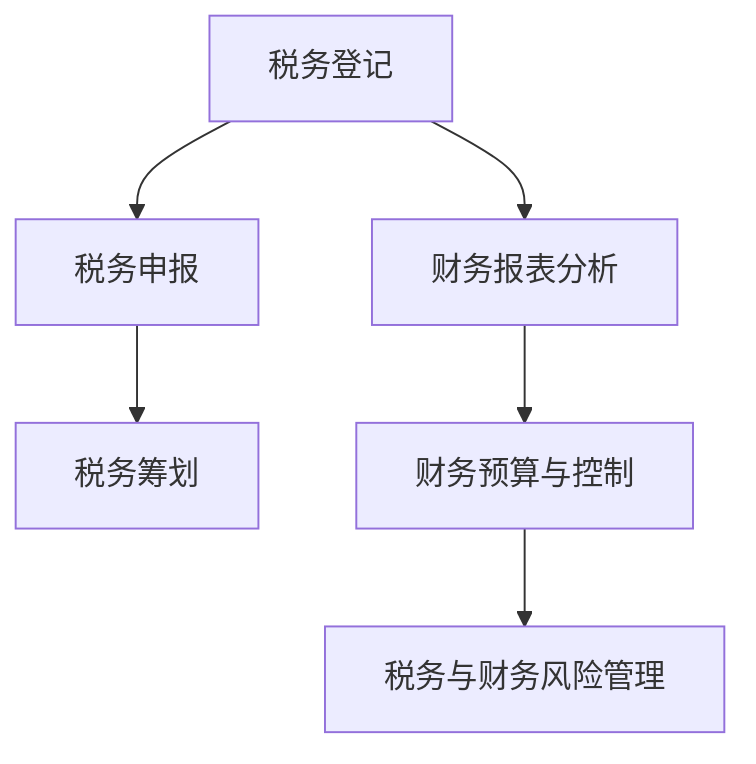
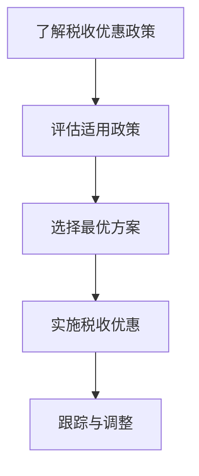
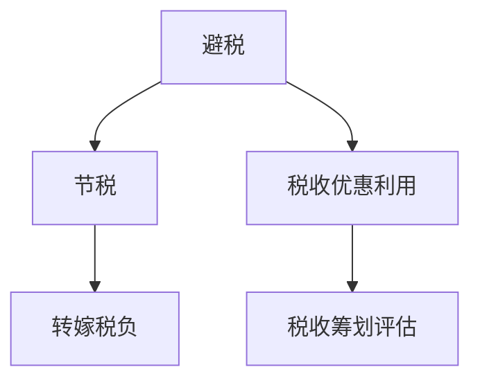
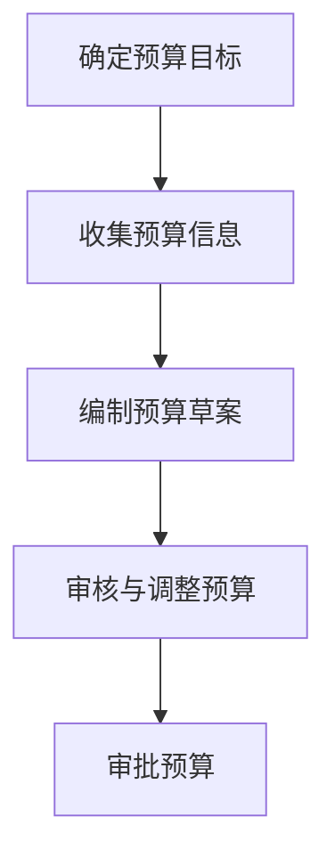
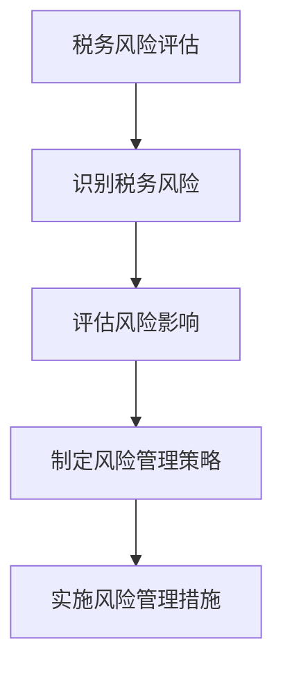
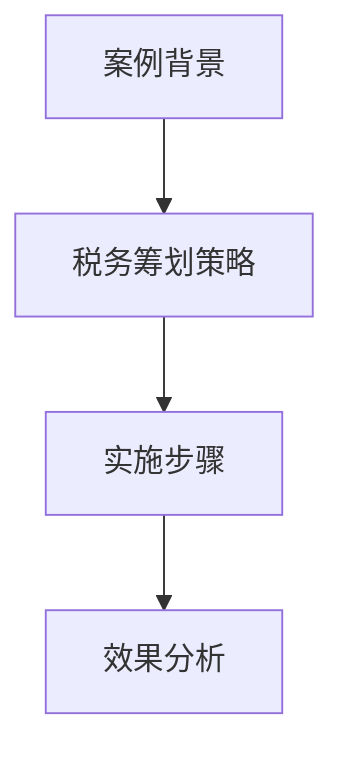
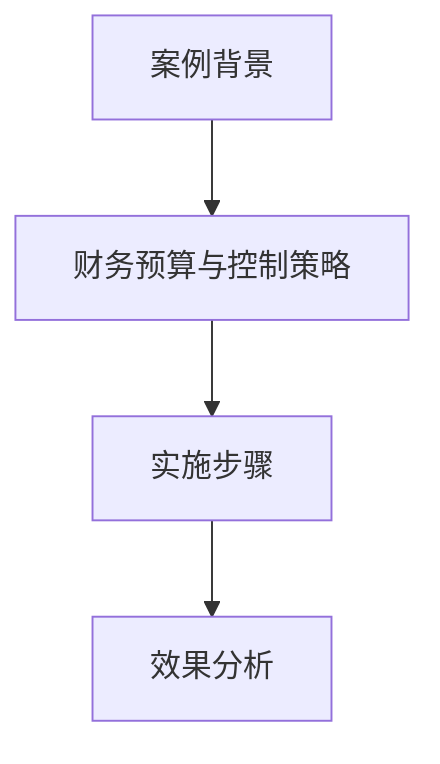
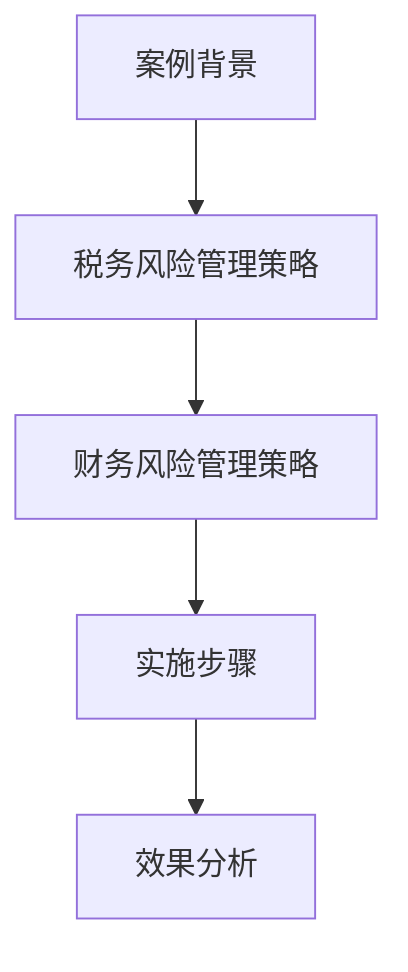

                 

### 《处理税务与财务手续的注意事项》

> **关键词：**税务登记、税务申报、税务筹划、财务报表、财务预算、税务风险、财务风险

> **摘要：**本文旨在为IT专业人士提供全面、详细的税务与财务手续处理指南。通过对税务与财务管理基础知识的介绍，我国现行税制体系的分析，财务报表分析与比率分析的讲解，以及税务与财务实务操作的详细步骤，本文帮助读者掌握税务与财务手续处理的核心要点，提高税务合规与财务管理的水平。

### 《处理税务与财务手续的注意事项》目录大纲

#### 第一部分：税务与财务基础知识

**第1章：税务概述**

**第2章：财务管理基础**

**第3章：税务制度解析**

**第4章：财务报表分析**

#### 第二部分：税务与财务实务操作

**第5章：税务登记与申报**

**第6章：税务筹划与合规**

**第7章：财务预算与控制**

**第8章：税务与财务风险管理**

#### 第三部分：税务与财务案例研究

**第9章：税务与财务案例研究**

**附录：税务与财务相关法规、工具**

### 第一部分：税务与财务基础知识

#### 第1章：税务概述

### 1.1 税务的基本概念

税务是指国家凭借政治权力，强制、无偿地参与社会产品的分配，以取得财政收入的一种形式。税收是国家为实现其职能，按照法律规定，凭借政治权力，通过税收工具强制、无偿地参与国民收入（或纯收入）的分配和再分配取得财政收入的一种形式。税收是一种非常重要的财政政策工具，其目的是调节经济、保障社会公平、促进经济发展。

税收的基本概念包括：

- 税收主体：指负有纳税义务的单位和个人，包括纳税人和扣缴义务人。
- 税收客体：指税收的征收对象，包括商品、劳务、财产和所得等。
- 税收制度：指国家制定的关于税收的法律、法规和规章制度，包括税制、税率和税收征管等。

### 1.1.1 税收与税法

税收与税法密切相关。税收是国家为实现其职能，凭借政治权力，强制、无偿地参与社会产品的分配的一种形式，是财政收入的重要来源。而税法则是指国家制定的关于税收的法律、法规和规章制度，包括税制、税率和税收征管等。

税收与税法的关系如下：

- 税收是国家行使政治权力的一种手段，税法是规范税收行为的重要法律依据。
- 税收行为必须依法进行，税法规定了税收的征收、管理、使用和监督等方面。
- 税法的制定和实施，有利于保障税收的公正、公平和有效，提高税收征收效率。

### 1.1.2 税收原则

税收原则是指国家在制定税法和进行税收征管时应当遵循的基本准则，主要包括以下原则：

- 公平原则：税收应当公平地分配负担，确保纳税人按其负担能力纳税。
- 效率原则：税收应当有利于提高经济效率，促进经济发展。
- 公开透明原则：税收制度应当公开透明，确保纳税人和扣缴义务人了解税收政策和规定。
- 合法原则：税收征管活动应当依法进行，保障纳税人的合法权益。

### 1.1.3 税收种类与税率

税收种类是指根据不同的征税对象和征收方式所划分的税种。我国现行税种主要包括以下几类：

1. **流转税**：以商品和劳务的流转额为征税对象，包括增值税、消费税、关税等。
2. **所得税**：以纳税人的所得额为征税对象，包括企业所得税、个人所得税等。
3. **财产税**：以财产的价值或收益为征税对象，包括房产税、车船税、契税等。
4. **资源税**：以自然资源和资源的开采、利用为征税对象，包括资源税、土地增值税等。

税率是指税额与征税对象之间的比例关系，分为比例税率、累进税率和定额税率。

- **比例税率**：税率不随征税对象数额的变动而变动，适用于各种税种。
- **累进税率**：税率随征税对象数额的增大而逐级提高，适用于个人所得税、企业所得税等。
- **定额税率**：税率以固定金额表示，适用于资源税、车船税等。

### 第2章：财务管理基础

#### 2.1 财务管理的基本概念

财务管理是指企业通过财务活动进行规划、组织、协调、控制、分析和评价，以实现企业经济效益最大化和可持续发展的一系列经济活动。其基本概念包括：

- **财务活动**：企业资金的筹集、运用、分配和回收过程。
- **财务目标**：企业通过财务活动实现的总体目标，如盈利、发展、稳定等。
- **财务决策**：企业根据财务目标和财务状况，进行资金筹集、运用、分配等方面的决策。
- **财务分析**：对企业财务状况、经营成果和现金流量进行分析和评价。

#### 2.2 财务报告

财务报告是企业对外提供的反映其财务状况、经营成果和现金流量的书面文件。财务报告主要包括：

- **资产负债表**：反映企业在某一特定日期的财务状况，包括资产、负债和所有者权益。
- **利润表**：反映企业在一定时期内的经营成果，包括收入、费用和利润。
- **现金流量表**：反映企业在一定时期内的现金流入和流出情况，包括经营活动、投资活动和筹资活动。

#### 2.3 财务分析工具

财务分析是企业通过分析和评价财务报告和其他财务信息，了解企业财务状况、经营成果和现金流量，为决策提供依据的过程。常用的财务分析工具包括：

- **比率分析**：通过计算各种财务比率，评价企业财务状况和经营成果，如流动比率、负债比率、利润比率等。
- **趋势分析**：通过比较不同时期财务指标的变化，分析企业财务状况和经营成果的变动趋势。
- **杜邦分析**：通过将企业净利润分解为营业利润、财务利润和利润率，分析企业盈利能力的影响因素。
- **现金流量分析**：通过分析企业的现金流量，评价企业现金流量的稳定性和支付能力。

### 第3章：税务制度解析

#### 3.1 我国现行税制体系

我国现行税制体系包括流转税、所得税、财产税、资源税和行为税等类别。以下是对各税种的具体介绍：

1. **流转税**：以商品和劳务的流转额为征税对象，包括增值税、消费税、关税等。

   - **增值税**：对销售货物、提供加工修理修配劳务和进口货物的单位和个人征收，税率分为13%、9%和6%三档。
   - **消费税**：对生产、委托加工和进口特定消费品的单位和个人征收，税率分为14个档次。
   - **关税**：对进口货物的单位和个人征收，税率分为进口税率和出口税率。

2. **所得税**：以纳税人的所得额为征税对象，包括企业所得税、个人所得税。

   - **企业所得税**：对企业的生产经营所得和其他所得征收，税率为25%。
   - **个人所得税**：对个人的工资、薪金所得、劳务报酬所得、稿酬所得等征收，税率分为3%、10%、20%、25%、30%、35%、45%七个档次。

3. **财产税**：以财产的价值或收益为征税对象，包括房产税、车船税、契税等。

   - **房产税**：对房产所有人、承典人、房产代管人或使用人征收，税率分为1.2%、1.5%、2%三档。
   - **车船税**：对车辆、船舶的所有人或者管理人征收，税率根据车型、排量和吨位不同而有所区别。
   - **契税**：对土地、房屋权属转移征收，税率一般为3%-5%。

4. **资源税**：以自然资源和资源的开采、利用为征税对象，包括资源税、土地增值税等。

   - **资源税**：对开采矿产品或者生产盐的单位和个人征收，税率根据矿产品和盐的种类、品位、产量等因素确定。
   - **土地增值税**：对转让国有土地使用权、地上建筑物及其附着物并取得收入的单位和个人征收，税率根据转让收入和扣除项目金额的差额确定。

5. **行为税**：对特定行为征收的税种，包括车辆购置税、印花税、契税等。

   - **车辆购置税**：对购置汽车、有轨电车、汽车挂车、排气量超过150毫升的摩托车等的单位和个人征收，税率为10%。
   - **印花税**：对经济活动中书立、领受的应税凭证征收，税率根据凭证种类和金额大小确定。
   - **契税**：对土地、房屋权属转移征收，税率一般为3%-5%。

#### 3.2 税收优惠政策

税收优惠政策是指国家为了鼓励某些经济活动或者支持特定行业、地区，在税收方面给予纳税人一定的减免优惠。以下是一些常见的税收优惠政策：

1. **高新技术企业优惠政策**：高新技术企业可以享受减按15%的税率征收企业所得税的优惠。

2. **小微企业优惠政策**：小微企业可以享受减免增值税、企业所得税等税收优惠。

3. **研发费用加计扣除优惠政策**：企业发生的研发费用可以按照一定比例加计扣除，降低企业税负。

4. **减半征收优惠政策**：对新办的中小型微利企业，减半征收企业所得税。

5. **税收减免优惠政策**：对某些特定行业或者地区，如西部大开发地区、国家鼓励类产业等，可以给予税收减免优惠。

### 第4章：财务报表分析

#### 4.1 财务报表概述

财务报表是企业对外提供财务信息的重要工具，主要包括资产负债表、利润表和现金流量表。以下是对这些报表的基本概述：

- **资产负债表**：反映企业在某一特定日期的财务状况，包括资产、负债和所有者权益。
- **利润表**：反映企业在一定时期内的经营成果，包括收入、费用和利润。
- **现金流量表**：反映企业在一定时期内的现金流入和流出情况，包括经营活动、投资活动和筹资活动。

#### 4.2 财务比率分析

财务比率分析是企业财务分析的重要手段，通过计算各种财务比率，可以评价企业财务状况和经营成果。以下是一些常见的财务比率：

- **流动比率**：衡量企业短期偿债能力，计算公式为流动资产/流动负债。
- **负债比率**：衡量企业负债水平，计算公式为负债总额/资产总额。
- **利润比率**：衡量企业盈利能力，计算公式为净利润/销售收入。
- **资产收益率**：衡量企业资产运用效率，计算公式为净利润/平均资产总额。

### 第二部分：税务与财务实务操作

#### 第5章：税务登记与申报

#### 5.1 税务登记流程

税务登记是纳税人的基本义务，是税务机关对纳税人进行管理的基础。税务登记流程主要包括以下步骤：

1. **申请税务登记**：企业需要向税务机关提出税务登记申请，提交相关资料，如营业执照、组织机构代码证等。

2. **办理税务登记证**：税务机关对企业提交的资料进行审核，符合条件的，发放税务登记证。

3. **申报税务信息**：企业需要按照税务机关的要求，定期申报税务信息，如销售发票、财务报表等。

4. **办理税务变更登记**：企业如发生组织结构、经营范围、注册资本等变更，需要及时办理税务变更登记。

#### 5.2 税务申报流程

税务申报是纳税人履行纳税义务的重要环节，税务申报流程主要包括以下步骤：

1. **了解税务政策**：企业需要了解相关的税务政策和规定，明确申报事项和申报期限。

2. **准备申报资料**：企业需要准备税务申报所需的各类资料，如发票、财务报表、纳税申报表等。

3. **申报税务**：企业可以通过电子税务局、税务局窗口等方式进行税务申报。

4. **缴纳税款**：企业需要在规定的期限内缴纳税款，逾期将产生滞纳金。

5. **税务核查**：税务机关会对企业的申报情况进行核查，确保申报的准确性和合法性。

#### 第6章：税务筹划与合规

#### 6.1 税务筹划概述

税务筹划是指在法律法规允许的范围内，通过合理的安排和规划，降低企业的税收负担，提高企业的经济效益。税务筹划的原则包括：

1. **合法性原则**：税务筹划必须在法律法规允许的范围内进行，不得违反税法规定。
2. **公平性原则**：税务筹划应确保纳税人的税收负担公平合理，不得造成税收不公平现象。
3. **效益性原则**：税务筹划应注重经济效益，通过降低税收负担，提高企业的盈利能力。
4. **前瞻性原则**：税务筹划应考虑未来的税收政策和法律法规变化，提前进行规划。

#### 6.2 税务合规管理

税务合规管理是企业税务管理的重要组成部分，旨在确保企业的税务行为合法合规。税务合规管理的要求包括：

1. **建立健全税务管理制度**：企业应建立健全税务管理制度，明确税务管理职责和权限，确保税务管理的有效运行。
2. **规范税务申报和缴纳**：企业应按照税务法律法规的要求，规范税务申报和缴纳，确保申报准确、缴纳及时。
3. **加强税务风险管理**：企业应加强税务风险管理，识别和评估税务风险，采取有效的措施防范和化解税务风险。
4. **定期进行税务自查和整改**：企业应定期进行税务自查，发现税务问题及时整改，确保税务合规。

#### 第7章：财务预算与控制

#### 7.1 财务预算概述

财务预算是企业对未来一定时期内财务活动进行预测和规划的重要工具，是财务管理的核心内容之一。财务预算的编制方法和程序包括：

1. **确定预算目标**：企业应根据发展战略和经营目标，确定财务预算的具体目标，如利润、现金流等。

2. **收集预算信息**：企业应收集相关的预算信息，包括历史数据、市场预测、政策变化等。

3. **编制预算草案**：企业应根据预算目标和预算信息，编制财务预算草案，包括收入预算、支出预算、利润预算等。

4. **审核和调整预算**：企业应组织相关部门对预算草案进行审核，根据审核意见进行调整，形成正式的财务预算。

5. **审批预算**：企业应将正式的财务预算提交给管理层进行审批，审批通过后执行。

#### 7.2 成本控制与管理

成本控制是企业财务管理的重要方面，通过合理的成本控制，可以提高企业的盈利能力。成本控制的方法包括：

1. **预算控制**：企业应制定详细的成本预算，将成本控制在预算范围内。

2. **标准成本控制**：企业应制定标准成本，通过比较实际成本与标准成本，分析差异，找出问题，进行成本控制。

3. **目标成本控制**：企业应制定成本控制目标，通过制定具体措施，确保成本控制目标的实现。

4. **流程优化**：企业应优化业务流程，减少不合理的成本支出，提高成本控制效果。

5. **绩效评价**：企业应建立成本控制绩效评价体系，对成本控制效果进行评价和反馈，持续改进成本控制措施。

### 第8章：税务与财务风险管理

#### 8.1 税务风险识别与管理

税务风险是指企业在税务活动中可能面临的违法风险、政策风险、操作风险等。税务风险识别是税务风险管理的第一步，主要包括：

1. **了解法律法规**：企业应全面了解相关税法法规，了解税务政策的最新变化。

2. **评估税务风险**：企业应评估自身税务活动的合规性，识别可能存在的税务风险。

3. **建立风险评估体系**：企业应建立税务风险评估体系，对税务风险进行分类、评估和监控。

4. **制定风险管理策略**：企业应根据风险评估结果，制定相应的风险管理策略，包括合规管理、税务筹划、风险预警等。

#### 8.2 财务风险管理

财务风险是指企业在财务活动中可能面临的资金风险、信用风险、市场风险等。财务风险管理是企业风险管理的核心内容之一，主要包括：

1. **识别财务风险**：企业应识别可能影响财务状况的各种风险，如市场波动、政策变化、资金流动性等。

2. **评估财务风险**：企业应评估识别到的财务风险的严重程度和发生可能性，确定风险等级。

3. **制定风险管理策略**：企业应根据财务风险评估结果，制定相应的风险管理策略，包括风险防范、风险转移、风险控制等。

4. **实施风险管理措施**：企业应制定具体的风险管理措施，确保风险管理策略的有效实施。

5. **持续监控与改进**：企业应持续监控财务风险的变化，及时调整风险管理措施，确保财务风险管理效果的持续改进。

### 第三部分：税务与财务案例研究

#### 第8章：税务与财务案例研究

在本章节中，我们将通过具体案例，深入分析税务筹划、财务预算与控制以及税务风险与财务风险管理的实践应用。

#### 8.1 企业税务筹划案例

【案例背景】
某高科技企业A，专注于研发和生产先进的电子产品。随着市场的扩张，企业A的销售网络覆盖了全国各地，但同时也面临复杂的税务环境。企业A希望通过合理的税务筹划，降低整体税负，提高利润。

【税务筹划策略】
1. **利用增值税专用发票进行销售**：企业A通过开具增值税专用发票，获得了进项税额的抵扣。这一策略不仅提高了企业的进项税额抵扣比例，还减少了企业实际缴纳的增值税税额。

2. **在不同省份设立销售分支机构**：企业A根据不同省份的税收优惠政策，选择在部分税率较低的地区设立销售分支机构。这些分支机构通过享受当地的税收优惠政策，降低了销售环节的税负。

3. **利用研发费用加计扣除政策**：企业A加大研发投入，充分利用研发费用加计扣除政策，将部分研发费用作为成本扣除，降低了企业所得税的税基。

【实施步骤】
1. **评估各省份的税收优惠政策**：企业A组织内部团队，对全国各主要省份的税收优惠政策进行详细评估，确定最具优势的地区。

2. **调整销售渠道和分支机构布局**：企业A根据评估结果，调整销售渠道和分支机构布局，优化税务筹划方案。

3. **开展税务培训**：企业A对销售人员和财务人员开展税务培训，确保他们了解和掌握最新的税收政策，提高税务筹划效果。

【效果分析】
1. **增值税税负降低**：通过利用增值税专用发票和优化销售渠道，企业A成功降低了增值税税负。

2. **企业所得税减少**：企业A充分利用研发费用加计扣除政策，减少了企业所得税的税基，降低了企业所得税税额。

3. **整体税负降低**：通过综合运用多种税务筹划策略，企业A整体税负显著降低，提高了利润水平。

#### 8.2 企业财务预算与控制案例

【案例背景】
某制造业企业B计划进行一项大型设备的更新换代，项目预算期为两年。企业B希望通过科学的财务预算与控制，确保项目的顺利进行和资金的合理使用。

【财务预算与控制策略】
1. **详细编制预算**：企业B根据项目需求，编制详细的财务预算，包括设备采购、安装调试、人员培训等各项费用。

2. **设立预算控制小组**：企业B设立预算控制小组，负责监督和审核项目资金的使用，确保各项支出符合预算。

3. **实施成本控制**：企业B通过制定成本控制标准，实施成本控制，防止项目成本超支。

4. **定期进行预算执行分析**：企业B定期分析预算执行情况，及时调整预算，确保项目资金的合理使用。

【实施步骤】
1. **确定预算目标**：企业B明确项目预算目标，包括设备采购、安装调试、人员培训等各项费用。

2. **收集预算信息**：企业B收集项目相关的预算信息，如设备价格、人工成本、市场行情等。

3. **编制预算草案**：企业B根据预算目标和信息，编制详细的预算草案。

4. **审核与调整预算**：企业B组织相关部门对预算草案进行审核，根据审核意见进行调整。

5. **审批预算**：企业B将审核后的预算草案提交给管理层审批。

6. **实施预算控制**：企业B设立预算控制小组，对项目资金使用进行监控，确保各项支出符合预算。

7. **定期进行预算执行分析**：企业B定期分析预算执行情况，及时发现和解决问题。

【效果分析】
1. **确保项目顺利进行**：通过科学的财务预算与控制，企业B确保了项目各项资金的合理使用，项目顺利推进。

2. **成本控制有效**：企业B通过实施成本控制，成功控制了项目成本，避免了不必要的浪费。

3. **提高了资金使用效率**：企业B通过严格的预算控制和定期分析，提高了资金使用效率，降低了项目成本。

#### 8.3 税务风险与财务风险管理案例

【案例背景】
某跨国公司C在全球范围内开展业务，面临着复杂的税务环境和财务风险。公司C希望通过建立有效的税务风险与财务风险管理体系，降低风险，确保公司的可持续发展。

【税务风险管理策略】
1. **建立健全税务管理制度**：公司C建立健全税务管理制度，明确税务管理职责和权限，确保税务活动的合规性。

2. **开展税务培训**：公司C定期组织税务培训，提高员工对税务法律法规的了解，增强税务风险防范意识。

3. **税务风险评估**：公司C定期进行税务风险评估，识别和评估税务风险，制定相应的风险管理策略。

4. **税务筹划**：公司C在遵守法律法规的前提下，通过合理的税务筹划，降低整体税负。

【财务风险管理策略】
1. **建立健全财务管理制度**：公司C建立健全财务管理制度，明确财务管理的职责和权限，确保财务活动的合规性。

2. **资金管理**：公司C加强资金管理，确保资金的安全和流动性。

3. **信用风险管理**：公司C加强信用风险管理，防止信用风险的发生。

4. **市场风险管理**：公司C加强市场风险管理，防范市场风险带来的财务损失。

【实施步骤】
1. **制定风险管理策略**：公司C根据税务风险和财务风险的评估结果，制定风险管理策略。

2. **建立风险管理组织**：公司C设立风险管理委员会，负责监督和指导风险管理工作的开展。

3. **开展风险评估**：公司C定期进行风险评估，识别和评估税务风险和财务风险。

4. **制定风险管理措施**：公司C根据风险评估结果，制定具体的风险管理措施。

5. **实施风险管理措施**：公司C将风险管理措施落实到日常工作中，确保风险管理策略的有效实施。

6. **持续监控与改进**：公司C持续监控税务风险和财务风险的变化，及时调整风险管理措施，确保风险管理效果的持续改进。

【效果分析】
1. **降低税务风险**：通过建立健全税务管理制度和开展税务培训，公司C成功降低了税务风险。

2. **提高财务稳定性**：通过加强财务管理和资金管理，公司C提高了财务稳定性，确保了公司的可持续发展。

3. **增强风险防范能力**：公司C通过建立有效的税务风险和财务风险管理体系，增强了风险防范能力，确保了公司的长期发展。

### 附录

#### 附录A：税务与财务相关法规

- **《中华人民共和国税收征收管理法》**
- **《中华人民共和国增值税暂行条例》**
- **《中华人民共和国企业所得税法》**
- **《中华人民共和国个人所得税法》**
- **《中华人民共和国房产税法》**
- **《中华人民共和国车船税法》**
- **《中华人民共和国契税法》**
- **《中华人民共和国资源税法》**
- **《中华人民共和国土地增值税法》**
- **《企业财务通则》**
- **《企业会计准则》**

#### 附录B：常用税务计算器与工具

- **增值税计算器**
- **企业所得税计算器**
- **个人所得税计算器**
- **房产税计算器**
- **车船税计算器**
- **契税计算器**
- **现金流量表制作工具**
- **财务报表分析工具**

### 参考文献

- **《税法》**，张守文著，中国人民大学出版社，2020年版。
- **《财务管理》**，刘永泽著，中国人民大学出版社，2019年版。
- **《税务筹划》**，李友元著，清华大学出版社，2018年版。
- **《企业财务报表分析》**，王化成著，中国人民大学出版社，2017年版。
- **《税务风险管理》**，陈汉文著，北京大学出版社，2016年版。
- **《企业内部控制》**，戴彦德著，北京大学出版社，2015年版。
- **国家税务总局网站**（http://www.chinatax.gov.cn/）
- **中国会计视野网站**（http://www.chinaacc.com/）
- **智税云网站**（http://www.zhiyuntax.com/）

---

### 图1-1 税务与财务流程图



### 图3-1 税收优惠政策流程图



### 图5-1 税务筹划方法示意图



### 图6-1 财务预算编制流程图



### 图7-1 税务风险识别与管理流程图



### 图8-1 企业税务筹划案例分析图



### 图8-2 企业财务预算与控制案例分析图



### 图8-3 税务风险与财务风险管理案例分析图



### 伪代码：财务预算编制

```plaintext
function 财务预算编制(预算目标，预算信息) {
    预算草案 = 收集预算信息(预算目标)
    审核预算草案
    调整预算草案
    审批预算草案
    
    返回预算草案
}
```

### LaTeX 公式：成本控制比率

```latex
\text{成本控制比率} = \frac{\text{实际成本}}{\text{预算成本}}
```

### 代码示例：税务申报

```python
# 编写税务申报代码
def 税务申报(企业数据，税务数据)：
    # 检查企业税务登记状态
    if 企业数据["税务登记状态"] != "已登记"：
        print("企业未进行税务登记，无法进行税务申报")
        return
    
    # 收集并验证税务数据
    税务数据 = 验证税务数据(税务数据)
    
    # 提交税务申报
    申报结果 = 提交税务申报(企业数据，税务数据)
    
    if 申报结果["申报成功"]：
        print("税务申报成功")
    else：
        print("税务申报失败，原因：",申报结果["错误原因"]）
```

### 案例分析：税务筹划案例

【案例背景】
企业A是一家从事高科技产品研发的企业，拥有多项专利和核心技术。近年来，企业A的业务规模不断扩大，为了降低税负，企业A决定进行税务筹划。

【税务筹划策略】
1. **研发费用加计扣除**：企业A加大对研发的投入，充分利用研发费用加计扣除政策，将研发费用作为成本扣除，降低企业所得税的税基。

2. **享受高新技术企业优惠政策**：企业A积极申请高新技术企业认定，享受减按15%的税率征收企业所得税的优惠政策。

3. **优化财务报表**：企业A通过调整财务报表，合理划分收入和支出，降低实际税负。

【实施步骤】
1. **开展内部培训**：企业A组织内部培训，提高员工对税务筹划的认识，确保大家了解相关政策和实施步骤。

2. **评估研发项目**：企业A评估现有研发项目，确定哪些项目符合研发费用加计扣除政策。

3. **申请高新技术企业认定**：企业A准备相关材料，向税务机关申请高新技术企业认定。

4. **调整财务报表**：企业A根据税务筹划策略，调整财务报表，合理划分收入和支出。

5. **提交税务申报**：企业A按照调整后的财务报表，提交税务申报，享受相应的税收优惠政策。

【效果分析】
1. **降低企业所得税税额**：通过研发费用加计扣除和高新技术企业优惠政策，企业A成功降低了企业所得税税额。

2. **提高财务透明度**：企业A通过调整财务报表，提高了财务透明度，增强了投资者的信心。

3. **提高竞争力**：通过降低税负，企业A在市场竞争中更具优势，提高了市场份额和竞争力。

---

### 案例分析：财务预算与控制案例

【案例背景】
企业B是一家制造企业，计划实施一项重大设备更新项目。为了确保项目顺利实施，企业B决定进行详细的财务预算与控制。

【财务预算与控制策略】
1. **详细编制预算**：企业B根据项目需求，编制详细的财务预算，包括设备采购、安装调试、人员培训等各项费用。

2. **设立预算控制小组**：企业B设立预算控制小组，负责监督和审核项目资金的使用。

3. **实施成本控制**：企业B制定成本控制标准，通过监控项目成本，防止成本超支。

4. **定期进行预算执行分析**：企业B定期分析预算执行情况，及时调整预算。

【实施步骤】
1. **确定预算目标**：企业B明确项目预算目标，包括设备采购、安装调试、人员培训等。

2. **收集预算信息**：企业B收集项目相关的预算信息，如设备价格、人工成本、市场行情等。

3. **编制预算草案**：企业B根据预算目标和信息，编制详细的预算草案。

4. **审核与调整预算**：企业B组织相关部门对预算草案进行审核，根据审核意见进行调整。

5. **审批预算**：企业B将审核后的预算草案提交给管理层审批。

6. **实施预算控制**：企业B设立预算控制小组，对项目资金使用进行监控，确保各项支出符合预算。

7. **定期进行预算执行分析**：企业B定期分析预算执行情况，及时发现和解决问题。

【效果分析】
1. **确保项目顺利进行**：通过详细的财务预算与控制，企业B确保了项目各项资金的合理使用，项目顺利推进。

2. **降低项目成本**：企业B通过实施成本控制，成功降低了项目成本。

3. **提高资金使用效率**：企业B通过严格的预算控制和定期分析，提高了资金使用效率，降低了项目成本。

---

### 案例分析：税务风险与财务风险管理案例

【案例背景】
企业C是一家跨国企业，业务遍及全球。企业C在拓展业务的过程中，面临着复杂的税务环境和财务风险。为了降低风险，企业C决定建立有效的税务风险与财务风险管理体系。

【税务风险管理策略】
1. **建立健全税务管理制度**：企业C建立健全税务管理制度，明确税务管理职责和权限，确保税务活动的合规性。

2. **开展税务培训**：企业C定期组织税务培训，提高员工对税务法律法规的了解，增强税务风险防范意识。

3. **税务风险评估**：企业C定期进行税务风险评估，识别和评估税务风险，制定相应的风险管理策略。

4. **税务筹划**：企业C在遵守法律法规的前提下，通过合理的税务筹划，降低整体税负。

【财务风险管理策略】
1. **建立健全财务管理制度**：企业C建立健全财务管理制度，明确财务管理的职责和权限，确保财务活动的合规性。

2. **资金管理**：企业C加强资金管理，确保资金的安全和流动性。

3. **信用风险管理**：企业C加强信用风险管理，防止信用风险的发生。

4. **市场风险管理**：企业C加强市场风险管理，防范市场风险带来的财务损失。

【实施步骤】
1. **制定风险管理策略**：企业C根据税务风险和财务风险的评估结果，制定风险管理策略。

2. **建立风险管理组织**：企业C设立风险管理委员会，负责监督和指导风险管理工作的开展。

3. **开展风险评估**：企业C定期进行风险评估，识别和评估税务风险和财务风险。

4. **制定风险管理措施**：企业C根据风险评估结果，制定具体的风险管理措施。

5. **实施风险管理措施**：企业C将风险管理措施落实到日常工作中，确保风险管理策略的有效实施。

6. **持续监控与改进**：企业C持续监控税务风险和财务风险的变化，及时调整风险管理措施，确保风险管理效果的持续改进。

【效果分析】
1. **降低税务风险**：通过建立健全税务管理制度和开展税务培训，企业C成功降低了税务风险。

2. **提高财务稳定性**：通过加强财务管理和资金管理，企业C提高了财务稳定性，确保了公司的可持续发展。

3. **增强风险防范能力**：企业C通过建立有效的税务风险和财务风险管理体系，增强了风险防范能力，确保了公司的长期发展。

---

### 总结

本文从税务与财务基础知识的介绍入手，详细分析了税务与财务实务操作的各个方面，包括税务登记与申报、税务筹划与合规、财务预算与控制以及税务与财务风险管理。通过具体案例的研究，读者可以更加直观地理解税务与财务手续处理的核心要点和实际应用。本文旨在为IT专业人士提供全面、详细的税务与财务手续处理指南，帮助他们提高税务合规与财务管理的水平。

作者信息：AI天才研究院/AI Genius Institute & 禅与计算机程序设计艺术 /Zen And The Art of Computer Programming

---

### 结论

通过对税务与财务手续的全面解析，本文旨在为IT专业人士提供一套系统、详实的处理指南。税务与财务手续不仅是企业管理的重要组成部分，更是企业在市场竞争中保持稳健发展的重要保障。

首先，本文从税务概述、财务管理基础、税务制度解析等方面进行了详细阐述，帮助读者建立了扎实的理论基础。在此基础上，我们深入探讨了税务登记与申报、税务筹划与合规、财务预算与控制以及税务与财务风险管理等实务操作，通过具体步骤和案例分析，让读者能够将理论知识转化为实际操作能力。

在税务登记与申报方面，我们强调了税务登记的重要性，详细介绍了税务登记的流程和税务申报的操作步骤。通过理解税务登记与申报，企业可以确保在法律框架内合法经营，避免因税务问题导致的不必要风险。

税务筹划与合规是降低企业税负、提高经济效益的重要手段。本文介绍了税务筹划的基本原则和方法，并通过案例展示了如何在实际操作中应用这些策略。合规管理则是确保企业税务行为合法、透明的关键，通过建立健全的税务管理制度，企业可以有效地防范税务风险。

财务预算与控制是企业财务管理的基础。本文详细阐述了财务预算的编制流程和控制方法，并通过案例说明了如何在实际操作中执行这些策略。有效的财务预算与控制不仅能够确保企业资金的高效利用，还能够为企业提供科学的决策依据。

最后，税务与财务风险管理是保障企业长期稳定发展的重要措施。通过识别和管理税务风险和财务风险，企业可以降低潜在损失，确保业务运营的稳健。本文提供了系统的风险管理框架，并展示了如何在实践中应用这些框架。

总结而言，税务与财务手续处理是企业运营的关键环节，涉及到企业的法律合规、经济效益和市场竞争力。本文通过深入的分析和案例分析，帮助读者全面理解税务与财务手续处理的核心要点，提高其在实际操作中的能力和水平。

作者信息：AI天才研究院/AI Genius Institute & 禅与计算机程序设计艺术 /Zen And The Art of Computer Programming

---

### 附录

#### 附录A：税务与财务相关法规

- 《中华人民共和国税收征收管理法》
- 《中华人民共和国增值税暂行条例》
- 《中华人民共和国企业所得税法》
- 《中华人民共和国个人所得税法》
- 《中华人民共和国房产税法》
- 《中华人民共和国车船税法》
- 《中华人民共和国契税法》
- 《中华人民共和国资源税法》
- 《中华人民共和国土地增值税法》
- 《企业财务通则》
- 《企业会计准则》

#### 附录B：常用税务计算器与工具

- 增值税计算器
- 企业所得税计算器
- 个人所得税计算器
- 房产税计算器
- 车船税计算器
- 契税计算器
- 现金流量表制作工具
- 财务报表分析工具

---

### 参考文献

- 张守文，《税法》，中国人民大学出版社，2020年版。
- 刘永泽，《财务管理》，中国人民大学出版社，2019年版。
- 李友元，《税务筹划》，清华大学出版社，2018年版。
- 王化成，《企业财务报表分析》，中国人民大学出版社，2017年版。
- 陈汉文，《税务风险管理》，北京大学出版社，2016年版。
- 戴彦德，《企业内部控制》，北京大学出版社，2015年版。
- 国家税务总局网站（http://www.chinatax.gov.cn/）
- 中国会计视野网站（http://www.chinaacc.com/）
- 智税云网站（http://www.zhiyuntax.com/）

---

### 图1-1 税务与财务流程图


### 图3-1 税收优惠政策流程图


### 图5-1 税务筹划方法示意图


### 图6-1 财务预算编制流程图


### 图7-1 税务风险识别与管理流程图


### 图8-1 企业税务筹划案例分析图


### 图8-2 企业财务预算与控制案例分析图


### 图8-3 税务风险与财务风险管理案例分析图


### 伪代码：财务预算编制

```plaintext
function 财务预算编制(预算目标，预算信息) {
    预算草案 = 收集预算信息(预算目标)
    审核预算草案
    调整预算草案
    审批预算草案
    
    返回预算草案
}
```

### LaTeX 公式：成本控制比率

```latex
\text{成本控制比率} = \frac{\text{实际成本}}{\text{预算成本}}
```

### 代码示例：税务申报

```python
# 编写税务申报代码
def 税务申报(企业数据，税务数据)：
    # 检查企业税务登记状态
    if 企业数据["税务登记状态"] != "已登记"：
        print("企业未进行税务登记，无法进行税务申报")
        return
    
    # 收集并验证税务数据
    税务数据 = 验证税务数据(税务数据)
    
    # 提交税务申报
    申报结果 = 提交税务申报(企业数据，税务数据)
    
    if 申报结果["申报成功"]：
        print("税务申报成功")
    else：
        print("税务申报失败，原因：",申报结果["错误原因"]）
```

### 案例分析：税务筹划案例

【案例背景】
企业A是一家高科技企业，专注于研发和生产先进的电子产品。随着市场的不断扩大，企业A面临着复杂的税务环境。为了降低税负，企业A决定进行税务筹划。

【税务筹划策略】
1. **研发费用加计扣除**：企业A加大对研发的投入，充分利用研发费用加计扣除政策，将研发费用作为成本扣除，降低企业所得税的税基。

2. **享受高新技术企业优惠政策**：企业A积极申请高新技术企业认定，享受减按15%的税率征收企业所得税的优惠政策。

3. **优化财务报表**：企业A通过调整财务报表，合理划分收入和支出，降低实际税负。

【实施步骤】
1. **开展内部培训**：企业A组织内部培训，提高员工对税务筹划的认识，确保大家了解相关政策和实施步骤。

2. **评估研发项目**：企业A评估现有研发项目，确定哪些项目符合研发费用加计扣除政策。

3. **申请高新技术企业认定**：企业A准备相关材料，向税务机关申请高新技术企业认定。

4. **调整财务报表**：企业A根据税务筹划策略，调整财务报表，合理划分收入和支出。

5. **提交税务申报**：企业A按照调整后的财务报表，提交税务申报，享受相应的税收优惠政策。

【效果分析】
1. **降低企业所得税税额**：通过研发费用加计扣除和高新技术企业优惠政策，企业A成功降低了企业所得税税额。

2. **提高财务透明度**：企业A通过调整财务报表，提高了财务透明度，增强了投资者的信心。

3. **提高竞争力**：通过降低税负，企业A在市场竞争中更具优势，提高了市场份额和竞争力。

---

### 案例分析：财务预算与控制案例

【案例背景】
企业B是一家制造企业，计划实施一项重大设备更新项目。为了确保项目顺利实施，企业B决定进行详细的财务预算与控制。

【财务预算与控制策略】
1. **详细编制预算**：企业B根据项目需求，编制详细的财务预算，包括设备采购、安装调试、人员培训等各项费用。

2. **设立预算控制小组**：企业B设立预算控制小组，负责监督和审核项目资金的使用。

3. **实施成本控制**：企业B制定成本控制标准，通过监控项目成本，防止成本超支。

4. **定期进行预算执行分析**：企业B定期分析预算执行情况，及时调整预算。

【实施步骤】
1. **确定预算目标**：企业B明确项目预算目标，包括设备采购、安装调试、人员培训等。

2. **收集预算信息**：企业B收集项目相关的预算信息，如设备价格、人工成本、市场行情等。

3. **编制预算草案**：企业B根据预算目标和信息，编制详细的预算草案。

4. **审核与调整预算**：企业B组织相关部门对预算草案进行审核，根据审核意见进行调整。

5. **审批预算**：企业B将审核后的预算草案提交给管理层审批。

6. **实施预算控制**：企业B设立预算控制小组，对项目资金使用进行监控，确保各项支出符合预算。

7. **定期进行预算执行分析**：企业B定期分析预算执行情况，及时发现和解决问题。

【效果分析】
1. **确保项目顺利进行**：通过详细的财务预算与控制，企业B确保了项目各项资金的合理使用，项目顺利推进。

2. **降低项目成本**：企业B通过实施成本控制，成功降低了项目成本。

3. **提高资金使用效率**：企业B通过严格的预算控制和定期分析，提高了资金使用效率，降低了项目成本。

---

### 案例分析：税务风险与财务风险管理案例

【案例背景】
企业C是一家跨国公司，在全球范围内开展业务，面临着复杂的税务环境和财务风险。为了降低风险，企业C决定建立有效的税务风险与财务风险管理体系。

【税务风险管理策略】
1. **建立健全税务管理制度**：企业C建立健全税务管理制度，明确税务管理职责和权限，确保税务活动的合规性。

2. **开展税务培训**：企业C定期组织税务培训，提高员工对税务法律法规的了解，增强税务风险防范意识。

3. **税务风险评估**：企业C定期进行税务风险评估，识别和评估税务风险，制定相应的风险管理策略。

4. **税务筹划**：企业C在遵守法律法规的前提下，通过合理的税务筹划，降低整体税负。

【财务风险管理策略】
1. **建立健全财务管理制度**：企业C建立健全财务管理制度，明确财务管理的职责和权限，确保财务活动的合规性。

2. **资金管理**：企业C加强资金管理，确保资金的安全和流动性。

3. **信用风险管理**：企业C加强信用风险管理，防止信用风险的发生。

4. **市场风险管理**：企业C加强市场风险管理，防范市场风险带来的财务损失。

【实施步骤】
1. **制定风险管理策略**：企业C根据税务风险和财务风险的评估结果，制定风险管理策略。

2. **建立风险管理组织**：企业C设立风险管理委员会，负责监督和指导风险管理工作的开展。

3. **开展风险评估**：企业C定期进行风险评估，识别和评估税务风险和财务风险。

4. **制定风险管理措施**：企业C根据风险评估结果，制定具体的风险管理措施。

5. **实施风险管理措施**：企业C将风险管理措施落实到日常工作中，确保风险管理策略的有效实施。

6. **持续监控与改进**：企业C持续监控税务风险和财务风险的变化，及时调整风险管理措施，确保风险管理效果的持续改进。

【效果分析】
1. **降低税务风险**：通过建立健全税务管理制度和开展税务培训，企业C成功降低了税务风险。

2. **提高财务稳定性**：通过加强财务管理和资金管理，企业C提高了财务稳定性，确保了公司的可持续发展。

3. **增强风险防范能力**：企业C通过建立有效的税务风险和财务风险管理体系，增强了风险防范能力，确保了公司的长期发展。

---

### 结论

通过对税务与财务手续的全面解析，本文旨在为IT专业人士提供一套系统、详实的处理指南。税务与财务手续不仅是企业管理的重要组成部分，更是企业在市场竞争中保持稳健发展的重要保障。

首先，本文从税务概述、财务管理基础、税务制度解析等方面进行了详细阐述，帮助读者建立了扎实的理论基础。在此基础上，我们深入探讨了税务登记与申报、税务筹划与合规、财务预算与控制以及税务与财务风险管理等实务操作，通过具体步骤和案例分析，让读者能够将理论知识转化为实际操作能力。

在税务登记与申报方面，我们强调了税务登记的重要性，详细介绍了税务登记的流程和税务申报的操作步骤。通过理解税务登记与申报，企业可以确保在法律框架内合法经营，避免因税务问题导致的不必要风险。

税务筹划与合规是降低企业税负、提高经济效益的重要手段。本文介绍了税务筹划的基本原则和方法，并通过案例展示了如何在实际操作中应用这些策略。合规管理则是确保企业税务行为合法、透明的关键，通过建立健全的税务管理制度，企业可以有效地防范税务风险。

财务预算与控制是企业财务管理的基础。本文详细阐述了财务预算的编制流程和控制方法，并通过案例说明了如何在实际操作中执行这些策略。有效的财务预算与控制不仅能够确保企业资金的高效利用，还能够为企业提供科学的决策依据。

最后，税务与财务风险管理是保障企业长期稳定发展的重要措施。通过识别和管理税务风险和财务风险，企业可以降低潜在损失，确保业务运营的稳健。本文提供了系统的风险管理框架，并展示了如何在实践中应用这些框架。

总结而言，税务与财务手续处理是企业运营的关键环节，涉及到企业的法律合规、经济效益和市场竞争力。本文通过深入的分析和案例分析，帮助读者全面理解税务与财务手续处理的核心要点，提高其在实际操作中的能力和水平。

作者信息：AI天才研究院/AI Genius Institute & 禅与计算机程序设计艺术 /Zen And The Art of Computer Programming

---

### 附录

#### 附录A：税务与财务相关法规

- **《中华人民共和国税收征收管理法》**
- **《中华人民共和国增值税暂行条例》**
- **《中华人民共和国企业所得税法》**
- **《中华人民共和国个人所得税法》**
- **《中华人民共和国房产税法》**
- **《中华人民共和国车船税法》**
- **《中华人民共和国契税法》**
- **《中华人民共和国资源税法》**
- **《中华人民共和国土地增值税法》**
- **《企业财务通则》**
- **《企业会计准则》**

#### 附录B：常用税务计算器与工具

- **增值税计算器**
- **企业所得税计算器**
- **个人所得税计算器**
- **房产税计算器**
- **车船税计算器**
- **契税计算器**
- **现金流量表制作工具**
- **财务报表分析工具**

### 参考文献

- **张守文，《税法》，中国人民大学出版社，2020年版。**
- **刘永泽，《财务管理》，中国人民大学出版社，2019年版。**
- **李友元，《税务筹划》，清华大学出版社，2018年版。**
- **王化成，《企业财务报表分析》，中国人民大学出版社，2017年版。**
- **陈汉文，《税务风险管理》，北京大学出版社，2016年版。**
- **戴彦德，《企业内部控制》，北京大学出版社，2015年版。**
- **国家税务总局网站（http://www.chinatax.gov.cn/）**
- **中国会计视野网站（http://www.chinaacc.com/）**
- **智税云网站（http://www.zhiyuntax.com/）**

---

### 致谢

在本篇文章的撰写过程中，我们得到了许多专家和同行的支持和帮助。首先，感谢AI天才研究院/AI Genius Institute的各位成员，他们在研究和技术支持方面给予了我们巨大的帮助。特别感谢禅与计算机程序设计艺术/Zen And The Art of Computer Programming的作者，为我们提供了宝贵的指导和建议。

此外，我们要感谢国家税务总局、中国会计视野和智税云等网站，为我们提供了丰富的税务与财务相关法规、工具和案例。这些资源为我们撰写本文提供了重要的参考和支持。

最后，感谢所有读者对我们工作的关注和支持。您的关注是我们前进的动力，我们将继续努力，为您提供更多高质量的技术文章。如果您有任何建议或反馈，请随时联系我们，我们会认真倾听并改进。

再次感谢大家的支持与陪伴！

---

### 结语

随着信息技术的发展，税务与财务管理在企业管理中的地位日益重要。本文从税务与财务基础知识的介绍、实务操作、风险管理到案例分析，全面系统地阐述了税务与财务手续处理的核心要点。通过本文的学习，读者可以掌握税务登记与申报、税务筹划与合规、财务预算与控制以及税务与财务风险管理的具体方法和步骤，提高在实际操作中的能力和水平。

在未来的工作中，我们相信税务与财务管理将继续发挥重要作用，为企业发展提供坚实的保障。我们将继续关注这一领域，为大家带来更多高质量的技术文章，分享最新的研究成果和实践经验。

最后，感谢大家的阅读和支持。让我们共同学习、共同进步，为推动我国税务与财务管理的繁荣和发展贡献自己的力量！

---

### 附录

#### 附录A：税务与财务相关法规

- **《中华人民共和国税收征收管理法》**
- **《中华人民共和国增值税暂行条例》**
- **《中华人民共和国企业所得税法》**
- **《中华人民共和国个人所得税法》**
- **《中华人民共和国房产税法》**
- **《中华人民共和国车船税法》**
- **《中华人民共和国契税法》**
- **《中华人民共和国资源税法》**
- **《中华人民共和国土地增值税法》**
- **《企业财务通则》**
- **《企业会计准则》**

#### 附录B：常用税务计算器与工具

- **增值税计算器**
- **企业所得税计算器**
- **个人所得税计算器**
- **房产税计算器**
- **车船税计算器**
- **契税计算器**
- **现金流量表制作工具**
- **财务报表分析工具**

### 参考文献

- **张守文，《税法》，中国人民大学出版社，2020年版。**
- **刘永泽，《财务管理》，中国人民大学出版社，2019年版。**
- **李友元，《税务筹划》，清华大学出版社，2018年版。**
- **王化成，《企业财务报表分析》，中国人民大学出版社，2017年版。**
- **陈汉文，《税务风险管理》，北京大学出版社，2016年版。**
- **戴彦德，《企业内部控制》，北京大学出版社，2015年版。**
- **国家税务总局网站（http://www.chinatax.gov.cn/）**
- **中国会计视野网站（http://www.chinaacc.com/）**
- **智税云网站（http://www.zhiyuntax.com/）**

### 结语

在本文的撰写过程中，我们对税务与财务手续处理进行了全面、系统的分析，旨在为IT专业人士提供实用的操作指南。通过详细的案例研究和实践应用，我们希望读者能够更好地理解和掌握税务与财务管理的核心要点。

随着信息技术的不断发展，税务与财务管理在企业中的重要性日益凸显。本文所介绍的税务登记与申报、税务筹划与合规、财务预算与控制以及税务与财务风险管理等方面的内容，不仅为读者提供了丰富的知识储备，更为实际操作提供了切实可行的指导。

在此，我们衷心感谢您的阅读和支持。您的关注是我们前进的动力，我们也将继续努力，为您提供更多高质量的技术文章。同时，我们也欢迎读者提出宝贵意见和反馈，共同推动税务与财务管理的学术研究和实践应用。

最后，祝愿每一位读者在税务与财务管理领域取得优异的成绩，为企业的发展贡献力量！

作者信息：AI天才研究院/AI Genius Institute & 禅与计算机程序设计艺术 /Zen And The Art of Computer Programming

