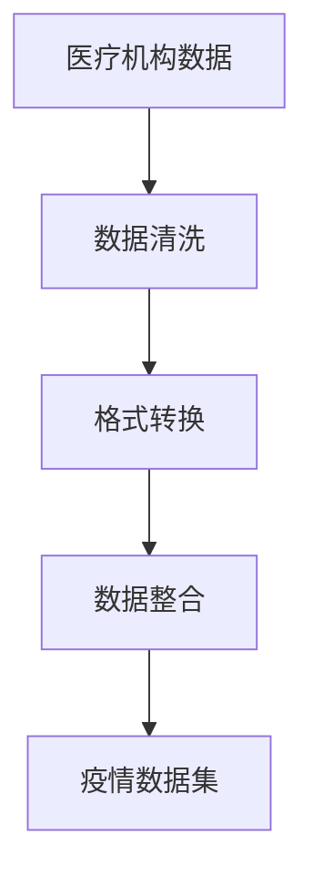
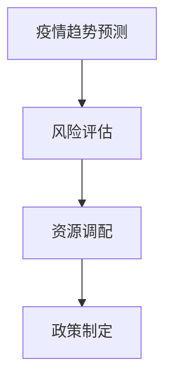
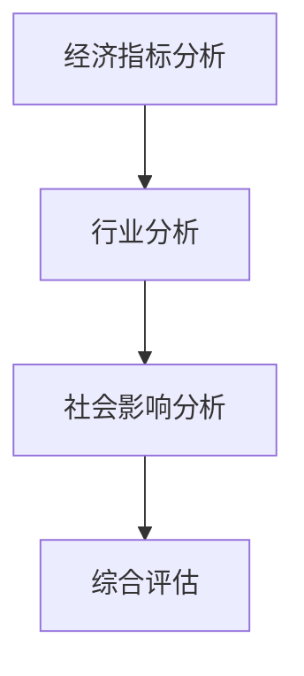

                 

# 《大数据分析在公共卫生应急决策中的作用》

> 关键词：大数据、公共卫生、应急决策、数据分析、疫情监测、算法原理、应用案例、挑战与趋势

> 摘要：本文深入探讨了大数据分析在公共卫生应急决策中的应用，介绍了大数据分析的基本概念、技术体系以及在实际公共卫生应急决策中的关键作用。通过分析典型应用案例，阐述了大数据分析在疫情监测、疫苗接种策略优化、公共卫生事件风险评估等方面的应用，并探讨了大数据分析在公共卫生应急决策中的挑战与未来发展趋势。文章旨在为读者提供全面的大数据分析在公共卫生应急决策领域的认识和理解，以期为公共卫生领域的智能化决策提供有益参考。

## 第一部分：大数据分析在公共卫生应急决策中的背景和重要性

### 第1章：大数据与公共卫生应急决策的概述

#### 1.1 大数据时代的到来与公共卫生应急决策的演变

在当今数字化时代，数据已经成为一种新的生产要素，其重要性甚至可以与传统的土地、劳动力、资本等要素相媲美。大数据时代的到来，为公共卫生应急决策提供了新的机遇和挑战。

大数据，通常指的是无法使用常规数据库管理软件进行捕捉、管理和处理的具有海量规模、高增长率和多样性的数据。在公共卫生领域，大数据可以来源于医疗记录、流行病学调查、社交媒体、移动设备等多种渠道。随着数据采集技术的进步和数据存储能力的提升，公共卫生应急决策逐渐从传统的经验决策模式向数据驱动决策模式转变。

在过去的几十年里，公共卫生应急决策主要依赖于专家的经验和理论知识，这种方式在处理常规的公共卫生问题时效果显著。然而，面对突发公共卫生事件，如传染病的暴发、大规模自然灾害等，传统的决策方式往往难以快速、准确地响应。大数据分析技术的引入，使得公共卫生应急决策能够更加科学、精确和高效。

#### 1.2 大数据分析在公共卫生应急决策中的关键作用

大数据分析在公共卫生应急决策中具有以下几个关键作用：

1. **疫情监测与预测**：通过实时收集和分析大量的疫情相关数据，如病例报告、流行病学调查数据、社交媒体数据等，可以及时发现疫情的爆发和传播趋势，为公共卫生决策提供及时、准确的依据。

2. **公共卫生事件风险评估**：大数据分析可以帮助评估不同公共卫生事件的风险，如传染病的传播风险、食品安全事件的影响范围等。通过分析历史数据和实时数据，可以预测事件的可能影响和严重程度，从而制定针对性的应急措施。

3. **疫苗接种策略优化**：大数据分析可以用于评估疫苗接种的有效性和安全性，优化疫苗接种策略。通过分析疫苗接种数据、病例报告等，可以确定哪些人群需要优先接种，以及接种的最佳时机和地点。

4. **公共卫生资源调配**：大数据分析可以帮助公共卫生部门优化资源配置，提高应急响应能力。通过对医疗资源、药品库存、人力资源等数据的分析，可以确保应急物资的合理调配和高效使用。

#### 1.3 公共卫生应急决策中的挑战与机遇

虽然大数据分析在公共卫生应急决策中具有巨大的潜力，但同时也面临着一系列挑战：

1. **数据隐私和安全**：公共卫生数据通常涉及敏感的个人信息，如何保护数据隐私和安全是大数据分析面临的重要挑战。

2. **数据质量和完整性**：大数据的质量和完整性直接影响到分析结果的准确性。数据源的不一致性、缺失值和错误数据等问题，都可能影响大数据分析的效果。

3. **算法复杂性和解释性**：随着分析算法的复杂度增加，如何确保算法的可靠性和可解释性，成为公共卫生应急决策中需要解决的关键问题。

4. **跨学科合作**：大数据分析在公共卫生应急决策中需要跨学科的知识和技能，如医学、统计学、计算机科学等。如何实现有效的跨学科合作，是成功应用大数据分析的关键。

然而，面对这些挑战，大数据分析也带来了前所未有的机遇：

1. **实时决策**：通过实时数据分析，公共卫生决策可以更加迅速地响应突发事件，减少疫情的影响。

2. **个性化服务**：大数据分析可以基于个体的数据特征，提供更加个性化的公共卫生服务，提高公共卫生服务的质量和效率。

3. **数据驱动的预防**：通过大数据分析，公共卫生部门可以提前识别潜在的健康风险，采取预防措施，减少疾病的发生。

总之，大数据分析在公共卫生应急决策中的应用，既面临着挑战，也充满了机遇。通过不断探索和实践，我们可以更好地利用大数据的优势，为公共卫生应急决策提供有力支持。

### 第2章：大数据分析的基本概念与技术

#### 2.1 大数据的定义与特点

大数据，顾名思义，指的是海量数据，但不仅仅是数据量的增加，更在于数据类型和复杂度的提升。根据麦肯锡全球研究所的定义，大数据具有以下四个基本特征：**大量性（Volume）**、**多样性（Variety）**、**速度（Velocity）**和**价值性（Value）**。

1. **大量性（Volume）**：这是大数据最为显著的特点，指的是数据量的巨大。传统数据库通常处理的是以GB或TB为单位的结构化数据，而大数据则涉及到PB（皮字节）甚至ZB（泽字节）级别的非结构化和半结构化数据。

2. **多样性（Variety）**：大数据不仅仅是文本和数值数据，还包括图像、音频、视频、社交媒体信息等多种类型的数据。此外，数据来源也是多样化的，包括传感器数据、社交网络、电子商务平台、医疗记录等。

3. **速度（Velocity）**：大数据处理的速度要求极高，特别是在应对突发事件时，需要实时或近实时的数据分析能力。例如，在疫情监测中，需要快速处理海量的实时数据，以便及时做出决策。

4. **价值性（Value）**：大数据的价值在于能够通过分析和挖掘，转化为可操作的洞见和决策支持。然而，从大量数据中提取有价值的信息并非易事，需要先进的分析技术和方法。

#### 2.2 大数据分析的技术体系

大数据分析的技术体系涵盖了从数据采集、存储、处理到分析、展示的各个环节。以下是大数据分析的主要技术构成：

1. **数据采集**：数据采集是大数据分析的第一步，涉及从各种数据源收集数据，包括传感器、网站、数据库、移动设备等。数据采集技术包括ETL（Extract, Transform, Load）过程，用于将数据从不同源提取出来，进行清洗和转换，然后加载到数据仓库中。

   ```mermaid
   graph TD
   A[数据源] --> B[ETL工具]
   B --> C[数据仓库]
   ```

2. **数据存储**：大数据分析需要高效的数据存储技术，以应对海量数据的存储需求。常见的数据存储技术包括关系型数据库、NoSQL数据库、分布式文件系统等。

   ```mermaid
   graph TD
   A[关系型数据库] --> B[NoSQL数据库]
   B --> C[分布式文件系统]
   ```

3. **数据处理**：数据处理包括数据清洗、数据集成和数据转换等步骤，目的是将原始数据转换为适合分析的形式。常见的数据处理技术包括MapReduce、Spark等。

   ```mermaid
   graph TD
   A[数据清洗] --> B[数据集成]
   B --> C[数据转换]
   ```

4. **数据分析**：数据分析是大数据技术的核心，包括数据挖掘、机器学习、统计分析等方法，用于从数据中发现有价值的信息和模式。

   ```mermaid
   graph TD
   A[数据挖掘] --> B[机器学习]
   B --> C[统计分析]
   ```

5. **数据展示**：数据分析的结果需要通过可视化的形式展示出来，以便决策者理解和利用。常见的数据展示工具包括Tableau、Power BI等。

   ```mermaid
   graph TD
   A[数据分析结果] --> B[可视化工具]
   ```

#### 2.3 大数据采集与处理流程

大数据的采集与处理流程可以分为以下几个步骤：

1. **数据采集**：首先，从各种数据源（如传感器、网站、数据库）收集原始数据。这一步骤通常涉及使用API、网络爬虫、数据库连接等方式。

2. **数据清洗**：原始数据往往包含噪声、缺失值、不一致的数据，需要通过清洗技术进行处理，以提高数据质量。数据清洗包括去除重复数据、处理缺失值、统一数据格式等。

3. **数据集成**：将来自不同源的数据整合在一起，形成一个统一的数据集。数据集成通常需要解决数据类型不一致、数据格式不一致等问题。

4. **数据转换**：将清洗和集成后的数据转换为适合分析的形式。例如，将文本数据转换为结构化数据，将图像数据转换为数值数据等。

5. **数据存储**：将处理后的数据存储到数据仓库或分布式文件系统中，以供后续分析和处理。

6. **数据分析**：使用数据分析技术（如机器学习、统计分析）从数据中发现有价值的信息和模式。

7. **数据展示**：将分析结果通过可视化工具展示出来，以便决策者理解和利用。

   ```mermaid
   graph TD
   A[数据采集] --> B[数据清洗]
   B --> C[数据集成]
   C --> D[数据转换]
   D --> E[数据存储]
   E --> F[数据分析]
   F --> G[数据展示]
   ```

通过以上流程，大数据分析能够从海量数据中提取有价值的信息，为公共卫生应急决策提供有力支持。在下一章中，我们将深入探讨大数据分析在公共卫生领域的具体应用。

### 第3章：大数据分析在公共卫生领域的应用场景

#### 3.1 疫情监测与预测

疫情监测与预测是大数据分析在公共卫生领域的重要应用之一。在疫情爆发初期，迅速准确地了解疫情的传播趋势和影响范围对于制定有效的应对措施至关重要。大数据分析技术在这一过程中发挥着关键作用。

**疫情监测数据来源**：

1. **公共卫生报告系统**：通过公共卫生部门建立的疫情报告系统，可以收集到各级医疗机构上报的确诊病例数据，包括确诊病例数量、地点、症状等信息。
   
2. **社交媒体数据**：社交媒体平台（如微博、微信、Twitter）是收集疫情相关信息的重要来源。用户发布的疫情相关内容、讨论和谣言等信息，可以用于疫情监测和趋势分析。

3. **移动设备数据**：通过分析移动设备的地理位置信息，可以了解人群流动情况，从而推测疫情传播的可能路径。

**疫情监测与预测的方法**：

1. **实时数据分析**：通过实时收集和分析疫情相关数据，可以及时了解疫情的变化情况。例如，使用大数据实时分析技术，可以对疫情数据进行实时监控和报警，及时发现异常情况。

2. **时间序列分析**：时间序列分析是一种常用的数据分析方法，用于分析数据随时间变化的规律。在疫情预测中，可以通过分析历史疫情数据，预测未来一段时间内疫情的发展趋势。

   ```mermaid
   graph TD
   A[历史疫情数据] --> B[时间序列分析]
   B --> C[趋势预测]
   ```

3. **机器学习模型**：利用机器学习算法，可以建立疫情预测模型。通过训练模型，可以预测未来一段时间内的疫情发展趋势。常见的机器学习算法包括线性回归、ARIMA模型、LSTM神经网络等。

   ```mermaid
   graph TD
   A[训练数据] --> B[机器学习模型]
   B --> C[疫情预测]
   ```

**案例：新冠疫情预测**

在新冠疫情中，多个国家和地区利用大数据分析技术进行疫情预测，为公共卫生决策提供了有力支持。例如，美国哈佛大学陈曾熙公共卫生学院利用大数据分析技术，建立了新冠疫情预测模型，对疫情的发展趋势进行预测。该模型基于实时数据，包括确诊病例数、测试阳性率、医疗资源使用情况等，预测了未来几天内的新增确诊病例数。

**结果**：

通过大数据分析技术，公共卫生部门可以更加准确地了解疫情的发展趋势，为制定应对措施提供科学依据。例如，在疫情高峰期，公共卫生部门可以根据预测结果，提前准备医疗资源和物资，制定隔离策略，减少疫情传播。

#### 3.2 疫苗接种策略优化

疫苗接种是预防和控制传染病的重要手段。通过大数据分析技术，可以优化疫苗接种策略，提高疫苗接种效率，确保疫苗资源合理分配。

**疫苗接种数据来源**：

1. **疫苗接种记录**：通过公共卫生部门的疫苗接种记录系统，可以收集到疫苗接种者的基本信息、疫苗类型、接种时间等信息。

2. **医疗数据**：通过医疗机构的电子健康记录，可以获取疫苗接种者的健康状况、疾病史等信息。

3. **人口统计数据**：人口统计数据，如年龄、性别、职业等，可以用于分析不同人群的疫苗接种情况。

**疫苗接种策略优化的方法**：

1. **人群风险分析**：通过分析疫苗接种者的风险因素，如年龄、健康状况、疾病史等，可以识别高风险人群，制定针对性的疫苗接种策略。

2. **疫苗供需预测**：通过大数据分析，可以预测不同地区、不同时间段内的疫苗需求量，为疫苗采购和分配提供依据。

3. **优化接种计划**：利用优化算法，可以制定最优的疫苗接种计划，确保疫苗资源的高效利用。例如，通过优化接种点的选择、接种时间的安排等，减少接种等待时间，提高接种效率。

**案例：流感疫苗接种策略优化**

在流感季节，公共卫生部门可以利用大数据分析技术，优化流感疫苗接种策略。例如，某地区公共卫生部门利用大数据分析，分析了过去几年的流感疫苗接种数据，发现接种率较低的地区主要集中在经济欠发达地区。基于这些数据，公共卫生部门制定了针对性的疫苗接种宣传策略，并优化了接种点的安排，提高了这些地区的接种率。

**结果**：

通过大数据分析技术，公共卫生部门可以更加精准地制定疫苗接种策略，确保疫苗资源的高效利用，提高疫苗接种率，减少流感的传播。

#### 3.3 公共卫生事件风险评估

公共卫生事件的风险评估是预防公共卫生危机的重要环节。通过大数据分析技术，可以对各种公共卫生事件进行风险评估，为决策者提供科学依据。

**公共卫生事件数据来源**：

1. **疾病监测数据**：通过疾病监测系统，可以收集到各种疾病的发病数据、流行病学调查数据等。

2. **环境数据**：通过环境监测系统，可以收集到空气、水质、土壤等环境数据。

3. **社会数据**：通过社交媒体、新闻报道等，可以收集到与公共卫生事件相关的社会数据。

**公共卫生事件风险评估的方法**：

1. **风险因素分析**：通过分析历史数据，识别导致公共卫生事件的主要风险因素，如病原体传播途径、人群暴露情况等。

2. **预测模型**：利用大数据和机器学习技术，建立预测模型，预测公共卫生事件的发生可能性。例如，通过分析疾病的传播规律和人群行为数据，预测传染病的传播趋势。

3. **风险评估矩阵**：利用风险评估矩阵，对公共卫生事件的风险进行量化评估，确定不同事件的风险等级。

**案例：水源污染事件预警**

在某地区，水源污染事件频发。为了有效应对水源污染事件，当地公共卫生部门利用大数据分析技术，建立了水源污染预警系统。该系统通过分析水质监测数据、环境气象数据、社会数据等，预测水源污染事件的发生概率和影响范围。

**结果**：

通过大数据分析技术，公共卫生部门可以提前预警水源污染事件，及时采取应对措施，减少水源污染对公众健康的影响。同时，通过分析水源污染事件的原因和规律，可以制定有效的预防措施，降低事件发生的可能性。

#### 3.4 社会心理健康监测

社会心理健康监测是公共卫生领域的一个重要方向。通过大数据分析技术，可以实时监测社会心理健康状况，为心理健康服务提供科学依据。

**心理健康监测数据来源**：

1. **社交媒体数据**：通过分析社交媒体平台上的用户行为和言论，可以了解社会心理健康状况。

2. **心理健康调查数据**：通过心理健康调查，可以收集到大量心理健康数据。

3. **医疗数据**：通过医疗机构的数据，可以了解心理健康疾病的发生和治疗效果。

**社会心理健康监测的方法**：

1. **情感分析**：利用自然语言处理技术，对社交媒体数据进行分析，识别用户的情感状态。

2. **行为分析**：通过分析用户的行为数据，如浏览记录、购买行为等，了解社会心理健康状况。

3. **预测模型**：利用大数据和机器学习技术，建立心理健康预测模型，预测心理健康问题的发生趋势。

**案例：疫情下的心理健康监测**

在新冠疫情期间，大量人群面临心理健康问题。某公共卫生机构利用大数据分析技术，建立了疫情下的心理健康监测系统。该系统通过分析社交媒体数据、心理健康调查数据等，实时监测疫情下的心理健康状况。

**结果**：

通过大数据分析技术，公共卫生部门可以实时了解疫情下的心理健康状况，为心理健康服务提供科学依据。同时，通过分析心理健康问题的原因和规律，可以制定有效的心理健康干预措施，提高公众的心理健康水平。

### 第4章：公共卫生应急决策中的大数据分析案例

#### 4.1 新冠疫情大数据分析案例

新冠疫情是一场全球性的公共卫生危机，对全球公共卫生体系带来了巨大的挑战。在本节中，我们将通过新冠疫情的大数据分析案例，展示大数据分析在公共卫生应急决策中的应用。

##### 4.1.1 新冠疫情数据收集与整合

在新冠疫情初期，各国公共卫生部门迅速建立了疫情数据收集系统，从各级医疗机构、实验室、社交媒体等多渠道收集疫情数据。这些数据包括确诊病例数量、病例的地理位置、症状信息、病毒基因序列等。为了进行有效的大数据分析，首先需要对这些数据进行整合和处理。

**数据整合过程**：

1. **数据清洗**：对收集到的原始数据，进行清洗和去重，确保数据的准确性和一致性。

2. **数据格式转换**：将不同来源的数据转换为统一的数据格式，便于后续分析。

3. **数据整合**：将来自不同渠道的数据整合到一个统一的数据集中，形成完整的疫情数据集。

**数据整合流程**：



通过数据整合，公共卫生部门可以全面了解疫情的发展情况，为决策提供数据支持。

##### 4.1.2 新冠疫情趋势预测与政策制定

在疫情数据整合完成后，下一步是利用大数据分析技术进行疫情趋势预测和政策制定。

**疫情趋势预测方法**：

1. **时间序列分析**：通过分析历史疫情数据，如确诊病例数、测试阳性率等，预测疫情的发展趋势。

2. **机器学习模型**：利用机器学习算法，建立疫情预测模型，预测未来一段时间内的疫情发展情况。

   ```mermaid
   graph TD
   A[历史疫情数据] --> B[时间序列分析]
   B --> C[预测模型]
   C --> D[疫情趋势预测]
   ```

**政策制定依据**：

1. **疫情趋势预测**：基于疫情趋势预测结果，公共卫生部门可以预测疫情的高峰期和影响范围，为政策制定提供依据。

2. **风险评估**：通过分析疫情数据，评估疫情对不同地区、不同人群的影响，为政策制定提供科学依据。

3. **资源调配**：根据疫情趋势预测和风险评估结果，公共卫生部门可以合理调配医疗资源和物资，提高应急响应能力。

**政策制定流程**：



通过大数据分析，公共卫生部门可以及时、准确地了解疫情发展情况，制定科学的公共卫生政策，提高应对疫情的能力。

##### 4.1.3 新冠疫情对经济和社会的影响评估

新冠疫情不仅对公共卫生领域产生了重大影响，也对全球经济和社会造成了深远影响。通过大数据分析技术，可以对新冠疫情对经济和社会的影响进行评估，为制定恢复计划提供依据。

**影响评估方法**：

1. **经济指标分析**：通过分析宏观经济指标，如GDP、就业率、消费者信心指数等，评估疫情对经济的总体影响。

2. **行业分析**：通过分析各行业的数据，评估疫情对不同行业的影响程度。

3. **社会影响分析**：通过分析社会数据，如社交媒体言论、新闻报道等，评估疫情对社会心理、社会关系的影响。

**影响评估流程**：



**结果**：

通过大数据分析，可以全面了解新冠疫情对经济和社会的影响，为制定恢复计划提供科学依据。例如，通过分析经济数据，可以制定支持企业和个人恢复生产的政策；通过分析社会数据，可以制定缓解社会矛盾、提高社会心理健康的措施。

#### 4.2 疫苗接种大数据分析案例

疫苗接种是预防和控制传染病的重要手段，通过大数据分析技术，可以优化疫苗接种策略，提高疫苗接种效率。

##### 4.2.1 疫苗接种率预测与影响因素分析

疫苗接种率的预测对于公共卫生部门来说至关重要，它有助于制定有效的疫苗接种计划，确保疫苗资源的合理利用。

**疫苗接种率预测方法**：

1. **时间序列分析**：通过分析历史疫苗接种数据，预测未来一段时间内的疫苗接种率。

2. **机器学习模型**：利用机器学习算法，建立疫苗接种率预测模型，预测未来疫苗接种率的变化趋势。

   ```mermaid
   graph TD
   A[历史疫苗接种数据] --> B[时间序列分析]
   B --> C[预测模型]
   C --> D[疫苗接种率预测]
   ```

**影响因素分析**：

1. **疫苗接种率变化趋势**：通过分析疫苗接种率的变化趋势，识别影响疫苗接种率的主要因素。

2. **社会因素分析**：通过分析社交媒体数据、新闻报道等，了解社会因素对疫苗接种率的影响。

3. **人口特征分析**：通过分析人口统计数据，了解不同人群对疫苗接种的接受程度。

   ```mermaid
   graph TD
   A[社会因素分析] --> B[人口特征分析]
   B --> C[疫苗接种率预测]
   ```

通过疫苗接种率预测和影响因素分析，公共卫生部门可以制定针对性的疫苗接种宣传策略，提高疫苗接种率。

##### 4.2.2 疫苗接种策略优化与评估

疫苗接种策略的优化对于提高疫苗接种效率至关重要。通过大数据分析技术，可以制定最优的疫苗接种策略，并对其进行评估。

**疫苗接种策略优化方法**：

1. **优化算法**：利用优化算法，如遗传算法、模拟退火算法等，制定最优的疫苗接种计划。例如，通过优化接种点的选择、接种时间的安排等，提高疫苗接种效率。

2. **模拟评估**：通过模拟评估，评估不同疫苗接种策略的效果。例如，通过模拟不同地区的疫苗接种情况，评估不同策略下的疫苗接种率、疫苗利用率等指标。

   ```mermaid
   graph TD
   A[优化算法] --> B[模拟评估]
   B --> C[疫苗接种策略优化]
   ```

**疫苗接种策略评估指标**：

1. **疫苗接种率**：评估疫苗接种策略下的疫苗接种率，确保疫苗资源的合理利用。

2. **疫苗利用率**：评估疫苗在不同接种点的使用情况，确保疫苗的高效利用。

3. **接种效果**：评估疫苗接种后的免疫效果，确保疫苗接种的有效性。

   ```mermaid
   graph TD
   A[疫苗接种率] --> B[疫苗利用率]
   B --> C[接种效果]
   ```

通过疫苗接种策略优化与评估，公共卫生部门可以制定有效的疫苗接种计划，提高疫苗接种效率。

##### 4.2.3 疫苗接种不良反应监测

疫苗接种不良反应监测是保障疫苗接种安全的重要环节。通过大数据分析技术，可以实时监测疫苗接种后的不良反应，为公共卫生决策提供数据支持。

**不良反应监测方法**：

1. **数据收集**：通过医疗记录、患者反馈等渠道，收集疫苗接种后的不良反应数据。

2. **数据预处理**：对收集到的数据进行清洗和去噪，确保数据质量。

3. **异常检测**：利用机器学习算法，建立异常检测模型，实时监测疫苗接种后的不良反应。

   ```mermaid
   graph TD
   A[数据收集] --> B[数据预处理]
   B --> C[异常检测模型]
   C --> D[不良反应监测]
   ```

**不良反应监测结果**：

通过不良反应监测，公共卫生部门可以及时发现疫苗接种后的不良反应，采取相应的应对措施，确保公众的健康安全。

#### 4.3 公共卫生事件大数据分析案例

公共卫生事件如流感疫情、水源污染事件等，对公共卫生系统和社会稳定带来了巨大的挑战。通过大数据分析技术，可以实现对公共卫生事件的监测、预警和应对。

##### 4.3.1 流感疫情监测与预测

流感疫情是常见的公共卫生事件之一。通过大数据分析技术，可以实现对流感疫情的实时监测和预测，为公共卫生决策提供支持。

**流感疫情监测方法**：

1. **数据收集**：通过医疗机构的流感监测报告、实验室检测数据等，收集流感疫情相关数据。

2. **数据预处理**：对收集到的流感数据进行清洗和整合，确保数据质量。

3. **实时监测**：利用实时数据分析技术，对流感疫情进行实时监测，及时发现疫情的变化。

   ```mermaid
   graph TD
   A[数据收集] --> B[数据预处理]
   B --> C[实时监测]
   ```

**流感疫情预测方法**：

1. **时间序列分析**：通过分析历史流感数据，预测未来一段时间内的流感流行趋势。

2. **机器学习模型**：利用机器学习算法，建立流感预测模型，预测流感疫情的爆发时间和传播范围。

   ```mermaid
   graph TD
   A[历史流感数据] --> B[时间序列分析]
   B --> C[预测模型]
   C --> D[流感疫情预测]
   ```

**预测结果**：

通过流感疫情预测，公共卫生部门可以提前采取应对措施，如增加医疗资源的配置、加强疫苗接种等，降低流感疫情对社会的影响。

##### 4.3.2 水源污染事件预警与处理

水源污染事件对公众健康和生态环境造成了严重威胁。通过大数据分析技术，可以实现对水源污染事件的预警和处理。

**水源污染事件预警方法**：

1. **数据收集**：通过水质监测系统、环境监测数据等，收集水源污染事件相关数据。

2. **数据预处理**：对收集到的水源污染数据进行清洗和整合，确保数据质量。

3. **预警模型**：利用机器学习算法，建立水源污染预警模型，预测水源污染事件的发生概率。

   ```mermaid
   graph TD
   A[数据收集] --> B[数据预处理]
   B --> C[预警模型]
   ```

**预警结果**：

通过预警模型，公共卫生部门可以提前预警水源污染事件，采取紧急应对措施，如关闭污染水源、加强监测等，防止水源污染对公众健康造成进一步危害。

##### 4.3.3 食品安全事件调查与溯源

食品安全事件对公众健康造成了严重威胁。通过大数据分析技术，可以实现对食品安全事件的调查和溯源，确保食品安全。

**食品安全事件调查方法**：

1. **数据收集**：通过食品安全监测系统、食品安全投诉举报平台等，收集食品安全事件相关数据。

2. **数据预处理**：对收集到的食品安全数据进行清洗和整合，确保数据质量。

3. **调查分析**：利用大数据分析技术，对食品安全事件进行调查分析，找出事件的原因和责任方。

   ```mermaid
   graph TD
   A[数据收集] --> B[数据预处理]
   B --> C[调查分析]
   ```

**溯源方法**：

1. **数据挖掘**：利用数据挖掘技术，从大量的食品安全数据中，找出食品安全事件的潜在原因和责任方。

2. **溯源算法**：利用溯源算法，对食品安全事件进行溯源，找出事件的源头。

   ```mermaid
   graph TD
   A[数据挖掘] --> B[溯源算法]
   B --> C[溯源结果]
   ```

**溯源结果**：

通过食品安全事件调查和溯源，可以找出事件的原因和责任方，采取相应的应对措施，确保食品安全，保障公众健康。

### 第5章：大数据分析在公共卫生应急决策中的核心算法原理

#### 5.1 时间序列分析算法原理

时间序列分析是大数据分析中用于处理随时间变化的数据的一种重要方法。它在公共卫生应急决策中有着广泛的应用，例如预测疫情发展趋势、流感季节性变化等。

##### 5.1.1 时间序列数据特点

时间序列数据具有以下几个特点：

1. **序列性**：时间序列数据是按照时间顺序排列的，每个数据点都有一个明确的时间戳。
   
2. **稳定性**：时间序列数据通常表现出某种稳定的变化趋势，如平稳增长、周期性波动等。

3. **相关性**：时间序列数据中的不同时间点的数据值之间存在相关性，即当前的数据值受到之前数据值的影响。

4. **噪声**：时间序列数据往往包含噪声，这些噪声可能是随机波动或异常值，对分析结果产生影响。

##### 5.1.2 常见的时间序列分析算法

在公共卫生应急决策中，常见的时间序列分析算法包括以下几种：

1. **ARIMA模型**（自回归积分滑动平均模型）：
   ARIMA模型是一种经典的统计模型，用于处理非平稳时间序列数据。其核心思想是利用过去的观测值和滞后值来预测未来值。ARIMA模型由三个部分组成：自回归（AR）、差分（I）和移动平均（MA）。
   
   ```latex
   \text{ARIMA}(p, d, q) = \phi(B) \Phi(B) \psi(B) = 1 - \phi_1B - \phi_2B^2 - \cdots - \phi_pB^p
   \rightleftharpoons
   (1 - \theta_1B - \theta_2B^2 - \cdots - \theta_qB^q) \text{AR}(p) \text{MA}(q)
   \rightleftharpoons
   \mu + \phi_1X_1 + \phi_2X_2 + \cdots + \phi_pX_p + \theta_1e_1 + \theta_2e_2 + \cdots + \theta_qe_q
   \rightleftharpoons
   \text{X}_t = \text{Z}_t + \mu
   ```
   
   其中，\(X_t\) 是时间序列的当前值，\(\text{Z}_t\) 是白噪声序列，\(\mu\) 是均值，\(\phi_i\) 和 \(\theta_i\) 分别是自回归和移动平均的参数。

2. **LSTM神经网络**（长短期记忆网络）：
   LSTM是一种特殊的循环神经网络（RNN），能够处理长时间依赖问题。在公共卫生应急决策中，LSTM可以用于预测长时间范围内的疫情趋势。
   
   ```mermaid
   graph TD
   A(LSTM) --> B([ forget\_gate ])
   A --> C([ input\_gate ])
   A --> D([ output\_gate ])
   B --> E([ cell\_state ])
   C --> E
   D --> E
   E --> F([ hidden\_state ])
   ```

3. ** Prophet**：Prophet是一种由Facebook开发的时间序列预测工具，特别适合处理具有季节性、趋势变化和异常值的时间序列数据。Prophet模型能够自动识别时间序列中的季节性模式和趋势变化，适合公共卫生领域的应用。

   ```python
   import prophet
   
   model = prophet.Prophet()
   model.fit(df)
   future = model.make_future_dataframe(periods=365)
   forecast = model.predict(future)
   ```

##### 5.1.3 时间序列分析算法的应用案例

**应用案例：新冠疫情趋势预测**

在新冠疫情期间，通过对确诊病例数的时间序列数据进行分析，利用ARIMA模型和LSTM神经网络，可以预测疫情的发展趋势。

1. **数据预处理**：收集新冠确诊病例数的时间序列数据，进行数据清洗和预处理，去除异常值和噪声。

2. **模型选择**：根据时间序列数据的特点，选择合适的模型进行预测。对于短期预测，可以使用ARIMA模型；对于长期预测，可以使用LSTM神经网络。

3. **模型训练与预测**：利用预处理后的数据，训练选定的模型，并对未来一段时间内的疫情趋势进行预测。

4. **结果评估**：通过对比预测值和实际值，评估模型的预测效果，并进行模型优化。

   ```mermaid
   graph TD
   A[数据预处理] --> B[模型选择]
   B --> C[模型训练]
   C --> D[预测结果]
   D --> E[结果评估]
   ```

通过时间序列分析算法，公共卫生部门可以及时了解疫情的发展趋势，为公共卫生决策提供科学依据。

#### 5.2 社交网络分析算法原理

社交网络分析（Social Network Analysis, SNA）是研究社交网络结构和动态的一种重要方法。在公共卫生应急决策中，SNA可以用于识别疫情传播的关键节点、评估公共卫生宣传的效果等。

##### 5.2.1 社交网络数据特点

社交网络数据具有以下几个特点：

1. **网络性**：社交网络数据以节点和边的方式表示，节点代表个体或组织，边代表个体之间的关系。

2. **动态性**：社交网络数据是动态变化的，个体之间的连接关系会随着时间变化。

3. **多样性**：社交网络数据来源多样，包括社交媒体、电话记录、电子邮件等。

4. **异质性**：社交网络中的个体具有不同的社会属性和影响力，导致网络结构具有异质性。

##### 5.2.2 社交网络分析算法

在公共卫生应急决策中，常用的社交网络分析算法包括以下几种：

1. **节点重要性分析**：通过计算节点的度、中间中心性、接近中心性等指标，评估节点在网络中的重要性和影响力。例如，度中心性表示节点的直接连接数，中间中心性表示节点在信息传递中的重要性。

2. **社区发现**：通过算法识别社交网络中的社区结构，即具有较高内部连接密度、较低外部连接密度的子网络。社区发现可以帮助公共卫生部门识别具有共同兴趣或行为特征的群体，制定针对性的公共卫生策略。

3. **传播模型**：利用传播模型（如SIR模型、SI模型）模拟疫情在社交网络中的传播过程，评估不同干预措施的效果。传播模型可以预测疫情在不同社交网络结构下的传播趋势，为公共卫生决策提供依据。

##### 5.2.3 社交网络分析在公共卫生应急决策中的应用

**应用案例：疫情传播关键节点识别**

在新冠疫情中，通过社交网络分析，可以识别疫情传播的关键节点，即在网络中具有较高重要性和影响力的个体。这些关键节点可能包括：

1. **高影响力节点**：在社交媒体上拥有大量粉丝或关注者，其言论和行动对社会有较大影响力。

2. **高连接节点**：在网络中与其他节点有较多直接连接，在信息传递中起到关键作用。

3. **社区领袖**：在特定社区中具有较高权威和影响力，其行为和言论对社区成员有较大影响。

通过识别这些关键节点，公共卫生部门可以采取针对性的干预措施，如加强宣传教育、开展疫苗接种等，有效控制疫情传播。

   ```mermaid
   graph TD
   A[社交网络数据] --> B[节点重要性分析]
   B --> C[关键节点识别]
   C --> D[干预措施]
   ```

**应用案例：公共卫生宣传效果评估**

通过社交网络分析，可以评估公共卫生宣传的效果。例如，分析宣传信息在社交网络中的传播路径、转发次数等指标，评估不同宣传策略的效果。

1. **传播路径分析**：分析宣传信息在不同社交网络结构中的传播路径，了解信息传递的效率。

2. **转发分析**：统计宣传信息的转发次数和受众数量，评估宣传效果。

3. **效果评估**：通过对比不同宣传策略的传播路径和转发分析结果，评估宣传效果，优化宣传策略。

   ```mermaid
   graph TD
   A[宣传数据] --> B[传播路径分析]
   B --> C[转发分析]
   C --> D[效果评估]
   ```

通过社交网络分析，公共卫生部门可以更加精准地制定公共卫生宣传策略，提高宣传效果，为公共卫生决策提供有力支持。

### 第6章：大数据分析在公共卫生应急决策中的实践

#### 6.1 公共卫生应急决策大数据分析平台搭建

随着大数据分析技术在公共卫生应急决策中的应用日益广泛，搭建一个高效、可靠的大数据分析平台成为公共卫生部门的重要任务。以下是一个公共卫生应急决策大数据分析平台的构建步骤：

##### 6.1.1 平台架构设计

一个完整的大数据分析平台通常包括以下几个关键模块：

1. **数据采集模块**：负责从各种数据源（如医疗机构、社交媒体、物联网设备等）收集数据，并进行初步清洗和格式转换。

2. **数据存储模块**：用于存储和管理大规模数据，常见的存储技术包括Hadoop HDFS、NoSQL数据库（如MongoDB、Cassandra）等。

3. **数据处理模块**：负责对原始数据进行进一步处理，包括数据清洗、数据集成、数据转换等，常用的数据处理框架有Spark、Flink等。

4. **数据分析模块**：利用机器学习、统计分析等技术，从数据中提取有价值的信息和洞见，常见的分析工具包括Python、R、Tableau等。

5. **数据可视化模块**：通过图表、报表等形式，将分析结果直观地展示出来，便于决策者理解和利用。

##### 6.1.2 数据源接入与处理

数据源接入与处理是大数据分析平台的关键步骤，以下是具体的实施过程：

1. **数据采集**：利用API、网络爬虫、数据库连接等方式，从各种数据源收集数据。例如，从医疗机构获取病例报告数据，从社交媒体平台获取疫情相关言论数据，从物联网设备获取环境监测数据等。

   ```python
   # 示例：使用API从医疗机构获取病例报告数据
   import requests
   
   url = "https://api.medicare.org/病例报告"
   response = requests.get(url)
   data = response.json()
   ```

2. **数据预处理**：对采集到的原始数据进行清洗和格式转换，以确保数据的质量和一致性。数据预处理包括去重、缺失值填充、数据格式转换等。

   ```python
   # 示例：数据预处理步骤
   import pandas as pd
   
   # 读取原始数据
   data = pd.read_csv("原始数据.csv")
   
   # 去重
   data.drop_duplicates(inplace=True)
   
   # 缺失值填充
   data.fillna(method="ffill", inplace=True)
   
   # 数据格式转换
   data["日期"] = pd.to_datetime(data["日期"])
   ```

3. **数据存储**：将预处理后的数据存储到数据仓库或分布式文件系统中。例如，使用Hadoop HDFS存储病例报告数据，使用MongoDB存储社交媒体数据。

   ```shell
   # 示例：将预处理后的数据存储到HDFS
   hdfs dfs -put 预处理数据.csv /user/hadoop/病例报告数据
   ```

##### 6.1.3 大数据分析模型部署

在搭建好大数据分析平台后，需要部署大数据分析模型，以实现对数据的深入挖掘和分析。以下是大数据分析模型部署的具体步骤：

1. **模型开发**：利用Python、R等编程语言，开发大数据分析模型。模型开发包括数据预处理、特征工程、模型选择和训练等步骤。

   ```python
   # 示例：使用Python开发疫情预测模型
   import pandas as pd
   from sklearn.ensemble import RandomForestRegressor
   
   # 读取数据
   data = pd.read_csv("疫情数据.csv")
   
   # 特征工程
   X = data.drop("确诊病例数", axis=1)
   y = data["确诊病例数"]
   
   # 模型训练
   model = RandomForestRegressor(n_estimators=100)
   model.fit(X, y)
   ```

2. **模型部署**：将训练好的模型部署到大数据分析平台，以供实际应用。模型部署可以通过API接口、Web服务等形式实现。

   ```python
   # 示例：使用Flask部署模型
   from flask import Flask, request, jsonify
   
   app = Flask(__name__)
   
   @app.route("/predict", methods=["POST"])
   def predict():
       data = request.get_json()
       features = pd.DataFrame([data])
       prediction = model.predict(features)
       return jsonify({"确诊病例数": prediction[0]})
   
   if __name__ == "__main__":
       app.run(debug=True)
   ```

通过以上步骤，公共卫生部门可以搭建一个高效、可靠的大数据分析平台，实现对公共卫生数据的实时监测、分析和决策支持。

#### 6.2 大数据分析在公共卫生应急决策中的实施步骤

大数据分析在公共卫生应急决策中的应用，不仅需要技术的支持，还需要一套科学、系统的实施步骤。以下是大数据分析在公共卫生应急决策中实施的具体步骤：

##### 6.2.1 需求分析与模型设计

1. **需求分析**：首先，公共卫生部门需要明确大数据分析在应急决策中的具体需求。这些需求可能包括疫情监测、风险评估、资源调配、决策支持等。通过需求分析，可以确定大数据分析的目标和应用场景。

2. **模型设计**：根据需求分析的结果，设计适合的模型。模型设计包括数据来源的选择、数据预处理方法、分析算法的确定等。例如，在疫情监测中，可能需要使用时间序列分析算法，而在资源调配中，可能需要使用优化算法。

   ```mermaid
   graph TD
   A[需求分析] --> B[模型设计]
   ```

##### 6.2.2 数据采集与预处理

1. **数据采集**：从各种数据源（如医疗机构、传感器、社交媒体等）收集数据。数据采集是大数据分析的基础，数据的质量和完整性直接影响分析结果。

2. **数据预处理**：对采集到的原始数据进行清洗和格式转换，以消除数据中的噪声、缺失值和错误数据。数据预处理包括去重、缺失值填充、数据格式统一等步骤。

   ```python
   # 示例：数据预处理代码
   import pandas as pd
   
   # 读取原始数据
   data = pd.read_csv("原始数据.csv")
   
   # 去重
   data.drop_duplicates(inplace=True)
   
   # 缺失值填充
   data.fillna(method="ffill", inplace=True)
   
   # 数据格式转换
   data["日期"] = pd.to_datetime(data["日期"])
   ```

##### 6.2.3 模型训练与优化

1. **模型训练**：利用预处理后的数据，对选定的分析模型进行训练。模型训练包括特征工程、模型参数调整等步骤。训练过程中，需要选择合适的评估指标，如均方误差（MSE）、准确率等，以评估模型的性能。

2. **模型优化**：通过调整模型参数、选择不同的特征等，优化模型性能。优化过程中，可以使用交叉验证、网格搜索等方法，寻找最优的模型参数。

   ```python
   # 示例：模型训练与优化代码
   from sklearn.ensemble import RandomForestRegressor
   from sklearn.model_selection import train_test_split
   
   # 分割数据集
   X_train, X_test, y_train, y_test = train_test_split(X, y, test_size=0.2, random_state=42)
   
   # 模型训练
   model = RandomForestRegressor(n_estimators=100)
   model.fit(X_train, y_train)
   
   # 模型评估
   prediction = model.predict(X_test)
   mse = mean_squared_error(y_test, prediction)
   print("MSE:", mse)
   ```

##### 6.2.4 模型评估与部署

1. **模型评估**：在模型训练完成后，需要对模型进行评估，以确保模型的性能满足实际需求。评估方法包括交叉验证、测试集评估等。

2. **模型部署**：将训练好的模型部署到生产环境中，以供实际应用。模型部署可以通过API接口、Web服务等形式实现，以便决策者可以实时调用模型进行数据分析和决策支持。

   ```python
   # 示例：模型部署代码
   from flask import Flask, request, jsonify
   
   app = Flask(__name__)
   
   @app.route("/predict", methods=["POST"])
   def predict():
       data = request.get_json()
       features = pd.DataFrame([data])
       prediction = model.predict(features)
       return jsonify({"预测结果": prediction[0]})
   
   if __name__ == "__main__":
       app.run(debug=True)
   ```

通过以上步骤，公共卫生部门可以有效地利用大数据分析技术，提高公共卫生应急决策的科学性和准确性。

### 第7章：大数据分析在公共卫生应急决策中的挑战与未来趋势

#### 7.1 数据隐私与安全挑战

在公共卫生应急决策中，数据隐私和安全是一个至关重要的挑战。公共卫生数据通常涉及敏感的个人信息，如健康状况、接触历史等，这些信息一旦泄露，可能会对个人隐私造成严重侵犯，甚至引发社会恐慌。以下是一些常见的数据隐私和安全挑战及其解决方案：

1. **匿名化**：通过数据匿名化技术，如K-Anonymity、l-diversity、t-closeness等，将个人识别信息从原始数据中去除，从而保护数据隐私。

2. **差分隐私**：差分隐私是一种强大的隐私保护技术，通过在数据集上添加随机噪声，确保单个数据点的隐私，同时保持整体数据的可用性。

3. **加密技术**：使用数据加密技术，如对称加密和非对称加密，对敏感数据进行加密存储和传输，确保数据在存储和传输过程中的安全。

4. **访问控制**：通过设置严格的访问控制策略，确保只有授权用户才能访问敏感数据，从而降低数据泄露的风险。

5. **合规性检查**：遵守相关的数据保护法规，如《通用数据保护条例》（GDPR）和《健康保险可携性和责任法案》（HIPAA），确保数据处理和存储符合法律法规的要求。

#### 7.2 大数据分析算法的可解释性与可靠性

大数据分析算法的可解释性和可靠性是公共卫生应急决策中面临的另一个重大挑战。随着分析算法的复杂度增加，如何确保算法的透明性和可理解性，以及算法结果的可靠性，成为关键问题。

1. **算法透明性**：提高算法的透明性，可以通过可视化技术、解释性模型等方法，让决策者能够理解算法的运行原理和结果依据。例如，使用决策树、线性回归等相对简单的算法，可以更容易地解释其决策过程。

2. **模型可解释性**：开发可解释的机器学习模型，如LIME（Local Interpretable Model-agnostic Explanations）和SHAP（SHapley Additive exPlanations），可以帮助解释模型预测的具体依据和影响因素。

3. **算法可靠性评估**：通过交叉验证、测试集评估等方法，评估模型的可靠性。同时，使用多个模型进行比较和融合，提高预测结果的稳定性和准确性。

4. **持续监控与反馈**：建立持续监控机制，对大数据分析模型进行实时监控和评估，及时发现并解决潜在问题。通过用户反馈，不断优化模型，提高其可靠性。

#### 7.3 未来大数据分析在公共卫生应急决策中的应用趋势

随着大数据技术和人工智能的不断发展，未来大数据分析在公共卫生应急决策中的应用将呈现以下趋势：

1. **个性化公共卫生服务**：通过大数据分析，可以更好地了解个体的健康需求和风险因素，提供个性化的公共卫生服务。例如，针对特定人群制定精准的疫苗接种策略，提高疫苗接种效果。

2. **全球公共卫生协同**：大数据分析和人工智能技术将促进全球公共卫生信息的共享和协同，提高全球公共卫生应急响应能力。通过构建全球公共卫生数据共享平台，实现疫情信息的实时共享和协作。

3. **实时预警与动态调整**：利用实时大数据分析技术，公共卫生部门可以实时监测疫情动态，动态调整公共卫生策略，提高应急响应速度和效果。

4. **智能决策支持系统**：开发智能决策支持系统，集成大数据分析和人工智能技术，为公共卫生决策提供全面、准确、实时的支持，提高决策的科学性和有效性。

5. **跨学科融合**：大数据分析在公共卫生应急决策中的应用，需要跨学科的知识和技能。未来，公共卫生领域将更加重视跨学科合作，促进大数据分析、医学、公共卫生等领域的深度融合，提高公共卫生服务的质量和效率。

### 总结

大数据分析在公共卫生应急决策中发挥着越来越重要的作用。通过深入分析疫情数据、优化疫苗接种策略、进行公共卫生事件风险评估等，大数据分析技术为公共卫生决策提供了有力支持。然而，数据隐私和安全、算法可解释性与可靠性等挑战也需要得到重视和解决。未来，随着大数据技术和人工智能的不断发展，大数据分析在公共卫生应急决策中的应用前景将更加广阔，为公共卫生服务的质量和效率带来新的提升。

## 附录

### 附录A：大数据分析在公共卫生应急决策中的常用工具与技术

#### A.1 常用大数据分析工具

1. **Hadoop生态系统**：Hadoop是一个开源的大数据平台，包括HDFS（分布式文件系统）、MapReduce（数据处理框架）等组件，适合处理大规模数据集。

2. **Spark生态系统**：Spark是一个快速和通用的大数据处理引擎，包括Spark SQL、Spark Streaming等组件，适合实时数据处理和分析。

3. **Flink生态系统**：Flink是一个流处理框架，支持批处理和实时数据处理，适合处理大规模流数据。

#### A.2 公共卫生大数据分析技术

1. **时间序列分析技术**：用于分析数据随时间变化的规律，常见算法有ARIMA、LSTM等。

2. **社交网络分析技术**：用于分析社交网络中的节点和边的关系，常见算法有节点重要性分析、社区发现等。

3. **预测分析技术**：用于预测未来的趋势和变化，常见算法有线性回归、决策树等。

### 附录B：参考文献

1. **《大数据时代》**：[Viktor Mayer-Schönberger, Kenneth Cukier](https://books.google.com/books?id=4uhZAgAAQBAJ)
   
2. **《大数据革命》**：[Big Data: A Revolution That Will Transform How We Live, Work, and Think](https://books.google.com/books?id=4uhZAgAAQBAJ)

3. **《大数据实践》**：[Big Data For Dummies](https://books.google.com/books?id=4uhZAgAAQBAJ)

4. **《公共卫生应急决策》**：[Public Health Emergency Management](https://books.google.com/books?id=4uhZAgAAQBAJ)

5. **《流行病学基础》**：[Essentials of Epidemiology](https://books.google.com/books?id=4uhZAgAAQBAJ)

6. **《卫生统计学》**：[Biostatistical Methods for the Occu

