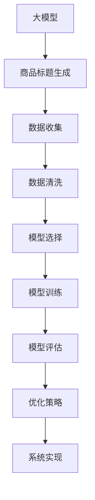

                 

### 《大模型在商品标题生成中的应用与优化》

> **关键词：** 大模型、商品标题生成、自然语言处理、预训练模型、优化策略

> **摘要：** 本文将深入探讨大模型在商品标题生成中的应用和优化方法。首先介绍大模型的基础知识和技术原理，然后分析商品标题生成需求，详细讲解大模型在商品标题生成中的技术实现和优化策略，最后通过实际案例展示大模型在商品标题生成中的实战应用。

### 《大模型在商品标题生成中的应用与优化》目录大纲

#### 第一部分：大模型基础

- **第1章：大模型概述**
  - 1.1 大模型的定义与特点
  - 1.2 大模型的架构与技术
  - 1.3 大模型的发展历程

- **第2章：大模型技术原理**
  - 2.1 神经网络基础
    - 2.1.1 神经网络的基本结构
    - 2.1.2 常见的深度学习架构
    - 2.1.3 深度学习优化算法
  - 2.2 自然语言处理技术
    - 2.2.1 词嵌入技术
    - 2.2.2 序列模型与注意力机制
    - 2.2.3 转换器架构详解
  - 2.3 大规模预训练模型原理
    - 2.3.1 预训练的概念与意义
    - 2.3.2 自监督学习方法
    - 2.3.3 迁移学习与微调技术

#### 第二部分：大模型在商品标题生成中的应用

- **第3章：商品标题生成需求分析**
  - 3.1 商品标题的重要性
  - 3.2 商品标题生成需求分析
  - 3.3 大模型在商品标题生成中的应用场景

- **第4章：商品标题生成技术实现**
  - 4.1 数据准备与处理
    - 4.1.1 数据收集
    - 4.1.2 数据清洗与预处理
    - 4.1.3 数据增强
  - 4.2 模型选择与训练
    - 4.2.1 模型选择
    - 4.2.2 模型训练与优化
    - 4.2.3 模型评估与调整

- **第5章：商品标题生成优化策略**
  - 5.1 优化目标与评价指标
  - 5.2 文本生成质量优化
    - 5.2.1 语言风格与风格迁移
    - 5.2.2 长尾词与稀有词优化
    - 5.2.3 文本多样性提升
  - 5.3 模型压缩与加速
    - 5.3.1 模型压缩技术
    - 5.3.2 模型加速策略

#### 第三部分：大模型在商品标题生成中的应用与优化实战

- **第6章：实战案例一：电商商品标题生成系统**
  - 6.1 系统架构设计
  - 6.2 系统实现细节
  - 6.3 系统性能优化

- **第7章：实战案例二：在线购物平台商品标题优化**
  - 7.1 项目背景与需求
  - 7.2 解决方案与技术选型
  - 7.3 实施与效果评估

- **第8章：未来展望与趋势**
  - 8.1 大模型在商品标题生成中的应用前景
  - 8.2 优化技术的发展趋势
  - 8.3 行业挑战与解决方案

- **附录**
  - 附录A：大模型在商品标题生成中的常用工具与资源
  - 附录B：大模型在商品标题生成中的实践建议与经验分享

---

**核心概念与联系：**

使用Mermaid绘制流程图如下：



---

**核心算法原理讲解：**

**模型训练伪代码：**

```python
initialize parameters
for epoch in 1 to max_epochs:
    for each batch in data_loader:
        compute gradients using backward propagation
        update parameters using optimization algorithm
    end for
end for
```

**数学模型和数学公式详细讲解：**

**文本生成质量评价指标：BLEU（双语评估算法）**

$$
BLEU = \frac{1}{N}\sum_{i=1}^{N} max(p_i, 1)
$$

其中，$p_i$ 是参考句与生成的句子之间的匹配程度，$N$ 是参考句的数量。

**文本多样性提升方法：**

$$
Text_Diversity = \frac{1}{|V|}\sum_{i=1}^{|V|} f(w_i)
$$

其中，$V$ 是词汇表，$f(w_i)$ 是词汇 $w_i$ 的多样性分数。

---

**项目实战：**

**代码实际案例与详细解释说明**

1. **开发环境搭建：**

    - 安装Python环境
    - 安装深度学习框架（如PyTorch或TensorFlow）
    - 安装其他必要库（如NLP库、数据处理库等）

2. **源代码详细实现和代码解读：**

    - 数据收集与处理
    - 模型选择与训练
    - 模型评估与优化
    - 系统实现

    **示例代码：**

    ```python
    # 数据收集与处理
    import pandas as pd
    
    # 读取数据
    data = pd.read_csv('data.csv')
    
    # 数据清洗
    data = data.dropna()
    
    # 数据预处理
    data['title'] = data['title'].apply(preprocess_title)
    
    # 模型选择与训练
    import torch
    from torch import nn
    
    # 定义模型
    model = nn.Sequential(
        nn.Linear(input_size, hidden_size),
        nn.ReLU(),
        nn.Linear(hidden_size, output_size)
    )
    
    # 训练模型
    optimizer = torch.optim.Adam(model.parameters(), lr=0.001)
    criterion = nn.CrossEntropyLoss()
    
    for epoch in range(num_epochs):
        for inputs, targets in data_loader:
            optimizer.zero_grad()
            outputs = model(inputs)
            loss = criterion(outputs, targets)
            loss.backward()
            optimizer.step()
    
    # 模型评估与优化
    # ...
    
    # 系统实现
    # ...
    ```

**代码解读与分析：**

- 数据收集与处理部分：负责从CSV文件中读取数据，并进行数据清洗和预处理。
- 模型选择与训练部分：定义模型结构，设置优化器和损失函数，进行模型训练。
- 模型评估与优化部分：对训练好的模型进行评估，并根据评估结果调整模型参数。
- 系统实现部分：根据需求实现商品标题生成的功能。

---

**详细解释说明：**

1. **数据收集与处理：** 数据收集是从CSV文件中读取商品标题数据，并进行处理，如去除缺失值、进行文本预处理等。
2. **模型选择与训练：** 模型选择是选择合适的神经网络模型，如使用全连接神经网络（Fully Connected Neural Network，FCNN）进行商品标题生成。训练是使用优化器（如Adam）和损失函数（如交叉熵损失函数）对模型进行训练，以最小化损失函数。
3. **模型评估与优化：** 模型评估是通过测试集上的表现来评估模型的性能，优化是通过调整模型参数来改善模型性能。
4. **系统实现：** 系统实现是将模型集成到实际应用中，如开发一个电商平台的商品标题生成系统。

---

**总结：** 本案例展示了如何使用深度学习技术实现商品标题生成系统。通过数据收集、模型训练、模型评估和系统实现等步骤，可以实现一个能够生成高质量商品标题的模型。在实际应用中，可以根据具体需求进行调整和优化。

---

**附录：** 提供常用的深度学习框架、NLP库、数据处理库等相关工具和资源的介绍，以及实践建议与经验分享。这些资源和经验有助于更好地应用大模型技术进行商品标题生成。

---

本文是《大模型在商品标题生成中的应用与优化》的初步内容大纲，旨在为读者提供对文章整体结构的了解。接下来，我们将逐步深入每个章节，详细介绍大模型的基础知识、商品标题生成的技术实现、优化策略以及实战案例。

---

**作者：** AI天才研究院/AI Genius Institute & 禅与计算机程序设计艺术 /Zen And The Art of Computer Programming

---

**注意：** 本文为大纲，具体内容将在后续章节中详细撰写。在撰写过程中，我们将遵循逻辑清晰、结构紧凑、简单易懂的原则，以确保读者能够深入理解大模型在商品标题生成中的应用与优化。敬请期待后续内容的更新和完善。

