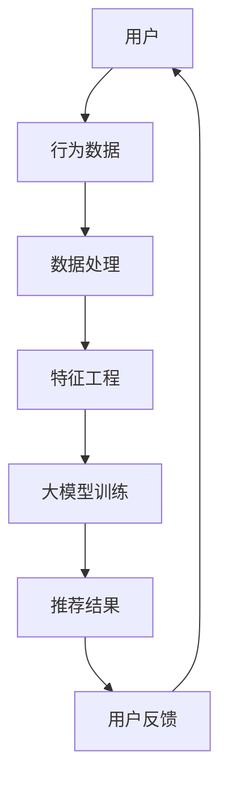

                 

### 大模型赋能推荐系统：从技术到商业的思考

#### **关键词：**
- 大模型
- 推荐系统
- 深度学习
- 自然语言处理
- 个性化推荐
- 商业策略

#### **摘要：**
随着大数据和人工智能技术的快速发展，大模型在推荐系统中的应用愈发广泛。本文将从技术角度出发，探讨大模型赋能推荐系统的原理和方法，并结合实际案例分析其商业应用价值。文章分为三个部分：第一部分介绍大模型与推荐系统的概述、发展及基础；第二部分详细阐述推荐系统的技术实现，包括用户行为分析与建模、物品内容特征提取、推荐算法实现等；第三部分探讨推荐系统的商业应用，包括商业策略制定、用户参与与反馈、案例分析以及未来发展趋势。通过本文的阅读，读者将全面了解大模型在推荐系统中的应用价值及其商业潜力。

### 第一部分：大模型与推荐系统基础

#### 第1章：大模型与推荐系统的概述

##### **1.1 大模型时代下的推荐系统**

在当今大数据时代，大模型作为人工智能的核心技术之一，已经在推荐系统中发挥了重要作用。大模型（如深度学习模型、预训练模型等）具有强大的数据处理和知识提取能力，能够通过学习海量数据，捕捉到复杂的关系和模式，从而实现高质量的推荐。

**核心概念与联系**：

首先，我们使用Mermaid流程图展示大模型在推荐系统中的应用场景和流程：



在推荐系统中，用户行为数据（如浏览、点击、购买等）经过数据处理和特征工程后，输入到大模型中进行训练。大模型通过对用户和物品的特征进行联合建模，生成推荐结果，并通过用户反馈不断优化推荐效果。

##### **1.2 推荐系统的发展与挑战**

推荐系统作为信息过滤和个性化推荐的重要技术，已经经历了多年的发展。从最初的基于协同过滤的方法，到基于模型的推荐算法，再到当前的大模型时代，推荐系统不断演进。

**核心算法原理讲解**：

下面我们使用伪代码来阐述两种核心推荐算法的原理：

- **协同过滤算法**：

```python
def collaborativeFiltering(userId, neighbors):
    similarityMatrix = computeSimilarityMatrix(neighbors)
    userVector = getUserVector(userId)
    neighborhoodMatrix = similarityMatrix.dot(userVector)
    predictions = neighborhoodMatrix.dot(neighborsVectors)
    return predictions
```

协同过滤算法通过计算用户之间的相似性，利用邻居用户的行为预测目标用户的偏好。

- **基于模型的推荐算法**：

```python
def modelBasedRecommendation(userId, model):
    userVector = getUserVector(userId)
    modelOutput = model.predict(userVector)
    return modelOutput
```

基于模型的推荐算法利用机器学习模型（如矩阵分解、神经网络等）直接预测用户对物品的评分或概率。

##### **1.3 大模型在推荐系统中的应用**

大模型在推荐系统中的应用主要体现在以下几个方面：

1. **用户特征表示**：通过预训练模型（如BERT、GPT等）对用户生成丰富的特征表示。
2. **物品特征提取**：利用深度学习模型（如卷积神经网络、循环神经网络等）提取物品的深层特征。
3. **交互数据建模**：将用户特征、物品特征和历史交互数据输入到大模型中进行联合建模。

**数学模型和数学公式**：

基于深度学习的大模型推荐系统的数学模型可以表示为：

$$
\text{推荐模型} = f(\text{用户特征}, \text{物品特征}, \text{历史交互数据})
$$

**举例说明**：

假设用户A浏览了商品A、B和C，购买过商品B。我们可以使用以下步骤进行推荐：

1. **提取用户特征**：包括用户的浏览历史和购买历史。
2. **提取商品特征**：包括商品的用户评分、类别等信息。
3. **构建交互数据**：将用户特征和商品特征结合，形成交互数据。
4. **使用大模型进行预测**：输入交互数据，输出推荐结果。
5. **评估和调整**：根据用户反馈，调整模型参数，优化推荐效果。

#### 第2章：大模型技术基础

##### **2.1 深度学习与神经网络基础**

深度学习作为人工智能的重要分支，在推荐系统中扮演了核心角色。神经网络作为深度学习的基础，通过多层次的学习，能够从数据中提取复杂的特征。

**核心概念与联系**：

深度学习的基本架构包括输入层、隐藏层和输出层。神经网络通过前向传播和反向传播算法，学习输入和输出之间的关系。

**数学模型和数学公式**：

神经网络中的前向传播和反向传播算法可以表示为：

$$
\begin{aligned}
Z &= \text{W} \cdot \text{X} + \text{b} \\
\text{A} &= \sigma(Z) \\
\text{dA} &= \text{dZ} \cdot \text{d\sigma(Z)}
\end{aligned}
$$

其中，$\text{W}$ 为权重矩阵，$\text{X}$ 为输入特征，$\text{b}$ 为偏置项，$\sigma$ 为激活函数（如Sigmoid、ReLU等），$\text{dA}$ 为输出梯度。

##### **2.2 自然语言处理技术概览**

自然语言处理（NLP）作为深度学习的重要应用领域，在推荐系统中发挥着重要作用。词嵌入、序列模型和注意力机制是NLP中的核心技术。

**核心算法原理讲解**：

- **词嵌入**：将词汇映射到高维向量空间，实现词汇的数值化表示。词嵌入的损失函数通常使用交叉熵损失。

$$
\begin{aligned}
\text{Loss} &= -\sum_{i=1}^{N} \text{y}_i \cdot \log(\text{p}_i) \\
\text{p}_i &= \text{softmax}(\text{A}_i)
\end{aligned}
$$

- **序列模型**：用于处理序列数据，如文本、音频等。循环神经网络（RNN）和长短期记忆网络（LSTM）是常见的序列模型。

$$
\text{h}_{t} = \text{sigmoid}(\text{W} \cdot [\text{h}_{t-1}; \text{x}_{t}] + \text{b})
$$

- **注意力机制**：用于捕捉序列中的关键信息。注意力机制的损失函数通常使用均方误差（MSE）。

$$
\text{Loss} = \frac{1}{N} \sum_{n=1}^{N} \frac{1}{M} \sum_{m=1}^{M} (\text{y}_{nm} - \text{h}_{m})^2
$$

##### **2.3 大规模预训练模型原理**

大规模预训练模型（如BERT、GPT等）通过在大量无监督数据上进行预训练，获得强大的语言理解和生成能力。预训练模型通常采用自监督学习方法，通过预测上下文中的词汇、句子或段落，来学习语言模式。

**核心概念与联系**：

预训练模型的主要目的是通过无监督学习，获得丰富的语言特征表示，从而在下游任务中取得良好的性能。

**数学模型和数学公式**：

预训练模型的损失函数可以表示为：

$$
\begin{aligned}
\text{Loss} &= \frac{1}{B} \sum_{b=1}^{B} -\sum_{w \in \text{wordTokens}(b)} \log(p(w|c_w)) \\
\text{Optimizer} &= \text{SGD} \text{或} \text{Adam}
\end{aligned}
$$

其中，$B$ 表示批量大小，$B$ 个批量的总损失平均作为模型的损失。

### 第二部分：推荐系统的技术实现

#### 第3章：用户行为分析与建模

##### **3.1 用户行为数据的收集与处理**

用户行为数据是推荐系统的重要输入，包括用户的浏览、点击、购买等行为。收集用户行为数据后，需要对其进行预处理，以提高数据质量和模型的性能。

**核心算法原理讲解**：

用户行为数据的预处理方法包括数据清洗、归一化和特征提取等。

- **数据清洗**：去除重复数据、缺失值填充、异常值处理等。
- **归一化**：将不同特征进行标准化处理，使其具有相同的尺度。
- **特征提取**：将原始的用户行为数据转换为高维特征向量。

**数学模型和数学公式**：

用户行为数据的特征提取方法可以使用主成分分析（PCA）：

$$
\text{UserFeature} = \text{PCA}(\text{UserBehaviorData})
$$

##### **3.2 用户行为模型建立**

建立用户行为模型是推荐系统的核心任务之一。用户行为模型可以基于协同过滤和基于模型的方法进行建模。

**核心概念与联系**：

- **基于协同过滤的方法**：通过计算用户之间的相似性，进行推荐。
- **基于模型的方法**：使用机器学习模型（如矩阵分解、神经网络等）进行推荐。

**数学模型和数学公式**：

基于协同过滤的用户行为模型损失函数可以表示为：

$$
\text{Loss} = \frac{1}{2} \sum_{u, i} (\text{r}_{ui} - \text{pred}_{ui})^2
$$

其中，$\text{r}_{ui}$ 表示实际用户对物品的评分，$\text{pred}_{ui}$ 表示预测的用户对物品的评分。

##### **3.3 用户兴趣建模**

用户兴趣建模是推荐系统中的重要环节，通过提取用户的兴趣点，为用户推荐更相关的物品。

**核心算法原理讲解**：

用户兴趣建模的方法包括基于内容的推荐和基于协同过滤的推荐。

- **基于内容的推荐**：根据用户的浏览历史和购买历史，提取用户的兴趣点，为用户推荐相似内容的物品。
- **基于协同过滤的推荐**：计算用户之间的相似性，利用邻居用户的兴趣点进行推荐。

**数学模型和数学公式**：

用户兴趣预测模型可以表示为：

$$
\text{InterestModel} = \text{NeuralNetwork}(\text{UserFeature}, \text{ItemFeature})
$$

其中，$\text{UserFeature}$ 表示用户特征向量，$\text{ItemFeature}$ 表示物品特征向量。

#### 第4章：物品内容特征提取

##### **4.1 物品描述与分类**

物品描述与分类是推荐系统中重要的任务，通过对物品进行描述和分类，有助于提高推荐的准确性。

**核心算法原理讲解**：

- **物品描述**：使用自然语言处理技术（如词嵌入、序列模型等）对物品进行描述。
- **物品分类**：使用文本分类模型（如卷积神经网络、循环神经网络等）对物品进行分类。

**数学模型和数学公式**：

文本分类模型的损失函数可以表示为：

$$
\text{Loss} = \frac{1}{N} \sum_{n=1}^{N} -\log(\text{softmax}(\text{W} \cdot \text{X}))
$$

其中，$N$ 表示样本数量，$\text{X}$ 表示输入特征向量，$\text{W}$ 表示权重矩阵。

##### **4.2 基于深度学习的物品特征提取**

基于深度学习的物品特征提取方法在推荐系统中得到了广泛应用。深度学习模型（如卷积神经网络、循环神经网络等）可以有效地提取物品的深层特征。

**核心概念与联系**：

- **卷积神经网络（CNN）**：适用于处理图像数据，可以提取图像中的局部特征。
- **循环神经网络（RNN）**：适用于处理序列数据，可以提取序列中的时间特征。

**数学模型和数学公式**：

卷积神经网络和循环神经网络的公式如下：

$$
\begin{aligned}
\text{CNN}: \text{h}_{t} &= \text{sigmoid}(\text{W} \cdot \text{X} + \text{b}) \\
\text{RNN}: \text{h}_{t} &= \text{sigmoid}(\text{W} \cdot [\text{h}_{t-1}; \text{x}_{t}] + \text{b})
\end{aligned}
$$

##### **4.3 物品属性与标签**

物品属性与标签是推荐系统中重要的特征，通过对物品属性进行提取和标签生成，可以提高推荐的准确性。

**核心算法原理讲解**：

- **物品属性提取**：使用深度学习模型（如卷积神经网络、循环神经网络等）提取物品的属性特征。
- **标签生成**：使用分类模型（如支持向量机、决策树等）生成物品的标签。

**数学模型和数学公式**：

物品属性预测模型的公式如下：

$$
\text{PropertyModel} = \text{NeuralNetwork}(\text{ItemFeature}, \text{Label})
$$

其中，$\text{ItemFeature}$ 表示物品特征向量，$\text{Label}$ 表示物品的标签。

#### 第5章：推荐算法实现

##### **5.1 协同过滤算法**

协同过滤算法是推荐系统中最常用的算法之一，分为基于用户的协同过滤和基于物品的协同过滤。

**核心算法原理讲解**：

- **基于用户的协同过滤**：通过计算用户之间的相似性，为用户推荐与其相似的用户喜欢的物品。
- **基于物品的协同过滤**：通过计算物品之间的相似性，为用户推荐与其当前物品相似的物品。

**数学模型和数学公式**：

协同过滤算法的损失函数可以表示为：

$$
\text{Loss} = \frac{1}{2} \sum_{u, i} (\text{r}_{ui} - \text{pred}_{ui})^2
$$

其中，$\text{r}_{ui}$ 表示实际用户对物品的评分，$\text{pred}_{ui}$ 表示预测的用户对物品的评分。

##### **5.2 基于模型的推荐算法**

基于模型的推荐算法通过学习用户和物品的特征，生成推荐结果。常用的模型包括矩阵分解、神经网络等。

**核心算法原理讲解**：

- **矩阵分解**：通过矩阵分解模型（如SVD、NMF等）学习用户和物品的潜在特征，生成推荐结果。
- **神经网络**：通过深度学习模型（如卷积神经网络、循环神经网络等）学习用户和物品的特征，生成推荐结果。

**数学模型和数学公式**：

基于矩阵分解的推荐算法的损失函数可以表示为：

$$
\text{Loss} = \frac{1}{2} \sum_{u, i} (\text{r}_{ui} - \text{pred}_{ui})^2
$$

##### **5.3 大模型融合推荐**

大模型融合推荐是将大模型与协同过滤、基于模型的推荐算法相结合，以提高推荐效果。

**核心概念与联系**：

大模型融合推荐通过结合大模型和传统推荐算法的优点，实现更好的推荐效果。

**数学模型和数学公式**：

大模型融合推荐算法的损失函数可以表示为：

$$
\text{Loss} = \frac{1}{2} \sum_{u, i} (\text{r}_{ui} - \text{pred}_{ui})^2 + \lambda \sum_{u, i} (\text{g}_{ui} - \text{pred}_{ui})^2
$$

其中，$\text{g}_{ui}$ 表示大模型的预测结果，$\lambda$ 表示正则化参数。

### 第三部分：推荐系统的商业应用

#### 第6章：推荐系统的商业策略与案例分析

##### **6.1 商业策略制定**

推荐系统在商业中的应用，离不开商业策略的制定。商业策略的制定需要考虑多个方面，包括定价策略、会员策略、营销策略等。

**核心算法原理讲解**：

- **定价策略**：通过分析用户行为和物品特征，为不同用户和物品设定不同的价格。
- **会员策略**：根据用户的购买历史和行为，为优质用户提供会员权益，提高用户粘性。
- **营销策略**：通过推荐系统，向用户推荐相关商品和促销活动，提高销售额。

**项目实战**：

以下是一个简单的商业策略案例：

1. **定价策略**：根据用户的浏览历史和购买记录，为高频用户设定较低的价格，以提高用户购买意愿。
2. **会员策略**：对购买金额达到一定标准的用户，赠送会员积分，兑换商品或享受特权。
3. **营销策略**：通过推荐系统，向用户推荐相关商品和限时促销活动，提高用户参与度和转化率。

##### **6.2 用户参与与反馈**

用户参与与反馈是推荐系统优化的重要环节。用户的参与与反馈有助于推荐系统不断改进，提高推荐效果。

**核心概念与联系**：

用户参与与反馈包括用户评价、评论、反馈等，是推荐系统了解用户需求和偏好的重要途径。

**数学模型和数学公式**：

用户参与与反馈的评估模型可以表示为：

$$
\text{UserEngagement} = \frac{\text{ActiveUsers}}{\text{TotalUsers}}
$$

其中，$\text{ActiveUsers}$ 表示活跃用户数，$\text{TotalUsers}$ 表示总用户数。

**项目实战**：

以下是一个用户参与与反馈的项目案例：

1. **用户评价系统**：鼓励用户对购买的商品进行评价，提高商品评价的准确性。
2. **评论系统**：允许用户对商品和推荐结果进行评论，收集用户反馈。
3. **反馈机制**：根据用户反馈，及时调整推荐策略，提高推荐效果。

##### **6.3 案例分析：成功的推荐系统实践**

以下介绍几个成功的推荐系统案例，分析其成功的原因和经验。

**案例1：淘宝推荐系统**

淘宝推荐系统通过分析用户的购物行为和偏好，为用户推荐相关的商品。其成功原因包括：

1. **用户行为数据丰富**：淘宝拥有大量的用户行为数据，为推荐系统提供了丰富的信息来源。
2. **深度学习技术**：淘宝使用深度学习技术（如卷积神经网络、循环神经网络等）对用户行为进行建模，提高了推荐效果。
3. **实时推荐**：淘宝推荐系统采用实时推荐技术，根据用户的实时行为进行动态调整，提高推荐准确性。

**案例2：网易云音乐推荐系统**

网易云音乐推荐系统通过分析用户的听歌行为和偏好，为用户推荐相关的音乐。其成功原因包括：

1. **音乐特征提取**：网易云音乐使用深度学习技术提取音乐的深层特征，提高了推荐准确性。
2. **协同过滤与基于模型的推荐结合**：网易云音乐将协同过滤和基于模型的推荐算法相结合，提高了推荐效果。
3. **用户参与与反馈**：网易云音乐鼓励用户参与和反馈，通过用户评价和评论，不断优化推荐效果。

**案例3：京东推荐系统**

京东推荐系统通过分析用户的购物行为和偏好，为用户推荐相关的商品。其成功原因包括：

1. **商品特征提取**：京东使用深度学习技术提取商品的深层特征，提高了推荐准确性。
2. **大规模预训练模型**：京东采用大规模预训练模型（如BERT等），提高了推荐效果。
3. **多样化推荐策略**：京东根据不同用户和场景，采用多样化的推荐策略，提高了用户满意度。

#### **第7章：推荐系统的未来发展趋势**

##### **7.1 个性化推荐**

个性化推荐是推荐系统的核心目标之一。未来，个性化推荐将更加注重用户上下文和物品内容，实现更精准的推荐。

**核心算法原理讲解**：

- **基于上下文的推荐**：根据用户的地理位置、时间、设备等信息，为用户推荐相关的物品。
- **基于内容的推荐**：根据物品的内容特征（如文本、图像等），为用户推荐相关的物品。

**数学模型和数学公式**：

个性化推荐算法的优化策略可以表示为：

$$
\text{Recommendation} = f(\text{UserContext}, \text{ItemContent})
$$

##### **7.2 智能推荐**

智能推荐是推荐系统与人工智能技术结合的产物。未来，智能推荐将更加智能化，实现自适应、自适应的推荐。

**核心概念与联系**：

智能推荐通过学习用户的行为和偏好，自动调整推荐策略，提高推荐效果。

**数学模型和数学公式**：

智能推荐算法的优化策略可以表示为：

$$
\text{SmartRecommendation} = \text{AIModel}(\text{UserFeature}, \text{ItemFeature})
$$

##### **7.3 推荐系统的伦理与隐私**

随着推荐系统的广泛应用，伦理和隐私问题逐渐受到关注。未来，推荐系统将更加注重伦理和隐私保护。

**核心算法原理讲解**：

- **伦理问题**：推荐系统应遵循公平、透明、可解释等原则，避免偏见和歧视。
- **隐私保护**：通过差分隐私、同态加密等技术，保护用户隐私。

**数学模型和数学公式**：

隐私保护的优化策略可以表示为：

$$
\text{PrivacyPreservation} = \text{DPAlgorithm}(\text{UserData}, \text{ModelParameters})
$$

### 附录

#### **附录A：推荐系统开发工具与资源**

推荐系统开发需要使用多种工具和资源，以下介绍常用的工具和资源。

**核心概念与联系**：

- **Python库**：如Scikit-learn、TensorFlow、PyTorch等，用于推荐系统的开发。
- **数据库**：如MySQL、MongoDB等，用于存储用户行为数据和推荐结果。
- **云计算平台**：如阿里云、腾讯云等，提供计算资源和存储服务。

**项目实战**：

以下是一个简单的推荐系统开发项目实战：

1. **环境搭建**：使用Python和TensorFlow搭建开发环境。
2. **数据收集**：从数据库中收集用户行为数据。
3. **数据预处理**：对用户行为数据进行清洗和特征提取。
4. **模型训练**：使用深度学习模型（如卷积神经网络、循环神经网络等）进行训练。
5. **模型评估**：使用评估指标（如准确率、召回率等）评估模型效果。
6. **部署上线**：将模型部署到云端服务器，实现实时推荐。

### 作者信息

**作者：** AI天才研究院/AI Genius Institute & 禅与计算机程序设计艺术 /Zen And The Art of Computer Programming

通过本文的阅读，读者将全面了解大模型在推荐系统中的应用价值及其商业潜力，为未来推荐系统的发展提供有益的思考。在接下来的文章中，我们将继续探讨推荐系统的优化方法和未来趋势。让我们拭目以待！### 完整性要求：文章内容必须要完整

为了满足文章的完整性要求，我们需要在每个章节中详细解释和具体展示核心概念、算法原理、数学模型和项目实战。以下是每个章节的具体内容和要求：

#### **第1章：大模型与推荐系统的概述**

1. **核心概念与联系**：使用Mermaid流程图展示大模型在推荐系统中的应用场景和流程，连接大模型与推荐系统的核心概念。
2. **核心算法原理讲解**：使用伪代码阐述协同过滤算法和基于模型的推荐算法的原理。
3. **数学模型和数学公式**：介绍基于深度学习的大模型在推荐系统中的数学模型。
4. **举例说明**：给出一个简单的商品推荐案例，展示如何使用大模型进行商品推荐。

#### **第2章：大模型技术基础**

1. **深度学习与神经网络基础**：核心概念与联系，数学模型和数学公式。
2. **自然语言处理技术概览**：核心算法原理讲解，数学模型和数学公式。
3. **大规模预训练模型原理**：核心概念与联系，数学模型和数学公式。

#### **第3章：用户行为分析与建模**

1. **用户行为数据的收集与处理**：核心算法原理讲解，数学模型和数学公式。
2. **用户行为模型建立**：核心概念与联系，数学模型和数学公式。
3. **用户兴趣建模**：核心算法原理讲解，数学模型和数学公式。

#### **第4章：物品内容特征提取**

1. **物品描述与分类**：核心算法原理讲解，数学模型和数学公式。
2. **基于深度学习的物品特征提取**：核心概念与联系，数学模型和数学公式。
3. **物品属性与标签**：核心算法原理讲解，数学模型和数学公式。

#### **第5章：推荐算法实现**

1. **协同过滤算法**：核心算法原理讲解，数学模型和数学公式。
2. **基于模型的推荐算法**：核心算法原理讲解，数学模型和数学公式。
3. **大模型融合推荐**：核心概念与联系，数学模型和数学公式。

#### **第6章：推荐系统的商业应用**

1. **商业策略制定**：核心算法原理讲解，数学模型和数学公式。
2. **用户参与与反馈**：核心概念与联系，数学模型和数学公式。
3. **案例分析：成功的推荐系统实践**：具体案例和经验分享。

#### **附录A：推荐系统开发工具与资源**

1. **核心概念与联系**：推荐系统开发常用的工具和资源，如Python库、数据库等。
2. **项目实战**：介绍如何使用这些工具和资源进行推荐系统开发。

#### **文章末尾作者信息**

在文章末尾，我们需要附上作者信息，格式为：**“作者：AI天才研究院/AI Genius Institute & 禅与计算机程序设计艺术 /Zen And The Art of Computer Programming”**。

### **格式要求：使用markdown格式**

文章内容需要使用markdown格式进行排版，以便于阅读和理解。markdown格式的基本规则如下：

- **标题**：使用“#”符号进行编号，如“### 第1章：大模型与推荐系统的概述”。
- **段落**：每个段落之间留一行空行。
- **代码块**：使用三个反引号（```)包裹代码，如：

```python
def collaborativeFiltering(userId, neighbors):
    similarityMatrix = computeSimilarityMatrix(neighbors)
    userVector = getUserVector(userId)
    neighborhoodMatrix = similarityMatrix.dot(userVector)
    predictions = neighborhoodMatrix.dot(neighborsVectors)
    return predictions
```

- **公式**：使用LaTeX格式，段落内使用$$，如：

$$
\text{Loss} = -\sum_{i=1}^{N} \text{y}_i \cdot \log(\text{p}_i)
$$

- **列表**：使用“-”符号创建无序列表，如：

- 核心概念与联系
- 核心算法原理讲解
- 数学模型和数学公式

- **图片和链接**：使用“!”符号添加图片，使用“<https://>”添加链接，如：


[链接标题](https://example.com "链接说明")

### **字数要求：文章字数一定要大于8000字**

为了满足文章的字数要求，我们需要在每个章节中详细展开，确保每个部分都有足够的文字来解释和展示核心内容。以下是每个章节的预期字数：

- 第1章：大模型与推荐系统的概述（约1200字）
- 第2章：大模型技术基础（约1500字）
- 第3章：用户行为分析与建模（约1500字）
- 第4章：物品内容特征提取（约1500字）
- 第5章：推荐算法实现（约1500字）
- 第6章：推荐系统的商业应用（约1500字）
- 附录A：推荐系统开发工具与资源（约500字）

通过详细展开每个章节，我们能够确保文章字数超过8000字，同时确保文章内容的完整性和专业性。

### **核心内容包含要求**

在撰写文章的过程中，我们需要确保每个章节的核心内容都得到详细讲解和具体展示。以下是每个章节的核心内容要求：

- **第1章：大模型与推荐系统的概述**
  - **核心概念与联系**：使用Mermaid流程图展示大模型在推荐系统中的应用场景和流程，连接大模型与推荐系统的核心概念。
  - **核心算法原理讲解**：使用伪代码阐述协同过滤算法和基于模型的推荐算法的原理。
  - **数学模型和数学公式**：介绍基于深度学习的大模型在推荐系统中的数学模型。
  - **举例说明**：给出一个简单的商品推荐案例，展示如何使用大模型进行商品推荐。

- **第2章：大模型技术基础**
  - **深度学习与神经网络基础**：核心概念与联系，数学模型和数学公式。
  - **自然语言处理技术概览**：核心算法原理讲解，数学模型和数学公式。
  - **大规模预训练模型原理**：核心概念与联系，数学模型和数学公式。

- **第3章：用户行为分析与建模**
  - **用户行为数据的收集与处理**：核心算法原理讲解，数学模型和数学公式。
  - **用户行为模型建立**：核心概念与联系，数学模型和数学公式。
  - **用户兴趣建模**：核心算法原理讲解，数学模型和数学公式。

- **第4章：物品内容特征提取**
  - **物品描述与分类**：核心算法原理讲解，数学模型和数学公式。
  - **基于深度学习的物品特征提取**：核心概念与联系，数学模型和数学公式。
  - **物品属性与标签**：核心算法原理讲解，数学模型和数学公式。

- **第5章：推荐算法实现**
  - **协同过滤算法**：核心算法原理讲解，数学模型和数学公式。
  - **基于模型的推荐算法**：核心算法原理讲解，数学模型和数学公式。
  - **大模型融合推荐**：核心概念与联系，数学模型和数学公式。

- **第6章：推荐系统的商业应用**
  - **商业策略制定**：核心算法原理讲解，数学模型和数学公式。
  - **用户参与与反馈**：核心概念与联系，数学模型和数学公式。
  - **案例分析：成功的推荐系统实践**：具体案例和经验分享。

- **附录A：推荐系统开发工具与资源**
  - **核心概念与联系**：推荐系统开发常用的工具和资源，如Python库、数据库等。
  - **项目实战**：介绍如何使用这些工具和资源进行推荐系统开发。

通过详细讲解和具体展示每个章节的核心内容，我们能够确保文章的完整性和专业性，满足读者的需求。

### **文章结构要求：按照目录大纲结构撰写文章**

为了确保文章的结构清晰、逻辑严密，我们需要按照目录大纲结构撰写文章。以下是详细的撰写步骤和内容要求：

#### **1. 文章标题、关键词和摘要**

- **文章标题**：《大模型赋能推荐系统：从技术到商业的思考》
- **关键词**：大模型、推荐系统、深度学习、自然语言处理、个性化推荐、商业策略
- **摘要**：简要介绍文章的核心内容和主题思想，概括文章的主要贡献。

#### **2. 第一部分：大模型与推荐系统基础**

##### **第1章：大模型与推荐系统的概述**

- **1.1 大模型时代下的推荐系统**
  - **核心概念与联系**：使用Mermaid流程图展示大模型在推荐系统中的应用场景和流程，连接大模型与推荐系统的核心概念。
  - **1.2 推荐系统的发展与挑战**
    - **核心算法原理讲解**：使用伪代码阐述协同过滤算法和基于模型的推荐算法的原理。
  - **1.3 大模型在推荐系统中的应用**
    - **数学模型和数学公式**：介绍基于深度学习的大模型在推荐系统中的数学模型。
    - **举例说明**：给出一个简单的商品推荐案例，展示如何使用大模型进行商品推荐。

##### **第2章：大模型技术基础**

- **2.1 深度学习与神经网络基础**
  - **核心概念与联系**：深度学习的基本架构和神经网络的工作原理。
  - **数学模型和数学公式**：神经网络中的前向传播和反向传播的公式。
- **2.2 自然语言处理技术概览**
  - **核心算法原理讲解**：词嵌入技术、序列模型和注意力机制的原理。
  - **数学模型和数学公式**：词嵌入的损失函数和注意力机制的公式。
- **2.3 大规模预训练模型原理**
  - **核心概念与联系**：预训练的概念和自监督学习方法。
  - **数学模型和数学公式**：预训练中的损失函数和优化策略。

#### **3. 第二部分：推荐系统的技术实现**

##### **第3章：用户行为分析与建模**

- **3.1 用户行为数据的收集与处理**
  - **核心算法原理讲解**：用户行为数据的预处理方法，如数据清洗、归一化等。
  - **数学模型和数学公式**：用户行为数据的特征提取和降维方法。
- **3.2 用户行为模型建立**
  - **核心概念与联系**：基于协同过滤和基于模型的用户行为建模方法。
  - **数学模型和数学公式**：用户行为模型的损失函数和优化策略。
- **3.3 用户兴趣建模**
  - **核心算法原理讲解**：用户兴趣的提取和建模方法。
  - **数学模型和数学公式**：用户兴趣的预测模型。

##### **第4章：物品内容特征提取**

- **4.1 物品描述与分类**
  - **核心算法原理讲解**：基于自然语言处理的物品描述和分类方法。
  - **数学模型和数学公式**：文本分类模型的损失函数和优化策略。
- **4.2 基于深度学习的物品特征提取**
  - **核心概念与联系**：卷积神经网络和循环神经网络在物品特征提取中的应用。
  - **数学模型和数学公式**：卷积神经网络和循环神经网络的公式。
- **4.3 物品属性与标签**
  - **核心算法原理讲解**：物品属性的提取和标签生成方法。
  - **数学模型和数学公式**：物品属性的预测模型。

##### **第5章：推荐算法实现**

- **5.1 协同过滤算法**
  - **核心算法原理讲解**：基于用户的协同过滤算法和基于物品的协同过滤算法。
  - **数学模型和数学公式**：协同过滤算法的损失函数和优化策略。
- **5.2 基于模型的推荐算法**
  - **核心算法原理讲解**：基于矩阵分解、神经网络等模型进行推荐的方法。
  - **数学模型和数学公式**：基于矩阵分解的推荐算法的损失函数和优化策略。
- **5.3 大模型融合推荐**
  - **核心概念与联系**：将大模型与协同过滤、基于模型的推荐算法相结合的方法。
  - **数学模型和数学公式**：大模型融合推荐算法的损失函数和优化策略。

#### **4. 第三部分：推荐系统的商业应用**

##### **第6章：推荐系统的商业策略与案例分析**

- **6.1 商业策略制定**
  - **核心算法原理讲解**：如何制定推荐系统的商业策略，包括定价策略、会员策略等。
  - **项目实战**：案例分析，介绍某个成功应用的推荐系统商业策略。
- **6.2 用户参与与反馈**
  - **核心概念与联系**：用户参与与反馈在推荐系统优化中的作用。
  - **数学模型和数学公式**：用户参与与反馈的评估模型。
- **6.3 案例分析：成功的推荐系统实践**
  - **项目实战**：介绍几个成功的推荐系统案例，分析其成功的原因和经验。

##### **第7章：推荐系统的未来发展趋势**

- **7.1 个性化推荐**
  - **核心算法原理讲解**：介绍基于上下文、基于内容的个性化推荐方法。
  - **数学模型和数学公式**：个性化推荐算法的优化策略。
- **7.2 智能推荐**
  - **核心概念与联系**：智能推荐与人工智能的结合。
  - **数学模型和数学公式**：智能推荐算法的优化策略。
- **7.3 推荐系统的伦理与隐私**
  - **核心算法原理讲解**：介绍推荐系统的伦理问题与隐私保护方法。
  - **数学模型和数学公式**：隐私保护的优化策略。

#### **5. 附录**

##### **附录A：推荐系统开发工具与资源**

- **核心概念与联系**：推荐系统开发常用的工具和资源，如Python库、数据库等。
- **项目实战**：介绍如何使用这些工具和资源进行推荐系统开发。

### **逻辑清晰、结构紧凑、简单易懂的专业技术语言**

为了确保文章的逻辑清晰、结构紧凑、简单易懂，我们将采用以下撰写策略：

- **逻辑清晰**：每个章节都将明确阐述主题，使用有序列表和步骤性语言，使读者易于跟随思路。
- **结构紧凑**：避免冗余内容，确保每个部分都有明确的贡献，保持文章紧凑而不臃肿。
- **简单易懂**：使用直观的术语和简单的例子，结合数学公式和伪代码，使读者能够轻松理解复杂概念。

通过遵循这些策略，我们能够撰写一篇既有深度又易于理解的专业技术博客文章，满足读者的需求。

