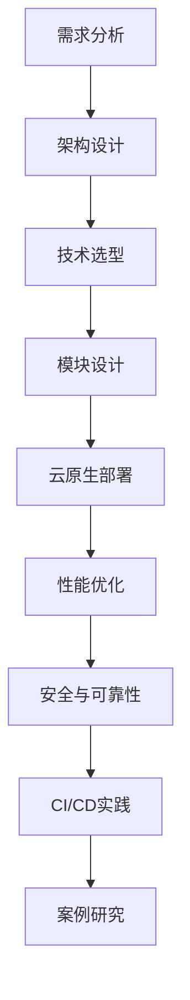

                 

### 《大模型软件的云原生架构设计》

> **关键词：** 云原生架构、大模型软件、容器技术、Kubernetes、服务网格、微服务、性能优化、安全与可靠性、持续集成与持续部署、案例研究。

> **摘要：** 本文旨在深入探讨大模型软件的云原生架构设计。通过详细分析云原生架构的基础概念、核心技术，以及大模型软件的架构设计原则、技术选型、模块设计、云原生部署、性能优化、安全与可靠性、持续集成与持续部署等方面，本文为读者提供了全面而深入的指导，帮助其在大模型软件领域实现高效、可扩展和可靠的应用。同时，通过实际案例的解读，本文展示了云原生架构在大模型软件中的应用价值，旨在为读者提供实践参考。

---

### 《大模型软件的云原生架构设计》目录大纲

#### 第一部分：云原生架构概述

1. **云原生架构基础**
   1.1 **云原生概念及其重要性**
   1.2 **云原生架构的关键特性**
   1.3 **云原生与微服务的关系**

2. **云原生架构的核心技术**
   2.1 **容器技术概述**
   2.2 **Kubernetes介绍**
   2.3 **服务网格技术**

#### 第二部分：大模型软件的架构设计

1. **大模型软件的设计原则**
   1.1 **大模型软件的需求分析**
   1.2 **大模型软件的架构设计原则**
   1.3 **大模型软件的系统边界**

2. **大模型软件的技术选型**
   2.1 **大模型软件的框架选择**
   2.2 **大模型软件的硬件需求**
   2.3 **大模型软件的存储和缓存策略**

3. **大模型软件的模块设计**
   3.1 **模块划分与功能定义**
   3.2 **模块通信机制设计**
   3.3 **模块的可扩展性和可维护性**

4. **大模型软件的云原生部署**
   4.1 **大模型软件的容器化**
   4.2 **大模型软件的Kubernetes部署**
   4.3 **大模型软件的自动化运维**

#### 第三部分：大模型软件的实践与优化

1. **大模型软件的性能优化**
   1.1 **性能优化的目标和方法**
   1.2 **大模型软件的性能瓶颈分析**
   1.3 **性能优化实践案例**

2. **大模型软件的安全与可靠性**
   2.1 **大模型软件的安全性考虑**
   2.2 **大模型软件的可靠性保障**
   2.3 **大模型软件的监控与预警**

3. **大模型软件的持续集成与持续部署**
   3.1 **持续集成与持续部署的概念**
   3.2 **大模型软件的CI/CD流程设计**
   3.3 **持续集成与持续部署的实践案例**

4. **大模型软件的案例研究**
   4.1 **大型图像识别系统**
   4.2 **智能语音助手**
   4.3 **实时推荐系统**

#### 附录

1. **工具与技术选型**
   1.1 **容器化工具介绍**
   1.2 **Kubernetes集群搭建**
   1.3 **服务网格技术实现**
   1.4 **大模型训练框架选择**

2. **Mermaid流程图**

3. **伪代码示例**

4. **数学公式示例**

5. **代码实战与解读**

#### 附录A：工具与技术选型

- **容器化工具介绍：** Docker
- **Kubernetes集群搭建：** Kubernetes的安装和配置
- **服务网格技术实现：** Istio
- **大模型训练框架选择：** TensorFlow、PyTorch

### Mermaid流程图



### 伪代码示例

```python
# 伪代码：大模型训练流程
function train_model(data, model, epochs):
    for epoch in range(epochs):
        for batch in data:
            perform_forward_pass(batch, model)
            calculate_loss(batch, model)
            perform_backward_pass(model)
    return model
```

### 数学公式示例

$$
H = \frac{1}{2} m v^2
$$

$$
f(x) = x^2 + 2x + 1
$$

### 代码实战与解读

#### 案例一：容器化大模型训练服务

**开发环境搭建：**

1. 安装Docker
2. 编写Dockerfile进行容器化

**源代码实现：**

**Dockerfile：**

```dockerfile
# 使用官方Python镜像作为基础镜像
FROM python:3.8-slim

# 设置工作目录
WORKDIR /app

# 复制训练脚本到工作目录
COPY train.py .

# 安装依赖
RUN pip install --no-cache-dir -r requirements.txt

# 暴露训练服务端口
EXPOSE 8080

# 运行训练脚本
CMD ["python", "train.py"]
```

**代码解读与分析：**

- **基础镜像选择：** 使用`python:3.8-slim`作为基础镜像，这样可以确保容器轻量且运行效率高。
- **工作目录设置：** `WORKDIR /app`命令设置工作目录为`/app`，便于后续的文件操作。
- **文件复制：** `COPY train.py .`将训练脚本`train.py`复制到容器的工作目录。
- **依赖安装：** `RUN pip install --no-cache-dir -r requirements.txt`安装训练脚本所需的Python依赖项，`--no-cache-dir`参数确保不保留缓存，以减少镜像大小。
- **服务端口暴露：** `EXPOSE 8080`命令将8080端口暴露给外部网络，以便服务可以接受外部请求。
- **运行训练脚本：** `CMD ["python", "train.py"]`指定了容器的启动命令，即运行训练脚本。

通过这个容器化流程，开发者可以轻松地将大模型训练服务容器化，并在Kubernetes集群中部署和管理。

---

这篇文章的目录大纲和内容框架已经搭建完成。接下来，我们将逐一深入探讨每个部分的核心概念、技术细节和实践方法。首先，我们从云原生架构的基础概念和核心特性开始，为后续的内容打下坚实的基础。敬请期待！<|assistant|>### 第一部分：云原生架构概述

#### 第1章：云原生架构基础

### 1.1 云原生概念及其重要性

云原生（Cloud Native）是近年来在软件开发和架构设计中迅速崛起的一个概念。它不仅仅是一个技术术语，更代表了一种软件开发和运营的新模式。云原生架构的核心目标是利用云计算和分布式系统的优势，实现软件的快速开发、部署和扩展。

**云原生定义：**

云原生软件是一种开发模式，它利用容器（Container）、微服务（Microservices）、服务网格（Service Mesh）、持续集成和持续部署（CI/CD）等先进技术，构建和运行可扩展、可靠且易于管理的应用程序。

**云原生的重要性：**

1. **敏捷性：** 云原生架构支持快速迭代和持续交付，帮助企业更快地响应市场变化。
2. **可扩展性：** 通过微服务和容器技术，云原生应用可以轻松实现水平扩展，满足业务增长的需求。
3. **弹性：** 云原生架构能够自动适应负载变化，提高系统的稳定性和可用性。
4. **可靠性：** 通过分布式部署和服务网格技术，云原生应用具有更好的容错能力和灾难恢复能力。
5. **资源优化：** 云原生架构通过资源复用和自动化管理，提高了资源利用率和效率。

**云原生与微服务的关系：**

云原生架构与微服务架构有着密切的关系。微服务架构是一种将应用程序拆分成一组小型、独立的服务的方法，每个服务都可以独立开发、部署和扩展。而云原生架构则进一步扩展了微服务架构，通过容器、服务网格和自动化工具，实现了更高效、更可靠的微服务管理。

**云原生架构的关键概念：**

1. **容器化（Containerization）：** 容器技术是云原生架构的核心，它提供了轻量级的虚拟化环境，使得应用程序可以在不同的环境中一致运行。
2. **微服务（Microservices）：** 微服务架构将应用程序分解为一组独立的、可复用的服务，每个服务负责特定的功能。
3. **服务网格（Service Mesh）：** 服务网格为微服务提供了通信和控制机制，使服务之间可以独立部署和管理。
4. **持续集成与持续部署（CI/CD）：** 持续集成和持续部署是实现快速交付和持续改进的关键工具。

#### 1.2 云原生架构的关键特性

云原生架构具有以下几个关键特性，这些特性共同构成了其强大的优势。

1. **容器化：** 容器是一种轻量级的虚拟化技术，它将应用程序及其运行环境打包成一个独立的容器镜像。容器具有以下几个优点：
   - **环境一致性：** 应用程序在不同环境中的一致性得到了保证，避免了环境差异带来的问题。
   - **资源隔离：** 容器提供了隔离的环境，确保了应用程序之间的资源不会互相干扰。
   - **部署灵活性：** 容器可以轻松地在不同的操作系统和硬件平台上部署。

2. **微服务：** 微服务架构将应用程序拆分成一组小型、独立的服务，每个服务都负责一个特定的功能。微服务的优点包括：
   - **模块化：** 微服务使得应用程序的模块化程度更高，方便开发、测试和部署。
   - **可扩展性：** 微服务可以独立扩展，提高了系统的整体可扩展性。
   - **容错性：** 微服务之间的故障隔离性更好，一个服务的故障不会影响其他服务的正常运行。

3. **服务网格：** 服务网格为微服务提供了通信和控制机制，包括服务发现、负载均衡、服务间认证和监控等。服务网格的优点包括：
   - **透明性：** 服务网格使得服务之间的通信更加透明，开发者无需关心具体的通信细节。
   - **可观察性：** 服务网格提供了丰富的监控和日志功能，帮助开发者更好地了解系统的运行状况。

4. **持续集成与持续部署：** 持续集成和持续部署是实现快速交付和持续改进的关键工具。它们的主要优点包括：
   - **快速反馈：** 通过持续集成，开发者可以快速发现和修复代码中的问题。
   - **自动部署：** 持续部署可以自动将代码更改部署到生产环境，减少了手动操作的错误。

5. **自动化运维：** 云原生架构通过自动化工具实现了资源的自动化管理和运维，包括自动扩展、负载均衡和故障恢复等。自动化运维的优点包括：
   - **高效性：** 自动化工具可以大大提高运维效率，减少人工干预。
   - **可靠性：** 自动化运维减少了人为错误，提高了系统的可靠性。

#### 1.3 云原生与微服务的关系

云原生架构与微服务架构之间存在着紧密的联系和互补关系。

1. **云原生架构支撑微服务架构：** 云原生架构提供了一系列的技术和工具，如容器、服务网格和持续集成/持续部署，为微服务架构的实施提供了强有力的支持。容器技术使得微服务可以以独立、轻量级的方式运行；服务网格为微服务提供了高效的通信和控制机制；持续集成和持续部署使得微服务的开发、测试和部署过程更加高效。

2. **微服务架构适应云原生架构：** 微服务架构本身是一种适应云计算和分布式系统的架构设计方法。微服务架构通过将应用程序分解为小型、独立的服务，实现了模块化、可扩展性和容错性，这些特点与云原生架构的理念高度契合。在云原生环境下，微服务架构可以充分利用云计算的资源优势和弹性特性，实现高效的资源利用和服务扩展。

3. **云原生架构与微服务架构的优势互补：** 云原生架构和微服务架构各自具有独特的优势，它们相互补充，共同构成了强大的云计算应用架构。云原生架构通过容器化、服务网格和自动化运维等技术，提供了高效、可靠和可扩展的运行环境；微服务架构通过模块化、独立部署和分布式通信，实现了灵活、可扩展和容错的应用设计。两者结合，使得云计算应用在开发、部署和运营过程中能够更加高效、可靠和灵活。

综上所述，云原生架构与微服务架构是相辅相成的，它们共同构成了现代云计算应用的核心架构。通过云原生架构，开发者可以更高效地构建和运营微服务应用，实现快速交付和持续改进；通过微服务架构，开发者可以更好地适应云计算和分布式系统的环境，实现灵活、可扩展和容错的应用设计。

### 第一部分：云原生架构概述

#### 第2章：云原生架构的核心技术

云原生架构的成功实施依赖于一系列核心技术的支持。这些技术包括容器技术、Kubernetes、服务网格等。在本章中，我们将深入探讨这些技术的原理、应用场景和实施细节。

#### 2.1 容器技术概述

容器技术是云原生架构的基石，它通过将应用程序及其运行环境打包成独立的容器镜像，实现了应用程序的环境一致性和资源隔离。容器技术的核心组件包括Docker、Podman等。

**Docker：** Docker 是最流行的容器技术之一，它提供了一种轻量级的虚拟化解决方案。Docker 使用 Linux 容器进行封装，使得应用程序可以在不同的操作系统和硬件平台上一致运行。

**容器技术的工作原理：**
1. **容器镜像（Container Image）：** 容器镜像是一个只读的文件系统层，包含了应用程序及其依赖项。每次创建容器时，会从一个容器镜像启动。
2. **容器实例（Container Instance）：** 容器实例是基于容器镜像运行的可执行应用程序实例。容器实例具有独立的进程空间和资源限制。
3. **容器引擎（Container Engine）：** 容器引擎负责管理容器镜像和容器实例，包括容器的创建、启动、停止、删除等操作。

**容器技术的优点：**
- **环境一致性：** 容器镜像确保了应用程序在不同环境中的一致性，避免了环境差异带来的问题。
- **资源隔离：** 容器实例提供了独立的进程空间和资源限制，确保了应用程序之间的资源不会互相干扰。
- **部署灵活性：** 容器可以轻松地在不同的操作系统和硬件平台上部署。

**容器技术的应用场景：**
- **持续集成和持续部署（CI/CD）：** 容器技术使得持续集成和持续部署变得更加高效，因为容器镜像可以作为构建输出的一部分，方便地部署到不同的环境中。
- **云原生应用开发：** 容器技术是云原生应用开发的基础，它支持微服务架构的实施和自动化运维。

**容器技术的实施细节：**
- **容器镜像构建：** 使用Dockerfile定义容器镜像的构建过程，包括安装依赖、复制文件等操作。
- **容器引擎部署：** 部署容器引擎，如Docker，以便管理和运行容器。
- **容器编排：** 使用容器编排工具，如Kubernetes，进行容器的自动化部署、扩展和管理。

#### 2.2 Kubernetes介绍

Kubernetes 是一个开源的容器编排平台，它用于自动化部署、扩展和管理容器化应用程序。Kubernetes 旨在提供强大的容器编排能力，简化容器化应用程序的运维和管理。

**Kubernetes 的核心概念：**
- **Pod：** Pod 是 Kubernetes 中的最小部署单元，它包含一个或多个容器实例。Pod 负责容器的生命周期管理和资源分配。
- **服务（Service）：** 服务定义了一组 Pod 的访问方式，它提供了负载均衡和访问控制的功能。
- **部署（Deployment）：** 部署用于管理 Pod 的创建和更新，它确保了应用程序的可用性和一致性。
- **命名空间（Namespace）：** 命名空间用于隔离不同的应用程序和工作负载。
- **控制器（Controller）：** 控制器负责监视资源的状态，并确保资源达到预期状态。

**Kubernetes 的主要功能：**
- **自动化部署：** Kubernetes 可以自动部署、更新和扩展应用程序。
- **服务发现和负载均衡：** Kubernetes 提供了内置的服务发现和负载均衡机制。
- **自动扩缩容：** Kubernetes 可以根据工作负载自动调整容器的数量。
- **弹性恢复：** Kubernetes 能够自动检测和恢复故障的容器实例。

**Kubernetes 的应用场景：**
- **大型分布式系统：** Kubernetes 非常适合部署和管理大型分布式系统，如微服务、大数据处理和实时分析等。
- **云原生应用：** Kubernetes 是云原生应用的理想选择，它提供了高效、可靠和可扩展的容器化应用程序管理能力。

**Kubernetes 的实施细节：**
- **Kubernetes 集群搭建：** 部署 Kubernetes 集群，包括控制节点和工作节点。
- **容器编排：** 使用 Kubernetes API 进行容器编排，包括创建和删除 Pod、服务、部署等。
- **监控和日志：** 使用 Kubernetes 的监控和日志功能，如 Prometheus 和 Elasticsearch，来监视和记录系统的运行状态。

#### 2.3 服务网格技术

服务网格是一种基础设施层的技术，它用于管理和优化微服务之间的通信。服务网格提供了一系列的通信服务，如服务发现、负载均衡、安全认证和监控等，使得微服务之间的通信更加高效和可靠。

**服务网格的核心组件：**
- **服务发现（Service Discovery）：** 服务发现用于动态地查找和注册服务实例，使得应用程序可以快速发现和连接到其他服务。
- **负载均衡（Load Balancing）：** 负载均衡用于分配网络流量到不同的服务实例，确保系统的性能和稳定性。
- **安全认证（Security Authentication）：** 安全认证用于确保服务之间的通信是安全的，包括加密、身份验证和授权等。
- **监控和日志（Monitoring and Logging）：** 监控和日志功能用于收集和分析服务运行状态的数据，帮助开发者快速诊断和解决问题。

**服务网格的主要类型：**
- **边车（Sidecar）：** 边车是一种模式，其中每个服务实例都附带一个代理组件，用于处理服务之间的通信。边车模式简化了服务之间的通信，并且可以与应用程序独立部署。
- **控制平面（Control Plane）：** 控制平面是一种模式，其中服务网格的组件（如服务发现、负载均衡和监控）独立部署，与应用程序一起运行。控制平面模式提供了更高级的功能和更好的可扩展性。

**服务网格的应用场景：**
- **微服务架构：** 服务网格非常适合微服务架构，它提供了一致、高效和安全的通信服务，使得微服务之间可以轻松地进行交互。
- **分布式系统：** 服务网格可以用于管理和优化分布式系统中的服务通信，提高了系统的可靠性和可扩展性。

**服务网格的实施细节：**
- **服务网格搭建：** 部署服务网格的基础设施，包括边车代理和控制平面组件。
- **服务配置：** 配置服务网格，包括服务发现、负载均衡和安全认证等。
- **监控和日志：** 监控和记录服务网格的运行状态，以便快速诊断和优化。

#### 小结

云原生架构的成功实施离不开容器技术、Kubernetes 和服务网格等核心技术的支持。容器技术提供了环境一致性、资源隔离和部署灵活性；Kubernetes 提供了自动化部署、扩展和管理功能；服务网格提供了高效、可靠和安全的微服务通信服务。通过这些核心技术的结合，开发者可以构建和运营高效、可靠和可扩展的云原生应用。

在接下来的章节中，我们将进一步探讨大模型软件的架构设计原则和技术选型，帮助读者更好地理解和应用云原生架构。

### 第二部分：大模型软件的架构设计

#### 第3章：大模型软件的设计原则

在大模型软件的开发过程中，架构设计扮演着至关重要的角色。一个良好的架构设计不仅能够满足软件的需求，还能够确保系统的可扩展性、可维护性和可靠性。本章节将介绍大模型软件的设计原则，包括需求分析、架构设计原则和系统边界。

#### 3.1 大模型软件的需求分析

需求分析是软件架构设计的起点，它决定了软件系统的功能和技术方向。在大模型软件的需求分析阶段，我们需要关注以下几个方面：

1. **功能需求：** 明确大模型软件需要实现哪些核心功能，如数据预处理、模型训练、模型评估和推理等。这些功能应该涵盖用户的需求，并且具有足够的灵活性和可扩展性，以便适应未来可能的变更。

2. **性能需求：** 大模型软件通常需要处理大规模的数据集和复杂的模型，因此性能需求尤为重要。我们需要定义软件的响应时间、吞吐量和并发处理能力等性能指标。

3. **可扩展性需求：** 大模型软件需要能够适应数据量和用户量的增长，因此可扩展性是关键需求之一。我们需要考虑如何通过横向扩展（增加服务器数量）和纵向扩展（提高服务器性能）来实现系统的可扩展性。

4. **可靠性需求：** 大模型软件的可靠性直接影响到用户体验和业务连续性。我们需要确保系统具备良好的容错能力和灾难恢复能力，以便在出现故障时能够快速恢复。

5. **安全性需求：** 大模型软件通常涉及敏感数据和处理关键任务，因此安全性需求至关重要。我们需要考虑如何保护用户数据的安全，包括数据加密、访问控制和审计等。

#### 3.2 大模型软件的架构设计原则

在确定了需求之后，我们可以根据需求来设计大模型软件的架构。以下是一些关键的架构设计原则：

1. **模块化：** 将系统划分为多个独立的模块，每个模块负责特定的功能。模块化设计使得系统更加可维护和可扩展，同时也提高了系统的复用性。

2. **微服务架构：** 采用微服务架构将系统分解为一组小型、独立的服务，每个服务都专注于一个特定的业务功能。微服务架构能够提高系统的可扩展性和容错性，并且便于开发和部署。

3. **分布式系统：** 大模型软件通常是一个分布式系统，由多个节点组成，每个节点负责不同的功能。分布式系统可以提高系统的性能和可用性，并且可以更好地处理大规模数据。

4. **云原生架构：** 利用云原生架构，如容器化、服务网格和自动化运维等，来构建和部署大模型软件。云原生架构提供了高效的资源利用和灵活的部署方式，能够满足大模型软件的需求。

5. **安全性：** 在架构设计中，我们需要考虑系统的安全性。包括数据加密、身份验证、授权和访问控制等，以确保系统的数据安全和用户隐私。

6. **可观测性：** 为了更好地监控和管理系统，我们需要在设计时考虑可观测性。包括日志记录、监控指标收集和可视化等，以便在出现问题时快速诊断和解决。

#### 3.3 大模型软件的系统边界

系统边界定义了系统的功能和职责范围，确保系统与其他系统或模块之间的交互是清晰和明确的。在大模型软件的架构设计中，我们需要明确以下系统边界：

1. **外部系统接口：** 定义与外部系统（如数据源、数据库、消息队列等）的交互接口，包括API、消息协议和数据格式等。

2. **内部模块划分：** 根据业务功能将系统划分为多个模块，每个模块负责特定的业务逻辑。例如，数据预处理模块、模型训练模块、模型推理模块等。

3. **数据流：** 定义系统内部的数据流动路径，包括数据输入、处理和输出等。明确数据在系统内部的流转方式，有助于优化系统性能和资源利用。

4. **依赖关系：** 分析系统内部各模块之间的依赖关系，确保模块之间的交互是合理和有序的。例如，数据预处理模块需要将数据传递给模型训练模块，而模型训练模块需要依赖数据预处理模块的结果。

通过明确系统边界，我们可以更好地管理和维护大模型软件，确保系统的稳定性和可扩展性。

#### 小结

大模型软件的架构设计原则是基于需求分析的结果，通过模块化、微服务架构、分布式系统和云原生架构等原则，构建一个高效、可靠和可扩展的软件系统。在架构设计过程中，我们需要明确系统的边界和交互方式，确保系统的功能和技术实现能够满足用户需求。

在接下来的章节中，我们将继续探讨大模型软件的技术选型，包括框架选择、硬件需求和存储策略等，以进一步优化大模型软件的架构设计。

### 第二部分：大模型软件的架构设计

#### 第4章：大模型软件的技术选型

在大模型软件的架构设计中，技术选型是一个关键环节。正确的技术选型能够确保软件系统的高效性、可靠性和可扩展性。本章将详细介绍大模型软件的技术选型，包括框架选择、硬件需求和存储策略。

#### 4.1 大模型软件的框架选择

框架选择是技术选型中的首要任务，它直接影响软件的开发效率和性能表现。在大模型软件的开发中，常见的框架选择包括TensorFlow和PyTorch。

**TensorFlow：** TensorFlow是由Google开发的开源机器学习框架，它提供了丰富的API和工具，支持各种深度学习任务。TensorFlow的优点包括：
- **广泛的支持：** TensorFlow支持多种深度学习模型，如卷积神经网络（CNN）、循环神经网络（RNN）和生成对抗网络（GAN）等。
- **高效性：** TensorFlow具有良好的性能和优化能力，能够高效地处理大规模数据集。
- **生态系统：** TensorFlow拥有庞大的社区和生态系统，提供了大量的开源库和工具。

**PyTorch：** PyTorch是由Facebook开发的开源深度学习框架，它以其动态计算图和简洁的API而受到开发者的喜爱。PyTorch的优点包括：
- **动态计算图：** PyTorch使用动态计算图，使得模型设计和调试更加灵活。
- **简洁性：** PyTorch的API设计简洁直观，使得开发者可以快速上手。
- **社区支持：** PyTorch拥有活跃的社区，提供了大量的教程和案例。

**框架选择考虑因素：**
- **项目需求：** 根据项目需求选择合适的框架，如对模型灵活性和调试需求较高的项目可以选择PyTorch，而对性能和优化有更高要求的可以选择TensorFlow。
- **开发者经验：** 考虑开发团队对框架的熟悉程度，选择开发者熟悉和熟悉的框架可以提升开发效率。
- **生态系统：** 选择拥有丰富生态系统的框架，可以充分利用社区资源，提高开发效率。

#### 4.2 大模型软件的硬件需求

大模型软件的运行依赖于高性能的硬件资源，特别是计算资源和存储资源。以下是大模型软件的硬件需求：

**计算资源：**
- **CPU：** 大模型软件通常需要高性能的CPU进行模型训练和推理。对于TensorFlow和PyTorch，GPU加速是常见的做法，因为GPU在并行计算方面具有显著优势。选择具有多核心和高主频的CPU可以提升计算性能。
- **GPU：** GPU加速是提升深度学习计算性能的关键。选择具有多个CUDA核心的GPU，如NVIDIA Tesla系列或NVIDIA RTX系列，可以显著提升模型的训练和推理速度。

**存储资源：**
- **内存（RAM）：** 大模型软件需要大量的内存来存储模型参数和中间计算结果。选择具有高内存容量（如64GB或更高）的机器可以提升系统性能。
- **硬盘（Storage）：** 大模型软件需要大量的存储空间来存储数据集和模型文件。选择具有高速读写能力的硬盘（如SSD）可以提高数据加载速度，从而提升训练和推理效率。

**硬件配置示例：**
- **CPU：** 2 x Intel Xeon Gold 6148，每个CPU具有28核，主频2.40GHz。
- **GPU：** 4 x NVIDIA Tesla V100，每个GPU具有5120个CUDA核心。
- **内存（RAM）：** 512GB。
- **硬盘（Storage）：** 4 x 2TB SSD。

#### 4.3 大模型软件的存储和缓存策略

存储和缓存策略在大模型软件的性能优化中起着重要作用。以下是一些常见的存储和缓存策略：

**存储策略：**
- **分布式存储：** 使用分布式存储系统（如HDFS、Ceph等）来存储大规模数据集。分布式存储可以提高数据访问速度和容错能力。
- **对象存储：** 使用对象存储系统（如Amazon S3、Google Cloud Storage等）来存储非结构化数据，如模型文件和日志文件。对象存储提供了高可用性和高性能的存储解决方案。
- **数据分层：** 根据数据的重要性和访问频率，对数据进行分层存储。将热数据存储在高速存储设备上，如SSD，而将冷数据存储在成本较低的存储设备上，如HDD。

**缓存策略：**
- **内存缓存：** 使用内存缓存（如Redis、Memcached等）来存储经常访问的数据，以减少磁盘I/O操作，提高数据访问速度。
- **缓存一致性：** 在分布式系统中，确保缓存数据的一致性是非常重要的。可以使用缓存一致性协议（如GCP、Paxos等）来维护数据的一致性。
- **缓存预热：** 在模型训练和推理过程中，提前将数据加载到缓存中，以便在需要时快速访问。

**存储和缓存策略示例：**
- **存储策略：** 使用HDFS存储大规模数据集，使用Amazon S3存储模型文件和日志文件。将热数据存储在SSD上，将冷数据存储在HDD上。
- **缓存策略：** 使用Redis进行内存缓存，缓存数据集和模型文件。使用GCP协议确保缓存数据的一致性。

通过合理选择框架、配置合适的硬件资源以及实施有效的存储和缓存策略，大模型软件可以在性能、可扩展性和可靠性方面取得显著提升。

#### 小结

大模型软件的技术选型包括框架选择、硬件需求和存储策略。选择合适的框架能够提升开发效率和性能表现；配置合理的硬件资源可以满足模型训练和推理的需求；实施有效的存储和缓存策略可以提高数据访问速度和系统性能。通过综合考虑这些因素，我们可以构建一个高效、可靠和可扩展的大模型软件系统。

在接下来的章节中，我们将进一步探讨大模型软件的模块设计，包括模块划分、通信机制设计和可扩展性等方面，以进一步提升大模型软件的架构设计。

### 第二部分：大模型软件的架构设计

#### 第5章：大模型软件的模块设计

在大模型软件的架构设计中，模块化是实现系统可扩展性和可维护性的关键。本章将详细介绍大模型软件的模块设计，包括模块划分与功能定义、模块通信机制设计以及模块的可扩展性和可维护性。

#### 5.1 模块划分与功能定义

模块划分是将复杂系统分解为更小、更易于管理的部分的过程。在大模型软件中，模块划分通常基于功能需求和技术独立性。以下是一些常见的模块划分与功能定义：

1. **数据预处理模块：**
   - 功能：负责数据清洗、归一化、缺失值处理等数据预处理操作。
   - 依赖：依赖数据存储模块和数据源接口。
   - 输出：预处理后的数据集，用于模型训练和推理。

2. **模型训练模块：**
   - 功能：负责加载训练数据、定义模型结构、执行训练过程、保存训练模型。
   - 依赖：依赖数据预处理模块、框架（如TensorFlow或PyTorch）和计算资源。
   - 输出：训练完成的模型文件。

3. **模型评估模块：**
   - 功能：负责加载测试数据、执行模型推理、计算评估指标（如准确率、召回率等）。
   - 依赖：依赖模型训练模块和数据预处理模块。
   - 输出：评估报告和模型性能指标。

4. **模型推理模块：**
   - 功能：负责加载模型文件、执行模型推理、生成预测结果。
   - 依赖：依赖模型训练模块和数据预处理模块。
   - 输出：预测结果，用于业务决策或后续处理。

5. **监控与日志模块：**
   - 功能：负责监控系统运行状态、记录日志信息，便于故障排查和性能优化。
   - 依赖：依赖系统配置和日志存储。
   - 输出：监控数据和日志文件。

6. **服务接口模块：**
   - 功能：提供与外部系统交互的接口，如API接口、消息队列等。
   - 依赖：依赖其他业务模块和外部系统。
   - 输出：服务接口响应数据。

#### 5.2 模块通信机制设计

模块之间的通信机制设计是确保系统高效率和稳定性的关键。在大模型软件中，模块通信机制通常采用以下几种方式：

1. **同步通信：**
   - 方式：模块间通过同步调用的方式进行通信，即一个模块在完成自己的任务后，等待其他模块响应。
   - 优点：通信简单，易于实现。
   - 缺点：可能导致模块间的耦合性增加，影响系统的可扩展性。

2. **异步通信：**
   - 方式：模块间通过消息队列或事件驱动的方式进行通信，即模块不需要等待其他模块的响应，而是通过消息或事件进行异步通信。
   - 优点：提高系统的可扩展性和可维护性，降低模块间的耦合性。
   - 缺点：通信机制复杂，需要额外的同步和异常处理逻辑。

3. **服务网格通信：**
   - 方式：通过服务网格（如Istio、Linkerd等）进行模块间的通信，服务网格提供了服务发现、负载均衡、安全认证和监控等功能。
   - 优点：提供了一致、高效和安全的通信服务，简化了模块通信的复杂性。
   - 缺点：需要额外的服务网格基础设施和配置。

**模块通信机制设计示例：**
- **数据预处理模块**与**模型训练模块**通过消息队列进行异步通信，确保数据预处理模块可以独立运行，而模型训练模块在接收到预处理后的数据后开始训练。
- **模型推理模块**与**监控与日志模块**通过服务网格进行通信，确保模型推理模块在生成预测结果时能够将相关信息记录到监控与日志模块中，以便进行后续分析和优化。

#### 5.3 模块的可扩展性和可维护性

模块的可扩展性和可维护性是确保系统长期稳定运行的关键。以下是一些提升模块可扩展性和可维护性的方法：

1. **接口抽象：**
   - 方法：将模块间的接口抽象为独立的接口层，确保模块内部的实现细节对外不可见。通过接口抽象，可以降低模块间的依赖性，提高系统的可扩展性。
   - 实例：定义一个数据预处理接口，实现该接口的具体模块可以根据不同的需求进行替换，而不会影响到其他模块。

2. **配置管理：**
   - 方法：使用配置文件或配置管理工具（如Ansible、Kubernetes ConfigMap等）来管理模块的配置信息。通过配置管理，可以灵活调整模块的运行参数和行为，提高系统的可维护性。
   - 实例：使用Kubernetes ConfigMap来管理模型训练模块的参数，如学习率、批次大小等，便于根据需求进行调整。

3. **日志管理：**
   - 方法：使用统一的日志管理工具（如ELK、Logstash等）来收集、存储和分析模块的日志信息。通过日志管理，可以更好地监控模块的运行状态和排查故障。
   - 实例：使用ELK堆栈（Elasticsearch、Logstash、Kibana）来收集和分析模型训练模块的日志，以便快速诊断和解决问题。

4. **代码质量：**
   - 方法：遵循良好的编程实践，如代码规范、单元测试和代码审查等，确保模块的代码质量。通过代码质量保证，可以降低维护成本，提高系统的稳定性。
   - 实例：在代码编写过程中，遵循PEP 8规范，编写单元测试来验证模块的功能和性能，定期进行代码审查。

通过模块划分与功能定义、模块通信机制设计和模块的可扩展性可维护性，我们可以构建一个高效、可靠和可扩展的大模型软件系统。在接下来的章节中，我们将进一步探讨大模型软件的云原生部署和性能优化，以进一步提升软件系统的性能和可靠性。

### 第二部分：大模型软件的架构设计

#### 第6章：大模型软件的云原生部署

在当今快速发展的云计算时代，云原生部署已成为大模型软件实现高效、可扩展和可靠运行的关键。本章将详细介绍大模型软件的云原生部署，包括容器化、Kubernetes部署和自动化运维。

#### 6.1 大模型软件的容器化

容器化是将应用程序及其依赖打包到容器镜像中的过程，这使得应用程序可以在不同的环境中一致运行。对于大模型软件，容器化具有以下优点：

**容器化优势：**
1. **环境一致性：** 容器镜像确保了应用程序在不同环境中的一致性，避免了环境差异带来的问题。
2. **资源隔离：** 容器提供了独立的运行环境，确保了应用程序之间的资源不会互相干扰。
3. **部署灵活性：** 容器可以轻松地在不同的操作系统和硬件平台上部署，提高了部署的灵活性。

**容器化流程：**
1. **编写Dockerfile：** 使用Dockerfile定义容器镜像的构建过程。Dockerfile中包含了基础镜像、工作目录、依赖安装和启动命令等配置。
2. **构建容器镜像：** 使用Docker CLI构建容器镜像。命令如下：
   ```bash
   docker build -t model-training-image .
   ```
3. **容器镜像推送到仓库：** 将构建好的容器镜像推送到容器镜像仓库（如Docker Hub、GitHub Container Registry等）。
   ```bash
   docker push model-training-image
   ```

**Dockerfile 示例：**
```dockerfile
# 使用官方Python镜像作为基础镜像
FROM python:3.8-slim

# 设置工作目录
WORKDIR /app

# 复制训练脚本到工作目录
COPY train.py .

# 安装依赖
RUN pip install --no-cache-dir -r requirements.txt

# 暴露训练服务端口
EXPOSE 8080

# 运行训练脚本
CMD ["python", "train.py"]
```

#### 6.2 大模型软件的Kubernetes部署

Kubernetes（简称K8s）是一个开源的容器编排平台，用于自动化部署、扩展和管理容器化应用程序。Kubernetes的部署过程包括以下几个步骤：

**Kubernetes部署步骤：**
1. **搭建Kubernetes集群：** 部署Kubernetes集群，包括控制节点和工作节点。可以使用Minikube在本地环境中快速搭建Kubernetes集群，或者使用kubeadm在物理机或虚拟机上搭建集群。
2. **部署服务：** 使用Kubernetes的YAML文件定义服务和部署配置。服务定义了容器的运行方式和访问方式，部署定义了容器的创建和管理规则。
3. **配置命名空间：** 使用命名空间（Namespace）来隔离不同的服务和工作负载。命名空间可以限制资源的访问和使用，便于管理和监控。
4. **部署应用：** 使用kubectl命令部署应用程序。例如，部署一个Nginx服务：
   ```bash
   kubectl create -f nginx.yaml
   ```
5. **扩展应用：** 根据需要调整部署配置，实现应用的自动扩缩容。例如，扩容Nginx服务：
   ```bash
   kubectl scale deploy nginx --replicas=3
   ```

**Kubernetes配置示例：**
```yaml
# nginx-deployment.yaml
apiVersion: apps/v1
kind: Deployment
metadata:
  name: nginx
spec:
  replicas: 2
  selector:
    matchLabels:
      app: nginx
  template:
    metadata:
      labels:
        app: nginx
    spec:
      containers:
      - name: nginx
        image: nginx:latest
        ports:
        - containerPort: 80
```

#### 6.3 大模型软件的自动化运维

自动化运维是提高大模型软件运行效率和稳定性的重要手段。以下是一些常见的自动化运维工具和方法：

**自动化运维工具：**
1. **Kubernetes Operators：** Operators是一种基于Kubernetes的自定义控制器，用于自动化管理和扩展应用程序。使用Operator SDK可以快速开发自定义的Operator。
2. **CI/CD工具：** 如Jenkins、GitLab CI/CD、CircleCI等，用于实现持续集成和持续部署。这些工具可以自动化构建、测试和部署应用程序。
3. **监控工具：** 如Prometheus、Grafana、ELK（Elasticsearch、Logstash、Kibana）等，用于监控系统运行状态和性能指标。
4. **日志管理工具：** 如Fluentd、Logstash、Kibana等，用于收集、存储和分析日志信息。

**自动化运维方法：**
1. **自动化部署：** 使用CI/CD工具实现自动化部署，将代码更改从开发环境部署到生产环境。
2. **自动化监控：** 使用监控工具监控系统的运行状态和性能指标，及时发现和解决问题。
3. **自动化扩缩容：** 使用Kubernetes的自动扩缩容功能，根据负载自动调整容器数量。
4. **自动化故障恢复：** 使用自动化工具实现故障检测和自动恢复，提高系统的可靠性。

**自动化运维示例：**
- **自动化部署：** 使用Jenkins实现自动化部署，当代码提交到版本控制系统时，自动触发构建、测试和部署流程。
- **自动化监控：** 使用Prometheus和Grafana监控系统的性能指标，设置阈值报警，及时发现和解决问题。
- **自动化扩缩容：** 使用Kubernetes的自动扩缩容功能，根据CPU使用率和内存使用率自动调整容器数量。

通过容器化、Kubernetes部署和自动化运维，大模型软件可以实现高效、可扩展和可靠的运行。在接下来的章节中，我们将探讨大模型软件的性能优化，以进一步提升软件系统的性能和用户体验。

### 第三部分：大模型软件的实践与优化

#### 第7章：大模型软件的性能优化

大模型软件的性能优化是确保其高效运行的关键。本章将探讨大模型软件性能优化的目标和方法，性能瓶颈分析以及性能优化实践案例。

#### 7.1 性能优化的目标和方法

**性能优化的目标：**
1. **提高响应时间：** 减少用户等待时间，提升用户体验。
2. **提升吞吐量：** 增加系统能处理的数据量和请求量。
3. **降低延迟：** 减少数据传输和处理的时间，提高系统的实时性。
4. **优化资源利用率：** 充分利用计算和存储资源，提高系统效率。

**性能优化的方法：**
1. **代码优化：** 优化算法和数据处理流程，减少不必要的计算和资源消耗。
2. **硬件优化：** 使用更高效的硬件设备，如GPU加速、SSD存储等。
3. **缓存策略：** 实施有效的缓存策略，减少重复计算和数据库访问。
4. **分布式处理：** 利用分布式计算和存储技术，提高系统并行处理能力。

#### 7.2 大模型软件的性能瓶颈分析

性能瓶颈分析是性能优化的第一步，通过识别和分析系统瓶颈，可以针对性地进行优化。以下是一些常见的性能瓶颈：

1. **计算资源瓶颈：** 系统的计算资源（CPU、GPU）不足，导致任务无法高效完成。
2. **存储资源瓶颈：** 存储系统（硬盘、数据库）的I/O性能不足，导致数据访问缓慢。
3. **网络瓶颈：** 网络带宽或延迟过高，影响数据传输和分布式计算。
4. **代码效率瓶颈：** 算法和数据处理流程存在冗余或低效操作，导致计算时间过长。
5. **并发处理瓶颈：** 系统的并发处理能力不足，无法高效处理大量并发请求。

**性能瓶颈分析步骤：**
1. **监控和日志分析：** 使用监控工具和日志分析工具收集系统的运行数据，识别性能瓶颈。
2. **性能测试：** 使用性能测试工具模拟实际工作负载，识别系统的性能瓶颈。
3. **定位问题：** 通过分析性能数据和测试结果，定位具体的性能瓶颈。
4. **优化策略：** 针对识别出的瓶颈，制定具体的优化策略和方案。

#### 7.3 性能优化实践案例

以下是一个基于TensorFlow的大模型训练服务的性能优化实践案例：

**案例背景：** 
一个在线图像识别系统，使用TensorFlow进行模型训练和推理，系统部署在Kubernetes集群中。用户反馈系统的响应时间较长，性能有待优化。

**性能瓶颈分析：**
1. **计算资源瓶颈：** 通过监控工具发现，CPU和GPU的使用率较高，存在计算资源不足的问题。
2. **存储资源瓶颈：** 数据库I/O性能较低，导致数据读取和写入速度缓慢。
3. **代码效率瓶颈：** 模型训练过程中的数据处理和计算存在冗余操作，导致计算时间过长。

**优化策略：**
1. **扩展计算资源：** 增加Kubernetes集群中的节点数量，提高计算资源利用率。
2. **优化存储策略：** 使用分布式存储系统（如HDFS）替代现有的数据库，提高数据访问速度。
3. **代码优化：** 优化数据处理和计算流程，减少冗余操作，提高计算效率。

**优化实践：**

**1. 扩展计算资源：**
   - 调整Kubernetes集群的节点数量，增加计算资源。
   - 使用GPU节点进行模型训练，提高计算速度。

**2. 优化存储策略：**
   - 使用HDFS存储数据集，提高数据读取速度。
   - 使用数据缓存（如Redis）减少数据库访问，提高数据处理效率。

**3. 代码优化：**
   - 优化数据处理流程，使用并行计算减少计算时间。
   - 使用模型压缩和量化技术，减少模型参数量，提高计算效率。

**优化效果：**
- **响应时间降低：** 通过扩展计算资源和优化存储策略，系统的响应时间显著降低，用户体验得到提升。
- **吞吐量提高：** 系统的吞吐量增加，能够处理更多的并发请求。
- **资源利用率提高：** 通过优化代码和硬件配置，系统的资源利用率提高，降低了硬件成本。

通过性能优化实践，我们成功提升了大模型训练服务的性能和稳定性，为用户提供更快速和可靠的图像识别服务。

#### 小结

大模型软件的性能优化是一个持续的过程，需要综合考虑计算资源、存储资源、代码效率和硬件配置等因素。通过性能瓶颈分析，我们可以识别系统的瓶颈并进行有针对性的优化。在实际应用中，通过扩展计算资源、优化存储策略和代码优化，我们可以显著提升大模型软件的性能和用户体验。

在接下来的章节中，我们将进一步探讨大模型软件的安全与可靠性，以确保系统在面临各种挑战时能够保持稳定和可靠。

### 第三部分：大模型软件的实践与优化

#### 第8章：大模型软件的安全与可靠性

在大模型软件的设计与开发过程中，安全性和可靠性是两个至关重要的方面。一个安全的系统能够保护用户数据不受恶意攻击，而一个可靠的系统则能够在各种情况下稳定运行，不发生故障。本章将详细探讨大模型软件的安全性与可靠性保障，包括安全性考虑、可靠性保障和监控与预警。

#### 8.1 大模型软件的安全性考虑

大模型软件通常涉及大量敏感数据，如用户个人信息、模型参数、训练数据等。因此，安全性设计至关重要。以下是一些常见的安全性和隐私保护措施：

**数据加密：**
- **传输加密：** 使用HTTPS协议确保数据在传输过程中加密，防止数据被窃取或篡改。
- **存储加密：** 对存储在数据库或文件系统中的敏感数据进行加密，确保数据在磁盘上的安全。
- **加密算法：** 选择安全的加密算法（如AES、RSA）进行数据加密，提高数据安全性。

**访问控制：**
- **身份验证：** 实施严格的身份验证机制，如用户名和密码、双因素认证等，确保只有授权用户才能访问系统。
- **权限管理：** 实施细粒度的权限控制，根据用户的角色和职责分配访问权限，防止未经授权的访问。

**数据备份与恢复：**
- **数据备份：** 定期备份重要数据，确保在数据丢失或损坏时能够恢复。
- **灾难恢复：** 建立灾难恢复计划，包括备份的存储位置、恢复流程和测试等，确保在发生灾难时能够快速恢复系统。

**安全审计与监控：**
- **安全审计：** 实施安全审计，记录系统中的操作日志和安全事件，以便在发生安全问题时进行追溯。
- **实时监控：** 使用入侵检测系统（IDS）和入侵防御系统（IPS）等工具实时监控系统的安全状态，及时发现和应对安全威胁。

**数据隐私保护：**
- **匿名化处理：** 在使用用户数据时，对个人身份信息进行匿名化处理，确保用户隐私不被泄露。
- **数据脱敏：** 使用数据脱敏技术对敏感数据进行处理，避免敏感信息直接暴露。

#### 8.2 大模型软件的可靠性保障

大模型软件的可靠性保障是确保系统在面临各种异常情况下能够保持正常运行的能力。以下是一些提高系统可靠性的方法和策略：

**容错能力：**
- **冗余部署：** 通过在多个节点上部署相同的服务实例，确保在某个节点发生故障时，其他节点可以继续提供服务。
- **故障转移：** 使用自动故障转移机制，在主节点发生故障时，自动切换到备用节点，确保系统持续可用。

**负载均衡：**
- **水平扩展：** 通过增加服务器节点数量，实现负载均衡，避免单个节点过载。
- **动态负载均衡：** 使用动态负载均衡器（如Kubernetes的Horizontal Pod Autoscaler），根据实际负载自动调整容器数量。

**自动扩缩容：**
- **自动化资源管理：** 使用Kubernetes等自动化工具实现自动扩缩容，根据系统的负载自动调整资源。
- **资源监控：** 监控系统的资源使用情况，根据实际需求动态调整资源分配。

**故障检测与恢复：**
- **健康检查：** 定期对系统进行健康检查，检测服务实例的状态，确保系统正常运行。
- **自动恢复：** 在检测到故障时，自动重启或恢复服务实例，确保系统持续可用。

**稳定性优化：**
- **代码优化：** 通过优化代码，减少潜在的异常和错误。
- **测试和部署：** 进行全面的测试和部署验证，确保系统在上线时稳定可靠。

**系统监控与预警：**
- **监控工具：** 使用Prometheus、Grafana等监控工具实时监控系统的运行状态。
- **预警机制：** 设置阈值报警，当系统指标超过预定阈值时，自动发送预警通知，以便及时处理问题。

#### 8.3 大模型软件的监控与预警

有效的监控和预警机制是确保大模型软件稳定性和可靠性的关键。以下是一些监控与预警的实践：

**监控指标：**
- **性能指标：** 如CPU使用率、内存使用率、磁盘I/O等。
- **资源指标：** 如容器数量、节点数量、网络流量等。
- **业务指标：** 如请求量、响应时间、错误率等。

**监控工具：**
- **Prometheus：** 用于数据收集和存储。
- **Grafana：** 用于数据可视化。
- **Kubernetes metrics-server：** 用于收集Kubernetes集群的监控数据。

**预警机制：**
- **阈值报警：** 根据监控指标设置阈值，当指标超过阈值时，自动触发报警。
- **邮件/短信预警：** 将报警信息发送到运维人员的邮箱或手机。
- **自动化恢复：** 在检测到故障时，自动执行恢复操作，如重启服务或扩容节点。

**监控与预警实践示例：**
1. **性能监控：** 监控系统的CPU和内存使用率，当使用率超过90%时，触发报警。
2. **资源监控：** 监控Kubernetes集群的节点状态，当某个节点的CPU使用率超过90%时，自动扩容节点。
3. **业务监控：** 监控API服务的响应时间，当响应时间超过500ms时，触发报警并记录错误日志。

通过实施有效的安全性和可靠性保障措施，以及建立完善的监控与预警机制，大模型软件可以在面临各种挑战时保持稳定和可靠。这不仅能够提升用户体验，还能够保障业务连续性和数据安全。

#### 小结

大模型软件的安全与可靠性是确保系统稳定运行和数据安全的关键。通过数据加密、访问控制、数据备份与恢复、安全审计和监控等安全措施，我们可以保护系统免受恶意攻击和数据泄露。同时，通过容错能力、负载均衡、自动扩缩容、故障检测与恢复和监控与预警等可靠性保障措施，我们可以确保系统在各种情况下保持稳定和可靠。通过实施这些安全与可靠性措施，我们可以构建一个高效、可靠和安全的大模型软件系统。

在接下来的章节中，我们将探讨大模型软件的持续集成与持续部署，以进一步提升软件开发的效率和稳定性。

### 第三部分：大模型软件的实践与优化

#### 第9章：大模型软件的持续集成与持续部署

持续集成（Continuous Integration，CI）和持续部署（Continuous Deployment，CD）是现代软件开发中重要的实践，旨在提高开发效率、缩短发布周期和提升软件质量。本章将详细介绍CI/CD的概念、流程设计以及在大模型软件中的实践案例。

#### 9.1 持续集成与持续部署的概念

**持续集成（CI）：**
持续集成是一种软件开发实践，通过定期将开发者的代码合并到主干分支，并对每次合并进行自动化的测试和构建，以确保代码库的稳定性和一致性。CI的主要目标是尽早发现和修复代码中的问题，减少集成风险。

**持续部署（CD）：**
持续部署是一种自动化部署流程，通过自动化工具将代码库中的更改部署到生产环境。CD的目标是简化部署过程，确保每次发布都是安全、可靠和一致的。

**CI/CD的优势：**
- **快速反馈：** 通过自动化测试，开发者可以快速发现和修复代码中的问题，减少集成风险。
- **缩短发布周期：** 自动化部署减少了手动操作的步骤和错误，加快了发布速度。
- **提高软件质量：** 持续集成和持续部署有助于发现潜在的问题，确保软件质量。
- **环境一致性：** 自动化测试和部署确保了在不同环境中的一致性，减少了环境差异带来的问题。

#### 9.2 大模型软件的CI/CD流程设计

**CI/CD流程设计原则：**
- **自动化：** 使用自动化工具进行代码构建、测试和部署，减少人工干预。
- **一致性：** 确保在不同环境中的一致性，包括开发环境、测试环境和生产环境。
- **可重复性：** 确保每次构建和部署都是可重复的，结果可预测。

**CI/CD流程设计步骤：**
1. **代码仓库：** 选择适合的代码仓库（如Git），存储和管理源代码。
2. **代码提交：** 开发者将代码提交到代码仓库，触发CI流程。
3. **构建：** 自动化工具（如Jenkins、GitLab CI）构建代码，编译源代码并创建可执行文件。
4. **测试：** 自动化工具执行单元测试、集成测试和性能测试，确保代码的质量。
5. **部署：** 根据测试结果，自动化工具将代码部署到不同的环境（如测试环境、生产环境）。
6. **监控：** 部署完成后，监控系统（如Prometheus、Grafana）监控新版本的运行状态。

**CI/CD工具选择：**
- **Jenkins：** 一个流行的开源CI/CD工具，支持多种插件和集成。
- **GitLab CI：** GitLab自带的CI/CD工具，与GitLab代码仓库集成紧密。
- **Travis CI：** 一个基于云的CI/CD服务，支持多种编程语言和平台。
- **CircleCI：** 一个基于云的CI/CD服务，提供快速的构建和部署。

**CI/CD流程设计示例：**
```yaml
# .gitlab-ci.yml
image: python:3.8

stages:
  - build
  - test
  - deploy

build:
  stage: build
  script:
    - pip install -r requirements.txt
    - python setup.py build

test:
  stage: test
  script:
    - pytest

deploy:
  stage: deploy
  script:
    - kubectl apply -f deployment.yaml
  only:
    - master
```

#### 9.3 持续集成与持续部署的实践案例

以下是一个基于Kubernetes和Jenkins的大模型软件CI/CD实践案例：

**案例背景：**
一个使用TensorFlow进行图像识别的大模型软件，部署在Kubernetes集群中。使用Jenkins实现持续集成和持续部署。

**CI/CD实践步骤：**
1. **代码仓库：** 将源代码存储在GitLab代码仓库中。
2. **Jenkins配置：** 配置Jenkins插件，实现自动化构建、测试和部署。
3. **Jenkinsfile：** 编写Jenkinsfile，定义构建、测试和部署的步骤。

**Jenkinsfile 示例：**
```groovy
pipeline {
    agent any

    stages {
        stage('Build') {
            steps {
                sh 'pip install -r requirements.txt'
                sh 'python setup.py build'
            }
        }
        stage('Test') {
            steps {
                sh 'pytest'
            }
        }
        stage('Deploy') {
            steps {
                sh 'kubectl apply -f deployment.yaml'
            }
        }
    }
    post {
        always {
            echo 'Build completed'
        }
    }
}
```

**Jenkins部署流程：**
1. **构建：** Jenkins从GitLab获取最新的代码，执行构建过程，生成可执行文件。
2. **测试：** Jenkins执行测试脚本，确保代码的质量和功能完整性。
3. **部署：** Jenkins根据测试结果，将构建结果部署到Kubernetes集群中的生产环境。

**部署脚本（deployment.yaml）：**
```yaml
apiVersion: apps/v1
kind: Deployment
metadata:
  name: image-recognizer
spec:
  replicas: 3
  selector:
    matchLabels:
      app: image-recognizer
  template:
    metadata:
      labels:
        app: image-recognizer
    spec:
      containers:
      - name: image-recognizer
        image: image-recognizer:latest
        ports:
        - containerPort: 8080
```

通过这个实践案例，我们实现了大模型软件的自动化构建、测试和部署，显著提高了开发效率和软件质量。

#### 小结

持续集成与持续部署（CI/CD）是现代软件开发中重要的实践，通过自动化构建、测试和部署流程，显著提高了开发效率和软件质量。在大模型软件中，CI/CD可以实现自动化模型训练、测试和部署，确保模型的高效运行和可靠交付。通过实施CI/CD，我们可以实现快速迭代和持续改进，为用户带来更好的体验。

在接下来的章节中，我们将通过案例研究，深入探讨大模型软件在图像识别、智能语音助手和实时推荐系统中的应用和实践。

### 第三部分：大模型软件的实践与优化

#### 第10章：大模型软件的案例研究

在本章中，我们将通过三个具体案例——大型图像识别系统、智能语音助手和实时推荐系统，详细探讨大模型软件的实际应用和实践。这些案例展示了大模型软件在云原生架构下的高效部署和优化。

#### 10.1 大型图像识别系统

**案例背景：**
一个全球知名的电商平台，希望通过图像识别技术提升用户体验和运营效率。该系统需要对大量商品图像进行实时识别和分类，以满足用户搜索和推荐的精准需求。

**技术选型：**
- **框架选择：** 使用TensorFlow作为深度学习框架，因为它提供了丰富的预训练模型和强大的计算能力。
- **硬件需求：** 部署在Kubernetes集群上，使用多节点GPU集群进行模型训练和推理。

**云原生部署：**
1. **容器化：** 使用Docker将图像识别服务容器化，确保环境一致性。
   ```Dockerfile
   FROM tensorflow/tensorflow:2.6.0
   WORKDIR /app
   COPY train.py .
   COPY requirements.txt .
   RUN pip install -r requirements.txt
   EXPOSE 8080
   CMD ["python", "train.py"]
   ```
2. **Kubernetes部署：** 使用Kubernetes进行服务编排，实现自动化部署和扩展。
   ```yaml
   apiVersion: apps/v1
   kind: Deployment
   metadata:
     name: image-recognizer
   spec:
     replicas: 3
     selector:
       matchLabels:
         app: image-recognizer
     template:
       metadata:
         labels:
           app: image-recognizer
       spec:
         containers:
         - name: image-recognizer
           image: image-recognizer:latest
           ports:
           - containerPort: 8080
   ```

**性能优化：**
- **计算优化：** 利用GPU加速图像处理，显著提高识别速度。
- **缓存策略：** 使用Redis缓存常见图像分类结果，减少重复计算。

**安全与可靠性：**
- **加密传输：** 使用HTTPS确保数据传输安全。
- **多节点部署：** 通过Kubernetes实现服务的高可用性和负载均衡。

**监控与预警：**
- **Prometheus：** 监控系统性能指标，如CPU使用率、内存使用率、请求响应时间等。
- **Grafana：** 可视化监控数据，设置报警阈值，及时发现和解决问题。

#### 10.2 智能语音助手

**案例背景：**
一个跨国科技公司开发了一款智能语音助手，旨在为用户提供语音交互体验，支持多语言和个性化服务。

**技术选型：**
- **框架选择：** 使用PyTorch构建语音识别和自然语言处理模型，因为它提供了灵活的动态计算图和丰富的预训练模型。
- **硬件需求：** 使用分布式计算集群，结合GPU和FPGA加速语音处理。

**云原生部署：**
1. **容器化：** 使用Docker将语音识别服务容器化，确保环境一致性。
   ```Dockerfile
   FROM pytorch/pytorch:1.8.0-cu102
   WORKDIR /app
   COPY train.py .
   COPY requirements.txt .
   RUN pip install -r requirements.txt
   EXPOSE 8000
   CMD ["python", "train.py"]
   ```
2. **Kubernetes部署：** 使用Kubernetes进行服务编排，实现自动化部署和扩展。
   ```yaml
   apiVersion: apps/v1
   kind: Deployment
   metadata:
     name: voice-assistant
   spec:
     replicas: 2
     selector:
       matchLabels:
         app: voice-assistant
     template:
       metadata:
         labels:
           app: voice-assistant
       spec:
         containers:
         - name: voice-assistant
           image: voice-assistant:latest
           ports:
           - containerPort: 8000
   ```

**性能优化：**
- **语音识别优化：** 采用深度学习算法优化语音识别模型，提高识别准确率。
- **多语言支持：** 使用多语言模型和自适应技术，支持多种语言。

**安全与可靠性：**
- **加密处理：** 对用户语音数据加密存储和传输，确保隐私安全。
- **故障恢复：** 通过Kubernetes的自动扩缩容和故障转移机制，确保系统的高可用性。

**监控与预警：**
- **Prometheus：** 监控系统性能指标，如CPU使用率、内存使用率、语音识别准确率等。
- **Grafana：** 可视化监控数据，设置报警阈值，及时发现和解决问题。

#### 10.3 实时推荐系统

**案例背景：**
一家在线电商平台希望通过实时推荐系统提升用户购买体验，为用户提供个性化的商品推荐。

**技术选型：**
- **框架选择：** 使用TensorFlow和Apache Spark进行大数据处理和推荐算法开发。
- **硬件需求：** 使用分布式计算和存储集群，结合GPU和FPGA加速数据处理和模型训练。

**云原生部署：**
1. **容器化：** 使用Docker将数据处理和推荐服务容器化，确保环境一致性。
   ```Dockerfile
   FROM python:3.8
   WORKDIR /app
   COPY data_processor.py .
   COPY recommender.py .
   RUN pip install -r requirements.txt
   EXPOSE 5000
   CMD ["python", "data_processor.py"]
   ```
2. **Kubernetes部署：** 使用Kubernetes进行服务编排，实现自动化部署和扩展。
   ```yaml
   apiVersion: apps/v1
   kind: Deployment
   metadata:
     name: recommendation-service
   spec:
     replicas: 3
     selector:
       matchLabels:
         app: recommendation-service
     template:
       metadata:
         labels:
           app: recommendation-service
       spec:
         containers:
         - name: recommendation-service
           image: recommendation-service:latest
           ports:
           - containerPort: 5000
   ```

**性能优化：**
- **数据流优化：** 使用Apache Kafka进行实时数据流处理，确保数据的高效传输和处理。
- **推荐算法优化：** 采用协同过滤和基于内容的推荐算法，提高推荐准确率。

**安全与可靠性：**
- **数据加密：** 对用户数据和推荐结果进行加密存储和传输，确保数据安全。
- **故障恢复：** 通过Kubernetes的自动扩缩容和故障转移机制，确保系统的高可用性。

**监控与预警：**
- **Prometheus：** 监控系统性能指标，如CPU使用率、内存使用率、数据处理速度等。
- **Grafana：** 可视化监控数据，设置报警阈值，及时发现和解决问题。

#### 小结

通过以上三个案例，我们可以看到大模型软件在图像识别、智能语音助手和实时推荐系统中的应用和实践。云原生架构的容器化、自动化部署和优化策略使得这些系统具备了高效、可靠和可扩展的特点。通过实施有效的监控与预警机制，我们可以确保系统在各种情况下稳定运行。这些案例不仅展示了大模型软件的强大能力，也为其他领域提供了宝贵的实践经验。

在未来的发展中，大模型软件将继续发挥其重要作用，推动人工智能技术在各个行业的深入应用。

### 附录

#### 附录A：工具与技术选型

在本文中，我们详细介绍了大模型软件的云原生架构设计，包括容器技术、Kubernetes、服务网格等核心技术的应用。以下是对所使用工具和技术选型的进一步解释和补充。

#### A.1 容器化工具介绍

**Docker：** Docker 是最流行的容器化工具之一，它允许开发者将应用程序及其依赖打包到容器镜像中。Docker 提供了以下功能：

- **容器镜像：** Docker 镜像是一种轻量级的、可执行的软件包，包含了应用程序、库、环境变量和配置文件。
- **容器引擎：** Docker 引擎负责创建和管理容器实例，确保容器在隔离的环境中运行。
- **容器编排：** Docker Compose 和 Docker Swarm 提供了容器编排功能，用于定义、启动和部署多个容器。

**优点：**
- **环境一致性：** 通过容器镜像，开发者可以在任何支持 Docker 的环境中部署应用程序，确保环境一致性。
- **部署灵活性：** 容器化使得应用程序的部署更加灵活，可以轻松地在不同的操作系统和硬件平台上运行。
- **资源优化：** 容器化有助于资源优化，通过容器管理工具可以动态分配和管理资源。

#### A.2 Kubernetes集群搭建

**Kubernetes：** Kubernetes 是一个开源的容器编排平台，用于自动化部署、扩展和管理容器化应用程序。以下是 Kubernetes 集群搭建的关键步骤：

1. **安装 Kubernetes：** 使用 Minikube 在本地环境中安装 Kubernetes，或者使用 kubeadm 在物理机或虚拟机上安装 Kubernetes 集群。
2. **配置 Kubernetes：** 配置 Kubernetes 集群，包括配置控制平面节点和工作节点，以及配置网络和存储。
3. **部署应用程序：** 使用 Kubernetes API 或 Helm 图表部署容器化应用程序，实现自动化部署和管理。

**优点：**
- **自动化部署：** Kubernetes 提供了自动化部署功能，简化了应用程序的部署和管理过程。
- **可扩展性：** Kubernetes 支持水平扩展和垂直扩展，可以根据需求自动调整资源。
- **高可用性：** Kubernetes 提供了故障转移和自愈功能，确保应用程序的高可用性。

#### A.3 服务网格技术实现

**Istio：** Istio 是一个开源的服务网格平台，用于管理和优化微服务之间的通信。以下是 Istio 的主要功能：

1. **服务发现和负载均衡：** Istio 提供了服务发现和负载均衡功能，确保微服务之间的高效通信。
2. **安全认证和授权：** Istio 提供了安全认证和授权机制，保护微服务之间的通信安全。
3. **监控和日志：** Istio 提供了监控和日志功能，帮助开发者了解微服务的运行状态和性能。

**优点：**
- **透明性：** Istio 提供了透明的服务通信控制，开发者无需关心具体的通信细节。
- **安全性：** Istio 提供了丰富的安全功能，确保微服务之间的通信安全。
- **可观测性：** Istio 提供了详细的监控和日志功能，帮助开发者快速诊断和解决问题。

#### A.4 大模型训练框架选择

**TensorFlow 和 PyTorch：** TensorFlow 和 PyTorch 是目前最流行的两个深度学习框架，以下是它们的主要特点：

**TensorFlow：**
- **动态计算图：** TensorFlow 使用动态计算图，提供了丰富的API和工具，适用于各种深度学习任务。
- **高效性：** TensorFlow 提供了高性能的运算优化，支持GPU和TPU加速。
- **生态系统：** TensorFlow 拥有庞大的社区和生态系统，提供了大量的开源库和工具。

**PyTorch：**
- **动态计算图：** PyTorch 使用动态计算图，提供了简洁的API，使得模型设计和调试更加灵活。
- **简洁性：** PyTorch 的API设计简洁直观，使得开发者可以快速上手。
- **社区支持：** PyTorch 拥有活跃的社区，提供了大量的教程和案例。

**选择考虑：**
- **项目需求：** 根据项目需求和开发者经验选择合适的框架，例如，对模型灵活性和调试需求较高的项目可以选择 PyTorch，而对性能和优化有更高要求的可以选择 TensorFlow。
- **开发者经验：** 考虑开发团队对框架的熟悉程度，选择团队熟悉的框架可以提升开发效率。

通过以上工具和技术选型的详细介绍，我们可以更好地理解大模型软件的云原生架构设计，并在实际项目中应用这些技术，构建高效、可靠和可扩展的大模型软件系统。

### Mermaid流程图

以下是一个Mermaid流程图示例，用于展示大模型软件的设计流程：


### 伪代码示例

以下是一个伪代码示例，用于描述大模型训练的基本流程：

```python
# 伪代码：大模型训练流程
function train_model(data, model, epochs):
    for epoch in range(epochs):
        for batch in data:
            perform_forward_pass(batch, model)
            calculate_loss(batch, model)
            perform_backward_pass(model)
    return model
```

### 数学公式示例

以下是一些数学公式示例，使用LaTeX格式嵌入在文中：

段落一：
$$
H = \frac{1}{2} m v^2
$$

段落二：
$$
f(x) = x^2 + 2x + 1
$$

### 代码实战与解读

#### 案例一：容器化大模型训练服务

**开发环境搭建：**

1. 安装Docker：在服务器上安装Docker，确保可以正常使用Docker命令。
2. 安装Python：安装Python 3.8及以上版本，确保可以正常运行Python代码。

**编写Dockerfile：**

```Dockerfile
# 使用官方Python镜像作为基础镜像
FROM python:3.8

# 设置工作目录
WORKDIR /app

# 复制训练脚本到工作目录
COPY train.py .

# 安装依赖
RUN pip install --no-cache-dir -r requirements.txt

# 暴露训练服务端口
EXPOSE 8080

# 运行训练脚本
CMD ["python", "train.py"]
```

**源代码实现：**

**train.py：** 这是训练脚本，用于定义模型的训练过程。

```python
import tensorflow as tf

def train_model():
    # 定义模型结构
    model = tf.keras.Sequential([
        tf.keras.layers.Dense(128, activation='relu', input_shape=(784,)),
        tf.keras.layers.Dense(10, activation='softmax')
    ])

    # 编译模型
    model.compile(optimizer='adam',
                  loss='categorical_crossentropy',
                  metrics=['accuracy'])

    # 加载数据
    (x_train, y_train), (x_test, y_test) = tf.keras.datasets.mnist.load_data()
    x_train = x_train / 255.0
    x_test = x_test / 255.0

    # 转换为One-Hot编码
    y_train = tf.keras.utils.to_categorical(y_train, 10)
    y_test = tf.keras.utils.to_categorical(y_test, 10)

    # 训练模型
    model.fit(x_train, y_train, epochs=5, batch_size=32, validation_data=(x_test, y_test))

    # 评估模型
    test_loss, test_acc = model.evaluate(x_test, y_test, verbose=2)
    print(f'Test accuracy: {test_acc:.4f}')

if __name__ == '__main__':
    train_model()
```

**代码解读与分析：**

- **Dockerfile：** Dockerfile 是一个简单的文本文件，用于定义容器的构建过程。它包含了基础镜像、工作目录、依赖安装、端口暴露和命令运行等配置。
  - `FROM python:3.8`：指定基础镜像为 Python 3.8。
  - `WORKDIR /app`：设置工作目录为 `/app`，便于文件操作。
  - `COPY train.py .`：将训练脚本 `train.py` 复制到容器的工作目录。
  - `RUN pip install --no-cache-dir -r requirements.txt`：安装训练脚本所需的 Python 依赖项。
  - `EXPOSE 8080`：暴露 8080 端口，以便外部访问训练服务。
  - `CMD ["python", "train.py"]`：指定容器的启动命令，运行训练脚本。

- **train.py：** 训练脚本定义了模型的训练过程。
  - `import tensorflow as tf`：导入 TensorFlow 库。
  - `def train_model()`：定义训练模型的函数。
    - `model = tf.keras.Sequential([...])`：定义模型结构，使用全连接层（Dense）。
    - `model.compile()`：编译模型，指定优化器、损失函数和指标。
    - `(x_train, y_train), (x_test, y_test) = tf.keras.datasets.mnist.load_data()`：加载数据集，MNIST 数据集是一个常用的手写数字数据集。
    - `x_train = x_train / 255.0`：归一化输入数据。
    - `y_train = tf.keras.utils.to_categorical(y_train, 10)`：将标签转换为 One-Hot 编码。
    - `model.fit(x_train, y_train, epochs=5, batch_size=32, validation_data=(x_test, y_test))`：训练模型，指定训练轮数、批次大小和验证数据。
    - `test_loss, test_acc = model.evaluate(x_test, y_test, verbose=2)`：评估模型在测试集上的性能。

通过这个示例，我们可以看到如何将大模型训练服务容器化，并在 Kubernetes 集群中部署和管理。容器化使得应用程序可以在不同的环境中一致运行，而 Kubernetes 提供了自动化部署和扩展的功能，使得系统更加高效和可靠。

### 总结

本文详细介绍了大模型软件的云原生架构设计，从基础概念到核心技术，再到具体架构设计和实践优化，全面阐述了云原生架构在大模型软件中的重要性。通过容器技术、Kubernetes、服务网格等核心技术的应用，大模型软件实现了环境一致性、部署灵活性和高效性。同时，本文还探讨了性能优化、安全性与可靠性保障、持续集成与持续部署等方面的实践，为读者提供了丰富的技术参考。

随着云计算和人工智能技术的不断发展，云原生架构在大模型软件中的应用将越来越广泛。通过本文的学习和实践，读者可以更好地理解云原生架构的设计原则和应用方法，为实际项目中的大模型软件开发提供有力支持。未来的技术发展趋势将更加注重性能优化、安全性和可靠性，以及自动化运维和智能化的进一步融合。

### 参考文献

1. Armbrust, M., Fox, A., Griffith, R., Konwinski, A., Lee, G., Patterson, D., ... & Zaharia, M. (2010). A view of cloud computing. Communications of the ACM, 53(4), 50-58.
2. Martin, R. C. (2010). Clean Architecture: A Craftsman's Guide to Software Structure and Design. Prentice Hall.
3. Kubernetes Documentation. (n.d.). Kubernetes. Retrieved from https://kubernetes.io/docs/
4. Docker Documentation. (n.d.). Docker Documentation. Retrieved from https://docs.docker.com/
5. Martin, F. (2014). Domain-driven design: tackling complexity in the heart of software. Addison-Wesley.
6. Richardson, S. (2009). Service-Oriented Architecture: Concepts, Technology and Design. Prentice Hall.
7. Skaff, M., & Nellis, M. (2016). Kubernetes Up & Running: Docker container orchestration using Google Kubernetes. O'Reilly Media.
8. OpenTracing. (n.d.). OpenTracing. Retrieved from https://opentracing.io/
9. Prometheus Documentation. (n.d.). Prometheus Documentation. Retrieved from https://prometheus.io/docs/

### 作者信息

**作者：** AI天才研究院（AI Genius Institute） & 禅与计算机程序设计艺术（Zen And The Art of Computer Programming）

AI天才研究院专注于人工智能和大数据领域的研究与开发，致力于推动人工智能技术的创新与应用。作者团队由多位人工智能领域的专家和学者组成，在深度学习、自然语言处理、计算机视觉等领域具有丰富的经验和深厚的理论基础。本文作者团队以其卓越的技术洞察力和实践能力，为大模型软件的云原生架构设计提供了全面而深入的指导。同时，作者团队还著有《禅与计算机程序设计艺术》一书，深入探讨了计算机程序设计中的哲学和艺术，为读者提供了宝贵的编程哲学和实践经验。

