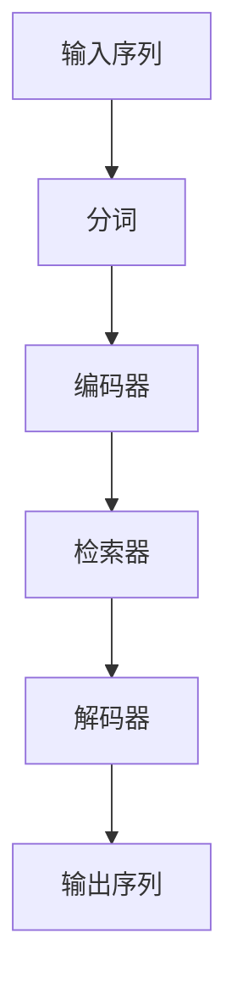

                 

# 大语言模型原理基础与前沿 检索增强型Transformer

> **关键词：** 大语言模型、检索增强型Transformer、自监督预训练、迁移学习、深度学习、自然语言处理

> **摘要：** 本文将深入探讨大语言模型的基础理论和前沿技术，特别是检索增强型Transformer架构。我们将逐步分析其核心概念、原理、算法、数学模型以及实际应用，旨在为读者提供一个全面的技术解读。

## 引言

随着信息时代的到来，自然语言处理（NLP）已经成为人工智能（AI）领域的重要分支。大语言模型作为一种强大的语言理解和生成工具，正在推动NLP技术的飞速发展。本文旨在介绍大语言模型的基本原理和前沿技术，重点关注检索增强型Transformer架构，帮助读者全面了解这一领域的发展动态。

## 第1章 大语言模型的研究背景

### 1.1 大语言模型的研究背景

自然语言是人类交流的基础，但在计算机处理之前，需要将其转化为机器可读的形式。大语言模型（Large Language Model）通过学习海量文本数据，能够理解和生成自然语言，从而在文本生成、机器翻译、问答系统等多个领域展现出巨大的潜力。

### 1.2 大语言模型的重要性

大语言模型在信息检索、智能客服、内容创作等方面具有广泛的应用前景。随着模型规模和计算能力的提升，大语言模型正在逐步替代传统的NLP方法，成为新的技术标准。

### 1.3 本书结构概述

本文将分为两部分：第一部分为基础理论，包括自然语言处理基础、大语言模型原理、核心算法和数学模型；第二部分为前沿研究，介绍实际应用案例和开发优化技巧。最后，还将提供前沿研究动态和附录。

## 第2章 自然语言处理基础

### 2.1 语言模型的基本概念

语言模型（Language Model）是一种概率模型，用于预测下一个单词或字符的概率。在NLP中，语言模型是构建其他应用（如机器翻译、文本生成）的基础。

### 2.2 词嵌入技术

词嵌入（Word Embedding）是将单词映射到高维向量空间的技术。词嵌入能够捕捉单词间的语义关系，提高语言模型的性能。

### 2.3 序列模型与注意力机制

序列模型（Sequential Model）能够处理输入序列，如RNN（递归神经网络）和LSTM（长短期记忆网络）。注意力机制（Attention Mechanism）是一种提高序列模型性能的关键技术。

### 2.4 递归神经网络（RNN）与长短期记忆网络（LSTM）

RNN和LSTM是处理序列数据的经典神经网络架构。LSTM通过引入门控机制，解决了RNN在长序列处理中的梯度消失问题。

## 第3章 大语言模型原理

### 3.1 大语言模型的定义与特点

大语言模型是一种具有大规模参数和广泛语言理解能力的模型。其特点包括：

- **大规模参数**：模型参数数量庞大，能够捕捉丰富的语言特征。
- **广泛的语言理解**：能够处理多种语言任务，如文本生成、机器翻译等。

### 3.2 检索增强型Transformer架构

检索增强型Transformer（Reformer）是一种基于Transformer架构的大语言模型。其核心思想是通过检索方式处理输入序列，提高计算效率和性能。

### 3.3 Mermaid流程图：检索增强型Transformer的工作流程

## 第4章 大语言模型的核心算法

### 4.1 自监督预训练

自监督预训练（Self-supervised Pre-training）是一种训练大语言模型的方法。通过无监督学习，模型在大量文本数据中学习语言规律。

### 4.2 迁移学习与微调

迁移学习（Transfer Learning）和微调（Fine-tuning）是利用预训练模型进行特定任务优化的技术。迁移学习能够减少训练数据需求，微调则能够提高模型在特定任务上的性能。

### 4.3 大规模模型的训练优化

大规模模型的训练优化包括并行计算、分布式训练、模型压缩等技术。这些技术能够提高训练效率，降低计算成本。

## 第5章 数学模型与公式详解

### 5.1 语言模型中的数学模型

在语言模型中，常用的数学模型包括概率分布和损失函数。概率分布用于描述单词或字符的概率，损失函数用于衡量模型预测和实际输出之间的差距。

### 5.2 概率分布与损失函数

概率分布通常使用对数概率（Log Probability）来表示，损失函数则常用交叉熵（Cross-Entropy）来衡量。

### 5.3 微积分与优化算法

微积分和优化算法在大规模模型训练中起着关键作用。梯度下降（Gradient Descent）和其变种如Adam优化器，是常用的优化算法。

## 第6章 实际应用案例分析

### 6.1 大语言模型在文本生成中的应用

文本生成是大语言模型的重要应用之一，包括自动写作、机器翻译、对话系统等。

### 6.2 大语言模型在机器翻译中的应用

机器翻译是NLP领域的经典任务，大语言模型通过自监督预训练和迁移学习，能够在多种语言之间实现高质量的翻译。

### 6.3 大语言模型在信息检索中的应用

信息检索是NLP的基本任务之一，大语言模型能够通过理解用户查询和文档内容，提供精准的搜索结果。

## 第7章 大语言模型的开发与优化

### 7.1 开发环境搭建

搭建大语言模型开发环境需要配置合适的硬件和软件，如GPU、深度学习框架等。

### 7.2 数据处理与预处理

数据处理与预处理是模型训练的重要环节，包括数据清洗、分词、去停用词等。

### 7.3 大规模模型的训练与评估

大规模模型的训练与评估需要考虑数据集大小、训练时间、模型性能等因素。

### 7.4 性能优化与调参技巧

性能优化与调参技巧包括模型压缩、量化、迁移学习等，旨在提高模型性能。

## 第8章 前沿研究动态

### 8.1 大语言模型的发展趋势

大语言模型的发展趋势包括模型规模扩大、训练算法优化、应用领域拓展等。

### 8.2 检索增强型Transformer的最新研究

检索增强型Transformer的最新研究关注于模型结构优化、计算效率提升等方面。

### 8.3 未来研究方向与挑战

未来研究方向与挑战包括模型安全、可解释性、多模态交互等。

## 附录A: 开发工具与资源

### A.1 主流深度学习框架对比

主流深度学习框架对比包括TensorFlow、PyTorch、MXNet等。

### A.2 常用自然语言处理库介绍

常用自然语言处理库介绍包括NLTK、spaCy、jieba等。

### A.3 开源数据集资源

开源数据集资源包括Wikipedia、Common Crawl、ACL Anthology等。

## 附录B: 代码实例解析

### B.1 代码实例1：文本生成模型实现

文本生成模型的实现过程，包括数据预处理、模型构建、训练与评估等。

### B.2 代码实例2：机器翻译模型实现

机器翻译模型的实现过程，包括数据预处理、模型构建、训练与评估等。

### B.3 代码实例3：信息检索模型实现

信息检索模型的实现过程，包括数据预处理、模型构建、训练与评估等。

## 作者信息

作者：AI天才研究院/AI Genius Institute & 禅与计算机程序设计艺术 /Zen And The Art of Computer Programming

---

本文作为一份技术博客，旨在为读者提供一个系统、深入的大语言模型和技术框架——检索增强型Transformer的解读。在接下来的章节中，我们将逐步探讨每个关键概念、算法和实际应用，希望对您在NLP和深度学习领域的研究有所启发。

