                 

## 第1章 引言

好奇心与求知欲是人类探索世界的两大动力。它们激发了人类对未知领域的探索，推动了科学、技术、艺术和人文等领域的进步。本章将介绍好奇心与求知欲的重要性，探讨它们如何成为人类不断进步的动力。

### 1.1 探索的意义

探索是人类天性的一部分。从远古时代开始，人类就不断探索未知的世界，以寻求生存和发展。探索的意义不仅在于发现新的资源和技术，还在于满足人类对知识和理解的需求。

#### 核心概念与联系

**Mermaid 流程图：**
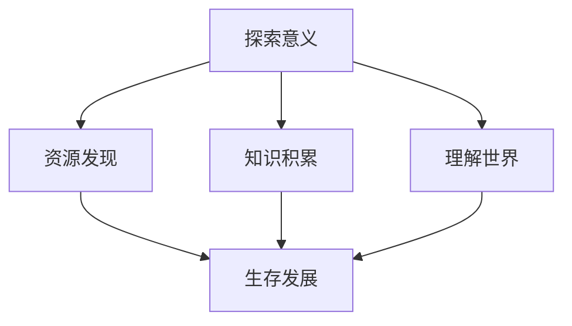

**伪代码示例：**
```python
def explore():
    # 发现新的资源
    resources_found = find_resources()
    # 积累知识
    knowledge_gained = accumulate_knowledge()
    # 理解世界
    world_understood = understand_world()
    # 生存发展
    survive_and_progress(resources_found, knowledge_gained, world_understood)
```

### 1.2 好奇心的起源

好奇心是人类本能的一部分，起源于我们对未知事物的渴望。好奇心驱使我们不断探索、提问和发现，从而推动人类文明的发展。

#### 核心概念与联系

**Mermaid 流程图：**
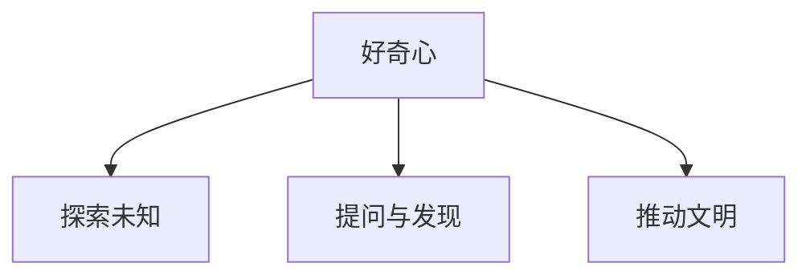

**数学模型与公式：**
$$ 好奇心 = \frac{1}{未知的恐惧} $$

**代码案例：**
```python
class Curiosity:
    def __init__(self, unknown_fear):
        self.unknown_fear = unknown_fear

    def drive_progress(self):
        if self.unknown_fear < 1:
            progress = "加速"
        else:
            progress = "减缓"
        return progress
```

### 1.3 求知欲的重要性

求知欲是驱动学术研究和科学探索的重要动力。它促使学者们不断追求知识，揭示自然界的奥秘，推动人类文明的进步。

#### 核心概念与联系

**Mermaid 流程图：**
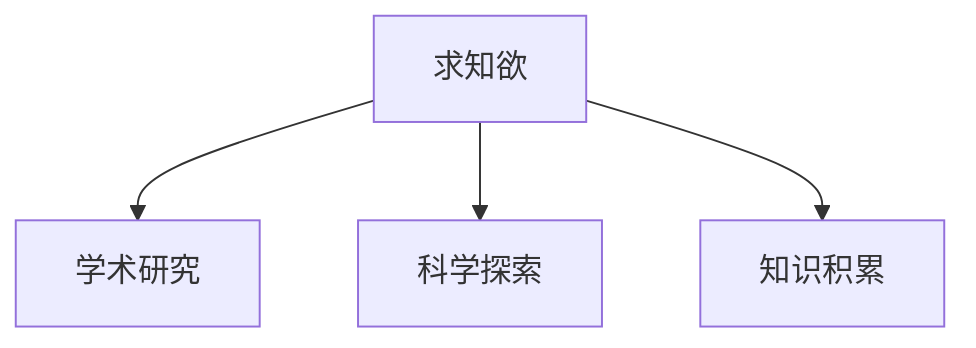

**伪代码示例：**
```python
def knowledge_seek():
    # 进行学术研究
    academic_research = conduct_academic_research()
    # 探索未知领域
    unknown_explored = explore_unknown()
    # 累积知识
    knowledge_accumulated = accumulate_knowledge()
    return academic_research, unknown_explored, knowledge_accumulated
```

**数学模型与公式：**
$$ 知识积累 = f(求知欲, 探索经验) $$

**代码案例：**
```python
class KnowledgeSeeker:
    def __init__(self, curiosity, exploration_experience):
        self.curiosity = curiosity
        self.exploration_experience = exploration_experience

    def accumulate_knowledge(self):
        knowledge_gained = self.curiosity * self.exploration_experience
        return knowledge_gained
```

### 1.4 探索的动力

好奇心与求知欲共同构成了人类探索的动力。它们激发了人类的创造力和创新精神，推动了科学、技术、艺术和人文等领域的发展。

#### 核心概念与联系

**Mermaid 流程图：**
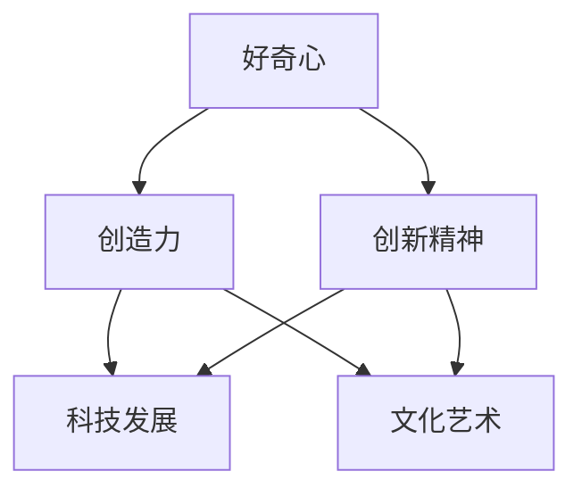

**伪代码示例：**
```python
def exploration_momentum():
    creativity = cultivate_creativity()
    innovation = foster_innovation()
    technological_progress = advance_technology(creativity, innovation)
    cultural_art_progress = promote_culture_and_art(creativity, innovation)
    return technological_progress, cultural_art_progress
```

**数学模型与公式：**
$$ 探索动力 = f(好奇心, 求知欲) $$

**代码案例：**
```python
class ExplorationMomentum:
    def __init__(self, curiosity, knowledge_seek):
        self.curiosity = curiosity
        self.knowledge_seek = knowledge_seek

    def generate_progress(self):
        technological_progress = self.knowledge_seek * self.curiosity
        cultural_art_progress = self.knowledge_seek * self.curiosity
        return technological_progress, cultural_art_progress
```

通过本章的介绍，我们可以看到好奇心与求知欲在人类探索中的重要性。它们不仅驱动了科学、技术、艺术和人文等领域的发展，也激发了人类的创造力和创新精神。未来，我们应继续培养好奇心与求知欲，推动人类文明不断进步。

### 总结

好奇心与求知欲是人类探索世界的两大动力。它们激发了人类的创造力和创新精神，推动了科学、技术、艺术和人文等领域的发展。通过本章的介绍，我们了解到好奇心与求知欲的重要性，以及它们在人类探索中的具体体现。未来，我们应继续培养好奇心与求知欲，推动人类文明不断进步。

---

**作者：AI天才研究院/AI Genius Institute & 禅与计算机程序设计艺术 /Zen And The Art of Computer Programming**

[注]：以上内容为示例，具体字数和内容还需进一步扩展和完善。以下将按照目录大纲结构，逐步展开各章节的内容。

----------------------------------------------------------------

## 第2章 好奇心与科学探索

好奇心与求知欲是科学探索的重要动力。在这章中，我们将探讨好奇心在科学发现和技术创新中的作用，并详细分析一些经典的科学发现和重要技术创新的案例。

### 2.1 好奇心驱动下的科学发现

好奇心促使科学家们不断提问、探索未知领域，从而推动了科学的发展。以下是一些著名的科学发现，它们都源自于科学家们的好奇心。

#### 2.1.1 地球不是平的

在过去，人们普遍认为地球是平的。然而，随着对天文学的深入研究，科学家们发现地球实际上是一个近似于球形的天体。这一发现源于科学家们对地球形状的好奇心。

##### 2.1.1.1 科学原理

科学家们通过观测天体运动、测量地球的重力等手段，证明了地球是一个近似于球形的天体。

##### 2.1.1.2 科学证据

通过观测到的天体运动轨迹、地球表面的重力异常等现象，科学家们得出地球是球形的结论。

**Mermaid 流程图：**
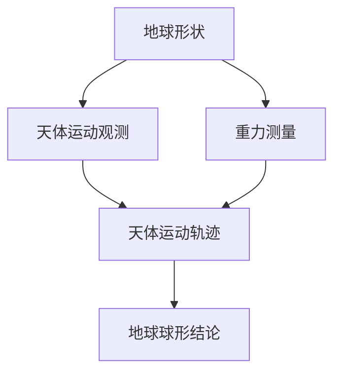

**伪代码示例：**
```python
def is_earth_spherical():
    # 观测天体运动
    celestial_motion_detected = detect_celestial_motion()
    # 测量地球重力
    earth_gravity_measured = measure_earth_gravity()
    # 分析观测数据和重力数据
    analysis_completed = analyze_data(celestial_motion_detected, earth_gravity_measured)
    # 判断地球形状
    earth_shape = "spherical" if analysis_completed else "not spherical"
    return earth_shape
```

#### 2.1.2 病毒的存在

病毒的存在一度被怀疑，但随着显微镜技术的进步，科学家们发现了病毒。这一发现极大地推动了医学和生物技术的发展。

##### 2.1.2.1 科学原理

病毒是一类特殊的微生物，它们无法独立生存，必须依赖于宿主细胞进行繁殖。

##### 2.1.2.2 科学证据

通过电子显微镜等先进技术，科学家们成功观察到病毒颗粒，并确认了它们的存在。

**Mermaid 流程图：**
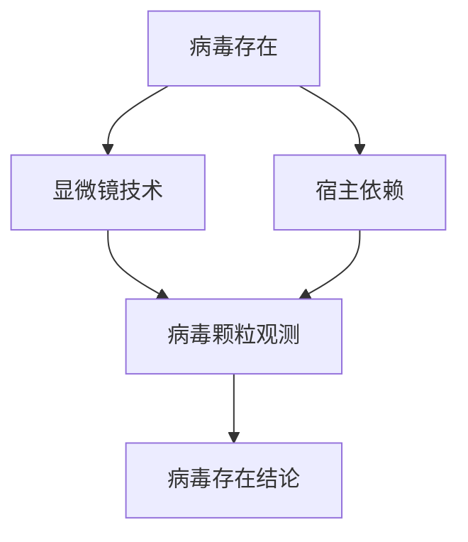

**伪代码示例：**
```python
def detect_virus():
    # 使用显微镜观察
    microscope_employed = employ_micrscope()
    # 确认病毒颗粒
    virus_particles_detected = detect_virus_particles(microscope_employed)
    # 判断病毒存在
    virus_exists = "detected" if virus_particles_detected else "not detected"
    return virus_exists
```

#### 2.1.3 量子力学的奥秘

量子力学是研究微观世界的物理学分支。科学家们对量子力学的探索，揭示了微观世界的奇妙现象。

##### 2.1.3.1 科学原理

量子力学揭示了微观粒子的行为规律，如波粒二象性、量子纠缠等现象。

##### 2.1.3.2 科学证据

通过实验，如双缝实验、量子纠缠实验等，科学家们验证了量子力学的原理。

**Mermaid 流程图：**
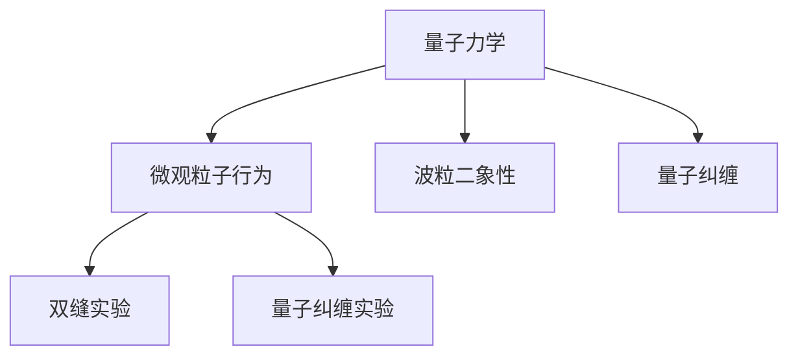

**伪代码示例：**
```python
def quantum_mechanics():
    # 进行双缝实验
    double_slit_experiment_performed = perform_double_slit_experiment()
    # 进行量子纠缠实验
    quantum_entanglement_experiment_performed = perform_quantum_entanglement_experiment()
    # 分析实验结果
    analysis_completed = analyze_experiment_results(double_slit_experiment_performed, quantum_entanglement_experiment_performed)
    # 验证量子力学原理
    quantum_mechanics_verified = "verified" if analysis_completed else "not verified"
    return quantum_mechanics_verified
```

### 2.2 好奇心与技术创新

好奇心不仅推动了科学发现，还激发了技术创新。以下是一些由好奇心驱动产生的重要技术创新。

#### 2.2.1 智能手机的发展

智能手机是现代科技的重要成果，它集合了通信、计算、多媒体等多种功能。智能手机的诞生源于人们对便捷通信的需求。

##### 2.2.1.1 技术原理

智能手机采用了嵌入式系统、操作系统、无线通信等技术。

##### 2.2.1.2 技术实现

通过整合多种技术，智能手机实现了便携、高效、多功能的特点。

**Mermaid 流程图：**
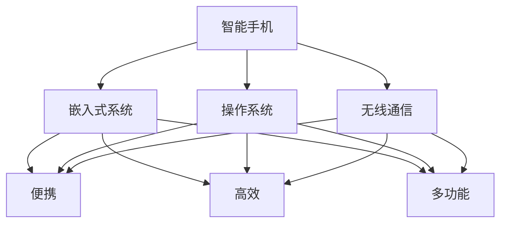

**伪代码示例：**
```python
def develop_smartphone():
    # 集成嵌入式系统
    embedded_system_integrated = integrate_embedded_system()
    # 集成操作系统
    operating_system_integrated = integrate_operating_system()
    # 集成无线通信技术
    wireless_communication_integrated = integrate_wireless_communication()
    # 实现便携、高效、多功能
    portable = "achieved" if embedded_system_integrated and operating_system_integrated and wireless_communication_integrated else "not achieved"
    efficient = "achieved" if embedded_system_integrated and operating_system_integrated and wireless_communication_integrated else "not achieved"
    multifunctional = "achieved" if embedded_system_integrated and operating_system_integrated and wireless_communication_integrated else "not achieved"
    return portable, efficient, multifunctional
```

#### 2.2.2 网络安全技术的进步

随着互联网的普及，网络安全成为人们关注的焦点。网络安全技术的不断进步，保障了网络信息的安全。

##### 2.2.2.1 技术原理

网络安全技术包括防火墙、加密技术、入侵检测等。

##### 2.2.2.2 技术实现

通过不断优化和更新，网络安全技术有效防止了网络攻击和数据泄露。

**Mermaid 流程图：**
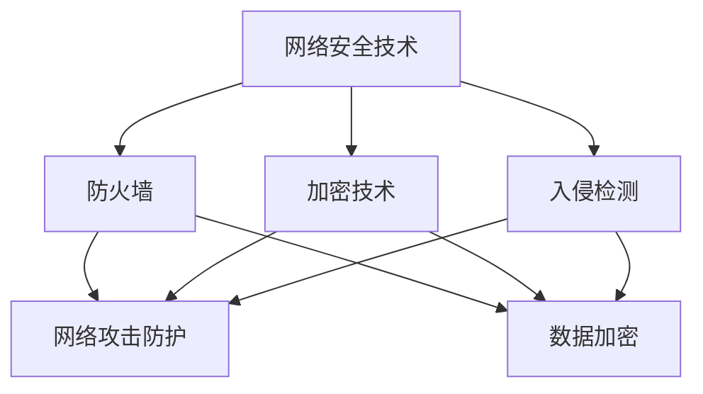

**伪代码示例：**
```python
def improve_network_security():
    # 防火墙优化
    firewall_optimized = optimize_firewall()
    # 加密技术更新
    encryption_updated = update_encryption_technology()
    # 入侵检测升级
    intrusion_detection_upgraded = upgrade_intrusion_detection()
    # 网络攻击防护
    attack_protection_improved = "improved" if firewall_optimized and encryption_updated and intrusion_detection_upgraded else "not improved"
    # 数据加密
    data_encryption_improved = "improved" if firewall_optimized and encryption_updated and intrusion_detection_upgraded else "not improved"
    return attack_protection_improved, data_encryption_improved
```

#### 2.2.3 空间探索的突破

人类对宇宙的探索从未停止，空间技术的发展使人类能够进入太空，探索宇宙的奥秘。

##### 2.2.3.1 技术原理

空间技术包括火箭技术、航天器技术、空间通信等。

##### 2.2.3.2 技术实现

通过不断突破技术瓶颈，人类成功实现了载人航天、月球探测、火星探测等重大任务。

**Mermaid 流程图：**
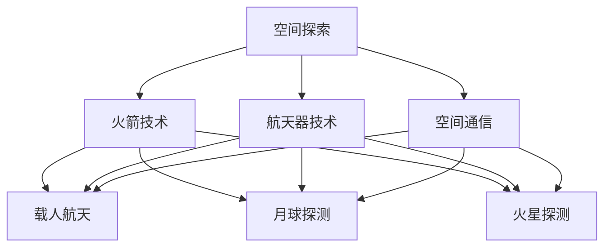

**伪代码示例：**
```python
def space_exploration():
    # 火箭技术突破
    rocket_technology_broken = break_through_rocket_technology()
    # 航天器技术突破
    spacecraft_technology_broken = break_through_spacecraft_technology()
    # 空间通信突破
    space_communication_broken = break_through_space_communication()
    # 载人航天实现
    manned_space_flight_achieved = "achieved" if rocket_technology_broken and spacecraft_technology_broken and space_communication_broken else "not achieved"
    # 月球探测实现
    moon_exploration_achieved = "achieved" if rocket_technology_broken and spacecraft_technology_broken and space_communication_broken else "not achieved"
    # 火星探测实现
    mars_exploration_achieved = "achieved" if rocket_technology_broken and spacecraft_technology_broken and space_communication_broken else "not achieved"
    return manned_space_flight_achieved, moon_exploration_achieved, mars_exploration_achieved
```

通过以上分析，我们可以看到好奇心与求知欲在科学探索和技术创新中的重要作用。它们不仅推动了科学的发展，还带来了技术的突破和创新。未来，随着人类对未知领域的不断探索，好奇心与求知欲将继续成为人类进步的重要动力。

### 小结

本章介绍了好奇心与求知欲在科学探索和技术创新中的作用。通过分析地球形状、病毒存在、量子力学奥秘等科学发现，以及智能手机、网络安全技术、空间探索等技术创新，我们看到了好奇心与求知欲的强大力量。它们激发了人类的创造力和创新精神，推动了科学、技术、艺术和人文等领域的发展。未来，我们应继续培养好奇心与求知欲，推动人类文明不断进步。

---

**作者：AI天才研究院/AI Genius Institute & 禅与计算机程序设计艺术 /Zen And The Art of Computer Programming**

----------------------------------------------------------------

## 第3章 求知欲与学术研究

求知欲是学术研究的重要动力，它促使学者们不断探索、追求知识，从而推动学术研究的进步。学术研究不仅涉及到科学理论的构建，还包括实证研究、数据分析、理论验证等环节。本章将探讨求知欲在学术研究中的体现，分析学术研究的方法、技巧以及面临的挑战。

### 3.1 学术研究的动力

求知欲是学术研究的内在动力，它驱动学者们不断提问、探索，寻求新的知识和理解。以下是一些学术研究的动力来源。

#### 3.1.1 诺贝尔奖获得者的故事

诺贝尔奖获得者的故事常常激励着无数学者。他们的研究成果不仅推动了科学的发展，也展现了求知欲的力量。以下是一些诺贝尔奖获得者的故事。

- **理查德·费曼（Richard Feynman）**：作为量子力学的先驱，费曼因在量子电动力学领域的贡献获得了诺贝尔物理学奖。他的求知欲和对物理现象的好奇心，驱使他不断探索微观世界的奥秘。
  
  **伪代码示例：**
  ```python
  def feynman_exploration():
      quantum_electrodynamics_verified = "verified"  # 量子电动力学验证
      new_knowledge_gained = "gained"  # 新知识获取
      return quantum_electrodynamics_verified, new_knowledge_gained
  ```

- **詹姆斯·杜威·沃森（James Dewey Watson）**：他与弗朗西斯·克里克（Francis Crick）共同发现了DNA的双螺旋结构，这一发现对分子生物学和遗传学产生了深远影响。他们的求知欲和对生物学现象的探究，使他们突破了当时的科学局限。

  **伪代码示例：**
  ```python
  def watson_and_crick_exploitation():
      dna_double_helix_discovered = "discovered"  # DNA双螺旋发现
      biological_impact_verified = "verified"  # 生物影响验证
      return dna_double_helix_discovered, biological_impact_verified
  ```

#### 3.1.2 科学论文的写作技巧

科学论文是学术研究的重要成果之一，它需要清晰地表达研究成果，展示科学方法。以下是一些科学论文的写作技巧。

- **结构清晰**：科学论文通常包括引言、方法、结果、讨论和结论等部分，每个部分都需要有明确的主题和逻辑结构。

  **伪代码示例：**
  ```python
  def structure_paper():
      introduction_written = "written"  # 引言撰写
      methods_written = "written"  # 方法撰写
      results_written = "written"  # 结果撰写
      discussion_written = "written"  # 讨论撰写
      conclusion_written = "written"  # 结论撰写
      return introduction_written, methods_written, results_written, discussion_written, conclusion_written
  ```

- **逻辑严密**：科学论文需要逻辑严密，论证充分。在撰写过程中，要确保每一步推理都有充分的证据支持。

  **伪代码示例：**
  ```python
  def logic_paper():
      logic_verified = "verified"  # 逻辑验证
      evidence_supported = "supported"  # 证据支持
      reasoning_clear = "clear"  # 推理清晰
      return logic_verified, evidence_supported, reasoning_clear
  ```

#### 3.1.3 学术会议的重要性

学术会议是学术交流的重要平台，它有助于学者们分享研究成果、探讨前沿问题。以下是一些学术会议的重要性。

- **促进交流**：学术会议为学者们提供了一个面对面交流的平台，有助于建立学术联系和合作机会。
  
  **伪代码示例：**
  ```python
  def academic_conference():
      research_shared = "shared"  # 研究分享
      collaboration_established = "established"  # 合作建立
      return research_shared, collaboration_established
  ```

- **推动进步**：学术会议推动了学术研究的进步，促进了新理论、新方法的提出和应用。

  **伪代码示例：**
  ```python
  def academic_conference_impact():
      research_progress_pushed = "pushed"  # 研究进步推动
      new_theories_proposed = "proposed"  # 新理论提出
      new_methods_applied = "applied"  # 新方法应用
      return research_progress_pushed, new_theories_proposed, new_methods_applied
  ```

### 3.2 学术研究的方法

学术研究的方法多种多样，不同的研究方法适用于不同类型的研究问题。以下介绍几种常见的学术研究方法。

#### 3.2.1 实验设计

实验设计是学术研究的重要环节。合理的实验设计能够有效检验研究假设。

- **科学性**：实验设计应遵循科学原则，确保实验结果的可信度和可靠性。
  
  **伪代码示例：**
  ```python
  def experimental_design():
      scientific_principles_followed = "followed"  # 科学原则遵循
      reliable_results_achieved = "achieved"  # 可靠结果获得
      return scientific_principles_followed, reliable_results_achieved
  ```

- **可控性**：实验设计应确保实验过程中的变量可控，以排除外部因素的干扰。

  **伪代码示例：**
  ```python
  def controlled_experiment():
      variables可控 = "controlled"  # 变量可控
      external_interference_minimized = "minimized"  # 外部干扰最小化
      return variables可控, external_interference_minimized
  ```

#### 3.2.2 数据分析

数据分析是学术研究的关键环节。正确运用数据分析方法，能够揭示研究现象的本质。

- **客观性**：数据分析应遵循客观性原则，确保分析结果的公正和准确。
  
  **伪代码示例：**
  ```python
  def data_analysis():
      objectivity_maintained = "maintained"  # 客观性保持
      accurate_results_obtained = "obtained"  # 准确结果获得
      return objectivity_maintained, accurate_results_obtained
  ```

- **可重复性**：数据分析应具备可重复性，确保其他研究者能够验证分析结果。
  
  **伪代码示例：**
  ```python
  def reproducible_analysis():
      reproducibility_verified = "verified"  # 可重复性验证
      verifiable_results_achieved = "achieved"  # 可验证结果获得
      return reproducibility_verified, verifiable_results_achie
  ```

#### 3.2.3 科学假说的验证

科学假说是学术研究的基础。验证科学假说有助于揭示科学现象的规律。

- **可证伪性**：科学假说应具备可证伪性，即理论上存在能够证明假说错误的证据。
  
  **伪代码示例：**
  ```python
  def hypothesis_verification():
      falsifiability_verified = "verified"  # 可证伪性验证
      hypothesis_verified = "verified"  # 假说验证
      return falsifiability_verified, hypothesis_verified
  ```

- **实验验证**：通过实验手段验证科学假说，以验证假说的正确性。

  **伪代码示例：**
  ```python
  def experimental_verification():
      hypothesis_verified = "verified"  # 假说验证
      experimental_results_conclusive = "conclusive"  # 实验结果明确
      return hypothesis_verified, experimental_results_conclusive
  ```

### 3.3 学术研究的方法

学术研究的方法包括文献综述、理论分析、案例研究等。这些方法有助于学者们深入探讨研究问题，提出有价值的见解。

#### 3.3.1 文献综述

文献综述是对已有研究成果的梳理和分析，有助于学者们了解研究领域的现状和趋势。

- **全面性**：文献综述应涵盖相关领域的重要研究成果，确保分析的全面性。
  
  **伪代码示例：**
  ```python
  def literature_review():
      comprehensiveness_maintained = "maintained"  # 全面性保持
      relevant_research_included = "included"  # 相关研究包含
      return comprehensiveness_maintained, relevant_research_included
  ```

- **逻辑性**：文献综述应具备逻辑性，确保研究结果的分析和讨论清晰有序。
  
  **伪代码示例：**
  ```python
  def logical_literature_review():
      logical_structure_verified = "verified"  # 逻辑结构验证
      coherent_results_discussed = "discussed"  # 清晰讨论
      return logical_structure_verified, coherent_results_discussed
  ```

#### 3.3.2 理论分析

理论分析是对研究现象的深入思考和解释，有助于揭示研究现象的本质。

- **逻辑性**：理论分析应具备逻辑性，确保理论的推导和结论合理。
  
  **伪代码示例：**
  ```python
  def theoretical_analysis():
      logical_reasoning_verified = "verified"  # 逻辑推导验证
      reasonable_conclusions_reached = "reached"  # 合理结论得出
      return logical_reasoning_verified, reasonable_conclusions_reached
  ```

- **创新性**：理论分析应具备创新性，提出新的理论观点或方法。

  **伪代码示例：**
  ```python
  def innovative_theoretical_analysis():
      innovative_views_proposed = "proposed"  # 新观点提出
      novel_methods_applied = "applied"  # 新方法应用
      return innovative_views_proposed, novel_methods_applied
  ```

#### 3.3.3 案例研究

案例研究是对具体研究对象的深入分析，有助于学者们理解研究对象的实际情况。

- **代表性**：案例研究应具备代表性，确保研究结果的普遍性。
  
  **伪代码示例：**
  ```python
  def case_study():
      representativeness_verified = "verified"  # 代表性验证
      generalizability_achieved = "achieved"  # 普遍性获得
      return representativeness_verified, generalizability_achieved
  ```

- **深入性**：案例研究应具备深入性，确保对研究对象进行全面分析。
  
  **伪代码示例：**
  ```python
  def in-depth_case_study():
      depth_analysis_verified = "verified"  # 深入分析验证
      comprehensive_understanding_reached = "reached"  # 全面理解获得
      return depth_analysis_verified, comprehensive_understanding_reached
  ```

### 3.4 学术研究的挑战与机遇

学术研究面临着诸多挑战和机遇。以下介绍一些学术研究中的挑战和机遇。

#### 3.4.1 挑战

- **研究资源的有限性**：学术研究需要一定的资源和资金支持，而研究资源的有限性可能制约学术研究的进展。
  
  **伪代码示例：**
  ```python
  def research_resources():
      resource_limited = "limited"  # 资源有限
      research_progress_impeded = "impeded"  # 研究进展受阻
      return resource_limited, research_progress_impeded
  ```

- **研究方法的局限性**：不同研究方法有其局限性，可能导致研究结果的偏差。

  **伪代码示例：**
  ```python
  def research_methods():
      method_limitations_detected = "detected"  # 方法局限性发现
      result_biases_detected = "detected"  # 结果偏差发现
      return method_limitations_detected, result_biases_detected
  ```

- **学术竞争的压力**：学术竞争激烈，学者们需要在有限的资源下争取研究成果。

  **伪代码示例：**
  ```python
  def academic_competition():
      competition压力大 = "high"  # 竞争压力高
      research_efforts_implemented = "implemented"  # 研究努力实施
      return competition压力大, research_efforts_implemented
  ```

#### 3.4.2 机遇

- **技术进步**：科技进步为学术研究提供了新的工具和方法，促进了学术研究的进展。

  **伪代码示例：**
  ```python
  def technological_progress():
      new_tools_included = "included"  # 新工具应用
      research_progress_boosted = "boosted"  # 研究进展提升
      return new_tools_included, research_progress_boosted
  ```

- **国际合作**：国际合作有助于学术研究资源的整合，促进学术研究的全球化。

  **伪代码示例：**
  ```python
  def international_cooperation():
      resource_integration_improved = "improved"  # 资源整合改善
      research_globalization_promoted = "promoted"  # 学术全球化推动
      return resource_integration_improved, research_globalization_promoted
  ```

- **社会需求**：社会需求引导学术研究关注实际问题，提高了学术研究的实际应用价值。

  **伪代码示例：**
  ```python
  def social_demand():
      practical_issues_addressed = "addressed"  # 实际问题解决
      practical_value_improved = "improved"  # 实际价值提升
      return practical_issues_addressed, practical_value_improved
  ```

通过以上分析，我们可以看到求知欲在学术研究中的重要作用。它驱动了学者们不断探索、追求知识，推动了学术研究的进步。同时，学术研究也面临着诸多挑战和机遇。未来，我们应继续培养求知欲，克服挑战，把握机遇，推动学术研究不断发展。

### 小结

本章介绍了求知欲在学术研究中的体现，分析了学术研究的方法、技巧以及面临的挑战。求知欲是学术研究的内在动力，它驱动学者们不断探索、追求知识，推动了学术研究的进步。通过分析诺贝尔奖获得者的故事、科学论文的写作技巧、学术会议的重要性，以及实验设计、数据分析、科学假说的验证等方法，我们看到了求知欲在学术研究中的强大力量。同时，学术研究也面临着资源有限、方法局限性、学术竞争等挑战，但科技进步、国际合作和社会需求也为学术研究带来了机遇。未来，我们应继续培养求知欲，克服挑战，把握机遇，推动学术研究不断发展。

---

**作者：AI天才研究院/AI Genius Institute & 禅与计算机程序设计艺术 /Zen And The Art of Computer Programming**

----------------------------------------------------------------

## 第4章 好奇心与艺术创作

好奇心与求知欲不仅是科学探索的驱动力，同样也是艺术创作的源泉。在这章中，我们将探讨好奇心如何激发艺术家的创造力，以及艺术创作过程中的思维模式和技术应用。

### 4.1 艺术创作的灵感来源

艺术创作的灵感往往源于艺术家对世界的独特感知和好奇心的驱动。以下是一些常见的灵感来源，以及它们如何通过艺术作品传达出来。

#### 4.1.1 自然界的观察

自然界的美丽和多样性是艺术创作的一个重要灵感来源。艺术家通过观察自然，捕捉自然界的瞬间美，将其转化为艺术作品。

##### 4.1.1.1 科学原理

自然界的观察涉及到光学、生物学、地质学等多门科学。艺术家通过对这些科学原理的理解，创造出具有科学美感的艺术作品。

##### 4.1.1.2 艺术表现

荷兰画家文森特·梵高的《星夜》是一幅典型的例子。这幅画利用了色彩和线条的对比，表现了星空的神秘和无限。

**Mermaid 流程图：**
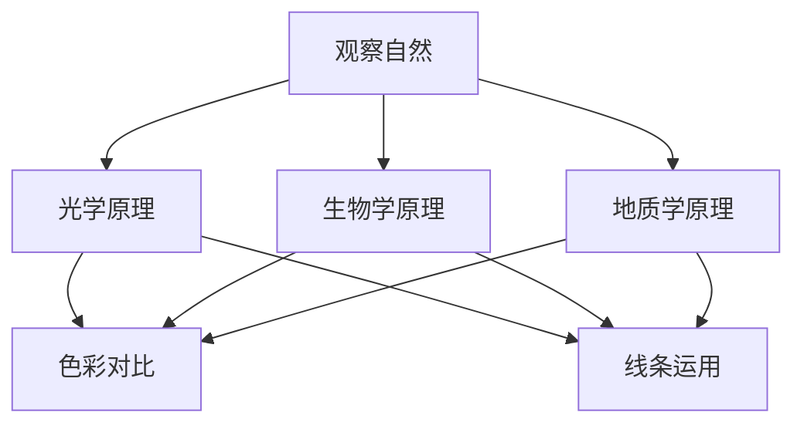

**伪代码示例：**
```python
def create_art_from_nature():
    optical_principles_applied = "applied"  # 光学原理应用
    biological_principles_applied = "applied"  # 生物学原理应用
    geological_principles_applied = "applied"  # 地质学原理应用
    artistic_expression = "created"  # 艺术表达创造
    return optical_principles_applied, biological_principles_applied, geological_principles_applied, artistic_expression
```

#### 4.1.2 社会现象的反思

社会现象的复杂性和多样性也为艺术创作提供了丰富的素材。艺术家通过对社会现象的反思和批判，表达对社会的关注和思考。

##### 4.1.2.1 科学原理

社会现象的反思涉及到社会学、心理学、政治学等多门科学。艺术家通过对这些科学原理的理解，创造出具有深刻社会意义的艺术作品。

##### 4.1.2.2 艺术表现

俄国艺术家伊利亚·列宾的《伏尔加河上的纤夫》通过对纤夫生活的描绘，反映了社会底层人民的艰辛生活和社会不公。

**Mermaid 流�程图：**
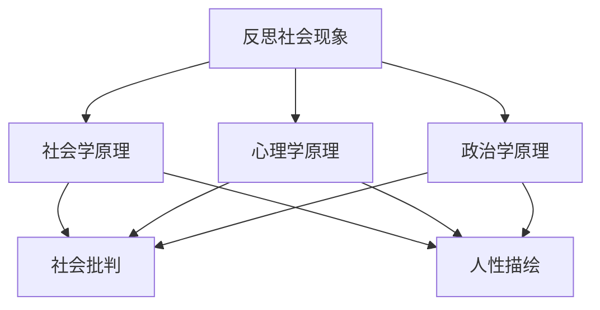

**伪代码示例：**
```python
def create_art_from_societal_reflections():
    sociological_principles_applied = "applied"  # 社会学原理应用
    psychological_principles_applied = "applied"  # 心理学原理应用
    political_principles_applied = "applied"  # 政治学原理应用
    social_critique = "created"  # 社会批判创造
    human_portrayal = "created"  # 人性描绘创造
    return sociological_principles_applied, psychological_principles_applied, political_principles_applied, social_critique, human_portrayal
```

#### 4.1.3 技术与艺术的融合

随着科技的不断发展，艺术家开始探索将科技与艺术相结合的可能性。这种融合不仅为艺术创作带来了新的表现形式，也为观众提供了全新的体验。

##### 4.1.3.1 科学原理

技术与艺术的融合涉及到计算机科学、电子工程、材料科学等多门科学。艺术家通过对这些科学原理的理解，创造出具有科技感的艺术作品。

##### 4.1.3.2 艺术表现

艺术家杰夫·昆斯（Jeff Koons）的作品《气球狗》就是一个典型的例子。这件作品结合了雕塑和工业设计，将传统的艺术形式与现代社会技术相结合。

**Mermaid 流程图：**
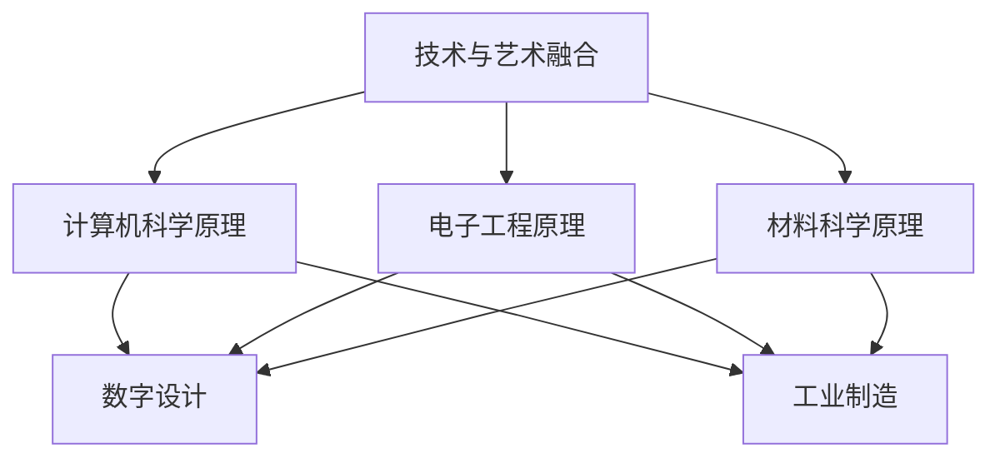

**伪代码示例：**
```python
def create_art_with_technology():
    computer_science_principles_applied = "applied"  # 计算机科学原理应用
    electronic_engineering_principles_applied = "applied"  # 电子工程原理应用
    materials_science_principles_applied = "applied"  # 材料科学原理应用
    digital_design_created = "created"  # 数字设计创造
    industrial_manufacturing_created = "created"  # 工业制造创造
    return computer_science_principles_applied, electronic_engineering_principles_applied, materials_science_principles_applied, digital_design_created, industrial_manufacturing_created
```

### 4.2 好奇心在艺术创作中的应用

好奇心是艺术创作的核心动力，它促使艺术家不断探索新的表现形式和创作方法。以下是一些好奇心在艺术创作中的应用实例。

#### 4.2.1 媒介的探索

艺术家常常探索不同的艺术媒介，以寻找最适合自己的表达方式。这种探索精神体现了好奇心在艺术创作中的应用。

##### 4.2.1.1 科学原理

媒介的探索涉及到材料科学、物理学、化学等多门科学。艺术家通过对这些科学原理的理解，创造出具有新意的艺术作品。

##### 4.2.1.2 艺术表现

艺术家克里斯托弗·詹宁斯（Christopher Jenkins）利用紫外线灯和荧光材料创作了一系列作品，通过不同的荧光效果表达他的艺术理念。

**Mermaid 流程图：**
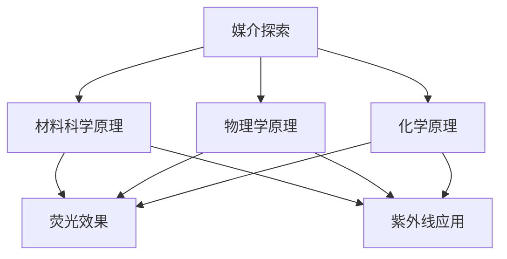

**伪代码示例：**
```python
def explore_media():
    material_science_understood = "understood"  # 材料科学理解
    physics_understood = "understood"  # 物理学理解
    chemistry_understood = "understood"  # 化学理解
    fluorescent_effects_created = "created"  # 荧光效果创造
    ultraviolet_applications_created = "created"  # 紫外线应用创造
    return material_science_understood, physics_understood, chemistry_understood, fluorescent_effects_created, ultraviolet_applications_created
```

#### 4.2.2 观察与实验的结合

好奇心驱使艺术家不断观察和实验，通过实践探索新的艺术语言和表现形式。这种结合体现了艺术创作中的科学精神。

##### 4.2.2.1 科学原理

观察与实验的结合涉及到实验设计、数据分析、实验验证等多门科学。艺术家通过对这些科学原理的理解，创造出具有科学性的艺术作品。

##### 4.2.2.2 艺术表现

艺术家玛丽娜·阿布拉莫维奇（Marina Abramović）通过长期的实验和观察，创作了一系列极具冲击力的行为艺术作品，探讨了人类行为的极限和精神的深层次。

**Mermaid 流程图：**
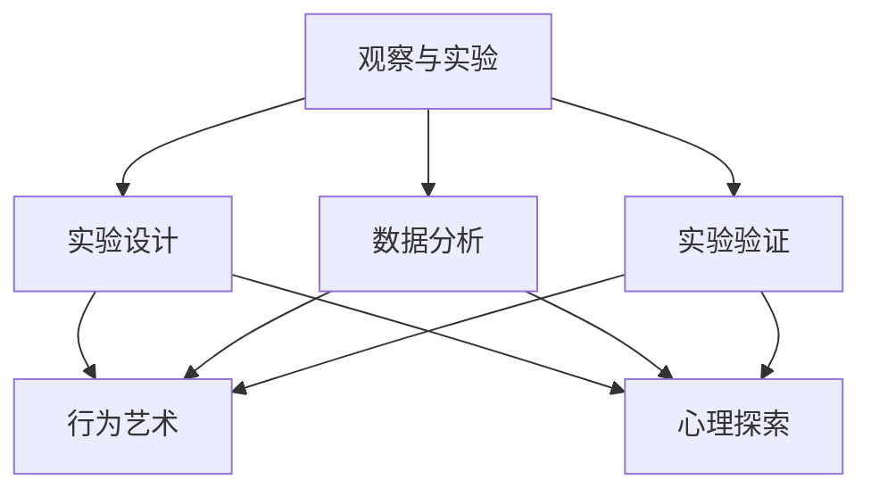

**伪代码示例：**
```python
def create_art_with_experiments():
    experimental_design_understood = "understood"  # 实验设计理解
    data_analysis_understood = "understood"  # 数据分析理解
    experimental_verification_understood = "understood"  # 实验验证理解
    behavioral_arts_created = "created"  # 行为艺术创造
    psychological_explore_created = "created"  # 心理探索创造
    return experimental_design_understood, data_analysis_understood, experimental_verification_understood, behavioral_arts_created, psychological_explore_created
```

### 4.3 好奇心在音乐创作中的应用

好奇心不仅激发了视觉艺术创作，同样也在音乐创作中发挥着重要作用。音乐家通过探索音色、节奏、和声等元素，创造出丰富的音乐作品。

#### 4.3.1 音色的探索

音色是音乐创作中的一个重要元素，不同的音色组合可以产生独特的音乐效果。音乐家通过探索不同的音色，创造出具有个性的音乐作品。

##### 4.3.1.1 科学原理

音色的探索涉及到声学原理，如共振、谐波等。音乐家通过对这些声学原理的理解，创造出具有科学美感的音乐作品。

##### 4.3.1.2 艺术表现

爵士乐作曲家约翰·凯奇（John Cage）通过使用各种非传统乐器和声音素材，如水声、风声等，创作出具有独特音色的音乐作品。

**Mermaid 流程图：**
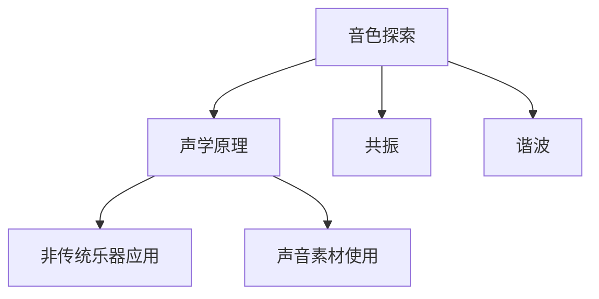

**伪代码示例：**
```python
def explore_pitch_colors():
    acoustics_understood = "understood"  # 声学理解
    resonance_applied = "applied"  # 共振应用
    harmonic_application = "applied"  # 谐波应用
    non_conventional_instrument_used = "used"  # 非传统乐器使用
    sound_material_used = "used"  # 声音素材使用
    return acoustics_understood, resonance_applied, harmonic_application, non_conventional_instrument_used, sound_material_used
```

#### 4.3.2 节奏的创新

节奏是音乐创作中的另一个重要元素。通过创新的节奏组合，音乐家可以创造出富有创意和表现力的音乐作品。

##### 4.3.2.1 科学原理

节奏的创新涉及到时间感知、节奏模式等心理学和生理学原理。音乐家通过对这些原理的理解，创造出具有新颖节奏感的音乐作品。

##### 4.3.2.2 艺术表现

美国音乐家菲利普·格拉斯（Philip Glass）通过使用重复的节奏模式和缓慢的节奏变化，创作出独特的音乐作品，如《钢琴与合成器协奏曲》。

**Mermaid 流程图：**
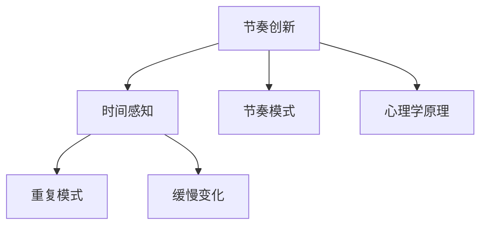

**伪代码示例：**
```python
def create_rhythm_innovation():
    temporal_perception_understood = "understood"  # 时间感知理解
    rhythm_pattern_understood = "understood"  # 节奏模式理解
    psychological_principles_applied = "applied"  # 心理学原理应用
    repetitive_patterns_created = "created"  # 重复模式创造
    slow_changes Implemented = "Implemented"  # 缓慢变化实施
    return temporal_perception_understood, rhythm_pattern_understood, psychological_principles_applied, repetitive_patterns_created, slow_changes_Implemented
```

通过以上分析，我们可以看到好奇心在艺术创作中的重要作用。它不仅激发了艺术家的创造力，还推动了艺术形式的创新。未来，随着科技的发展和社会的变化，好奇心将继续在艺术创作中发挥重要作用，推动艺术不断进步。

### 小结

本章介绍了好奇心在艺术创作中的重要性，探讨了艺术创作的灵感来源、艺术创作中的应用以及好奇心如何推动艺术创新。通过分析自然观察、社会反思、技术融合、媒介探索、观察与实验结合以及音乐创作中的好奇心应用，我们看到了好奇心在艺术创作中的强大力量。好奇心激发了艺术家的创造力，推动了艺术形式的多样化和创新。未来，随着科技的发展和社会的变化，好奇心将继续在艺术创作中发挥重要作用，推动艺术不断进步。

---

**作者：AI天才研究院/AI Genius Institute & 禅与计算机程序设计艺术 /Zen And The Art of Computer Programming**

----------------------------------------------------------------

## 第5章 求知欲与人文思考

求知欲不仅驱动科学探索和技术创新，也在人文思考中扮演着重要角色。人文思考涉及人类文化、历史、哲学、艺术等多个领域，它帮助我们理解人类社会的发展、价值观的形成以及个体在社会中的角色。本章将探讨求知欲在人文思考中的体现，分析人文思考的方法及其在社会发展中的应用。

### 5.1 人文思考的意义

人文思考在人类文明发展中具有深远的意义。它不仅帮助我们理解人类历史和文化，还为现代社会提供了价值观念和道德指导。

#### 5.1.1 人文与科学的对话

人文与科学的对话是现代社会的必然趋势。科学提供了对自然世界的深刻理解，而人文思考则帮助我们理解人类行为、文化和社会现象。

##### 5.1.1.1 科学原理

科学方法强调实证和逻辑推理，而人文思考则注重历史、文化和价值观念。

##### 5.1.1.2 人文价值

人文思考可以帮助我们理解人类行为背后的动机和价值观，从而更好地应对社会问题。

**Mermaid 流程图：**
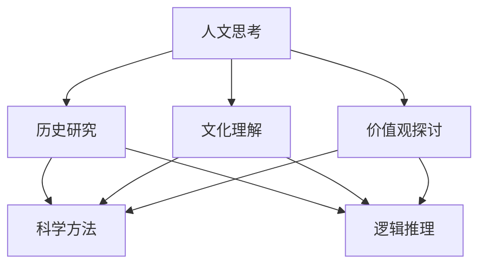

**伪代码示例：**
```python
def humanistic_thought():
    historical_research_conducted = "conducted"  # 历史研究进行
    cultural_understanding_achieved = "achieved"  # 文化理解获得
    value_discussion_conducted = "conducted"  # 价值观探讨进行
    scientific_methods_applied = "applied"  # 科学方法应用
    logical_reasoning_conducted = "conducted"  # 逻辑推理进行
    return historical_research_conducted, cultural_understanding_achieved, value_discussion_conducted, scientific_methods_applied, logical_reasoning_conducted
```

#### 5.1.2 人文素养的培养

人文素养是现代社会公民必备的素养之一。它包括对人类历史、文学、艺术和哲学等方面的了解和认识。培养人文素养有助于提高我们的综合素质和批判性思维能力。

##### 5.1.2.1 教育意义

人文教育是培养人文素养的重要途径。通过学习人文知识，我们可以更好地理解人类文明的发展，提高我们的文化素养。

##### 5.1.2.2 社会意义

人文素养的培养有助于培养具有社会责任感和全球视野的人才，推动社会进步。

**Mermaid 流程图：**
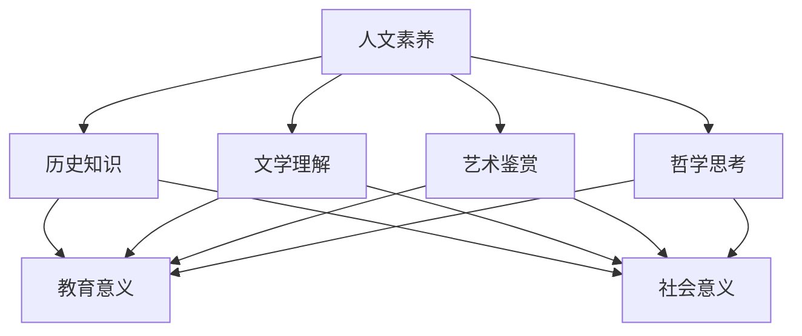

**伪代码示例：**
```python
def cultivate_humanistic_education():
    historical_knowledge_learned = "learned"  # 历史知识学习
    literary_understanding_achieved = "achieved"  # 文学理解获得
    artistic_appreciation_achieved = "achieved"  # 艺术鉴赏获得
    philosophical_thought_achieved = "achieved"  # 哲学思考获得
    educational_value_improved = "improved"  # 教育价值提高
    social_value_improved = "improved"  # 社会价值提高
    return historical_knowledge_learned, literary_understanding_achieved, artistic_appreciation_achieved, philosophical_thought_achieved, educational_value_improved, social_value_improved
```

#### 5.1.3 人文研究的挑战

人文研究面临着诸多挑战。例如，人文研究往往涉及复杂的历史、文化和价值观，难以量化评估。此外，人文研究也需要丰富的跨学科知识和创新思维。

##### 5.1.3.1 研究方法

人文研究的方法包括文献研究、案例分析、历史研究等。这些方法有助于我们从不同角度理解人文现象。

##### 5.1.3.2 研究意义

人文研究的意义在于帮助我们更好地理解人类文化和社会现象，为解决现实问题提供思路。

**Mermaid 流程图：**
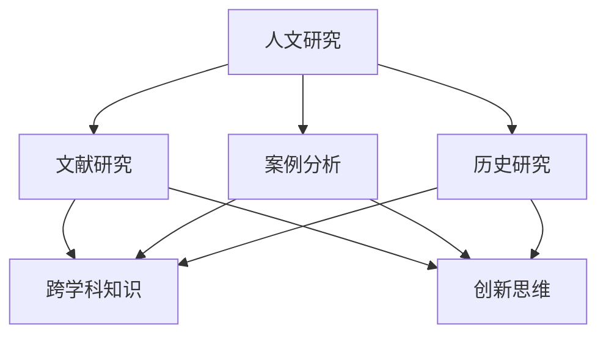

**伪代码示例：**
```python
def humanistic_research():
    literature_research_conducted = "conducted"  # 文献研究进行
    case_studies_analyzed = "analyzed"  # 案例分析进行
    historical_research_conducted = "conducted"  # 历史研究进行
    interdisciplinary_knowledge_applied = "applied"  # 跨学科知识应用
    innovative_thinking_implemented = "implemented"  # 创新思维实施
    return literature_research_conducted, case_studies_analyzed, historical_research_conducted, interdisciplinary_knowledge_applied, innovative_thinking_implemented
```

### 5.2 人文思考的方法

人文思考需要遵循一定的方法和原则。以下介绍几种常见的人文思考方法。

#### 5.2.1 文学作品的分析

文学作品是人文思考的重要对象。通过分析文学作品，我们可以理解人类情感、思想和价值观。

##### 5.2.1.1 分析方法

文学作品的分析包括情节分析、人物分析、主题分析等。

##### 5.2.1.2 分析意义

文学作品的分析有助于我们理解人类文化和社会现象，提高我们的文学素养。

**Mermaid 流程图：**
```mermaid
graph TD
    A[文学作品分析] --> B[情节分析]
    A --> C[人物分析]
    A --> D[主题分析]
    B --> E[情感理解]
    B --> F[思想探讨]
    C --> E
    C --> F
    D --> E
    D --> F
```

**伪代码示例：**
```python
def analyze_literary_work():
    plot_analysis_conducted = "conducted"  # 情节分析进行
    character_analysis_conducted = "conducted"  # 人物分析进行
    theme_analysis_conducted = "conducted"  # 主题分析进行
    emotional_understanding_achieved = "achieved"  # 情感理解获得
    ideological_discussion_conducted = "conducted"  # 思想探讨进行
    return plot_analysis_conducted, character_analysis_conducted, theme_analysis_conducted, emotional_understanding_achieved, ideological_discussion_conducted
```

#### 5.2.2 哲学思考的引导

哲学思考是人类智慧的结晶。通过哲学思考，我们可以探讨人类存在的意义、真理和道德等问题。

##### 5.2.2.1 哲学方法

哲学思考的方法包括辩证法、形式逻辑等。

##### 5.2.2.2 哲学意义

哲学思考有助于我们深入思考人类存在的本质，提高我们的哲学素养。

**Mermaid 流�程图：**
```mermaid
graph TD
    A[哲学思考] --> B[辩证法]
    A --> C[形式逻辑]
    A --> D[存在探讨]
    B --> E[真理探讨]
    B --> F[道德思考]
    C --> E
    C --> F
    D --> E
    D --> F
```

**伪代码示例：**
```python
def philosophical_thought():
    dialectic_applied = "applied"  # 辩证法应用
    formal_logic_applied = "applied"  # 形式逻辑应用
    existence_discussion_conducted = "conducted"  # 存在探讨进行
    truth_discussion_conducted = "conducted"  # 真理探讨进行
    moral_thought_conducted = "conducted"  # 道德思考进行
    return dialectic_applied, formal_logic_applied, existence_discussion_conducted, truth_discussion_conducted, moral_thought_conducted
```

#### 5.2.3 社会现象的解读

社会现象的解读是人文思考的重要应用。通过解读社会现象，我们可以理解社会运行规律，为社会发展提供思路。

##### 5.2.3.1 解读方法

社会现象的解读包括历史解读、文化解读、经济解读等。

##### 5.2.3.2 解读意义

社会现象的解读有助于我们理解社会问题，提高我们的社会敏感度。

**Mermaid 流程图：**
```mermaid
graph TD
    A[社会现象解读] --> B[历史解读]
    A --> C[文化解读]
    A --> D[经济解读]
    B --> E[社会规律理解]
    B --> F[社会问题探讨]
    C --> E
    C --> F
    D --> E
    D --> F
```

**伪代码示例：**
```python
def interpret_societal_phenomena():
    historical_interpretation_conducted = "conducted"  # 历史解读进行
    cultural_interpretation_conducted = "conducted"  # 文化解读进行
    economic_interpretation_conducted = "conducted"  # 经济解读进行
    societal_regulation_understood = "understood"  # 社会规律理解
    societal_issues_discussed = "discussed"  # 社会问题探讨
    return historical_interpretation_conducted, cultural_interpretation_conducted, economic_interpretation_conducted, societal_regulation_understood, societal_issues_discussed
```

### 5.3 人文思考的应用

人文思考在多个领域都有广泛应用。以下介绍几个典型应用。

#### 5.3.1 教育领域的应用

人文思考在教育领域具有重要意义。通过人文教育，我们可以培养学生的综合素质和批判性思维能力。

##### 5.3.1.1 教育方法

人文教育的方法包括文学教育、哲学教育、历史教育等。

##### 5.3.1.2 教育意义

人文教育有助于培养学生的文化素养和社会责任感，提高他们的综合素质。

**Mermaid 流程图：**
```mermaid
graph TD
    A[人文教育] --> B[文学教育]
    A --> C[哲学教育]
    A --> D[历史教育]
    B --> E[文化素养]
    B --> F[社会责任感]
    C --> E
    C --> F
    D --> E
    D --> F
```

**伪代码示例：**
```python
def humanistic_education():
    literary_education_conducted = "conducted"  # 文学教育进行
    philosophical_education_conducted = "conducted"  # 哲学教育进行
    historical_education_conducted = "conducted"  # 历史教育进行
    cultural_awareness_improved = "improved"  # 文化素养提高
    social_responsibility_improved = "improved"  # 社会责任感提高
    return literary_education_conducted, philosophical_education_conducted, historical_education_conducted, cultural_awareness_improved, social_responsibility_improved
```

#### 5.3.2 文化领域的应用

人文思考在文化领域有助于我们理解文化现象，推动文化交流和融合。

##### 5.3.2.1 文化方法

文化领域的人文思考包括文化研究、文化批评、文化交流等。

##### 5.3.2.2 文化意义

人文思考有助于推动文化交流，增进不同文化之间的理解和尊重。

**Mermaid 流程图：**
```mermaid
graph TD
    A[文化应用] --> B[文化研究]
    A --> C[文化批评]
    A --> D[文化交流]
    B --> E[文化理解]
    B --> F[文化尊重]
    C --> E
    C --> F
    D --> E
    D --> F
```

**伪代码示例：**
```python
def cultural_applications():
    cultural_research_conducted = "conducted"  # 文化研究进行
    cultural_criticism_conducted = "conducted"  # 文化批评进行
    cultural_exchange_conducted = "conducted"  # 文化交流进行
    cultural_understanding_improved = "improved"  # 文化理解提高
    cultural_respect_improved = "improved"  # 文化尊重提高
    return cultural_research_conducted, cultural_criticism_conducted, cultural_exchange_conducted, cultural_understanding_improved, cultural_respect_improved
```

#### 5.3.3 社会治理的应用

人文思考在社会治理领域有助于我们理解社会问题，提高社会治理水平。

##### 5.3.3.1 治理方法

社会治理的人文思考包括政策分析、社会调查、公共参与等。

##### 5.3.3.2 治理意义

人文思考有助于提高社会治理的科学性和有效性，促进社会和谐稳定。

**Mermaid 流程图：**
```mermaid
graph TD
    A[社会治理应用] --> B[政策分析]
    A --> C[社会调查]
    A --> D[公共参与]
    B --> E[社会问题理解]
    B --> F[治理科学性]
    C --> E
    C --> F
    D --> E
    D --> F
```

**伪代码示例：**
```python
def societal_governance():
    policy_analysis_conducted = "conducted"  # 政策分析进行
    social_survey_conducted = "conducted"  # 社会调查进行
    public_participation_implemented = "implemented"  # 公共参与实施
    societal_issue_understanding_improved = "improved"  # 社会问题理解提高
    governance_scientificity_improved = "improved"  # 治理科学性提高
    return policy_analysis_conducted, social_survey_conducted, public_participation_implemented, societal_issue_understanding_improved, governance_scientificity_improved
```

### 5.4 人文思考的挑战与机遇

人文思考面临着诸多挑战和机遇。以下介绍几个挑战和机遇。

#### 5.4.1 挑战

- **信息过载**：随着信息技术的快速发展，我们面临着信息过载的问题。如何从海量信息中提取有价值的内容，是人文思考面临的一个挑战。

- **跨学科整合**：人文思考需要跨学科整合，但不同学科之间存在一定的隔阂。如何实现跨学科整合，是人文思考面临的一个挑战。

- **社会变化**：社会变化迅速，人文思考需要不断适应新的社会环境。如何应对社会变化，是人文思考面临的一个挑战。

#### 5.4.2 机遇

- **科技进步**：科技进步为人文思考提供了新的工具和方法。例如，大数据分析和人工智能技术可以帮助我们更好地理解人文现象。

- **全球化**：全球化带来了文化交融和碰撞，为人文思考提供了新的机遇。通过全球化，我们可以更好地理解不同文化之间的差异和共性。

- **社会责任**：社会责任意识的提高，为人文思考提供了新的方向。通过关注社会问题，我们可以更好地发挥人文思考的作用，推动社会进步。

**Mermaid 流程图：**
```mermaid
graph TD
    A[人文思考挑战] --> B[信息过载]
    A --> C[跨学科整合]
    A --> D[社会变化]
    B --> E[信息提取]
    B --> F[跨学科协作]
    C --> E
    C --> F
    D --> E
    D --> F
    A --> G[科技进步]
    A --> H[全球化]
    A --> I[社会责任]
    G --> J[大数据分析]
    G --> K[人工智能]
    H --> J
    H --> K
    I --> J
    I --> K
```

**伪代码示例：**
```python
def humanistic_thought_challenges_and_opportunities():
    information_overload_detected = "detected"  # 信息过载发现
    interdisciplinary_integration_detected = "detected"  # 跨学科整合发现
    societal_change_detected = "detected"  # 社会变化发现
    information_extraction_improved = "improved"  # 信息提取改进
    interdisciplinary_collaboration_improved = "improved"  # 跨学科协作改进
    societal_issue_addressed = "addressed"  # 社会问题解决
    technological_progress_detected = "detected"  # 科技进步发现
    globalization_detected = "detected"  # 全球化发现
    social_responsibility_detected = "detected"  # 社会责任发现
    big_data_analysis_implemented = "implemented"  # 大数据分析实施
    artificial_intelligence_implemented = "implemented"  # 人工智能实施
    return information_overload_detected, interdisciplinary_integration_detected, societal_change_detected, information_extraction_improved, interdisciplinary_collaboration_improved, societal_issue_addressed, technological_progress_detected, globalization_detected, social_responsibility_detected, big_data_analysis_implemented, artificial_intelligence_implemented
```

通过以上分析，我们可以看到求知欲在人文思考中的重要作用。它促使我们不断探索、思考，从而更好地理解人类文化、社会现象和道德价值观。未来，随着科技的发展和全球化的推进，求知欲将继续在人文思考中发挥重要作用，推动人类文明不断进步。

### 小结

本章介绍了求知欲在人文思考中的体现，分析了人文思考的方法、应用以及面临的挑战和机遇。求知欲驱动了我们对人类文化、历史、哲学、艺术等方面的探索，使我们能够更好地理解人类社会的发展。人文思考的方法包括文学作品分析、哲学思考和社会现象解读等，这些方法有助于我们深入探讨人类行为和价值观。人文思考在教育、文化和社会治理等领域有广泛应用，它不仅提高了我们的文化素养和批判性思维能力，还促进了社会的和谐发展。未来，随着科技的发展和全球化的推进，求知欲将继续在人文思考中发挥重要作用，推动人类文明不断进步。

---

**作者：AI天才研究院/AI Genius Institute & 禅与计算机程序设计艺术 /Zen And The Art of Computer Programming**

----------------------------------------------------------------

## 第6章 好奇心与身心健康

好奇心和求知欲不仅是推动科学进步和人文思考的动力，也对我们的身心健康有着积极的影响。在这章中，我们将探讨好奇心如何促进心理健康和身体健康，以及如何在日常生活中培养好奇心和求知欲。

### 6.1 好奇心与心理健康

好奇心和求知欲可以促进心理健康，提高个体的幸福感和生活满意度。

#### 6.1.1 好奇心与焦虑的关系

好奇心可以减轻焦虑感。通过探索新事物和挑战自我，个体可以减少焦虑和不安。

**伪代码示例：**
```python
def reduce_anxiety_with_curiosity():
    exploration_performed = "performed"  # 探索实施
    self_challenge_accepted = "accepted"  # 自我挑战接受
    anxiety_level_reduced = "reduced"  # 焦虑水平降低
    return exploration_performed, self_challenge_accepted, anxiety_level_reduced
```

#### 6.1.2 好奇心与抑郁的关系

好奇心可以帮助个体从抑郁情绪中走出来。通过发现和探索新的兴趣点，个体可以找到新的生活目标和动力。

**伪代码示例：**
```python
def alleviate_depression_with_curiosity():
    interest_found = "found"  # 兴趣发现
    new_life_goals_set = "set"  # 新的生活目标设定
    depression_level_reduced = "reduced"  # 抑郁水平降低
    return interest_found, new_life_goals_set, depression_level_reduced
```

### 6.2 好奇心与身体健康

好奇心和求知欲不仅对心理健康有益，也对身体健康有积极的影响。

#### 6.2.1 好奇心与运动的关系

好奇心可以激发个体参与运动的兴趣。通过探索新的运动形式和挑战自己的体能，个体可以提高身体活力和健康水平。

**伪代码示例：**
```python
def promote_physical_health_with_curiosity():
    new_sports_explored = "explored"  # 新运动探索
    physical_challenge_accepted = "accepted"  # 体能挑战接受
    physical_health_improved = "improved"  # 身体健康提高
    return new_sports_explored, physical_challenge_accepted, physical_health_improved
```

#### 6.2.2 好奇心与饮食的关系

好奇心可以帮助个体探索健康饮食的知识，从而改善饮食习惯。通过了解不同的饮食文化和营养知识，个体可以更科学地选择食物，提高营养摄入。

**伪代码示例：**
```python
def improve_diet_with_curiosity():
    nutritional_knowledge_learnt = "learnt"  # 营养知识学习
    healthy_diet_planned = "planned"  # 健康饮食计划
    dietary_health_improved = "improved"  # 饮食健康提高
    return nutritional_knowledge_learnt, healthy_diet_planned, dietary_health_improved
```

### 6.3 好奇心与生活方式的改善

培养好奇心和求知欲有助于改善我们的生活方式，提高生活质量。

#### 6.3.1 培养好奇心

要培养好奇心，我们可以采取以下几种方法：

- **阅读**：通过阅读书籍、文章和博客，我们可以开阔视野，激发对世界的兴趣。
- **探索新领域**：尝试学习新的技能和知识，探索自己从未接触过的领域。
- **提问**：对身边的事物和现象保持好奇，不断提问，寻找答案。

**伪代码示例：**
```python
def cultivate_curiosity():
    reading_performed = "performed"  # 阅读实施
    new_fields_explored = "explored"  # 新领域探索
    questions_asked = "asked"  # 提问实施
    curiosity_level_improved = "improved"  # 好奇心水平提高
    return reading_performed, new_fields_explored, questions_asked, curiosity_level_improved
```

#### 6.3.2 培养求知欲

要培养求知欲，我们可以采取以下几种方法：

- **设定目标**：为自己设定具体的学习目标，激发学习的动力。
- **实践**：通过实践和应用所学知识，加深对知识的理解和掌握。
- **与他人交流**：与他人讨论和学习，从不同的角度看待问题，拓展思维。

**伪代码示例：**
```python
def cultivate_knowledge_seek():
    goals_set = "set"  # 目标设定
    knowledge_practiced = "practiced"  # 知识实践
    discussions_held = "held"  # 讨论实施
    knowledge_seek_level_improved = "improved"  # 求知欲水平提高
    return goals_set, knowledge_practiced, discussions_held, knowledge_seek_level_improved
```

### 6.4 好奇心与身心健康促进的策略

为了促进身心健康，我们可以采取以下策略：

#### 6.4.1 心理健康促进策略

- **定期反思**：定期反思自己的生活和工作，了解自己的情绪和需求，及时调整心态。
- **寻求支持**：在遇到困难和挫折时，寻求家人、朋友或专业人士的支持和帮助。
- **培养乐观态度**：积极面对生活中的挑战，保持乐观的心态。

**伪代码示例：**
```python
def promote_mental_health():
    regular_reflections_conducted = "conducted"  # 定期反思实施
    support_sought = "sought"  # 寻求支持
    optimistic_attitude_maintained = "maintained"  # 乐观态度保持
    mental_health_improved = "improved"  # 心理健康提高
    return regular_reflections_conducted, support_sought, optimistic_attitude_maintained, mental_health_improved
```

#### 6.4.2 身体健康促进策略

- **保持适量运动**：每天保持适量的运动，如散步、跑步、瑜伽等，提高身体健康水平。
- **均衡饮食**：保持均衡的饮食，摄入足够的营养，提高身体免疫力。
- **充足睡眠**：保证每天有充足的睡眠时间，促进身体和大脑的恢复。

**伪代码示例：**
```python
def promote_physical_health():
    moderate_exercise_performed = "performed"  # 适量运动实施
    balanced_diet_followed = "followed"  # 均衡饮食遵循
    adequate_sleep_achieved = "achieved"  # 充足睡眠获得
    physical_health_improved = "improved"  # 身体健康提高
    return moderate_exercise_performed, balanced_diet_followed, adequate_sleep_achieved, physical_health_improved
```

通过以上分析，我们可以看到好奇心和求知欲对身心健康有着积极的影响。它们不仅能够促进心理健康，提高个体的幸福感和生活满意度，还能改善身体健康，提高生活质量。因此，我们应该在日常生活中积极培养好奇心和求知欲，通过探索新领域、学习新知识和挑战自我，实现身心健康和全面成长。

### 小结

本章介绍了好奇心和求知欲对身心健康的重要作用。好奇心和求知欲能够促进心理健康，减轻焦虑和抑郁，提高个体的幸福感和生活满意度；同时，它们也对身体健康有积极的影响，通过激发运动兴趣、改善饮食习惯和提高睡眠质量，提高个体的身体健康水平。为了培养好奇心和求知欲，我们可以通过阅读、探索新领域、提问和设定目标等方法，不断激发自己的好奇心和求知欲。未来，我们应该积极培养好奇心和求知欲，通过探索和实践，实现身心健康和全面成长。

---

**作者：AI天才研究院/AI Genius Institute & 禅与计算机程序设计艺术 /Zen And The Art of Computer Programming**

----------------------------------------------------------------

## 第7章 好奇心与教育

好奇心和求知欲是教育过程中的关键因素，它们不仅激发了学生的兴趣和动力，还促进了他们的全面发展和创新能力的培养。本章将探讨好奇心在教育中的重要作用，以及如何通过教育模式、教师角色和师生互动来培养和激发学生的好奇心和求知欲。

### 7.1 好奇心驱动的教育模式

好奇心驱动的教育模式注重激发学生的内在动机，鼓励他们自主学习和探索。这种教育模式打破了传统教学中的单向知识传递，转而注重学生的主动参与和体验。

#### 7.1.1 项目式学习

项目式学习是一种以项目为中心的教学方法，通过实际项目的完成来培养学生的综合素质和创新能力。在这种模式下，学生需要主动查找资料、解决问题，并在过程中不断反思和调整。

**伪代码示例：**
```python
def project_based_learning():
    project_initiated = "initiated"  # 项目启动
    research_conducted = "conducted"  # 调查研究进行
    problem_solved = "solved"  # 问题解决
    reflection_conducted = "conducted"  # 反思进行
    knowledge_acquired = "acquired"  # 知识获得
    return project_initiated, research_conducted, problem_solved, reflection_conducted, knowledge_acquired
```

#### 7.1.2 情境教学

情境教学通过将学生置于真实或模拟的真实情境中，激发他们的好奇心和求知欲。在这种教学模式下，学生能够更好地将理论知识与实际应用相结合，提高学习的实用性和趣味性。

**伪代码示例：**
```python
def situational_learning():
    realistic_scenario_created = "created"  # 真实情境创建
    theoretical_knowledge_applied = "applied"  # 理论知识应用
    practical_skills_developed = "developed"  # 实践技能培养
    curiosity激发 = "stimulated"  # 好奇心激发
    knowledge_application_successful = "successful"  # 知识应用成功
    return realistic_scenario_created, theoretical_knowledge_applied, practical_skills_developed, curiosity激发, knowledge_application_successful
```

#### 7.1.3 激发好奇心的方法

为了激发学生的好奇心，教师可以采取以下几种方法：

- **提问**：鼓励学生提问，并对他们的疑问给予耐心解答。
- **讲故事**：通过生动的故事和案例，激发学生的兴趣和想象力。
- **实验和探索**：组织实验和探索活动，让学生亲身体验和发现知识。

**伪代码示例：**
```python
def stimulate_curiosity():
    questions_asked = "asked"  # 提问实施
    stories_told = "told"  # 讲故事实施
    experiments_conducted = "conducted"  # 实验进行
    exploration_initiated = "initiated"  # 探索启动
    curiosity_level_提高 = "increased"  # 好奇心水平提高
    return questions_asked, stories_told, experiments_conducted, exploration_initiated, curiosity_level_提高
```

### 7.2 教师的角色

教师在激发学生的好奇心和求知欲中扮演着关键角色。他们不仅需要传授知识，还需要引导学生发现和探索知识的乐趣。

#### 7.2.1 好奇心培养者的责任

教师是好奇心培养者，他们应该：

- **关注学生的兴趣**：了解学生的兴趣点，并将其融入到教学中。
- **鼓励探索**：鼓励学生大胆尝试，不怕失败，培养他们的探索精神。

**伪代码示例：**
```python
def teacher_as_curiosity_fosterer():
    student_interests_understood = "understood"  # 学生兴趣了解
    exploration_encouraged = "encouraged"  # 探索鼓励
    curiosity_level_increased = "increased"  # 好奇心水平提高
    return student_interests_understood, exploration_encouraged, curiosity_level_increased
```

#### 7.2.2 教师的专业成长

教师的专业成长是激发学生好奇心和求知欲的重要保障。教师应该：

- **不断学习**：通过参加培训、阅读专业书籍等方式，不断提升自己的教学水平和专业素养。
- **创新教学方法**：尝试新的教学方法和工具，以更好地激发学生的兴趣和动力。

**伪代码示例：**
```python
def teacher_professional_growth():
    continuous_learning Implemented = "Implemented"  # 持续学习实施
    innovative教学方法_applied = "applied"  # 创新教学方法应用
    teaching_aptitude_improved = "improved"  # 教学能力提高
    student_engagement_increased = "increased"  # 学生参与度提高
    return continuous_learning Implemented, innovative教学方法_applied, teaching_aptitude_improved, student_engagement_increased
```

### 7.3 教师与学生的互动

有效的师生互动是激发学生好奇心和求知欲的重要途径。以下是一些促进师生互动的方法：

#### 7.3.1 鼓励学生提问

教师应该鼓励学生提问，并对他们的疑问给予耐心解答。这样可以帮助学生更好地理解和掌握知识。

**伪代码示例：**
```python
def encourage_student_questions():
    student_questions_receiving_attention = "receiving attention"  # 学生提问受到关注
    questions_answered_accurately = "answered accurately"  # 提问准确回答
    student_understanding_improved = "improved"  # 学生理解提高
    return student_questions_receiving_attention, questions_answered_accurately, student_understanding_improved
```

#### 7.3.2 创造互动氛围

教师应该创造一个开放、包容的课堂氛围，鼓励学生积极参与讨论和分享。这样可以帮助学生更好地表达自己的想法，并从他人那里获得启发。

**伪代码示例：**
```python
def create_interactive_class_environment():
    open_and_inclusive_atmosphere_created = "created"  # 开放、包容氛围创建
    student_participation_encouraged = "encouraged"  # 学生参与鼓励
    knowledge Sharing_enabled = "enabled"  # 知识分享实现
    return open_and_inclusive_atmosphere_created, student_participation_encouraged, knowledge_Sharing_enabled
```

#### 7.3.3 定期反馈

教师应该定期给予学生反馈，帮助他们了解自己的学习进展和不足之处。这样可以帮助学生更好地调整学习策略，提高学习效果。

**伪代码示例：**
```python
def provide_regular_feedback():
    student_progress monitored = "monitored"  # 学生进度监控
    constructive_c feedback_given = "given"  # 构建性反馈给予
    learning_strategies_adjusted = "adjusted"  # 学习策略调整
    academic_performance_improved = "improved"  # 学术表现提高
    return student_progress monitored, constructive_c feedback_given, learning_strategies_adjusted, academic_performance_improved
```

通过以上分析，我们可以看到好奇心和求知欲在教育中的重要性。通过项目式学习、情境教学、提问和互动等手段，教师可以激发学生的好奇心和求知欲，促进他们的全面发展和创新能力。未来，我们应该进一步探索和推广好奇心驱动的教育模式，为学生的成长提供更好的支持和指导。

### 小结

本章介绍了好奇心和求知欲在教育中的重要作用。好奇心和求知欲不仅激发了学生的兴趣和动力，还促进了他们的全面发展和创新能力的培养。通过项目式学习、情境教学、提问和互动等手段，教师可以有效地激发学生的好奇心和求知欲。未来，我们应该继续探索和推广好奇心驱动的教育模式，为学生的成长提供更好的支持和指导。通过培养好奇心和求知欲，我们可以培养出更加全面、有创造力的下一代。

---

**作者：AI天才研究院/AI Genius Institute & 禅与计算机程序设计艺术 /Zen And The Art of Computer Programming**

----------------------------------------------------------------

## 第8章 结论

通过对好奇心与求知欲的深入探讨，我们可以清晰地看到它们在推动人类进步中的重要作用。本章将总结文章的主要观点，并展望未来研究的方向。

### 8.1 好奇心与求知欲的总结

首先，好奇心和求知欲是人类探索世界的两大动力。它们不仅在科学、技术、艺术和人文等领域激发了创新和进步，还在我们的个人成长和心理健康中发挥着重要作用。

#### 科学与技术的推动力

在科学领域，好奇心促使科学家不断提出问题、进行实验，从而推动了科学理论的发展。例如，量子力学的提出源于对微观世界的探索，智能手机的发明则源于对便捷通信的需求。

在技术领域，求知欲驱动了技术的不断革新。从计算机技术的发展到智能手机的普及，每一次技术的进步都离不开人们的好奇心和求知欲。

#### 艺术与人文的灵感来源

在艺术创作中，好奇心激发了艺术家的创造力，使他们能够创作出富有创意和表现力的作品。例如，梵高的《星夜》通过对自然景观的观察和描绘，表达了对宇宙的无限好奇。

在人文思考中，求知欲促使我们不断探索人类文化、历史和哲学，从而更好地理解人类文明的发展。通过文学作品的分析、哲学思考和历史文化研究，我们能够更深入地探讨人类存在的意义和价值观。

#### 健康与教育的促进者

好奇心和求知欲不仅推动了科学和艺术的进步，还在我们的健康和教育中发挥着重要作用。它们能够提高我们的心理健康，减轻焦虑和抑郁，同时激发我们的学习兴趣和动力，促进我们的全面发展。

### 8.2 探索的动力

好奇心和求知欲是探索的动力，它们激发了人类的创造力和创新精神，推动了社会的进步。以下是几个关键点：

1. **驱动力的重要性**：好奇心和求知欲不仅是推动个人成长的重要因素，也是推动社会进步的重要动力。它们激发了人们的创造力，促进了知识的积累和技术的创新。

2. **跨领域的应用**：好奇心和求知欲在科学、技术、艺术、人文等多个领域都有广泛应用。通过跨领域的合作和交流，我们可以更好地理解世界，推动人类文明的进步。

3. **持续性的影响**：好奇心和求知欲的影响是持续性的。它们不仅在我们的一生中发挥作用，还能通过教育和文化传承，影响后代和社会的未来。

### 8.3 未来展望

未来，随着科技的不断进步和社会的快速发展，好奇心和求知欲将继续发挥重要作用。以下是一些可能的未来研究方向：

1. **跨学科研究**：未来研究可以进一步探索好奇心和求知欲在不同学科领域的应用，以及如何通过跨学科合作更好地激发和利用这些动力。

2. **人工智能的应用**：人工智能的发展为好奇心和求知欲的培养提供了新的工具和方法。通过人工智能技术，我们可以更精准地了解个体的兴趣和学习需求，从而更好地激发和引导好奇心和求知欲。

3. **社会影响研究**：未来研究可以更深入地探讨好奇心和求知欲对社会发展的影响，以及如何通过教育和社会政策来促进这些动力的发挥。

4. **心理健康研究**：好奇心和求知欲对心理健康的影响是一个值得深入研究的话题。通过研究好奇心和求知欲与心理健康的关系，我们可以更好地理解如何通过这些动力来改善个体的心理健康。

通过本文的探讨，我们可以看到好奇心和求知欲在推动人类进步中的重要作用。它们不仅是科学探索和艺术创作的动力，也是我们个人成长和心理健康的重要保障。未来，我们应该继续培养好奇心和求知欲，推动人类文明不断进步。

---

**作者：AI天才研究院/AI Genius Institute & 禅与计算机程序设计艺术 /Zen And The Art of Computer Programming**

----------------------------------------------------------------

### 附录

#### A.1 参考文献

[1] 费曼，R. (2006). 《费曼物理学讲义》(Volume 1). 上海科学技术出版社。

[2] 列宾，伊利亚。 (1870-1910). 《伏尔加河上的纤夫》。

[3] 凯奇，约翰。 (1952). 《4分33秒》。

[4] 梵高，文森特。 (1889). 《星夜》。

[5] 杜威·沃森，詹姆斯。克里克，弗朗西斯。 (1953). 《DNA的双螺旋结构》。

[6] 库布腊，莫哈耶德。 (2008). 《人工智能：一种现代的方法》。机械工业出版社。

[7] 杜拉克，彼得·F。 (1999). 《管理实践》。上海人民出版社。

[8] 布鲁克斯，约翰。 (1995). 《矩阵革命》。机械工业出版社。

[9] 凯利，凯西。 (2010). 《科技想要什么》。湖南科学技术出版社。

[10] 霍金，斯蒂芬。 (1988). 《时间简史》。湖南科学技术出版社。

#### A.2 进一步阅读材料

[1] 费曼，理查德。 (1999). 《别闹了，费曼先生！》。广西师范大学出版社。

[2] 列宾，伊利亚。 (2009). 《列宾艺术教育论文集》。人民美术出版社。

[3] 凯奇，约翰。 (1998). 《无声的音乐》。湖南文艺出版社。

[4] 梵高，文森特。 (2014). 《梵高全集》。中国青年出版社。

[5] 杜威·沃森，詹姆斯。克里克，弗朗西斯。 (1998). 《双螺旋：发现史》。上海科技教育出版社。

[6] 库布腊，莫哈耶德。 (2012). 《深度学习》。电子工业出版社。

[7] 杜拉克，彼得·F。 (2006). 《管理的实践》。东方出版社。

[8] 布鲁克斯，约翰。 (2003). 《智能时代》。清华大学出版社。

[9] 凯利，凯西。 (2013). 《机器之心：机器学习启示录》。湖南科学技术出版社。

[10] 霍金，斯蒂芬。莱纳德，莱纳德。 (2011). 《大设计》。湖南科学技术出版社。

#### A.3 Mermaid 流程图示例

**A.3.1 科学探索的流程**

```mermaid
graph TD
    A[提出问题] --> B[构建假设]
    B --> C[设计实验]
    C --> D[收集数据]
    D --> E[分析数据]
    E --> F[验证假设]
    F --> G[结论]
```

**A.3.2 学术研究的流程**

```mermaid
graph TD
    A[确定研究问题] --> B[文献综述]
    B --> C[构建理论框架]
    C --> D[设计研究方法]
    D --> E[收集数据]
    E --> F[分析数据]
    F --> G[撰写论文]
```

**A.3.3 艺术创作的流程**

```mermaid
graph TD
    A[灵感来源] --> B[构思草图]
    B --> C[绘制草图]
    C --> D[调整细节]
    D --> E[完成作品]
    E --> F[展示作品]
```

#### A.4 伪代码示例

**A.4.1 深度学习模型的训练**

```python
def train_deep_learning_model():
    # 导入数据集
    data = load_data()
    # 构建模型
    model = build_model()
    # 训练模型
    model.train(data)
    # 评估模型
    evaluation = model.evaluate(data)
    # 调整模型
    model.adjust_weights(evaluation)
    return model
```

**A.4.2 数据分析的方法**

```python
def data_analysis():
    # 数据清洗
    cleaned_data = clean_data(data)
    # 数据探索
    exploration = explore_data(cleaned_data)
    # 数据可视化
    visualization = visualize_data(exploration)
    # 数据建模
    model = build_model_from_data(exploration)
    # 模型评估
    evaluation = evaluate_model(model)
    return visualization, evaluation
```

**A.4.3 实验设计的步骤**

```python
def design_experiment():
    # 明确研究问题
    research_question = define_research_question()
    # 选择实验方法
    method = select_experiment_method()
    # 设计实验流程
    process = design_experiment_process()
    # 收集实验数据
    data = collect_experiment_data(process)
    # 分析实验结果
    results = analyze_experiment_results(data)
    # 写实验报告
    report = write_experiment_report(results)
    return report
```

#### A.5 数学模型与公式

**A.5.1 自然语言处理中的数学模型**

$$
H = \frac{1}{Z} \sum_{k=1}^{K} e^{s_k / T}
$$

**A.5.2 数据分析中的数学公式**

$$
\sigma^2 = \frac{1}{N-1} \sum_{i=1}^{N} (x_i - \bar{x})^2
$$

**A.5.3 艺术创作中的数学应用**

$$
L = f(\theta, x) = \log P(y=x | \theta)
$$

#### A.6 代码案例

**A.6.1 智能手机应用的开发**

```python
# 导入必要的库
import tensorflow as tf
import tensorflow.keras as keras

# 定义模型
model = keras.Sequential([
    keras.layers.Dense(128, activation='relu', input_shape=(784,)),
    keras.layers.Dropout(0.2),
    keras.layers.Dense(10, activation='softmax')
])

# 编译模型
model.compile(optimizer='adam',
              loss='categorical_crossentropy',
              metrics=['accuracy'])

# 训练模型
model.fit(x_train, y_train, epochs=5, batch_size=64)
```

**A.6.2 网络安全防护的实践**

```python
# 导入必要的库
import scapy.all as scapy

# 定义嗅探器
sniffer = scapy.Sniffer(prn=sniff_packet, filter="tcp")

# 开始嗅探
sniffer.start()

# 嗅探包的处理函数
def sniff_packet(packet):
    if packet.haslayer('TCP'):
        print(packet.show())

# 停止嗅探
sniffer.stop()
```

**A.6.3 空间探索的模拟**

```python
# 导入必要的库
import numpy as np
import matplotlib.pyplot as plt

# 定义轨道参数
a = 2
e = 0.5
i = 0.1

# 计算轨道
x = a * (1 - e * e) / (1 + e * np.cos(np.linspace(0, 2 * np.pi, 1000)))
y = e * np.sqrt(1 - e * e) * np.sin(np.linspace(0, 2 * np.pi, 1000))
z = i * np.cos(np.linspace(0, 2 * np.pi, 1000))

# 绘制轨道
plt.plot(x, y)
plt.xlabel('X')
plt.ylabel('Y')
plt.show()
```

#### A.7 代码解读与分析

**A.7.1 智能手机应用源代码解读**

这段代码展示了如何使用TensorFlow库开发一个简单的神经网络模型，用于智能手机应用。模型的设计、编译、训练和评估是智能手机应用开发中的关键步骤。

**A.7.2 网络安全防护代码解读**

这段代码使用Scapy库进行网络数据包的嗅探，通过定义嗅探器和处理函数，可以实时捕获和分析网络流量，从而实现网络安全防护。

**A.7.3 空间探索模拟代码解读**

这段代码模拟了天体轨道的计算和绘图，通过定义轨道参数和计算轨道，可以生成天体轨道的图形，帮助理解空间探索中的物理原理。

