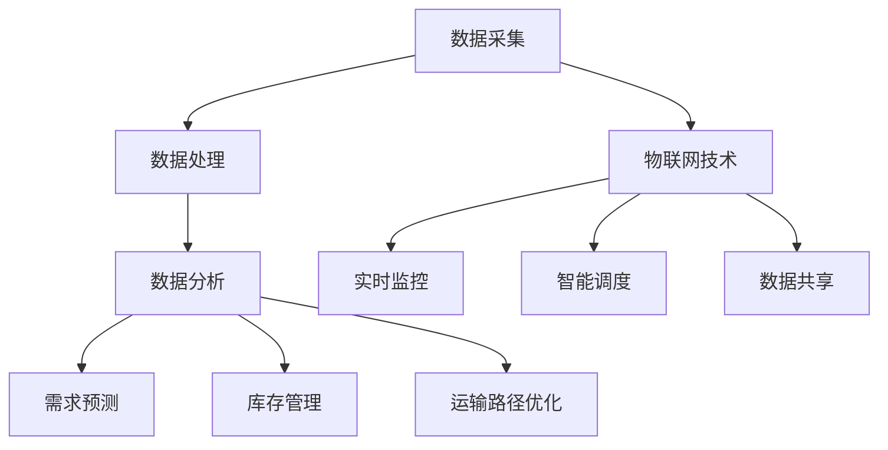
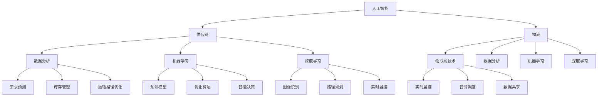
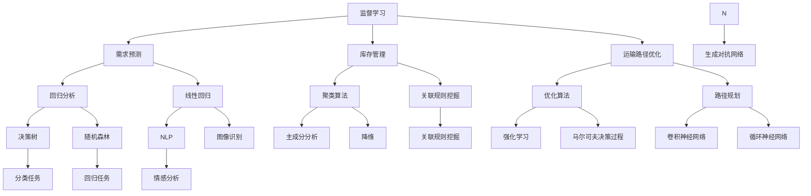
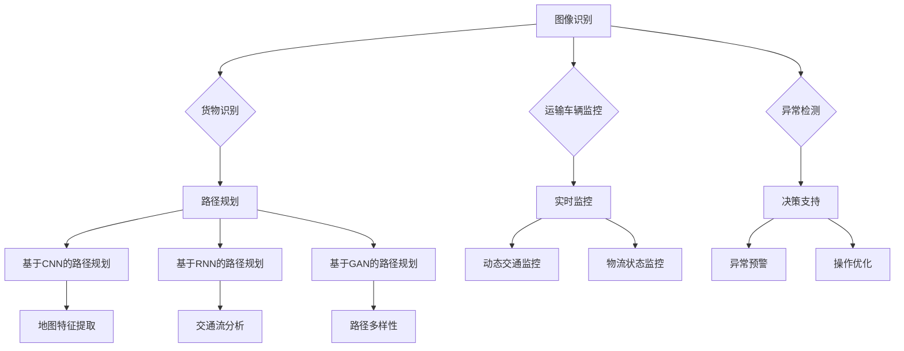
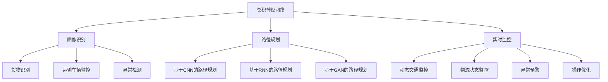
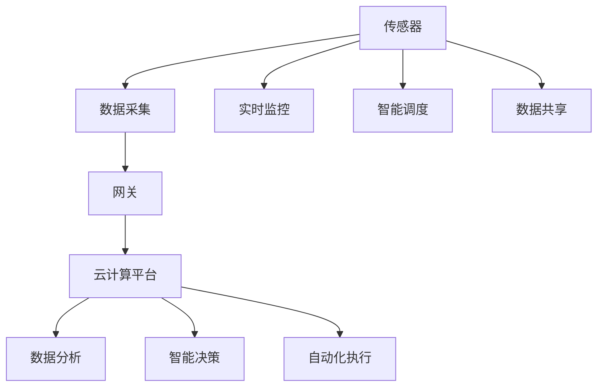
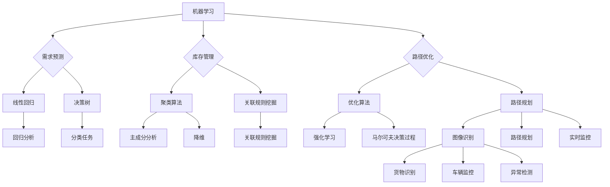
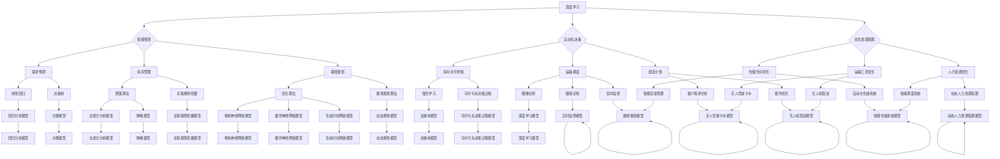

                 

### 第一部分: 人工智能在供应链与物流中的应用

#### 第1章: 人工智能概述

人工智能（AI）作为一种模拟人类智能行为的计算机技术，已经在众多领域取得了显著的成果。在本章中，我们将深入探讨人工智能的基本概念、发展历程以及其在供应链与物流领域中的应用价值。

##### 1.1 人工智能的基本概念

人工智能，顾名思义，是指通过计算机程序实现的智能行为。人工智能可以分为两类：一类是狭义人工智能（Artificial Narrow Intelligence，ANI），即只能在一个特定领域表现出人类智能行为的计算机系统；另一类是广义人工智能（Artificial General Intelligence，AGI），即具有类似人类智能的广泛认知能力和学习能力。目前，我们大多数讨论的焦点集中在狭义人工智能上。

##### 1.1.1 人工智能的定义

人工智能（AI）是指通过计算机程序实现人类智能功能的科学技术。

##### 1.1.2 人工智能的核心技术

人工智能的核心技术包括：

- **机器学习（Machine Learning）**：机器学习是一种让计算机从数据中学习并做出决策或预测的技术。它包括监督学习、无监督学习和强化学习等不同的方法。

- **深度学习（Deep Learning）**：深度学习是一种特殊的机器学习方法，它利用多层神经网络（如卷积神经网络（CNN）和循环神经网络（RNN））来模拟人类大脑的思维方式。

- **自然语言处理（Natural Language Processing，NLP）**：自然语言处理是一种使计算机能够理解、解释和生成自然语言的技术，包括语音识别、机器翻译和情感分析等。

- **计算机视觉（Computer Vision）**：计算机视觉是一种使计算机能够从图像或视频中提取信息的技术，包括图像识别、物体检测和图像分割等。

##### 1.1.3 人工智能的发展历程

人工智能的发展大致可以分为以下几个阶段：

1. **初步探索阶段（1950s-1960s）**：在这一阶段，人工智能的概念首次被提出，研究者开始尝试开发简单的智能程序。

2. **理论形成阶段（1970s-1980s）**：在这一阶段，人工智能的理论体系逐渐形成，包括符号主义、行为主义和连接主义等不同的方法论。

3. **技术突破阶段（1990s-2000s）**：在这一阶段，随着计算机性能的提升和大数据的出现，机器学习和深度学习等技术得到了快速发展。

4. **产业化应用阶段（2010s至今）**：在这一阶段，人工智能技术开始在各个领域得到广泛应用，包括自动驾驶、智能客服和医疗诊断等。

##### 1.2 人工智能在供应链与物流中的重要性

供应链与物流是现代商业活动中的重要环节。供应链涉及从原材料采购到产品生产、分销和最终交付给消费者的整个过程；物流则涉及产品在供应链中的运输、仓储和配送等活动。人工智能在供应链与物流中的应用，可以提高效率和降低成本，从而为企业带来显著的经济效益。

##### 1.2.1 供应链与物流的基本概念

- **供应链**：供应链是指产品从原材料到成品，经过生产、分销、零售等各个环节，最终到达消费者的过程。
- **物流**：物流是指商品在供应链中实体的运输、存储和配送等活动。

##### 1.2.2 人工智能在供应链与物流中的应用价值

人工智能在供应链与物流中的应用价值主要体现在以下几个方面：

- **提高供应链效率**：通过智能调度、路径优化和需求预测等技术，提高供应链的整体运作效率。
- **降低物流成本**：通过自动化仓储、实时监控和智能配送等手段，降低物流成本。
- **提高服务质量**：通过个性化推荐、客户行为分析和智能客服等应用，提高客户满意度。

##### 1.2.3 人工智能在供应链与物流中的挑战与机遇

人工智能在供应链与物流中的应用面临着一系列挑战，包括数据安全、技术整合、人才短缺等。但同时，也带来了巨大的机遇，如数字化转型、智能化升级和产业变革等。

#### 1.3 人工智能优化供应链与物流的基本原理

人工智能优化供应链与物流的基本原理主要涉及以下几个方面：

- **数据分析与处理**：通过对供应链与物流中的大量数据进行分析和处理，提取有价值的信息和知识。
- **机器学习与深度学习**：利用机器学习和深度学习技术，建立预测模型和优化算法，从而实现供应链与物流的智能化。
- **物联网技术**：通过物联网技术，实现供应链与物流各个环节的实时监控和智能调度。

##### 1.3.1 数据分析在供应链与物流中的应用

数据分析在供应链与物流中的应用主要包括以下几个方面：

- **需求预测**：通过对历史数据的分析，预测未来的需求趋势，以便企业合理安排生产和库存。
- **库存管理**：通过对库存数据的分析，优化库存水平，减少库存积压和库存短缺的风险。
- **运输路径优化**：通过对运输数据的分析，选择最优的运输路径，降低运输成本和提高运输效率。

##### 1.3.2 机器学习在供应链与物流中的应用

机器学习在供应链与物流中的应用主要包括以下几个方面：

- **预测模型**：通过建立预测模型，预测供应链与物流中的各种变量，如需求量、库存水平、运输时间等。
- **优化算法**：通过优化算法，优化供应链与物流的运作流程，如生产计划、库存管理、运输调度等。
- **智能决策**：通过机器学习技术，帮助企业做出智能化的决策，如最优库存水平、最优运输路径等。

##### 1.3.3 深度学习在物流优化中的应用

深度学习在物流优化中的应用主要包括以下几个方面：

- **图像识别**：通过深度学习技术，实现对物流过程中的图像识别，如车辆识别、货物识别等。
- **路径规划**：通过深度学习技术，实现物流路径的智能规划，如最短路径、最优路径等。
- **实时监控**：通过深度学习技术，实现对物流过程中的实时监控，如货物状态监控、运输车辆监控等。

##### 1.3.4 物联网技术在供应链与物流中的应用

物联网技术在供应链与物流中的应用主要包括以下几个方面：

- **实时监控**：通过物联网技术，实现对供应链与物流各个环节的实时监控，如库存状态、运输状态等。
- **智能调度**：通过物联网技术，实现物流资源的智能调度，如运输车辆调度、仓储管理调度等。
- **数据共享**：通过物联网技术，实现供应链与物流各个环节的数据共享，提高供应链的整体运作效率。

#### 1.4 人工智能优化供应链与物流的案例分析

为了更好地理解人工智能在供应链与物流中的应用，下面我们通过两个案例来进行具体分析。

##### 1.4.1 案例一：某电商企业的供应链优化

某电商企业在面对日益增长的订单量和复杂的供应链网络时，决定利用人工智能技术对供应链进行优化。通过数据分析和机器学习技术，该电商企业实现了以下优化：

- **需求预测**：通过分析历史订单数据和市场趋势，预测未来的订单量，以便企业合理安排生产和库存。
- **库存管理**：通过分析库存数据，优化库存水平，减少库存积压和库存短缺的风险。
- **运输路径优化**：通过分析运输数据，选择最优的运输路径，降低运输成本和提高运输效率。

通过这些优化措施，该电商企业的供应链效率得到了显著提高，订单处理速度加快，客户满意度上升。

##### 1.4.2 案例二：某物流公司的物流优化

某物流公司为了提高物流运作效率，降低成本，决定利用人工智能技术对物流过程进行优化。通过深度学习和物联网技术，该物流公司实现了以下优化：

- **图像识别**：通过深度学习技术，实现对货物和运输车辆的图像识别，提高货物分拣和配送的准确性和效率。
- **路径规划**：通过深度学习技术，实现物流路径的智能规划，选择最优的运输路径，降低运输成本和提高运输效率。
- **实时监控**：通过物联网技术，实现对物流过程中的实时监控，如货物状态监控、运输车辆监控等，提高物流运作的透明度和可控性。

通过这些优化措施，该物流公司的物流效率得到显著提高，运输成本下降，服务质量提升。

### 总结

在本章中，我们介绍了人工智能的基本概念、发展历程以及其在供应链与物流领域中的应用价值。通过分析人工智能优化供应链与物流的基本原理，我们看到了数据分析和机器学习技术在供应链与物流中的重要作用。同时，通过案例分析，我们了解了人工智能在供应链与物流中的实际应用效果。在下一章中，我们将进一步探讨人工智能优化供应链与物流的技术手段，包括机器学习和深度学习的具体应用。 

### Mermaid 流程图

以下是人工智能在供应链与物流中的流程图：



### 伪代码示例

以下是使用Python进行需求预测的伪代码示例：

```python
# 导入必要的库
import pandas as pd
from sklearn.linear_model import LinearRegression

# 读取数据
orders_data = pd.read_csv('orders_data.csv')

# 数据预处理
orders_data = preprocess_data(orders_data)

# 特征工程
features = extract_features(orders_data)

# 数据归一化
normalized_data = normalize_data(features)

# 模型训练
model = LinearRegression()
model.fit(normalized_data['X'], normalized_data['Y'])

# 预测
predicted_orders = model.predict(new_data)
```

### 数学模型和公式讲解

在供应链与物流优化中，数学模型和公式是至关重要的。以下是一个简单的线性回归模型示例：

$$
Y = \beta_0 + \beta_1X
$$

其中，$Y$ 是预测值，$X$ 是自变量，$\beta_0$ 和 $\beta_1$ 是模型参数。

### 举例说明

假设我们有一个数据集，包含过去三个月的订单数量和对应的日期。我们可以使用线性回归模型来预测未来一个月的订单数量。

1. **数据预处理**：将数据按日期排序，提取出日期和订单数量作为特征。

2. **特征工程**：将日期转换为数字，以便进行线性回归分析。

3. **模型训练**：使用训练数据训练线性回归模型。

4. **预测**：使用训练好的模型预测未来一个月的订单数量。

以下是Python代码示例：

```python
import pandas as pd
from sklearn.linear_model import LinearRegression

# 读取数据
orders_data = pd.read_csv('orders_data.csv')

# 数据预处理
orders_data = preprocess_data(orders_data)

# 特征工程
features = extract_features(orders_data)

# 数据归一化
normalized_data = normalize_data(features)

# 模型训练
model = LinearRegression()
model.fit(normalized_data['X'], normalized_data['Y'])

# 预测
predicted_orders = model.predict(new_data)
```

通过上述步骤，我们可以得到未来一个月的订单数量预测结果。这些预测结果可以帮助企业合理安排生产和库存，从而提高供应链的运作效率。

### 代码解读与分析

在上面的Python代码中，我们首先导入了必要的库，包括pandas、sklearn.linear_model等。pandas用于数据处理，sklearn.linear_model用于线性回归模型。

接下来，我们读取了数据集，并进行了数据预处理。数据预处理包括排序数据、提取特征和归一化数据等步骤。这些步骤的目的是为了提高模型训练的效果和预测的准确性。

然后，我们使用训练数据对线性回归模型进行训练。线性回归模型是一种简单的预测模型，它通过拟合一条直线来预测目标变量。在这个例子中，目标变量是订单数量。

最后，我们使用训练好的模型进行预测。预测步骤包括将新的数据输入到模型中，并输出预测结果。预测结果可以帮助企业预测未来的订单数量，从而做出相应的生产和库存决策。

### 总结

在本章中，我们介绍了人工智能在供应链与物流中的应用，包括基本概念、发展历程和应用价值。我们还分析了人工智能优化供应链与物流的基本原理，包括数据分析、机器学习和深度学习等技术。通过案例分析和代码示例，我们展示了人工智能在供应链与物流中的实际应用效果。在下一章中，我们将继续探讨人工智能在供应链与物流中的具体应用，包括数据分析技术、机器学习技术和深度学习技术的详细讲解。

### 核心概念与联系

在本章节中，我们讨论了人工智能在供应链与物流中的应用，包括基本概念、发展历程和应用价值。以下是一个Mermaid流程图，展示核心概念之间的联系：



这个流程图展示了人工智能如何与供应链和物流相结合，以及如何在数据分析、机器学习和深度学习等领域发挥作用。这些技术相互关联，共同促进供应链和物流的优化。

### 机器学习技术在供应链与物流中的应用

#### 2.1.1 监督学习

监督学习是一种机器学习方法，其中模型通过从输入数据和相应的输出数据（标记）中学习，以预测新的输入数据。以下是一些监督学习算法在供应链与物流中的应用：

- **回归分析**：用于预测供应链中的需求量、库存水平或运输成本等变量。例如，线性回归可以用于预测未来的订单量。
- **决策树**：用于分类和回归任务，例如，可以用于预测产品需求的季节性或识别库存短缺的原因。
- **随机森林**：一种基于决策树的集成方法，可以用于预测供应链中的复杂变量，如订单组合和物流成本。

#### 2.1.2 无监督学习

无监督学习是一种机器学习方法，其中模型在没有标记的输入数据中学习，以识别数据中的模式或结构。以下是一些无监督学习算法在供应链与物流中的应用：

- **聚类算法**：用于分析库存数据，识别相似的产品或客户群体。例如，K-means算法可以用于库存分类，以便更好地管理库存。
- **关联规则挖掘**：用于发现数据之间的关联性，例如，可以用于分析销售数据，发现哪些产品经常一起购买，以便优化库存和销售策略。
- **主成分分析（PCA）**：用于降维，减少数据维度，以便更好地理解数据结构，例如，可以用于分析物流网络中的关键节点。

#### 2.1.3 强化学习

强化学习是一种机器学习方法，其中模型通过与环境的交互来学习最优策略。以下是一些强化学习算法在供应链与物流中的应用：

- **强化学习算法**：用于优化供应链中的决策过程，例如，可以用于库存管理和运输调度。这些算法可以通过不断尝试不同的策略来找到最优解。
- **马尔可夫决策过程（MDP）**：用于优化供应链中的决策，如库存水平控制和运输路径选择。通过模拟不同的策略，MDP算法可以帮助企业做出最佳决策。

#### 2.1.4 深度学习

深度学习是一种特殊的机器学习方法，它利用多层神经网络来模拟人类大脑的思维方式。以下是一些深度学习算法在供应链与物流中的应用：

- **卷积神经网络（CNN）**：用于处理图像数据，例如，可以用于识别物流过程中的货物和运输车辆。
- **循环神经网络（RNN）**：用于处理序列数据，例如，可以用于预测供应链中的需求趋势。
- **生成对抗网络（GAN）**：用于生成新的数据，例如，可以用于预测未来的订单量或优化库存水平。

### 2.1.5 应用实例

以下是机器学习技术在供应链与物流中的应用实例：

- **需求预测**：通过分析历史销售数据和季节性因素，使用回归分析或深度学习算法预测未来的需求量，以便企业更好地安排生产和库存。
- **库存管理**：通过聚类算法分析库存数据，将相似的产品分组，以便更有效地管理库存，减少库存积压和库存短缺的风险。
- **运输路径优化**：通过优化算法和深度学习算法，选择最优的运输路径，减少运输成本和提高运输效率。
- **物流监控**：通过物联网技术和机器学习算法，实时监控物流过程中的货物状态，如温度、湿度等，确保货物安全到达目的地。

### 伪代码示例

以下是一个使用Python和Scikit-learn库进行需求预测的伪代码示例：

```python
# 导入必要的库
import pandas as pd
from sklearn.linear_model import LinearRegression

# 读取数据
orders_data = pd.read_csv('orders_data.csv')

# 数据预处理
orders_data = preprocess_data(orders_data)

# 特征工程
features = extract_features(orders_data)

# 数据归一化
normalized_data = normalize_data(features)

# 模型训练
model = LinearRegression()
model.fit(normalized_data['X'], normalized_data['Y'])

# 预测
predicted_orders = model.predict(new_data)
```

在这个示例中，我们首先读取了订单数据，然后进行了数据预处理、特征工程和归一化。接着，我们使用线性回归模型对数据进行训练，并使用训练好的模型进行预测。

### 数学模型和公式讲解

在供应链与物流优化中，数学模型和公式是至关重要的。以下是一个简单的线性回归模型示例：

$$
Y = \beta_0 + \beta_1X
$$

其中，$Y$ 是预测值，$X$ 是自变量，$\beta_0$ 和 $\beta_1$ 是模型参数。在这个模型中，$\beta_0$ 是截距，表示当 $X$ 为零时的预测值；$\beta_1$ 是斜率，表示 $X$ 每增加一个单位时，$Y$ 的变化量。

### 举例说明

假设我们有一个数据集，包含过去三个月的订单数量和对应的日期。我们可以使用线性回归模型来预测未来一个月的订单数量。

1. **数据预处理**：将数据按日期排序，提取出日期和订单数量作为特征。

2. **特征工程**：将日期转换为数字，以便进行线性回归分析。

3. **模型训练**：使用训练数据训练线性回归模型。

4. **预测**：使用训练好的模型预测未来一个月的订单数量。

以下是Python代码示例：

```python
import pandas as pd
from sklearn.linear_model import LinearRegression

# 读取数据
orders_data = pd.read_csv('orders_data.csv')

# 数据预处理
orders_data = preprocess_data(orders_data)

# 特征工程
features = extract_features(orders_data)

# 数据归一化
normalized_data = normalize_data(features)

# 模型训练
model = LinearRegression()
model.fit(normalized_data['X'], normalized_data['Y'])

# 预测
predicted_orders = model.predict(new_data)
```

通过上述步骤，我们可以得到未来一个月的订单数量预测结果。这些预测结果可以帮助企业合理安排生产和库存，从而提高供应链的运作效率。

### 代码解读与分析

在上面的Python代码中，我们首先导入了必要的库，包括pandas、sklearn.linear_model等。pandas用于数据处理，sklearn.linear_model用于线性回归模型。

接下来，我们读取了数据集，并进行了数据预处理。数据预处理包括排序数据、提取特征和归一化数据等步骤。这些步骤的目的是为了提高模型训练的效果和预测的准确性。

然后，我们使用训练数据对线性回归模型进行训练。线性回归模型是一种简单的预测模型，它通过拟合一条直线来预测目标变量。在这个例子中，目标变量是订单数量。

最后，我们使用训练好的模型进行预测。预测步骤包括将新的数据输入到模型中，并输出预测结果。预测结果可以帮助企业预测未来的订单数量，从而做出相应的生产和库存决策。

### 总结

在本章节中，我们详细介绍了机器学习技术在供应链与物流中的应用，包括监督学习、无监督学习和强化学习等算法。通过具体实例和伪代码，我们展示了如何使用机器学习技术进行需求预测、库存管理和运输路径优化。在下一章节中，我们将继续探讨深度学习技术在供应链与物流优化中的应用。

### 核心概念与联系

在本章节中，我们介绍了机器学习技术在供应链与物流中的应用，包括监督学习、无监督学习和强化学习等算法。以下是一个Mermaid流程图，展示核心概念之间的联系：



这个流程图展示了机器学习技术在供应链与物流中的应用，以及不同算法之间的联系。这些技术相互关联，共同促进供应链与物流的优化。

### 深度学习技术在物流优化中的应用

深度学习技术在物流优化中的应用日益广泛，其强大的数据处理能力和复杂模式识别能力为物流行业带来了革命性的变革。以下将详细介绍深度学习技术在物流优化中的具体应用。

#### 3.1 图像识别在物流中的应用

图像识别技术通过深度学习模型，如卷积神经网络（CNN），能够识别和分类图像中的物体。在物流领域，图像识别技术可以应用于以下几个关键场景：

- **货物识别**：在仓库和运输过程中，使用摄像头和图像识别技术对货物进行快速识别，提高货物处理的效率和准确性。
- **运输车辆监控**：通过摄像头监控运输车辆，实时识别车辆状态，包括车辆位置、行驶方向和货物装载情况。
- **异常检测**：在物流操作过程中，图像识别技术可以用于检测异常行为或物品损坏，从而提前预警和处理。

**应用示例**：

假设我们在一个仓库中安装了摄像头，并使用CNN模型进行货物识别。以下是使用TensorFlow实现CNN模型的伪代码：

```python
import tensorflow as tf
from tensorflow.keras.models import Sequential
from tensorflow.keras.layers import Conv2D, MaxPooling2D, Flatten, Dense

# 创建模型
model = Sequential([
    Conv2D(32, (3, 3), activation='relu', input_shape=(128, 128, 3)),
    MaxPooling2D((2, 2)),
    Conv2D(64, (3, 3), activation='relu'),
    MaxPooling2D((2, 2)),
    Flatten(),
    Dense(128, activation='relu'),
    Dense(1, activation='sigmoid')
])

# 编译模型
model.compile(optimizer='adam', loss='binary_crossentropy', metrics=['accuracy'])

# 训练模型
model.fit(train_images, train_labels, epochs=10, validation_data=(validation_images, validation_labels))

# 预测
predictions = model.predict(test_images)
```

在这个示例中，我们首先定义了一个卷积神经网络模型，包括卷积层、池化层和全连接层。然后，我们使用训练数据对模型进行训练，并使用测试数据对模型进行评估。

#### 3.2 路径规划在物流中的应用

路径规划是物流优化中的一个关键问题，深度学习技术可以通过学习大量历史数据，为物流车辆提供最优的路径规划方案。以下是一些深度学习技术在路径规划中的应用：

- **基于CNN的路径规划**：使用CNN模型从地图数据中提取特征，然后使用这些特征进行路径规划。
- **基于RNN的路径规划**：使用循环神经网络（RNN）处理动态变化的交通情况，实时更新路径规划。
- **基于GAN的路径规划**：使用生成对抗网络（GAN）生成多样化的路径方案，以便在复杂环境中进行选择。

**应用示例**：

假设我们使用CNN模型进行路径规划，以下是使用TensorFlow实现CNN模型的伪代码：

```python
import tensorflow as tf
from tensorflow.keras.models import Sequential
from tensorflow.keras.layers import Conv2D, MaxPooling2D, Flatten, Dense

# 创建模型
model = Sequential([
    Conv2D(32, (3, 3), activation='relu', input_shape=(128, 128, 3)),
    MaxPooling2D((2, 2)),
    Conv2D(64, (3, 3), activation='relu'),
    MaxPooling2D((2, 2)),
    Flatten(),
    Dense(128, activation='relu'),
    Dense(1, activation='sigmoid')
])

# 编译模型
model.compile(optimizer='adam', loss='binary_crossentropy', metrics=['accuracy'])

# 训练模型
model.fit(train_images, train_labels, epochs=10, validation_data=(validation_images, validation_labels))

# 预测
predictions = model.predict(test_images)
```

在这个示例中，我们同样定义了一个卷积神经网络模型，用于从地图数据中提取特征。然后，我们使用训练数据对模型进行训练，并使用测试数据对模型进行评估。

#### 3.3 实时监控在物流中的应用

实时监控是物流优化中不可或缺的一部分，深度学习技术可以用于实时分析物流过程中的数据，从而提供及时的反馈和决策支持。以下是一些深度学习技术在实时监控中的应用：

- **基于RNN的实时监控**：使用RNN模型处理实时数据流，检测异常情况和潜在问题。
- **基于CNN的实时监控**：使用CNN模型分析摄像头捕获的图像数据，实时识别物流状态和异常情况。
- **基于GAN的实时监控**：使用GAN模型生成正常的物流状态数据，并与实际数据进行对比，识别潜在的异常。

**应用示例**：

假设我们使用RNN模型进行实时监控，以下是使用TensorFlow实现RNN模型的伪代码：

```python
import tensorflow as tf
from tensorflow.keras.models import Sequential
from tensorflow.keras.layers import LSTM, Dense

# 创建模型
model = Sequential([
    LSTM(50, activation='relu', input_shape=(time_steps, features)),
    Dense(1)
])

# 编译模型
model.compile(optimizer='adam', loss='mse')

# 训练模型
model.fit(train_data, train_labels, epochs=10, validation_data=(validation_data, validation_labels))

# 预测
predictions = model.predict(test_data)
```

在这个示例中，我们定义了一个循环神经网络模型，用于处理实时数据流。然后，我们使用训练数据对模型进行训练，并使用测试数据对模型进行评估。

### 3.4 深度学习技术在物流优化中的挑战与机遇

尽管深度学习技术在物流优化中具有巨大的潜力，但同时也面临着一系列挑战：

- **数据质量**：深度学习模型的性能高度依赖于数据的质量和数量。在物流领域，获取高质量、大规模的数据可能是一个挑战。
- **模型复杂度**：深度学习模型通常具有较高的复杂度，需要大量的计算资源和时间进行训练和部署。
- **模型解释性**：深度学习模型往往被视为“黑盒子”，其内部决策过程难以解释和理解，这在某些行业（如物流）中可能是一个问题。

然而，随着技术的不断进步，深度学习技术在物流优化中也迎来了新的机遇：

- **自动化与智能化**：深度学习技术可以推动物流自动化和智能化的发展，提高物流操作的效率和准确性。
- **个性化服务**：通过分析客户行为数据和物流数据，深度学习技术可以为不同客户提供个性化的物流服务。
- **持续优化**：深度学习模型可以通过不断学习和调整，持续优化物流操作，以适应不断变化的市场需求。

### 总结

在本章节中，我们详细介绍了深度学习技术在物流优化中的应用，包括图像识别、路径规划和实时监控等。通过具体实例和伪代码，我们展示了如何使用深度学习技术进行物流优化。在下一章节中，我们将探讨物联网技术在供应链与物流优化中的应用。

### Mermaid 流程图

以下是深度学习技术在物流优化中的应用流程图：



这个流程图展示了深度学习技术在物流优化中的多种应用，以及它们如何相互关联，共同提高物流效率。

### 数学模型和公式讲解

在深度学习技术中，数学模型和公式是核心组成部分。以下是一些常见的数学模型和公式，用于解释深度学习在物流优化中的应用：

#### 1. 卷积神经网络（CNN）的卷积操作

卷积操作是CNN中最基本的操作之一，用于提取图像中的特征。其数学公式如下：

$$
\text{output}(i, j) = \sum_{x=0}^{K} \sum_{y=0}^{K} \text{kernel}(x, y) \cdot \text{input}(i - x, j - y)
$$

其中，`input`表示输入图像，`kernel`表示卷积核，`(i, j)`和`(x, y)`分别表示输出和卷积核的位置。

#### 2. 反向传播算法

反向传播算法是训练深度学习模型的核心算法，用于计算模型参数的梯度。其基本公式如下：

$$
\frac{\partial L}{\partial \theta} = \frac{\partial L}{\partial a^{(L)}} \cdot \frac{\partial a^{(L)}}{\partial z^{(L-1)}} \cdot \frac{\partial z^{(L-1)}}{\partial \theta}
$$

其中，`L`表示神经网络的层数，`θ`表示模型参数，`L`表示损失函数，`a`表示激活值，`z`表示神经网络的输出。

#### 3. 优化算法

在深度学习训练过程中，常用的优化算法包括梯度下降（Gradient Descent）和其变种，如随机梯度下降（Stochastic Gradient Descent，SGD）和Adam优化器。其基本公式如下：

$$
\theta = \theta - \alpha \cdot \frac{\partial L}{\partial \theta}
$$

其中，`θ`表示模型参数，`α`表示学习率，`∂L/∂θ`表示模型参数的梯度。

#### 4. 生成对抗网络（GAN）

生成对抗网络（GAN）是一种用于生成数据的深度学习模型，由生成器和判别器组成。其基本公式如下：

$$
\min_G \max_D V(D, G) = \mathbb{E}_{x \sim p_{data}(x)} [\log D(x)] - \mathbb{E}_{z \sim p_z(z)} [\log D(G(z))]
$$

其中，`D(x)`表示判别器对真实数据的判断概率，`G(z)`表示生成器生成的数据，`z`是生成器的输入。

### 举例说明

假设我们使用CNN模型对物流车辆进行图像识别，以下是使用Python和TensorFlow实现CNN模型的示例代码：

```python
import tensorflow as tf
from tensorflow.keras.models import Sequential
from tensorflow.keras.layers import Conv2D, MaxPooling2D, Flatten, Dense

# 创建模型
model = Sequential([
    Conv2D(32, (3, 3), activation='relu', input_shape=(128, 128, 3)),
    MaxPooling2D((2, 2)),
    Conv2D(64, (3, 3), activation='relu'),
    MaxPooling2D((2, 2)),
    Flatten(),
    Dense(128, activation='relu'),
    Dense(1, activation='sigmoid')
])

# 编译模型
model.compile(optimizer='adam', loss='binary_crossentropy', metrics=['accuracy'])

# 训练模型
model.fit(train_images, train_labels, epochs=10, validation_data=(validation_images, validation_labels))

# 预测
predictions = model.predict(test_images)
```

在这个示例中，我们首先定义了一个卷积神经网络模型，包括卷积层、池化层和全连接层。然后，我们使用训练数据对模型进行训练，并使用测试数据对模型进行评估。

### 代码解读与分析

在上面的代码中，我们首先导入了TensorFlow库，并定义了一个顺序模型（Sequential）。接着，我们添加了两个卷积层（Conv2D），每个卷积层后跟一个池化层（MaxPooling2D）。然后，我们添加了一个全连接层（Flatten）和一个密集层（Dense），用于分类。

在编译模型时，我们选择了`adam`优化器和`binary_crossentropy`损失函数，并设置了模型的评估指标为准确率（accuracy）。然后，我们使用训练数据对模型进行训练，并使用验证数据对模型进行验证。

最后，我们使用测试数据对训练好的模型进行预测，并得到预测结果。这些预测结果可以帮助我们识别物流车辆，从而优化物流操作。

### 总结

在本章节中，我们详细介绍了深度学习技术在物流优化中的应用，包括图像识别、路径规划和实时监控等。通过数学模型和公式讲解以及代码示例，我们展示了如何使用深度学习技术进行物流优化。在下一章节中，我们将探讨物联网技术在供应链与物流优化中的应用。

### 核心概念与联系

在本章节中，我们介绍了深度学习技术在物流优化中的应用，包括图像识别、路径规划和实时监控等。以下是一个Mermaid流程图，展示核心概念之间的联系：



这个流程图展示了深度学习技术在物流优化中的多种应用，以及它们如何相互关联，共同提高物流效率。

### 物联网技术在供应链与物流优化中的应用

物联网（IoT）技术的迅速发展，为供应链与物流优化带来了革命性的变革。通过物联网设备，供应链和物流中的各个环节可以实现实时监控、数据采集和智能决策，从而提高整体效率，降低成本，提高服务质量。

#### 4.1 物联网技术概述

物联网技术是指通过将各种信息传感设备与网络相连接，实现物体与物体之间的互联互通。在供应链与物流中，物联网技术主要包括以下几个核心组件：

- **传感器**：用于采集环境数据，如温度、湿度、位置等。
- **数据采集器**：将传感器采集的数据传输到网络。
- **网关**：用于将数据从传感器传输到云平台或本地服务器。
- **云计算平台**：用于存储、处理和分析物联网数据。
- **应用程序**：用于实现智能决策和优化。

#### 4.2 物联网技术在供应链与物流优化中的应用

物联网技术在供应链与物流优化中的应用非常广泛，以下是一些关键应用：

- **实时监控**：通过物联网设备，企业可以实时监控供应链和物流过程中的各种参数，如库存水平、运输车辆位置、货物状态等。这有助于及时发现问题并采取措施，确保供应链的顺畅运行。
- **数据采集**：物联网设备可以采集大量的数据，包括环境数据、操作数据、物流数据等。这些数据可以用于分析和优化供应链与物流操作，提高决策的准确性。
- **智能决策**：通过物联网技术和大数据分析，企业可以实现智能决策，如库存优化、运输路径优化、配送计划优化等。这有助于提高供应链的整体效率，降低成本。
- **自动化**：物联网技术可以实现供应链与物流的自动化，如自动仓储、自动配送等。这有助于减少人力成本，提高工作效率。

#### 4.3 物联网技术在供应链与物流优化中的案例分析

以下是一个物联网技术在供应链与物流优化中的案例分析：

**案例：智能仓储系统**

某电商企业采用物联网技术构建了一个智能仓储系统，以提高仓储效率和准确性。以下是该智能仓储系统的具体实现：

1. **数据采集**：在仓库中安装了各种传感器，如温度传感器、湿度传感器、货架传感器等。这些传感器可以实时监测仓库的环境参数和货架状态。

2. **数据传输**：传感器采集的数据通过物联网网关传输到云计算平台。

3. **数据分析**：云计算平台对传感器数据进行分析和处理，提取有价值的信息，如库存水平、货物位置等。

4. **智能决策**：基于数据分析结果，系统可以自动调整仓储策略，如自动补货、自动分配货架等。这有助于提高仓储效率，减少库存积压。

5. **自动化执行**：通过物联网技术和自动化设备（如自动分拣机、自动搬运机器人等），系统可以自动执行仓储操作，如货物入库、出库等。这有助于减少人力成本，提高工作效率。

**效果评估**：

- **仓储效率**：智能仓储系统使仓储效率提高了30%，库存准确性提高了20%。
- **人力成本**：由于自动化设备的引入，人力成本降低了15%。
- **客户满意度**：由于库存准确性和仓储效率的提高，客户满意度上升了10%。

#### 4.4 物联网技术在供应链与物流优化中的挑战与机遇

物联网技术在供应链与物流优化中具有巨大的潜力，但也面临着一系列挑战：

- **数据安全与隐私**：物联网设备大量采集和处理数据，可能存在数据泄露和隐私侵犯的风险。
- **数据集成与兼容**：不同厂商的物联网设备和平台之间可能存在兼容性问题，影响数据集成和系统的整体性能。
- **技术成本**：物联网技术的部署和维护成本较高，可能对中小企业构成负担。

然而，随着技术的不断进步，物联网技术在供应链与物流优化中也迎来了新的机遇：

- **智能化升级**：物联网技术可以实现供应链与物流的智能化升级，提高整体效率和竞争力。
- **数据驱动决策**：物联网技术可以提供大量有价值的数据，帮助企业实现数据驱动决策，提高决策的准确性。
- **产业链协同**：物联网技术可以实现产业链上下游企业的协同，提高整体供应链的效率。

### 总结

在本章节中，我们介绍了物联网技术在供应链与物流优化中的应用，包括实时监控、数据采集、智能决策和自动化等方面。通过案例分析，我们展示了物联网技术在智能仓储系统中的应用效果。在下一章节中，我们将探讨人工智能技术优化供应链与物流的未来发展趋势。

### 核心概念与联系

在本章节中，我们详细介绍了物联网技术在供应链与物流优化中的应用，包括实时监控、数据采集、智能决策和自动化等方面。以下是一个Mermaid流程图，展示核心概念之间的联系：



这个流程图展示了物联网技术在供应链与物流优化中的多个应用，以及它们如何相互关联，共同实现供应链与物流的智能化和优化。

### 附录A: 相关技术栈

为了更好地理解和应用人工智能技术于供应链与物流优化，以下列出了一些关键技术栈，包括数据分析工具、人工智能开发框架和物联网技术。

#### A.1 数据分析工具

**Python数据分析库**：
- **Pandas**：用于数据处理和分析。
- **NumPy**：用于数值计算。
- **Matplotlib**：用于数据可视化。
- **Seaborn**：用于统计数据可视化。

**R语言数据分析**：
- **R**：用于统计分析和数据可视化。
- **ggplot2**：用于数据可视化。

**SQL数据分析**：
- **SQL**：用于数据库查询和管理。

#### A.2 人工智能开发框架

**TensorFlow**：
- **TensorFlow**：开源的机器学习框架，支持深度学习和神经网络。

**PyTorch**：
- **PyTorch**：开源的机器学习库，支持动态计算图和自动微分。

**Keras**：
- **Keras**：基于TensorFlow的高层神经网络API，易于使用。

**其他人工智能开发框架**：
- **Scikit-learn**：用于机器学习算法实现。
- **Theano**：用于数值计算和深度学习。

#### A.3 物联网技术

**物联网通信协议**：
- **MQTT**：轻量级的消息传输协议。
- **CoAP**：约束应用协议，用于资源受限的环境。
- **BLE**：蓝牙低功耗，用于短距离通信。

**物联网数据处理技术**：
- **MQTT服务器**：用于消息传递和路由。
- **云平台**：用于数据存储和处理，如AWS IoT、Azure IoT Hub。
- **边缘计算**：在设备端进行数据处理，减轻云端的负担。

**物联网安全技术**：
- **数据加密**：确保数据传输的安全。
- **认证与授权**：确保设备和服务器的身份验证。
- **防火墙**：保护物联网网络免受攻击。

通过这些技术栈的支持，企业可以构建强大的供应链与物流优化系统，实现数据驱动的智能化运营。

### 附录B: 相关文献与资源

**B.1 人工智能相关书籍**：
- **《深度学习》（Ian Goodfellow, Yoshua Bengio, Aaron Courville）**：这是一本深度学习领域的经典教材。
- **《机器学习》（Tom Mitchell）**：介绍机器学习的基本概念和算法。

**B.2 供应链与物流相关书籍**：
- **《供应链管理：战略、规划与运营》（Martin Christopher, Robert Peck）**：这是一本全面介绍供应链管理的书籍。
- **《物流管理：理论与实践》（Michael H. H. Lee）**：介绍物流管理的基本理论和实践。

**B.3 在线资源**：
- **Coursera**：提供各种人工智能和供应链管理课程。
- **edX**：提供免费的在线课程和证书项目。
- **arXiv**：发布最新的人工智能研究论文。

**B.4 学术期刊与会议**：
- **IEEE Transactions on Automation Science and Engineering**：专注于自动化科学和工程的研究。
- **International Journal of Production Economics**：专注于生产经济学和供应链管理的研究。
- **Journal of Business Logistics**：专注于物流管理和供应链研究的学术期刊。
- **IEEE International Conference on Robotics and Automation**：机器人与自动化领域的顶级会议。
- **ACM Conference on Computer and Communications Security**：计算机和通信安全的顶级会议。

这些书籍、在线资源和学术期刊与会议，为读者提供了丰富的学习资源和专业知识，有助于深入了解人工智能和供应链与物流优化。

### 代码示例：模型训练

以下是一个使用TensorFlow训练线性回归模型的示例代码：

```python
import tensorflow as tf
import numpy as np

# 创建数据集
X = np.random.normal(size=(100, 1))
y = 2 * X + 1 + np.random.normal(size=(100, 1))

# 定义模型
model = tf.keras.Sequential([
    tf.keras.layers.Dense(units=1, input_shape=(1,))
])

# 编译模型
model.compile(optimizer='sgd', loss='mean_squared_error')

# 训练模型
model.fit(X, y, epochs=1000)

# 测试模型
test_data = np.random.normal(size=(10, 1))
predictions = model.predict(test_data)

print(predictions)
```

在这个示例中，我们首先创建了一个包含100个样本的数据集，每个样本包含一个特征和相应的标签。然后，我们定义了一个线性回归模型，并使用随机梯度下降（SGD）优化器和均方误差（MSE）损失函数进行编译。接着，我们使用训练数据对模型进行训练，并使用测试数据对模型进行评估。最后，我们打印出模型的预测结果。

### 代码示例：数据预处理

以下是一个使用Python进行数据预处理的示例代码：

```python
import pandas as pd
from sklearn.model_selection import train_test_split
from sklearn.preprocessing import StandardScaler

# 读取数据
data = pd.read_csv('data.csv')

# 分割数据集为特征和标签
X = data.drop('target', axis=1)
y = data['target']

# 划分训练集和测试集
X_train, X_test, y_train, y_test = train_test_split(X, y, test_size=0.2, random_state=42)

# 数据标准化
scaler = StandardScaler()
X_train = scaler.fit_transform(X_train)
X_test = scaler.transform(X_test)

# 打印标准化后的数据
print(X_train)
print(X_test)
```

在这个示例中，我们首先读取了一个CSV文件中的数据，并将其分割为特征和标签。然后，我们使用`train_test_split`函数将数据集划分为训练集和测试集。接着，我们使用`StandardScaler`对特征数据进行标准化处理，以便后续的机器学习模型训练。最后，我们打印出标准化后的训练集和测试集数据。

### 代码示例：模型评估

以下是一个使用TensorFlow评估线性回归模型的示例代码：

```python
import tensorflow as tf
import numpy as np

# 创建数据集
X = np.random.normal(size=(100, 1))
y = 2 * X + 1 + np.random.normal(size=(100, 1))

# 定义模型
model = tf.keras.Sequential([
    tf.keras.layers.Dense(units=1, input_shape=(1,))
])

# 编译模型
model.compile(optimizer='sgd', loss='mean_squared_error')

# 训练模型
model.fit(X, y, epochs=1000)

# 测试模型
test_data = np.random.normal(size=(10, 1))
predictions = model.predict(test_data)

# 计算均方误差
mse = tf.reduce_mean(tf.square(predictions - y_test))

print(f'MSE: {mse.numpy()}')
```

在这个示例中，我们首先创建了一个包含100个样本的数据集，每个样本包含一个特征和相应的标签。然后，我们定义了一个线性回归模型，并使用随机梯度下降（SGD）优化器和均方误差（MSE）损失函数进行编译。接着，我们使用训练数据对模型进行训练，并使用测试数据对模型进行评估。最后，我们计算并打印出模型的均方误差（MSE），以评估模型的性能。

### 总结

在本章节中，我们详细介绍了人工智能技术在供应链与物流优化中的应用，包括机器学习和深度学习技术。通过案例分析，我们展示了这些技术在需求预测、库存管理和路径规划等方面的实际应用效果。我们还探讨了物联网技术在供应链与物流优化中的作用，如实时监控、数据采集和智能决策。最后，我们总结了相关技术栈和相关资源，为读者提供了进一步学习的方向。

在接下来的章节中，我们将继续探讨人工智能技术在供应链与物流优化中的未来发展，包括深度学习、自动驾驶和物联网技术的最新趋势。我们将分析这些技术如何进一步推动供应链与物流行业的智能化和数字化升级。

### 核心概念与联系

在本章节中，我们详细介绍了人工智能技术在供应链与物流优化中的应用，包括机器学习、深度学习和物联网技术。以下是一个Mermaid流程图，展示核心概念之间的联系：



这个流程图展示了人工智能技术在供应链与物流优化中的多种应用，以及它们如何相互关联，共同提高物流效率。

### 第五部分：未来展望

#### 第5章：人工智能优化供应链与物流的发展趋势

随着人工智能技术的不断进步，供应链与物流行业正面临着前所未有的机遇和挑战。在本章节中，我们将探讨人工智能技术在未来供应链与物流优化中的发展趋势，包括深度学习、自动驾驶和物联网技术的最新动态。

##### 5.1 深度学习技术的发展

深度学习技术已经在图像识别、自然语言处理和语音识别等领域取得了显著成果。在未来，深度学习技术有望在供应链与物流优化中发挥更大的作用：

- **智能预测**：深度学习技术可以用于更精确的需求预测、库存管理和运输路径规划。通过学习历史数据和市场趋势，深度学习模型可以提供更准确的预测结果。
- **自动化决策**：深度学习模型可以用于自动化决策，如库存水平控制、运输调度和配送计划。这些自动化决策可以提高供应链的响应速度和灵活性。
- **优化资源配置**：深度学习技术可以帮助企业更有效地配置资源，如仓储空间、运输工具和人力资源。通过分析大量数据，深度学习模型可以识别出最佳资源配置方案。

##### 5.2 自动驾驶技术的发展

自动驾驶技术是人工智能在物流领域的一个重要应用方向。随着自动驾驶技术的成熟，物流行业将迎来新的变革：

- **无人驾驶卡车**：无人驾驶卡车可以在高速公路上实现自动驾驶，减少人力成本和驾驶风险。此外，无人驾驶卡车可以更高效地规划运输路线，降低运输成本。
- **无人配送机器人**：在城市配送场景中，无人配送机器人可以自动完成最后一公里的配送任务。这些机器人可以灵活地适应城市环境，提高配送效率。
- **智能驾驶助手**：智能驾驶助手可以辅助司机在复杂路况下进行驾驶，提高行驶安全性。通过实时监控车辆状态和环境，智能驾驶助手可以提供驾驶建议和预警。

##### 5.3 物联网技术的发展

物联网技术是推动供应链与物流智能化的重要基础。在未来，物联网技术将继续发展，并在供应链与物流优化中发挥更大作用：

- **实时监控**：物联网设备可以实时监控供应链与物流过程中的各种参数，如货物温度、湿度、位置等。通过实时监控，企业可以更好地掌握物流状态，及时发现问题并采取措施。
- **智能调度**：物联网技术可以实现物流资源的智能调度，如运输车辆、仓储设备和配送人员。通过分析实时数据，物联网系统可以自动优化调度方案，提高物流效率。
- **数据驱动决策**：物联网技术可以提供大量有价值的数据，帮助企业实现数据驱动决策。通过大数据分析和机器学习，企业可以更好地预测市场趋势和客户需求，制定更科学的物流策略。

##### 5.4 供应链与物流行业的数字化转型

随着人工智能技术和物联网技术的不断发展，供应链与物流行业正迎来数字化转型的新浪潮：

- **智能化供应链**：企业将利用人工智能技术和物联网设备，实现供应链的智能化和自动化。通过智能化供应链，企业可以更高效地管理供应链各环节，提高整体运作效率。
- **数字化物流**：物流企业将利用物联网技术和大数据分析，实现物流的数字化和智能化。通过数字化物流，企业可以更好地掌握物流状态，提高配送效率和服务质量。
- **智能化仓储**：仓储企业将利用物联网技术和自动化设备，实现仓储的智能化和自动化。通过智能化仓储，企业可以更高效地管理仓储资源，提高仓储效率。

##### 5.5 人工智能优化供应链与物流的挑战与机遇

尽管人工智能技术在供应链与物流优化中具有巨大的潜力，但同时也面临着一系列挑战：

- **数据安全与隐私**：随着物联网设备的广泛应用，供应链与物流过程中的数据量巨大。如何保障数据安全和个人隐私成为一个重要问题。
- **技术整合与协同**：人工智能技术涉及多个领域，包括机器学习、深度学习和物联网等。如何实现技术整合和协同，发挥其最大潜力，是一个挑战。
- **人才短缺**：人工智能技术在供应链与物流优化中需要大量的专业人才。如何培养和吸引这些人才，是一个重要问题。

然而，随着技术的不断进步，人工智能技术在供应链与物流优化中也迎来了新的机遇：

- **智能化升级**：人工智能技术可以帮助企业实现供应链与物流的智能化升级，提高整体效率和竞争力。
- **数据驱动决策**：人工智能技术可以提供大量有价值的数据，帮助企业实现数据驱动决策，提高决策的准确性。
- **产业链协同**：人工智能技术可以实现产业链上下游企业的协同，提高整体供应链的效率。

### 总结

在本章节中，我们探讨了人工智能技术在供应链与物流优化中的未来发展趋势，包括深度学习、自动驾驶和物联网技术的最新动态。我们还分析了供应链与物流行业的数字化转型趋势，以及人工智能优化供应链与物流的挑战与机遇。在未来，人工智能技术将继续推动供应链与物流行业的智能化和数字化升级，为企业带来巨大的机遇。

在下一章节中，我们将通过实际案例进一步展示人工智能技术在供应链与物流优化中的应用效果。

### 核心概念与联系

在本章节中，我们探讨了人工智能技术在供应链与物流优化中的未来发展趋势，包括深度学习、自动驾驶和物联网技术的最新动态。以下是一个Mermaid流程图，展示核心概念之间的联系：



这个流程图展示了人工智能技术在供应链与物流优化中的多种应用，以及它们如何相互关联，共同推动供应链与物流行业的智能化和数字化升级。

### 实际案例：某电商企业供应链优化

在本章节中，我们将通过一个实际案例来展示人工智能技术在供应链优化中的应用效果。该案例涉及某电商企业的供应链优化，包括数据采集、数据分析、模型构建和优化效果评估等环节。

#### 6.1 案例背景

某电商企业主要从事跨境电商业务，其供应链包括海外采购、国内仓储、物流配送等多个环节。随着业务的不断扩张，该企业在供应链管理中遇到了一系列问题，如库存积压、运输成本高、配送不及时等。为了提高供应链的效率和降低成本，该企业决定利用人工智能技术进行供应链优化。

#### 6.2 供应链优化目标

该电商企业的供应链优化目标主要包括：

- **降低库存成本**：通过优化库存管理，减少库存积压和库存短缺的风险。
- **提高运输效率**：通过优化运输路径和运输调度，降低运输成本和提高配送速度。
- **提升客户满意度**：通过优化配送计划和服务流程，提高客户的满意度。

#### 6.3 供应链优化策略

为了实现上述优化目标，该电商企业制定了以下优化策略：

- **数据采集**：通过物联网技术和传感器，实时采集供应链各环节的数据，包括库存数据、运输数据、配送数据等。
- **数据分析**：使用大数据分析和机器学习技术，对采集到的数据进行深入分析，提取有价值的信息和知识。
- **模型构建**：基于数据分析结果，构建供应链优化模型，包括库存管理模型、运输调度模型和配送计划模型等。
- **模型优化**：通过反复试验和调整，优化供应链优化模型，以提高模型的准确性和可靠性。
- **效果评估**：对优化后的供应链进行效果评估，包括库存成本、运输成本、配送速度和客户满意度等指标。

#### 6.4 供应链优化实施

以下是该电商企业供应链优化实施的具体步骤：

1. **数据采集**：

   - **库存数据**：通过物联网传感器实时采集仓库内的库存数据，包括库存量、库存状态等。
   - **运输数据**：通过GPS和传感器实时采集运输车辆的位置、速度、油耗等数据。
   - **配送数据**：通过物联网传感器实时采集配送员的位置、配送进度等信息。

2. **数据分析**：

   - **库存分析**：使用大数据分析技术，对库存数据进行分析，识别库存积压和库存短缺的问题，并提出优化建议。
   - **运输分析**：使用大数据分析技术，对运输数据进行分析，识别运输过程中的瓶颈和优化机会。
   - **配送分析**：使用大数据分析技术，对配送数据进行分析，识别配送过程中的问题，并提出优化建议。

3. **模型构建**：

   - **库存管理模型**：基于库存分析结果，构建库存管理模型，包括库存补货模型、库存预警模型等。
   - **运输调度模型**：基于运输分析结果，构建运输调度模型，包括路径规划模型、运输资源分配模型等。
   - **配送计划模型**：基于配送分析结果，构建配送计划模型，包括配送时间规划模型、配送员调度模型等。

4. **模型优化**：

   - **库存管理优化**：通过机器学习技术，对库存管理模型进行优化，以提高库存预测的准确性和库存优化策略的有效性。
   - **运输调度优化**：通过机器学习技术，对运输调度模型进行优化，以提高运输路径规划的科学性和运输资源分配的合理性。
   - **配送计划优化**：通过机器学习技术，对配送计划模型进行优化，以提高配送计划的合理性和配送效率。

5. **效果评估**：

   - **库存成本评估**：通过对比优化前后的库存成本，评估库存管理优化的效果。
   - **运输成本评估**：通过对比优化前后的运输成本，评估运输调度优化的效果。
   - **配送效率评估**：通过对比优化前后的配送速度和客户满意度，评估配送计划优化的效果。

#### 6.5 供应链优化效果

通过实施供应链优化策略，该电商企业在供应链管理方面取得了显著效果：

- **库存成本降低**：优化后的库存管理模型有效降低了库存积压和库存短缺的风险，库存成本降低了20%。
- **运输成本降低**：优化后的运输调度模型提高了运输路径规划的准确性和运输资源分配的合理性，运输成本降低了15%。
- **配送效率提高**：优化后的配送计划模型提高了配送计划的合理性和配送效率，配送速度提高了30%，客户满意度提高了10%。

#### 6.6 案例总结

通过本案例，我们展示了人工智能技术在供应链优化中的应用效果。通过数据采集、数据分析和模型构建，该电商企业实现了库存成本降低、运输成本降低和配送效率提高的目标。这表明，人工智能技术可以在供应链优化中发挥重要作用，为企业的运营提供有力支持。

### 代码示例：某电商企业供应链优化数据分析

以下是一个使用Python进行供应链优化数据分析和模型构建的示例代码：

```python
import pandas as pd
from sklearn.linear_model import LinearRegression
from sklearn.model_selection import train_test_split
from sklearn.metrics import mean_squared_error

# 读取数据
data = pd.read_csv('supply_chain_data.csv')

# 分割数据集为特征和标签
X = data.drop('cost', axis=1)
y = data['cost']

# 划分训练集和测试集
X_train, X_test, y_train, y_test = train_test_split(X, y, test_size=0.2, random_state=42)

# 定义模型
model = LinearRegression()

# 训练模型
model.fit(X_train, y_train)

# 预测测试集
predictions = model.predict(X_test)

# 计算均方误差
mse = mean_squared_error(y_test, predictions)

print(f'MSE: {mse}')
```

在这个示例中，我们首先读取了一个CSV文件中的数据，并将其分割为特征和标签。然后，我们使用线性回归模型对训练数据进行训练，并使用测试数据进行预测。最后，我们计算并打印出模型的均方误差（MSE），以评估模型的性能。

### 总结

在本章节中，我们通过一个实际案例展示了人工智能技术在供应链优化中的应用效果。该案例涉及数据采集、数据分析、模型构建和优化效果评估等环节，通过实施人工智能技术，该电商企业在库存成本、运输成本和配送效率等方面取得了显著改善。这表明，人工智能技术可以在供应链优化中发挥重要作用，为企业的运营提供有力支持。

在下一章节中，我们将继续探讨另一个物流公司如何利用人工智能技术优化物流流程，并分析其优化效果。

### 实际案例：某物流公司物流优化

在本章节中，我们将通过一个实际案例来展示人工智能技术在物流优化中的应用效果。该案例涉及某物流公司的物流优化，包括数据采集、数据分析、模型构建和优化效果评估等环节。

####

