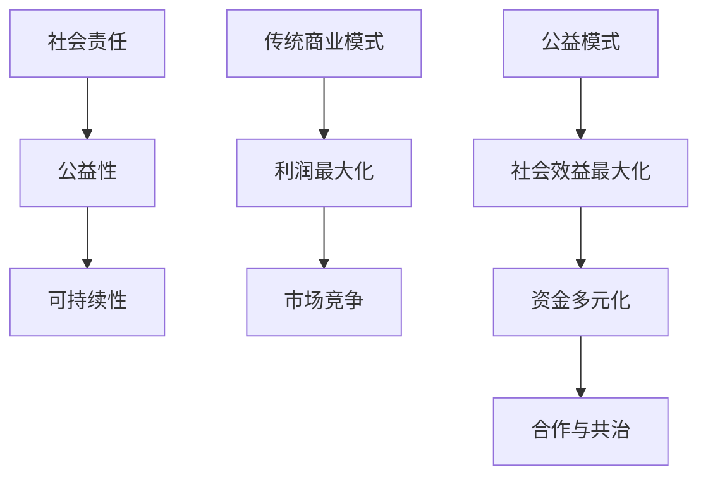

                 

## 第1章：公益模式基础概念

### 1.1 公益模式简介

公益模式是指一种以社会责任、公益性和可持续性为核心，旨在通过非营利手段解决社会问题的经济模式。它与传统商业模式有着显著的不同，主要体现在目标、资金来源和经营方式上。

- **目标**：传统商业模式以利润最大化为目标，而公益模式则以社会效益最大化为目标。它关注的是如何通过资源的最优配置，最大化地满足社会需求和解决社会问题。

- **资金来源**：传统商业模式的资金来源主要是通过市场获取的利润，而公益模式则依赖于捐款、资助和社会支持。这种资金来源的多样性使得公益模式在运作过程中更具灵活性和可持续性。

- **经营方式**：传统商业模式通常以竞争为导向，追求市场占有率和利润最大化，而公益模式则更注重合作和共治，强调多方参与和资源共享。

**核心概念与联系**：

我们可以使用Mermaid流程图来展示公益模式的核心概念及其联系：

在这个流程图中，我们可以清晰地看到，公益模式的核心是社会责任、公益性和可持续性，它们共同构成了公益模式的基础。同时，与传统的商业模式相比，公益模式在目标、资金来源和经营方式上有着明显的区别。

### 1.2 公益模式的核心要素

公益模式的核心要素包括社会责任、公益性和可持续性，它们是公益模式能够持续运作和取得成功的关键。

**社会责任**

社会责任是指企业或组织承担的对社会和环境的责任。在公益模式中，社会责任被视为一种道德义务，是企业或组织在社会运作过程中的必然选择。

**重要性**：

1. **提升企业形象**：承担社会责任能够提升企业的社会形象和品牌价值，增强公众对企业的认可和信任。
2. **塑造企业文化**：社会责任是企业文化的重要组成部分，有助于塑造企业的价值观和经营理念。
3. **推动社会进步**：社会责任能够推动社会问题的解决，促进社会的和谐与进步。

**公益性**

公益性是指以公众利益为导向，致力于解决社会问题的特点。在公益模式中，公益性是其核心，体现了企业或组织的使命和价值观。

**重要性**：

1. **吸引公众支持**：公益性能够吸引公众的关注和支持，增强企业的社会影响力。
2. **提升企业声誉**：公益性有助于提升企业的社会声誉，增加企业的社会责任感。
3. **实现社会效益**：公益性能够实现企业或组织的社会效益，为社会带来积极的影响。

**可持续性**

可持续性是指在满足当前需求的同时，不损害后代满足其需求的能力。在公益模式中，可持续性是确保项目长期运作和持续发展的关键。

**重要性**：

1. **保障项目持续运作**：可持续性能够保障公益项目的长期运作，避免因资金不足或资源匮乏而中途夭折。
2. **实现长期社会效益**：可持续性能够确保公益项目能够持续地带来社会效益，为社会的长期发展做出贡献。
3. **推动环境保护**：可持续性强调在满足当前需求的同时，保护环境和资源，实现经济、社会和环境的协调发展。

**核心概念与联系**：

社会责任、公益性和可持续性是公益模式的核心要素，它们相互关联，共同构成了公益模式的基础。

社会责任是公益模式的起点，它为公益模式提供了道德和价值观的指导。公益性是公益模式的核心理念，它体现了企业或组织的使命和价值观。可持续性是公益模式的发展方向，它确保了公益模式的长期运作和持续发展。

### 1.3 公益模式的国际发展与趋势

公益模式的发展具有显著的全球性和多样性，不同国家和地区在公益模式的发展过程中形成了各自的特点和趋势。

**全球公益模式发展历程**

1. **慈善捐赠阶段**：公益模式最早起源于慈善捐赠，个人和家族的慈善行为是最初的公益形式。这一阶段，公益行为主要依靠个人的善举和慈善基金会的资助。

2. **基金会阶段**：随着社会经济的发展和慈善意识的提高，公益模式逐渐演变成为以基金会为主体的公益形式。基金会通过接受捐款、资助和投资等方式，开展各种公益项目。

3. **公益商业模式阶段**：近年来，公益模式逐渐与商业模式相结合，形成了公益商业模式。这种模式通过将商业运营机制引入公益事业，实现了社会效益和经济效益的双赢。

**公益模式在各国的发展现状**

1. **发达国家**：在发达国家，公益模式已经相对成熟。这些国家拥有完善的公益体系和丰富的公益资源，公益项目专业化、多样化，资金来源多元化。

   - **美国**：美国是全球公益模式发展最成熟的国家之一，拥有众多的慈善基金会和非营利组织。公益项目涵盖了教育、医疗、环保、扶贫等多个领域。

   - **英国**：英国公益模式的发展注重社会参与和合作。公益项目通过政府、企业和社会组织的多方合作，实现了公益效益的最大化。

   - **德国**：德国公益模式强调社会责任和可持续发展。许多企业将社会责任纳入其经营战略，通过公益项目实现了社会效益和经济效益的双赢。

2. **发展中国家**：在发展中国家，公益模式起步较晚，但发展迅速。政府和社会组织积极参与公益事业，推动了公益模式的快速发展。

   - **中国**：中国公益模式的发展注重政府主导和社会参与。政府通过政策引导和社会组织推动，积极发展公益事业，取得了显著成效。

   - **印度**：印度公益模式的发展面临诸多挑战，但也在逐步成熟。政府和社会组织通过合作，推动了公益项目的实施，提高了公众对公益事业的认知和支持。

**未来公益模式趋势分析**

1. **技术驱动**：随着大数据、人工智能等技术的发展，公益模式将更加智能化和高效化。技术将帮助公益组织更好地理解社会需求，优化资源分配，提高公益项目的效果。

2. **跨界合作**：公益模式将更加注重跨界合作，通过政府、企业、社会组织和公众的多方参与，实现资源整合和优势互补。跨界合作将推动公益事业的全面发展。

3. **国际化**：随着全球化的加深，公益模式将更加国际化。国际间的公益合作将增多，跨国公益项目将成为常态，全球公益事业将更加紧密地联动。

通过以上分析，我们可以看到，公益模式在不同国家和地区的发展具有各自的特点和趋势。未来，公益模式将在技术驱动、跨界合作和国际化等方面不断创新发展，为社会带来更多的福祉。

### 第2章：公益模式的种类与实施方法

#### 2.1 公益模式的种类

公益模式可以分为传统公益模式、商业化公益模式和公益金融模式三大类，每种模式都有其独特的特点和适用场景。

**传统公益模式**

传统公益模式主要依靠个人捐赠、基金会资助和社会捐助等资金来源，以捐款、捐物、志愿服务等形式进行的公益行为。

**特点**：

1. **资金来源主要依赖外部**：传统公益模式的资金主要来源于社会各界的捐赠和资助。
2. **注重社会效益**：传统公益模式的主要目标是解决社会问题，提升社会福利。
3. **运作方式简单**：传统公益模式的运作方式较为简单，主要依赖于志愿者的参与和社会捐助。

**适用场景**：

传统公益模式适用于社会救助、灾难救援、教育支持等社会问题较为突出的领域。例如，在自然灾害发生时，通过传统公益模式可以迅速筹集到社会各界的捐赠和援助，帮助灾区群众渡过难关。

**商业化公益模式**

商业化公益模式将商业模式与公益事业相结合，通过商业模式实现公益目标，实现社会效益和经济效益的双赢。

**特点**：

1. **资金来源多元化**：商业化公益模式的资金来源不仅包括外部捐赠，还包括商业模式带来的收益。
2. **注重经济效益**：商业化公益模式不仅追求社会效益，也追求经济效益，实现公益目标的同时，为企业带来经济回报。
3. **运作方式灵活**：商业化公益模式的运作方式更加灵活，可以通过市场运作、投资等方式实现公益目标。

**适用场景**：

商业化公益模式适用于教育、医疗、环保等需要长期投入和持续运营的领域。例如，通过商业化公益模式，可以开发出一系列教育产品，通过销售产品的方式筹集资金，用于支持教育项目。

**公益金融模式**

公益金融模式通过金融手段支持公益事业，实现资金的有效配置和公益项目的可持续发展。

**特点**：

1. **资金来源包括政府、企业和金融机构**：公益金融模式的资金来源更加多元化，包括政府资助、企业赞助和金融机构贷款等。
2. **注重投资回报**：公益金融模式不仅关注公益目标，也关注投资回报，确保资金使用的效率。
3. **运作方式专业化**：公益金融模式的运作方式更加专业化，需要具备金融知识和项目管理能力。

**适用场景**：

公益金融模式适用于需要大规模资金投入和社会资源整合的领域，如大型公益项目、基础设施建设和可持续发展项目等。例如，通过公益金融模式，可以为农村地区建设基础设施，提供教育和卫生服务，同时通过贷款和投资的方式，实现资金回笼和可持续发展。

**核心概念与联系**：

传统公益模式、商业化公益模式和公益金融模式是公益模式的三大种类，它们各有特点，适用于不同的公益领域。

传统公益模式主要依赖外部捐赠和社会捐助，注重社会效益，适用于社会救助和灾难救援等紧急情况。

商业化公益模式将商业模式与公益事业相结合，实现社会效益和经济效益的双赢，适用于需要长期投入和持续运营的领域。

公益金融模式通过金融手段支持公益事业，实现资金的有效配置和公益项目的可持续发展，适用于需要大规模资金投入和社会资源整合的领域。

这些模式相互补充，共同推动了公益事业的发展，为社会带来了更多的福祉。

#### 2.2 公益模式实施方法

公益模式的实施方法包括项目设计、项目实施和项目评估三个关键环节，每个环节都有其独特的步骤和注意事项。

**公益项目设计**

公益项目设计是公益模式实施的第一步，也是最为关键的一步。一个成功的公益项目设计需要明确项目目标、确定项目范围、制定项目计划等。

**步骤**：

1. **明确项目目标**：确定项目的具体目标，如解决特定社会问题、提高特定群体的生活质量等。
2. **确定项目范围**：明确项目的实施区域、服务对象和具体内容。
3. **制定项目计划**：制定详细的项目计划，包括项目的实施步骤、时间表、预算和资源需求等。

**注意事项**：

1. **目标明确**：项目目标需要具体、可衡量，以确保项目的实施效果可以评估。
2. **范围合理**：项目范围需要根据实际情况合理设定，避免过于宽泛或过于狭窄。
3. **计划详细**：项目计划需要详细、周密，以确保项目实施过程中有据可依，减少不确定性。

**项目实施**

公益项目实施是项目设计后的关键环节，是项目目标实现的重要步骤。项目实施需要严格按照项目计划进行，确保项目按期、按质、按量完成。

**步骤**：

1. **筹备阶段**：筹集项目所需资金、物资和人力资源，确保项目实施具备必要的条件。
2. **执行阶段**：按照项目计划，具体实施项目活动，如开展公益活动、培训、救助等。
3. **监督阶段**：对项目实施过程进行监督，确保项目按照计划进行，及时发现和解决问题。

**注意事项**：

1. **筹备充分**：项目筹备阶段需要充分准备，确保项目实施过程中不会出现资源不足或准备不足的问题。
2. **执行严格**：项目实施阶段需要严格按照项目计划执行，确保项目活动的顺利进行。
3. **监督到位**：项目监督阶段需要确保项目实施过程中没有偏离计划，及时发现和解决问题。

**项目评估**

公益项目评估是对项目实施效果进行评估和总结的过程，是公益模式实施的重要环节。项目评估可以帮助公益组织了解项目实施的成果，为未来的项目设计和实施提供参考。

**步骤**：

1. **制定评估计划**：明确评估的目的、指标和方法，制定详细的评估计划。
2. **数据收集**：收集项目实施过程中的相关数据，如项目活动的参与人数、资金使用情况、项目效果等。
3. **分析评估结果**：对收集到的数据进行分析，评估项目实施的效果和问题，撰写评估报告。

**注意事项**：

1. **评估计划合理**：评估计划需要根据项目目标和特点，制定合理的评估指标和方法。
2. **数据收集全面**：评估数据需要全面、准确，确保评估结果的可靠性。
3. **评估结果客观**：评估结果需要客观、公正，避免主观因素影响评估结果。

**核心概念与联系**：

公益项目设计、项目实施和项目评估是公益模式实施方法的三个关键环节，它们相互关联，共同构成了公益模式实施的全过程。

公益项目设计是项目实施的基础，它决定了项目的目标和范围，为项目实施提供了明确的指导和方向。

项目实施是项目设计的具体执行，是项目目标实现的关键步骤。

项目评估是对项目实施效果进行评估和总结，为未来的项目设计和实施提供参考。

通过这三个环节的紧密配合，公益模式可以更好地实现其目标，为社会带来更多的福祉。

#### 2.3 公益模式的成功案例分析

**国内成功案例**

**案例1：腾讯公益**

腾讯公益是中国领先的互联网公益平台，通过互联网技术推动公益事业的发展。腾讯公益平台不仅为公益组织提供在线筹款渠道，还通过公益项目策划、实施和评估等环节，为公益组织提供全方位的支持。

**项目特点**：

- **互联网技术驱动**：利用互联网技术，实现公益项目的线上筹集资金、推广和管理。
- **公益项目多样化**：涵盖教育、环保、医疗、扶贫等多个领域，满足不同群体的公益需求。
- **公众参与度高**：通过社交媒体和互联网平台的广泛宣传，吸引了大量公众参与，提高了公众的公益意识。

**成果**：

- **筹集大量善款**：自成立以来，腾讯公益平台累计筹集善款数十亿元，支持了数千个公益项目。
- **提高了公众的公益意识**：通过公益项目的推广和宣传，提高了公众对公益事业的关注和支持。
- **推动了公益事业的发展**：腾讯公益平台为公益组织提供了有效的支持和资源，推动了公益事业的发展。

**案例2：中国扶贫基金会**

中国扶贫基金会是中国最大的非营利性扶贫基金会之一，致力于解决中国贫困问题。基金会通过多种公益项目，为贫困地区提供教育、医疗、扶贫等方面的支持。

**项目特点**：

- **多元化公益项目**：涵盖教育、医疗、扶贫、环保等多个领域，满足不同地区的需求。
- **注重可持续发展**：通过项目实施，帮助贫困地区实现可持续发展，提高贫困人口的生活质量。
- **公众参与度高**：通过线上和线下活动，吸引了大量公众参与，提高了公众的公益意识。

**成果**：

- **帮助了大量贫困人口**：通过公益项目的实施，帮助了数百万人脱离贫困，提高了他们的生活质量。
- **推动了公益事业的发展**：中国扶贫基金会的成功案例，为其他公益组织提供了借鉴和启示，推动了公益事业的发展。

**国际成功案例**

**案例1：比尔及梅琳达·盖茨基金会**

比尔及梅琳达·盖茨基金会是全球最大的私人慈善基金会之一，致力于解决全球卫生和发展问题。基金会通过多种公益项目，为全球的卫生和发展事业做出了重要贡献。

**项目特点**：

- **全球性公益项目**：覆盖全球多个国家和地区，解决全球性卫生和发展问题。
- **多元化资金来源**：通过政府、企业、基金会等多渠道筹集资金，确保项目资金充足。
- **注重科学研究**：通过科学研究，提高公益项目的效果和可持续性。

**成果**：

- **改善了全球卫生状况**：基金会支持了多项全球性卫生项目，如疫苗研发、传染病防控等，显著改善了全球的卫生状况。
- **推动了全球发展**：基金会支持了多项发展项目，如教育、扶贫、可持续发展等，为全球的发展做出了贡献。

**案例2：联合国儿童基金会**

联合国儿童基金会（UNICEF）是全球领先的儿童权利促进组织，致力于保护儿童权益和促进儿童发展。基金会通过多种公益项目，为全球儿童提供教育、卫生、营养等方面的支持。

**项目特点**：

- **全球性公益项目**：覆盖全球多个国家和地区，为儿童提供全方位的支持。
- **注重儿童权利**：通过倡导儿童权利，推动全球儿童福利的提升。
- **公众参与度高**：通过宣传和倡导，提高了公众对儿童权益的关注和支持。

**成果**：

- **提高了全球儿童福利**：基金会支持了多项儿童福利项目，如教育、卫生、营养等，显著提高了全球儿童的福利水平。
- **推动了全球儿童发展**：基金会通过全球性公益项目，推动了全球儿童的发展，为全球的儿童权利保护做出了贡献。

通过以上国内外成功案例的介绍，我们可以看到，公益模式在不同的领域和地区都有着广泛的应用和成功经验。这些案例不仅为公益事业的发展提供了有力支持，也为其他公益组织提供了宝贵的借鉴和启示。

### 第3章：公益模式的优势与挑战

#### 3.1 公益模式的竞争优势

公益模式在现代社会中具有独特的竞争优势，主要体现在社会影响力、品牌价值和长期可持续发展三个方面。

**社会影响力**

公益模式通过解决社会问题、提高社会福利，对社会产生深远影响。其社会影响力体现在以下几个方面：

1. **提升社会公正**：公益模式致力于解决社会不公问题，通过资源分配、教育支持、扶贫等手段，提升社会公正。
2. **推动社会进步**：公益模式关注社会问题，通过创新项目和服务，推动社会进步和发展。
3. **增强公众参与**：公益模式鼓励公众参与，提高公众对社会责任的认识和承担，促进社会和谐。

**品牌价值**

公益模式对企业或组织具有显著的增值效应，提升其品牌价值。其品牌价值体现在以下几个方面：

1. **增强公众信任**：通过积极参与公益事业，企业或组织赢得公众的信任和认可，提高品牌美誉度。
2. **塑造企业形象**：公益模式有助于企业塑造积极的社会形象，增强企业的社会责任感，提升品牌形象。
3. **提升品牌忠诚度**：企业通过公益模式，与公众建立紧密的联系，提高品牌的忠诚度和用户黏性。

**长期可持续发展**

公益模式注重长远规划和可持续发展，为企业的长期发展提供有力支持。其长期可持续发展体现在以下几个方面：

1. **资源优化配置**：公益模式通过资源整合和优化，提高资源利用效率，实现长期效益。
2. **创新能力**：公益模式鼓励创新，通过科技创新和模式创新，提高项目的可持续性和效果。
3. **社会责任**：公益模式将社会责任融入企业战略，实现经济、社会和环境的协调发展，促进企业的长期可持续发展。

**核心概念与联系**

社会影响力、品牌价值和长期可持续发展是公益模式的竞争优势，它们相互关联，共同构成了公益模式的核心竞争力。

社会影响力是公益模式的基础，通过解决社会问题、提高社会福利，实现社会效益。

品牌价值是公益模式的重要体现，通过提升企业或组织的公众信任和品牌形象，实现经济利益。

长期可持续发展是公益模式的战略目标，通过资源优化配置和创新能力，确保公益模式的持续运作和长期效益。

这些竞争优势相互促进，共同推动公益模式的发展，为社会带来更多福祉。

#### 3.2 公益模式的挑战

尽管公益模式具有显著的优势，但在实际运作过程中也面临着一系列挑战。这些挑战主要集中在资金来源、项目可持续性和社会认知度三个方面。

**资金来源**

资金来源是公益模式实施的重要保障，但同时也是其面临的主要挑战之一。具体问题包括：

1. **资金不足**：公益项目通常需要大量的资金投入，而资金来源渠道相对有限，导致资金不足。
2. **资金不稳定**：依赖外部捐赠和资助的公益模式，资金来源往往不稳定，可能导致项目中途夭折。
3. **资金分配不均**：在资金有限的情况下，如何合理分配资源，确保每个项目都能得到足够的支持，也是一大挑战。

**解决方案**：

1. **多元化资金来源**：通过政府资助、企业赞助、社会捐助、国际援助等多渠道筹集资金，降低单一资金来源的风险。
2. **项目自筹资金**：鼓励公益组织通过项目运营、产品销售等方式自筹资金，提高项目的资金自主性。
3. **资金监管与优化**：建立严格的资金监管和分配机制，确保资金使用的透明度和效率，提高资金利用效果。

**项目可持续性**

项目可持续性是公益模式能否长期运作的关键。主要挑战包括：

1. **项目可持续性不足**：许多公益项目在实施过程中，由于缺乏长期规划和资金支持，难以实现可持续发展。
2. **项目管理不善**：项目管理不善可能导致项目中途夭折或效果不佳，影响项目的可持续性。
3. **资源匮乏**：资源匮乏可能限制项目的实施范围和效果，影响项目的可持续发展。

**解决方案**：

1. **长期项目规划**：制定详细的项目规划，明确项目的长期目标和阶段性目标，确保项目能够持续运作。
2. **优化项目管理**：加强项目管理，提高项目实施的科学性和有效性，确保项目按计划推进。
3. **资源整合与共享**：通过资源整合和共享，提高资源利用效率，确保项目能够持续获得所需的资源和支持。

**社会认知度**

社会认知度是公益模式能否得到广泛支持的重要因素。主要挑战包括：

1. **公众认知不足**：公众对公益模式的认知不足，导致公益项目的宣传和推广效果不佳。
2. **宣传力度不足**：许多公益组织在宣传和推广方面投入不足，导致公益项目的影响力有限。
3. **社会信任度不高**：公众对公益组织的信任度不高，影响公益项目的参与度和支持度。

**解决方案**：

1. **加大宣传力度**：通过多种渠道和方式，加大公益项目的宣传力度，提高公众对公益项目的认知和支持。
2. **提升透明度**：建立透明、公开的运作机制，提高公益项目的透明度，增强公众对公益项目的信任。
3. **公众参与**：鼓励公众参与公益项目，通过互动和参与，提高公众对公益项目的认同感和支持度。

**核心概念与联系**

资金来源、项目可持续性和社会认知度是公益模式面临的主要挑战，它们相互关联，共同影响公益模式的运作效果。

资金来源是公益模式的基础，决定了项目实施的可行性和持续性。

项目可持续性是公益模式能否长期运作的关键，决定了项目的长期效益和影响力。

社会认知度是公益模式能否得到广泛支持的重要因素，决定了公众对公益项目的认同和参与。

通过解决这些挑战，公益模式可以更好地实现其目标，为社会带来更多的福祉。

### 第4章：公益模式在教育培训中的应用

#### 4.1 公益教育培训的概念与意义

公益教育培训是指不以营利为目的，通过公益模式提供的教育服务，旨在提高公众的知识水平和技能，促进教育公平和社会发展。公益教育培训具有以下几个重要概念和意义：

**概念**

1. **公益教育培训**：这是一种通过公益模式实施的教育服务，通常包括免费或低成本的教育资源、培训课程和项目。
2. **公益**：以社会利益为中心，不以盈利为目的，强调社会责任和公共利益。
3. **教育培训**：通过教育资源和培训活动，提高公众的知识水平、技能和职业能力。

**意义**

1. **提高教育公平**：公益教育培训能够缩小城乡、贫富差距，为经济困难、边远地区的居民提供教育机会，提高教育公平。
2. **促进社会素质提升**：通过公益教育培训，提高公众的知识水平、技能和素质，推动社会整体素质的提升。
3. **培养人才**：公益教育培训有助于发现和培养各类人才，为社会经济发展提供人力资源支持。
4. **增强社会责任感**：公益教育培训鼓励企业、社会组织和个人参与公益事业，增强社会责任感和公益意识。

**核心概念与联系**

公益教育培训的核心在于“公益”和“教育培训”的结合，通过提供免费或低成本的教育资源和服务，实现教育公平和社会发展。

#### 4.2 公益教育培训的实施策略

公益教育培训的实施需要科学的策略，以下是一些关键的实施策略：

**教育资源整合**

1. **整合校内和校外资源**：将学校的教育资源与社会的教育培训资源相结合，提高资源利用效率。
2. **引进优质教育资源**：与国内外知名教育机构合作，引进优质的教育资源，提高教育质量。
3. **构建在线教育资源库**：利用互联网技术，构建在线教育资源库，提供丰富的在线学习资源。

**教育内容创新**

1. **定制化课程设计**：根据不同受众的需求，设计定制化的教育内容，提高课程的实用性和针对性。
2. **创新教育形式**：采用多元化的教育形式，如线上课程、实践教育、互动式教学等，增强学生的学习体验。
3. **结合实际案例**：通过实际案例教学，帮助学生更好地理解和应用所学知识。

**教育形式多样化**

1. **线下与线上结合**：结合线下教学和线上教育，提供灵活多样的学习方式，满足不同人群的学习需求。
2. **公益活动融入教育**：通过公益活动，将教育与实际社会问题相结合，提高学生的社会责任感和实践能力。
3. **社区教育**：开展社区教育，为社区居民提供方便快捷的教育服务，提升社区整体教育水平。

**核心概念与联系**

教育资源整合、教育内容创新和教育形式多样化是公益教育培训实施策略的关键组成部分，它们共同构成了公益教育培训的实施框架。

教育资源整合是基础，通过整合校内外资源，提高教育资源的利用效率。

教育内容创新是核心，通过设计定制化的教育内容和创新的教育形式，提高教育质量和学生的学习体验。

教育形式多样化是目标，通过结合线下与线上教育、公益活动等多样化形式，实现教育公平和社会发展。

#### 4.3 公益教育培训的成功案例

**国内成功案例**

**案例1：中国扶贫基金会-希望工程**

中国扶贫基金会通过希望工程，为贫困地区的学生提供免费教育支持，包括资金援助、学校建设和教师培训等。

**成果**：

- 希望工程自成立以来，累计资助了数百万贫困学生完成学业，提高了他们的知识水平和技能。
- 希望工程的实施，不仅帮助贫困学生摆脱了贫困，还为他们的未来发展提供了有力支持，培养了大批优秀人才。

**案例2：新东方教育科技集团-公益英语培训**

新东方教育科技集团为农民工子女和贫困地区学生提供公益英语培训，帮助他们提高英语水平，增强就业竞争力。

**成果**：

- 公益英语培训项目吸引了大量学生参与，提高了他们的英语水平和学习兴趣。
- 通过英语培训，许多学生成功找到了更好的工作机会，提高了家庭收入和生活质量。

**国际成功案例**

**案例1：比尔及梅琳达·盖茨基金会-全球健康培训**

比尔及梅琳达·盖茨基金会为发展中国家提供医疗培训和公共卫生知识，提高医疗水平，减少疾病的传播。

**成果**：

- 全球健康培训项目帮助了数百万发展中国家医护人员提高了医疗技能，提高了医疗服务的质量。
- 通过健康培训，许多发展中国家成功控制了传染病的传播，提高了公共卫生水平。

**案例2：联合国儿童基金会-教育扶贫项目**

联合国儿童基金会为贫困地区的儿童提供教育支持和培训，帮助他们获得教育机会，提高生活质量。

**成果**：

- 教育扶贫项目在贫困地区建立了大量学校，为儿童提供了教育机会，显著降低了辍学率。
- 通过教育支持，许多贫困儿童获得了知识，提高了他们的生活质量和自我发展能力。

这些成功案例展示了公益教育培训在提高教育公平、促进社会发展和培养人才方面的显著成效，为公益教育培训的推广和实践提供了宝贵经验。

### 第5章：公益模式在技能培训中的应用

#### 5.1 公益技能培训的概念与意义

公益技能培训是指以公益性为目的，为公众提供免费或低成本的专业技能培训。这种培训旨在提高劳动者的就业能力，促进社会发展和减少贫困。

**概念**

1. **公益技能培训**：指以非营利为目的，提供职业技能培训和教育的项目。
2. **公益性**：强调不以盈利为目的，致力于社会效益。
3. **技能培训**：包括各种职业技能的培训，如计算机技能、语言技能、专业技能等。

**意义**

1. **提高就业能力**：公益技能培训能够提高劳动者的专业技能和就业竞争力，帮助他们更好地就业。
2. **促进经济发展**：技能培训能够培养各类专业人才，为经济发展提供人力资源支持。
3. **减少贫困**：通过技能培训，许多贫困人口能够掌握一技之长，提高收入水平，摆脱贫困。
4. **提升社会素质**：技能培训能够提高公众的知识水平和技能，推动社会整体素质的提升。

#### 5.2 公益技能培训的实施策略

公益技能培训的实施需要科学的策略，以下是一些关键的实施策略：

**培训内容定制**

1. **市场需求导向**：根据劳动力市场的需求，定制培训内容，确保培训的实用性和针对性。
2. **技能需求分析**：通过对劳动力市场的调研，分析不同行业的技能需求，设计符合市场需求的培训课程。
3. **多样化培训课程**：提供多样化的培训课程，包括基础技能培训、专业技能培训和高级技能培训等，满足不同层次的需求。

**培训资源优化**

1. **整合社会资源**：整合政府、企业、学校和社会各界的资源，提高培训资源的利用效率。
2. **专业师资队伍**：引进专业的师资队伍，提高培训质量，确保培训内容的科学性和实用性。
3. **现代化培训设施**：提供现代化的培训设施和设备，为培训提供良好的硬件支持。

**培训效果评估**

1. **量化评估指标**：设定量化评估指标，如培训满意度、就业率、技能掌握度等，对培训效果进行客观评估。
2. **过程监控**：对培训过程进行监控，确保培训活动的顺利进行，及时发现和解决问题。
3. **反馈机制**：建立反馈机制，收集学员的反馈意见，不断改进培训内容和方式，提高培训效果。

#### 5.3 公益技能培训的成功案例

**国内成功案例**

**案例1：阳光工程**

阳光工程是针对农村青年的公益技能培训项目，旨在提高他们的就业能力，帮助他们实现就业。

**成果**：

- 自项目启动以来，阳光工程已培训了数十万名农村青年，提高了他们的职业技能和就业竞争力。
- 通过培训，许多农村青年成功找到了稳定的工作，提高了家庭收入和生活质量。

**案例2：蓝翔技校**

蓝翔技校是面向农民工的公益技能培训机构，提供各种职业技能培训。

**成果**：

- 蓝翔技校培训了大量的农民工，帮助他们掌握了实用技能，提高了就业竞争力。
- 通过技能培训，许多农民工成功实现了就业和稳定收入，改善了家庭生活条件。

**国际成功案例**

**案例1：国际红十字会**

国际红十字会为受灾群众提供公益技能培训，帮助他们重建生活。

**成果**：

- 国际红十字会通过技能培训，帮助了数百万受灾群众，提高了他们的生存能力和生活质量。
- 通过技能培训，受灾群众不仅能够重建家园，还能提高就业机会，实现自给自足。

**案例2：国际劳工组织**

国际劳工组织为发展中国家提供公益技能培训，促进经济发展和社会进步。

**成果**：

- 国际劳工组织通过技能培训，提高了发展中国家的劳动力素质，促进了经济的持续增长。
- 通过技能培训，许多发展中国家成功培养了大批专业人才，推动了社会进步和发展。

这些成功案例展示了公益技能培训在提高就业能力、促进经济发展和减少贫困方面的显著成效，为公益技能培训的推广和实践提供了宝贵经验。

### 第6章：公益模式在在线教育中的应用

#### 6.1 公益在线教育的概念与特点

公益在线教育是指通过互联网平台提供的免费或低成本的教育服务，旨在普及知识和提高技能。这种教育模式具有以下概念和特点：

**概念**

1. **公益在线教育**：一种基于互联网的免费或低成本教育模式，旨在通过科技手段普及知识和技能。
2. **互联网平台**：利用互联网技术，搭建在线学习平台，提供丰富的教育资源和服务。
3. **免费或低成本**：教育服务以免费或低成本的形式提供给公众，降低学习门槛，提高教育普及率。

**特点**

1. **低成本**：利用互联网技术，大大降低了教育服务的成本，使得更多人有机会接受教育。
2. **灵活性强**：学习者可以根据自己的时间安排进行学习，不受地域限制，提高了教育的灵活性和便捷性。
3. **覆盖面广**：公益在线教育能够覆盖到偏远地区和经济落后地区，提高了教育的公平性和普及率。
4. **互动性高**：在线教育平台提供了多种互动工具，如论坛、直播、讨论区等，增强了学习者的参与感和互动性。

#### 6.2 公益在线教育的实施策略

公益在线教育的实施需要科学合理的策略，以下是一些关键的实施策略：

**平台搭建与运营**

1. **平台建设**：搭建功能齐全、易于操作的在线教育平台，提供课程发布、学习管理、在线测试等功能。
2. **内容策划**：根据不同学习者的需求，策划多样化的教育内容，包括视频课程、电子书籍、练习题等。
3. **平台推广**：利用社交媒体、广告宣传等手段，提高平台知名度和用户参与度。

**教育内容设计**

1. **定制化课程**：根据学习者的背景和需求，设计定制化的课程，提高课程的实用性和针对性。
2. **内容更新**：定期更新课程内容，确保与市场需求和科技发展同步。
3. **多元教学方式**：采用多元化教学方式，如视频教学、互动讨论、在线测试等，提高学习效果。

**教育效果跟踪**

1. **学习进度跟踪**：对学习者的学习进度进行跟踪，确保学习者按时完成学习任务。
2. **学习效果评估**：通过在线测试、作业反馈等手段，评估学习者的学习效果。
3. **反馈机制**：建立反馈机制，收集学习者的意见和建议，不断改进教育内容和方式。

#### 6.3 公益在线教育的成功案例

**国内成功案例**

**案例1：中国大学MOOC**

中国大学MOOC是中国领先的在线教育平台，提供国内外众多高校的在线课程，涵盖多个学科领域。

**成果**：

- 自成立以来，中国大学MOOC吸引了大量学习者，累计注册用户超过5000万。
- 平台上的课程覆盖面广，内容丰富，提高了学习者的知识水平和技能。
- 通过在线教育，许多学习者成功实现了职业发展和自我提升。

**案例2：学堂在线**

学堂在线是清华大学推出的在线教育平台，提供高质量的在线课程和教育资源。

**成果**：

- 学堂在线吸引了大量学习者，涵盖国内外多个学科领域。
- 平台上的课程设计科学合理，教学方式多样化，提高了学习效果。
- 通过在线教育，学堂在线为学习者提供了便利的学习途径，促进了知识的普及和传播。

**国际成功案例**

**案例1：Coursera**

Coursera是全球领先的在线教育平台，提供来自全球知名大学的在线课程，涵盖多个学科领域。

**成果**：

- Coursera自成立以来，吸引了数百万学习者，课程覆盖面广，内容丰富。
- 平台上的课程由知名教授授课，教学质量和学习效果得到广泛认可。
- 通过在线教育，Coursera为学习者提供了丰富的学习资源，促进了全球教育的普及和发展。

**案例2：edX**

edX是由哈佛大学和麻省理工学院共同创办的在线教育平台，提供全球知名大学的在线课程。

**成果**：

- edX自成立以来，吸引了大量学习者，课程覆盖面广，内容丰富。
- 平台上的课程由顶尖教授授课，教学质量和学习效果得到广泛认可。
- 通过在线教育，edX为学习者提供了高质量的教育资源，推动了全球教育的普及和发展。

这些成功案例展示了公益在线教育在提高教育普及率、促进知识传播和技能提升方面的显著成效，为公益在线教育的推广和实践提供了宝贵经验。

### 第7章：公益模式下的知识普及与技能推广

#### 7.1 公益模式下的知识普及策略

公益模式下的知识普及旨在通过公益手段，提高公众的科学文化素质，促进社会和谐发展。以下是一些关键的知识普及策略：

**知识普及途径**

1. **线下活动**：组织讲座、展览、培训等活动，直接面对公众进行知识普及。这些活动形式多样，如科技展览、科普讲座、技能培训等，能够吸引公众的参与和关注。

2. **线上平台**：利用互联网和社交媒体，通过网络课程、直播、短视频等形式进行知识普及。线上平台具有覆盖面广、传播速度快的特点，能够迅速将知识传播到全国各地，甚至全球。

3. **社区互动**：通过社区参与、互动交流，提高公众对知识的理解和兴趣。社区互动包括社区科普活动、科普宣传、公益讲座等，能够增强公众的参与感和归属感。

**知识普及效果评估**

1. **参与度**：通过参与人数、互动率等指标，评估公众对知识普及活动的参与度。参与度是评估知识普及效果的重要指标，能够反映出活动的吸引力和影响力。

2. **认知度**：通过问卷调查、访谈等方式，了解公众对知识普及内容的认知程度。认知度是评估知识普及效果的核心指标，能够反映出知识普及活动的成效。

3. **行为改变**：通过观察公众的行为改变，评估知识普及的实际效果。行为改变是评估知识普及效果的终极目标，能够反映出知识普及对公众行为和生活质量的积极影响。

**核心概念与联系**

知识普及途径和知识普及效果评估是公益模式下的知识普及策略的两个关键方面，它们相互关联，共同构成了知识普及的有效实施框架。

知识普及途径提供了知识传播的渠道和方式，确保知识能够有效地传播到公众中。

知识普及效果评估则是对知识普及活动成效的客观评估，通过评估参与度、认知度和行为改变，了解知识普及的实际效果，为知识普及活动的持续改进提供依据。

#### 7.2 公益模式下的技能推广策略

公益模式下的技能推广旨在通过公益手段，提高公众的职业技能和就业能力，促进社会和谐发展。以下是一些关键的技能推广策略：

**技能推广途径**

1. **教育培训**：通过公益教育培训项目，向公众传授实用技能。教育培训是技能推广的主要途径，能够系统地提高公众的职业技能和知识水平。

2. **媒体宣传**：利用电视、广播、报纸、网络等媒体，进行技能推广宣传。媒体宣传具有广泛的覆盖面和影响力，能够迅速提高公众对技能推广活动的认知和参与度。

3. **社区活动**：通过社区活动、志愿服务等形式，推广实用技能。社区活动能够直接面对公众，增强公众的参与感和实际操作能力，提高技能推广的效果。

**技能推广效果评估**

1. **技能掌握度**：通过技能测试、面试等方式，评估公众对技能的掌握程度。技能掌握度是评估技能推广效果的重要指标，能够反映出技能推广活动的成效。

2. **就业率**：通过就业情况、薪资水平等指标，评估技能推广的实际效果。就业率是评估技能推广效果的终极目标，能够反映出技能推广对公众就业能力和收入水平的提升。

3. **社会贡献**：通过社会调查、数据分析等手段，评估技能推广对社会发展的贡献。社会贡献是评估技能推广效果的全面指标，能够反映出技能推广对社会进步和发展的积极影响。

**核心概念与联系**

技能推广途径和技能推广效果评估是公益模式下的技能推广策略的两个关键方面，它们相互关联，共同构成了技能推广的有效实施框架。

技能推广途径提供了技能传播的渠道和方式，确保技能能够有效地传播到公众中。

技能推广效果评估则是对技能推广活动成效的客观评估，通过评估技能掌握度、就业率和社会贡献，了解技能推广的实际效果，为技能推广活动的持续改进提供依据。

#### 7.3 公益模式下的知识普及与技能推广案例

**国内案例**

**案例1：全国科普日**

全国科普日是中国政府主办的科普活动，旨在提高公众的科学素质和科普意识。每年9月的第三个公休日，全国各地会组织丰富的科普活动，如科学展览、科普讲座、实验演示等。

**成果**：

- 全国科普日活动吸引了大量公众参与，累计参与人数超过数千万。
- 通过科普活动，公众对科学知识有了更深入的了解，提高了科学素养和科普意识。
- 科普日活动有效促进了科学知识的传播和普及，对社会和谐发展起到了积极作用。

**案例2：阳光工程**

阳光工程是中国扶贫基金会实施的公益技能培训项目，旨在提高农村青年的职业技能和就业能力。

**成果**：

- 阳光工程为数十万农村青年提供了职业技能培训，提高了他们的就业竞争力。
- 通过培训，许多农村青年成功找到了稳定的工作，提高了家庭收入和生活质量。
- 阳光工程的成功案例为其他地区和公益组织提供了宝贵的经验和借鉴，推动了公益技能培训的普及和发展。

**国际案例**

**案例1：联合国开发计划署（UNDP）**

联合国开发计划署在全球范围内推广可持续发展技能，提高公众对可持续发展的认知和参与度。

**成果**：

- 联合国开发计划署通过培训、宣传活动等方式，在全球范围内推广可持续发展技能，提高了公众的环保意识和可持续发展观念。
- 通过可持续发展技能的推广，许多发展中国家成功实现了经济的可持续发展，改善了环境和生活质量。
- 联合国开发计划署的努力为全球可持续发展事业做出了重要贡献。

**案例2：国际劳工组织（ILO）**

国际劳工组织通过全球性技能培训项目，提高劳动者的职业技能和就业能力。

**成果**：

- 国际劳工组织在全球范围内实施了大量的技能培训项目，为数百万人提供了职业技能培训。
- 通过技能培训，许多劳动者成功提高了就业竞争力，实现了就业和稳定收入。
- 国际劳工组织的努力为全球劳动力市场的稳定和发展做出了重要贡献。

这些案例展示了公益模式下的知识普及与技能推广在提高公众科学素质、促进就业和发展社会和谐方面的显著成效，为公益模式的推广和实践提供了宝贵经验。

### 第8章：公益模式的创新与未来发展

#### 8.1 公益模式创新方向

公益模式的创新是推动公益事业持续发展的重要动力，未来公益模式的创新方向主要包括以下几个方面：

**公益技术融合**

1. **大数据分析**：通过大数据技术，公益组织可以更准确地了解社会需求和公众需求，优化公益项目的设计和实施。
2. **人工智能**：人工智能技术可以用于公益项目的自动化管理和评估，提高公益项目的效率和效果。
3. **区块链技术**：区块链技术可以提高公益项目的透明度和信任度，确保捐赠资金的合理使用和追踪。

**公益模式与商业模式的融合**

1. **公益创投**：通过公益创投，将公益项目和商业模式相结合，实现公益目标的同时，为投资者带来经济回报。
2. **公益众筹**：通过公益众筹，将公众的捐赠和商业投资相结合，筹集资金用于公益事业。
3. **商业合作**：公益组织可以与商业企业合作，通过产品销售、广告宣传等方式筹集资金，支持公益事业。

**公益模式跨领域的创新**

1. **跨界合作**：公益组织可以与不同领域的合作伙伴进行跨界合作，如政府、企业、非营利组织等，实现资源整合和优势互补。
2. **多元融资**：公益组织可以通过多元融资手段，如政府资助、企业赞助、社会捐助等，筹集资金，支持公益项目。
3. **国际化发展**：公益组织可以积极参与国际公益项目，推动全球公益事业的发展，实现国际化合作。

#### 8.2 公益模式未来发展趋势

**全球化**

1. **跨国合作**：随着全球化的加深，公益组织将更加注重跨国合作，推动全球公益项目的发展。
2. **资源共享**：全球化将促进公益资源的共享，提高公益项目的效率和效果。
3. **国际影响力**：全球化将提高公益组织的国际影响力，扩大其公益项目的影响范围。

**数字化**

1. **技术驱动**：数字化技术的发展，如大数据、人工智能、区块链等，将推动公益模式的创新和发展。
2. **在线公益**：随着互联网技术的普及，公益组织将更多地通过在线平台开展公益活动，提高公益项目的覆盖面和参与度。
3. **智能管理**：数字化技术将提高公益组织的项目管理效率，确保公益项目的顺利实施。

**可持续发展**

1. **长期规划**：公益组织将更加注重长期规划，确保公益项目的可持续发展。
2. **环境保护**：公益组织将积极参与环境保护项目，推动可持续发展。
3. **社会责任**：企业和社会组织将更加注重社会责任，通过公益模式实现可持续发展目标。

#### 8.3 公益模式下的社会责任与可持续发展

**企业社会责任**

1. **概念**：企业社会责任（CSR）是指企业在经营活动中承担的对社会和环境的责任。
2. **实践**：企业可以通过公益捐赠、公益项目支持、环境保护等方式，实现社会责任。

**社会可持续发展**

1. **概念**：社会可持续发展是指在满足当前需求的同时，不损害后代满足其需求的能力。
2. **实践**：公益组织可以通过公益项目，如教育支持、医疗援助、扶贫等，促进社会可持续发展。

**核心概念与联系**

企业社会责任和可持续发展是公益模式下的两个重要概念，它们相互关联，共同构成了公益模式的社会价值。

企业社会责任强调企业在经营过程中承担的社会责任，通过公益模式实现社会责任。

可持续发展强调在满足当前需求的同时，实现经济、社会和环境的协调发展，通过公益模式实现可持续发展目标。

这些概念和实践共同推动了公益模式的发展，为社会带来了更多的福祉。

### 附录A：公益模式相关资源与工具

为了更好地理解和实施公益模式，以下是一些公益模式相关的资源与工具：

**公益组织介绍**

- **国内**：
  - 中华慈善总会
  - 中国红十字会
  - 中国扶贫基金会
  - 慈济基金会
- **国际**：
  - 联合国儿童基金会（UNICEF）
  - 国际红十字会与红新月会联合会（IFRC）
  - 慈善机构国际联盟（ Charity Navigator）
  - 全球公益组织联盟（Global Alliance for Progress）

**公益项目案例库**

- **国内**：
  - 中国公益慈善网
  - 公益中国网
  - 腾讯公益平台
- **国际**：
  - 慈善导航（Charity Navigator）
  - 全球慈善数据库（Global Giving）
  - 慈善导航网（GuideStar）

**公益模式研究文献**

- **国内**：
  - 《公益慈善事业管理研究》
  - 《中国公益事业报告》
  - 《公益模式创新与实践》
- **国际**：
  - 《慈善研究杂志》（Journal of Charitable Giving）
  - 《全球慈善报告》（Global Philanthropy Report）
  - 《慈善与公共利益杂志》（Journal of Public Interest and Charity）

**公益模式相关法律法规**

- **国内**：
  - 《中华人民共和国慈善法》
  - 《中华人民共和国公益事业捐赠法》
  - 《中华人民共和国基金会管理条例》
- **国际**：
  - 《联合国慈善公约》（UN Convention on Philanthropy）
  - 《欧洲慈善组织法规》（EU regulations on Non-Profit Organisations）
  - 《美国慈善法》（U.S. Charitable Giving Law）

这些资源与工具为公益模式的实施和研究提供了丰富的信息和实用的指导，有助于公益组织更好地理解和应用公益模式，为社会带来更多的福祉。

### 总结

在本篇文章中，我们详细探讨了公益模式的基础概念、种类与实施方法，分析了公益模式的优势与挑战，以及其在教育培训、技能培训和在线教育中的应用。我们通过国内外成功案例，展示了公益模式在知识普及与技能推广方面的实际成效。同时，我们还探讨了公益模式的创新方向和未来发展，提出了企业社会责任与可持续发展的理念。

公益模式不仅是一种经济模式，更是一种社会责任的体现。通过公益模式，我们可以更有效地解决社会问题，提高公众的福祉。在未来，随着技术的进步和社会的不断发展，公益模式将会迎来更多的创新和发展。我们期待更多的企业和组织能够积极参与公益事业，共同推动社会进步和可持续发展。

### 作者信息

**作者**：AI天才研究院/AI Genius Institute & 禅与计算机程序设计艺术/Zen And The Art of Computer Programming

AI天才研究院致力于推动人工智能领域的研究和应用，通过不断探索和突破，为人工智能技术的发展贡献力量。同时，禅与计算机程序设计艺术是作者对计算机编程和人工智能领域的深刻思考和实践，旨在将哲学智慧与计算机科学相结合，提升程序设计的艺术性。

本文由AI天才研究院的专家团队撰写，结合了最新的研究成果和实践经验，旨在为读者提供关于公益模式的全面、深入的理解和应用指导。希望通过这篇文章，能够激发更多人对公益模式的关注和参与，共同推动社会进步和可持续发展。

