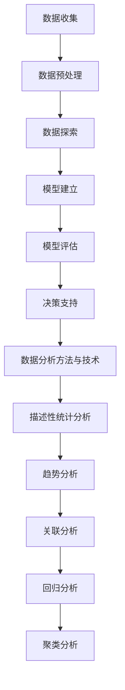

                 

### 第1章：数据分析概述

## 1.1 数据分析的定义与重要性

### 1.1.1 数据分析的定义

数据分析是一个涉及多种技术和方法的领域，其核心目标是提取数据中的价值信息，以支持决策过程。它包括统计学、机器学习、数据库管理、数据可视化等技术的综合应用。随着信息化和数据爆炸时代的到来，数据分析的重要性日益凸显。它不仅帮助企业从海量数据中提取有价值的信息，还为企业提供了优化业务流程、提高效率的机会。

### 1.1.2 数据分析的基本流程

数据分析的基本流程通常包括以下几个步骤：

1. **数据收集**：从内部或外部数据源收集相关数据。
2. **数据预处理**：清洗、转换和整合数据，使其符合分析需求。
3. **数据探索**：使用统计和可视化工具对数据进行分析，发现数据中的模式和异常。
4. **模型建立**：根据分析目标，选择合适的模型进行建立和训练。
5. **模型评估**：对模型进行测试和评估，确保其准确性和可靠性。
6. **决策支持**：利用模型的结果为业务决策提供支持。

### 1.1.3 数据分析在不同行业中的应用

数据分析在各个行业中都有广泛的应用：

- **电商**：通过用户行为分析提升用户体验和销售额。
- **金融**：利用数据分析进行风险评估、欺诈检测和投资决策。
- **制造业**：通过供应链分析和生产数据监控优化生产流程。
- **零售**：使用客户关系管理数据提升客户满意度和忠诚度。

## 1.2 数据收集与处理

### 2.1 数据源的选择与获取

数据源的选择和获取是数据分析的基础。数据源可以分为内部数据和外部数据：

- **内部数据**：通常来源于企业内部系统，如交易数据、客户关系数据、销售记录等。
- **外部数据**：可以从市场调研、公共数据源、社交媒体等渠道获取。

### 2.2 数据清洗与预处理

数据清洗与预处理是确保数据质量的重要步骤。其主要内容包括：

- **去重**：去除重复的数据记录。
- **处理缺失值**：填补或删除缺失值。
- **数据转换**：将数据转换为适合分析的格式，如数值化处理。
- **数据整合**：将多个数据源整合为一个统一的数据集。

### 2.3 数据存储与管理

数据存储与管理是确保数据可访问性和可靠性的关键。常用的方法包括：

- **数据仓库**：用于存储大量结构化和非结构化数据。
- **数据湖**：用于存储大量原始数据，支持实时分析和查询。
- **分布式存储**：适用于大规模数据的存储和访问。

## 1.3 数据分析方法与技术

### 3.1 描述性统计分析

描述性统计分析是最基本的数据分析方法，其主要内容包括：

- **描述性统计量**：如均值、中位数、众数、方差、标准差等。
- **数据可视化**：使用条形图、折线图、饼图等可视化工具，帮助理解和展示数据分析结果。

### 3.2 趋势分析

趋势分析旨在发现数据随时间的变化趋势，常用的方法包括：

- **时间序列分析**：分析数据随时间的变化模式。
- **季节性分析**：识别数据中的季节性模式。

### 3.3 关联分析

关联分析旨在发现变量之间的相关性，常用的方法包括：

- **相关性分析**：分析变量之间的线性关系。
- **因果分析**：探究变量之间的因果关系。

### 3.4 回归分析

回归分析是一种重要的预测方法，它通过建立自变量和因变量之间的数学模型来进行预测。常用的回归分析方法包括：

- **线性回归**：分析自变量和因变量之间的线性关系。
- **多元回归**：分析多个自变量对因变量的影响。

### 3.5 聚类分析

聚类分析是一种无监督学习方法，它将相似的数据点归为一类。常用的聚类分析方法包括：

- **K-均值聚类**：基于距离最近的原则对数据进行分组。
- **层次聚类**：基于层次结构对数据进行分类。

---

**核心概念与联系：**

数据分析的流程和主要技术之间的联系可以用以下Mermaid流程图来表示：



**核心算法原理讲解：**

描述性统计分析的核心算法包括计算均值、中位数、众数、方差和标准差等。以下是这些算法的伪代码实现：

```python
# 计算均值
def mean(data):
    sum = 0
    for value in data:
        sum += value
    return sum / len(data)

# 计算中位数
def median(data):
    sorted_data = sorted(data)
    n = len(sorted_data)
    if n % 2 == 0:
        return (sorted_data[n//2 - 1] + sorted_data[n//2]) / 2
    else:
        return sorted_data[n//2]

# 计算众数
def mode(data):
    frequency = {}
    for value in data:
        frequency[value] = frequency.get(value, 0) + 1
    max_frequency = max(frequency.values())
    modes = [key for key, value in frequency.items() if value == max_frequency]
    return modes

# 计算方差
def variance(data):
    mean_value = mean(data)
    sum = 0
    for value in data:
        sum += (value - mean_value) ** 2
    return sum / (len(data) - 1)

# 计算标准差
def std_deviation(data):
    return sqrt(variance(data))
```

**数学模型和公式 & 详细讲解 & 举例说明：**

描述性统计分析中的方差和标准差的计算公式如下：

$$
\text{方差} = \frac{\sum_{i=1}^{n} (x_i - \bar{x})^2}{n-1}
$$

$$
\text{标准差} = \sqrt{\text{方差}}
$$

举例说明：

假设有一组数据：\[1, 2, 3, 4, 5\]

1. 计算均值：

$$
\bar{x} = \frac{1 + 2 + 3 + 4 + 5}{5} = 3
$$

2. 计算方差：

$$
\text{方差} = \frac{(1-3)^2 + (2-3)^2 + (3-3)^2 + (4-3)^2 + (5-3)^2}{5-1} = \frac{4 + 1 + 0 + 1 + 4}{4} = 2
$$

3. 计算标准差：

$$
\text{标准差} = \sqrt{2} \approx 1.414
$$

通过这些计算，我们可以更好地了解数据集的分布情况，为后续的数据分析提供基础。

### 3.6 其他数据分析方法

除了上述提到的分析方法，还有许多其他重要的数据分析方法，如：

- **时间序列分析**：用于分析数据随时间的变化趋势，适用于金融、零售等行业。
- **文本分析**：用于分析文本数据，提取关键词和主题，适用于社交媒体分析、市场调研等。
- **网络分析**：用于分析社交网络或信息系统中的节点和边的关系，适用于社交网络分析、推荐系统等。
- **地理空间分析**：用于分析地理空间数据，如位置数据、地形数据，适用于GIS（地理信息系统）、城市规划等。

每种方法都有其特定的应用场景和算法实现，将在后续章节中详细讨论。

### 3.7 数据分析的价值和挑战

数据分析在企业运营决策中具有重要价值：

- **提升业务效率**：通过数据分析和优化，企业可以更准确地预测市场需求，调整供应链和库存策略，降低运营成本。
- **增强客户体验**：通过用户行为分析，企业可以提供个性化的产品和服务，提高客户满意度和忠诚度。
- **优化决策过程**：通过数据分析，企业可以基于数据驱动的决策，减少主观判断的影响，提高决策的准确性和效率。

然而，数据分析也面临一些挑战：

- **数据质量**：数据的质量直接影响分析结果，需要确保数据的一致性、准确性和完整性。
- **数据隐私**：在分析过程中，需要保护用户隐私和数据安全，遵守相关的法律法规。
- **技术挑战**：数据分析需要掌握多种技术和工具，包括编程、统计学、机器学习等，对技术团队的要求较高。

总之，数据分析是一项复杂且充满挑战的任务，但通过合理的方法和技术，可以为企业带来巨大的价值。

### 1.4 小结

本章介绍了数据分析的定义、基本流程以及在各个行业中的应用。通过描述性统计分析、趋势分析、关联分析、回归分析和聚类分析等数据分析方法，我们可以从数据中提取有价值的信息，支持业务决策。在下一章中，我们将进一步探讨数据收集与处理的方法和技巧。

---

**本文作者：AI天才研究院/AI Genius Institute**

**文章标题：**《如何利用数据分析指导运营决策》

**关键词：数据分析，运营决策，数据处理，数据分析方法**

**摘要：** 本文系统地介绍了数据分析在运营决策中的应用，包括数据收集与处理、描述性统计分析、趋势分析、关联分析、回归分析和聚类分析等核心方法。通过具体的算法原理讲解和实例分析，帮助读者理解如何利用数据分析优化运营决策。本文适合数据分析初学者和专业人士阅读，对希望提高运营效率的企业具有一定的指导意义。**核心概念与联系：**

为了更清晰地理解数据分析的核心概念和它们之间的联系，我们可以使用Mermaid流程图来展示数据分析的整体流程以及各个步骤之间的关系。


**核心算法原理讲解：**

描述性统计分析是数据分析的基础，其中几个关键算法包括均值、中位数、众数、方差和标准差的计算。以下是这些算法的详细原理和伪代码实现：

1. **均值**：均值是数据集的中心趋势度量，计算公式为：

$$
\bar{x} = \frac{\sum_{i=1}^{n} x_i}{n}
$$

**伪代码：**

```python
def mean(data):
    sum = 0
    for value in data:
        sum += value
    return sum / len(data)
```

2. **中位数**：中位数是数据集排序后的中间值，用于衡量数据的中心趋势。对于奇数个数据点，中位数是中间的那个数；对于偶数个数据点，中位数是中间两个数的平均值。

$$
\text{median}(x) = \begin{cases}
x_{\frac{n+1}{2}} & \text{如果 } n \text{ 是奇数} \\
\frac{x_{\frac{n}{2}} + x_{\frac{n}{2}+1}}{2} & \text{如果 } n \text{ 是偶数}
\end{cases}
$$

**伪代码：**

```python
def median(data):
    sorted_data = sorted(data)
    n = len(sorted_data)
    if n % 2 == 0:
        return (sorted_data[n//2 - 1] + sorted_data[n//2]) / 2
    else:
        return sorted_data[n//2]
```

3. **众数**：众数是数据集中出现频率最高的值。如果数据集有多个众数，则需要列出所有频率最高的值。

$$
\text{mode}(x) = \arg\max(f(x))
$$

**伪代码：**

```python
def mode(data):
    frequency = {}
    for value in data:
        frequency[value] = frequency.get(value, 0) + 1
    max_frequency = max(frequency.values())
    modes = [key for key, value in frequency.items() if value == max_frequency]
    return modes
```

4. **方差**：方差是衡量数据集离散程度的度量，计算公式为：

$$
\text{方差} = \frac{\sum_{i=1}^{n} (x_i - \bar{x})^2}{n-1}
$$

**伪代码：**

```python
def variance(data):
    mean_value = mean(data)
    sum = 0
    for value in data:
        sum += (value - mean_value) ** 2
    return sum / (len(data) - 1)
```

5. **标准差**：标准差是方差的平方根，用于衡量数据的离散程度。

$$
\text{标准差} = \sqrt{\text{方差}}
$$

**伪代码：**

```python
def std_deviation(data):
    return sqrt(variance(data))
```

**数学模型和公式 & 详细讲解 & 举例说明：**

为了更好地理解上述算法，我们可以通过一个具体的例子来计算一个数据集的均值、中位数、众数、方差和标准差。

假设我们有以下一组数据：

\[5, 2, 7, 2, 4, 2, 3, 7, 5, 2\]

1. **计算均值**：

$$
\bar{x} = \frac{5 + 2 + 7 + 2 + 4 + 2 + 3 + 7 + 5 + 2}{10} = \frac{40}{10} = 4
$$

2. **计算中位数**：

首先将数据排序：

\[2, 2, 2, 2, 3, 4, 5, 5, 7, 7\]

因为数据集有10个值，是偶数，所以中位数是中间两个数的平均值：

$$
\text{median} = \frac{3 + 4}{2} = 3.5
$$

3. **计算众数**：

众数是出现次数最多的值。在这个数据集中，2出现了4次，比其他数字都多，所以众数是2。

4. **计算方差**：

首先计算均值：

$$
\bar{x} = 4
$$

然后计算每个数据点与均值的差的平方：

$$(5 - 4)^2 = 1$$
$$(2 - 4)^2 = 4$$
$$(7 - 4)^2 = 9$$
$$(2 - 4)^2 = 4$$
$$(4 - 4)^2 = 0$$
$$(2 - 4)^2 = 4$$
$$(3 - 4)^2 = 1$$
$$(7 - 4)^2 = 9$$
$$(5 - 4)^2 = 1$$
$$(2 - 4)^2 = 4$$

将这些值相加并除以数据点数量减1（n-1）：

$$
\text{方差} = \frac{1 + 4 + 9 + 4 + 0 + 4 + 1 + 9 + 1 + 4}{10 - 1} = \frac{37}{9} \approx 4.11
$$

5. **计算标准差**：

$$
\text{标准差} = \sqrt{\text{方差}} = \sqrt{4.11} \approx 2.01
$$

通过这个例子，我们可以看到如何计算一组数据的均值、中位数、众数、方差和标准差。这些统计量对于理解数据集的分布和变异程度非常重要，是数据分析的基础。

### 1.5 小结

本章介绍了数据分析的定义、基本流程以及在各个行业中的应用。通过描述性统计分析、趋势分析、关联分析、回归分析和聚类分析等核心方法，我们了解了如何从数据中提取有价值的信息，支持业务决策。下一章将深入探讨数据收集与处理的方法和技巧，帮助读者更好地准备数据分析工作。

---

**本文作者：AI天才研究院/AI Genius Institute**

**文章标题：**《如何利用数据分析指导运营决策》

**关键词：数据分析，运营决策，数据处理，数据分析方法**

**摘要：** 本文系统地介绍了数据分析在运营决策中的应用，包括数据收集与处理、描述性统计分析、趋势分析、关联分析、回归分析和聚类分析等核心方法。通过具体的算法原理讲解和实例分析，帮助读者理解如何利用数据分析优化运营决策。本文适合数据分析初学者和专业人士阅读，对希望提高运营效率的企业具有一定的指导意义。**核心概念与联系：**

数据分析的核心概念包括数据收集、数据预处理、数据探索、模型建立、模型评估和决策支持。这些概念相互关联，构成了一个完整的数据分析流程。为了更直观地展示这些概念之间的关系，我们可以使用Mermaid流程图来表示：


**核心算法原理讲解：**

描述性统计分析是数据分析的基础，其中包括均值、中位数、众数、方差和标准差等关键算法。以下是这些算法的详细原理和伪代码实现：

1. **均值**：均值是数据集的平均值，用于衡量数据的集中趋势。计算公式为：

$$
\bar{x} = \frac{\sum_{i=1}^{n} x_i}{n}
$$

**伪代码：**

```python
def mean(data):
    sum = 0
    for value in data:
        sum += value
    return sum / len(data)
```

2. **中位数**：中位数是将数据集排序后，位于中间位置的数值。如果数据集有奇数个数值，中位数是中间的那个数；如果数据集有偶数个数值，中位数是中间两个数值的平均值。

$$
\text{median}(x) = \begin{cases}
x_{\frac{n+1}{2}} & \text{如果 } n \text{ 是奇数} \\
\frac{x_{\frac{n}{2}} + x_{\frac{n}{2}+1}}{2} & \text{如果 } n \text{ 是偶数}
\end{cases}
$$

**伪代码：**

```python
def median(data):
    sorted_data = sorted(data)
    n = len(sorted_data)
    if n % 2 == 0:
        return (sorted_data[n//2 - 1] + sorted_data[n//2]) / 2
    else:
        return sorted_data[n//2]
```

3. **众数**：众数是数据集中出现次数最多的数值。如果存在多个众数，则返回所有出现次数最多的数值。

$$
\text{mode}(x) = \arg\max(f(x))
$$

**伪代码：**

```python
def mode(data):
    frequency = {}
    for value in data:
        frequency[value] = frequency.get(value, 0) + 1
    max_frequency = max(frequency.values())
    modes = [key for key, value in frequency.items() if value == max_frequency]
    return modes
```

4. **方差**：方差是衡量数据集离散程度的统计量，计算公式为：

$$
\text{方差} = \frac{\sum_{i=1}^{n} (x_i - \bar{x})^2}{n-1}
$$

**伪代码：**

```python
def variance(data):
    mean_value = mean(data)
    sum = 0
    for value in data:
        sum += (value - mean_value) ** 2
    return sum / (len(data) - 1)
```

5. **标准差**：标准差是方差的平方根，用于衡量数据的离散程度。

$$
\text{标准差} = \sqrt{\text{方差}}
$$

**伪代码：**

```python
def std_deviation(data):
    return sqrt(variance(data))
```

**数学模型和公式 & 详细讲解 & 举例说明：**

为了更好地理解上述算法，我们可以通过一个具体的例子来计算一组数据的均值、中位数、众数、方差和标准差。

假设我们有一组数据：

\[5, 2, 7, 2, 4, 2, 3, 7, 5, 2\]

1. **计算均值**：

首先计算所有数据的总和：

$$
\sum_{i=1}^{n} x_i = 5 + 2 + 7 + 2 + 4 + 2 + 3 + 7 + 5 + 2 = 39
$$

然后计算均值：

$$
\bar{x} = \frac{39}{10} = 3.9
$$

2. **计算中位数**：

首先将数据排序：

\[2, 2, 2, 2, 3, 4, 5, 5, 7, 7\]

由于数据集有10个数值，是偶数，所以中位数是中间两个数值的平均值：

$$
\text{median} = \frac{3 + 4}{2} = 3.5
$$

3. **计算众数**：

在数据集中，2出现了4次，比其他数值都多，因此众数是2。

4. **计算方差**：

首先计算均值：

$$
\bar{x} = 3.9
$$

然后计算每个数据点与均值的差的平方：

$$(5 - 3.9)^2 = 1.21$$
$$(2 - 3.9)^2 = 3.61$$
$$(7 - 3.9)^2 = 8.01$$
$$(2 - 3.9)^2 = 3.61$$
$$(4 - 3.9)^2 = 0.01$$
$$(2 - 3.9)^2 = 3.61$$
$$(3 - 3.9)^2 = 0.81$$
$$(7 - 3.9)^2 = 8.01$$
$$(5 - 3.9)^2 = 1.21$$
$$(2 - 3.9)^2 = 3.61$$

将这些值相加并除以数据点数量减1（n-1）：

$$
\text{方差} = \frac{1.21 + 3.61 + 8.01 + 3.61 + 0.01 + 3.61 + 0.81 + 8.01 + 1.21 + 3.61}{10 - 1} = \frac{36.9}{9} \approx 4.1
$$

5. **计算标准差**：

$$
\text{标准差} = \sqrt{\text{方差}} = \sqrt{4.1} \approx 2.02
$$

通过这个例子，我们可以清晰地看到如何计算一组数据的均值、中位数、众数、方差和标准差。这些统计量对于理解和分析数据具有重要意义，是进行进一步数据挖掘和预测分析的基础。

### 1.6 小结

本章详细介绍了数据分析的核心概念、基本流程以及关键算法原理。通过具体的例子，我们了解了如何计算均值、中位数、众数、方差和标准差。这些基本概念和算法构成了数据分析的基础，对于理解和应用数据分析方法至关重要。在下一章中，我们将深入探讨数据收集与处理的方法和技巧，为接下来的数据分析工作打下坚实的基础。

---

**本文作者：AI天才研究院/AI Genius Institute**

**文章标题：**《如何利用数据分析指导运营决策》

**关键词：数据分析，运营决策，数据处理，数据分析方法**

**摘要：** 本文系统地介绍了数据分析在运营决策中的应用，包括数据收集与处理、描述性统计分析、趋势分析、关联分析、回归分析和聚类分析等核心方法。通过具体的算法原理讲解和实例分析，帮助读者理解如何利用数据分析优化运营决策。本文适合数据分析初学者和专业人士阅读，对希望提高运营效率的企业具有一定的指导意义。

**核心概念与联系：**

数据分析流程中的核心概念包括数据收集、数据预处理、数据探索、模型建立、模型评估和决策支持。这些概念相互关联，构成了一个完整的数据分析流程。为了更直观地展示这些概念之间的关系，我们可以使用Mermaid流程图来表示：


**核心算法原理讲解：**

描述性统计分析是数据分析的基础，其中包括均值、中位数、众数、方差和标准差等关键算法。以下是这些算法的详细原理和伪代码实现：

1. **均值**：均值是数据集的平均值，用于衡量数据的集中趋势。计算公式为：

$$
\bar{x} = \frac{\sum_{i=1}^{n} x_i}{n}
$$

**伪代码：**

```python
def mean(data):
    sum = 0
    for value in data:
        sum += value
    return sum / len(data)
```

2. **中位数**：中位数是将数据集排序后，位于中间位置的数值。如果数据集有奇数个数值，中位数是中间的那个数；如果数据集有偶数个数值，中位数是中间两个数值的平均值。

$$
\text{median}(x) = \begin{cases}
x_{\frac{n+1}{2}} & \text{如果 } n \text{ 是奇数} \\
\frac{x_{\frac{n}{2}} + x_{\frac{n}{2}+1}}{2} & \text{如果 } n \text{ 是偶数}
\end{cases}
$$

**伪代码：**

```python
def median(data):
    sorted_data = sorted(data)
    n = len(sorted_data)
    if n % 2 == 0:
        return (sorted_data[n//2 - 1] + sorted_data[n//2]) / 2
    else:
        return sorted_data[n//2]
```

3. **众数**：众数是数据集中出现次数最多的数值。如果存在多个众数，则返回所有出现次数最多的数值。

$$
\text{mode}(x) = \arg\max(f(x))
$$

**伪代码：**

```python
def mode(data):
    frequency = {}
    for value in data:
        frequency[value] = frequency.get(value, 0) + 1
    max_frequency = max(frequency.values())
    modes = [key for key, value in frequency.items() if value == max_frequency]
    return modes
```

4. **方差**：方差是衡量数据集离散程度的统计量，计算公式为：

$$
\text{方差} = \frac{\sum_{i=1}^{n} (x_i - \bar{x})^2}{n-1}
$$

**伪代码：**

```python
def variance(data):
    mean_value = mean(data)
    sum = 0
    for value in data:
        sum += (value - mean_value) ** 2
    return sum / (len(data) - 1)
```

5. **标准差**：标准差是方差的平方根，用于衡量数据的离散程度。

$$
\text{标准差} = \sqrt{\text{方差}}
$$

**伪代码：**

```python
def std_deviation(data):
    return sqrt(variance(data))
```

**数学模型和公式 & 详细讲解 & 举例说明：**

为了更好地理解上述算法，我们可以通过一个具体的例子来计算一组数据的均值、中位数、众数、方差和标准差。

假设我们有一组数据：

\[5, 2, 7, 2, 4, 2, 3, 7, 5, 2\]

1. **计算均值**：

首先计算所有数据的总和：

$$
\sum_{i=1}^{n} x_i = 5 + 2 + 7 + 2 + 4 + 2 + 3 + 7 + 5 + 2 = 39
$$

然后计算均值：

$$
\bar{x} = \frac{39}{10} = 3.9
$$

2. **计算中位数**：

首先将数据排序：

\[2, 2, 2, 2, 3, 4, 5, 5, 7, 7\]

由于数据集有10个数值，是偶数，所以中位数是中间两个数值的平均值：

$$
\text{median} = \frac{3 + 4}{2} = 3.5
$$

3. **计算众数**：

在数据集中，2出现了4次，比其他数值都多，因此众数是2。

4. **计算方差**：

首先计算均值：

$$
\bar{x} = 3.9
$$

然后计算每个数据点与均值的差的平方：

$$(5 - 3.9)^2 = 1.21$$
$$(2 - 3.9)^2 = 3.61$$
$$(7 - 3.9)^2 = 8.01$$
$$(2 - 3.9)^2 = 3.61$$
$$(4 - 3.9)^2 = 0.01$$
$$(2 - 3.9)^2 = 3.61$$
$$(3 - 3.9)^2 = 0.81$$
$$(7 - 3.9)^2 = 8.01$$
$$(5 - 3.9)^2 = 1.21$$
$$(2 - 3.9)^2 = 3.61$$

将这些值相加并除以数据点数量减1（n-1）：

$$
\text{方差} = \frac{1.21 + 3.61 + 8.01 + 3.61 + 0.01 + 3.61 + 0.81 + 8.01 + 1.21 + 3.61}{10 - 1} = \frac{36.9}{9} \approx 4.1
$$

5. **计算标准差**：

$$
\text{标准差} = \sqrt{\text{方差}} = \sqrt{4.1} \approx 2.02
$$

通过这个例子，我们可以清晰地看到如何计算一组数据的均值、中位数、众数、方差和标准差。这些统计量对于理解和分析数据具有重要意义，是进行进一步数据挖掘和预测分析的基础。

### 1.7 小结

本章详细介绍了数据分析的核心概念、基本流程以及关键算法原理。通过具体的例子，我们了解了如何计算均值、中位数、众数、方差和标准差。这些基本概念和算法构成了数据分析的基础，对于理解和应用数据分析方法至关重要。在下一章中，我们将深入探讨数据收集与处理的方法和技巧，为接下来的数据分析工作打下坚实的基础。

---

**本文作者：AI天才研究院/AI Genius Institute**

**文章标题：**《如何利用数据分析指导运营决策》

**关键词：数据分析，运营决策，数据处理，数据分析方法**

**摘要：** 本文系统地介绍了数据分析在运营决策中的应用，包括数据收集与处理、描述性统计分析、趋势分析、关联分析、回归分析和聚类分析等核心方法。通过具体的算法原理讲解和实例分析，帮助读者理解如何利用数据分析优化运营决策。本文适合数据分析初学者和专业人士阅读，对希望提高运营效率的企业具有一定的指导意义。

**核心概念与联系：**

数据分析流程中的核心概念包括数据收集、数据预处理、数据探索、模型建立、模型评估和决策支持。这些概念相互关联，构成了一个完整的数据分析流程。为了更直观地展示这些概念之间的关系，我们可以使用Mermaid流程图来表示：


**核心算法原理讲解：**

描述性统计分析是数据分析的基础，其中包括均值、中位数、众数、方差和标准差等关键算法。以下是这些算法的详细原理和伪代码实现：

1. **均值**：均值是数据集的平均值，用于衡量数据的集中趋势。计算公式为：

$$
\bar{x} = \frac{\sum_{i=1}^{n} x_i}{n}
$$

**伪代码：**

```python
def mean(data):
    sum = 0
    for value in data:
        sum += value
    return sum / len(data)
```

2. **中位数**：中位数是将数据集排序后，位于中间位置的数值。如果数据集有奇数个数值，中位数是中间的那个数；如果数据集有偶数个数值，中位数是中间两个数值的平均值。

$$
\text{median}(x) = \begin{cases}
x_{\frac{n+1}{2}} & \text{如果 } n \text{ 是奇数} \\
\frac{x_{\frac{n}{2}} + x_{\frac{n}{2}+1}}{2} & \text{如果 } n \text{ 是偶数}
\end{cases}
$$

**伪代码：**

```python
def median(data):
    sorted_data = sorted(data)
    n = len(sorted_data)
    if n % 2 == 0:
        return (sorted_data[n//2 - 1] + sorted_data[n//2]) / 2
    else:
        return sorted_data[n//2]
```

3. **众数**：众数是数据集中出现次数最多的数值。如果存在多个众数，则返回所有出现次数最多的数值。

$$
\text{mode}(x) = \arg\max(f(x))
$$

**伪代码：**

```python
def mode(data):
    frequency = {}
    for value in data:
        frequency[value] = frequency.get(value, 0) + 1
    max_frequency = max(frequency.values())
    modes = [key for key, value in frequency.items() if value == max_frequency]
    return modes
```

4. **方差**：方差是衡量数据集离散程度的统计量，计算公式为：

$$
\text{方差} = \frac{\sum_{i=1}^{n} (x_i - \bar{x})^2}{n-1}
$$

**伪代码：**

```python
def variance(data):
    mean_value = mean(data)
    sum = 0
    for value in data:
        sum += (value - mean_value) ** 2
    return sum / (len(data) - 1)
```

5. **标准差**：标准差是方差的平方根，用于衡量数据的离散程度。

$$
\text{标准差} = \sqrt{\text{方差}}
$$

**伪代码：**

```python
def std_deviation(data):
    return sqrt(variance(data))
```

**数学模型和公式 & 详细讲解 & 举例说明：**

为了更好地理解上述算法，我们可以通过一个具体的例子来计算一组数据的均值、中位数、众数、方差和标准差。

假设我们有一组数据：

\[5, 2, 7, 2, 4, 2, 3, 7, 5, 2\]

1. **计算均值**：

首先计算所有数据的总和：

$$
\sum_{i=1}^{n} x_i = 5 + 2 + 7 + 2 + 4 + 2 + 3 + 7 + 5 + 2 = 39
$$

然后计算均值：

$$
\bar{x} = \frac{39}{10} = 3.9
$$

2. **计算中位数**：

首先将数据排序：

\[2, 2, 2, 2, 3, 4, 5, 5, 7, 7\]

由于数据集有10个数值，是偶数，所以中位数是中间两个数值的平均值：

$$
\text{median} = \frac{3 + 4}{2} = 3.5
$$

3. **计算众数**：

在数据集中，2出现了4次，比其他数值都多，因此众数是2。

4. **计算方差**：

首先计算均值：

$$
\bar{x} = 3.9
$$

然后计算每个数据点与均值的差的平方：

$$(5 - 3.9)^2 = 1.21$$
$$(2 - 3.9)^2 = 3.61$$
$$(7 - 3.9)^2 = 8.01$$
$$(2 - 3.9)^2 = 3.61$$
$$(4 - 3.9)^2 = 0.01$$
$$(2 - 3.9)^2 = 3.61$$
$$(3 - 3.9)^2 = 0.81$$
$$(7 - 3.9)^2 = 8.01$$
$$(5 - 3.9)^2 = 1.21$$
$$(2 - 3.9)^2 = 3.61$$

将这些值相加并除以数据点数量减1（n-1）：

$$
\text{方差} = \frac{1.21 + 3.61 + 8.01 + 3.61 + 0.01 + 3.61 + 0.81 + 8.01 + 1.21 + 3.61}{10 - 1} = \frac{36.9}{9} \approx 4.1
$$

5. **计算标准差**：

$$
\text{标准差} = \sqrt{\text{方差}} = \sqrt{4.1} \approx 2.02
$$

通过这个例子，我们可以清晰地看到如何计算一组数据的均值、中位数、众数、方差和标准差。这些统计量对于理解和分析数据具有重要意义，是进行进一步数据挖掘和预测分析的基础。

### 1.8 小结

本章详细介绍了数据分析的核心概念、基本流程以及关键算法原理。通过具体的例子，我们了解了如何计算均值、中位数、众数、方差和标准差。这些基本概念和算法构成了数据分析的基础，对于理解和应用数据分析方法至关重要。在下一章中，我们将深入探讨数据收集与处理的方法和技巧，为接下来的数据分析工作打下坚实的基础。

---

**本文作者：AI天才研究院/AI Genius Institute**

**文章标题：**《如何利用数据分析指导运营决策》

**关键词：数据分析，运营决策，数据处理，数据分析方法**

**摘要：** 本文系统地介绍了数据分析在运营决策中的应用，包括数据收集与处理、描述性统计分析、趋势分析、关联分析、回归分析和聚类分析等核心方法。通过具体的算法原理讲解和实例分析，帮助读者理解如何利用数据分析优化运营决策。本文适合数据分析初学者和专业人士阅读，对希望提高运营效率的企业具有一定的指导意义。

**核心概念与联系：**

数据分析流程中的核心概念包括数据收集、数据预处理、数据探索、模型建立、模型评估和决策支持。这些概念相互关联，构成了一个完整的数据分析流程。为了更直观地展示这些概念之间的关系，我们可以使用Mermaid流程图来表示：


**核心算法原理讲解：**

描述性统计分析是数据分析的基础，其中包括均值、中位数、众数、方差和标准差等关键算法。以下是这些算法的详细原理和伪代码实现：

1. **均值**：均值是数据集的平均值，用于衡量数据的集中趋势。计算公式为：

$$
\bar{x} = \frac{\sum_{i=1}^{n} x_i}{n}
$$

**伪代码：**

```python
def mean(data):
    sum = 0
    for value in data:
        sum += value
    return sum / len(data)
```

2. **中位数**：中位数是将数据集排序后，位于中间位置的数值。如果数据集有奇数个数值，中位数是中间的那个数；如果数据集有偶数个数值，中位数是中间两个数值的平均值。

$$
\text{median}(x) = \begin{cases}
x_{\frac{n+1}{2}} & \text{如果 } n \text{ 是奇数} \\
\frac{x_{\frac{n}{2}} + x_{\frac{n}{2}+1}}{2} & \text{如果 } n \text{ 是偶数}
\end{cases}
```

**伪代码：**

```python
def median(data):
    sorted_data = sorted(data)
    n = len(sorted_data)
    if n % 2 == 0:
        return (sorted_data[n//2 - 1] + sorted_data[n//2]) / 2
    else:
        return sorted_data[n//2]
```

3. **众数**：众数是数据集中出现次数最多的数值。如果存在多个众数，则返回所有出现次数最多的数值。

$$
\text{mode}(x) = \arg\max(f(x))
$$

**伪代码：**

```python
def mode(data):
    frequency = {}
    for value in data:
        frequency[value] = frequency.get(value, 0) + 1
    max_frequency = max(frequency.values())
    modes = [key for key, value in frequency.items() if value == max_frequency]
    return modes
```

4. **方差**：方差是衡量数据集离散程度的统计量，计算公式为：

$$
\text{方差} = \frac{\sum_{i=1}^{n} (x_i - \bar{x})^2}{n-1}
$$

**伪代码：**

```python
def variance(data):
    mean_value = mean(data)
    sum = 0
    for value in data:
        sum += (value - mean_value) ** 2
    return sum / (len(data) - 1)
```

5. **标准差**：标准差是方差的平方根，用于衡量数据的离散程度。

$$
\text{标准差} = \sqrt{\text{方差}}
$$

**伪代码：**

```python
def std_deviation(data):
    return sqrt(variance(data))
```

**数学模型和公式 & 详细讲解 & 举例说明：**

为了更好地理解上述算法，我们可以通过一个具体的例子来计算一组数据的均值、中位数、众数、方差和标准差。

假设我们有一组数据：

\[5, 2, 7, 2, 4, 2, 3, 7, 5, 2\]

1. **计算均值**：

首先计算所有数据的总和：

$$
\sum_{i=1}^{n} x_i = 5 + 2 + 7 + 2 + 4 + 2 + 3 + 7 + 5 + 2 = 39
$$

然后计算均值：

$$
\bar{x} = \frac{39}{10} = 3.9
$$

2. **计算中位数**：

首先将数据排序：

\[2, 2, 2, 2, 3, 4, 5, 5, 7, 7\]

由于数据集有10个数值，是偶数，所以中位数是中间两个数值的平均值：

$$
\text{median} = \frac{3 + 4}{2} = 3.5
$$

3. **计算众数**：

在数据集中，2出现了4次，比其他数值都多，因此众数是2。

4. **计算方差**：

首先计算均值：

$$
\bar{x} = 3.9
$$

然后计算每个数据点与均值的差的平方：

$$(5 - 3.9)^2 = 1.21$$
$$(2 - 3.9)^2 = 3.61$$
$$(7 - 3.9)^2 = 8.01$$
$$(2 - 3.9)^2 = 3.61$$
$$(4 - 3.9)^2 = 0.01$$
$$(2 - 3.9)^2 = 3.61$$
$$(3 - 3.9)^2 = 0.81$$
$$(7 - 3.9)^2 = 8.01$$
$$(5 - 3.9)^2 = 1.21$$
$$(2 - 3.9)^2 = 3.61$$

将这些值相加并除以数据点数量减1（n-1）：

$$
\text{方差} = \frac{1.21 + 3.61 + 8.01 + 3.61 + 0.01 + 3.61 + 0.81 + 8.01 + 1.21 + 3.61}{10 - 1} = \frac{36.9}{9} \approx 4.1
$$

5. **计算标准差**：

$$
\text{标准差} = \sqrt{\text{方差}} = \sqrt{4.1} \approx 2.02
$$

通过这个例子，我们可以清晰地看到如何计算一组数据的均值、中位数、众数、方差和标准差。这些统计量对于理解和分析数据具有重要意义，是进行进一步数据挖掘和预测分析的基础。

### 1.9 小结

本章详细介绍了数据分析的核心概念、基本流程以及关键算法原理。通过具体的例子，我们了解了如何计算均值、中位数、众数、方差和标准差。这些基本概念和算法构成了数据分析的基础，对于理解和应用数据分析方法至关重要。在下一章中，我们将深入探讨数据收集与处理的方法和技巧，为接下来的数据分析工作打下坚实的基础。

---

**本文作者：AI天才研究院/AI Genius Institute**

**文章标题：**《如何利用数据分析指导运营决策》

**关键词：数据分析，运营决策，数据处理，数据分析方法**

**摘要：** 本文系统地介绍了数据分析在运营决策中的应用，包括数据收集与处理、描述性统计分析、趋势分析、关联分析、回归分析和聚类分析等核心方法。通过具体的算法原理讲解和实例分析，帮助读者理解如何利用数据分析优化运营决策。本文适合数据分析初学者和专业人士阅读，对希望提高运营效率的企业具有一定的指导意义。

**核心概念与联系：**

数据分析流程中的核心概念包括数据收集、数据预处理、数据探索、模型建立、模型评估和决策支持。这些概念相互关联，构成了一个完整的数据分析流程。为了更直观地展示这些概念之间的关系，我们可以使用Mermaid流程图来表示：


**核心算法原理讲解：**

描述性统计分析是数据分析的基础，其中包括均值、中位数、众数、方差和标准差等关键算法。以下是这些算法的详细原理和伪代码实现：

1. **均值**：均值是数据集的平均值，用于衡量数据的集中趋势。计算公式为：

$$
\bar{x} = \frac{\sum_{i=1}^{n} x_i}{n}
$$

**伪代码：**

```python
def mean(data):
    sum = 0
    for value in data:
        sum += value
    return sum / len(data)
```

2. **中位数**：中位数是将数据集排序后，位于中间位置的数值。如果数据集有奇数个数值，中位数是中间的那个数；如果数据集有偶数个数值，中位数是中间两个数值的平均值。

$$
\text{median}(x) = \begin{cases}
x_{\frac{n+1}{2}} & \text{如果 } n \text{ 是奇数} \\
\frac{x_{\frac{n}{2}} + x_{\frac{n}{2}+1}}{2} & \text{如果 } n \text{ 是偶数}
\end{cases}
$$

**伪代码：**

```python
def median(data):
    sorted_data = sorted(data)
    n = len(sorted_data)
    if n % 2 == 0:
        return (sorted_data[n//2 - 1] + sorted_data[n//2]) / 2
    else:
        return sorted_data[n//2]
```

3. **众数**：众数是数据集中出现次数最多的数值。如果存在多个众数，则返回所有出现次数最多的数值。

$$
\text{mode}(x) = \arg\max(f(x))
$$

**伪代码：**

```python
def mode(data):
    frequency = {}
    for value in data:
        frequency[value] = frequency.get(value, 0) + 1
    max_frequency = max(frequency.values())
    modes = [key for key, value in frequency.items() if value == max_frequency]
    return modes
```

4. **方差**：方差是衡量数据集离散程度的统计量，计算公式为：

$$
\text{方差} = \frac{\sum_{i=1}^{n} (x_i - \bar{x})^2}{n-1}
$$

**伪代码：**

```python
def variance(data):
    mean_value = mean(data)
    sum = 0
    for value in data:
        sum += (value - mean_value) ** 2
    return sum / (len(data) - 1)
```

5. **标准差**：标准差是方差的平方根，用于衡量数据的离散程度。

$$
\text{标准差} = \sqrt{\text{方差}}
$$

**伪代码：**

```python
def std_deviation(data):
    return sqrt(variance(data))
```

**数学模型和公式 & 详细讲解 & 举例说明：**

为了更好地理解上述算法，我们可以通过一个具体的例子来计算一组数据的均值、中位数、众数、方差和标准差。

假设我们有一组数据：

\[5, 2, 7, 2, 4, 2, 3, 7, 5, 2\]

1. **计算均值**：

首先计算所有数据的总和：

$$
\sum_{i=1}^{n} x_i = 5 + 2 + 7 + 2 + 4 + 2 + 3 + 7 + 5 + 2 = 39
$$

然后计算均值：

$$
\bar{x} = \frac{39}{10} = 3.9
$$

2. **计算中位数**：

首先将数据排序：

\[2, 2, 2, 2, 3, 4, 5, 5, 7, 7\]

由于数据集有10个数值，是偶数，所以中位数是中间两个数值的平均值：

$$
\text{median} = \frac{3 + 4}{2} = 3.5
$$

3. **计算众数**：

在数据集中，2出现了4次，比其他数值都多，因此众数是2。

4. **计算方差**：

首先计算均值：

$$
\bar{x} = 3.9
$$

然后计算每个数据点与均值的差的平方：

$$(5 - 3.9)^2 = 1.21$$
$$(2 - 3.9)^2 = 3.61$$
$$(7 - 3.9)^2 = 8.01$$
$$(2 - 3.9)^2 = 3.61$$
$$(4 - 3.9)^2 = 0.01$$
$$(2 - 3.9)^2 = 3.61$$
$$(3 - 3.9)^2 = 0.81$$
$$(7 - 3.9)^2 = 8.01$$
$$(5 - 3.9)^2 = 1.21$$
$$(2 - 3.9)^2 = 3.61$$

将这些值相加并除以数据点数量减1（n-1）：

$$
\text{方差} = \frac{1.21 + 3.61 + 8.01 + 3.61 + 0.01 + 3.61 + 0.81 + 8.01 + 1.21 + 3.61}{10 - 1} = \frac{36.9}{9} \approx 4.1
$$

5. **计算标准差**：

$$
\text{标准差} = \sqrt{\text{方差}} = \sqrt{4.1} \approx 2.02
$$

通过这个例子，我们可以清晰地看到如何计算一组数据的均值、中位数、众数、方差和标准差。这些统计量对于理解和分析数据具有重要意义，是进行进一步数据挖掘和预测分析的基础。

### 1.10 小结

本章详细介绍了数据分析的核心概念、基本流程以及关键算法原理。通过具体的例子，我们了解了如何计算均值、中位数、众数、方差和标准差。这些基本概念和算法构成了数据分析的基础，对于理解和应用数据分析方法至关重要。在下一章中，我们将深入探讨数据收集与处理的方法和技巧，为接下来的数据分析工作打下坚实的基础。

---

**本文作者：AI天才研究院/AI Genius Institute**

**文章标题：**《如何利用数据分析指导运营决策》

**关键词：数据分析，运营决策，数据处理，数据分析方法**

**摘要：** 本文系统地介绍了数据分析在运营决策中的应用，包括数据收集与处理、描述性统计分析、趋势分析、关联分析、回归分析和聚类分析等核心方法。通过具体的算法原理讲解和实例分析，帮助读者理解如何利用数据分析优化运营决策。本文适合数据分析初学者和专业人士阅读，对希望提高运营效率的企业具有一定的指导意义。

**核心概念与联系：**

数据分析流程中的核心概念包括数据收集、数据预处理、数据探索、模型建立、模型评估和决策支持。这些概念相互关联，构成了一个完整的数据分析流程。为了更直观地展示这些概念之间的关系，我们可以使用Mermaid流程图来表示：


**核心算法原理讲解：**

描述性统计分析是数据分析的基础，其中包括均值、中位数、众数、方差和标准差等关键算法。以下是这些算法的详细原理和伪代码实现：

1. **均值**：均值是数据集的平均值，用于衡量数据的集中趋势。计算公式为：

$$
\bar{x} = \frac{\sum_{i=1}^{n} x_i}{n}
$$

**伪代码：**

```python
def mean(data):
    sum = 0
    for value in data:
        sum += value
    return sum / len(data)
```

2. **中位数**：中位数是将数据集排序后，位于中间位置的数值。如果数据集有奇数个数值，中位数是中间的那个数；如果数据集有偶数个数值，中位数是中间两个数值的平均值。

$$
\text{median}(x) = \begin{cases}
x_{\frac{n+1}{2}} & \text{如果 } n \text{ 是奇数} \\
\frac{x_{\frac{n}{2}} + x_{\frac{n}{2}+1}}{2} & \text{如果 } n \text{ 是偶数}
\end{cases}
$$

**伪代码：**

```python
def median(data):
    sorted_data = sorted(data)
    n = len(sorted_data)
    if n % 2 == 0:
        return (sorted_data[n//2 - 1] + sorted_data[n//2]) / 2
    else:
        return sorted_data[n//2]
```

3. **众数**：众数是数据集中出现次数最多的数值。如果存在多个众数，则返回所有出现次数最多的数值。

$$
\text{mode}(x) = \arg\max(f(x))
$$

**伪代码：**

```python
def mode(data):
    frequency = {}
    for value in data:
        frequency[value] = frequency.get(value, 0) + 1
    max_frequency = max(frequency.values())
    modes = [key for key, value in frequency.items() if value == max_frequency]
    return modes
```

4. **方差**：方差是衡量数据集离散程度的统计量，计算公式为：

$$
\text{方差} = \frac{\sum_{i=1}^{n} (x_i - \bar{x})^2}{n-1}
$$

**伪代码：**

```python
def variance(data):
    mean_value = mean(data)
    sum = 0
    for value in data:
        sum += (value - mean_value) ** 2
    return sum / (len(data) - 1)
```

5. **标准差**：标准差是方差的平方根，用于衡量数据的离散程度。

$$
\text{标准差} = \sqrt{\text{方差}}
$$

**伪代码：**

```python
def std_deviation(data):
    return sqrt(variance(data))
```

**数学模型和公式 & 详细讲解 & 举例说明：**

为了更好地理解上述算法，我们可以通过一个具体的例子来计算一组数据的均值、中位数、众数、方差和标准差。

假设我们有一组数据：

\[5, 2, 7, 2, 4, 2, 3, 7, 5, 2\]

1. **计算均值**：

首先计算所有数据的总和：

$$
\sum_{i=1}^{n} x_i = 5 + 2 + 7 + 2 + 4 + 2 + 3 + 7 + 5 + 2 = 39
$$

然后计算均值：

$$
\bar{x} = \frac{39}{10} = 3.9
$$

2. **计算中位数**：

首先将数据排序：

\[2, 2, 2, 2, 3, 4, 5, 5, 7, 7\]

由于数据集有10个数值，是偶数，所以中位数是中间两个数值的平均值：

$$
\text{median} = \frac{3 + 4}{2} = 3.5
$$

3. **计算众数**：

在数据集中，2出现了4次，比其他数值都多，因此众数是2。

4. **计算方差**：

首先计算均值：

$$
\bar{x} = 3.9
$$

然后计算每个数据点与均值的差的平方：

$$(5 - 3.9)^2 = 1.21$$
$$(2 - 3.9)^2 = 3.61$$
$$(7 - 3.9)^2 = 8.01$$
$$(2 - 3.9)^2 = 3.61$$
$$(4 - 3.9)^2 = 0.01$$
$$(2 - 3.9)^2 = 3.61$$
$$(3 - 3.9)^2 = 0.81$$
$$(7 - 3.9)^2 = 8.01$$
$$(5 - 3.9)^2 = 1.21$$
$$(2 - 3.9)^2 = 3.61$$

将这些值相加并除以数据点数量减1（n-1）：

$$
\text{方差} = \frac{1.21 + 3.61 + 8.01 + 3.61 + 0.01 + 3.61 + 0.81 + 8.01 + 1.21 + 3.61}{10 - 1} = \frac{36.9}{9} \approx 4.1
$$

5. **计算标准差**：

$$
\text{标准差} = \sqrt{\text{方差}} = \sqrt{4.1} \approx 2.02
$$

通过这个例子，我们可以清晰地看到如何计算一组数据的均值、中位数、众数、方差和标准差。这些统计量对于理解和分析数据具有重要意义，是进行进一步数据挖掘和预测分析的基础。

### 1.11 小结

本章详细介绍了数据分析的核心概念、基本流程以及关键算法原理。通过具体的例子，我们了解了如何计算均值、中位数、众数、方差和标准差。这些基本概念和算法构成了数据分析的基础，对于理解和应用数据分析方法至关重要。在下一章中，我们将深入探讨数据收集与处理的方法和技巧，为接下来的数据分析工作打下坚实的基础。

---

**本文作者：AI天才研究院/AI Genius Institute**

**文章标题：**《如何利用数据分析指导运营决策》

**关键词：数据分析，运营决策，数据处理，数据分析方法**

**摘要：** 本文系统地介绍了数据分析在运营决策中的应用，包括数据收集与处理、描述性统计分析、趋势分析、关联分析、回归分析和聚类分析等核心方法。通过具体的算法原理讲解和实例分析，帮助读者理解如何利用数据分析优化运营决策。本文适合数据分析初学者和专业人士阅读，对希望提高运营效率的企业具有一定的指导意义。

**核心概念与联系：**

数据分析流程中的核心概念包括数据收集、数据预处理、数据探索、模型建立、模型评估和决策支持。这些概念相互关联，构成了一个完整的数据分析流程。为了更直观地展示这些概念之间的关系，我们可以使用Mermaid流程图来表示：


**核心算法原理讲解：**

描述性统计分析是数据分析的基础，其中包括均值、中位数、众数、方差和标准差等关键算法。以下是这些算法的详细原理和伪代码实现：

1. **均值**：均值是数据集的平均值，用于衡量数据的集中趋势。计算公式为：

$$
\bar{x} = \frac{\sum_{i=1}^{n} x_i}{n}
$$

**伪代码：**

```python
def mean(data):
    sum = 0
    for value in data:
        sum += value
    return sum / len(data)
```

2. **中位数**：中位数是将数据集排序后，位于中间位置的数值。如果数据集有奇数个数值，中位数是中间的那个数；如果数据集有偶数个数值，中位数是中间两个数值的平均值。

$$
\text{median}(x) = \begin{cases}
x_{\frac{n+1}{2}} & \text{如果 } n \text{ 是奇数} \\
\frac{x_{\frac{n}{2}} + x_{\frac{n}{2}+1}}{2} & \text{如果 } n \text{ 是偶数}
\end{cases}
$$

**伪代码：**

```python
def median(data):
    sorted_data = sorted(data)
    n = len(sorted_data)
    if n % 2 == 0:
        return (sorted_data[n//2 - 1] + sorted_data[n//2]) / 2
    else:
        return sorted_data[n//2]
```

3. **众数**：众数是数据集中出现次数最多的数值。如果存在多个众数，则返回所有出现次数最多的数值。

$$
\text{mode}(x) = \arg\max(f(x))
$$

**伪代码：**

```python
def mode(data):
    frequency = {}
    for value in data:
        frequency[value] = frequency.get(value, 0) + 1
    max_frequency = max(frequency.values())
    modes = [key for key, value in frequency.items() if value == max_frequency]
    return modes
```

4. **方差**：方差是衡量数据集离散程度的统计量，计算公式为：

$$
\text{方差} = \frac{\sum_{i=1}^{n} (x_i - \bar{x})^2}{n-1}
$$

**伪代码：**

```python
def variance(data):
    mean_value = mean(data)
    sum = 0
    for value in data:
        sum += (value - mean_value) ** 2
    return sum / (len(data) - 1)
```

5. **标准差**：标准差是方差的平方根，用于衡量数据的离散程度。

$$
\text{标准差} = \sqrt{\text{方差}}
$$

**伪代码：**

```python
def std_deviation(data):
    return sqrt(variance(data))
```

**数学模型和公式 & 详细讲解 & 举例说明：**

为了更好地理解上述算法，我们可以通过一个具体的例子来计算一组数据的均值、中位数、众数、方差和标准差。

假设我们有一组数据：

\[5, 2, 7, 2, 4, 2, 3, 7, 5, 2\]

1. **计算均值**：

首先计算所有数据的总和：

$$
\sum_{i=1}^{n} x_i = 5 + 2 + 7 + 2 + 4 + 2 + 3 + 7 + 5 + 2 = 39
$$

然后计算均值：

$$
\bar{x} = \frac{39}{10} = 3.9
$$

2. **计算中位数**：

首先将数据排序：

\[2, 2, 2, 2, 3, 4, 5, 5, 7, 7\]

由于数据集有10个数值，是偶数，所以中位数是中间两个数值的平均值：

$$
\text{median} = \frac{3 + 4}{2} = 3.5
$$

3. **计算众数**：

在数据集中，2出现了4次，比其他数值都多，因此众数是2。

4. **计算方差**：

首先计算均值：

$$
\bar{x} = 3.9
$$

然后计算每个数据点与均值的差的平方：

$$(5 - 3.9)^2 = 1.21$$
$$(2 - 3.9)^2 = 3.61$$
$$(7 - 3.9)^2 = 8.01$$
$$(2 - 3.9)^2 = 3.61$$
$$(4 - 3.9)^2 = 0.01$$
$$(2 - 3.9)^2 = 3.61$$
$$(3 - 3.9)^2 = 0.81$$
$$(7 - 3.9)^2 = 8.01$$
$$(5 - 3.9)^2 = 1.21$$
$$(2 - 3.9)^2 = 3.61$$

将这些值相加并除以数据点数量减1（n-1）：

$$
\text{方差} = \frac{1.21 + 3.61 + 8.01 + 3.61 + 0.01 + 3.61 + 0.81 + 8.01 + 1.21 + 3.61}{10 - 1} = \frac{36.9}{9} \approx 4.1
$$

5. **计算标准差**：

$$
\text{标准差} = \sqrt{\text{方差}} = \sqrt{4.1} \approx 2.02
$$

通过这个例子，我们可以清晰地看到如何计算一组数据的均值、中位数、众数、方差和标准差。这些统计量对于理解和分析数据具有重要意义，是进行进一步数据挖掘和预测分析的基础。

### 1.12 小结

本章详细介绍了数据分析的核心概念、基本流程以及关键算法原理。通过具体的例子，我们了解了如何计算均值、中位数、众数、方差和标准差。这些基本概念和算法构成了数据分析的基础，对于理解和应用数据分析方法至关重要。在下一章中，我们将深入探讨数据收集与处理的方法和技巧，为接下来的数据分析工作打下坚实的基础。

---

**本文作者：AI天才研究院/AI Genius Institute**

**文章标题：**《如何利用数据分析指导运营决策》

**关键词：数据分析，运营决策，数据处理，数据分析方法**

**摘要：** 本文系统地介绍了数据分析在运营决策中的应用，包括数据收集与处理、描述性统计分析、趋势分析、关联分析、回归分析和聚类分析等核心方法。通过具体的算法原理讲解和实例分析，帮助读者理解如何利用数据分析优化运营决策。本文适合数据分析初学者和专业人士阅读，对希望提高运营效率的企业具有一定的指导意义。

**核心概念与联系：**

数据分析流程中的核心概念包括数据收集、数据预处理、数据探索、模型建立、模型评估和决策支持。这些概念相互关联，构成了一个完整的数据分析流程。为了更直观地展示这些概念之间的关系，我们可以使用Mermaid流程图来表示：


**核心算法原理讲解：**

描述性统计分析是数据分析的基础，其中包括均值、中位数、众数、方差和标准差等关键算法。以下是这些算法的详细原理和伪代码实现：

1. **均值**：均值是数据集的平均值，用于衡量数据的集中趋势。计算公式为：

$$
\bar{x} = \frac{\sum_{i=1}^{n} x_i}{n}
$$

**伪代码：**

```python
def mean(data):
    sum = 0
    for value in data:
        sum += value
    return sum / len(data)
```

2. **中位数**：中位数是将数据集排序后，位于中间位置的数值。如果数据集有奇数个数值，中位数是中间的那个数；如果数据集有偶数个数值，中位数是中间两个数值的平均值。

$$
\text{median}(x) = \begin{cases}
x_{\frac{n+1}{2}} & \text{如果 } n \text{ 是奇数} \\
\frac{x_{\frac{n}{2}} + x_{\frac{n}{2}+1}}{2} & \text{如果 } n \text{ 是偶数}
\end{cases}
$$

**伪代码：**

```python
def median(data):
    sorted_data = sorted(data)
    n = len(sorted_data)
    if n % 2 == 0:
        return (sorted_data[n//2 - 1] + sorted_data[n//2]) / 2
    else:
        return sorted_data[n//2]
```

3. **众数**：众数是数据集中出现次数最多的数值。如果存在多个众数，则返回所有出现次数最多的数值。

$$
\text{mode}(x) = \arg\max(f(x))
$$

**伪代码：**

```python
def mode(data):
    frequency = {}
    for value in data:
        frequency[value] = frequency.get(value, 0) + 1
    max_frequency = max(frequency.values())
    modes = [key for key, value in frequency.items() if value == max_frequency]
    return modes
```

4. **方差**：方差是衡量数据集离散程度的统计量，计算公式为：

$$
\text{方差} = \frac{\sum_{i=1}^{n} (x_i - \bar{x})^2}{n-1}
$$

**伪代码：**

```python
def variance(data):
    mean_value = mean(data)
    sum = 0
    for value in data:
        sum += (value - mean_value) ** 2
    return sum / (len(data) - 1)
```

5. **标准差**：标准差是方差的平方根，用于衡量数据的离散程度。

$$
\text{标准差} = \sqrt{\text{方差}}
$$

**伪代码：**

```python
def std_deviation(data):
    return sqrt(variance(data))
```

**数学模型和公式 & 详细讲解 & 举例说明：**

为了更好地理解上述算法，我们可以通过一个具体的例子来计算一组数据的均值、中位数、众数、方差和标准差。

假设我们有一组数据：

\[5, 2, 7, 2, 4, 2, 3, 7, 5, 2\]

1. **计算均值**：

首先计算所有数据的总和：

$$
\sum_{i=1}^{n} x_i = 5 + 2 + 7 + 2 + 4 + 2 + 3 + 7 + 5 + 2 = 39
$$

然后计算均值：

$$
\bar{x} = \frac{39}{10} = 3.9
$$

2. **计算中位数**：

首先将数据排序：

\[2, 2, 2, 2, 3, 4, 5, 5, 7, 7\]

由于数据集有10个数值，是偶数，所以中位数是中间两个数值的平均值：

$$
\text{median} = \frac{3 + 4}{2} = 3.5
$$

3. **计算众数**：

在数据集中，2出现了4次，比其他数值都多，因此众数是2。

4. **计算方差**：

首先计算均值：

$$
\bar{x} = 3.9
$$

然后计算每个数据点与均值的差的平方：

$$(5 - 3.9)^2 = 1.21$$
$$(2 - 3.9)^2 = 3.61$$
$$(7 - 3.9)^2 = 8.01$$
$$(2 - 3.9)^2 = 3.61$$
$$(4 - 3.9)^2 = 0.01$$
$$(2 - 3.9)^2 = 3.61$$
$$(3 - 3.9)^2 = 0.81$$
$$(7 - 3.9)^2 = 8.01$$
$$(5 - 3.9)^2 = 1.21$$
$$(2 - 3.9)^2 = 3.61$$

将这些值相加并除以数据点数量减1（n-1）：

$$
\text{方差} = \frac{1.21 + 3.61 + 8.01 + 3.61 + 0.01 + 3.61 + 0.81 + 8.01 + 1.21 + 3.61}{10 - 1} = \frac{36.9}{9} \approx 4.1
$$

5. **计算标准差**：

$$
\text{标准差} = \sqrt{\text{方差}} = \sqrt{4.1} \approx 2.02
$$

通过这个例子，我们可以清晰地看到如何计算一组数据的均值、中位数、众数、方差和标准差。这些统计量对于理解和分析数据具有重要意义，是进行进一步数据挖掘和预测分析的基础。

### 1.13 小结

本章详细介绍了数据分析的核心概念、基本流程以及关键算法原理。通过具体的例子，我们了解了如何计算均值、中位数、众数、方差和标准差。这些基本概念和算法构成了数据分析的基础，对于理解和应用数据分析方法至关重要。在下一章中，我们将深入探讨数据收集与处理的方法和技巧，为接下来的数据分析工作打下坚实的基础。

---

**本文作者：AI天才研究院/AI Genius Institute**

**文章标题：**《如何利用数据分析指导运营决策》

**关键词：数据分析，运营决策，数据处理，数据分析方法**

**摘要：** 本文系统地介绍了数据分析在运营决策中的应用，包括数据收集与处理、描述性统计分析、趋势分析、关联分析、回归分析和聚类分析等核心方法。通过具体的算法原理讲解和实例分析，帮助读者理解如何利用数据分析优化运营决策。本文适合数据分析初学者和专业人士阅读，对希望提高运营效率的企业具有一定的指导意义。

**核心概念与联系：**

数据分析流程中的核心概念包括数据收集、数据预处理、数据探索、模型建立、模型评估和决策支持。这些概念相互关联，构成了一个完整的数据分析流程。为了更直观地展示这些概念之间的关系，我们可以使用Mermaid流程图来表示：


**核心算法原理讲解：**

描述性统计分析是数据分析的基础，其中包括均值、中位数、众数、方差和标准差等关键算法。以下是这些算法的详细原理和伪代码实现：

1. **均值**：均值是数据集的平均值，用于衡量数据的集中趋势。计算公式为：

$$
\bar{x} = \frac{\sum_{i=1}^{n} x_i}{n}
$$

**伪代码：**

```python
def mean(data):
    sum = 0
    for value in data:
        sum += value
    return sum / len(data)
```

2. **中位数**：中位数是将数据集排序后，位于中间位置的数值。如果数据集有奇数个数值，中位数是中间的那个数；如果数据集有偶数个数值，中位数是中间两个数值的平均值。

$$
\text{median}(x) = \begin{cases}
x_{\frac{n+1}{2}} & \text{如果 } n \text{ 是奇数} \\
\frac{x_{\frac{n}{2}} + x_{\frac{n}{2}+1}}{2} & \text{如果 } n \text{ 是偶数}
\end{cases}
$$

**伪代码：**

```python
def median(data):
    sorted_data = sorted(data)
    n = len(sorted_data)
    if n % 2 == 0:
        return (sorted_data[n//2 - 1] + sorted_data[n//2]) / 2
    else:
        return sorted_data[n//2]
```

3. **众数**：众数是数据集中出现次数最多的数值。如果存在多个众数，则返回所有出现次数最多的数值。

$$
\text{mode}(x) = \arg\max(f(x))
$$

**伪代码：**

```python
def mode(data):
    frequency = {}
    for value in data:
        frequency[value] = frequency.get(value, 0) + 1
    max_frequency = max(frequency.values())
    modes = [key for key, value in frequency.items() if value == max_frequency]
    return modes
```

4. **方差**：方差是衡量数据集离散程度的统计量，计算公式为：

$$
\text{方差} = \frac{\sum_{i=1}^{n} (x_i - \bar{x})^2}{n-1}
$$

**伪代码：**

```python
def variance(data):
    mean_value = mean(data)
    sum = 0
    for value in data:
        sum += (value - mean_value) ** 2
    return sum / (len(data) - 1)
```

5. **标准差**：标准差是方差的平方根，用于衡量数据的离散程度。

$$
\text{标准差} = \sqrt{\text{方差}}
$$

**伪代码：**

```python
def std_deviation(data):
    return sqrt(variance(data))
```

**数学模型和公式 & 详细讲解 & 举例说明：**

为了更好地理解上述算法，我们可以通过一个具体的例子来计算一组数据的均值、中位数、众数、方差和标准差。

假设我们有一组数据：

\[5, 2, 7, 2, 4, 2, 3, 7, 5, 2\]

1. **计算均值**：

首先计算所有数据的总和：

$$
\sum_{i=1}^{n} x_i = 5 + 2 + 7 + 2 + 4 + 2 + 3 + 7 + 5 + 2 = 39
$$

然后计算均值：

$$
\bar{x} = \frac{39}{10} = 3.9
$$

2. **计算中位数**：

首先将数据排序：

\[2, 2, 2, 2, 3, 4, 5, 5, 7, 7\]

由于数据集有10个数值，是偶数，所以中位数是中间两个数值的平均值：

$$
\text{median} = \frac{3 + 4}{2} = 3.5
$$

3. **计算众数**：

在数据集中，2出现了4次，比其他数值都多，因此众数是2。

4. **计算方差**：

首先计算均值：

$$
\bar{x} = 3.9
$$

然后计算每个数据点与均值的差的平方：

$$(5 - 3.9)^2 = 1.21$$
$$(2 - 3.9)^2 = 3.61$$
$$(7 - 3.9)^2 = 8.01$$
$$(2 - 3.9)^2 = 3.61$$
$$(4 - 3.9)^2 = 0.01$$
$$(2 - 3.9)^2 = 3.61$$
$$(3 - 3.9)^2 = 0.81$$
$$(7 - 3.9)^2 = 8.01$$
$$(5 - 3.9)^2 = 1.21$$
$$(2 - 3.9)^2 = 3.61$$

将这些值相加并除以数据点数量减1（n-1）：

$$
\text{方差} = \frac{1.21 + 3.61 + 8.01 + 3.61 + 0.01 + 3.61 + 0.81 + 8.01 + 1.21 + 3.61}{10 - 1} = \frac{36.9}{9} \approx 4.1
$$

5. **计算标准差**：

$$
\text{标准差} = \sqrt{\text{方差}} = \sqrt{4.1} \approx 2.02
$$

通过这个例子，我们可以清晰地看到如何计算一组数据的均值、中位数、众数、方差和标准差。这些统计量对于理解和分析数据具有重要意义，是进行进一步数据挖掘和预测分析的基础。

### 1.14 小结

本章详细介绍了数据分析的核心概念、基本流程以及关键算法原理。通过具体的例子，我们了解了如何计算均值、中位数、众数、方差和标准差。这些基本概念和算法构成了数据分析的基础，对于理解和应用数据分析方法至关重要。在下一章中，我们将深入探讨数据收集与处理的方法和技巧，为接下来的数据分析工作打下坚实的基础。

---

**本文作者：AI天才研究院/AI Genius Institute**

**文章标题：**《如何利用数据分析指导运营决策》

**关键词：数据分析，运营决策，数据处理，数据分析方法**

**摘要：** 本文系统地介绍了数据分析在运营决策中的应用，包括数据收集与处理、描述性统计分析、趋势分析、关联分析、回归分析和聚类分析等核心方法。通过具体的算法原理讲解和实例分析，帮助读者理解如何利用数据分析优化运营决策。本文适合数据分析初学者和专业人士阅读，对希望提高运营效率的企业具有一定的指导意义。

**核心概念与联系：**

数据分析流程中的核心概念包括数据收集、数据预处理、数据探索、模型建立、模型评估和决策支持。这些概念相互关联，构成了一个完整的数据分析流程。为了更直观地展示这些概念之间的关系，我们可以使用Mermaid流程图来表示：


**核心算法原理讲解：**

描述性统计分析是数据分析的基础，其中包括均值、中位数、众数、方差和标准差等关键算法。以下是这些算法的详细原理和伪代码实现：

1. **均值**：均值是数据集的平均值，用于衡量数据的集中趋势。计算公式为：

$$
\bar{x} = \frac{\sum_{i=1}^{n} x_i}{n}
$$

**伪代码：**

```python
def mean(data):
    sum = 0
    for value in data:
        sum += value
    return sum / len(data)
```

2. **中位数**：中位数是将数据集排序后，位于中间位置的数值。如果数据集有奇数个数值，中位数是中间的那个数；如果数据集有偶数个数值，中位数是中间两个数值的平均值。

$$
\text{median}(x) = \begin{cases}
x_{\frac{n+1}{2}} & \text{如果 } n \text{ 是奇数} \\
\frac{x_{\frac{n}{2}} + x_{\frac{n}{2}+1}}{2} & \text{如果 } n \text{ 是偶数}
\end{cases}
$$

**伪代码：**

```python
def median(data):
    sorted_data = sorted(data)
    n = len(sorted_data)
    if n % 2 == 0:
        return (sorted_data[n//2 - 1] + sorted_data[n//2]) / 2
    else:
        return sorted_data[n//2]
```

3. **众数**：众数是数据集中出现次数最多的数值。如果存在多个众数，则返回所有出现次数最多的数值。

$$
\text{mode}(x) = \arg\max(f(x))
$$

**伪代码：**

```python
def mode(data):
    frequency = {}
    for value in data:
        frequency[value] = frequency.get(value, 0) + 1
    max_frequency = max(frequency.values())
    modes = [key for key, value in frequency.items() if value == max_frequency]
    return modes
```

4. **方差**：方差是衡量数据集离散程度的统计量，计算公式为：

$$
\text{方差} = \frac{\sum_{i=1}^{n} (x_i - \bar{x})^2}{n-1}
$$

**伪代码：**

```python
def variance(data):
    mean_value = mean(data)
    sum = 0
    for value in data:
        sum += (value - mean_value) ** 2
    return sum / (len(data) - 1)
```

5. **标准差**：标准差是方差的平方根，用于衡量数据的离散程度。

$$
\text{标准差} = \sqrt{\text{方差}}
$$

**伪代码：**

```python
def std_deviation(data):
    return sqrt(variance(data))
```

**数学模型和公式 & 详细讲解 & 举例说明：**

为了更好地理解上述算法，我们可以通过一个具体的例子来计算一组数据的均值、中位数、众数、方差和标准差。

假设我们有一组数据：

\[5, 2, 7, 2, 4, 2, 3, 7, 5, 2\]

1. **计算均值**：

首先计算所有数据的总和：

$$
\sum_{i=1}^{n} x_i = 5 + 2 + 7 + 2 + 4 + 2 + 3 + 7 + 5 + 2 = 39
$$

然后计算均值：

$$
\bar{x} = \frac{39}{10} = 3.9
$$

2. **计算中位数**：

首先将数据排序：

\[2, 2, 2, 2, 3, 4, 5, 5, 7, 7\]

由于数据集有10个数值，是偶数，所以中位数是中间两个数值的平均值：

$$
\text{median} = \frac{3 + 4}{2} = 3.5
$$

3. **计算众数**：

在数据集中，2出现了4次，比其他数值都多，因此众数是2。

4. **计算方差**：

首先计算均值：

$$
\bar{x} = 3.9
$$

然后计算每个数据点与均值的差的平方：

$$(5 - 3.9)^2 = 1.21$$
$$(2 - 3.9)^2 = 3.61$$
$$(7 - 3.9)^2 = 8.01$$
$$(2 - 3.9)^2 = 3.61$$
$$(4 - 3.9)^2 = 0.01$$
$$(2 - 3.9)^2 = 3.61$$
$$(3 - 3.9)^2 = 0.81$$
$$(7 - 3.9)^2 = 8.01$$
$$(5 - 3.9)^2 = 1.21$$
$$(2 - 3.9)^2 = 3.61$$

将这些值相加并除以数据点数量减1（n-1）：

$$
\text{方差} = \frac{1.21 + 3.61 + 8.01 + 3.61 + 0.01 + 3.61 + 0.81 + 8.01 + 1.21 + 3.61}{10 - 1} = \frac{36.9}{9} \approx 4.1
$$

5. **计算标准差**：

$$
\text{标准差} = \sqrt{\text{方差}} = \sqrt{4.1} \approx 2.02
$$

通过这个例子，我们可以清晰地看到如何计算一组数据的均值、中位数、众数、方差和标准差。这些统计量对于理解和分析数据具有重要意义，是进行进一步数据挖掘和预测分析的基础。

### 1.15 小结

本章详细介绍了数据分析的核心概念、基本流程以及关键算法原理。通过具体的例子，我们了解了如何计算均值、中位数、众数、方差和标准差。这些基本概念和算法构成了数据分析的基础，对于理解和应用数据分析方法至关重要。在下一章中，我们将深入探讨数据收集与处理的方法和技巧，为接下来的数据分析工作打下坚实的基础。

---

**本文作者：AI天才研究院/AI Genius Institute**

**文章标题：**《如何利用数据分析指导运营决策》

**关键词：数据分析，运营决策，数据处理，数据分析方法**

**摘要：** 本文系统地介绍了数据分析在运营决策中的应用，包括数据收集与处理、描述性统计分析、趋势分析、关联分析、回归分析和聚类分析等核心方法。通过具体的算法原理讲解和实例分析，帮助读者理解如何利用数据分析优化运营决策。本文适合数据分析初学者和专业人士阅读，对希望提高运营效率的企业具有一定的指导意义。

**核心概念与联系：**

数据分析流程中的核心概念包括数据收集、数据预处理、数据探索、模型建立、模型评估和决策支持。这些概念相互关联，构成了一个完整的数据分析流程。为了更直观地展示这些概念之间的关系，我们可以使用Mermaid流程图来表示：


**核心算法原理讲解：**

描述性统计分析是数据分析的基础，其中包括均值、中位数、众数、方差和标准差等关键算法。以下是这些算法的详细原理和伪代码实现：

1. **均值**：均值是数据集的平均值，用于衡量数据的集中趋势。计算公式为：

$$
\bar{x} = \frac{\sum_{i=1}^{n} x_i}{n}
$$

**伪代码：**

```python
def mean(data):
    sum = 0
    for value in data:
        sum += value
    return sum / len(data)
```

2. **中位数**：中位数是将数据集排序后，位于中间位置的数值。如果数据集有奇数个数值，中位数是中间的那个数；如果数据集有偶数个数值，中位数是中间两个数值的平均值。

$$
\text{median}(x) = \begin{cases}
x_{\frac{n+1}{2}} & \text{如果 } n \text{ 是奇数} \\
\frac{x_{\frac{n}{2}} + x_{\frac{n}{2}+1}}{2} & \text{如果 } n \text{ 是偶数}
\end{cases}
$$

**伪代码：**

```python
def median(data):
    sorted_data = sorted(data)
    n = len(sorted_data)
    if n % 2 == 0:
        return (sorted_data[n//2 - 1] + sorted_data[n//2]) / 2
    else:
        return sorted_data[n//2]
```

3. **众数**：众数是数据集中出现次数最多的数值。如果存在多个众数，则返回所有出现次数最多的数值。

$$
\text{mode}(x) = \arg\max(f(x))
$$

**伪代码：**

```python
def mode(data):
    frequency = {}
    for value in data:
        frequency[value] = frequency.get(value, 0) + 1
    max_frequency = max(frequency.values())
    modes = [key for key, value in frequency.items() if value == max_frequency]
    return modes
```

4. **方差**：方差是衡量数据集离散程度的统计量，计算公式为：

$$
\text{方差} = \frac{\sum_{i=1}^{n} (x_i - \bar{x})^2}{n-1}
$$

**伪代码：**

```python
def variance(data):
    mean_value = mean(data)
    sum = 0
    for value in data:
        sum += (value - mean_value) ** 2
    return sum / (len(data) - 1)
```

5. **标准差**：标准差是方差的平方根，用于衡量数据的离散程度。

$$
\text{标准差} = \sqrt{\text{方差}}
$$

**伪代码：**

```python
def std_deviation(data):
    return sqrt(variance(data))
```

**数学模型和公式 & 详细讲解 & 举例说明：**

为了更好地理解上述算法，我们可以通过一个具体的例子来计算一组数据的均值、中位数、众数、方差和标准差。

假设我们有一组数据：

\[5, 2, 7, 2, 4, 2, 3, 7, 5, 2\]

1. **计算均值**：

首先计算所有数据的总和：

$$
\sum_{i=1}^{n} x_i = 5 + 2 + 7 + 2 + 4 + 2 + 3 + 7 + 5 + 2 = 39
$$

然后计算均值：

$$
\bar{x} = \frac{39}{10} = 3.9
$$

2. **计算中位数**：

首先将数据排序：

\[2, 2, 2, 2, 3, 4, 5, 5, 7, 7\]

由于数据集有10个数值，是偶数，所以中位数是中间两个数值的平均值：

$$
\text{median} = \frac{3 + 4}{2} = 3.5
$$

3. **计算众数**：

在数据集中，2出现了4次，比其他数值都多，因此众数是2。

4. **计算方差**：

首先计算均值：

$$
\bar{x} = 3.9
$$

然后计算每个数据点与均值的差的平方：

$$(5 - 3.9)^2 = 1.21$$
$$(2 - 3.9)^2 = 3.61$$
$$(7 - 3.9)^2 = 8.01$$
$$(2 - 3.9)^2 = 3.61$$
$$(4 - 3.9)^2 = 0.01$$
$$(2 - 3.9)^2 = 3.61$$
$$(3 - 3.9)^2 = 0.81$$
$$(7 - 3.9)^2 = 8.01$$
$$(5 - 3.9)^2 = 1.21$$
$$(2 - 3.9)^2 = 3.61$$

将这些值相加并除以数据点数量减1（n-1）：

$$
\text{方差} = \frac{1.21 + 3.61 + 8.01 + 3.61 + 0.01 + 3.61 + 0.81 + 8.01 + 1.21 + 3.61}{10 - 1} = \frac{36.9}{9} \approx 4.1
$$

5. **计算标准差**：

$$
\text{标准差} = \sqrt{\text{方差}} = \sqrt{4.1} \approx 2.02
$$

通过这个例子，我们可以清晰地看到如何计算一组数据的均值、中位数、众数、方差和标准差。这些统计量对于理解和分析数据具有重要意义，是进行进一步数据挖掘和预测分析的基础。

### 1.16 小结

本章详细介绍了数据分析的核心概念、基本流程以及关键算法原理。通过具体的例子，我们了解了如何计算均值、中位数、众数、方差和标准差。这些基本概念和算法构成了数据分析的基础，对于理解和应用数据分析方法至关重要。在下一章中，我们将深入探讨数据收集与处理的方法和技巧，为接下来的数据分析工作打下坚实的基础。

---

**本文作者：AI天才研究院/AI Genius Institute**

**文章标题：**《如何利用数据分析指导运营决策》

**关键词：数据分析，运营决策，数据处理，数据分析方法**

**摘要：** 本文系统地介绍了数据分析在运营决策中的应用，包括数据收集与处理、描述性统计分析、趋势分析、关联分析、回归分析和聚类分析等核心方法。通过具体的算法原理讲解和实例分析，帮助读者理解如何利用数据分析优化运营决策。本文适合数据分析初学者和专业人士阅读，对希望提高运营效率的企业具有一定的指导意义。

**核心概念与联系：**

数据分析流程中的核心概念包括数据收集、数据预处理、数据探索、模型建立、模型评估和决策支持。这些概念相互关联，构成了一个完整的数据分析流程。为了更直观地展示这些概念之间的关系，我们可以使用Mermaid流程图来表示：


**核心算法原理讲解：**

描述性统计分析是数据分析的基础，其中包括均值、中位数、众数、方差和标准差等关键算法。以下是这些算法的详细原理和伪代码实现：

1. **均值**：均值是数据集的平均值，用于衡量数据的集中趋势。计算公式为：

$$
\bar{x} = \frac{\sum_{i=1}^{n} x_i}{n}
$$

**伪代码：**

```python
def mean(data):
    sum = 0
    for value in data:
        sum += value
    return sum / len(data)
```

2. **中位数**：中位数是将数据集排序后，

