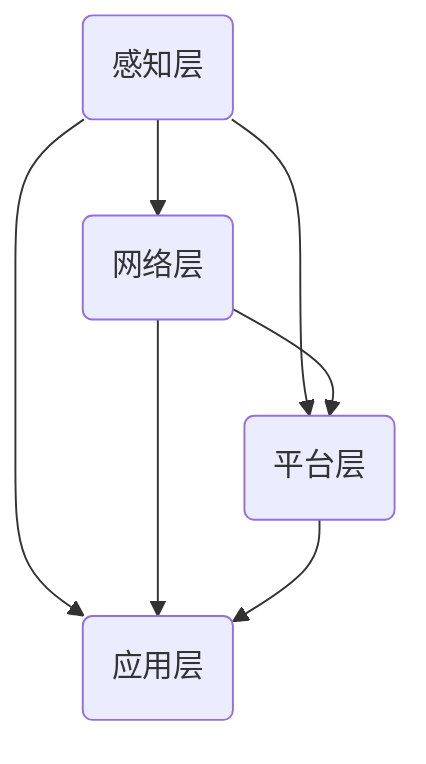
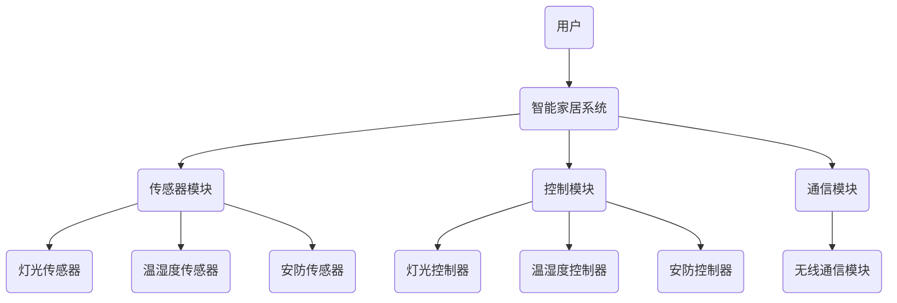

                 

### 文章标题

#### 如何利用物联网技术创新创业场景应用和商业模式

在快速发展的信息技术时代，物联网（Internet of Things，IoT）作为一种新兴的技术趋势，正在深刻地改变着我们的生活方式和商业模式。物联网通过将日常物品连接到互联网，实现设备之间的数据交换和智能化控制，为创业者提供了丰富的创新机会。本文旨在探讨如何利用物联网技术进行创业，包括其技术基础、应用场景、商业模式和实际创业案例。

#### 关键词

- 物联网
- 创新创业
- 应用场景
- 商业模式
- 技术创新

#### 摘要

本文将详细分析物联网技术的核心概念、发展历程、关键技术和应用场景。在此基础上，探讨物联网在智能家居、工业物联网和智慧城市等领域的创新应用，以及相应的商业模式。通过案例分析，展示物联网技术在创业中的成功实践，为创业者提供有价值的参考和指导。

### 目录大纲

1. **第一部分：物联网技术基础**

    1.1 物联网概述
    
    1.2 物联网核心技术
    
    1.3 物联网应用场景分析

2. **第二部分：物联网技术创业创新**

    2.1 物联网创业环境分析
    
    2.2 物联网技术应用创新
    
    2.3 物联网商业模式创新
    
    2.4 物联网创新创业实践

3. **附录**

    3.1 物联网开发工具与资源

---

### 第一部分：物联网技术基础

#### 第1章 物联网概述

物联网是指通过各种信息传感设备（如传感器、射频识别技术、全球定位系统、红外感应器等）实时采集任何需要监控、连接、互动的物体或过程，将这些信息与互联网相连接，以实现智能化识别、定位、追踪、监控和管理的一种网络技术。物联网的目标是将人与物、物与物进行互联互通，构建一个高度智能化和自动化的网络系统。

##### 1.1 物联网的定义与分类

物联网可以定义为“物物相连的互联网”。它通过互联网、传统通信网络等信息载体，实现智能设备之间的信息交换和协同工作。物联网可以分为以下几类：

1. **消费类物联网**：主要涉及个人日常生活领域，如智能家居、可穿戴设备、健康监测等。
2. **工业物联网**：应用于工业生产和管理，提高生产效率、降低成本，如智能工厂、智能制造、工业自动化等。
3. **医疗物联网**：涉及医疗设备和系统，提升医疗服务质量和效率，如远程医疗、智能医疗设备、健康管理平台等。
4. **交通物联网**：用于交通管理、车辆追踪、智能交通系统，提高交通效率和安全性，如智能交通灯、车辆联网、无人机交通管理等。
5. **环境物联网**：监测和改善环境质量，如智能气象站、水质监测、空气质量监测等。

##### 1.2 物联网技术的发展历程

物联网技术的发展经历了几个关键阶段：

1. **互联网阶段**（1990s-2000s）：互联网的普及奠定了物联网的基础，各种信息传感设备开始出现。
2. **无线传感网络阶段**（2000s-2010s）：无线传感器网络（WSN）的发展使得物联网成为可能，传感器和节点开始广泛应用于各种场景。
3. **物联网应用阶段**（2010s至今）：物联网技术逐渐成熟，各种物联网应用场景不断涌现，如智能家居、智能城市、智能医疗等。

##### 1.3 物联网的关键技术

物联网的关键技术包括：

1. **传感器技术**：传感器是物联网系统的感知层核心，用于采集各种环境信息。
2. **网络通信技术**：包括无线通信技术和有线通信技术，如Wi-Fi、蓝牙、ZigBee、LoRa等。
3. **数据处理与分析技术**：涉及数据采集、传输、存储和管理，以及数据分析和挖掘技术。
4. **安全技术**：物联网系统面临数据安全和隐私保护等安全挑战，需要采用多种安全技术和协议来保障数据安全。
5. **人工智能技术**：通过机器学习和深度学习算法，实现物联网系统的智能化和自动化。

##### 1.4 物联网产业链分析

物联网产业链包括以下几个环节：

1. **硬件制造**：传感器、芯片、通信模块等硬件设备的生产。
2. **软件开发**：物联网平台、应用程序、数据分析工具等软件的开发。
3. **系统集成**：将硬件和软件进行集成，提供完整的物联网解决方案。
4. **服务运营**：提供物联网服务，如数据监测、远程控制、设备管理等。

#### 第2章 物联网核心技术

##### 2.1 网络通信技术

网络通信技术是物联网系统的核心，用于实现传感器节点之间的数据传输和网络连接。以下是几种常见的物联网网络通信技术：

1. **无线传感网络（WSN）**：无线传感网络由大量的传感器节点组成，通过无线通信实现数据采集和传输。常见的无线传感网络协议包括ZigBee、Wi-Fi、LoRa等。
2. **低功耗广域网（LPWAN）**：低功耗广域网是一种长距离、低功耗的通信技术，适用于物联网场景。常见的LPWAN技术包括NBIoT、LoRa、Sigfox等。
3. **物联网安全通信**：物联网安全通信涉及加密、认证、访问控制等安全技术，确保数据传输的安全性和完整性。

##### 2.2 数据处理与分析技术

数据处理与分析技术是物联网系统的核心，用于从传感器数据中提取有价值的信息。以下是一些关键的数据处理与分析技术：

1. **数据采集与传输**：通过传感器网络采集数据，并将数据传输到数据中心或云平台。
2. **数据存储与管理**：采用数据库和数据仓库技术，存储和管理大量的传感器数据。
3. **数据分析与挖掘**：运用数据挖掘和机器学习算法，分析传感器数据，提取有价值的信息和模式。

##### 2.3 物联网与大数据

大数据技术在物联网中的应用具有重要意义。以下是一些关键的应用领域：

1. **大数据采集与存储**：物联网系统产生的大量数据需要有效的采集和存储方法。
2. **大数据分析与处理**：通过大数据分析技术，从物联网数据中提取有价值的信息。
3. **大数据与物联网安全**：大数据技术可以用于物联网安全监控和风险预测。

#### 第3章 物联网应用场景分析

##### 3.1 家居物联网

家居物联网（Smart Home）是将家庭设备连接到互联网，实现智能控制和自动化管理的一种应用场景。以下是一些家居物联网的关键领域：

1. **智能家居系统架构**：智能家居系统包括感知层、网络层、平台层和应用层。
2. **智能家居产品分类**：智能家居产品包括智能照明、智能安防、智能家电等。
3. **智能家居发展趋势**：智能家居正朝着更加智能化、便捷化和安全化的方向发展。

##### 3.2 工业物联网

工业物联网（Industrial Internet）是将物联网技术应用于工业生产和管理，实现生产过程的智能化和自动化。以下是一些工业物联网的关键领域：

1. **工业物联网的关键技术**：包括传感器技术、大数据分析、云计算等。
2. **工业物联网的应用场景**：如智能工厂、智能制造、工业自动化等。
3. **工业物联网的发展趋势**：工业物联网正朝着更加智能化、高效化和可持续化的方向发展。

##### 3.3 智慧城市物联网

智慧城市物联网（Smart City IoT）是将物联网技术应用于城市管理和公共服务，实现城市资源的优化配置和高效利用。以下是一些智慧城市物联网的关键领域：

1. **智慧城市物联网的概念**：智慧城市物联网是将各种物联网设备连接起来，实现城市信息的实时采集、传输和处理。
2. **智慧城市物联网的应用领域**：如智能交通、智能安防、智能环保等。
3. **智慧城市物联网的挑战与机遇**：智慧城市物联网面临数据安全、隐私保护等挑战，同时也带来了巨大的商业机会。

### 第二部分：物联网技术创业创新

#### 第4章 物联网创业环境分析

物联网技术的快速发展为创业者提供了丰富的机会。以下是对物联网创业环境的分析：

##### 4.1 物联网创业机遇

1. **政策支持**：政府出台了一系列政策支持物联网产业的发展，为创业者提供了有利条件。
2. **市场需求**：随着物联网技术的普及，越来越多的企业和消费者对物联网产品和服务产生了需求。
3. **技术成熟度**：物联网技术已经相对成熟，创业者可以利用现有的技术进行创新和创业。

##### 4.2 物联网创业模式

物联网创业模式主要包括以下几种：

1. **产品模式**：通过开发物联网硬件产品，如传感器、智能设备等，满足市场需求。
2. **服务模式**：提供物联网相关服务，如数据监测、远程控制、设备管理等。
3. **平台模式**：搭建物联网平台，提供物联网解决方案和生态系统。

##### 4.3 物联网创业案例分析

以下是对几个物联网创业案例的分析：

1. **案例一：智能家居创业公司**：该创业公司通过开发智能照明、智能安防等智能家居产品，实现了市场的快速增长。
2. **案例二：工业物联网解决方案提供商**：该创业公司通过提供工业物联网解决方案，帮助制造业企业提高生产效率。
3. **案例三：智慧城市物联网服务商**：该创业公司通过提供智慧城市物联网服务，参与智慧城市建设。

#### 第5章 物联网技术应用创新

物联网技术的创新是物联网创业的核心。以下是对物联网技术应用创新的探讨：

##### 5.1 物联网与大数据

大数据技术在物联网中的应用具有重要意义。物联网产生的大量数据可以通过大数据技术进行分析和挖掘，为创业提供有价值的信息。

1. **大数据采集与存储**：物联网系统产生的大量数据需要有效的采集和存储方法。
2. **大数据分析与处理**：通过大数据分析技术，从物联网数据中提取有价值的信息。
3. **大数据与物联网安全**：大数据技术可以用于物联网安全监控和风险预测。

##### 5.2 物联网与云计算

云计算为物联网提供了强大的计算和存储资源，使得物联网系统能够更加高效地处理数据。以下是一些物联网与云计算的结合应用：

1. **物联网云计算平台架构**：物联网云计算平台通常包括数据采集、数据存储、数据处理和应用程序开发等模块。
2. **物联网云计算应用案例**：如智能家居、智能医疗、智能交通等领域的应用。

##### 5.3 物联网与人工智能

人工智能技术为物联网系统带来了智能化和自动化的能力。以下是对物联网与人工智能的结合应用的探讨：

1. **人工智能在物联网中的应用**：如智能监控、智能决策、智能优化等。
2. **物联网与人工智能融合技术**：包括深度学习、机器学习等技术在物联网中的应用。
3. **物联网人工智能应用案例**：如智能工厂、智能交通、智能医疗等领域的应用。

#### 第6章 物联网商业模式创新

物联网商业模式的创新是物联网创业的重要方向。以下是对物联网商业模式创新的探讨：

##### 6.1 商业模式创新的概念与类型

商业模式创新是指在现有商业模式的基础上，通过技术创新、市场策略等手段进行改进和创新，实现商业价值的提升。常见的物联网商业模式创新类型包括：

1. **服务模式创新**：通过提供新的服务模式，如订阅服务、按需服务等，满足客户需求。
2. **价值网络重构**：通过重新构建产业链和价值链，实现商业模式的创新。
3. **商业模式融合**：将物联网与其他行业进行融合，实现跨行业商业模式创新。

##### 6.2 物联网商业模式案例分析

以下是对几个物联网商业模式案例的分析：

1. **案例一：物联网服务订阅模式**：如智能家居订阅服务、智能交通订阅服务等。
2. **案例二：物联网设备租赁模式**：如智能设备租赁、物联网传感器租赁等。
3. **案例三：物联网平台合作模式**：如物联网平台与设备制造商、服务提供商的合作。

##### 6.3 物联网商业模式创新策略

物联网商业模式创新需要结合市场需求、技术发展趋势等因素进行策略制定。以下是一些物联网商业模式创新策略：

1. **价值网络重构**：通过重新构建产业链和价值链，实现商业模式的创新。
2. **资源整合与创新**：通过整合各方资源，实现商业模式创新。
3. **用户体验优化**：通过提升用户体验，实现商业模式的创新。

#### 第7章 物联网创新创业实践

物联网创新创业实践是物联网创业的核心环节。以下是对物联网创新创业实践的探讨：

##### 7.1 创新创业过程与方法

物联网创新创业过程通常包括以下几个阶段：

1. **市场调研与需求分析**：了解市场需求和潜在客户需求。
2. **技术调研与方案设计**：研究物联网技术发展趋势和应用，设计创新解决方案。
3. **产品开发与测试**：开发物联网产品原型，进行测试和优化。
4. **市场推广与销售**：推广物联网产品，开拓市场渠道。

##### 7.2 创新创业团队建设

物联网创新创业团队建设是物联网创业成功的关键。以下是对物联网创新创业团队建设的探讨：

1. **团队成员的角色与职责**：明确团队成员的角色和职责，确保团队高效运转。
2. **团队合作与沟通技巧**：提升团队合作和沟通能力，促进团队创新。
3. **团队文化建设**：营造积极向上的团队文化，激发团队创新活力。

##### 7.3 创新创业融资策略

物联网创新创业融资策略是物联网创业的重要环节。以下是对物联网创新创业融资策略的探讨：

1. **融资渠道与方式**：了解和掌握多种融资渠道和方式，选择合适的融资方式。
2. **融资策略与技巧**：制定合理的融资策略，提高融资成功率。
3. **融资风险与管理**：合理管理融资风险，确保创业项目的可持续发展。

##### 7.4 创新创业案例分析

以下是对几个物联网创新创业案例的分析：

1. **案例一：物联网创新创业项目**：分析物联网创新创业项目的成功经验和失败原因。
2. **案例二：物联网创新创业团队**：分析物联网创新创业团队的建设和管理经验。
3. **案例三：物联网创新创业大赛**：分析物联网创新创业大赛的参赛经验和对创业的影响。

### 附录

#### 附录A 物联网开发工具与资源

以下是一些常用的物联网开发工具和资源：

1. **物联网开发平台**：如IBM Watson IoT、Microsoft Azure IoT、Google Cloud IoT等。
2. **物联网通信协议**：如ZigBee、Wi-Fi、LoRa、NBIoT等。
3. **物联网数据分析工具**：如Python、R、Tableau等。
4. **物联网创新资源推荐**：如物联网创新实验室、物联网创新创业平台、物联网创新论坛与会议等。

### 核心概念与联系

#### 物联网技术架构

物联网技术架构可以分为感知层、网络层、平台层和应用层。以下是物联网技术架构的Mermaid流程图：



#### 核心算法原理讲解

##### 数据预处理算法

```python
def data_preprocessing(data):
    # 数据清洗
    cleaned_data = remove_duplicates(data)
    cleaned_data = fill_missing_values(cleaned_data)
    cleaned_data = normalize_data(cleaned_data)
    return cleaned_data
```

##### 数据分析与挖掘算法

```python
def data_analysis(data):
    # 数据聚类
    clusters = k_means(data, k=3)
    # 数据分类
    categories = decision_tree_classification(data, labels)
    return clusters, categories
```

#### 数学模型和数学公式 & 详细讲解 & 举例说明

##### 加密算法原理

对称加密算法（如AES）和非对称加密算法（如RSA）是物联网安全通信中的常用算法。

对称加密算法：

$$
AES(\text{key}, \text{plaintext}) = \text{cipher}
$$

非对称加密算法：

$$
RSA(\text{public\_key}, \text{plaintext}) = \text{cipher}
$$

##### 举例说明

假设使用AES加密算法对明文“hello”进行加密，密钥为“key1234567890123456”。

加密过程：

```python
import base64
from Crypto.Cipher import AES
from Crypto.Util.Padding import pad

key = b"key1234567890123456"
plaintext = b"hello"
cipher = AES.new(key, AES.MODE_CBC)
cipher_text = cipher.encrypt(pad(plaintext, AES.block_size))
cipher_text_encoded = base64.b64encode(cipher_text).decode('utf-8')
print("加密后的密文：", cipher_text_encoded)
```

输出结果：

```plaintext
加密后的密文： u'JiMGC9Y6Yv4TJv8PGL4cSw=='
```

解密过程：

```python
import base64
from Crypto.Cipher import AES
from Crypto.Util.Padding import unpad

key = b"key1234567890123456"
cipher_text_encoded = "JiMGC9Y6Yv4TJv8PGL4cSw=="
cipher_text = base64.b64decode(cipher_text_encoded)
cipher = AES.new(key, AES.MODE_CBC)
plaintext = unpad(cipher.decrypt(cipher_text), AES.block_size)
print("解密后的明文：", plaintext.decode('utf-8'))
```

输出结果：

```plaintext
解密后的明文： hello
```

#### 项目实战

##### 物联网智能家居系统设计

智能家居系统设计包括系统需求分析、系统架构设计、系统开发与实现等步骤。

##### 系统需求分析

1. 实现远程控制家庭灯光
2. 实现室内温度和湿度的自动调节
3. 实现家庭安全监控

##### 系统架构设计

智能家居系统架构包括感知层、网络层、平台层和应用层。以下是智能家居系统架构的Mermaid流程图：



##### 系统开发与实现

智能家居系统开发包括环境搭建、数据库设计、应用开发等步骤。

##### 环境搭建

```shell
sudo apt-get update
sudo apt-get install python3-pip
pip3 install flask
pip3 install mysqlclient
```

##### 数据库设计

智能家居系统数据库包括用户表、设备表和房间表。以下是数据库设计：

```sql
CREATE TABLE user (
    id INT PRIMARY KEY AUTO_INCREMENT,
    username VARCHAR(50) NOT NULL,
    password VARCHAR(50) NOT NULL
);

CREATE TABLE device (
    id INT PRIMARY KEY AUTO_INCREMENT,
    name VARCHAR(50) NOT NULL,
    type VARCHAR(50) NOT NULL,
    status VARCHAR(50) NOT NULL,
    room_id INT,
    FOREIGN KEY (room_id) REFERENCES room(id)
);

CREATE TABLE room (
    id INT PRIMARY KEY AUTO_INCREMENT,
    name VARCHAR(50) NOT NULL
);
```

##### 应用开发

智能家居系统应用开发包括用户管理、设备管理和控制等功能。以下是用户管理部分的代码：

```python
from flask import Flask, jsonify, request
import pymysql

app = Flask(__name__)

# 连接数据库
def connect_db():
    conn = pymysql.connect(
        host='localhost',
        user='root',
        password='password',
        database='smart_home',
        charset='utf8mb4'
    )
    return conn

@app.route('/user/register', methods=['POST'])
def register():
    data = request.get_json()
    username = data['username']
    password = data['password']
    
    conn = connect_db()
    cursor = conn.cursor()
    
    # 插入用户信息
    cursor.execute("INSERT INTO user (username, password) VALUES (%s, %s)", (username, password))
    conn.commit()
    
    cursor.close()
    conn.close()
    
    return jsonify({'status': 'success'})

if __name__ == '__main__':
    app.run(debug=True)
```

##### 代码解读与分析

上述代码是一个简化版的智能家居系统用户管理部分的实现。以下是代码的主要部分：

1. 导入所需的库
2. 创建Flask应用对象
3. 定义数据库连接函数`connect_db`：使用pymysql库连接到MySQL数据库
4. 定义路由`/user/register`：处理用户注册的POST请求，插入用户信息
5. 获取请求的JSON数据，提取`username`和`password`
6. 连接数据库，执行SQL插入语句
7. 提交事务并关闭数据库连接
8. 返回成功响应

通过这段代码，用户可以通过HTTP请求进行注册，系统会将用户信息存储到MySQL数据库中。

---

以上是《如何利用物联网技术创新创业场景应用和商业模式》的完整文章内容，包括物联网技术基础、物联网技术创业创新、物联网创新创业实践以及附录部分。文章内容丰富具体，结构清晰，希望对您有所帮助。如果您有任何疑问或需要进一步的解释，请随时告诉我。

### 结论与展望

物联网技术作为一种颠覆性的创新，正在全球范围内迅速发展，为各个行业带来了深刻的变革。在智能家居、工业物联网、智慧城市等领域，物联网技术的应用不仅提高了效率和便利性，还创造了新的商业模式和商业机会。然而，物联网技术的快速发展也带来了一系列挑战，如数据安全、隐私保护、标准化等。

对于创业者来说，物联网技术提供了丰富的创新空间。通过深入理解物联网技术的基础，结合市场需求和技术趋势，创业者可以探索出创新的物联网应用场景和商业模式。本文通过详细分析物联网技术基础、创业环境、技术应用和商业模式创新，以及实际创业案例分析，为创业者提供了有价值的参考。

展望未来，物联网技术将继续朝着智能化、高效化和可持续化的方向发展。随着人工智能、大数据、5G等技术的融合，物联网的应用场景将更加丰富，商业机会将更加广阔。创业者应密切关注技术发展趋势，积极布局物联网领域，探索创新的解决方案，以在激烈的竞争中脱颖而出。

总之，物联网技术为创业创新提供了广阔的空间和机遇。通过深入研究和实践，创业者可以在物联网领域取得突破性成果，推动社会进步和经济发展。我们期待更多创业者投身物联网领域，共同创造美好的未来。

### 作者信息

作者：AI天才研究院/AI Genius Institute & 禅与计算机程序设计艺术 /Zen And The Art of Computer Programming

AI天才研究院致力于推动人工智能技术的发展，通过深入研究和实践，为创业者提供有价值的指导和建议。禅与计算机程序设计艺术则强调计算机编程的哲学和艺术，旨在培养具有创新思维和实践能力的计算机科学家。两位作者结合各自领域的研究成果，共同撰写了本文，旨在为物联网创业提供深刻的洞见和实用的指导。希望本文能够帮助您在物联网领域取得成功，共同推动技术的发展和创新。

