                 

## 如何打造知识付费的企业培训业务

### 关键词：知识付费、企业培训、培训业务模式、内容生产、用户管理、财务模型

### 摘要：

本文旨在深入探讨如何打造知识付费的企业培训业务。我们将从市场分析、产品设计与开发、内容生产与质量控制、用户管理与课程管理、财务与运营管理等多个方面进行详细解析。通过案例分析，我们将展示成功经验，并展望知识付费企业培训的未来发展趋势。文章以逻辑清晰、结构紧凑、简单易懂的专业技术语言，为广大企业和培训从业者提供有价值的参考和指导。

---

### 第一部分：知识付费的企业培训业务概述

#### 第1章：知识付费与企业培训市场分析

##### 1.1 知识付费的发展历程

知识付费是指用户通过支付一定费用获取有价值知识内容的一种商业模式。它起源于互联网时代，随着网络技术和在线教育平台的兴起，逐渐成为一种主流的获取知识的方式。知识付费的发展历程大致可以分为以下几个阶段：

1. **萌芽阶段**（2000年代初）：互联网普及，用户开始通过在线平台获取知识，但付费模式尚未普及。
2. **探索阶段**（2010年-2015年）：在线教育平台崛起，知识付费逐渐受到关注，但市场尚未形成规模。
3. **发展期**（2015年至今）：移动互联网普及，知识付费市场迅速扩大，成为教育培训行业的重要组成部分。

##### 1.2 知识付费的发展趋势

随着互联网技术的不断进步和用户需求的多样化，知识付费市场呈现出以下发展趋势：

1. **个性化学习**：用户可以根据自己的需求和学习进度，选择适合自己的知识内容。
2. **高质量内容**：内容提供商越来越注重内容的品质，以提升用户满意度。
3. **多元化平台**：知识付费平台逐渐增多，涵盖教育、技能培训、知识分享等多个领域。
4. **跨界合作**：知识付费与电子商务、社交媒体等领域逐渐融合，形成新的商业模式。

##### 1.3 知识付费在教育培训行业的应用

知识付费在教育培训行业具有广泛的应用，主要包括以下几个方面：

1. **在线课程销售**：教育培训机构通过在线平台销售课程，实现知识付费。
2. **会员订阅**：用户支付一定费用成为会员，享受平台提供的所有课程。
3. **知识共享**：专业人才通过平台分享自己的经验和知识，获取收益。
4. **企业培训**：企业购买培训课程，为员工提供系统性的培训服务。

##### 1.4 企业培训市场的需求分析

企业培训市场在近年来呈现出快速增长的趋势，原因如下：

1. **人力资本投资**：企业越来越重视员工培训，以提高员工的综合素质和工作效率。
2. **技能需求变化**：随着技术发展，企业对员工的技能要求不断提升，需要通过培训来满足这些需求。
3. **市场竞争压力**：企业通过培训提升竞争力，以在激烈的市场环境中立于不败之地。

##### 1.5 知识付费对企业培训市场的影响

知识付费对企业培训市场产生了深远的影响，主要体现在以下几个方面：

1. **培训模式变革**：传统线下培训逐渐向线上知识付费模式转变，提高了培训的便捷性和效率。
2. **培训内容创新**：知识付费平台为教育培训机构提供了丰富的内容资源，促进了培训内容的创新。
3. **培训成本降低**：线上知识付费降低了企业的培训成本，使得更多企业能够承担培训费用。
4. **用户需求满足**：知识付费平台能够更好地满足用户的个性化需求，提高用户满意度。

##### 1.6 企业培训业务模式解析

企业培训业务模式可以分为以下几种：

1. **传统培训模式**：线下集中授课，费用较高，培训效果受时间、地点限制。
2. **在线培训模式**：线上课程学习，灵活方便，培训成本较低。
3. **混合培训模式**：结合线上线下优势，实现培训效果最大化。
4. **知识付费模式**：企业购买知识付费平台的课程，为员工提供系统培训。

##### 1.7 构建知识付费的企业培训业务框架

构建知识付费的企业培训业务框架需要考虑以下几个方面：

1. **确定培训目标与内容**：根据企业需求和员工技能短板，确定培训目标和课程内容。
2. **设计培训课程体系**：设计合理的课程体系，确保培训内容的全面性和系统性。
3. **实施培训过程**：采用线上线下相结合的方式，确保培训过程的顺利进行。
4. **评估培训效果**：通过考核和反馈机制，评估培训效果，优化培训方案。

---

在第一部分，我们详细分析了知识付费的发展历程、市场趋势以及其在教育培训行业的应用，并对企业培训市场的需求、影响和业务模式进行了深入探讨。接下来，我们将进一步探讨知识付费产品的设计与开发，为打造成功的知识付费企业培训业务奠定基础。

---

### 第二部分：知识付费产品设计与开发

#### 第2章：知识付费产品设计与开发

##### 2.1 知识付费产品概述

知识付费产品是指通过付费方式获取的知识内容，它涵盖了在线课程、电子书、音频讲座、视频教程等多种形式。与普通培训产品相比，知识付费产品具有以下特点：

1. **付费模式**：用户需支付一定费用才能获取知识内容，而普通培训产品可能免费或低价。
2. **内容形式**：知识付费产品以数字化形式为主，方便用户随时随地进行学习。
3. **个性化**：知识付费产品可以根据用户需求进行定制，满足个性化学习需求。
4. **持续更新**：知识付费产品需要不断更新内容，以保持用户活跃度和市场竞争力。

##### 2.2 知识付费产品设计原则

在设计知识付费产品时，应遵循以下原则：

1. **用户需求导向**：深入了解用户需求，设计符合用户期待的产品。
2. **内容质量**：确保知识内容的专业性和实用性，提升用户满意度。
3. **用户体验**：优化用户界面和交互设计，提高用户使用体验。
4. **盈利模式**：设计合理的盈利模式，确保产品能够实现可持续发展。

##### 2.3 知识付费产品的开发流程

知识付费产品的开发流程可以分为以下阶段：

1. **市场调研**：了解市场需求和竞争态势，确定产品方向。
2. **产品策划**：明确产品定位、目标用户和功能需求。
3. **产品设计**：绘制产品原型图，制定详细的设计方案。
4. **产品开发**：编写代码，实现产品功能。
5. **产品测试**：进行功能测试和性能测试，确保产品质量。

##### 2.4 知识付费产品的盈利模式

知识付费产品的盈利模式主要包括以下几种：

1. **订阅模式**：用户支付订阅费用，定期获取知识内容。
2. **课程销售模式**：用户购买单个课程，一次性获取知识内容。
3. **会员模式**：用户支付会员费用，享受平台提供的所有课程。
4. **广告模式**：在知识内容中插入广告，通过广告收入获取盈利。

##### 2.5 知识付费产品的运营策略

知识付费产品的运营策略包括以下几个方面：

1. **内容运营**：持续更新优质内容，提升用户粘性。
2. **用户运营**：通过活动、互动等方式，提升用户满意度和忠诚度。
3. **渠道运营**：拓展销售渠道，增加产品曝光度和用户获取量。
4. **数据分析**：通过数据分析，优化运营策略，提升产品盈利能力。

##### 2.6 知识付费产品的案例分析

以某知名在线教育平台为例，该平台通过以下策略实现了知识付费产品的成功：

1. **产品定位**：针对职场人士，提供职业发展、技能提升等领域的课程。
2. **内容质量**：与业内专家合作，确保课程内容的专业性和实用性。
3. **用户体验**：提供灵活的学习方式和便捷的支付方式，提升用户满意度。
4. **运营策略**：通过优惠活动、推荐系统等手段，增加用户粘性和购买意愿。

通过以上分析，我们可以看到，知识付费产品在设计与开发过程中，需要充分考虑用户需求、内容质量、用户体验和盈利模式等因素。只有在这些方面取得突破，才能打造出具有市场竞争力的知识付费产品。

---

在第二部分，我们详细介绍了知识付费产品的概述、设计原则、开发流程、盈利模式和运营策略。接下来，我们将探讨知识付费内容的生产与质量控制，以确保知识付费产品的品质和用户满意度。

---

### 第三部分：知识付费内容生产与质量控制

#### 第3章：知识付费内容生产与质量控制

##### 3.1 知识付费内容生产流程

知识付费内容的生产流程主要包括以下步骤：

1. **内容采集**：从各种渠道收集优质的知识内容，如专家讲座、行业报告、学术论文等。
2. **内容筛选与分类**：对采集到的内容进行筛选和分类，确保内容的准确性和相关性。
3. **内容编辑与创作**：对筛选后的内容进行编辑和创作，使其符合用户需求和知识付费产品的特点。
4. **内容发布与更新**：将制作完成的内容发布到平台，并定期进行更新，以保持内容的新鲜度和时效性。

##### 3.2 知识付费内容质量控制

知识付费内容的质量是影响用户满意度和平台口碑的关键因素。为了确保内容质量，需要从以下几个方面进行控制：

1. **内容准确性控制**：确保知识内容准确无误，避免误导用户。
2. **内容时效性控制**：及时更新内容，反映行业最新动态和技术发展。
3. **内容完整性控制**：保证知识内容完整，避免遗漏关键信息。
4. **内容合规性控制**：遵循相关法律法规和平台规定，避免涉及敏感内容。

##### 3.3 建立知识付费内容库

建立知识付费内容库是知识付费平台的重要组成部分，它有助于实现内容的系统化管理、检索和利用。以下是如何建立知识付费内容库的建议：

1. **内容库设计原则**：内容库设计应遵循科学、合理、便捷的原则，确保内容结构清晰、易于检索。
2. **内容库管理系统**：采用专业的内容库管理系统，实现内容的分类、归档、检索和更新等功能。
3. **内容库的维护与更新**：定期对内容库进行维护和更新，确保内容的准确性和时效性。

##### 3.4 知识付费内容的营销推广

知识付费内容的营销推广是吸引用户、提升品牌知名度的重要手段。以下是一些有效的营销推广策略：

1. **营销渠道选择**：根据目标用户的特点，选择合适的营销渠道，如社交媒体、搜索引擎、内容平台等。
2. **营销策略制定**：制定针对性的营销策略，如内容营销、活动营销、用户互动等。
3. **营销效果评估**：通过数据分析，评估营销活动的效果，优化营销策略。

##### 3.5 知识付费内容的生产成本与收益分析

知识付费内容的生产成本主要包括人力成本、内容制作成本和营销推广成本等。以下是如何进行生产成本与收益分析的建议：

1. **成本分析**：详细计算知识付费内容的生产成本，包括编写、录制、编辑、发布等环节的费用。
2. **收益模型**：根据知识付费产品的定价和销售情况，构建收益模型，预测未来收益。
3. **成本控制**：通过优化内容生产流程和降低成本，提高知识付费产品的盈利能力。

##### 3.6 知识付费内容的质量评估与用户反馈

知识付费内容的质量评估是确保内容品质的重要环节。以下是一些质量评估与用户反馈的建议：

1. **质量评估标准**：制定科学的质量评估标准，包括内容准确性、完整性、实用性等方面。
2. **用户反馈机制**：建立用户反馈机制，收集用户意见和建议，及时改进内容。
3. **用户满意度调查**：定期进行用户满意度调查，了解用户对知识付费内容的评价，优化内容质量。

通过以上分析，我们可以看到，知识付费内容的生产与质量控制是知识付费业务的核心环节。只有确保内容质量，才能赢得用户的信任和忠诚，实现知识付费业务的可持续发展。

---

在第三部分，我们详细介绍了知识付费内容的生产流程、质量控制、内容库建立、营销推广、成本与收益分析以及用户反馈机制。接下来，我们将探讨知识付费的企业培训运营与管理，为知识付费业务的成功运营提供保障。

---

### 第四部分：知识付费的企业培训运营与管理

#### 第4章：企业培训用户管理

##### 4.1 用户管理体系构建

构建企业培训用户管理体系是确保知识付费业务顺利运行的基础。以下是如何构建用户管理体系的关键步骤：

1. **用户注册与认证**：为用户提供便捷的注册方式，确保用户身份的真实性和合法性。
2. **用户信息管理**：建立用户信息数据库，记录用户的基本信息和培训记录，便于后续管理和分析。
3. **用户权益管理**：明确用户权益，如课程学习权限、售后服务等，确保用户满意度。

##### 4.2 用户行为分析

用户行为分析是了解用户需求、优化培训内容和提高用户满意度的关键。以下是如何进行用户行为分析的建议：

1. **用户行为数据分析**：通过数据收集和分析，了解用户的学习行为、偏好和反馈。
2. **用户需求分析**：根据用户行为数据，分析用户需求，为课程设计和优化提供依据。
3. **用户行为预测**：利用大数据和人工智能技术，预测用户未来行为，提前进行课程推荐和用户服务。

##### 4.3 用户关系管理

用户关系管理是提升用户满意度和忠诚度的重要手段。以下是如何进行用户关系管理的建议：

1. **用户满意度调查**：定期进行用户满意度调查，了解用户对培训内容和服务的评价，及时改进。
2. **用户反馈机制**：建立用户反馈渠道，及时收集和处理用户意见和建议，提升用户满意度。
3. **用户忠诚度提升策略**：通过优惠活动、会员制度、定制服务等方式，提升用户忠诚度。

##### 4.4 用户运营策略

用户运营策略是确保知识付费业务持续发展的关键。以下是如何制定用户运营策略的建议：

1. **用户精细化运营**：根据用户画像和行为数据，实施个性化运营策略，提升用户活跃度和购买意愿。
2. **用户增长策略**：通过内容营销、渠道拓展、合作伙伴关系等手段，实现用户增长。
3. **用户留存策略**：通过优质内容、用户服务、社群互动等方式，提升用户留存率。

##### 4.5 用户数据分析与运营优化

用户数据分析是优化用户运营策略的重要依据。以下是如何进行用户数据分析与运营优化的建议：

1. **用户数据分析**：通过数据分析，了解用户行为、需求和满意度，为运营策略优化提供数据支持。
2. **运营效果评估**：定期评估运营策略的效果，分析成功和失败的原因，调整和优化运营策略。
3. **数据驱动的运营**：基于数据分析，实施数据驱动的运营策略，提高运营效率和效果。

##### 4.6 用户管理与课程管理的协同

用户管理与课程管理是知识付费企业培训业务的重要组成部分，两者之间的协同至关重要。以下是如何实现用户管理与课程管理的协同：

1. **课程设计与用户需求结合**：在课程设计过程中，充分考虑用户需求，确保课程内容与用户实际需求相符。
2. **用户反馈与课程优化**：通过用户反馈，及时调整和优化课程内容，提升课程质量。
3. **用户数据与课程评估**：利用用户数据，对课程效果进行评估，为课程改进提供依据。

通过以上分析，我们可以看到，企业培训用户管理是知识付费业务成功的关键环节。只有深入了解用户需求，优化用户管理策略，才能实现知识付费业务的可持续发展。

---

在第四部分，我们详细介绍了企业培训用户管理的构建、用户行为分析、用户关系管理、用户运营策略、用户数据分析与运营优化以及用户管理与课程管理的协同。接下来，我们将探讨知识付费财务与运营管理，为知识付费企业的财务健康和运营效率提供指导。

---

### 第五部分：知识付费财务与运营管理

#### 第5章：知识付费财务与运营管理

##### 5.1 知识付费财务模型

知识付费财务模型是评估知识付费企业财务状况、预测未来收益和制定经营策略的重要工具。以下是如何构建知识付费财务模型的步骤：

1. **成本分析**：详细计算知识付费业务的生产成本，包括人力成本、内容制作成本、营销推广成本等。
2. **收入模型**：根据知识付费产品的定价策略和销售情况，构建收入模型，预测未来收入。
3. **盈利分析**：通过成本和收入分析，计算知识付费业务的净利润，评估盈利能力。

##### 5.2 知识付费成本控制

成本控制是提高知识付费企业盈利能力的关键。以下是如何进行知识付费成本控制的建议：

1. **人力成本控制**：通过优化组织结构、提高员工效率、合理配置人力资源等手段，降低人力成本。
2. **物料成本控制**：精选供应商、批量采购、降低库存等手段，降低物料成本。
3. **营销成本控制**：合理规划营销预算，提高营销效率，降低营销成本。

##### 5.3 数据分析与运营优化

数据分析是优化知识付费企业运营策略的重要手段。以下是如何进行数据分析与运营优化的建议：

1. **用户数据分析**：通过数据分析，了解用户行为、需求和满意度，为运营策略优化提供数据支持。
2. **营销数据分析**：通过数据分析，评估营销活动的效果，优化营销策略。
3. **课程数据分析**：通过数据分析，评估课程效果，为课程改进提供依据。

##### 5.4 运营策略调整

运营策略调整是确保知识付费企业持续发展的关键。以下是如何制定运营策略调整的建议：

1. **市场动态调整**：根据市场变化，及时调整运营策略，以适应市场需求。
2. **竞争对手分析**：通过分析竞争对手的运营策略，发现差距和机遇，优化自身运营策略。
3. **产品迭代**：根据用户反馈和市场趋势，不断迭代产品，提升产品竞争力。

##### 5.5 数据驱动的运营决策

数据驱动的运营决策是提高知识付费企业运营效率的重要手段。以下是如何进行数据驱动的运营决策的建议：

1. **数据收集**：通过多种渠道收集用户数据、营销数据、课程数据等，为运营决策提供数据支持。
2. **数据整理**：对收集到的数据进行整理和分析，提取有用的信息。
3. **数据应用**：将分析结果应用于运营决策，优化运营策略，提高运营效率。

##### 5.6 知识付费财务与运营管理的协同

知识付费财务与运营管理是知识付费企业成功的关键环节，两者之间的协同至关重要。以下是如何实现知识付费财务与运营管理的协同的建议：

1. **数据共享**：建立数据共享机制，确保财务部门和运营部门能够及时获取对方的数据。
2. **目标协同**：明确财务目标和运营目标，确保两者相互支持，共同实现企业的发展目标。
3. **信息沟通**：加强财务部门和运营部门之间的信息沟通，确保运营策略能够得到财务部门的认可和支持。

通过以上分析，我们可以看到，知识付费财务与运营管理是知识付费企业成功的关键。只有通过科学的财务模型、有效的成本控制、数据驱动的运营优化和运营策略调整，才能实现知识付费企业的可持续发展。

---

在第五部分，我们详细介绍了知识付费财务模型、成本控制、数据分析与运营优化、运营策略调整以及数据驱动的运营决策。接下来，我们将通过实际案例，探讨知识付费企业培训的成功经验和挑战。

---

### 第六部分：知识付费的企业培训案例分析

#### 第6章：成功案例分析

##### 6.1 案例一：在线教育平台知识付费业务

**案例背景：** 某在线教育平台是一家专注于职业培训和技能提升的在线教育平台。通过知识付费模式，平台为用户提供各类在线课程，涵盖职业发展、技能提升、兴趣爱好等多个领域。

**业务模式：** 平台采用会员订阅模式，用户支付订阅费用，即可享受平台提供的所有课程。同时，平台还提供单课程购买、课程包购买等多种付费方式，以满足不同用户的需求。

**成功经验：**

1. **精准定位用户需求**：平台通过市场调研和用户反馈，深入了解用户需求，提供针对性的课程内容。
2. **高质量内容**：平台与业内专家和知名培训机构合作，确保课程内容的专业性和实用性。
3. **用户体验优化**：平台提供灵活的学习方式和便捷的支付方式，提升用户满意度。
4. **营销策略多样化**：通过内容营销、活动营销、合作伙伴关系等多种营销手段，提高用户获取量和留存率。

**挑战与应对：**

1. **竞争压力**：在线教育市场竞争激烈，平台需要不断提升课程质量和用户体验，以保持竞争力。
2. **内容更新速度**：平台需要不断更新课程内容，以跟上行业发展和用户需求的变化。

**成果评估：** 平台在知识付费领域取得了显著成果，用户数量持续增长，收入逐年提高。通过不断优化课程内容和运营策略，平台在市场竞争中逐渐脱颖而出。

##### 6.2 案例二：企业内部培训知识付费

**案例背景：** 某大型企业为了提升员工技能和职业素养，决定采用知识付费模式进行内部培训。企业通过购买外部优质课程，为员工提供系统性的培训服务。

**培训内容：** 企业购买了涵盖职场技能、项目管理、团队协作、技术技能等多个领域的课程，以满足员工在不同方面的培训需求。

**成果评估：**

1. **员工满意度提升**：通过知识付费培训，员工技能水平得到了显著提高，员工满意度提升。
2. **工作效率提升**：培训课程的内容实用性强，有助于提升员工的工作效率。
3. **企业竞争力提升**：通过内部培训，企业员工的整体素质得到了提升，企业竞争力得到增强。

**挑战与应对：**

1. **培训费用**：企业需要承担一定的培训费用，需要平衡培训成本和收益。
2. **员工参与度**：部分员工可能对培训内容不感兴趣，需要提高员工的参与度和积极性。

##### 6.3 案例三：专业培训机构的转型之路

**案例背景：** 某专业培训机构在传统线下培训市场面临激烈竞争，为了实现可持续发展，决定转型为知识付费模式。

**转型策略：**

1. **线上课程开发**：培训机构投入资源，开发线上课程，以满足用户对便捷学习的需求。
2. **多元化平台合作**：与多家在线教育平台合作，拓宽课程销售渠道。
3. **用户体验优化**：通过优化课程内容、学习方式和互动体验，提升用户满意度。

**业务发展：**

1. **用户数量增长**：转型后，培训机构用户数量大幅增长，实现了线上和线下的双赢。
2. **收入结构优化**：知识付费业务成为培训机构的主要收入来源，收入结构得到优化。

**挑战与机遇：**

1. **内容创新**：培训机构需要不断更新课程内容，以适应市场需求。
2. **技术变革**：随着新技术的发展，培训机构需要不断探索新的业务模式，实现可持续发展。

通过以上案例分析，我们可以看到，知识付费在企业培训领域具有广阔的应用前景。无论是在线教育平台、企业内部培训，还是专业培训机构，通过不断创新和优化，都可以实现知识付费业务的成功。

---

在第六部分，我们通过三个实际案例，展示了知识付费在企业培训业务中的成功经验和挑战。接下来，我们将探讨知识付费的未来发展趋势。

---

### 第七部分：知识付费的未来发展趋势

#### 第7章：知识付费的未来发展趋势

##### 8.1 科技创新与知识付费

随着科技的不断发展，知识付费领域也将迎来一系列变革。以下是一些科技创新对知识付费的影响：

1. **人工智能**：人工智能技术在知识付费中的应用越来越广泛，如个性化推荐、智能客服等。通过人工智能技术，平台可以更精准地满足用户需求，提升用户体验。
2. **大数据**：大数据技术可以帮助知识付费平台更好地了解用户行为和需求，优化课程内容和服务策略。同时，大数据分析还能为知识付费企业提供市场趋势预测和竞争分析。
3. **区块链**：区块链技术具有去中心化、不可篡改等特点，可以应用于知识付费领域的版权保护、交易记录等环节，提高知识付费业务的透明度和安全性。

##### 8.2 行业法规与知识付费

随着知识付费市场的快速发展，行业法规也在不断健全。以下是一些法规对知识付费业务的影响：

1. **知识产权保护**：知识付费业务涉及大量版权问题，需要遵循相关法律法规，保护知识内容创作者的合法权益。
2. **用户隐私保护**：知识付费平台需要严格遵守用户隐私保护法规，确保用户个人信息的安全。
3. **市场监管**：政府加强对知识付费市场的监管，规范市场秩序，保障用户权益。

##### 8.3 知识付费的未来方向

展望未来，知识付费领域将呈现以下发展趋势：

1. **个性化学习**：随着人工智能和大数据技术的发展，个性化学习将成为知识付费的重要方向。平台可以根据用户需求和学习行为，提供定制化的课程和学习方案。
2. **跨界合作**：知识付费将与更多行业和领域进行跨界合作，如电子商务、社交媒体等，形成新的商业模式。
3. **社交化学习**：知识付费平台将注重用户互动和社交功能，通过社群、论坛等方式，促进用户间的交流和合作。
4. **可持续发展**：知识付费企业需要关注社会责任，推动知识付费业务的可持续发展，如环保、公益等。

##### 8.4 挑战与机遇

知识付费的未来发展既面临挑战，也充满机遇：

1. **挑战**：随着市场竞争的加剧，知识付费企业需要不断创新，提升课程质量和用户体验。同时，行业法规的完善也将对知识付费企业提出更高的要求。
2. **机遇**：科技创新和行业变革为知识付费企业提供了新的发展机遇，如人工智能、大数据、区块链等技术的应用，将为知识付费业务带来更多可能性。

通过以上分析，我们可以看到，知识付费在未来将继续保持快速发展，并迎来更多创新和变革。知识付费企业需要紧跟科技发展趋势，积极应对挑战，抓住机遇，实现可持续发展。

---

在第七部分，我们探讨了知识付费的未来发展趋势，包括科技创新、行业法规以及个性化学习、跨界合作、社交化学习等方向。接下来，我们将通过附录部分，提供知识付费工具与资源，为读者提供实用的参考。

---

### 附录

#### 附录A：知识付费工具与资源

##### A.1 知识付费平台介绍

以下是一些知名的知识付费平台，介绍它们的特点、服务内容和用户评价：

1. **得到**：特点：内容丰富，包括音频课程、电子书等；服务内容：提供知识付费课程，涵盖职场、投资、生活等多个领域；用户评价：用户满意度高，课程质量好。
2. **知乎Live**：特点：用户参与度高，互动性强；服务内容：提供专家讲座、问答等知识服务；用户评价：知识性、实用性高，用户互动体验好。
3. **网易云课堂**：特点：课程多样，包括编程、设计、语言等；服务内容：提供在线课程，支持学习进度跟踪和证书认证；用户评价：课程质量高，学习体验好。

##### A.2 知识付费相关资源

以下是一些知识付费相关的开源工具、有偿资源和社区资源，供读者参考：

1. **开源工具**：
   - **Jekyll**：一款基于 GitHub Pages 的静态网站生成工具，可用于搭建知识付费网站。
   - **WordPress**：一款功能强大的内容管理系统，适合搭建知识付费平台。
2. **有偿资源**：
   - **知识星球**：提供付费社群服务，用户可以加入不同领域的社群，与专家互动学习。
   - **腾讯课堂**：提供在线课程销售服务，支持多种课程销售模式。
3. **社区资源**：
   - **Stack Overflow**：一个庞大的程序员社区，提供各种编程问题的解答。
   - **Coursera**：提供大量在线课程，涵盖多个学科领域，部分课程免费。

##### A.3 知识付费法规与政策

以下是一些与知识付费相关的法规和政策，供读者参考：

1. **知识产权保护**：
   - **《著作权法》**：规定了著作权人的权利和义务，保护创作者的合法权益。
   - **《知识产权海关保护条例》**：加强对知识产权的保护，防止侵权行为。
2. **用户隐私保护**：
   - **《个人信息保护法》**：规定了个人信息收集、使用和保护的规则，保障用户隐私。
   - **《网络安全法》**：明确网络运营者的责任和义务，保护用户信息安全。
3. **市场监管**：
   - **《在线教育服务管理暂行办法》**：规范在线教育服务，保障用户权益。
   - **《网络信息内容生态治理规定》**：规范网络信息内容发布，维护网络生态秩序。

##### A.4 知识付费行业报告

以下是一些知识付费行业报告，供读者了解行业发展趋势和市场动态：

1. **《2022年中国知识付费行业研究报告》**：详细分析了知识付费市场的发展现状、用户需求和行业趋势。
2. **《2021年中国在线教育行业年度报告》**：涵盖在线教育行业的市场规模、用户行为和市场竞争等方面。
3. **《2022年中国教育培训行业白皮书》**：提供了教育培训行业的市场概况、发展机遇和挑战。

通过以上附录内容，读者可以了解知识付费领域的实用工具、法规政策、行业报告等资源，为知识付费业务的开展提供参考。

---

在附录部分，我们提供了知识付费平台介绍、相关资源、法规政策以及行业报告，以供读者参考。接下来，我们将通过Mermaid流程图，展示知识付费企业培训业务的整体框架。

---

### Mermaid 流程图

以下是一个展示知识付费企业培训业务整体框架的Mermaid流程图：

```mermaid
graph TD
    A[知识付费业务框架] --> B[市场分析]
    A --> C[产品设计与开发]
    A --> D[内容生产与质量控制]
    A --> E[用户管理与课程管理]
    A --> F[财务与运营管理]
    A --> G[案例分析]
    A --> H[未来发展趋势]

    B --> I[市场调研]
    B --> J[需求分析]
    B --> K[业务模式解析]

    C --> L[产品设计原则]
    C --> M[开发流程]
    C --> N[盈利模式]
    C --> O[运营策略]

    D --> P[内容生产流程]
    D --> Q[质量控制]
    D --> R[内容库构建]
    D --> S[营销推广]

    E --> T[用户管理体系]
    E --> U[用户行为分析]
    E --> V[用户关系管理]
    E --> W[课程管理体系]

    F --> X[财务模型]
    F --> Y[成本控制]
    F --> Z[数据分析与运营优化]

    G --> AA[在线教育平台案例]
    G --> AB[企业内部培训案例]
    G --> AC[培训机构转型案例]

    H --> AF[科技创新影响]
    H --> AG[行业法规影响]
    H --> AH[未来发展趋势预测]
```



在这个流程图中，我们展示了知识付费企业培训业务的主要组成部分和它们之间的关联。从市场分析开始，通过产品设计与开发、内容生产与质量控制、用户管理与课程管理、财务与运营管理等环节，最终形成完整的知识付费企业培训业务框架。同时，我们也考虑了案例分析、未来发展趋势等关键因素，以帮助企业和从业者更好地规划和实施知识付费业务。

---

通过Mermaid流程图，我们清晰地展示了知识付费企业培训业务的整体框架和各环节之间的关联。接下来，我们将通过核心算法原理讲解，进一步深入探讨知识付费用户行为预测模型。

---

### 核心算法原理讲解

在知识付费领域，用户行为预测是一个重要的研究方向。它可以帮助平台更好地了解用户需求，提供个性化的推荐和服务，从而提高用户满意度和平台收益。以下是一个基于逻辑回归的用户行为预测算法的原理讲解，包括伪代码和数学模型。

#### 逻辑回归模型原理

逻辑回归是一种广泛用于二分类问题的统计模型，它可以预测某个事件发生的概率。在知识付费用户行为预测中，我们可以使用逻辑回归模型预测用户是否会对某一课程进行购买、学习或者评价。

逻辑回归模型的数学表达式如下：

$$
\text{logit}(p) = \log\left(\frac{p}{1-p}\right) = \beta_0 + \beta_1x_1 + \beta_2x_2 + ... + \beta_nx_n
$$

其中：
- \( \text{logit}(p) \) 是事件发生概率的对数几率。
- \( p \) 是事件发生的概率。
- \( \beta_0 \) 是截距。
- \( \beta_1, \beta_2, ..., \beta_n \) 是模型参数。
- \( x_1, x_2, ..., x_n \) 是特征向量。

通过上面的公式，我们可以将事件发生的概率转换为线性组合的特征值。

#### 伪代码实现

以下是一个简单的用户行为预测算法的伪代码实现：

```python
# 伪代码：知识付费用户行为预测算法

# 输入：
# user_data: 用户数据（包括特征和标签）
# feature_set: 特征集
# model: 逻辑回归模型

# 输出：
# predictions: 用户行为预测结果

def predict_user_behavior(user_data, feature_set, model):
    # 预处理用户数据
    processed_data = preprocess_user_data(user_data)
    
    # 提取特征
    features = extract_features(processed_data, feature_set)
    
    # 进行预测
    predictions = model.predict(features)
    
    return predictions

# 预处理用户数据
def preprocess_user_data(user_data):
    # 清洗数据
    cleaned_data = clean_data(user_data)
    # 标准化数据
    normalized_data = normalize_data(cleaned_data)
    return normalized_data

# 提取特征
def extract_features(processed_data, feature_set):
    features = []
    for feature in feature_set:
        feature_value = processed_data[feature]
        features.append(feature_value)
    return features

# 创建逻辑回归模型并进行训练
def train_model(training_data, feature_set):
    # 提取特征和标签
    X = training_data[feature_set]
    y = training_data['target']
    # 创建模型
    model = LogisticRegression()
    # 训练模型
    model.fit(X, y)
    return model

# 加载预训练的模型
def load_model(model_path):
    # 加载模型
    model = joblib.load(model_path)
    return model

# 主程序
if __name__ == "__main__":
    # 加载数据
    user_data = load_user_data()
    # 确定特征集
    feature_set = ['feature1', 'feature2', 'feature3']
    # 训练模型
    model = train_model(user_data, feature_set)
    # 进行预测
    predictions = predict_user_behavior(user_data, feature_set, model)
    print("User Behavior Predictions:", predictions)
```

#### 数学模型与公式

逻辑回归模型的损失函数通常使用对数损失（Log Loss），其公式如下：

$$
J(\beta) = -\frac{1}{m} \sum_{i=1}^{m} y_i \log(\hat{y}_i) + (1 - y_i) \log(1 - \hat{y}_i)
$$

其中：
- \( J(\beta) \) 是损失函数。
- \( m \) 是样本数量。
- \( y_i \) 是第 \( i \) 个样本的真实标签。
- \( \hat{y}_i \) 是第 \( i \) 个样本的预测概率。

为了优化模型参数 \( \beta \)，我们可以使用梯度下降法，其迭代公式如下：

$$
\beta_j := \beta_j - \alpha \frac{\partial J}{\partial \beta_j}
$$

其中：
- \( \alpha \) 是学习率。
- \( \frac{\partial J}{\partial \beta_j} \) 是损失函数关于 \( \beta_j \) 的偏导数。

#### 举例说明

假设我们有以下特征和标签：

| 特征 | feature1 | feature2 | feature3 |
|------|----------|----------|----------|
| 标签 | 0        | 1        | 0        |

我们使用逻辑回归模型进行预测，假设模型参数为 \( \beta_0 = 0.5 \)，\( \beta_1 = 0.2 \)，\( \beta_2 = 0.3 \)，\( \beta_3 = 0.4 \)。

预测概率计算如下：

$$
\hat{y} = \frac{1}{1 + \exp{(-(\beta_0 + \beta_1 \times feature1 + \beta_2 \times feature2 + \beta_3 \times feature3))}}
$$

代入数据：

$$
\hat{y} = \frac{1}{1 + \exp{(-0.5 - 0.2 \times 0 + 0.3 \times 1 + 0.4 \times 0)}} = \frac{1}{1 + \exp{(-0.5)}} \approx 0.393
$$

这意味着标签为 0 的用户预测概率为 0.393，标签为 1 的用户预测概率为 1 - 0.393 = 0.607。

通过上述核心算法原理讲解，我们了解了逻辑回归模型的基本原理、伪代码实现以及数学模型和公式。接下来，我们将通过一个项目实战，展示如何使用这些算法和模型来构建知识付费用户行为预测系统。

---

通过核心算法原理讲解，我们深入了解了逻辑回归模型在知识付费用户行为预测中的应用。接下来，我们将通过一个实际项目实战，展示如何使用这些算法和模型来构建知识付费用户行为预测系统。

---

### 项目实战：知识付费用户行为预测系统

#### 1. 开发环境搭建

为了构建知识付费用户行为预测系统，我们首先需要搭建一个合适的开发环境。以下是具体步骤：

1. **安装Python**：确保Python环境已安装，建议使用Python 3.8或更高版本。
2. **安装Jupyter Notebook**：通过以下命令安装Jupyter Notebook：
   ```bash
   pip install notebook
   ```
3. **安装必要的Python库**：安装以下库以支持数据预处理、模型训练和可视化：
   ```bash
   pip install numpy pandas scikit-learn matplotlib
   ```

#### 2. 源代码详细实现和代码解读

以下是一个使用Scikit-learn库实现知识付费用户行为预测系统的源代码实例，我们将逐行解读代码：

```python
import numpy as np
import pandas as pd
from sklearn.linear_model import LogisticRegression
from sklearn.model_selection import train_test_split
from sklearn.metrics import log_loss
from sklearn.preprocessing import StandardScaler
import matplotlib.pyplot as plt

# 2.1 加载数据
data = pd.read_csv('knowledge_payment_data.csv')

# 2.2 数据预处理
# 划分特征和标签
X = data.drop('target', axis=1)
y = data['target']

# 划分训练集和测试集
X_train, X_test, y_train, y_test = train_test_split(X, y, test_size=0.2, random_state=42)

# 标准化特征
scaler = StandardScaler()
X_train_scaled = scaler.fit_transform(X_train)
X_test_scaled = scaler.transform(X_test)

# 2.3 模型训练
# 创建逻辑回归模型
model = LogisticRegression()

# 训练模型
model.fit(X_train_scaled, y_train)

# 2.4 预测与评估
# 进行预测
y_pred = model.predict(X_test_scaled)

# 计算损失
loss = log_loss(y_test, y_pred)
print("Log Loss:", loss)

# 2.5 可视化结果
# 绘制ROC曲线
y_prob = model.predict_proba(X_test_scaled)[:, 1]
fpr, tpr, thresholds = roc_curve(y_test, y_prob)
plt.plot(fpr, tpr, label='Logistic Regression (area = %0.2f)' % loss)
plt.plot([0, 1], [0, 1], 'r--')
plt.xlabel('False Positive Rate')
plt.ylabel('True Positive Rate')
plt.title('Receiver Operating Characteristic (ROC)')
plt.legend()
plt.show()
```

**代码解读：**

- **数据加载**：使用Pandas读取CSV文件，加载用户数据。
- **数据预处理**：将数据集分为特征和标签，然后划分训练集和测试集。使用StandardScaler对特征进行标准化处理，以提高模型的训练效果。
- **模型训练**：创建逻辑回归模型，并使用训练集数据进行训练。
- **预测与评估**：使用测试集进行预测，并计算对数损失（Log Loss）以评估模型性能。
- **可视化结果**：绘制接收者操作特征（ROC）曲线，直观地展示模型的预测能力。

#### 3. 代码解读与分析

在上面的代码实例中，我们实现了以下关键步骤：

1. **数据加载与预处理**：
   ```python
   data = pd.read_csv('knowledge_payment_data.csv')
   X = data.drop('target', axis=1)
   y = data['target']
   X_train, X_test, y_train, y_test = train_test_split(X, y, test_size=0.2, random_state=42)
   scaler = StandardScaler()
   X_train_scaled = scaler.fit_transform(X_train)
   X_test_scaled = scaler.transform(X_test)
   ```
   这段代码首先加载数据，然后进行数据划分和标准化处理。标准化处理有助于模型收敛和提高预测精度。

2. **模型训练**：
   ```python
   model = LogisticRegression()
   model.fit(X_train_scaled, y_train)
   ```
   这段代码创建了逻辑回归模型，并使用训练集数据进行训练。逻辑回归模型是一种有效的分类算法，适用于预测用户行为。

3. **预测与评估**：
   ```python
   y_pred = model.predict(X_test_scaled)
   loss = log_loss(y_test, y_pred)
   print("Log Loss:", loss)
   ```
   这段代码使用测试集数据进行预测，并计算对数损失（Log Loss）以评估模型性能。对数损失是评估分类模型性能的一个常用指标。

4. **可视化结果**：
   ```python
   y_prob = model.predict_proba(X_test_scaled)[:, 1]
   fpr, tpr, thresholds = roc_curve(y_test, y_prob)
   plt.plot(fpr, tpr, label='Logistic Regression (area = %0.2f)' % loss)
   plt.plot([0, 1], [0, 1], 'r--')
   plt.xlabel('False Positive Rate')
   plt.ylabel('True Positive Rate')
   plt.title('Receiver Operating Characteristic (ROC)')
   plt.legend()
   plt.show()
   ```
   这段代码绘制了ROC曲线，直观地展示了模型的预测能力。ROC曲线是评估二分类模型性能的一个重要工具，它通过真阳性率（True Positive Rate）和假阳性率（False Positive Rate）来衡量模型的效果。

通过上述项目实战，我们展示了如何使用Python和Scikit-learn库实现一个简单的知识付费用户行为预测系统。在实际应用中，可能需要更复杂的特征工程、模型优化和评估技术。然而，这个实例为我们提供了一个良好的起点，帮助我们在知识付费领域进行深入的探索和实践。

---

通过项目实战，我们详细解读了如何使用Python和Scikit-learn库实现知识付费用户行为预测系统。接下来，我们将通过数学模型和公式讲解，进一步理解逻辑回归在知识付费用户行为预测中的应用。

---

### 数学模型和数学公式讲解

在知识付费用户行为预测中，逻辑回归是一种常用的统计模型。它通过建立事件发生的概率模型，帮助我们预测用户是否会有特定行为，如购买课程或完成学习任务。以下是逻辑回归模型的数学模型和公式讲解，包括逻辑函数、损失函数和优化方法。

#### 逻辑函数（Logistic Function）

逻辑回归的核心在于其概率预测机制，使用逻辑函数（也称为Sigmoid函数）将线性组合的特征映射到概率范围（0到1）内。逻辑函数的公式如下：

$$
\hat{y} = \frac{1}{1 + \exp{(-z})}
$$

其中，\( z \) 是线性组合的特征值，可以表示为：

$$
z = \beta_0 + \beta_1x_1 + \beta_2x_2 + ... + \beta_nx_n
$$

这里，\( \beta_0, \beta_1, \beta_2, ..., \beta_n \) 是模型的参数，\( x_1, x_2, ..., x_n \) 是特征值。逻辑函数将线性组合的值映射到概率空间，便于我们对事件发生的可能性进行预测。

#### 损失函数（Loss Function）

逻辑回归的损失函数通常使用对数损失（Log Loss），也称为交叉熵损失（Cross-Entropy Loss）。它的公式如下：

$$
J(\beta) = -\frac{1}{m} \sum_{i=1}^{m} y_i \log(\hat{y}_i) + (1 - y_i) \log(1 - \hat{y}_i)
$$

其中：
- \( J(\beta) \) 是损失函数。
- \( m \) 是样本数量。
- \( y_i \) 是第 \( i \) 个样本的真实标签（0或1）。
- \( \hat{y}_i \) 是第 \( i \) 个样本的预测概率。

对数损失函数反映了预测概率与真实标签之间的差异。我们的目标是最小化这个损失函数，以获得更好的模型参数。

#### 优化方法（Optimization Method）

逻辑回归模型的参数优化通常采用梯度下降法（Gradient Descent）。梯度下降法的核心思想是沿着损失函数的负梯度方向更新模型参数，以达到最小化损失的目的。以下是梯度下降法的迭代公式：

$$
\beta_j := \beta_j - \alpha \frac{\partial J}{\partial \beta_j}
$$

其中：
- \( \beta_j \) 是第 \( j \) 个模型参数。
- \( \alpha \) 是学习率，控制每次更新的步长。
- \( \frac{\partial J}{\partial \beta_j} \) 是损失函数关于 \( \beta_j \) 的偏导数。

#### 举例说明

假设我们有以下用户特征和标签数据：

| 特征 \( x_1 \) | 特征 \( x_2 \) | 标签 \( y \) |
|---------------|---------------|-------------|
|      1        |      0        |     0       |
|      0        |      1        |     1       |
|      1        |      1        |     0       |

我们的目标是预测每个样本的标签。使用逻辑回归模型，我们可以计算每个样本的预测概率：

对于第一个样本：
$$
z = \beta_0 + \beta_1 \cdot 1 + \beta_2 \cdot 0 = \beta_0 + \beta_1
$$
$$
\hat{y} = \frac{1}{1 + \exp{(-(\beta_0 + \beta_1))}}
$$

对于第二个样本：
$$
z = \beta_0 + \beta_1 \cdot 0 + \beta_2 \cdot 1 = \beta_0 + \beta_2
$$
$$
\hat{y} = \frac{1}{1 + \exp{(-(\beta_0 + \beta_2))}}
$$

对于第三个样本：
$$
z = \beta_0 + \beta_1 \cdot 1 + \beta_2 \cdot 1 = \beta_0 + \beta_1 + \beta_2
$$
$$
\hat{y} = \frac{1}{1 + \exp{(-(\beta_0 + \beta_1 + \beta_2))}}
$$

在训练过程中，我们将使用梯度下降法更新模型参数，以最小化损失函数，从而提高预测的准确性。

通过上述数学模型和公式讲解，我们了解了逻辑回归在知识付费用户行为预测中的应用原理。在实际应用中，我们可以根据具体需求调整特征和参数，以提高模型的预测效果。

---

在数学模型和公式讲解中，我们详细介绍了逻辑回归在知识付费用户行为预测中的应用，包括逻辑函数、损失函数和优化方法。接下来，我们将通过项目实战，展示如何使用Python和Scikit-learn库实现逻辑回归模型。

---

### 项目实战：使用Python和Scikit-learn实现逻辑回归模型

在这个项目实战中，我们将使用Python和Scikit-learn库来构建和训练一个逻辑回归模型，用于预测用户是否会在知识付费平台上购买课程。以下是具体的实现步骤。

#### 1. 开发环境准备

首先，确保Python和Scikit-learn库已经安装。如果没有安装，可以通过以下命令进行安装：

```bash
pip install python
pip install scikit-learn
```

#### 2. 加载数据集

我们使用一个假设的数据集来训练模型。数据集包括用户的特征和是否购买课程的目标变量。数据集的结构如下：

```python
user_data = {
    'feature1': [1, 0, 1, 0, 1],
    'feature2': [0, 1, 1, 0, 1],
    'target': [0, 1, 0, 1, 0]
}
```

#### 3. 数据预处理

将数据集转换为Pandas DataFrame格式，并划分特征和目标变量：

```python
import pandas as pd

# 将数据转换为DataFrame
df = pd.DataFrame(user_data)

# 划分特征和目标变量
X = df[['feature1', 'feature2']]
y = df['target']
```

#### 4. 创建和训练逻辑回归模型

使用Scikit-learn的`LogisticRegression`类创建逻辑回归模型，并使用训练集数据进行训练：

```python
from sklearn.linear_model import LogisticRegression

# 创建逻辑回归模型
model = LogisticRegression()

# 训练模型
model.fit(X, y)
```

#### 5. 预测和评估

使用训练好的模型对测试集数据进行预测，并计算预测准确率：

```python
# 预测
predictions = model.predict(X)

# 计算准确率
accuracy = model.score(X, y)
print("Accuracy:", accuracy)
```

#### 6. 代码示例

以下是完整的代码示例：

```python
import pandas as pd
from sklearn.linear_model import LogisticRegression

# 加载数据
user_data = {
    'feature1': [1, 0, 1, 0, 1],
    'feature2': [0, 1, 1, 0, 1],
    'target': [0, 1, 0, 1, 0]
}
df = pd.DataFrame(user_data)
X = df[['feature1', 'feature2']]
y = df['target']

# 创建和训练模型
model = LogisticRegression()
model.fit(X, y)

# 预测
predictions = model.predict(X)

# 计算准确率
accuracy = model.score(X, y)
print("Accuracy:", accuracy)
```

#### 7. 代码解读

- **数据加载**：使用Pandas将数据转换为DataFrame格式。
- **划分特征和目标变量**：将数据划分为特征和目标变量。
- **创建模型**：使用`LogisticRegression`类创建逻辑回归模型。
- **训练模型**：使用`fit`方法训练模型。
- **预测**：使用`predict`方法对数据进行预测。
- **评估**：使用`score`方法计算预测准确率。

通过上述项目实战，我们展示了如何使用Python和Scikit-learn库实现逻辑回归模型，并进行预测和评估。这个项目实战提供了一个简单而有效的示例，帮助我们在知识付费领域进行深入探索。

---

在项目实战中，我们通过实际操作展示了如何使用Python和Scikit-learn库实现逻辑回归模型，为知识付费用户行为预测提供了技术支持。接下来，我们将总结本文的核心内容，并重申知识付费企业培训业务的重要性。

---

### 总结与核心内容重申

在本文中，我们系统地探讨了知识付费的企业培训业务，涵盖了市场分析、产品设计与开发、内容生产与质量控制、用户管理与课程管理、财务与运营管理等多个关键环节。以下是本文的核心内容总结：

1. **知识付费的发展历程**：知识付费起源于互联网时代，随着技术的进步，逐渐成为教育培训行业的重要组成部分。

2. **市场趋势**：个性化学习、高质量内容和多元化平台是知识付费市场的主要趋势。

3. **产品设计原则**：用户需求导向、内容质量、用户体验和盈利模式是知识付费产品设计的四大原则。

4. **内容生产与质量控制**：内容采集、筛选与分类、编辑与创作、发布与更新是内容生产的关键流程；内容准确性、时效性、完整性和合规性是质量控制的重点。

5. **用户管理与课程管理**：用户注册与认证、用户行为分析、用户关系管理和课程管理体系是用户管理的核心；课程推广策略、版权保护和合规性是课程管理的关键。

6. **财务与运营管理**：构建科学的财务模型、进行成本控制、进行数据分析和运营优化是财务管理的核心任务。

7. **案例分析**：在线教育平台、企业内部培训和培训机构转型的成功案例展示了知识付费在企业培训业务中的实际应用和挑战。

8. **未来发展趋势**：科技创新、行业法规、个性化学习、跨界合作和社交化学习是知识付费的未来发展方向。

通过上述核心内容的深入探讨，我们可以看到知识付费企业培训业务的重要性。它不仅有助于企业提升员工的综合素质和竞争力，还能够为教育培训机构带来新的商业模式和发展机遇。在知识付费时代，企业和培训机构需要紧跟市场趋势，不断创新和优化，以实现可持续发展。

---

在本文的最后，我们感谢您的阅读。本文旨在为知识付费企业培训业务的从业者提供有价值的参考和指导。希望本文的内容能够帮助您在知识付费领域取得更大的成功。

---

### 作者信息

**作者：** AI天才研究院 / AI Genius Institute & 禅与计算机程序设计艺术 / Zen And The Art of Computer Programming

AI天才研究院专注于人工智能领域的研究与开发，致力于推动人工智能技术的发展与创新。禅与计算机程序设计艺术则通过深入探讨计算机编程与哲学、艺术等领域的联系，为程序员提供独特的思考角度和灵感源泉。感谢您对本文的关注与支持，期待与您在知识付费和人工智能领域有更多的交流与合作。

